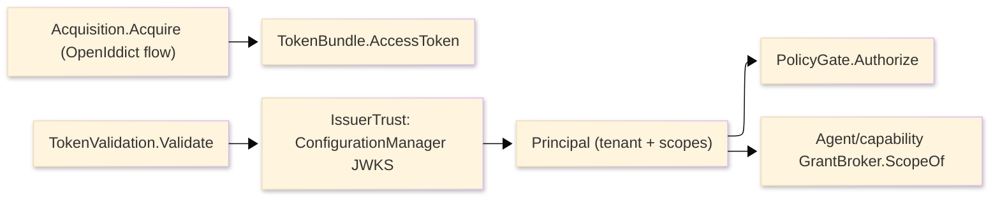

# [APPHOST_IDENTITY_AND_TRUST]

One authentication boundary for the runtime spine: a per-issuer OIDC trust anchor folds discovery and rotating JWKS into the validation policy, an inbound-token rail validates a compact JWT to one canonical `Principal`, a flow-discriminated acquisition surface obtains machine-to-machine and device credentials over the relying-party client, and a claims-policy gate evaluates a `Principal` against an `AuthorizationPolicy` with no HTTP pipeline. The page produces the one validated `Principal` whose `TenantContext` the `Agent/capability#GRANT_BROKER` `ScopeOf` reads — authentication owns *who*, the grant broker owns *what* and *how much* — and it owns the issuer-trust registry, the token-validation rail, the credential-acquisition flow family, and the policy gate. The page additionally owns the `#PRINCIPAL` ambient slot every in-process caller reads, the `TokenLease` expiry/refresh custody over the acquired bundle, and the `PolicyDescriptor` `[SmartEnum]` naming every authorization requirement as a row. It consumes `TenantContext`, `CorrelationId`, `ClockPolicy`, `ReceiptSinkPort`, `DataClassification`, the resilient `HttpClient` seam from `Wire/outbound`, and the `CredentialPem` material `Runtime/secrets#CREDENTIAL_PEM` admits under the `Runtime/secrets#SECRET_LEASE` custody, minting no eighth port. `Microsoft.IdentityModel.JsonWebTokens` owns the JWT engine, `Microsoft.IdentityModel.Tokens` the validation contract and key hierarchy, `Microsoft.IdentityModel.Protocols.OpenIdConnect` the discovery leg, `OpenIddict.Client` the acquisition leg, and `Microsoft.AspNetCore.Authorization` the ABAC evaluation core; Thinktecture owns the vocabularies and LanguageExt the rails.

## [01]-[INDEX]

- [01]-[ISSUER_TRUST]: Per-issuer OIDC discovery anchor — refreshing JWKS configuration, last-known-good fallback, and protocol-invariant validation.
- [02]-[TOKEN_VALIDATION]: Inbound JWT validation rail folding one handler result to the canonical `Principal`.
- [03]-[PRINCIPAL]: The one validated identity record and its ambient slot every in-process caller reads.
- [04]-[CREDENTIAL_FLOW]: Flow-discriminated token acquisition and the `TokenLease` expiry/refresh custody.
- [05]-[POLICY_GATE]: `PolicyDescriptor` rows over the standalone ABAC core.
- [06]-[TS_PROJECTION]: Principal, issuer, and policy-verdict wire shapes the dashboard consumes.

## [02]-[ISSUER_TRUST]

- Owner: `ComparerAccessors.StringOrdinal` the ordinal comparer accessor; `IssuerTrust` the per-issuer anchor binding one `ConfigurationManager<OpenIdConnectConfiguration>` and one `OpenIdConnectProtocolValidator` to a `ValidationParameters` policy; `TrustRegistry` the frozen issuer-to-anchor catalog with the alternate-lookup probe; `ProtocolContext` the interactive-flow nonce/hash validation input.
- Cases: each admitted issuer is one `IssuerTrust` row keyed by its issuer URI; the anchor's `ConfigurationManager` carries the discovery `MetadataAddress`, the `AutomaticRefreshInterval`/`RefreshInterval` rotation cadence, and the `UseLastKnownGoodConfiguration` resilience toggle.
- Entry: `Anchor(string issuer, string metadataAddress, HttpClient resilient, DeadlineClass refresh)` constructs one anchor — a `ConfigurationManager<OpenIdConnectConfiguration>(metadataAddress, new OpenIdConnectConfigurationRetriever(), new HttpDocumentRetriever(resilient), new OpenIdConnectConfigurationValidator())` wired into one `ValidationParameters` whose `ConfigurationManager` slot owns the rotating keys; `Resolve(string issuer)` returns `Option<IssuerTrust>` through the ordinal probe; `Refresh(IssuerTrust anchor)` flags the next read on a signature-key-not-found through `RequestRefresh`.
- Auto: the anchor leaves `ValidationParameters.SigningKeys` unset and assigns the `ConfigurationManager` slot, so the validators pull `IssuerSigningKeys` from the refreshed `JsonWebKeySet` rather than a pinned key, and a JWKS rotation lands on the next validate with no host edit; `UseLastKnownGoodConfiguration` is on so a transient discovery-fetch failure falls back to the last-good document for `LastKnownGoodLifetime` rather than failing validation; the validating `ConfigurationManager<T>` ctor overload wires the `OpenIdConnectConfigurationValidator` so a discovery document without sufficient signing keys is rejected before it is trusted; the `OpenIdConnectProtocolValidator` checks the OIDC invariants bare JWT validation does not — the `nonce` round-trip, the `c_hash`/`at_hash` binding of the id-token to the authorization code and access token, and the `state` correlation — for the interactive challenge legs the `CREDENTIAL_FLOW` acquisition raises; the discovery `HttpClient` is the `Wire/outbound` resilient/service-discovery handler, never a bare client, and `RequireHttps` stays on.
- Receipt: an issuer admission logs one `SpineLog` event in the 1000-1099 EVENT stride (`FaultBand.SpineEvents`) carrying the issuer key and the resolved `JwksUri`; the refresh advance rides the same event stream, never a parallel discovery receipt.
- Packages: Microsoft.IdentityModel.Protocols.OpenIdConnect, Microsoft.IdentityModel.Protocols, Microsoft.IdentityModel.Tokens, Thinktecture.Runtime.Extensions, LanguageExt.Core, BCL inbox
- Growth: one issuer is one `IssuerTrust` row; a per-issuer rotation-cadence retune is the row's `AutomaticRefreshInterval`/`RefreshInterval` column; a pinned-metadata offline issuer is one `StaticConfigurationManager<OpenIdConnectConfiguration>` anchor variant, never a second registry; zero new surface.
- Boundary: the registry is the only OIDC-trust owner — a hand-rolled `.well-known` fetch, a hardcoded issuer endpoint or signing key, and a pinned `IssuerSigningKey` for a rotating provider are the deleted forms; the `ConfigurationManager<OpenIdConnectConfiguration>` is the single JWKS source assigned to every issuer's `ValidationParameters.ConfigurationManager`, so the discovery refresh and the token validation share one rotating-key cache, never two; the `OpenIdConnectConfigurationRetriever` here is the `IConfigurationRetriever<OpenIdConnectConfiguration>` that specializes the protocol-agnostic `ConfigurationManager<T>` at `Microsoft.IdentityModel.Protocols`, so the discovery leg and the validation leg meet at the refreshed configuration and the page constructs the manager directly rather than through an ASP.NET authentication handler; the protocol validator is the interactive-flow gate only — a non-interactive client-credentials draw carries no `nonce`/`c_hash` and skips it — so the validator runs exactly where the OIDC spec demands it and nowhere else; the discovery capability flags (`RequirePushedAuthorizationRequests`, `TlsClientCertificateBoundAccessTokens`) read off `OpenIdConnectConfiguration` drive the `CREDENTIAL_FLOW` PAR/DPoP negotiation, never a hardcoded provider assumption.

```csharp signature
// --- [TYPES] ----------------------------------------------------------------------------

// --- [MODELS] ---------------------------------------------------------------------------
public sealed record IssuerTrust(
    string Issuer,
    ConfigurationManager<OpenIdConnectConfiguration> Discovery,
    OpenIdConnectProtocolValidator Protocol,
    TokenValidationParameters Validation) {
    public Task<OpenIdConnectConfiguration> Configuration(CancellationToken token) =>
        Discovery.GetConfigurationAsync(token);
    public void Refresh() => Discovery.RequestRefresh();
}

public sealed record ProtocolContext(string Nonce, string State, JsonWebToken IdToken, Option<string> AccessToken);

// --- [SERVICES] -------------------------------------------------------------------------
public sealed class TrustRegistry {
    readonly FrozenDictionary<string, IssuerTrust> byIssuer;
    readonly FrozenDictionary<string, IssuerTrust>.AlternateLookup<ReadOnlySpan<char>> probe;

    public TrustRegistry(IEnumerable<IssuerTrust> anchors) {
        byIssuer = anchors.ToFrozenDictionary(static a => a.Issuer, StringComparer.Ordinal);
        probe = byIssuer.GetAlternateLookup<ReadOnlySpan<char>>();
    }

    public Option<IssuerTrust> Resolve(string issuer) =>
        probe.TryGetValue(issuer, out var anchor) ? Optional(anchor) : None;
}

// --- [OPERATIONS] -----------------------------------------------------------------------
public static class IssuerAnchor {
    public static IssuerTrust Anchor(string issuer, string metadataAddress, HttpClient resilient, DeadlineClass refresh) {
        var discovery = new ConfigurationManager<OpenIdConnectConfiguration>(
            metadataAddress,
            new OpenIdConnectConfigurationRetriever(),
            new HttpDocumentRetriever(resilient) { RequireHttps = true },
            new OpenIdConnectConfigurationValidator()) {
            AutomaticRefreshInterval = refresh.Allotted.ToTimeSpan(),
            UseLastKnownGoodConfiguration = true,
        };
        return new IssuerTrust(
            issuer,
            discovery,
            new OpenIdConnectProtocolValidator { RequireNonce = true, RequireStateValidation = true },
            new TokenValidationParameters {
                ValidIssuer = issuer,
                ConfigurationManager = discovery,
                ValidateIssuerSigningKey = true,
                ValidateLifetime = true,
                MapInboundClaims = false,
            });
    }
}
```

## [03]-[TOKEN_VALIDATION]

- Owner: `Principal` the validated identity record interiors read; `IdentityFault` `[Union]` the closed fault family deriving its codes through `FaultBand.Identity`; `IdentityReceipt` the per-validation evidence record; `TokenValidation` the static admit-once validation rail over `JsonWebTokenHandler.ValidateTokenAsync`; one shared thread-safe `JsonWebTokenHandler` per registry.
- Cases: `IdentityFault` = Text | Untrusted | Malformed | Expired | SignatureRejected | ClaimMissing | ProtocolRejected | AcquisitionFailed | PolicyDenied — one case per admission-rejection cause, each breaking every consumer arm.
- Entry: `Validate(TrustRegistry registry, JsonWebTokenHandler handler, string token, ClockPolicy clocks)` returns `IO<Validation<IdentityFault, Principal>>` — reads the unverified issuer off the parsed token through `ReadJsonWebToken`, resolves the `IssuerTrust`, folds `ValidateTokenAsync(token, anchor.Validation)`, and branches on `TokenValidationResult.IsValid`: a valid result projects `ClaimsIdentity` to one `Principal`, an invalid result lifts `Exception` to the typed fault; `Interactive(IssuerTrust anchor, ProtocolContext context, Principal principal)` returns `Validation<IdentityFault, Principal>` chaining `OpenIdConnectProtocolValidator.ValidateAuthenticationResponse` after the base validation for an interactive-flow id-token, returning the already-validated `principal` on protocol success.
- Auto: the raw token is admitted EXACTLY ONCE at this rail — `Validate` is the boundary, and every interior reads the resulting `Principal`, never re-parsing a token or re-checking a signature; the handler is the modern `JsonWebTokenHandler`, never the legacy `JwtSecurityTokenHandler`, and `ValidateTokenAsync` is the async-first path whose `TokenValidationResult` carries `IsValid`/`ClaimsIdentity`/`Exception` so a failure lands on `Exception` and never throws from the validate path; `MapInboundClaims = false` keeps the raw JWT claim types (`sub`, `azp`, `scope`) the authorization requirements match; the claims project through the typed `JsonWebToken` registered properties (`Subject`, `Audiences`, `ValidTo`, `Issuer`) and `TryGetPayloadValue<T>`, never a string-keyed enumeration; the `TenantId` reads off the configured tenant claim and the scopes off the `scope` claim, both at the one projection, so a downstream reader sees a typed `Principal` and never a `Claim` bag; `ValidTo` seats `Principal.Expiry` as a NodaTime `Instant` so expiry is one comparable stamp on the `ClockPolicy` axis.
- Receipt: `IdentityReceipt` — subject, issuer, tenant, scope-set hash, expiry `Instant`, validation elapsed `Duration`, correlation id; fanned through `ReceiptSinkPort.Send` under the `Rasm.AppHost` package key; a `Suspended` validation logs the registry-derived fault code.
- Packages: Microsoft.IdentityModel.JsonWebTokens, Microsoft.IdentityModel.Tokens, LanguageExt.Core, NodaTime, Thinktecture.Runtime.Extensions, BCL inbox
- Growth: one rejection cause is one `IdentityFault` case; a new projected claim is one field on `Principal` read at the one projection; a richer validation policy is one column on `IssuerTrust.Validation`, never a second handler; zero new surface.
- Boundary: the rail is the suite's only token-validation owner — a per-endpoint signature check, a hand-rolled base64url JWT split, and a claims read before `IsValid` is confirmed are the deleted forms; the validation accumulates applicatively as `Validation<IdentityFault, Principal>` so an interactive id-token reports both a signature fault and a protocol-invariant fault in one pass rather than aborting on the first; the `Principal` is the one inbound-identity shape — its `TenantContext` is the value `Agent/capability#GRANT_BROKER` `ScopeOf` resolves a `GrantScope` from and `Runtime/ports` stamps on the causal frame, so authentication and the capability metering meet at the `Principal` and never share a token format; the validation never re-fetches JWKS itself — the `ConfigurationManager` on `ValidationParameters` owns the refresh, and `RefreshBeforeValidation` drives the forced re-fetch on a signature-key-not-found through `IssuerTrust.Refresh`, so a key rotation mid-flight recovers without a host edit; the identity store the `Principal` resolves against (tenant membership, revocation) is the `Rasm.Persistence` `TenantId` RLS leg consumed at the seam, never an AppHost-owned store.

```csharp signature
// --- [MODELS] ---------------------------------------------------------------------------
public readonly record struct IdentityReceipt(
    string Subject,
    string Issuer,
    string Tenant,
    string ScopeHash,
    Instant Expiry,
    Duration Elapsed,
    CorrelationId Correlation);

// --- [ERRORS] ---------------------------------------------------------------------------
[Union]
public abstract partial record IdentityFault : Expected, IValidationError<IdentityFault> {
    private IdentityFault(string detail, int code) : base(detail, code, None) { }
    public static IdentityFault Create(string message) => new Text(message);
    public sealed record Text : IdentityFault { public Text(string detail) : base(detail, FaultBand.Identity.Code(0)) { } }
    public sealed record Untrusted : IdentityFault { public Untrusted(string issuer) : base(issuer, FaultBand.Identity.Code(1)) { } }
    public sealed record Malformed : IdentityFault { public Malformed(string detail) : base(detail, FaultBand.Identity.Code(2)) { } }
    public sealed record Expired : IdentityFault { public Expired(string detail) : base(detail, FaultBand.Identity.Code(3)) { } }
    public sealed record SignatureRejected : IdentityFault { public SignatureRejected(string detail) : base(detail, FaultBand.Identity.Code(4)) { } }
    public sealed record ClaimMissing : IdentityFault { public ClaimMissing(string claim) : base(claim, FaultBand.Identity.Code(5)) { } }
    public sealed record ProtocolRejected : IdentityFault { public ProtocolRejected(string detail) : base(detail, FaultBand.Identity.Code(6)) { } }
    public sealed record AcquisitionFailed : IdentityFault { public AcquisitionFailed(string detail) : base(detail, FaultBand.Identity.Code(7)) { } }
    public sealed record PolicyDenied : IdentityFault { public PolicyDenied(string detail) : base(detail, FaultBand.Identity.Code(8)) { } }
}

// --- [OPERATIONS] -----------------------------------------------------------------------
public static class TokenValidation {
    public static IO<Validation<IdentityFault, Principal>> Validate(TrustRegistry registry, JsonWebTokenHandler handler, string token, ClockPolicy clocks) =>
        handler.CanReadToken(token)
            ? registry.Resolve(handler.ReadJsonWebToken(token).Issuer).Match(
                Some: anchor => IO.liftAsync(async () => await handler.ValidateTokenAsync(token, anchor.Validation))
                    .Map(result => Project(result, anchor.Issuer, clocks.Now)),
                None: () => IO.pure(Validation<IdentityFault, Principal>.Fail(new IdentityFault.Untrusted(handler.ReadJsonWebToken(token).Issuer))))
            : IO.pure(Validation<IdentityFault, Principal>.Fail(new IdentityFault.Malformed(nameof(JsonWebTokenHandler.CanReadToken))));

    static Validation<IdentityFault, Principal> Project(TokenValidationResult result, string issuer, Instant now) =>
        result.IsValid && result.SecurityToken is JsonWebToken jwt
            ? jwt.TryGetPayloadValue<string>("tenant", out var tenant)
                ? Success<IdentityFault, Principal>(new Principal(
                    jwt.Subject, issuer, TenantContext.Of(TenantId.Create(tenant)),
                    jwt.GetPayloadValue<string[]>("scope").ToFrozenSet(StringComparer.Ordinal),
                    Instant.FromDateTimeUtc(jwt.ValidTo), result.ClaimsIdentity))
                : Fail<IdentityFault, Principal>(new IdentityFault.ClaimMissing("tenant"))
            : Fail<IdentityFault, Principal>(Classify(result.Exception));

    static IdentityFault Classify(Exception? exception) => exception switch {
        SecurityTokenExpiredException ex => new IdentityFault.Expired(ex.Message),
        SecurityTokenInvalidSignatureException ex => new IdentityFault.SignatureRejected(ex.Message),
        SecurityTokenInvalidIssuerException ex => new IdentityFault.Untrusted(ex.Message),
        { } ex => new IdentityFault.Malformed(ex.Message),
        null => new IdentityFault.Text(nameof(TokenValidationResult.IsValid)),
    };

    public static Validation<IdentityFault, Principal> Interactive(IssuerTrust anchor, ProtocolContext context, Principal principal) =>
        Try(() => { anchor.Protocol.ValidateAuthenticationResponse(new OpenIdConnectProtocolValidationContext {
            Nonce = context.Nonce, State = context.State, ValidatedIdToken = context.IdToken,
        }); return principal; })
        .Match(Succ: Success<IdentityFault, Principal>, Fail: ex => Fail<IdentityFault, Principal>(new IdentityFault.ProtocolRejected(ex.Message)));
}
```

## [04]-[PRINCIPAL]

- Owner: `Principal` — the ONE validated inbound-identity record every interior reads; `IdentityPrincipal` the ambient slot mirroring `TenantContext.Ambient` so deferred and marshalled work restores the caller identity without threading a parameter through every signature.
- Entry: `IdentityPrincipal.Current` reads the ambient principal (`Option`-shaped — an unauthenticated in-process caller is `None`, never a synthetic anonymous principal); `Stamp(Principal principal)` seats the slot and returns one idempotent `IDisposable` scope on the explicit scope stack — top-only disposal, a non-top disposal refused, the prior value restored LIFO — the `TenantContext.Stamp` restoring-scope discipline with the stack enforced.
- Packages: LanguageExt.Core, NodaTime, Thinktecture.Runtime.Extensions, BCL inbox
- Growth: a new projected claim is one field on `Principal` read at the one validation projection; zero new surface.
- Boundary: the `Principal` is the one inbound-identity shape — its `TenantContext` is the value `Agent/capability#GRANT_BROKER` `ScopeOf` resolves a `GrantScope` from and `Runtime/ports` stamps on the causal frame, so authentication, authorization-policy, and capability-metering are three ordered seams over this one record; the Persistence far end maps the richer `Principal` onto its own `StoreActor` at the port boundary (`Element/graph`) — the `Principal` never crosses down; the ambient slot carries the VALIDATED record only — a raw token, a `ClaimsPrincipal`, or a half-projected identity in the slot is the deleted form; stamping is scoped and restored LIFO so a marshalled continuation reads its caller's principal, never a leaked ambient.

```csharp signature
public sealed record Principal(
    string Subject,
    string Issuer,
    TenantContext Tenant,
    FrozenSet<string> Scopes,
    Instant Expiry,
    ClaimsIdentity Identity) {
    public string ScopeHash => string.Join(',', Scopes.Order(StringComparer.Ordinal));
    public bool Holds(string scope) => Scopes.Contains(scope);
    public bool Expired(Instant now) => now >= Expiry;
}

// The ambient identity slot: the validated Principal rides the runtime context exactly as the
// TenantContext does — an explicit scope stack restores it LIFO under top-only disposal,
// unauthenticated is None, never a synthetic anonymous.
public static class IdentityPrincipal {
    static readonly RuntimeContextSlot<Principal> Ambient = RuntimeContext.RegisterSlot<Principal>(nameof(Principal));
    static readonly RuntimeContextSlot<PrincipalScope> Scopes = RuntimeContext.RegisterSlot<PrincipalScope>(nameof(PrincipalScope));

    public static Option<Principal> Current => Optional(Ambient.Get());

    public static IDisposable Stamp(Principal principal) {
        Principal? prior = Ambient.Get();
        PrincipalScope? parent = Scopes.Get();
        var scope = new PrincipalScope(prior, parent);
        Ambient.Set(principal);
        Scopes.Set(scope);
        return scope;
    }

    private sealed class PrincipalScope(Principal? prior, PrincipalScope? parent) : IDisposable {
        private int disposed;

        public void Dispose() {
            if (Volatile.Read(ref disposed) != 0) return;
            if (!ReferenceEquals(Scopes.Get(), this))
                throw new InvalidOperationException("Principal scopes must be disposed in LIFO order.");
            if (Interlocked.Exchange(ref disposed, 1) != 0) return;
            Ambient.Set(prior);
            Scopes.Set(parent);
        }
    }
}
```

## [05]-[CREDENTIAL_FLOW]

- Owner: `GrantFlow` `[Union]` the acquisition-flow family discriminating the credential request; `TokenBundle` the acquired-token record interiors carry; `TokenLease` the expiry/refresh custody over the bundle — acquire-hold-refresh-retire as one lifecycle, the identity mirror of the `Runtime/secrets#SECRET_LEASE` custody; `DeviceChallenge` the device-flow challenge handle; `Acquisition` the static surface over the one resolved `OpenIddictClientService`.
- Cases: `GrantFlow` = ClientCredentials | Device | Refresh | Exchange — the machine-to-machine grant, the headless device-enrollment grant, the refresh grant, and the RFC 8693 delegation grant; device alone is a challenge-then-poll pair, the rest single-call.
- Entry: `Acquire(OpenIddictClientService client, GrantFlow flow)` returns `IO<Validation<IdentityFault, TokenBundle>>` — the fold maps each flow case to its `AuthenticateWith*Async` verb on the one client service and projects the result bundle; `Challenge(OpenIddictClientService client, string registrationId)` returns `IO<Validation<IdentityFault, DeviceChallenge>>` — runs `ChallengeUsingDeviceAsync` to the user/device code and verification URI the operator presents before `Acquire(GrantFlow.Device)` polls.
- Auto: the acquisition is one polymorphic fold over the flow case, never a per-flow service — `ClientCredentials` runs `AuthenticateWithClientCredentialsAsync`, `Device` runs `AuthenticateWithDeviceAsync` honoring the challenge `Interval`/`Timeout`, `Refresh` runs `AuthenticateWithRefreshTokenAsync`, and `Exchange` runs `AuthenticateWithTokenExchangeAsync`, each discriminating the registration by `RegistrationId`; PKCE, DPoP/mTLS token binding, and pushed authorization are negotiated automatically from the per-`OpenIddictClientRegistration` capability sets read off the discovery document, so the page sets no `CodeChallengeMethod` override in normal use; the acquired `TokenBundle` reads the typed `required` result members (`AccessToken`, `RefreshToken`, expiration) as the contract and treats the raw `OpenIddictResponse` as the audit surface; the client-assertion `SigningCredentials` the registration carries map from the `Runtime/secrets#CREDENTIAL_PEM` `CredentialPem` bundle the host admits once under the `SECRET_LEASE` custody, never re-loaded here.
- Receipt: an acquired bundle logs one `SpineLog` event carrying the registration id and the grant type; the `TokenLease` seats the refresh deadline as one `ScheduleEntry` on the `Runtime/time#SCHEDULE_PORT` scheduler at a policy fraction of the bundle lifetime, so a near-expiry bundle re-acquires through the `Refresh` flow ahead of expiry — never a reactive 401-retry loop — and a retired lease's late read answers `Expired`; DPoP token-binding inside the lease is a RECORDED GROWTH line — the OpenIddict/IdentityModel member surface proves via the catalogs before any fence claims it, and until then the lease is expiry/refresh custody with the registration-negotiated binding (PAR/mTLS) riding the provider capability sets.
- Packages: OpenIddict.Client, LanguageExt.Core, NodaTime, Thinktecture.Runtime.Extensions, BCL inbox
- Growth: one grant is one `GrantFlow` case breaking every acquire arm; a new bound-token method is one negotiated registration capability, never a page flag; a custom grant is one `GrantFlow.Exchange`-shaped case over `AuthenticateWithCustomGrantAsync`; zero new surface.
- Boundary: the acquisition surface is the suite's only credential-flow owner — a hand-rolled authorization-URL/PKCE/DPoP construction, a direct token-endpoint HTTP call, and a per-flow service are the deleted forms; the `OpenIddictClientService` is the single resolved service every flow discriminates by request record, and the registration is wired once at the app root through `services.AddOpenIddict().AddClient(...)`, so the page consumes the resolved service and never news up a flow handler; the acquired `TokenBundle.AccessToken` is the bearer the `Wire/outbound` hops carry and the `AspNetCore.HealthChecks.Uris` probe's `AddCustomHeader` bearer reads, so the host's outbound calls and authenticated health probes carry one acquired credential, never a re-acquired token per call site; introspection and revocation (`IntrospectTokenAsync`/`RevokeTokenAsync`) ride the same client service as the acquisition audit and logout legs, never a second OAuth surface; the device flow's verification URI crosses to the operator through the `Wire/companion` control service, never an AppHost-owned console.

```csharp signature
// --- [TYPES] ----------------------------------------------------------------------------
[Union(ConversionFromValue = ConversionOperatorsGeneration.None)]
public abstract partial record GrantFlow {
    private GrantFlow() { }
    public sealed record ClientCredentials(string RegistrationId, FrozenSet<string> Scopes) : GrantFlow;
    public sealed record Device(string RegistrationId, string DeviceCode, TimeSpan Interval, TimeSpan Timeout) : GrantFlow;
    public sealed record Refresh(string RegistrationId, string RefreshToken) : GrantFlow;
    public sealed record Exchange(string RegistrationId, string SubjectToken, string Audience) : GrantFlow;
}

// --- [MODELS] ---------------------------------------------------------------------------
public sealed record TokenBundle(
    string AccessToken,
    Option<string> RefreshToken,
    Instant ExpiresAt,
    FrozenSet<string> Scopes);

public sealed record DeviceChallenge(string UserCode, string DeviceCode, Uri VerificationUri, TimeSpan Interval, TimeSpan Timeout);

// The expiry/refresh custody: one lease per registration holds the live bundle, its refresh
// ScheduleEntry, and the refresh flow that re-acquires ahead of expiry. RefreshFraction is the
// policy value (refresh at 80% of lifetime); DPoP binding is the recorded growth line.
public sealed record TokenLease(string RegistrationId, TokenBundle Bundle, ScheduleEntry Refresh) {
    public const double RefreshFraction = 0.8d;

    public bool Live(Instant now) => now < Bundle.ExpiresAt;

    public static TokenLease Hold(string registrationId, TokenBundle bundle, ClockPolicy clocks, Func<IO<Unit>> refresh) =>
        new(registrationId, bundle,
            new ScheduleEntry(
                Key: $"token-refresh:{registrationId}",
                Spec: new OccurrenceSpec.Every((bundle.ExpiresAt - clocks.Now) * RefreshFraction),
                Deadline: DeadlineClass.HopTotal,
                Lease: None,
                Work: refresh));
}

// --- [OPERATIONS] -----------------------------------------------------------------------
public static class Acquisition {
    public static IO<Validation<IdentityFault, TokenBundle>> Acquire(OpenIddictClientService client, GrantFlow flow) =>
        IO.liftAsync(async () => await flow.Match(
            clientCredentials: async f => Bundle((await client.AuthenticateWithClientCredentialsAsync(
                new OpenIddictClientModels.ClientCredentialsAuthenticationRequest { RegistrationId = f.RegistrationId, Scopes = f.Scopes.ToList() })).AsResult()),
            device: async f => Bundle((await client.AuthenticateWithDeviceAsync(
                new OpenIddictClientModels.DeviceAuthenticationRequest { RegistrationId = f.RegistrationId, DeviceCode = f.DeviceCode, Interval = f.Interval, Timeout = f.Timeout })).AsResult()),
            refresh: async f => Bundle((await client.AuthenticateWithRefreshTokenAsync(
                new OpenIddictClientModels.RefreshTokenAuthenticationRequest { RegistrationId = f.RegistrationId, RefreshToken = f.RefreshToken })).AsResult()),
            exchange: async f => Bundle((await client.AuthenticateWithTokenExchangeAsync(
                new OpenIddictClientModels.TokenExchangeAuthenticationRequest { RegistrationId = f.RegistrationId, SubjectToken = f.SubjectToken, Resources = { f.Audience } })).AsResult())));

    public static IO<Validation<IdentityFault, DeviceChallenge>> Challenge(OpenIddictClientService client, string registrationId) =>
        IO.liftAsync(async () => Guard(await client.ChallengeUsingDeviceAsync(
            new OpenIddictClientModels.DeviceChallengeRequest { RegistrationId = registrationId })))
            .Map(result => result.Map(r => new DeviceChallenge(r.UserCode, r.DeviceCode, r.VerificationUri, r.Interval, r.Timeout)));

    static Validation<IdentityFault, TokenBundle> Bundle((string Access, string? Refresh, DateTimeOffset? Expires, IEnumerable<string> Scopes) result) =>
        Success<IdentityFault, TokenBundle>(new TokenBundle(
            result.Access, Optional(result.Refresh),
            Instant.FromDateTimeOffset(result.Expires ?? DateTimeOffset.MaxValue),
            result.Scopes.ToFrozenSet(StringComparer.Ordinal)));
}
```

## [06]-[POLICY_GATE]

- Owner: `PolicyDescriptor` `[SmartEnum<string>]` — every authorization policy is a NAMED ROW carrying its composed `AuthorizationPolicy` value, so the policy vocabulary is closed, discoverable, and evidence-keyed rather than raw requirement spans at call sites; `PolicyVerdict` the evaluation outcome record; `PolicyGate` the static claims-policy surface over the injected `IAuthorizationService`.
- Entry: `Authorize(IAuthorizationService service, Principal principal, PolicyDescriptor policy, object resource)` returns `IO<Validation<IdentityFault, PolicyVerdict>>` — runs `AuthorizeAsync(principal.Identity, resource, policy.Policy)` over the standalone ABAC core and projects `AuthorizationResult.Succeeded` to a `PolicyVerdict` or `AuthorizationFailure.FailureReasons` to the typed `PolicyDenied` fault; `Policy(params ReadOnlySpan<IAuthorizationRequirement> requirements)` composes one immutable `AuthorizationPolicy` from a requirement span through the builder.
- Auto: the evaluation runs over `AddAuthorizationCore()` — the HTTP-coupled `AddAuthorization()` and middleware surface stay out of the host, so authorization is an injected `IAuthorizationService` capability evaluating a `ClaimsPrincipal`, a domain resource, and registered handlers with no `HttpContext`; the `Principal.Identity` is the `ClaimsIdentity` the validation rail projected, so the policy reads the same raw JWT claim types the token carried (`MapInboundClaims = false` keeps `scope`/`azp` un-remapped); a requirement is the built-in `ClaimsAuthorizationRequirement`/`OperationAuthorizationRequirement`/`AssertionRequirement` or one custom `IAuthorizationRequirement` paired with an `AuthorizationHandler<TRequirement>`, never a hand-rolled claim/role check; the verdict reads `AuthorizationResult.Succeeded` (non-null `Failure` exactly when `false` under `[MemberNotNullWhen]`) so the boolean and the nullable failure flow through the typed result without a throw.
- Receipt: the verdict rides the `IdentityReceipt` correlation — a denied policy stamps the registry-derived `PolicyDenied` fault code and the failed-requirement reasons; no parallel authorization receipt.
- Packages: Microsoft.AspNetCore.Authorization, LanguageExt.Core, Thinktecture.Runtime.Extensions, BCL inbox
- Growth: one access rule is one `IAuthorizationRequirement` plus its handler; a new policy is one `PolicyDescriptor` row composing its requirements through the builder; a resource-typed rule is the `AuthorizationHandler<TRequirement, TResource>` arity; zero new surface.
- Boundary: the policy gate is the suite's only claims-policy owner — a hand-rolled role check, an HTTP-pipeline authorization attribute, and a string-policy-name lookup where an explicit `AuthorizationPolicy` value serves are the deleted forms; the policy gate and the `Agent/capability#GRANT_BROKER` are distinct concerns layered in order — the gate answers *is this principal permitted to attempt the op* off claims, the broker answers *does the tenant's scope and budget admit the op* off cost, so a principal that passes the policy gate still meters every op through the broker and a denied policy never reaches the broker; the gate evaluates a `ClaimsPrincipal` the validation rail produced, so authentication, authorization-policy, and capability-metering are three ordered seams over the one `Principal`, never a merged predicate; the resource-bound rail routes through `PolicyDescriptor` rows and `OperationAuthorizationRequirement` — a raw requirement span at a call site and a string-policy-name lookup are both the deleted forms, so a policy edit is one row change and the verdict evidence keys on the row.

```csharp signature
// --- [TYPES] ----------------------------------------------------------------------------
// The closed policy vocabulary: each row NAMES a policy and carries its composed requirements —
// the raw IAuthorizationRequirement gate stays the mechanism, the row is the discoverable law.
[SmartEnum<string>]
[KeyMemberEqualityComparer<ComparerAccessors.StringOrdinal, string>]
[KeyMemberComparer<ComparerAccessors.StringOrdinal, string>]
public sealed partial class PolicyDescriptor {
    public static readonly PolicyDescriptor OperatorConsole = new("operator-console", PolicyGate.Policy(new ClaimsAuthorizationRequirement("scope", ["host.operate"])));
    public static readonly PolicyDescriptor AgentSession = new("agent-session", PolicyGate.Policy(new ClaimsAuthorizationRequirement("scope", ["agent.invoke"])));
    public static readonly PolicyDescriptor FleetConduct = new("fleet-conduct", PolicyGate.Policy(new ClaimsAuthorizationRequirement("scope", ["fleet.roll"])));

    public AuthorizationPolicy Policy { get; }
}

// --- [MODELS] ---------------------------------------------------------------------------
public readonly record struct PolicyVerdict(string Subject, bool Granted, Seq<string> FailedRequirements) {
    public static PolicyVerdict Of(string subject, AuthorizationResult result) =>
        new(subject, result.Succeeded,
            result.Succeeded ? Seq<string>() : result.Failure.FailedRequirements.AsIterable().Map(static r => r.GetType().Name).ToSeq());
}

// --- [OPERATIONS] -----------------------------------------------------------------------
public static class PolicyGate {
    public static AuthorizationPolicy Policy(params ReadOnlySpan<IAuthorizationRequirement> requirements) =>
        Iterable<IAuthorizationRequirement>.FromSpan(requirements)
            .Fold(new AuthorizationPolicyBuilder(), static (builder, requirement) => builder.AddRequirements(requirement))
            .Build();

    public static IO<Validation<IdentityFault, PolicyVerdict>> Authorize(IAuthorizationService service, Principal principal, PolicyDescriptor policy, object resource) =>
        IO.liftAsync(async () => await service.AuthorizeAsync(new ClaimsPrincipal(principal.Identity), resource, policy.Policy))
            .Map(result => result.Succeeded
                ? Success<IdentityFault, PolicyVerdict>(PolicyVerdict.Of(principal.Subject, result))
                : Fail<IdentityFault, PolicyVerdict>(new IdentityFault.PolicyDenied(
                    string.Join(';', result.Failure.FailureReasons.Select(static r => r.Message)))));
}
```



## [07]-[TS_PROJECTION]

- Owner: `PrincipalWire`, `IssuerTrustWire`, and `PolicyVerdictWire` transcribe the validated identity, the issuer-trust state, and the authorization verdict the dashboard ingests; the token bundle never crosses the wire.
- Packages: BCL inbox
- Growth: one claim row on the principal, one issuer field, or one verdict field, zero new surface.
- Boundary: the access token and refresh token never cross the wire — only the validated `Principal` projection (subject, tenant, scopes, expiry) and the trust/verdict state cross, so a secret never leaves the host; instants cross as extended-ISO text; the issuer key crosses as the issuer URI string; scopes cross as a string array; the policy verdict crosses as a granted flag plus the failed-requirement names, mirroring `PolicyVerdict`; a `null` failed-requirement list is the granted case.

```ts contract
interface PrincipalWire {
  readonly subject: string;
  readonly issuer: string;
  readonly tenant: string;
  readonly scopes: readonly string[];
  readonly expiry: string;
}

interface IssuerTrustWire {
  readonly issuer: string;
  readonly jwksUri: string;
  readonly lastRefresh: string;
  readonly lastKnownGood: boolean;
}

interface PolicyVerdictWire {
  readonly subject: string;
  readonly granted: boolean;
  readonly failedRequirements: readonly string[];
}
```

## [08]-[RESEARCH]

- [TENANT_CLAIM]: the `tenant` payload claim the `Project` fold reads to mint `TenantContext` resolves against the issued-token claim schema the identity provider stamps — the claim name and the scope-claim shape (`scope` space-delimited string vs `scp` array) settle against the provider's token format before the projection finalizes; the `Principal.TenantContext` is the value `Agent/capability#GRANT_BROKER` `ScopeOf` and `Runtime/ports` causal-frame stamping consume.
- [SIGNING_MATERIAL]: the client-assertion `SigningCredentials` the `OpenIddictClientRegistration` carries map from the `Runtime/secrets#CREDENTIAL_PEM` `CredentialPem` bundle the host admits once — the `X509SigningCredentials` vs `RsaSecurityKey` form and the registration-time `AddSigningCredentials`/`AddSigningCertificate` wiring confirm against the app-root OpenIddict registration the `Wire/companion` control host owns; the post-quantum `MlDsaSecurityKey` (FIPS-204, net10 BCL `MLDsa`) is the forward signing path when a provider advertises it.
- [IDENTITY_STORE]: the tenant-membership and revocation read the `Principal` resolves against is the `Rasm.Persistence` identity store under the `TenantId` RLS predicate (`Agent/identity ⇄ csharp:Rasm.Persistence`), consumed at the seam and never an AppHost-owned store; the introspection leg (`OpenIddictClientService.IntrospectTokenAsync`) is the active-revocation check against the provider for a long-lived token the local validation cannot otherwise revoke.
