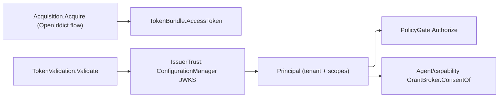

# [APPHOST_IDENTITY_AND_TRUST]

One authentication boundary for the runtime spine: a per-issuer OIDC trust anchor folds discovery, rotating JWKS, and the issuer's own claim dialect into the validation policy, an inbound-token rail validates a compact JWT to one canonical `Principal` whose tenant RESOLVES against the boot-minted roster, a flow-discriminated acquisition surface obtains machine-to-machine and device credentials over the relying-party client under one expiry/refresh custody, and a claims-policy gate evaluates a `Principal` against an `AuthorizationPolicy` with no HTTP pipeline. This page produces the one validated `Principal` whose `TenantContext` the `Agent/capability#GRANT_BROKER` `ConsentOf` reads — authentication owns *who*, the grant broker owns *what* and *how much* — and it owns the issuer-trust registry, the token-validation rail, the credential-acquisition flow family, the relying-party registration that flow consumes, and the policy gate. Owned axes also cover the `#PRINCIPAL` ambient slot every in-process caller reads, the `TokenLease` expiry/refresh custody over the acquired bundle, the provider-side revocation read, and the `PolicyDescriptor` `[SmartEnum]` naming every authorization requirement as a row. It consumes `TenantContext`, `CorrelationId`, `ClockPolicy`, `ReceiptSinkPort`, `DataClassification`, the resilient `HttpClient` seam from `Wire/outbound`, and the `CredentialPem` material `Runtime/secrets#CREDENTIAL_PEM` admits under the `Runtime/secrets#SECRET_LEASE` custody, minting no eighth port. `Microsoft.IdentityModel.JsonWebTokens` owns the JWT engine, `Microsoft.IdentityModel.Tokens` the validation contract and key hierarchy, `Microsoft.IdentityModel.Protocols.OpenIdConnect` the discovery leg, `OpenIddict.Client` the acquisition leg, and `Microsoft.AspNetCore.Authorization` the ABAC evaluation core; Thinktecture owns the vocabularies and LanguageExt the rails.

## [01]-[INDEX]

- [02]-[ISSUER_TRUST]: Per-issuer OIDC discovery anchor — refreshing JWKS configuration, last-known-good fallback, and protocol-invariant validation.
- [03]-[TOKEN_VALIDATION]: Inbound JWT validation rail folding one handler result to the canonical `Principal`.
- [04]-[PRINCIPAL]: One validated identity record and its ambient slot every in-process caller reads.
- [05]-[CREDENTIAL_FLOW]: Flow-discriminated token acquisition and the `TokenLease` expiry/refresh custody.
- [06]-[POLICY_GATE]: `PolicyDescriptor` rows over the standalone ABAC core.
- [07]-[TS_PROJECTION]: Principal, issuer, and policy-verdict wire shapes the dashboard consumes.

## [02]-[ISSUER_TRUST]

- Owner: `ComparerAccessors.StringOrdinal` the ordinal comparer accessor; `ScopeShape` `[SmartEnum<string>]` the per-issuer scope-claim dialect; `IssuerTrust` the per-issuer anchor binding one `ConfigurationManager<OpenIdConnectConfiguration>`, one `OpenIdConnectProtocolValidator`, and the issuer's own claim dialect to a `TokenValidationParameters` policy; `TrustRegistry` the frozen issuer-to-anchor catalog with the alternate-lookup probe; `ProtocolContext` the interactive-flow nonce/hash validation input.
- Cases: each admitted issuer is one `IssuerTrust` row keyed by its issuer URI, carrying its tenant-claim name and its scope-claim name and shape; the anchor's `ConfigurationManager` carries the discovery `MetadataAddress`, the `AutomaticRefreshInterval`/`RefreshInterval` rotation cadence, and the `UseLastKnownGoodConfiguration` resilience toggle; 2 scope-shape rows — delimited, array.
- Entry: `Anchor(string issuer, string metadataAddress, HttpClient resilient, DeadlineClass refresh, Duration skew, FrozenSet<string> audiences, string tenantClaim, string scopeClaim, ScopeShape shape)` constructs one anchor — a `ConfigurationManager<OpenIdConnectConfiguration>(metadataAddress, new OpenIdConnectConfigurationRetriever(), new HttpDocumentRetriever(resilient), new OpenIdConnectConfigurationValidator())` wired into one `TokenValidationParameters` whose `ConfigurationManager` slot owns the rotating keys; `Resolve(string issuer)` returns `Option<IssuerTrust>` through the ordinal probe; `IssuerTrust.Refresh()` flags the next read on a signature-key-not-found through `RequestRefresh`.
- Auto: the anchor leaves `IssuerSigningKeys` unset and assigns the `ConfigurationManager` slot, so the validators pull the keys from the refreshed `JsonWebKeySet` rather than a pinned key, and a JWKS rotation lands on the next validate with no host edit; `UseLastKnownGoodConfiguration` is on at the manager AND `ValidateWithLKG` at the parameters, because the manager's fallback document only reaches validation when the validators opt into reading it — the toggle alone leaves the resilience claim with no consumer; `RefreshBeforeValidation` forces the re-fetch on a signature-key-not-found so a mid-flight rotation recovers inside the one validate rather than through a caller's retry; `ValidAudiences` and `ClockSkew` are set deliberately at every row, an unbound audience admitting a token minted for another relying party and a default skew being a policy the host never chose; the tenant-claim name and the scope-claim name and shape are ROW columns because no provider is pinned — RFC 8693 §4.2 and RFC 9068 §2.2.3 both spell `scope` as a space-delimited string and RFC 9068 §7.2.1 registers no array twin, so the delimited row is the conforming default and the array row an opt-in a divergent provider earns, and reading the array form off a conforming token binds no shape at all; the validating `ConfigurationManager<T>` ctor overload wires the `OpenIdConnectConfigurationValidator` so a discovery document without sufficient signing keys is rejected before it is trusted; the `OpenIdConnectProtocolValidator` checks the OIDC invariants bare JWT validation does not — the `nonce` round-trip, the `c_hash`/`at_hash` binding of the id-token to the authorization code and access token, and the `state` correlation — for the interactive challenge legs the `CREDENTIAL_FLOW` acquisition raises; the discovery `HttpClient` is the `Wire/outbound` resilient/service-discovery handler, never a bare client, and `RequireHttps` stays on.
- Receipt: an issuer admission logs one `SpineLog` event in the 1000-1099 EVENT stride (`FaultBand.SpineEvents`) carrying the issuer key and the resolved `JwksUri`; the refresh advance rides the same event stream, never a parallel discovery receipt.
- Packages: Microsoft.IdentityModel.Protocols.OpenIdConnect, Microsoft.IdentityModel.Protocols, Microsoft.IdentityModel.Tokens, Thinktecture.Runtime.Extensions, LanguageExt.Core, BCL inbox
- Growth: one issuer is one `IssuerTrust` row; a per-issuer rotation-cadence retune is the row's `AutomaticRefreshInterval`/`RefreshInterval` column; a new claim dialect is one `ScopeShape` row carrying its reader; a pinned-metadata offline issuer is one `StaticConfigurationManager<OpenIdConnectConfiguration>` anchor variant, never a second registry; zero new surface.
- Boundary: the registry is the only OIDC-trust owner — a hand-rolled `.well-known` fetch, a hardcoded issuer endpoint or signing key, and a pinned `IssuerSigningKey` for a rotating provider are the deleted forms; the `ConfigurationManager<OpenIdConnectConfiguration>` is the single JWKS source assigned to every issuer's `ValidationParameters.ConfigurationManager`, so the discovery refresh and the token validation share one rotating-key cache, never two; the `OpenIdConnectConfigurationRetriever` here is the `IConfigurationRetriever<OpenIdConnectConfiguration>` that specializes the protocol-agnostic `ConfigurationManager<T>` at `Microsoft.IdentityModel.Protocols`, so the discovery leg and the validation leg meet at the refreshed configuration and the page constructs the manager directly rather than through an ASP.NET authentication handler; the protocol validator is the interactive-flow gate only — a non-interactive client-credentials draw carries no `nonce`/`c_hash` and skips it — so the validator runs exactly where the OIDC spec demands it and nowhere else; the discovery capability flags (`RequirePushedAuthorizationRequests`, `TlsClientCertificateBoundAccessTokens`) read off `OpenIdConnectConfiguration` drive the `CREDENTIAL_FLOW` PAR/DPoP negotiation, never a hardcoded provider assumption; the claim dialect is the ROW's and never the projection's, so a provider divergence is a column value and the fold that reads it stays one shape — a projection hardcoding either the claim name or the scope shape encodes one identity provider into the boundary every other provider must then match.

```csharp signature
// --- [TYPES] ----------------------------------------------------------------------------
// The scope claim's SHAPE is a per-issuer fact, never one answer: the delimited row is what the JWT
// access-token profile mandates and the array row is a provider divergence a row opts into. The reader
// rides the row because a shape read against the wrong form binds nothing and reports an empty scope set
// as an authorization outcome — the quietest possible way to lose every permission a token carried.
[SmartEnum<string>]
[KeyMemberEqualityComparer<ComparerAccessors.StringOrdinal, string>]
[KeyMemberComparer<ComparerAccessors.StringOrdinal, string>]
public sealed partial class ScopeShape {
    public static readonly ScopeShape Delimited = new("delimited", Split);
    public static readonly ScopeShape Array = new("array", Listed);

    [UseDelegateFromConstructor]
    public partial FrozenSet<string> Read(JsonWebToken token, string claim);

    static FrozenSet<string> Split(JsonWebToken token, string claim) =>
        token.TryGetPayloadValue<string>(claim, out var packed) && packed is { Length: > 0 }
            ? packed.Split(' ', StringSplitOptions.RemoveEmptyEntries | StringSplitOptions.TrimEntries).ToFrozenSet(StringComparer.Ordinal)
            : FrozenSet<string>.Empty;

    static FrozenSet<string> Listed(JsonWebToken token, string claim) =>
        token.TryGetPayloadValue<string[]>(claim, out var listed)
            ? listed.ToFrozenSet(StringComparer.Ordinal)
            : FrozenSet<string>.Empty;
}

// --- [MODELS] ---------------------------------------------------------------------------
// The claim dialect columns sit beside the crypto policy because both are per-issuer facts a row answers:
// one host federating two providers carries two rows, and neither the projection nor the registry learns
// either provider's spelling.
public sealed record IssuerTrust(
    string Issuer,
    ConfigurationManager<OpenIdConnectConfiguration> Discovery,
    OpenIdConnectProtocolValidator Protocol,
    TokenValidationParameters Validation,
    string TenantClaim,
    string ScopeClaim,
    ScopeShape Scopes) {
    public Task<OpenIdConnectConfiguration> Configuration(CancellationToken token) =>
        Discovery.GetConfigurationAsync(token);
    public void Refresh() => Discovery.RequestRefresh();
}

// The authorization code rides beside the access token because c_hash binds the id-token to the CODE and
// at_hash to the TOKEN: the validator checks whichever halves the context carries, so a context missing
// either one silently reduces the protocol check to the nonce and state it does carry.
public sealed record ProtocolContext(string Nonce, string State, JsonWebToken IdToken, Option<string> AccessToken, Option<string> Code);

// --- [SERVICES] -------------------------------------------------------------------------
public sealed class TrustRegistry {
    readonly FrozenDictionary<string, IssuerTrust> byIssuer;
    readonly FrozenDictionary<string, IssuerTrust>.AlternateLookup<ReadOnlySpan<char>> probe;

    public TrustRegistry(IEnumerable<IssuerTrust> anchors) {
        byIssuer = anchors.ToFrozenDictionary(static a => a.Issuer, StringComparer.Ordinal);
        probe = byIssuer.GetAlternateLookup<ReadOnlySpan<char>>();
    }

    public Option<IssuerTrust> Resolve(string issuer) =>
        probe.TryGetValue(issuer, out var anchor) ? Optional(anchor) : None;
}

// --- [OPERATIONS] -----------------------------------------------------------------------
public static class IssuerAnchor {
    public static IssuerTrust Anchor(
        string issuer,
        string metadataAddress,
        HttpClient resilient,
        DeadlineClass refresh,
        Duration skew,
        FrozenSet<string> audiences,
        string tenantClaim,
        string scopeClaim,
        ScopeShape shape) {
        var discovery = new ConfigurationManager<OpenIdConnectConfiguration>(
            metadataAddress,
            new OpenIdConnectConfigurationRetriever(),
            new HttpDocumentRetriever(resilient) { RequireHttps = true },
            new OpenIdConnectConfigurationValidator()) {
            AutomaticRefreshInterval = refresh.Allotted.ToTimeSpan(),
            RefreshInterval = refresh.Allotted.ToTimeSpan(),
            UseLastKnownGoodConfiguration = true,
        };
        return new IssuerTrust(
            issuer,
            discovery,
            new OpenIdConnectProtocolValidator { RequireNonce = true, RequireStateValidation = true },
            new TokenValidationParameters {
                ValidIssuer = issuer,
                ValidAudiences = audiences,
                ValidateAudience = true,
                ConfigurationManager = discovery,
                ValidateIssuerSigningKey = true,
                ValidateLifetime = true,
                MapInboundClaims = false,
                // The manager's last-known-good document reaches validation only when the validators opt in,
                // and a rotation mid-flight recovers inside the one validate only when the forced re-fetch is
                // armed — either left unset turns a stated resilience into a claim with no consumer.
                ValidateWithLKG = true,
                RefreshBeforeValidation = true,
                ClockSkew = skew.ToTimeSpan(),
            },
            tenantClaim,
            scopeClaim,
            shape);
    }
}
```

## [03]-[TOKEN_VALIDATION]

- Owner: `IdentityRuntime` the one dependency record every entry on this page threads; `Principal` the validated identity record interiors read; `IdentityFault` `[Union]` the closed fault family deriving its codes through `FaultBand.Identity`; `IdentityReceipt` the per-validation evidence record; `TokenValidation` the static admit-once validation rail over `JsonWebTokenHandler.ValidateTokenAsync`; one shared thread-safe `JsonWebTokenHandler` per runtime.
- Cases: `IdentityFault` = Text | Untrusted | Malformed | Expired | SignatureRejected | ClaimMissing | TenantUnknown | ProtocolRejected | AcquisitionFailed | PolicyDenied — one case per admission-rejection cause, each breaking every consumer arm.
- Entry: `Validate(IdentityRuntime runtime, string token, CorrelationId correlation)` returns `IO<Validation<IdentityFault, Principal>>` — parses the token ONCE, reads its unverified issuer, resolves the `IssuerTrust`, folds `ValidateTokenAsync(token, anchor.Validation)`, branches on `TokenValidationResult.IsValid`, RESOLVES the claimed tenant against the boot-minted roster, and fans one `IdentityReceipt` on either arm; `Interactive(IssuerTrust anchor, ProtocolContext context, Principal principal)` returns `Validation<IdentityFault, Principal>` chaining `OpenIdConnectProtocolValidator.ValidateAuthenticationResponse` after the base validation for an interactive-flow id-token, seating the access token and the authorization code so the `at_hash` and `c_hash` bindings are checked rather than skipped.
- Auto: the raw token is admitted EXACTLY ONCE at this rail — `Validate` is the boundary, it parses once and threads the parsed token through every arm rather than re-reading it per branch, and every interior reads the resulting `Principal`, never re-parsing a token or re-checking a signature; the handler is the modern `JsonWebTokenHandler`, never the legacy `JwtSecurityTokenHandler`, and `ValidateTokenAsync` is the async-first path whose `TokenValidationResult` carries `IsValid`/`ClaimsIdentity`/`Exception` so a failure lands on `Exception` and never throws from the validate path; `MapInboundClaims = false` keeps the raw JWT claim types the authorization requirements match; the claims project through the typed `JsonWebToken` registered properties (`Subject`, `Audiences`, `ValidTo`, `Issuer`) and the NON-throwing `TryGetPayloadValue<T>`, never a string-keyed enumeration and never the throwing read — a typed read for a shape the token does not carry raises out of a rail whose whole contract is not to; the tenant claim RESOLVES against the boot-minted tenant roster and never constructs a tenancy, because the roster is the admitted set and a claim naming a tenant outside it is exactly the refusal this boundary exists to make — a projection that mints a `TenantContext` from claim text admits every tenant any trusted issuer cares to name; the scopes read through the anchor's own `ScopeShape`, so one host federating a conforming provider and a divergent one reads both correctly from one fold; `ValidTo` seats `Principal.Expiry` as a NodaTime `Instant` so expiry is one comparable stamp on the `ClockPolicy` axis; every validation — admitted or refused — marks once and fans one `IdentityReceipt` through `ReceiptSinkPort.Send`, so a refused admission is evidence rather than a silence.
- Receipt: `IdentityReceipt` — subject, issuer, tenant, scope-set hash, expiry `Instant`, validation elapsed `Duration`, correlation id, and the registry-derived fault code a refusal carries; fanned through `ReceiptSinkPort.Send` under the `Rasm.AppHost` package key on both arms.
- Packages: Microsoft.IdentityModel.JsonWebTokens, Microsoft.IdentityModel.Tokens, LanguageExt.Core, NodaTime, Thinktecture.Runtime.Extensions, BCL inbox
- Growth: one rejection cause is one `IdentityFault` case; a new projected claim is one field on `Principal` read at the one projection off one more `IssuerTrust` claim-name column; a richer validation policy is one column on `IssuerTrust.Validation`, never a second handler; zero new surface.
- Boundary: the rail is the suite's only token-validation owner — a per-endpoint signature check, a hand-rolled base64url JWT split, and a claims read before `IsValid` is confirmed are the deleted forms; the validation accumulates applicatively as `Validation<IdentityFault, Principal>` so an interactive id-token reports both a signature fault and a protocol-invariant fault in one pass rather than aborting on the first; the `Principal` is the one inbound-identity shape — its `TenantContext` is the roster row `Agent/capability#GRANT_BROKER` `ConsentOf` resolves a disposition from and `Runtime/ports` stamps on the causal frame, so authentication and the capability metering meet at the `Principal` and never share a token format; the validation never re-fetches JWKS itself — the `ConfigurationManager` on the anchor's parameters owns the refresh and `RefreshBeforeValidation` drives the forced re-fetch on a signature-key-not-found, so a key rotation mid-flight recovers inside the one validate; tenant MEMBERSHIP is the boot roster and nothing else — the store's RLS predicate filters off the ambient tenant this boundary has already stamped, so it structurally answers "what may this tenant see" and never "is this subject a member of this tenant", and a page claiming a downstream identity store answers the membership question routes the one refusal it owns to a surface that cannot make it; REVOCATION is the issuer's answer, read through provider introspection at `CREDENTIAL_FLOW`, because a long-lived token the local validation cannot revoke is only revocable by asking who minted it.

```csharp signature
// --- [MODELS] ---------------------------------------------------------------------------
public readonly record struct IdentityReceipt(
    string Subject,
    string Issuer,
    string Tenant,
    string ScopeHash,
    Instant Expiry,
    Duration Elapsed,
    CorrelationId Correlation,
    Option<int> Fault);

// --- [SERVICES] -------------------------------------------------------------------------
// One dependency record for the whole boundary, exactly as every sibling plane threads one: the trust
// catalog, the one shared handler, the boot-minted tenant roster the projection resolves against, the
// relying-party client both acquisition and revocation ride, the standalone policy evaluator, and the
// clock and sink every receipt on the page needs. Four entries that each grew their own positional
// dependency list drift apart one parameter at a time.
public sealed record IdentityRuntime(
    TrustRegistry Trust,
    JsonWebTokenHandler Handler,
    Func<string, Option<TenantContext>> TenantOf,
    OpenIddictClientService Client,
    IAuthorizationService Authorization,
    ClockPolicy Clocks,
    ReceiptSinkPort Sink,
    JsonSerializerOptions Wire);

// --- [ERRORS] ---------------------------------------------------------------------------
[Union]
public abstract partial record IdentityFault : Expected, IValidationError<IdentityFault> {
    private IdentityFault(string detail, int code) : base(detail, code, None) { }
    public static IdentityFault Create(string message) => new Text(message);
    public sealed record Text : IdentityFault { public Text(string detail) : base(detail, FaultBand.Identity.Code(0)) { } }
    public sealed record Untrusted : IdentityFault { public Untrusted(string issuer) : base(issuer, FaultBand.Identity.Code(1)) { } }
    public sealed record Malformed : IdentityFault { public Malformed(string detail) : base(detail, FaultBand.Identity.Code(2)) { } }
    public sealed record Expired : IdentityFault { public Expired(string detail) : base(detail, FaultBand.Identity.Code(3)) { } }
    public sealed record SignatureRejected : IdentityFault { public SignatureRejected(string detail) : base(detail, FaultBand.Identity.Code(4)) { } }
    public sealed record ClaimMissing : IdentityFault { public ClaimMissing(string claim) : base(claim, FaultBand.Identity.Code(5)) { } }
    // A trusted issuer naming a tenant the boot roster never admitted is its own rejection cause: the token
    // is genuine and the tenancy is not, which neither an untrusted issuer nor a missing claim describes.
    public sealed record TenantUnknown : IdentityFault { public TenantUnknown(string tenant) : base(tenant, FaultBand.Identity.Code(6)) { } }
    public sealed record ProtocolRejected : IdentityFault { public ProtocolRejected(string detail) : base(detail, FaultBand.Identity.Code(7)) { } }
    public sealed record AcquisitionFailed : IdentityFault { public AcquisitionFailed(string detail) : base(detail, FaultBand.Identity.Code(8)) { } }
    public sealed record PolicyDenied : IdentityFault { public PolicyDenied(string detail) : base(detail, FaultBand.Identity.Code(9)) { } }
}

// --- [OPERATIONS] -----------------------------------------------------------------------
public static class TokenValidation {
    // The token parses ONCE and the parsed value threads every arm: re-reading it per failure branch pays
    // the parse again on exactly the paths already known to be failing.
    public static IO<Validation<IdentityFault, Principal>> Validate(IdentityRuntime runtime, string token, CorrelationId correlation) =>
        from mark in IO.lift(runtime.Clocks.Mark)
        from outcome in Admit(runtime, token)
        from _fanned in Fan(runtime, outcome, correlation, runtime.Clocks.Elapsed(mark))
        select outcome;

    static IO<Validation<IdentityFault, Principal>> Admit(IdentityRuntime runtime, string token) =>
        runtime.Handler.CanReadToken(token)
            ? runtime.Handler.ReadJsonWebToken(token) is var parsed && runtime.Trust.Resolve(parsed.Issuer) is { IsSome: true, Case: IssuerTrust anchor }
                ? IO.liftAsync(async () => await runtime.Handler.ValidateTokenAsync(token, anchor.Validation))
                    .Map(result => Project(result, anchor, runtime.TenantOf))
                : IO.pure(Validation<IdentityFault, Principal>.Fail(new IdentityFault.Untrusted(parsed.Issuer)))
            : IO.pure(Validation<IdentityFault, Principal>.Fail(new IdentityFault.Malformed(nameof(JsonWebTokenHandler.CanReadToken))));

    // Tenancy RESOLVES, never constructs: the roster is the boot-minted admitted set, so a claim naming a
    // tenant outside it refuses on the typed rail. Minting a tenancy from claim text instead admits every
    // tenant any trusted issuer cares to name — the boundary would authenticate and never authorize.
    static Validation<IdentityFault, Principal> Project(TokenValidationResult result, IssuerTrust anchor, Func<string, Option<TenantContext>> tenantOf) =>
        result.IsValid && result.SecurityToken is JsonWebToken jwt
            ? jwt.TryGetPayloadValue<string>(anchor.TenantClaim, out var claimed)
                ? tenantOf(claimed).Match(
                    Some: tenant => Success<IdentityFault, Principal>(new Principal(
                        jwt.Subject, anchor.Issuer, tenant,
                        anchor.Scopes.Read(jwt, anchor.ScopeClaim),
                        Instant.FromDateTimeUtc(jwt.ValidTo), result.ClaimsIdentity)),
                    None: () => Fail<IdentityFault, Principal>(new IdentityFault.TenantUnknown(claimed)))
                : Fail<IdentityFault, Principal>(new IdentityFault.ClaimMissing(anchor.TenantClaim))
            : Fail<IdentityFault, Principal>(Classify(result.Exception));

    // Both arms fan: a refused admission is the evidence an operator most needs, and a rail that records
    // only its successes reports a quiet boundary as a healthy one.
    static IO<Unit> Fan(IdentityRuntime runtime, Validation<IdentityFault, Principal> outcome, CorrelationId correlation, Duration elapsed) =>
        outcome.Match(
            Succ: principal => Send(runtime, new IdentityReceipt(
                principal.Subject, principal.Issuer, principal.Tenant.Slug, principal.ScopeHash,
                principal.Expiry, elapsed, correlation, None), correlation, principal.Tenant),
            Fail: faults => Send(runtime, new IdentityReceipt(
                string.Empty, string.Empty, TenantContext.Root.Slug, string.Empty,
                Instant.MinValue, elapsed, correlation, Some(faults.Head.Code)), correlation, TenantContext.Root));

    static IO<Unit> Send(IdentityRuntime runtime, IdentityReceipt receipt, CorrelationId correlation, TenantContext tenant) =>
        runtime.Sink.Send(correlation, tenant, TelemetrySource.AppHost.Key, InstrumentFan.IdentityKind,
            JsonSerializer.SerializeToElement(receipt, runtime.Wire));

    static IdentityFault Classify(Exception? exception) => exception switch {
        SecurityTokenExpiredException ex => new IdentityFault.Expired(ex.Message),
        SecurityTokenInvalidSignatureException ex => new IdentityFault.SignatureRejected(ex.Message),
        SecurityTokenInvalidIssuerException ex => new IdentityFault.Untrusted(ex.Message),
        { } ex => new IdentityFault.Malformed(ex.Message),
        null => new IdentityFault.Text(nameof(TokenValidationResult.IsValid)),
    };

    // Every half the context carries is seated: c_hash binds the id-token to the CODE and at_hash to the
    // TOKEN, so a context whose code and access token never reach the validation context reduces the
    // protocol check to the nonce and state alone while the page claims all four.
    public static Validation<IdentityFault, Principal> Interactive(IssuerTrust anchor, ProtocolContext context, Principal principal) =>
        Try(() => { anchor.Protocol.ValidateAuthenticationResponse(new OpenIdConnectProtocolValidationContext {
            Nonce = context.Nonce,
            State = context.State,
            ValidatedIdToken = context.IdToken,
            AuthorizationCode = context.Code.IfNone(string.Empty),
            ProtocolMessage = new OpenIdConnectMessage { AccessToken = context.AccessToken.IfNone(string.Empty) },
        }); return principal; })
        .Match(Succ: Success<IdentityFault, Principal>, Fail: ex => Fail<IdentityFault, Principal>(new IdentityFault.ProtocolRejected(ex.Message)));
}
```

## [04]-[PRINCIPAL]

- Owner: `Principal` — the ONE validated inbound-identity record every interior reads; `IdentityPrincipal` the ambient slot mirroring `TenantContext.Ambient` so deferred and marshalled work restores the caller identity without threading a parameter through every signature.
- Entry: `IdentityPrincipal.Current` reads the ambient principal (`Option`-shaped — an unauthenticated in-process caller is `None`, never a synthetic anonymous principal); `Stamp(Principal principal)` seats the slot and returns one idempotent `IDisposable` scope on the explicit scope stack — top-only disposal, a non-top disposal refused, the prior value restored LIFO — the `TenantContext.Stamp` restoring-scope discipline with the stack enforced.
- Packages: LanguageExt.Core, NodaTime, Thinktecture.Runtime.Extensions, BCL inbox
- Growth: a new projected claim is one field on `Principal` read at the one validation projection; zero new surface.
- Boundary: the `Principal` is the one inbound-identity shape — its `TenantContext` is the roster row `Agent/capability#GRANT_BROKER` `ConsentOf` resolves a disposition from and `Runtime/ports` stamps on the causal frame, so authentication, authorization-policy, and capability-metering are three ordered seams over this one record; the Persistence far end maps the richer `Principal` onto its own `StoreActor` at the port boundary (`Element/graph`) — the `Principal` never crosses down, and no store answers membership for it; the ambient slot carries the VALIDATED record only — a raw token, a `ClaimsPrincipal`, or a half-projected identity in the slot is the deleted form; stamping is scoped and restored LIFO so a marshalled continuation reads its caller's principal, never a leaked ambient.

```csharp signature
public sealed record Principal(
    string Subject,
    string Issuer,
    TenantContext Tenant,
    FrozenSet<string> Scopes,
    Instant Expiry,
    ClaimsIdentity Identity) {
    // The evaluator's own input shape, built once with the record: a fresh wrapper per authorization
    // allocates one identical principal per policy check on the hottest gate in the host.
    public ClaimsPrincipal Claims { get; } = new(Identity);

    // A CONTENT KEY, not a rendered join: a principal holding forty scopes addresses to the same thirty-two
    // characters a principal holding two does, so the wire column is bounded and the evidence stream groups
    // by a stable key instead of a string whose length tracks the grant's width.
    public string ScopeHash => ContentHash.Of(this, static (principal, chunks) => {
        foreach (var scope in principal.Scopes.Order(StringComparer.Ordinal))
            chunks.Append(Encoding.UTF8.GetBytes(scope));
    }).ToString("x32");
    public bool Holds(string scope) => Scopes.Contains(scope);
    public bool Expired(Instant now) => now >= Expiry;
}

// Ambient identity rides AsyncLocal exactly as the kernel tenancy slot does — a process-wide named slot
// registry faults on a second composition, and an app root beside a plugin ALC capsule is that second one.
// Scope stacks restore LIFO under top-only disposal; unauthenticated is None, never a synthetic
// anonymous.
public static class IdentityPrincipal {
    static readonly AsyncLocal<Principal?> Ambient = new();
    static readonly AsyncLocal<PrincipalScope?> Scopes = new();

    public static Option<Principal> Current => Optional(Ambient.Value);

    public static IDisposable Stamp(Principal principal) {
        Principal? prior = Ambient.Value;
        PrincipalScope? parent = Scopes.Value;
        var scope = new PrincipalScope(prior, parent);
        Ambient.Value = principal;
        Scopes.Value = scope;
        return scope;
    }

    private sealed class PrincipalScope(Principal? prior, PrincipalScope? parent) : IDisposable {
        private int disposed;

        public void Dispose() {
            if (Volatile.Read(ref disposed) != 0) return;
            if (!ReferenceEquals(Scopes.Value, this))
                throw new InvalidOperationException("Principal scopes must be disposed in LIFO order.");
            if (Interlocked.Exchange(ref disposed, 1) != 0) return;
            Ambient.Value = prior;
            Scopes.Value = parent;
        }
    }
}
```

## [05]-[CREDENTIAL_FLOW]

- Owner: `GrantFlow` `[Union]` the acquisition-flow family discriminating the credential request; `TokenBundle` the acquired-token record interiors carry; `TokenLease` the expiry/refresh custody over the bundle — acquire-hold-refresh-retire as one lifecycle, the identity mirror of the `Runtime/secrets#SECRET_LEASE` custody; `DeviceChallenge` the device-flow challenge handle; `Acquisition` the static surface over the one resolved `OpenIddictClientService`, owning the acquisition, the lease that holds it, the provider-side revocation read, and the relying-party registration all three ride.
- Cases: `GrantFlow` = ClientCredentials | Device | Refresh | Exchange — the machine-to-machine grant, the headless device-enrollment grant, the refresh grant, and the RFC 8693 delegation grant; device alone is a challenge-then-poll pair, the rest single-call.
- Entry: `Acquire(IdentityRuntime runtime, GrantFlow flow)` returns `IO<Validation<IdentityFault, TokenLease>>` — the fold maps each flow case to its `AuthenticateWith*Async` verb on the one client service, projects the result bundle, and HOLDS it as the lease carrying its own refresh schedule, so an acquired credential is never a bare bundle a caller renews by hand; `Challenge(IdentityRuntime runtime, string registrationId)` returns `IO<Validation<IdentityFault, DeviceChallenge>>` — runs `ChallengeUsingDeviceAsync` to the user/device code and verification URI the operator presents before `Acquire(GrantFlow.Device)` polls; `Active(IdentityRuntime runtime, string registrationId, string token)` returns `IO<Validation<IdentityFault, bool>>` — the provider-side revocation read.
- Auto: every verb on the relying-party client signals rejection by RAISING rather than answering a negative result, so each call brackets into the typed rail at ONE seat and no arm reads a result the provider never produced — an unconditionally successful projection over a throwing call reports every provider refusal as an exception escaping a rail whose whole contract is to carry it; the acquisition is one polymorphic fold over the flow case, never a per-flow service — `ClientCredentials` runs `AuthenticateWithClientCredentialsAsync`, `Device` runs `AuthenticateWithDeviceAsync` honoring the challenge `Interval`/`Timeout`, `Refresh` runs `AuthenticateWithRefreshTokenAsync`, and `Exchange` runs `AuthenticateWithTokenExchangeAsync`, each discriminating the registration by `RegistrationId`; PKCE, DPoP/mTLS token binding, and pushed authorization are negotiated automatically from the per-`OpenIddictClientRegistration` capability sets read off the discovery document, so the page sets no `CodeChallengeMethod` override in normal use; each flow arm projects its OWN result members into the one `TokenDraw` row the bundle folds — three arms name their product `AccessToken`/`AccessTokenExpirationDate` and the exchange arm names its `IssuedToken`/`IssuedTokenExpirationDate`, so a shared accessor asserted across the four reads a member three of them never declare — and the GRANTED scope set reads off the raw `OpenIddictResponse`, the only surface carrying it and the only way a provider narrowing the request is visible at all; the client-assertion `SigningCredentials` the registration carries map from the `Runtime/secrets#CREDENTIAL_PEM` `CredentialPem` bundle the host admits once under the `SECRET_LEASE` custody, never re-loaded here; the relying-party registration DECLARES here and the `Runtime/modules#BINDING_LEDGER` composition root is what folds it, so the flows resolve a service one declared ledger row bound rather than one a control host was said to own.
- Receipt: an acquired lease logs one `SpineLog` event carrying the registration id and the grant type; the `TokenLease` seats the refresh deadline as one `ScheduleEntry` on the `Runtime/time#SCHEDULE_PORT` scheduler at a policy fraction of the bundle lifetime, so a near-expiry bundle re-acquires through the `Refresh` flow ahead of expiry — never a reactive 401-retry loop — and a lease past its expiry answers `Expired` to `Live` before any hop carries its bearer.
- Packages: OpenIddict.Client, Microsoft.IdentityModel.Tokens, LanguageExt.Core, NodaTime, Thinktecture.Runtime.Extensions, BCL inbox
- Growth: one grant is one `GrantFlow` case breaking every acquire arm; a new bound-token method is one negotiated registration capability, never a page flag; a new signing algorithm is one `SigningCredentials` row on the registration; a custom grant is one `GrantFlow.Exchange`-shaped case over `AuthenticateWithCustomGrantAsync`; zero new surface.
- Boundary: the acquisition surface is the suite's only credential-flow owner — a hand-rolled authorization-URL/PKCE/DPoP construction, a direct token-endpoint HTTP call, and a per-flow service are the deleted forms; the `OpenIddictClientService` is the single resolved service every flow discriminates by request record, and THIS page owns the registration that binds it — no other surface in the suite declares an OpenIddict composition, so a registration named at a control host exists in no fence and the flows would consume a service nothing configured; the seat is `AddSigningCredentials` and never `AddSigningKey`, because that overload resolves its algorithm through a closed `RS256`/`HS256`/`ES256`/`ES384`/`ES512` ladder and refuses everything outside it, which makes the unchecked credentials overload the only door a post-quantum key enters through — and `MlDsaSecurityKey` and the `MlDsa44`/`MlDsa65`/`MlDsa87` algorithm constants ship on the pinned tokens package, so the arm is a real fence row rather than a forward-looking note; a key's live private half reads through `PrivateKeyStatus`, the obsolete boolean having been replaced; the acquired `TokenBundle.AccessToken` is the bearer the `Wire/outbound` hops carry and the `AspNetCore.HealthChecks.Uris` probe's `AddCustomHeader` bearer reads, so the host's outbound calls and authenticated health probes carry one acquired credential, never a re-acquired token per call site; introspection and revocation (`IntrospectTokenAsync`/`RevokeTokenAsync`) ride the same client service as the acquisition audit and logout legs, never a second OAuth surface, and the active read comes off `IntrospectionResult.IntrospectionResponse` rather than the result's `Principal` — that principal is documented empty for an inactive token, so a principal-shaped read reports every revoked token as merely claimless and the revocation check silently inverts; the device flow's verification URI crosses to the operator through the `Wire/companion` control service, never an AppHost-owned console.

```csharp signature
// --- [TYPES] ----------------------------------------------------------------------------
[Union(ConversionFromValue = ConversionOperatorsGeneration.None)]
public abstract partial record GrantFlow {
    private GrantFlow() { }
    public sealed record ClientCredentials(string RegistrationId, FrozenSet<string> Scopes) : GrantFlow;
    public sealed record Device(string RegistrationId, string DeviceCode, TimeSpan Interval, TimeSpan Timeout) : GrantFlow;
    public sealed record Refresh(string RegistrationId, string RefreshToken) : GrantFlow;
    public sealed record Exchange(string RegistrationId, string SubjectToken, string Audience) : GrantFlow;

    // Every case names its registration, so the family reads it once through the generated total dispatch
    // rather than each acquire arm re-projecting the column it already destructured.
    public string RegistrationId => this.Match(
        clientCredentials: static f => f.RegistrationId,
        device: static f => f.RegistrationId,
        refresh: static f => f.RegistrationId,
        exchange: static f => f.RegistrationId);
}

// --- [MODELS] ---------------------------------------------------------------------------
public sealed record TokenBundle(
    string AccessToken,
    Option<string> RefreshToken,
    Instant ExpiresAt,
    FrozenSet<string> Scopes);

public sealed record DeviceChallenge(string UserCode, string DeviceCode, Uri VerificationUri, TimeSpan Interval, TimeSpan Timeout);

// The four acquisition results carry the same four facts under three spellings — the exchange result names its
// product `IssuedToken`/`IssuedTokenExpirationDate` while the other three name theirs `AccessToken`/
// `AccessTokenExpirationDate` — so each arm projects its OWN members into this one row. Asserting a shared
// accessor across them instead reads a member three of the four records do not declare. The raw response rides
// along because the granted scope set is a typed member on none of them and lives only there.
public readonly record struct TokenDraw(string Access, string? Refresh, DateTimeOffset? Expires, OpenIddictResponse Response);

// Expiry and refresh take one custody: each registration's lease holds the live bundle, its refresh
// ScheduleEntry, and the refresh flow that re-acquires ahead of expiry. RefreshFraction is the
// policy value (refresh at 80% of lifetime); DPoP binding is the recorded growth line.
public sealed record TokenLease(string RegistrationId, TokenBundle Bundle, ScheduleEntry Refresh) {
    public const double RefreshFraction = 0.8d;

    // Read BEFORE any hop carries the bearer: a lease past its expiry answers dead rather than handing a
    // stale credential to an outbound call that would learn the same fact from a 401 one round trip later.
    public bool Live(Instant now) => now < Bundle.ExpiresAt;

    public static TokenLease Hold(string registrationId, TokenBundle bundle, ClockPolicy clocks, Func<IO<Unit>> refresh) =>
        new(registrationId, bundle,
            new ScheduleEntry(
                Key: $"token-refresh:{registrationId}",
                Spec: new OccurrenceSpec.Every((bundle.ExpiresAt - clocks.Now) * RefreshFraction),
                Deadline: DeadlineClass.HopTotal,
                Lease: None,
                Work: refresh));
}

// --- [OPERATIONS] -----------------------------------------------------------------------
public static class Acquisition {
    // Acquire hands back the LEASE, never a bare bundle: expiry and refresh are the acquired credential's own
    // lifecycle, and a caller handed the bundle alone must remember a renewal the credential itself knows the
    // deadline for. The held refresh closure re-enters this same entry under the Refresh flow, so one path
    // acquires and renews.
    public static IO<Validation<IdentityFault, TokenLease>> Acquire(IdentityRuntime runtime, GrantFlow flow) =>
        IO.liftAsync(() => Bracket(flow.RegistrationId, () => Drawn(runtime, flow)))
            .Map(drawn => drawn
                .Bind(raw => Bundle(flow.RegistrationId, raw))
                .Bind(bundle => Held(runtime, flow.RegistrationId, bundle)));

    // One polymorphic fold over the flow case, each arm reading the verb and the result members its own
    // request/result pair declares. The exchange arm states its subject-token type because the request member
    // is REQUIRED and RFC 8693 identifies the type by URN, and it seats the audience on `Audiences` rather
    // than initializing the null-defaulted `Resources` collection in place.
    static Task<TokenDraw> Drawn(IdentityRuntime runtime, GrantFlow flow) => flow.Match(
        clientCredentials: async f => {
            var drawn = await runtime.Client.AuthenticateWithClientCredentialsAsync(
                new OpenIddictClientModels.ClientCredentialsAuthenticationRequest {
                    RegistrationId = f.RegistrationId, Scopes = [.. f.Scopes],
                }).ConfigureAwait(false);
            return new TokenDraw(drawn.AccessToken, drawn.RefreshToken, drawn.AccessTokenExpirationDate, drawn.TokenResponse);
        },
        device: async f => {
            var drawn = await runtime.Client.AuthenticateWithDeviceAsync(
                new OpenIddictClientModels.DeviceAuthenticationRequest {
                    RegistrationId = f.RegistrationId, DeviceCode = f.DeviceCode, Interval = f.Interval, Timeout = f.Timeout,
                }).ConfigureAwait(false);
            return new TokenDraw(drawn.AccessToken, drawn.RefreshToken, drawn.AccessTokenExpirationDate, drawn.TokenResponse);
        },
        refresh: async f => {
            var drawn = await runtime.Client.AuthenticateWithRefreshTokenAsync(
                new OpenIddictClientModels.RefreshTokenAuthenticationRequest {
                    RegistrationId = f.RegistrationId, RefreshToken = f.RefreshToken,
                }).ConfigureAwait(false);
            return new TokenDraw(drawn.AccessToken, drawn.RefreshToken, drawn.AccessTokenExpirationDate, drawn.TokenResponse);
        },
        exchange: async f => {
            var drawn = await runtime.Client.AuthenticateWithTokenExchangeAsync(
                new OpenIddictClientModels.TokenExchangeAuthenticationRequest {
                    RegistrationId = f.RegistrationId,
                    SubjectToken = f.SubjectToken,
                    SubjectTokenType = OpenIddictConstants.TokenTypeIdentifiers.AccessToken,
                    Audiences = [f.Audience],
                }).ConfigureAwait(false);
            return new TokenDraw(drawn.IssuedToken, drawn.RefreshToken, drawn.IssuedTokenExpirationDate, drawn.TokenResponse);
        });

    public static IO<Validation<IdentityFault, DeviceChallenge>> Challenge(IdentityRuntime runtime, string registrationId) =>
        IO.liftAsync(() => Bracket(registrationId, async () => {
            var issued = await runtime.Client.ChallengeUsingDeviceAsync(
                new OpenIddictClientModels.DeviceChallengeRequest { RegistrationId = registrationId }).ConfigureAwait(false);
            // The challenge result names the code's remaining life `ExpiresIn`; `Timeout` is the POLLING
            // request's own member, so reading it off the challenge reads a member that record never declares.
            return new DeviceChallenge(issued.UserCode, issued.DeviceCode, issued.VerificationUri, issued.Interval, issued.ExpiresIn);
        }));

    // Revocation is the ISSUER's answer, and the `active` flag reads off the raw introspection response: the
    // result's principal is documented empty for an inactive token, so a principal-shaped read reports every
    // revoked token as merely claimless and inverts the one check this leg exists to make.
    public static IO<Validation<IdentityFault, bool>> Active(IdentityRuntime runtime, string registrationId, string token) =>
        IO.liftAsync(() => Bracket(registrationId, async () =>
            (bool?)(await runtime.Client.IntrospectTokenAsync(new OpenIddictClientModels.IntrospectionRequest {
                RegistrationId = registrationId,
                Token = token,
                TokenTypeHint = OpenIddictConstants.TokenTypeHints.AccessToken,
            })).IntrospectionResponse[OpenIddictConstants.Parameters.Active] is true));

    // ONE bracket for every verb on the client service, because every one of them RAISES on rejection rather
    // than answering a negative result: without it each arm reads a value the provider never produced and the
    // refusal escapes the typed rail the whole page is built on.
    static async Task<Validation<IdentityFault, T>> Bracket<T>(string registrationId, Func<Task<T>> call) {
        try { return Success<IdentityFault, T>(await call().ConfigureAwait(false)); }
        catch (OpenIddictExceptions.ProtocolException ex) {
            return Fail<IdentityFault, T>(new IdentityFault.AcquisitionFailed($"{registrationId}:{ex.Error}"));
        }
    }

    static Validation<IdentityFault, TokenLease> Held(IdentityRuntime runtime, string registrationId, TokenBundle bundle) =>
        Success<IdentityFault, TokenLease>(TokenLease.Hold(registrationId, bundle, runtime.Clocks,
            () => bundle.RefreshToken.Match(
                Some: refresh => Acquire(runtime, new GrantFlow.Refresh(registrationId, refresh)).Map(static _ => unit),
                None: () => IO.pure(unit))));

    // An empty access token is an acquisition FAILURE, not a bundle: an unconditionally successful projection
    // leaves the declared failure case unreachable and hands every hop a bearer with nothing in it.
    static Validation<IdentityFault, TokenBundle> Bundle(string registrationId, TokenDraw draw) =>
        string.IsNullOrEmpty(draw.Access)
            ? Fail<IdentityFault, TokenBundle>(new IdentityFault.AcquisitionFailed(registrationId))
            : Success<IdentityFault, TokenBundle>(new TokenBundle(
                draw.Access, Optional(draw.Refresh),
                Instant.FromDateTimeOffset(draw.Expires ?? DateTimeOffset.MaxValue),
                Granted(draw.Response)));

    // The GRANTED set, off the raw token response: RFC 8693 §4.2 spells `scope` as one space-delimited string
    // and RFC 9068 §2.2.3 mandates that form, so it splits exactly as the inbound rail's Delimited row splits.
    // Reading it is the only way a NARROWED grant — a provider issuing less than was asked — is ever visible,
    // and an absent parameter means the provider granted the request unchanged rather than granted nothing.
    static FrozenSet<string> Granted(OpenIddictResponse response) =>
        ((string?)response[OpenIddictConstants.Parameters.Scope] ?? string.Empty)
            .Split(' ', StringSplitOptions.RemoveEmptyEntries | StringSplitOptions.TrimEntries)
            .ToFrozenSet(StringComparer.Ordinal);
}

// --- [COMPOSITION] ----------------------------------------------------------------------
// The relying-party registration is THIS page's leg, folded by the Runtime/modules#BINDING_LEDGER root:
// nothing else in the suite declares an OpenIddict composition, so a registration named at a control host
// exists in no fence at all and every flow above would resolve a service nothing configured.
services.AddOpenIddict().AddClient(options => {
    options.AddRegistration(new OpenIddictClientRegistration {
        RegistrationId = registrationId,
        Issuer = new Uri(issuer),
        ClientId = clientId,
        // X509SigningCredentials because the CREDENTIAL_PEM decode terminates at X509Certificate2.CreateFromPem,
        // and the list is get-only — added to, never assigned.
        SigningCredentials = { new X509SigningCredentials(admitted.Certificate) },
    });

    // AddSigningCredentials, never AddSigningKey: that overload resolves its algorithm through a closed
    // RS256/HS256/ES256/ES384/ES512 ladder and refuses everything outside it, so the unchecked credentials
    // overload is the only door the post-quantum key enters through. Both the key type and the algorithm
    // constant ship on the pinned tokens package, which is what makes this a real arm rather than a note.
    options.AddSigningCredentials(new SigningCredentials(new MlDsaSecurityKey(mlDsa), SecurityAlgorithms.MlDsa65));
});
```

## [06]-[POLICY_GATE]

- Owner: `PolicyDescriptor` `[SmartEnum<string>]` — every authorization policy is a NAMED ROW carrying its composed `AuthorizationPolicy` value, so the policy vocabulary is closed, discoverable, and evidence-keyed rather than raw requirement spans at call sites; `PolicyVerdict` the evaluation outcome record; `PolicyGate` the static claims-policy surface over the injected `IAuthorizationService`.
- Entry: `Authorize(IdentityRuntime runtime, Principal principal, PolicyDescriptor policy, object resource)` returns `IO<Validation<IdentityFault, PolicyVerdict>>` — runs `AuthorizeAsync(principal.Identity, resource, policy.Policy)` over the standalone ABAC core and projects `AuthorizationResult.Succeeded` to a `PolicyVerdict` or `AuthorizationFailure.FailureReasons` to the typed `PolicyDenied` fault; `Policy(params ReadOnlySpan<IAuthorizationRequirement> requirements)` composes one immutable `AuthorizationPolicy` from a requirement span through the builder.
- Auto: the evaluation runs over `AddAuthorizationCore()` — the HTTP-coupled `AddAuthorization()` and middleware surface stay out of the host, so authorization is an injected `IAuthorizationService` capability evaluating a `ClaimsPrincipal`, a domain resource, and registered handlers with no `HttpContext`; the `Principal.Identity` is the `ClaimsIdentity` the validation rail projected, so the policy reads the same raw JWT claim types the token carried (`MapInboundClaims = false` keeps `scope`/`azp` un-remapped); a requirement is the built-in `ClaimsAuthorizationRequirement`/`OperationAuthorizationRequirement`/`AssertionRequirement` or one custom `IAuthorizationRequirement` paired with an `AuthorizationHandler<TRequirement>`, never a hand-rolled claim/role check; the verdict reads `AuthorizationResult.Succeeded` (non-null `Failure` exactly when `false` under `[MemberNotNullWhen]`) so the boolean and the nullable failure flow through the typed result without a throw.
- Receipt: the verdict rides the `IdentityReceipt` correlation — a denied policy stamps the registry-derived `PolicyDenied` fault code and the failed-requirement reasons; no parallel authorization receipt.
- Packages: Microsoft.AspNetCore.Authorization, LanguageExt.Core, Thinktecture.Runtime.Extensions, BCL inbox
- Growth: one access rule is one `IAuthorizationRequirement` and its handler; a new policy is one `PolicyDescriptor` row composing its requirements through the builder; a resource-typed rule is the `AuthorizationHandler<TRequirement, TResource>` arity; zero new surface.
- Boundary: the policy gate is the suite's only claims-policy owner — a hand-rolled role check, an HTTP-pipeline authorization attribute, and a string-policy-name lookup where an explicit `AuthorizationPolicy` value serves are the deleted forms; the policy gate and the `Agent/capability#GRANT_BROKER` are distinct concerns layered in order — the gate answers *is this principal permitted to attempt the op* off claims, the broker answers *does the tenant's scope and budget admit the op* off cost, so a principal that passes the policy gate still meters every op through the broker and a denied policy never reaches the broker; the gate evaluates a `ClaimsPrincipal` the validation rail produced, so authentication, authorization-policy, and capability-metering are three ordered seams over the one `Principal`, never a merged predicate; the resource-bound rail routes through `PolicyDescriptor` rows and `OperationAuthorizationRequirement` — a raw requirement span at a call site and a string-policy-name lookup are both the deleted forms, so a policy edit is one row change and the verdict evidence keys on the row.

```csharp signature
// --- [TYPES] ----------------------------------------------------------------------------
// Policy vocabulary closes here: each row NAMES a policy and carries its composed requirements —
// raw IAuthorizationRequirement gates stay the mechanism, and the row is the discoverable law.
[SmartEnum<string>]
[KeyMemberEqualityComparer<ComparerAccessors.StringOrdinal, string>]
[KeyMemberComparer<ComparerAccessors.StringOrdinal, string>]
public sealed partial class PolicyDescriptor {
    public static readonly PolicyDescriptor OperatorConsole = new("operator-console", PolicyGate.Policy(new ClaimsAuthorizationRequirement("scope", ["host.operate"])));
    public static readonly PolicyDescriptor AgentSession = new("agent-session", PolicyGate.Policy(new ClaimsAuthorizationRequirement("scope", ["agent.invoke"])));
    public static readonly PolicyDescriptor FleetConduct = new("fleet-conduct", PolicyGate.Policy(new ClaimsAuthorizationRequirement("scope", ["fleet.roll"])));

    public AuthorizationPolicy Policy { get; }
}

// --- [MODELS] ---------------------------------------------------------------------------
public readonly record struct PolicyVerdict(string Subject, bool Granted, Seq<string> FailedRequirements) {
    public static PolicyVerdict Of(string subject, AuthorizationResult result) =>
        new(subject, result.Succeeded,
            result.Succeeded ? Seq<string>() : result.Failure.FailedRequirements.AsIterable().Map(static r => r.GetType().Name).ToSeq());
}

// --- [OPERATIONS] -----------------------------------------------------------------------
public static class PolicyGate {
    public static AuthorizationPolicy Policy(params ReadOnlySpan<IAuthorizationRequirement> requirements) =>
        Iterable<IAuthorizationRequirement>.FromSpan(requirements)
            .Fold(new AuthorizationPolicyBuilder(), static (builder, requirement) => builder.AddRequirements(requirement))
            .Build();

    public static IO<Validation<IdentityFault, PolicyVerdict>> Authorize(IdentityRuntime runtime, Principal principal, PolicyDescriptor policy, object resource) =>
        IO.liftAsync(async () => await runtime.Authorization.AuthorizeAsync(principal.Claims, resource, policy.Policy))
            .Map(result => result.Succeeded
                ? Success<IdentityFault, PolicyVerdict>(PolicyVerdict.Of(principal.Subject, result))
                : Fail<IdentityFault, PolicyVerdict>(new IdentityFault.PolicyDenied(
                    string.Join(';', result.Failure.FailureReasons.Select(static r => r.Message)))));
}
```


```mermaid
---
config:
  layout: elk
  flowchart:
    curve: linear
    padding: 25
---
flowchart LR
    accTitle: One identity boundary feeding the capability metering
    accDescr: Acquisition obtains a bearer; inbound validation against the rotating-JWKS issuer anchor produces one Principal; the policy gate evaluates claims; the validated Principal's tenant feeds the grant broker.
    Acquire["Acquisition.Acquire (OpenIddict flow)"] --> Bearer["TokenBundle.AccessToken"]
    Inbound["TokenValidation.Validate"] --> Anchor["IssuerTrust: ConfigurationManager JWKS"]
    Anchor --> Principal["Principal (tenant + scopes)"]
    Principal --> Gate["PolicyGate.Authorize"]
    Principal --> Broker["Agent/capability GrantBroker.ConsentOf"]
```

## [07]-[TS_PROJECTION]

- Owner: `PrincipalWire`, `IssuerTrustWire`, and `PolicyVerdictWire` transcribe the validated identity, the issuer-trust state, and the authorization verdict the dashboard ingests; the token bundle never crosses the wire.
- Packages: BCL inbox
- Growth: one claim row on the principal, one issuer field, or one verdict field, zero new surface.
- Boundary: the access token and refresh token never cross the wire — only the validated `Principal` projection (subject, tenant, scopes, expiry) with the trust/verdict state cross, so a secret never leaves the host; instants cross as extended-ISO text; the issuer key crosses as the issuer URI string; scopes cross as a string array; the policy verdict crosses as a granted flag and the failed-requirement names, mirroring `PolicyVerdict`; a `null` failed-requirement list is the granted case.

```ts signature
interface PrincipalWire {
  readonly subject: string;
  readonly issuer: string;
  readonly tenant: string;
  readonly scopes: readonly string[];
  readonly expiry: string;
}

interface IssuerTrustWire {
  readonly issuer: string;
  readonly jwksUri: string;
  readonly lastRefresh: string;
  readonly lastKnownGood: boolean;
}

interface PolicyVerdictWire {
  readonly subject: string;
  readonly granted: boolean;
  readonly failedRequirements: readonly string[];
}
```

## [08]-[RESEARCH]

(none)
