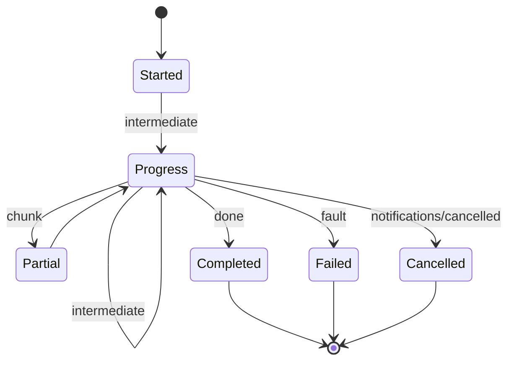

# [APPHOST_MCP_PROJECTION]

Model Context Protocol serving for the runtime spine rides the official `ModelContextProtocol` SDK, which owns JSON-RPC framing, transport, initialization, error mapping, and SSE-resumable requests. This page projects the capability registry onto its tool/resource/prompt surface. Each `CapabilityDescriptor` projects once to a brokered `Microsoft.Extensions.AI` `AIFunction` and its adopted `McpServerTool`; `McpAdoptedTool` exposes that exact pair to MCP registration and in-process reasoning.

Brokered dry-runs price tool calls before invocation, dispatch routes through the command algebra, server-initiated sampling rides `IChatClient`, elicitation gathers structured input mid-call, and SDK task primitives carry long-running calls over the cancel spine. This page owns the method axis, descriptor-to-`AIFunction` projection, brokered dispatch, sampling, elicitation, and agent-session roster. It consumes `CapabilityRegistry`/`DiscoveryQuery`, `CommandAlgebra`/`GrantBroker`, `ControlInbound.DispatchTool`, `CancelScope`, `TenantContext`, and `ReceiptSinkPort` as settled vocabulary and mints no eighth port.

## [01]-[INDEX]

- [02]-[METHOD_AXIS]: MCP method vocabulary with tool, resource, and prompt projection from the registry.
- [03]-[TOOL_DISPATCH]: Dry-run cost preview, brokered dispatch, and structured tool result.
- [04]-[STREAM_PROGRESS]: Server-stream progress fan with cancellation, backpressure, and resumable handles.
- [05]-[TS_PROJECTION]: MCP tool-catalog and progress-frame wire shapes the agent transport consumes.
- [06]-[APP_ROOT]: Service-host-root builder fold mounting the adopted primitives and the one ingress filter.

## [02]-[METHOD_AXIS]

- Owner: `McpMethod` `[SmartEnum<string>]` the MCP method vocabulary under the `ComparerAccessors.StringOrdinal` accessor; `ToolProjection` the descriptor-to-tool fold; `McpTool` the projected tool descriptor; `McpAdoptedTool` the brokered function/server pair; `McpAdoption` the whole registration product carrying the tool, prompt, and resource primitives the server mounts; `McpResource` the projected resource handle; `McpPrompt` the projected prompt template.
- Cases: 8 method rows — initialize, tools-list, tools-call, resources-list, resources-read, prompts-list, prompts-get, ping — the closed MCP request surface; tool/resource/prompt projections fold the registry's `DiscoveryResult` rows.
- Entry: `Project(CapabilityRegistry registry, DegradationLevel level, Func<DiscoveryResult, JsonNode> schemaOf, JsonNode receiptSchema)` returns `McpCatalog` — one fold projects the level-gated discovery result into the MCP tool catalog (each tool carrying its descriptor input schema and the uniform `CommandReceipt` output schema), so an agent sees exactly the tools the host can serve at its current degradation; `Tool(DiscoveryResult descriptor, JsonNode inputSchema, JsonNode outputSchema)` is the single descriptor-to-tool projection; `Adopt(McpRuntime runtime, McpCatalog catalog)` returns `McpAdoption` — one fold constructs each caller-neutral brokered function beside its SDK serving type AND mints the prompt and resource primitives off the same effect-filtered rows, safe to reuse across every agent because no caller identity is baked at adoption.
- Auto: each `DiscoveryResult` projects to one `Microsoft.Extensions.AI.AIFunction` (the `AIFunction : AIFunctionDeclaration : AITool` chain, where `JsonSchema` is a `JsonElement` on `AIFunctionDeclaration` and `Name`/`Description` are virtuals on `AITool`) whose overridden `JsonSchema` is the `JsonSchemaExporter` schema the descriptor's `CommandArguments` resolves through `SuiteContracts.Schema`, so the SDK's `inputSchema` derives from the same schema the codegen and command binder read, never a hand-authored JSON Schema and never the SDK's reflected delegate-parameter schema; the projection adopts a `CommandAIFunction : AIFunction` subclass whose `InvokeCoreAsync` resolves the ambient `TenantContext.Current` and mints a fresh `CorrelationId` per invocation on the caller's async flow — tenant identity and correlation are per-call facts, never adoption-time captures a boot-adopted tool would replay for every later caller — keeping `payload` the sole agent-facing input, and overrides `JsonSchema` to the descriptor schema, and `McpServerTool.Create(AIFunction, McpServerToolCreateOptions)` adopts it, with the projection setting the `McpServerToolCreateOptions` annotations from the descriptor's `EffectClass` (`pure`/`read` set `ReadOnly`, `write`/`external`/`irreversible` set `Destructive`) and `Idempotency` so an agent reads the side-effect class from the SDK's tool metadata; an `irreversible`-effect descriptor wraps its `CommandAIFunction` in the catalogued `ApprovalRequiredAIFunction` before `McpServerTool.Create` adopts it, so the destructive-side-effect class is a real human-in-the-loop approval gate the SDK enforces before invoke rather than only the advisory `Destructive` bool hint — the descriptor effect class drives both the metadata annotation and the enforcing wrapper from one source, never a parallel approval flag; the `Destructive` knob is `bool?` and the SDK treats unset/`true` as destructive, meaningful only when `ReadOnly=false`, so the projection always sets both explicitly with `ReadOnly` forcing `Destructive=false`, never inheriting the destructive default on an unset path; `Permitting` gating means a degraded host registers only the still-servable tools with zero parallel catalog.
- Auto: the long-running task protocol persists through `McpServerOptions.TaskStore`, whose default `InMemoryMcpTaskStore` loses every in-flight task on restart — against the folder charter's own crash-durable claim. `McpRuntime.Tasks` is one `IMcpTaskStore` implemented over the `Wire/outbox#OUTBOX_STORE` transactional store: `CreateTaskAsync(McpTaskMetadata, RequestId, JsonRpcRequest, string? sessionId, CancellationToken)` writes a row keyed `(taskId, sessionId)` and `GetTaskAsync(string taskId, string? sessionId, CancellationToken)` reads it back, `McpTask.TimeToLive` folds onto the outbox's existing retention sweep rather than a second expiry timer, `CreatedAt`/`LastUpdatedAt` stamp from `ClockPolicy`, the `McpTaskStatus` `Working`/`Completed`/`Failed` ladder is the row's status column, and the terminal result commits in the SAME transaction as the `CommandReceipt` `McpDispatch.Call` mints — so an agent's `WaitForTaskResultAsync<T>` survives a host restart on exactly the durability the outbox already provides, and no second durability mechanism enters the folder.
- Receipt: the projection is a pure fold producing the brokered `AIFunction`/registered `McpServerTool` pairs; the served-method transition logs through one `SpineLog` event in the 1000-1099 EVENT stride (`FaultBand.SpineEvents`) — no parallel projection receipt.
- Packages: ModelContextProtocol, ModelContextProtocol.Core, Microsoft.Extensions.AI.Abstractions, Thinktecture.Runtime.Extensions, LanguageExt.Core, BCL inbox
- Growth: a new method row tracks a new MCP request kind the SDK already serves; a new projection target is one fold arm on `Adopt` plus its `With*` registration leg; a new ingress concern is one `AddIncomingFilter` row; zero new surface — the agent transport is the registry projected onto the SDK, never a parallel command catalog.
- Boundary: the MCP projection is a read-only view of the capability registry — an MCP-specific tool definition divorced from a `CapabilityDescriptor` is the deleted form, so every advertised tool is a real registry descriptor adopted as an `AIFunction` and every tool call routes through the command algebra; the projection mints exactly one fault union, `McpFault` in the 4640 band at TOOL_DISPATCH, and consumes neither namespace-fenced `WireFault` — the `Rasm.Compute.Remote` `WireFault` (the Compute Remote gRPC `StatusCode` rail, mirror-pinned in the `Runtime/lifecycle#FAULT_TABLES` registry) and the `Rasm.AppHost.LiveWire` `WireFault` (the external-binding rail, `FaultBand.LiveWire`) are distinct types in distinct namespaces, and a single blanket `using` pulling both `Rasm.Compute` and `Rasm.AppHost` collides on the bare `WireFault` symbol, so any consumer touching both references each through its namespace-qualified path or a `using`-alias, never a bare import, per `docs/stacks/csharp/language#FORM_CHOOSER`; the JSON-RPC framing, the initialize handshake, and the method dispatch belong to the SDK — a hand-rolled JSON-RPC dispatcher is the deleted form, so `McpMethod` is the closed vocabulary the projection reads to gate per-method behavior, never a transport re-implementation; a host-specific verb rides the `ControlService` `DispatchTool` route instead, never a tenth MCP method; resource and prompt projections read the same descriptor rows filtered by effect class — a `read` descriptor projects as both a tool and a resource, a `pure` template-shaped descriptor projects as a prompt — so one descriptor source serves all three MCP surfaces, and all three REGISTER: a projection that computes resource and prompt rows and then chains `WithTools` alone is the deleted form, since it answers `resources/list` and `prompts/list` empty while the catalog advertises four of its eight declared methods; tool names are the descriptor ids verbatim so the SDK's `tools/call` resolves through `CapabilityRegistry.Resolve` with no name translation; the page-local `McpTool`/`McpResource`/`McpPrompt` records are the projected descriptors and `ToolProjection.Adopt` is the only SDK-adoption seam — its returned `McpAdoptedTool` rows carry the exact brokered `AIFunction` consumed by reasoning and the matching `McpServerTool` consumed by registration, so neither consumer reconstructs the function surface.

```csharp signature
[SmartEnum<string>]
[KeyMemberEqualityComparer<ComparerAccessors.StringOrdinal, string>]
[KeyMemberComparer<ComparerAccessors.StringOrdinal, string>]
public sealed partial class McpMethod {
    public static readonly McpMethod Initialize = new("initialize");
    public static readonly McpMethod ToolsList = new("tools/list");
    public static readonly McpMethod ToolsCall = new("tools/call");
    public static readonly McpMethod ResourcesList = new("resources/list");
    public static readonly McpMethod ResourcesRead = new("resources/read");
    public static readonly McpMethod PromptsList = new("prompts/list");
    public static readonly McpMethod PromptsGet = new("prompts/get");
    public static readonly McpMethod Ping = new("ping");
}

public sealed record McpTool(
    string Name,
    string Title,
    JsonNode InputSchema,
    JsonNode OutputSchema,
    bool ReadOnly,
    bool Destructive,
    bool Irreversible,
    bool Idempotent,
    CostVector EstimatedCost);

public sealed record McpResource(string Uri, string Name, string Surface);

public sealed record McpPrompt(string Name, JsonNode ArgumentsSchema);

public sealed record McpCatalog(
    Seq<McpTool> Tools,
    Seq<McpResource> Resources,
    Seq<McpPrompt> Prompts) {
    public static readonly McpCatalog Empty = new([], [], []);
}

public sealed record McpAdoptedTool(
    McpTool Descriptor,
    AIFunction Function,
    McpServerTool ServerTool);

// The registration product covering the WHOLE declared method axis, not its tool third: the catalog already
// computes the resource and prompt rows off the same effect filter, and this carrier is what carries them to
// the server. Without it `resources/list` and `prompts/list` answer empty against a catalog claiming four of
// its eight declared methods — the projection was complete and only the registration leg was absent.
public sealed record McpAdoption(
    Seq<McpAdoptedTool> Tools,
    Seq<McpServerPrompt> Prompts,
    Seq<McpServerResource> Resources) {
    public IEnumerable<McpServerTool> ServerTools => Tools.Map(static adopted => adopted.ServerTool);
}

public static class ToolProjection {
    public static McpTool Tool(DiscoveryResult descriptor, JsonNode inputSchema, JsonNode outputSchema) =>
        new(
            Name: descriptor.Descriptor,
            Title: descriptor.Surface,
            InputSchema: inputSchema,
            OutputSchema: outputSchema,
            ReadOnly: descriptor.Effect is "pure" or "read",
            Destructive: descriptor.Effect is "write" or "external" or "irreversible",
            Irreversible: descriptor.Effect is "irreversible",
            Idempotent: descriptor.Idempotency is "idempotent" or "keyed",
            EstimatedCost: descriptor.Estimated);

    public static McpCatalog Project(CapabilityRegistry registry, DegradationLevel level, Func<DiscoveryResult, JsonNode> schemaOf, JsonNode receiptSchema) =>
        registry.Discover(new DiscoveryQuery.Permitting(level)) is var rows
            ? new McpCatalog(
                Tools: rows.Map(row => Tool(row, schemaOf(row), receiptSchema)),
                Resources: rows.Filter(static row => row.Effect is "pure" or "read").Map(static row => new McpResource($"rasm://{row.Surface}/{row.Descriptor}", row.Descriptor, row.Surface)),
                Prompts: rows.Filter(static row => row.Effect is "pure").Map(row => new McpPrompt(row.Descriptor, schemaOf(row))))
            : McpCatalog.Empty;

    // Adopt mints EVERY declared primitive, not the tool third: a `read`-effect row becomes a resource the
    // server serves and a `pure`-effect row a prompt, under the same effect filter Project already applied, so
    // the three registration legs read one catalog and no row the projection computed dies unregistered.
    // All three primitives share ONE mint shape — McpServerPrompt.Create(AIFunction, McpServerPromptCreateOptions?)
    // and McpServerResource.Create(AIFunction, McpServerResourceCreateOptions?) are exact peers of
    // McpServerTool.Create, so MintPrompt/MintResource hand the SAME brokered CommandAIFunction the tool leg
    // adopts and one projection over one function serves all three surfaces; the resource options add
    // UriTemplate and MimeType beyond the shared Name/Title/Description/SerializerOptions/Metadata set.
    public static McpAdoption Adopt(McpRuntime runtime, McpCatalog catalog) =>
        new(Tools: from tool in catalog.Tools
                   let command = new CommandAIFunction(runtime, tool)
                   let function = tool.Irreversible
                       ? (AIFunction)new ApprovalRequiredAIFunction(command)
                       : command
                   select new McpAdoptedTool(
                       tool,
                       function,
                       McpServerTool.Create(
                           function,
                           new McpServerToolCreateOptions {
                               Name = tool.Name,
                               Title = tool.Title,
                               ReadOnly = tool.ReadOnly,
                               Destructive = tool.Destructive,
                               Idempotent = tool.Idempotent,
                               UseStructuredContent = true,
                               // OutputSchema is set EXPLICITLY from the CommandReceipt schema: left unset the SDK
                               // defaults it to the return-type shape, which is the invoker's, never the receipt's.
                               OutputSchema = JsonSerializer.SerializeToElement(tool.OutputSchema, runtime.Wire),
                               SerializerOptions = runtime.Wire,
                           })),
            Prompts: catalog.Prompts.Map(prompt => runtime.MintPrompt(prompt)),
            Resources: catalog.Resources.Map(resource => runtime.MintResource(resource)));
}

public sealed class CommandAIFunction(McpRuntime runtime, McpTool tool) : AIFunction {
    public override string Name => tool.Name;
    public override string Description => tool.Title;
    public override JsonElement JsonSchema { get; } = JsonSerializer.SerializeToElement(tool.InputSchema, runtime.Wire);

    // Tenant and correlation are per-invocation facts: the ambient TenantContext resolves on the
    // caller's async flow and each call mints its own CorrelationId — never adoption-time captures.
    protected override async ValueTask<object?> InvokeCoreAsync(AIFunctionArguments arguments, CancellationToken cancellationToken) =>
        await McpDispatch.Call(runtime, tool.Name, new CommandArguments((JsonElement)arguments["payload"]!, TenantContext.Current, Correlation.Mint()))
            .RunAsync(EnvIO.New(token: cancellationToken));
}
```

## [03]-[TOOL_DISPATCH]

- Owner: `McpFault` `[Union]` fault family deriving its codes through `FaultBand.Mcp` (the band the MCP transport maps onto its JSON-RPC error frame — the JSON-RPC intent keeps 4640, the registry enforcing disjointness); `CostPreview` the dry-run pricing record; `ToolResult` the structured tool-call result; `McpDispatch` the static brokered-dispatch surface.
- Cases: `McpFault` = Text | UnknownTool | InvalidArguments | CostRejected | Cancelled — each mapping to a JSON-RPC error code at the transport edge.
- Entry: `Preview(McpRuntime runtime, string tool, CommandArguments arguments)` returns `IO<CostPreview>` — the dry-run cost preview prices the tool call through `GrantBroker.Admit(dryRun: true)` and returns the estimated cost and whether the standing grant covers it, before any execution; `Call(McpRuntime runtime, string tool, CommandArguments arguments)` returns `IO<ToolResult>` — the brokered dispatch routes the tool call through `CommandAlgebra.Run` and projects the `CommandReceipt` onto the MCP structured result.
- Auto: the preview reuses the broker's admission fold so the previewed price is the exact price the live call charges, never an estimate that drifts from the charge — surfaced to the agent through the SDK's elicitation leg when a call exceeds the standing grant; the dispatch routes through `ControlInbound.DispatchTool` so an agent call on a companion lands through the same audit-and-redaction seam an operator tool call lands through; a `CommandTxn.Refused` projects to the matching `McpFault` whose registry-derived code the SDK maps onto its JSON-RPC `-32xxx` error frame so a denied tool call returns a protocol error, never a thrown exception — the mapping direction is one-way, the host emitting the 4640-band application code and the SDK framing it from a thrown `McpException` or a returned `JsonRpcError` at the transport edge, so the interior never emits a reserved-range code directly and never re-numbers a fault into it; `McpFault`, `CommandFault`, and `GrantFault` omit the `ConversionFromValue = ConversionOperatorsGeneration.None` knob that `ProgressFrame`/`DiscoveryQuery` carry — a fault union's only ingress is its coded constructors plus the `Expected` base and the `Create` factory, so no bare-payload conversion hole exists to seal and the knob stays absent on every fault union.
- Receipt: `ToolResult` carries the structured content blocks and the `isError` flag the SDK emits as `CallToolResult`, plus the `CommandReceipt` correlation id so the agent result correlates with the host evidence stream.
- Packages: ModelContextProtocol.Core, Microsoft.Extensions.AI.Abstractions, LanguageExt.Core, NodaTime, Thinktecture.Runtime.Extensions, BCL inbox
- Growth: one fault case is one `McpFault` row the SDK maps to a JSON-RPC code; a new content-block kind is one column on `ToolResult`; zero new surface.
- Boundary: the tool dispatch is the only MCP execution owner — it never executes an op itself, it routes through the command algebra, so the transaction, grant, and cost semantics are the command algebra's and the MCP layer is the protocol projection over the SDK; the dry-run preview is backed by the broker's simulate fold and projected through SDK elicitation, so the preview and the charge share one pricing source; cancellation maps the SDK's `notifications/cancelled` onto the `CancelScope` the call derived, so an agent cancel propagates through the same cancel spine a drain or deadline propagates through, never a parallel cancellation flag; the `isError` result and the JSON-RPC error are distinct — a tool that runs and reports a domain failure returns `isError: true` content while a tool that cannot run returns a JSON-RPC `McpFault`, so the agent distinguishes a failed execution from a refused dispatch; the `McpRuntime.Wire` `JsonSerializerOptions` is the single converter-owner handle threaded from the composition edge into the runtime record — the `PROTOCOL_EDGE`/`CONVERTER_OWNER` law admits it only as that one handle the dispatch reads when it projects a `CommandReceipt` onto a structured result, never a codec surface the interior transforms re-derive or a second serializer beside the generated Thinktecture and NodaTime converters.

```csharp signature
[Union]
public abstract partial record McpFault : Expected, IValidationError<McpFault> {
    private McpFault(string detail, int code) : base(detail, code, None) { }
    public static McpFault Create(string message) => new Text(message);
    public sealed record Text : McpFault { public Text(string detail) : base(detail, FaultBand.Mcp.Code(0)) { } }
    public sealed record UnknownTool : McpFault { public UnknownTool(string detail) : base(detail, FaultBand.Mcp.Code(1)) { } }
    public sealed record InvalidArguments : McpFault { public InvalidArguments(string detail) : base(detail, FaultBand.Mcp.Code(2)) { } }
    public sealed record CostRejected : McpFault { public CostRejected(string detail) : base(detail, FaultBand.Mcp.Code(3)) { } }
    public sealed record Cancelled : McpFault { public Cancelled(string detail) : base(detail, FaultBand.Mcp.Code(4)) { } }
}

public sealed record CostPreview(
    string Tool,
    CostVector Estimated,
    bool Covered,
    Option<string> ShortfallUnit);

public sealed record ToolResult(
    string Tool,
    Seq<JsonNode> Content,
    bool IsError,
    CorrelationId Correlation);

public sealed record McpRuntime(
    CapabilityRegistry Registry,
    CommandRuntime Command,
    GrantBroker Broker,
    Func<DegradationLevel> Level,
    // SchemaOf DERIVES the parameter schema from the descriptor's declared contract through
    // AIJsonUtilities.CreateFunctionJsonSchema over its JsonTypeInfo, with the Thinktecture generated owner's
    // key projection landing through a TransformSchemaNode callback and any per-contract customization through
    // DefaultJsonTypeInfoResolver.Modifiers / JsonTypeInfoResolver.WithAddedModifier — never a per-type
    // converter and never a hand-authored roster the declared contract can silently outgrow.
    Func<DiscoveryResult, JsonNode> SchemaOf,
    // The primitive mints for the non-tool halves of the declared method axis, each the AIFunction-shaped
    // Create peer of McpServerTool.Create — so all three primitives adopt the ONE brokered CommandAIFunction
    // and a prompt or resource can never route around the broker the tool leg goes through.
    Func<McpPrompt, CommandAIFunction, McpServerPrompt> MintPrompt,
    Func<McpResource, CommandAIFunction, McpServerResource> MintResource,
    // The ingress-tenancy adoption the incoming message filter runs before any tool executes: it reads the
    // carrier's own claims principal off MessageContext.User and resolves it under the MCP carrier's
    // TenantAdoption trust row, so an adopting leg yields the wire tenant and a refusing leg the root row.
    Func<ClaimsPrincipal?, TenantContext> Adopt,
    // The durable task store the long-running task protocol persists through — implemented over the
    // Wire/outbox transactional store, so a task survives the restart the folder charter promises.
    IMcpTaskStore Tasks,
    ClockPolicy Clocks,
    ReceiptSinkPort Sink,
    JsonSerializerOptions Wire);

public static class McpDispatch {
    public static IO<CostPreview> Preview(McpRuntime runtime, string tool, CommandArguments arguments) =>
        runtime.Registry.Resolve(tool).Match(
            Some: descriptor => IO.pure(runtime.Broker.Admit(descriptor, arguments, dryRun: true).Match(
                Succ: cost => new CostPreview(tool, cost, Covered: true, None),
                Fail: fault => new CostPreview(tool, descriptor.Cost.Estimate(arguments), Covered: false, Optional((fault as GrantFault.CeilingExceeded)?.Unit)))),
            None: () => IO.pure(new CostPreview(tool, CostVector.Zero, Covered: false, Some("unknown-tool"))));

    public static IO<ToolResult> Call(McpRuntime runtime, string tool, CommandArguments arguments) =>
        runtime.Registry.Resolve(tool).IsSome
            ? CommandAlgebra.Run(runtime.Command, tool, arguments).Map(receipt => Project(tool, receipt))
            : IO.pure(new ToolResult(tool, [JsonValue.Create(new McpFault.UnknownTool(tool).Message)!], IsError: true, arguments.Correlation));

    // THE one CommandReceipt-to-ToolResult fold every front door shares: the tool key discriminates
    // the result identity; Agent/runtime CommandDispatch.Project delegates HERE, never a switch copy.
    public static ToolResult Project(string tool, CommandReceipt receipt) =>
        receipt.Txn switch {
            CommandTxn.Committed => new ToolResult(tool, [JsonSerializer.SerializeToNode(receipt.Dispatch)!], IsError: false, receipt.Correlation),
            CommandTxn.Compensated c => new ToolResult(tool, [JsonValue.Create($"compensated:{c.Compensation}")!], IsError: true, receipt.Correlation),
            CommandTxn.RolledBack r => new ToolResult(tool, [JsonValue.Create(r.Reason)!], IsError: true, receipt.Correlation),
            CommandTxn.Refused f => new ToolResult(tool, [JsonValue.Create(f.Fault.Message)!], IsError: true, receipt.Correlation),
            _ => new ToolResult(tool, [], IsError: true, receipt.Correlation),
        };
}
```

## [04]-[STREAM_PROGRESS]

- Owner: `ProgressFrame` `[Union]` the progress-notification vocabulary; `ResumeToken` the resumable-handle record; `AgentSession` the per-agent progress-and-backpressure cell; `StreamProgress` the static progress-fan surface over the SDK's SSE-resumable transport and task primitives.
- Cases: `ProgressFrame` = Started | Progress | Partial | Completed | Failed | Cancelled — the frame sequence a long tool call emits as SDK progress notifications.
- Entry: `Stream(McpRuntime runtime, AgentSession session, string tool, CommandArguments arguments, IProgress<ProgressNotificationValue> reporter)` returns `IO<ToolResult>` — the call runs through the command algebra while each intermediate `ProgressFrame` projects to a `ProgressNotificationValue` the SDK fans over the resumable SSE transport through the SDK reporter, terminating with a completed or failed frame and returning the structured result; `Resume(McpRuntime runtime, AgentSession session, ResumeToken token, IProgress<ProgressNotificationValue> reporter)` reattaches after a transport bounce from the token's last-frame cursor, re-reporting through the same reporter only the frames the SDK's `Last-Event-ID` resumption did not deliver.
- Auto: progress fan rides the SDK's `IProgress<ProgressNotificationValue>` reporter and SSE-resumable transport so deadline and resumption are the SDK's, never a new transport; the SDK auto-binds the reporter from the request's `_meta.progressToken` (the host never news up the internal `TokenProgress` implementation), so a tool method declaring an `IProgress<ProgressNotificationValue>` parameter receives the live reporter; each interior `ProgressFrame` projects to one `ProgressNotificationValue` (`Progress` fraction, optional `Total`, optional `Message`) at the single `ToNotification` seam, so the frame union is the host vocabulary and the notification value is the wire shape; backpressure rides the keyed token-bucket admission so a slow agent consumer applies pressure to the producer through the existing rate-limiter, not an unbounded buffer; cancellation derives a `CancelScope` from the session spine so the SDK's `notifications/cancelled` cancels the in-flight intent and emits a `Cancelled` frame; the resume token carries the HLC stamp of the last delivered frame — the `Logical` component is the session-monotone HLC logical `AgentSession.Next` mints (the same cursor `ReceiptSinkPort` advances) and `Physical` the HLC physical, so the cursor never resets per stream and concurrent streams within one session never collide — and a reattach replays only the frames after the cursor from the bounded session buffer, never the whole stream; a long call also adopts the SDK's task primitive (`McpServerOptions.TaskStore`/`SendTaskStatusNotifications`, `RequestContext.EnablePollingAsync`) so status/poll/result survive a disconnect with no host-held stream.
- Receipt: each completed stream mints one `CommandReceipt` through the command algebra; the per-frame fan is the progress notification itself, not a separate receipt; the session roster transition logs through one `SpineLog` event.
- Packages: ModelContextProtocol.Core, Microsoft.Extensions.AI.Abstractions, LanguageExt.Core, NodaTime, Thinktecture.Runtime.Extensions, BCL inbox
- Growth: one frame case is one `ProgressFrame` row breaking every consumer arm; a new session-policy column is one field on `AgentSession`; zero new surface.
- Boundary: the streaming substrate is the SDK's SSE-resumable progress transport and task primitives — a bespoke WebSocket or gRPC server-stream is the deleted form, so the agent transport rides the protocol the SDK serves and the host owns only the progress vocabulary and the bounded session buffer; the resumable handle is bounded — the session buffer caps at the `DrainSpec.ReceiptFanOut` capacity so a never-reattaching agent's buffer evicts oldest under the same `DropOldest` receipt the drain queues carry, never an unbounded retained stream; the session roster keys by the agent's `PeerCredential` from the accept seam, mirroring the `PeerRoster` lease-epoch law, so a vanished agent's session sweeps on the same crash-staleness window; cancellation and deadline never race silently — a deadline-expired stream emits a `Failed` frame carrying the `DeadlineReceipt` while a cancelled stream emits `Cancelled`, so the agent distinguishes timeout from cancel; the host replay cursor (`ResumeToken.LastLogical`, the session-monotone HLC logical) and the SDK `progressToken` (the per-request progress-correlation token typed `object`, string-or-long) are distinct cursors the boundary never conflates — the host buffer indexes its replay by the HLC logical while the SDK correlates live notifications by its own `progressToken`, so a reattach replays by the host cursor and never by the SDK token.

```csharp signature
[Union(ConversionFromValue = ConversionOperatorsGeneration.None)]
public abstract partial record ProgressFrame(ulong Logical) {
    public sealed record Started(string Tool, ulong Logical) : ProgressFrame(Logical);
    public sealed record Progress(double Fraction, string Stage, ulong Logical) : ProgressFrame(Logical);
    public sealed record Partial(JsonNode Chunk, ulong Logical) : ProgressFrame(Logical);
    public sealed record Completed(ToolResult Result, ulong Logical) : ProgressFrame(Logical);
    public sealed record Failed(McpFault Fault, ulong Logical) : ProgressFrame(Logical);
    public sealed record Cancelled(string Reason, ulong Logical) : ProgressFrame(Logical);
}

public readonly record struct ResumeToken(string Session, string Tool, ulong LastLogical, Instant Physical);

public sealed record AgentSession(
    PeerCredential Agent,
    CancelScope Spine,
    Atom<Seq<ProgressFrame>> Buffer,
    Atom<ulong> Cursor,
    ulong Capacity,
    Instant LeaseUntil) {
    public static AgentSession Open(PeerCredential agent, CancelScope parent, Instant now) =>
        new(agent, parent.Derive($"agent-{agent.Pid}", TimeProvider.System), Atom(Seq<ProgressFrame>()), Atom(0UL), DrainSpec.ReceiptFanOut.Capacity, now + LeasePolicy.Maintenance.CrashStaleness);

    public ProgressFrame Next(Func<ulong, ProgressFrame> stamp) =>
        stamp(Cursor.Swap(static logical => logical + 1UL));

    public AgentSession Record(ProgressFrame frame) =>
        (ignore(Buffer.Swap(frames => (frames.Add(frame).Count > (int)Capacity ? frames.Tail : frames).Add(frame))), this).Item2;

    public Seq<ProgressFrame> After(ulong cursor) =>
        Buffer.Value.Filter(frame => frame.Logical > cursor);
}

public static class StreamProgress {
    public static IO<ToolResult> Stream(McpRuntime runtime, AgentSession session, string tool, CommandArguments arguments, IProgress<ProgressNotificationValue> reporter) =>
        from start in Fan(runtime, session, reporter, session.Next(logical => new ProgressFrame.Started(tool, logical)))
        from result in McpDispatch.Call(runtime, tool, arguments)
            .Map(done => session.Next(logical => new ProgressFrame.Completed(done, logical) as ProgressFrame))
            | @catch<IO, ProgressFrame>(error => error.Is(Errors.Cancelled), _ => IO.pure(session.Next(logical => new ProgressFrame.Cancelled("agent-cancel", logical) as ProgressFrame)))
            | @catch<IO, ProgressFrame>(static _ => true, error => IO.pure(session.Next(logical => new ProgressFrame.Failed(new McpFault.Text(error.Message), logical) as ProgressFrame)))
        from terminal in Fan(runtime, session, reporter, result)
        select result switch {
            ProgressFrame.Completed c => c.Result,
            ProgressFrame.Failed f => new ToolResult(tool, [JsonValue.Create(f.Fault.Message)!], IsError: true, arguments.Correlation),
            ProgressFrame.Cancelled x => new ToolResult(tool, [JsonValue.Create(x.Reason)!], IsError: true, arguments.Correlation),
            _ => new ToolResult(tool, [], IsError: true, arguments.Correlation),
        };

    public static IO<Unit> Resume(McpRuntime runtime, AgentSession session, ResumeToken token, IProgress<ProgressNotificationValue> reporter) =>
        session.After(token.LastLogical).TraverseM(frame => IO.lift(() => { reporter.Report(ToNotification(frame)); return unit; })).As().Map(static _ => unit);

    static ProgressNotificationValue ToNotification(ProgressFrame frame) => frame.Switch(
        started: static f => new ProgressNotificationValue { Progress = 0f, Message = $"started:{f.Tool}" },
        progress: static f => new ProgressNotificationValue { Progress = (float)f.Fraction, Total = 1f, Message = f.Stage },
        partial: static f => new ProgressNotificationValue { Progress = 0f, Message = "partial" },
        completed: static f => new ProgressNotificationValue { Progress = 1f, Total = 1f, Message = "completed" },
        failed: static f => new ProgressNotificationValue { Progress = 1f, Total = 1f, Message = $"failed:{f.Fault.Message}" },
        cancelled: static f => new ProgressNotificationValue { Progress = 1f, Total = 1f, Message = $"cancelled:{f.Reason}" });

    static IO<ProgressFrame> Fan(McpRuntime runtime, AgentSession session, IProgress<ProgressNotificationValue> reporter, ProgressFrame frame) =>
        IO.lift(() => { reporter.Report(ToNotification(frame)); session.Record(frame); return frame; });
}
```



## [05]-[TS_PROJECTION]

- Owner: `McpToolWire`, `ProgressNotificationWire`, `ProgressFrameWire`, `CostPreviewWire`, `ResumeTokenWire`, `ToolResultWire` — the MCP tool-catalog, progress, resume-cursor, and structured-result wire shapes the agent transport consumes; `ProgressNotificationWire` is the SDK's live `notifications/progress` value the transport emits and `ProgressFrameWire` is the interior frame reconstruction the host buffers for replay; `ToolResultWire` is the `ToolResult` record (`Tool`/`Content`/`IsError`/`Correlation`) projected as the `TPayload` of the existing `ReceiptEnvelopeWire`, single-minted here so the agent transport decodes it rather than re-authoring the payload shape.
- Entry: the tool catalog crosses as the standard MCP `tools/list` JSON the agent transport reads, the progress frames cross as the server-stream frame sequence, and the cost preview crosses as the dry-run pricing the agent reads before a call.
- Packages: BCL inbox
- Growth: one wire-member row per new tool annotation or frame field; the frame sequence crosses as a literal-discriminated union; zero new surface.
- Boundary: the tool input schema crosses as the standard JSON Schema the descriptor resolves, so an MCP client's schema validation reads the same schema the host binder reads; effect annotations cross as the MCP `readOnlyHint`/`destructiveHint` booleans the projection sets from `EffectClass`; the wire the SDK transport actually emits for progress is the standard MCP `notifications/progress` `ProgressNotificationValue` shape (`progress`/`total`/`message`), so `ProgressNotificationWire` is the contract the agent transport reads off the SSE stream, while `ProgressFrameWire` is the interior frame reconstruction the host buffers and replays — the `ToNotification` seam is where the interior frame becomes the wire value, so the TS side never reconstructs the frame union from the SDK notification, it reads the notification directly; the resume token crosses as the session/tool/logical/physical tuple so an agent reattaches by replaying the same cursor through the SDK's `Last-Event-ID` resumption; the structured tool result is `ToolResultWire` (the `ToolResult` `Tool`/`Content`/`IsError`/`Correlation` projection) ridden as the `TPayload` of the `Runtime/ports#TS_PROJECTION` `ReceiptEnvelopeWire`, single-minted here so the agent transport decodes the payload shape rather than re-authoring it — a branch-side `ToolResultWire` mint is the named drift defect this projection deletes.

```ts signature
interface McpToolWire {
  readonly name: string;
  readonly title: string;
  readonly inputSchema: unknown;
  readonly annotations: {
    readonly readOnlyHint: boolean;
    readonly destructiveHint: boolean;
    readonly idempotentHint: boolean;
    readonly approvalRequired: boolean;
  };
  readonly estimatedCost: Readonly<Record<string, number>>;
}

interface CostPreviewWire {
  readonly tool: string;
  readonly estimated: Readonly<Record<string, number>>;
  readonly covered: boolean;
  readonly shortfallUnit: string | null;
}

interface ProgressNotificationWire {
  readonly progress: number;
  readonly total?: number;
  readonly message?: string;
}

type ProgressFrameWire =
  | { readonly kind: "started"; readonly tool: string; readonly logical: number }
  | { readonly kind: "progress"; readonly fraction: number; readonly stage: string; readonly logical: number }
  | { readonly kind: "partial"; readonly chunk: unknown; readonly logical: number }
  | { readonly kind: "completed"; readonly result: unknown; readonly logical: number }
  | { readonly kind: "failed"; readonly fault: string; readonly logical: number }
  | { readonly kind: "cancelled"; readonly reason: string; readonly logical: number };

interface ResumeTokenWire {
  readonly session: string;
  readonly tool: string;
  readonly lastLogical: number;
  readonly physical: string;
}

// The structured tool result rides the existing ReceiptEnvelopeWire as its TPayload:
// ReceiptEnvelopeWire<ToolResultWire>. The ToolResult record (Tool/Content/IsError/Correlation)
// projects through the suite wire law, content blocks crossing as the structured-content array.
interface ToolResultWire {
  readonly tool: string;
  readonly content: ReadonlyArray<unknown>;
  readonly isError: boolean;
  readonly correlation: string;
}
```

## [06]-[APP_ROOT]

- Owner: the service-host root composes the SDK server; this page's interior carries no `AddMcpServer` or transport call, so the MCP HTTP transport is the app-root pin `ARCHITECTURE.md` names and never an interior dependency of this package.
- Entry: `ToolProjection.Project` gates the catalog to the live degradation level, `ToolProjection.Adopt` mints the brokered function/server pairs and the prompt and resource primitives once, then MCP registration maps `ServerTools`/`Prompts`/`Resources` while reasoning maps `Function`.
- Auto: the builder fold is `services.AddMcpServer()` for the `IMcpServerBuilder`, one transport extension, and the enumerable `WithTools`/`WithPrompts`/`WithResources` registrations over the adopted primitives — the enumerable overloads, never the generic `WithTools<T>()` or `WithToolsFromAssembly()` and never the reflection `Create(MethodInfo, …)`/`Create(Delegate, …)` mints, because `Adopt` constructs its primitives programmatically and leaves no `[McpServerToolType]`/`[McpServerTool]` attribute surface for a discovery scan to find; the stdio builder extension `WithStdioServerTransport()` lives in the host `ModelContextProtocol` package while the `StdioServerTransport` type it mounts is `.Core`'s, and stdio hosting routes logging to stderr because stdout is the JSON-RPC channel; HTTP hosting pins `Stateless = false` so the server-initiated sampling (`IChatClient`) and elicitation legs survive across requests on one session.
- Boundary: `WithMessageFilters(Action<IMcpMessageFilterBuilder>)` opens the `AddIncomingFilter`/`AddOutgoingFilter` extend and `WithRequestFilters` its per-request `IMcpRequestFilterBuilder` sibling; `McpMessageFilter` is handler-wrapping rather than call-shaped — `delegate McpMessageHandler McpMessageFilter(McpMessageHandler next)` over `delegate Task McpMessageHandler(MessageContext context, CancellationToken cancellationToken)` — so a filter returns a handler closing over `next` and registration order is outermost-first; a `(context, next, ct)` call-shaped lambda is the rejected form the builder cannot bind. Ingress tenancy reads `MessageContext.User`, resolves it through `McpRuntime.Adopt`, and scopes the resolved `TenantContext` across every ambient store for the duration of the awaited `next`.

```csharp signature
McpCatalog catalog = ToolProjection.Project(mcpRuntime.Registry, mcpRuntime.Level(), mcpRuntime.SchemaOf, receiptSchema);
McpAdoption adopted = ToolProjection.Adopt(mcpRuntime, catalog);

var builder = Host.CreateApplicationBuilder(args);
builder.Logging.AddConsole(o => o.LogToStandardErrorThreshold = LogLevel.Trace);
builder.Services.AddSingleton(mcpRuntime);
builder.Services.AddMcpServer(o => o.TaskStore = mcpRuntime.Tasks)
    .WithStdioServerTransport()
    .WithTools(adopted.ServerTools)
    .WithPrompts(adopted.Prompts)
    .WithResources(adopted.Resources);
await builder.Build().RunAsync();

var web = WebApplication.CreateBuilder(args);
web.Services.AddSingleton(mcpRuntime);
web.Services.AddMcpServer(o => o.TaskStore = mcpRuntime.Tasks)
    .WithHttpTransport(o => o.Stateless = false)
    .WithTools(adopted.ServerTools)
    .WithPrompts(adopted.Prompts)
    .WithResources(adopted.Resources)
    // The ONE ingress seam an MCP message crosses before its tool runs: the folder RULINGS ingress-tenancy row
    // says tenancy is ADMITTED per carrier, never inherited, and this filter is where the MCP carrier admits.
    // Registration wraps the handler, never the call: the filter returns a handler closing over next, so one
    // scope encloses the whole downstream flow. The runtime's Adopt resolves the message's own claims principal
    // under the carrier's TenantAdoption trust row, and Correlation.Stamp seats it across every ambient store, so
    // receipts, the RLS predicates, the metric fold, and the span plane all answer ONE tenant. Without it every
    // agent tool call resolves root tenancy while its span carries whatever the propagation seam extracted.
    .WithMessageFilters(filters => filters.AddIncomingFilter(next => async (context, ct) => {
        using var scope = Correlation.Stamp(mcpRuntime.Adopt(context.User));
        await next(context, ct).ConfigureAwait(false);
    }));
var app = web.Build();
app.MapMcp();
await app.RunAsync();
```

## [07]-[RESEARCH]

(none)
