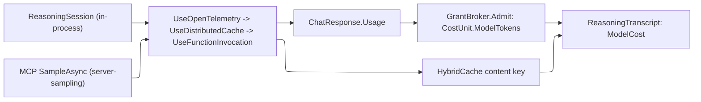

# [APPHOST_REASONING_RUNTIME]

Rasm.AppHost owns the in-process reasoning front door beside MCP server projection and client federation. `ReasoningSession` drives `IChatClient.GetStreamingResponseAsync` with the same brokered `CommandAIFunction` instances `Agent/mcp#METHOD_AXIS` mints, so model-invoked tools route through `CommandAlgebra.Run` and `GrantBroker`. `SemanticDiscovery` embeds each `CapabilityDescriptor` surface and ranks it by cosine similarity through `DiscoveryQuery.ByIntent`. Function transcripts retain exact `CommandReceipt` values only when `FunctionResultContent.Result` carries them; a `ToolResult` never inflates into a fabricated commit. `ModelGovernance` composes `UseFunctionInvocation`, `UseDistributedCache`, and `UseOpenTelemetry` into one draw owner, while the completed `ReasoningTranscript` rides the receipt sink under `InstrumentFan.ModelKind`.

## [01]-[INDEX]

- [01]-[REASONING_LOOP]: `ReasoningSession` over `IChatClient` streaming; `ChatOptions.Tools` is the brokered `CommandAIFunction`.
- [02]-[SEMANTIC_DISCOVERY]: `IEmbeddingGenerator` cosine fold; the `DiscoveryQuery.ByIntent` case over the registry.
- [03]-[REPLAYABLE_TRANSCRIPT]: Exact function-result receipts chain into `EventLog`; absent joins remain explicit.
- [04]-[MODEL_GOVERNANCE]: One middleware fold: model-selection routing, content-filter guardrail, token-to-cost-to-ledger, cached-response replay, and two model front doors.
- [05]-[MODAL_INPUT]: Gated `ModalClient` `[Union]` reading the same descriptor catalog.
- [06]-[TS_PROJECTION]: Reasoning-session, transcript, and intent-match wire shapes the dashboard consumes.

## [02]-[REASONING_LOOP]

- Owner: `ReasoningPolicy` the per-session loop-bound and tool-mode record; `ReasoningTurn` `[Union]` the streamed-turn disposition; `ReasoningSession` the static in-process agent-loop surface over `IChatClient.GetStreamingResponseAsync`.
- Cases: `ReasoningTurn` = Thinking | ToolCalled | Message | Completed | Faulted — the disposition a streamed reasoning turn folds to as the chat client surfaces text, reasoning content, function calls, and the finish reason; `ToolCalled` carries the call id, descriptor, canonical argument element, and exact optional command receipt as one identity row.
- Entry: `Reason(ReasoningRuntime runtime, ReasoningPolicy policy, Seq<ChatMessage> conversation)` returns `IO<ReasoningTranscript>` — the loop streams `IChatClient.GetStreamingResponseAsync` with `ChatOptions.Tools` set to the brokered `CommandAIFunction` set, accumulates the `ChatResponseUpdate` stream into one `ChatResponse`, records each `FunctionCallContent`/`FunctionResultContent` pair as a transcript row, and terminates on the `ChatFinishReason` with the projected `ReasoningTranscript`.
- Auto: the `ChatOptions.Tools` list is the exact brokered `CommandAIFunction` set the `Agent/mcp#METHOD_AXIS` `ToolProjection.Adopt` mints — the loop reuses the one tool-adoption seam and never news up a second projection, so a model tool call and an MCP tool call route through the identical brokered invoker over `CommandAlgebra.Run`; the function-invocation iteration is the `MODEL_GOVERNANCE` `FunctionInvokingChatClient` decorator, not a hand-rolled call-and-feed loop — `ReasoningSession` supplies the tool set and the conversation, the decorator runs the tool-call cycle, and the session folds the resulting stream into turns; `ChatOptions.ToolMode` is the policy's `AutoChatToolMode`/`RequiredChatToolMode`/`NoneChatToolMode` row so a session forces, permits, or forbids tool use without a parallel flag; the streaming accumulation uses the `ChatResponseUpdate` stream so a long reasoning turn surfaces incrementally and the host fans interim `Thinking`/`Message` turns to the session reporter exactly as `STREAM_PROGRESS` fans MCP progress; `ChatOptions.Seed` binds to the `DeterminismContext` RNG seed so a recorded reasoning turn replays under the same sampling seed, and `MaximumIterationsPerRequest`/`MaximumConsecutiveErrorsPerRequest` trace to the policy's `DeadlineClass`-derived loop bound, never a literal.
- Receipt: each completed reasoning run mints one `ReasoningTranscript` fanned under `InstrumentFan.ModelKind`; a tool-call row carries `Some(CommandReceipt)` only when the function result exposes the exact minted receipt, otherwise `None`; the per-turn fan is the streamed turn itself, not a separate receipt.
- Packages: Microsoft.Extensions.AI.Abstractions, LanguageExt.Core, NodaTime, Thinktecture.Runtime.Extensions, BCL inbox
- Growth: one turn disposition is one `ReasoningTurn` case breaking every fold arm; a new loop-policy column is one field on `ReasoningPolicy`; a new tool front door is the SAME `CommandAIFunction` set adopted by a new caller, never a new projection; zero new surface.
- Boundary: the reasoning loop is the in-process model-driven command owner — it never executes an op itself, it routes every tool call through the brokered `CommandAIFunction` onto the command algebra, so the transaction, grant, and cost semantics are the command algebra's and the loop is the model-driven dispatch over them; a tool set divorced from the `Agent/mcp#METHOD_AXIS` adoption seam is the deleted form, so the in-process loop and the MCP server share one tool catalog; the `IChatClient` the loop drives is the `MODEL_GOVERNANCE`-wrapped client, never a raw provider client, so an unmetered un-ledgered model draw cannot reach the loop; the loop owns the turn vocabulary and the session-scoped conversation buffer, while `MODEL_GOVERNANCE` owns the metering, caching, tracing, and content-addressing — the two never merge, so the loop stays the orchestration and the middleware stays the policy; a model call that bypasses the function-invocation decorator to invoke a tool directly is the deleted form, because the decorator is the one seam where `ChatOptions.Tools` becomes executed calls.

```csharp signature
// --- [MODELS] ---------------------------------------------------------------------------
public sealed record ReasoningPolicy(
    ChatToolMode ToolMode,
    int MaxIterations,
    int MaxConsecutiveErrors,
    DeadlineClass Deadline,
    Option<float> Temperature,
    Option<long> Seed) {
    public static ReasoningPolicy Auto(DeterminismContext context, DeadlineClass deadline) =>
        new(ChatToolMode.Auto, MaxIterations: 16, MaxConsecutiveErrors: 3, deadline, None, Some(context.Seed));

    public ChatOptions Options(Seq<AITool> tools) =>
        new() {
            Tools = tools.ToList(),
            ToolMode = ToolMode,
            Temperature = Temperature.Match(Some: static t => (float?)t, None: static () => (float?)null),
            Seed = Seed.Match(Some: static s => (long?)s, None: static () => (long?)null),
            AllowMultipleToolCalls = true,
        };
}

[Union(ConversionFromValue = ConversionOperatorsGeneration.None)]
public abstract partial record ReasoningTurn {
    private ReasoningTurn() { }
    public sealed record Thinking(string Reasoning) : ReasoningTurn;
    public sealed record ToolCalled(string CallId, string Descriptor, JsonElement Arguments, Option<CommandReceipt> Receipt) : ReasoningTurn;
    public sealed record Message(string Text) : ReasoningTurn;
    public sealed record Completed(Option<ChatFinishReason> Reason, Option<UsageDetails> Usage) : ReasoningTurn;
    public sealed record Faulted(string Detail) : ReasoningTurn;
}

// --- [SERVICES] -------------------------------------------------------------------------
public sealed record ReasoningRuntime(
    IChatClient Chat,
    McpRuntime Tools,
    Func<DegradationLevel> Level,
    GovernanceLedger Ledger,
    ClockPolicy Clocks,
    ReceiptSinkPort Sink,
    JsonSerializerOptions Wire);

// --- [OPERATIONS] -----------------------------------------------------------------------
public static class ReasoningSession {
    public static IO<ReasoningTranscript> Reason(ReasoningRuntime runtime, ReasoningPolicy policy, Seq<ChatMessage> conversation) =>
        from tools in IO.lift(() => AdoptedTools(runtime))
        from started in IO.lift(() => runtime.Clocks.Now)
        from response in IO.liftAsync(async () => await Accumulate(runtime.Chat, conversation, policy.Options(tools)))
        from elapsed in IO.lift(() => runtime.Clocks.Now - started)
        let rows = TranscriptRows(response, runtime.Wire)
        from transcript in IO.lift(() => ReasoningTranscript.Of(response, rows, started, elapsed, runtime.Wire))
        from _ in runtime.Sink.Send(Correlation.Mint(), TenantContext.Current, TelemetrySource.AppHost.Key, InstrumentFan.ModelKind, JsonSerializer.SerializeToElement(transcript, runtime.Wire))
        select transcript;

    // ONE tool-adoption seam, in-process front door: the loop consumes McpAdoptedTool.Function —
    // the SAME caller-neutral brokered CommandAIFunction (ApprovalRequiredAIFunction-wrapped on an
    // irreversible effect) the MCP server registers through ServerTool — so neither consumer
    // reconstructs the function surface and tenant/correlation resolve per invocation inside the
    // one invoker. A local re-construction of the function pair is the deleted form.
    static Seq<AITool> AdoptedTools(ReasoningRuntime runtime) =>
        ToolProjection.Adopt(
            runtime.Tools,
            ToolProjection.Project(runtime.Tools.Registry, runtime.Level(), runtime.Tools.SchemaOf, ReceiptSchema(runtime)))
            .Map(static adopted => (AITool)adopted.Function);

    static async Task<ChatResponse> Accumulate(IChatClient chat, Seq<ChatMessage> conversation, ChatOptions options) {
        var updates = new List<ChatResponseUpdate>();
        await foreach (var update in chat.GetStreamingResponseAsync(conversation, options))
            updates.Add(update);
        return updates.ToChatResponse();
    }

    static Seq<ReasoningTurn> TranscriptRows(ChatResponse response, JsonSerializerOptions wire) {
        var contents = response.Messages.AsIterable().Bind(static message => message.Contents.AsIterable()).ToSeq();
        var results = contents.OfType<FunctionResultContent>()
            .ToFrozenDictionary(static result => result.CallId, StringComparer.Ordinal);
        return contents.Choose(content => Row(content, results, wire)).ToSeq()
            .Add(new ReasoningTurn.Completed(Optional(response.FinishReason), Optional(response.Usage)));
    }

    static Option<ReasoningTurn> Row(
        AIContent content,
        FrozenDictionary<string, FunctionResultContent> results,
        JsonSerializerOptions wire) => content switch {
        TextReasoningContent reasoning => Some<ReasoningTurn>(new ReasoningTurn.Thinking(reasoning.Text)),
        TextContent text => Some<ReasoningTurn>(new ReasoningTurn.Message(text.Text)),
        FunctionCallContent call => Some<ReasoningTurn>(new ReasoningTurn.ToolCalled(
            call.CallId,
            call.Name,
            JsonSerializer.SerializeToElement(call.Arguments, wire),
            results.TryGetValue(call.CallId, out var result) ? ReceiptOf(result) : None)),
        FunctionResultContent => None,
        _ => None,
    };

    static Option<CommandReceipt> ReceiptOf(FunctionResultContent result) =>
        result.Result is CommandReceipt receipt ? Some(receipt) : None;

    static JsonNode ReceiptSchema(ReasoningRuntime runtime) =>
        JsonNode.Parse(SuiteContracts.Schema<CommandReceipt>(runtime.Wire).GetRawText())!;
}
```

## [03]-[SEMANTIC_DISCOVERY]

- Owner: `IntentMatch` the ranked descriptor-to-intent projection; `EmbeddingIndex` the frozen descriptor-embedding cell; `SemanticDiscovery` the static embedding-rank fold; the new `DiscoveryQuery.ByIntent(string)` case extending `Agent/capability#DISCOVERY_FOLD`.
- Cases: `DiscoveryQuery` gains one case — `ByIntent(string Intent)` — alongside the settled `ById`/`BySurface`/`ByEffect`/`Permitting`/`All`, so the `Discover` switch is a total dispatch the new case breaks at compile time on every consumer arm; the registry's `Discover` fold gains the `byIntent` arm reading the embedding index.
- Entry: `Index(CapabilityRegistry registry, IEmbeddingGenerator<string, Embedding<float>> embedder)` returns `IO<EmbeddingIndex>` — embeds each descriptor's op-surface text into one frozen `Embedding<float>` per descriptor id at composition; `Rank(EmbeddingIndex index, IEmbeddingGenerator<string, Embedding<float>> embedder, string intent, int top)` returns `IO<Seq<IntentMatch>>` — embeds the intent string and ranks descriptors by cosine similarity over the frozen index, returning the top matches.
- Auto: the embedding index is a FROZEN projection over the registry built once at composition — `Index` folds `DiscoveryQuery.All` into the descriptor rows, embeds each row's `{surface}.{op}` text and its effect/idempotency keys through one batched `IEmbeddingGenerator.GenerateAsync`, and freezes the result into a `FrozenDictionary<string, ReadOnlyMemory<float>>`, so discovery is a read-only vector lookup, never a runtime mutation, mirroring the `CapabilityRegistry` composition-freeze law; the cosine rank is `TensorPrimitives.CosineSimilarity` over the `Embedding<float>.Vector` span so the similarity computation rides the BCL numerics primitive, never a hand-rolled dot-product loop; `ByIntent` folds `Rank` to its top descriptors and projects them through the same `DiscoveryResult` projection the other query cases produce so an intent query and an id query return the identical result shape; the embedder is the `MODEL_GOVERNANCE`-wrapped `IEmbeddingGenerator` (`UseDistributedCache`/`UseOpenTelemetry` on the embedding builder) so an intent embedding is content-cached and an identical intent re-resolves from the cache without a fresh embedding draw.
- Receipt: `IntentMatch` carries the descriptor id, the cosine score, and the projected `DiscoveryResult`; the index build logs one `SpineLog` event; no parallel discovery receipt.
- Packages: Microsoft.Extensions.AI.Abstractions, LanguageExt.Core, Thinktecture.Runtime.Extensions, System.Numerics.Tensors, BCL inbox
- Growth: the `ByIntent` case is one `DiscoveryQuery` row breaking every consumer; a new ranking signal is one column on `IntentMatch`; a new embedding model is one `IEmbeddingGenerator` injection, never a second index; zero new surface.
- Boundary: the semantic discovery is the only intent-resolution owner — a keyword-match heuristic, a hand-tuned synonym table, and a per-op intent annotation are the deleted forms, so an agent resolving "compute the union of these meshes" to `TensorOpFamily.boolean-union` reads the one embedding rank; the `ByIntent` case extends the `Agent/capability#DISCOVERY_FOLD` `[Union]` rather than adding a parallel discovery surface, so the registry's `Discover` stays the single discovery entrypoint and the intent path is one fold arm; the embedding index is frozen at composition so a descriptor added after freeze is invisible to intent resolution until re-index, the same read-only-after-freeze contract the registry carries — a runtime descriptor-embedding mutation is the deleted form; the cosine rank is a similarity heuristic, not a guarantee, so an intent below the policy floor returns no match and the agent falls back to the exact-id path rather than dispatching a wrong tool; the embedded text is the op surface's self-description (`{surface}.{op}` and effect/classification), never the op's body or arguments, so the index is metadata-only and an op's payload never leaks into an embedding.

```csharp signature
// --- [MODELS] ---------------------------------------------------------------------------
public sealed record IntentMatch(string Descriptor, float Score, DiscoveryResult Result);

public sealed record EmbeddingIndex(
    FrozenDictionary<string, ReadOnlyMemory<float>> Vectors,
    CapabilityRegistry Registry,
    float Floor) {
    public static readonly float DefaultFloor = 0.25f;
}

// --- [OPERATIONS] -----------------------------------------------------------------------
public static class SemanticDiscovery {
    public static IO<EmbeddingIndex> Index(CapabilityRegistry registry, IEmbeddingGenerator<string, Embedding<float>> embedder) =>
        registry.Discover(new DiscoveryQuery.All()) is var rows && rows.IsEmpty
            ? IO.pure(new EmbeddingIndex(FrozenDictionary<string, ReadOnlyMemory<float>>.Empty, registry, EmbeddingIndex.DefaultFloor))
            : from embeddings in IO.liftAsync(async () => await embedder.GenerateAsync(rows.Map(Surface).ToList()))
              let vectors = rows.Zip(embeddings.AsIterable().ToSeq())
                  .Map(static pair => KeyValuePair.Create(pair.First.Descriptor, pair.Second.Vector))
                  .ToFrozenDictionary(StringComparer.Ordinal)
              select new EmbeddingIndex(vectors, registry, EmbeddingIndex.DefaultFloor);

    public static IO<Seq<IntentMatch>> Rank(EmbeddingIndex index, IEmbeddingGenerator<string, Embedding<float>> embedder, string intent, int top) =>
        from query in IO.liftAsync(async () => await embedder.GenerateAsync(intent))
        let scored = index.Registry.Discover(new DiscoveryQuery.All())
            .Choose(row => index.Vectors.TryGetValue(row.Descriptor, out var vector)
                ? Some(new IntentMatch(row.Descriptor, Cosine(query.Vector.Span, vector.Span), row))
                : Option<IntentMatch>.None)
            .Filter(match => match.Score >= index.Floor)
            .OrderByDescending(static match => match.Score)
            .Take(top)
            .ToSeq()
        select scored;

    static string Surface(DiscoveryResult row) => $"{row.Surface}.{row.Descriptor} effect={row.Effect} idempotency={row.Idempotency}";

    static float Cosine(ReadOnlySpan<float> query, ReadOnlySpan<float> candidate) =>
        TensorPrimitives.CosineSimilarity(query, candidate);
}

// --- [TYPES] ----------------------------------------------------------------------------
// DiscoveryQuery.ByIntent is LANDED on Agent/capability#DISCOVERY_FOLD: the [Union] carries the
// case and CapabilityRegistry.Discover carries the byIntent arm over its composition-bound
// intent-rank delegate. This page BINDS that delegate at composition — the rank fold below closed
// over the frozen EmbeddingIndex and the resolved IEmbeddingGenerator:
//
//   new CapabilityRegistry(rows, intentRank: Some<Func<string, Seq<string>>>(intent =>
//       SemanticDiscovery.Rank(index, embedder, intent, top: 8).Run()
//           .Map(static match => match.Descriptor).ToSeq()));
//
// One union, one owner, one arm — this page authors the RANKING, never a second query surface.
```

## [04]-[REPLAYABLE_TRANSCRIPT]

- Owner: `ReasoningTranscript` the function-invocation transcript record; `TranscriptDigest` the content-address of the whole reasoning turn; `TranscriptProjection` the exact-receipt-to-`LogEntry` fold over `Runtime/determinism#EVENT_LOG` and `#MACRO_ENGINE`.
- Entry: `Chain(TranscriptRuntime runtime, EventLog.Chain chain, ReasoningTranscript transcript, DeterminismContext context)` returns `IO<(EventLog.Chain Chain, Seq<LogEntry> Entries, Seq<string> Missing)>` — folds each exact tool-call `CommandReceipt` into the event-log chain through `EventLog.Append` and carries the receiptless call ids beside the projected entries, so the chained slice and its completeness gap travel as one product; `AsMacro(string macroId, ReasoningTranscript transcript, Seq<LogEntry> entries, Seq<MacroParameter> parameters)` returns `Fin<Macro>` — records the chained slice through `Macro.Record` only when `transcript.MissingReceipts` is empty, refusing an incomplete transcript with the typed `CommandFault.MacroIncomplete` naming every receiptless call.
- Auto: each `ReasoningTurn.ToolCalled` carries `Some(CommandReceipt)` only when `FunctionResultContent.Result` exposes the exact value; `ToolResult`, null, and foreign results carry `None`, so projection never invents transaction, cost, dispatch, elapsed, tenant, or instant fields; `Chain` folds only exact receipts through `EventLog.Append` while `Missing` names each call whose receipt never joined; the transcript digest composes kernel `ContentHash.Of` over ordered call identities and the model response digest; `AsMacro` gates on `ReasoningTranscript.MissingReceipts` before `Macro.Record` runs, so completeness is a structural refusal, never prose; the reasoning transcript itself rides the receipt sink and never masquerades as a model `CommandReceipt`.
- Receipt: each exact tool-call receipt becomes one `LogEntry`; the whole turn remains one `ReasoningTranscript` carrying its `TranscriptDigest`; absent receipt joins produce no fabricated log entry.
- Packages: System.IO.Hashing, LanguageExt.Core, NodaTime, Thinktecture.Runtime.Extensions, BCL inbox
- Growth: one transcript column is one field on `ReasoningTranscript`; a new macro substitution point is one `MacroParameter` row on the recorded slice; a new digest input is one component on the kernel `ContentHash.Of` canonical bytes; zero new surface.
- Boundary: transcript projection never creates evidence absent from the function result; exact command receipts ride the existing event-log chain, while missing joins remain explicit and block macro completeness; `Macro.Record`/`MacroEngine.Play` reuse the command algebra for every captured receipt; `TranscriptDigest` addresses the observed response and call identities but makes no bit-identical model-replay claim beyond the cache owner's guarantee.

```csharp signature
// --- [MODELS] ---------------------------------------------------------------------------
public sealed record ReasoningTranscript(
    string TranscriptId,
    TranscriptDigest Digest,
    Seq<ReasoningTurn> Turns,
    string ResponseDigest,
    CostVector ModelCost,
    long InputTokens,
    long OutputTokens,
    Instant Started,
    Duration Elapsed) {
    public static ReasoningTranscript Of(
        ChatResponse response,
        Seq<ReasoningTurn> turns,
        Instant started,
        Duration elapsed,
        JsonSerializerOptions wire) {
        var responseDigest = ContentHash.Of(
            Encoding.UTF8.GetBytes(string.Join("\n", response.Messages.AsIterable().Map(static m => m.Text)))).ToString("x32");
        var digest = TranscriptDigest.Of(turns, responseDigest, wire);
        return new(
            TranscriptId: digest.Value,
            Digest: digest,
            Turns: turns,
            ResponseDigest: responseDigest,
            ModelCost: ModelGovernance.Tokens(response.Usage),
            InputTokens: response.Usage?.InputTokenCount ?? 0L,
            OutputTokens: response.Usage?.OutputTokenCount ?? 0L,
            Started: started,
            Elapsed: elapsed);
    }

    public Seq<CommandReceipt> Receipts =>
        Turns.Choose(static turn => turn is ReasoningTurn.ToolCalled called ? called.Receipt : Option<CommandReceipt>.None);

    // Completeness is a transcript fact: every ToolCalled row whose exact receipt never joined is
    // named by call id, so the macro gate and the chain product read one roster, never a re-derivation.
    public Seq<string> MissingReceipts =>
        Turns.Choose(static turn => turn is ReasoningTurn.ToolCalled { Receipt.IsNone: true } called ? Some(called.CallId) : None);

    public bool Complete => MissingReceipts.IsEmpty;
}

[ValueObject<string>(
    KeyMemberName = "Value",
    ConversionToKeyMemberType = ConversionOperatorsGeneration.Implicit,
    ConversionFromKeyMemberType = ConversionOperatorsGeneration.None)]
public readonly partial struct TranscriptDigest {
    // Fixed field order and ordinal object-property order make call identity independent of dictionary insertion order.
    public static TranscriptDigest Of(Seq<ReasoningTurn> turns, string responseDigest, JsonSerializerOptions wire) {
        using var bytes = new MemoryStream();
        using (var json = new Utf8JsonWriter(bytes)) {
            json.WriteStartObject();
            json.WriteString("response", responseDigest);
            json.WritePropertyName("calls");
            json.WriteStartArray();
            turns.Choose(static turn => turn is ReasoningTurn.ToolCalled call ? Some(call) : Option<ReasoningTurn.ToolCalled>.None)
                .Iter(call => {
                    json.WriteStartObject();
                    json.WriteString("callId", call.CallId);
                    json.WriteString("descriptor", call.Descriptor);
                    json.WritePropertyName("arguments");
                    Canonical(json, call.Arguments);
                    json.WritePropertyName("receipt");
                    if (call.Receipt is { IsSome: true, Case: CommandReceipt receipt })
                        Canonical(json, JsonSerializer.SerializeToElement(receipt, wire));
                    else
                        json.WriteNullValue();
                    json.WriteEndObject();
                });
            json.WriteEndArray();
            json.WriteEndObject();
        }
        return TranscriptDigest.Create(ContentHash.Of(bytes.ToArray()).ToString("x32"));
    }

    static void Canonical(Utf8JsonWriter writer, JsonElement element) {
        switch (element.ValueKind) {
            case JsonValueKind.Object:
                writer.WriteStartObject();
                foreach (var property in element.EnumerateObject().OrderBy(static property => property.Name, StringComparer.Ordinal)) {
                    writer.WritePropertyName(property.Name);
                    Canonical(writer, property.Value);
                }
                writer.WriteEndObject();
                break;
            case JsonValueKind.Array:
                writer.WriteStartArray();
                foreach (var item in element.EnumerateArray()) Canonical(writer, item);
                writer.WriteEndArray();
                break;
            default:
                element.WriteTo(writer);
                break;
        }
    }
}

// --- [SERVICES] -------------------------------------------------------------------------
public sealed record TranscriptRuntime(
    DeterminismContext Context,
    ClockPolicy Clocks,
    Func<HashMap<string, JsonElement>, Seq<MacroParameter>> ParametersOf);

// --- [OPERATIONS] -----------------------------------------------------------------------
public static class TranscriptProjection {
    public static IO<(EventLog.Chain Chain, Seq<LogEntry> Entries, Seq<string> Missing)> Chain(TranscriptRuntime runtime, EventLog.Chain chain, ReasoningTranscript transcript, DeterminismContext context) =>
        from now in IO.lift(() => runtime.Clocks.Now)
        let folded = transcript.Receipts.Fold((Chain: chain, Entries: Seq<LogEntry>(), Logical: 0UL), (acc, receipt) => {
            var (next, entry) = EventLog.Append(acc.Chain, receipt, context, now, acc.Logical);
            return (next, acc.Entries.Add(entry), acc.Logical + 1UL);
        })
        select (folded.Chain, folded.Entries, transcript.MissingReceipts);

    // Macro recording demands the complete receipt slice: a receiptless call refuses with the typed
    // fault naming every gap, so no macro replays a turn whose command evidence never joined.
    public static Fin<Macro> AsMacro(string macroId, ReasoningTranscript transcript, Seq<LogEntry> entries, Seq<MacroParameter> parameters) =>
        transcript.Complete
            ? Fin.Succ(Macro.Record(macroId, entries, parameters))
            : Fin.Fail<Macro>(new CommandFault.MacroIncomplete(string.Join(',', transcript.MissingReceipts)));
}
```

## [05]-[MODEL_GOVERNANCE]

- Owner: `ModelRoute` `[SmartEnum<string>]` the model-selection row family discriminating target model by cost-tier/capability/variant under the `ComparerAccessors.StringOrdinal` accessor; `GovernanceLedger` the per-turn token-and-cost cell; `GovernedClient` the composed delegating-pipeline handle; `ModelGovernance` the static middleware-fold surface composing the `Microsoft.Extensions.AI` `ChatClientBuilder` decorators into the one model-governance owner, route, meter, cache, trace, and content-filter on one decorator chain.
- Cases: `ModelRoute` rows — `Economy`, `Balanced`, `Frontier`, `LongContext` — each carrying its provider model id and the `EffectClass` ceiling it admits, so a model draw routes to a target model by feature verdict rather than a fixed client; the routing arm reads the `Runtime/features#FLAG_VERDICT` `FlagVerdict` variant and maps it to the row, and an absent or below-floor verdict falls to the policy default route, never a hard-coded model.
- Entry: `Compose(GovernanceRuntime runtime, IChatClient inner)` returns `GovernedClient` — folds the inner `IChatClient` through `AsBuilder().UseOpenTelemetry(...).UseDistributedCache(...).Use(client => new GoverningChatClient(client, runtime)).UseFunctionInvocation(...).Build(sp)` so every model call rides the OTel span enclosing the cache lookup enclosing the one `GoverningChatClient` (model-selection rewrite and content-filter guard) enclosing the function-invocation loop; `Charge(GovernanceRuntime runtime, GrantBroker broker, UsageDetails usage, CommandArguments arguments)` returns `Fin<CostVector>` — projects `ChatResponse.Usage` onto a `CostVector` charging `CostUnit.ModelTokens` through `GrantBroker.Admit` before the model commits; `Route(GovernanceRuntime runtime, EvaluationContext targeting)` returns `ModelRoute` — resolves the feature verdict to the target row the selection arm seats on `ChatOptions.ModelId`.
- Auto: one `ChatClientBuilder` chain composes OTel, distributed cache, `GoverningChatClient`, and function invocation; `GoverningChatClient` clones each `ChatOptions` value before rewriting `ModelId` from the feature verdict and redacts only `TextContent.Text` and `TextReasoningContent.Text` through the shared classification owner while preserving every other `AIContent` value unchanged; usage projects to `CostUnit.ModelTokens` through `GrantBroker`; cache identity includes the routed model id; function-invocation bounds come from `ReasoningPolicy`; the same governed client shape serves the reasoning and MCP-sampling front doors. Cache replay is a cache-owner guarantee and does not mint an event-log row.
- Receipt: the completed `ReasoningTranscript` carries `ModelCost` from usage and fans under `InstrumentFan.ModelKind`; the OTel span carries the GenAI trace, selected route, and filter count; the cached-response hit is one `SpineLog` event; no fabricated `agent.reasoning` command receipt enters the event log.
- Packages: Microsoft.Extensions.AI, Microsoft.Extensions.AI.Abstractions, Microsoft.Extensions.Caching.Hybrid, Microsoft.Extensions.Compliance.Redaction, OpenFeature, System.IO.Hashing, LanguageExt.Core, NodaTime, BCL inbox
- Growth: a new decorator is one `ChatClientBuilder.Use` arm on the fold; a new model route is one `ModelRoute` row carrying its provider model id and effect ceiling; a new content-filter classification is one `DataClassification` row the resolver reads; a new metered model resource rides the existing `CostUnit` axis; a new front door is the same `Compose` fold over a new `IChatClient`, never a second pipeline; zero new surface.
- Boundary: the middleware fold is the suite's only model-governance owner; routing rewrites `ChatOptions.ModelId`, redaction reuses `DataClassification`, metering charges `CostUnit.ModelTokens`, cache storage stays on `HybridCache`, and tracing stays on the GenAI source. `TranscriptProjection` chains exact command receipts only; model response cache identity and event-log identity remain distinct until an admitted response-log owner exists.

```csharp signature
// --- [TYPES] ----------------------------------------------------------------------------
// Model-selection axis: one row per cost-tier/capability/variant carrying the provider model
// id and the EffectClass ceiling it admits. The UseModelSelection arm maps a Runtime/features
// FlagVerdict variant onto a row and rewrites ChatOptions.ModelId — never a routing client per row.
[SmartEnum<string>]
[KeyMemberEqualityComparer<ComparerAccessors.StringOrdinal, string>]
[KeyMemberComparer<ComparerAccessors.StringOrdinal, string>]
public sealed partial class ModelRoute {
    public static readonly ModelRoute Economy = new("economy", target: "gpt-economy", ceiling: EffectClass.Read);
    public static readonly ModelRoute Balanced = new("balanced", target: "gpt-balanced", ceiling: EffectClass.External);
    public static readonly ModelRoute Frontier = new("frontier", target: "gpt-frontier", ceiling: EffectClass.Irreversible);
    public static readonly ModelRoute LongContext = new("long-context", target: "gpt-long-context", ceiling: EffectClass.External);

    public string Target { get; }
    public EffectClass Ceiling { get; }

    public static readonly ModelRoute Default = Balanced;

    // Feature verdict's variant string keys the route; an unknown or below-floor variant
    // resolves to the policy default, never a hard-coded provider default.
    public static ModelRoute From(FlagVerdict verdict) =>
        TryGet(verdict.Variant, out var row) ? row : Default;
}

// --- [MODELS] ---------------------------------------------------------------------------
public sealed record GovernanceLedger(
    Atom<HashMap<TenantId, CostVector>> Cell) {
    public static GovernanceLedger Empty => new(Atom(HashMap<TenantId, CostVector>()));

    public CostVector Record(TenantId tenant, CostVector cost) =>
        Cell.Swap(map => map.AddOrUpdate(tenant, existing => existing.Add(cost), cost)).Find(tenant).IfNone(CostVector.Zero);
}

public sealed record GovernedClient(IChatClient Client, GovernanceLedger Ledger);

// --- [SERVICES] -------------------------------------------------------------------------
public sealed record GovernanceRuntime(
    IServiceProvider Services,
    IDistributedCache Cache,
    ILoggerFactory Loggers,
    string TelemetrySource,
    int MaxIterations,
    int MaxConsecutiveErrors,
    GovernanceLedger Ledger,
    Func<EvaluationContext, FlagVerdict> Verdict,
    Func<EvaluationContext> Targeting,
    DataClassificationSet FilterClassification,
    IRedactorProvider Redactors);

// --- [OPERATIONS] -----------------------------------------------------------------------
// Model-selection-and-content-filter arm is one named DelegatingChatClient subclass — the public
// recommended middleware base (Microsoft.Extensions.AI.DelegatingChatClient, the one whose GetResponseAsync/
// GetStreamingResponseAsync are virtual pass-throughs over InnerClient). The internal AnonymousDelegatingChatClient
// is uninstantiable from this package, so a model-id rewrite and prompt/response redaction compose as ONE
// subclass overriding both response verbs, woven through the public ChatClientBuilder.Use(inner => ...) seam —
// never a second pipeline, never the internal type. Two parallel decorator arms collapse into one governing client.
public sealed class GoverningChatClient(IChatClient inner, GovernanceRuntime runtime) : DelegatingChatClient(inner) {
    ChatOptions Route(ChatOptions? options) {
        var routed = options?.Clone() ?? new ChatOptions();
        var target = ModelGovernance.Route(runtime, runtime.Targeting()).Target;
        if (routed.ModelId != target) routed.ModelId = target;
        return routed;
    }

    Seq<ChatMessage> Guard(Redactor redactor, IEnumerable<ChatMessage> messages) =>
        messages.AsIterable().Map(message => {
            var guarded = message.Clone();
            guarded.Contents = guarded.Contents.ToList();
            Redact(redactor, guarded.Contents);
            return guarded;
        }).ToSeq();

    static AIContent Redacted(Redactor redactor, AIContent content) => content switch {
        TextContent { Text: { Length: > 0 } text } body => new TextContent(redactor.Redact(text)) {
            Annotations = body.Annotations,
            RawRepresentation = body.RawRepresentation,
            AdditionalProperties = body.AdditionalProperties,
        },
        TextReasoningContent { Text: { Length: > 0 } text } reasoning => new TextReasoningContent(redactor.Redact(text)) {
            ProtectedData = reasoning.ProtectedData,
            Annotations = reasoning.Annotations,
            RawRepresentation = reasoning.RawRepresentation,
            AdditionalProperties = reasoning.AdditionalProperties,
        },
        _ => content,
    };

    static void Redact(Redactor redactor, IList<AIContent> contents) {
        for (var index = 0; index < contents.Count; index++)
            contents[index] = Redacted(redactor, contents[index]);
    }

    static ChatResponse Redact(Redactor redactor, ChatResponse response) {
        foreach (var message in response.Messages)
            Redact(redactor, message.Contents);
        return response;
    }

    public override async Task<ChatResponse> GetResponseAsync(IEnumerable<ChatMessage> messages, ChatOptions? options = null, CancellationToken cancellationToken = default) {
        var redactor = runtime.Redactors.GetRedactor(runtime.FilterClassification);
        return Redact(redactor, await base.GetResponseAsync(Guard(redactor, messages), Route(options), cancellationToken).ConfigureAwait(false));
    }

    public override async IAsyncEnumerable<ChatResponseUpdate> GetStreamingResponseAsync(IEnumerable<ChatMessage> messages, ChatOptions? options = null, [EnumeratorCancellation] CancellationToken cancellationToken = default) {
        var redactor = runtime.Redactors.GetRedactor(runtime.FilterClassification);
        await foreach (var update in base.GetStreamingResponseAsync(Guard(redactor, messages), Route(options), cancellationToken).ConfigureAwait(false)) {
            Redact(redactor, update.Contents);
            yield return update;
        }
    }
}

public static class ModelGovernance {
    public static GovernedClient Compose(GovernanceRuntime runtime, IChatClient inner) =>
        new(
            inner.AsBuilder()
                .UseOpenTelemetry(runtime.Loggers, runtime.TelemetrySource)
                .UseDistributedCache(runtime.Cache)
                .Use(client => new GoverningChatClient(client, runtime))
                .UseFunctionInvocation(runtime.Loggers, fi => {
                    fi.MaximumIterationsPerRequest = runtime.MaxIterations;
                    fi.MaximumConsecutiveErrorsPerRequest = runtime.MaxConsecutiveErrors;
                    fi.TerminateOnUnknownCalls = true;
                })
                .Build(runtime.Services),
            runtime.Ledger);

    public static ModelRoute Route(GovernanceRuntime runtime, EvaluationContext targeting) =>
        ModelRoute.From(runtime.Verdict(targeting));

    public static CostVector Tokens(UsageDetails? usage) =>
        usage is { TotalTokenCount: { } total }
            ? new CostVector(HashMap((CostUnit.ModelTokens, total)))
            : CostVector.Zero;

    public static Fin<CostVector> Charge(GovernanceRuntime runtime, GrantBroker broker, UsageDetails usage, CommandArguments arguments) =>
        broker.Admit(ModelDescriptor(Tokens(usage)), arguments, dryRun: false)
            .Map(charged => runtime.Ledger.Record(arguments.Tenant.TenantId, charged));

    static CapabilityDescriptor ModelDescriptor(CostVector cost) =>
        CapabilityDescriptor.Of(
            surface: "agent",
            op: "reasoning",
            effect: EffectClass.External,
            idempotency: Idempotency.NonIdempotent,
            cost: new CostModel(cost, static _ => CostVector.Zero),
            permission: new PermissionShape(FrozenSet<string>.Empty, EffectClass.External, DataClassification.Operational),
            compile: static _ => Fin.Fail<ComputeIntent>(new CommandFault.CompileRejected("model-draw-is-not-a-compute-intent")));
}
```

`FlagVerdict` read by the `UseModelSelection` arm is the `Runtime/features#FLAG_VERDICT` seam shape the admitted `OpenFeature` provider projects — `(string FlagKey, string Variant, bool Enabled, string Reason)` over `FlagEvaluationDetails<Value>`. This page composes against that verdict at the seam and never owns the `OpenFeature` evaluator; the `Runtime/features.md` owner lands it as the `TARGETED_DELIVERY_EXPERIMENTATION` leg, so a host without the features rail seats the policy-default `ModelRoute.From` fallback and the routing arm is inert.



## [06]-[MODAL_INPUT]

- Owner: `ModalKind` the modal-input feature row; `ModalClient` `[Union]` the two `[Experimental("MEAI001")]` modal clients behind a feature gate; `ModalIntake` the static modal-to-intent surface reading the same descriptor catalog.
- Cases: `ModalClient` = Speech(`ISpeechToTextClient`) | Image(`IImageGenerator`) — a CLOSED 2-case family carrying DISTINCT surfaces, so a `[Union]` is the honest collapse, never a `[SmartEnum]` over a shared interface; speech transcribes an audio stream to a command intent the SEMANTIC_DISCOVERY fold resolves, image renders an intent-to-image draw the descriptor catalog gates.
- Entry: `Transcribe(ModalRuntime runtime, ModalClient.Speech speech, Stream audio)` returns `IO<string>` — transcribes an audio stream through `ISpeechToTextClient.GetTextAsync` to the intent text the SEMANTIC_DISCOVERY `Rank` resolves; `Render(ModalRuntime runtime, ModalClient.Image image, string prompt)` returns `IO<DataContent>` — generates an image through `IImageGenerator.GenerateAsync` as a modal output the descriptor catalog gates by effect class.
- Auto: both modal clients carry `[Experimental("MEAI001")]` so the cluster is gated behind one `ModalKind` feature row and a host without the modal feature never news up a modal client; the speech leg transcribes to intent text the SEMANTIC_DISCOVERY fold ranks so speech-to-command rides the SAME embedding-rank path a typed intent rides, never a parallel command parser; the image leg's `IImageGenerator.GenerateAsync` draw rides the MODEL_GOVERNANCE meter (image generation charges `CostUnit.ModelTokens` through the broker exactly as a chat draw does) so a modal model draw is metered and ledgered like every other; a new modality (text-to-speech reply, realtime session) is one `ModalClient` case reading the same descriptor catalog, never a new agent surface.
- Receipt: a modal-resolved command mints its `CommandReceipt` through the command algebra exactly as a typed command does; the modal draw's cost rides the MODEL_GOVERNANCE charge; no parallel modal receipt.
- Packages: Microsoft.Extensions.AI.Abstractions, LanguageExt.Core, Thinktecture.Runtime.Extensions, BCL inbox
- Growth: one modality is one `ModalClient` case breaking every consumer arm; a new modal feature gate is one `ModalKind` row; zero new surface.
- Boundary: the modal input is the only multi-modal agent-intake owner — a parallel speech parser, a separate image pipeline, and an ungated `[Experimental("MEAI001")]` client are the deleted forms; the `[Experimental("MEAI001")]` clients stay behind the feature row so the modal surface is opt-in and a non-modal host carries zero modal cost; speech-to-command resolves through the one SEMANTIC_DISCOVERY rank so a spoken intent and a typed intent share the resolution path; the image draw rides the one MODEL_GOVERNANCE pipeline so a modal model draw is metered, cached, traced, and ledgered exactly as a chat draw — an unmetered modal draw is the deleted form; a modal client carries DISTINCT surfaces (`ISpeechToTextClient` vs `IImageGenerator`) so the `[Union]` is the honest collapse and a `[SmartEnum]` flattening two unrelated client contracts into one accessor is the deleted form; the modal output is data the descriptor catalog gates by effect class, never a privileged side channel.

```csharp signature
// --- [TYPES] ----------------------------------------------------------------------------
[SmartEnum<string>]
[KeyMemberEqualityComparer<ComparerAccessors.StringOrdinal, string>]
[KeyMemberComparer<ComparerAccessors.StringOrdinal, string>]
public sealed partial class ModalKind {
    public static readonly ModalKind Speech = new("speech");
    public static readonly ModalKind Image = new("image");
}

[Experimental("MEAI001")]
[Union(ConversionFromValue = ConversionOperatorsGeneration.None)]
public abstract partial record ModalClient {
    private ModalClient() { }
    public sealed record Speech(ISpeechToTextClient Client) : ModalClient;
    public sealed record Image(IImageGenerator Client) : ModalClient;
}

// --- [SERVICES] -------------------------------------------------------------------------
public sealed record ModalRuntime(
    FrozenSet<ModalKind> Enabled,
    ClockPolicy Clocks);

// --- [OPERATIONS] -----------------------------------------------------------------------
[Experimental("MEAI001")]
public static class ModalIntake {
    public static IO<string> Transcribe(ModalRuntime runtime, ModalClient.Speech speech, Stream audio) =>
        runtime.Enabled.Contains(ModalKind.Speech)
            ? IO.liftAsync(async () => (await speech.Client.GetTextAsync(audio)).Text ?? string.Empty)
            : IO.fail<string>(new FeatureFault.ProviderNotReady("modal-speech"));

    public static IO<DataContent> Render(ModalRuntime runtime, ModalClient.Image image, string prompt) =>
        runtime.Enabled.Contains(ModalKind.Image)
            ? IO.liftAsync(async () => (await image.Client.GenerateAsync(new ImageGenerationRequest(prompt)))
                .Contents.AsIterable().OfType<DataContent>().Head())
            : IO.fail<DataContent>(new FeatureFault.ProviderNotReady("modal-image"));
}
```

## [07]-[TS_PROJECTION]

- Owner: `ReasoningTranscriptWire`, `ReasoningTurnWire`, `IntentMatchWire`, `GovernanceUsageWire` — the reasoning-session, transcript, intent-match, and token-usage wire shapes the dashboard consumes; an exact per-command receipt reuses `CapabilityCommandReceiptWire`, while an absent result join crosses as null.
- Entry: the reasoning transcript crosses as the `ReasoningTranscriptWire` the dashboard reasoning timeline ingests, the turn sequence crosses as a literal-discriminated union the timeline renders, the intent matches cross as the ranked `IntentMatchWire[]` the command palette surfaces, and the token usage crosses as the `GovernanceUsageWire` the cost dashboard charts.
- Packages: BCL inbox
- Growth: one wire-member row per new transcript or turn field; the turn sequence crosses as a literal-discriminated union; zero new surface.
- Boundary: the reasoning turn reconstructs in TS as a literal-discriminated union; transcript digest crosses as content-address text; tool-call receipt is nullable and reuses `CapabilityCommandReceiptWire` only when the exact value crossed, so the dashboard cannot mistake a `ToolResult` for committed command evidence; intent scores and token usage cross as their existing projections.

```ts signature
interface GovernanceUsageWire {
  readonly inputTokens: number;
  readonly outputTokens: number;
  readonly totalTokens: number;
}

type ReasoningTurnWire =
  | { readonly kind: "thinking"; readonly reasoning: string }
  | { readonly kind: "tool-called"; readonly callId: string; readonly descriptor: string; readonly arguments: unknown; readonly receipt: CapabilityCommandReceiptWire | null }
  | { readonly kind: "message"; readonly text: string }
  | { readonly kind: "completed"; readonly reason: string | null; readonly usage: GovernanceUsageWire | null }
  | { readonly kind: "faulted"; readonly detail: string };

interface ReasoningTranscriptWire {
  readonly transcriptId: string;
  readonly digest: string;
  readonly turns: ReadonlyArray<ReasoningTurnWire>;
  readonly responseDigest: string;
  readonly modelCost: Readonly<Record<CostUnitKey, number>>;
  readonly inputTokens: number;
  readonly outputTokens: number;
  readonly started: string;
  readonly elapsed: string;
}

interface IntentMatchWire {
  readonly descriptor: string;
  readonly score: number;
  readonly result: DiscoveryResultWire;
}
```

## [08]-[RESEARCH]

- [TOOL_RECEIPT_JOIN]-[BLOCKED]: Which `CommandAIFunction` result shape carries the exact `CommandReceipt` through `FunctionResultContent.Result` without changing the MCP `ToolResult` wire contract? Route: `libs/csharp/Rasm.AppHost/.planning/Agent/mcp.md#[METHOD_AXIS]`, then `libs/csharp/Rasm.AppHost/.planning/Agent/reasoning.md#[REASONING_LOOP]`; keep missing receipts as `None` and exclude them from `EventLog` and macro projection until the join lands.
