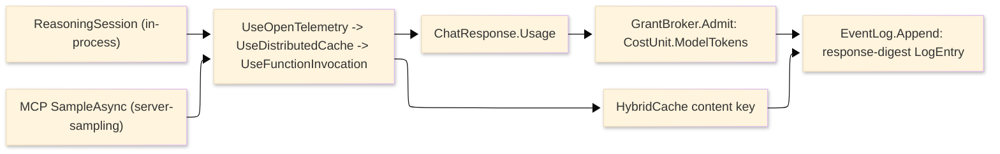

# [APPHOST_REASONING_RUNTIME]

The in-process reasoning surface for the runtime spine — the third agent front door beside the MCP server projection at `Agent/mcp.md` and the MCP client federation at `Agent/federation.md`: the host runs its own `IChatClient` tool-calling loop over its own capabilities with no external orchestrator. A `ReasoningSession` drives `IChatClient.GetStreamingResponseAsync` whose `ChatOptions.Tools` are the SAME brokered `CommandAIFunction` instances `Agent/mcp#METHOD_AXIS` mints — one tool-adoption seam, two front doors, never a second tool projection — so every model-invoked tool call routes through `CommandAlgebra.Run`, the `GrantBroker`, and the cost preview exactly as an operator or MCP tool call does. A `SemanticDiscovery` fold embeds each `CapabilityDescriptor` op surface through `IEmbeddingGenerator` and ranks by cosine similarity, adding `DiscoveryQuery.ByIntent(string)` as one new case on the `Agent/capability#DISCOVERY_FOLD` `[Union]` so an agent resolves intent to a capability by meaning rather than exact id and the flat lookup gains an intent-ranked path. The function-invocation transcript projects to `CommandReceipt` rows the `Runtime/determinism#EVENT_LOG` chains and the `#MACRO_ENGINE` records, so an agent reasoning run is a replayable, grant-metered, cost-bounded, content-addressed command sequence, never an opaque LLM call. One `ModelGovernance` middleware fold composes the `Microsoft.Extensions.AI` `ChatClientBuilder` decorators — `UseFunctionInvocation`/`UseDistributedCache`/`UseOpenTelemetry` — into the single model-governance owner: every model draw is metered in `CostUnit.ModelTokens` through the `GrantBroker`, content-cached over the `Runtime/resources#CACHE_PORT` `HybridCache`, traced through the GenAI span, and content-addressed into the `EventLog`, so a recorded reasoning turn replays from cache bit-identically and the in-process loop and the MCP server-sampling leg share one governance pipeline. The page owns the reasoning loop, the embedding-ranked intent discovery and its new query case, the replayable transcript, the model-governance middleware fold, and the gated experimental modal-input row; it consumes `CapabilityRegistry`/`DiscoveryQuery`/`CapabilityDescriptor`, `CommandAIFunction`/`McpRuntime`, `CommandAlgebra`/`CommandReceipt`, `GrantBroker`/`CostVector`/`CostUnit`, `EventLog`/`MacroEngine`/`DeterminismContext`, `CacheLane`/`HybridCache`, `TenantContext`, `ClockPolicy`, and `ReceiptSinkPort` as settled vocabulary and mints no eighth port.

## [01]-[INDEX]

- [01]-[REASONING_LOOP]: `ReasoningSession` over `IChatClient` streaming; `ChatOptions.Tools` is the brokered `CommandAIFunction`.
- [02]-[SEMANTIC_DISCOVERY]: `IEmbeddingGenerator` cosine fold; the `DiscoveryQuery.ByIntent` case over the registry.
- [03]-[REPLAYABLE_TRANSCRIPT]: Function-invocation transcript to `CommandReceipt` rows the `EventLog` chains and `MacroEngine` records.
- [04]-[MODEL_GOVERNANCE]: One middleware fold: model-selection routing, content-filter guardrail, token-to-cost-to-ledger, cached-response replay, and two model front doors.
- [05]-[MODAL_INPUT]: Gated `ModalClient` `[Union]` reading the same descriptor catalog.
- [06]-[TS_PROJECTION]: Reasoning-session, transcript, and intent-match wire shapes the dashboard consumes.

## [02]-[REASONING_LOOP]

- Owner: `ReasoningPolicy` the per-session loop-bound and tool-mode record; `ReasoningTurn` `[Union]` the streamed-turn disposition; `ReasoningSession` the static in-process agent-loop surface over `IChatClient.GetStreamingResponseAsync`.
- Cases: `ReasoningTurn` = Thinking | ToolCalled | Message | Completed | Faulted — the disposition a streamed reasoning turn folds to as the chat client surfaces text, reasoning content, function calls, and the finish reason.
- Entry: `Reason(ReasoningRuntime runtime, ReasoningPolicy policy, Seq<ChatMessage> conversation)` returns `IO<ReasoningTranscript>` — the loop streams `IChatClient.GetStreamingResponseAsync` with `ChatOptions.Tools` set to the brokered `CommandAIFunction` set, accumulates the `ChatResponseUpdate` stream into one `ChatResponse`, records each `FunctionCallContent`/`FunctionResultContent` pair as a transcript row, and terminates on the `ChatFinishReason` with the projected `ReasoningTranscript`.
- Auto: the `ChatOptions.Tools` list is the exact brokered `CommandAIFunction` set the `Agent/mcp#METHOD_AXIS` `ToolProjection.Adopt` mints — the loop reuses the one tool-adoption seam and never news up a second projection, so a model tool call and an MCP tool call route through the identical brokered invoker over `CommandAlgebra.Run`; the function-invocation iteration is the `MODEL_GOVERNANCE` `FunctionInvokingChatClient` decorator, not a hand-rolled call-and-feed loop — `ReasoningSession` supplies the tool set and the conversation, the decorator runs the tool-call cycle, and the session folds the resulting stream into turns; `ChatOptions.ToolMode` is the policy's `AutoChatToolMode`/`RequiredChatToolMode`/`NoneChatToolMode` row so a session forces, permits, or forbids tool use without a parallel flag; the streaming accumulation uses the `ChatResponseUpdate` stream so a long reasoning turn surfaces incrementally and the host fans interim `Thinking`/`Message` turns to the session reporter exactly as `STREAM_PROGRESS` fans MCP progress; `ChatOptions.Seed` binds to the `DeterminismContext` RNG seed so a recorded reasoning turn replays under the same sampling seed, and `MaximumIterationsPerRequest`/`MaximumConsecutiveErrorsPerRequest` trace to the policy's `DeadlineClass`-derived loop bound, never a literal.
- Receipt: each completed reasoning run mints one `ReasoningTranscript` (REPLAYABLE_TRANSCRIPT) whose rows are the `CommandReceipt`s the tool calls minted; the per-turn fan is the streamed turn itself, not a separate receipt; the session-open transition logs through one `SpineLog` event in the 1000-1099 EVENT stride (`FaultBand.SpineEvents`).
- Packages: Microsoft.Extensions.AI.Abstractions, LanguageExt.Core, NodaTime, Thinktecture.Runtime.Extensions, BCL inbox
- Growth: one turn disposition is one `ReasoningTurn` case breaking every fold arm; a new loop-policy column is one field on `ReasoningPolicy`; a new tool front door is the SAME `CommandAIFunction` set adopted by a new caller, never a new projection; zero new surface.
- Boundary: the reasoning loop is the in-process model-driven command owner — it never executes an op itself, it routes every tool call through the brokered `CommandAIFunction` onto the command algebra, so the transaction, grant, and cost semantics are the command algebra's and the loop is the model-driven dispatch over them; a tool set divorced from the `Agent/mcp#METHOD_AXIS` adoption seam is the deleted form, so the in-process loop and the MCP server share one tool catalog; the `IChatClient` the loop drives is the `MODEL_GOVERNANCE`-wrapped client, never a raw provider client, so an unmetered un-ledgered model draw cannot reach the loop; the loop owns the turn vocabulary and the session-scoped conversation buffer, while `MODEL_GOVERNANCE` owns the metering, caching, tracing, and content-addressing — the two never merge, so the loop stays the orchestration and the middleware stays the policy; a model call that bypasses the function-invocation decorator to invoke a tool directly is the deleted form, because the decorator is the one seam where `ChatOptions.Tools` becomes executed calls.

```csharp signature
// --- [MODELS] ---------------------------------------------------------------------------
public sealed record ReasoningPolicy(
    ChatToolMode ToolMode,
    int MaxIterations,
    int MaxConsecutiveErrors,
    DeadlineClass Deadline,
    Option<float> Temperature,
    Option<long> Seed) {
    public static ReasoningPolicy Auto(DeterminismContext context, DeadlineClass deadline) =>
        new(ChatToolMode.Auto, MaxIterations: 16, MaxConsecutiveErrors: 3, deadline, None, Some(context.Seed));

    public ChatOptions Options(Seq<AITool> tools) =>
        new() {
            Tools = tools.ToList(),
            ToolMode = ToolMode,
            Temperature = Temperature.Match(Some: static t => (float?)t, None: static () => (float?)null),
            Seed = Seed.Match(Some: static s => (long?)s, None: static () => (long?)null),
            AllowMultipleToolCalls = true,
        };
}

[Union(ConversionFromValue = ConversionOperatorsGeneration.None)]
public abstract partial record ReasoningTurn {
    private ReasoningTurn() { }
    public sealed record Thinking(string Reasoning) : ReasoningTurn;
    public sealed record ToolCalled(string CallId, string Tool, CommandReceipt Receipt) : ReasoningTurn;
    public sealed record Message(string Text) : ReasoningTurn;
    public sealed record Completed(ChatFinishReason Reason, UsageDetails Usage) : ReasoningTurn;
    public sealed record Faulted(string Detail) : ReasoningTurn;
}

// --- [SERVICES] -------------------------------------------------------------------------
public sealed record ReasoningRuntime(
    IChatClient Chat,
    McpRuntime Tools,
    Func<DegradationLevel> Level,
    GovernanceLedger Ledger,
    ClockPolicy Clocks,
    ReceiptSinkPort Sink,
    JsonSerializerOptions Wire);

// --- [OPERATIONS] -----------------------------------------------------------------------
public static class ReasoningSession {
    public static IO<ReasoningTranscript> Reason(ReasoningRuntime runtime, ReasoningPolicy policy, Seq<ChatMessage> conversation) =>
        from tools in IO.lift(() => AdoptedTools(runtime))
        from started in IO.lift(() => runtime.Clocks.Now)
        from response in IO.liftAsync(async () => await Accumulate(runtime.Chat, conversation, policy.Options(tools)))
        from elapsed in IO.lift(() => runtime.Clocks.Now - started)
        let rows = TranscriptRows(response)
        from transcript in IO.lift(() => ReasoningTranscript.Of(response, rows, started, elapsed))
        from _ in runtime.Sink.Send(Correlation.Mint(), TenantContext.Current, TelemetrySource.AppHost.Key, nameof(ReasoningSession), JsonSerializer.SerializeToElement(transcript, runtime.Wire))
        select transcript;

    static Seq<AITool> AdoptedTools(ReasoningRuntime runtime) =>
        ToolProjection.Project(runtime.Tools.Registry, runtime.Level(), runtime.Tools.SchemaOf, ReceiptSchema(runtime)).Tools
            .Map(tool => Function(runtime.Tools, tool, runtime.Wire));

    // The ONE tool-adoption seam, in-process front door: the SAME CommandAIFunction the MCP
    // server adopts at Agent/mcp#METHOD_AXIS, wrapped in ApprovalRequiredAIFunction
    // on an irreversible effect, but bound straight onto ChatOptions.Tools rather than through
    // McpServerTool.Create — the chat loop drives the AIFunction directly, the server registers
    // the same instance. A second tool projection is the deleted form.
    static AITool Function(McpRuntime runtime, McpTool tool, JsonSerializerOptions wire) =>
        new CommandAIFunction(runtime, tool, TenantContext.Current, Correlation.Mint(), wire) is var fn && tool.Irreversible
            ? new ApprovalRequiredAIFunction(fn)
            : fn;

    static async Task<ChatResponse> Accumulate(IChatClient chat, Seq<ChatMessage> conversation, ChatOptions options) {
        var updates = new List<ChatResponseUpdate>();
        await foreach (var update in chat.GetStreamingResponseAsync(conversation, options))
            updates.Add(update);
        return updates.ToChatResponse();
    }

    static Seq<ReasoningTurn> TranscriptRows(ChatResponse response) =>
        response.Messages.AsIterable()
            .Bind(static message => message.Contents.AsIterable())
            .Choose(static content => Row(content))
            .ToSeq();

    static Option<ReasoningTurn> Row(AIContent content) => content switch {
        TextReasoningContent reasoning => Some<ReasoningTurn>(new ReasoningTurn.Thinking(reasoning.Text)),
        TextContent text => Some<ReasoningTurn>(new ReasoningTurn.Message(text.Text)),
        FunctionResultContent result => Some<ReasoningTurn>(
            new ReasoningTurn.ToolCalled(result.CallId, FunctionName(result), ReceiptOf(result))),
        _ => None,
    };

    static string FunctionName(FunctionResultContent result) =>
        result.RawRepresentation is FunctionCallContent call ? call.Name : result.CallId;

    static CommandReceipt ReceiptOf(FunctionResultContent result) =>
        result.Result is ToolResult tool && tool.Content.HeadOrNone().IsSome
            ? new CommandReceipt(tool.Tool, new CommandTxn.Committed(SelectionReceipt.None), CostVector.Zero, None, Duration.Zero, tool.Correlation, TenantContext.Current, default)
            : new CommandReceipt("unknown", new CommandTxn.Refused(new CommandFault.Text("non-tool-result")), CostVector.Zero, None, Duration.Zero, Correlation.Mint(), TenantContext.Current, default);

    static JsonNode ReceiptSchema(ReasoningRuntime runtime) =>
        JsonNode.Parse(SuiteContracts.Schema<CommandReceipt>(runtime.Wire).GetRawText())!;
}
```

## [03]-[SEMANTIC_DISCOVERY]

- Owner: `IntentMatch` the ranked descriptor-to-intent projection; `EmbeddingIndex` the frozen descriptor-embedding cell; `SemanticDiscovery` the static embedding-rank fold; the new `DiscoveryQuery.ByIntent(string)` case extending `Agent/capability#DISCOVERY_FOLD`.
- Cases: `DiscoveryQuery` gains one case — `ByIntent(string Intent)` — alongside the settled `ById`/`BySurface`/`ByEffect`/`Permitting`/`All`, so the `Discover` switch is a total dispatch the new case breaks at compile time on every consumer arm; the registry's `Discover` fold gains the `byIntent` arm reading the embedding index.
- Entry: `Index(CapabilityRegistry registry, IEmbeddingGenerator<string, Embedding<float>> embedder)` returns `IO<EmbeddingIndex>` — embeds each descriptor's op-surface text into one frozen `Embedding<float>` per descriptor id at composition; `Rank(EmbeddingIndex index, IEmbeddingGenerator<string, Embedding<float>> embedder, string intent, int top)` returns `IO<Seq<IntentMatch>>` — embeds the intent string and ranks descriptors by cosine similarity over the frozen index, returning the top matches.
- Auto: the embedding index is a FROZEN projection over the registry built once at composition — `Index` folds `DiscoveryQuery.All` into the descriptor rows, embeds each row's `{surface}.{op}` text plus its effect/idempotency keys through one batched `IEmbeddingGenerator.GenerateAsync`, and freezes the result into a `FrozenDictionary<string, ReadOnlyMemory<float>>`, so discovery is a read-only vector lookup, never a runtime mutation, mirroring the `CapabilityRegistry` composition-freeze law; the cosine rank is `TensorPrimitives.CosineSimilarity` over the `Embedding<float>.Vector` span so the similarity computation rides the BCL numerics primitive, never a hand-rolled dot-product loop; `ByIntent` folds `Rank` to its top descriptors and projects them through the same `DiscoveryResult` projection the other query cases produce so an intent query and an id query return the identical result shape; the embedder is the `MODEL_GOVERNANCE`-wrapped `IEmbeddingGenerator` (`UseDistributedCache`/`UseOpenTelemetry` on the embedding builder) so an intent embedding is content-cached and an identical intent re-resolves from the cache without a fresh embedding draw.
- Receipt: `IntentMatch` carries the descriptor id, the cosine score, and the projected `DiscoveryResult`; the index build logs one `SpineLog` event; no parallel discovery receipt.
- Packages: Microsoft.Extensions.AI.Abstractions, LanguageExt.Core, Thinktecture.Runtime.Extensions, System.Numerics.Tensors, BCL inbox
- Growth: the `ByIntent` case is one `DiscoveryQuery` row breaking every consumer; a new ranking signal is one column on `IntentMatch`; a new embedding model is one `IEmbeddingGenerator` injection, never a second index; zero new surface.
- Boundary: the semantic discovery is the only intent-resolution owner — a keyword-match heuristic, a hand-tuned synonym table, and a per-op intent annotation are the deleted forms, so an agent resolving "compute the union of these meshes" to `TensorOpFamily.boolean-union` reads the one embedding rank; the `ByIntent` case extends the `Agent/capability#DISCOVERY_FOLD` `[Union]` rather than adding a parallel discovery surface, so the registry's `Discover` stays the single discovery entrypoint and the intent path is one fold arm; the embedding index is frozen at composition so a descriptor added after freeze is invisible to intent resolution until re-index, the same read-only-after-freeze contract the registry carries — a runtime descriptor-embedding mutation is the deleted form; the cosine rank is a similarity heuristic, not a guarantee, so an intent below the policy floor returns no match and the agent falls back to the exact-id path rather than dispatching a wrong tool; the embedded text is the op surface's self-description (`{surface}.{op}` plus effect/classification), never the op's body or arguments, so the index is metadata-only and an op's payload never leaks into an embedding.

```csharp signature
// --- [MODELS] ---------------------------------------------------------------------------
public sealed record IntentMatch(string Descriptor, float Score, DiscoveryResult Result);

public sealed record EmbeddingIndex(
    FrozenDictionary<string, ReadOnlyMemory<float>> Vectors,
    CapabilityRegistry Registry,
    float Floor) {
    public static readonly float DefaultFloor = 0.25f;
}

// --- [OPERATIONS] -----------------------------------------------------------------------
public static class SemanticDiscovery {
    public static IO<EmbeddingIndex> Index(CapabilityRegistry registry, IEmbeddingGenerator<string, Embedding<float>> embedder) =>
        registry.Discover(new DiscoveryQuery.All()) is var rows && rows.IsEmpty
            ? IO.pure(new EmbeddingIndex(FrozenDictionary<string, ReadOnlyMemory<float>>.Empty, registry, EmbeddingIndex.DefaultFloor))
            : from embeddings in IO.liftAsync(async () => await embedder.GenerateAsync(rows.Map(Surface).ToList()))
              let vectors = rows.Zip(embeddings.AsIterable().ToSeq())
                  .Map(static pair => KeyValuePair.Create(pair.First.Descriptor, pair.Second.Vector))
                  .ToFrozenDictionary(StringComparer.Ordinal)
              select new EmbeddingIndex(vectors, registry, EmbeddingIndex.DefaultFloor);

    public static IO<Seq<IntentMatch>> Rank(EmbeddingIndex index, IEmbeddingGenerator<string, Embedding<float>> embedder, string intent, int top) =>
        from query in IO.liftAsync(async () => await embedder.GenerateAsync(intent))
        let scored = index.Registry.Discover(new DiscoveryQuery.All())
            .Choose(row => index.Vectors.TryGetValue(row.Descriptor, out var vector)
                ? Some(new IntentMatch(row.Descriptor, Cosine(query.Vector.Span, vector.Span), row))
                : Option<IntentMatch>.None)
            .Filter(match => match.Score >= index.Floor)
            .OrderByDescending(static match => match.Score)
            .Take(top)
            .ToSeq()
        select scored;

    static string Surface(DiscoveryResult row) => $"{row.Surface}.{row.Descriptor} effect={row.Effect} idempotency={row.Idempotency}";

    static float Cosine(ReadOnlySpan<float> query, ReadOnlySpan<float> candidate) =>
        TensorPrimitives.CosineSimilarity(query, candidate);
}

// --- [TYPES] ----------------------------------------------------------------------------
// DiscoveryQuery.ByIntent is LANDED on Agent/capability#DISCOVERY_FOLD: the [Union] carries the
// case and CapabilityRegistry.Discover carries the byIntent arm over its composition-bound
// intent-rank delegate. This page BINDS that delegate at composition — the rank fold below closed
// over the frozen EmbeddingIndex and the resolved IEmbeddingGenerator:
//
//   new CapabilityRegistry(rows, intentRank: Some<Func<string, Seq<string>>>(intent =>
//       SemanticDiscovery.Rank(index, embedder, intent, top: 8).Run()
//           .Map(static match => match.Descriptor).ToSeq()));
//
// One union, one owner, one arm — this page authors the RANKING, never a second query surface.
```

## [04]-[REPLAYABLE_TRANSCRIPT]

- Owner: `ReasoningTranscript` the function-invocation transcript record; `TranscriptDigest` the content-address of the whole reasoning turn; `TranscriptProjection` the static transcript-to-`CommandReceipt`-and-`LogEntry` fold over the `Runtime/determinism#EVENT_LOG` chain and the `#MACRO_ENGINE`.
- Entry: `Chain(TranscriptRuntime runtime, EventLog.Chain chain, ReasoningTranscript transcript, DeterminismContext context)` returns `IO<(EventLog.Chain Chain, Seq<LogEntry> Entries)>` — folds each transcript tool-call row's `CommandReceipt` into the event-log chain through `EventLog.Append` so the reasoning turn's command sequence becomes a content-addressed, hash-chained log slice; `AsMacro(string macroId, Seq<LogEntry> entries, Seq<MacroParameter> parameters)` returns `Macro` — records the chained transcript slice as a reusable parameterized macro through `MacroEngine`-equivalent `Macro.Record`.
- Auto: the transcript's tool-call rows ARE the `CommandReceipt`s the brokered `CommandAIFunction` minted through `CommandAlgebra.Run`, so the transcript is a slice of the command-execution stream, never a separate recording format — each `ReasoningTurn.ToolCalled` carries the `CommandReceipt` the EVENT_LOG already knows how to chain; `Chain` folds those receipts through `EventLog.Append(chain, receipt, context, physical, logical)` so a reasoning turn's commands chain into the SAME hash-chained content-addressed log a live command chains into, and the chain's tamper-evidence proves the reasoning trace is unaltered; the transcript digest composes the kernel `ContentHash.Of` over the ordered tool-call content hashes plus the model response digest so an identical reasoning turn under an identical determinism context produces an identical transcript digest — the replay-skip and dedup key, one federation-wide content-identity algorithm; `AsMacro` records the chained log slice through `Macro.Record` so a reasoning run becomes a reusable parameterized workflow the `MacroEngine.Play` replays as an all-or-nothing batch, turning a one-off agent session into a callable operation; the model response itself content-addresses into the EVENT_LOG as one `LogEntry` (descriptor `agent.reasoning`, arguments digest = the conversation digest, determinism digest = the context fingerprint) so the model draw is on the chain beside its tool calls and `MODEL_GOVERNANCE` replays it from the `HybridCache` content key.
- Receipt: each chained tool-call row is one `LogEntry` on the event-log chain; the model response is one `LogEntry`; the whole turn is one `ReasoningTranscript` carrying its `TranscriptDigest`; the chain advance is the EVENT_LOG's own evidence, never a parallel transcript receipt.
- Packages: System.IO.Hashing, LanguageExt.Core, NodaTime, Thinktecture.Runtime.Extensions, BCL inbox
- Growth: one transcript column is one field on `ReasoningTranscript`; a new macro substitution point is one `MacroParameter` row on the recorded slice; a new digest input is one component on the kernel `ContentHash.Of` canonical bytes; zero new surface.
- Boundary: the transcript is the only reasoning-replay owner — an opaque LLM-call log, a free-text reasoning dump, and a separate agent-trace store are the deleted forms, so an agent reasoning run is a replayable command sequence the EVENT_LOG chains and the `REPLAY_VERIFY` rail proves bit-identical; the transcript rides the determinism kernel's owners (`EventLog`/`Macro`/`ContentHash`) so the reasoning trace and the command log are one stream, never a second event-sourcing truth — a reasoning turn's commands chain into the same `OpLog` changefeed a live command chains into; the macro projection reuses `Macro.Record`/`MacroEngine.Play` so a recorded reasoning run gains no privileged execution — it replays through the command algebra's brokered, grant-metered batch exactly as a hand-recorded macro does; the transcript digest is the bit-identity key so a replayed reasoning turn under the same context and the same cached model response reproduces the identical command sequence, and a divergent digest names the turn as non-reproducible; the model response `LogEntry` is content-addressed by the response digest so an identical prompt-under-context replays the SAME response from cache, making the model draw deterministic on replay — a fresh non-deterministic draw on replay is the deleted form.

```csharp signature
// --- [MODELS] ---------------------------------------------------------------------------
public sealed record ReasoningTranscript(
    string TranscriptId,
    TranscriptDigest Digest,
    Seq<ReasoningTurn> Turns,
    string ResponseDigest,
    CostVector ModelCost,
    Instant Started,
    Duration Elapsed) {
    public static ReasoningTranscript Of(ChatResponse response, Seq<ReasoningTurn> turns, Instant started, Duration elapsed) {
        var responseDigest = ContentHash.Of(
            Encoding.UTF8.GetBytes(string.Join("\n", response.Messages.AsIterable().Map(static m => m.Text)))).ToString("x32");
        var digest = TranscriptDigest.Of(turns, responseDigest);
        return new(
            TranscriptId: digest.Value,
            Digest: digest,
            Turns: turns,
            ResponseDigest: responseDigest,
            ModelCost: ModelGovernance.Tokens(response.Usage),
            Started: started,
            Elapsed: elapsed);
    }

    public Seq<CommandReceipt> Receipts =>
        Turns.Choose(static turn => turn is ReasoningTurn.ToolCalled called ? Some(called.Receipt) : Option<CommandReceipt>.None);
}

[ValueObject<string>(
    KeyMemberName = "Value",
    ConversionToKeyMemberType = ConversionOperatorsGeneration.Implicit,
    ConversionFromKeyMemberType = ConversionOperatorsGeneration.None)]
public readonly partial struct TranscriptDigest {
    // Kernel content identity — one algorithm, one seed; hex is the boundary projection.
    public static TranscriptDigest Of(Seq<ReasoningTurn> turns, string responseDigest) =>
        TranscriptDigest.Create(ContentHash.Of(Encoding.UTF8.GetBytes(
            $"{responseDigest}:{string.Join(':', turns.Choose(static t => t is ReasoningTurn.ToolCalled c ? Some(c.Receipt.Descriptor) : Option<string>.None))}")).ToString("x32"));
}

// --- [SERVICES] -------------------------------------------------------------------------
public sealed record TranscriptRuntime(
    DeterminismContext Context,
    ClockPolicy Clocks,
    Func<HashMap<string, JsonElement>, Seq<MacroParameter>> ParametersOf);

// --- [OPERATIONS] -----------------------------------------------------------------------
public static class TranscriptProjection {
    public static IO<(EventLog.Chain Chain, Seq<LogEntry> Entries)> Chain(TranscriptRuntime runtime, EventLog.Chain chain, ReasoningTranscript transcript, DeterminismContext context) =>
        from now in IO.lift(() => runtime.Clocks.Now)
        let model = new CommandReceipt("agent.reasoning", new CommandTxn.Committed(SelectionReceipt.None), transcript.ModelCost, None, transcript.Elapsed, Correlation.Mint(), TenantContext.Current, now)
        let receipts = model.Cons(transcript.Receipts)
        let folded = receipts.Fold((Chain: chain, Entries: Seq<LogEntry>(), Logical: 0UL), (acc, receipt) => {
            var (next, entry) = EventLog.Append(acc.Chain, receipt, context, now, acc.Logical);
            return (next, acc.Entries.Add(entry), acc.Logical + 1UL);
        })
        select (folded.Chain, folded.Entries);

    public static Macro AsMacro(string macroId, Seq<LogEntry> entries, Seq<MacroParameter> parameters) =>
        Macro.Record(macroId, entries, parameters);
}
```

## [05]-[MODEL_GOVERNANCE]

- Owner: `ModelRoute` `[SmartEnum<string>]` the model-selection row family discriminating target model by cost-tier/capability/variant under the `ComparerAccessors.StringOrdinal` accessor; `GovernanceLedger` the per-turn token-and-cost cell; `GovernedClient` the composed delegating-pipeline handle; `ModelGovernance` the static middleware-fold surface composing the `Microsoft.Extensions.AI` `ChatClientBuilder` decorators into the one model-governance owner, route, meter, cache, trace, and content-filter on one decorator chain.
- Cases: `ModelRoute` rows — `Economy`, `Balanced`, `Frontier`, `LongContext` — each carrying its provider model id and the `EffectClass` ceiling it admits, so a model draw routes to a target model by feature verdict rather than a fixed client; the routing arm reads the `Runtime/features#FLAG_VERDICT` `FlagVerdict` variant and maps it to the row, and an absent or below-floor verdict falls to the policy default route, never a hard-coded model.
- Entry: `Compose(GovernanceRuntime runtime, IChatClient inner)` returns `GovernedClient` — folds the inner `IChatClient` through `AsBuilder().UseOpenTelemetry(...).UseDistributedCache(...).Use(client => new GoverningChatClient(client, runtime)).UseFunctionInvocation(...).Build(sp)` so every model call rides the OTel span enclosing the cache lookup enclosing the one `GoverningChatClient` (model-selection rewrite plus content-filter guard) enclosing the function-invocation loop; `Charge(GovernanceRuntime runtime, GrantBroker broker, UsageDetails usage, CommandArguments arguments)` returns `Fin<CostVector>` — projects `ChatResponse.Usage` onto a `CostVector` charging `CostUnit.ModelTokens` through `GrantBroker.Admit` before the model commits; `Route(GovernanceRuntime runtime, EvaluationContext targeting)` returns `ModelRoute` — resolves the feature verdict to the target row the selection arm seats on `ChatOptions.ModelId`.
- Auto: the decorators compose ONCE at the capability-agent composition edge through `ChatClientBuilder` — `UseOpenTelemetry` (the GenAI `gen_ai.*` span the `Observability/telemetry#PROFILE_SIGNAL` fourth-signal source name registers), `UseDistributedCache` over the `Runtime/resources#CACHE_PORT` `CacheLane.ModelResult` `HybridCache` exposed as `IDistributedCache` so the model response cache and the suite content cache share one store, the one `GoverningChatClient : DelegatingChatClient` over `ChatClientBuilder.Use(client => new GoverningChatClient(client, runtime))` folding both governance arms into one public middleware subclass — its `GetResponseAsync`/`GetStreamingResponseAsync` overrides read the `Runtime/features#FLAG_VERDICT` `FlagVerdict` the admitted `OpenFeature` provider projects and rewrite `ChatOptions.ModelId` to the resolved `ModelRoute.Target` so an A/B variant or cost-tier verdict routes the draw without a second routing client beside `GovernedClient`, and run the pre-call prompt and post-call response (non-streaming `ChatResponse` and each streaming `ChatResponseUpdate`) through the `Wire/companion#CONTROL_SERVICE` `RedactionRegistration` `IRedactorProvider.GetRedactor(DataClassificationSet)` so a classified prompt redacts before the provider sees it and a PII-bearing completion redacts before it returns, and `UseFunctionInvocation` whose tools are the brokered `CommandAIFunction` from REASONING_LOOP so every model tool call routes through the command algebra; the `GoverningChatClient` overrides the inner client's response verbs through the public `DelegatingChatClient` base (the internal `AnonymousDelegatingChatClient` is uninstantiable from this package, so the one subclass over `Use(clientFactory)` is the public middleware seam) so the model-id rewrite is a per-request option mutation, never a per-route client instance, the cache key downstream incorporates the rewritten `ModelId` so two routes cache independently, and the response redacts in place through the resolved `Redactor.Redact` span API so the guard adds no second classification taxonomy beside `DataClassification`; the token-to-cost projection reads `ChatResponse.Usage` (`UsageDetails.InputTokenCount`/`OutputTokenCount`/`TotalTokenCount`) and maps it onto a `CostVector` carrying `CostUnit.ModelTokens` which `GrantBroker.Admit` charges against the tenant budget exactly as a native op's cost charges, so a model draw is metered in the same broker a tensor op is metered in, never a parallel model meter; the cached-response replay rides the `DistributedCachingChatClient` content key — an identical request-under-key (messages plus options including the routed `ModelId`) replays the cached `ChatResponse` rather than re-calling the provider, and the response-digest `LogEntry` the REPLAYABLE_TRANSCRIPT chains content-addresses the response so a recorded turn replays from the `HybridCache` content key bit-identically; `FunctionInvokingChatClient.MaximumIterationsPerRequest`/`MaximumConsecutiveErrorsPerRequest` are the REASONING_LOOP policy values, never literals, so the function-invocation loop bound traces to the agent's deadline class; the same fold composes the MCP server-sampling leg's `IChatClient` (the second model front door — `Agent/mcp#STREAM_PROGRESS` `SampleAsync`/`AsSamplingChatClient`) so both front doors inherit the same routing, content-filter, metering, caching, and tracing pipeline.
- Receipt: the broker charge is the `CommandReceipt.Charged` vector for the `agent.reasoning` model command the REPLAYABLE_TRANSCRIPT chains; the OTel span is the GenAI trace the observability fold carries; the selected `ModelRoute` key and the content-filter redaction count ride the same GenAI span as `gen_ai.*` attributes; the cached-response hit is one `SpineLog` event; no parallel governance receipt.
- Packages: Microsoft.Extensions.AI, Microsoft.Extensions.AI.Abstractions, Microsoft.Extensions.Caching.Hybrid, Microsoft.Extensions.Compliance.Redaction, OpenFeature, System.IO.Hashing, LanguageExt.Core, NodaTime, BCL inbox
- Growth: a new decorator is one `ChatClientBuilder.Use` arm on the fold; a new model route is one `ModelRoute` row carrying its provider model id and effect ceiling; a new content-filter classification is one `DataClassification` row the resolver reads; a new metered model resource rides the existing `CostUnit` axis; a new front door is the same `Compose` fold over a new `IChatClient`, never a second pipeline; zero new surface.
- Boundary: the middleware fold is the suite's only model-governance owner — a hand-rolled retry loop, a per-call OTel span beside the decorators, a second model-response cache, a model-routing client beside `GovernedClient`, a second `IChatClient` pipeline, and an unmetered un-ledgered model draw are the deleted forms, exactly the `ARCHITECTURE.md#[4]-[PROHIBITIONS]` NEVER-an-opaque-model-call clause; every `IChatClient` invocation across both front doors (the in-process reasoning loop and the MCP server-sampling leg) composes this one pipeline so the host has one model-governance seam covering the whole route-meter-cache-trace-filter category, not a per-call-site assembly; the model-selection arm reads the `Runtime/features#FLAG_VERDICT` `FlagVerdict` at the composition seam and routes by rewriting `ChatOptions.ModelId`, so routing is one decorator arm composing against the feature verdict rather than a parallel model cache or a routing client — an unrouted draw falls to the policy default `ModelRoute`, never an unguarded provider default; the content-filter arm redacts through the one `RedactionRegistration` `Redactor` over the `DataClassification` taxonomy so prompt classification and response PII redaction reuse the existing compliance owner, never a second filter taxonomy, and every routed-and-filtered draw still charges `Charge -> GrantBroker.Admit` so a content-gated draw is metered exactly as an ungated one; the cache is the `Runtime/resources#CACHE_PORT` `HybridCache` exposed as `IDistributedCache` so there is one cache owner across the model response cache and the suite content cache, never a second; the cost meter is the `Agent/capability#GRANT_BROKER` charging `CostUnit.ModelTokens` so the model budget rides the one broker and a budget-exhausted tenant degrades to `ReadOnly` through the same degradation rail rather than a parallel throttle; the OTel span is the `Observability/telemetry#PROFILE_SIGNAL` GenAI source so the model trace, the route key, and the filter count are one signal, never a per-call span; the content-addressed response `LogEntry` is the replay key so a recorded reasoning turn replays its model response from cache deterministically — a fresh provider draw on replay is the deleted form.

```csharp signature
// --- [TYPES] ----------------------------------------------------------------------------
// The model-selection axis: one row per cost-tier/capability/variant carrying the provider model
// id and the EffectClass ceiling it admits. The UseModelSelection arm maps a Runtime/features
// FlagVerdict variant onto a row and rewrites ChatOptions.ModelId — never a routing client per row.
[SmartEnum<string>]
[KeyMemberEqualityComparer<ComparerAccessors.StringOrdinal, string>]
[KeyMemberComparer<ComparerAccessors.StringOrdinal, string>]
public sealed partial class ModelRoute {
    public static readonly ModelRoute Economy = new("economy", target: "gpt-economy", ceiling: EffectClass.Read);
    public static readonly ModelRoute Balanced = new("balanced", target: "gpt-balanced", ceiling: EffectClass.External);
    public static readonly ModelRoute Frontier = new("frontier", target: "gpt-frontier", ceiling: EffectClass.Irreversible);
    public static readonly ModelRoute LongContext = new("long-context", target: "gpt-long-context", ceiling: EffectClass.External);

    public string Target { get; }
    public EffectClass Ceiling { get; }

    public static readonly ModelRoute Default = Balanced;

    // The feature verdict's variant string keys the route; an unknown or below-floor variant
    // resolves to the policy default, never a hard-coded provider default.
    public static ModelRoute From(FlagVerdict verdict) =>
        TryGet(verdict.Variant, out var row) ? row : Default;
}

// --- [MODELS] ---------------------------------------------------------------------------
public sealed record GovernanceLedger(
    Atom<HashMap<TenantId, CostVector>> Cell) {
    public static GovernanceLedger Empty => new(Atom(HashMap<TenantId, CostVector>()));

    public CostVector Record(TenantId tenant, CostVector cost) =>
        Cell.Swap(map => map.AddOrUpdate(tenant, existing => existing.Add(cost), cost)).Find(tenant).IfNone(CostVector.Zero);
}

public sealed record GovernedClient(IChatClient Client, GovernanceLedger Ledger);

// --- [SERVICES] -------------------------------------------------------------------------
public sealed record GovernanceRuntime(
    IServiceProvider Services,
    IDistributedCache Cache,
    ILoggerFactory Loggers,
    string TelemetrySource,
    int MaxIterations,
    int MaxConsecutiveErrors,
    GovernanceLedger Ledger,
    Func<EvaluationContext, FlagVerdict> Verdict,
    Func<EvaluationContext> Targeting,
    DataClassificationSet FilterClassification,
    IRedactorProvider Redactors);

// --- [OPERATIONS] -----------------------------------------------------------------------
// The model-selection-and-content-filter arm is one named DelegatingChatClient subclass — the public
// recommended middleware base (Microsoft.Extensions.AI.DelegatingChatClient, the one whose GetResponseAsync/
// GetStreamingResponseAsync are virtual pass-throughs over InnerClient). The internal AnonymousDelegatingChatClient
// is uninstantiable from this package, so a model-id rewrite plus a prompt/response redaction compose as ONE
// subclass overriding both response verbs, woven through the public ChatClientBuilder.Use(inner => ...) seam —
// never a second pipeline, never the internal type. Two parallel decorator arms collapse into one governing client.
public sealed class GoverningChatClient(IChatClient inner, GovernanceRuntime runtime) : DelegatingChatClient(inner) {
    ChatOptions? Route(ChatOptions? options) =>
        ModelGovernance.Route(runtime, runtime.Targeting()) is var route
            ? (options ?? new ChatOptions()) is var o && o.ModelId != route.Target ? o with { ModelId = route.Target } : o
            : options;

    Seq<ChatMessage> Guard(Redactor redactor, IEnumerable<ChatMessage> messages) =>
        messages.AsIterable().Map(m => m.Text is { Length: > 0 } text ? new ChatMessage(m.Role, redactor.Redact(text)) : m).ToSeq();

    static ChatResponse Redact(Redactor redactor, ChatResponse response) {
        foreach (var message in response.Messages)
            for (var i = 0; i < message.Contents.Count; i++)
                if (message.Contents[i] is TextContent { Text: { Length: > 0 } body })
                    message.Contents[i] = new TextContent(redactor.Redact(body));
        return response;
    }

    public override async Task<ChatResponse> GetResponseAsync(IEnumerable<ChatMessage> messages, ChatOptions? options = null, CancellationToken cancellationToken = default) {
        var redactor = runtime.Redactors.GetRedactor(runtime.FilterClassification);
        return Redact(redactor, await base.GetResponseAsync(Guard(redactor, messages), Route(options), cancellationToken).ConfigureAwait(false));
    }

    public override async IAsyncEnumerable<ChatResponseUpdate> GetStreamingResponseAsync(IEnumerable<ChatMessage> messages, ChatOptions? options = null, [EnumeratorCancellation] CancellationToken cancellationToken = default) {
        var redactor = runtime.Redactors.GetRedactor(runtime.FilterClassification);
        await foreach (var update in base.GetStreamingResponseAsync(Guard(redactor, messages), Route(options), cancellationToken).ConfigureAwait(false)) {
            for (var i = 0; i < update.Contents.Count; i++)
                if (update.Contents[i] is TextContent { Text: { Length: > 0 } body })
                    update.Contents[i] = new TextContent(redactor.Redact(body));
            yield return update;
        }
    }
}

public static class ModelGovernance {
    public static GovernedClient Compose(GovernanceRuntime runtime, IChatClient inner) =>
        new(
            inner.AsBuilder()
                .UseOpenTelemetry(runtime.Loggers, runtime.TelemetrySource)
                .UseDistributedCache(runtime.Cache)
                .Use(client => new GoverningChatClient(client, runtime))
                .UseFunctionInvocation(runtime.Loggers, fi => {
                    fi.MaximumIterationsPerRequest = runtime.MaxIterations;
                    fi.MaximumConsecutiveErrorsPerRequest = runtime.MaxConsecutiveErrors;
                    fi.TerminateOnUnknownCalls = true;
                })
                .Build(runtime.Services),
            runtime.Ledger);

    public static ModelRoute Route(GovernanceRuntime runtime, EvaluationContext targeting) =>
        ModelRoute.From(runtime.Verdict(targeting));

    public static CostVector Tokens(UsageDetails? usage) =>
        usage is { TotalTokenCount: { } total }
            ? new CostVector(HashMap((CostUnit.ModelTokens, total)))
            : CostVector.Zero;

    public static Fin<CostVector> Charge(GovernanceRuntime runtime, GrantBroker broker, UsageDetails usage, CommandArguments arguments) =>
        broker.Admit(ModelDescriptor(Tokens(usage)), arguments, dryRun: false)
            .Map(charged => runtime.Ledger.Record(arguments.Tenant.TenantId, charged));

    static CapabilityDescriptor ModelDescriptor(CostVector cost) =>
        CapabilityDescriptor.Of(
            surface: "agent",
            op: "reasoning",
            effect: EffectClass.External,
            idempotency: Idempotency.NonIdempotent,
            cost: new CostModel(cost, static _ => CostVector.Zero),
            permission: new PermissionShape(FrozenSet<string>.Empty, EffectClass.External, DataClassification.Operational),
            compile: static _ => Fin.Fail<ComputeIntent>(new CommandFault.CompileRejected("model-draw-is-not-a-compute-intent")));
}
```

The `FlagVerdict` the `UseModelSelection` arm reads is the `Runtime/features#FLAG_VERDICT` seam shape the admitted `OpenFeature` provider projects — `(string FlagKey, string Variant, bool Enabled, string Reason)` over `FlagEvaluationDetails<Value>`. This page composes against that verdict at the seam and never owns the `OpenFeature` evaluator; the `Runtime/features.md` owner lands it as the `TARGETED_DELIVERY_EXPERIMENTATION` leg, so a host without the features rail seats the policy-default `ModelRoute.From` fallback and the routing arm is inert.



## [06]-[MODAL_INPUT]

- Owner: `ModalKind` the modal-input feature row; `ModalClient` `[Union]` the two `[Experimental("MEAI001")]` modal clients behind a feature gate; `ModalIntake` the static modal-to-intent surface reading the same descriptor catalog.
- Cases: `ModalClient` = Speech(`ISpeechToTextClient`) | Image(`IImageGenerator`) — a CLOSED 2-case family carrying DISTINCT surfaces, so a `[Union]` is the honest collapse, never a `[SmartEnum]` over a shared interface; speech transcribes an audio stream to a command intent the SEMANTIC_DISCOVERY fold resolves, image renders an intent-to-image draw the descriptor catalog gates.
- Entry: `Transcribe(ModalRuntime runtime, ModalClient.Speech speech, Stream audio)` returns `IO<string>` — transcribes an audio stream through `ISpeechToTextClient.GetTextAsync` to the intent text the SEMANTIC_DISCOVERY `Rank` resolves; `Render(ModalRuntime runtime, ModalClient.Image image, string prompt)` returns `IO<DataContent>` — generates an image through `IImageGenerator.GenerateAsync` as a modal output the descriptor catalog gates by effect class.
- Auto: both modal clients carry `[Experimental("MEAI001")]` so the cluster is gated behind one `ModalKind` feature row and a host without the modal feature never news up a modal client; the speech leg transcribes to intent text the SEMANTIC_DISCOVERY fold ranks so speech-to-command rides the SAME embedding-rank path a typed intent rides, never a parallel command parser; the image leg's `IImageGenerator.GenerateAsync` draw rides the MODEL_GOVERNANCE meter (image generation charges `CostUnit.ModelTokens` through the broker exactly as a chat draw does) so a modal model draw is metered and ledgered like every other; a new modality (text-to-speech reply, realtime session) is one `ModalClient` case reading the same descriptor catalog, never a new agent surface.
- Receipt: a modal-resolved command mints its `CommandReceipt` through the command algebra exactly as a typed command does; the modal draw's cost rides the MODEL_GOVERNANCE charge; no parallel modal receipt.
- Packages: Microsoft.Extensions.AI.Abstractions, LanguageExt.Core, Thinktecture.Runtime.Extensions, BCL inbox
- Growth: one modality is one `ModalClient` case breaking every consumer arm; a new modal feature gate is one `ModalKind` row; zero new surface.
- Boundary: the modal input is the only multi-modal agent-intake owner — a parallel speech parser, a separate image pipeline, and an ungated experimental client are the deleted forms; the `[Experimental("MEAI001")]` clients stay behind the feature row so the modal surface is opt-in and a non-modal host carries zero modal cost; speech-to-command resolves through the one SEMANTIC_DISCOVERY rank so a spoken intent and a typed intent share the resolution path; the image draw rides the one MODEL_GOVERNANCE pipeline so a modal model draw is metered, cached, traced, and ledgered exactly as a chat draw — an unmetered modal draw is the deleted form; a modal client carries DISTINCT surfaces (`ISpeechToTextClient` vs `IImageGenerator`) so the `[Union]` is the honest collapse and a `[SmartEnum]` flattening two unrelated client contracts into one accessor is the deleted form; the modal output is data the descriptor catalog gates by effect class, never a privileged side channel.

```csharp signature
// --- [TYPES] ----------------------------------------------------------------------------
[SmartEnum<string>]
[KeyMemberEqualityComparer<ComparerAccessors.StringOrdinal, string>]
[KeyMemberComparer<ComparerAccessors.StringOrdinal, string>]
public sealed partial class ModalKind {
    public static readonly ModalKind Speech = new("speech");
    public static readonly ModalKind Image = new("image");
}

[Experimental("MEAI001")]
[Union(ConversionFromValue = ConversionOperatorsGeneration.None)]
public abstract partial record ModalClient {
    private ModalClient() { }
    public sealed record Speech(ISpeechToTextClient Client) : ModalClient;
    public sealed record Image(IImageGenerator Client) : ModalClient;
}

// --- [SERVICES] -------------------------------------------------------------------------
public sealed record ModalRuntime(
    FrozenSet<ModalKind> Enabled,
    ClockPolicy Clocks);

// --- [OPERATIONS] -----------------------------------------------------------------------
[Experimental("MEAI001")]
public static class ModalIntake {
    public static IO<string> Transcribe(ModalRuntime runtime, ModalClient.Speech speech, Stream audio) =>
        runtime.Enabled.Contains(ModalKind.Speech)
            ? IO.liftAsync(async () => (await speech.Client.GetTextAsync(audio)).Text ?? string.Empty)
            : IO.fail<string>(new FeatureFault.ProviderNotReady("modal-speech"));

    public static IO<DataContent> Render(ModalRuntime runtime, ModalClient.Image image, string prompt) =>
        runtime.Enabled.Contains(ModalKind.Image)
            ? IO.liftAsync(async () => (await image.Client.GenerateAsync(new ImageGenerationRequest(prompt)))
                .Contents.AsIterable().OfType<DataContent>().Head())
            : IO.fail<DataContent>(new FeatureFault.ProviderNotReady("modal-image"));
}
```

## [07]-[TS_PROJECTION]

- Owner: `ReasoningTranscriptWire`, `ReasoningTurnWire`, `IntentMatchWire`, `GovernanceUsageWire` — the reasoning-session, transcript, intent-match, and token-usage wire shapes the dashboard consumes; the per-command receipts ride the existing `Runtime/ports#TS_PROJECTION` `ReceiptEnvelopeWire` and the `Agent/capability#TS_PROJECTION` `CapabilityCommandReceiptWire`, single-minted there and bound here as the transcript's tool-call payload, never re-authored.
- Entry: the reasoning transcript crosses as the `ReasoningTranscriptWire` the dashboard reasoning timeline ingests, the turn sequence crosses as a literal-discriminated union the timeline renders, the intent matches cross as the ranked `IntentMatchWire[]` the command palette surfaces, and the token usage crosses as the `GovernanceUsageWire` the cost dashboard charts.
- Packages: BCL inbox
- Growth: one wire-member row per new transcript or turn field; the turn sequence crosses as a literal-discriminated union; zero new surface.
- Boundary: the reasoning turn reconstructs in TS as a literal-discriminated union on the turn kind, mirroring the `ReasoningTurn` `[Union]` cases, so the dashboard renders a reasoning trace without re-deriving the turn shape; the transcript digest crosses as the content-address string so the dashboard groups replayable turns by digest and a re-run identical turn renders as the same trace; the tool-call rows carry the `Agent/capability#TS_PROJECTION` `CapabilityCommandReceiptWire` (the same wire the command palette already reads) so a reasoning-driven command and an operator-driven command render identically — a branch-side reasoning-receipt mint is the named drift defect this projection deletes; the intent match crosses as the descriptor id, the cosine score, and the projected `DiscoveryResultWire` so the dashboard ranks an intent resolution by score without re-running the embedding fold; the token usage crosses as the input/output/total counts the cost dashboard charts against the `CostUnit.ModelTokens` budget the broker meters.

```ts contract
interface GovernanceUsageWire {
  readonly inputTokens: number;
  readonly outputTokens: number;
  readonly totalTokens: number;
}

type ReasoningTurnWire =
  | { readonly kind: "thinking"; readonly reasoning: string }
  | { readonly kind: "tool-called"; readonly callId: string; readonly tool: string; readonly receipt: CapabilityCommandReceiptWire }
  | { readonly kind: "message"; readonly text: string }
  | { readonly kind: "completed"; readonly reason: string; readonly usage: GovernanceUsageWire }
  | { readonly kind: "faulted"; readonly detail: string };

interface ReasoningTranscriptWire {
  readonly transcriptId: string;
  readonly digest: string;
  readonly turns: ReadonlyArray<ReasoningTurnWire>;
  readonly responseDigest: string;
  readonly modelCost: Readonly<Record<CostUnitKey, number>>;
  readonly started: string;
  readonly elapsed: string;
}

interface IntentMatchWire {
  readonly descriptor: string;
  readonly score: number;
  readonly result: DiscoveryResultWire;
}
```

## [08]-[RESEARCH]

The settled-fence members verify against the folder `.api/api-extensions-ai.md` (`Microsoft.Extensions.AI.Abstractions`) and `.api/api-extensions-ai-middleware.md` (`Microsoft.Extensions.AI`) catalogues: `IChatClient.GetStreamingResponseAsync(messages, options?, ct)` returning `IAsyncEnumerable<ChatResponseUpdate>` ([api-extensions-ai.md] entry `[2]`), `ChatOptions` carrying `Tools`/`ToolMode`/`Temperature`/`Seed`/`AllowMultipleToolCalls` (`ChatOptions` properties `[9]`/`[10]`/`[1]`/`[7]`/`[15]`), `IEmbeddingGenerator<TInput,TEmbedding>.GenerateAsync(values, options?, ct)` (embedding entry `[1]`) with the scalar `EmbeddingGeneratorExtensions.GenerateAsync` overload (`[3]`), `Embedding<TEmbedding>` (embedding type `[4]`) carrying the typed vector, `UsageDetails` (`[12]`) with `InputTokenCount`/`OutputTokenCount`/`TotalTokenCount`, the `ChatClientBuilder.AsBuilder()`/`UseOpenTelemetry`/`UseDistributedCache`/`UseFunctionInvocation`/`Build` builder chain (middleware entries `[1]`/`[6]`/`[5]`/`[4]`/`[3]`), `FunctionInvokingChatClient.MaximumIterationsPerRequest`/`MaximumConsecutiveErrorsPerRequest`/`TerminateOnUnknownCalls` (decorator-tuning `[1]`/`[2]`/`[6]`), and the `[Experimental("MEAI001")]` `ISpeechToTextClient.GetTextAsync`/`IImageGenerator.GenerateAsync` modal clients (modal type `[1]`/`[3]`, modal entry `[1]`/`[5]`). The brokered `CommandAIFunction : AIFunction` tool-adoption seam and `ToolProjection.Project`/`Adopt` verify against `Agent/mcp#METHOD_AXIS`; the `CommandReceipt`/`CommandAlgebra.Run`/`CostVector`/`CostUnit.ModelTokens`/`GrantBroker.Admit`/`DiscoveryQuery`/`DiscoveryResult` vocabulary against `Agent/capability`; `EventLog.Append`/`VerifyChain`/`Macro.Record`/`ContentHash` against `Runtime/determinism#EVENT_LOG`/`#MACRO_ENGINE`; the `CacheLane.ModelResult` `HybridCache`-as-`IDistributedCache` against `Runtime/resources#CACHE_PORT`. Each card below states the binding shape over the catalogued members.

- [STREAM_ACCUMULATION]: the `ChatResponseUpdate` stream folds to one `ChatResponse` through `ToChatResponse(this IEnumerable<ChatResponseUpdate>)` (the `Microsoft.Extensions.AI.Abstractions` streaming-update extension, with the `ToChatResponseAsync(this IAsyncEnumerable<ChatResponseUpdate>, CT)` async sibling); the `FunctionResultContent.Result` (`object?`) and `FunctionResultContent.RawRepresentation` (`object?`, inherited from `AIContent`) accessors and `FunctionCallContent.Name` (`string`) the transcript projection reads are catalogue-settled members the projection composes directly. The `IChatClient` the loop drives is always the MODEL_GOVERNANCE `GovernedClient.Client`, so the function-invocation iteration is the `FunctionInvokingChatClient` decorator's loop, never a host-rolled call-and-feed.
- [EMBEDDING_RANK]: the cosine rank is `System.Numerics.Tensors.TensorPrimitives.CosineSimilarity(ReadOnlySpan<float>, ReadOnlySpan<float>)` over the `Embedding<float>.Vector` `ReadOnlyMemory<float>` span; `IEmbeddingGenerator<string, Embedding<float>>.GenerateAsync` batches the descriptor surfaces into one `GeneratedEmbeddings<Embedding<float>>` the index freezes. `System.Numerics.Tensors` 10.0.9 is already admitted at `Directory.Packages.props` (the single-owner manifest), so the SEMANTIC_DISCOVERY cosine fold carries no manifest delta; the embedding generator and the descriptor surface text are catalogue-settled. The embedding index is a frozen composition projection, host-validatable with no live embedding probe — an identical descriptor set produces an identical index, so the index build is reproducible offline.
- [MODEL_GOVERNANCE_PIPELINE]: the decorator fold composes the catalogued `ChatClientBuilder` extensions at the capability-agent composition edge; the `IDistributedCache` the `UseDistributedCache` decorator rides is the `Runtime/resources#CACHE_PORT` `CacheLane.ModelResult` `HybridCache` exposed as `IDistributedCache` (the `Microsoft.Extensions.Caching.Hybrid` `HybridCache` implements the `IDistributedCache`-compatible store the decorator keys over), so the model response cache and the suite content cache share one store. The `Microsoft.Extensions.AI` concrete package is ALREADY admitted (README `[CAPABILITY_AGENT]` registry + the central manifest's `Concrete model-governance middleware` row), so the `[MODEL_GOVERNANCE]` cluster carries no manifest delta — the abstractions package and the concrete middleware package are both present.
- [GUARDRAIL_MIDDLEWARE]: the one `GoverningChatClient` arm is a subclass of the public `Microsoft.Extensions.AI.DelegatingChatClient` base (the recommended custom-`IChatClient`-middleware base whose `GetResponseAsync`/`GetStreamingResponseAsync`/`GetService` are `virtual` pass-throughs over the `protected InnerClient`, decompile-confirmed `public class DelegatingChatClient : IChatClient` in `Microsoft.Extensions.AI.Abstractions` 10.7.0), woven through `ChatClientBuilder.Use(Func<IChatClient,IChatClient>)` (`api-extensions-ai-middleware.md` builder-call `[02]`) as `Use(client => new GoverningChatClient(client, runtime))` — the internal `Microsoft.Extensions.AI.AnonymousDelegatingChatClient` (decompile-confirmed `internal sealed class` in `Microsoft.Extensions.AI` 10.7.0, the implementation behind the public `Use(sharedFunc)`/`ConfigureOptions` overloads) is uninstantiable from this package, and its `sharedFunc` overload exposes only a `Func<...,Task>` `next` with no response handle so it cannot redact a `ChatResponse`, so the response-mutating governance arm is the `DelegatingChatClient` subclass, never the internal type and never the `sharedFunc` overload; a per-request `ChatOptions.ModelId` rewrite and an in-place prompt/response redaction compose as the subclass's two response-verb overrides with no provider coupling, and the `ChatMessage`/`TextContent` `with`-rewrite, the `ChatResponse.Messages[].Contents[]` mutation, and the per-`ChatResponseUpdate.Contents[]` streaming mutation are catalogue-settled `Microsoft.Extensions.AI.Abstractions` shapes. The content-filter redactor is `IRedactorProvider.GetRedactor(DataClassificationSet)` returning a `Redactor` whose `Redact(string)` span API masks in place (`api-redaction.md` provider-lookup `[07]`, redactor-contract `[01]`), the same `Microsoft.Extensions.Compliance.Redaction` owner the `Wire/companion#CONTROL_SERVICE` `RedactionRegistration` binds — no second redaction taxonomy. `Microsoft.Extensions.Compliance.Redaction` and `OpenFeature` are both already admitted (`Rasm.AppHost.csproj` `[OBSERVABILITY]`/`[FEATURE_FLAGS]` rows), so the guardrail cluster carries no manifest delta.
- [MODEL_ROUTING_VERDICT]: the `UseModelSelection` arm reads the `Runtime/features#FLAG_VERDICT` `FlagVerdict` the admitted `OpenFeature` 2.14.0 provider projects through `FeatureClient.GetObjectDetailsAsync` returning `FlagEvaluationDetails<Value>` (`api-openfeature.md` value-surface, with `OpenFeature.Model.Value`/`FlagEvaluationDetails`/`EvaluationContext` confirmed present in the 2.14.0 decompile), so the `Variant`/`Reason` the route reads is the standard OpenFeature evaluation result; the `ModelRoute.From(verdict)` fold maps the variant string to the row and falls to `ModelRoute.Default` on an unknown or below-floor variant. The `Runtime/features.md` owner (the `TARGETED_DELIVERY_EXPERIMENTATION` leg) lands the config-backed provider and the `FlagVerdict` shape; this page composes against the verdict seam and is design-complete against the seam contract, with the routing arm inert (default route) on a host without the features rail.
- [SDK_SAMPLING_FRONT_DOOR]: the second model front door — the MCP server-sampling leg (`McpServer.SampleAsync(IEnumerable<ChatMessage> messages, ChatOptions?, JsonSerializerOptions?, CT)` returning `Task<ChatResponse>` / `AsSamplingChatClient(JsonSerializerOptions?)` returning `IChatClient`) — is the SAME `GovernedClient` the in-process loop drives, composed once and shared, so both front doors meter through the one pipeline. These `McpServer` session verbs are catalogue-settled at `.api/api-mcp.md` server-session-long-running-verb rows [1]-[3] (the `T-MCP-LONG-RUNNING-CATALOG` catalogue landed them at their true declaring type `McpServer`, with `AsSamplingChatClient` filed as the SDK server-sampling-to-`IChatClient` bridge, never an `Microsoft.Extensions.AI` member), so the second-front-door spellings are catalogue-verified and the governance fold composes the `AsSamplingChatClient` `IChatClient` directly. The governance fold rests on catalogue-settled `Microsoft.Extensions.AI` middleware members plus this MCP bridge, so the cluster is design-complete.
- [BUILD_ORDER]: `ReasoningRuntime` embeds `McpRuntime` (the `Agent/mcp#TOOL_DISPATCH` runtime record) and `GovernanceLedger` by type, transitively pulling `CapabilityRegistry`/`CommandRuntime`/`GrantBroker` and the cross-page settled vocabulary, so `Agent/mcp.md`, `Agent/capability.md`, `Runtime/determinism.md`, and `Runtime/resources.md` settle before this page transcribes. The `ModelGovernance.Compose` fold runs at the capability-agent composition edge once over the injected provider `IChatClient`, and the `SemanticDiscovery.Index` runs once at composition over the frozen registry; both are composition-time folds, not interior per-call constructions.
