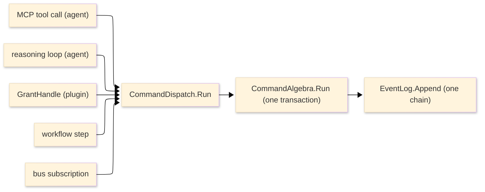

# [APPHOST_COMMAND_DISPATCH]

The named command-dispatch owner the runtime spine referenced but nowhere declared: one `CommandDispatch` front-door surface consolidating the `Agent/capability#COMMAND_ALGEBRA` commit-or-rollback transaction, the `Agent/mcp#METHOD_AXIS` brokered `CommandAIFunction` tool-adoption seam, and the `CommandReceipt` chaining the three front doors share — the MCP tool call, the in-process reasoning loop, and the plugin `GrantHandle` route — so the durable-orchestration spine and the event-bus subscriptions drive steps through one declared `Run(ComputeIntent) -> CommandReceipt` entry rather than a dangling reference. This is a restructure that names an existing-but-undeclared owner, not a new capability: `CommandAlgebra` stays the one transaction owner at `Agent/capability.md`, `EventLog` stays the one chained log on the durable `OpLog`, and this page forks no second dispatcher — it declares the dispatch front door, the three-caller invariant, and the orchestration seam, consuming `CommandAlgebra`/`CommandRuntime`/`CommandReceipt`/`ComputeIntent`, `McpRuntime`/`CommandAIFunction`/`ToolProjection`/`ToolResult`, `GrantHandle`/`BrokeredCall`/`CallerModality`, `EventLog`/`DeterminismContext`, `CapabilityRegistry`/`DiscoveryQuery`, `TenantContext`, and `ClockPolicy` as settled vocabulary and minting no eighth port.

## [01]-[INDEX]

- [01]-[DISPATCH_FRONT_DOOR]: One `Run(ComputeIntent) -> CommandReceipt` entry the three front doors and the orchestration steps share.
- [02]-[ADOPTION_SEAM]: The one brokered `CommandAIFunction` tool-adoption seam MCP serving and the reasoning loop both reuse.
- [03]-[RECEIPT_CHAIN]: `CommandReceipt` projection and the `EventLog` chain advance every dispatch lands on.

## [02]-[DISPATCH_FRONT_DOOR]

- Owner: `CommandIntent` the front-door request carrier (descriptor id, arguments, caller modality); `CommandDispatch` the static command-dispatch front-door surface over the one `CommandAlgebra.Run` transaction; `DispatchRuntime` the dependency record threading the `CommandRuntime`, the `EventLog` chain cell, and the determinism context.
- Cases: three front doors map to one transaction — `CallerModality.Agent` for the MCP tool call and the in-process reasoning loop, `CallerModality.Operator` for the interactive host command, `CallerModality.Plugin` for the sandboxed-plugin `GrantHandle` route; one orchestration consumer — the durable workflow step and the event-bus subscription both invoke the same `Run`.
- Entry: `Run(DispatchRuntime runtime, CommandIntent intent)` returns `IO<CommandReceipt>` — the one front-door entry routes the command through `CommandAlgebra.Run`, chains the resulting `CommandReceipt` into the `EventLog`, and returns the receipt; `Project(CommandReceipt receipt)` returns `ToolResult` — the structured projection the MCP and plugin callers read, identical to the `Agent/mcp#TOOL_DISPATCH` `McpDispatch.Project`.
- Auto: `Run` resolves the descriptor through `CapabilityRegistry.Resolve` and dispatches through `CommandAlgebra.Run` so the transaction, grant brokerage, cost metering, and Compute dispatch are the command algebra's exactly as a direct `CommandAlgebra.Run` call — this surface adds no second transaction, it names the front door the orchestration and bus drive through; every committed dispatch chains its `CommandReceipt` into the `EventLog` through `EventLog.Append` under the determinism context so a dispatched command is on the same hash-chained content-addressed log a reasoning transcript chains into, advancing the one chain cell; the caller modality rides the `CommandIntent` so an operator, agent, and plugin call land one transaction discriminated only by the `BrokeredCall` modality the `Sandbox/isolation#GRANT_HANDLE` mediation records, never a parallel dispatcher per caller; the orchestration step and the bus subscription pass a `CommandIntent` carrying the step's descriptor and the resume-cursor arguments so a durable step's execution is one `Run` call the workflow chains.
- Receipt: each dispatch mints one `CommandReceipt` (the command algebra's own receipt) and one `EventLog.LogEntry` (the chain advance), fanned through the command algebra's `ReceiptSinkPort.Send` under the `Rasm.AppHost` package key — no parallel dispatch receipt.
- Packages: LanguageExt.Core, NodaTime, Thinktecture.Runtime.Extensions, System.IO.Hashing, BCL inbox
- Growth: a new front door is the SAME `Run` entry a new caller invokes carrying its `CallerModality`, never a new dispatcher; a new orchestration consumer drives the same `Run`; zero new surface.
- Boundary: the dispatch front door is the one named command-execution owner the orchestration steps invoke and the event-bus subscriptions trigger — it consolidates the references the spine scattered across `Agent/capability.md`/`Agent/mcp.md`/`Agent/reasoning.md` into one declared owner page, and forks no second dispatcher: `CommandAlgebra` stays the one commit-or-rollback transaction at `Agent/capability#COMMAND_ALGEBRA`, this surface is the front door over it; `EventLog` stays the one hash-chained content-addressed command log on the durable `OpLog` changefeed (`Runtime/determinism#EVENT_LOG`) and `Run` chains into it, never a second event store; the `Run` entry is the only command transaction the durable workflow steps call (`Runtime/orchestration#STEP_EXECUTOR`) and the event-bus subscriptions invoke (`Wire/topics#SUBSCRIPTION_FABRIC`), so the spine's dangling dispatch reference resolves to this concrete owner; a command that bypasses this front door to dispatch a `ComputeIntent` directly without chaining its receipt is the deleted form, because the front door is the one seam where a dispatched command becomes a chained `EventLog` entry.

```csharp signature
// --- [MODELS] ---------------------------------------------------------------------------
// The front-door request: descriptor + arguments + the caller modality the BrokeredCall records.
// One CommandIntent carries every caller; the modality is a discriminant, never a parallel request type.
public sealed record CommandIntent(
    string Descriptor,
    CommandArguments Arguments,
    CallerModality Caller) {
    public static CommandIntent Of(string descriptor, CommandArguments arguments, CallerModality caller) =>
        new(descriptor, arguments, caller);
}

// --- [SERVICES] -------------------------------------------------------------------------
// The dispatch dependency: the one CommandRuntime (the transaction owner), the EventLog chain cell the
// dispatch advances, and the determinism context the chain stamps. The chain is an Atom so a dispatched
// command and a reasoning-transcript chain advance the same head under concurrent front doors.
public sealed record DispatchRuntime(
    CommandRuntime Command,
    Atom<EventLog.Chain> Chain,
    DeterminismContext Context,
    ClockPolicy Clocks);

// --- [OPERATIONS] -----------------------------------------------------------------------
public static class CommandDispatch {
    public static IO<CommandReceipt> Run(DispatchRuntime runtime, CommandIntent intent) =>
        from receipt in CommandAlgebra.Run(runtime.Command, intent.Descriptor, intent.Arguments)
        from _chained in Chain(runtime, receipt)
        select receipt;

    // The receipt chains into the one EventLog under the determinism context: a dispatched command lands
    // on the same hash-chained log a reasoning transcript chains into, advancing the one chain head.
    static IO<Unit> Chain(DispatchRuntime runtime, CommandReceipt receipt) =>
        receipt.Txn is CommandTxn.Committed or CommandTxn.Compensated
            ? IO.lift(() => runtime.Chain.Swap(chain =>
                EventLog.Append(chain, receipt, runtime.Context, runtime.Clocks.Now, (ulong)chain.Sequence).Chain)).Map(static _ => unit)
            : IO.pure(unit);

    // The structured projection the MCP and plugin callers read — identical to McpDispatch.Project, the
    // one CommandReceipt-to-ToolResult fold the front doors share rather than re-deriving per caller.
    public static ToolResult Project(CommandReceipt receipt) =>
        receipt.Txn switch {
            CommandTxn.Committed => new ToolResult(receipt.Descriptor, [JsonSerializer.SerializeToNode(receipt.Dispatch)!], IsError: false, receipt.Correlation),
            CommandTxn.Compensated c => new ToolResult(receipt.Descriptor, [JsonValue.Create($"compensated:{c.Compensation}")!], IsError: true, receipt.Correlation),
            CommandTxn.RolledBack r => new ToolResult(receipt.Descriptor, [JsonValue.Create(r.Reason)!], IsError: true, receipt.Correlation),
            CommandTxn.Refused f => new ToolResult(receipt.Descriptor, [JsonValue.Create(f.Fault.Message)!], IsError: true, receipt.Correlation),
            _ => new ToolResult(receipt.Descriptor, [], IsError: true, receipt.Correlation),
        };
}
```



## [03]-[ADOPTION_SEAM]

- Owner: `CommandDispatch` reaches the `Agent/mcp#METHOD_AXIS` `ToolProjection`/`CommandAIFunction` adoption seam as a read-only reference — this page declares the seam the three front doors share, the `Agent/mcp.md` owner authors the `CommandAIFunction : AIFunction` subclass and `ToolProjection.Adopt`.
- Entry: the MCP server adopts the brokered `CommandAIFunction` through `ToolProjection.Adopt`, the in-process reasoning loop adopts the SAME `CommandAIFunction` instance through `Agent/reasoning#REASONING_LOOP` `ReasoningSession.Function`, and the plugin route dispatches the SAME `CommandDispatch.Run` through the `GrantHandle` closure — one tool-adoption seam, three front doors.
- Auto: the `CommandAIFunction.InvokeCoreAsync` routes its tool call through `McpDispatch.Call` which routes through `CommandAlgebra.Run`, so the brokered `AIFunction` a model invokes and the MCP `tools/call` the SDK serves dispatch through the identical transaction this front door names; the reasoning loop's `ChatOptions.Tools` is the exact brokered `CommandAIFunction` set the MCP server adopts so a model tool call and an MCP tool call are one dispatch, never a second tool projection; the plugin `GrantHandle.Dispatch` closure invokes `McpDispatch.Call` so a plugin call routes through the same brokered dispatch an agent call routes through, exactly the `Sandbox/isolation#GRANT_HANDLE` no-ambient-authority law.
- Packages: ModelContextProtocol.Core, Microsoft.Extensions.AI.Abstractions, LanguageExt.Core, BCL inbox
- Growth: a new tool front door is the SAME `CommandAIFunction` set adopted by a new caller, never a new projection; zero new surface.
- Boundary: the adoption seam is the one `ToolProjection.Adopt` site the `Agent/mcp.md` owner authors — this page references it as the seam the three front doors share and never re-authors the `CommandAIFunction` subclass or the SDK `McpServerTool.Create` adoption, so the SDK adoption stays fenced at one site; a tool set divorced from the `ToolProjection.Adopt` seam is the deleted form, so the MCP server, the reasoning loop, and the plugin route share one brokered tool catalog and one dispatch transaction, never three.

## [04]-[RESEARCH]

- [DISPATCH_CONSOLIDATION]: this page is a declaration-only restructure — it authors one new `CommandDispatch` front-door surface plus the `CommandIntent`/`DispatchRuntime` carriers and references the existing `CommandAlgebra.Run` (`Agent/capability#COMMAND_ALGEBRA`), `EventLog.Append` (`Runtime/determinism#EVENT_LOG`), `ToolProjection.Adopt`/`CommandAIFunction`/`McpDispatch.Call`/`ToolResult` (`Agent/mcp#METHOD_AXIS`/`#TOOL_DISPATCH`), and `CallerModality`/`BrokeredCall` (`Sandbox/isolation#GRANT_HANDLE`) by type, so the page is the downstream consolidation of that settled vocabulary and the build order is `capability`/`mcp`/`isolation`/`determinism` -> this page -> `Runtime/orchestration.md`. The `EventLog.Chain` advance is an `Atom<EventLog.Chain>` swap so the front door and the reasoning-transcript chain share one head; the `CommandTxn`-committed/compensated chain gate matches the `Agent/reasoning#REPLAYABLE_TRANSCRIPT` chaining rule, so a dispatched command and a reasoning turn chain into one log under the identical rule.
- [ORCHESTRATION_SEAM]: the `Runtime/orchestration#STEP_EXECUTOR` durable workflow step calls `CommandDispatch.Run` with a `CommandIntent` carrying the step descriptor and the resume-cursor arguments, and the `Wire/topics#SUBSCRIPTION_FABRIC` event-bus subscription invokes the same entry, so the spine's dangling dispatch reference resolves here; the seam couples to the `Run(CommandIntent) -> CommandReceipt` contract, never the command algebra's interior, so the orchestration drives the front door and the front door drives the one transaction.
