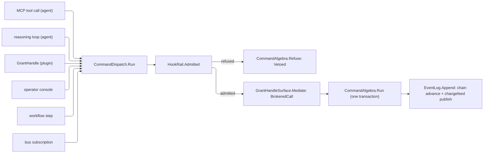

# [APPHOST_COMMAND_DISPATCH]

One `Run(CommandIntent) -> CommandReceipt` front door every command execution in the suite crosses: the MCP tool call, the in-process reasoning loop, the operator console, the sandboxed-plugin grant handle, the durable workflow step, and the event-bus subscription all enter here, pass the hook rail's `Command` veto, ride the one `Sandbox/isolation#GRANT_HANDLE` mediation that records the caller modality, dispatch through `Agent/capability#COMMAND_ALGEBRA` `CommandAlgebra.Run`, and chain their receipt into the one `Runtime/determinism#EVENT_LOG`.

This page declares the front door, its veto rail, and the tool-adoption seam the agent callers share. `CommandAlgebra` stays the one transaction owner, `EventLog` stays the one chained log on the durable `OpLog`, and no second dispatcher forks off here — it consumes `CommandAlgebra`/`CommandRuntime`/`CommandReceipt`/`CommandFault`/`CommandBody`, `McpRuntime`/`CommandAIFunction`/`ToolProjection`/`McpAdoption`/`McpDispatch`/`ToolResult`, `GrantHandleSurface`/`MediationRuntime`/`BrokeredCall`/`CallerModality`/`GrantScope`, `EventLog`/`ChangefeedPort`/`DeterminismContext`, `HookRail`, `CapabilityRegistry`, `TenantContext`, and `ClockPolicy` as settled vocabulary and mints no eighth port.

## [01]-[INDEX]

- [02]-[DISPATCH_FRONT_DOOR]: One veto-gated, mediation-recorded `Run` entry chaining every committed receipt into the one event log.
- [03]-[ADOPTION_SEAM]: One `ToolProjection.Adopt` product, three agent front doors reading disjoint halves of it.

## [02]-[DISPATCH_FRONT_DOOR]

- Owner: `CommandIntent` the front-door request carrier (descriptor id, arguments, caller modality); `DispatchRuntime` the dependency record threading the `CommandRuntime`, the mediation runtime, the per-caller scope resolver, the `EventLog` chain cell, the determinism context, the changefeed port, and the `Observability/hooks#HOOK_RAIL` rail whose `Command` row this entry admits through; `CommandDispatch` the static front-door surface.
- Cases: six callers, one transaction — `CallerModality.Agent` for the MCP tool call and the in-process reasoning loop, `CallerModality.Operator` for the interactive host command, `CallerModality.Plugin` for the sandboxed-plugin route, with the durable workflow step and the event-bus subscription each entering under the modality that scheduled them.
- Entry: `Run(DispatchRuntime runtime, CommandIntent intent)` returns `IO<CommandReceipt>` — fires the rail's `Command` veto, folds its `Fin`, mediates the admitted intent, dispatches through `CommandAlgebra.Run`, chains the receipt, and returns it; `Project(CommandReceipt receipt, Option<string> tool = default)` returns `ToolResult` — THE structured projection every front door reads, delegating to the upstream `Agent/mcp#TOOL_DISPATCH` `McpDispatch.Project` fold with the descriptor as the tool key, so exactly one physical fold exists.
- Auto: the veto fires FIRST and its verdict IS this entry's — the rail answers `Fin<CommandIntent>`, so a transforming gate supplies the descriptor and arguments the transaction then uses and a refusing gate lands `CommandFault.Vetoed` through the algebra's own refusal mint, meaning a refused command never opens a transaction, never brokers a grant, never meters a cost, and still leaves the same receipt on the same fan every dispatched command leaves; the admitted intent then crosses the ONE `GrantHandleSurface.Mediate` fold, which is what makes `CallerModality` a recorded fact rather than a column nothing reads — the mediation mints the `BrokeredCall` carrying the caller, the permitted flag, and the charged vector, with the transaction itself as the dispatch closure, so an operator call, an agent call, and a plugin call are one transaction discriminated by evidence rather than by three parallel dispatchers; every committed or compensated dispatch chains its `CommandReceipt` into the `EventLog` through `EventLog.Append` under the determinism context, and that append MINTS the entry and PUBLISHES it through the `ChangefeedPort` in one motion, so no consumer of the durable feed observes a chain head whose entry never crossed and no caller advances the chain without the feed; the chain cell is an `Atom` so a dispatched command and a reasoning-transcript chain advance the same head under concurrent front doors; every stamp on this path reads `runtime.Command.Clocks`, the transaction's own handle, because two clock handles on one dispatch can disagree about when the command they stamp happened.
- Receipt: each dispatch mints one `CommandReceipt` — the command algebra's own, fanned through its `ReceiptSinkPort.Send` under the `Rasm.AppHost` package key — plus one `BrokeredCall` at the mediation and one `EventLog.LogEntry` at the chain advance; no parallel dispatch receipt.
- Packages: LanguageExt.Core, NodaTime, Thinktecture.Runtime.Extensions, BCL inbox
- Growth: a new front door is the SAME `Run` entry a new caller invokes carrying its `CallerModality`; a new orchestration consumer drives the same `Run`; zero new surface.
- Boundary: this front door is the one command-execution entry, and a caller reaching `CommandAlgebra.Run` directly is the deleted form — that bypass strands the veto rail with no firing site, leaves the caller modality unrecorded, and lands a dispatched command outside the hash chain, three failures one shared entry forecloses at once; `CommandAlgebra` stays the one commit-or-rollback transaction at `Agent/capability#COMMAND_ALGEBRA` and this surface is the gate over it, never a second transaction; `EventLog` stays the one hash-chained content-addressed command log on the durable `OpLog` changefeed (`Runtime/determinism#EVENT_LOG`) and the mint-and-publish pairing lives at that owner, so this page threads the port and never publishes beside it; the veto rail is the app-composed admission policy's seat and this page names no point id and no modality of its own, reading only `Admitted`; a command whose caller resolves no `GrantScope` falls through to the algebra alone, where the broker's consent seat refuses it — one admission decision, never a second gate that could disagree with it.

```csharp signature
// --- [MODELS] ---------------------------------------------------------------------------
// The front-door request: descriptor + arguments + the caller modality the BrokeredCall records.
// One CommandIntent carries every caller; the modality is a discriminant, never a parallel request type.
public sealed record CommandIntent(
    string Descriptor,
    CommandArguments Arguments,
    CallerModality Caller) {
    public static CommandIntent Of(string descriptor, CommandArguments arguments, CallerModality caller) =>
        new(descriptor, arguments, caller);
}

// --- [SERVICES] -------------------------------------------------------------------------
// The dispatch dependency: the one CommandRuntime (transaction owner, and the one clock handle every stamp
// on this path reads), the mediation runtime the modality rides, the per-caller scope resolver, the EventLog
// chain cell the dispatch advances, the determinism context the chain stamps, and the changefeed port
// EventLog.Append publishes through. The chain is an Atom so a dispatched command and a reasoning-transcript
// chain advance the same head under concurrent front doors.
public sealed record DispatchRuntime(
    CommandRuntime Command,
    MediationRuntime Mediation,
    Func<CommandIntent, Option<GrantScope>> ScopeOf,
    Atom<EventLog.Chain> Chain,
    DeterminismContext Context,
    ChangefeedPort Changefeed,
    HookRail Rail);

// --- [OPERATIONS] -----------------------------------------------------------------------
public static class CommandDispatch {
    // The rail answers Fin, so the refusal is a VALUE this fold must consume: reading the intent off the
    // result without folding it drops the Fail arm entirely, every refusal an app-composed policy issued
    // evaporates, and the commands it declined dispatch anyway under a policy that believed it stopped them.
    public static IO<CommandReceipt> Run(DispatchRuntime runtime, CommandIntent intent) =>
        from admitted in IO.lift(() => runtime.Rail.Admitted(intent))
        from receipt in admitted.Match(
            Succ: passed => Mediated(runtime, passed),
            Fail: refusal => CommandAlgebra.Refuse(runtime.Command, intent.Descriptor, new CommandFault.Vetoed(refusal.Message), intent.Arguments))
        from _chained in Chain(runtime, receipt, intent.Arguments)
        select receipt;

    // Mediation is what makes the modality evidence: the ONE GrantHandleSurface.Mediate fold the plugin and
    // federated routes already ride mints the BrokeredCall carrying caller, permitted flag, and charge, with
    // the transaction as its dispatch closure. A scopeless caller falls through to the algebra alone, where
    // the broker's consent seat refuses it — never a second admission decision beside the broker's.
    static IO<CommandReceipt> Mediated(DispatchRuntime runtime, CommandIntent intent) =>
        runtime.ScopeOf(intent).Match(
            Some: scope => GrantHandleSurface.Mediate(runtime.Mediation, intent.Caller, scope, intent.Descriptor, intent.Arguments,
                    (_, _) => CommandAlgebra.Run(runtime.Command, intent.Descriptor, intent.Arguments))
                .Map(static mediated => mediated.Receipt),
            None: () => CommandAlgebra.Run(runtime.Command, intent.Descriptor, intent.Arguments));

    // Append MINTS the entry and PUBLISHES it through the changefeed port in one motion, so a chain head
    // advanced without its entry crossing the feed — the shape a caller-side publish beside the append
    // always eventually produces — cannot exist for any replay to read short.
    static IO<Unit> Chain(DispatchRuntime runtime, CommandReceipt receipt, CommandArguments arguments) =>
        receipt.Txn is CommandTxn.Committed or CommandTxn.Compensated
            // Mint-and-publish runs OUTSIDE the exchange and the exchange body is a pure head-equality guard,
            // so a contended dispatch re-runs the whole motion against the head that won rather than re-feeding
            // the changefeed and re-reading the clock once per CAS spin. A refused publish never reaches the
            // guard, so the head stays and the refusal surfaces on the rail instead of vanishing.
            ? from at in IO.lift(() => runtime.Command.Clocks.Now)
              from read in IO.lift(() => runtime.Chain.Value)
              from appended in IO.lift(() =>
                  EventLog.Append(read, runtime.Changefeed, receipt, arguments, runtime.Context, at, (ulong)read.Sequence))
              from settled in appended.Match(
                  Succ: minted => IO.lift(() => runtime.Chain.SwapMaybe(chain => chain == read ? Some(minted.Chain) : None))
                      .Bind(landed => landed == minted.Chain ? IO.pure(unit) : Chain(runtime, receipt, arguments)),
                  Fail: static error => IO.fail<Unit>(error))
              select settled
            : IO.pure(unit);

    // ONE physical fold: the receipt-to-result switch lives on Agent/mcp#TOOL_DISPATCH
    // McpDispatch.Project (upstream in the page DAG); this entry supplies the descriptor as the
    // tool key or forwards a caller-supplied key — never a switch copy.
    public static ToolResult Project(CommandReceipt receipt, Option<string> tool = default) =>
        McpDispatch.Project(tool.IfNone(receipt.Descriptor), receipt);
}
```


```mermaid
---
config:
  layout: elk
  flowchart:
    curve: linear
    padding: 25
---
flowchart LR
    accTitle: One command-dispatch front door, one veto, one chain
    accDescr: Every caller invokes CommandDispatch.Run; the hook rail vetoes or transforms the intent, the mediation records the caller modality, the command algebra owns the transaction, and a committed receipt chains into the one event log while publishing through the changefeed port.
    Mcp["MCP tool call (agent)"] --> Run
    Loop["reasoning loop (agent)"] --> Run
    Plugin["GrantHandle (plugin)"] --> Run
    Operator["operator console"] --> Run
    Step["workflow step"] --> Run
    Sub["bus subscription"] --> Run
    Run["CommandDispatch.Run"] --> Veto["HookRail.Admitted"]
    Veto -->|refused| Refuse["CommandAlgebra.Refuse: Vetoed"]
    Veto -->|admitted| Mediate["GrantHandleSurface.Mediate: BrokeredCall"]
    Mediate --> Algebra["CommandAlgebra.Run (one transaction)"]
    Algebra --> Chain["EventLog.Append: chain advance + changefeed publish"]
```

## [03]-[ADOPTION_SEAM]

- Owner: the composition binding that turns ONE `Agent/mcp#METHOD_AXIS` `ToolProjection.Adopt` product into every agent front door's tool surface; `Agent/mcp.md` authors the `CommandAIFunction` subclass and the `McpServerTool.Create` adoption, and this page declares what each front door takes from that one product.
- Cases: three consumers, three disjoint halves of one `McpAdoption` — MCP registration takes `ServerTools` beside the prompt and resource primitives, the in-process reasoning loop takes each row's `Function` as its `AITool` set, and the plugin route takes neither, entering at `Run` with its own modality.
- Entry: the composition projects the catalog once at the live degradation level, adopts once, and hands each front door its half; every model draw is the endpoint's own through the one governed pipeline — the served revision's election deletes the client-sampling bridge whole, so no fourth carrier exists and a federated tool reaches no client model.
- Auto: adoption happens ONCE per composition and every front door reads that one product — a front door re-projecting the catalog for itself mints a second function identity under the same tool name, so a model tool call and an MCP tool call would resolve two brokered instances with two adoption-time captures; the brokered function's tenant and correlation resolve per invocation on the caller's own async flow, which is what makes one caller-neutral product safe to share across every agent; each row's `Command` half is the bare `CommandAIFunction` the receipt-asserting invoker reaches through the approval wrapper, so the irreversible class stays inside the assertion built for it rather than exempted by its own wrapper; the plugin route carries no tool catalog at all, because its authority is the mediated grant handle and a catalog handed to a sandbox is exactly the ambient authority the isolation law deletes.
- Packages: ModelContextProtocol, ModelContextProtocol.Core, Microsoft.Extensions.AI.Abstractions, LanguageExt.Core, BCL inbox
- Growth: a new tool front door is the SAME `McpAdoption` product read by a new consumer, never a new projection; zero new surface.
- Boundary: `ToolProjection.Adopt` is the one SDK-adoption site and it lives at `Agent/mcp.md` — this page binds its product and never re-authors the subclass or the `McpServerTool.Create` call, so the SDK adoption stays fenced at one site; a tool set divorced from that seam is the deleted form, so the MCP server, the reasoning loop, and the plugin route share one brokered catalog and one dispatch transaction, never three.

```csharp signature
// --- [COMPOSITION] ----------------------------------------------------------------------
// ONE projection, ONE adoption, three consumers reading disjoint halves. The catalog gates to the live
// degradation level so a degraded host advertises only what it can still serve, and the adopted product is
// caller-neutral because tenant and correlation resolve per invocation inside the brokered function.
McpAdoption adopted = ToolProjection.Adopt(
    mcpRuntime,
    ToolProjection.Project(mcpRuntime.Registry, mcpRuntime.Level(), mcpRuntime.SchemaOf, receiptSchema));

// MCP serving takes the SDK half — all three primitive families off the one product.
IMcpServerBuilder server = services.AddMcpServer()
    .WithTools(adopted.ServerTools)
    .WithPrompts(adopted.Prompts)
    .WithResources(adopted.Resources);

// The in-process loop takes the AIFunction half of the SAME rows — approval-wrapped where an irreversible
// effect earned one, so the model meets exactly the gate the SDK client meets.
Seq<AITool> agentTools = adopted.Tools.Map(static row => (AITool)row.Function);

// The plugin route takes neither half: it enters the front door under its own modality, so the sandbox's
// no-ambient-authority law and the veto rail both hold on a call that never sees a tool catalog.
Func<string, CommandArguments, IO<CommandReceipt>> pluginDispatch =
    (descriptor, arguments) => CommandDispatch.Run(dispatchRuntime, CommandIntent.Of(descriptor, arguments, CallerModality.Plugin));
```

## [04]-[RESEARCH]

(none)
