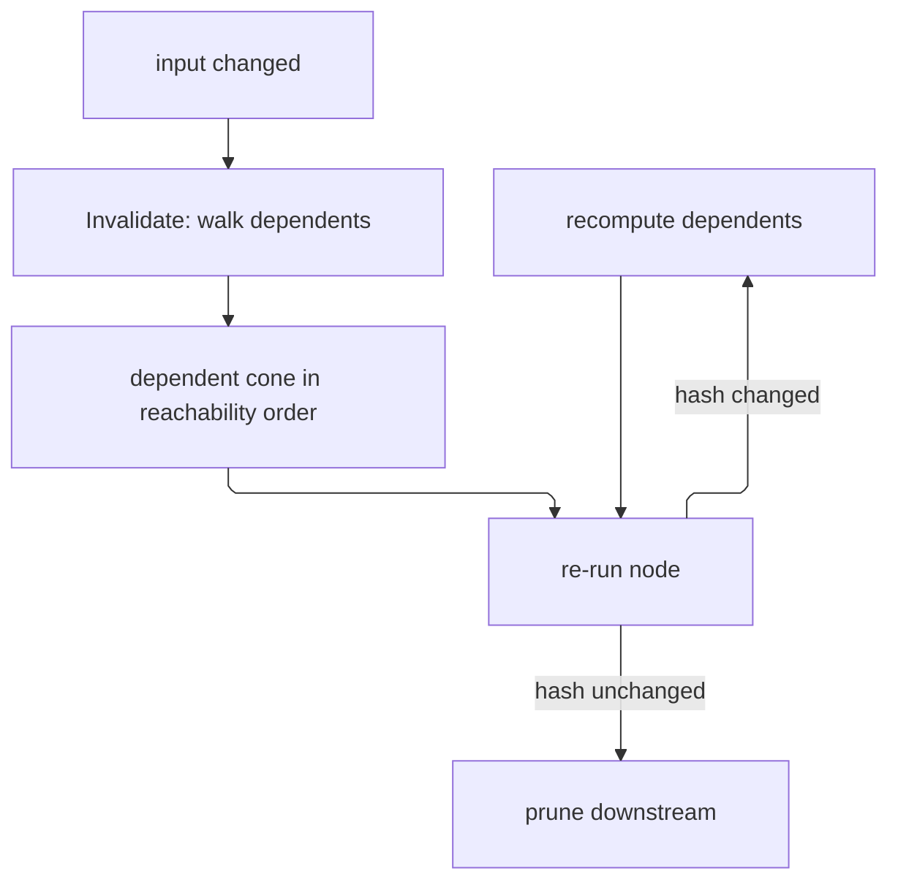

# [APPHOST_DETERMINISM_AND_REPLAY]

The reproducibility kernel for the runtime spine: one determinism context pins the RNG seed, the floating-point column set, and the environment fingerprint so a recorded run reproduces bit-for-bit, a hash-chained log appends every command as a content-addressed entry linking to its predecessor and publishing durably in one motion, a replay-verify rail re-executes a recorded log and proves each step's content hash matches, a macro engine records a command sequence and replays it as a reusable unit, a partial-recompute graph re-runs only the downstream of a changed input by walking the content-address dependency edges and prunes at the first unchanged output, and an adversarial probe DECIDES every chaos injection at a seeded gate, chains each decision as an entry a replay re-derives and re-injects, bisects a divergence over the hash chain in log-time, and perturbs one entry's body to surface the downstream cone that change alters. The page owns every owner that sentence names, the addressed draw beside the streamed one, `HostFingerprint` and its `HostFingerprintWire` for the whole estate, the canonical-preimage emitter every digest here folds through, and the four-plane chaos gate every arming site composes; it consumes `CommandReceipt`/`CommandArguments`/`CommandAlgebra`, `ReceiptEnvelope`/`ReceiptSinkPort` (HLC stamp), the Persistence `Version/ledger#CHANGEFEED` durable changefeed through one BIDIRECTIONAL decode-only PORT adapter (a NEUTRAL projected row crosses down and the windowed read decodes back RE-VERIFYING the chain, so replay, bisect, and counterfactual survive process restarts), the kernel `Rasm.Domain.ContentHash.Of` entry for every content digest (`ChainHash` is the typed chain-link carrier over the kernel `UInt128`) beside `Rasm.Domain.Deterministic` for both draws, the `Runtime/laneguard` and `Wire/outbound` pipelines as the arming sites this page hands chaos options, `CorrelationId`, and `TenantContext` as settled vocabulary and mints no eighth port.

## [01]-[INDEX]

- [02]-[DETERMINISM_KERNEL]: Pinned seed with its streamed and addressed draws, float column set, host fingerprint, and its wire.
- [03]-[EVENT_LOG]: Hash-chained content-addressed log over command and chaos bodies, appending and verifying one chain.
- [04]-[REPLAY_VERIFY]: Re-executes a recorded log and proves per-step content-hash identity.
- [05]-[MACRO_ENGINE]: Records a command sequence and replays it as a reusable parameterized unit.
- [06]-[RECOMPUTE_GRAPH]: Content-addresses dependency edges for partial downstream recompute.
- [07]-[ADVERSARIAL_PROBE]: Seeded four-plane chaos gate, log-time divergence bisection, and counterfactual replay.
- [08]-[TS_PROJECTION]: Event-log entry, chaos decision, and replay-result wire shapes the dashboard consumes.

## [02]-[DETERMINISM_KERNEL]

- Owner: `HostFingerprint` the environment-identity record and `HostFingerprintWire` its frozen `[02.15]` projection; `LibmProvider` `[SmartEnum<string>]` the transcendental floor a mode admits; `FloatMode` `[SmartEnum<string>]` the floating-point column set; `Preimage` the canonical-chunk emitter every digest on this page folds through; `EnvFingerprint` the run-identity record; `DeterminismContext` the pinned-run context record; `DeterminismKernel` the static context-establishment surface.
- Cases: 3 float modes — strict, fast, cross-platform — each a triple of `Libm`, `VectorWidthBits`, and `EstimateApis`; strict pins the 128-bit width and refuses the estimate family over the host libm, fast releases the width and admits estimates, cross-platform pins the width, refuses estimates, and EXCLUDES the transcendental floor no RID reproduces. 2 libm rows — host, excluded.
- Entry: `Establish(ulong seed, FloatMode mode, HostFingerprint host, string rid)` returns `DeterminismContext` — pins the RNG seed and captures the environment fingerprint over the host record, the mode's resolved columns, and the RID so a run under the context is reproducible; `HostFingerprint.Current(FrozenDictionary<string, string> stamps)` is the ambient process-side mint and `ToString()` its canonical invariant render — the one host column every downstream ROW holds; `HostFingerprintWire.Of(EnvFingerprint)` is the one wire projection and `Canonical()` its byte-deriving preimage; `DeterminismContext.Rng(string stream)` returns a stream-keyed deterministic `Random` so each named random stream derives independently from the root seed; `DeterminismContext.Draw(string stream, long ordinal, long purpose)` returns the ADDRESSED unit draw, whose value is a function of the address alone, so a per-execution decision taken under concurrency reproduces exactly where a shared stateful stream cannot.
- Auto: a named stream is the kernel `Deterministic.Source` splitmix generator keyed on the root seed plus the stream key's full `ContentHash.Of` digest carried as its two `ContentHash.Half` lanes — the kernel's one lane projection, so the preimage emitter and the generator split a digest identically — and two named streams in one run are independent, both reproduce from the same root seed, and no part of either the seed or the key is discarded on the way in; the ADDRESSED draw composes the kernel's stateless `Deterministic.Unit` over the same stream lanes with an ordinal and a purpose lane, so draw `(stream, ordinal, purpose)` answers one number under any interleaving and a recorded address re-derives its own draw with no stream state to rewind; the environment fingerprint composes the `HostFingerprint` columns with the mode's RESOLVED column values and the RID so a replay on a divergent environment is detected before it produces a wrong result; every digest folds one ordered chunk stream through `Preimage` — length-prefixed UTF-8 text and fixed-width little-endian scalars — so a record's synthesized `ToString()`, a culture-sensitive number render, and a `FrozenDictionary` enumeration order never reach a preimage; the mode is the column set a numeric kernel READS, never a process mutation, so `Establish` binds no runtime configuration.
- Receipt: `DeterminismContext` carries the seed, the mode, and the environment fingerprint; a determinism mismatch at replay surfaces as a typed replay fault, never a silent wrong result.
- Packages: Rasm (kernel `ContentHash.Of` the one digest entry with its ordered-chunk overload, and `Deterministic.Source` the one draw owner), Thinktecture.Runtime.Extensions, LanguageExt.Core, System.IO.Hashing, BCL inbox
- Growth: one float mode is one `FloatMode` row and one libm floor is one `LibmProvider` row; one environment dimension is one column on `HostFingerprint` beside its `Preimage` field, its render lane, and its wire member; a consumer-decided host value is one `extension(HostFingerprint)` member at that consumer's tier, never a column here; a new random stream is one stream key, never a second RNG owner; zero new surface.
- Boundary: the determinism kernel is the only reproducibility owner — an ambient `Random.Shared`, a `DateTime.Now`-seeded RNG, and a per-call float-mode flip are the deleted forms; every draw under a context is the kernel `Deterministic` splitmix and the two draw faces split by whether the decision carries a position — `Rng` hands out draw ORDER for a single-threaded fold while `Draw` hands out draw ADDRESS for a decision several executions take at once, so leasing one stateful stream across concurrent executions is the deleted form whose value depends on how many draws happened to precede it; a BCL `new Random(...)` construction and a second hasher beside `ContentHash` are both deleted here — a digest narrowed to an `int` seed discards half the identity it was mint to carry and manufactures collisions that replay perfectly, which is precisely the failure this page's own gates cannot see; this kernel DECLARES `HostFingerprint` and `Rasm.Compute/Runtime/receipts#BENCHMARK_CLAIMS` composes it downward as the claim `host` column through Compute's own legal reference, while `Rasm.Persistence` and the Rhino host decode `HostFingerprintWire` alone and import no type — a Compute-side declaration closes the S1-to-S3 cycle the branch acyclicity law forbids, so the spine mints and every consumer composes; the two members only a consumer's own domain decides land as extensions at that consumer and never as columns here — the container-limited `HostFingerprint.Effective` substitution and the Persistence index admission both sit at the Compute tier, because `CpuBudget` and `ModelResultIndex` never cross downward; the canonical render is the record's own `ToString()` override rather than the synthesized one, so a persisted host column cannot key two ways across a culture or a `FrozenDictionary` build order and a benchmark claim cannot go stale against its own host; the fingerprint digest hashes the mode's resolved COLUMN VALUES and never its key, because a `cross-platform` run at a 256-bit vector width and one at 128 keyed identically under the mode key and `Reproduces` returned true across a real numerical divergence; the cross-RID guarantee is exactly what the columns pin — `CrossPlatform` reproduces bit-identically on osx-arm64, linux-x64, and win-x64 for kernels inside its floor, and transcendental-dependent kernels sit OUTSIDE it by construction because no managed surface pins the platform libm; `double.MultiplyAddEstimate` is the estimate spelling wherever a fence names one and `Math.MultiplyAddEstimate` does not exist; the seed is the run's single entropy source so a reproducible run draws all randomness from the seed and the kernel forbids ambient entropy; the recorded instants ride the log entries themselves, so a replay reads them off the chain and needs no second clock beside the command runtime's own `ClockPolicy`; the `Preimage` pool-lease bracket is the named platform-forced statement seam and the only one on this page.

```csharp signature
// The ONE canonical-preimage emitter every digest on this page folds through. Fields append LENGTH-PREFIXED so
// ("a","bc") and ("ab","c") cannot collide, text as UTF-8 so no culture or UTF-16 endianness reaches the bytes,
// scalars fixed-width little-endian so a host's word order never keys one value two ways. The deleted form was a
// raw interpolated string: it renders a record's synthesized `ToString()`, formats numbers under the ambient
// culture, and enumerates a `FrozenDictionary` in unspecified order — three ways to key one environment twice.
public static class Preimage {
    const int StackCap = 256;

    extension(XxHash128 hash) {
        public XxHash128 Field(ReadOnlySpan<char> text) {
            var cap = Encoding.UTF8.GetMaxByteCount(text.Length);
            var rented = cap > StackCap ? ArrayPool<byte>.Shared.Rent(cap) : [];
            try {                                                     // Exemption: the pool-lease bracket is the named platform-forced seam; the leased span never escapes and the member returns the accumulator
                Span<byte> utf8 = cap > StackCap ? rented : stackalloc byte[StackCap];
                var written = Encoding.UTF8.GetBytes(text, utf8);
                return hash.Field((long)written).Bytes(utf8[..written]);
            }
            finally { if (rented.Length > 0) { ArrayPool<byte>.Shared.Return(rented); } }
        }

        public XxHash128 Field(long value) {
            Span<byte> frame = stackalloc byte[sizeof(long)];
            BinaryPrimitives.WriteInt64LittleEndian(frame, value);
            return hash.Bytes(frame);
        }

        // Lanes come off the kernel `ContentHash.Half`, never a local shift-and-narrow: this preimage and the
        // splitmix seeding below both split the same digest, and two inline spellings is exactly how a frozen
        // fixture and the generator seeded from its key drift while each reads correct in isolation.
        public XxHash128 Field(UInt128 value) {
            Span<byte> frame = stackalloc byte[2 * sizeof(ulong)];
            BinaryPrimitives.WriteUInt64LittleEndian(frame, ContentHash.Half(value, lane: 0));
            BinaryPrimitives.WriteUInt64LittleEndian(frame[sizeof(ulong)..], ContentHash.Half(value, lane: 1));
            return hash.Bytes(frame);
        }

        public XxHash128 Field(bool value) => hash.Field(value ? 1L : 0L);

        // Count-then-rows: a sequence's length enters the stream ahead of its members, so two sequences
        // concatenating to one member list key distinctly.
        public XxHash128 Rows<T>(Seq<T> rows, Action<T, XxHash128> field) =>
            (hash.Field((long)rows.Count), rows.Iter(row => field(row, hash)), hash).Item3;

        // Exemption: a `ReadOnlySpan<byte>` cannot cross a delegate seam, so the fold-shaped `fun(...)()`
        // projection is a compile error here and the append is the named statement form.
        XxHash128 Bytes(ReadOnlySpan<byte> payload) {
            hash.Append(payload);
            return hash;
        }
    }
}

// The environment-identity record the estate mints HERE. `Rasm.Compute/Runtime/receipts#BENCHMARK_CLAIMS`
// composes it as the claim `host` column through Compute's own legal reference; `Rasm.Persistence` and the Rhino
// host decode `HostFingerprintWire` and import no type. A Compute-side declaration would close the S1-to-S3 cycle
// the branch acyclicity law forbids, so the spine declares and every consumer composes downward. Equality is
// generated: Stamps is a FrozenDictionary the synthesized record form compares by reference, so same-host
// fingerprints read unequal without [UnorderedEquality]; digest comparisons stay EnvFingerprint.Digest's.
[Equatable]
public sealed partial record HostFingerprint(
    string Machine,
    string Os,
    string Arch,
    int Processors,
    string Runtime,
    [property: UnorderedEquality] FrozenDictionary<string, string> Stamps) : ISpanFormattable, IUtf8SpanFormattable {
    // `Current` mints ambiently: `Processors` reads the host count, which over-reports a cgroup-limited container,
    // so a composer holding an admitted budget substitutes it at its own tier — `Rasm.Compute/Runtime/receipts`
    // `#BENCHMARK_CLAIMS` `HostFingerprint.Effective` is that substitution and the only mint a claim admits.
    public static HostFingerprint Current(FrozenDictionary<string, string> stamps) =>
        new(Environment.MachineName,
            RuntimeInformation.OSDescription,
            RuntimeInformation.ProcessArchitecture.ToString(),
            Environment.ProcessorCount,
            RuntimeInformation.FrameworkDescription,
            stamps);

    // Enumeration order on a FrozenDictionary is unspecified, so preimage, render, and wire all read this ORDERED
    // projection: one stamp set digests and renders once, whichever order the map happened to build in.
    public Seq<KeyValuePair<string, string>> Ordered =>
        toSeq(Stamps.OrderBy(static pair => pair.Key, StringComparer.Ordinal));

    public string StampLine() => string.Join(',', Ordered.Map(static pair => $"{pair.Key}={pair.Value}"));

    // `ToString` renders the canonical single line every downstream ROW holds as its host column — Compute's claim
    // key, Persistence's benchmark and result-index rows. Overriding the record's synthesized form is deliberate:
    // synthesis renders `Processors` under the ambient culture and enumerates `Stamps` in unspecified order, so
    // two identical hosts could key two ways and a claim would go stale against itself.
    public override string ToString() =>
        string.Create(CultureInfo.InvariantCulture, $"{Machine}|{Os}|{Arch}|{Processors}|{Runtime}|{StampLine()}");

    public string ToString(string? format, IFormatProvider? formatProvider) => ToString();

    public bool TryFormat(Span<char> destination, out int charsWritten, ReadOnlySpan<char> format, IFormatProvider? provider) =>
        destination.TryWrite(CultureInfo.InvariantCulture, $"{Machine}|{Os}|{Arch}|{Processors}|{Runtime}|{StampLine()}", out charsWritten);

    public bool TryFormat(Span<byte> utf8Destination, out int bytesWritten, ReadOnlySpan<char> format, IFormatProvider? provider) =>
        Utf8.TryWrite(utf8Destination, CultureInfo.InvariantCulture, $"{Machine}|{Os}|{Arch}|{Processors}|{Runtime}|{StampLine()}", out bytesWritten);
}

// Which transcendental floor a mode admits. `Host` is the platform C runtime, whose per-OS and per-architecture
// divergence across the documented `Math` transcendentals is the largest cross-RID source; `Excluded` admits
// none, because no managed surface pins a libm and a mode promising bit-identity cannot promise it over one.
[SmartEnum<string>]
[KeyMemberEqualityComparer<ComparerAccessors.StringOrdinal, string>]
[KeyMemberComparer<ComparerAccessors.StringOrdinal, string>]
public sealed partial class LibmProvider {
    public static readonly LibmProvider Host = new("host");
    public static readonly LibmProvider Excluded = new("excluded");
}

// The mode is a COLUMN SET a numeric kernel reads, never a process mutation — no managed knob turns FMA
// contraction, vector width, or the platform libm off at runtime, so a fence claiming an establish-time binding
// forges a guarantee the runtime does not carry. The deleted columns were `FmaContraction`/`VectorReassociation`,
// which `Strict` and `CrossPlatform` set identically: two byte-identical rows carrying the whole cross-RID claim.
[SmartEnum<string>]
[KeyMemberEqualityComparer<ComparerAccessors.StringOrdinal, string>]
[KeyMemberComparer<ComparerAccessors.StringOrdinal, string>]
public sealed partial class FloatMode {
    public static readonly FloatMode Strict = new("strict", LibmProvider.Host, vectorWidthBits: 128, estimateApis: false);
    public static readonly FloatMode Fast = new("fast", LibmProvider.Host, vectorWidthBits: 0, estimateApis: true);
    public static readonly FloatMode CrossPlatform = new("cross-platform", LibmProvider.Excluded, vectorWidthBits: 128, estimateApis: false);

    public LibmProvider Libm { get; }

    // 128 is the only width osx-arm64, linux-x64, and win-x64 all reach, and reduction grouping is per-width, so
    // a cross-RID mode pins it; 0 declares the host's own `Vector<T>` width and therefore a per-host grouping.
    public int VectorWidthBits { get; }

    // `double.MultiplyAddEstimate` and its family are permitted to differ per platform by contract, so a
    // bit-identity mode refuses them. The member is `double.MultiplyAddEstimate` — `Math` declares no such peer.
    public bool EstimateApis { get; }
}

public sealed record EnvFingerprint(HostFingerprint Host, FloatMode Mode, string Rid) {
    // Kernel content identity: UInt128 is the currency; Hex the boundary projection at the wire. The digest folds
    // the mode's RESOLVED COLUMN VALUES and never its key — under the key alone a `cross-platform` run at a
    // 256-bit vector width and one at 128 printed identically and `Reproduces` returned true across a real
    // numerical divergence, the same silent-wrong-result class the narrowed RNG seed carried one field over.
    public UInt128 Digest => ContentHash.Of(this, static (env, hash) => hash
        .Field(env.Host.Machine)
        .Field(env.Host.Os)
        .Field(env.Host.Arch)
        .Field((long)env.Host.Processors)
        .Field(env.Host.Runtime)
        .Rows(env.Host.Ordered, static (pair, inner) => inner.Field(pair.Key).Field(pair.Value))
        .Field(env.Rid)
        .Field(env.Mode.Libm.Key)
        .Field((long)env.Mode.VectorWidthBits)
        .Field(env.Mode.EstimateApis));

    public string Hex => Digest.ToString("x32");
}

// The frozen `tests/contracts/MANIFEST.md` `[02.15]-[HOST_FINGERPRINT]` wire on the `host-fingerprint` seam.
// `Print` is the identity a decoding role is HANDED rather than derives, so a browser mirror reaching no
// operating-system name spells `Unreachable` — a reader tells a role that cannot reach a fact from a branch that
// dropped one, and a fabricated value is unspellable. `Canonical()` is the byte-deriving preimage that entry's
// DESIGN-PIN blocker names missing at this minter.
public sealed record HostFingerprintWire(
    string Print,
    string Machine,
    string Os,
    string Arch,
    int Processors,
    string Runtime,
    ImmutableArray<KeyValuePair<string, string>> Stamps) {
    public const string Unreachable = "unreachable";

    public static HostFingerprintWire Of(EnvFingerprint env) =>
        new(env.Hex, env.Host.Machine, env.Host.Os, env.Host.Arch,
            env.Host.Processors, env.Host.Runtime, [.. env.Host.Ordered]);

    public ImmutableArray<KeyValuePair<string, string>> Canonical() => [
        new("print", Print),
        new("machine", Machine),
        new("os", Os),
        new("arch", Arch),
        new("processors", Processors.ToString(CultureInfo.InvariantCulture)),
        new("runtime", Runtime),
        new("stamps", string.Join(',', Stamps.Select(static row => $"{row.Key}={row.Value}"))),
    ];
}

public sealed record DeterminismContext(
    ulong Seed,
    FloatMode Mode,
    EnvFingerprint Fingerprint) {
    // `Rng` enters the stream key's FULL 128-bit content digest as its two kernel `ContentHash.Half` lanes, and
    // `Seed` rides the seed channel, so the whole of both survives into the stream state. XOR-ing a 64-bit
    // XxHash3 into the seed and narrowing to `int` was the deleted form: half the digest and half the root seed
    // were discarded before the generator ever ran, so two stream keys agreeing in their low 32 bits after the XOR
    // drew the identical sequence — a deterministic collision that reproduces perfectly and is therefore invisible to
    // every replay gate this page owns. The kernel Deterministic splitmix is the ONE draw owner, so the AppHost
    // carries no second hasher and no BCL `Random` construction beside it.
    public Random Rng(string stream) =>
        ContentHash.Of(stream, static (key, hash) => hash.Field(key)) switch {
            var digest => Deterministic.Source(
                unchecked((long)Seed),
                unchecked((long)ContentHash.Half(digest, lane: 0)),
                unchecked((long)ContentHash.Half(digest, lane: 1))),
        };

    // ADDRESSED draw beside the streamed one. `Rng` answers a stateful generator whose value depends on how
    // many draws preceded it, so two executions sharing one stream draw a sequence neither reproduces. Every
    // decision that carries a POSITION — a chaos gate on execution n of a pipeline, a per-cell jitter — reads
    // here instead: the kernel's stateless `Deterministic.Unit` keys on the address alone, so draw
    // (stream, ordinal, purpose) is one number under any interleaving and a recorded address re-derives it.
    public double Draw(string stream, long ordinal, long purpose) =>
        ContentHash.Of(stream, static (key, hash) => hash.Field(key)) switch {
            var digest => Deterministic.Unit(
                lanes: [
                    unchecked((long)ContentHash.Half(digest, lane: 0)),
                    unchecked((long)ContentHash.Half(digest, lane: 1)),
                    ordinal,
                    purpose,
                ],
                seed: unchecked((long)Seed)),
        };
}

public static class DeterminismKernel {
    public static DeterminismContext Establish(ulong seed, FloatMode mode, HostFingerprint host, string rid) =>
        new(seed, mode, new EnvFingerprint(host, mode, rid));

    // The digest already folds every mode column, so a mode comparison beside it would gate on the KEY the digest
    // deliberately excludes and refuse two numerically identical runs that named their mode differently.
    public static bool Reproduces(DeterminismContext recorded, DeterminismContext live) =>
        recorded.Seed == live.Seed && recorded.Fingerprint.Digest == live.Fingerprint.Digest;
}
```

## [03]-[EVENT_LOG]

- Owner: `ArgumentBytes` the one arguments-digest owner over `CommandArguments`; `LogBody` `[Union]` the two entry species one chain carries and `LogKind` their key consts; `LogEntry` the content-addressed entry over that body; `ChainHash` the typed chain-link value over the kernel `UInt128` digest (the frozen-name law reserves `ContentHash` for the kernel `Rasm.Domain` entry — a local mint under that name is the deleted collision); `EventLog` the static append-and-verify surface; `DeterminismLogRow`/`ChaosDecisionRow`/`DeterminismLogPolicy`/`ChangefeedPort` the neutral projected row, its chaos column group, the entity-kind/family policy rows, and the BIDIRECTIONAL decode-only Persistence PORT adapter.
- Cases: `LogBody` = Command | Chaos — a command carries its descriptor and arguments digest, a chaos entry carries its whole `ChaosDecision`.
- Entry: `Append(EventLog.Chain chain, ChangefeedPort feed, LogBody body, DeterminismContext context, Instant physical, ulong logical)` returns `Fin<(EventLog.Chain Chain, LogEntry Entry)>` — mints one content-addressed entry whose hash chains to the predecessor, stamps the HLC physical-and-logical pair, and PUBLISHES it through the durable feed in the same motion, so the chain link and its durable record land together or neither does; `VerifyChain(Seq<LogEntry> entries)` returns `Fin<Unit>` — proves every entry's predecessor-hash matches the actual predecessor content hash so a tampered or reordered entry fails the chain; `ChangefeedPort.Load(ChangefeedWindow window)` returns `Fin<Seq<LogEntry>>` — the READ half: fetches the projected rows by origin/sequence window (the `ReplayWindow` windowed-read case the Persistence ledger declares), decodes each to a `LogEntry`, and re-verifies the hash chain through the kernel-composed digests BEFORE any replay fold consumes it — `ChainBroken` unreachable on an untampered log, cross-restart replay the acceptance fact.
- Auto: each entry's content hash composes the kernel `ContentHash.Of` (one algorithm, one seed, federation-wide) over the ordered chunk stream of the predecessor hash, the body's SPECIES KEY, its descriptor, its digest, the determinism context digest, and the sequence — ONE `Mint` derivation the append, the replay re-derive, and the counterfactual perturbation all call, so the chain is tamper-evident and the three sites cannot drift; the species enters the address, so a command entry and a chaos entry agreeing on descriptor and digest still key distinctly and the replay fold discriminates on a CASE rather than sniffing a descriptor prefix; a command body's digest covers the CANONICAL ARGUMENT BYTES under `ArgumentBytes` and a chaos body's covers the whole decision under `Preimage`, so an identical command under an identical context produces an identical hash and a differing one cannot, which is what makes the hash the dedup and recompute-skip key; the chain root is the genesis hash so a chain proves its own origin; `Append` publishes each minted entry through the `ChangefeedPort` as one NEUTRAL `DeterminismLogRow` — the adapter maps the row through the Persistence-owned changefeed vocabulary interior-side, the entity-kind/family spellings are `DeterminismLogPolicy` rows, and a positional construction of the Persistence `OpLogEntry` is the deleted form — so the event log rides the existing durable changefeed, never a second store.
- Receipt: `LogEntry` carries the sequence index, the content hash, the predecessor hash, the body, the determinism digest, and the HLC stamp; the entry is the log's evidence, never a separate receipt.
- Packages: Rasm (kernel `ContentHash.Of`), LanguageExt.Core, NodaTime, Thinktecture.Runtime.Extensions, BCL inbox
- Growth: one entry field is one column on `LogEntry` plus its row projection and its `Preimage` field; a new entry species is one `LogBody` case with its key const and its row column group; a new read shape is one window column on `ChangefeedWindow`; the hash algorithm is the kernel's, never a policy value here — an algorithm fork is the deleted form; zero new surface.
- Boundary: the event log is the only command-log owner — an ad hoc audit table, a per-command log line, a non-chained event store, and any construction of the Persistence `OpLogEntry` interior here (the positional field-by-field `new` over hardcoded literals) are the deleted forms; the append takes a BODY and never a `CommandReceipt`, because the derivation only ever read `receipt.Descriptor` and that unused parameter is what forced the chaos seat to forge a whole receipt — a rolled-back transaction for an injection that rolled nothing back, a zero elapsed on a latency injection whose entire effect is elapsed time, and two `Correlation.Mint()` calls giving one event two identities — `DeterminismLogPolicy` carries the entity-kind and column-family spellings as policy rows the adapter binds; minting and publishing are ONE entry, because the deleted split left `Publish` with no call site while `Load` fed replay, bisect, and counterfactual from a store nothing wrote and the section's own cross-restart acceptance fact read an empty window; the port itself is constructed once at the `Runtime/modules#BINDING_LEDGER` `RootBinding.Seated("changefeed", …)` row from the Persistence changefeed delegates and seated there, so this page declares the port shape and never its construction; the chain rides the durable changefeed through the decode-only port so the command log and the changefeed are one stream — each `LogEntry` projects to one neutral row the adapter maps, and the windowed read decodes the rows back, so the suite has one event-sourcing truth, not a separate determinism log and not a write-only crossing; the arguments digest is the arguments' and never the descriptor's a second time — the deleted form hashed `receipt.Descriptor` into the field named `ArgumentsDigest`, so two commands sharing a descriptor with different arguments minted one `ChainHash` and the tamper-evidence, the recompute-skip key, the dedup key, and `ReplayVerify.Rederive`'s declared bit-identity all collapsed onto the descriptor alone; the HLC stamp orders entries across processes so a multi-process command log merges by HLC, composing the existing `ReceiptEnvelope` causal primitive; the chain verify is the tamper-evidence guarantee, so a support bundle's command log proves its own integrity.

```csharp signature
// The typed chain-link value over the kernel UInt128 digest. The kernel reserves the ContentHash
// name; every digest below composes Rasm.Domain.ContentHash.Of — one algorithm, one seed.
[ValueObject<UInt128>(
    ConversionToKeyMemberType = ConversionOperatorsGeneration.Implicit,
    ConversionFromKeyMemberType = ConversionOperatorsGeneration.None)]
public readonly partial struct ChainHash {
    public static readonly ChainHash Genesis = Create(UInt128.Zero);
    public static ChainHash Of(UInt128 digest) => Create(digest);
    public string Hex => ((UInt128)this).ToString("x32");
}

public static class LogKind {
    public const string Command = "command";
    public const string Chaos = "chaos";
}

// Two entry species, ONE chain. A command's arguments re-supply from the caller's own store, so its body
// carries their digest alone; an injection has no other store anywhere, so its body carries the whole
// decision and the chain's own verify becomes that decision's tamper-evidence. Species enters the content
// address, so `Rederive` dispatches on a case and never on a `chaos.` descriptor prefix.
[Union(ConversionFromValue = ConversionOperatorsGeneration.None)]
public abstract partial record LogBody {
    private LogBody() { }
    public sealed record Command(string Descriptor, UInt128 ArgumentsDigest) : LogBody;
    public sealed record Chaos(ChaosDecision Decision) : LogBody;
}

// Three projections every seat reads instead of re-switching: `Mint` folds all three into the address, the
// codec fills its row from them, and the wire transcribes them.
public static class LogBodies {
    extension(LogBody body) {
        public string Kind => body.Switch(
            command: static _ => LogKind.Command,
            chaos: static _ => LogKind.Chaos);

        public string Descriptor => body.Switch(
            command: static command => command.Descriptor,
            chaos: static chaos => chaos.Decision.PipelineKey);

        public UInt128 Digest => body.Switch(
            command: static command => command.ArgumentsDigest,
            chaos: static chaos => chaos.Decision.Digest);
    }
}

public sealed record LogEntry(
    long Sequence,
    ChainHash Hash,
    ChainHash Predecessor,
    LogBody Body,
    UInt128 DeterminismDigest,
    Instant Physical,
    ulong Logical);

// The ONE arguments-digest owner. Tenancy enters because one payload under two tenants is two commands;
// CORRELATION does not, because a per-invocation identity inside a content address defeats the dedup and
// recompute-skip the address exists to serve. `GetRawText()` returns the octets the wire law already froze, so
// the digest reads captured bytes rather than re-serializing a parsed document into a second encoder.
public static class ArgumentBytes {
    extension(CommandArguments arguments) {
        public UInt128 Digest =>
            ContentHash.Of(arguments, static (row, hash) =>
                hash.Field(row.Payload.GetRawText()).Field(row.Tenant.Entry));
    }
}

public static class EventLog {
    public sealed record Chain(ChainHash Head, long Sequence) {
        public static readonly Chain Genesis = new(ChainHash.Genesis, 0L);
    }

    // ONE hash derivation: append, replay re-derive, and counterfactual perturbation all call it, so the three
    // sites cannot drift and the read-back re-verify recomputes the same law. Species is the first body field
    // in the stream, so a chaos decision can never key as the command sharing its descriptor.
    public static ChainHash Mint(ChainHash predecessor, LogBody body, UInt128 determinismDigest, long sequence) =>
        ChainHash.Of(ContentHash.Of(
            (predecessor, body, determinismDigest, sequence),
            static (state, hash) => hash
                .Field((UInt128)state.predecessor)
                .Field(state.body.Kind)
                .Field(state.body.Descriptor)
                .Field(state.body.Digest)
                .Field(state.determinismDigest)
                .Field(state.sequence)));

    // Mint and publish are ONE motion: a chain head that advanced past an unpublished entry is a chain whose
    // durable prefix can never re-verify, so the durable refusal is the append's refusal.
    public static Fin<(Chain Chain, LogEntry Entry)> Append(
        Chain chain, ChangefeedPort feed, LogBody body,
        DeterminismContext context, Instant physical, ulong logical) =>
        Minted(chain, body, context.Fingerprint.Digest, physical, logical) switch {
            var minted => feed.Publish(minted.Entry).Map(_ => minted),
        };

    // Projection-side mint: the same link derivation with NO publish — a transcript or macro slice re-chains
    // exact receipts into entries without re-writing the durable feed the dispatch append already fed.
    public static (Chain Chain, LogEntry Entry) Project(
        Chain chain, LogBody body, DeterminismContext context, Instant physical, ulong logical) =>
        Minted(chain, body, context.Fingerprint.Digest, physical, logical);

    static (Chain Chain, LogEntry Entry) Minted(Chain chain, LogBody body, UInt128 determinismDigest, Instant physical, ulong logical) =>
        Mint(chain.Head, body, determinismDigest, chain.Sequence) switch {
            var hash => (new Chain(hash, chain.Sequence + 1L),
                new LogEntry(chain.Sequence + 1L, hash, chain.Head, body, determinismDigest, physical, logical)),
        };

    // Read-back re-verify: re-mint each entry's hash from its row content and match entry.Hash so a
    // tampered LogEntry fails ChainBroken before replay — not merely predecessor/sequence continuity.
    // Because a chaos body's digest folds its decision, an edited injection value fails HERE.
    public static Fin<Unit> VerifyChain(Seq<LogEntry> entries) =>
        entries.Fold(Fin.Succ((Prev: ChainHash.Genesis, Seq: 0L)), (acc, entry) =>
            acc.Bind(state => Mint(state.Prev, entry.Body, entry.DeterminismDigest, state.Seq) is ChainHash expected
                && entry.Predecessor == state.Prev && entry.Sequence == state.Seq + 1L && entry.Hash == expected
                    ? Fin.Succ((entry.Hash, entry.Sequence))
                    : Fin.Fail<(ChainHash, long)>(new ReplayFault.ChainBroken($"chain-break:{entry.Sequence}"))))
            .Map(static _ => unit);
}

// The NEUTRAL projected determinism log row — AppHost's own wire shape of primitives; the port
// maps it through the Persistence-owned changefeed vocabulary. Entity spellings are policy rows.
public sealed record DeterminismLogRow(
    long Sequence,
    string Kind,
    string Hash,
    string Predecessor,
    string Descriptor,
    string BodyDigest,
    string DeterminismDigest,
    Instant Physical,
    ulong Logical,
    ChaosDecisionRow? Chaos);

public sealed record DeterminismLogPolicy(string EntityKind, string ColumnFamily) {
    public static readonly DeterminismLogPolicy Canonical = new("determinism.command", "command");
}

public static class DeterminismLogCodec {
    public static DeterminismLogRow Project(LogEntry entry) =>
        new(entry.Sequence, entry.Body.Kind, entry.Hash.Hex, entry.Predecessor.Hex, entry.Body.Descriptor,
            entry.Body.Digest.ToString("x32"), entry.DeterminismDigest.ToString("x32"), entry.Physical, entry.Logical,
            entry.Body.Switch(
                command: static _ => (ChaosDecisionRow?)null,
                chaos: static chaos => ChaosDecisionRow.Of(chaos.Decision)));

    public static Fin<LogEntry> Decode(DeterminismLogRow row) =>
        (Hash: Hex(row.Hash), Pred: Hex(row.Predecessor), Digest: Hex(row.BodyDigest), Det: Hex(row.DeterminismDigest)) is
            { Hash.IsSome: true, Pred.IsSome: true, Digest.IsSome: true, Det.IsSome: true } parsed
            ? Body(row, parsed.Digest.ValueUnsafe()).Map(body => new LogEntry(row.Sequence,
                ChainHash.Of(parsed.Hash.ValueUnsafe()), ChainHash.Of(parsed.Pred.ValueUnsafe()),
                body, parsed.Det.ValueUnsafe(), row.Physical, row.Logical))
            : Fin.Fail<LogEntry>(new ReplayFault.ChainBroken($"row-decode:{row.Sequence}"));

    // Chaos rehydrates from its OWN columns, so a chaos row stripped of its decision group fails here rather
    // than rehydrating as a command the replay would dispatch through the algebra. Whatever this reconstructs,
    // `VerifyChain` re-mints the body digest one line later, so a doctored column answers `ChainBroken`.
    static Fin<LogBody> Body(DeterminismLogRow row, UInt128 digest) => row switch {
        { Kind: LogKind.Command } => Fin.Succ<LogBody>(new LogBody.Command(row.Descriptor, digest)),
        { Kind: LogKind.Chaos, Chaos: { } chaos } => chaos.Decode(row.Descriptor).Map(LogBody (decision) => new LogBody.Chaos(decision)),
        _ => Fin.Fail<LogBody>(new ReplayFault.ChainBroken($"row-kind:{row.Sequence}")),
    };

    static Option<UInt128> Hex(string text) =>
        UInt128.TryParse(text, NumberStyles.HexNumber, CultureInfo.InvariantCulture, out var value) ? Some(value) : None;
}

// The BIDIRECTIONAL decode-only Persistence PORT adapter (Version/ledger#CHANGEFEED): `EventLog.Append` is the
// write half's one caller, and the read half rides the ledger's ONE ReplayWindow windowed-read case
// (origin/sequence window) the AppUi edit-intent read and the egress CDC drain share, re-verifying
// the chain BEFORE any Replay/Bisect/Counterfact fold consumes it.
public readonly record struct ChangefeedWindow(Guid OriginStoreId, long FromSequence, long ToSequence);

public sealed record ChangefeedPort(
    Func<DeterminismLogRow, DeterminismLogPolicy, Fin<Unit>> Append,
    Func<ChangefeedWindow, Fin<Seq<DeterminismLogRow>>> Read) {
    public Fin<Unit> Publish(LogEntry entry) => Append(DeterminismLogCodec.Project(entry), DeterminismLogPolicy.Canonical);

    public Fin<Seq<LogEntry>> Load(ChangefeedWindow window) =>
        Read(window)
            .Bind(static rows => rows.TraverseM(DeterminismLogCodec.Decode).As())
            .Bind(static entries => EventLog.VerifyChain(entries).Map(_ => entries));
}
```

## [04]-[REPLAY_VERIFY]

- Owner: `ReplayOutcome` `[Union]` the per-step replay disposition; `ReplayFault` `[Union]` fault family deriving its codes through `FaultBand.Replay`; `ReplayVerify` the static re-execute-and-prove surface.
- Cases: replay dispositions Matched | Injected | Diverged | EnvironmentMismatch | Skipped; `ReplayFault` = Text | ChainBroken | HashDiverged | EnvIncompatible.
- Entry: `Replay(ReplayRuntime runtime, Seq<LogEntry> log, DeterminismContext live)` returns `IO<Seq<ReplayOutcome>>` — re-executes a recorded log under a live determinism context, re-deriving each step's content hash through the one `EventLog.Mint` derivation and proving it matches the recorded hash, so a replay either reproduces the recorded run exactly or names the first divergent step; a cross-restart replay ingests its `Seq<LogEntry>` through `ChangefeedPort.Load` — the recorded chain rehydrates from the durable store and re-verifies BEFORE it replays, never surviving only the recording process's memory.
- Auto: the replay first proves the live environment reproduces the recorded one through `DeterminismKernel.Reproduces` so a divergent environment fails the whole replay before re-executing a single step; each step dispatches on its body — a command re-runs through the command algebra under the recorded determinism context and re-derives its content hash from the RE-EXECUTED receipt's descriptor and the arguments the replay actually fed it, while a chaos entry re-DERIVES its decision from the recorded address under the recorded seed and its band, because an injection has nothing to re-execute and everything to recompute — so a divergence is detected at the exact step it occurred; the runtime's `ChaosArming` is the `AdversarialProbe.ChaosArming.Driven` seat over this same log, so the commands the replay re-runs meet the recorded injections at the recorded ordinals instead of rolling fresh dice; a matched step confirms bit-identity, a diverged step names the recorded and re-derived hashes so the divergence is diagnosable; the replay chains the verification so the first divergence halts the replay because every downstream hash depends on the diverged step; the whole outcome sequence fans once through the command runtime's own `ReceiptSinkPort`, so a replay is evidence on the one receipt stream.
- Receipt: each step yields one `ReplayOutcome` and the sequence fans as one message envelope on the existing receipt stream — no parallel replay receipt.
- Packages: LanguageExt.Core, NodaTime, Thinktecture.Runtime.Extensions, BCL inbox
- Growth: one disposition is one `ReplayOutcome` case; one fault is one `ReplayFault` case; a new entry species is one arm on the body dispatch; zero new surface.
- Boundary: the replay-verify is the only reproducibility-proof owner — a re-run without hash comparison, a best-effort replay, an environment-blind replay, and a replay that dispatches a chaos entry through the command algebra are the deleted forms; the replay reuses the command algebra so a replayed command runs through the same dispatch, broker, and substrate selection a live command runs through, so the replay proves the real execution path reproduces, not a stubbed one; the environment-reproduces check is the precondition so a replay never claims a match on a divergent environment; the re-derivation reads the re-execution and never the recorded entry's own fields — the deleted form re-minted from `entry.ArgumentsDigest` and `entry.DeterminismDigest`, every input of which `VerifyChain` had already proved one line earlier, so `Diverged` was unreachable for any log that reached the fold and the declared bit-identity guarantee had no member; `ReplayRuntime` carries no second clock and no second sink, because `CommandRuntime` already owns both and a parallel pair would let a replay stamp its evidence off a clock the command it replays never read; a chaos step's proof is the RE-DERIVATION, never a copy of the recorded field, so an injection whose band moved between recording and replay answers `Diverged` rather than a match minted from its own record.

```csharp signature
[Union(ConversionFromValue = ConversionOperatorsGeneration.None)]
public abstract partial record ReplayOutcome {
    private ReplayOutcome() { }
    public sealed record Matched(long Sequence, ChainHash Hash) : ReplayOutcome;
    public sealed record Injected(long Sequence, string Injection) : ReplayOutcome;
    public sealed record Diverged(long Sequence, ChainHash Recorded, ChainHash Rederived) : ReplayOutcome;
    public sealed record EnvironmentMismatch(string Recorded, string Live) : ReplayOutcome;
    public sealed record Skipped(long Sequence, string Reason) : ReplayOutcome;
}

[Union]
public abstract partial record ReplayFault : Expected, IValidationError<ReplayFault> {
    private ReplayFault(string detail, int code) : base(detail, code, None) { }
    public static ReplayFault Create(string message) => new Text(message);
    public sealed record Text : ReplayFault { public Text(string detail) : base(detail, FaultBand.Replay.Code(0)) { } }
    public sealed record ChainBroken : ReplayFault { public ChainBroken(string detail) : base(detail, FaultBand.Replay.Code(1)) { } }
    public sealed record HashDiverged : ReplayFault { public HashDiverged(string detail) : base(detail, FaultBand.Replay.Code(2)) { } }
    public sealed record EnvIncompatible : ReplayFault { public EnvIncompatible(string detail) : base(detail, FaultBand.Replay.Code(3)) { } }
}

// `Chaos` is the DRIVEN arming over the same log: the pipelines a replayed command traverses read their
// injections off the chain, so the re-run meets the recorded campaign rather than a fresh roll of it.
public sealed record ReplayRuntime(
    CommandRuntime Command,
    Func<LogEntry, CommandArguments> ArgumentsOf,
    ChaosArming Chaos,
    DeterminismContext Recorded);

public static class ReplayVerify {
    public static IO<Seq<ReplayOutcome>> Replay(ReplayRuntime runtime, Seq<LogEntry> log, DeterminismContext live) =>
        (DeterminismKernel.Reproduces(runtime.Recorded, live)
            ? EventLog.VerifyChain(log).Match(
                Succ: _ => log.FoldM(Seq<ReplayOutcome>(), (acc, entry) =>
                    acc.Last.Map(static last => last is ReplayOutcome.Diverged).IfNone(false)
                        ? IO.pure(acc.Add(new ReplayOutcome.Skipped(entry.Sequence, "downstream-of-divergence")))
                        : Step(runtime, entry).Map(outcome => acc.Add(outcome))).As(),
                Fail: error => IO.pure(Seq<ReplayOutcome>(new ReplayOutcome.Skipped(0L, error.Message))))
            : IO.pure(Seq<ReplayOutcome>(new ReplayOutcome.EnvironmentMismatch(runtime.Recorded.Fingerprint.Hex, live.Fingerprint.Hex))))
        .Bind(outcomes => Fan(runtime, outcomes));

    // Species decides how a step is PROVEN: a command by re-execution, an injection by re-derivation. The
    // recorded arguments the replay feeds are the command re-derivation's own input, so the comparison spans
    // the whole command rather than the descriptor the recorded entry would have supplied either way.
    static IO<ReplayOutcome> Step(ReplayRuntime runtime, LogEntry entry) =>
        entry.Body.Switch(
            command: command => IO.lift(() => runtime.ArgumentsOf(entry)).Bind(arguments =>
                CommandAlgebra.Run(runtime.Command, command.Descriptor, arguments)
                    .Map(receipt => Rederive(entry, receipt, arguments))),
            chaos: chaos => IO.pure(Reinjected(runtime, entry, chaos.Decision)));

    // Re-derivation IS the one EventLog.Mint law over the RE-EXECUTED command — no per-site hash composition
    // to drift, and no recorded field standing in for a value the re-run was supposed to produce.
    static ReplayOutcome Rederive(LogEntry entry, CommandReceipt receipt, CommandArguments arguments) =>
        EventLog.Mint(entry.Predecessor, new LogBody.Command(receipt.Descriptor, arguments.Digest), entry.DeterminismDigest, entry.Sequence - 1L) is var rederived
            && rederived == entry.Hash
            ? new ReplayOutcome.Matched(entry.Sequence, entry.Hash)
            : new ReplayOutcome.Diverged(entry.Sequence, entry.Hash, rederived);

    // An injection has nothing to re-execute: its whole content is a function of the recorded address, the
    // run's seed, and the band it names, so the proof RECOMPUTES the decision and re-mints its link. A record
    // the kernel cannot regenerate names itself here instead of passing as a step that matched by copying.
    static ReplayOutcome Reinjected(ReplayRuntime runtime, LogEntry entry, ChaosDecision decision) =>
        runtime.Chaos.Rederive(runtime.Recorded, decision)
            .Map(rederived => EventLog.Mint(entry.Predecessor, new LogBody.Chaos(rederived), entry.DeterminismDigest, entry.Sequence - 1L))
            .Match(
                Some: hash => hash == entry.Hash
                    ? new ReplayOutcome.Injected(entry.Sequence, decision.Injected.Kind.Key)
                    : (ReplayOutcome)new ReplayOutcome.Diverged(entry.Sequence, entry.Hash, hash),
                None: () => new ReplayOutcome.Skipped(entry.Sequence, "chaos-unprovable"));

    static IO<Seq<ReplayOutcome>> Fan(ReplayRuntime runtime, Seq<ReplayOutcome> outcomes) =>
        runtime.Command.Sink.Send(
                Correlation.Mint(), TenantContext.Current, TelemetrySource.AppHost.Key, nameof(ReplayVerify),
                JsonSerializer.SerializeToElement(outcomes, runtime.Command.Wire))
            .Map(_ => outcomes);
}
```

## [05]-[MACRO_ENGINE]

- Owner: `Macro` the recorded-command-sequence record; `MacroParameter` the parameterized-substitution row; `MacroEngine` the static record-and-replay surface.
- Entry: `Record(Seq<LogEntry> entries, Seq<MacroParameter> parameters)` returns `Macro` — captures a command subsequence as a reusable macro with parameter substitution points; `Play(MacroEngine.Runtime runtime, Macro macro, HashMap<string, JsonElement> bindings)` returns `IO<Seq<CommandReceipt>>` — replays the macro's commands as one batch with the parameter bindings substituted, so a recorded workflow becomes a reusable parameterized operation.
- Auto: a macro records the content hashes of its commands so a macro is content-addressed and a re-recorded identical sequence is the same macro; the parameters mark argument substitution points so a macro recorded with a concrete value replays with a different value bound, turning a one-off sequence into a reusable template; the macro replay rides the command algebra `Batch` so a macro is an all-or-nothing intent group — a failing command rolls back the whole macro, never a half-applied workflow; a macro's commands are the recorded log entries so a macro is a slice of the event log, never a separate recording format.
- Receipt: the macro play yields the batch's `CommandReceipt` sequence; the macro itself logs its own content hash on record — no parallel macro receipt.
- Packages: Rasm (kernel `ContentHash.Of`), LanguageExt.Core, Thinktecture.Runtime.Extensions, BCL inbox
- Growth: one parameter is one `MacroParameter` row; a new substitution shape is one column on `MacroParameter`; zero new surface.
- Boundary: the macro engine is the only command-recording owner — a UI macro recorder, a script-based replay, a separate macro store, and a play that silently filters the injections its own content hash covers are the deleted forms; a macro is a slice of the event log so the macro and the command log share one recording, and a macro replay re-runs through the command algebra so a macro gains no privileged execution; the parameterization is argument substitution at the recorded points so a macro is a template, not a literal replay, distinguishing a reusable macro from a raw replay-verify; the macro replay is an atomic batch so a macro is transactional, and a failing macro rolls back through the command algebra's unwind; the macro's content hash is its identity so a shared macro is verifiable — two parties with the same macro hash replay the identical sequence.

```csharp signature
public sealed record MacroParameter(
    string Name,
    long AtSequence,
    string JsonPath,
    DataClassification Classification);

public sealed record Macro(
    string MacroId,
    ChainHash Hash,
    Seq<LogEntry> Commands,
    Seq<MacroParameter> Parameters) {
    // The macro's identity is the ORDERED chunk stream of its members' chain hashes through the one preimage
    // emitter — a joined hex string re-renders identities the chain already carries as `UInt128` values.
    public static Macro Record(string macroId, Seq<LogEntry> entries, Seq<MacroParameter> parameters) =>
        new(macroId,
            ChainHash.Of(ContentHash.Of(entries, static (rows, hash) =>
                hash.Rows(rows, static (entry, inner) => inner.Field((UInt128)entry.Hash)))),
            entries, parameters);
}

public static class MacroEngine {
    public sealed record Runtime(CommandRuntime Command, Func<LogEntry, HashMap<string, JsonElement>, CommandArguments> Substitute);

    // A macro is a slice of COMMAND entries and `Batch` carries no injection leg, so a chaos member rails a
    // typed refusal naming its sequence — silently filtering it would replay a workflow whose recorded faults
    // are gone while the macro's own content hash still claims the whole slice.
    public static IO<Seq<CommandReceipt>> Play(Runtime runtime, Macro macro, HashMap<string, JsonElement> bindings) =>
        macro.Commands
            .TraverseM(entry => entry.Body is LogBody.Command command
                ? Fin.Succ((command.Descriptor, runtime.Substitute(entry, bindings)))
                : Fin.Fail<(string Descriptor, CommandArguments Arguments)>(new ReplayFault.ChainBroken($"macro-injection:{entry.Sequence}")))
            .As()
            .Match(
                Succ: steps => CommandAlgebra.Batch(runtime.Command, steps),
                Fail: IO.fail<Seq<CommandReceipt>>);
}
```

## [06]-[RECOMPUTE_GRAPH]

- Owner: `RecomputeNode` the content-addressed dependency node carrying the one `Identity` mint; `RecomputeGraph` the static dependency-walk-and-recompute surface over one frozen QuikGraph topology.
- Entry: `Graph.Of(Seq<RecomputeNode> nodes)` returns `Fin<Graph>` — materializes the dependent-direction edge set, freezes it to an `ArrayAdjacencyGraph` snapshot, and ranks every vertex by one whole-graph `TopologicalSort`; `Invalidate(RecomputeGraph.Graph graph, ChainHash changed)` returns `Seq<ChainHash>` — the dependent cone of a changed input in topological order, so a single input change recomputes only its transitive downstream, never the whole graph; `Recompute(RecomputeRuntime runtime, RecomputeGraph.Graph graph, ChainHash changed)` returns `IO<Seq<CommandReceipt>>` — re-runs that cone in dependency order and PRUNES under every node whose re-derived identity holds.
- Auto: each node's identity is `RecomputeNode.Identity` over its descriptor, its arguments digest, and its input nodes' hashes, so a node's identity changes exactly when its command, its arguments, or any upstream input changes — the memoization key both the build and the post-rerun prune re-derive through the one mint, never two; `Invalidate` composes `TreeBreadthFirstSearch` for the reachable cone and the build-time `Rank` for its ORDER, so a diamond join runs once after every input that moved it rather than re-entering through each input in turn; the topological rank is computed once at `Of` and read by lookup thereafter, so an invalidation costs a reachability pass and a sort key, never a re-sort; a re-run node whose re-derived identity equals its recorded hash short-circuits its own downstream, because the arguments the runtime re-reads carry the upstream output and an unchanged one cannot move a dependent — the prune is the cone's own second read, never a second graph.
- Receipt: the recompute yields the `CommandReceipt` sequence of the re-run nodes; the pruned nodes log one `SpineLog` event with the prune count — no per-skip receipt.
- Packages: Rasm (kernel `ContentHash.Of`), QuikGraph, LanguageExt.Core, Thinktecture.Runtime.Extensions, BCL inbox
- Growth: one node field is one column on `RecomputeNode` and one `Preimage` field on `Identity`; a new traversal is one `QuikGraph.Algorithms` composition over the one frozen topology, never a second graph or a hand-rolled walk; zero new surface.
- Boundary: the recompute graph is the only incremental-recompute owner — a full re-run on any change, a manual dependency tracking, and a separate dependency store are the deleted forms; QuikGraph owns the topology, the traversal, and the sort, so a hand-rolled `ILookup` edge index and a recursive DFS beside it are the deleted forms — the package is already a direct reference at the kernel and six sibling packages, `Rasm.Element/Graph/element` composes it for exactly this reachability-and-topological-order duty, and `Rasm.AppUi/Editing/graph#PROJECTIONS` reads this projection in the topological order only a real sort supplies; the content-address node identity is the memoization key so the graph recomputes exactly the changed cone, the incremental-compute guarantee; the graph reuses the command algebra so a recomputed node re-runs through the same dispatch a fresh command runs through; the prune is the key efficiency and it is a MEMBER, not a diagram — the deleted form ran every transitively invalidated node unconditionally, drew an unreachable prune edge, and seated a `default!` null receipt on the success rail for a node the walk had already proved present; the graph edges are content-address dependencies so the graph is reconstructible from the event log — the dependency structure is recorded, not separately maintained; node identity stays caller-keyed and granularity-neutral, so the `Rasm.AppUi` notebook composes per-cell nodes on this one owner and never grows a local recompute engine.

```csharp signature
// Node identity is CALLER-KEYED and granularity-neutral: a runtime command, a notebook cell, or any
// consumer keys its own nodes — the one recompute owner absorbs every granularity, never a per-consumer engine.
public sealed record RecomputeNode(
    ChainHash Hash,
    string Descriptor,
    Seq<ChainHash> Inputs) {
    // ONE identity mint the graph build and the post-rerun prune both call, so the memo key cannot mean two
    // things: descriptor, arguments digest, then the ordered input identities under the count-then-rows law.
    public static ChainHash Identity(string descriptor, UInt128 argumentsDigest, Seq<ChainHash> inputs) =>
        ChainHash.Of(ContentHash.Of((descriptor, argumentsDigest, inputs), static (state, hash) => hash
            .Field(state.descriptor)
            .Field(state.argumentsDigest)
            .Rows(state.inputs, static (input, inner) => inner.Field((UInt128)input))));

    public static RecomputeNode Of(string descriptor, UInt128 argumentsDigest, Seq<ChainHash> inputs) =>
        new(Identity(descriptor, argumentsDigest, inputs), descriptor, inputs);
}

public static class RecomputeGraph {
    // Edges run in the DEPENDENT direction — input to the node consuming it — as QuikGraph's value-equal pair
    // struct, so edge identity IS the `(input, node)` hash pair and a re-added edge collapses instead of doubling.
    // `Graph` holds the FROZEN `ArrayAdjacencyGraph` snapshot; the mutable builder never escapes `Of`.
    public sealed record Graph(
        HashMap<ChainHash, RecomputeNode> Nodes,
        ArrayAdjacencyGraph<ChainHash, SEquatableEdge<ChainHash>> Topology,
        HashMap<ChainHash, int> Rank) {
        // `Rank` is the whole-graph topological order computed ONCE at build, so every later invalidation orders
        // its cone by lookup instead of re-sorting. A cycle is UNREPRESENTABLE here — `RecomputeNode.Identity`
        // folds a node's inputs into its own hash, so a cycle would need a hash that contains itself — which makes
        // `NonAcyclicGraphException` proof of a FORGED node set rather than a shape to expect, and it rails
        // `ChainBroken` at the graph boundary rather than crossing as an exception into a recompute fold.
        public static Fin<Graph> Of(Seq<RecomputeNode> nodes) {
            var builder = new AdjacencyGraph<ChainHash, SEquatableEdge<ChainHash>>(allowParallelEdges: false);
            ignore(builder.AddVertexRange(nodes.Map(static node => node.Hash)));
            ignore(builder.AddVerticesAndEdgeRange(nodes.SelectMany(static node =>
                node.Inputs.Map(input => new SEquatableEdge<ChainHash>(input, node.Hash)))));
            return Try.lift(() => toSeq(builder.TopologicalSort())).Run()
                .MapFail(static error => (Error)new ReplayFault.ChainBroken($"recompute-cycle:{error.Message}"))
                .Map(order => new Graph(
                    nodes.Fold(HashMap<ChainHash, RecomputeNode>.Empty, static (map, node) => map.Add(node.Hash, node)),
                    builder.ToArrayAdjacencyGraph(),
                    order.Fold(HashMap<ChainHash, int>.Empty, static (rank, hash) => rank.Add(hash, rank.Count))));
        }
    }

    // Reachability from the changed input, then TOPOLOGICAL order by rank — a diamond join runs ONCE, after every
    // input that moved it. Hand-rolling an `ILookup` edge index over a recursive pre-order DFS was the deleted
    // form: its discovery order re-entered a join through each input in turn while the page claimed a topological
    // sort, and `Rasm.AppUi/Editing/graph#PROJECTIONS` already renders this projection in topological order.
    // `TreeBreadthFirstSearch` answers reachability by PATH, so the root carries no predecessor edge of its own
    // and seats explicitly at the head; an absent root is the counterfactual's NORMAL case — it perturbs a hash
    // no recorded graph ever held — so membership gates the search rather than letting it throw.
    public static Seq<ChainHash> Invalidate(Graph graph, ChainHash changed) =>
        graph.Topology.ContainsVertex(changed)
            ? graph.Topology.TreeBreadthFirstSearch(changed) switch {
                var reachable => Seq(changed) + toSeq(graph.Rank.Keys
                    .Filter(hash => hash != changed && reachable(hash, out _))
                    .OrderBy(hash => graph.Rank[hash])),
            }
            : Seq(changed);

    // Recompute threads the pruned cone, so a node whose re-derived identity held drops its whole downstream out
    // of the walk before any of it runs — minimal, not merely incremental. A node absent from the map is filtered
    // by the walk itself, so no arm mints a sentinel receipt onto the success rail.
    public static IO<Seq<CommandReceipt>> Recompute(RecomputeRuntime runtime, Graph graph, ChainHash changed) =>
        Invalidate(graph, changed).Tail
            .FoldM((Receipts: Seq<CommandReceipt>(), Pruned: HashSet<ChainHash>.Empty), (state, hash) =>
                state.Pruned.Contains(hash)
                    ? IO.pure(state)
                    : graph.Nodes.Find(hash).Match(
                        Some: node => Rerun(runtime, graph, state, node),
                        None: () => IO.pure(state)))
            .Map(static state => state.Receipts)
            .As();

    static IO<(Seq<CommandReceipt> Receipts, HashSet<ChainHash> Pruned)> Rerun(
        RecomputeRuntime runtime, Graph graph,
        (Seq<CommandReceipt> Receipts, HashSet<ChainHash> Pruned) state, RecomputeNode node) =>
        IO.lift(() => runtime.ArgumentsOf(node)).Bind(arguments =>
            CommandAlgebra.Run(runtime.Command, node.Descriptor, arguments).Map(receipt =>
                (state.Receipts.Add(receipt),
                 RecomputeNode.Identity(receipt.Descriptor, arguments.Digest, node.Inputs) == node.Hash
                     ? Invalidate(graph, node.Hash).Tail.Fold(state.Pruned, static (pruned, downstream) => pruned.Add(downstream))
                     : state.Pruned)));
}

public sealed record RecomputeRuntime(CommandRuntime Command, Func<RecomputeNode, CommandArguments> ArgumentsOf);
```



## [07]-[ADVERSARIAL_PROBE]

- Owner: `ChaosKind` `[SmartEnum<string>]` the four failure planes carrying each plane's injection projection and its resilience-event name; `ChaosInjection` `[Union]` the typed injected value; `ChaosRow`/`ChaosBand` the weighted catalogue and the per-pipeline arming row over it; `ChaosPosture` the process kill cell and live rate scale; `ChaosOrdinals` the per-plane execution address; `ChaosDecision` the recorded decision and `ChaosDecisionRow` its neutral column group; `ChaosArming` the ONE parameterized configurator with its `Recording` and `Driven` seats; `ChaosOptions` the four strategy-option projections every arming site composes; `ChaosDrift` the declared-versus-observed fold with `ResilienceSeries` its Polly-meter partition coordinates and `ChaosObservation` the addressed series a reader receives; `Divergence` the bisection result record; `Counterfactual` the perturbed-replay result record; `AdversarialProbe` the static surface owning the three operation families `[CHAOS_REPLAY]`, `[DIVERGENCE_BISECT]`, and `[COUNTERFACTUAL]`, each composing the kernel's own `EventLog`/`REPLAY_VERIFY`/`RECOMPUTE_GRAPH` owners — no second determinism surface.
- Cases: `ChaosKind` = latency | fault | outcome | behavior, the four planes the package partitions — latency spends the time plane, fault injects the exception rail, outcome substitutes the result rail without invoking the callback, behavior runs a side effect before the call; `ChaosInjection` = Latency | Fault | Substituted | Behavior, one typed value per plane.
- Entry: `ChaosArming.Recording(DeterminismContext context, Func<ChaosDecision, ValueTask> recorder, Func<string, ChaosKind, Option<ChaosBand>> bands)` and `ChaosArming.Driven(Seq<LogEntry> log, Func<string, ChaosKind, Option<ChaosBand>> bands)` return the two seats of one arming; `Latency(ChaosBand band)`, `Fault(ChaosBand band, Func<string, Exception> faults)`, `Substitution<T>(ChaosBand band, Func<string, Outcome<T>> substitutions)`, and `Behavior(ChaosBand band, Func<string, ValueTask> behaviors)` return the fully bound `Chaos…StrategyOptions` an arming site hands `AddChaosLatency`/`AddChaosFault`/`AddChaosOutcome`/`AddChaosBehavior`; `RecordChaos(EventLog.Chain chain, ChangefeedPort feed, ChaosDecision decision, DeterminismContext context, Instant physical, ulong logical)` returns `Fin<(EventLog.Chain, LogEntry)>` chaining one decision as a `LogBody.Chaos` entry; `ChaosArming.Rederive(DeterminismContext recorded, ChaosDecision decision)` returns `Option<ChaosDecision>` recomputing a recorded decision from its address; `Drift(Seq<LogEntry> log, Func<ChaosObservation, long> observed)` returns `Seq<ChaosDrift>` comparing decided against observed injections per pipeline and plane; `Bisect(Seq<LogEntry> recorded, Func<LogEntry, ChainHash> rederive)` returns `Option<Divergence>` binary-searching the first divergent step over the content-hash chain in log-time; `Counterfact(RecomputeGraph.Graph graph, Seq<LogEntry> recorded, long atSequence, LogBody perturbed)` returns `Fin<Counterfactual>` re-deriving one entry under a perturbed body and composing `RecomputeGraph.Invalidate` over the changed hash to return the downstream cone the change would alter.
- Auto: `[CHAOS_REPLAY]` settles the whole per-execution conjunction at the ONE delegate the package hands a `ResilienceContext` on every execution — `EnabledGenerator` reads the posture's kill cell, draws the addressed roll against the band's posture-scaled rate, picks a weighted catalogue row from a second addressed draw, STAMPS the resulting `ChaosDecision` on that execution's context, and chains it — while `InjectionRate` pins to one and `Randomizer` to a constant, because the roll already happened against a number the seed reproduces and the package's own default randomizer is the ambient entropy this kernel forbids; each plane's value generator then READS the stamp rather than drawing, so the injected latency, the selected fault row, the substituted outcome row, and the behavior row are all functions of one address; the recorded decision therefore carries everything a reconstruction needs — pipeline, plane, ordinal, effective rate, the draw that beat it, and the injected value — and roll and value both re-derive from that address under the run's seed, so the record proves itself and `ChaosArming.Driven` replays a campaign without drawing at all; `[DIVERGENCE_BISECT]` narrows the tamper-evident chain by halving rather than the linear `ReplayVerify` fold — it re-derives the midpoint entry's content hash, compares it to the recorded hash, and narrows into the half carrying the first mismatch, so a divergence in a thousand-step log is found in `log₂(n)` hash re-derivations and the found step is cryptographically pinned to the chain because every downstream hash depends on it; `[COUNTERFACTUAL]` substitutes one entry's body at its sequence, re-derives that entry's content hash through the same `EventLog.Mint` law the append used, and feeds the changed `ChainHash` into `RecomputeGraph.Invalidate` so the returned downstream cone is precisely the nodes a real edit would recompute — the recompute graph applied to history, not a live edit.
- Receipt: a chaos decision is one `LogEntry` the chain already orders and one `ReplayOutcome.Injected` when a replay proves it; a drift fold yields one `ChaosDrift` per pipeline and plane whose `Swallowed` flag names an injection the pipeline never let reach its callback; a bisection yields `Some(Divergence)` carrying the divergent sequence, the recorded and re-derived hashes, and the total narrowing steps, and `None` on a clean chain; a counterfactual yields one `Counterfactual` carrying the perturbed sequence, the new content hash, and the invalidated downstream `Seq<ChainHash>`, or fails `ChainBroken` naming the absent sequence — no parallel adversarial receipt.
- Packages: Rasm (kernel `ContentHash.Of` and the stateless `Deterministic.Unit` draw), Polly.Core, LanguageExt.Core, NodaTime, Thinktecture.Runtime.Extensions, BCL inbox
- Growth: one failure plane is one `ChaosKind` row with its `ChaosInjection` case, its option projection, and its wire literal; a new fault, substitution, or behavior is one weighted `ChaosRow` on a band, never a branch in a generator; the bisection and counterfactual are folds over the existing chain and graph, never a second log or a second dependency store; zero new surface.
- Boundary: every cluster composes the kernel's own owners — `[CHAOS_REPLAY]` rides `EventLog.Append`, `[DIVERGENCE_BISECT]` rides the content-hash chain `EventLog.VerifyChain` proves, `[COUNTERFACTUAL]` rides `RecomputeGraph.Invalidate` — so the adversarial probe mints no second determinism surface; `ChaosArming` is the only chaos configurator, so an arming site declares bands and resolvers and never an options body of its own, and a second decision record beside the chain is the deleted form; the decision seat is the GATE and never `OnLatencyInjected`/`OnFaultInjected`/`OnOutcomeInjected`/`OnBehaviorInjected`, which fire only after a nonzero delay, only on a non-null generator return, and never when an injected latency was cancelled — a record hung on them drops precisely the executions a divergence hunt needs, so those four callbacks stay unbound; the package's `FaultGenerator` and `OutcomeGenerator<T>` catalogues are refused as CONSTRUCTIONS while their weighted-declaration shape is kept, because both build their selection draw from `RandomUtil.Next` through an internal helper no options member can substitute, so a catalogue built through them picks a different row every run beneath a gate that reads perfectly deterministic — weights stay the declaration and the pick moves onto the seeded source; a catalogue that declines and a roll that misses answer one `None` at the gate, so a replay never confuses the package's null-generator opt-out with a rate that failed; the driven seat ignores the live posture entirely, so a support-bundle reproduction never depends on the operator's current dial; chaos sits BELOW the strategies under test, and `ChaosDrift` is the detector rather than a comment — a decision the chain holds with no matching resilience event is an injection a short-circuiting strategy above the chaos block swallowed; that comparison addresses the events COUNTER alone through `ResilienceSeries`, since the two duration histograms stamp a constant `event.name` and grade every plane into one bucket; both probes carry their ABSENCE case on the carrier rather than a value — a clean chain answers `None` and a missing sequence rails `ChainBroken`, because the deleted sentinels (`Divergence(0L, Genesis, Genesis, steps)` and `Counterfactual(atSequence, Genesis, [])`) are legal shapes a real divergence at sequence zero and a real perturbation with no dependents both produce, so no caller could tell a clean run from a found one; the narrowing is a bounded fold and not a `while` accumulation, the one mutable body this page carried; the perturbation is bound at one sequence so a counterfactual changes exactly one entry's body and observes the propagation, never mutating the recorded log itself — the recorded chain stays immutable and the counterfactual is a pure projection over it, so it carries no effect carrier.

```csharp signature
// Four failure PLANES, each row carrying the projection that turns one catalogue pick into its own plane's
// typed value and the resilience event the package reports when that injection reaches the callback.
[SmartEnum<string>]
[KeyMemberEqualityComparer<ComparerAccessors.StringOrdinal, string>]
[KeyMemberComparer<ComparerAccessors.StringOrdinal, string>]
public sealed partial class ChaosKind {
    public static readonly ChaosKind Latency = new("latency", "Chaos.OnLatency", static (delay, _) => new ChaosInjection.Latency(delay));
    public static readonly ChaosKind Fault = new("fault", "Chaos.OnFault", static (_, key) => new ChaosInjection.Fault(key));
    public static readonly ChaosKind Outcome = new("outcome", "Chaos.OnOutcome", static (_, key) => new ChaosInjection.Substituted(key));
    public static readonly ChaosKind Behavior = new("behavior", "Chaos.OnBehavior", static (_, key) => new ChaosInjection.Behavior(key));

    // Wire literal the package reports on the events counter, carried verbatim from the assembly: each plane's
    // EVENT name takes the `On` prefix its strategy NAME drops, so `Chaos.OnLatency` pairs with a
    // `Chaos.Latency` strategy and the two are never interchangeable at a partition.
    public string Event { get; }

    [UseDelegateFromConstructor]
    public partial ChaosInjection Injection(Duration delay, string key);

    // ONE derivation the record seat and the replay proof both call, so a campaign and its own proof cannot
    // disagree — exactly the discipline the chain's single `Mint` holds one section up.
    public ChaosInjection Derive(ChaosBand band, double draw) =>
        band.Weighted(draw) switch { var row => Injection(row.Delay, row.Key) };
}

// Injected VALUE per plane. Three planes name a catalogue row their arming site resolves — a typed fault, a
// substituted result, a registered behavior — and the time plane carries its delay outright; keeping them
// four cases is what makes a behavior key unpassable where a fault key belongs.
[Union(ConversionFromValue = ConversionOperatorsGeneration.None)]
public abstract partial record ChaosInjection {
    private ChaosInjection() { }
    public sealed record Latency(Duration Delay) : ChaosInjection;
    public sealed record Fault(string Row) : ChaosInjection;
    public sealed record Substituted(string Row) : ChaosInjection;
    public sealed record Behavior(string Row) : ChaosInjection;
}

public static class ChaosInjections {
    extension(ChaosInjection injection) {
        public ChaosKind Kind => injection.Switch(
            latency: static _ => ChaosKind.Latency,
            fault: static _ => ChaosKind.Fault,
            substituted: static _ => ChaosKind.Outcome,
            behavior: static _ => ChaosKind.Behavior);

        // Flat pair the digest, the durable row, and the wire all read, so one injection keys ONE way at every
        // boundary: the time plane fills the delay and leaves the catalogue key empty, the other three invert.
        public Duration Delay => injection is ChaosInjection.Latency latency ? latency.Delay : Duration.Zero;

        public string Row => injection.Switch(
            latency: static _ => string.Empty,
            fault: static fault => fault.Row,
            substituted: static substituted => substituted.Row,
            behavior: static behavior => behavior.Row);
    }
}

// Weighted catalogue row: its key (the fault, substitution, or behavior an arming site resolves), its weight,
// and the delay the time plane spends. ONE addressed draw picks a row, so every plane derives from one number
// and a latency band declares its mix exactly as a fault band does.
public sealed record ChaosRow(string Key, int Weight, Duration Delay);

// Per-pipeline, per-plane arming row. `Rate` is the band's own declared fraction and the posture's scale
// multiplies it live, so retargeting a campaign is a value swap rather than a rebuild.
public sealed record ChaosBand(string PipelineKey, ChaosKind Kind, double Rate, Seq<ChaosRow> Rows) {
    public int Weight => Rows.Fold(0, static (total, row) => total + row.Weight);

    // Admission refuses an empty catalogue, so `Weighted` seeds from a real head row and no arm ever stands in
    // for a mix that was never declared.
    public static Fin<ChaosBand> Of(string pipelineKey, ChaosKind kind, double rate, Seq<ChaosRow> rows) =>
        rows.IsEmpty
            ? Fin.Fail<ChaosBand>(new ReplayFault.Text($"chaos-catalogue-empty:{pipelineKey}:{kind.Key}"))
            : Fin.Succ(new ChaosBand(pipelineKey, kind, rate, rows));

    // Cumulative-weight pick over one addressed draw — the same selection the package's own generator makes,
    // moved onto the seeded source. Declaration stays weighted, so a realistic mix is still weights and never
    // branching, while the row a recorded campaign picked re-picks identically under replay.
    public ChaosRow Weighted(double draw) =>
        Rows.Fold((Cut: (int)(draw * Weight), Running: 0, Picked: Rows[0]), static (state, row) =>
            state.Running <= state.Cut && state.Cut < state.Running + row.Weight
                ? state with { Running = state.Running + row.Weight, Picked = row }
                : state with { Running = state.Running + row.Weight });
}

// Whole chaos posture as ONE swappable value: a process kill cell and the scale every band multiplies by, so
// a live run disarms with one swap and no deployment artifact carries the decision.
public sealed record ChaosPosture(bool Enabled, double Scale) {
    public static readonly Atom<ChaosPosture> Cell = Atom(new ChaosPosture(Enabled: false, Scale: 1d));
}

// Per-(pipeline, plane) execution counter — the ADDRESS a decision records against. `Randomizer` is handed no
// context and therefore cannot be addressed at all, so the address mints at the gate instead: `EnabledGenerator`
// is the one delegate the package hands a `ResilienceContext` on every execution, injected or not.
public sealed class ChaosOrdinals {
    readonly ConcurrentDictionary<(string PipelineKey, ChaosKind Kind), StrongBox<long>> cells = new();

    public long Next(ChaosBand band) =>
        Interlocked.Increment(ref cells.GetOrAdd((band.PipelineKey, band.Kind), static _ => new StrongBox<long>(0L)).Value) - 1L;
}

// One recorded injection, complete enough to RECONSTRUCT rather than merely narrate: address (pipeline, plane,
// ordinal), gate evidence (the effective rate and the draw that beat it), and the injected value. Roll and
// value both re-derive from the address under the run's seed, so this record proves itself and a doctored one
// answers a hash the chain refuses. Digest folds the ONE preimage emitter — the deleted form serialized the
// decision to a `JsonElement` and hashed its text, which renders doubles under the ambient culture and keys
// one campaign two ways across machines whose codec options differ.
public sealed record ChaosDecision(
    string PipelineKey,
    long Ordinal,
    double Rate,
    double Roll,
    ChaosInjection Injected) {
    public UInt128 Digest => ContentHash.Of(this, static (row, hash) => hash
        .Field(row.PipelineKey)
        .Field(row.Injected.Kind.Key)
        .Field(row.Ordinal)
        .Field(BitConverter.DoubleToInt64Bits(row.Rate))
        .Field(BitConverter.DoubleToInt64Bits(row.Roll))
        .Field(row.Injected.Row)
        .Field(row.Injected.Delay.BclCompatibleTicks));
}

// Flat neutral column group the durable row carries, so the changefeed grows ONE group rather than one table
// per plane. `Descriptor` on the owning row already spells the pipeline key, so this carries it no second time.
public sealed record ChaosDecisionRow(string Injection, long Ordinal, double Rate, double Roll, long DelayTicks, string Row) {
    public static ChaosDecisionRow Of(ChaosDecision decision) =>
        new(decision.Injected.Kind.Key, decision.Ordinal, decision.Rate, decision.Roll,
            decision.Injected.Delay.BclCompatibleTicks, decision.Injected.Row);

    public Fin<ChaosDecision> Decode(string pipelineKey) =>
        ChaosKind.TryGet(Injection, out ChaosKind? plane)
            ? Fin.Succ(new ChaosDecision(pipelineKey, Ordinal, Rate, Roll, plane!.Injection(Duration.FromTicks(DelayTicks), Row)))
            : Fin.Fail<ChaosDecision>(new ReplayFault.ChainBroken($"chaos-plane:{Injection}"));
}

// Declared against observed, per pipeline and plane. `Swallowed` is the placement detector: chaos seated ABOVE
// a short-circuiting strategy is decided and chained but never reaches a callback, so its event never fires.
public sealed record ChaosDrift(string PipelineKey, ChaosKind Kind, long Decided, long Observed) {
    public bool Swallowed => Observed < Decided;
}

// Partition coordinates of the Polly meter, spelled once for the branch. `ResilienceTelemetryTags` is
// `internal` in the package, so no bindable member carries these keys and a reader that hand-spells one
// silently partitions nothing. Counter is the ONLY instrument a drift reader may address: both duration
// histograms stamp `event.name` with a constant — `PipelineExecuted` and `ExecutionAttempt` — so a reader
// pointed at either collapses every plane into one bucket and reports the whole campaign swallowed.
public static class ResilienceSeries {
    public const string Events = "resilience.polly.strategy.events";
    public const string EventName = "event.name";
    public const string PipelineName = "pipeline.name";
}

// Addressed series read the drift fold hands its observer: instrument plus the exact key-value pairs to
// filter on. Both coordinates were positional `string`s the caller could swap undetected, since a pipeline
// key and an event name are the same type; naming them here makes that swap unspellable.
public readonly record struct ChaosObservation(string Instrument, string Pipeline, string Event) {
    public static ChaosObservation Of(string pipelineKey, ChaosKind kind) =>
        new(ResilienceSeries.Events, pipelineKey, kind.Event);

    public Seq<(string Key, string Value)> Partition =>
        [(ResilienceSeries.PipelineName, Pipeline), (ResilienceSeries.EventName, Event)];
}

// ONE parameterized configurator, two seats. `Recording` derives every decision from the run's own seed and
// chains it; `Driven` reads decisions off a recorded chain and derives nothing, so a replay re-injects the
// recorded campaign at the recorded ordinals whatever the live posture says. One shape serves both, so no
// second chaos surface and no second decision record exist.
public sealed record ChaosArming(
    ChaosOrdinals Ordinals,
    Func<ChaosBand, long, Option<ChaosDecision>> Decide,
    Func<ChaosDecision, ValueTask> Recorder,
    Func<string, ChaosKind, Option<ChaosBand>> BandOf) {
    public const long GateLane = 0L;
    public const long ValueLane = 1L;
    public const string SlotPrefix = "rasm.chaos.";

    public static ChaosArming Recording(
        DeterminismContext context, Func<ChaosDecision, ValueTask> recorder,
        Func<string, ChaosKind, Option<ChaosBand>> bands) =>
        new(new ChaosOrdinals(), (band, ordinal) => Derived(context, band, ordinal), recorder, bands);

    // Recorded ordinals are the whole index, so an ordinal the chain never carried is a SKIP and the vast
    // majority of executions a rate never touched need no rows at all to reproduce.
    public static ChaosArming Driven(Seq<LogEntry> log, Func<string, ChaosKind, Option<ChaosBand>> bands) =>
        log.Fold(HashMap<(string, ChaosKind, long), ChaosDecision>.Empty, static (map, entry) =>
            entry.Body is LogBody.Chaos chaos
                ? map.AddOrUpdate((chaos.Decision.PipelineKey, chaos.Decision.Injected.Kind, chaos.Decision.Ordinal), chaos.Decision)
                : map) switch {
            var recorded => new ChaosArming(
                new ChaosOrdinals(),
                (band, ordinal) => recorded.Find((band.PipelineKey, band.Kind, ordinal)),
                static _ => ValueTask.CompletedTask,
                bands),
        };

    // Whole per-execution CONJUNCTION in one place: kill cell, then the addressed roll against the band's
    // posture-scaled rate, then the catalogue pick off a second lane. Because both halves settle here, a
    // catalogue that declines and a roll that misses answer one `None`, so a replay can never confuse the
    // package's null-generator opt-out with a rate that failed — two channels a record hung on the injection
    // callbacks could not tell apart.
    static Option<ChaosDecision> Derived(DeterminismContext context, ChaosBand band, long ordinal) =>
        ChaosPosture.Cell.Value switch {
            { Enabled: false } => None,
            var posture => (Rate: band.Rate * posture.Scale, Roll: context.Draw(band.PipelineKey, ordinal, GateLane)) switch {
                var gate when gate.Roll >= gate.Rate => None,
                var gate => Some(new ChaosDecision(band.PipelineKey, ordinal, gate.Rate, gate.Roll,
                    band.Kind.Derive(band, context.Draw(band.PipelineKey, ordinal, ValueLane)))),
            },
        };

    // Replay PROOF: a recorded decision recomputes from its own address under the recorded seed and the band
    // it names, and a roll that no longer beats its recorded rate is a forgery this refuses to bless.
    public Option<ChaosDecision> Rederive(DeterminismContext recorded, ChaosDecision decision) =>
        BandOf(decision.PipelineKey, decision.Injected.Kind)
            .Map(band => new ChaosDecision(band.PipelineKey, decision.Ordinal, decision.Rate,
                recorded.Draw(band.PipelineKey, decision.Ordinal, GateLane),
                band.Kind.Derive(band, recorded.Draw(band.PipelineKey, decision.Ordinal, ValueLane))))
            .Filter(rederived => rederived.Roll < rederived.Rate);
}

// Four option projections and ONE gate binder under them: an arming site declares bands and resolvers, then
// hands each result straight to its builder verb and writes no options body of its own.
public static class ChaosOptions {
    public const double Open = 1d;
    public static readonly Func<double> Pinned = static () => 0d;

    extension(ChaosArming arming) {
        public ChaosLatencyStrategyOptions Latency(ChaosBand band) =>
            Slot(band) switch {
                var slot => arming.Gated(new ChaosLatencyStrategyOptions {
                    LatencyGenerator = args => new ValueTask<TimeSpan>(
                        Stamped(args.Context, slot) is ChaosInjection.Latency injected ? injected.Delay.ToTimeSpan() : TimeSpan.Zero),
                }, band, slot),
            };

        public ChaosFaultStrategyOptions Fault(ChaosBand band, Func<string, Exception> faults) =>
            Slot(band) switch {
                var slot => arming.Gated(new ChaosFaultStrategyOptions {
                    FaultGenerator = args => new ValueTask<Exception?>(
                        Stamped(args.Context, slot) is ChaosInjection.Fault injected ? faults(injected.Row) : null),
                }, band, slot),
            };

        // Result substitution needs the result type, so this projection is the generic-builder face and the
        // only one a non-generic pipeline cannot reach. Naming it for the substitution keeps the package's
        // `Outcome<T>` readable in its own signature.
        public ChaosOutcomeStrategyOptions<T> Substitution<T>(ChaosBand band, Func<string, Outcome<T>> substitutions) =>
            Slot(band) switch {
                var slot => arming.Gated(new ChaosOutcomeStrategyOptions<T> {
                    OutcomeGenerator = args => new ValueTask<Outcome<T>?>(
                        Stamped(args.Context, slot) is ChaosInjection.Substituted injected ? substitutions(injected.Row) : null),
                }, band, slot),
            };

        public ChaosBehaviorStrategyOptions Behavior(ChaosBand band, Func<string, ValueTask> behaviors) =>
            Slot(band) switch {
                var slot => arming.Gated(new ChaosBehaviorStrategyOptions {
                    BehaviorGenerator = args =>
                        Stamped(args.Context, slot) is ChaosInjection.Behavior injected ? behaviors(injected.Row) : ValueTask.CompletedTask,
                }, band, slot),
            };

        // Gate binder every plane shares. Package's second conjunction half pins OPEN — rate at one, randomizer
        // at a constant — because the roll already happened at the gate against a number the seed reproduces,
        // and leaving the default thread-safe randomizer in the chain is the ambient entropy this kernel
        // forbids. Four `On*Injected` callbacks stay unbound: each fires only after a nonzero delay, only on a
        // non-null generator return, and never when an injected latency was cancelled, so a record hung there
        // drops exactly the executions a divergence hunt needs.
        TOptions Gated<TOptions>(TOptions options, ChaosBand band, ResiliencePropertyKey<ChaosDecision> slot)
            where TOptions : ChaosStrategyOptions =>
            (options.Name = band.Kind.Key,
             options.InjectionRate = Open,
             options.Randomizer = Pinned,
             options.EnabledGenerator = args => Gate(arming, band, slot, args.Context),
             options).Item5;
    }

    static ResiliencePropertyKey<ChaosDecision> Slot(ChaosBand band) => new($"{ChaosArming.SlotPrefix}{band.Kind.Key}");

    // Gate wrote this execution's stamp, so a value generator READS a decision rather than drawing one.
    // Absence maps onto each plane's own skip channel — zero delay, null fault, null outcome — which are the
    // package's per-execution opt-outs, so no arm ever fabricates an injection nobody decided.
    static ChaosInjection? Stamped(ResilienceContext context, ResiliencePropertyKey<ChaosDecision> slot) =>
        context.Properties.TryGetValue(slot, out ChaosDecision? decision) ? decision?.Injected : null;

    static ValueTask<bool> Gate(ChaosArming arming, ChaosBand band, ResiliencePropertyKey<ChaosDecision> slot, ResilienceContext context) =>
        arming.Decide(band, arming.Ordinals.Next(band)).Match(
            Some: decision => Recorded(arming, context, slot, decision),
            None: static () => new ValueTask<bool>(false));

    // Named boundary capsule: stamping precedes the chain write, so a recorder that refuses cannot leave the
    // value generators reading an unstamped context, and the awaited record is the one crossing onto the chain.
    static async ValueTask<bool> Recorded(
        ChaosArming arming, ResilienceContext context, ResiliencePropertyKey<ChaosDecision> slot, ChaosDecision decision) {
        context.Properties.Set(slot, decision);
        await arming.Recorder(decision).ConfigureAwait(false);
        return true;
    }
}

public sealed record Divergence(
    long Sequence,
    ChainHash Recorded,
    ChainHash Rederived,
    int Steps);

public sealed record Counterfactual(
    long Sequence,
    ChainHash Perturbed,
    Seq<ChainHash> Downstream);

public static class AdversarialProbe {
    // Chain crossing for one decision: the BODY carries it, so the entry's digest covers the injected value and
    // `VerifyChain` becomes the campaign's own tamper-evidence. Nothing forges a `CommandReceipt` to get here.
    // Deleted form did: its rolled-back transaction described a rollback that never happened, its zero elapsed
    // contradicted a latency injection whose entire effect is elapsed time, and its two `Correlation.Mint()`
    // calls gave one event two identities.
    public static Fin<(EventLog.Chain Chain, LogEntry Entry)> RecordChaos(
        EventLog.Chain chain, ChangefeedPort feed, ChaosDecision decision,
        DeterminismContext context, Instant physical, ulong logical) =>
        EventLog.Append(chain, feed, new LogBody.Chaos(decision), context, physical, logical);

    // Declared against observed. Gate chains EVERY decision while the package reports its `Chaos.On*` event
    // only when an injection reached the callback, so a decision the chain holds with no matching event is an
    // injection some short-circuiting strategy above the chaos block swallowed. Observer receives one fully
    // addressed `ChaosObservation` — instrument beside both tag pairs — so this fold owns the comparison and
    // `ResilienceSeries` owns every spelling; a reader given two bare strings addressed its series by
    // convention and answered zero for a transposed pair, which reads exactly like a swallowed campaign.
    public static Seq<ChaosDrift> Drift(Seq<LogEntry> log, Func<ChaosObservation, long> observed) =>
        toSeq(log.Fold(HashMap<(string Pipeline, ChaosKind Kind), long>.Empty, static (map, entry) =>
            entry.Body is LogBody.Chaos chaos
                ? map.AddOrUpdate((chaos.Decision.PipelineKey, chaos.Decision.Injected.Kind), static decided => decided + 1L, 1L)
                : map))
            .Map(pair => new ChaosDrift(pair.Key.Pipeline, pair.Key.Kind, pair.Value,
                observed(ChaosObservation.Of(pair.Key.Pipeline, pair.Key.Kind))));

    // Halving as a bounded fold: `Budget` caps the narrowings a binary search over n entries can take, so the
    // walk terminates by construction and the one mutable while-loop this page carried is gone. `None` is the
    // clean chain — the deleted Genesis-valued sentinel was indistinguishable from a divergence at sequence 0,
    // `ChainHash.Genesis` being a legal predecessor value the chain root itself carries.
    public static Option<Divergence> Bisect(Seq<LogEntry> recorded, Func<LogEntry, ChainHash> rederive) =>
        Range(0, Budget(recorded.Count)).Fold(
            (Lo: 0, Hi: recorded.Count - 1, Steps: 0, Found: Option<Divergence>.None),
            (state, _) => state.Lo > state.Hi
                ? state
                : Narrowed(recorded, rederive, state, state.Lo + ((state.Hi - state.Lo) >> 1))) switch {
            var settled => settled.Found.Map(found => found with { Steps = settled.Steps }),
        };

    static (int Lo, int Hi, int Steps, Option<Divergence> Found) Narrowed(
        Seq<LogEntry> recorded, Func<LogEntry, ChainHash> rederive,
        (int Lo, int Hi, int Steps, Option<Divergence> Found) state, int mid) =>
        (Entry: recorded[mid], Rederived: rederive(recorded[mid]), Steps: state.Steps + 1) switch {
            var probe when probe.Rederived == probe.Entry.Hash => state with { Lo = mid + 1, Steps = probe.Steps },
            var probe => (state.Lo, mid - 1, probe.Steps,
                Some(new Divergence(probe.Entry.Sequence, probe.Entry.Hash, probe.Rederived, probe.Steps))),
        };

    static int Budget(int count) => count <= 1 ? count : (int)double.Log2(count) + 1;

    // Pure projection over an immutable chain: no effect crosses, so `Fin` is the narrowest carrier that
    // states the outcome and an `IO` shell around it would defer nothing. Perturbation is a BODY, so "what if
    // this command took other arguments" and "what if this injection had been a fault" are one question.
    public static Fin<Counterfactual> Counterfact(RecomputeGraph.Graph graph, Seq<LogEntry> recorded, long atSequence, LogBody perturbed) =>
        recorded.Find(entry => entry.Sequence == atSequence)
            .ToFin(new ReplayFault.ChainBroken($"sequence-absent:{atSequence}"))
            .Map(entry => EventLog.Mint(entry.Predecessor, perturbed, entry.DeterminismDigest, entry.Sequence - 1L))
            .Map(hash => new Counterfactual(atSequence, hash, RecomputeGraph.Invalidate(graph, hash)));
}
```

## [08]-[TS_PROJECTION]

- Owner: `LogEntryWire`, `ChaosDecisionWire`, `ChaosDriftWire`, `ReplayOutcomeWire`, `DeterminismContextWire` — the event-log entry, its chaos column group, the placement-drift row, and the replay-result wire shapes the reproducibility dashboard consumes; `HostFingerprintWire` is minted at `[02]` and transcribed here as the TS face of the `host-fingerprint` seam; the command receipts ride the existing `ReceiptEnvelopeWire`.
- Entry: the event-log entries cross as the chained sequence the dashboard renders as a verifiable timeline with its injections inline, the replay outcomes cross as the per-step match/inject/diverge result, the drift rows cross so a viewer sees which pipeline swallowed the chaos it was handed, the determinism context crosses so the dashboard shows the seed and environment a run pinned, and the host fingerprint crosses on its own seam edge so a viewer mirrors the field set with no benchmark claim in hand.
- Packages: BCL inbox
- Growth: one wire-member row per new entry, outcome, or fingerprint field; one literal per new entry species and per new failure plane; the replay outcome crosses as a literal-discriminated union; zero new surface.
- Boundary: an entry crosses with its SPECIES literal and its chaos group present only on a chaos entry, so a reader discriminates on a field rather than parsing a descriptor; the injected value crosses as the same flat delay-and-row pair the durable column group carries, so the dashboard and the changefeed read one shape; content hashes cross as their hex-string value-object keys; the float mode crosses as its smart-enum key while the fingerprint carries the mode's resolved columns through `print` alone, so a wire reader compares identities and never re-derives a mode; the replay outcome reconstructs in TS as a literal-discriminated union on the disposition kind; a role that cannot reach a fingerprint column spells the `unreachable` sentinel and never an empty string, so `typescript:ui/viewer/probe#HOST_MIRROR` states its browser-role absence rather than fabricating one; the HLC stamp crosses through the existing `HlcStampWire` so the event log's ordering reads the same causal primitive the `ReceiptEnvelope` carries, never a re-minted timeline; `tests/contracts/MANIFEST.md` `[02.15]-[HOST_FINGERPRINT]` is the seam registration and `HostFingerprintWire.Canonical()` its frozen preimage.

```ts signature
type FloatModeKey = "strict" | "fast" | "cross-platform";

interface DeterminismContextWire {
  readonly seed: string;
  readonly mode: FloatModeKey;
  readonly fingerprint: { readonly digest: string; readonly rid: string; readonly host: HostFingerprintWire };
}

interface HostFingerprintWire {
  readonly print: string;
  readonly machine: string;
  readonly os: string;
  readonly arch: string;
  readonly processors: number;
  readonly runtime: string;
  readonly stamps: readonly (readonly [string, string])[];
}

type LogKindWire = "command" | "chaos";

type ChaosKindWire = "latency" | "fault" | "outcome" | "behavior";

interface ChaosDecisionWire {
  readonly injection: ChaosKindWire;
  readonly ordinal: number;
  readonly rate: number;
  readonly roll: number;
  readonly delayTicks: number;
  readonly row: string;
}

interface ChaosDriftWire {
  readonly pipelineKey: string;
  readonly injection: ChaosKindWire;
  readonly decided: number;
  readonly observed: number;
}

interface LogEntryWire {
  readonly sequence: number;
  readonly kind: LogKindWire;
  readonly hash: string;
  readonly predecessor: string;
  readonly descriptor: string;
  readonly bodyDigest: string;
  readonly determinismDigest: string;
  readonly physical: string;
  readonly logical: number;
  readonly chaos?: ChaosDecisionWire;
}

type ReplayOutcomeWire =
  | { readonly kind: "matched"; readonly sequence: number; readonly hash: string }
  | { readonly kind: "injected"; readonly sequence: number; readonly injection: ChaosKindWire }
  | { readonly kind: "diverged"; readonly sequence: number; readonly recorded: string; readonly rederived: string }
  | { readonly kind: "environment-mismatch"; readonly recorded: string; readonly live: string }
  | { readonly kind: "skipped"; readonly sequence: number; readonly reason: string };
```

## [09]-[RESEARCH]

<!-- source-only: research row template:
[TOKEN]-[OPEN|BLOCKED]: <exact question>; <verification route>.
[SPLIT_MEMBER]-[OPEN]: does `shape-core` expose `split_all`; verify against the member rail.
-->

(none)
