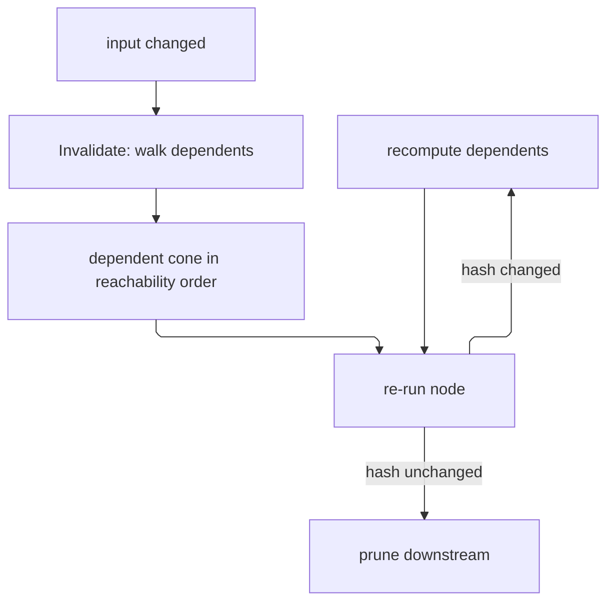

# [APPHOST_DETERMINISM_AND_REPLAY]

The reproducibility kernel for the runtime spine: one determinism context pins the RNG seed, the floating-point column set, and the environment fingerprint so a recorded run reproduces bit-for-bit, a hash-chained log appends every command as a content-addressed entry linking to its predecessor and publishing durably in one motion, a replay-verify rail re-executes a recorded log and proves each step's content hash matches, a macro engine records a command sequence and replays it as a reusable unit, a partial-recompute graph re-runs only the downstream of a changed input by walking the content-address dependency edges and prunes at the first unchanged output, and an adversarial probe DECIDES every chaos injection at a seeded gate, chains each decision as an entry a replay re-derives and re-injects, folds decided against observed injections so a swallowed campaign names itself, and bisects a divergence over the hash chain in log-time. The page owns every owner that sentence names, the addressed draw and its declared lane roster, `HostFingerprint` and its projection onto generated `Benchmark.V1.HostFingerprintWire`, and the four-plane chaos gate every arming site composes; it consumes `CommandReceipt`/`CommandArguments`/`CommandAlgebra`, `ReceiptEnvelope`/`ReceiptSinkPort` (HLC stamp), the Persistence `Version/ledger#CHANGEFEED` durable changefeed through one BIDIRECTIONAL decode-only PORT adapter (a NEUTRAL projected row crosses down and the windowed read decodes back RE-VERIFYING the chain, so replay and bisect survive process restarts), the kernel `Rasm.Domain.CanonicalWriter`/`ContentHash` identity capsule for every content digest (`ChainHash` is the typed chain-link carrier over the kernel `UInt128`) beside `Rasm.Domain.Deterministic` and its `IDrawLane<TSelf>` roster law for the addressed draw, the `Runtime/laneguard` and `Wire/outbound` pipelines as the arming sites this page hands chaos options, `CorrelationId`, and `TenantContext` as settled vocabulary and mints no eighth port.

## [01]-[INDEX]

- [02]-[DETERMINISM_KERNEL]: Pinned seed with its addressed draw, float column set, host fingerprint, and its wire.
- [03]-[EVENT_LOG]: Hash-chained content-addressed log over command and chaos bodies, appending and verifying one chain.
- [04]-[REPLAY_VERIFY]: Re-executes a recorded log and proves per-step content-hash identity.
- [05]-[MACRO_ENGINE]: Records a command sequence and replays it as a reusable parameterized unit.
- [06]-[RECOMPUTE_GRAPH]: Content-addresses dependency edges for partial downstream recompute.
- [07]-[ADVERSARIAL_PROBE]: Seeded four-plane chaos gate, placement-drift fold, and log-time divergence bisection.
- [08]-[TS_PROJECTION]: The host-fingerprint wire shape the viewer mirrors.

## [02]-[DETERMINISM_KERNEL]

- Owner: `HostFingerprint` owns environment identity and `HostFingerprintMap` projects it onto generated `Benchmark.V1.HostFingerprintWire`; `LibmProvider` `[SmartEnum<string>]` owns the transcendental floor a mode admits; `FloatMode` `[SmartEnum<string>]` owns the floating-point column set as a fingerprint FACT; `EnvFingerprint` owns run identity; `DeterminismContext` owns the pinned run and its addressed draw; `DeterminismKernel` establishes the context.
- Cases: 3 float modes — strict, fast, cross-platform — each a triple of `Libm`, `VectorWidthBits`, and `EstimateApis`; strict pins the 128-bit width and refuses the estimate family over the host libm, fast releases the width and admits estimates, cross-platform pins the width, refuses estimates, and EXCLUDES the transcendental floor no RID reproduces. 2 libm rows — host, excluded.
- Entry: `Establish(ulong seed, FloatMode mode, HostFingerprint host, string rid)` returns `DeterminismContext` — pins the RNG seed and captures the environment fingerprint over the host record, the mode's resolved columns, and the RID so a run under the context is reproducible; `HostFingerprint.Current(FrozenDictionary<string, string> stamps)` is the ambient process-side mint and `ToString()` its canonical invariant render — the one host column every downstream ROW holds; `HostFingerprintMap.Wire(EnvFingerprint)` directly constructs the generated message whose ProtoJSON leaves through `WireJson`; `DeterminismContext.Address(string stream)` returns the kernel `Deterministic.Draw` bound to the run seed and the stream key's two digest lanes, and `Draw<TLane>(string stream, long ordinal, TLane lane)` is the one-shot unit draw over it, so a per-execution decision taken under concurrency reproduces exactly where a shared stateful stream cannot; `DeterminismKernel.Reproduces(recorded, live)` returns `Fin<Unit>` carrying both fingerprint texts on its refusal.
- Auto: the ADDRESSED draw binds the kernel `Deterministic.Draw` prefix ONCE per stream — the stream key's full `ContentHash.Of` digest enters as its two `ContentHash.Half` lanes and the root seed rides the seed channel, so no part of either is discarded — and a caller threads `.At(ordinal)` then `.At(lane)` down the loop it already owns, so draw `(stream, ordinal, lane)` answers one number under any interleaving and a recorded address re-derives its own draw with no stream state to rewind; every lane ordinal is a DECLARED `IDrawLane<TSelf>` roster row rather than a positional const, which is the kernel's own law and what scar `SEEDED_FROM_STRING_HASH` costs when it is broken; the environment fingerprint composes the `HostFingerprint` columns with the mode's RESOLVED column values and the RID so a replay on a divergent environment is detected before it produces a wrong result; every digest folds one ordered field stream through the kernel `CanonicalWriter` — int32-LE length-framed UTF-8 text, fixed-width little-endian scalars, count-framed rows — so a record's synthesized `ToString()`, a culture-sensitive number render, and a `FrozenDictionary` enumeration order never reach a preimage.
- Receipt: `DeterminismContext` carries the seed, the mode, and the environment fingerprint; a determinism mismatch at replay surfaces as `ReplayFault.EnvIncompatible` carrying both texts, never a silent wrong result and never a bare predicate the caller re-derives behind.
- Packages: Rasm.Contracts (project — generated `Benchmark.V1.HostFingerprintWire` and `LabelPair`), Google.Protobuf, Rasm (kernel `CanonicalWriter`/`ContentHash` identity capsule, `Deterministic` with `IDrawLane<TSelf>`), Generator.Equals, Thinktecture.Runtime.Extensions, LanguageExt.Core, BCL inbox
- Growth: one float mode is one `FloatMode` row and one libm floor is one `LibmProvider` row; one environment dimension is one column on `HostFingerprint` beside its digest field, its render lane, and the generated message assignment; a consumer-decided host value is one `extension(HostFingerprint)` member at that consumer's tier, never a column here; a new draw lane is one `IDrawLane` roster row, never a const; zero new surface.
- Boundary: the determinism kernel is the only reproducibility owner — an ambient `Random.Shared`, a `DateTime.Now`-seeded RNG, and a per-call float-mode flip are the deleted forms; every draw under a context is the kernel `Deterministic` splitmix reached through ONE face, the addressed one, because a stateful stream leased across concurrent executions answers a value that depends on how many draws happened to precede it and no recorded address recovers it — a BCL `new Random(...)` construction, a `System.Random` handed to a sampler, and a second hasher beside the kernel capsule are all deleted here; this kernel DECLARES `HostFingerprint` and `Rasm.Compute/Runtime/claims#CLAIM_ROW` composes it downward as the claim `host` column through Compute's own legal reference, while `Rasm.Persistence` and the Rhino host decode `HostFingerprintWire` alone and import no type — a Compute-side declaration closes the S1-to-S3 cycle the branch acyclicity law forbids, so the spine mints and every consumer composes; the two members only a consumer's own domain decides land as extensions at that consumer and never as columns here, because `CpuBudget` and `ModelResultIndex` never cross downward; equality is GENERATED on both the record and its wire — `Stamps` is a `FrozenDictionary` and the wire's is an `ImmutableArray`, each of which the synthesized record form compares by reference, so `Observability/benchmarks#BENCHMARK_GATE` reads two same-host fingerprints as unequal without `[Equatable]` and its container attribute; the canonical render is the record's own `ToString()` override rather than the synthesized one, so a persisted host column cannot key two ways across a culture or a `FrozenDictionary` build order; `HostFingerprint.Ordered` is the ONE published order for the stamp map because the digest, the render, AND the wire all read it — a `CanonicalWriter.Sorted` fold inside the digest alone would leave the other two sorting beside it, which is exactly the desync `DIGEST_OVER_UNORDERED_CONTAINER` names; the fingerprint digest hashes the mode's resolved COLUMN VALUES and never its key, because a `cross-platform` run at a 256-bit vector width and one at 128 keyed identically under the mode key and `Reproduces` admitted a real numerical divergence; `FloatMode` is a fingerprint FACT and not a policy — no managed knob turns FMA contraction, vector width, or the platform libm off at runtime, so `Establish` binds no runtime configuration and the tolerance-CLASS vocabulary stays `Rasm.Compute/Tensor/vocabulary#ToleranceClass`'s, which composes `EnvFingerprint` where it needs the fact rather than mirroring the columns; the cross-RID guarantee is exactly what the columns pin — `CrossPlatform` reproduces bit-identically on osx-arm64, linux-x64, and win-x64 for kernels inside its floor, and transcendental-dependent kernels sit OUTSIDE it by construction because no managed surface pins the platform libm; `double.MultiplyAddEstimate` is the estimate spelling wherever a fence names one and `Math.MultiplyAddEstimate` does not exist; the seed is the run's single entropy source so a reproducible run draws all randomness from the seed; the recorded instants ride the log entries themselves, so a replay reads them off the chain and needs no second clock beside the command runtime's own `ClockPolicy`.

```csharp signature
// --- [RUNTIME_PRELUDE] ----------------------------------------------------------------------
using System.Collections.Frozen;
using System.Globalization;
using System.Runtime.InteropServices;
using System.Text.Unicode;
using Generator.Equals;
using LanguageExt;
using Rasm.Domain;
using Thinktecture;
using Host = Rasm.Contracts.Benchmark.V1;
using static LanguageExt.Prelude;

namespace Rasm.AppHost.Runtime;

// --- [TYPES] --------------------------------------------------------------------------------
// Which transcendental floor a mode admits. `Host` is the platform C runtime, whose per-OS and per-architecture
// divergence across the documented `Math` transcendentals is the largest cross-RID source; `Excluded` admits
// none, because no managed surface pins a libm and a mode promising bit-identity cannot promise it over one.
[SmartEnum<string>]
[KeyMemberEqualityComparer<ComparerAccessors.StringOrdinal, string>]
[KeyMemberComparer<ComparerAccessors.StringOrdinal, string>]
public sealed partial class LibmProvider {
    public static readonly LibmProvider Host = new("host");
    public static readonly LibmProvider Excluded = new("excluded");
}

// A FINGERPRINT FACT, never a policy: the columns are exactly the three `EnvFingerprint.Digest` folds, because
// no managed knob turns FMA contraction, vector width, or the platform libm off at runtime and a row claiming an
// establish-time binding forges a guarantee. The deleted columns were `FmaContraction`/`VectorReassociation`,
// which `Strict` and `CrossPlatform` set identically: two byte-identical rows carrying the whole cross-RID claim.
[SmartEnum<string>]
[KeyMemberEqualityComparer<ComparerAccessors.StringOrdinal, string>]
[KeyMemberComparer<ComparerAccessors.StringOrdinal, string>]
public sealed partial class FloatMode {
    public static readonly FloatMode Strict = new("strict", LibmProvider.Host, vectorWidthBits: 128, estimateApis: false);
    public static readonly FloatMode Fast = new("fast", LibmProvider.Host, vectorWidthBits: 0, estimateApis: true);
    public static readonly FloatMode CrossPlatform = new("cross-platform", LibmProvider.Excluded, vectorWidthBits: 128, estimateApis: false);

    public LibmProvider Libm { get; }

    // 128 is the only width osx-arm64, linux-x64, and win-x64 all reach, and reduction grouping is per-width, so
    // a cross-RID mode pins it; 0 declares the host's own `Vector<T>` width and therefore a per-host grouping.
    public int VectorWidthBits { get; }

    // `double.MultiplyAddEstimate` and its family are permitted to differ per platform by contract, so a
    // bit-identity mode refuses them. The member is `double.MultiplyAddEstimate` — `Math` declares no such peer.
    public bool EstimateApis { get; }
}

// --- [MODELS] -------------------------------------------------------------------------------
// The environment-identity record the estate mints HERE. `Rasm.Compute/Runtime/claims#CLAIM_ROW`
// composes it as the claim `host` column through Compute's own legal reference; `Rasm.Persistence` and the Rhino
// host decode `HostFingerprintWire` and import no type. A Compute-side declaration would close the S1-to-S3 cycle
// the branch acyclicity law forbids. Equality is generated: `Stamps` is a `FrozenDictionary` the synthesized
// record form compares by reference, so same-host fingerprints read unequal at `BenchmarkGate` without it.
[Equatable]
public sealed partial record HostFingerprint(
    string Machine,
    string Os,
    string Arch,
    int Processors,
    string Runtime,
    [property: UnorderedEquality] FrozenDictionary<string, string> Stamps) : ISpanFormattable, IUtf8SpanFormattable {
    // `Current` mints ambiently: `Processors` reads the host count, which over-reports a cgroup-limited container,
    // so a composer holding an admitted budget substitutes it at its own tier — `Rasm.Compute/Runtime/receipts`
    // `#BENCHMARK_CLAIMS` `HostFingerprint.Effective` is that substitution and the only mint a claim admits.
    public static HostFingerprint Current(FrozenDictionary<string, string> stamps) =>
        new(Environment.MachineName,
            RuntimeInformation.OSDescription,
            RuntimeInformation.ProcessArchitecture.ToString(),
            Environment.ProcessorCount,
            RuntimeInformation.FrameworkDescription,
            stamps);

    // The ONE published order for a hash-keyed container three byte-deriving readers share — the digest, the
    // render, and the wire. `CanonicalWriter.Sorted` publishes order for a digest that is a container's only
    // reader; here the order must leave the writer, so it publishes on the owning value instead.
    public Seq<KeyValuePair<string, string>> Ordered =>
        toSeq(Stamps.OrderBy(static pair => pair.Key, StringComparer.Ordinal));

    public string StampLine() => string.Join(',', Ordered.Map(static pair => $"{pair.Key}={pair.Value}"));

    // `ToString` renders the canonical single line every downstream ROW holds as its host column — Compute's claim
    // key, Persistence's benchmark and result-index rows. Overriding the record's synthesized form is deliberate:
    // synthesis renders `Processors` under the ambient culture and enumerates `Stamps` in unspecified order.
    public override string ToString() =>
        string.Create(CultureInfo.InvariantCulture, $"{Machine}|{Os}|{Arch}|{Processors}|{Runtime}|{StampLine()}");

    public string ToString(string? format, IFormatProvider? formatProvider) => ToString();

    public bool TryFormat(Span<char> destination, out int charsWritten, ReadOnlySpan<char> format, IFormatProvider? provider) =>
        destination.TryWrite(CultureInfo.InvariantCulture, $"{Machine}|{Os}|{Arch}|{Processors}|{Runtime}|{StampLine()}", out charsWritten);

    public bool TryFormat(Span<byte> utf8Destination, out int bytesWritten, ReadOnlySpan<char> format, IFormatProvider? provider) =>
        Utf8.TryWrite(utf8Destination, CultureInfo.InvariantCulture, $"{Machine}|{Os}|{Arch}|{Processors}|{Runtime}|{StampLine()}", out bytesWritten);
}

public sealed record EnvFingerprint(HostFingerprint Host, FloatMode Mode, string Rid) {
    // The digest folds the mode's RESOLVED COLUMN VALUES and never its key — under the key alone a
    // `cross-platform` run at a 256-bit vector width and one at 128 printed identically and `Reproduces`
    // admitted a real numerical divergence, the same silent-wrong-result class a narrowed RNG seed carries.
    public UInt128 Digest => ContentHash.Of(this, static (env, writer) => writer
        .String(env.Host.Machine)
        .String(env.Host.Os)
        .String(env.Host.Arch)
        .Ordinal(env.Host.Processors)
        .String(env.Host.Runtime)
        .Rows(env.Host.Ordered, static (pair, inner) => inner.String(pair.Key).String(pair.Value))
        .String(env.Rid)
        .String(env.Mode.Libm.Key)
        .Ordinal(env.Mode.VectorWidthBits)
        .Bool(env.Mode.EstimateApis));

    public string Hex => ContentHash.Hex(Digest);
}

public sealed record DeterminismContext(
    ulong Seed,
    FloatMode Mode,
    EnvFingerprint Fingerprint) {
    // The stream key's FULL 128-bit content digest enters as its two kernel `ContentHash.Half` lanes and `Seed`
    // rides the seed channel, so the whole of both survives into the draw prefix. XOR-ing a 64-bit hash into the
    // seed and narrowing to `int` was the deleted form: two stream keys agreeing in their low 32 bits after the
    // XOR drew the identical sequence — a deterministic collision that reproduces perfectly and is therefore
    // invisible to every replay gate this page owns.
    public Deterministic.Draw Address(string stream) =>
        ContentHash.Of(stream, static (key, writer) => writer.String(key)) switch {
            var digest => new Deterministic.Draw(
                Seed: unchecked((long)Seed),
                Prefix: [
                    unchecked((long)ContentHash.Half(digest, Lane.Low)),
                    unchecked((long)ContentHash.Half(digest, Lane.High)),
                ]),
        };

    // One-shot face over the bound prefix, for a site that draws once. A loop threading a prefix binds `Address`
    // itself and pays the key digest once, which is the whole reason the kernel `Draw` struct carries a prefix.
    public double Draw<TLane>(string stream, long ordinal, TLane lane) where TLane : IDrawLane<TLane> =>
        Address(stream).At(ordinal, lane.Lane).Unit;
}

// --- [OPERATIONS] ---------------------------------------------------------------------------
public static class DeterminismKernel {
    public static DeterminismContext Establish(ulong seed, FloatMode mode, HostFingerprint host, string rid) =>
        new(seed, mode, new EnvFingerprint(host, mode, rid));

    // The refusal CARRIES both texts, so the caller that reports a mismatch reads them off the fault instead of
    // re-deriving the two hexes a `bool` discarded. The digest already folds every mode column, so a mode
    // comparison beside it would gate on the KEY the digest deliberately excludes and refuse two numerically
    // identical runs that named their mode differently.
    public static Fin<Unit> Reproduces(DeterminismContext recorded, DeterminismContext live) =>
        recorded.Seed == live.Seed && recorded.Fingerprint.Digest == live.Fingerprint.Digest
            ? Fin.Succ(unit)
            : Fin.Fail<Unit>(new ReplayFault.EnvIncompatible(recorded.Fingerprint.Hex, live.Fingerprint.Hex));
}

// --- [BOUNDARIES] ---------------------------------------------------------------------------
// The generated message is the seam. Repeated stamp rows preserve the owner's published order, while `Print`
// carries the identity peers compare without re-deriving the mode or the host digest.
internal static class HostFingerprintMap {
    public static Host.HostFingerprintWire Wire(EnvFingerprint env) => new() {
        Print = env.Hex,
        Machine = env.Host.Machine,
        Os = env.Host.Os,
        Arch = env.Host.Arch,
        Processors = checked((uint)env.Host.Processors),
        Runtime = env.Host.Runtime,
        Stamps = { env.Host.Ordered.Map(static row => new Host.LabelPair { Key = row.Key, Value = row.Value }) },
    };
}
```

## [03]-[EVENT_LOG]

- Owner: `ArgumentBytes` the one arguments-digest owner over `CommandArguments`; `LogBody` `[Union]` the two entry species one chain carries and `LogKind` their key consts; `LogBodies` the three body projections every seat reads; `LogEntry` the content-addressed entry over that body; `ChainHash` the typed chain-link value over the kernel `UInt128` digest (the frozen-name law reserves `ContentHash` for the kernel `Rasm.Domain` entry — a local mint under that name is the deleted collision); `EventLog` the static append-project-and-verify surface; `DeterminismLogRow`/`ChaosDecisionRow`/`DeterminismLogPolicy`/`DeterminismLogMap`/`DeterminismLogCodec`/`ChangefeedPort` the neutral projected row, its chaos column group, the entity-kind/family policy rows, the one row-seam mapper, the railed decode, and the BIDIRECTIONAL decode-only Persistence PORT adapter.
- Cases: `LogBody` = Command | Chaos — a command carries its descriptor and arguments digest, a chaos entry carries its whole `ChaosDecision`.
- Entry: `Append(EventLog.Chain chain, ChangefeedPort feed, LogBody body, DeterminismContext context, Instant physical, ulong logical)` returns `Fin<(EventLog.Chain Chain, LogEntry Entry)>` — mints one content-addressed entry whose hash chains to the predecessor, stamps the HLC physical-and-logical pair, and PUBLISHES it through the durable feed in the same motion, so the chain link and its durable record land together or neither does; `Project(chain, body, context, physical, logical)` returns the same pair with NO publish, for a transcript or macro slice re-chaining exact receipts the dispatch append already fed; `VerifyChain(Seq<LogEntry> entries)` returns `Fin<Unit>` — proves every entry's predecessor-hash matches the actual predecessor content hash so a tampered or reordered entry fails the chain; `ChangefeedPort.Load(ChangefeedWindow window)` returns `Fin<Seq<LogEntry>>` — the READ half: fetches the projected rows by origin/sequence window (the `ReplayWindow` windowed-read case the Persistence ledger declares), decodes each to a `LogEntry`, and re-verifies the hash chain through the kernel-composed digests BEFORE any replay fold consumes it.
- Auto: each entry's content hash composes the kernel `ContentHash.Of` (one algorithm, seed zero, federation-wide) over the ordered field stream of the predecessor hash, the body's SPECIES KEY, its descriptor, its digest, the determinism context digest, and the sequence — ONE `Mint` derivation the append, the projection, and the replay re-derive all call, so the chain is tamper-evident and the sites cannot drift; the species enters the address, so a command entry and a chaos entry agreeing on descriptor and digest still key distinctly and the replay fold discriminates on a CASE rather than sniffing a descriptor prefix; a command body's digest covers the CANONICAL ARGUMENT BYTES under `ArgumentBytes` and a chaos body's covers the whole decision, so an identical command under an identical context produces an identical hash and a differing one cannot, which is what makes the hash the dedup and recompute-skip key; the chain root is the genesis hash so a chain proves its own origin; `Append` publishes each minted entry through the `ChangefeedPort` as one NEUTRAL `DeterminismLogRow` the `DeterminismLogMap` mapper projects, the entity-kind/family spellings are `DeterminismLogPolicy` rows, and a positional construction of the Persistence `OpLogEntry` is the deleted form — so the event log rides the existing durable changefeed, never a second store.
- Receipt: `LogEntry` carries the sequence index, the content hash, the predecessor hash, the body, the determinism digest, and the HLC stamp; the entry is the log's evidence, never a separate receipt.
- Packages: Rasm (kernel `CanonicalWriter`/`ContentHash`), Riok.Mapperly, Generator.Equals, LanguageExt.Core, NodaTime, Thinktecture.Runtime.Extensions, BCL inbox
- Growth: one entry field is one column on `LogEntry` plus its row column and its digest field; a new entry species is one `LogBody` case with its key const, its `LogBodies` arm, and its row column group; a new read shape is one window column on `ChangefeedWindow`; the hash algorithm is the kernel's, never a policy value here; zero new surface.
- Boundary: the event log is the only command-log owner — an ad hoc audit table, a per-command log line, a non-chained event store, and any construction of the Persistence `OpLogEntry` interior here are the deleted forms; the append takes a BODY and never a `CommandReceipt`, because the derivation only ever read `receipt.Descriptor` and that unused parameter is what forced the chaos seat to forge a whole receipt — a rolled-back transaction for an injection that rolled nothing back, a zero elapsed on a latency injection whose entire effect is elapsed time, and two `Correlation.Mint()` calls giving one event two identities; minting and publishing are ONE entry on `Append`, because the deleted split left `Publish` with no call site while `Load` fed replay and bisect from a store nothing wrote, and `Project` is the publish-free SIBLING with its own live caller (`Agent/reasoning#TRANSCRIPT_CHAIN` re-chains exact tool-call receipts the dispatch append already published, so a second publish would double-write the feed); the port itself is constructed once at the `Runtime/modules#MODULE_LEDGER` `RootBinding.Seated("changefeed", …)` row from the Persistence changefeed delegates and seated there, so this page declares the port shape and never its construction; the row seam has ONE mapper — the projection is generated so a new row column is a COMPILE break, while the decode stays a hand member because it rails `Fin` and Mapperly emits no railed body, and its hex admission is the kernel `ContentHash.Admit` rather than a local `UInt128.TryParse` that admits uppercase and short forms this fabric never emits; `[MapDerivedType]` is unspellable on this seam and the row keeps its flat shape — the attribute emits a type switch only where SOURCE and TARGET hierarchies share a base type, and one changefeed column family is deliberately not a hierarchy — so the four body columns bind whole-source readers over `LogBodies`, which suppresses source-side `RMG020` for that one mapping while target-side `RMG012`/`RMG013` keep full force; the arguments digest is the arguments' and never the descriptor's a second time — the deleted form hashed `receipt.Descriptor` into the field named `ArgumentsDigest`, so two commands sharing a descriptor with different arguments minted one `ChainHash` and the tamper-evidence, the recompute-skip key, the dedup key, and the declared bit-identity all collapsed onto the descriptor alone; the HLC stamp orders entries across processes so a multi-process command log merges by HLC, composing the existing `ReceiptEnvelope` causal primitive; the chain verify is the tamper-evidence guarantee, so a support bundle's command log proves its own integrity.

```csharp signature
// --- [RUNTIME_PRELUDE] ----------------------------------------------------------------------
using Generator.Equals;
using LanguageExt;
using NodaTime;
using Rasm.Domain;
using Riok.Mapperly.Abstractions;
using Thinktecture;
using static LanguageExt.Prelude;

namespace Rasm.AppHost.Runtime;

// --- [TYPES] --------------------------------------------------------------------------------
// The typed chain-link value over the kernel UInt128 digest. The kernel reserves the ContentHash
// name; every digest below composes Rasm.Domain.ContentHash.Of — one algorithm, one seed.
[ValueObject<UInt128>(
    ConversionToKeyMemberType = ConversionOperatorsGeneration.Implicit,
    ConversionFromKeyMemberType = ConversionOperatorsGeneration.None)]
public readonly partial struct ChainHash {
    public static readonly ChainHash Genesis = Create(UInt128.Zero);
    public static ChainHash Of(UInt128 digest) => Create(digest);
    public string Hex => ContentHash.Hex(this);
}

// Two entry species, ONE chain. A command's arguments re-supply from the caller's own store, so its body
// carries their digest alone; an injection has no other store anywhere, so its body carries the whole
// decision and the chain's own verify becomes that decision's tamper-evidence. Species enters the content
// address, so `Rederive` dispatches on a case and never on a `chaos.` descriptor prefix.
[Union(ConversionFromValue = ConversionOperatorsGeneration.None)]
public abstract partial record LogBody {
    private LogBody() { }
    public sealed record Command(string Descriptor, UInt128 ArgumentsDigest) : LogBody;
    public sealed record Chaos(ChaosDecision Decision) : LogBody;
}

// --- [CONSTANTS] ----------------------------------------------------------------------------
public static class LogKind {
    public const string Command = "command";
    public const string Chaos = "chaos";
}

// --- [MODELS] -------------------------------------------------------------------------------
// Three projections every seat reads instead of re-switching: `Mint` folds all three into the address, the
// row mapper reads them through its whole-source readers, and the replay fold discriminates on them.
public static class LogBodies {
    extension(LogBody body) {
        public string Kind => body.Switch(
            command: static _ => LogKind.Command,
            chaos: static _ => LogKind.Chaos);

        public string Descriptor => body.Switch(
            command: static command => command.Descriptor,
            chaos: static chaos => chaos.Decision.PipelineKey);

        public UInt128 Digest => body.Switch(
            command: static command => command.ArgumentsDigest,
            chaos: static chaos => chaos.Decision.Digest);
    }
}

// `Body` is a reference-shaped union and `Instant` a value, so the synthesized record equality already answers
// by reference on the one member a dedup read compares — generated equality closes it.
[Equatable]
public sealed partial record LogEntry(
    long Sequence,
    ChainHash Hash,
    ChainHash Predecessor,
    LogBody Body,
    UInt128 DeterminismDigest,
    Instant Physical,
    ulong Logical);

// The NEUTRAL projected determinism log row — AppHost's own wire shape of primitives; the port
// maps it through the Persistence-owned changefeed vocabulary. Entity spellings are policy rows.
public sealed record DeterminismLogRow(
    long Sequence,
    string Kind,
    string Hash,
    string Predecessor,
    string Descriptor,
    string BodyDigest,
    string DeterminismDigest,
    Instant Physical,
    ulong Logical,
    ChaosDecisionRow? Chaos);

public sealed record DeterminismLogPolicy(string EntityKind, string ColumnFamily) {
    public static readonly DeterminismLogPolicy Canonical = new("determinism.command", "command");
}

// --- [OPERATIONS] ---------------------------------------------------------------------------
// The ONE arguments-digest owner. Tenancy enters because one payload under two tenants is two commands;
// CORRELATION does not, because a per-invocation identity inside a content address defeats the dedup and
// recompute-skip the address exists to serve. `GetRawText()` returns the octets the wire law already froze, so
// the digest reads captured bytes rather than re-serializing a parsed document into a second encoder.
public static class ArgumentBytes {
    extension(CommandArguments arguments) {
        public UInt128 Digest =>
            ContentHash.Of(arguments, static (row, writer) =>
                writer.String(row.Payload.GetRawText()).String(row.Tenant.Entry));
    }
}

public static class EventLog {
    public sealed record Chain(ChainHash Head, long Sequence) {
        public static readonly Chain Genesis = new(ChainHash.Genesis, 0L);
    }

    // ONE hash derivation: append, projection, and replay re-derive all call it, so the sites cannot drift and
    // the read-back re-verify recomputes the same law. Species is the first body field in the stream, so a
    // chaos decision can never key as the command sharing its descriptor.
    public static ChainHash Mint(ChainHash predecessor, LogBody body, UInt128 determinismDigest, long sequence) =>
        ChainHash.Of(ContentHash.Of(
            (predecessor, body, determinismDigest, sequence),
            static (state, writer) => writer
                .U128(state.predecessor)
                .String(state.body.Kind)
                .String(state.body.Descriptor)
                .U128(state.body.Digest)
                .U128(state.determinismDigest)
                .I64(state.sequence)));

    // Mint and publish are ONE motion: a chain head that advanced past an unpublished entry is a chain whose
    // durable prefix can never re-verify, so the durable refusal is the append's refusal.
    public static Fin<(Chain Chain, LogEntry Entry)> Append(
        Chain chain, ChangefeedPort feed, LogBody body,
        DeterminismContext context, Instant physical, ulong logical) =>
        Minted(chain, body, context.Fingerprint.Digest, physical, logical) switch {
            var minted => feed.Publish(minted.Entry).Map(_ => minted),
        };

    // Projection-side mint: the same link derivation with NO publish — a transcript or macro slice re-chains
    // exact receipts into entries without re-writing the durable feed the dispatch append already fed.
    public static (Chain Chain, LogEntry Entry) Project(
        Chain chain, LogBody body, DeterminismContext context, Instant physical, ulong logical) =>
        Minted(chain, body, context.Fingerprint.Digest, physical, logical);

    static (Chain Chain, LogEntry Entry) Minted(Chain chain, LogBody body, UInt128 determinismDigest, Instant physical, ulong logical) =>
        Mint(chain.Head, body, determinismDigest, chain.Sequence) switch {
            var hash => (new Chain(hash, chain.Sequence + 1L),
                new LogEntry(chain.Sequence + 1L, hash, chain.Head, body, determinismDigest, physical, logical)),
        };

    // Read-back re-verify: re-mint each entry's hash from its row content and match entry.Hash so a
    // tampered LogEntry fails ChainBroken before replay — not merely predecessor/sequence continuity.
    // Because a chaos body's digest folds its decision, an edited injection value fails HERE.
    public static Fin<Unit> VerifyChain(Seq<LogEntry> entries) =>
        entries.Fold(Fin.Succ((Prev: ChainHash.Genesis, Seq: 0L)), (acc, entry) =>
            acc.Bind(state => Mint(state.Prev, entry.Body, entry.DeterminismDigest, state.Seq) is ChainHash expected
                && entry.Predecessor == state.Prev && entry.Sequence == state.Seq + 1L && entry.Hash == expected
                    ? Fin.Succ((entry.Hash, entry.Sequence))
                    : Fin.Fail<(ChainHash, long)>(new ReplayFault.ChainBroken(entry.Sequence, "chain-break"))))
            .Map(static _ => unit);
}

// --- [BOUNDARIES] ---------------------------------------------------------------------------
// The ONE durable-row seam mapper. Target-side completeness is a compile proof, so a column added to the row
// breaks here instead of transcribing a default at runtime. The four body columns bind whole-source readers
// because `LogBodies` projects through the union's generated `Switch` and no property path reaches an extension
// member; that reader suppresses source-side RMG020 for this mapping alone, which is why the ignore roster below
// is authored inventory rather than compiler proof.
[Mapper(RequiredMappingStrategy = RequiredMappingStrategy.Both,
        EnabledConversions = MappingConversionType.All & ~MappingConversionType.ExplicitCast)]
internal static partial class DeterminismLogMap {
    [MapperIgnoreSource(nameof(LogEntry.Body))]
    [MapPropertyFromSource(nameof(DeterminismLogRow.Kind), Use = nameof(KindOf))]
    [MapPropertyFromSource(nameof(DeterminismLogRow.Descriptor), Use = nameof(DescriptorOf))]
    [MapPropertyFromSource(nameof(DeterminismLogRow.BodyDigest), Use = nameof(BodyDigestOf))]
    [MapPropertyFromSource(nameof(DeterminismLogRow.Chaos), Use = nameof(ChaosOf))]
    [MapProperty(nameof(LogEntry.Hash), nameof(DeterminismLogRow.Hash), Use = nameof(ChainText))]
    [MapProperty(nameof(LogEntry.Predecessor), nameof(DeterminismLogRow.Predecessor), Use = nameof(ChainText))]
    [MapProperty(nameof(LogEntry.DeterminismDigest), nameof(DeterminismLogRow.DeterminismDigest), Use = nameof(DigestText))]
    public static partial DeterminismLogRow Row(LogEntry entry);

    // Flat column group, fully member-matched: `ChaosDecision` publishes the plane, delay, and catalogue key as
    // its own properties precisely so this mapping keeps source-side completeness. `PipelineKey` is ignored
    // because the owning row's `Descriptor` already spells it and a second copy is a mirror that can disagree.
    [MapperIgnoreSource(nameof(ChaosDecision.PipelineKey))]
    [MapperIgnoreSource(nameof(ChaosDecision.Injected))]
    [MapperIgnoreSource(nameof(ChaosDecision.Digest))]
    [MapProperty([nameof(ChaosDecision.Kind), nameof(ChaosKind.Key)], nameof(ChaosDecisionRow.Injection))]
    [MapProperty(nameof(ChaosDecision.Delay), nameof(ChaosDecisionRow.DelayTicks), Use = nameof(Ticks))]
    public static partial ChaosDecisionRow Row(ChaosDecision decision);

    [NamedMapping(nameof(ChainText))] static string ChainText(ChainHash hash) => hash.Hex;
    [NamedMapping(nameof(DigestText))] static string DigestText(UInt128 digest) => ContentHash.Hex(digest);
    [NamedMapping(nameof(Ticks))] static long Ticks(Duration delay) => delay.BclCompatibleTicks;
    [NamedMapping(nameof(KindOf))] static string KindOf(LogEntry entry) => entry.Body.Kind;
    [NamedMapping(nameof(DescriptorOf))] static string DescriptorOf(LogEntry entry) => entry.Body.Descriptor;
    [NamedMapping(nameof(BodyDigestOf))] static string BodyDigestOf(LogEntry entry) => ContentHash.Hex(entry.Body.Digest);

    [NamedMapping(nameof(ChaosOf))]
    static ChaosDecisionRow? ChaosOf(LogEntry entry) => entry.Body.Switch(
        command: static _ => (ChaosDecisionRow?)null,
        chaos: static chaos => Row(chaos.Decision));
}

// The INVERSE stays a hand member because it rails `Fin` and no generated body carries a rail. Every hex column
// admits through the kernel `ContentHash.Admit`, which REFUSES uppercase and short forms — a bare
// `UInt128.TryParse` collapses `"A"` and a full-width key ending `0a` onto one chain link.
public static class DeterminismLogCodec {
    public static Fin<LogEntry> Decode(DeterminismLogRow row) =>
        (Hash: Admit(row.Hash, row), Pred: Admit(row.Predecessor, row),
         Digest: Admit(row.BodyDigest, row), Det: Admit(row.DeterminismDigest, row))
            .Apply((hash, pred, digest, det) => (hash, pred, digest, det))
            .As()
            .ToFin()
            .Bind(parsed => Body(row, parsed.digest).Map(body => new LogEntry(
                row.Sequence, ChainHash.Of(parsed.hash), ChainHash.Of(parsed.pred),
                body, parsed.det, row.Physical, row.Logical)));

    // Chaos rehydrates from its OWN columns, so a chaos row stripped of its decision group fails here rather
    // than rehydrating as a command the replay would dispatch through the algebra. Whatever this reconstructs,
    // `VerifyChain` re-mints the body digest one line later, so a doctored column answers `ChainBroken`.
    static Fin<LogBody> Body(DeterminismLogRow row, UInt128 digest) => row switch {
        { Kind: LogKind.Command } => Fin.Succ<LogBody>(new LogBody.Command(row.Descriptor, digest)),
        { Kind: LogKind.Chaos, Chaos: { } chaos } => chaos.Decode(row.Descriptor).Map(LogBody (decision) => new LogBody.Chaos(decision)),
        _ => Fin.Fail<LogBody>(new ReplayFault.ChainBroken(row.Sequence, "row-kind")),
    };

    static Validation<Error, UInt128> Admit(string text, DeterminismLogRow row) =>
        ContentHash.Admit(text, Op.Of()).Match(
            Succ: Validation<Error, UInt128>.Success,
            Fail: _ => new ReplayFault.ChainBroken(row.Sequence, "row-decode"));
}

// --- [COMPOSITION] --------------------------------------------------------------------------
// The BIDIRECTIONAL decode-only Persistence PORT adapter (Version/ledger#CHANGEFEED): `EventLog.Append` is the
// write half's one caller, and the read half rides the ledger's ONE ReplayWindow windowed-read case
// (origin/sequence window) the AppUi edit-intent read and the egress CDC drain share, re-verifying
// the chain BEFORE any replay or bisect fold consumes it.
public readonly record struct ChangefeedWindow(Guid OriginStoreId, long FromSequence, long ToSequence);

public sealed record ChangefeedPort(
    Func<DeterminismLogRow, DeterminismLogPolicy, Fin<Unit>> Append,
    Func<ChangefeedWindow, Fin<Seq<DeterminismLogRow>>> Read) {
    public Fin<Unit> Publish(LogEntry entry) => Append(DeterminismLogMap.Row(entry), DeterminismLogPolicy.Canonical);

    public Fin<Seq<LogEntry>> Load(ChangefeedWindow window) =>
        Read(window)
            .Bind(static rows => rows.TraverseM(DeterminismLogCodec.Decode).As())
            .Bind(static entries => EventLog.VerifyChain(entries).Map(_ => entries));
}
```

## [04]-[REPLAY_VERIFY]

- Owner: `ReplayOutcome` `[Union]` the per-step replay disposition; `ReplayFault` `[Union]` fault family riding the kernel `[FaultCase]`/`Fault` floor (`[FaultCase]` realizes the registry over `FaultBand.Replay`); `ReplayVerify` the static re-execute-and-prove surface.
- Cases: replay dispositions Matched | Injected | Diverged | EnvironmentMismatch | Skipped | Faulted; `ReplayFault` = ChainBroken | HashDiverged | EnvIncompatible | ChaosUndeclared.
- Entry: `Replay(ReplayRuntime runtime, Seq<LogEntry> log, DeterminismContext live)` returns `IO<Seq<ReplayOutcome>>` — re-executes a recorded log under a live determinism context, re-deriving each step's content hash through the one `EventLog.Mint` derivation and proving it matches the recorded hash, so a replay either reproduces the recorded run exactly or names the first divergent step; a cross-restart replay ingests its `Seq<LogEntry>` through `ChangefeedPort.Load` — the recorded chain rehydrates from the durable store and re-verifies BEFORE it replays, never surviving only the recording process's memory.
- Auto: the replay first proves the live environment reproduces the recorded one through `DeterminismKernel.Reproduces` so a divergent environment fails the whole replay before re-executing a single step, and that refusal CARRIES both fingerprint texts, so the `EnvironmentMismatch` outcome reads them off the fault rather than re-deriving them; each step dispatches on its body — a command re-runs through the command algebra under the recorded determinism context and re-derives its content hash from the RE-EXECUTED receipt's descriptor and the arguments the replay actually fed it, while a chaos entry re-DERIVES its decision from the recorded address under the recorded seed and its band, because an injection has nothing to re-execute and everything to recompute — so a divergence is detected at the exact step it occurred; the runtime's `ChaosArming` is the `ChaosArming.Driven` seat over this same log, so the commands the replay re-runs meet the recorded injections at the recorded ordinals instead of rolling fresh dice; a matched step confirms bit-identity, a diverged step names the recorded and re-derived hashes so the divergence is diagnosable; the replay chains the verification so the first divergence halts the replay because every downstream hash depends on the diverged step; the whole outcome sequence fans once through the command runtime's own `ReceiptSinkPort`, so a replay is evidence on the one receipt stream.
- Receipt: each step yields one `ReplayOutcome` and the sequence fans under receipt-only `ReceiptKind.Replay`; an unclassified refusal becomes `Faulted` carrying a canonical ProtoJSON generated `FaultObservation`, never a `Skipped` reason minted from `Error.Message`.
- Packages: Rasm.Contracts, Google.Protobuf, LanguageExt.Core, NodaTime, Thinktecture.Runtime.Extensions, BCL inbox
- Growth: one disposition is one `ReplayOutcome` case; one fault is one `ReplayFault` case inside the `FaultBand.Replay` span; a new entry species is one arm on the body dispatch; zero new surface.
- Boundary: replay verification is the only reproducibility-proof owner; known refusals remain typed, while an unclassified `Error` passes through `FaultWire.Observe` and `WireJson.Element` exactly once, leaving the STJ replay union with a detached canonical ProtoJSON element rather than reflecting a generated message or invoking a second mapper. Replayed commands run through the live command algebra; environment compatibility is a precondition; re-derivation reads re-execution rather than recorded fields; `ReplayRuntime` reuses the command clock and sink; chaos proof re-derives the recorded decision and reports divergence when its band moved.

```csharp signature
// --- [RUNTIME_PRELUDE] ----------------------------------------------------------------------
using System.Text.Json;
using LanguageExt;
using Rasm.Domain;
using Thinktecture;
using static LanguageExt.Prelude;

namespace Rasm.AppHost.Runtime;

// --- [TYPES] --------------------------------------------------------------------------------
[Union(ConversionFromValue = ConversionOperatorsGeneration.None)]
[JsonPolymorphic(TypeDiscriminatorPropertyName = "kind")]
[JsonDerivedType(typeof(Matched), "matched")]
[JsonDerivedType(typeof(Injected), "injected")]
[JsonDerivedType(typeof(Diverged), "diverged")]
[JsonDerivedType(typeof(EnvironmentMismatch), "environment-mismatch")]
[JsonDerivedType(typeof(Skipped), "skipped")]
[JsonDerivedType(typeof(Faulted), "faulted")]
public abstract partial record ReplayOutcome {
    private ReplayOutcome() { }
    public sealed record Matched(long Sequence, ChainHash Hash) : ReplayOutcome;
    public sealed record Injected(long Sequence, string Injection) : ReplayOutcome;
    public sealed record Diverged(long Sequence, ChainHash Recorded, ChainHash Rederived) : ReplayOutcome;
    public sealed record EnvironmentMismatch(string Recorded, string Live) : ReplayOutcome;
    public sealed record Skipped(long Sequence, string Reason) : ReplayOutcome;
    public sealed record Faulted(long Sequence, JsonElement Fault) : ReplayOutcome;
}

// --- [ERRORS] ---------------------------------------------------------------------------
// fields its reader needs typed. The deleted form rendered them into the detail string — `$"chain-break:
// {sequence}"`, `$"{recorded}|{live}"` — so every consumer re-parsed text this rail already held.
[Union(ConversionFromValue = ConversionOperatorsGeneration.None)]
public abstract partial record ReplayFault : Fault {
    private static readonly FaultBand FamilyBand = FaultBand.Replay;
    private ReplayFault(string detail) => Detail = detail;
    public string Detail { get; }
    public sealed override string Message => Detail;


    [FaultCase(0)]
    public sealed partial record ChainBroken : ReplayFault {
        public ChainBroken(long sequence, string reason) : base($"{reason}:{sequence}") =>
            (Sequence, Reason) = (sequence, reason);
        public long Sequence { get; }
        public string Reason { get; }
    }

    [FaultCase(1)]
    public sealed partial record HashDiverged : ReplayFault {
        public HashDiverged(long sequence, ChainHash recorded, ChainHash rederived)
            : base($"{sequence}:{recorded.Hex}!={rederived.Hex}") =>
            (Sequence, Recorded, Rederived) = (sequence, recorded, rederived);
        public long Sequence { get; }
        public ChainHash Recorded { get; }
        public ChainHash Rederived { get; }
    }

    [FaultCase(2)]
    public sealed partial record EnvIncompatible : ReplayFault {
        public EnvIncompatible(string recorded, string live) : base($"{recorded}!={live}") =>
            (Recorded, Live) = (recorded, live);
        public string Recorded { get; }
        public string Live { get; }
    }

    // Chaos ADMISSION refuses here rather than on a band of its own: an undeclarable band is a recorded campaign
    // no replay can reproduce, which is a replay concern, and `FaultBand.Replay` holds the span for it.
    [FaultCase(3)]
    public sealed partial record ChaosUndeclared : ReplayFault {
        public ChaosUndeclared(string pipelineKey, string detail) : base($"{pipelineKey}: {detail}") =>
            PipelineKey = pipelineKey;
        public string PipelineKey { get; }
    }
}

// --- [MODELS] -------------------------------------------------------------------------------
// `Chaos` is the DRIVEN arming over the same log: the pipelines a replayed command traverses read their
// injections off the chain, so the re-run meets the recorded campaign rather than a fresh roll of it.
public sealed record ReplayRuntime(
    CommandRuntime Command,
    Func<LogEntry, CommandArguments> ArgumentsOf,
    ChaosArming Chaos,
    DeterminismContext Recorded);

// --- [OPERATIONS] ---------------------------------------------------------------------------
public static class ReplayVerify {
    // Environment proof and chain proof are one rail, so the whole precondition reads as one `Bind` and the
    // refusal decides the outcome shape from its own CASE rather than from a flag the caller re-derives.
    public static IO<Seq<ReplayOutcome>> Replay(ReplayRuntime runtime, Seq<LogEntry> log, DeterminismContext live) =>
        DeterminismKernel.Reproduces(runtime.Recorded, live)
            .Bind(_ => EventLog.VerifyChain(log))
            .Match(
                Succ: _ => Fold(runtime, log),
                Fail: error => IO.pure(Seq(Refused(error))))
            .Bind(outcomes => Fan(runtime, outcomes));

    static ReplayOutcome Refused(Error error) => error switch {
        ReplayFault.EnvIncompatible env => new ReplayOutcome.EnvironmentMismatch(env.Recorded, env.Live),
        ReplayFault.ChainBroken broken => new ReplayOutcome.Skipped(broken.Sequence, broken.Reason),
        var other => new ReplayOutcome.Faulted(0L, WireJson.Element(FaultWire.Observe(other))),
    };

    static IO<Seq<ReplayOutcome>> Fold(ReplayRuntime runtime, Seq<LogEntry> log) =>
        log.FoldM(Seq<ReplayOutcome>(), (acc, entry) =>
            acc.Last.Map(static last => last is ReplayOutcome.Diverged).IfNone(false)
                ? IO.pure(acc.Add(new ReplayOutcome.Skipped(entry.Sequence, "downstream-of-divergence")))
                : Step(runtime, entry).Map(outcome => acc.Add(outcome))).As();

    // Species decides how a step is PROVEN: a command by re-execution, an injection by re-derivation. The
    // recorded arguments the replay feeds are the command re-derivation's own input, so the comparison spans
    // the whole command rather than the descriptor the recorded entry would have supplied either way.
    static IO<ReplayOutcome> Step(ReplayRuntime runtime, LogEntry entry) =>
        entry.Body.Switch(
            command: command => IO.lift(() => runtime.ArgumentsOf(entry)).Bind(arguments =>
                CommandAlgebra.Run(runtime.Command, command.Descriptor, arguments)
                    .Map(receipt => Rederive(entry, receipt, arguments))),
            chaos: chaos => IO.pure(Reinjected(runtime, entry, chaos.Decision)));

    // Re-derivation IS the one EventLog.Mint law over the RE-EXECUTED command — no per-site hash composition
    // to drift, and no recorded field standing in for a value the re-run was supposed to produce.
    static ReplayOutcome Rederive(LogEntry entry, CommandReceipt receipt, CommandArguments arguments) =>
        EventLog.Mint(entry.Predecessor, new LogBody.Command(receipt.Descriptor, arguments.Digest), entry.DeterminismDigest, entry.Sequence - 1L) is var rederived
            && rederived == entry.Hash
            ? new ReplayOutcome.Matched(entry.Sequence, entry.Hash)
            : new ReplayOutcome.Diverged(entry.Sequence, entry.Hash, rederived);

    // An injection has nothing to re-execute: its whole content is a function of the recorded address, the
    // run's seed, and the band it names, so the proof RECOMPUTES the decision and re-mints its link. A record
    // the kernel cannot regenerate names itself here instead of passing as a step that matched by copying.
    static ReplayOutcome Reinjected(ReplayRuntime runtime, LogEntry entry, ChaosDecision decision) =>
        runtime.Chaos.Rederive(runtime.Recorded, decision)
            .Map(rederived => EventLog.Mint(entry.Predecessor, new LogBody.Chaos(rederived), entry.DeterminismDigest, entry.Sequence - 1L))
            .Match(
                Some: hash => hash == entry.Hash
                    ? new ReplayOutcome.Injected(entry.Sequence, decision.Kind.Key)
                    : (ReplayOutcome)new ReplayOutcome.Diverged(entry.Sequence, entry.Hash, hash),
                None: () => new ReplayOutcome.Skipped(entry.Sequence, "chaos-unprovable"));

    static IO<Seq<ReplayOutcome>> Fan(ReplayRuntime runtime, Seq<ReplayOutcome> outcomes) =>
        runtime.Command.Sink.Send(
                Correlation.Mint(), TenantContext.Current, TelemetrySource.AppHost, ReceiptKind.Replay.Key,
                JsonSerializer.SerializeToElement(outcomes, runtime.Command.Wire))
            .Map(_ => outcomes);
}
```

## [05]-[MACRO_ENGINE]

- Owner: `Macro` the recorded-command-sequence record; `MacroParameter` the parameterized-substitution row; `MacroEngine` the static record-and-replay surface.
- Entry: `Macro.Record(string macroId, Seq<LogEntry> entries, Seq<MacroParameter> parameters)` returns `Macro` — captures a command subsequence as a reusable macro with parameter substitution points; `Play(MacroEngine.Runtime runtime, Macro macro, HashMap<string, JsonElement> bindings)` returns `IO<Seq<CommandReceipt>>` — replays the macro's commands as one batch with the parameter bindings substituted, so a recorded workflow becomes a reusable parameterized operation.
- Auto: a macro records the content hashes of its commands so a macro is content-addressed and a re-recorded identical sequence is the same macro; the parameters mark argument substitution points so a macro recorded with a concrete value replays with a different value bound, turning a one-off sequence into a reusable template; the macro replay rides the command algebra `Batch` so a macro is an all-or-nothing intent group — a failing command rolls back the whole macro, never a half-applied workflow; a macro's commands are the recorded log entries so a macro is a slice of the event log, never a separate recording format.
- Receipt: the macro play yields the batch's `CommandReceipt` sequence; the macro itself logs its own content hash on record — no parallel macro receipt.
- Packages: Rasm (kernel `CanonicalWriter`/`ContentHash`), Generator.Equals, LanguageExt.Core, Thinktecture.Runtime.Extensions, BCL inbox
- Growth: one parameter is one `MacroParameter` row; a new substitution shape is one column on `MacroParameter`; zero new surface.
- Boundary: the macro engine is the only command-recording owner — a UI macro recorder, a script-based replay, a separate macro store, and a play that silently filters the injections its own content hash covers are the deleted forms; a macro is a slice of the event log so the macro and the command log share one recording, and a macro replay re-runs through the command algebra so a macro gains no privileged execution; the parameterization is argument substitution at the recorded points so a macro is a template, not a literal replay, distinguishing a reusable macro from a raw replay-verify; the macro replay is an atomic batch so a macro is transactional, and a failing macro rolls back through the command algebra's unwind; the macro's content hash is its identity so a shared macro is verifiable — two parties with the same macro hash replay the identical sequence; equality is generated because `Commands` and `Parameters` are `Seq` members the synthesized record form compares by reference, so two identical recordings read unequal at every dedup and cache read.

```csharp signature
// --- [RUNTIME_PRELUDE] ----------------------------------------------------------------------
using System.Text.Json;
using Generator.Equals;
using LanguageExt;
using Rasm.Domain;
using static LanguageExt.Prelude;

namespace Rasm.AppHost.Runtime;

// --- [MODELS] -------------------------------------------------------------------------------
public sealed record MacroParameter(
    string Name,
    long AtSequence,
    string JsonPath,
    DataClassification Classification);

[Equatable]
public sealed partial record Macro(
    string MacroId,
    ChainHash Hash,
    [property: OrderedEquality] Seq<LogEntry> Commands,
    [property: OrderedEquality] Seq<MacroParameter> Parameters) {
    // The macro's identity is the count-framed row stream of its members' chain hashes through the kernel
    // writer — a joined hex string re-renders identities the chain already carries as `UInt128` values.
    public static Macro Record(string macroId, Seq<LogEntry> entries, Seq<MacroParameter> parameters) =>
        new(macroId,
            ChainHash.Of(ContentHash.Of(entries, static (rows, writer) =>
                writer.Rows(rows, static (entry, inner) => inner.U128(entry.Hash)))),
            entries, parameters);
}

// --- [OPERATIONS] ---------------------------------------------------------------------------
public static class MacroEngine {
    public sealed record Runtime(CommandRuntime Command, Func<LogEntry, HashMap<string, JsonElement>, CommandArguments> Substitute);

    // A macro is a slice of COMMAND entries and `Batch` carries no injection leg, so a chaos member rails a
    // typed refusal naming its sequence — silently filtering it would replay a workflow whose recorded faults
    // are gone while the macro's own content hash still claims the whole slice.
    public static IO<Seq<CommandReceipt>> Play(Runtime runtime, Macro macro, HashMap<string, JsonElement> bindings) =>
        macro.Commands
            .TraverseM(entry => entry.Body is LogBody.Command command
                ? Fin.Succ((command.Descriptor, runtime.Substitute(entry, bindings)))
                : Fin.Fail<(string Descriptor, CommandArguments Arguments)>(new ReplayFault.ChainBroken(entry.Sequence, "macro-injection")))
            .As()
            .Match(
                Succ: steps => CommandAlgebra.Batch(runtime.Command, steps),
                Fail: IO.fail<Seq<CommandReceipt>>);
}
```

## [06]-[RECOMPUTE_GRAPH]

- Owner: `RecomputeNode` the content-addressed dependency node carrying the one `Identity` mint; `RecomputeGraph` the static dependency-walk-and-recompute surface over one frozen QuikGraph topology.
- Entry: `Graph.Of(Seq<RecomputeNode> nodes)` returns `Fin<Graph>` — materializes the dependent-direction edge set, freezes it to an `ArrayAdjacencyGraph` snapshot, and ranks every vertex by one whole-graph `TopologicalSort`; `Invalidate(RecomputeGraph.Graph graph, ChainHash changed)` returns `Seq<ChainHash>` — the dependent cone of a changed input in topological order, so a single input change recomputes only its transitive downstream, never the whole graph; `Recompute(RecomputeRuntime runtime, RecomputeGraph.Graph graph, ChainHash changed)` returns `IO<Seq<CommandReceipt>>` — re-runs that cone in dependency order and PRUNES under every node whose re-derived identity holds.
- Auto: each node's identity is `RecomputeNode.Identity` over its descriptor, its arguments digest, and its input nodes' hashes, so a node's identity changes exactly when its command, its arguments, or any upstream input changes — the memoization key both the build and the post-rerun prune re-derive through the one mint, never two; `Invalidate` composes `TreeBreadthFirstSearch` for the reachable cone and the build-time `Rank` for its ORDER, so a diamond join runs once after every input that moved it rather than re-entering through each input in turn; the topological rank is computed once at `Of` and read by lookup thereafter, so an invalidation costs a reachability pass and a sort key, never a re-sort; a re-run node whose re-derived identity equals its recorded hash short-circuits its own downstream, because the arguments the runtime re-reads carry the upstream output and an unchanged one cannot move a dependent — the prune is the cone's own second read, never a second graph.
- Receipt: the recompute yields the `CommandReceipt` sequence of the re-run nodes; the pruned nodes log one `SpineLog` event with the prune count — no per-skip receipt.
- Packages: Rasm (kernel `CanonicalWriter`/`ContentHash`), QuikGraph, Generator.Equals, LanguageExt.Core, Thinktecture.Runtime.Extensions, BCL inbox
- Growth: one node field is one column on `RecomputeNode` and one field on `Identity`; a new traversal is one `QuikGraph.Algorithms` composition over the one frozen topology, never a second graph or a hand-rolled walk; zero new surface.
- Boundary: the recompute graph is the only incremental-recompute owner — a full re-run on any change, a manual dependency tracking, and a separate dependency store are the deleted forms; QuikGraph owns the topology, the traversal, and the sort, so a hand-rolled `ILookup` edge index and a recursive DFS beside it are the deleted forms — the package is already a direct reference at the kernel and six sibling packages, `Rasm.Element/Graph/element` composes it for exactly this reachability-and-topological-order duty, and `Rasm.AppUi/Editing/graph#PROJECTIONS` reads this projection in the topological order only a real sort supplies; the content-address node identity is the memoization key so the graph recomputes exactly the changed cone, the incremental-compute guarantee; the graph reuses the command algebra so a recomputed node re-runs through the same dispatch a fresh command runs through; the prune is the key efficiency and it is a MEMBER, not a diagram — the deleted form ran every transitively invalidated node unconditionally, drew an unreachable prune edge, and seated a `default!` null receipt on the success rail for a node the walk had already proved present; the graph edges are content-address dependencies so the graph is reconstructible from the event log — the dependency structure is recorded, not separately maintained; node identity stays caller-keyed and granularity-neutral, so the `Rasm.AppUi` notebook composes per-cell nodes on this one owner and never grows a local recompute engine; equality is generated because `Inputs` is a `Seq` the synthesized record form compares by reference, and node identity is the one thing this owner exists to compare.

```csharp signature
// --- [RUNTIME_PRELUDE] ----------------------------------------------------------------------
using Generator.Equals;
using LanguageExt;
using QuikGraph;
using QuikGraph.Algorithms;
using QuikGraph.Algorithms.Search;
using Rasm.Domain;
using static LanguageExt.Prelude;

namespace Rasm.AppHost.Runtime;

// --- [MODELS] -------------------------------------------------------------------------------
// Node identity is CALLER-KEYED and granularity-neutral: a runtime command, a notebook cell, or any
// consumer keys its own nodes — the one recompute owner absorbs every granularity, never a per-consumer engine.
[Equatable]
public sealed partial record RecomputeNode(
    ChainHash Hash,
    string Descriptor,
    [property: OrderedEquality] Seq<ChainHash> Inputs) {
    // ONE identity mint the graph build and the post-rerun prune both call, so the memo key cannot mean two
    // things: descriptor, arguments digest, then the ordered input identities under the count-then-rows law.
    public static ChainHash Identity(string descriptor, UInt128 argumentsDigest, Seq<ChainHash> inputs) =>
        ChainHash.Of(ContentHash.Of((descriptor, argumentsDigest, inputs), static (state, writer) => writer
            .String(state.descriptor)
            .U128(state.argumentsDigest)
            .Rows(state.inputs, static (input, inner) => inner.U128(input))));

    public static RecomputeNode Of(string descriptor, UInt128 argumentsDigest, Seq<ChainHash> inputs) =>
        new(Identity(descriptor, argumentsDigest, inputs), descriptor, inputs);
}

public sealed record RecomputeRuntime(CommandRuntime Command, Func<RecomputeNode, CommandArguments> ArgumentsOf);

// --- [OPERATIONS] ---------------------------------------------------------------------------
public static class RecomputeGraph {
    // Edges run in the DEPENDENT direction — input to the node consuming it — as QuikGraph's value-equal pair
    // struct, so edge identity IS the `(input, node)` hash pair and a re-added edge collapses instead of doubling.
    // `Graph` holds the FROZEN `ArrayAdjacencyGraph` snapshot; the mutable builder never escapes `Of`.
    public sealed record Graph(
        HashMap<ChainHash, RecomputeNode> Nodes,
        ArrayAdjacencyGraph<ChainHash, SEquatableEdge<ChainHash>> Topology,
        HashMap<ChainHash, int> Rank) {
        // `Rank` is the whole-graph topological order computed ONCE at build, so every later invalidation orders
        // its cone by lookup instead of re-sorting. A cycle is UNREPRESENTABLE here — `RecomputeNode.Identity`
        // folds a node's inputs into its own hash, so a cycle would need a hash that contains itself — which makes
        // `NonAcyclicGraphException` proof of a FORGED node set rather than a shape to expect, and it rails
        // The graph package's exceptional error stays exact at the graph boundary.
        public static Fin<Graph> Of(Seq<RecomputeNode> nodes) {
            var builder = new AdjacencyGraph<ChainHash, SEquatableEdge<ChainHash>>(allowParallelEdges: false);
            ignore(builder.AddVertexRange(nodes.Map(static node => node.Hash)));
            ignore(builder.AddVerticesAndEdgeRange(nodes.SelectMany(static node =>
                node.Inputs.Map(input => new SEquatableEdge<ChainHash>(input, node.Hash)))));
            return Op.Of().Catch(() => Fin.Succ(toSeq(builder.TopologicalSort())))
                .Map(order => new Graph(
                    nodes.Fold(HashMap<ChainHash, RecomputeNode>.Empty, static (map, node) => map.Add(node.Hash, node)),
                    builder.ToArrayAdjacencyGraph(),
                    order.Fold(HashMap<ChainHash, int>.Empty, static (rank, hash) => rank.Add(hash, rank.Count))));
        }
    }

    // Reachability from the changed input, then TOPOLOGICAL order by rank — a diamond join runs ONCE, after every
    // input that moved it. Hand-rolling an `ILookup` edge index over a recursive pre-order DFS was the deleted
    // form: its discovery order re-entered a join through each input in turn while the page claimed a topological
    // sort. `TreeBreadthFirstSearch` answers reachability by PATH, so the root carries no predecessor edge of its
    // own and seats explicitly at the head; membership gates the search rather than letting it throw.
    public static Seq<ChainHash> Invalidate(Graph graph, ChainHash changed) =>
        graph.Topology.ContainsVertex(changed)
            ? graph.Topology.TreeBreadthFirstSearch(changed) switch {
                var reachable => Seq(changed) + toSeq(graph.Rank.Keys
                    .Filter(hash => hash != changed && reachable(hash, out _))
                    .OrderBy(hash => graph.Rank[hash])),
            }
            : Seq(changed);

    // Recompute threads the pruned cone, so a node whose re-derived identity held drops its whole downstream out
    // of the walk before any of it runs — minimal, not merely incremental. A node absent from the map is filtered
    // by the walk itself, so no arm mints a sentinel receipt onto the success rail.
    public static IO<Seq<CommandReceipt>> Recompute(RecomputeRuntime runtime, Graph graph, ChainHash changed) =>
        Invalidate(graph, changed).Tail
            .FoldM((Receipts: Seq<CommandReceipt>(), Pruned: HashSet<ChainHash>.Empty), (state, hash) =>
                state.Pruned.Contains(hash)
                    ? IO.pure(state)
                    : graph.Nodes.Find(hash).Match(
                        Some: node => Rerun(runtime, graph, state, node),
                        None: () => IO.pure(state)))
            .Map(static state => state.Receipts)
            .As();

    static IO<(Seq<CommandReceipt> Receipts, HashSet<ChainHash> Pruned)> Rerun(
        RecomputeRuntime runtime, Graph graph,
        (Seq<CommandReceipt> Receipts, HashSet<ChainHash> Pruned) state, RecomputeNode node) =>
        IO.lift(() => runtime.ArgumentsOf(node)).Bind(arguments =>
            CommandAlgebra.Run(runtime.Command, node.Descriptor, arguments).Map(receipt =>
                (state.Receipts.Add(receipt),
                 RecomputeNode.Identity(receipt.Descriptor, arguments.Digest, node.Inputs) == node.Hash
                     ? Invalidate(graph, node.Hash).Tail.Fold(state.Pruned, static (pruned, downstream) => pruned.Add(downstream))
                     : state.Pruned)));
}
```



## [07]-[ADVERSARIAL_PROBE]

- Owner: `ChaosKind` `[SmartEnum<string>]` the four failure planes carrying each plane's injection projection, its catalogue-fill predicate, and its resilience-event name; `ChaosLane` `[SmartEnum<int>] : IDrawLane<ChaosLane>` the declared draw-lane roster; `ChaosInjection` `[Union]` the typed injected value; `ChaosRow`/`ChaosBand` the weighted catalogue and the per-pipeline arming row over it; `ChaosArm` `[SmartEnum<string>]` the kill switch as a gate BEHAVIOUR and `ChaosPosture` the arm-and-scale value; `ChaosOrdinals` the per-plane execution address; `ChaosDecision` the recorded decision and `ChaosDecisionRow` its neutral column group; `ChaosArming` the ONE parameterized configurator with its `Recording` and `Driven` seats and its injected posture cell; `ChaosOptions` the four strategy-option projections every arming site composes; `ChaosDrift` the declared-versus-observed fold with `ResilienceSeries` its Polly-meter partition coordinates and `ChaosObservation` the addressed series a reader receives; `Divergence` the bisection result record; `AdversarialProbe` the static surface owning `[CHAOS_REPLAY]`, `[PLACEMENT_DRIFT]`, and `[DIVERGENCE_BISECT]`, each composing the kernel's own `EventLog`/`REPLAY_VERIFY` owners — no second determinism surface.
- Cases: `ChaosKind` = latency | fault | outcome | behavior, the four planes the package partitions — latency spends the time plane, fault injects the exception rail, outcome substitutes the result rail without invoking the callback, behavior runs a side effect before the call; `ChaosInjection` = Latency | Fault | Substituted | Behavior, one typed value per plane; `ChaosLane` = gate | value; `ChaosArm` = disarmed | armed.
- Entry: `ChaosArming.Recording(DeterminismContext context, Atom<ChaosPosture> posture, Func<ChaosDecision, ValueTask> recorder, Func<string, ChaosKind, Option<ChaosBand>> bands)` and `ChaosArming.Driven(Seq<LogEntry> log, Atom<ChaosPosture> posture, Func<string, ChaosKind, Option<ChaosBand>> bands)` return the two seats of one arming; `ChaosBand.Of(pipelineKey, kind, rate, rows)` returns `Validation<Error, ChaosBand>` accumulating every admission refusal at once; `Latency(ChaosBand band)`, `Fault(ChaosBand band, Func<string, Exception> faults)`, `Substitution<T>(ChaosBand band, Func<string, Outcome<T>> substitutions)`, and `Behavior(ChaosBand band, Func<string, ValueTask> behaviors)` return the fully bound `Chaos…StrategyOptions` an arming site hands `AddChaosLatency`/`AddChaosFault`/`AddChaosOutcome`/`AddChaosBehavior`; `RecordChaos(EventLog.Chain chain, ChangefeedPort feed, ChaosDecision decision, DeterminismContext context, Instant physical, ulong logical)` returns `Fin<(EventLog.Chain, LogEntry)>` chaining one decision as a `LogBody.Chaos` entry; `ChaosArming.Rederive(DeterminismContext recorded, ChaosDecision decision)` returns `Option<ChaosDecision>` recomputing a recorded decision from its address; `Drift(Seq<LogEntry> log, Func<ChaosObservation, long> observed)` returns `Seq<ChaosDrift>` comparing decided against observed injections per pipeline and plane; `Bisect(Seq<LogEntry> recorded, Func<LogEntry, ChainHash> rederive)` returns `Option<Divergence>` binary-searching the first divergent step over the content-hash chain in log-time.
- Auto: `[CHAOS_REPLAY]` settles the whole per-execution conjunction at the ONE delegate the package hands a `ResilienceContext` on every execution — the posture cell's `ChaosArm` gates, the addressed roll runs against the band's posture-scaled rate, a second lane picks a weighted catalogue row, the resulting `ChaosDecision` STAMPS onto that execution's context, and the chain records it — while `InjectionRate` pins to one and `Randomizer` to a constant, because the roll already happened against a number the seed reproduces and the package's own default randomizer is the ambient entropy this kernel forbids; both draws bind ONE `Deterministic.Draw` prefix per execution and differ only in their trailing `ChaosLane` ordinal, so the gate roll and the value pick cost one key digest between them and each lane is a declared roster row rather than a positional const; each plane's value generator then READS the stamp rather than drawing, so the injected latency, the selected fault row, the substituted outcome row, and the behavior row are all functions of one address; the recorded decision therefore carries everything a reconstruction needs — pipeline, plane, ordinal, effective rate, the draw that beat it, and the injected value — and roll and value both re-derive from that address under the run's seed, so the record proves itself and `ChaosArming.Driven` replays a campaign without drawing at all; `[PLACEMENT_DRIFT]` folds decided against observed per pipeline and plane, so a decision the chain holds with no matching resilience event names the strategy above the chaos block that swallowed it, and `Observability/bundles#CAPTURE_PIPELINE` runs the fold as a support contributor so a pulled bundle carries the campaign's own placement evidence; `[DIVERGENCE_BISECT]` narrows the tamper-evident chain by halving rather than the linear `ReplayVerify` fold — it re-derives the midpoint entry's content hash, compares it to the recorded hash, and narrows into the half carrying the first mismatch, so a divergence in a thousand-step log is found in `log₂(n)` hash re-derivations and the found step is cryptographically pinned to the chain because every downstream hash depends on it.
- Receipt: a chaos decision is one `LogEntry` the chain already orders and one `ReplayOutcome.Injected` when a replay proves it; a drift fold yields one `ChaosDrift` per pipeline and plane whose `Swallowed` flag names an injection the pipeline never let reach its callback; a bisection yields `Some(Divergence)` carrying the divergent sequence, the recorded and re-derived hashes, and the total narrowing steps, and `None` on a clean chain — no parallel adversarial receipt.
- Packages: Rasm (kernel `CanonicalWriter`/`ContentHash` and the `Deterministic.Draw` addressed prefix with its `IDrawLane<TSelf>` roster law), Polly.Core, LanguageExt.Core, NodaTime, Thinktecture.Runtime.Extensions, BCL inbox
- Growth: one failure plane is one `ChaosKind` row with its `ChaosInjection` case, its fill predicate, its option projection, and its wire literal; a new draw lane is one `ChaosLane` row; a new fault, substitution, or behavior is one weighted `ChaosRow` on a band, never a branch in a generator; the bisection is a fold over the existing chain, never a second log; zero new surface.
- Boundary: every cluster composes the kernel's own owners — `[CHAOS_REPLAY]` rides `EventLog.Append`, `[DIVERGENCE_BISECT]` rides the content-hash chain `EventLog.VerifyChain` proves — so the adversarial probe mints no second determinism surface; `ChaosArming` is the only chaos configurator, so an arming site declares bands and resolvers and never an options body of its own, and a second decision record beside the chain is the deleted form; the posture is an INJECTED cell on the arming and never a process static — a `static readonly Atom` seats one dial for every composition in the process, so a test host, a replay host, and the live host share a kill switch none of them owns, and the cell now arrives from the composition root that owns the arming; the kill switch is a `ChaosArm` ROW carrying the gate behaviour, so the disarmed arm is structurally unable to draw rather than short-circuited by a bool a later arm could forget; the driven seat honours the kill switch and ignores the SCALE — a support-bundle reproduction must not depend on the operator's dial, while a kill switch a replay cannot reach is a kill switch with a hole; `ChaosBand.Of` accumulates through `Validation` because rate, catalogue, and plane-fill are INDEPENDENT refusals an arming site should read at once, and the plane-fill leg is what stops a latency band of zero delays and a fault band of blank keys from arming a campaign that injects nothing while every gate reads perfectly armed; the decision seat is the GATE and never `OnLatencyInjected`/`OnFaultInjected`/`OnOutcomeInjected`/`OnBehaviorInjected`, which fire only after a nonzero delay, only on a non-null generator return, and never when an injected latency was cancelled — a record hung on them drops precisely the executions a divergence hunt needs, so those four callbacks stay unbound; the package's `FaultGenerator` and `OutcomeGenerator<T>` catalogues are refused as CONSTRUCTIONS while their weighted-declaration shape is kept, because both build their selection draw from `RandomUtil.Next` through an internal helper no options member can substitute, so a catalogue built through them picks a different row every run beneath a gate that reads perfectly deterministic — weights stay the declaration and the pick moves onto the seeded source; a catalogue that declines and a roll that misses answer one `None` at the gate, so a replay never confuses the package's null-generator opt-out with a rate that failed; chaos sits BELOW the strategies under test, and `ChaosDrift` is the detector rather than a comment — that comparison addresses the events COUNTER alone through `ResilienceSeries`, since the two duration histograms stamp a constant `event.name` and grade every plane into one bucket; the bisection carries its ABSENCE case on the carrier — a clean chain answers `None`, because the deleted `Divergence(0L, Genesis, Genesis, steps)` sentinel is a legal shape a real divergence at sequence zero produces, so no caller could tell a clean run from a found one; the narrowing is a bounded fold and not a `while` accumulation, the one mutable body this page carried; `ChaosOrdinals` keeps its `Interlocked` counter cells as the named hot-path exemption — the address advances once per execution under contention and a persistent map swap per execution buys no verdict any caller reads; the counterfactual perturbation plane is DELETED — its `Counterfact` fold, its `Counterfactual` record, and their `RecomputeGraph.Invalidate` composition reached no host entry in the estate, and `Rasm.AppUi`'s dev loop lands its own arm on `RecomputeGraph` directly if it wants one; the page carries ONE section for the whole probe because the gate, its options body, the drift fold, and the bisection share `ChaosDecision` and the chain — the split this fence was carded for assumed a terminal unread subgraph, and `Runtime/modules#COMMAND_SURFACE` seats `Bisect` while `Observability/bundles` runs `Drift`.

```csharp signature
// --- [RUNTIME_PRELUDE] ----------------------------------------------------------------------
using System.Collections.Concurrent;
using System.Runtime.CompilerServices;
using LanguageExt;
using NodaTime;
using Polly;
using Polly.Simmy;
using Polly.Simmy.Behavior;
using Polly.Simmy.Fault;
using Polly.Simmy.Latency;
using Polly.Simmy.Outcomes;
using Rasm.Domain;
using Thinktecture;
using static LanguageExt.Prelude;

namespace Rasm.AppHost.Runtime;

// --- [TYPES] --------------------------------------------------------------------------------
// Four failure PLANES, each row carrying the projection that turns one catalogue pick into its own plane's
// typed value, the predicate deciding whether a catalogue row can FILL that plane, and the resilience event
// the package reports when an injection reaches the callback.
[SmartEnum<string>]
[KeyMemberEqualityComparer<ComparerAccessors.StringOrdinal, string>]
[KeyMemberComparer<ComparerAccessors.StringOrdinal, string>]
public sealed partial class ChaosKind {
    public static readonly ChaosKind Latency = new("latency", "Chaos.OnLatency",
        static (delay, _) => new ChaosInjection.Latency(delay), static row => row.Delay > Duration.Zero);
    public static readonly ChaosKind Fault = new("fault", "Chaos.OnFault",
        static (_, key) => new ChaosInjection.Fault(key), Resolvable);
    public static readonly ChaosKind Outcome = new("outcome", "Chaos.OnOutcome",
        static (_, key) => new ChaosInjection.Substituted(key), Resolvable);
    public static readonly ChaosKind Behavior = new("behavior", "Chaos.OnBehavior",
        static (_, key) => new ChaosInjection.Behavior(key), Resolvable);

    // Wire literal the package reports on the events counter, carried verbatim from the assembly: each plane's
    // EVENT name takes the `On` prefix its strategy NAME drops, so `Chaos.OnLatency` pairs with a
    // `Chaos.Latency` strategy and the two are never interchangeable at a partition.
    public string Event { get; }

    [UseDelegateFromConstructor]
    public partial ChaosInjection Injection(Duration delay, string key);

    // The plane decides what a catalogue row must CARRY: the time plane spends a delay and the other three
    // resolve a key at their arming site, so a zero-delay latency row and a blank-key fault row are declarations
    // that arm a campaign injecting nothing while every gate reads armed.
    [UseDelegateFromConstructor]
    public partial bool Fills(ChaosRow row);

    // ONE derivation the record seat and the replay proof both call, so a campaign and its own proof cannot
    // disagree — exactly the discipline the chain's single `Mint` holds one section up.
    public ChaosInjection Derive(ChaosBand band, double draw) =>
        band.Weighted(draw) switch { var row => Injection(row.Delay, row.Key) };

    static bool Resolvable(ChaosRow row) => !string.IsNullOrWhiteSpace(row.Key);
}

// Declared draw lanes under the kernel `IDrawLane<TSelf>` law: the ordinal is DATA a roster publishes, so no
// call site spells a positional constant and scar `SEEDED_FROM_STRING_HASH` has nothing to bite. The generated
// `Items` member satisfies the interface's roster obligation outright.
[SmartEnum<int>]
public sealed partial class ChaosLane : IDrawLane<ChaosLane> {
    public static readonly ChaosLane Gate = new(key: 0);
    public static readonly ChaosLane Value = new(key: 1);

    static IReadOnlyList<ChaosLane> IDrawLane<ChaosLane>.Items => Items;
    public long Lane => Key;
}

// Injected VALUE per plane. Three planes name a catalogue row their arming site resolves — a typed fault, a
// substituted result, a registered behavior — and the time plane carries its delay outright; keeping them
// four cases is what makes a behavior key unpassable where a fault key belongs.
[Union(ConversionFromValue = ConversionOperatorsGeneration.None)]
public abstract partial record ChaosInjection {
    private ChaosInjection() { }
    public sealed record Latency(Duration Delay) : ChaosInjection;
    public sealed record Fault(string Row) : ChaosInjection;
    public sealed record Substituted(string Row) : ChaosInjection;
    public sealed record Behavior(string Row) : ChaosInjection;
}

// The kill switch as a gate BEHAVIOUR rather than a bool: the disarmed row cannot reach a draw at all, so no
// later arm can read the flag and forget to honour it.
[SmartEnum<string>]
[KeyMemberEqualityComparer<ComparerAccessors.StringOrdinal, string>]
[KeyMemberComparer<ComparerAccessors.StringOrdinal, string>]
public sealed partial class ChaosArm {
    public static readonly ChaosArm Disarmed = new("disarmed", static _ => None);
    public static readonly ChaosArm Armed = new("armed", static decide => decide());

    [UseDelegateFromConstructor]
    public partial Option<ChaosDecision> Gate(Func<Option<ChaosDecision>> decide);
}

// --- [MODELS] -------------------------------------------------------------------------------
public static class ChaosInjections {
    extension(ChaosInjection injection) {
        public ChaosKind Kind => injection.Switch(
            latency: static _ => ChaosKind.Latency,
            fault: static _ => ChaosKind.Fault,
            substituted: static _ => ChaosKind.Outcome,
            behavior: static _ => ChaosKind.Behavior);

        // Flat pair the digest, the durable row, and the wire all read, so one injection keys ONE way at every
        // boundary: the time plane fills the delay and leaves the catalogue key empty, the other three invert.
        public Duration Delay => injection is ChaosInjection.Latency latency ? latency.Delay : Duration.Zero;

        public string Row => injection.Switch(
            latency: static _ => string.Empty,
            fault: static fault => fault.Row,
            substituted: static substituted => substituted.Row,
            behavior: static behavior => behavior.Row);
    }
}

// Weighted catalogue row: its key (the fault, substitution, or behavior an arming site resolves), its weight,
// and the delay the time plane spends. ONE addressed draw picks a row, so every plane derives from one number
// and a latency band declares its mix exactly as a fault band does.
public sealed record ChaosRow(string Key, int Weight, Duration Delay);

// Per-pipeline, per-plane arming row. `Rate` is the band's own declared fraction and the posture's scale
// multiplies it live, so retargeting a campaign is a value swap rather than a rebuild.
[Equatable]
public sealed partial record ChaosBand(
    string PipelineKey,
    ChaosKind Kind,
    double Rate,
    [property: OrderedEquality] Seq<ChaosRow> Rows) {
    public int Weight => Rows.Fold(0, static (total, row) => total + row.Weight);

    // Rate, catalogue shape, and plane FILL are independent refusals, so admission accumulates and one arming
    // site reads every defect in its declaration at once. The plane-fill leg is the one a bare non-empty check
    // never had: a latency band of zero delays and a fault band of blank keys both declare a campaign that
    // injects nothing while every downstream gate reports itself armed.
    public static Validation<Error, ChaosBand> Of(string pipelineKey, ChaosKind kind, double rate, Seq<ChaosRow> rows) =>
        (Admitted(pipelineKey, rate is >= 0d and <= 1d, $"rate-out-of-unit:{rate}"),
         Admitted(pipelineKey, rows.Exists(row => row.Weight > 0), "catalogue-weightless"),
         Admitted(pipelineKey, rows.ForAll(kind.Fills), $"plane-unfillable:{kind.Key}"))
        .Apply((_, _, _) => new ChaosBand(pipelineKey, kind, rate, rows))
        .As();

    static Validation<Error, Unit> Admitted(string pipelineKey, bool held, string detail) =>
        held ? Validation<Error, Unit>.Success(unit) : new ReplayFault.ChaosUndeclared(pipelineKey, detail);

    // Cumulative-weight pick over one addressed draw — the same selection the package's own generator makes,
    // moved onto the seeded source. Declaration stays weighted, so a realistic mix is still weights and never
    // branching, while the row a recorded campaign picked re-picks identically under replay.
    public ChaosRow Weighted(double draw) =>
        Rows.Fold((Cut: (int)(draw * Weight), Running: 0, Picked: Rows[0]), static (state, row) =>
            state.Running <= state.Cut && state.Cut < state.Running + row.Weight
                ? state with { Running = state.Running + row.Weight, Picked = row }
                : state with { Running = state.Running + row.Weight });
}

// Whole chaos posture as ONE swappable value the composition root owns and hands to its arming. A process
// static seated one dial for every composition in the process — a test host, a replay host, and the live host
// sharing a kill switch none of them owned.
public sealed record ChaosPosture(ChaosArm Arm, double Scale) {
    public static readonly ChaosPosture Disarmed = new(ChaosArm.Disarmed, Scale: 1d);
}

// Per-(pipeline, plane) execution counter — the ADDRESS a decision records against. `Randomizer` is handed no
// context and therefore cannot be addressed at all, so the address mints at the gate instead: `EnabledGenerator`
// is the one delegate the package hands a `ResilienceContext` on every execution, injected or not. Exemption:
// the counter cells stay `Interlocked` because the step is total and carries no verdict any caller reads.
public sealed class ChaosOrdinals {
    readonly ConcurrentDictionary<(string PipelineKey, ChaosKind Kind), StrongBox<long>> cells = new();

    public long Next(ChaosBand band) =>
        Interlocked.Increment(ref cells.GetOrAdd((band.PipelineKey, band.Kind), static _ => new StrongBox<long>(0L)).Value) - 1L;
}

// One recorded injection, complete enough to RECONSTRUCT rather than merely narrate: address (pipeline, plane,
// ordinal), gate evidence (the effective rate and the draw that beat it), and the injected value. The three
// flat projections are PROPERTIES here so the durable-row mapper member-matches them and target completeness
// stays a compile proof. Digest frames doubles as EXACT bits through `CanonicalWriter.Bits` — the quantized
// `Double` member keys a tolerance-banded geometry, and a chaos chain re-deriving under a tolerance would fail
// `Rederive` against every decision ever recorded.
public sealed record ChaosDecision(
    string PipelineKey,
    long Ordinal,
    double Rate,
    double Roll,
    ChaosInjection Injected) {
    public ChaosKind Kind => Injected.Kind;
    public Duration Delay => Injected.Delay;
    public string Row => Injected.Row;

    public UInt128 Digest => ContentHash.Of(this, static (row, writer) => writer
        .String(row.PipelineKey)
        .String(row.Kind.Key)
        .I64(row.Ordinal)
        .Bits(row.Rate)
        .Bits(row.Roll)
        .String(row.Row)
        .I64(row.Delay.BclCompatibleTicks));
}

// Flat neutral column group the durable row carries, so the changefeed grows ONE group rather than one table
// per plane. `Descriptor` on the owning row already spells the pipeline key, so this carries it no second time.
public sealed record ChaosDecisionRow(string Injection, long Ordinal, double Rate, double Roll, long DelayTicks, string Row) {
    public Fin<ChaosDecision> Decode(string pipelineKey) =>
        ChaosKind.TryGet(Injection, out ChaosKind? plane)
            ? Fin.Succ(new ChaosDecision(pipelineKey, Ordinal, Rate, Roll, plane!.Injection(Duration.FromTicks(DelayTicks), Row)))
            : Fin.Fail<ChaosDecision>(new ReplayFault.ChainBroken(Ordinal, $"chaos-plane:{Injection}"));
}

// Declared against observed, per pipeline and plane. `Swallowed` is the placement detector: chaos seated ABOVE
// a short-circuiting strategy is decided and chained but never reaches a callback, so its event never fires.
public sealed record ChaosDrift(string PipelineKey, ChaosKind Kind, long Decided, long Observed) {
    public bool Swallowed => Observed < Decided;
}

// Addressed series the drift fold hands its observer: instrument plus the exact key-value pairs to filter on.
// Both coordinates were positional `string`s the caller could swap undetected, since a pipeline key and an
// event name are the same type; naming them here makes that swap unspellable.
public readonly record struct ChaosObservation(string Instrument, string Pipeline, string Event) {
    public static ChaosObservation Of(string pipelineKey, ChaosKind kind) =>
        new(ResilienceSeries.Events, pipelineKey, kind.Event);

    public Seq<(string Key, string Value)> Partition =>
        [(ResilienceSeries.PipelineName, Pipeline), (ResilienceSeries.EventName, Event)];
}

public sealed record Divergence(
    long Sequence,
    ChainHash Recorded,
    ChainHash Rederived,
    int Steps);

// --- [CONSTANTS] ----------------------------------------------------------------------------
// Partition coordinates of the Polly meter, spelled once for the branch. `ResilienceTelemetryTags` is
// `internal` in the package, so no bindable member carries these keys and a reader that hand-spells one
// silently partitions nothing. Counter is the ONLY instrument a drift reader may address: both duration
// histograms stamp `event.name` with a constant — `PipelineExecuted` and `ExecutionAttempt` — so a reader
// pointed at either collapses every plane into one bucket and reports the whole campaign swallowed.
public static class ResilienceSeries {
    public const string Events = "resilience.polly.strategy.events";
    public const string EventName = "event.name";
    public const string PipelineName = "pipeline.name";
}

// --- [SERVICES] -----------------------------------------------------------------------------
// ONE parameterized configurator, two seats. `Recording` derives every decision from the run's own seed and
// chains it; `Driven` reads decisions off a recorded chain and derives nothing, so a replay re-injects the
// recorded campaign at the recorded ordinals. The posture cell arrives INJECTED so the kill switch belongs to
// the composition that owns the arming, and both seats honour it while only `Recording` reads its scale.
public sealed record ChaosArming(
    ChaosOrdinals Ordinals,
    Atom<ChaosPosture> Posture,
    Func<ChaosPosture, ChaosBand, long, Option<ChaosDecision>> Decide,
    Func<ChaosDecision, ValueTask> Recorder,
    Func<string, ChaosKind, Option<ChaosBand>> BandOf) {
    public const string SlotPrefix = "rasm.chaos.";

    public static ChaosArming Recording(
        DeterminismContext context, Atom<ChaosPosture> posture, Func<ChaosDecision, ValueTask> recorder,
        Func<string, ChaosKind, Option<ChaosBand>> bands) =>
        new(new ChaosOrdinals(), posture, (held, band, ordinal) => Derived(context, held, band, ordinal), recorder, bands);

    // Recorded ordinals are the whole index, so an ordinal the chain never carried is a SKIP and the vast
    // majority of executions a rate never touched need no rows at all to reproduce. The scale is structurally
    // unread here — a bundle reproduction must not depend on the operator's dial — while the arm still gates.
    public static ChaosArming Driven(Seq<LogEntry> log, Atom<ChaosPosture> posture, Func<string, ChaosKind, Option<ChaosBand>> bands) =>
        log.Fold(HashMap<(string, ChaosKind, long), ChaosDecision>.Empty, static (map, entry) =>
            entry.Body is LogBody.Chaos chaos
                ? map.AddOrUpdate((chaos.Decision.PipelineKey, chaos.Decision.Kind, chaos.Decision.Ordinal), chaos.Decision)
                : map) switch {
            var recorded => new ChaosArming(
                new ChaosOrdinals(),
                posture,
                (_, band, ordinal) => recorded.Find((band.PipelineKey, band.Kind, ordinal)),
                static _ => ValueTask.CompletedTask,
                bands),
        };

    // The arm carries the gate, so a disarmed posture cannot reach the draw at all.
    public Option<ChaosDecision> Decision(ChaosBand band, long ordinal) =>
        Posture.Value switch { var posture => posture.Arm.Gate(() => Decide(posture, band, ordinal)) };

    // Whole per-execution CONJUNCTION in one place: the addressed roll against the band's posture-scaled rate,
    // then the catalogue pick off the value lane of the SAME bound prefix. Because both halves settle here, a
    // catalogue that declines and a roll that misses answer one `None`, so a replay can never confuse the
    // package's null-generator opt-out with a rate that failed.
    static Option<ChaosDecision> Derived(DeterminismContext context, ChaosPosture posture, ChaosBand band, long ordinal) =>
        context.Address(band.PipelineKey).At(ordinal) switch {
            var addressed => (Rate: band.Rate * posture.Scale, Roll: addressed.At(ChaosLane.Gate.Lane).Unit) switch {
                var gate when gate.Roll >= gate.Rate => None,
                var gate => Some(new ChaosDecision(band.PipelineKey, ordinal, gate.Rate, gate.Roll,
                    band.Kind.Derive(band, addressed.At(ChaosLane.Value.Lane).Unit))),
            },
        };

    // Replay PROOF: a recorded decision recomputes from its own address under the recorded seed and the band
    // it names, and a roll that no longer beats its recorded rate is a forgery this refuses to bless.
    public Option<ChaosDecision> Rederive(DeterminismContext recorded, ChaosDecision decision) =>
        BandOf(decision.PipelineKey, decision.Kind)
            .Map(band => recorded.Address(band.PipelineKey).At(decision.Ordinal) switch {
                var addressed => new ChaosDecision(band.PipelineKey, decision.Ordinal, decision.Rate,
                    addressed.At(ChaosLane.Gate.Lane).Unit,
                    band.Kind.Derive(band, addressed.At(ChaosLane.Value.Lane).Unit)),
            })
            .Filter(rederived => rederived.Roll < rederived.Rate);
}

// --- [COMPOSITION] --------------------------------------------------------------------------
// Four option projections and ONE gate binder under them: an arming site declares bands and resolvers, then
// hands each result straight to its builder verb and writes no options body of its own.
public static class ChaosOptions {
    public const double Open = 1d;
    public static readonly Func<double> Pinned = static () => 0d;

    extension(ChaosArming arming) {
        public ChaosLatencyStrategyOptions Latency(ChaosBand band) =>
            Slot(band) switch {
                var slot => arming.Gated(new ChaosLatencyStrategyOptions {
                    LatencyGenerator = args => new ValueTask<TimeSpan>(
                        Stamped(args.Context, slot) is ChaosInjection.Latency injected ? injected.Delay.ToTimeSpan() : TimeSpan.Zero),
                }, band, slot),
            };

        public ChaosFaultStrategyOptions Fault(ChaosBand band, Func<string, Exception> faults) =>
            Slot(band) switch {
                var slot => arming.Gated(new ChaosFaultStrategyOptions {
                    FaultGenerator = args => new ValueTask<Exception?>(
                        Stamped(args.Context, slot) is ChaosInjection.Fault injected ? faults(injected.Row) : null),
                }, band, slot),
            };

        // Result substitution needs the result type, so this projection is the generic-builder face and the
        // only one a non-generic pipeline cannot reach. Naming it for the substitution keeps the package's
        // `Outcome<T>` readable in its own signature.
        public ChaosOutcomeStrategyOptions<T> Substitution<T>(ChaosBand band, Func<string, Outcome<T>> substitutions) =>
            Slot(band) switch {
                var slot => arming.Gated(new ChaosOutcomeStrategyOptions<T> {
                    OutcomeGenerator = args => new ValueTask<Outcome<T>?>(
                        Stamped(args.Context, slot) is ChaosInjection.Substituted injected ? substitutions(injected.Row) : null),
                }, band, slot),
            };

        public ChaosBehaviorStrategyOptions Behavior(ChaosBand band, Func<string, ValueTask> behaviors) =>
            Slot(band) switch {
                var slot => arming.Gated(new ChaosBehaviorStrategyOptions {
                    BehaviorGenerator = args =>
                        Stamped(args.Context, slot) is ChaosInjection.Behavior injected ? behaviors(injected.Row) : ValueTask.CompletedTask,
                }, band, slot),
            };

        // Gate binder every plane shares. The package's second conjunction half pins OPEN — rate at one,
        // randomizer at a constant — because the roll already happened at the gate against a number the seed
        // reproduces, and leaving the default thread-safe randomizer in the chain is the ambient entropy this
        // kernel forbids. Four `On*Injected` callbacks stay unbound: each fires only after a nonzero delay, only
        // on a non-null generator return, and never when an injected latency was cancelled.
        TOptions Gated<TOptions>(TOptions options, ChaosBand band, ResiliencePropertyKey<ChaosDecision> slot)
            where TOptions : ChaosStrategyOptions =>
            (options.Name = band.Kind.Key,
             options.InjectionRate = Open,
             options.Randomizer = Pinned,
             options.EnabledGenerator = args => Gate(arming, band, slot, args.Context),
             options).Item5;
    }

    static ResiliencePropertyKey<ChaosDecision> Slot(ChaosBand band) => new($"{ChaosArming.SlotPrefix}{band.Kind.Key}");

    // Gate wrote this execution's stamp, so a value generator READS a decision rather than drawing one.
    // Absence maps onto each plane's own skip channel — zero delay, null fault, null outcome — which are the
    // package's per-execution opt-outs, so no arm ever fabricates an injection nobody decided.
    static ChaosInjection? Stamped(ResilienceContext context, ResiliencePropertyKey<ChaosDecision> slot) =>
        context.Properties.TryGetValue(slot, out ChaosDecision? decision) ? decision?.Injected : null;

    static ValueTask<bool> Gate(ChaosArming arming, ChaosBand band, ResiliencePropertyKey<ChaosDecision> slot, ResilienceContext context) =>
        arming.Decision(band, arming.Ordinals.Next(band)).Match(
            Some: decision => Recorded(arming, context, slot, decision),
            None: static () => new ValueTask<bool>(false));

    // Named boundary capsule: stamping precedes the chain write, so a recorder that refuses cannot leave the
    // value generators reading an unstamped context, and the awaited record is the one crossing onto the chain.
    static async ValueTask<bool> Recorded(
        ChaosArming arming, ResilienceContext context, ResiliencePropertyKey<ChaosDecision> slot, ChaosDecision decision) {
        context.Properties.Set(slot, decision);
        await arming.Recorder(decision).ConfigureAwait(false);
        return true;
    }
}

// --- [OPERATIONS] ---------------------------------------------------------------------------
public static class AdversarialProbe {
    // Chain crossing for one decision: the BODY carries it, so the entry's digest covers the injected value and
    // `VerifyChain` becomes the campaign's own tamper-evidence. Nothing forges a `CommandReceipt` to get here.
    public static Fin<(EventLog.Chain Chain, LogEntry Entry)> RecordChaos(
        EventLog.Chain chain, ChangefeedPort feed, ChaosDecision decision,
        DeterminismContext context, Instant physical, ulong logical) =>
        EventLog.Append(chain, feed, new LogBody.Chaos(decision), context, physical, logical);

    // --- [PLACEMENT_DRIFT]
    // Declared against observed. The gate chains EVERY decision while the package reports its `Chaos.On*` event
    // only when an injection reached the callback, so a decision the chain holds with no matching event is an
    // injection some short-circuiting strategy above the chaos block swallowed. The observer receives one fully
    // addressed `ChaosObservation` — instrument beside both tag pairs — so this fold owns the comparison and
    // `ResilienceSeries` owns every spelling; a reader given two bare strings answers zero for a transposed
    // pair, which reads exactly like a swallowed campaign.
    public static Seq<ChaosDrift> Drift(Seq<LogEntry> log, Func<ChaosObservation, long> observed) =>
        toSeq(log.Fold(HashMap<(string Pipeline, ChaosKind Kind), long>.Empty, static (map, entry) =>
            entry.Body is LogBody.Chaos chaos
                ? map.AddOrUpdate((chaos.Decision.PipelineKey, chaos.Decision.Kind), static decided => decided + 1L, 1L)
                : map))
            .Map(pair => new ChaosDrift(pair.Key.Pipeline, pair.Key.Kind, pair.Value,
                observed(ChaosObservation.Of(pair.Key.Pipeline, pair.Key.Kind))));

    // --- [DIVERGENCE_BISECT]
    // Halving as a bounded fold: `Budget` caps the narrowings a binary search over n entries can take, so the
    // walk terminates by construction and the one mutable while-loop this page carried is gone. `None` is the
    // clean chain — the deleted Genesis-valued sentinel was indistinguishable from a divergence at sequence 0,
    // `ChainHash.Genesis` being a legal predecessor value the chain root itself carries.
    public static Option<Divergence> Bisect(Seq<LogEntry> recorded, Func<LogEntry, ChainHash> rederive) =>
        Range(0, Budget(recorded.Count)).Fold(
            (Lo: 0, Hi: recorded.Count - 1, Steps: 0, Found: Option<Divergence>.None),
            (state, _) => state.Lo > state.Hi
                ? state
                : Narrowed(recorded, rederive, state, state.Lo + ((state.Hi - state.Lo) >> 1))) switch {
            var settled => settled.Found.Map(found => found with { Steps = settled.Steps }),
        };

    static (int Lo, int Hi, int Steps, Option<Divergence> Found) Narrowed(
        Seq<LogEntry> recorded, Func<LogEntry, ChainHash> rederive,
        (int Lo, int Hi, int Steps, Option<Divergence> Found) state, int mid) =>
        (Entry: recorded[mid], Rederived: rederive(recorded[mid]), Steps: state.Steps + 1) switch {
            var probe when probe.Rederived == probe.Entry.Hash => state with { Lo = mid + 1, Steps = probe.Steps },
            var probe => (state.Lo, mid - 1, probe.Steps,
                Some(new Divergence(probe.Entry.Sequence, probe.Entry.Hash, probe.Rederived, probe.Steps))),
        };

    static int Budget(int count) => count <= 1 ? count : (int)double.Log2(count) + 1;
}
```

## [08]-[TS_PROJECTION]

- Owner: generated `HostFingerprintWire` is the environment-identity face of the `host-fingerprint` seam; `HostFingerprintMap` mints it and TypeScript imports the generated schema.
- Entry: the host fingerprint crosses on its own seam edge so a viewer mirrors the field set with no benchmark claim in hand, and `Rasm.Compute`'s benchmark claim carries the same shape by import.
- Packages: BCL inbox
- Growth: one generated field and its producer assignment land per new fingerprint column; zero new surface.
- Boundary: this section declares the ONE wire this page produces — the event-log entry, chaos decision, drift row, replay outcome, and determinism context shapes it once declared had no C# producer, no manifest row, and no peer decoder in the estate, so they crossed nothing and are withdrawn rather than left as a wire face a reader could believe in (`LAW_WITHOUT_PRODUCER`); `stamps` crosses as ordered `LabelPair` messages and the generated descriptor owns the field shape; the digest crosses as `print` alone, so a wire reader compares identities and never re-derives a mode; `WireJson` owns ProtoJSON and its central Celly boundary owns generated-message admission.

```ts signature
export { HostFingerprintWireSchema } from "@rasm\/contracts/rasm/contracts/benchmark/v1/fingerprint_pb";
export type { HostFingerprintWire } from "@rasm\/contracts/rasm/contracts/benchmark/v1/fingerprint_pb";
```

## [09]-[RESEARCH]

<!-- source-only: research row template:
[TOKEN]-[OPEN|BLOCKED]: <exact question>; <verification route>.
[SPLIT_MEMBER]-[OPEN]: does `shape-core` expose `split_all`; verify against the member rail.
-->

(none)
