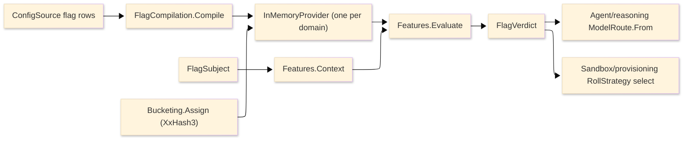

# [APPHOST_FEATURES_AND_TARGETING]

One feature-flag, progressive-rollout, and experimentation owner for the runtime spine: a frozen `FlagDefinition` row family compiles into one config-backed `OpenFeature` `InMemoryProvider`, a deterministic sticky-bucketing evaluator seats each subject in a stable rollout segment off `XxHash3` of subject-plus-flag, every evaluation projects to one canonical `FlagVerdict` the model-routing and fleet-roll consumers read, and the operator kill-switch collapses into one forced-off targeting row rather than a parallel switch. The page produces the `FlagVerdict` seam `Agent/reasoning#MODEL_GOVERNANCE` resolves a `ModelRoute` from and `Sandbox/provisioning#ROLLOVER_DRAIN` resolves a `RollStrategy` from — the features rail owns *which variant, for whom, at what exposure*, the consumers own *what the variant does* — and it owns the flag-definition axis, the targeting-rule and segment vocabulary, the config-backed provider registration, the sticky-bucketing evaluator, and the verdict projection. It consumes the eight-row `ConfigSource` chain on the one `ConfigurationManager` and the `Overlay`/`OperatorOverride`/`ReloadReceipt` reload transition from `Runtime/config#POLICY_VALUES`, `XxHash3.HashToUInt64` from `System.IO.Hashing`, `TenantContext.Slug` and `CorrelationId` from `Runtime/ports`, `ClockPolicy` and `ReceiptSinkPort` as settled vocabulary, and `DataClassification` for the targeting-attribute redaction seam, minting no eighth port. `OpenFeature` owns the evaluation contract, sticky-bucketing evaluator, and variant carrier; Thinktecture owns the vocabularies and LanguageExt the rails.

## [01]-[INDEX]

- [01]-[FLAG_DEFINITION]: Frozen flag-row family with targeting rules, segments, and variants compiled into one config-backed provider.
- [02]-[STICKY_BUCKETING]: Deterministic `XxHash3` subject-plus-flag bucketing seating each subject in a stable rollout segment.
- [03]-[VERDICT_PROJECTION]: One `FlagVerdict` projection over `FlagEvaluationDetails<Value>` the model-routing and fleet-roll consumers read.
- [04]-[KILL_SWITCH_FOLD]: The operator forced-off row collapsing `OperatorOverride` into one targeting row over the reload transition.

## [02]-[FLAG_DEFINITION]

- Owner: `FlagKey` `[ValueObject<string>]` the bucketing-stable flag identity under the `ComparerAccessors.StringOrdinal` accessor; `Variant` `[ValueObject<string>]` the assigned-arm identity; `RolloutSegment` the `[0,100)` percentage band a bucketed subject falls into; `TargetingRule` `[Union]` the closed match-predicate family discriminating a subject onto a variant; `FlagDefinition` the per-flag row carrying the ordered rules, the segment-to-variant map, the default variant, and the disabled flag; `FlagRegistry` the frozen flag-set the provider compiles from configuration.
- Cases: `TargetingRule` = `All` (unconditional match seating the rollout segments) | `TenantIn` (a `FrozenSet<string>` slug allow-list) | `AttributeEquals` (a targeting-attribute key-equals-value match) | `SegmentBand` (a `RolloutSegment` percentage gate) | `ForcedOff` (the kill-switch terminal) — each rule case carries the `Variant` it seats and breaks every rule-fold arm; rules evaluate in declared order and the first match wins, so a `ForcedOff` row placed first short-circuits every downstream rule.
- Entry: `Compile(FlagRegistry registry)` returns `IO<InMemoryProvider>` folding every `FlagDefinition` row into one `Dictionary<string, OpenFeature.Providers.Memory.Flag>` whose `Flag<Value>` carries the variant map and the `Func<EvaluationContext, string>` context evaluator the bucketing seats, then constructs the provider; `Register(FlagRegistry registry, string domain)` returns `IO<Unit>` registering the compiled provider through `Api.Instance.SetProviderAsync(domain, provider)` so awaiting it observes provider readiness.
- Auto: each `FlagDefinition` compiles to exactly one `Flag<Value>` — the variant map is the `IDictionary<string, Value>` keyed by `Variant`, the default variant is the row's `Default`, and the `Func<EvaluationContext, string>` evaluator is the `STICKY_BUCKETING` `Assign` closure folding the ordered `TargetingRule` rows over the `EvaluationContext` so the variant pick lives in the flag's own evaluator and never in calling code; the `disabled` flag maps from `FlagDefinition.Disabled` so a disabled flag resolves to the default variant with `Reason.Disabled`; the provider is the single `InMemoryProvider` per domain registered through `SetProviderAsync` whose `InitializeAsync` completes before the registration task so the features rail is ready-gated like every other boot owner; a flag-set reload re-folds the registry and replays `InMemoryProvider.UpdateFlagsAsync(flags)` over the same provider so a targeting-rule edit lands live on the next evaluation without a second provider, fanning one `ProviderEventTypes.ProviderConfigurationChanged` the verdict consumers observe.
- Receipt: a flag-set compile logs one `SpineLog` event in the 1000-1999 band carrying the flag count and the domain; a live `UpdateFlagsAsync` rides the same event stream carrying the changed-flag keys, never a parallel features receipt.
- Packages: OpenFeature, Thinktecture.Runtime.Extensions, LanguageExt.Core, BCL inbox
- Growth: one flag is one `FlagDefinition` row; one targeting predicate is one `TargetingRule` case breaking every rule-fold arm; a richer match shape is one rule case carrying its predicate data, never a second rule axis; a new variant is one entry on the row's variant map; zero new surface.
- Boundary: the registry is the only flag owner — a hand-rolled flag lookup, an ad-hoc percentage-rollout computation at a call site, and a string-keyed config read bypassing the provider are the deleted forms; the flag rows bind through the existing eight-source `ConfigSource` chain and `OptionsAdmission` so a targeting-rule edit is a config transition, not a parallel flag store beside the `ConfigurationManager`; the provider is config-backed and in-process — a remote flag SaaS would be one additional `FeatureProvider` row registered under a second domain later, never a replacement of this owner; the kill-switch is one `TargetingRule.ForcedOff` row, never a second switch beside the flag rows (the `KILL_SWITCH_FOLD` seats it); a targeting attribute carrying classified subject data redacts through the `Wire/companion#CONTROL_SERVICE` `Redactor` over `DataClassification` before it enters the `EvaluationContext`, never a second classification taxonomy.

```csharp signature
// --- [TYPES] ----------------------------------------------------------------------------

[ValueObject<string>(KeyMemberName = "Value")]
[KeyMemberEqualityComparer<ComparerAccessors.StringOrdinal, string>]
public readonly partial struct FlagKey;

[ValueObject<string>(KeyMemberName = "Value")]
[KeyMemberEqualityComparer<ComparerAccessors.StringOrdinal, string>]
public readonly partial struct Variant;

[ValueObject<int>(
    ComparisonOperators = OperatorsGeneration.DefaultWithKeyTypeOverloads,
    EqualityComparisonOperators = OperatorsGeneration.DefaultWithKeyTypeOverloads)]
public readonly partial struct RolloutSegment {
    static partial void ValidateFactoryArguments(ref ValidationError? error, ref int value) =>
        error = value is >= 0 and < 100 ? null : new ValidationError($"<segment-out-of-band:{value}>");
    public bool Holds(int bucket) => bucket < (int)this;
}

[Union(ConversionFromValue = ConversionOperatorsGeneration.None)]
public abstract partial record TargetingRule {
    private TargetingRule() { }
    public abstract Variant Seats { get; }

    public sealed record All(Variant Seats) : TargetingRule;
    public sealed record TenantIn(FrozenSet<string> Slugs, Variant Seats) : TargetingRule;
    public sealed record AttributeEquals(string Key, string Expected, Variant Seats) : TargetingRule;
    public sealed record SegmentBand(RolloutSegment Upper, Variant Seats) : TargetingRule;
    public sealed record ForcedOff(Variant Seats) : TargetingRule;
}

// --- [MODELS] ---------------------------------------------------------------------------
public sealed record FlagDefinition(
    FlagKey Key,
    Seq<TargetingRule> Rules,
    HashMap<Variant, Value> Variants,
    Variant Default,
    bool Disabled);

// --- [SERVICES] -------------------------------------------------------------------------
public sealed class FlagRegistry {
    readonly FrozenDictionary<FlagKey, FlagDefinition> byKey;
    public FlagRegistry(IEnumerable<FlagDefinition> flags) =>
        byKey = flags.ToFrozenDictionary(static f => f.Key);
    public Option<FlagDefinition> Resolve(FlagKey key) =>
        byKey.TryGetValue(key, out var flag) ? Optional(flag) : None;
    public Iterable<FlagDefinition> All => byKey.Values.AsIterable();
}

// --- [OPERATIONS] -----------------------------------------------------------------------
public static class FlagCompilation {
    public static IO<InMemoryProvider> Compile(FlagRegistry registry) =>
        IO.lift(() => new InMemoryProvider(registry.All.Fold(
            new Dictionary<string, OpenFeature.Providers.Memory.Flag>(StringComparer.Ordinal),
            static (map, flag) => {
                map[(string)flag.Key] = new Flag<Value>(
                    variants: flag.Variants.ToDictionary(static kv => (string)kv.Key, static kv => kv.Value),
                    defaultVariant: (string)flag.Default,
                    contextEvaluator: ctx => (string)Bucketing.Assign(flag, ctx),
                    flagMetadata: new ImmutableMetadata(new Dictionary<string, object> { ["disabled"] = flag.Disabled }));
                return map;
            })));

    public static IO<Unit> Register(FlagRegistry registry, string domain) =>
        Compile(registry).Bind(provider =>
            IO.liftAsync(async () => { await Api.Instance.SetProviderAsync(domain, provider); return unit; }));
}
```

## [03]-[STICKY_BUCKETING]

- Owner: `Bucketing` the static deterministic-assignment surface folding the ordered `TargetingRule` rows over an `EvaluationContext` to one `Variant`; the `BucketOf` `XxHash3`-derived `[0,100)` segment projection.
- Entry: `Assign(FlagDefinition flag, EvaluationContext context)` returns `Variant` — folds the flag's ordered rules and returns the first matching rule's seated variant, falling to the flag default when no rule matches; `BucketOf(FlagKey key, string subject)` returns `int` in `[0,100)` — the stable rollout bucket from `XxHash3.HashToUInt64` over the UTF-8 `subject` concatenated with the flag key, folded modulo 100.
- Auto: the bucket is cross-process-stable and re-derivable — `XxHash3.HashToUInt64` over `{subject}:{flagKey}` UTF-8 bytes folds to `[0,100)` so the same subject lands in the same bucket on every node and every restart, never the per-process-randomized `string.GetHashCode`, exactly the `SchedulePort.Spread` fleet-seed precedent; the `SegmentBand` rule reads `RolloutSegment.Holds(BucketOf(...))` so a `25`-segment band admits the lowest quartile of subjects and a rollout widens by raising the segment column, never by re-bucketing; the `TenantIn` rule reads the `EvaluationContext` `targetingKey`-adjacent tenant slug, the `AttributeEquals` rule reads a named targeting attribute, and `All` seats the rollout unconditionally so the segment bands gate exposure under it; the targeting key the bucket reads is the `EvaluationContext` targeting key the `VERDICT_PROJECTION` builds from the subject identity, so bucketing and evaluation read one subject.
- Receipt: bucketing mints no receipt — it is a pure deterministic fold inside the flag evaluator; the assigned `Variant` and the `Reason` ride the `VERDICT_PROJECTION` `FlagVerdict`, never a parallel bucketing trace.
- Packages: System.IO.Hashing, OpenFeature, Thinktecture.Runtime.Extensions, LanguageExt.Core, BCL inbox
- Growth: a new match predicate is one `TargetingRule` case the `Assign` fold gains an arm for; a finer bucket resolution is the modulo base on `BucketOf`, never a second hash; a multivariate split is additional `SegmentBand` rows partitioning the `[0,100)` line; zero new surface.
- Boundary: bucketing is the only rollout-assignment owner — a `Random`-seeded rollout, a `DateTime`-derived bucket, and a `string.GetHashCode` segment are the deleted forms because none is cross-process-stable; the hash is `XxHash3` matching the `SchedulePort.Spread` and `Agent/capability` fleet-spread seeds so the suite has one deterministic-spread hash, never two; the assignment is total over the rule fold and falls to the flag default on no match so an evaluation never throws for an unmatched subject; the bucket is computed once per evaluation inside the flag evaluator and never re-derived at the verdict seam.

```csharp signature
// --- [OPERATIONS] -----------------------------------------------------------------------
public static class Bucketing {
    public static int BucketOf(FlagKey key, string subject) =>
        (int)(XxHash3.HashToUInt64(Encoding.UTF8.GetBytes($"{subject}:{(string)key}")) % 100UL);

    public static Variant Assign(FlagDefinition flag, EvaluationContext context) =>
        flag.Disabled
            ? flag.Default
            : flag.Rules.Find(rule => Matches(flag, rule, context))
                .Map(static rule => rule.Seats)
                .IfNone(flag.Default);

    static bool Matches(FlagDefinition flag, TargetingRule rule, EvaluationContext context) => rule switch {
        TargetingRule.All => true,
        TargetingRule.ForcedOff => true,
        TargetingRule.TenantIn r => r.Slugs.Contains(Slug(context)),
        TargetingRule.AttributeEquals r => context.TryGetValue(r.Key, out var value) && value.AsString == r.Expected,
        TargetingRule.SegmentBand r => r.Upper.Holds(BucketOf(flag.Key, context.TargetingKey ?? Slug(context))),
        _ => false,
    };

    static string Slug(EvaluationContext context) =>
        context.TryGetValue("tenant", out var value) && value.AsString is { } slug ? slug : TenantContext.Root.Slug;
}
```

## [04]-[VERDICT_PROJECTION]

- Owner: `FlagVerdict` the canonical evaluation-outcome carrier the cross-page consumers read; `FeatureFault` `[Union]` the closed evaluation-fault family in the 4700 band; `Features` the static evaluation surface over the one resolved `IFeatureClient`; the `EvaluationContext` builder fold over a subject and its targeting attributes.
- Cases: `FeatureFault` = `Text` | `ProviderNotReady` | `FlagAbsent` | `TypeMismatch` | `ContextInvalid` — one case per `OpenFeature` `ErrorType` cause that crosses into domain logic, each breaking every consumer arm.
- Entry: `Evaluate(IFeatureClient client, FlagKey key, FlagSubject subject)` returns `IO<FlagVerdict>` — builds the `EvaluationContext` from the subject through `EvaluationContext.Builder().SetTargetingKey(...).Set(...)`, runs `client.GetObjectDetailsAsync((string)key, Value.Null, context)` returning `FlagEvaluationDetails<Value>`, and projects the detail's `Variant`, `Reason`, `ErrorType`, and resolved value onto one `FlagVerdict`; `Context(FlagSubject subject)` returns `EvaluationContext` — the one builder fold every evaluation shares so subject identity, tenant slug, and targeting attributes enter the provider through one shape.
- Auto: the verdict is the single shape the consumers read — `Agent/reasoning#MODEL_GOVERNANCE` `ModelRoute.From(FlagVerdict)` maps `Variant` to a model route and `Sandbox/provisioning#ROLLOVER_DRAIN` maps `Variant` to a `RollStrategy` row, both reading the same `(FlagKey Key, Variant Variant, bool Enabled, string Reason)` projection so neither re-runs the evaluator nor re-derives the bucket; the evaluation reads `FlagEvaluationDetails<T>` carrying `Value`, `FlagKey`, `Reason`, `Variant`, `ErrorType`, and `ErrorMessage` so a provider failure lands on `ErrorType` plus `Reason.Error` and never throws across the client boundary — the `Classify` fold lifts a non-`None` `ErrorType` to the typed `FeatureFault`, and a clean evaluation projects the `Variant`/`Reason` onto an `Enabled = ErrorType.None && Reason != Reason.Disabled` verdict; the `Reason` vocabulary (`TargetingMatch`, `Split`, `Disabled`, `Default`, `Static`, `Cached`, `Error`) rides the verdict verbatim so a consumer distinguishes a targeting match from a default fallthrough without re-evaluating; the targeting context is built once per evaluation through the `Context` fold and the ambient global `EvaluationContext` stays for cross-cutting attributes only; an absent features rail seats no provider so the consumers fall to their policy defaults (`ModelRoute.Default`, the policy `RollStrategy`) and the routing arms are inert, never a hard-coded model or an unguarded rollout.
- Receipt: a non-`None` `ErrorType` logs the fault code in the 4700 band through `ReceiptSinkPort.Send`; an experimentation exposure rides `IFeatureClient.Track(name, context, details)` so an A/B exposure event emits through the OpenFeature tracking surface, never a parallel experimentation instrument; the verdict carries the `CorrelationId` the consuming command threads so a routed model draw and a rolled fleet wave correlate to the verdict that selected them.
- Packages: OpenFeature, Thinktecture.Runtime.Extensions, LanguageExt.Core, NodaTime, BCL inbox
- Growth: a new evaluation-fault cause is one `FeatureFault` case; a new consumer reads the existing `FlagVerdict` shape and maps `Variant` to its own row family, never a second verdict; a richer targeting attribute is one `Set` call on the `Context` fold; zero new surface.
- Boundary: the verdict is the only cross-page features seam — a consumer reaching the `IFeatureClient` directly, a second verdict shape, and a re-derived bucket at a consumer are the deleted forms; the projection reads `FlagEvaluationDetails<Value>` and never the raw `FeatureProviderException` so a provider fault is a typed `FeatureFault` at the boundary and never an exception in domain logic; the verdict is read-only evidence — the consumers map `Variant` to their own row families (`ModelRoute`, `RollStrategy`) and the features rail never owns the consumer's behavior, exactly the one-direction seam the consumer cards declare; the `Enabled` flag is derived from `ErrorType.None && Reason != Reason.Disabled` so a disabled flag and a provider error both read `Enabled = false` at the consumer without the consumer inspecting the `ErrorType`.

```csharp signature
// --- [MODELS] ---------------------------------------------------------------------------
public sealed record FlagSubject(string Identity, TenantContext Tenant, HashMap<string, string> Attributes, CorrelationId Correlation);

public readonly record struct FlagVerdict(FlagKey Key, Variant Variant, bool Enabled, string Reason) {
    public static readonly FlagVerdict Inert = new(FlagKey.Create("inert"), Variant.Create("default"), Enabled: false, Reason.Default);
}

// --- [ERRORS] ---------------------------------------------------------------------------
[Union]
public abstract partial record FeatureFault : Expected, IValidationError<FeatureFault> {
    private FeatureFault(string detail, int code) : base(detail, code, None) { }
    public static FeatureFault Create(string message) => new Text(message);
    public sealed record Text : FeatureFault { public Text(string detail) : base(detail, 4700) { } }
    public sealed record ProviderNotReady : FeatureFault { public ProviderNotReady(string detail) : base(detail, 4701) { } }
    public sealed record FlagAbsent : FeatureFault { public FlagAbsent(string flag) : base(flag, 4702) { } }
    public sealed record TypeMismatch : FeatureFault { public TypeMismatch(string detail) : base(detail, 4703) { } }
    public sealed record ContextInvalid : FeatureFault { public ContextInvalid(string detail) : base(detail, 4704) { } }
}

// --- [OPERATIONS] -----------------------------------------------------------------------
public static class Features {
    public static EvaluationContext Context(FlagSubject subject) =>
        subject.Attributes.Fold(
            EvaluationContext.Builder().SetTargetingKey(subject.Identity).Set("tenant", subject.Tenant.Slug),
            static (builder, attr) => builder.Set(attr.Key, attr.Value)).Build();

    public static IO<FlagVerdict> Evaluate(IFeatureClient client, FlagKey key, FlagSubject subject) =>
        IO.liftAsync(async () => await client.GetObjectDetailsAsync((string)key, new Value(), Context(subject)))
            .Map(detail => new FlagVerdict(
                key,
                Variant.Create(detail.Variant ?? "default"),
                Enabled: detail.ErrorType == ErrorType.None && detail.Reason != Reason.Disabled,
                detail.Reason ?? Reason.Unknown));

    public static FeatureFault Classify(ErrorType error, string? message) => error switch {
        ErrorType.ProviderNotReady => new FeatureFault.ProviderNotReady(message ?? nameof(ErrorType.ProviderNotReady)),
        ErrorType.FlagNotFound => new FeatureFault.FlagAbsent(message ?? nameof(ErrorType.FlagNotFound)),
        ErrorType.TypeMismatch => new FeatureFault.TypeMismatch(message ?? nameof(ErrorType.TypeMismatch)),
        ErrorType.InvalidContext or ErrorType.TargetingKeyMissing => new FeatureFault.ContextInvalid(message ?? nameof(ErrorType.InvalidContext)),
        _ => new FeatureFault.Text(message ?? nameof(ErrorType.General)),
    };
}
```

## [05]-[KILL_SWITCH_FOLD]

- Owner: `KillSwitchFold` the static surface projecting the `Runtime/config#POLICY_VALUES` `OperatorOverride` onto one `TargetingRule.ForcedOff` row prepended to a flag's rule sequence; the forced-off `Variant` the override seats.
- Entry: `Fold(FlagDefinition flag, OperatorOverride override)` returns `FlagDefinition` — when the override forces the flag off, returns the flag with a `ForcedOff` rule prepended so the first-match-wins fold short-circuits to the safe variant; otherwise returns the flag unchanged.
- Auto: the operator kill-switch is one targeting row, not a parallel switch — the `OperatorOverride.From(KillSwitchConfig, Instant)` the config page mints is read here and projected to a `ForcedOff` rule at the head of the flag's ordered rules so a forced-off flag resolves to its safe variant with `Reason.Disabled` regardless of any downstream targeting or segment match; the override arrives through the existing `ReloadClass.Transition` reload so flipping the kill-switch is one config transition the `FlagCompilation.Register` re-fold lands live through `InMemoryProvider.UpdateFlagsAsync`, never a separate switch store; because the fold prepends rather than mutates the variant map, lifting the override re-exposes the flag's normal targeting on the next reload without a definition edit.
- Receipt: the kill-switch flip rides the `ReloadReceipt` the config page mints carrying the `PatchTrigger`/`OperatorOverride` transition, never a parallel kill-switch receipt; the forced-off evaluation rides the normal `FlagVerdict` carrying `Reason.Disabled`.
- Packages: Thinktecture.Runtime.Extensions, LanguageExt.Core, BCL inbox
- Growth: a per-flag forced-off is one `OperatorOverride` row the fold reads; a forced-*on* variant is the symmetric prepended `All` rule seating the target variant; zero new surface.
- Boundary: the kill-switch is the only forced-exposure owner — a boolean kill flag beside the flag rows, a separate emergency-disable store, and a runtime mutation of the variant map are the deleted forms; the override is the one `OperatorOverride` union the config page owns so the host has one operator-forcing vocabulary covering the degradation-level forcing and the flag forcing, never two; the fold prepends a rule and never deletes the flag's targeting so the kill-switch is reversible by one reload, and a forced-off flag still mints a `FlagVerdict` so the consumers route to their safe defaults through the same seam, never a special-cased disable path.

```csharp signature
// --- [OPERATIONS] -----------------------------------------------------------------------
public static class KillSwitchFold {
    public static FlagDefinition Fold(FlagDefinition flag, OperatorOverride @override) =>
        @override.ForcesOff(flag.Key)
            ? flag with { Rules = new TargetingRule.ForcedOff(flag.Default).Cons(flag.Rules) }
            : flag;
}
```



## [06]-[TS_PROJECTION]

- Owner: `FlagVerdictWire` transcribes the evaluation outcome the dashboard ingests for the same OpenFeature evaluation contract the edge client reads; the flag definitions never cross the wire.
- Packages: BCL inbox
- Growth: one field on the verdict, zero new surface.
- Boundary: only the `FlagVerdict` projection crosses — flag key, assigned variant, enabled flag, and reason — mirroring `FlagVerdict`; the targeting rules, the segment bands, and the subject attributes stay host-side so a targeting predicate never leaves the host; the reason crosses as the OpenFeature `Reason` string so the edge client reads the same evaluation vocabulary; the TS/edge leg runs its own OpenFeature client over the same evaluation contract (`libs/.planning` `[ONE_FEATURE_FLAG_PROJECTION]`), consuming this verdict shape, never a second contract.

```ts contract
interface FlagVerdictWire {
  readonly key: string;
  readonly variant: string;
  readonly enabled: boolean;
  readonly reason: string;
}
```

## [07]-[RESEARCH]

- [FLAG_CONFIG_SCHEMA]: the `FlagDefinition` rows bind from the `ConfigSource` chain under one `Flags` section root — the targeting-rule ordering, the segment-band partition of the `[0,100)` line, and the variant-map value shapes settle against the config-section schema the `OptionsAdmission` binder admits; a `ForcedOff` rule prepended by the `KILL_SWITCH_FOLD` is the operator override, never a config-authored kill row.
- [TRACKING_SINK]: the `IFeatureClient.Track(name, context, details)` experimentation-exposure leg emits an A/B exposure event the experimentation analysis reads — the tracking-event sink (an OTel event versus the receipt stream) settles against the `Observability/telemetry` event surface before the exposure leg finalizes; the verdict carries the `CorrelationId` so an exposure correlates to the model draw or fleet wave the variant selected.
- [PROVIDER_DOMAIN]: the `SetProviderAsync(domain, provider)` domain-scoping carries one `InMemoryProvider` per evaluation domain — the model-routing domain and the fleet-roll domain may share one provider or split by domain key, settling against whether the routing and rollout flag sets share a registry; a remote flag-management provider is one additional `FeatureProvider` row under a second domain later, never a replacement of the config-backed provider.
