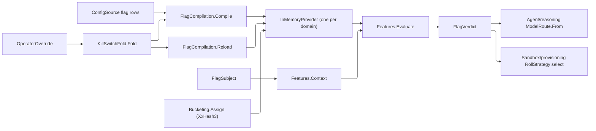

# [APPHOST_FEATURES_AND_TARGETING]

One feature-flag, progressive-rollout, and experimentation owner for the runtime spine: a frozen `FlagDefinition` row family compiles into one config-backed `OpenFeature` `InMemoryProvider`, a deterministic sticky-bucketing evaluator seats each subject in a stable rollout segment off `XxHash3` of subject-plus-flag, every evaluation projects to one canonical `FlagVerdict` the model-routing and fleet-roll consumers read, and the operator kill-switch collapses onto the flag row's provider-native disabled gate rather than a parallel switch. The page produces the `FlagVerdict` seam `Agent/reasoning#MODEL_GOVERNANCE` resolves a `ModelRoute` from and `Sandbox/provisioning#ROLLOVER_DRAIN` resolves a `RollStrategy` from — the features rail owns *which variant, for whom, at what exposure*, the consumers own *what the variant does* — and it owns the flag-definition axis, the targeting-rule and segment vocabulary, the config-backed provider registration, the sticky-bucketing evaluator, and the verdict projection. It consumes the eight-row `ConfigSource` chain on the one `ConfigurationManager` and the `Overlay`/`OperatorOverride`/`ReloadReceipt` reload transition from `Runtime/config#POLICY_VALUES`, `XxHash3.HashToUInt64` from `System.IO.Hashing`, `TenantContext.Slug` and `CorrelationId` from `Runtime/ports`, `ClockPolicy` and `ReceiptSinkPort` as settled vocabulary, and `DataClassification` for the targeting-attribute redaction seam, minting no eighth port. `OpenFeature` owns the evaluation contract, sticky-bucketing evaluator, and variant carrier; Thinktecture owns the vocabularies and LanguageExt the rails.

## [01]-[INDEX]

- [02]-[FLAG_DEFINITION]: Frozen flag-row family with targeting rules, segments, and variants compiled into one config-backed provider.
- [03]-[STICKY_BUCKETING]: Deterministic `XxHash3` subject-plus-flag bucketing seating each subject in a stable rollout segment.
- [04]-[VERDICT_PROJECTION]: One `FlagVerdict` projection over `FlagEvaluationDetails<Value>` the model-routing and fleet-roll consumers read, and the one registered `SpineHook` every evaluation crosses carrying the fault lift and the exposure emit.
- [05]-[KILL_SWITCH_FOLD]: The operator kill-switch collapsing `OperatorOverride` onto the flag row's `Disabled` column over the reload transition.
- [06]-[TS_PROJECTION]: The `FlagVerdictWire` carrier the edge client decodes over the same OpenFeature evaluation contract.

## [02]-[FLAG_DEFINITION]

- Owner: `FlagKey` `[ValueObject<string>]` the bucketing-stable flag identity under the `ComparerAccessors.StringOrdinal` accessor; `Variant` `[ValueObject<string>]` the assigned-arm identity; `RolloutSegment` the `[0,100)` exposure band answering both the per-subject bucket predicate and the per-fleet cohort width; `TargetingRule` `[Union]` the closed match-predicate family discriminating a subject onto a variant; `FlagDefinition` the per-flag row carrying the ordered rules, the segment-to-variant map, the default variant, and the disabled flag; `FlagRegistry` the frozen flag-set the provider compiles from configuration.
- Cases: `TargetingRule` = `All` (unconditional match seating the rollout segments) | `TenantIn` (a `FrozenSet<string>` slug allow-list) | `AttributeEquals` (a targeting-attribute key-equals-value match) | `SegmentBand` (a `RolloutSegment` percentage gate) — each rule case carries the `Variant` it seats and breaks every rule-fold arm; rules evaluate in declared order and the first match wins.
- Entry: `Compile(FlagRegistry registry, OperatorOverride forcing)` returns `IO<Fin<InMemoryProvider>>` — proves every forced-off key resolves a definition, folds each `FlagDefinition` through `KillSwitchFold.Fold` against the live override, then folds the forced rows into one `Dictionary<string, OpenFeature.Providers.Memory.Flag>` whose `Flag<Value>` carries the variant map and the `Func<EvaluationContext, string>` context evaluator the bucketing seats, and constructs the provider; `Register(FeaturesRuntime runtime, FlagRegistry registry, OperatorOverride forcing, string domain)` returns `IO<Fin<InMemoryProvider>>` seating the `SpineHook` through `Api.Instance.AddHooks`, the cross-cutting ambient context through `Api.Instance.SetContext`, the three `Api.Instance.AddHandler(ProviderEventTypes, EventHandlerDelegate)` observations, and the compiled provider through `Api.Instance.SetProviderAsync(domain, provider)` so awaiting it observes provider readiness, RETURNING the provider handle the reload leg needs; `Reload(InMemoryProvider provider, FlagRegistry registry, OperatorOverride forcing)` returns `IO<Fin<Unit>>` — re-folds the registry under the new override and replays `InMemoryProvider.UpdateFlagsAsync(flags)` over the same provider.
- Auto: each `FlagDefinition` compiles to exactly one `Flag<Value>` — the variant map is the `IDictionary<string, Value>` keyed by `Variant`, the default variant is the row's `Default`, and the `Func<EvaluationContext, string>` evaluator is the `STICKY_BUCKETING` `Assign` closure folding the ordered `TargetingRule` rows over the `EvaluationContext` so the variant pick lives in the flag's own evaluator and never in calling code; the `disabled` flag maps from `FlagDefinition.Disabled` onto the `Flag<T>` `disabled:` constructor parameter AFTER the `KILL_SWITCH_FOLD` has flipped it against the live override, so the operator force reaches the provider's own disabled branch — a compile over the raw registry leaves the fold with no caller and the switch unreachable at the one seat that could honor it; the forced-key proof runs first because `OperatorOverride.ForceFlagsOff` carries free text a config edit typed, and a key naming no definition would force nothing while reading as armed; the provider is the single `InMemoryProvider` per domain registered through `SetProviderAsync` whose `InitializeAsync` completes before the registration task so the features rail is ready-gated like every other boot owner; a flag-set or override reload re-folds the registry and replays `InMemoryProvider.UpdateFlagsAsync(flags)` over the handle `Register` returned, so a targeting-rule edit or a kill-switch flip lands live on the next evaluation without a second provider, fanning one `ProviderEventTypes.ProviderConfigurationChanged` whose registered handler reads `ProviderEventPayload.FlagsChanged` onto the `SpineLog.FlagsChanged` stride — the fan is an observation because a handler is registered for it, and the `ProviderReady`/`ProviderError` handlers beside it seat the boot-readiness event and the `FeatureFault.ProviderNotReady` case the payload's own `ErrorType` classifies.
- Receipt: a flag-set compile logs one `SpineLog` event in the 1000-1099 EVENT stride (`FaultBand.SpineEvents`) carrying the flag count and the domain; a live `UpdateFlagsAsync` rides the same event stream carrying the changed-flag keys, never a parallel features receipt.
- Packages: OpenFeature, Thinktecture.Runtime.Extensions, LanguageExt.Core, BCL inbox
- Growth: one flag is one `FlagDefinition` row; one targeting predicate is one `TargetingRule` case breaking every rule-fold arm; a richer match shape is one rule case carrying its predicate data, never a second rule axis; a new variant is one entry on the row's variant map; zero new surface.
- Boundary: the registry is the only flag owner — a hand-rolled flag lookup, an ad-hoc percentage-rollout computation at a call site, and a string-keyed config read bypassing the provider are the deleted forms; `RolloutSegment` is the suite's ONE exposure-percentage owner and carries both of its projections, so `Sandbox/provisioning#ROLLOVER_DRAIN` plans a wave through `Cohort(nodes.Count)` off the band its `RollStrategy` row already holds — a `Width` column re-deriving a wave percentage beside the segment was the deleted twin, and a consumer computing `population * percent / 100` at its own site is the same defect wearing arithmetic; the flag rows bind through the existing eight-source `ConfigSource` chain and `OptionsAdmission` under one `Flags` section root so a targeting-rule edit is a config transition, not a parallel flag store beside the `ConfigurationManager`; the provider is config-backed and in-process — a remote flag SaaS would be one additional `FeatureProvider` row registered under a second domain later, never a replacement of this owner; the kill-switch is the flag row's `Disabled` column the `KILL_SWITCH_FOLD` flips, never a second switch beside the flag rows; a targeting attribute carrying classified subject data redacts through the `Wire/companion#CONTROL_SERVICE` `Redactor` over `DataClassification` before it enters the `EvaluationContext`, never a second classification taxonomy.

```csharp signature
// --- [TYPES] ----------------------------------------------------------------------------

[ValueObject<string>(KeyMemberName = "Value")]
[KeyMemberEqualityComparer<ComparerAccessors.StringOrdinal, string>]
public readonly partial struct FlagKey;

[ValueObject<string>(KeyMemberName = "Value")]
[KeyMemberEqualityComparer<ComparerAccessors.StringOrdinal, string>]
public readonly partial struct Variant;

[ValueObject<int>(
    ComparisonOperators = OperatorsGeneration.DefaultWithKeyTypeOverloads,
    EqualityComparisonOperators = OperatorsGeneration.DefaultWithKeyTypeOverloads)]
public readonly partial struct RolloutSegment {
    static partial void ValidateFactoryArguments(ref ValidationError? error, ref int value) =>
        error = value is >= 0 and < 100 ? null : new ValidationError($"<segment-out-of-band:{value}>");

    public bool Holds(int bucket) => bucket < (int)this;

    // The band's POPULATION projection beside its bucket predicate: one exposure percentage answers both "is
    // this subject inside the wave" and "how many of a fleet does the wave move", so a rollout consumer reads
    // the segment it was handed and never re-derives a percentage at its own call site. Integer division
    // rounds toward zero, so a nonzero band over a small fleet floors to ONE node — a wave that moves nobody
    // never converges — while a zero band moves nobody by construction.
    public int Cohort(int population) =>
        (int)this is 0 || population <= 0 ? 0 : int.Max(1, population * (int)this / 100);
}

[Union(ConversionFromValue = ConversionOperatorsGeneration.None)]
public abstract partial record TargetingRule {
    private TargetingRule() { }
    public abstract Variant Seats { get; }

    public sealed record All(Variant Seats) : TargetingRule;
    public sealed record TenantIn(FrozenSet<string> Slugs, Variant Seats) : TargetingRule;
    public sealed record AttributeEquals(string Key, string Expected, Variant Seats) : TargetingRule;
    public sealed record SegmentBand(RolloutSegment Upper, Variant Seats) : TargetingRule;
}

// --- [MODELS] ---------------------------------------------------------------------------
public sealed record FlagDefinition(
    FlagKey Key,
    Seq<TargetingRule> Rules,
    HashMap<Variant, Value> Variants,
    Variant Default,
    bool Disabled);

// --- [SERVICES] -------------------------------------------------------------------------
public sealed class FlagRegistry {
    readonly FrozenDictionary<FlagKey, FlagDefinition> byKey;
    public FlagRegistry(IEnumerable<FlagDefinition> flags) =>
        byKey = flags.ToFrozenDictionary(static f => f.Key);
    public Option<FlagDefinition> Resolve(FlagKey key) =>
        byKey.TryGetValue(key, out var flag) ? Optional(flag) : None;
    public Iterable<FlagDefinition> All => byKey.Values.AsIterable();
}

// --- [OPERATIONS] -----------------------------------------------------------------------
public static class FlagCompilation {
    // The override enters the COMPILE, so the operator force reaches the provider's own disabled branch and
    // the kill-switch fold has exactly one caller. Compiling the raw registry is the deleted form that left
    // the fold unreachable and the switch inert at the only seat capable of honoring it.
    public static IO<Fin<InMemoryProvider>> Compile(FlagRegistry registry, OperatorOverride forcing) =>
        IO.lift(() => Forced(registry, forcing).Map(flags => new InMemoryProvider(flags)));

    // A forced key naming no definition forces nothing while reading as armed, so the free text a config edit
    // typed proves against the registry FIRST — the one consumer of the registry's single-flag lookup, and the
    // reason that lookup exists beside the whole-set enumeration.
    static Fin<Dictionary<string, OpenFeature.Providers.Memory.Flag>> Forced(FlagRegistry registry, OperatorOverride forcing) =>
        forcing.Switch(
                state: registry,
                forceLevel: static (_, _) => Validation<Error, Unit>.Success(unit),
                forceFlagsOff: static (held, row) => toSeq(row.Flags)
                    .Traverse(key => held.Resolve(FlagKey.Create(key))
                        .ToValidation<Error, FlagDefinition>(new Fault.InvalidValue(Label: key, Requirement: "<a declared flag row>")))
                    .As()
                    .Map(static _ => unit),
                release: static (_, _) => Validation<Error, Unit>.Success(unit))
            .ToFin()
            .Map(_ => registry.All.Fold(
                new Dictionary<string, OpenFeature.Providers.Memory.Flag>(StringComparer.Ordinal),
                (map, declared) => Seated(map, KillSwitchFold.Fold(declared, forcing))));

    static Dictionary<string, OpenFeature.Providers.Memory.Flag> Seated(
        Dictionary<string, OpenFeature.Providers.Memory.Flag> map, FlagDefinition flag) =>
        (map[(string)flag.Key] = new Flag<Value>(
            variants: flag.Variants.ToDictionary(static kv => (string)kv.Key, static kv => kv.Value),
            defaultVariant: (string)flag.Default,
            contextEvaluator: ctx => (string)Bucketing.Assign(flag, ctx),
            disabled: flag.Disabled), map).Item2;

    // Registration seats FOUR things at once and each is the only place its concern can live: the compiled
    // provider under its domain, the cross-cutting SpineHook (the one surface every evaluation crosses,
    // including a consumer reaching IFeatureClient directly, which Features.Evaluate structurally cannot see),
    // the ambient EvaluationContext carrying the cross-cutting attributes so the tenant slug and host key are
    // stated ONCE rather than re-set on every FlagSubject, and the provider event handlers that make the
    // configuration-changed fan a real observation rather than a claimed one. It RETURNS the provider, because
    // a reload with no handle is a re-fold with nowhere to land.
    public static IO<Fin<InMemoryProvider>> Register(FeaturesRuntime runtime, FlagRegistry registry, OperatorOverride forcing, string domain) =>
        Compile(registry, forcing).Bind(compiled => compiled.Match(
            Succ: provider => IO.liftAsync(async () => {
                Api.Instance.AddHooks(new SpineHook(runtime));
                Api.Instance.SetContext(EvaluationContext.Builder()
                    .Set("tenant", TenantContext.Current.Slug)
                    .Set("host", runtime.HostKey)
                    .Build());
                Api.Instance.AddHandler(ProviderEventTypes.ProviderConfigurationChanged, payload =>
                    SpineLog.FlagsChanged(runtime.Logger, domain, string.Join(',', payload.FlagsChanged ?? [])));
                Api.Instance.AddHandler(ProviderEventTypes.ProviderReady, payload =>
                    SpineLog.ProviderReady(runtime.Logger, payload.ProviderName ?? domain));
                Api.Instance.AddHandler(ProviderEventTypes.ProviderError, payload =>
                    ignore(runtime.Fault(Features.Classify(payload.ErrorType ?? ErrorType.ProviderNotReady, payload.Message))));
                await Api.Instance.SetProviderAsync(domain, provider);
                return Fin.Succ(provider);
            }),
            Fail: error => IO.pure(Fin.Fail<InMemoryProvider>(error))));

    // The reload leg: one re-fold onto the SAME provider, so a targeting edit and a kill-switch flip are one
    // transition and neither mints a second provider a consumer could resolve past the live one.
    public static IO<Fin<Unit>> Reload(InMemoryProvider provider, FlagRegistry registry, OperatorOverride forcing) =>
        IO.lift(() => Forced(registry, forcing)).Bind(flags => flags.Match(
            Succ: compiled => IO.liftAsync(async () => {
                await provider.UpdateFlagsAsync(compiled);
                return Fin.Succ(unit);
            }),
            Fail: error => IO.pure(Fin.Fail<Unit>(error))));
}
```

## [03]-[STICKY_BUCKETING]

- Owner: `Bucketing` the static deterministic-assignment surface folding the ordered `TargetingRule` rows over an `EvaluationContext` to one `Variant`; the `BucketOf` `XxHash3`-derived `[0,100)` segment projection.
- Entry: `Assign(FlagDefinition flag, EvaluationContext context)` returns `Variant` — folds the flag's ordered rules and returns the first matching rule's seated variant, falling to the flag default when no rule matches; `BucketOf(FlagKey key, string subject)` returns `int` in `[0,100)` — the stable rollout bucket from `XxHash3.HashToUInt64` over the UTF-8 `subject` concatenated with the flag key, folded modulo 100.
- Auto: the bucket is cross-process-stable and re-derivable — `XxHash3.HashToUInt64` over `{subject}:{flagKey}` UTF-8 bytes folds to `[0,100)` so the same subject lands in the same bucket on every node and every restart, never the per-process-randomized `string.GetHashCode`, exactly the `SchedulePort.Spread` fleet-seed precedent; the `SegmentBand` rule reads `RolloutSegment.Holds(BucketOf(...))` so a `25`-segment band admits the lowest quartile of subjects and a rollout widens by raising the segment column, never by re-bucketing; the `TenantIn` rule reads the `EvaluationContext` `targetingKey`-adjacent tenant slug, the `AttributeEquals` rule reads a named targeting attribute, and `All` seats the rollout unconditionally so the segment bands gate exposure under it; the targeting key the bucket reads is the `EvaluationContext` targeting key the `VERDICT_PROJECTION` builds from the subject identity, so bucketing and evaluation read one subject.
- Receipt: bucketing mints no receipt — it is a pure deterministic fold inside the flag evaluator; the assigned `Variant` and the `Reason` ride the `VERDICT_PROJECTION` `FlagVerdict`, never a parallel bucketing trace.
- Packages: System.IO.Hashing, OpenFeature, Thinktecture.Runtime.Extensions, LanguageExt.Core, BCL inbox
- Growth: a new match predicate is one `TargetingRule` case the `Assign` fold gains an arm for; a finer bucket resolution is the modulo base on `BucketOf`, never a second hash; a multivariate split is additional `SegmentBand` rows partitioning the `[0,100)` line; zero new surface.
- Boundary: bucketing is the only rollout-assignment owner — a `Random`-seeded rollout, a `DateTime`-derived bucket, and a `string.GetHashCode` segment are the deleted forms because none is cross-process-stable; the hash is `XxHash3` matching the `SchedulePort.Spread` and `Agent/capability` fleet-spread seeds so the suite has one deterministic-spread hash, never two; the assignment is total over the rule fold and falls to the flag default on no match so an evaluation never throws for an unmatched subject; the bucket is computed once per evaluation inside the flag evaluator and never re-derived at the verdict seam.

```csharp signature
// --- [OPERATIONS] -----------------------------------------------------------------------
public static class Bucketing {
    public static int BucketOf(FlagKey key, string subject) =>
        (int)(XxHash3.HashToUInt64(Encoding.UTF8.GetBytes($"{subject}:{(string)key}")) % 100UL);

    public static Variant Assign(FlagDefinition flag, EvaluationContext context) =>
        flag.Disabled
            ? flag.Default
            : flag.Rules.Find(rule => Matches(flag, rule, context))
                .Map(static rule => rule.Seats)
                .IfNone(flag.Default);

    static bool Matches(FlagDefinition flag, TargetingRule rule, EvaluationContext context) => rule switch {
        TargetingRule.All => true,
        TargetingRule.TenantIn r => r.Slugs.Contains(Slug(context)),
        TargetingRule.AttributeEquals r => context.TryGetValue(r.Key, out var value) && value.AsString == r.Expected,
        TargetingRule.SegmentBand r => r.Upper.Holds(BucketOf(flag.Key, context.TargetingKey ?? Slug(context))),
        _ => false,
    };

    static string Slug(EvaluationContext context) =>
        context.TryGetValue("tenant", out var value) && value.AsString is { } slug ? slug : TenantContext.Root.Slug;
}
```

## [04]-[VERDICT_PROJECTION]

- Owner: `FlagVerdict` the canonical evaluation-outcome carrier the cross-page consumers read; `FlagVerdictWire` its host-free projection registered on the `Runtime/ports#WIRE_LAW` roster, named against the decode seam and lowering the reason through its own frozen row table; `FeatureFault` `[Union]` the closed evaluation-fault family deriving its codes through `FaultBand.Feature`; `Features` the static evaluation surface over the one resolved `IFeatureClient`; `SpineHook` the one registered `Hook` every evaluation crosses, carrying the fault lift and the experimentation exposure; `FeaturesRuntime` the composition record the hook and the provider-event handlers read; the `EvaluationContext` builder fold over a subject and its targeting attributes.
- Cases: `FeatureFault` = `Text` | `ProviderNotReady` | `FlagAbsent` | `TypeMismatch` | `ContextInvalid` — one case per `OpenFeature` `ErrorType` cause that crosses into domain logic, each breaking every consumer arm.
- Entry: `Evaluate(IFeatureClient client, FlagKey key, FlagSubject subject)` returns `IO<FlagVerdict>` — builds the `EvaluationContext` from the subject through `EvaluationContext.Builder().SetTargetingKey(...).Set(...)`, runs `client.GetObjectDetailsAsync((string)key, new Value(), context)` returning `FlagEvaluationDetails<Value>`, and projects the detail's `Variant`, `Reason`, `ErrorType`, and resolved value onto one `FlagVerdict`, yielding `FlagVerdict.Inert` when the provider reports itself unready so an absent rail resolves the one declared fallback rather than a variant no definition seated; `Context(FlagSubject subject)` returns `EvaluationContext` — the one builder fold every evaluation shares so subject identity, tenant slug, and targeting attributes enter the provider through one shape.
- Auto: the verdict is the single shape the consumers read — `Agent/reasoning#MODEL_GOVERNANCE` `ModelRoute.From(FlagVerdict)` maps `Variant` to a model route and `Sandbox/provisioning#ROLLOVER_DRAIN` maps `Variant` to a `RollStrategy` row, both reading the same `(FlagKey Key, Variant Variant, bool Enabled, string Reason)` projection so neither re-runs the evaluator nor re-derives the bucket; the evaluation reads `FlagEvaluationDetails<T>` carrying `Value`, `FlagKey`, `Reason`, `Variant`, `ErrorType`, and `ErrorMessage` so a provider failure lands on `ErrorType` plus `Reason.Error` and never throws across the client boundary — the `Classify` fold lifts a non-`None` `ErrorType` to the typed `FeatureFault`, and a clean evaluation projects the `Variant`/`Reason` onto an `Enabled = ErrorType.None && Reason != Reason.Disabled` verdict; the `Reason` vocabulary (`TargetingMatch`, `Split`, `Disabled`, `Default`, `Static`, `Cached`, `Error`) rides the verdict verbatim so a consumer distinguishes a targeting match from a default fallthrough without re-evaluating; the targeting context is built once per evaluation through the `Context` fold and the ambient global `EvaluationContext` carries the cross-cutting attributes — the tenant slug and the host key seated ONCE at `Register` through `Api.Instance.SetContext`, never re-set on every `FlagSubject`; an absent features rail seats no provider, so the composition binds `FlagVerdict.Inert` as the whole verdict function and an unready provider re-keys the same value at `Evaluate` — one shape for both absences, so the consumers fall to their policy defaults (`ModelRoute.Default`, the policy `RollStrategy`) off a real verdict rather than a per-consumer fallback, and never a hard-coded model or an unguarded rollout.
- Receipt: `SpineHook.AfterAsync` is the ONE site both evidence legs fire from — a non-`None` `ErrorType` lifts through `Features.Classify` onto `ReceiptSinkPort.Send` in the registry band `FaultBand.Feature`, and the exposure rides `IFeatureClient.Track(name, context, details)` carrying the assigned variant and reason as `TrackingEventDetails`, so an A/B exposure emits through the OpenFeature tracking surface and never a parallel experimentation instrument; `SpineHook.ErrorAsync` catches the provider-thrown half no `FlagEvaluationDetails` carries; the verdict carries the `CorrelationId` the consuming command threads so a routed model draw and a rolled fleet wave correlate to the verdict that selected them.
- Packages: OpenFeature, Thinktecture.Runtime.Extensions, LanguageExt.Core, NodaTime, BCL inbox
- Growth: a new evaluation-fault cause is one `FeatureFault` case; a new consumer reads the existing `FlagVerdict` shape and maps `Variant` to its own row family, never a second verdict; a richer targeting attribute is one `Set` call on the `Context` fold; a new cross-cutting evaluation concern is one override on the existing `SpineHook` and a new provider observation one `AddHandler` row at `Register`; zero new surface.
- Boundary: the verdict is the only cross-page features seam — a consumer reaching the `IFeatureClient` directly, a second verdict shape, and a re-derived bucket at a consumer are the deleted forms; the fault lift and the exposure emit ride the registered `Hook`, never a wrapper around `Evaluate`, because the hook is the one surface a direct `IFeatureClient` reach still crosses and a wrapper is one a caller can forget — a `Classify` fold with no call site, leaving the whole declared fault union unreachable, is the deleted form the hook exists to foreclose; the projection reads `FlagEvaluationDetails<Value>` and never the raw `FeatureProviderException` so a provider fault is a typed `FeatureFault` at the boundary and never an exception in domain logic; the verdict is read-only evidence — the consumers map `Variant` to their own row families (`ModelRoute`, `RollStrategy`) and the features rail never owns the consumer's behavior, exactly the one-direction seam the consumer cards declare; the `Enabled` flag is derived from `ErrorType.None && Reason != Reason.Disabled` so a disabled flag and a provider error both read `Enabled = false` at the consumer without the consumer inspecting the `ErrorType`.

```csharp signature
// --- [MODELS] ---------------------------------------------------------------------------
public sealed record FlagSubject(string Identity, TenantContext Tenant, HashMap<string, string> Attributes, CorrelationId Correlation);

public readonly record struct FlagVerdict(FlagKey Key, Variant Variant, bool Enabled, string Reason) {
    // The no-rail verdict: the composition binds it as the whole verdict function where no provider seated,
    // and `Evaluate` re-keys it to the asked flag where the provider answered unready — one shape for both
    // absences, so a consumer's routing arm reads `Enabled: false` and takes its policy default either way.
    public static readonly FlagVerdict Inert = new(FlagKey.Create("inert"), Variant.Create("default"), Enabled: false, Reason.Default);
}

// The host-free projection the edge client decodes, named field-for-field against the decode seam
// (`typescript:core/interchange/codec` `FlagVerdict`) so the two ends agree without a rename adapter: `flag`
// carries the key, `value` the evaluated boolean the union's boolean arm admits, `variant` the assignment the
// host always resolves, `reason` the frozen evaluation token. Reason lowering is a ROW TABLE, never a case fold
// over the provider string: the decode seam froze nine tokens and the OpenFeature constants are their
// uppercase spellings one-for-one, so an unrostered constant lands `unknown` rather than a literal no decoder
// admits.
public sealed record FlagVerdictWire(string Flag, bool Value, string Variant, string Reason) {
    static readonly FrozenDictionary<string, string> Reasons = new Dictionary<string, string>(StringComparer.Ordinal) {
        [Reason.Static] = "static", [Reason.Default] = "default", [Reason.TargetingMatch] = "targeting",
        [Reason.Split] = "split", [Reason.Cached] = "cached", [Reason.Disabled] = "disabled",
        [Reason.Stale] = "stale", [Reason.Error] = "error", [Reason.Unknown] = "unknown",
    }.ToFrozenDictionary(StringComparer.Ordinal);

    public static FlagVerdictWire Of(FlagVerdict verdict) =>
        new((string)verdict.Key, verdict.Enabled, (string)verdict.Variant,
            Reasons.TryGetValue(verdict.Reason, out string? token) ? token : "unknown");
}

// --- [ERRORS] ---------------------------------------------------------------------------
[Union]
public abstract partial record FeatureFault : Expected, IValidationError<FeatureFault> {
    private FeatureFault(string detail, int code) : base(detail, code, None) { }
    public static FeatureFault Create(string message) => new Text(message);
    public sealed record Text : FeatureFault { public Text(string detail) : base(detail, FaultBand.Feature.Code(0)) { } }
    public sealed record ProviderNotReady : FeatureFault { public ProviderNotReady(string detail) : base(detail, FaultBand.Feature.Code(1)) { } }
    public sealed record FlagAbsent : FeatureFault { public FlagAbsent(string flag) : base(flag, FaultBand.Feature.Code(2)) { } }
    public sealed record TypeMismatch : FeatureFault { public TypeMismatch(string detail) : base(detail, FaultBand.Feature.Code(3)) { } }
    public sealed record ContextInvalid : FeatureFault { public ContextInvalid(string detail) : base(detail, FaultBand.Feature.Code(4)) { } }
}

// --- [OPERATIONS] -----------------------------------------------------------------------
public static class Features {
    public static EvaluationContext Context(FlagSubject subject) =>
        subject.Attributes.Fold(
            EvaluationContext.Builder().SetTargetingKey(subject.Identity).Set("tenant", subject.Tenant.Slug),
            static (builder, attr) => builder.Set(attr.Key, attr.Value)).Build();

    // An unready provider yields the ONE declared inert verdict rather than a variant no definition seated, so
    // the no-rail path and the consumer's policy default meet at one value instead of a per-consumer fallback.
    public static IO<FlagVerdict> Evaluate(IFeatureClient client, FlagKey key, FlagSubject subject) =>
        IO.liftAsync(async () => await client.GetObjectDetailsAsync((string)key, new Value(), Context(subject)))
            .Map(detail => detail.ErrorType is ErrorType.ProviderNotReady
                ? FlagVerdict.Inert with { Key = key }
                : new FlagVerdict(
                    key,
                    Variant.Create(detail.Variant ?? "default"),
                    Enabled: detail.ErrorType == ErrorType.None && detail.Reason != Reason.Disabled,
                    detail.Reason ?? Reason.Unknown));

    public static FeatureFault Classify(ErrorType error, string? message) => error switch {
        ErrorType.ProviderNotReady => new FeatureFault.ProviderNotReady(message ?? nameof(ErrorType.ProviderNotReady)),
        ErrorType.FlagNotFound => new FeatureFault.FlagAbsent(message ?? nameof(ErrorType.FlagNotFound)),
        ErrorType.TypeMismatch => new FeatureFault.TypeMismatch(message ?? nameof(ErrorType.TypeMismatch)),
        ErrorType.InvalidContext or ErrorType.TargetingKeyMissing => new FeatureFault.ContextInvalid(message ?? nameof(ErrorType.InvalidContext)),
        _ => new FeatureFault.Text(message ?? nameof(ErrorType.General)),
    };
}

// --- [COMPOSITION] ----------------------------------------------------------------------
// The composition inputs the hook and the handlers read, so the hook holds no ambient state and a test seats
// its own sink: the receipt fan, the event stride, the process host key the ambient context carries, and the
// exposure-event name policy the tracking leg emits under.
public sealed record FeaturesRuntime(
    string HostKey,
    ILogger Logger,
    Func<FeatureFault, Unit> Fault,
    Func<FlagKey, EvaluationContext, TrackingEventDetails, Unit> Expose);

// The ONE cross-cutting evaluation seam: registered once through Api.Instance.AddHooks, it fires on EVERY
// evaluation — including a consumer reaching IFeatureClient directly, which no wrapper around Features.Evaluate
// can cover — so the fault union and the exposure event have exactly one call site each and neither depends on
// a caller remembering a wrapper. AfterAsync emits the experimentation exposure and lifts a non-None ErrorType
// through the existing Classify onto the receipt fan; ErrorAsync catches the provider-thrown half the details
// object never carries. The deleted form is Classify with no caller at all, leaving the whole FeatureFault
// union — ProviderNotReady included — unreachable prose behind a rail nothing fed.
public sealed class SpineHook(FeaturesRuntime runtime) : Hook {
    public override ValueTask AfterAsync<T>(
        HookContext<T> context, FlagEvaluationDetails<T> details,
        IReadOnlyDictionary<string, object>? hints = null, CancellationToken cancellationToken = default) {
        FlagKey key = FlagKey.Create(details.FlagKey);
        ignore(runtime.Expose(key, context.EvaluationContext,
            new TrackingEventDetails.Builder().Set("variant", details.Variant ?? "default").Set("reason", details.Reason ?? Reason.Unknown).Build()));
        return details.ErrorType is ErrorType.None
            ? ValueTask.CompletedTask
            : (ignore(runtime.Fault(Features.Classify(details.ErrorType, details.ErrorMessage))), ValueTask.CompletedTask).Item2;
    }

    public override ValueTask ErrorAsync<T>(
        HookContext<T> context, Exception error,
        IReadOnlyDictionary<string, object>? hints = null, CancellationToken cancellationToken = default) =>
        (ignore(runtime.Fault(new FeatureFault.Text($"{context.FlagKey}:{error.Message}"))), ValueTask.CompletedTask).Item2;
}
```

## [05]-[KILL_SWITCH_FOLD]

- Owner: `KillSwitchFold` the static surface projecting the `Runtime/config#POLICY_VALUES` `OperatorOverride` onto the flag row's `Disabled` column — the provider-native gate the `Flag<T>` `disabled:` constructor parameter seats.
- Entry: `Fold(FlagDefinition flag, OperatorOverride override)` returns `FlagDefinition` — when the override forces the flag off, returns the flag with `Disabled` flipped so the recompiled provider resolves the default variant through its own disabled branch; otherwise returns the flag unchanged.
- Auto: the operator kill-switch is one column flip, not a parallel switch — the `OperatorOverride.From(KillSwitchConfig, Instant)` the config page mints is read here and projected onto `FlagDefinition.Disabled` so a forced-off flag resolves to the default variant with `Reason.Disabled` and reads `Enabled = false` at every consumer regardless of any downstream targeting or segment match; the fold's one caller is `FLAG_DEFINITION`'s `Forced` compile step, which runs it over every row before the provider is constructed, so the force reaches the provider's OWN disabled branch and never a gate the evaluator would have to re-check; the override arrives through the existing `ReloadClass.Transition` reload, so flipping the kill-switch is one config transition `FlagCompilation.Reload` lands live through `InMemoryProvider.UpdateFlagsAsync` over the handle `Register` returned, never a separate switch store; because the fold flips one column on an immutable copy and never touches the rules or the variant map, lifting the override re-exposes the flag's normal targeting on the next reload without a definition edit.
- Receipt: the kill-switch flip rides the `ReloadReceipt` the config page mints carrying the `PatchTrigger`/`OperatorOverride` transition, never a parallel kill-switch receipt; the forced-off evaluation rides the normal `FlagVerdict` carrying `Reason.Disabled`.
- Packages: Thinktecture.Runtime.Extensions, LanguageExt.Core, BCL inbox
- Growth: a per-flag forced-off is one `OperatorOverride` row the fold reads; a forced-*on* variant is the symmetric prepended `All` rule seating the target variant; zero new surface.
- Boundary: the kill-switch is the only forced-exposure owner — a boolean kill flag beside the flag rows, a config-authored `Disabled` row, a separate emergency-disable store, a runtime mutation of the variant map, and a forced-off targeting rule re-implementing the provider's own disabled gate are the deleted forms — the fold is the column's only writer; the override is the one `OperatorOverride` union the config page owns so the host has one operator-forcing vocabulary covering the degradation-level forcing and the flag forcing, never two; the fold flips one column and never deletes the flag's targeting so the kill-switch is reversible by one reload, and a forced-off flag still mints a `FlagVerdict` carrying `Reason.Disabled` so the consumers route to their safe defaults through the same seam, never a special-cased disable path.

```csharp signature
// --- [OPERATIONS] -----------------------------------------------------------------------
public static class KillSwitchFold {
    public static FlagDefinition Fold(FlagDefinition flag, OperatorOverride @override) =>
        @override.ForcesOff((string)flag.Key) ? flag with { Disabled = true } : flag;
}
```


```mermaid
---
config:
  layout: elk
  flowchart:
    curve: linear
    padding: 25
---
flowchart LR
    accTitle: One features rail projecting a verdict to the routing consumers
    accDescr: Config flag rows compile to one in-memory provider; sticky bucketing seats a subject in a stable segment; the evaluation projects to one FlagVerdict the model-routing and fleet-roll consumers read.
    Config["ConfigSource flag rows"] --> Compile["FlagCompilation.Compile"]
    Override["OperatorOverride"] --> Kill["KillSwitchFold.Fold"]
    Kill --> Compile
    Compile --> Provider["InMemoryProvider (one per domain)"]
    Kill --> Reload["FlagCompilation.Reload"]
    Reload --> Provider
    Subject["FlagSubject"] --> Context["Features.Context"]
    Context --> Evaluate["Features.Evaluate"]
    Provider --> Evaluate
    Bucket["Bucketing.Assign (XxHash3)"] --> Provider
    Evaluate --> Verdict["FlagVerdict"]
    Verdict --> Route["Agent/reasoning ModelRoute.From"]
    Verdict --> Roll["Sandbox/provisioning RollStrategy select"]
```

## [06]-[TS_PROJECTION]

- Owner: `FlagVerdictWire` transcribes the evaluation outcome the dashboard ingests for the same OpenFeature evaluation contract the edge client reads; the flag definitions never cross the wire.
- Packages: BCL inbox
- Growth: one field on the verdict, zero new surface.
- Law: the wire family registers on the `Runtime/ports#WIRE_LAW` `[JsonSerializable]` roster as one row of the `apphost-wire` seam's producer set, so the family crosses as source-generated JSON under the suite's one merge and never a private options owner.
- Boundary: only the `FlagVerdictWire` projection crosses — flag key, evaluated value, assigned variant, and reason — and it is named field-for-field against the `typescript:core/interchange/codec` `FlagVerdict` decode seam, so neither end renames the other; the targeting rules, the segment bands, and the subject attributes stay host-side so a targeting predicate never leaves the host; the reason crosses as the frozen nine-token `FlagReasonKey` vocabulary the decode seam admits, lowered from the OpenFeature `Reason` constants through the wire record's own row table, so a raw provider string reaching a decoder that cannot route it is the deleted form; the contract is SHARED, not owned twice — `typescript:runtime/proc/flag#VERDICT_CONTRACT` decodes this family into its own `Verdict` class as `CACHED` evidence and owns evaluation on its side, this page owns the host mint, both run OpenFeature semantics over one vocabulary, and a second verdict shape on either branch is the named defect; the branch-level projection law is `libs/.planning` `[ONE_FEATURE_FLAG_PROJECTION]`.

```ts signature
type FlagReasonKey =
  | "static" | "default" | "targeting" | "split" | "cached" | "disabled" | "stale" | "error" | "unknown";

interface FlagVerdictWire {
  readonly flag: string;
  readonly value: boolean;
  readonly variant: string;
  readonly reason: FlagReasonKey;
}
```

## [07]-[RESEARCH]

(none)
