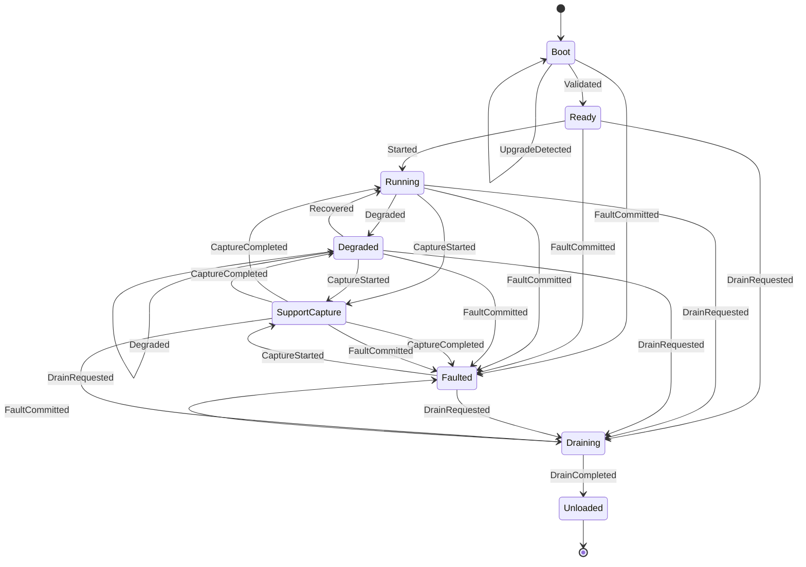

# [APPHOST_LIFECYCLE_AND_DRAIN]

Rasm.AppHost runs one process lifecycle: eight string-keyed `RuntimePhase` rows under one total transition law, one Atom-backed `Lifecycle` capsule minting a `PhaseReceipt` on every CAS commit, a four-case `FaultSource` spine with crash-marker and upgrade boot probing, the one type-enforced `FaultBand` registry every fault union's `Expected.Code` derives through, a rank-band drain conductor folding participant rows into one `DrainReceipt`, and one `CancelScope` spine beneath which every cancellation token is derived. The page owns the boot-minted `CorrelationId` identity, the phase family, the trigger vocabulary, the fault traps, the fault-band registry with its foreign mirror rows, the frozen drain bands with their store-dependency column, and cancellation provenance over Microsoft.Extensions.Hosting lifetime tokens, Thinktecture-generated vocabulary, LanguageExt rails, and NodaTime instants.

## [01]-[INDEX]

- [01]-[PHASE_FAMILY]: Eight phases, ten triggers, one CAS transition law, and receipted subscriptions.
- [02]-[FAULT_SPINE]: Four fault sources, trap registrations, crash-marker, and upgrade boot probe.
- [03]-[FAULT_TABLES]: One type-enforced band registry — own rows, event stride, foreign mirrors.
- [04]-[DRAIN_CONDUCTOR]: Frozen rank bands fold participant rows into one unload receipt.
- [05]-[CANCEL_SPINE]: One root source; derived scopes carry provenance and deadlines.
- [06]-[TS_PROJECTION]: Phase, fault, and unload receipt wire shapes.

## [02]-[PHASE_FAMILY]

- Owner: `CorrelationId` `[ValueObject<Guid>]` boot-minted root identity; `RuntimePhase` `[SmartEnum<string>]` eight rows under the `ComparerAccessors.StringOrdinal` accessor; `PhaseTrigger` `[Union]` trigger vocabulary; `Lifecycle` boundary capsule owning the Atom-backed receipt cell; `LifecycleFault` fault family deriving its codes through `FaultBand.Lifecycle`; `PhaseSubscription` LIFO detacher composite.
- Cases: boot, ready, running, degraded, draining, unloaded, faulted, support-capture; ten trigger cases; `LifecycleFault` = Text | IllegalTransition.
- Entry: `Fin<PhaseReceipt> Transition(PhaseTrigger trigger)` — `Fin` aborts on illegal transitions; the `RuntimePhase`-shaped overload admits evidence-free phase targets from host-attach injection through the same law.
- Auto: every CAS commit fires the cell change event into subscription detachers and the latest receipt is the cell value itself; `Attach` projects the lifetime tokens into trigger values — never a second state machine; receipts flow to the receipt-sink envelope unchanged.
- Receipt: `PhaseReceipt` — from, to, trigger key, `Instant`, held `Duration`, profile, correlation id.
- Packages: Microsoft.Extensions.Hosting, Thinktecture.Runtime.Extensions, LanguageExt.Core, NodaTime
- Growth: one phase row plus its `Next` arms, or one trigger case breaking every dispatch site at compile time; zero new surface.
- Boundary: `Lifecycle` is the named boundary capsule for the statement carve-out — the CAS-commit body, subscription wiring, and token registration carry language-owned statement forms while every other member stays expression-shaped; evidence-bearing targets (faulted, boot) reject the phase-shaped admission so fault evidence is never silently dropped; the Validated trigger fires from the options-admission publish; the boot self-loop row receipts upgrade detection without leaving boot; `PhaseReceipt.Trigger` is the `PhaseTrigger` case-key projection — the string key the total `Key` dispatch derives from the union case.

```csharp signature
[ValueObject<Guid>(
    ConversionToKeyMemberType = ConversionOperatorsGeneration.Implicit,
    ConversionFromKeyMemberType = ConversionOperatorsGeneration.None)]
public readonly partial struct CorrelationId : ISpanFormattable, IUtf8SpanFormattable {
    public static readonly CorrelationId None = Create(Guid.Empty);
    public string ToString(string? format, IFormatProvider? formatProvider) => ((Guid)this).ToString(format, formatProvider);
    public bool TryFormat(Span<char> destination, out int charsWritten, ReadOnlySpan<char> format, IFormatProvider? provider) => ((Guid)this).TryFormat(destination, out charsWritten, format);
    public bool TryFormat(Span<byte> utf8Destination, out int bytesWritten, ReadOnlySpan<char> format, IFormatProvider? provider) => ((Guid)this).TryFormat(utf8Destination, out bytesWritten, format);
}

[SmartEnum<string>]
[KeyMemberEqualityComparer<ComparerAccessors.StringOrdinal, string>]
[KeyMemberComparer<ComparerAccessors.StringOrdinal, string>]
public sealed partial class RuntimePhase {
    public static readonly RuntimePhase Boot = new("boot");
    public static readonly RuntimePhase Ready = new("ready");
    public static readonly RuntimePhase Running = new("running");
    public static readonly RuntimePhase Degraded = new("degraded");
    public static readonly RuntimePhase Draining = new("draining");
    public static readonly RuntimePhase Unloaded = new("unloaded");
    public static readonly RuntimePhase Faulted = new("faulted");
    public static readonly RuntimePhase SupportCapture = new("support-capture");
}

[Union(ConversionFromValue = ConversionOperatorsGeneration.None)]
public abstract partial record PhaseTrigger {
    private PhaseTrigger() { }
    public sealed record Validated : PhaseTrigger;
    public sealed record Started : PhaseTrigger;
    public sealed record Degraded : PhaseTrigger;
    public sealed record Recovered : PhaseTrigger;
    public sealed record UpgradeDetected(Version Prior, Version Current) : PhaseTrigger;
    public sealed record CaptureStarted : PhaseTrigger;
    public sealed record CaptureCompleted(RuntimePhase Resume) : PhaseTrigger;
    public sealed record FaultCommitted(FaultSource Source) : PhaseTrigger;
    public sealed record DrainRequested : PhaseTrigger;
    public sealed record DrainCompleted(Option<DrainReceipt> Receipt = default) : PhaseTrigger;
}

[Union]
public abstract partial record LifecycleFault : Expected, IValidationError<LifecycleFault> {
    private LifecycleFault(string detail, int code) : base(detail, code, None) { }
    public static LifecycleFault Create(string message) => new Text(message);
    public sealed record Text : LifecycleFault { public Text(string detail) : base(detail, FaultBand.Lifecycle.Code(0)) { } }
    public sealed record IllegalTransition : LifecycleFault { public IllegalTransition(RuntimePhase from, string trigger) : base($"{from.Key}:{trigger}", FaultBand.Lifecycle.Code(1)) { } }
}

public readonly record struct PhaseReceipt(RuntimePhase From, RuntimePhase To, string Trigger, Instant At, Duration Held, HostProfile Profile, CorrelationId CorrelationId);

public readonly record struct PhaseSubscription(Seq<Action> Detachers) : IDisposable {
    public void Dispose() => Detachers.Rev().Iter(static detach => detach());
}

public sealed class Lifecycle(HostProfile profile, IClock clock, TimeProvider time, CorrelationId correlationId) {
    readonly Atom<PhaseReceipt> cell = Atom(new PhaseReceipt(RuntimePhase.Boot, RuntimePhase.Boot, nameof(RuntimePhase.Boot), clock.GetCurrentInstant(), Duration.Zero, profile, correlationId));
    public HostProfile Profile { get; } = profile;
    public IClock Clock { get; } = clock;
    public TimeProvider Time { get; } = time;
    public CorrelationId CorrelationId { get; } = correlationId;
    public CancelScope Spine { get; } = CancelScope.Root(nameof(Lifecycle));
    public RuntimePhase Phase => cell.Value.To;
    public PhaseReceipt Latest => cell.Value;
    public Fin<PhaseReceipt> Transition(PhaseTrigger trigger) {
        var minted = Option<PhaseReceipt>.None;
        var settled = cell.SwapMaybe(prior => {
            minted = None;
            return Next(prior.To, trigger).Map(next => {
                var fresh = Mint(prior, next, trigger);
                minted = Some(fresh);
                return fresh;
            });
        });
        return minted.ToFin(new LifecycleFault.IllegalTransition(settled.To, Key(trigger)));
    }
    public Fin<PhaseReceipt> Transition(RuntimePhase target) =>
        Derived(target).ToFin(new LifecycleFault.IllegalTransition(cell.Value.To, target.Key)).Bind(Transition);
    public PhaseSubscription Subscribe(Action<PhaseReceipt> observer) {
        AtomChangedEvent<PhaseReceipt> handler = new(observer);
        cell.Change += handler;
        return new PhaseSubscription([() => cell.Change -= handler]);
    }
    public PhaseSubscription Attach(IHostApplicationLifetime lifetime) {
        var started = lifetime.ApplicationStarted.Register(() => ignore(Transition(RuntimePhase.Running)));
        var stopping = lifetime.ApplicationStopping.Register(() => ignore(Transition(RuntimePhase.Draining)));
        var stopped = lifetime.ApplicationStopped.Register(() => ignore(Transition(RuntimePhase.Unloaded)));
        return new PhaseSubscription([started.Dispose, stopping.Dispose, stopped.Dispose]);
    }
    PhaseReceipt Mint(PhaseReceipt prior, RuntimePhase next, PhaseTrigger trigger) {
        var now = Clock.GetCurrentInstant();
        return new PhaseReceipt(prior.To, next, Key(trigger), now, now - prior.At, Profile, CorrelationId);
    }
    static Option<RuntimePhase> Next(RuntimePhase phase, PhaseTrigger trigger) => trigger.Switch(
        state: phase,
        validated: static (at, _) => at == RuntimePhase.Boot ? Some(RuntimePhase.Ready) : None,
        started: static (at, _) => at == RuntimePhase.Ready ? Some(RuntimePhase.Running) : None,
        degraded: static (at, _) => at == RuntimePhase.Running || at == RuntimePhase.Degraded ? Some(RuntimePhase.Degraded) : None,
        recovered: static (at, _) => at == RuntimePhase.Degraded ? Some(RuntimePhase.Running) : None,
        upgradeDetected: static (at, _) => at == RuntimePhase.Boot ? Some(RuntimePhase.Boot) : None,
        captureStarted: static (at, _) => at == RuntimePhase.Running || at == RuntimePhase.Degraded || at == RuntimePhase.Faulted ? Some(RuntimePhase.SupportCapture) : None,
        captureCompleted: static (at, capture) => at == RuntimePhase.SupportCapture ? Some(capture.Resume) : None,
        faultCommitted: static (at, _) => at == RuntimePhase.Unloaded || at == RuntimePhase.Faulted ? None : Some(RuntimePhase.Faulted),
        drainRequested: static (at, _) => at == RuntimePhase.Boot || at == RuntimePhase.Draining || at == RuntimePhase.Unloaded ? None : Some(RuntimePhase.Draining),
        drainCompleted: static (at, _) => at == RuntimePhase.Draining ? Some(RuntimePhase.Unloaded) : None);
    static Option<PhaseTrigger> Derived(RuntimePhase target) => target.Switch(
        state: unit,
        boot: static _ => Option<PhaseTrigger>.None,
        ready: static _ => Some<PhaseTrigger>(new PhaseTrigger.Validated()),
        running: static _ => Some<PhaseTrigger>(new PhaseTrigger.Started()),
        degraded: static _ => Some<PhaseTrigger>(new PhaseTrigger.Degraded()),
        draining: static _ => Some<PhaseTrigger>(new PhaseTrigger.DrainRequested()),
        unloaded: static _ => Some<PhaseTrigger>(new PhaseTrigger.DrainCompleted()),
        faulted: static _ => Option<PhaseTrigger>.None,
        supportCapture: static _ => Some<PhaseTrigger>(new PhaseTrigger.CaptureStarted()));
    static string Key(PhaseTrigger trigger) => trigger.Map(
        validated: nameof(PhaseTrigger.Validated),
        started: nameof(PhaseTrigger.Started),
        degraded: nameof(PhaseTrigger.Degraded),
        recovered: nameof(PhaseTrigger.Recovered),
        upgradeDetected: nameof(PhaseTrigger.UpgradeDetected),
        captureStarted: nameof(PhaseTrigger.CaptureStarted),
        captureCompleted: nameof(PhaseTrigger.CaptureCompleted),
        faultCommitted: nameof(PhaseTrigger.FaultCommitted),
        drainRequested: nameof(PhaseTrigger.DrainRequested),
        drainCompleted: nameof(PhaseTrigger.DrainCompleted));
}
```



## [03]-[FAULT_SPINE]

- Owner: `FaultSource` `[Union]` four cases; `BootMarker` crash and upgrade marker record; `FaultRecord` kind-discriminated wire-projection record; `FaultSpine` trap and probe surface.
- Cases: Unhandled, UnobservedTask, Signalled, HostCrashMarker.
- Entry: `PhaseSubscription ArmTraps(CorrelationId correlation, Option<Action<SupportTrigger>> capture = default, Option<Action> reload = default)` — one LIFO detacher composite over every trap registration; the capture arm now receives one `SupportTrigger.FaultTransition(correlation, FaultRecord.From(source))` fact rather than the raw `FaultSource`, so a fault commit and its support-capture trigger are one fact stream and `ProbeMarkers` boot evidence rides the identical trigger case.
- Auto: every in-process fault commit folds its `FaultSource` through `FaultRecord.From` into one `SupportTrigger.FaultTransition` and emits that single fact to the capture arm before the `PhaseTrigger.FaultCommitted` phase transition, so the capture trigger and the phase transition derive from one `Commit` fold, never a free capture delegate beside a separate trigger; SIGTERM and SIGQUIT project to the drain transition; SIGHUP invokes the reload delegate feeding the reload-outcome rail.
- Packages: Thinktecture.Runtime.Extensions, LanguageExt.Core, NodaTime, BCL inbox
- Growth: one trap registration row inside `ArmTraps` or one host-marker path value; one new fault cause is one `FaultSource` case the `FaultRecord.From` flatten and the one `SupportTrigger.FaultTransition` emission both absorb; zero new surface.
- Boundary: `FaultSpine` is the named boundary capsule for the statement carve-out — trap wiring and signal handlers carry language-owned statement forms; plugin rows arm no posix traps because the host owns process signals and host-attach injection drives phases; marker bytes ride the package wire codec handed in as `JsonTypeInfo<BootMarker>`; stale own markers and host `.rhl`/`.ips` markers project to `HostCrashMarker` evidence flowing through the same `FaultRecord.From` flatten into one `SupportTrigger.FaultTransition`, never a live fault transition and never a second capture path; the marker writes at boot, clears on clean drain, and its version stamp doubles as upgrade-boot detection; `FaultRecord.From` is the total flatten — `Error` evidence and `PosixSignal` payloads land as wire-stable record fields under the kind literals the polymorphic metadata pins, so the `FaultTransition` fact carries the wire-stable `FaultRecord` and never the live `Error`-bearing `FaultSource`; the fault-to-capture path is one fact with kind metadata the durable-orchestration crash-recovery reads to resume in-flight steps, collapsing the prior capture-delegate-then-`PhaseTrigger.FaultCommitted` two-site construction (`Runtime/orchestration#CRASH_RESUME`, `Observability/bundles#TRIGGER_UNION`).

```csharp signature
[Union(ConversionFromValue = ConversionOperatorsGeneration.None)]
public abstract partial record FaultSource {
    private FaultSource() { }
    public sealed record Unhandled(Error Evidence, bool Terminating) : FaultSource;
    public sealed record UnobservedTask(Error Evidence) : FaultSource;
    public sealed record Signalled(PosixSignal Signal) : FaultSource;
    public sealed record HostCrashMarker(string Path, Option<BootMarker> Marker) : FaultSource;
}

public sealed record BootMarker(int Pid, RuntimePhase Phase, Version AppVersion, Instant StartedAt);

[Union(ConversionFromValue = ConversionOperatorsGeneration.None)]
[JsonPolymorphic(TypeDiscriminatorPropertyName = "kind")]
[JsonDerivedType(typeof(FaultRecord.Unhandled), "unhandled")]
[JsonDerivedType(typeof(FaultRecord.UnobservedTask), "unobserved-task")]
[JsonDerivedType(typeof(FaultRecord.Signalled), "posix-signal")]
[JsonDerivedType(typeof(FaultRecord.HostCrashMarker), "host-crash-marker")]
public abstract partial record FaultRecord {
    private FaultRecord() { }
    public sealed record Unhandled(string Evidence, bool Terminating) : FaultRecord;
    public sealed record UnobservedTask(string Evidence) : FaultRecord;
    public sealed record Signalled(string Signal) : FaultRecord;
    public sealed record HostCrashMarker(string Path, BootMarker? Marker) : FaultRecord;

    public static FaultRecord From(FaultSource source) => source.Switch(
        unhandled: static u => (FaultRecord)new Unhandled(u.Evidence.Message, u.Terminating),
        unobservedTask: static t => new UnobservedTask(t.Evidence.Message),
        signalled: static s => new Signalled(s.Signal.ToString()),
        hostCrashMarker: static h => new HostCrashMarker(h.Path, h.Marker is { IsSome: true, Case: BootMarker found } ? found : null));
}

public static class FaultSpine {
    const string MarkerFile = "boot-marker.json";
    extension(Lifecycle host) {
        public PhaseSubscription ArmTraps(CorrelationId correlation, Option<Action<SupportTrigger>> capture = default, Option<Action> reload = default) {
            UnhandledExceptionEventHandler unhandled = (_, args) =>
                Commit(host, correlation, capture, new FaultSource.Unhandled(
                    args.ExceptionObject as Exception is { } failure ? Error.New(failure) : Error.New($"{args.ExceptionObject}"),
                    args.IsTerminating));
            EventHandler<UnobservedTaskExceptionEventArgs> unobserved = (_, args) => {
                args.SetObserved();
                Commit(host, correlation, capture, new FaultSource.UnobservedTask(Error.New(args.Exception)));
            };
            AppDomain.CurrentDomain.UnhandledException += unhandled;
            TaskScheduler.UnobservedTaskException += unobserved;
            var sigterm = PosixSignalRegistration.Create(PosixSignal.SIGTERM, context => Drainward(host, context));
            var sigquit = PosixSignalRegistration.Create(PosixSignal.SIGQUIT, context => Drainward(host, context));
            var sighup = PosixSignalRegistration.Create(PosixSignal.SIGHUP, context => {
                context.Cancel = true;
                reload.Iter(static enqueue => enqueue());
            });
            return new PhaseSubscription([
                () => AppDomain.CurrentDomain.UnhandledException -= unhandled,
                () => TaskScheduler.UnobservedTaskException -= unobserved,
                sigterm.Dispose,
                sigquit.Dispose,
                sighup.Dispose,
            ]);
        }
    }
    public static IO<Unit> WriteMarker(BootMarker marker, string supportRoot, JsonTypeInfo<BootMarker> codec) =>
        IO.lift(fun(() => File.WriteAllText(Path.Join(supportRoot, MarkerFile), JsonSerializer.Serialize(marker, codec))));
    public static IO<Unit> ClearMarker(string supportRoot) =>
        IO.lift(fun(() => File.Delete(Path.Join(supportRoot, MarkerFile))));
    public static IO<(Seq<FaultSource> Crashes, Option<PhaseTrigger> Upgrade)> ProbeMarkers(string supportRoot, Version current, JsonTypeInfo<BootMarker> codec, Seq<string> hostMarkers = default) =>
        IO.lift(() => Probed(supportRoot, current, codec, hostMarkers));
    static (Seq<FaultSource> Crashes, Option<PhaseTrigger> Upgrade) Probed(string supportRoot, Version current, JsonTypeInfo<BootMarker> codec, Seq<string> hostMarkers) {
        var path = Path.Join(supportRoot, MarkerFile);
        var stale = File.Exists(path) ? Optional(JsonSerializer.Deserialize(File.ReadAllText(path), codec)) : Option<BootMarker>.None;
        return (
            stale.Map(marker => (FaultSource)new FaultSource.HostCrashMarker(path, Some(marker))).ToSeq()
              + hostMarkers.Filter(File.Exists).Map(static found => (FaultSource)new FaultSource.HostCrashMarker(found, None)),
            stale.Filter(marker => marker.AppVersion != current)
                 .Map(marker => (PhaseTrigger)new PhaseTrigger.UpgradeDetected(marker.AppVersion, current)));
    }
    // One fault fact, two consequences: the wire-stable FaultRecord rides one SupportTrigger.FaultTransition
    // the capture arm and the durable crash-recovery both read, and the phase cell transitions on the same
    // FaultSource. The prior capture-delegate-then-FaultCommitted two-site construction is the collapsed form.
    static Unit Commit(Lifecycle host, CorrelationId correlation, Option<Action<SupportTrigger>> capture, FaultSource source) =>
        (capture.Iter(arm => arm(new SupportTrigger.FaultTransition(correlation, FaultRecord.From(source)))),
         ignore(host.Transition(new PhaseTrigger.FaultCommitted(source)))).Item2;
    static Unit Drainward(Lifecycle host, PosixSignalContext context) =>
        ((context.Cancel = true), ignore(host.Transition(RuntimePhase.Draining))).Item2;
}
```

## [04]-[FAULT_TABLES]

- Owner: `FaultBand` `[SmartEnum<int>]` — the ONE fault-band registry; `BandKind` event-vs-fault discriminant; the disjointness proof fold.
- Cases: own rows for every AppHost band (the 1xxx boot space with the 1000-1099 EVENT stride disjoint from the fault decades; the 4100-4810 wire/agent space); mirror rows reserving every foreign neighborhood — Compute 2200-2220 and Remote 4520-4539, the paradigm AEC registry flanks 2300-2399/2450-2799, kernel `GeometryFault` 2400-2449 hard-bounded, Persistence 5400/7710/8250-8459, AppUi 6000-6999, and the kernel substrate `Fault` discriminant 9104 — the sole foreign 9xxx occupant.
- Entry: `int Code(int offset)` — every fault union's `Expected.Code` derives through its registry row; a `base(detail, NNNN)` literal is the deleted form. `Option<FaultBand> OwnerOf(int code)` is the reverse projection telemetry and support capture read.
- Auto: the generated key lookup fails at type initialization on a duplicate base integer, and the `Disjoint` fold fails on any span overlap — a colliding band is unrepresentable from the floor, so no prose census exists anywhere in the corpus; a page states its band as one registry reference.
- Packages: Thinktecture.Runtime.Extensions, LanguageExt.Core
- Growth: one registry row per new band — own rows name their owning-page anchor, mirror rows reserve the foreign integer only; a sibling package admitting a band lands here as one mirror row in the same motion; zero new surface.
- Boundary: `FaultBand` is the named boundary capsule for the construction-guard carve-out — the duplicate-key and span-overlap proofs are type-initialization pressure, the registry's compile-adjacent floor, not rail control flow; mirror rows never derive codes (`Code` rejects on a mirror row by construction — a foreign band's cases mint sibling-side); the AppUi 6xxx reservation is reciprocal (`RASM-CS-APPUI-BRIEF.md` `[V1]` re-bands every AppUi union into 6xxx and its registry pins this one's 1xxx/4xxx back); event rows (`SpineLog` 1000-1099) register under `BandKind.Event` so event-vs-fault disjointness is type-enforced, never a naming convention.

```csharp signature
public enum BandKind { Event, Fault }

[SmartEnum<int>]
public sealed partial class FaultBand {
    // Own rows — base, span, kind, owning-page anchor. A new AppHost band is one row here first.
    public static readonly FaultBand SpineEvents      = new(1000,  100, BandKind.Event, "Observability/telemetry#LOG_PROJECTION", mirror: false);
    public static readonly FaultBand Profile          = new(1100,  100, BandKind.Fault, "Runtime/profiles#PROFILE_AXIS", mirror: false);
    public static readonly FaultBand Lifecycle        = new(1200,  100, BandKind.Fault, "Runtime/lifecycle#PHASE_FAMILY", mirror: false);
    public static readonly FaultBand Update           = new(1300,   20, BandKind.Fault, "Sandbox/provisioning#UPDATE_RAIL", mirror: false);
    public static readonly FaultBand SupplyChain      = new(1320,   20, BandKind.Fault, "Sandbox/admission#SUPPLY_CHAIN_GATE", mirror: false);
    public static readonly FaultBand Config           = new(4100,  100, BandKind.Fault, "Runtime/config#TYPED_BINDING", mirror: false);
    public static readonly FaultBand Hop              = new(4500,   20, BandKind.Fault, "Wire/outbound#HOP_AXIS", mirror: false);
    public static readonly FaultBand Coordination     = new(4540,   20, BandKind.Fault, "Wire/coordination#DISTRIBUTED_LOCK", mirror: false);
    public static readonly FaultBand Command          = new(4600,   20, BandKind.Fault, "Agent/capability#COMMAND_ALGEBRA", mirror: false);
    public static readonly FaultBand Grant            = new(4620,   10, BandKind.Fault, "Agent/capability#GRANT_BROKER", mirror: false);
    public static readonly FaultBand Identity         = new(4630,   10, BandKind.Fault, "Agent/identity#TOKEN_VALIDATION", mirror: false);
    public static readonly FaultBand Mcp              = new(4640,   20, BandKind.Fault, "Agent/mcp#TOOL_DISPATCH", mirror: false);
    public static readonly FaultBand Sandbox          = new(4660,   20, BandKind.Fault, "Sandbox/isolation#ISOLATION_AXIS", mirror: false);
    public static readonly FaultBand Feature          = new(4700,   10, BandKind.Fault, "Runtime/features#VERDICT_PROJECTION", mirror: false);
    public static readonly FaultBand Solver           = new(4710,   10, BandKind.Fault, "Sandbox/solver#SOLVER_KIND", mirror: false);
    public static readonly FaultBand LiveWire         = new(4720,   10, BandKind.Fault, "Wire/livewire#TRANSPORT_AXIS", mirror: false);
    public static readonly FaultBand Bus              = new(4730,   10, BandKind.Fault, "Wire/topics#TOPIC_FABRIC", mirror: false);
    public static readonly FaultBand Outbox           = new(4740,   10, BandKind.Fault, "Wire/outbox#OUTBOX_FABRIC", mirror: false);
    public static readonly FaultBand Lane             = new(4750,   10, BandKind.Fault, "Runtime/laneguard#LANE_GUARD", mirror: false);
    public static readonly FaultBand Replay           = new(4760,   10, BandKind.Fault, "Runtime/determinism#REPLAY_VERIFY", mirror: false);
    public static readonly FaultBand Orchestration    = new(4770,   10, BandKind.Fault, "Runtime/orchestration#WORKFLOW_FAMILY", mirror: false);
    public static readonly FaultBand Secret           = new(4780,   10, BandKind.Fault, "Runtime/secrets#SECRET_LEASE", mirror: false);
    public static readonly FaultBand Pem              = new(4790,   10, BandKind.Fault, "Runtime/secrets#CREDENTIAL_PEM", mirror: false);
    public static readonly FaultBand Federation       = new(4800,   10, BandKind.Fault, "Agent/federation#FEDERATION_AXIS", mirror: false);
    public static readonly FaultBand Support          = new(4810,   10, BandKind.Fault, "Observability/bundles#CAPTURE_PIPELINE", mirror: false);
    public static readonly FaultBand Drain            = new(4820,   10, BandKind.Fault, "Runtime/resources#DRAIN_QUEUES", mirror: false);
    // Mirror rows — foreign neighborhoods reserved; source of truth is the sibling registry.
    public static readonly FaultBand ComputeCore      = new(2200,   21, BandKind.Fault, "Rasm.Compute/Runtime/admission", mirror: true);
    public static readonly FaultBand AecLow           = new(2300,  100, BandKind.Fault, "RASM-COMPONENT-PARADIGM 23xx", mirror: true);
    public static readonly FaultBand KernelGeometry   = new(2400,   50, BandKind.Fault, "Rasm/Numerics/faults", mirror: true);
    public static readonly FaultBand AecHigh          = new(2450,  350, BandKind.Fault, "RASM-COMPONENT-PARADIGM 24xx-27xx", mirror: true);
    public static readonly FaultBand ComputeRemote    = new(4520,   20, BandKind.Fault, "Rasm.Compute/Runtime/wire", mirror: true);
    public static readonly FaultBand PersistRemote    = new(5400,  100, BandKind.Fault, "Rasm.Persistence/Element/graph", mirror: true);
    public static readonly FaultBand AppUi            = new(6000, 1000, BandKind.Fault, "Rasm.AppUi/Shell/hosts", mirror: true);
    public static readonly FaultBand PersistLocal     = new(7710,   10, BandKind.Fault, "Rasm.Persistence/Element/graph", mirror: true);
    public static readonly FaultBand PersistStore     = new(8250,  210, BandKind.Fault, "Rasm.Persistence/Element/graph", mirror: true);
    public static readonly FaultBand KernelSubstrate  = new(9104,    1, BandKind.Fault, "Rasm/Domain/rails", mirror: true);

    public int Span { get; }
    public BandKind Kind { get; }
    public string Owner { get; }
    public bool Mirror { get; }
    // Registry-derived code: the sole legal source of an Expected.Code. Construction guard, not rail flow —
    // a bad offset or a mirror-row derivation fails when the owning union's static case initializes.
    public int Code(int offset) =>
        !Mirror && offset >= 0 && offset < Span ? Key + offset
            : throw new InvalidOperationException($"{Owner}:{Key}+{offset}");
    public static Option<FaultBand> OwnerOf(int code) =>
        toSeq(Items).Find(band => code >= band.Key && code < band.Key + band.Span);
    // Span-overlap proof: base uniqueness is the generated key lookup; range disjointness is this fold.
    public static readonly Unit Disjoint = ignore(
        toSeq(Items).OrderBy(static band => band.Key).ToSeq()
            .Fold(0, static (ceiling, band) => band.Key >= ceiling
                ? band.Key + band.Span
                : throw new InvalidOperationException($"{band.Owner}:{band.Key}")));
}
```

## [05]-[DRAIN_CONDUCTOR]

- Owner: `DrainBand` `[SmartEnum<int>]` frozen rank bands with the store-dependency column; `DrainOutcome` `[SmartEnum<string>]` step vocabulary; `DrainConductor` ordered fold.
- Cases: Interaction 100, Compute 200, Stores 300, Telemetry 400; outcomes flushed | escalated | straggled.
- Entry: `IO<DrainReceipt> Drain(Seq<(string Name, DrainBand Band, int Rank, Func<CancellationToken, IO<Unit>> Drain)> rows, Duration cooperative, Duration forced)` — `IO` carries the ordered flush effects and aborts on a rejected fence transition.
- Auto: the conductor's first act is the draining transition, and interior admission dispatches on the phase cell, so inbound admission ceases before any band-100 row runs; queue completion awaits and telemetry flush rows enter as ordinary registrations at their declared band; every step receipt lands regardless of outcome.
- Receipt: `DrainReceipt` aggregates `DrainStep` rows — name, band, allotted, consumed, outcome — with final phase, `Instant`, elapsed, correlation id; `Stragglers` is the deadline-miss projection naming every miss.
- Packages: Thinktecture.Runtime.Extensions, LanguageExt.Core, NodaTime, BCL inbox
- Growth: one registration row per participant and one band row per new package altitude; zero new surface.
- Boundary: cooperative and forced budgets arrive from the drain-cooperative and drain-forced deadline rows; registration rows arrive field-identical from the drain-participant port; store writes stay legal through band 300 and are foreclosed on the Telemetry row; the maintenance-lease handoff emits as a Stores-band row, graceful handoff distinct from crash reclamation; the finalized Persistence single-`IDocumentSession` same-transaction spine mints no prepared transactions, so NO 2PC in-doubt drain row exists — a prepared-transaction reconciliation row or a managed XA transaction manager beside the spine is dead apparatus, the retired form; on bundled-companion rows the parent's registration fans the drain signal to the child over the local-ipc hop.

```csharp signature
[SmartEnum<int>]
public sealed partial class DrainBand {
    public static readonly DrainBand Interaction = new(100, storeWritesOpen: true);
    public static readonly DrainBand Compute = new(200, storeWritesOpen: true);
    public static readonly DrainBand Stores = new(300, storeWritesOpen: true);
    public static readonly DrainBand Telemetry = new(400, storeWritesOpen: false);
    public bool StoreWritesOpen { get; }
}

[SmartEnum<string>]
[KeyMemberEqualityComparer<ComparerAccessors.StringOrdinal, string>]
[KeyMemberComparer<ComparerAccessors.StringOrdinal, string>]
public sealed partial class DrainOutcome {
    public static readonly DrainOutcome Flushed = new("flushed");
    public static readonly DrainOutcome Escalated = new("escalated");
    public static readonly DrainOutcome Straggled = new("straggled");
}

public readonly record struct DrainStep(string Name, DrainBand Band, Duration Allotted, Duration Consumed, DrainOutcome Outcome);

public readonly record struct DrainReceipt(Seq<DrainStep> Steps, RuntimePhase Final, Instant At, Duration Elapsed, CorrelationId CorrelationId);

public static class DrainConductor {
    extension(Lifecycle host) {
        public IO<DrainReceipt> Drain(Seq<(string Name, DrainBand Band, int Rank, Func<CancellationToken, IO<Unit>> Drain)> rows, Duration cooperative, Duration forced) =>
            from start in IO.lift(() => host.Clock.GetCurrentInstant())
            from fence in IO.lift(() => host.Transition(RuntimePhase.Draining))
            from steps in toSeq(rows.OrderBy(static row => row.Band.Key).ThenBy(static row => row.Rank))
                .TraverseM(row => Step(row, host, cooperative, forced)).As()
            from finish in IO.lift(() => host.Clock.GetCurrentInstant())
            let receipt = new DrainReceipt(steps.Strict(), RuntimePhase.Unloaded, finish, finish - start, host.CorrelationId)
            from closed in IO.lift(() => host.Transition(new PhaseTrigger.DrainCompleted(Some(receipt))))
            select receipt;
    }
    extension(DrainReceipt receipt) {
        public Seq<DrainStep> Stragglers => receipt.Steps.Filter(static step => step.Outcome == DrainOutcome.Straggled);
    }
    static IO<DrainStep> Step((string Name, DrainBand Band, int Rank, Func<CancellationToken, IO<Unit>> Drain) row, Lifecycle host, Duration cooperative, Duration forced) =>
        from mark in IO.lift(host.Time.GetTimestamp)
        from outcome in IO.lift(() => host.Spine.Derive(row.Name, host.Time, cooperative)).Bracket(
            Use: scope => row.Drain(scope.Token)
                .Map(static _ => DrainOutcome.Flushed)
                .Catch(static error => error.Is(Errors.Cancelled), static _ => IO.pure(DrainOutcome.Escalated))
                .Timeout((cooperative + forced).ToTimeSpan())
                .Catch(static error => error.Is(Errors.TimedOut) || error.Is(Errors.Cancelled), static _ => IO.pure(DrainOutcome.Straggled)),
            Fin: static scope => IO.lift(fun(scope.Dispose)))
        select new DrainStep(row.Name, row.Band, cooperative, Duration.FromTimeSpan(host.Time.GetElapsedTime(mark)), outcome);
}
```

## [06]-[CANCEL_SPINE]

- Owner: `CancelScope` — the one root source and every derived scope as provenance-carrying values.
- Entry: `CancelScope Derive(string provenance, TimeProvider time, Option<Duration> deadline = default)` — linked-token derivation with provider-driven deadline expiry.
- Packages: LanguageExt.Core, NodaTime, BCL inbox
- Growth: one derivation row per new scope axis — phase, queue, hop attempt; zero new surface.
- Boundary: the root lives on the `Lifecycle` capsule and every scope below it derives through linked tokens — a free-floating `CancellationTokenSource` below the spine is the named defect; deadline values arrive from the deadline vocabulary; provenance segments are nameof-derived path values that surface in `DrainStep` names and hop receipts; the deadline source binds the injected `TimeProvider` at construction so fake-clock specs drive expiry deterministically.

```csharp signature
public sealed record CancelScope(string Provenance, CancellationTokenSource Source, Option<CancellationTokenSource> Deadline = default) : IDisposable {
    public CancellationToken Token => Source.Token;
    public static CancelScope Root(string provenance) => new(provenance, new CancellationTokenSource());
    public CancelScope Derive(string provenance, TimeProvider time, Option<Duration> deadline = default) =>
        deadline is { IsSome: true, Case: Duration bound }
            ? Timed($"{Provenance}/{provenance}", Source.Token, new CancellationTokenSource(bound.ToTimeSpan(), time))
            : new CancelScope($"{Provenance}/{provenance}", CancellationTokenSource.CreateLinkedTokenSource(Source.Token));
    public void Dispose() => ignore((Deadline.Iter(static timed => timed.Dispose()), fun(Source.Dispose)()));
    static CancelScope Timed(string provenance, CancellationToken parent, CancellationTokenSource timed) =>
        new(provenance, CancellationTokenSource.CreateLinkedTokenSource(parent, timed.Token), Some(timed));
}
```

## [07]-[TS_PROJECTION]

- Owner: `PhaseReceiptWire`, `BootMarkerWire`, `FaultRecordWire`, `DrainStepWire`, `DrainReceiptWire` — the dashboard-ingested shapes of the lifecycle receipts.
- Packages: BCL inbox
- Growth: one wire-member row per new receipt field and one key literal per new vocabulary row; zero new surface.
- Boundary: shapes transcribe the camelCase emission of the suite wire law — smart-enum rows cross as their declared keys, instants and durations cross as round-trip pattern strings, correlation ids cross as guid strings, and the fault record discriminates on the kind literals its polymorphic metadata pins.

```ts contract
type RuntimePhaseKey = "boot" | "ready" | "running" | "degraded" | "draining" | "unloaded" | "faulted" | "support-capture";

type DrainOutcomeKey = "flushed" | "escalated" | "straggled";

interface PhaseReceiptWire { readonly from: RuntimePhaseKey; readonly to: RuntimePhaseKey; readonly trigger: string; readonly at: string; readonly held: string; readonly profile: string; readonly correlationId: string; }

interface BootMarkerWire { readonly pid: number; readonly phase: RuntimePhaseKey; readonly appVersion: string; readonly startedAt: string; }

type FaultRecordWire =
  | { readonly kind: "unhandled"; readonly evidence: string; readonly terminating: boolean }
  | { readonly kind: "unobserved-task"; readonly evidence: string }
  | { readonly kind: "posix-signal"; readonly signal: string }
  | { readonly kind: "host-crash-marker"; readonly path: string; readonly marker: BootMarkerWire | null };

interface DrainStepWire { readonly name: string; readonly band: number; readonly allotted: string; readonly consumed: string; readonly outcome: DrainOutcomeKey; }

interface DrainReceiptWire { readonly steps: readonly DrainStepWire[]; readonly final: RuntimePhaseKey; readonly at: string; readonly elapsed: string; readonly correlationId: string; }
```

## [08]-[RESEARCH]

- [FAULT_PROBES]: standalone-row crash-flag marker path and schema beneath the per-user support root; SIGHUP delivery under launchd and systemd service lifetimes for the reload trigger.
- [DRAIN_CLASSIFIER]: `IO.Timeout` expiry error identity against the escalated and straggled classifier predicates.
