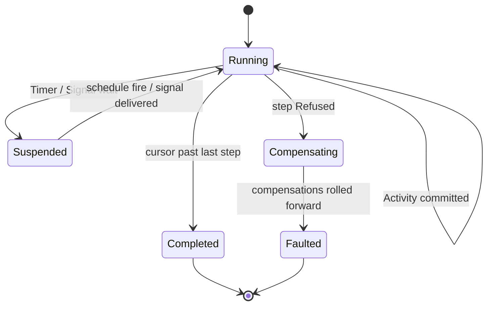

# [APPHOST_DURABLE_ORCHESTRATION]

The crash-durable workflow and persistent-job owner for the runtime spine: a `WorkflowInstance` persists as a sequence of hash-chained `EventLog` steps whose executor is the one `Agent/runtime#DISPATCH_FRONT_DOOR` `CommandDispatch.Run` — no parallel dispatcher — a five-case `StepKind` union carries activities, timers, signals, compensations, and persistent jobs, deferred work schedules as `SchedulePort` rows, and in-flight instances rehydrate from the last committed step on restart so a crash-surviving process resumes mid-saga. The page owns the workflow vocabulary, the step union, the saga compensation fold, the durable step-state seam, the crash-resume rail, and the persistent-job cadence; it consumes `CommandDispatch`/`CommandReceipt`/`CommandIntent`, `EventLog`/`LogEntry`/`ContentHash`/`DeterminismContext`, `SchedulePort`/`ScheduleEntry`/`FencingToken`, `SupportTrigger.FaultTransition` (the collapsed crash-recovery fact), `CommandAlgebra.Batch`/`CompensationOf`, `TenantContext`, `ClockPolicy`, and `ReceiptSinkPort` as settled vocabulary, carries the durable step-state as a coordinated `Rasm.Persistence` ripple, and mints no eighth port.

## [01]-[INDEX]

- [01]-[WORKFLOW_FAMILY]: The `WorkflowInstance` record, the five-case `StepKind` union, and the per-step disposition.
- [02]-[STEP_EXECUTOR]: One `Run` driving each step through `CommandDispatch` with timer/signal/compensation arms.
- [03]-[STEP_STATE_SEAM]: The durable compare-and-set step-state store under a fenced write — the Persistence ripple.
- [04]-[CRASH_RESUME]: Rehydration from the last committed step over the `SupportTrigger.FaultTransition` boot fact.
- [05]-[PERSISTENT_JOB]: Crash-durable jobs on the one `SchedulePort` cadence.
- [06]-[TS_PROJECTION]: Workflow-instance and step wire shapes the dashboard consumes.

## [02]-[WORKFLOW_FAMILY]

- Owner: `WorkflowStatus` `[SmartEnum<string>]` the instance lifecycle ladder under the `TimeKeyPolicy` accessor; `StepKind` `[Union]` the five durable-step shapes; `StepStatus` `[SmartEnum<string>]` the per-step disposition; `WorkflowStep` the durable step record; `WorkflowInstance` the hash-chained instance record; `OrchestrationFault` `[Union]` fault family in the 4770 band.
- Cases: instance statuses running | suspended | completed | compensating | faulted; `StepKind` = `Activity(CommandIntent Intent)` | `Timer(Instant FireAt)` | `Signal(string Channel, Option<Duration> Timeout)` | `Compensation(string ForStep, CommandIntent Intent)` | `PersistentJob(ScheduleEntry Entry)`; step statuses pending | running | committed | waiting | compensated | failed; `OrchestrationFault` = Text | StepRejected | SignalTimeout | FenceStale | ResumeBroken.
- Entry: `WorkflowInstance.Begin(string workflowId, Seq<WorkflowStep> plan, TenantContext tenant, Instant at)` materializes a running instance with its step plan and a genesis chain; `WorkflowInstance.Advance(WorkflowStep step, ContentHash hash, StepStatus status)` folds one committed step onto the instance, chaining the step's content hash to the predecessor.
- Auto: each `WorkflowStep` carries its `StepKind`, an attempt count, and the resume cursor (the wire-stable keys plus the step index) so a step is replayable from durable state, never a live closure; the instance's `Chain` is the `EventLog.Chain` head so a committed step's `CommandReceipt` chains into the same hash-chained log a live command chains into and the instance's integrity is the chain's tamper-evidence; a `StepKind.Timer` resolves through `SchedulePort.Next` so a durable wait is one `ScheduleEntry` row, a `StepKind.Signal` suspends the instance to `waiting` until the matching channel signal arrives or the timeout fires, and a `StepKind.PersistentJob` registers its `ScheduleEntry` so a recurring job survives restart; the saga compensation is a `StepKind.Compensation` whose `CommandIntent` rolls forward the prior step's undo through `CommandAlgebra.Batch`'s reverse-fold, never a phantom undo.
- Receipt: each step commit mints one `CommandReceipt` (the executor's own) plus one `LogEntry` (the chain advance); the instance transition rides one `SpineLog` event in the 1000-1999 band; no parallel workflow receipt beyond the `WorkflowInstance` itself.
- Packages: Thinktecture.Runtime.Extensions, LanguageExt.Core, NodaTime, System.IO.Hashing, BCL inbox
- Growth: one step shape is one `StepKind` case breaking every executor arm at compile time; one instance status is one `WorkflowStatus` row; a new fault is one `OrchestrationFault` case; zero new surface.
- Boundary: the workflow is the only durable-orchestration owner — a bespoke saga loop, a per-workflow state machine, and a separate workflow store are the deleted forms; the executor is `CommandDispatch.Run` itself so the workflow owns the saga and step sequence while the command algebra owns the transaction, never a second dispatcher; the durable step state persists only wire-stable keys plus the resume cursor by compare-and-set, never a live closure — a `StepKind.Activity` carries a `CommandIntent` (descriptor + serialized arguments + caller modality), not a `Func`, so a step rehydrates from durable bytes; the chain is the `EventLog` on the durable `OpLog` so the workflow log and the command log are one stream, never a second event store; the compensation rolls forward through `CommandAlgebra`'s brokered, grant-metered batch so a saga undo gains no privileged execution.

```csharp signature
public sealed class OrchestrationKeyPolicy : IEqualityComparerAccessor<string>, IComparerAccessor<string> {
    public static IEqualityComparer<string> EqualityComparer => StringComparer.Ordinal;
    public static IComparer<string> Comparer => StringComparer.Ordinal;
}

[SmartEnum<string>]
[KeyMemberEqualityComparer<OrchestrationKeyPolicy, string>]
[KeyMemberComparer<OrchestrationKeyPolicy, string>]
public sealed partial class WorkflowStatus {
    public static readonly WorkflowStatus Running = new("running");
    public static readonly WorkflowStatus Suspended = new("suspended");
    public static readonly WorkflowStatus Completed = new("completed");
    public static readonly WorkflowStatus Compensating = new("compensating");
    public static readonly WorkflowStatus Faulted = new("faulted");
}

[SmartEnum<string>]
[KeyMemberEqualityComparer<OrchestrationKeyPolicy, string>]
[KeyMemberComparer<OrchestrationKeyPolicy, string>]
public sealed partial class StepStatus {
    public static readonly StepStatus Pending = new("pending");
    public static readonly StepStatus Running = new("running");
    public static readonly StepStatus Committed = new("committed");
    public static readonly StepStatus Waiting = new("waiting");
    public static readonly StepStatus Compensated = new("compensated");
    public static readonly StepStatus Failed = new("failed");
}

// The five durable-step shapes: every executor arm dispatches one case. Activity and Compensation carry a
// wire-stable CommandIntent (never a live Func), Timer an instant, Signal a channel+timeout, PersistentJob
// a ScheduleEntry. A new step shape breaks every executor arm at compile time.
[Union(ConversionFromValue = ConversionOperatorsGeneration.None)]
public abstract partial record StepKind {
    private StepKind() { }
    public sealed record Activity(CommandIntent Intent) : StepKind;
    public sealed record Timer(Instant FireAt) : StepKind;
    public sealed record Signal(string Channel, Option<Duration> Timeout) : StepKind;
    public sealed record Compensation(string ForStep, CommandIntent Intent) : StepKind;
    public sealed record PersistentJob(ScheduleEntry Entry) : StepKind;
}

[Union]
public abstract partial record OrchestrationFault : Expected, IValidationError<OrchestrationFault> {
    private OrchestrationFault(string detail, int code) : base(detail, code, None) { }
    public static OrchestrationFault Create(string message) => new Text(message);
    public sealed record Text : OrchestrationFault { public Text(string detail) : base(detail, 4770) { } }
    public sealed record StepRejected : OrchestrationFault { public StepRejected(string detail) : base(detail, 4771) { } }
    public sealed record SignalTimeout : OrchestrationFault { public SignalTimeout(string detail) : base(detail, 4772) { } }
    public sealed record FenceStale : OrchestrationFault { public FenceStale(string detail) : base(detail, 4773) { } }
    public sealed record ResumeBroken : OrchestrationFault { public ResumeBroken(string detail) : base(detail, 4774) { } }
}

public sealed record WorkflowStep(
    string StepId,
    int Index,
    StepKind Kind,
    StepStatus Status,
    int Attempt,
    ContentHash Hash,
    Option<CommandReceipt> Receipt);

public sealed record WorkflowInstance(
    string WorkflowId,
    string InstanceId,
    WorkflowStatus Status,
    Seq<WorkflowStep> Steps,
    int Cursor,
    EventLog.Chain Chain,
    FencingToken Fence,
    TenantContext Tenant,
    Instant StartedAt) {
    public static WorkflowInstance Begin(string workflowId, Seq<WorkflowStep> plan, FencingToken fence, TenantContext tenant, Instant at) =>
        new(workflowId, $"{workflowId}:{at.ToUnixTimeTicks()}", WorkflowStatus.Running, plan, Cursor: 0, EventLog.Chain.Genesis, fence, tenant, at);

    public WorkflowInstance Advance(WorkflowStep step, EventLog.Chain chain) =>
        this with {
            Steps = Steps.Map(s => s.Index == step.Index ? step : s),
            Cursor = step.Status == StepStatus.Committed ? int.Max(Cursor, step.Index + 1) : Cursor,
            Chain = chain,
        };

    public Option<WorkflowStep> Next => Steps.Find(step => step.Index == Cursor);
}
```

## [03]-[STEP_EXECUTOR]

- Owner: `OrchestrationRuntime` the dependency record carrying the `DispatchRuntime`, the step-state seam, the signal cell, and the schedule port; `Orchestrator` the static drive surface folding each step through `CommandDispatch.Run`.
- Entry: `Drive(OrchestrationRuntime runtime, WorkflowInstance instance)` returns `IO<WorkflowInstance>` — folds the instance's remaining steps from the resume cursor, dispatching each `StepKind` through its arm, persisting each committed step by fenced compare-and-set, and terminating on completion, a signal wait, or a fault; `Signal(OrchestrationRuntime runtime, string instanceId, string channel, JsonElement payload)` returns `IO<WorkflowInstance>` — delivers a signal to a `waiting` instance and resumes its drive from the suspended cursor.
- Auto: the executor's step dispatch is a total `StepKind.Switch` — `Activity` and `Compensation` dispatch their `CommandIntent` through `CommandDispatch.Run` so the step's transaction, grant, and cost are the command algebra's and the step chains its receipt into the instance's `EventLog`; `Timer` resolves the fire instant through `SchedulePort.Next` and suspends until the schedule cadence fires; `Signal` suspends the instance to `waiting` and registers the channel in the signal cell, resuming on the matching `Signal` delivery or failing `SignalTimeout` when the optional timeout elapses; `PersistentJob` registers its `ScheduleEntry` on the one `SchedulePort` so the job survives restart and each occurrence drives one step; every committed step persists by `StepStateSeam.Commit` under the instance's `FencingToken` so a resumed stale instance presenting a lower token fails `FenceStale` rather than double-committing; a step fault triggers the saga — the executor folds the prior committed steps' compensations in reverse through `CommandAlgebra.Batch`'s unwind, transitioning the instance to `compensating` then `faulted`.
- Receipt: each step commit mints its `CommandReceipt` and chains its `LogEntry`; the instance's terminal status fans one `SpineLog` event; no parallel executor receipt.
- Packages: LanguageExt.Core, NodaTime, Thinktecture.Runtime.Extensions, System.IO.Hashing, BCL inbox
- Growth: one step arm is one `StepKind.Switch` case; a new orchestration consumer drives the same `Drive`; zero new surface.
- Boundary: the executor is `CommandDispatch.Run` itself, never a second dispatcher — the workflow drives steps through the one command front door so the spine's dangling `Runtime/orchestration ⇄ CommandAlgebra` reference resolves to the named dispatch owner, and a step that executes an op directly without the front door is the deleted form; the timer and persistent-job cadence ride the one `SchedulePort` so a durable wait is a schedule row, never a per-workflow timer loop; the signal wait suspends to durable `waiting` state so a signal arriving after a crash resumes the instance, never an in-memory promise; the compensation rolls forward through `CommandAlgebra.Batch` so a saga undo is the brokered, grant-metered batch the command algebra owns; each committed step's fenced persist is the single-writer correctness proof so two nodes resuming one instance cannot both commit — the lower token is rejected at `Persistence/server-tier`.

```csharp signature
public sealed record OrchestrationRuntime(
    DispatchRuntime Dispatch,
    StepStateSeam Store,
    Atom<HashMap<string, JsonElement>> Signals,
    Func<ScheduleEntry, IO<Unit>> Schedule,
    ClockPolicy Clocks,
    ReceiptSinkPort Sink);

public static class Orchestrator {
    public static IO<WorkflowInstance> Drive(OrchestrationRuntime runtime, WorkflowInstance instance) =>
        instance.Next.Match(
            Some: step => Step(runtime, instance, step).Bind(next =>
                next.Status == WorkflowStatus.Running && next.Cursor > instance.Cursor
                    ? Drive(runtime, next)
                    : IO.pure(next)),
            None: () => Settle(runtime, instance with { Status = WorkflowStatus.Completed }));

    static IO<WorkflowInstance> Step(OrchestrationRuntime runtime, WorkflowInstance instance, WorkflowStep step) =>
        step.Kind.Switch(
            activity:     k => Dispatch(runtime, instance, step, k.Intent),
            compensation: k => Dispatch(runtime, instance, step, k.Intent),
            timer:        k => Suspend(runtime, instance, step, k.FireAt),
            signal:       k => Await(runtime, instance, step, k.Channel, k.Timeout),
            persistentJob: k => runtime.Schedule(k.Entry).Bind(_ => Commit(runtime, instance, step with { Status = StepStatus.Committed })));

    // The committed step chains its receipt into the instance EventLog and persists by fenced CAS; a refused
    // dispatch triggers the saga compensation fold in reverse over the prior committed steps.
    static IO<WorkflowInstance> Dispatch(OrchestrationRuntime runtime, WorkflowInstance instance, WorkflowStep step, CommandIntent intent) =>
        from receipt in CommandDispatch.Run(runtime.Dispatch, intent)
        from settled in receipt.Txn is CommandTxn.Committed or CommandTxn.Compensated
            ? Commit(runtime, instance, step with { Status = StepStatus.Committed, Receipt = Some(receipt), Hash = HashOf(receipt) })
            : Compensate(runtime, instance, step with { Status = StepStatus.Failed, Receipt = Some(receipt) })
        select settled;

    static IO<WorkflowInstance> Commit(OrchestrationRuntime runtime, WorkflowInstance instance, WorkflowStep step) =>
        instance.Advance(step, runtime.Dispatch.Chain.Value) is var advanced
            ? runtime.Store.Commit(advanced, step).Match(
                Succ: _ => IO.pure(advanced),
                Fail: fault => IO.pure(advanced with { Status = WorkflowStatus.Faulted }))
            : IO.pure(instance);

    static IO<WorkflowInstance> Suspend(OrchestrationRuntime runtime, WorkflowInstance instance, WorkflowStep step, Instant fireAt) =>
        runtime.Clocks.Now >= fireAt
            ? Commit(runtime, instance, step with { Status = StepStatus.Committed })
            : runtime.Schedule(TimerEntry(runtime, instance, step, fireAt))
                .Bind(_ => Settle(runtime, instance with { Status = WorkflowStatus.Suspended }));

    // A signal wait suspends to durable `waiting`; a present channel commits immediately. A bounded wait
    // registers one SignalTimeout ScheduleEntry on the same SchedulePort the timer rides, so a signal that
    // never arrives fails the step SignalTimeout at the deadline rather than hanging — the timeout fire re-drives,
    // and the re-drive commits if the signal landed first or faults the instance on the elapsed wait.
    static IO<WorkflowInstance> Await(OrchestrationRuntime runtime, WorkflowInstance instance, WorkflowStep step, string channel, Option<Duration> timeout) =>
        runtime.Signals.Value.ContainsKey($"{instance.InstanceId}:{channel}")
            ? Commit(runtime, instance, step with { Status = StepStatus.Committed })
            : timeout.Match(
                Some: bound => runtime.Schedule(SignalTimeoutEntry(runtime, instance, step, channel, bound)),
                None: () => IO.pure(unit))
                .Bind(_ => Settle(runtime, instance with { Status = WorkflowStatus.Suspended,
                    Steps = instance.Steps.Map(s => s.Index == step.Index ? s with { Status = StepStatus.Waiting } : s) }));

    // The signal deadline is one self-completing ScheduleEntry: on fire it re-loads the instance and, if the
    // channel still has not arrived, faults the waiting step SignalTimeout; a signal that landed first already
    // advanced the cursor so the fire is a no-op the sweep drops.
    static ScheduleEntry SignalTimeoutEntry(OrchestrationRuntime runtime, WorkflowInstance instance, WorkflowStep step, string channel, Duration bound) =>
        new($"{instance.InstanceId}:signal-timeout:{step.Index}",
            new OccurrenceSpec.Every(bound),
            DeadlineClass.HopTotal, None,
            () => runtime.Store.Load(instance.InstanceId).Match(
                Succ: loaded => loaded.Next.Exists(next => next.Index == step.Index) && !runtime.Signals.Value.ContainsKey($"{instance.InstanceId}:{channel}")
                    ? Settle(runtime, loaded with { Status = WorkflowStatus.Faulted,
                        Steps = loaded.Steps.Map(s => s.Index == step.Index ? s with { Status = StepStatus.Failed } : s) }).Map(static _ => unit)
                    : IO.pure(unit),
                Fail: _ => IO.pure(unit)));

    // The signal-resume entry: a signal records the channel payload into the durable signal cell, loads the
    // suspended instance fresh from the store (so a signal arriving on a peer node resumes the latest committed
    // state, never an in-memory promise), and re-drives from the suspended cursor — the waiting Await step now
    // finds its channel present and commits, advancing the instance past the wait.
    public static IO<WorkflowInstance> Signal(OrchestrationRuntime runtime, string instanceId, string channel, JsonElement payload) =>
        from _signal in IO.lift(() => runtime.Signals.Swap(signals => signals.AddOrUpdate($"{instanceId}:{channel}", payload, payload)))
        from loaded in IO.lift(() => runtime.Store.Load(instanceId))
        from resumed in loaded.Match(
            Succ: instance => Drive(runtime, instance),
            Fail: fault => IO.fail<WorkflowInstance>(new OrchestrationFault.ResumeBroken(instanceId)))
        select resumed;

    // Saga unwind: only Activity steps carry a CommandIntent to compensate; the runtime's CompensationOf
    // map names each activity's undo descriptor, and a committed timer/signal/job needs no compensation.
    static IO<WorkflowInstance> Compensate(OrchestrationRuntime runtime, WorkflowInstance instance, WorkflowStep failed) =>
        instance.Steps.Filter(static s => s.Status == StepStatus.Committed && s.Kind is StepKind.Activity).Rev()
            .Choose(committed => committed.Kind is StepKind.Activity a
                ? runtime.Dispatch.Command.CompensationOf(a.Intent.Descriptor).Map(undo =>
                    CommandIntent.Of(undo, a.Intent.Arguments, CallerModality.Operator))
                : Option<CommandIntent>.None)
            .TraverseM(intent => CommandDispatch.Run(runtime.Dispatch, intent))
            .As()
            .Bind(_ => Settle(runtime, instance with { Status = WorkflowStatus.Faulted,
                Steps = instance.Steps.Map(s => s.Index == failed.Index ? failed : s with { Status = s.Status == StepStatus.Committed ? StepStatus.Compensated : s.Status }) }));

    static IO<WorkflowInstance> Settle(OrchestrationRuntime runtime, WorkflowInstance instance) =>
        runtime.Store.Commit(instance, instance.Steps.LastOrDefault() ?? throw new UnreachableException()).Match(
            Succ: _ => Fan(runtime, instance),
            Fail: _ => IO.pure(instance with { Status = WorkflowStatus.Faulted }));

    static IO<WorkflowInstance> Fan(OrchestrationRuntime runtime, WorkflowInstance instance) =>
        runtime.Sink.Send(Correlation.Mint(), instance.Tenant, TelemetrySource.AppHost.Key, nameof(Orchestrator),
            JsonSerializer.SerializeToElement(instance, runtime.Dispatch.Command.Wire)).Map(_ => instance);

    static ContentHash HashOf(CommandReceipt receipt) =>
        ContentHash.Create(Convert.ToHexStringLower(System.IO.Hashing.XxHash128.Hash(Encoding.UTF8.GetBytes(receipt.Descriptor))));

    // The deferred timer is one ScheduleEntry whose occurrence re-drives the suspended instance once the
    // fire instant passes; the re-drive's cursor check commits the timer step and advances, so the entry is
    // self-completing rather than periodic — the sweep drops it after the instance leaves Suspended.
    static ScheduleEntry TimerEntry(OrchestrationRuntime runtime, WorkflowInstance instance, WorkflowStep step, Instant fireAt) =>
        new($"{instance.InstanceId}:timer:{step.Index}",
            new OccurrenceSpec.Every(fireAt - runtime.Clocks.Now),
            DeadlineClass.HopTotal, None,
            () => runtime.Store.Load(instance.InstanceId).Match(
                Succ: loaded => Orchestrator.Drive(runtime, loaded).Map(static _ => unit),
                Fail: _ => IO.pure(unit)));
}
```



## [04]-[STEP_STATE_SEAM]

- Owner: `StepStateSeam` the durable compare-and-set step-state store seam the orchestrator commits through — a `Rasm.Persistence` ripple, not an AppHost owner.
- Entry: `Commit(WorkflowInstance instance, WorkflowStep step)` returns `Fin<Unit>` — persists the instance's status, cursor, and the committed step row by compare-and-set under the instance's `FencingToken`, returning `FenceStale` when a lower token loses the CAS; `Load(string instanceId)` returns `Fin<WorkflowInstance>` — rehydrates the durable instance from its last committed step for crash-resume.
- Auto: the seam writes only wire-stable keys plus the resume cursor — the instance id, the workflow id, the status key, the cursor, and the committed step's `StepKind` payload (descriptor + serialized arguments for an activity, fire instant for a timer, channel for a signal, schedule key for a job), never a live closure, so the durable row is reconstructable into a `WorkflowInstance` whose steps rehydrate from bytes; the compare-and-set fences through `FencingToken.Admits` so two nodes racing a step commit cannot both win — the store rejects the lower token; the durable row commits same-transaction with the transactional outbox when the step also publishes a domain event, so a step commit and its event enqueue ride one transaction boundary (`SEAM_OUTBOX_AND_WORKFLOW_PERSISTENCE_TABLE`).
- Packages: LanguageExt.Core, NodaTime, System.IO.Hashing, BCL inbox
- Growth: one durable step column is one field on the persisted row; the CAS fence is the one `FencingToken` predicate; zero new surface.
- Boundary: the step-state store is a Persistence ripple — the AppHost orchestrator names the seam and writes through the `Commit`/`Load` contract, and atomicity, the CAS, and the fenced-token column stay Persistence; the durable CAS store lands as the branch `ONE_FENCED_LEASE_STORE` leg under the `TenantId` RLS predicate, and the workflow-step dispatch registers as one keyed `OutboundHop` consumer of the branch `ONE_OUTBOX_EGRESS_SPINE` op-log rather than a second egress table (`Wire/outbox#OUTBOX_FABRIC`); the seam persists by compare-and-set carrying only wire-stable keys plus the resume cursor, never live closures, so a per-process workflow table that bypasses the fenced store is the rejected form; the workflow step-state row and the outbox row commit under one tenant-scoped transaction so crash-durable step resumption and exactly-once-effective delivery share one durable boundary.

```csharp signature
// The durable step-state seam interface — a Rasm.Persistence ripple. Commit persists by fenced CAS,
// Load rehydrates for crash-resume. The AppHost orchestrator writes through this contract; the durable
// CAS store + fenced-token column land at Persistence under the TenantId RLS predicate.
public sealed record StepStateSeam(
    Func<WorkflowInstance, WorkflowStep, FencingToken, Fin<Unit>> Persist,
    Func<string, Fin<WorkflowInstance>> Rehydrate,
    Func<TenantContext, Fin<Seq<string>>> InFlight) {
    public Fin<Unit> Commit(WorkflowInstance instance, WorkflowStep step) =>
        Persist(instance, step, instance.Fence);

    public Fin<WorkflowInstance> Load(string instanceId) =>
        Rehydrate(instanceId);
}
```

## [05]-[CRASH_RESUME]

- Owner: `CrashResume` the static rehydrate-and-resume surface reading the durable in-flight set and replaying each instance from its last committed step.
- Entry: `Resume(OrchestrationRuntime runtime, TenantContext tenant)` returns `IO<Seq<WorkflowInstance>>` — reads the durable in-flight instance ids, loads each from the step-state seam, and re-drives each from its resume cursor, so a crash-surviving process resumes every mid-saga workflow from the last committed step.
- Auto: resume reads the `StepStateSeam.InFlight` set at boot so an instance suspended mid-saga before a crash rehydrates from durable state and re-drives from its cursor — a committed step is never re-executed because the cursor advanced past it, and a suspended `waiting` or `timer` step re-registers its signal channel or schedule row; the resume rides the boot probe's `SupportTrigger.FaultTransition` fact — the `Runtime/lifecycle#FAULT_SPINE` `ProbeMarkers` host-crash-marker evidence and the live fault commits both arm the one collapsed fault-transition fact, so the crash-recovery reads one fault stream to decide which instances need resume rather than two parallel capture paths; a step whose durable cursor exceeds its plan length is a completed instance the resume settles, never a re-run.
- Receipt: each resumed instance fans one `SpineLog` event carrying the resume cursor; the re-drive mints the steps' own receipts; no parallel resume receipt.
- Packages: LanguageExt.Core, NodaTime, BCL inbox
- Growth: a new resume policy is one column on the resume read; zero new surface.
- Boundary: the crash-resume is the only mid-saga recovery owner — a re-run from the start, a best-effort replay, and a separate recovery store are the deleted forms; resume reads the durable cursor so a committed step is never re-executed, the exactly-once-step guarantee; the resume reads the one collapsed `SupportTrigger.FaultTransition` fact the fault spine emits so crash evidence and the resume trigger are one stream, never a parallel fault-capture path beside the support trigger; a resumed instance re-acquires its `FencingToken` so two processes resuming one instance cannot both commit — the stale token loses the CAS.

```csharp signature
public static class CrashResume {
    public static IO<Seq<WorkflowInstance>> Resume(OrchestrationRuntime runtime, TenantContext tenant) =>
        runtime.Store.InFlight(tenant).Match(
            Succ: ids => ids.TraverseM(id => runtime.Store.Load(id).Match(
                Succ: instance => Orchestrator.Drive(runtime, instance),
                Fail: fault => IO.pure(default(WorkflowInstance)!))).As().Map(static instances => instances.Filter(static i => i is not null)),
            Fail: fault => IO.pure(Seq<WorkflowInstance>()));
}
```

## [06]-[TS_PROJECTION]

- Owner: `WorkflowInstanceWire`, `WorkflowStepWire` — the workflow-instance and step wire shapes the orchestration dashboard ingests; the per-step `CommandReceipt`s ride the existing `Runtime/ports#TS_PROJECTION` `ReceiptEnvelopeWire`, bound here as the step's receipt payload, never re-authored.
- Packages: BCL inbox
- Growth: one wire-member row per new instance or step field; the step kind crosses as a literal-discriminated union; zero new surface.
- Boundary: the instance status and step status cross as their smart-enum string keys; the step kind reconstructs in TS as a literal-discriminated union on the kind, mirroring the `StepKind` union cases; the content hash crosses as its hex-string value-object key so the dashboard renders the workflow as a verifiable chained timeline; instants cross as extended-ISO text; the step receipt rides the existing `ReceiptEnvelopeWire` so a workflow step and an operator command render identically.

```ts contract
type WorkflowStatusKey = "running" | "suspended" | "completed" | "compensating" | "faulted";
type StepStatusKey = "pending" | "running" | "committed" | "waiting" | "compensated" | "failed";

type StepKindWire =
  | { readonly kind: "activity"; readonly descriptor: string }
  | { readonly kind: "timer"; readonly fireAt: string }
  | { readonly kind: "signal"; readonly channel: string; readonly timeout: string | null }
  | { readonly kind: "compensation"; readonly forStep: string; readonly descriptor: string }
  | { readonly kind: "persistent-job"; readonly scheduleKey: string };

interface WorkflowStepWire {
  readonly stepId: string;
  readonly index: number;
  readonly kind: StepKindWire;
  readonly status: StepStatusKey;
  readonly attempt: number;
  readonly hash: string;
}

interface WorkflowInstanceWire {
  readonly workflowId: string;
  readonly instanceId: string;
  readonly status: WorkflowStatusKey;
  readonly steps: readonly WorkflowStepWire[];
  readonly cursor: number;
  readonly startedAt: string;
}
```

## [07]-[RESEARCH]

- [STEP_STATE_RIPPLE]: the `StepStateSeam` durable compare-and-set step-state store is the `Rasm.Persistence` `ONE_FENCED_LEASE_STORE` ripple — the AppHost orchestrator writes through the `Persist`/`Rehydrate`/`InFlight` contract and the durable CAS row, the fenced-token column, and the `TenantId` RLS predicate land at Persistence; the workflow step-state row and the `Wire/outbox.md` transactional-outbox row commit under one tenant-scoped transaction (`SEAM_OUTBOX_AND_WORKFLOW_PERSISTENCE_TABLE`), and the workflow-step dispatch registers as one keyed `OutboundHop` consumer of the `ONE_OUTBOX_EGRESS_SPINE` op-log rather than a second egress table — the seam couples to the CAS + fenced-lease contract, never the store interior.
- [EXECUTOR_REFERENCE]: the executor is the `Agent/runtime#DISPATCH_FRONT_DOOR` `CommandDispatch.Run` (`Runtime/orchestration ⇄ CommandAlgebra` reference resolved), so the build order is `Agent/runtime.md` -> this page; the saga compensation rolls forward through `Agent/capability#COMMAND_ALGEBRA` `CommandAlgebra.Batch`'s unwind and the `CommandRuntime.CompensationOf` descriptor map, never a phantom undo, and the step chains its `CommandReceipt` into the `Runtime/determinism#EVENT_LOG` chain under the instance's `DeterminismContext` exactly as a reasoning transcript chains.
- [CRASH_FACT]: the crash-resume reads the one collapsed `Runtime/lifecycle#FAULT_SPINE` `SupportTrigger.FaultTransition(FaultRecord)` fact — the live fault commits and the `ProbeMarkers` host-crash-marker boot evidence both arm the single fault-transition fact (`COLLAPSE_FAULT_SOURCE_SUPPORT_TRIGGER`), so the recovery reads one fault stream rather than a capture-delegate beside a separate trigger; the timer and persistent-job cadence ride the one `Runtime/time#SCHEDULE_PORT` so a durable wait survives restart as a `ScheduleEntry` row.
