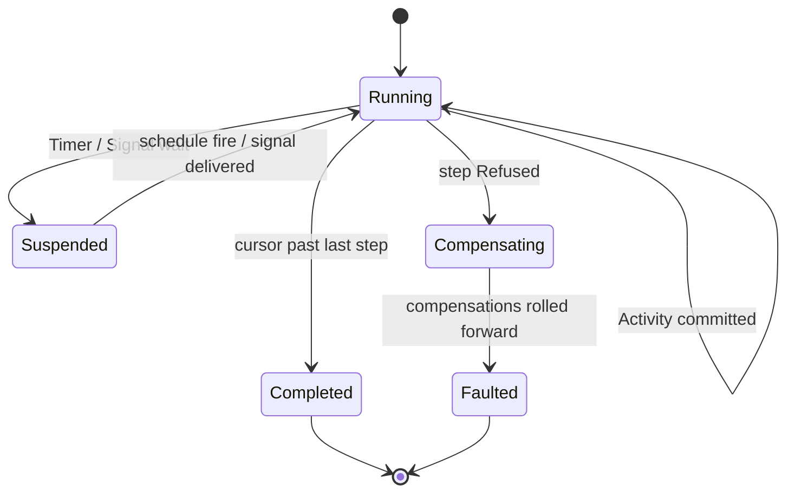

# [APPHOST_DURABLE_ORCHESTRATION]

The crash-durable workflow and persistent-job owner for the runtime spine: a `WorkflowInstance` persists as a sequence of hash-chained `EventLog` steps whose executor is the one `Agent/runtime#DISPATCH_FRONT_DOOR` `CommandDispatch.Run` — no parallel dispatcher — a five-case `StepKind` union carries activities, timers, signals, compensations, and persistent jobs, deferred work schedules as `SchedulePort` rows, and in-flight instances rehydrate from the last committed step on restart so a crash-surviving process resumes mid-saga. The page owns the workflow vocabulary, the step union, the saga compensation fold, the durable step-state seam, the crash-resume rail, and the persistent-job cadence; it consumes `CommandDispatch`/`CommandReceipt`/`CommandIntent`, `EventLog`/`LogEntry`/`ChainHash`/`DeterminismContext`, `SchedulePort`/`ScheduleEntry`/`FencingToken` (the decoded store-issued carrier), `SupportTrigger.FaultTransition` (the collapsed crash-recovery fact), `CommandAlgebra.Batch`/`CompensationOf`, `TenantContext`, `ClockPolicy`, and `ReceiptSinkPort` as settled vocabulary, DECODES the Compute assessment lifecycle at the step boundary (`Transient` re-drives bounded, `Dispatchable` parks and wakes, `Terminal` compensates), persists the durable step-state through a decode-only Persistence PORT adapter riding the coordination op-union, and mints no eighth port. Sealed law: NO parallel job-state store lands beside `ONE_FENCED_LEASE_STORE` — the executor is `CommandDispatch`, the state seam is the projected row, and the Compute sweep's landing induces no second store.

## [01]-[INDEX]

- [01]-[WORKFLOW_FAMILY]: The `WorkflowInstance` record, the five-case `StepKind` union, and the per-step disposition.
- [02]-[STEP_EXECUTOR]: One `Run` driving each step through `CommandDispatch` with timer/signal/compensation arms.
- [03]-[STEP_STATE_SEAM]: The projected wire-stable step-state row through the decode-only Persistence PORT adapter.
- [04]-[CRASH_RESUME]: Boot rehydration plus the fenced orphan-instance reclaim sweep over expired leases.
- [05]-[PERSISTENT_JOB]: Crash-durable jobs on the one `SchedulePort` cadence.
- [06]-[TS_PROJECTION]: Workflow-instance and step wire shapes the dashboard consumes.

## [02]-[WORKFLOW_FAMILY]

- Owner: `WorkflowStatus` `[SmartEnum<string>]` the instance lifecycle ladder under the `ComparerAccessors.StringOrdinal` accessor; `StepKind` `[Union]` the five durable-step shapes; `StepStatus` `[SmartEnum<string>]` the per-step disposition; `WorkflowStep` the durable step record; `WorkflowInstance` the hash-chained instance record; `OrchestrationFault` `[Union]` fault family deriving its codes through `FaultBand.Orchestration`; `AssessmentDisposition` `[SmartEnum<string>]` the DECODED boundary vocabulary of the Compute assessment outcome keys; `RetryPolicy` the bounded At-age re-drive policy row.
- Cases: instance statuses running | suspended | completed | compensating | faulted; `StepKind` = `Activity(CommandIntent Intent)` | `Timer(Instant FireAt)` | `Signal(string Channel, Option<Duration> Timeout)` | `Compensation(string ForStep, CommandIntent Intent)` | `PersistentJob(ScheduleEntry Entry)`; step statuses pending | running | committed | waiting | compensated | failed; `OrchestrationFault` = Text | StepRejected | SignalTimeout | FenceStale | ResumeBroken | HeaderOnly; `AssessmentDisposition` = dispatchable | transient | terminal — the wire keys decoded off the widened `AssessmentWire` receipt, MAPPED onto `StepStatus` at the boundary, never merged and never a re-declared Element lattice.
- Entry: `WorkflowInstance.Begin(string workflowId, Seq<WorkflowStep> plan, FencingToken fence, TenantContext tenant, Instant at)` materializes a running instance with its step plan, the decoded store-issued fence, and a genesis chain; `WorkflowInstance.Advance(WorkflowStep step, EventLog.Chain chain)` folds one committed step onto the instance, chaining the step's content digest to the predecessor.
- Auto: each `WorkflowStep` carries its `StepKind`, an attempt count, and the resume cursor (the wire-stable keys plus the step index) so a step is replayable from durable state, never a live closure; the instance's `Chain` is the `EventLog.Chain` head so a committed step's `CommandReceipt` chains into the same hash-chained log a live command chains into and the instance's integrity is the chain's tamper-evidence; a `StepKind.Timer` resolves through `SchedulePort.Next` so a durable wait is one `ScheduleEntry` row, a `StepKind.Signal` suspends the instance to `waiting` until the matching channel signal arrives or the timeout fires, and a `StepKind.PersistentJob` registers its `ScheduleEntry` so a recurring job survives restart; the saga compensation is a `StepKind.Compensation` whose `CommandIntent` rolls forward the prior step's undo through `CommandAlgebra.Batch`'s reverse-fold, never a phantom undo.
- Receipt: each step commit mints one `CommandReceipt` (the executor's own) plus one `LogEntry` (the chain advance); the instance transition rides one `SpineLog` event in the 1000-1099 EVENT stride (`FaultBand.SpineEvents`); no parallel workflow receipt beyond the `WorkflowInstance` itself.
- Packages: Rasm (kernel `ContentHash.Of`), Thinktecture.Runtime.Extensions, LanguageExt.Core, NodaTime, BCL inbox
- Growth: one step shape is one `StepKind` case breaking every executor arm at compile time; one instance status is one `WorkflowStatus` row; a new fault is one `OrchestrationFault` case; zero new surface.
- Boundary: the workflow is the only durable-orchestration owner — a bespoke saga loop, a per-workflow state machine, and a separate workflow store are the deleted forms; the executor is `CommandDispatch.Run` itself so the workflow owns the saga and step sequence while the command algebra owns the transaction, never a second dispatcher; the durable step state persists only wire-stable keys plus the resume cursor by compare-and-set, never a live closure — a `StepKind.Activity` carries a `CommandIntent` (descriptor + serialized arguments + caller modality), not a `Func`, so a step rehydrates from durable bytes; the chain is the `EventLog` on the durable `OpLog` so the workflow log and the command log are one stream, never a second event store; the compensation rolls forward through `CommandAlgebra`'s brokered, grant-metered batch so a saga undo gains no privileged execution.

```csharp signature

[SmartEnum<string>]
[KeyMemberEqualityComparer<ComparerAccessors.StringOrdinal, string>]
[KeyMemberComparer<ComparerAccessors.StringOrdinal, string>]
public sealed partial class WorkflowStatus {
    public static readonly WorkflowStatus Running = new("running");
    public static readonly WorkflowStatus Suspended = new("suspended");
    public static readonly WorkflowStatus Completed = new("completed");
    public static readonly WorkflowStatus Compensating = new("compensating");
    public static readonly WorkflowStatus Faulted = new("faulted");
}

[SmartEnum<string>]
[KeyMemberEqualityComparer<ComparerAccessors.StringOrdinal, string>]
[KeyMemberComparer<ComparerAccessors.StringOrdinal, string>]
public sealed partial class StepStatus {
    public static readonly StepStatus Pending = new("pending");
    public static readonly StepStatus Running = new("running");
    public static readonly StepStatus Committed = new("committed");
    public static readonly StepStatus Waiting = new("waiting");
    public static readonly StepStatus Compensated = new("compensated");
    public static readonly StepStatus Failed = new("failed");
}

// The five durable-step shapes: every executor arm dispatches one case. Activity and Compensation carry a
// wire-stable CommandIntent (never a live Func), Timer an instant, Signal a channel+timeout, PersistentJob
// a ScheduleEntry. A new step shape breaks every executor arm at compile time.
[Union(ConversionFromValue = ConversionOperatorsGeneration.None)]
public abstract partial record StepKind {
    private StepKind() { }
    public sealed record Activity(CommandIntent Intent) : StepKind;
    public sealed record Timer(Instant FireAt) : StepKind;
    public sealed record Signal(string Channel, Option<Duration> Timeout) : StepKind;
    public sealed record Compensation(string ForStep, CommandIntent Intent) : StepKind;
    public sealed record PersistentJob(ScheduleEntry Entry) : StepKind;
}

[Union]
public abstract partial record OrchestrationFault : Expected, IValidationError<OrchestrationFault> {
    private OrchestrationFault(string detail, int code) : base(detail, code, None) { }
    public static OrchestrationFault Create(string message) => new Text(message);
    public sealed record Text : OrchestrationFault { public Text(string detail) : base(detail, FaultBand.Orchestration.Code(0)) { } }
    public sealed record StepRejected : OrchestrationFault { public StepRejected(string detail) : base(detail, FaultBand.Orchestration.Code(1)) { } }
    public sealed record SignalTimeout : OrchestrationFault { public SignalTimeout(string detail) : base(detail, FaultBand.Orchestration.Code(2)) { } }
    public sealed record FenceStale : OrchestrationFault { public FenceStale(string detail) : base(detail, FaultBand.Orchestration.Code(3)) { } }
    public sealed record ResumeBroken : OrchestrationFault { public ResumeBroken(string detail) : base(detail, FaultBand.Orchestration.Code(4)) { } }
    public sealed record HeaderOnly : OrchestrationFault { public HeaderOnly(string detail) : base(detail, FaultBand.Orchestration.Code(5)) { } }
}

public sealed record WorkflowStep(
    string StepId,
    int Index,
    StepKind Kind,
    StepStatus Status,
    int Attempt,
    ChainHash Hash,
    Option<CommandReceipt> Receipt);

// The DECODED boundary vocabulary of the Compute assessment lifecycle: the three wire keys the widened
// AssessmentWire receipt carries, mapped onto StepStatus at the step boundary — never a re-declared
// Element lattice and never a merged status ladder.
[SmartEnum<string>]
[KeyMemberEqualityComparer<ComparerAccessors.StringOrdinal, string>]
[KeyMemberComparer<ComparerAccessors.StringOrdinal, string>]
public sealed partial class AssessmentDisposition {
    public static readonly AssessmentDisposition Dispatchable = new("dispatchable");
    public static readonly AssessmentDisposition Transient = new("transient");
    public static readonly AssessmentDisposition Terminal = new("terminal");
}

// Bounded At-age re-drive mirroring the Compute sweep's own backoff: attempts cap, backoff grows with
// the attempt ordinal, both policy values — never inline literals at the dispatch arm.
public sealed record RetryPolicy(int MaxAttempts, Duration BaseBackoff) {
    public static readonly RetryPolicy Canonical = new(MaxAttempts: 5, BaseBackoff: Duration.FromSeconds(10));
    public Duration Backoff(int attempt) => BaseBackoff * int.Min(int.Max(attempt, 1), MaxAttempts);
}

public sealed record WorkflowInstance(
    string WorkflowId,
    string InstanceId,
    WorkflowStatus Status,
    Seq<WorkflowStep> Steps,
    int Cursor,
    EventLog.Chain Chain,
    FencingToken Fence,
    TenantContext Tenant,
    Instant StartedAt) {
    public static WorkflowInstance Begin(string workflowId, Seq<WorkflowStep> plan, FencingToken fence, TenantContext tenant, Instant at) =>
        new(workflowId, $"{workflowId}:{at.ToUnixTimeTicks()}", WorkflowStatus.Running, plan, Cursor: 0, EventLog.Chain.Genesis, fence, tenant, at);

    public WorkflowInstance Advance(WorkflowStep step, EventLog.Chain chain) =>
        this with {
            Steps = Steps.Map(s => s.Index == step.Index ? step : s),
            Cursor = step.Status == StepStatus.Committed ? int.Max(Cursor, step.Index + 1) : Cursor,
            Chain = chain,
        };

    public Option<WorkflowStep> Next => Steps.Find(step => step.Index == Cursor);
}
```

## [03]-[STEP_EXECUTOR]

- Owner: `OrchestrationRuntime` the dependency record carrying the `DispatchRuntime`, the step-state seam (step rows AND signal rows — one durable adapter), the assessment decoder, the retry policy, and the schedule port; `Orchestrator` the static drive surface folding each step through `CommandDispatch.Run`.
- Entry: `Drive(OrchestrationRuntime runtime, WorkflowInstance instance)` returns `IO<WorkflowInstance>` — folds the instance's remaining steps from the resume cursor, dispatching each `StepKind` through its arm, persisting each committed step by fenced compare-and-set, and terminating on completion, a signal wait, or a fault; `Signal(OrchestrationRuntime runtime, string instanceId, string channel, JsonElement payload)` returns `IO<WorkflowInstance>` — delivers a signal to a `waiting` instance and resumes its drive from the suspended cursor.
- Auto: the executor's step dispatch is a total `StepKind.Switch` — `Activity` and `Compensation` dispatch their `CommandIntent` through `CommandDispatch.Run` so the step's transaction, grant, and cost are the command algebra's and the step chains its receipt into the instance's `EventLog`; `Timer` resolves the fire instant through `SchedulePort.Next` and suspends until the schedule cadence fires; `Signal` suspends the instance to `waiting` and reads its channel through the seam's durable signal row — a delivery persists the payload by `StepStateSeam.SignalPut` before the re-drive, so the wake-or-fault decision survives crash, resume, and peer handoff — resuming on the matching `Signal` delivery or failing `SignalTimeout` when the optional timeout elapses on a PROVEN-absent row; `PersistentJob` registers its `ScheduleEntry` on the one `SchedulePort` so the job survives restart and each occurrence drives one step; every committed step persists by `StepStateSeam.Commit` under the instance's `FencingToken` so a resumed stale instance presenting a lower token fails `FenceStale` rather than double-committing; a refused Compute-assessment step maps its DECODED disposition at the boundary — `Transient` re-drives bounded under the `RetryPolicy` At-age backoff (one self-completing `ScheduleEntry`, the attempt ordinal advancing on the durable row), `Dispatchable` PARKS the step `waiting` on its assessment channel under the two-tier wake law (fast path: the durable-drain delivery of the assessment-completed event maps to `Orchestrator.Signal(instanceId, channel)` with delivery honesty per the hop's `HopDelivery` row and dedupe by `id`=`ContentKey`; correctness path: the `SignalTimeout` `ScheduleEntry` fire re-drives the step against Compute's lifecycle-aware cache, so a meanwhile-completed assessment returns its cached verdict and a still-running one re-parks — an unbounded poll and a wake-only shape that hangs on a lost delivery are both deleted forms), and `Terminal` (or an undecodable refusal) triggers the saga — the executor folds the prior committed steps' compensations in reverse through `CommandAlgebra.Batch`'s unwind, transitioning the instance to `compensating` then `faulted`.
- Receipt: each step commit mints its `CommandReceipt` and chains its `LogEntry`; the instance's terminal status fans one `SpineLog` event; no parallel executor receipt.
- Packages: Rasm (kernel `ContentHash.Of`), LanguageExt.Core, NodaTime, Thinktecture.Runtime.Extensions, BCL inbox
- Growth: one step arm is one `StepKind.Switch` case; a new orchestration consumer drives the same `Drive`; zero new surface.
- Boundary: the executor is `CommandDispatch.Run` itself, never a second dispatcher — the workflow drives steps through the one command front door so the spine's dangling `Runtime/orchestration ⇄ CommandAlgebra` reference resolves to the named dispatch owner, and a step that executes an op directly without the front door is the deleted form; the timer and persistent-job cadence ride the one `SchedulePort` so a durable wait is a schedule row, never a per-workflow timer loop; the signal wait suspends to durable `waiting` state and the delivered payload persists as a seam signal row so a signal arriving after a crash resumes the instance, never an in-memory promise — a process-local signal map beside the seam is the deleted form; the compensation rolls forward through `CommandAlgebra.Batch` so a saga undo is the brokered, grant-metered batch the command algebra owns; each committed step's fenced persist is the single-writer correctness proof so two nodes resuming one instance cannot both commit — the lower token is rejected at `Persistence/server-tier`.

```csharp signature
public sealed record OrchestrationRuntime(
    DispatchRuntime Dispatch,
    StepStateSeam Store,
    Func<CommandReceipt, Option<AssessmentDisposition>> Assess,
    RetryPolicy Retry,
    LeaseElection.Runtime Lease,
    Func<ScheduleEntry, IO<Unit>> Schedule,
    ClockPolicy Clocks,
    ReceiptSinkPort Sink);

public static class Orchestrator {
    public static IO<WorkflowInstance> Drive(OrchestrationRuntime runtime, WorkflowInstance instance) =>
        instance.Next.Match(
            Some: step => Step(runtime, instance, step).Bind(next =>
                next.Status == WorkflowStatus.Running && next.Cursor > instance.Cursor
                    ? Drive(runtime, next)
                    : IO.pure(next)),
            None: () => Settle(runtime, instance with { Status = WorkflowStatus.Completed }));

    static IO<WorkflowInstance> Step(OrchestrationRuntime runtime, WorkflowInstance instance, WorkflowStep step) =>
        step.Kind.Switch(
            activity:     k => Dispatch(runtime, instance, step, k.Intent),
            compensation: k => Dispatch(runtime, instance, step, k.Intent),
            timer:        k => Suspend(runtime, instance, step, k.FireAt),
            signal:       k => Await(runtime, instance, step, k.Channel, k.Timeout),
            persistentJob: k => runtime.Schedule(k.Entry).Bind(_ => Commit(runtime, instance, step with { Status = StepStatus.Committed })));

    // The committed step chains its receipt into the instance EventLog and persists by fenced CAS; a refused
    // dispatch triggers the saga compensation fold in reverse over the prior committed steps.
    static IO<WorkflowInstance> Dispatch(OrchestrationRuntime runtime, WorkflowInstance instance, WorkflowStep step, CommandIntent intent) =>
        from receipt in CommandDispatch.Run(runtime.Dispatch, intent)
        from settled in receipt.Txn is CommandTxn.Committed or CommandTxn.Compensated
            ? Commit(runtime, instance, step with { Status = StepStatus.Committed, Receipt = Some(receipt), Hash = HashOf(receipt) })
            : Disposed(runtime, instance, step, receipt)
        select settled;

    // The Compute lifecycle mapped AT the boundary: the disposition key decodes off the widened
    // AssessmentWire receipt; StepStatus stays AppHost vocabulary. Transient -> bounded At-age re-drive,
    // Dispatchable -> park waiting under the two-tier wake, Terminal/undecodable -> saga unwind.
    static IO<WorkflowInstance> Disposed(OrchestrationRuntime runtime, WorkflowInstance instance, WorkflowStep step, CommandReceipt receipt) =>
        runtime.Assess(receipt).Match(
            Some: disposition => disposition.Switch(
                transient: () => step.Attempt < runtime.Retry.MaxAttempts
                    ? Redrive(runtime, instance, step with { Attempt = step.Attempt + 1, Receipt = Some(receipt) })
                    : Compensate(runtime, instance, step with { Status = StepStatus.Failed, Receipt = Some(receipt) }),
                dispatchable: () => Park(runtime, instance, step with { Receipt = Some(receipt) }),
                terminal: () => Compensate(runtime, instance, step with { Status = StepStatus.Failed, Receipt = Some(receipt) })),
            None: () => Compensate(runtime, instance, step with { Status = StepStatus.Failed, Receipt = Some(receipt) }));

    // Bounded At-age re-drive: one self-completing ScheduleEntry at the policy backoff; the attempt
    // ordinal is durable so a crash mid-backoff resumes the count, never resets it.
    static IO<WorkflowInstance> Redrive(OrchestrationRuntime runtime, WorkflowInstance instance, WorkflowStep step) =>
        runtime.Schedule(new ScheduleEntry(
                $"{instance.InstanceId}:redrive:{step.Index}:{step.Attempt}",
                new OccurrenceSpec.Every(runtime.Retry.Backoff(step.Attempt)),
                DeadlineClass.HopTotal, None,
                () => runtime.Store.Load(instance.InstanceId).Match(
                    Succ: loaded => Drive(runtime, loaded).Map(static _ => unit),
                    Fail: _ => IO.pure(unit))))
            .Bind(_ => Settle(runtime, instance with { Status = WorkflowStatus.Suspended,
                Steps = instance.Steps.Map(s => s.Index == step.Index ? step : s) }));

    // The Dispatchable park: the step waits on its assessment channel. Fast wake — the durable-drain
    // delivery maps to Signal(instanceId, channel); correctness wake — the SignalTimeout fire re-drives
    // against Compute's lifecycle-aware cache (cached verdict on completion, re-park while running).
    static IO<WorkflowInstance> Park(OrchestrationRuntime runtime, WorkflowInstance instance, WorkflowStep step) =>
        step.Kind is StepKind.Activity activity
            ? Await(runtime, instance, step, $"assessment:{activity.Intent.Descriptor}", Some(runtime.Retry.Backoff(runtime.Retry.MaxAttempts)))
            : Compensate(runtime, instance, step with { Status = StepStatus.Failed });

    static IO<WorkflowInstance> Commit(OrchestrationRuntime runtime, WorkflowInstance instance, WorkflowStep step) =>
        instance.Advance(step, runtime.Dispatch.Chain.Value) is var advanced
            ? runtime.Store.Commit(advanced, Some(step)).Match(
                Succ: _ => IO.pure(advanced),
                Fail: fault => IO.pure(advanced with { Status = WorkflowStatus.Faulted }))
            : IO.pure(instance);

    static IO<WorkflowInstance> Suspend(OrchestrationRuntime runtime, WorkflowInstance instance, WorkflowStep step, Instant fireAt) =>
        runtime.Clocks.Now >= fireAt
            ? Commit(runtime, instance, step with { Status = StepStatus.Committed })
            : runtime.Schedule(TimerEntry(runtime, instance, step, fireAt))
                .Bind(_ => Settle(runtime, instance with { Status = WorkflowStatus.Suspended }));

    // A signal wait suspends to durable `waiting`; a present channel commits immediately. A bounded wait
    // registers one SignalTimeout ScheduleEntry on the same SchedulePort the timer rides, so a signal that
    // never arrives fails the step SignalTimeout at the deadline rather than hanging — the timeout fire re-drives,
    // and the re-drive commits if the signal landed first or faults the instance on the elapsed wait.
    static IO<WorkflowInstance> Await(OrchestrationRuntime runtime, WorkflowInstance instance, WorkflowStep step, string channel, Option<Duration> timeout) =>
        runtime.Store.SignalOf(instance.InstanceId, channel).Match(Succ: static found => found.IsSome, Fail: static _ => false)
            ? Commit(runtime, instance, step with { Status = StepStatus.Committed })
            : timeout.Match(
                Some: bound => runtime.Schedule(SignalTimeoutEntry(runtime, instance, step, channel, bound)),
                None: () => IO.pure(unit))
                .Bind(_ => Settle(runtime, instance with { Status = WorkflowStatus.Suspended,
                    Steps = instance.Steps.Map(s => s.Index == step.Index ? s with { Status = StepStatus.Waiting } : s) }));

    // The signal deadline is one self-completing ScheduleEntry: on fire it re-loads the instance and, if the
    // channel still has not arrived, faults the waiting step SignalTimeout; a signal that landed first already
    // advanced the cursor so the fire is a no-op the sweep drops. The absence check is the durable seam read —
    // only a PROVEN-absent signal row faults; a read fault defers to the next wake, never a false timeout.
    static ScheduleEntry SignalTimeoutEntry(OrchestrationRuntime runtime, WorkflowInstance instance, WorkflowStep step, string channel, Duration bound) =>
        new($"{instance.InstanceId}:signal-timeout:{step.Index}",
            new OccurrenceSpec.Every(bound),
            DeadlineClass.HopTotal, None,
            () => runtime.Store.Load(instance.InstanceId).Match(
                Succ: loaded => loaded.Next.Exists(next => next.Index == step.Index)
                        && runtime.Store.SignalOf(instance.InstanceId, channel).Match(Succ: static found => found.IsNone, Fail: static _ => false)
                    ? Settle(runtime, loaded with { Status = WorkflowStatus.Faulted,
                        Steps = loaded.Steps.Map(s => s.Index == step.Index ? s with { Status = StepStatus.Failed } : s) }).Map(static _ => unit)
                    : IO.pure(unit),
                Fail: _ => IO.pure(unit)));

    // The signal-resume entry: a signal PERSISTS the channel payload as a seam signal row (SignalPut riding
    // the coordination op-union) so the wake decision survives crash, resume, and peer handoff, loads the
    // suspended instance fresh from the store (so a signal arriving on a peer node resumes the latest committed
    // state, never an in-memory promise), and re-drives from the suspended cursor — the waiting Await step now
    // finds its durable channel row present and commits; a failed persist rails ResumeBroken, never a dropped wake.
    public static IO<WorkflowInstance> Signal(OrchestrationRuntime runtime, string instanceId, string channel, JsonElement payload) =>
        from persisted in IO.lift(() => runtime.Store.SignalPut(instanceId, channel, payload))
        from loaded in IO.lift(() => persisted.Bind(_ => runtime.Store.Load(instanceId)))
        from resumed in loaded.Match(
            Succ: instance => Drive(runtime, instance),
            Fail: fault => IO.fail<WorkflowInstance>(new OrchestrationFault.ResumeBroken(instanceId)))
        select resumed;

    // Saga unwind: only Activity steps carry a CommandIntent to compensate; the runtime's CompensationOf
    // map names each activity's undo descriptor, and a committed timer/signal/job needs no compensation.
    static IO<WorkflowInstance> Compensate(OrchestrationRuntime runtime, WorkflowInstance instance, WorkflowStep failed) =>
        instance.Steps.Filter(static s => s.Status == StepStatus.Committed && s.Kind is StepKind.Activity).Rev()
            .Choose(committed => committed.Kind is StepKind.Activity a
                ? runtime.Dispatch.Command.CompensationOf(a.Intent.Descriptor).Map(undo =>
                    CommandIntent.Of(undo, a.Intent.Arguments, CallerModality.Operator))
                : Option<CommandIntent>.None)
            .TraverseM(intent => CommandDispatch.Run(runtime.Dispatch, intent))
            .As()
            .Bind(_ => Settle(runtime, instance with { Status = WorkflowStatus.Faulted,
                Steps = instance.Steps.Map(s => s.Index == failed.Index ? failed : s with { Status = s.Status == StepStatus.Committed ? StepStatus.Compensated : s.Status }) }));

    // Total settle: an instance with no committed step persists its header row — the ?? throw fallback
    // is the deleted form; absence is a projected header-only row, never an unreachable claim.
    static IO<WorkflowInstance> Settle(OrchestrationRuntime runtime, WorkflowInstance instance) =>
        runtime.Store.Commit(instance, instance.Steps.LastOrNone()).Match(
            Succ: _ => Fan(runtime, instance),
            Fail: _ => IO.pure(instance with { Status = WorkflowStatus.Faulted }));

    static IO<WorkflowInstance> Fan(OrchestrationRuntime runtime, WorkflowInstance instance) =>
        runtime.Sink.Send(Correlation.Mint(), instance.Tenant, TelemetrySource.AppHost.Key, nameof(Orchestrator),
            JsonSerializer.SerializeToElement(instance, runtime.Dispatch.Command.Wire)).Map(_ => instance);

    // Content identity composes the kernel entry — one algorithm, one seed; ChainHash is the typed
    // chain-link carrier over the kernel UInt128 digest (the local ContentHash mint is the deleted form).
    static ChainHash HashOf(CommandReceipt receipt) =>
        ChainHash.Of(ContentHash.Of(Encoding.UTF8.GetBytes(receipt.Descriptor)));

    // The deferred timer is one ScheduleEntry whose occurrence re-drives the suspended instance once the
    // fire instant passes; the re-drive's cursor check commits the timer step and advances, so the entry is
    // self-completing rather than periodic — the sweep drops it after the instance leaves Suspended.
    static ScheduleEntry TimerEntry(OrchestrationRuntime runtime, WorkflowInstance instance, WorkflowStep step, Instant fireAt) =>
        new($"{instance.InstanceId}:timer:{step.Index}",
            new OccurrenceSpec.Every(fireAt - runtime.Clocks.Now),
            DeadlineClass.HopTotal, None,
            () => runtime.Store.Load(instance.InstanceId).Match(
                Succ: loaded => Orchestrator.Drive(runtime, loaded).Map(static _ => unit),
                Fail: _ => IO.pure(unit)));
}
```



## [04]-[STEP_STATE_SEAM]

- Owner: `StepStateRow` the PROJECTED durable row of wire-stable primitives; `StepStateCodec` the encode/decode pair between the workflow records and the row; `StepStateSeam` the decode-only Persistence PORT adapter riding the coordination op-union — never an AppHost owner and never an AppHost type crossing down.
- Entry: `Commit(WorkflowInstance instance, Option<WorkflowStep> step)` projects the instance and the committed step onto one `StepStateRow` (header-only when no step exists) and drives the store's `StepStateCas` under the decoded token — the store's row-CAS predicate is the authoritative fence, a lower token rejecting store-side as the decoded `LeaseFenced` fault surfacing here as `FenceStale`; `Load(string instanceId)` reads the store's `StepStateLoad` rows and DECODES them back through `StepStateCodec.Decode` into a `WorkflowInstance` whose steps rehydrate from bytes; `InFlight(TenantContext tenant)` and `Expired(Instant now)` ride the coordination op-union READ cases (`StepStateInFlight`, `ExpiredScan`) — the crash-resume flagship's ingress, never an AppHost-side table scan; `SignalPut(string instanceId, string channel, JsonElement payload)` persists one signal row and `SignalOf(string instanceId, string channel)` reads it back — the signal WRITE/READ op-union cases (`SignalPut`, `SignalLoad`) under the same tenant fence, so the waiting step's wake-or-fault decision reads durable state after crash, resume, or peer handoff, never a process-local map.
- Auto: the row carries ONLY wire-stable primitives — instance id, workflow id, status key, cursor, step ordinal + status key, the serialized `StepKind` payload (descriptor + serialized arguments for an activity, fire instant for a timer, channel for a signal, schedule key for a job), the attempt ordinal, the chain head hex + sequence, the decoded token generation, and the tenant id — never a `WorkflowInstance`/`WorkflowStep` record and never a live closure; `Begin` persists the full plan as pending rows in one batch so rehydration reconstructs the entire instance; the durable row commits same-transaction with the transactional outbox when the step also publishes a domain event, so a step commit and its event enqueue ride one transaction boundary (`SEAM_OUTBOX_AND_WORKFLOW_PERSISTENCE_TABLE`).
- Packages: LanguageExt.Core, NodaTime, BCL inbox
- Growth: one durable step column is one field on the projected row plus its codec arms; a new read shape is one coordination op-union READ case decoded here; zero new surface.
- Boundary: the adapter is decode-only per the Persistence `[V2]` law — requests cross as this projected row of primitives, results decode from Persistence-owned types, the op-union/token/receipt shapes are Persistence's and the store is token-VALIDATING; the durable CAS store is the branch `ONE_FENCED_LEASE_STORE` leg under the `TenantId` RLS predicate, and the workflow-step dispatch registers as one keyed `OutboundHop` consumer of the branch `ONE_OUTBOX_EGRESS_SPINE` op-log rather than a second egress table (`Wire/outbox#OUTBOX_FABRIC`); a per-process workflow table that bypasses the fenced store, an AppHost record pushed down through the seam, and a second recovery store are the rejected forms; the workflow step-state row and the outbox row commit under one tenant-scoped transaction so crash-durable step resumption and exactly-once-effective delivery share one durable boundary.

```csharp signature
// The PROJECTED durable row: wire-stable primitives only. The store row is Persistence-owned; this
// projection is the AppHost-side encode and StepStateCodec.Decode the read-back.
public sealed record StepStateRow(
    string InstanceId,
    string WorkflowId,
    string StatusKey,
    int Cursor,
    int StepIndex,
    string StepStatusKey,
    string StepKindKey,
    string StepPayload,
    int Attempt,
    string ChainHead,
    long ChainSequence,
    ulong Fence,
    string TenantId);

public static class StepStateCodec {
    // Header-only projection (StepIndex -1) carries the instance transition with no step commit —
    // absence is a row shape, never an unreachable claim.
    public static StepStateRow Project(WorkflowInstance instance, Option<WorkflowStep> step) =>
        step.Match(
            Some: committed => Row(instance, committed.Index, committed.Status.Key, committed.Kind, committed.Attempt),
            None: () => Row(instance, -1, instance.Status.Key, kind: null, attempt: 0));

    public static Fin<WorkflowInstance> Decode(Seq<StepStateRow> rows) =>
        rows.HeadOrNone().ToFin(new OrchestrationFault.ResumeBroken("empty-row-set"))
            .Bind(head => rows.Filter(static row => row.StepIndex >= 0)
                .TraverseM(DecodeStep).As()
                .Map(steps => Rebuild(head, steps.OrderBy(static s => s.Index).ToSeq())));

    static StepStateRow Row(WorkflowInstance instance, int index, string stepStatus, StepKind? kind, int attempt) =>
        new(instance.InstanceId, instance.WorkflowId, instance.Status.Key, instance.Cursor,
            index, stepStatus, KindKey(kind), Payload(kind), attempt,
            instance.Chain.Head.Hex, instance.Chain.Sequence, (ulong)instance.Fence, instance.Tenant.TenantId.ToString());
    // KindKey/Payload/DecodeStep/Rebuild: the total StepKind <-> (key, payload) codec — descriptor +
    // serialized arguments | fire instant | channel + timeout | undo descriptor | schedule key.
}

// The decode-only PORT adapter: delegates bind the Persistence coordination op-union at the
// composition root (StepStateCas/SignalPut WRITE, StepStateLoad/StepStateInFlight/ExpiredScan/SignalLoad
// READ). The signal row rides the SAME seam as the step row — the wake-or-fault decision after crash,
// resume, or peer handoff reads durable state; a second signal store is the deleted form.
public sealed record StepStateSeam(
    Func<StepStateRow, Fin<Unit>> Persist,
    Func<string, Fin<Seq<StepStateRow>>> Rehydrate,
    Func<TenantContext, Fin<Seq<string>>> InFlight,
    Func<Instant, Fin<Seq<(string InstanceId, ulong LastFence)>>> Expired,
    Func<string, string, JsonElement, Fin<Unit>> SignalPut,
    Func<string, string, Fin<Option<JsonElement>>> SignalOf) {
    public Fin<Unit> Commit(WorkflowInstance instance, Option<WorkflowStep> step) =>
        Persist(StepStateCodec.Project(instance, step))
            .MapFail(static error => (Error)new OrchestrationFault.FenceStale(error.Message));

    public Fin<WorkflowInstance> Load(string instanceId) =>
        Rehydrate(instanceId).Bind(StepStateCodec.Decode);
}
```

## [05]-[CRASH_RESUME]

- Owner: `CrashResume` the static rehydrate-and-resume surface — boot-time self-recovery over the in-flight scan AND the serving-node orphan-reclaim sweep over expired leases, the AppHost mirror of the Compute orphan-recovery law: a crash-durable claim covers node DEATH, not just process reboot.
- Entry: `Resume(OrchestrationRuntime runtime, TenantContext tenant)` returns `IO<Seq<WorkflowInstance>>` — reads the durable in-flight instance ids (the coordination op-union `StepStateInFlight` READ case), loads each through the seam's decode, and re-drives each from its resume cursor, so a crash-surviving process resumes every mid-saga workflow from the last committed step; `Reclaim(OrchestrationRuntime runtime, TenantContext tenant)` returns `IO<Seq<WorkflowInstance>>` — the serving-node sweep enumerating in-flight instances whose store lease expired (`ExpiredScan` against the lease-expiry membership semantics the store already carries), re-acquiring each under a FRESH store-issued token, and re-driving from the committed cursor, while the dead holder's late advance rejects store-side as the decoded `LeaseFenced` fault — one node death never wedges a workflow forever.
- Auto: resume reads the durable cursor so a committed step is never re-executed, and a suspended `waiting`/`timer` step re-registers its signal channel or schedule row; the boot resume rides the `SupportTrigger.FaultTransition` fact — the `Runtime/lifecycle#FAULT_SPINE` `ProbeMarkers` host-crash-marker evidence and the live fault commits both arm the one collapsed fault-transition fact, so the crash-recovery reads one fault stream; the reclaim sweep registers as one `ScheduleEntry` at the maintenance cadence and runs ONLY on the reclaim-role leader elected through the `Wire/coordination#ROLE_ELECTION` rail ([V2]d — one election rail), so two serving nodes never race the same orphan and a contended re-acquire simply skips; a step whose durable cursor exceeds its plan length is a completed instance the resume settles, never a re-run.
- Receipt: each resumed or reclaimed instance fans one `SpineLog` event carrying the resume cursor and (for a reclaim) the fresh token generation; the re-drive mints the steps' own receipts; no parallel resume receipt.
- Packages: LanguageExt.Core, NodaTime, BCL inbox
- Growth: a new resume policy is one column on the resume read; a new reclaim predicate is one policy value on the sweep row; zero new surface.
- Boundary: the crash-resume is the only mid-saga recovery owner — a re-run from the start, a best-effort replay, a second recovery store, and a scan the port law forbids are the deleted forms (the sweep rides the waterfalled op-union READ cases, never an AppHost-side table scan); resume reads the durable cursor so a committed step is never re-executed, the exactly-once-step guarantee; a resumed instance carries a fresh decoded token so two processes resuming one instance cannot both commit — the stale token loses the store CAS, and the dead holder's late advance is the decoded `LeaseFenced` rejection, never a silent double-commit.

```csharp signature
public static class CrashResume {
    // Boot-time self-recovery: the tenant's in-flight scan re-drives each instance from its cursor.
    public static IO<Seq<WorkflowInstance>> Resume(OrchestrationRuntime runtime, TenantContext tenant) =>
        runtime.Store.InFlight(tenant).Match(
            Succ: ids => ids.TraverseM(id => runtime.Store.Load(id).Match(
                Succ: instance => Orchestrator.Drive(runtime, instance).Map(Some),
                Fail: _ => IO.pure(Option<WorkflowInstance>.None))).As()
                .Map(static instances => instances.Somes().ToSeq()),
            Fail: _ => IO.pure(Seq<WorkflowInstance>()));

    // The fenced orphan-instance reclaim — node DEATH, not just reboot: a serving node re-acquires each
    // expired-lease instance under a FRESH store-issued token and re-drives from the committed cursor;
    // the dead holder's late advance rejects store-side (LeaseFenced), a contended acquire skips.
    public static IO<Seq<WorkflowInstance>> Reclaim(OrchestrationRuntime runtime, TenantContext tenant) =>
        IO.lift(() => runtime.Store.Expired(runtime.Clocks.Now)).Bind(expired => expired.Match(
            Succ: orphans => orphans.TraverseM(orphan =>
                LeaseElection.Acquire(runtime.Lease, orphan.InstanceId).Match(
                    Succ: fresh => runtime.Store.Load(orphan.InstanceId).Match(
                        Succ: instance => Orchestrator.Drive(runtime, instance with { Fence = fresh }).Map(Some),
                        Fail: _ => IO.pure(Option<WorkflowInstance>.None)),
                    Fail: _ => IO.pure(Option<WorkflowInstance>.None))).As()
                .Map(static instances => instances.Somes().ToSeq()),
            Fail: _ => IO.pure(Seq<WorkflowInstance>())));
}
```

## [06]-[TS_PROJECTION]

- Owner: `WorkflowInstanceWire`, `WorkflowStepWire` — the workflow-instance and step wire shapes the orchestration dashboard ingests; the per-step `CommandReceipt`s ride the existing `Runtime/ports#TS_PROJECTION` `ReceiptEnvelopeWire`, bound here as the step's receipt payload, never re-authored.
- Packages: BCL inbox
- Growth: one wire-member row per new instance or step field; the step kind crosses as a literal-discriminated union; zero new surface.
- Boundary: the instance status and step status cross as their smart-enum string keys; the step kind reconstructs in TS as a literal-discriminated union on the kind, mirroring the `StepKind` union cases; the content hash crosses as its hex-string value-object key so the dashboard renders the workflow as a verifiable chained timeline; instants cross as extended-ISO text; the step receipt rides the existing `ReceiptEnvelopeWire` so a workflow step and an operator command render identically.

```ts contract
type WorkflowStatusKey = "running" | "suspended" | "completed" | "compensating" | "faulted";
type StepStatusKey = "pending" | "running" | "committed" | "waiting" | "compensated" | "failed";

type StepKindWire =
  | { readonly kind: "activity"; readonly descriptor: string }
  | { readonly kind: "timer"; readonly fireAt: string }
  | { readonly kind: "signal"; readonly channel: string; readonly timeout: string | null }
  | { readonly kind: "compensation"; readonly forStep: string; readonly descriptor: string }
  | { readonly kind: "persistent-job"; readonly scheduleKey: string };

interface WorkflowStepWire {
  readonly stepId: string;
  readonly index: number;
  readonly kind: StepKindWire;
  readonly status: StepStatusKey;
  readonly attempt: number;
  readonly hash: string;
}

interface WorkflowInstanceWire {
  readonly workflowId: string;
  readonly instanceId: string;
  readonly status: WorkflowStatusKey;
  readonly steps: readonly WorkflowStepWire[];
  readonly cursor: number;
  readonly startedAt: string;
}
```

## [07]-[RESEARCH]

- [STEP_STATE_RIPPLE]: the `StepStateSeam` is the decode-only `Rasm.Persistence` `ONE_FENCED_LEASE_STORE` PORT — the projected `StepStateRow` of wire-stable primitives crosses down through `StepStateCas`, the READ half rides the coordination op-union's `StepStateLoad`/`StepStateInFlight`/`ExpiredScan` cases (`Store/coordination`), and the store's fenced-token column plus the `TenantId` RLS predicate stay Persistence-owned; the workflow step-state row and the `Wire/outbox.md` transactional-outbox row commit under one tenant-scoped transaction (`SEAM_OUTBOX_AND_WORKFLOW_PERSISTENCE_TABLE`), and the workflow-step dispatch registers as one keyed `OutboundHop` consumer of the `ONE_OUTBOX_EGRESS_SPINE` op-log rather than a second egress table — the seam couples to the projected-row + op-union contract, never the store interior.
- [EXECUTOR_REFERENCE]: the executor is the `Agent/runtime#DISPATCH_FRONT_DOOR` `CommandDispatch.Run` (`Runtime/orchestration ⇄ CommandAlgebra` reference resolved), so the build order is `Agent/runtime.md` -> this page; the saga compensation rolls forward through `Agent/capability#COMMAND_ALGEBRA` `CommandAlgebra.Batch`'s unwind and the `CommandRuntime.CompensationOf` descriptor map, never a phantom undo, and the step chains its `CommandReceipt` into the `Runtime/determinism#EVENT_LOG` chain under the instance's `DeterminismContext` exactly as a reasoning transcript chains, every content digest composing the kernel `ContentHash.Of` entry with `ChainHash` the typed chain-link carrier.
- [ASSESSMENT_BOUNDARY]: the `AssessmentDisposition` keys decode off the widened `AssessmentWire` receipt (`Rasm.Compute/Runtime/receipts.md` — the Compute `[V1]` failure columns Phase/FailureKind/Transient) because the strata law forbids any `Rasm.Element` reference — the Element-owned lattice never crosses as a CLR type; `JobState` rides the lawful AppHost->Compute compose direction; the Dispatchable wake's fast path is the durable-drain delivery of the assessment-completed event (dedupe by `id`=`ContentKey`, honesty per the hop's `HopDelivery` row) mapped to `Orchestrator.Signal`, the correctness path the `SignalTimeout` re-drive resolving through Compute's lifecycle-aware cache.
- [CRASH_FACT]: the crash-resume reads the one collapsed `Runtime/lifecycle#FAULT_SPINE` `SupportTrigger.FaultTransition(FaultRecord)` fact — the live fault commits and the `ProbeMarkers` host-crash-marker boot evidence both arm the single fault-transition fact (`COLLAPSE_FAULT_SOURCE_SUPPORT_TRIGGER`), so the recovery reads one fault stream rather than a capture-delegate beside a separate trigger; the timer and persistent-job cadence ride the one `Runtime/time#SCHEDULE_PORT` so a durable wait survives restart as a `ScheduleEntry` row.
