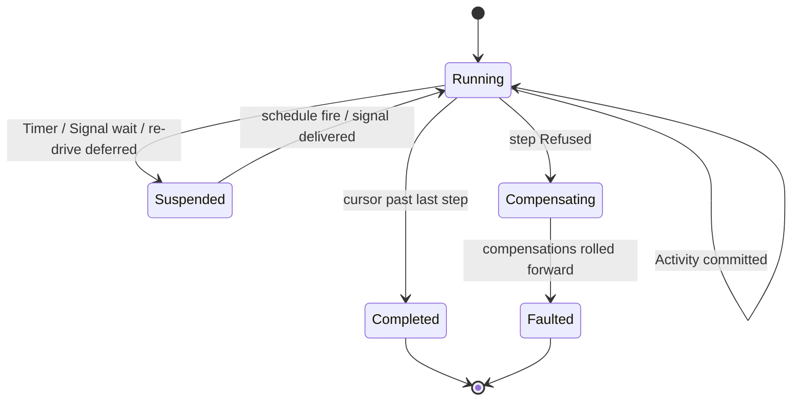

# [APPHOST_DURABLE_ORCHESTRATION]

The crash-durable workflow and persistent-job owner for the runtime spine: a `WorkflowInstance` persists as a sequence of hash-chained `EventLog` steps whose executor is the one `Agent/runtime#DISPATCH_FRONT_DOOR` `CommandDispatch.Run` — no parallel dispatcher — a five-case `StepKind` union carries activities, timers, signals, compensations, and persistent jobs, deferred work schedules as `SchedulePort` rows under one wake-key vocabulary, and in-flight instances rehydrate from the last committed step on restart so a crash-surviving process resumes mid-saga. The page owns the workflow vocabulary, the step union, the plan admission, the saga compensation fold, the durable step-state seam, the crash-resume rail, and the persistent-job cadence; it consumes `CommandDispatch`/`CommandReceipt`/`CommandIntent`, `EventLog`/`LogEntry`/`ChainHash`/`DeterminismContext`, `SchedulePort`/`ScheduleEntry`/`FencingToken` (the decoded store-issued carrier), kernel `RedrivePolicy`/`Redrive`/`Verdict`/`Retriability`, `SupportTrigger.FaultTransition` (the collapsed crash-recovery fact), `CommandAlgebra.Batch`/`CompensationOf`, `TenantContext`, `ClockPolicy`, and `ReceiptSinkPort` as settled vocabulary, DECODES the Compute assessment lifecycle at the step boundary (`Transient` re-drives on the kernel policy, `Dispatchable` parks and wakes, `Terminal` compensates), persists the durable step-state through a decode-only Persistence PORT adapter riding the coordination op-union, and mints no eighth port. Sealed law: NO parallel job-state store lands beside `ONE_FENCED_LEASE_STORE` — the executor is `CommandDispatch`, the state seam is the projected row, and the Compute sweep's landing induces no second store.

## [01]-[INDEX]

- [02]-[WORKFLOW_FAMILY]: `WorkflowInstance` record and its accumulating plan admission, the five-case `StepKind` union, the per-step status ladder, the step-refusal triage vocabulary, and the wake-key vocabulary.
- [03]-[STEP_EXECUTOR]: One `Drive` folding each step through `CommandDispatch` with timer, signal, compensation, and crash-durable persistent-job arms on the one `SchedulePort` cadence.
- [04]-[STEP_STATE_SEAM]: Projected wire-stable step-state row through the decode-only Persistence PORT adapter.
- [05]-[CRASH_RESUME]: Boot rehydration plus the fenced orphan-instance reclaim sweep over expired leases.

## [02]-[WORKFLOW_FAMILY]

- Owner: `WorkflowStatus` `[SmartEnum<string>]` the instance lifecycle ladder under the `ComparerAccessors.StringOrdinal` accessor; `StepKind` `[Union]` the five durable-step shapes; `StepStatus` `[SmartEnum<string>]` the per-step status ladder; `WakeKind` `[SmartEnum<string>]` the three deferred-wake reasons and `WakeKey` `[ValueObject<string>]` their one schedule-key mint; `WorkflowStep` the durable step record; `WorkflowInstance` the hash-chained instance record with its accumulating plan admission; `OrchestrationFault` `[Union]` fault family deriving its codes through `FaultBand.Orchestration`; `StepDisposition` `[SmartEnum<string>]` the step-refusal triage vocabulary the composition-registered `Assess` delegate decodes off the refused step's `CommandReceipt`.
- Cases: instance statuses running | suspended | completed | compensating | faulted; `StepKind` = `Activity(CommandIntent Intent)` | `Timer(Instant FireAt)` | `Signal(string Channel, Option<Duration> Timeout)` | `Compensation(string ForStep, CommandIntent Intent)` | `PersistentJob(ScheduleEntry Entry)`; step statuses pending | running | committed | waiting | compensated | failed; `WakeKind` = redrive | timer | signal-timeout; `OrchestrationFault` = StepRejected | SignalTimeout | FenceStale | ResumeBroken | HeaderOnly | PlanInvalid; `StepDisposition` = dispatchable | transient | terminal — this page's OWN triage keys, decoded by the composition-registered `Assess` delegate off the refused step's `CommandReceipt` — the Compute `AssessmentWire` receipt carries no disposition field, so these keys never ride the wire — MAPPED onto `StepStatus` at the boundary, never merged and never a re-declared Element lattice.
- Entry: `WorkflowInstance.Begin(string workflowId, Seq<WorkflowStep> plan, FencingToken fence, TenantContext tenant, Instant at)` returns `Fin<WorkflowInstance>` — ADMITS the plan (non-empty, contiguous zero-based ordinals, distinct step ids, every compensation naming a declared step) accumulating every defect at once, then materializes a running instance with its step plan, the decoded store-issued fence, and a genesis chain; `WorkflowInstance.Advance(WorkflowStep step, EventLog.Chain chain)` folds one committed step onto the instance, chaining the step's content digest to the predecessor; `WakeKey.Of(WakeKind kind, string instanceId, int index, int attempt)` is the ONE schedule-key mint the three deferred wakes read.
- Auto: each `WorkflowStep` carries its `StepKind`, an attempt count, and the resume cursor (the wire-stable keys plus the step index) so a step is replayable from durable state, never a live closure; the instance's `Chain` is the `EventLog.Chain` head so a committed step's `CommandReceipt` chains into the same hash-chained log a live command chains into, and the step's own `Hash` IS that chain link read off the dispatch head rather than a second digest minted here; a `StepKind.Timer` resolves through `SchedulePort.Next` so a durable wait is one `ScheduleEntry` row, a `StepKind.Signal` suspends the instance to `waiting` until the matching channel signal arrives or the timeout fires, and a `StepKind.PersistentJob` registers its `ScheduleEntry` so a recurring job survives restart; the saga compensation is a `StepKind.Compensation` whose `CommandIntent` rolls forward the prior step's undo through `CommandAlgebra.Batch`'s reverse-fold, never a phantom undo; the plan admission accumulates because its four clauses are INDEPENDENT — a caller learns a duplicate step id and a dangling compensation together rather than whichever the ladder tested first.
- Receipt: each step commit mints one `CommandReceipt` (the executor's own) plus one `LogEntry` (the chain advance); the instance transition rides one `SpineLog` event inside the `FaultBand.SpineEvents` stride; no parallel workflow receipt beyond the `WorkflowInstance` itself.
- Packages: Rasm (kernel `CorrelationId`/`TenantContext` vocabulary, `RedrivePolicy`), Thinktecture.Runtime.Extensions, Generator.Equals, LanguageExt.Core, NodaTime, BCL inbox
- Growth: one step shape is one `StepKind` case breaking every executor arm at compile time; one instance status is one `WorkflowStatus` row; a new deferred wake is one `WakeKind` row the key mint already formats; a new fault is one `OrchestrationFault` case; zero new surface.
- Boundary: the workflow is the only durable-orchestration owner — a bespoke saga loop, a per-workflow state machine, and a separate workflow store are the deleted forms; the executor is `CommandDispatch.Run` itself so the workflow owns the saga and step sequence while the command algebra owns the transaction, never a second dispatcher; the durable step state persists only wire-stable keys plus the resume cursor by compare-and-set, never a live closure — a `StepKind.Activity` carries a `CommandIntent` (descriptor + serialized arguments + caller modality), not a `Func`, so a step rehydrates from durable bytes; the chain is the `EventLog` on the durable `OpLog` so the workflow log and the command log are one stream, never a second event store; the compensation rolls forward through `CommandAlgebra`'s brokered, grant-metered batch so a saga undo gains no privileged execution.
- Boundary: a schedule key has ONE author — `WakeKey` carries the `wf:` head and the `{kind}:{instance}:{index}:{attempt}` body, so the three deferred wakes cannot drift into three formats and a `SchedulePort` row cannot be spelled by a site that does not hold a `WakeKind`; the re-drive key carries the ATTEMPT ordinal because each deferral is a distinct self-completing row, while the timer and signal-timeout keys carry attempt zero because a step registers exactly one of each. This is the keyed-registry key law the folder's other namespaced registries read, one head per registry.
- Boundary: the in-process re-drive LAW is the kernel's — `RedrivePolicy(Schedule Law, int Bound)` with `Redrive.Settle` answering `Deferred`/`Abandoned`/`Terminal` — so this page holds no attempt ceiling, no backoff arithmetic, and no `attempt < max` comparison; the step's durable `Attempt` ordinal is the only state, and the verdict reads it. NAMED LOSS: the retired `RetryPolicy(MaxAttempts, BaseBackoff)` multiplied a base by a clamped attempt, so its growth curve was linear and unstateable anywhere else; the policy's `Schedule` carries whatever curve it declares and the bound truncates it by derivation, which is why `StepRedrive` reads as a capped exponential rather than a multiplication. Jitter stays OFF this policy: `Schedule.jitter`/`decorrelate` draw ambient entropy unless seeded, `Runtime/determinism#DETERMINISM_KERNEL` names ambient entropy the deleted form for this folder, and a static policy value has no seed in scope — a de-correlated curve lands where the seed does or not at all.

```csharp signature
// --- [RUNTIME_PRELUDE] ----------------------------------------------------------------------
using Thinktecture;

namespace Rasm.AppHost.Runtime;

// --- [TYPES] --------------------------------------------------------------------------------
[SmartEnum<string>]
[KeyMemberEqualityComparer<ComparerAccessors.StringOrdinal, string>]
[KeyMemberComparer<ComparerAccessors.StringOrdinal, string>]
public sealed partial class WorkflowStatus {
    public static readonly WorkflowStatus Running = new("running");
    public static readonly WorkflowStatus Suspended = new("suspended");
    public static readonly WorkflowStatus Completed = new("completed");
    public static readonly WorkflowStatus Compensating = new("compensating");
    public static readonly WorkflowStatus Faulted = new("faulted");
}

[SmartEnum<string>]
[KeyMemberEqualityComparer<ComparerAccessors.StringOrdinal, string>]
[KeyMemberComparer<ComparerAccessors.StringOrdinal, string>]
public sealed partial class StepStatus {
    public static readonly StepStatus Pending = new("pending");
    public static readonly StepStatus Running = new("running");
    public static readonly StepStatus Committed = new("committed");
    public static readonly StepStatus Waiting = new("waiting");
    public static readonly StepStatus Compensated = new("compensated");
    public static readonly StepStatus Failed = new("failed");
}

[SmartEnum<string>]
[KeyMemberEqualityComparer<ComparerAccessors.StringOrdinal, string>]
public sealed partial class WakeKind {
    public static readonly WakeKind Redrive = new("redrive");
    public static readonly WakeKind Timer = new("timer");
    public static readonly WakeKind SignalTimeout = new("signal-timeout");
}

// One author for every deferred-wake schedule key: the head and the body live here, so no arm interpolates a
// registry key and a row minted for one wake reason can never collide with another's.
[ValueObject<string>(KeyMemberName = "Value")]
[KeyMemberEqualityComparer<ComparerAccessors.StringOrdinal, string>]
public sealed partial class WakeKey {
    private const string Head = "wf:";

    public static WakeKey Of(WakeKind kind, string instanceId, int index, int attempt) =>
        Create($"{Head}{kind.Key}:{instanceId}:{index}:{attempt}");
}

// The five durable-step shapes: every executor arm dispatches one case. Activity and Compensation carry a
// wire-stable CommandIntent (never a live Func), Timer an instant, Signal a channel+timeout, PersistentJob
// a ScheduleEntry.
[Union(ConversionFromValue = ConversionOperatorsGeneration.None)]
public abstract partial record StepKind {
    private StepKind() { }
    public sealed record Activity(CommandIntent Intent) : StepKind;
    public sealed record Timer(Instant FireAt) : StepKind;
    public sealed record Signal(string Channel, Option<Duration> Timeout) : StepKind;
    public sealed record Compensation(string ForStep, CommandIntent Intent) : StepKind;
    public sealed record PersistentJob(ScheduleEntry Entry) : StepKind;
}

// The step-refusal triage of the Compute assessment lifecycle: three AppHost-minted keys the registered
// Assess delegate decodes off the refused step's CommandReceipt — the AssessmentWire receipt carries no
// disposition field, so these keys never ride the wire — mapped onto StepStatus at the step boundary,
// never a re-declared Element lattice and never a merged status ladder.
[SmartEnum<string>]
[KeyMemberEqualityComparer<ComparerAccessors.StringOrdinal, string>]
[KeyMemberComparer<ComparerAccessors.StringOrdinal, string>]
public sealed partial class StepDisposition {
    public static readonly StepDisposition Dispatchable = new("dispatchable");
    public static readonly StepDisposition Transient = new("transient");
    public static readonly StepDisposition Terminal = new("terminal");
}


// Numeric identity is generated from each direct leaf's `[FaultCase]`.
[Union(ConversionFromValue = ConversionOperatorsGeneration.None)]
public abstract partial record OrchestrationFault : Fault {
    private static readonly FaultBand FamilyBand = FaultBand.Orchestration;
    private OrchestrationFault(string detail) => Detail = detail;
    public string Detail { get; }
    public sealed override string Message => Detail;


    // A refused step IS the transient class by construction: a terminal or undecodable assessment compensates
    // without ever reaching `Redrive.Settle`, so this override is what the verdict reads.
    [FaultCase(0)]
    public sealed partial record StepRejected : OrchestrationFault {
        public StepRejected(string detail) : base(detail) { }
        public override Retriability Retriability => Retriability.Transient;
    }

    [FaultCase(1)]
    public sealed partial record SignalTimeout : OrchestrationFault { public SignalTimeout(string detail) : base(detail) { } }
    [FaultCase(2)]
    public sealed partial record FenceStale(Error Cause)
        : OrchestrationFault(Cause.Message), ICausedFault;
    [FaultCase(3)]
    public sealed partial record ResumeBroken : OrchestrationFault { public ResumeBroken(string detail) : base(detail) { } }
    [FaultCase(4)]
    public sealed partial record HeaderOnly : OrchestrationFault { public HeaderOnly(string detail) : base(detail) { } }
    [FaultCase(5)]
    public sealed partial record PlanInvalid : OrchestrationFault { public PlanInvalid(string clause) : base($"<plan-invalid:{clause}>") { } }
}

// --- [MODELS] -------------------------------------------------------------------------------
public sealed record WorkflowStep(
    string StepId,
    int Index,
    StepKind Kind,
    StepStatus Status,
    int Attempt,
    ChainHash Hash,
    Option<CommandReceipt> Receipt);

// The step plan is ordinal-addressed durable state, so its equality is ORDERED — a reordered plan is a
// different workflow, and the generated comparer says so instead of a reference compare that never matches.
[Equatable]
public sealed partial record WorkflowInstance(
    string WorkflowId,
    string InstanceId,
    WorkflowStatus Status,
    [property: OrderedEquality] Seq<WorkflowStep> Steps,
    int Cursor,
    EventLog.Chain Chain,
    FencingToken Fence,
    TenantContext Tenant,
    Instant StartedAt) {
    // The plan's four clauses are independent, so admission accumulates: a caller with a duplicate id AND a
    // dangling compensation learns both at once rather than fixing one to discover the next.
    public static Fin<WorkflowInstance> Begin(
        string workflowId, Seq<WorkflowStep> plan, FencingToken fence, TenantContext tenant, Instant at) =>
        (Populated(plan), Ordered(plan), Distinct(plan), Compensable(plan))
            .Apply(static (rows, _, _, _) => rows)
            .As()
            .Map(rows => new WorkflowInstance(
                workflowId, $"{workflowId}:{at.ToUnixTimeTicks()}", WorkflowStatus.Running,
                rows, Cursor: 0, EventLog.Chain.Genesis, fence, tenant, at))
            .ToFin();

    static Validation<Error, Seq<WorkflowStep>> Populated(Seq<WorkflowStep> plan) =>
        plan.IsEmpty ? new OrchestrationFault.PlanInvalid("empty") : Validation<Error, Seq<WorkflowStep>>.Success(plan);

    // Distinct ordinals inside `[0, Count)` are contiguous by counting, so the clause needs no sort and no
    // range literal — the plan's own length is the bound.
    static Validation<Error, Unit> Ordered(Seq<WorkflowStep> plan) =>
        plan.ForAll(step => step.Index >= 0 && step.Index < plan.Count)
        && plan.Map(static step => step.Index).Distinct().Count == plan.Count
            ? Validation<Error, Unit>.Success(unit)
            : new OrchestrationFault.PlanInvalid("ordinals");

    static Validation<Error, Unit> Distinct(Seq<WorkflowStep> plan) =>
        plan.Map(static step => step.StepId).Distinct().Count == plan.Count
            ? Validation<Error, Unit>.Success(unit)
            : new OrchestrationFault.PlanInvalid("step-ids");

    // A compensation naming a step the plan never declares unwinds nothing, and the unwind fold would read
    // that absence as "no undo" rather than as the authoring defect it is.
    static Validation<Error, Unit> Compensable(Seq<WorkflowStep> plan) =>
        plan.Choose(static step => step.Kind is StepKind.Compensation undo ? Some(undo.ForStep) : None)
            .ForAll(named => plan.Exists(step => step.StepId == named))
            ? Validation<Error, Unit>.Success(unit)
            : new OrchestrationFault.PlanInvalid("compensation-target");

    public WorkflowInstance Advance(WorkflowStep step, EventLog.Chain chain) =>
        this with {
            Steps = Steps.Map(s => s.Index == step.Index ? step : s),
            Cursor = step.Status == StepStatus.Committed ? int.Max(Cursor, step.Index + 1) : Cursor,
            Chain = chain,
        };

    public Option<WorkflowStep> Next => Steps.Find(step => step.Index == Cursor);
}
```

## [03]-[STEP_EXECUTOR]

- Owner: `OrchestrationRuntime` the dependency record carrying the `DispatchRuntime`, the step-state seam (step rows AND signal rows — one durable adapter), the assessment decoder, the re-drive policy, and the schedule port; `Orchestrator` the static drive surface folding each step through `CommandDispatch.Run`.
- Entry: `Drive(OrchestrationRuntime runtime, WorkflowInstance instance)` returns `IO<WorkflowInstance>` — folds the instance's remaining steps from the resume cursor, dispatching each `StepKind` through its arm, persisting each committed step by fenced compare-and-set, and terminating on completion, a signal wait, or a fault; `Signal(OrchestrationRuntime runtime, string instanceId, string channel, JsonElement payload)` returns `IO<WorkflowInstance>` — delivers a signal to a `waiting` instance and resumes its drive from the suspended cursor; `StepRedrive` is the declared policy value both the re-drive and the park's correctness wake read.
- Auto: the executor's step dispatch is a total `StepKind.Switch` — `Activity` and `Compensation` dispatch their `CommandIntent` through `CommandDispatch.Run` so the step's transaction, grant, and cost are the command algebra's and the step chains its receipt into the instance's `EventLog`; `Timer` resolves the fire instant through `SchedulePort.Next` and suspends until the schedule cadence fires; `Signal` suspends the instance to `waiting` and reads its channel through the seam's durable signal row — a delivery persists the payload by `StepStateSeam.SignalPut` before the re-drive, so the wake-or-fault decision survives crash, resume, and peer handoff — resuming on the matching `Signal` delivery or failing `SignalTimeout` when the optional timeout elapses on a PROVEN-absent row; `PersistentJob` registers its `ScheduleEntry` on the one `SchedulePort` so the job survives restart and each occurrence drives one step; every committed step persists by `StepStateSeam.Commit` under the instance's `FencingToken` so a resumed stale instance presenting a lower token fails `FenceStale` rather than double-committing; a refused Compute-assessment step maps its DECODED disposition at the boundary — `Transient` hands the step's own durable attempt ordinal to `Redrive.Settle`, whose `Deferred` carries both the next ordinal and the delay the policy's curve produced (`Abandoned` and `Terminal` compensate, so exhaustion is a typed verdict rather than a fall-through), `Dispatchable` PARKS the step `waiting` on its assessment channel under the two-tier wake law (fast path: the durable-drain delivery of the assessment-completed event maps to `Orchestrator.Signal(instanceId, channel)` with delivery honesty per the hop's `HopDelivery` row and dedupe by `id`=`ContentKey`; correctness path: the `SignalTimeout` `ScheduleEntry` fire re-drives the step against Compute's lifecycle-aware cache, so a meanwhile-completed assessment returns its cached verdict and a still-running one re-parks — an unbounded poll and a wake-only shape that hangs on a lost delivery are both deleted forms), and `Terminal` (or an undecodable refusal) triggers the saga — the executor folds the prior committed steps' compensations in reverse through `CommandAlgebra.Batch`'s unwind, transitioning the instance to `compensating` then `faulted`, and each unwound step returns its own `CommandReceipt.Charged` vector through `Agent/capability#GRANT_BROKER` `GrantBroker.Refund` so the compensated spend leaves the tenant's ledger on the rail that took it.
- Receipt: each step commit mints its `CommandReceipt` and chains its `LogEntry`; the instance's terminal status fans one `SpineLog` event and one receipt-stream envelope carrying the SAME projected `StepStateRow` the durable seam persists, so the durable record and the observable one are one projection; no parallel executor receipt.
- Packages: Rasm (kernel `CorrelationId`/`TenantContext` vocabulary, `RedrivePolicy`/`Redrive`/`Verdict`), LanguageExt.Core, NodaTime, Thinktecture.Runtime.Extensions, BCL inbox
- Growth: one step arm is one `StepKind.Switch` case; a new orchestration consumer drives the same `Drive`; a re-drive curve edit is one `Schedule` composition at `StepRedrive`; zero new surface.
- Boundary: the executor is `CommandDispatch.Run` itself, never a second dispatcher — the workflow drives steps through the one command front door so the spine's `Runtime/orchestration ⇄ CommandAlgebra` reference resolves to the named dispatch owner, and a step that executes an op directly without the front door is the deleted form; the timer and persistent-job cadence ride the one `SchedulePort` so a durable wait is a schedule row, never a per-workflow timer loop; the signal wait suspends to durable `waiting` state and the delivered payload persists as a seam signal row so a signal arriving after a crash resumes the instance, never an in-memory promise — a process-local signal map beside the seam is the deleted form; the compensation rolls forward through `CommandAlgebra.Batch` so a saga undo is the brokered, grant-metered batch the command algebra owns, and its charge is RETURNED rather than merely stopped — this unwind is the sole producer of the store's `BudgetCredit` case, and a compensation leaving the forward debit standing is the deleted form; each committed step's fenced persist is the single-writer correctness proof so two nodes resuming one instance cannot both commit — the lower token is rejected at `Persistence/server-tier`.
- Boundary: the instance's ONLY outbound face is the projected `StepStateRow` on the receipt stream — the workflow-instance, step, and step-kind wire shapes this page once declared had no C# producer, no `tests/contracts/manifest.json` row, and no peer decoder anywhere in the estate, so they crossed nothing and are WITHDRAWN rather than left as a wire face a reader could believe in (`LAW_WITHOUT_PRODUCER`); serializing the live `WorkflowInstance` record was the same defect from the other side, since `EventLog.Chain`, `FencingToken`, and `Option<CommandReceipt>` have no wire shape at all and the fan published whatever their serializers happened to emit. A dashboard that wants the workflow lands its face as a registered family at `Runtime/ports#WIRE_LAW` with a decoder at both ends, in one pass.
- Boundary: the park's correctness wake reads the re-drive policy's LAST admitted delay — the widest interval its own curve produces — so one policy value prices both the bounded re-drive and the assessment re-probe, and the declared `Bound` is positive precisely so that wake exists; a zero-bound policy would leave the park delivery-only, which the two-tier wake law forbids.

```csharp signature
// --- [CONSTANTS] ----------------------------------------------------------------------------
public static class Orchestrator {
    // Capped exponential: the growth law is the schedule's and the ceiling is a transformer applied to it,
    // so the bound truncates the stream by derivation rather than a stored attempt ceiling beside a base.
    public static readonly RedrivePolicy StepRedrive = RedrivePolicy.Of(
        law: Schedule.exponential(Duration.FromSeconds(10)) | Schedule.maxDelay(Duration.FromMinutes(2)),
        bound: 5);

    // --- [OPERATIONS]
    public static IO<WorkflowInstance> Drive(OrchestrationRuntime runtime, WorkflowInstance instance) =>
        instance.Next.Match(
            Some: step => Step(runtime, instance, step).Bind(next =>
                next.Status == WorkflowStatus.Running && next.Cursor > instance.Cursor
                    ? Drive(runtime, next)
                    : IO.pure(next)),
            None: () => Settle(runtime, instance with { Status = WorkflowStatus.Completed }));

    static IO<WorkflowInstance> Step(OrchestrationRuntime runtime, WorkflowInstance instance, WorkflowStep step) =>
        step.Kind.Switch(
            activity:     k => Dispatch(runtime, instance, step, k.Intent),
            compensation: k => Dispatch(runtime, instance, step, k.Intent),
            timer:        k => Suspend(runtime, instance, step, k.FireAt),
            signal:       k => Await(runtime, instance, step, k.Channel, k.Timeout),
            persistentJob: k => runtime.Schedule(k.Entry).Bind(_ => Commit(runtime, instance, step with { Status = StepStatus.Committed })));

    // `Commit` seats the chain link `CommandDispatch.Run` just minted as the step's hash — read off the
    // dispatch chain head, never re-derived. A second descriptor-only digest gave one command two content
    // identities, so a step and its own log entry disagreed on what the step was.
    static IO<WorkflowInstance> Dispatch(OrchestrationRuntime runtime, WorkflowInstance instance, WorkflowStep step, CommandIntent intent) =>
        from receipt in CommandDispatch.Run(runtime.Dispatch, intent)
        from settled in receipt.Txn is CommandTxn.Committed or CommandTxn.Compensated
            ? Commit(runtime, instance, step with { Status = StepStatus.Committed, Receipt = Some(receipt), Hash = runtime.Dispatch.Chain.Value.Head })
            : Disposed(runtime, instance, step, receipt)
        select settled;

    // The Compute lifecycle mapped AT the boundary: the registered Assess delegate triages the refused
    // step's CommandReceipt into a StepDisposition; StepStatus stays AppHost vocabulary.
    static IO<WorkflowInstance> Disposed(OrchestrationRuntime runtime, WorkflowInstance instance, WorkflowStep step, CommandReceipt receipt) =>
        runtime.Assess(receipt).Match(
            Some: disposition => disposition.Switch(
                transient: () => Settled(runtime, instance, step, receipt),
                dispatchable: () => Park(runtime, instance, step with { Receipt = Some(receipt) }),
                terminal: () => Compensate(runtime, instance, step with { Status = StepStatus.Failed, Receipt = Some(receipt) })),
            None: () => Compensate(runtime, instance, step with { Status = StepStatus.Failed, Receipt = Some(receipt) }));

    // The kernel verdict owns the whole re-drive decision: the fault's own `Retriability` selects the arm, the
    // policy's curve produces the delay, and exhaustion arrives as `Abandoned` rather than as a comparison
    // this page would have to spell against a ceiling it would have to store.
    static IO<WorkflowInstance> Settled(OrchestrationRuntime runtime, WorkflowInstance instance, WorkflowStep step, CommandReceipt receipt) =>
        Redrive.Settle(runtime.Redrive, new OrchestrationFault.StepRejected(step.StepId), step.Attempt).Switch(
            deferred: verdict => Deferred(
                runtime, instance, step with { Attempt = verdict.Attempt, Receipt = Some(receipt) }, verdict.After),
            abandoned: _ => Compensate(runtime, instance, step with { Status = StepStatus.Failed, Receipt = Some(receipt) }),
            terminal: _ => Compensate(runtime, instance, step with { Status = StepStatus.Failed, Receipt = Some(receipt) }));

    // One self-completing ScheduleEntry at the verdict's own delay; the attempt ordinal is durable so a crash
    // mid-backoff resumes the count rather than resetting it.
    static IO<WorkflowInstance> Deferred(OrchestrationRuntime runtime, WorkflowInstance instance, WorkflowStep step, Duration after) =>
        runtime.Schedule(new ScheduleEntry(
                WakeKey.Of(WakeKind.Redrive, instance.InstanceId, step.Index, step.Attempt).Value,
                new OccurrenceSpec.Every(after),
                DeadlineClass.HopTotal, None, runtime.Redrive,
                () => Reloaded(runtime, instance.InstanceId)))
            .Bind(_ => Settle(runtime, instance with { Status = WorkflowStatus.Suspended,
                Steps = instance.Steps.Map(s => s.Index == step.Index ? step : s) }));

    // The Dispatchable park: the step waits on its assessment channel. Fast wake — the durable-drain delivery
    // maps to Signal(instanceId, channel); correctness wake — the policy's widest admitted delay re-drives
    // against Compute's lifecycle-aware cache.
    static IO<WorkflowInstance> Park(OrchestrationRuntime runtime, WorkflowInstance instance, WorkflowStep step) =>
        step.Kind is StepKind.Activity activity
            ? Await(runtime, instance, step, $"assessment:{activity.Intent.Descriptor}",
                runtime.Redrive.Next(int.Max(runtime.Redrive.Bound - 1, 0)))
            : Compensate(runtime, instance, step with { Status = StepStatus.Failed });

    static IO<WorkflowInstance> Commit(OrchestrationRuntime runtime, WorkflowInstance instance, WorkflowStep step) =>
        Advanced(runtime, instance.Advance(step, runtime.Dispatch.Chain.Value), step);

    static IO<WorkflowInstance> Advanced(OrchestrationRuntime runtime, WorkflowInstance advanced, WorkflowStep step) =>
        runtime.Store.Commit(advanced, Some(step)).Match(
            Succ: _ => IO.pure(advanced),
            Fail: _ => IO.pure(advanced with { Status = WorkflowStatus.Faulted }));

    static IO<WorkflowInstance> Suspend(OrchestrationRuntime runtime, WorkflowInstance instance, WorkflowStep step, Instant fireAt) =>
        runtime.Clocks.Now >= fireAt
            ? Commit(runtime, instance, step with { Status = StepStatus.Committed })
            : runtime.Schedule(TimerEntry(runtime, instance, step, fireAt))
                .Bind(_ => Settle(runtime, instance with { Status = WorkflowStatus.Suspended }));

    // A signal wait suspends to durable `waiting`; a present channel commits immediately. A bounded wait
    // registers one SignalTimeout entry on the same SchedulePort the timer rides, so a signal that never
    // arrives fails the step at the deadline rather than hanging.
    static IO<WorkflowInstance> Await(OrchestrationRuntime runtime, WorkflowInstance instance, WorkflowStep step, string channel, Option<Duration> timeout) =>
        runtime.Store.SignalOf(instance.InstanceId, channel).Match(Succ: static found => found.IsSome, Fail: static _ => false)
            ? Commit(runtime, instance, step with { Status = StepStatus.Committed })
            : timeout.Match(
                Some: bound => runtime.Schedule(SignalTimeoutEntry(runtime, instance, step, channel, bound)),
                None: () => IO.pure(unit))
                .Bind(_ => Settle(runtime, instance with { Status = WorkflowStatus.Suspended,
                    Steps = instance.Steps.Map(s => s.Index == step.Index ? s with { Status = StepStatus.Waiting } : s) }));

    // The absence check is the durable seam read — only a PROVEN-absent signal row faults; a read fault defers
    // to the next wake, never a false timeout.
    static ScheduleEntry SignalTimeoutEntry(OrchestrationRuntime runtime, WorkflowInstance instance, WorkflowStep step, string channel, Duration bound) =>
        new(WakeKey.Of(WakeKind.SignalTimeout, instance.InstanceId, step.Index, attempt: 0).Value,
            new OccurrenceSpec.Every(bound),
            DeadlineClass.HopTotal, None,
            () => runtime.Store.Load(instance.InstanceId).Match(
                Succ: loaded => loaded.Next.Exists(next => next.Index == step.Index)
                        && runtime.Store.SignalOf(instance.InstanceId, channel).Match(Succ: static found => found.IsNone, Fail: static _ => false)
                    ? Settle(runtime, loaded with { Status = WorkflowStatus.Faulted,
                        Steps = loaded.Steps.Map(s => s.Index == step.Index ? s with { Status = StepStatus.Failed } : s) }).Map(static _ => unit)
                    : IO.pure(unit),
                Fail: _ => IO.pure(unit)));

    // The suspended instance loads FIRST so a signal arriving on a peer node reads the latest committed state
    // AND its decoded fence generation; the payload then persists under that generation (a stale lease rejects
    // store-side as LeaseFenced) and the re-drive runs from the suspended cursor.
    public static IO<WorkflowInstance> Signal(OrchestrationRuntime runtime, string instanceId, string channel, JsonElement payload) =>
        from loaded in IO.lift(() => runtime.Store.Load(instanceId))
        from resumed in loaded.Match(
            Succ: instance => IO.lift(() => runtime.Store.SignalPut(instanceId, channel, instance.Fence.Value, payload))
                .Bind(persisted => persisted.Match(
                    Succ: _ => Drive(runtime, instance),
                    Fail: _ => IO.fail<WorkflowInstance>(new OrchestrationFault.ResumeBroken(instanceId)))),
            Fail: _ => IO.fail<WorkflowInstance>(new OrchestrationFault.ResumeBroken(instanceId)))
        select resumed;

    // Saga unwind: only Activity steps carry a CommandIntent to compensate, and each unwound step RETURNS its
    // own charged vector through the one broker the forward leg debited. Refund rides the STEP's receipt
    // because the charge was per command, and an absent receipt yields no unwind row rather than a forged zero.
    static IO<WorkflowInstance> Compensate(OrchestrationRuntime runtime, WorkflowInstance instance, WorkflowStep failed) =>
        instance.Steps.Filter(static s => s.Status == StepStatus.Committed && s.Kind is StepKind.Activity).Rev()
            .Choose(committed => committed.Kind is StepKind.Activity a
                ? from undo in runtime.Dispatch.Command.CompensationOf(a.Intent.Descriptor)
                  from charged in committed.Receipt.Map(static receipt => receipt.Charged)
                  select (Intent: CommandIntent.Of(undo, a.Intent.Arguments, CallerModality.Operator), Charged: charged)
                : Option<(CommandIntent Intent, MeterVector Charged)>.None)
            .TraverseM(undo => CommandDispatch.Run(runtime.Dispatch, undo.Intent)
                .Map(_ => ignore(runtime.Dispatch.Command.Broker.Refund(instance.Tenant, undo.Charged))))
            .As()
            .Bind(_ => Settle(runtime, instance with { Status = WorkflowStatus.Faulted,
                Steps = instance.Steps.Map(s => s.Index == failed.Index ? failed : s with { Status = s.Status == StepStatus.Committed ? StepStatus.Compensated : s.Status }) }));

    // Total settle: an instance with no committed step persists its header row — absence is a projected
    // header-only row, never an unreachable claim.
    static IO<WorkflowInstance> Settle(OrchestrationRuntime runtime, WorkflowInstance instance) =>
        runtime.Store.Commit(instance, instance.Steps.Last).Match(
            Succ: _ => Fan(runtime, instance),
            Fail: _ => IO.pure(instance with { Status = WorkflowStatus.Faulted }));

    // The receipt payload is the SAME projection the durable seam writes, so the observable record and the
    // stored one cannot disagree and no live record's serializer decides the wire shape.
    static IO<WorkflowInstance> Fan(OrchestrationRuntime runtime, WorkflowInstance instance) =>
        runtime.Sink.Send(Correlation.Mint(), instance.Tenant, TelemetrySource.AppHost, ReceiptKind.Orchestration.Key,
            JsonSerializer.SerializeToElement(
                StepStateCodec.Project(instance, instance.Steps.Last), runtime.Dispatch.Command.Wire)).Map(_ => instance);

    // The deferred timer is one ScheduleEntry whose occurrence re-drives the suspended instance once the fire
    // instant passes; the re-drive's cursor check commits the timer step, so the entry is self-completing.
    static ScheduleEntry TimerEntry(OrchestrationRuntime runtime, WorkflowInstance instance, WorkflowStep step, Instant fireAt) =>
        new(WakeKey.Of(WakeKind.Timer, instance.InstanceId, step.Index, attempt: 0).Value,
            new OccurrenceSpec.Every(fireAt - runtime.Clocks.Now),
            DeadlineClass.HopTotal, None,
            () => Reloaded(runtime, instance.InstanceId));

    // Every wake shares one re-entry: load the durable instance and drive it, and a load that refuses defers
    // to the next occurrence rather than faulting an instance this fire cannot even read.
    static IO<Unit> Reloaded(OrchestrationRuntime runtime, string instanceId) =>
        runtime.Store.Load(instanceId).Match(
            Succ: loaded => Drive(runtime, loaded).Map(static _ => unit),
            Fail: _ => IO.pure(unit));
}

// --- [SERVICES] -----------------------------------------------------------------------------
public sealed record OrchestrationRuntime(
    DispatchRuntime Dispatch,
    StepStateSeam Store,
    Func<CommandReceipt, Option<StepDisposition>> Assess,
    RedrivePolicy Redrive,
    LeaseElection.Runtime Lease,
    Func<ScheduleEntry, IO<Unit>> Schedule,
    ClockPolicy Clocks,
    ReceiptSinkPort Sink);
```


```mermaid
stateDiagram-v2
    accTitle: Durable workflow execution lifecycle
    accDescr: A running workflow committing activities in place, suspending on timer and signal waits, completing past its last step, and routing a refused step through compensation onto the faulted terminal.
    [*] --> Running
    Running --> Running: Activity committed
    Running --> Suspended: Timer / Signal wait / re-drive deferred
    Suspended --> Running: schedule fire / signal delivered
    Running --> Completed: cursor past last step
    Running --> Compensating: step Refused
    Compensating --> Faulted: compensations rolled forward
    Completed --> [*]
    Faulted --> [*]
```

## [04]-[STEP_STATE_SEAM]

- Owner: `StepStateRow` the PROJECTED durable row of wire-stable primitives; `StepStateCodec` the encode/decode pair between the workflow records and the row; `StepStateSeam` the decode-only Persistence PORT adapter riding the coordination op-union — never an AppHost owner and never an AppHost type crossing down.
- Entry: `Commit(WorkflowInstance instance, Option<WorkflowStep> step)` projects the instance and the committed step onto one `StepStateRow` (header-only when no step exists) and drives the store's `StepStateCas` under the decoded token — the store's row-CAS predicate is the authoritative fence, a lower token rejecting store-side as the decoded `LeaseFenced` fault surfacing here as `FenceStale`; `Load(string instanceId)` reads the store's `StepStateLoad` rows and DECODES them back through `StepStateCodec.Decode` into a `WorkflowInstance` whose steps rehydrate from bytes; `InFlight(TenantContext tenant)` and `Expired(Instant now)` ride the coordination op-union READ cases (`StepStateInFlight`, `ExpiredScan`) — the crash-resume flagship's ingress, never an AppHost-side table scan; `SignalPut(string instanceId, string channel, ulong fence, JsonElement payload)` persists one signal row under the instance's decoded lease generation and `SignalOf(string instanceId, string channel)` reads it back — the signal WRITE/READ op-union cases under the same tenant fence, so the waiting step's wake-or-fault decision reads durable state after crash, resume, or peer handoff, never a process-local map.
- Auto: the row carries ONLY wire-stable primitives — instance id, workflow id, status key, cursor, step ordinal + status key, the serialized `StepKind` payload (descriptor + serialized arguments for an activity, fire instant for a timer, channel for a signal, schedule key for a job), the attempt ordinal, the chain head hex + sequence, the decoded token generation, and the tenant id — never a `WorkflowInstance`/`WorkflowStep` record and never a live closure; `Begin` persists the full plan as pending rows in one batch so rehydration reconstructs the entire instance; the durable row commits same-transaction with the transactional outbox when the step also publishes a domain event, so a step commit and its event enqueue ride one transaction boundary (`SEAM_OUTBOX_AND_WORKFLOW_PERSISTENCE_TABLE`).
- Packages: LanguageExt.Core, NodaTime, BCL inbox
- Growth: one durable step column is one field on the projected row plus its codec arms; a new read shape is one coordination op-union READ case decoded here; zero new surface.
- Boundary: the adapter is decode-only per the Persistence `[V2]` law — requests cross as this projected row of primitives, results decode from Persistence-owned types, the op-union/token/receipt shapes are Persistence's and the store is token-VALIDATING; the store's own `WorkflowKey`/`StepKey`/`SignalKey` value objects stay on ITS side of the seam, which is exactly why these delegates take primitives; the durable CAS store is the branch `ONE_FENCED_LEASE_STORE` leg under the `TenantId` RLS predicate, and the workflow-step dispatch registers as one keyed `OutboundHop` consumer of the branch `ONE_OUTBOX_EGRESS_SPINE` op-log rather than a second egress table (`Wire/outbox#OUTBOX_FABRIC`); a per-process workflow table that bypasses the fenced store, an AppHost record pushed down through the seam, and a second recovery store are the rejected forms; the workflow step-state row and the outbox row commit under one tenant-scoped transaction so crash-durable step resumption and exactly-once-effective delivery share one durable boundary.

```csharp signature
// --- [MODELS] -------------------------------------------------------------------------------
// The PROJECTED durable row: wire-stable primitives only. The store row is Persistence-owned; this
// projection is the AppHost-side encode and StepStateCodec.Decode the read-back.
public sealed record StepStateRow(
    string InstanceId,
    string WorkflowId,
    string StatusKey,
    int Cursor,
    int StepIndex,
    string StepStatusKey,
    string StepKindKey,
    string StepPayload,
    int Attempt,
    string ChainHead,
    long ChainSequence,
    ulong Fence,
    // Wire-stable edge projection of the causal tenancy: `TenantContext.Entry` fixed-width text, so this row's
    // partition and the store's RLS predicate compare the one kernel spelling and never two renders.
    string Tenant);

// --- [OPERATIONS] ---------------------------------------------------------------------------
public static class StepStateCodec {
    // Header-only projection (StepIndex -1) carries the instance transition with no step commit —
    // absence is a row shape, never an unreachable claim.
    public static StepStateRow Project(WorkflowInstance instance, Option<WorkflowStep> step) =>
        step.Match(
            Some: committed => Row(instance, committed.Index, committed.Status.Key, committed.Kind, committed.Attempt),
            None: () => Row(instance, -1, instance.Status.Key, kind: null, attempt: 0));

    public static Fin<WorkflowInstance> Decode(Seq<StepStateRow> rows) =>
        rows.Head.ToFin(new OrchestrationFault.ResumeBroken("empty-row-set"))
            .Bind(head => rows.Filter(static row => row.StepIndex >= 0)
                .TraverseM(DecodeStep).As()
                .Map(steps => Rebuild(head, toSeq(steps.OrderBy(static s => s.Index)))));

    static StepStateRow Row(WorkflowInstance instance, int index, string stepStatus, StepKind? kind, int attempt) =>
        new(instance.InstanceId, instance.WorkflowId, instance.Status.Key, instance.Cursor,
            index, stepStatus, KindKey(kind), Payload(kind), attempt,
            instance.Chain.Head.Hex, instance.Chain.Sequence, (ulong)instance.Fence, instance.Tenant.Entry);
    // KindKey/Payload/DecodeStep/Rebuild: the total StepKind <-> (key, payload) codec — descriptor +
    // serialized arguments | fire instant | channel + timeout | undo descriptor | schedule key.
}

// --- [SERVICES] -----------------------------------------------------------------------------
// The decode-only PORT adapter: delegates bind the Persistence coordination op-union at the composition root.
// The signal row rides the SAME seam as the step row, so the wake-or-fault decision after crash, resume, or
// peer handoff reads durable state and a second signal store is the deleted form.
public sealed record StepStateSeam(
    Func<StepStateRow, Fin<Unit>> Persist,
    Func<string, Fin<Seq<StepStateRow>>> Rehydrate,
    Func<TenantContext, Fin<Seq<string>>> InFlight,
    Func<Instant, Fin<Seq<(string InstanceId, ulong LastFence)>>> Expired,
    // Signal writes carry the instance-held FENCE GENERATION: the coordination SignalPut case is a
    // token-required write whose store-side CAS refuses a stale lease.
    Func<string, string, ulong, JsonElement, Fin<Unit>> SignalPut,
    Func<string, string, Fin<Option<JsonElement>>> SignalOf) {
    public Fin<Unit> Commit(WorkflowInstance instance, Option<WorkflowStep> step) =>
        Persist(StepStateCodec.Project(instance, step))
            .MapFail(static error => (Error)new OrchestrationFault.FenceStale(error));

    public Fin<WorkflowInstance> Load(string instanceId) =>
        Rehydrate(instanceId).Bind(StepStateCodec.Decode);
}
```

## [05]-[CRASH_RESUME]

- Owner: `CrashResume` the static rehydrate-and-resume surface — boot-time self-recovery over the in-flight scan AND the serving-node orphan-reclaim sweep over expired leases, the AppHost mirror of the Compute orphan-recovery law: a crash-durable claim covers node DEATH, not just process reboot.
- Entry: `Resume(OrchestrationRuntime runtime, TenantContext tenant)` returns `IO<Seq<WorkflowInstance>>` — reads the durable in-flight instance ids (the coordination op-union `StepStateInFlight` READ case), loads each through the seam's decode, and re-drives each from its resume cursor, so a crash-surviving process resumes every mid-saga workflow from the last committed step; `Reclaim(OrchestrationRuntime runtime, TenantContext tenant)` returns `IO<Seq<WorkflowInstance>>` — the serving-node sweep enumerating in-flight instances whose store lease expired (`ExpiredScan` against the lease-expiry membership semantics the store already carries), re-acquiring each under a FRESH store-issued token, and re-driving from the committed cursor, while the dead holder's late advance rejects store-side as the decoded `LeaseFenced` fault — one node death never wedges a workflow forever.
- Auto: resume reads the durable cursor so a committed step is never re-executed, and a suspended `waiting`/`timer` step re-registers its signal channel or schedule row; the boot resume rides the `SupportTrigger.FaultTransition` fact — the `Runtime/lifecycle#FAULT_SPINE` `ProbeMarkers` host-crash-marker evidence and the live fault commits both arm the one collapsed fault-transition fact, so the crash-recovery reads one fault stream; the reclaim sweep registers as one `ScheduleEntry` at the maintenance cadence and runs ONLY on the reclaim-role leader elected through the `Wire/coordination#ROLE_ELECTION` rail, so two serving nodes never race the same orphan and a contended re-acquire simply skips; a step whose durable cursor exceeds its plan length is a completed instance the resume settles, never a re-run.
- Receipt: each resumed or reclaimed instance fans one `SpineLog` event carrying the resume cursor and (for a reclaim) the fresh token generation; the re-drive mints the steps' own receipts; no parallel resume receipt.
- Packages: LanguageExt.Core, NodaTime, BCL inbox
- Growth: a new resume policy is one column on the resume read; a new reclaim predicate is one policy value on the sweep row; zero new surface.
- Boundary: the crash-resume is the only mid-saga recovery owner — a re-run from the start, a best-effort replay, a second recovery store, and a scan the port law forbids are the deleted forms (the sweep rides the waterfalled op-union READ cases, never an AppHost-side table scan); resume reads the durable cursor so a committed step is never re-executed, the exactly-once-step guarantee; a resumed instance carries a fresh decoded token so two processes resuming one instance cannot both commit — the stale token loses the store CAS, and the dead holder's late advance is the decoded `LeaseFenced` rejection, never a silent double-commit.
- Boundary: both entries are COMPOSITION-shaped and neither runs itself — `Resume` is a boot gate on the runtime module's post-generation fold and `Reclaim` is a maintenance-cadence `ScheduleEntry` gated on the reclaim-role lease, and `Runtime/modules#MODULE_LEDGER` seats both in the same pass; a recovery surface no boot reaches is prose, which is exactly the state this anchor was in.

```csharp signature
// --- [OPERATIONS] ---------------------------------------------------------------------------
public static class CrashResume {
    // Boot-time self-recovery: the tenant's in-flight scan re-drives each instance from its cursor.
    public static IO<Seq<WorkflowInstance>> Resume(OrchestrationRuntime runtime, TenantContext tenant) =>
        runtime.Store.InFlight(tenant).Match(
            Succ: ids => ids.TraverseM(id => runtime.Store.Load(id).Match(
                Succ: instance => Orchestrator.Drive(runtime, instance).Map(Some),
                Fail: _ => IO.pure(Option<WorkflowInstance>.None))).As()
                .Map(static instances => instances.Somes().ToSeq()),
            Fail: _ => IO.pure(Seq<WorkflowInstance>()));

    // The fenced orphan-instance reclaim — node DEATH, not just reboot: a serving node re-acquires each
    // expired-lease instance under a FRESH store-issued token and re-drives from the committed cursor;
    // the dead holder's late advance rejects store-side, and a contended acquire skips.
    public static IO<Seq<WorkflowInstance>> Reclaim(OrchestrationRuntime runtime, TenantContext tenant) =>
        IO.lift(() => runtime.Store.Expired(runtime.Clocks.Now)).Bind(expired => expired.Match(
            Succ: orphans => orphans.TraverseM(orphan =>
                LeaseElection.Acquire(runtime.Lease, orphan.InstanceId).Match(
                    Succ: fresh => runtime.Store.Load(orphan.InstanceId).Match(
                        Succ: instance => Orchestrator.Drive(runtime, instance with { Fence = fresh }).Map(Some),
                        Fail: _ => IO.pure(Option<WorkflowInstance>.None)),
                    Fail: _ => IO.pure(Option<WorkflowInstance>.None))).As()
                .Map(static instances => instances.Somes().ToSeq()),
            Fail: _ => IO.pure(Seq<WorkflowInstance>())));
}
```

## [06]-[RESEARCH]

<!-- source-only: research row template:
[TOKEN]-[OPEN|BLOCKED]: <exact question>; <verification route>.
-->

(none)
