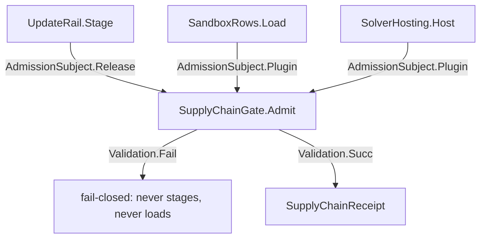

# [APPHOST_SUPPLY_CHAIN_ADMISSION]

The suite's ONE supply-chain admission owner: a single `SupplyChainGate.Admit` proves every downloaded artifact — a Velopack release asset and a plugin/companion component alike — through one offline Sigstore signature + SLSA in-toto provenance verify and one `NuGet.Versioning` `VersionRange.Satisfies` contract check before a byte stages or loads. The subject discriminates on the `AdmissionSubject` union (release | plugin), never on a second verify path; `TrustPolicy` rows carry the per-subject expected signer and version contract; the ONE `SupplyChainFault` union derives its codes through `FaultBand.SupplyChain`. Three consumers compose the gate: `Sandbox/provisioning#UPDATE_RAIL` `Stage` (release precondition), `Sandbox/isolation#ISOLATION_AXIS` `SandboxRows.Load` (plugin-artifact admission), and `Sandbox/solver#SOLVER_HOSTING` `SolverHosting.Host` (hosted-solver load) — a duplicate gate, a hand-rolled signature delegate, or a `System.Version` range split beside this owner is the deleted form.

## [01]-[INDEX]

- [01]-[ADMISSION_SUBJECTS]: One subject union — release asset and plugin artifact on one admit shape.
- [02]-[SUPPLY_CHAIN_GATE]: Offline Sigstore signature + SLSA provenance and SemVer-contract admission.

## [02]-[ADMISSION_SUBJECTS]

- Owner: `AdmissionSubject` `[Union]` the closed subject vocabulary one `Admit` discriminates on; `PluginArtifact` the candidate plugin/companion record every load path presents whole.
- Cases: Release carries the Velopack `VelopackAsset` plus its `UpdateChannel`; Plugin carries the `PluginArtifact` — component bytes, crypto digest, the cosign bundle beside the artifact, and the declared host-contract range.
- Entry: subjects construct only from real material — `PluginArtifact.From(pluginId, component, bundle, contractRange)` computes the SHA-256 verify digest and the kernel content key from the actual bytes, so an all-empty artifact is unrepresentable from the factory and a load path presenting hollow material rejects `AttestationMissing` by construction.
- Packages: Rasm (kernel `ContentHash.Of`), Velopack, Thinktecture.Runtime.Extensions, LanguageExt.Core, BCL inbox.
- Growth: a new admissible artifact kind is one `AdmissionSubject` case plus its digest/bundle/version projection arms on the gate's total dispatch; zero new surface.
- Boundary: two digests, two jobs — `Sha256` is the cryptographic digest the Sigstore verify proves (a security claim demands a cryptographic hash), while `ContentKey` is the kernel `Rasm.Domain.ContentHash.Of` identity the evidence stream, the quarantine record, and the admission cache key by (non-cryptographic, identity only) — the two never substitute; the artifact's `Der`-level parse never runs during admission — the gate reads bytes, bundle, and range only, so a malicious artifact cannot exploit the gate by executing during verify.

```csharp signature
[Union(ConversionFromValue = ConversionOperatorsGeneration.None)]
public abstract partial record AdmissionSubject {
    private AdmissionSubject() { }
    public sealed record Release(VelopackAsset Asset, UpdateChannel Channel) : AdmissionSubject;
    public sealed record Plugin(PluginArtifact Artifact) : AdmissionSubject;
}

public sealed record PluginArtifact(
    string PluginId,
    ReadOnlyMemory<byte> Component,
    Option<FileInfo> Bundle,
    string ContractRange) {
    // Real material only: From is the sole construction path and a hollow artifact cannot mint.
    public static Fin<PluginArtifact> From(string pluginId, ReadOnlyMemory<byte> component, Option<FileInfo> bundle, string contractRange) =>
        component.IsEmpty
            ? Fin.Fail<PluginArtifact>(new SupplyChainFault.AttestationMissing(pluginId))
            : Fin.Succ(new PluginArtifact(pluginId, component, bundle, contractRange));

    // Both digests derive from Component — spoof-proof: the Sigstore-verified SHA-256 and the kernel content
    // identity recompute from the bytes, never a caller-supplied field the gate could be tricked into trusting.
    public string Sha256 => Convert.ToHexStringLower(SHA256.HashData(Component.Span));
    public string ContentKey => ContentHash.Of(Component.Span).ToString("x32");
}
```

## [03]-[SUPPLY_CHAIN_GATE]

- Owner: `SupplyChainFault` `[Union]` fault family deriving its codes through `FaultBand.SupplyChain`; `SupplyChainReceipt` the admit-evidence record; `TrustPolicy` the per-subject expected-signer plus version-contract policy; `SupplyChainGate` the static admit surface whose `Admit` is the named statement carve-out, with the nested `Runtime` binding the one offline `SigstoreVerifier`, the policy resolver, the staging directory, and the host contract version.
- Cases: `SupplyChainFault` = Text | BundleMissing | SignatureRejected | ProvenanceUnbound | VersionIncompatible | TrustRootUnavailable | AttestationMissing — one case per admit-rejection cause.
- Entry: `Admit(SupplyChainGate.Runtime gate, AdmissionSubject subject, CancellationToken token)` returns `IO<Validation<SupplyChainFault, SupplyChainReceipt>>` — one total dispatch projects the subject's digest bytes, cosign bundle, version pair, and `TrustPolicy` row, verifies the Sigstore signature and SLSA provenance offline against the pinned trust root through `SigstoreVerifier.TryVerifyDigestAsync`, and decides the version contract with `VersionRange.Satisfies`; the signature leg and the version leg accumulate applicatively so a subject that is both forged AND out-of-contract reports both faults in one pass.
- Auto: the `Admit` runs BEFORE any stage or load commits — `UpdateRail.Stage` branches on the admit `Validation` minting `RolledBack` on a fault, `SandboxRows.Load` never materializes an isolation boundary for a rejected artifact, and `SolverHosting` never projects a rejected solver's descriptors; the trust anchor is the offline `FileTrustRootProvider(pinnedTrustedRootJson)` so the verify path performs NO network call and the gate is hermetic; `SigstoreVerifier.TryVerifyDigestAsync` is the non-throwing ROP mirror returning `(bool Success, VerificationResult? Result)` — a `VerificationException` never escapes the domain — and reuses the subject's already-computed SHA-256 rather than re-reading the artifact stream; the expected signer is the `VerificationPolicy.CertificateIdentity` built once via `CertificateIdentity.ForGitHubActions(owner, repository)`, so an empty-identity verify that asserts only cryptographic integrity is the rejected form; the DSSE/in-toto provenance leg reads `VerificationResult.Statement` (`InTotoStatement`) and binds its `Subject` digest to the admitted artifact so one verify proves signature AND build provenance; the version leg parses through `NuGetVersion.TryParse` and decides with `VersionRange.Satisfies` — the real SemVer-2.0 contract check `System.Version` cannot express — with a parse failure on either boundary failing closed as `VersionIncompatible`; a release subject checks the channel contract range against the release version, a plugin subject checks the artifact's declared `ContractRange` against the host contract version — one `Satisfies` law, the pair projected per subject case.
- Receipt: `SupplyChainReceipt` — subject key, verified signer SAN, in-toto predicate type, admitted version string, the kernel content key, `Instant`; the verified signer is the trusted-publisher principal `Agent/capability#GRANT_BROKER` may treat as a privileged artifact source, and the receipt rides the consumer's own receipt correlation (`UpdateReceipt` for a release, `SandboxReceipt` for a plugin), never a parallel admit instrument.
- Packages: Sigstore, NuGet.Versioning, Rasm (kernel `ContentHash.Of`), Thinktecture.Runtime.Extensions, LanguageExt.Core, NodaTime, BCL inbox.
- Growth: one verify threshold is one `VerificationPolicy` column (`TransparencyLogThreshold`, `RequireSignedCertificateTimestamps`); one subject's expected signer is one `TrustPolicy` row; a managed-key (non-Fulcio) feed is the `VerificationPolicy.PublicKey` column; a new attestation predicate is one policy column, never an `Attestation` record variant; zero new surface.
- Boundary: the gate is the suite's only supply-chain admit owner — a `System.Version`-based semver check, a hand-split `lower-upper` range string, a hand-rolled `Verify` delegate over pinned publisher keys, a throwing `Parse` in the admission fold, an unsigned-release install, a trust-on-first-use path, a post-load signature check, and a network-bound verify on an air-gapped node are all deleted forms — both the self-update release and a downloaded plugin/companion artifact verify through this one `Admit`, never two verify paths; `vpk`-side build-time notarization is distinct — the build signs and this gate proves what was actually downloaded; the `TufTrustRootProvider` network anchor is admitted only on a connected node and rides the `Wire/outbound` `Polly.Core` pipeline, while the `FileTrustRootProvider` removes that dependency for a hermetic gate, so the trust-root fetch is the only outbound leg and the verify itself is offline; the version leg admits only the version/range/comparer surface — package-graph resolution and framework compatibility stay out of scope, the contract is one `VersionRange.Satisfies` membership test, and `FindBestMatch` selects the newest in-range candidate when a feed offers several.

```csharp signature
// --- [ERRORS] ---------------------------------------------------------------------------
[Union]
public abstract partial record SupplyChainFault : Expected, IValidationError<SupplyChainFault> {
    private SupplyChainFault(string detail, int code) : base(detail, code, None) { }
    public static SupplyChainFault Create(string message) => new Text(message);
    public sealed record Text : SupplyChainFault { public Text(string detail) : base(detail, FaultBand.SupplyChain.Code(0)) { } }
    public sealed record BundleMissing : SupplyChainFault { public BundleMissing(string detail) : base(detail, FaultBand.SupplyChain.Code(1)) { } }
    public sealed record SignatureRejected : SupplyChainFault { public SignatureRejected(string detail) : base(detail, FaultBand.SupplyChain.Code(2)) { } }
    public sealed record ProvenanceUnbound : SupplyChainFault { public ProvenanceUnbound(string detail) : base(detail, FaultBand.SupplyChain.Code(3)) { } }
    public sealed record VersionIncompatible : SupplyChainFault { public VersionIncompatible(string detail) : base(detail, FaultBand.SupplyChain.Code(4)) { } }
    public sealed record TrustRootUnavailable : SupplyChainFault { public TrustRootUnavailable(string detail) : base(detail, FaultBand.SupplyChain.Code(5)) { } }
    public sealed record AttestationMissing : SupplyChainFault { public AttestationMissing(string detail) : base(detail, FaultBand.SupplyChain.Code(6)) { } }
}

// --- [MODELS] ---------------------------------------------------------------------------
public readonly record struct SupplyChainReceipt(string Subject, string Signer, string Provenance, string Version, string ContentKey, Instant At);

// --- [OPERATIONS] -----------------------------------------------------------------------
public static class SupplyChainGate {
    public sealed record TrustPolicy(VerificationPolicy Verification, VersionRange ContractRange);
    public sealed record Runtime(SigstoreVerifier Verifier, Func<AdmissionSubject, TrustPolicy> PolicyOf, DirectoryInfo Staging, string HostContractVersion);

    public static IO<Validation<SupplyChainFault, SupplyChainReceipt>> Admit(Runtime gate, AdmissionSubject subject, CancellationToken token) =>
        Project(gate, subject).Match(
            Succ: probe =>
                from loaded in IO.liftAsync(async () => await SigstoreBundle.LoadAsync(probe.Bundle, token))
                from verified in IO.liftAsync(async () => await gate.Verifier.TryVerifyDigestAsync(
                    probe.Digest, HashAlgorithmType.Sha256, loaded, probe.Policy.Verification, token))
                from at in IO.lift(() => DateTimeOffset.UtcNow)
                select (Signature(verified, probe.Subject), Version(probe.Contract, probe.Candidate, probe.Subject))
                    .Apply((signer, version) => new SupplyChainReceipt(
                        probe.Subject, signer.Signer.SubjectAlternativeName, signer.Provenance, version.ToNormalizedString(), probe.ContentKey, Instant.FromDateTimeOffset(at)))
                    .As(),
            Fail: fault => IO.pure<Validation<SupplyChainFault, SupplyChainReceipt>>(Fail(fault)));

    // One subject projection: digest bytes, cosign bundle, the (contract, candidate) version pair, the
    // policy row, and the evidence identity — total over the union, so a new artifact kind is one arm.
    sealed record Probe(string Subject, byte[] Digest, FileInfo Bundle, VersionRange Contract, string Candidate, TrustPolicy Policy, string ContentKey);
    static Fin<Probe> Project(Runtime gate, AdmissionSubject subject) => subject.Switch(
        release: found => Bundle(gate.Staging, found.Asset.FileName)
            .ToFin(new SupplyChainFault.BundleMissing(found.Asset.FileName))
            .Map(bundle => new Probe(
                found.Asset.FileName, Convert.FromHexString(found.Asset.SHA256), bundle,
                gate.PolicyOf(subject).ContractRange, found.Asset.Version.ToString(), gate.PolicyOf(subject), found.Asset.SHA256)),
        plugin: held => held.Artifact.Component.IsEmpty
            ? Fin.Fail<Probe>(new SupplyChainFault.AttestationMissing(held.Artifact.PluginId))
            : held.Artifact.Bundle
                .ToFin(new SupplyChainFault.BundleMissing(held.Artifact.PluginId))
                .Bind(bundle => VersionRange.TryParse(held.Artifact.ContractRange, out var declared)
                    ? Fin.Succ(new Probe(
                        held.Artifact.PluginId, Convert.FromHexString(held.Artifact.Sha256), bundle,
                        declared!, gate.HostContractVersion, gate.PolicyOf(subject), held.Artifact.ContentKey))
                    : Fin.Fail<Probe>(new SupplyChainFault.VersionIncompatible(held.Artifact.ContractRange))));

    // Signature leg: a passing TryVerify carries a VerifiedIdentity AND the decoded in-toto SLSA statement;
    // the provenance Subject binds the attested artifact, so signature and build-provenance pass as one.
    static Validation<SupplyChainFault, (VerifiedIdentity Signer, string Provenance)> Signature((bool Success, VerificationResult? Result) verified, string subject) =>
        verified is { Success: true, Result.SignerIdentity: { } signer }
            ? verified.Result.Statement is { PredicateType: { } predicate }
                ? Success<SupplyChainFault, (VerifiedIdentity, string)>((signer, predicate))
                : Fail<SupplyChainFault, (VerifiedIdentity, string)>(new SupplyChainFault.ProvenanceUnbound(subject))
            : Fail<SupplyChainFault, (VerifiedIdentity, string)>(new SupplyChainFault.SignatureRejected(verified.Result?.FailureReason ?? subject));

    // Version leg: parse through NuGetVersion (real SemVer-2.0) and decide with VersionRange.Satisfies —
    // a parse failure or an out-of-contract version fails closed, matching the gate's posture.
    static Validation<SupplyChainFault, NuGetVersion> Version(VersionRange contract, string candidate, string subject) =>
        NuGetVersion.TryParse(candidate, out var version) && contract.Satisfies(version)
            ? Success<SupplyChainFault, NuGetVersion>(version)
            : Fail<SupplyChainFault, NuGetVersion>(new SupplyChainFault.VersionIncompatible($"{candidate} ∉ {contract.PrettyPrint()} ({subject})"));

    static Option<FileInfo> Bundle(DirectoryInfo staging, string fileName) =>
        new FileInfo(Path.Combine(staging.FullName, $"{fileName}.sigstore.json")) is { Exists: true } file ? Some(file) : None;
}
```



## [04]-[RESEARCH]

- [TRUST_ANCHOR]: the pinned `trusted_root.json` the `FileTrustRootProvider` loads and the expected `CertificateIdentity.ForGitHubActions(owner, repository)` signer settle against the actual release-signing identity once the `vpk` build pipeline publishes the cosign bundle (`*.sigstore.json`) beside each release asset; the `SupplyChainGate.Runtime.Staging` directory is the Velopack packages dir the `UpdateManager` downloads into, where `Bundle` resolves the per-asset bundle file; a plugin/companion artifact carries its bundle beside the component at its own resolve root. The connected-node `TufTrustRootProvider` with a `CustomTrustedRoot` + local cache is the online anchor variant; the air-gapped node pins the offline `FileTrustRootProvider` so the verify path is fully hermetic.
- [CONTRACT_RANGE]: the per-channel `VersionRange` contract on `TrustPolicy` settles against the host's plugin/release compatibility window — `stable` admits the broadest stable range, `canary` admits the floating prerelease range — resolved once the release-versioning policy is fixed; a plugin's declared `ContractRange` inverts the pair (the range is the plugin's, the candidate is the host contract version); `VersionRange.FindBestMatch` selects the newest in-range release when a feed offers several candidates.
