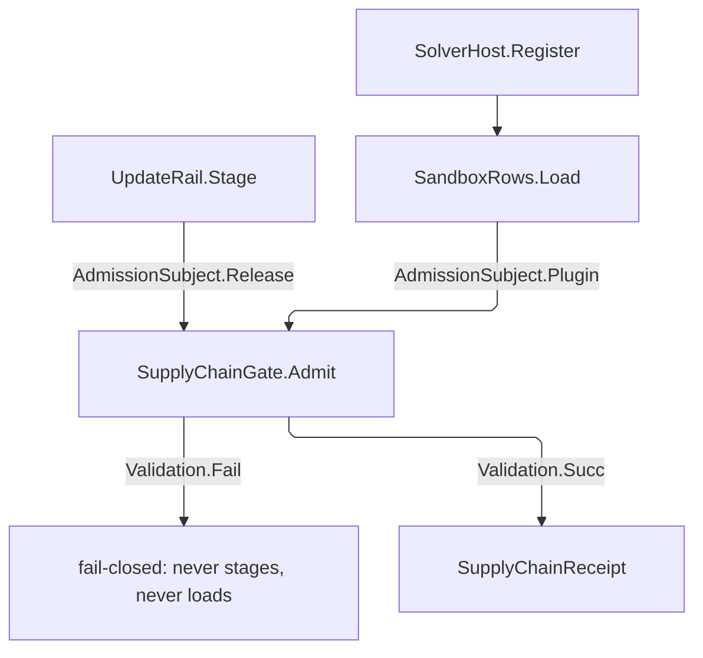

# [APPHOST_SUPPLY_CHAIN_ADMISSION]

Suite-wide supply-chain admission owner: one `SupplyChainGate.Admit` proves every downloaded artifact — a Velopack release asset and a plugin/companion component alike — through one offline Sigstore signature and SLSA in-toto provenance verify, and one `NuGet.Versioning` `VersionRange.Satisfies` contract check before a byte stages or loads. Subject discrimination rides the `AdmissionSubject` union (release | plugin), never a second verify path; `TrustPolicy` rows carry the per-subject expected signer and version contract; the ONE `SupplyChainFault` union rides the kernel `[FaultCase]`/`Fault` floor — `[FaultCase]` realizes the registry over `FaultBand.SupplyChain` and `Code` derive SEALED.

`Sandbox/provisioning#UPDATE_RAIL` `Stage` and `Sandbox/isolation#ISOLATION_AXIS` `SandboxRows.Load` are the two fences that compose the gate — the release precondition and the plugin-artifact admission. `Sandbox/solver#SOLVER_HOSTING` reaches it THROUGH that load rather than directly, so hosted solvers add a caller and not a third crossing. Settled composition: `ContentHash.Of`/`.Hex`/`.Admit`, `IValidityEvidence`/`ValidityClaim`, `Fault`/`FaultBand`/`Op` from Rasm/Domain; `UpdateChannel` from Sandbox/provisioning#CHANNEL_AXIS; `ClockPolicy` from Runtime/time. Duplicate gates, hand-rolled signature delegates, and a `System.Version` range split beside this owner are the deleted forms.

## [01]-[INDEX]

- [02]-[ADMISSION_SUBJECTS]: One subject union — release asset and plugin artifact on one admit shape, both constructible only from real material.
- [03]-[SUPPLY_CHAIN_GATE]: Offline Sigstore signature, SLSA provenance, and SemVer-contract admission over an admitted trust anchor.

## [02]-[ADMISSION_SUBJECTS]

- Owner: `AdmissionSubject` `[Union]` the closed subject vocabulary one `Admit` discriminates on; `PluginArtifact` `[ComplexValueObject]` the candidate plugin/companion record every load path presents whole.
- Cases: Release carries the Velopack `VelopackAsset` with its `UpdateChannel`; Plugin carries the `PluginArtifact` — component bytes, crypto digest, the cosign bundle beside the artifact, and the declared host-contract range.
- Entry: `PluginArtifact.Admit(pluginId, component, bundle, contractRange)` is the fallible construction path, lowering generated factory evidence once through the kernel acceptance bridge.
- Law: sole construction holds STRUCTURALLY, where a plain `record` published its positional constructor beside the factory and left the prose invariant resting on caller discipline while the gate carried a dead re-guard nothing fires; `[ComplexValueObject]` with `ValidateFactoryArguments` makes the hollow state unconstructible and the re-guard deletes. NAMED LOSS: `with`-expression construction, which no call site used.
- Law: two digests, two jobs. `Sha256` is the cryptographic digest the Sigstore verify proves — a security claim demands a cryptographic hash — while `ContentKey` is the non-cryptographic kernel `ContentHash` identity the evidence stream, the quarantine record, and the admission cache all key on. Neither substitutes, and the gate proves it by resolving the identity per subject arm off that arm's own material rather than reusing whichever digest the verify already held.
- Law: `ContentKey` renders through kernel `ContentHash.Hex`, so the thirty-two-lowercase-character format has ONE author and a reader re-admits the same text through `ContentHash.Admit`, which REFUSES uppercase. Two sites spelling `ToString("x32")` is one convention with two authors.
- Law: artifact equality is IDENTITY-shaped and states so — `ReadOnlyMemory<byte>` compares by pointer, offset, and length, so two artifacts carrying byte-identical components from different buffers read unequal. Every cache, dedup, and quarantine lookup keys on `ContentKey`, which is the value identity, and never on the artifact itself.
- Packages: Rasm (kernel `ContentHash`), Velopack, Thinktecture.Runtime.Extensions, LanguageExt.Core, BCL inbox
- Growth: a new admissible artifact kind is one `AdmissionSubject` case with its digest, bundle, and version projection arms on the gate's total dispatch; zero new surface.
- Boundary: the artifact's `Der`-level parse never runs during admission — the gate reads bytes, bundle, and range only, so a malicious artifact cannot exploit the gate by executing during verify; the component bytes ride as `ReadOnlyMemory<byte>` and are read twice at most (once for the crypto digest, once for the content key), never staged to a second buffer.

```csharp signature
// --- [TYPES] --------------------------------------------------------------------------------
[Union(ConversionFromValue = ConversionOperatorsGeneration.None)]
public abstract partial record AdmissionSubject {
    private AdmissionSubject() { }
    public sealed record Release(VelopackAsset Asset, UpdateChannel Channel) : AdmissionSubject;
    public sealed record Plugin(PluginArtifact Artifact) : AdmissionSubject;
}

// --- [MODELS] -------------------------------------------------------------------------------
// Real material only, and now BY CONSTRUCTION: the prior plain `record` published its positional constructor
// beside a `From` factory the prose called "the sole construction path", so the invariant rested on caller
// discipline and the gate carried a re-guard for the hollow state that discipline was supposed to forbid.
// Both digests derive from `Component` — the Sigstore-verified SHA-256 and the kernel content identity
// recompute from the bytes, never a caller-supplied field the gate could be tricked into trusting.
[ComplexValueObject]
[ValidationError]
public sealed partial class PluginArtifact {
    public string PluginId { get; }
    public ReadOnlyMemory<byte> Component { get; }
    public Option<FileInfo> Bundle { get; }
    public string ContractRange { get; }

    public string Sha256 => Convert.ToHexStringLower(SHA256.HashData(Component.Span));

    public string ContentKey => ContentHash.Hex(ContentHash.Of(Component.Span));

    public static Fin<PluginArtifact> Admit(
        string pluginId, ReadOnlyMemory<byte> component, Option<FileInfo> bundle, string contractRange) =>
        Op.Of().AcceptValidated<PluginArtifact>(
            fault: Validate(pluginId, component, bundle, contractRange, out PluginArtifact? admitted),
            admitted: admitted);

    static partial void ValidateFactoryArguments(
        ref ValidationError? error, ref string pluginId, ref ReadOnlyMemory<byte> component,
        ref Option<FileInfo> bundle, ref string contractRange) =>
        error = component.IsEmpty || string.IsNullOrWhiteSpace(pluginId)
            ? new ValidationError(string.Join(" | ", new object?[] { pluginId }))
            : null;
}
```

## [03]-[SUPPLY_CHAIN_GATE]

- Owner: `SupplyChainFault` `[Union]` the fault family riding the kernel `[FaultCase]`/`Fault` floor (`[FaultCase]` realizes the registry over `FaultBand.SupplyChain`); `SupplyChainReceipt` the admit-evidence record implementing the kernel `IValidityEvidence` fold over its two clocks; `TrustPolicy` the per-subject expected-signer and version-contract policy; `TrustAnchor` `[Union]` naming the two anchors a composition may seat; `SupplyChainGate` the static admit surface, with the nested `Runtime` binding the `SigstoreVerifier` that anchor selects, the policy resolver, the Velopack staging directory the update rail downloads into, the host contract version, and the one `ClockPolicy`.
- Cases: `SupplyChainFault` = BundleMissing | BundleUnreadable | SignatureRejected | ProvenanceUnbound | VersionIncompatible | TrustRootUnavailable | AttestationMissing — one case per admit-rejection cause; `TrustAnchor` = `PinnedCase(FileInfo)` | `TufCase(Uri, TufTrustRootProviderOptions)` — the offline pin and the TUF repository, one provider each.
- Entry: `Runtime.Of(TrustAnchor anchor, Func<AdmissionSubject, TrustPolicy> policyOf, DirectoryInfo staging, string hostContractVersion, ClockPolicy clocks)` returns `Fin<Runtime>` — the composition-time admit of the trust anchor itself, switching the anchor case onto `FileTrustRootProvider` or `TufTrustRootProvider` and binding the one verifier over it; `Admit(Runtime gate, AdmissionSubject subject, CancellationToken token)` returns `IO<Validation<Error, SupplyChainReceipt>>` — one total dispatch projecting the subject's digest bytes, cosign bundle, version pair, and `TrustPolicy` row, reading the admitted material once, verifying signature and SLSA provenance offline against the pinned root through `SigstoreVerifier.TryVerifyDigestAsync`, and deciding the version contract with `VersionRange.Satisfies`; `Best(TrustPolicy policy, Option<NuGetVersion> installed, Seq<NuGetVersion> candidates)` returns `Validation<Error, NuGetVersion>` — the candidate-ranking entry the sandbox module fold binds inside `SolverHostRuntime.Resolve` at `Runtime/modules#MODULE_LEDGER`, which ranks a manifest's in-range candidates through it before the resolved artifact is presented as `AdmissionSubject.Plugin`.
- Law: the signature leg and the version leg accumulate applicatively, so a subject both forged AND out-of-contract reports both faults in one pass; this is the folder's model applicative and the shape `Sandbox/solver#PLUGIN_CONTRACT` copies.
- Law: `TrustRootUnavailable` has a producing arm at the COMPOSITION seam, where the fact lives — binding the verifier is what reads the pinned root, so an absent or unreadable anchor refuses at construction rather than at the first admit, and a case declared for a cause no arm raises is the deleted form. NAMED LOSS: the fault no longer reaches the per-admit `Validation` — a host whose anchor is gone never composes a gate to admit through. `TufCase` seats its repository at that same instant and resolves the root itself on first verify, because a fetch inside a composition fold is a network round trip at boot; its hermetic form carries `TufTrustRootProviderOptions.CustomTrustedRoot`, which resolves without leaving the node.
- Law: `Admit` runs BEFORE any stage or load commits — `UpdateRail.Stage` branches on the admit `Validation` minting `RolledBack` on a fault, and `SandboxRows.Load` never materializes an isolation vehicle for a rejected artifact.
- Law: `SigstoreVerifier.TryVerifyDigestAsync` is the non-throwing ROP mirror returning `(bool Success, VerificationResult? Result)`, and only the RESULT crosses into the domain: the tuple's bool is subsumed by the `SignerIdentity is { }` pattern the signature leg already tests, so an admitted foreign shape stops at the boundary and never becomes an internal parameter type.
- Law: a refused verify reports what the verify SAID or that it said nothing. `verified.Result?.FailureReason ?? subject` renamed the subject as its own rejection reason, so an operator read "rejected because <artifact name>" for a verifier that reported no reason at all.
- Law: the bundle LOAD rails, where a malformed or truncated `*.sigstore.json` threw out of the effect unhandled while `BundleMissing` covered absence alone; the two demand different operator acts — re-publish a corrupted bundle, fetch a missing one — so `BundleUnreadable` carries the parse refusal.
- Law: the expected signer is the `VerificationPolicy.CertificateIdentity` built once through `CertificateIdentity.ForGitHubActions(owner, repository)`, so an empty-identity verify that asserts only cryptographic integrity is the rejected form; the DSSE/in-toto provenance leg reads `VerificationResult.Statement` and binds its `Subject` digest to the admitted artifact, so one verify proves signature AND build provenance.
- Law: the version leg parses through `NuGetVersion.TryParse` and decides with `VersionRange.Satisfies` — the real SemVer-2.0 contract check `System.Version` cannot express — over the range's PINNED projection, since a floating band and a pinned candidate otherwise compare on two grammars; a parse failure on either boundary fails closed as `VersionIncompatible`, and a boundary parse never crosses as a null-forgiven local.
- Law: the version pair INVERTS per subject — a release checks its version against the channel's admitted range, a plugin parses its declared `ContractRange` through the floating-aware overload and checks the host's version against it — which is why the contract rides the probe rather than the policy. One `Satisfies` law, projected per subject case.
- Law: the content key is `ContentHash.Of` over the material BOTH arms read — the plugin's component in hand, the release's staged package off the staging directory — so no arm substitutes its verify digest for the identity.
- Receipt: `SupplyChainReceipt` — subject key, verified signer SAN, in-toto predicate type, admitted version string, the kernel content key, the earliest attested `VerifiedTimestamp` instant, and the admitting `Instant`. Signer and provenance columns are AUDIT evidence an operator reads: no grant arm treats a signer as a privileged artifact source today, so the receipt states the identity rather than asserting a privilege nothing grants. Evidence rides the consumer's own correlation (`UpdateReceipt` for a release, `SandboxReceipt` for a plugin), never a parallel admit instrument.
- Packages: Sigstore, NuGet.Versioning, Rasm (kernel `ContentHash`/`IValidityEvidence`/`ValidityClaim`/`Op`), Thinktecture.Runtime.Extensions, LanguageExt.Core, NodaTime, BCL inbox
- Growth: one verify threshold is one `VerificationPolicy` column; one subject's expected signer is one `TrustPolicy` row; a new trust anchor — an embedded `InMemoryTrustRootProvider` root, say — is one `TrustAnchor` case and one arm on the `Of` switch; a managed-key (non-Fulcio) feed is the `VerificationPolicy.PublicKey` column; a new attestation predicate is one policy column, never an `Attestation` record variant; zero new surface.
- Boundary: the gate is the suite's only supply-chain admit owner — a `System.Version`-based semver check, a hand-split `lower-upper` range string, a hand-rolled `Verify` delegate over pinned publisher keys, a throwing `Parse` inside the admission fold, an unsigned-release install, a trust-on-first-use path, a post-load signature check, and a network-bound verify on an air-gapped node are deleted forms, and both the self-update release and a downloaded plugin artifact verify through this one `Admit`; `vpk`-side build-time notarization is distinct — the build signs and this gate proves what the host downloaded; the anchor is a `TrustAnchor` case the composition seats and `Runtime.Of` switches, never a prose alternative beside a hardcoded provider — `TufCase` is admitted only on a connected node and its root fetch rides the `Wire/outbound` `Polly.Core` pipeline, `PinnedCase` pins the offline root for a hermetic air-gapped gate, and the provider each case mints is owned for the composition's life, so the trust-root fetch is the only outbound leg, it happens once, and the verify itself is offline; the version leg admits only the version, range, and comparer surface — package-graph resolution and framework compatibility stay out of scope, and the contract is one `VersionRange.Satisfies` membership test; candidate ranking is `Best` and lives HERE rather than at each resolver, because a feed resolver and a registry resolver each picking their own newest are two policies for one contract — its consumer is the `SolverHostRuntime.Resolve` closure the sandbox module fold binds at `Runtime/modules#MODULE_LEDGER`, which ranks its in-range candidates through `Best` before presenting `AdmissionSubject.Plugin`, and the release arm's ranking is Velopack's own `CheckForUpdatesAsync`, an SDK-internal selection this gate cannot narrow and therefore names as the one declared divergence rather than claiming a policy it does not own; the admitting instant is `ClockPolicy.Now` and never an ambient `DateTimeOffset.UtcNow`.

```csharp signature
// --- [ERRORS] ---------------------------------------------------------------------------
[Union(ConversionFromValue = ConversionOperatorsGeneration.None)]
public abstract partial record SupplyChainFault : Fault {
    private static readonly FaultBand FamilyBand = FaultBand.SupplyChain;
    private SupplyChainFault(string detail) => Detail = detail;
    public string Detail { get; }
    public sealed override string Message => Detail;

    [FaultCase(0)]
    public sealed partial record BundleMissing : SupplyChainFault { public BundleMissing(string detail) : base(detail) { } }
    [FaultCase(1)]
    public sealed partial record SignatureRejected : SupplyChainFault { public SignatureRejected(string detail) : base(detail) { } }
    [FaultCase(2)]
    public sealed partial record ProvenanceUnbound : SupplyChainFault { public ProvenanceUnbound(string detail) : base(detail) { } }
    [FaultCase(3)]
    public sealed partial record VersionIncompatible : SupplyChainFault { public VersionIncompatible(string detail) : base(detail) { } }
    [FaultCase(4)]
    public sealed partial record TrustRootUnavailable : SupplyChainFault { public TrustRootUnavailable(string detail) : base(detail) { } }
    [FaultCase(5)]
    public sealed partial record AttestationMissing : SupplyChainFault { public AttestationMissing(string detail) : base(detail) { } }
    // Absence and corruption demand different operator acts — fetch the bundle, or re-publish it — so the
    // parse refusal a bare `LoadAsync` threw past the rail carries its own case.
    [FaultCase(6)]
    public sealed partial record BundleUnreadable(string Subject, Error Cause)
        : SupplyChainFault($"{Subject}: {Cause.Message}"), ICausedFault;
}

// --- [TYPES] --------------------------------------------------------------------------------
// Anchors are a CHOICE the composition makes, not a file path with a network story told beside it: a connected
// node resolves and refreshes the root through TUF, an air-gapped one pins the `trusted_root.json` it was
// shipped with, and the TUF options' own `CustomTrustedRoot` makes even that arm hermetic against a mirror.
// Taking a bare `FileInfo` admitted the pinned arm alone while the boundary asserted both, which left the
// network anchor a claim no composition reached. Seating stays TOP-LEVEL so the composition root names its
// case in one hop, while `Runtime` and `TrustPolicy` stay nested as the gate's own interior.
[Union(ConversionFromValue = ConversionOperatorsGeneration.None)]
public abstract partial record TrustAnchor {
    private TrustAnchor() { }
    public sealed record PinnedCase(FileInfo Root) : TrustAnchor;
    public sealed record TufCase(Uri Repository, TufTrustRootProviderOptions Options) : TrustAnchor;
}

// --- [MODELS] -------------------------------------------------------------------------------
// Two instants, two authorities: `Attested` is the signer's own RFC-3161 or SCT stamp and rides an Option
// because a policy requiring no signed timestamp produces none, while `At` is when THIS host admitted. A
// receipt carrying only the host read cannot answer how old a signature was when it passed. `Attested` tails
// that list carrying `= default`, since the suite's `OmitAbsent` modifier drops an absent `Option<T>` at write and a
// slot without a default reads back wire-required under `RespectRequiredConstructorParameters`.
public readonly record struct SupplyChainReceipt(
    string Subject, string Signer, string Provenance, string Version, string ContentKey, Instant At, Option<Instant> Attested = default) : IValidityEvidence {
    // Two clocks bound one fact, so the receipt checks them against each other: a signature attested in this
    // host's FUTURE is either a skewed node or a forged stamp, and it is the one incoherence a fold sees that
    // neither leg could — the verify proved the timestamp against its own authority and the host clock proved
    // nothing. The oracle probes this ahead of any category default, so an incoherent admission is refused at
    // acceptance rather than read back later as proof of a release nobody signed when it claims.
    [JsonIgnore]
    public bool IsValid => ValidityClaim.All(
        !string.IsNullOrEmpty(Signer),
        !string.IsNullOrEmpty(Provenance),
        !string.IsNullOrEmpty(ContentKey),
        Attested.Match(Some: stamp => stamp <= At, None: static () => true)).Holds;
}

// --- [OPERATIONS] ---------------------------------------------------------------------------
public static class SupplyChainGate {
    public sealed record TrustPolicy(VerificationPolicy Verification, VersionRange ContractRange);

    public sealed record Runtime(
        SigstoreVerifier Verifier,
        Func<AdmissionSubject, TrustPolicy> PolicyOf,
        DirectoryInfo Staging,
        string HostContractVersion,
        ClockPolicy Clocks) {
        // Anchors admit ONCE, where the fact lives: binding the verifier is what seats the root, so a host
        // whose pinned `trusted_root.json` is absent or unreadable refuses at composition instead of composing
        // a gate whose every admit would fail for a reason the per-admit rail had no arm to name. The TUF arm
        // seats its repository at the same instant and resolves the root itself on first verify, that fetch
        // being the one anchor cost no composition fold can pay without a network round trip inside it.
        public static Fin<Runtime> Of(
            TrustAnchor anchor, Func<AdmissionSubject, TrustPolicy> policyOf,
            DirectoryInfo staging, string hostContractVersion, ClockPolicy clocks) =>
            Op.Of().Catch(() => anchor.Switch(
                    pinnedCase: static row => row.Root is { Exists: true }
                        ? Fin.Succ<ITrustRootProvider>(new FileTrustRootProvider(row.Root))
                        : Fin.Fail<ITrustRootProvider>(new SupplyChainFault.TrustRootUnavailable(row.Root.FullName)),
                    tufCase: static row => Fin.Succ<ITrustRootProvider>(new TufTrustRootProvider(row.Repository, row.Options)))
                .Map(provider => new Runtime(
                    new SigstoreVerifier(provider, null), policyOf, staging, hostContractVersion, clocks)))
                .Bind(static admitted => admitted);
    }

    public static IO<Validation<Error, SupplyChainReceipt>> Admit(Runtime gate, AdmissionSubject subject, CancellationToken token) =>
        Project(gate, subject).Match(
            Succ: probe =>
                from identity in ContentKey(gate, subject, token)
                from loaded in Bundle(probe, token)
                from verified in loaded.Match(
                    Succ: bundle => IO.liftAsync(async () => Optional((await gate.Verifier.TryVerifyDigestAsync(
                        probe.Digest, HashAlgorithmType.Sha256, bundle, probe.Policy.Verification, token)).Result)),
                    Fail: _ => IO.pure(Option<VerificationResult>.None))
                select (loaded.ToValidation(), Signature(verified, probe.Subject), Version(probe.Contract, probe.Candidate, probe.Subject))
                    .Apply((_bundle, signer, version) => new SupplyChainReceipt(
                        probe.Subject, signer.Signer.SubjectAlternativeName, signer.Provenance, version.ToNormalizedString(),
                        identity, gate.Clocks.Now, Attested(verified)))
                    .As(),
            Fail: fault => IO.pure<Validation<Error, SupplyChainReceipt>>(Fail(fault)));

    // Malformed bundles are a PARSE refusal and absent ones a fetch refusal; the bare `LoadAsync` threw the
    // first past the rail entirely while `BundleMissing` named only the second.
    static IO<Fin<SigstoreBundle>> Bundle(Probe probe, CancellationToken token) =>
        IO.liftAsync(async () => (await Op.Of().Catch(
                async execution => Fin.Succ(await SigstoreBundle.LoadAsync(probe.Bundle, execution)), token))
            .MapFail(error => (Error)new SupplyChainFault.BundleUnreadable(probe.Subject, error)));

    // Each arm answers the kernel identity from its OWN material — the artifact derives it off the component it
    // holds, and a release folds it once over the staged package the rail downloaded. Keeping the two disjoint
    // is the whole point: the release arm previously seated its Sigstore SHA-256 here, so one subject kind
    // silently substituted a cryptographic digest for the identity the evidence stream, the quarantine record,
    // and the admission cache all key on, while the other passed the real one.
    static IO<string> ContentKey(Runtime gate, AdmissionSubject subject, CancellationToken token) => subject.Switch(
        state: gate,
        release: static (host, found) => IO.liftAsync(async () => ContentHash.Hex(ContentHash.Of(
            await File.ReadAllBytesAsync(Path.Combine(host.Staging.FullName, found.Asset.FileName), token)))),
        plugin: static (_, held) => IO.pure(held.Artifact.ContentKey));

    // Attested instants are the SIGNER's, not the host's: an RFC-3161 authority or a transparency-log SCT
    // says when the artifact was actually signed, where a host clock says only when this process looked. It
    // rides an Option because a policy requiring no signed timestamp produces none, and a zero or a
    // host-substituted stamp there would read as attestation nobody performed.
    static Option<Instant> Attested(Option<VerificationResult> verified) =>
        verified.Map(static result => toSeq(result.VerifiedTimestamps).Map(static stamp => Instant.FromDateTimeOffset(stamp.Timestamp)))
            .IfNone(Seq<Instant>())
            .Fold(Option<Instant>.None, static (earliest, stamp) => earliest.Filter(held => held <= stamp).IfNone(stamp));

    // One subject projection: digest bytes, cosign bundle, the (contract, candidate) version pair, and the
    // policy row — total over the union, so a new artifact kind is one arm. The pair INVERTS per subject: a
    // release checks its version against the channel's admitted range, a plugin checks the host's version
    // against the range the plugin declares, which is why the contract rides the probe rather than the policy.
    sealed record Probe(string Subject, byte[] Digest, FileInfo Bundle, VersionRange Contract, string Candidate, TrustPolicy Policy);

    static Fin<Probe> Project(Runtime gate, AdmissionSubject subject) => subject.Switch(
        state: gate,
        release: (host, found) => Staged(host.Staging, found.Asset.FileName)
            .ToFin(new SupplyChainFault.BundleMissing(found.Asset.FileName))
            .Map(bundle => Released(host.PolicyOf(subject), found, bundle)),
        // Hollow-artifact re-guards DELETE with the value object: `ValidateFactoryArguments` refuses an
        // empty component at the only construction path, so the state this arm re-tested cannot exist.
        plugin: (host, held) => held.Artifact.Bundle
            .ToFin(new SupplyChainFault.BundleMissing(held.Artifact.PluginId))
            // Only the floating-aware overload admits a `1.2.*` plugin contract at all; the
            // two-argument form parses it as a pinned range and refuses every prerelease the band covers.
            .Bind(bundle => Declared(held.Artifact.ContractRange).Map(declared => new Probe(
                held.Artifact.PluginId, Convert.FromHexString(held.Artifact.Sha256), bundle,
                declared, host.HostContractVersion, host.PolicyOf(subject)))));

    // Boundary parses cross on the rail, never as a null-forgiven local: `declared!` asserted a value the
    // `out` contract does not guarantee on the arm where the parse failed.
    static Fin<VersionRange> Declared(string range) =>
        VersionRange.TryParse(range, allowFloating: true, out VersionRange? declared)
            ? Optional(declared).ToFin(new SupplyChainFault.VersionIncompatible(range))
            : Fin.Fail<VersionRange>(new SupplyChainFault.VersionIncompatible(range));

    // One policy resolution per subject, not two on one line: `PolicyOf` is a composition-bound lookup and
    // calling it twice for the range and again for the row is the same read priced twice.
    static Probe Released(TrustPolicy policy, AdmissionSubject.Release found, FileInfo bundle) =>
        new(found.Asset.FileName, Convert.FromHexString(found.Asset.SHA256), bundle,
            policy.ContractRange, found.Asset.Version.ToString(), policy);

    // Signature leg: a passing verify carries a `VerifiedIdentity` AND the decoded in-toto SLSA statement, and
    // and its provenance `Subject` binds the attested artifact so signature and build provenance pass as one. The
    // SDK's `bool Success` never crosses — the `SignerIdentity is { }` pattern below subsumes it, so a foreign
    // tuple stops at the boundary instead of becoming an internal parameter type.
    static Validation<Error, (VerifiedIdentity Signer, string Provenance)> Signature(Option<VerificationResult> verified, string subject) =>
        verified.Match(
            Some: result => result switch {
                { SignerIdentity: { } signer, Statement.PredicateType: { } predicate } =>
                    Success<Error, (VerifiedIdentity, string)>((signer, predicate)),
                { SignerIdentity: { } } => Fail<Error, (VerifiedIdentity, string)>(new SupplyChainFault.ProvenanceUnbound(subject)),
                // Null reasons and stated ones are different facts: coalescing to the subject name made the
                // artifact its own rejection reason on every verify that reported none.
                _ => Fail<Error, (VerifiedIdentity, string)>(new SupplyChainFault.SignatureRejected(
                    Optional(result.FailureReason).IfNone($"{subject}: verifier reported no reason"))),
            },
            None: () => Fail<Error, (VerifiedIdentity, string)>(new SupplyChainFault.SignatureRejected(subject)));

    // Version leg: parse through `NuGetVersion` (real SemVer-2.0) and decide with `VersionRange.Satisfies`
    // against the PINNED projection of the contract — a floating range carries a snapshot band its own
    // membership test reads differently from a pinned candidate, so `ToNonSnapshotRange` puts policy and
    // candidate on one grammar before the comparison. A parse failure or an out-of-contract version fails
    // closed, matching the posture.
    static Validation<Error, NuGetVersion> Version(VersionRange contract, string candidate, string subject) =>
        NuGetVersion.TryParse(candidate, out NuGetVersion? version) && Pinned(contract).Satisfies(version)
            ? Success<Error, NuGetVersion>(version)
            : Fail<Error, NuGetVersion>(new SupplyChainFault.VersionIncompatible($"{candidate} ∉ {contract.PrettyPrint()} ({subject})"));

    // Candidate ranking belongs to the GATE, not to whichever resolver holds a listing: a plugin registry
    // offering several in-range versions and picking its own newest is a second policy for one contract.
    // `FindBestMatch` resolves the newest the range admits and `IsBetter` is the pairwise preference the
    // installed version is held against, so a re-resolve never regresses what is already running. Each of the
    // three refusal causes names ITSELF — one message for "nothing in range", "nothing better than installed",
    // and a floating range's own band left an operator reading which of the three had fired.
    public static Validation<Error, NuGetVersion> Best(TrustPolicy policy, Option<NuGetVersion> installed, Seq<NuGetVersion> candidates) =>
        Pinned(policy.ContractRange).FindBestMatch(candidates) switch {
            null => Fail<Error, NuGetVersion>(new SupplyChainFault.VersionIncompatible(
                $"{Band(policy)}: no candidate in range")),
            { } best when installed.Match(Some: held => Pinned(policy.ContractRange).IsBetter(held, best), None: static () => true) =>
                Success<Error, NuGetVersion>(best),
            { } best => Fail<Error, NuGetVersion>(new SupplyChainFault.VersionIncompatible(
                $"{Band(policy)}: {best.ToNormalizedString()} does not improve on {installed.Map(static held => held.ToNormalizedString()).IfNone("<none>")}")),
        };

    static string Band(TrustPolicy policy) =>
        policy.ContractRange.IsFloating
            ? $"{policy.ContractRange.PrettyPrint()} float {policy.ContractRange.Float}"
            : policy.ContractRange.PrettyPrint();

    static VersionRange Pinned(VersionRange contract) =>
        contract.IsFloating ? contract.ToNonSnapshotRange() : contract;

    static Option<FileInfo> Staged(DirectoryInfo staging, string fileName) =>
        new FileInfo(Path.Combine(staging.FullName, $"{fileName}.sigstore.json")) is { Exists: true } file ? Some(file) : None;
}
```


```mermaid
---
config:
  layout: elk
  flowchart:
    curve: linear
    padding: 25
---
flowchart TD
    accTitle: Supply-chain admission gate
    accDescr: Release staging and sandbox plugin loads entering one admission gate, with hosted solvers reaching it through the sandbox load, whose failure arm never stages or loads and whose success arm seals a supply-chain receipt.
    Release[UpdateRail.Stage] -->|AdmissionSubject.Release| Admit[SupplyChainGate.Admit]
    Solver[SolverHost.Register] --> Plugin[SandboxRows.Load]
    Plugin -->|AdmissionSubject.Plugin| Admit
    Admit -->|Validation.Fail| Closed[fail-closed: never stages, never loads]
    Admit -->|Validation.Succ| Proven[SupplyChainReceipt]
```

## [04]-[RESEARCH]

<!-- source-only: research row template:
[TOKEN]-[OPEN|BLOCKED]: <exact question>; <verification route>.
-->

(none)
