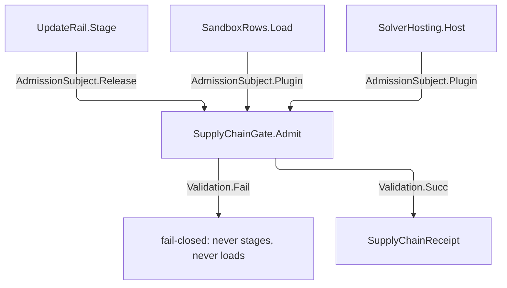

# [APPHOST_SUPPLY_CHAIN_ADMISSION]

The suite's ONE supply-chain admission owner: a single `SupplyChainGate.Admit` proves every downloaded artifact — a Velopack release asset and a plugin/companion component alike — through one offline Sigstore signature + SLSA in-toto provenance verify and one `NuGet.Versioning` `VersionRange.Satisfies` contract check before a byte stages or loads. The subject discriminates on the `AdmissionSubject` union (release | plugin), never on a second verify path; `TrustPolicy` rows carry the per-subject expected signer and version contract; the ONE `SupplyChainFault` union derives its codes through `FaultBand.SupplyChain`. Three consumers compose the gate: `Sandbox/provisioning#UPDATE_RAIL` `Stage` (release precondition), `Sandbox/isolation#ISOLATION_AXIS` `SandboxRows.Load` (plugin-artifact admission), and `Sandbox/solver#SOLVER_HOSTING` `SolverHosting.Host` (hosted-solver load) — a duplicate gate, a hand-rolled signature delegate, or a `System.Version` range split beside this owner is the deleted form.

## [01]-[INDEX]

- [02]-[ADMISSION_SUBJECTS]: One subject union — release asset and plugin artifact on one admit shape.
- [03]-[SUPPLY_CHAIN_GATE]: Offline Sigstore signature + SLSA provenance and SemVer-contract admission.

## [02]-[ADMISSION_SUBJECTS]

- Owner: `AdmissionSubject` `[Union]` the closed subject vocabulary one `Admit` discriminates on; `PluginArtifact` the candidate plugin/companion record every load path presents whole.
- Cases: Release carries the Velopack `VelopackAsset` plus its `UpdateChannel`; Plugin carries the `PluginArtifact` — component bytes, crypto digest, the cosign bundle beside the artifact, and the declared host-contract range.
- Entry: subjects construct only from real material — `PluginArtifact.From(pluginId, component, bundle, contractRange)` computes the SHA-256 verify digest and the kernel content key from the actual bytes, so an all-empty artifact is unrepresentable from the factory and a load path presenting hollow material rejects `AttestationMissing` by construction.
- Packages: Rasm (kernel `ContentHash.Of`), Velopack, Thinktecture.Runtime.Extensions, LanguageExt.Core, BCL inbox.
- Growth: a new admissible artifact kind is one `AdmissionSubject` case plus its digest/bundle/version projection arms on the gate's total dispatch; zero new surface.
- Boundary: two digests, two jobs — `Sha256` is the cryptographic digest the Sigstore verify proves (a security claim demands a cryptographic hash), while `ContentKey` is the non-cryptographic kernel `Rasm.Domain.ContentHash.Of` identity the evidence stream, the quarantine record, and the admission cache all key on — the two never substitute, and the gate proves it by resolving the identity per subject arm off that arm's own material rather than reusing whichever digest the verify already held; the artifact's `Der`-level parse never runs during admission — the gate reads bytes, bundle, and range only, so a malicious artifact cannot exploit the gate by executing during verify.

```csharp signature
[Union(ConversionFromValue = ConversionOperatorsGeneration.None)]
public abstract partial record AdmissionSubject {
    private AdmissionSubject() { }
    public sealed record Release(VelopackAsset Asset, UpdateChannel Channel) : AdmissionSubject;
    public sealed record Plugin(PluginArtifact Artifact) : AdmissionSubject;
}

public sealed record PluginArtifact(
    string PluginId,
    ReadOnlyMemory<byte> Component,
    Option<FileInfo> Bundle,
    string ContractRange) {
    // Real material only: From is the sole construction path and a hollow artifact cannot mint.
    public static Fin<PluginArtifact> From(string pluginId, ReadOnlyMemory<byte> component, Option<FileInfo> bundle, string contractRange) =>
        component.IsEmpty
            ? Fin.Fail<PluginArtifact>(new SupplyChainFault.AttestationMissing(pluginId))
            : Fin.Succ(new PluginArtifact(pluginId, component, bundle, contractRange));

    // Both digests derive from Component — spoof-proof: the Sigstore-verified SHA-256 and the kernel content
    // identity recompute from the bytes, never a caller-supplied field the gate could be tricked into trusting.
    public string Sha256 => Convert.ToHexStringLower(SHA256.HashData(Component.Span));
    public string ContentKey => ContentHash.Of(Component.Span).ToString("x32");
}
```

## [03]-[SUPPLY_CHAIN_GATE]

- Owner: `SupplyChainFault` `[Union]` fault family deriving its codes through `FaultBand.SupplyChain`; `SupplyChainReceipt` the admit-evidence record implementing the kernel `IValidityEvidence` fold over its two clocks; `TrustPolicy` the per-subject expected-signer plus version-contract policy; `SupplyChainGate` the static admit surface whose `Admit` is the named statement carve-out, with the nested `Runtime` binding the one offline `SigstoreVerifier`, the policy resolver, the Velopack packages staging directory the update rail downloads into (where `Bundle` resolves each release asset's cosign bundle and `ContentKey` folds the staged package's kernel identity), the host contract version, and the one `ClockPolicy`.
- Cases: `SupplyChainFault` = Text | BundleMissing | SignatureRejected | ProvenanceUnbound | VersionIncompatible | TrustRootUnavailable | AttestationMissing — one case per admit-rejection cause.
- Entry: `Admit(SupplyChainGate.Runtime gate, AdmissionSubject subject, CancellationToken token)` returns `IO<Validation<SupplyChainFault, SupplyChainReceipt>>` — one total dispatch projects the subject's digest bytes, cosign bundle, version pair, and `TrustPolicy` row, reads the admitted material once, verifies the Sigstore signature and SLSA provenance offline against the pinned trust root through `SigstoreVerifier.TryVerifyDigestAsync`, and decides the version contract with `VersionRange.Satisfies`; the signature leg and the version leg accumulate applicatively so a subject that is both forged AND out-of-contract reports both faults in one pass; `Best(TrustPolicy policy, Option<NuGetVersion> installed, Seq<NuGetVersion> candidates)` returns `Validation<SupplyChainFault, NuGetVersion>` — the candidate-ranking entry a release feed or plugin registry resolves through before it presents a subject at all.
- Auto: the `Admit` runs BEFORE any stage or load commits — `UpdateRail.Stage` branches on the admit `Validation` minting `RolledBack` on a fault, `SandboxRows.Load` never materializes an isolation boundary for a rejected artifact, and `SolverHosting` never projects a rejected solver's descriptors; the trust anchor is the offline `FileTrustRootProvider(pinnedTrustedRootJson)` so the verify path performs NO network call and the gate is hermetic; `SigstoreVerifier.TryVerifyDigestAsync` is the non-throwing ROP mirror returning `(bool Success, VerificationResult? Result)` — a `VerificationException` never escapes the domain — and reuses the subject's already-computed SHA-256 rather than re-reading the artifact stream; the expected signer is the `VerificationPolicy.CertificateIdentity` built once via `CertificateIdentity.ForGitHubActions(owner, repository)`, so an empty-identity verify that asserts only cryptographic integrity is the rejected form; the DSSE/in-toto provenance leg reads `VerificationResult.Statement` (`InTotoStatement`) and binds its `Subject` digest to the admitted artifact so one verify proves signature AND build provenance; the version leg parses through `NuGetVersion.TryParse` and decides with `VersionRange.Satisfies` — the real SemVer-2.0 contract check `System.Version` cannot express — over the range's PINNED projection, since a floating band and a pinned candidate otherwise compare on two grammars, with a parse failure on either boundary failing closed as `VersionIncompatible`; a release subject checks the channel contract range against the release version — the `stable` channel's `TrustPolicy` row admitting the broadest stable range and `canary` the floating prerelease range its `FloatRange` names — a plugin subject parses its declared `ContractRange` through the floating-aware overload and checks it against the host contract version, inverting the pair; one `Satisfies` law, projected per subject case; the content key is `ContentHash.Of` over the material BOTH arms read — the plugin's component in hand, the release's staged package off the staging directory — so no arm substitutes its verify digest for the identity.
- Receipt: `SupplyChainReceipt` — subject key, verified signer SAN, in-toto predicate type, admitted version string, the kernel content key, the earliest attested `VerifiedTimestamp` instant, the admitting `Instant`; the verified signer is the trusted-publisher principal `Agent/capability#GRANT_BROKER` may treat as a privileged artifact source, and the receipt rides the consumer's own receipt correlation (`UpdateReceipt` for a release, `SandboxReceipt` for a plugin), never a parallel admit instrument.
- Packages: Sigstore, NuGet.Versioning, Rasm (kernel `ContentHash.Of`/`IValidityEvidence`/`ValidityClaim`), Thinktecture.Runtime.Extensions, LanguageExt.Core, NodaTime, BCL inbox.
- Growth: one verify threshold is one `VerificationPolicy` column (`TransparencyLogThreshold`, `RequireSignedCertificateTimestamps`); one subject's expected signer is one `TrustPolicy` row; a managed-key (non-Fulcio) feed is the `VerificationPolicy.PublicKey` column; a new attestation predicate is one policy column, never an `Attestation` record variant; zero new surface.
- Boundary: the gate is the suite's only supply-chain admit owner — a `System.Version`-based semver check, a hand-split `lower-upper` range string, a hand-rolled `Verify` delegate over pinned publisher keys, a throwing `Parse` in the admission fold, an unsigned-release install, a trust-on-first-use path, a post-load signature check, and a network-bound verify on an air-gapped node are all deleted forms — both the self-update release and a downloaded plugin/companion artifact verify through this one `Admit`, never two verify paths; `vpk`-side build-time notarization is distinct — the build signs and this gate proves what was actually downloaded; the `TufTrustRootProvider` network anchor — a `CustomTrustedRoot` over a locally cached root — is admitted only on a connected node and rides the `Wire/outbound` `Polly.Core` pipeline, while the `FileTrustRootProvider` pins the offline root for a hermetic air-gapped gate, so the trust-root fetch is the only outbound leg and the verify itself is offline; the version leg admits only the version/range/comparer surface — package-graph resolution and framework compatibility stay out of scope, and the contract is one `VersionRange.Satisfies` membership test; candidate ranking is `Best` and lives HERE rather than at each resolver, because a feed resolver and a registry resolver each picking their own newest are two policies for one contract, and a re-resolve that regresses an installed version is what `IsBetter` against the installed row forecloses; the admitting instant is `ClockPolicy.Now` and never an ambient `DateTimeOffset.UtcNow`, so the one page in this plane that reads a clock reads the same seam every peer does.

```csharp signature
// --- [ERRORS] ---------------------------------------------------------------------------
[Union]
public abstract partial record SupplyChainFault : Expected, IValidationError<SupplyChainFault> {
    private SupplyChainFault(string detail, int code) : base(detail, code, None) { }
    public static SupplyChainFault Create(string message) => new Text(message);
    public sealed record Text : SupplyChainFault { public Text(string detail) : base(detail, FaultBand.SupplyChain.Code(0)) { } }
    public sealed record BundleMissing : SupplyChainFault { public BundleMissing(string detail) : base(detail, FaultBand.SupplyChain.Code(1)) { } }
    public sealed record SignatureRejected : SupplyChainFault { public SignatureRejected(string detail) : base(detail, FaultBand.SupplyChain.Code(2)) { } }
    public sealed record ProvenanceUnbound : SupplyChainFault { public ProvenanceUnbound(string detail) : base(detail, FaultBand.SupplyChain.Code(3)) { } }
    public sealed record VersionIncompatible : SupplyChainFault { public VersionIncompatible(string detail) : base(detail, FaultBand.SupplyChain.Code(4)) { } }
    public sealed record TrustRootUnavailable : SupplyChainFault { public TrustRootUnavailable(string detail) : base(detail, FaultBand.SupplyChain.Code(5)) { } }
    public sealed record AttestationMissing : SupplyChainFault { public AttestationMissing(string detail) : base(detail, FaultBand.SupplyChain.Code(6)) { } }
}

// --- [MODELS] ---------------------------------------------------------------------------
// Two instants, two authorities: Attested is the signer's own RFC-3161 or SCT stamp and rides an Option
// because a policy requiring no signed timestamp produces none, while At is when THIS host admitted. A
// receipt carrying only the host read cannot answer how old a signature was when it passed.
// `Attested` tails the list carrying `= default`: the suite's `OmitAbsent` modifier drops an absent `Option<T>`
// at write, so a slot without a default reads back wire-required under `RespectRequiredConstructorParameters`
// and fails the decode of the payload this producer emitted.
public readonly record struct SupplyChainReceipt(
    string Subject, string Signer, string Provenance, string Version, string ContentKey, Instant At, Option<Instant> Attested = default) : IValidityEvidence {
    // Two clocks bound one fact, so the receipt can check them against each other: a signature attested in this
    // host's FUTURE is either a skewed node or a forged stamp, and it is the one incoherence a fold sees that
    // neither leg could — the verify proved the timestamp against its own authority and the host clock proved
    // nothing. The oracle probes this ahead of any category default, so an incoherent admission is refused at
    // acceptance rather than read back later as proof of a release nobody signed when it claims.
    [JsonIgnore]
    public bool IsValid => ValidityClaim.All(
        ValidityClaim.Of(!string.IsNullOrEmpty(Signer) && !string.IsNullOrEmpty(Provenance) && !string.IsNullOrEmpty(ContentKey)),
        ValidityClaim.Of(Attested.Match(Some: stamp => stamp <= At, None: static () => true))).Holds;
}

// --- [OPERATIONS] -----------------------------------------------------------------------
public static class SupplyChainGate {
    public sealed record TrustPolicy(VerificationPolicy Verification, VersionRange ContractRange);
    public sealed record Runtime(
        SigstoreVerifier Verifier,
        Func<AdmissionSubject, TrustPolicy> PolicyOf,
        DirectoryInfo Staging,
        string HostContractVersion,
        ClockPolicy Clocks);

    public static IO<Validation<SupplyChainFault, SupplyChainReceipt>> Admit(Runtime gate, AdmissionSubject subject, CancellationToken token) =>
        Project(gate, subject).Match(
            Succ: probe =>
                from identity in ContentKey(gate, subject, token)
                from loaded in IO.liftAsync(async () => await SigstoreBundle.LoadAsync(probe.Bundle, token))
                from verified in IO.liftAsync(async () => await gate.Verifier.TryVerifyDigestAsync(
                    probe.Digest, HashAlgorithmType.Sha256, loaded, probe.Policy.Verification, token))
                select (Signature(verified, probe.Subject), Version(probe.Contract, probe.Candidate, probe.Subject))
                    .Apply((signer, version) => new SupplyChainReceipt(
                        probe.Subject, signer.Signer.SubjectAlternativeName, signer.Provenance, version.ToNormalizedString(),
                        identity, gate.Clocks.Now, Attested(verified.Result)))
                    .As(),
            Fail: fault => IO.pure<Validation<SupplyChainFault, SupplyChainReceipt>>(Fail(fault)));

    // Each arm answers the kernel identity from its OWN material — the artifact already derives it off the
    // component it holds, and a release folds it once over the staged package the rail downloaded. Keeping the
    // two disjoint is the whole point: the release arm previously seated its Sigstore SHA-256 here, so one
    // subject kind silently substituted a cryptographic digest for the identity the evidence stream, the
    // quarantine record, and the admission cache all key on, while the other passed the real one.
    static IO<string> ContentKey(Runtime gate, AdmissionSubject subject, CancellationToken token) => subject.Switch(
        release: found => IO.liftAsync(async () => ContentHash.Of(
            await File.ReadAllBytesAsync(Path.Combine(gate.Staging.FullName, found.Asset.FileName), token)).ToString("x32")),
        plugin: static held => IO.pure(held.Artifact.ContentKey));

    // The attested instant is the SIGNER's, not the host's: an RFC-3161 authority or a transparency-log SCT
    // says when the artifact was actually signed, where a host clock says only when this process looked. It
    // rides an Option because a policy that requires no signed timestamp produces none, and a zero or a
    // host-substituted stamp there would read as attestation nobody performed.
    static Option<Instant> Attested(VerificationResult? verified) =>
        toSeq(verified?.VerifiedTimestamps ?? [])
            .Map(static stamp => Instant.FromDateTimeOffset(stamp.Timestamp))
            .Fold(Option<Instant>.None, static (earliest, stamp) => earliest.Filter(held => held <= stamp).IfNone(stamp));

    // One subject projection: digest bytes, cosign bundle, the (contract, candidate) version pair, and the
    // policy row — total over the union, so a new artifact kind is one arm. The pair INVERTS per subject: a
    // release checks its version against the channel's admitted range, a plugin checks the host's version
    // against the range the plugin declares, which is why the contract rides the probe rather than the policy.
    sealed record Probe(string Subject, byte[] Digest, FileInfo Bundle, VersionRange Contract, string Candidate, TrustPolicy Policy);
    static Fin<Probe> Project(Runtime gate, AdmissionSubject subject) => subject.Switch(
        release: found => Bundle(gate.Staging, found.Asset.FileName)
            .ToFin(new SupplyChainFault.BundleMissing(found.Asset.FileName))
            .Map(bundle => Released(gate.PolicyOf(subject), found, bundle)),
        plugin: held => held.Artifact.Component.IsEmpty
            ? Fin.Fail<Probe>(new SupplyChainFault.AttestationMissing(held.Artifact.PluginId))
            : held.Artifact.Bundle
                .ToFin(new SupplyChainFault.BundleMissing(held.Artifact.PluginId))
                // The floating-aware overload is the one that admits a `1.2.*` plugin contract at all; the
                // two-argument form parses it as a pinned range and refuses every prerelease the band covers.
                .Bind(bundle => VersionRange.TryParse(held.Artifact.ContractRange, allowFloating: true, out var declared)
                    ? Fin.Succ(new Probe(
                        held.Artifact.PluginId, Convert.FromHexString(held.Artifact.Sha256), bundle,
                        declared!, gate.HostContractVersion, gate.PolicyOf(subject)))
                    : Fin.Fail<Probe>(new SupplyChainFault.VersionIncompatible(held.Artifact.ContractRange))));

    // One policy resolution per subject, not two on one line: PolicyOf is a composition-bound lookup and
    // calling it twice for the range and again for the row is the same read priced twice.
    static Probe Released(TrustPolicy policy, AdmissionSubject.Release found, FileInfo bundle) =>
        new(found.Asset.FileName, Convert.FromHexString(found.Asset.SHA256), bundle,
            policy.ContractRange, found.Asset.Version.ToString(), policy);

    // Signature leg: a passing TryVerify carries a VerifiedIdentity AND the decoded in-toto SLSA statement;
    // the provenance Subject binds the attested artifact, so signature and build-provenance pass as one.
    static Validation<SupplyChainFault, (VerifiedIdentity Signer, string Provenance)> Signature((bool Success, VerificationResult? Result) verified, string subject) =>
        verified is { Success: true, Result.SignerIdentity: { } signer }
            ? verified.Result.Statement is { PredicateType: { } predicate }
                ? Success<SupplyChainFault, (VerifiedIdentity, string)>((signer, predicate))
                : Fail<SupplyChainFault, (VerifiedIdentity, string)>(new SupplyChainFault.ProvenanceUnbound(subject))
            : Fail<SupplyChainFault, (VerifiedIdentity, string)>(new SupplyChainFault.SignatureRejected(verified.Result?.FailureReason ?? subject));

    // Version leg: parse through NuGetVersion (real SemVer-2.0) and decide with VersionRange.Satisfies against
    // the PINNED projection of the contract — a floating range carries a snapshot band its own membership test
    // reads differently from a pinned candidate, so ToNonSnapshotRange puts policy and candidate on one grammar
    // before the comparison. A parse failure or an out-of-contract version fails closed, matching the posture.
    static Validation<SupplyChainFault, NuGetVersion> Version(VersionRange contract, string candidate, string subject) =>
        Pinned(contract) is var pinned && NuGetVersion.TryParse(candidate, out var version) && pinned.Satisfies(version)
            ? Success<SupplyChainFault, NuGetVersion>(version)
            : Fail<SupplyChainFault, NuGetVersion>(new SupplyChainFault.VersionIncompatible($"{candidate} ∉ {contract.PrettyPrint()} ({subject})"));

    // Candidate ranking belongs to the GATE, not to whichever resolver holds a feed listing: a release feed and
    // a plugin registry both offer several in-range versions, and each resolver picking its own newest is two
    // policies for one contract. FindBestMatch resolves the newest the range admits, IsBetter is the pairwise
    // preference the installed version is held against so a re-resolve never regresses what is already running,
    // and the refusal names the range's own FloatRange so an operator reads which component was floating.
    public static Validation<SupplyChainFault, NuGetVersion> Best(TrustPolicy policy, Option<NuGetVersion> installed, Seq<NuGetVersion> candidates) =>
        Pinned(policy.ContractRange) is var pinned
        && pinned.FindBestMatch(candidates) is { } best
        && installed.Match(Some: held => pinned.IsBetter(held, best), None: static () => true)
            ? Success<SupplyChainFault, NuGetVersion>(best)
            : Fail<SupplyChainFault, NuGetVersion>(new SupplyChainFault.VersionIncompatible(
                $"{policy.ContractRange.PrettyPrint()}{(policy.ContractRange.IsFloating ? $" float {policy.ContractRange.Float}" : string.Empty)}: nothing above {installed.Map(static held => held.ToNormalizedString()).IfNone("<none>")}"));

    static VersionRange Pinned(VersionRange contract) =>
        contract.IsFloating ? contract.ToNonSnapshotRange() : contract;

    static Option<FileInfo> Bundle(DirectoryInfo staging, string fileName) =>
        new FileInfo(Path.Combine(staging.FullName, $"{fileName}.sigstore.json")) is { Exists: true } file ? Some(file) : None;
}
```


```mermaid
---
config:
  layout: elk
  flowchart:
    curve: linear
    padding: 25
---
flowchart TD
    accTitle: Supply-chain admission gate
    accDescr: Release staging, sandbox plugin loads, and solver hosting all entering one admission gate whose failure arm never stages or loads and whose success arm seals a supply-chain receipt.
    Release[UpdateRail.Stage] -->|AdmissionSubject.Release| Admit[SupplyChainGate.Admit]
    Plugin[SandboxRows.Load] -->|AdmissionSubject.Plugin| Admit
    Solver[SolverHosting.Host] -->|AdmissionSubject.Plugin| Admit
    Admit -->|Validation.Fail| Closed[fail-closed: never stages, never loads]
    Admit -->|Validation.Succ| Proven[SupplyChainReceipt]
```

## [04]-[RESEARCH]

(none)
