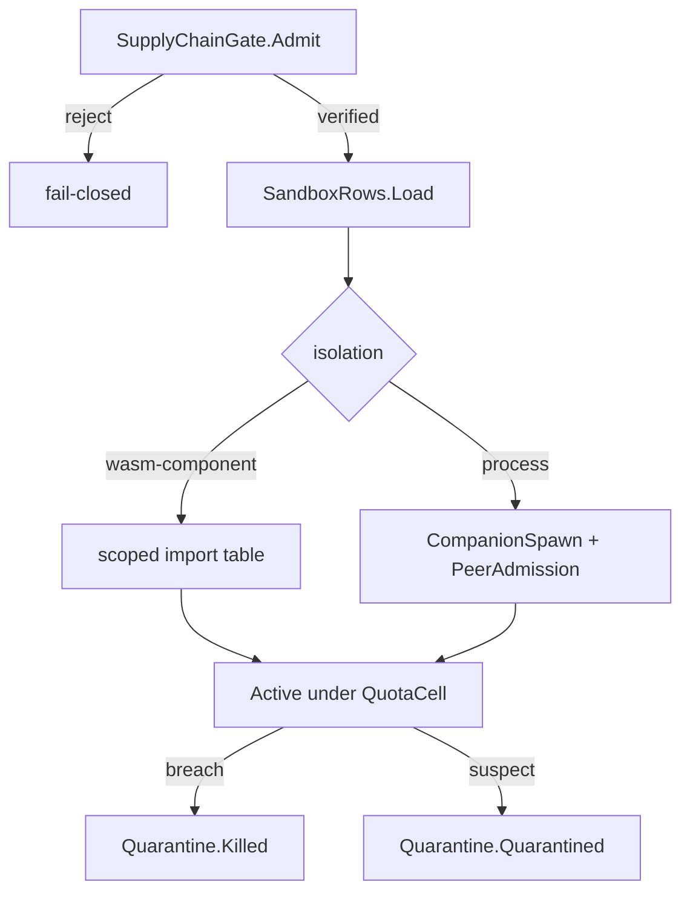

# [APPHOST_SANDBOX_HOST]

The capability-brokered plugin sandbox for the runtime spine: a two-row isolation axis runs a plugin under a WASM component instance or an out-of-process child, every plugin holds zero ambient authority and reaches host capability only through a brokered grant handle, resource quotas cap CPU, memory, wall-time, and egress per plugin, a kill-or-quarantine rail evicts a misbehaving plugin, and a supply-chain gate admits only a signature-verified, SLSA-attested, semver-compatible artifact before it ever loads. The page owns the isolation axis, the grant broker handle, the quota cell, the kill-quarantine rail, and the supply-chain admission gate; it consumes `CapabilityDescriptor`/`GrantBroker`/`GrantScope`, `CommandAlgebra`, `OutboundHop.CompanionSpawn`/`Discovery`, `PeerAdmission`, `CancelScope`, `DegradationCell`, and `ReceiptSinkPort` as settled vocabulary and mints no eighth port.

## [01]-[INDEX]

- [01]-[ISOLATION_AXIS]: WASM-component and process isolation rows with no-ambient-authority load law.
- [02]-[GRANT_HANDLE]: Capability-brokered grant handle with per-call authority mediation.
- [03]-[QUOTA_CONTROL]: CPU/memory/wall/egress quota cell with kill and quarantine rail.
- [04]-[SUPPLY_CHAIN]: Signature, SLSA-attestation, and semver admission before load.

## [02]-[ISOLATION_AXIS]

- Owner: `SandboxIsolation` `[SmartEnum<string>]` the two-row isolation topology under the `CapabilityKeyPolicy` accessor; `SandboxRow` per-isolation policy record; `SandboxRows` the frozen row set with the total dispatch; `PluginInstance` the loaded-plugin capsule; `SandboxFault` `[Union]` fault family in the 4660 band.
- Cases: wasm-component, process — wasm-component runs the plugin as a WebAssembly component instance with a linear-memory boundary and import-only host access, process runs the plugin as an out-of-process child reached over the local-ipc hop with OS-level isolation; `SandboxFault` = Text | LoadRejected | NoAuthority | QuotaExceeded | Quarantined.
- Entry: `SandboxRow Row` is the extension property total state-free `Switch` from case to frozen row; `Load(SandboxRow row, PluginArtifact artifact, GrantScope scope, SandboxRuntime runtime)` returns `IO<PluginInstance>` — the supply-chain gate admits the artifact, the row materializes the isolation boundary, and the plugin loads with exactly the brokered grant scope and no ambient authority.
- Auto: the wasm-component row hosts the plugin on the `wasmtime-dotnet` embedding and instantiates the component with only the WASI-Preview-2 component-model imports the grant scope names, so clocks, files, sockets, and http are granted explicitly through the import table and an ungranted host capability is simply absent — the no-ambient-authority law is the component model's power-by-default isolation, a structural property of the import linkage, not a runtime check; a process row spawns the child through `OutboundHop.CompanionSpawn` and reaches it over `OutboundHop.LocalIpc`, reading the child's `PeerCredential` at accept through `PeerAdmission`, so the child holds no host handle and every host call crosses the brokered control hop; the row's `QuotaShape` column seats the quota cell at load so the limits arrive with the instance, never bolted on after.
- Receipt: `SandboxReceipt` — plugin id, isolation key, granted scope hash, load outcome, `Instant`; the load transition logs through one `SpineLog` event.
- Packages: wasmtime-dotnet, Thinktecture.Runtime.Extensions, LanguageExt.Core, NodaTime, BCL inbox
- Growth: one isolation row absorbs a new sandbox topology — a new linear-memory or OS-isolation backend is one `SandboxRow`, never a parallel loader; a new fault is one `SandboxFault` case; zero new surface.
- Boundary: the sandbox is the only plugin-load owner — a direct `Assembly.LoadFrom`, a plugin `AppDomain`, or an in-process plugin reference is the deleted form, so a plugin never shares the host's managed heap or ambient `IServiceProvider`; the WASM runtime is `wasmtime-dotnet` with WIT-generated host bindings — a hand-rolled WASM host is the deleted form; isolation is orthogonal to the composition density law — the host composes its own modules in-process through `CompositionSurface`, but a third-party plugin always crosses an isolation boundary, so the two load paths never merge; the wasm-component import table and the process control-hop verb set are both projections of the granted `CapabilityDescriptor` set, so a plugin's reachable surface is exactly its grant scope in both topologies; the process row reuses the `Discovery`/`CompanionPeer` spawn-attach mechanics verbatim and adds only the quota and grant columns, never re-declaring the spawn or connect bytes.

```csharp signature
[SmartEnum<string>]
[KeyMemberEqualityComparer<CapabilityKeyPolicy, string>]
[KeyMemberComparer<CapabilityKeyPolicy, string>]
public sealed partial class SandboxIsolation {
    public static readonly SandboxIsolation WasmComponent = new("wasm-component");
    public static readonly SandboxIsolation Process = new("process");
}

[Union]
public abstract partial record SandboxFault : Expected, IValidationError<SandboxFault> {
    private SandboxFault(string detail, int code) : base(detail, code, None) { }
    public static SandboxFault Create(string message) => new Text(message);
    public sealed record Text : SandboxFault { public Text(string detail) : base(detail, 4660) { } }
    public sealed record LoadRejected : SandboxFault { public LoadRejected(string detail) : base(detail, 4661) { } }
    public sealed record NoAuthority : SandboxFault { public NoAuthority(string detail) : base(detail, 4662) { } }
    public sealed record QuotaExceeded : SandboxFault { public QuotaExceeded(string unit, long over) : base($"{unit}:+{over}", 4663) => Unit = unit; public string Unit { get; } }
    public sealed record Quarantined : SandboxFault { public Quarantined(string detail) : base(detail, 4664) { } }
}

public sealed record SandboxRow(
    SandboxIsolation Isolation,
    bool LinearMemory,
    bool OutOfProcess,
    DeadlineClass Wall,
    QuotaShape QuotaShape);

public sealed record PluginInstance(
    string PluginId,
    SandboxIsolation Isolation,
    GrantScope Scope,
    QuotaCell Quota,
    Option<CompanionPeer> Child,
    CancelScope Spine);

public readonly record struct SandboxReceipt(
    string PluginId,
    string Isolation,
    string ScopeHash,
    bool Loaded,
    Instant At);

public sealed record SandboxRuntime(
    SupplyChainGate Gate,
    GrantBroker Broker,
    Func<PluginArtifact, GrantScope, IO<CompanionPeer>> Spawn,
    ClockPolicy Clocks,
    ReceiptSinkPort Sink,
    CancelScope Spine);

public static class SandboxRows {
    public static readonly SandboxRow WasmComponent = new(SandboxIsolation.WasmComponent, LinearMemory: true, OutOfProcess: false, DeadlineClass.HopTotal, QuotaShape.Canonical);
    public static readonly SandboxRow Process = new(SandboxIsolation.Process, LinearMemory: false, OutOfProcess: true, DeadlineClass.HopTotal, QuotaShape.Canonical);

    extension(SandboxIsolation isolation) {
        public SandboxRow Row => isolation.Switch(
            wasmComponent: static () => WasmComponent,
            process: static () => Process);
    }

    public static IO<PluginInstance> Load(SandboxRow row, PluginArtifact artifact, GrantScope scope, SandboxRuntime runtime) =>
        runtime.Gate.Admit(artifact).Match(
            Succ: verified => row.OutOfProcess
                ? runtime.Spawn(verified, scope).Map(peer => Instance(row, verified, scope, runtime, Some(peer)))
                : IO.pure(Instance(row, verified, scope, runtime, None)),
            Fail: fault => IO.fail<PluginInstance>(fault));

    static PluginInstance Instance(SandboxRow row, PluginArtifact artifact, GrantScope scope, SandboxRuntime runtime, Option<CompanionPeer> child) =>
        new(artifact.PluginId, row.Isolation, scope, QuotaCell.Open(row.QuotaShape, runtime.Clocks.Now), child, runtime.Spine.Derive($"plugin-{artifact.PluginId}", runtime.Clocks.Time));
}
```

## [03]-[GRANT_HANDLE]

- Owner: `GrantHandle` the brokered capability handle a plugin reaches host functionality through; `BrokeredCall` the per-call mediation record; `GrantHandleSurface` the static mediation surface.
- Entry: `Invoke(PluginInstance plugin, GrantHandle handle, string descriptorId, CommandArguments arguments)` returns `IO<ToolResult>` — every host call from a plugin routes through the broker: the handle's scope is checked against the descriptor, the quota is charged, and the call dispatches through the command algebra exactly as an agent call does.
- Auto: the grant handle carries no host references — it carries the plugin's `GrantScope` and a dispatch closure bound to the command algebra, so a plugin cannot reach a host capability the scope does not name even by reflection, because the handle holds no object to reflect on; the per-call charge debits the same `Budget` the agent and operator calls debit so a plugin's cost is metered against its tenant's ceiling on one broker; a call outside the scope returns `SandboxFault.NoAuthority` and never reaches the command algebra.
- Receipt: each brokered call mints a `CommandReceipt` through the command algebra carrying the plugin id as the surface, so a plugin's call history is the same evidence stream every command lands on, never a parallel plugin log.
- Packages: LanguageExt.Core, NodaTime, BCL inbox
- Growth: a new mediation policy is one column on `GrantHandle`; the brokered call rides the existing command algebra, so a new plugin capability is one `CapabilityDescriptor` row the grant scope names, never a new mediation surface; zero new surface.
- Boundary: the grant handle is the only authority a plugin holds — a plugin that imports a host type directly is impossible because the wasm import table and the process control verbs are both scoped to the granted descriptors, so the handle is the sole bridge; the no-ambient-authority law is enforced by construction, not by audit — the host never passes a service provider, a configuration root, or a clock into a plugin, only the grant handle, so a plugin's reachable surface is exactly the brokered descriptor set; a plugin requesting a capability outside its standing scope raises a `Consent.Elevated` request the operator approves, landing a wider transient scope on the handle, so a plugin's authority grows only through explicit consent, never through ambient access; the handle's dispatch crosses the wasm boundary as a serialized `CommandArguments` and crosses the process boundary as the control-hop `DispatchTool` verb, so one mediation semantic serves both isolation rows.

```csharp signature
public sealed record GrantHandle(
    string PluginId,
    GrantScope Scope,
    Func<string, CommandArguments, IO<ToolResult>> Dispatch) {
    public bool Permits(CapabilityDescriptor descriptor, Instant now) =>
        Scope.Covers(descriptor.Permission, now);
}

public readonly record struct BrokeredCall(
    string PluginId,
    string Descriptor,
    bool Permitted,
    CostVector Charged,
    Instant At);

public static class GrantHandleSurface {
    public static IO<ToolResult> Invoke(SandboxRuntime runtime, PluginInstance plugin, GrantHandle handle, string descriptorId, CommandArguments arguments) =>
        runtime.Broker is var broker && plugin.Quota.Within(runtime.Clocks.Now)
            ? handle.Dispatch(descriptorId, arguments with { Tenant = arguments.Tenant })
            : IO.pure(new ToolResult(descriptorId, [JsonValue.Create(new SandboxFault.QuotaExceeded("wall-millis", 0L).Message)!], IsError: true, arguments.Correlation));

    public static GrantHandle Bind(PluginInstance plugin, CommandRuntime command) =>
        new(plugin.PluginId, plugin.Scope, (descriptorId, arguments) =>
            command.Registry.Resolve(descriptorId).Match(
                Some: descriptor => plugin.Scope.Covers(descriptor.Permission, command.Clocks.Now)
                    ? McpDispatch.Call(new McpRuntime(command.Registry, command, command.Broker, () => DegradationLevel.Full, _ => JsonValue.Create(string.Empty)!, command.Clocks, command.Sink, command.Wire), descriptorId, arguments)
                    : IO.pure(new ToolResult(descriptorId, [JsonValue.Create(new SandboxFault.NoAuthority(descriptorId).Message)!], IsError: true, arguments.Correlation)),
                None: () => IO.pure(new ToolResult(descriptorId, [JsonValue.Create(new SandboxFault.Text($"unknown:{descriptorId}").Message)!], IsError: true, arguments.Correlation))));
}
```

## [04]-[QUOTA_CONTROL]

- Owner: `QuotaShape` the per-plugin resource-ceiling record; `QuotaCell` the live-metering boundary capsule; `Quarantine` `[Union]` the eviction disposition; `QuotaControl` the static enforcement surface.
- Cases: `Quarantine` = Active | Killed | Quarantined | Released — Active is the running plugin, Killed terminates immediately, Quarantined disables the grant handle and holds the artifact for inspection, Released reinstates after review.
- Entry: `Enforce(PluginInstance plugin, CostVector observed, Instant now)` returns `Quarantine` — the enforcement fold compares observed resource use against the quota shape and disposes the plugin; `Kill(SandboxRuntime runtime, PluginInstance plugin, string reason)` returns `IO<SandboxReceipt>` — terminates the wasm instance or the child process and withdraws the grant handle.
- Auto: a wasm-component plugin's CPU and memory are read from the `wasmtime-dotnet` `Store` fuel counter and linear-memory size, a process plugin's from its `ResourceQuota`-graded `UtilizationCell` over the child's resource-monitoring instruments, so quota enforcement reads the same observable-instrument and quota path the host pressure grade reads, never a parallel meter; a quota breach kills the wasm instance synchronously and signals the child process to drain then terminates it on the forced deadline, so a runaway plugin cannot exceed its wall budget; a killed plugin's grant handle dispatch returns `SandboxFault.Quarantined` so a held reference cannot reach the host after eviction.
- Receipt: the eviction mints a `SandboxReceipt` and the kill rides the existing `DegradationCell` only when the plugin failure escalates a host capability — a plugin kill is process-local evidence, never a host degradation by itself.
- Packages: wasmtime-dotnet, LanguageExt.Core, NodaTime, Thinktecture.Runtime.Extensions, BCL inbox
- Growth: one quota dimension is one field on `QuotaShape` riding the `CostUnit` axis; one disposition is one `Quarantine` case; zero new surface.
- Boundary: the quota cell is the only plugin-resource owner — an unbounded plugin, a best-effort timeout, and a parallel plugin watchdog are the deleted forms; the quota shape's units are the same `CostUnit` rows the cost model meters, so a plugin's quota and a tenant's budget speak one resource vocabulary; the kill rail is the consequence of a quota breach, a supply-chain revocation, or an operator command — all three land on `Quarantine`, never three eviction paths; quarantine holds the artifact and the last receipt for inspection so a suspected-malicious plugin's evidence survives the eviction, distinct from a clean kill that discards the instance; the wall-time ceiling is a `DeadlineClass` row read by projection, never a literal here.

```csharp signature
public sealed record QuotaShape(
    long MaxCpuMillis,
    long MaxMemoryBytes,
    DeadlineClass Wall,
    long MaxBytesEgress) {
    public static readonly QuotaShape Canonical = new(
        MaxCpuMillis: 30_000L,
        MaxMemoryBytes: 256L << 20,
        Wall: DeadlineClass.HopTotal,
        MaxBytesEgress: 64L << 20);

    public Option<string> Breach(CostVector observed) =>
        observed.Of(CostUnit.CpuMillis) > MaxCpuMillis ? Some(CostUnit.CpuMillis.Key)
        : observed.Of(CostUnit.BytesEgress) > MaxBytesEgress ? Some(CostUnit.BytesEgress.Key)
        : None;
}

public sealed record QuotaCell(QuotaShape Shape, Atom<CostVector> Spent, Instant Opened, Instant Deadline) {
    public static QuotaCell Open(QuotaShape shape, Instant now) =>
        new(shape, Atom(CostVector.Zero), now, now + shape.Wall.Allotted);

    public bool Within(Instant now) => now < Deadline && Shape.Breach(Spent.Value).IsNone;

    public CostVector Charge(CostVector cost) => Spent.Swap(spent => spent.Add(cost));
}

[Union(ConversionFromValue = ConversionOperatorsGeneration.None)]
public abstract partial record Quarantine {
    private Quarantine() { }
    public sealed record Active : Quarantine;
    public sealed record Killed(string Reason) : Quarantine;
    public sealed record Quarantined(string Reason, PluginArtifact Held) : Quarantine;
    public sealed record Released(Instant At) : Quarantine;
}

public static class QuotaControl {
    public static Quarantine Enforce(PluginInstance plugin, CostVector observed, Instant now) =>
        plugin.Quota.Shape.Breach(plugin.Quota.Charge(observed)) is { IsSome: true, Case: string unit }
            ? new Quarantine.Killed($"{unit}-exceeded")
            : now >= plugin.Quota.Deadline
                ? new Quarantine.Killed("wall-deadline")
                : new Quarantine.Active();

    public static IO<SandboxReceipt> Kill(SandboxRuntime runtime, PluginInstance plugin, string reason) =>
        from _cancel in IO.lift(() => { plugin.Spine.Source.Cancel(); return unit; })
        from _child in plugin.Child.Match(
            Some: peer => IO.liftAsync(async () => { await peer.Control.ShutdownAsync(); return unit; }),
            None: () => IO.pure(unit))
        from at in IO.lift(() => runtime.Clocks.Now)
        let receipt = new SandboxReceipt(plugin.PluginId, plugin.Isolation.Key, plugin.Scope.ScopeHash, Loaded: false, at)
        from _ in runtime.Sink.Send(Correlation.Mint(), TenantContext.Current, TelemetrySource.AppHost.Key, nameof(QuotaControl), JsonSerializer.SerializeToElement(receipt, AppHostWireContext.Default.SandboxReceipt))
        select receipt;
}
```

## [05]-[SUPPLY_CHAIN]

- Owner: `PluginArtifact` the candidate plugin record; `Attestation` the SLSA-provenance record; `SemverGate` the version-compatibility check; `SupplyChainFault` `[Union]` fault family in the 4680 band; `SupplyChainGate` the static admission surface.
- Entry: `Admit(PluginArtifact artifact)` returns `Fin<PluginArtifact>` — the gate verifies the artifact signature against the trusted publisher set, validates the SLSA provenance attestation, and checks semver compatibility against the host contract version before the artifact ever loads; a single rejected check fails closed.
- Auto: signature verification reads the artifact's detached signature against the publisher's pinned public key so an unsigned or wrong-key artifact is rejected before parse; the SLSA attestation binds the artifact digest to its build provenance so a tampered artifact whose digest drifts from the attestation is rejected; the semver gate reads the host's plugin-contract version and the artifact's declared compatibility range so a plugin built against an incompatible contract is rejected at admission, never at first call; the digest is content-addressed through `XxHash128` so the admission decision caches on the digest and a re-presented artifact re-verifies once.
- Receipt: the admission decision rides one `SpineLog` event carrying the digest, the publisher, and the outcome; a rejected admission never loads, so there is no instance receipt for a rejected artifact.
- Packages: LanguageExt.Core, Thinktecture.Runtime.Extensions, System.IO.Hashing, BCL inbox
- Growth: one supply-chain check is one fold arm on `Admit`; a new attestation format is one `Attestation` variant; zero new surface.
- Boundary: the supply-chain gate is the only plugin-admission owner — an unverified load, a trust-on-first-use path, and a post-load signature check are the deleted forms, so verification always precedes load; the gate is fail-closed — a missing signature, an absent attestation, or an unparseable semver range all reject, so the default is exclusion, never admission; the trusted publisher set is a frozen config-bound policy, so a new publisher is one config row, never a code change; the digest content-addressing means the gate and the host evidence stream identify a plugin by the same hash, so a quarantined plugin's digest matches its admission record; the gate never executes the artifact to inspect it — verification reads the signature, the attestation, and the manifest only, so a malicious artifact cannot exploit the gate by running during admission.

```csharp signature
[Union]
public abstract partial record SupplyChainFault : Expected, IValidationError<SupplyChainFault> {
    private SupplyChainFault(string detail, int code) : base(detail, code, None) { }
    public static SupplyChainFault Create(string message) => new Text(message);
    public sealed record Text : SupplyChainFault { public Text(string detail) : base(detail, 4680) { } }
    public sealed record SignatureInvalid : SupplyChainFault { public SignatureInvalid(string detail) : base(detail, 4681) { } }
    public sealed record AttestationMissing : SupplyChainFault { public AttestationMissing(string detail) : base(detail, 4682) { } }
    public sealed record DigestMismatch : SupplyChainFault { public DigestMismatch(string detail) : base(detail, 4683) { } }
    public sealed record VersionIncompatible : SupplyChainFault { public VersionIncompatible(string detail) : base(detail, 4684) { } }
}

public sealed record Attestation(
    string BuilderId,
    string SourceUri,
    string BuildDigest,
    int SlsaLevel);

public sealed record PluginArtifact(
    string PluginId,
    string Digest,
    string Publisher,
    ReadOnlyMemory<byte> Signature,
    Option<Attestation> Provenance,
    string ContractRange,
    ReadOnlyMemory<byte> Component) {
    public static string DigestOf(ReadOnlyMemory<byte> component) =>
        Convert.ToHexStringLower(System.IO.Hashing.XxHash128.Hash(component.Span));
}

public sealed record SupplyChainPolicy(
    FrozenDictionary<string, ReadOnlyMemory<byte>> TrustedPublishers,
    int MinimumSlsaLevel,
    string HostContractVersion) {
    public const string Section = nameof(SupplyChainPolicy);
}

public sealed record SupplyChainGate(SupplyChainPolicy Policy, Func<ReadOnlyMemory<byte>, ReadOnlyMemory<byte>, ReadOnlyMemory<byte>, bool> Verify) {
    public Fin<PluginArtifact> Admit(PluginArtifact artifact) =>
        from publisher in Policy.TrustedPublishers.TryGetValue(artifact.Publisher, out var key)
            ? Fin.Succ(key)
            : Fin.Fail<ReadOnlyMemory<byte>>(new SupplyChainFault.SignatureInvalid($"untrusted:{artifact.Publisher}"))
        from _signed in Verify(artifact.Component, artifact.Signature, publisher)
            ? Fin.Succ(unit)
            : Fin.Fail<Unit>(new SupplyChainFault.SignatureInvalid(artifact.PluginId))
        from _digest in PluginArtifact.DigestOf(artifact.Component) == artifact.Digest
            ? Fin.Succ(unit)
            : Fin.Fail<Unit>(new SupplyChainFault.DigestMismatch(artifact.PluginId))
        from attestation in artifact.Provenance.ToFin(new SupplyChainFault.AttestationMissing(artifact.PluginId))
        from _slsa in attestation.SlsaLevel >= Policy.MinimumSlsaLevel && attestation.BuildDigest == artifact.Digest
            ? Fin.Succ(unit)
            : Fin.Fail<Unit>(new SupplyChainFault.AttestationMissing($"slsa-{attestation.SlsaLevel}"))
        from _semver in SemverGate.Compatible(artifact.ContractRange, Policy.HostContractVersion)
            ? Fin.Succ(unit)
            : Fin.Fail<Unit>(new SupplyChainFault.VersionIncompatible($"{artifact.ContractRange}!~{Policy.HostContractVersion}"))
        select artifact;
}

public static class SemverGate {
    public static bool Compatible(string range, string hostVersion) =>
        Version.TryParse(hostVersion, out var host)
        && range.Split('-', 2) is [{ } lower, { } upper]
        && Version.TryParse(lower, out var min) && Version.TryParse(upper, out var max)
        && host >= min && host < max;
}
```



## [06]-[RESEARCH]

- [WASM_RUNTIME]: the `wasmtime-dotnet` embedding component instantiation, the WASI-Preview-2 component-model import table scoped to the granted descriptors (clocks/files/sockets/http granted explicitly), and the `Store` fuel and linear-memory counters the quota cell reads confirm against the runtime package at the integrated host; the scope-derived import set and the `componentize-dotnet` WIT-generated host bindings are the open distinction the live runtime resolves.
- [SIGNATURE_VERIFY]: the artifact signature-verification primitive (the detached-signature check against the pinned publisher public key) and the SLSA in-toto provenance attestation parse confirm against the admitted cryptography surface; the verification reads only the signature, attestation, and manifest and never executes the artifact, so the gate carries no execution residual.
- [CHILD_SHUTDOWN]: the `CompanionPeer.Control.ShutdownAsync` graceful-then-forced child termination over the control hop and the wasm-instance synchronous teardown compile through the G7 spec-compile gate until the `Grpc.Core.Api` assay source map registers the transitive package; the kill-then-quarantine convergence against a runaway plugin is the open distinction the live host resolves.
