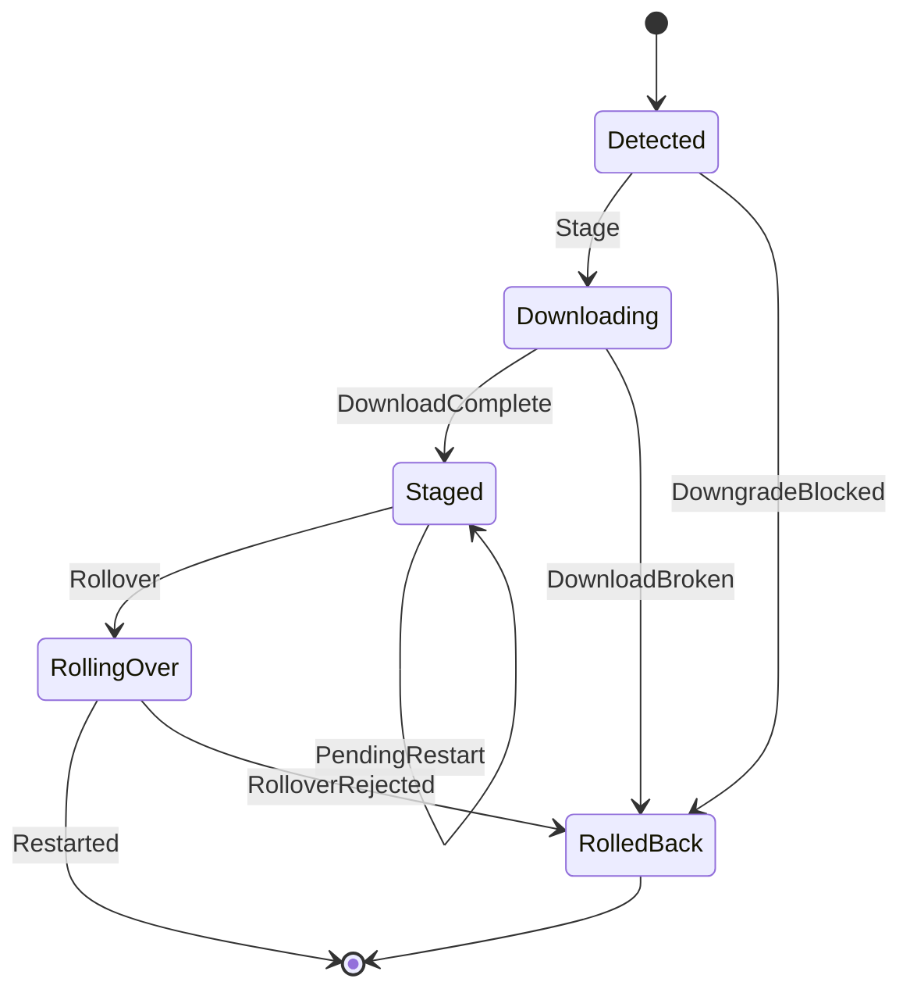
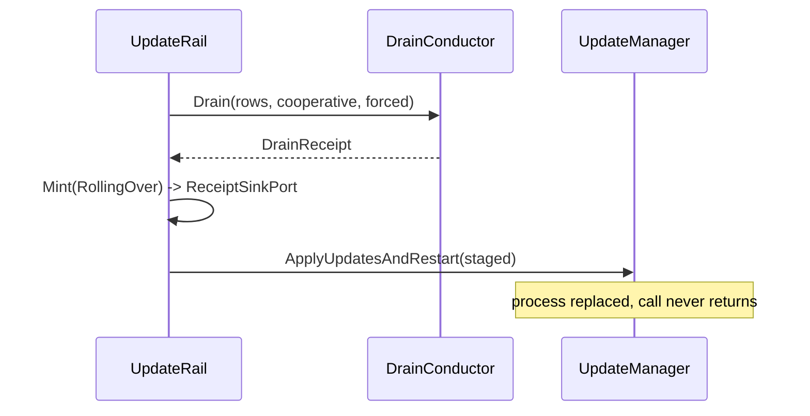

# [APPHOST_PROVISIONING_AND_UPDATE]

Rasm.AppHost owns the post-fetch update concern: a `UpdateManager`-borne state machine that downloads a found release, stages it, drains the node, rolls it over through `ApplyUpdatesAndRestart`, and mints a typed `UpdateReceipt` on every phase, plus a three-row `UpdateChannel` vocabulary carrying feed routing and downgrade policy, plus a fleet-wide rolling-update conductor that walks the attached-peer roster in a `RollStrategy`-shaped (canary, blue-green, linear-wave) health-gated wave. The page owns the update rail, the channel axis, the progressive-rollout strategy axis, and the rollover-drain handshake that runs `DrainConductor` before the restart hands the process to Velopack and the `FleetRoll` fleet conductor that paces the strategy-shaped wave over `PeerRoster`. The `UpdateCheck(ReleaseIdentity)` outbound hop stays the detect leg at outbound-resilience; everything after a release is found composes here over Velopack, the `DrainConductor` fold, `ReceiptSinkPort`, and the generated metric attributes.

## [01]-[INDEX]

- [01]-[UPDATE_RAIL]: Post-fetch state machine, fault band, per-phase receipt, and generated instruments.
- [02]-[CHANNEL_AXIS]: Three feed rows binding explicit channel and downgrade policy onto options.
- [03]-[ROLLOVER_DRAIN]: Drain-before-swap handshake and the canary/blue-green/linear-wave `RollStrategy` axis over a health-gated fleet-wide wave.

## [02]-[UPDATE_RAIL]

- Owner: `UpdatePhase` `[SmartEnum<string>]` five post-fetch phases under the `UpdateKeyPolicy` ordinal accessor; `UpdateOutcome` `[Union]` terminal disposition; `UpdateFault` `[Union]` fault family in the 1300 band; `UpdateReceipt` per-phase evidence record; `UpdateMetrics` source-gen instrument partial under the `CounterAttribute`/`HistogramAttribute` generator; `UpdateRail` boundary capsule owning the `UpdateManager` handle and the staged-pending probe.
- Cases: 5 phase rows — detected, downloading, staged, rolling-over, rolled-back; outcomes restarted | staged-pending | rolled-back | declined; `UpdateFault` = Text | DownloadBroken | StagePending | RolloverRejected | DowngradeBlocked.
- Entry: `IO<UpdateReceipt> Stage(UpdateInfo found, IProgress<int> progress, CancellationToken token)` carries the download-and-stage effect and forecloses a blocked downgrade before transfer; `IO<UpdateReceipt> Rollover(VelopackAsset asset, Duration cooperative, Duration forced)` carries the drain-gated restart effect; `IO<UpdateReceipt> Resume(Duration cooperative, Duration forced)` re-enters a staged-pending release after a process bounce.
- Auto: every phase commit mints one `UpdateReceipt` fanned to `ReceiptSinkPort.Send` under the `Rasm.AppHost` package key; the generated counter rises per staged and per rollback phase and the generated histogram records the rollover span; `IsUpdatePendingRestart` is read at boot so a staged-but-unrestarted release re-enters the rail at the staged phase without a second download.
- Receipt: `UpdateReceipt` — phase, channel key, target version, prior version, downgrade flag, delta count, `Instant`, elapsed `Duration`, outcome, correlation id.
- Packages: Velopack, Thinktecture.Runtime.Extensions, LanguageExt.Core, NodaTime, Microsoft.Extensions.Telemetry.Abstractions, BCL inbox.
- Growth: one phase row plus its `Next` arm, or one outcome case, or one fault case breaking every dispatch site at compile time; one instrument is one strongly-typed metric-attribute factory; zero new surface.
- Boundary: `UpdateRail` is the named boundary capsule for the statement carve-out — the `UpdateManager` ctor, the awaited download, and the terminal `ApplyUpdatesAndRestart` carry language-owned statement forms while every other member stays expression-shaped; the rail composes `UpdateManager` directly with no rename adapter — the `UpdateChannel` axis is the only added vocabulary; `VelopackApp.Build()...Run()` is the process-entry bootstrap owned at the app root, never a rail fence, so `VelopackHook` registration stays at the app root and never enters this page; `ApplyUpdatesAndRestart` takes `found.TargetFullRelease` as its `VelopackAsset`, never the `UpdateInfo`, and the call never returns because the host process is replaced — the rolled-over receipt mints and fans before the call; `found.IsDowngrade` against the channel's `AllowVersionDowngrade` column forecloses a disallowed downgrade as `DowngradeBlocked` before any byte transfers; an inline `meter.CreateCounter` call is the deleted form — every spine instrument is a generated factory whose name and tag set are declaration facts and whose generated metric type exposes the strongly-typed `Add`/`Record` over the channel-key tag; the `Target` fold reads `VelopackAsset.Version` (a `SemanticVersion`) through `ToString`, the single version-stamp seam; `UpdateReceipt` rides the suite wire law as one `AppHostWireContext` `[JsonSerializable]` row; notarization and SBOM are `vpk` build-time concerns and carry no rail fence; the page is host-local and crosses no browser or peer TS wire — `UpdateReceipt` and `FleetRollReceipt` reconstruct in TS solely through the existing `ReceiptEnvelopeWire` at Runtime/ports#TS_PROJECTION, so the page authors no `TS_PROJECTION` cluster and adds no second wire shape.

```csharp signature
public sealed class UpdateKeyPolicy : IEqualityComparerAccessor<string>, IComparerAccessor<string> {
    public static IEqualityComparer<string> EqualityComparer => StringComparer.Ordinal;
    public static IComparer<string> Comparer => StringComparer.Ordinal;
}

[SmartEnum<string>]
[KeyMemberEqualityComparer<UpdateKeyPolicy, string>]
[KeyMemberComparer<UpdateKeyPolicy, string>]
public sealed partial class UpdatePhase {
    public static readonly UpdatePhase Detected = new("detected");
    public static readonly UpdatePhase Downloading = new("downloading");
    public static readonly UpdatePhase Staged = new("staged");
    public static readonly UpdatePhase RollingOver = new("rolling-over");
    public static readonly UpdatePhase RolledBack = new("rolled-back");
}

[Union]
public abstract partial record UpdateOutcome {
    private UpdateOutcome() { }
    public sealed record Restarted(string Target) : UpdateOutcome;
    public sealed record StagedPending(string Target) : UpdateOutcome;
    public sealed record RolledBack(string Prior, UpdateFault Cause) : UpdateOutcome;
    public sealed record Declined(string Reason) : UpdateOutcome;
}

[Union]
public abstract partial record UpdateFault : Expected, IValidationError<UpdateFault> {
    private UpdateFault(string detail, int code) : base(detail, code, None) { }
    public static UpdateFault Create(string message) => new Text(message);
    public sealed record Text : UpdateFault { public Text(string detail) : base(detail, 1300) { } }
    public sealed record DownloadBroken : UpdateFault { public DownloadBroken(string detail) : base(detail, 1301) { } }
    public sealed record StagePending : UpdateFault { public StagePending(string detail) : base(detail, 1302) { } }
    public sealed record RolloverRejected : UpdateFault { public RolloverRejected(string detail) : base(detail, 1303) { } }
    public sealed record DowngradeBlocked : UpdateFault { public DowngradeBlocked(string detail) : base(detail, 1304) { } }
}

public sealed record UpdateReceipt(
    UpdatePhase Phase,
    string Channel,
    string Target,
    string Prior,
    bool Downgrade,
    int Deltas,
    Instant At,
    Duration Elapsed,
    UpdateOutcome Outcome,
    CorrelationId Correlation);

public static partial class UpdateMetrics {
    [Counter(nameof(UpdateChannel), Name = "rasm.apphost.update.staged")]
    public static partial StagedMetric Staged(Meter meter);

    [Counter(nameof(UpdateChannel), Name = "rasm.apphost.update.rollback")]
    public static partial RollbackMetric Rollback(Meter meter);

    [Histogram(nameof(UpdateChannel), Name = "rasm.apphost.update.rollover.duration")]
    public static partial RolloverDurationMetric RolloverDuration(Meter meter);
}

public sealed class UpdateRail {
    readonly UpdateManager manager;
    readonly UpdateChannel channel;
    readonly Lifecycle host;
    readonly ReceiptSinkPort sink;
    readonly StagedMetric staged;
    readonly RollbackMetric rollback;
    readonly RolloverDurationMetric rolloverDuration;

    public UpdateRail(UpdateChannel channel, Lifecycle host, ReceiptSinkPort sink, Meter meter) {
        this.channel = channel;
        this.host = host;
        this.sink = sink;
        this.manager = new UpdateManager(channel.Feed, new UpdateOptions {
            ExplicitChannel = channel.ExplicitChannel,
            AllowVersionDowngrade = channel.AllowVersionDowngrade,
        });
        this.staged = UpdateMetrics.Staged(meter);
        this.rollback = UpdateMetrics.Rollback(meter);
        this.rolloverDuration = UpdateMetrics.RolloverDuration(meter);
    }

    public bool PendingRestart => manager.IsUpdatePendingRestart;
    public Option<VelopackAsset> Pending => Optional(manager.UpdatePendingRestart);
    string Prior => manager.CurrentVersion?.ToString() ?? string.Empty;

    public IO<UpdateReceipt> Stage(UpdateInfo found, IProgress<int> progress, CancellationToken token) =>
        found.IsDowngrade && !channel.AllowVersionDowngrade
            ? from blocked in Mint(UpdatePhase.RolledBack, Target(found.TargetFullRelease), found.IsDowngrade, found.DeltasToTarget.Length, Duration.Zero, new UpdateOutcome.RolledBack(Prior, new UpdateFault.DowngradeBlocked(Target(found.TargetFullRelease))))
              from _ in IO.lift(() => rollback.Add(1, channel.Key))
              select blocked
            : from start in IO.lift(() => host.Clock.GetCurrentInstant())
              from downloading in Mint(UpdatePhase.Downloading, Target(found.TargetFullRelease), found.IsDowngrade, found.DeltasToTarget.Length, Duration.Zero, new UpdateOutcome.StagedPending(Target(found.TargetFullRelease)))
              from done in IO.liftAsync(async () => {
                  await manager.DownloadUpdatesAsync(found, progress.Report, token).ConfigureAwait(false);
                  return unit;
              })
              from finish in IO.lift(() => host.Clock.GetCurrentInstant())
              from receipt in Mint(UpdatePhase.Staged, Target(found.TargetFullRelease), found.IsDowngrade, found.DeltasToTarget.Length, finish - start, new UpdateOutcome.StagedPending(Target(found.TargetFullRelease)))
              from _ in IO.lift(() => staged.Add(1, channel.Key))
              select receipt;

    public IO<UpdateReceipt> Rollover(VelopackAsset asset, Duration cooperative, Duration forced) =>
        from drained in host.Drain(DrainRows(), cooperative, forced)
        from rolling in Mint(UpdatePhase.RollingOver, Target(asset), false, 0, drained.Elapsed, new UpdateOutcome.Restarted(Target(asset)))
        from _ in IO.lift(() => rolloverDuration.Record((host.Clock.GetCurrentInstant() - drained.At).TotalSeconds, channel.Key))
        from applied in IO.lift(fun(() => manager.ApplyUpdatesAndRestart(asset)))
        select rolling;

    public IO<UpdateReceipt> Resume(Duration cooperative, Duration forced) =>
        Pending.Match(
            Some: asset => Rollover(asset, cooperative, forced),
            None: () => Mint(UpdatePhase.Detected, string.Empty, false, 0, Duration.Zero, new UpdateOutcome.Declined(nameof(UpdatePhase.Detected))));

    Seq<(string Name, DrainBand Band, int Rank, Func<CancellationToken, IO<Unit>> Drain)> DrainRows() =>
        [(nameof(UpdateRail), DrainBand.Stores, 0, static _ => IO.pure(unit))];

    IO<UpdateReceipt> Mint(UpdatePhase phase, string target, bool downgrade, int deltas, Duration elapsed, UpdateOutcome outcome) =>
        from at in IO.lift(() => host.Clock.GetCurrentInstant())
        let receipt = new UpdateReceipt(phase, channel.Key, target, Prior, downgrade, deltas, at, elapsed, outcome, host.CorrelationId)
        from _ in sink.Send(host.CorrelationId, TenantContext.Current, TelemetrySource.AppHost.Key, phase.Key, JsonSerializer.SerializeToElement(receipt, AppHostWireContext.Default.UpdateReceipt))
        select receipt;

    static string Target(VelopackAsset asset) => asset.Version.ToString();
}
```



## [03]-[CHANNEL_AXIS]

- Owner: `UpdateChannel` `[SmartEnum<string>]` three feed rows under the `UpdateKeyPolicy` ordinal accessor, carrying the feed URI, explicit-channel string, and downgrade-allow column.
- Cases: 3 channel rows — stable, beta, canary.
- Entry: `UpdateChannel.From(ReleaseIdentity installed)` resolves the row from the detect-leg identity's channel string under the ordinal accessor.
- Auto: the resolved row's `Feed` seats the `UpdateManager` ctor url, its `ExplicitChannel` seats `UpdateOptions.ExplicitChannel`, and its `AllowVersionDowngrade` seats `UpdateOptions.AllowVersionDowngrade` — the three columns are the only update-options surface the rail writes; `MaximumDeltasBeforeFallback` stays unset so the full-package fallback governs; canary alone admits a downgrade so a forward-rolled canary build reverts to its prior pin.
- Receipt: the channel key stamps `UpdateReceipt.Channel` and keys the `AddView` cardinality cap on every update instrument.
- Packages: Velopack, Thinktecture.Runtime.Extensions, LanguageExt.Core.
- Growth: one channel row carries one feed URI, one explicit-channel string, and one downgrade column; a ring split lands as one row, never a second axis; zero new surface.
- Boundary: the axis owns the feed-routing decision — each row carries its own authoritative `Feed` URI, and `From` resolves the row from `ReleaseIdentity.Channel` under the ordinal accessor; the detect-leg `ReleaseIdentity.Feed` is the outbound poll URI of the `UpdateCheck` hop, a distinct value the axis never reads; `ExplicitChannel` is the Velopack channel-suffix selector that pins which release set the manager resolves; `AllowVersionDowngrade` is the downgrade-policy column the rail reads before any transfer, never a per-call flag; the `AddView` rows at signal-governance cap update-instrument cardinality on the channel key so three channels cap at three series per instrument.

```csharp signature
[SmartEnum<string>]
[KeyMemberEqualityComparer<UpdateKeyPolicy, string>]
[KeyMemberComparer<UpdateKeyPolicy, string>]
public sealed partial class UpdateChannel {
    public static readonly UpdateChannel Stable = new("stable", new Uri("https://updates.rasm.app/stable"), explicitChannel: "stable", allowVersionDowngrade: false);
    public static readonly UpdateChannel Beta = new("beta", new Uri("https://updates.rasm.app/beta"), explicitChannel: "beta", allowVersionDowngrade: false);
    public static readonly UpdateChannel Canary = new("canary", new Uri("https://updates.rasm.app/canary"), explicitChannel: "canary", allowVersionDowngrade: true);

    public Uri Feed { get; }
    public string ExplicitChannel { get; }
    public bool AllowVersionDowngrade { get; }

    public static UpdateChannel From(ReleaseIdentity installed) =>
        TryGet(installed.Channel, out var row) ? row : Stable;
}
```

## [04]-[ROLLOVER_DRAIN]

- Owner: `RolloverDrain` static surface composing `DrainConductor.Drain` ahead of `UpdateRail.Rollover` so a node empties before its process is replaced; `RollStrategy` `[SmartEnum<string>]` the progressive-delivery axis (canary, blue-green, linear-wave) with a delegate-backed `Next(cohort, health)` plan arm per strategy; `RollPlan` the per-wave cohort projection; `FleetRoll` the fleet-wide rolling-update conductor walking `PeerRoster.Attached` in strategy-shaped health-gated waves; `FleetRollReceipt` the per-wave fleet-progress projection riding the existing receipt stream.
- Cases: two conduct paths on the local node — `Conduct` for a staged asset, `ConductPending` for a post-bounce resume; three roll strategies — `Canary` rolls a single-node probe then expands the cohort on a health-hold, `BlueGreen` swaps a parallel half-fleet cohort on a health-pass, `LinearWave` advances fixed N% increments with a bake window between waves; one fleet conduct — `FleetRoll.Roll` paces the wave across the roster, the `RollStrategy` row shaping each next cohort off the prior cohort's recovered serving status.
- Entry: `IO<UpdateReceipt> Conduct(UpdateRail rail, VelopackAsset staged, DeadlineClass cooperative, DeadlineClass forced)` — `IO` carries the drain-then-restart effect; the drain receipt seats the rollover; `IO<Seq<FleetRollReceipt>> Roll(PeerRoster roster, RollStrategy strategy, Func<RosterEntry, IO<UpdateReceipt>> rollNode, Func<RosterEntry, IO<HealthReport>> probe, Func<Duration, IO<Unit>> bake, ReceiptSinkPort sink, IClock clock, TenantContext tenant)` plans the cohorts from `RollStrategy.Plan(roster.Attached)`, rolls each cohort, waits on the post-roll `WireHealth.Evaluate` serving probe, then bakes the strategy's inter-wave dwell through the injected clock-driven `bake` delegate before the next cohort admits.
- Auto: the conductor's first act is the draining transition, so inbound admission ceases before the staged release rolls over; the cooperative and forced budgets arrive from the `DrainCooperative` and `DrainForced` deadline rows; the rollover histogram records the span from drain settle to restart handoff; on a fleet node the parent's drain registration fans the signal to the child over the local-ipc hop before the parent itself rolls over; `RollStrategy.Plan` folds `PeerRoster.Attached` into the ordered cohort sequence the strategy shape dictates — `Canary` plans a 1-node lead cohort then the remainder, `BlueGreen` plans a single half-fleet cohort, `LinearWave` plans equal `WavePercent`-sized cohorts with a `BakeWindow` dwell — and `FleetRoll.Roll` rolls each cohort, folds the `probe` serving status, and halts the wave on a `NotServing` node before the next cohort so a node that fails to recover stops the rollout; the canary health-hold reuses the existing `HealthSnapshot`/`DegradationLevel` gate through the `probe`, never a new probe owner; the strategy row also threads the targeting plane — a `Runtime/features#FLAG_VERDICT` verdict selects which `RollStrategy` row a wave runs so progressive binary rollout and feature rollout share one targeting plane.
- Receipt: the `RollingOver` `UpdateReceipt` carries the `DrainReceipt.Elapsed` as its drain span and the rollover outcome; a straggled drain step does not abort the rollover — the restart proceeds and the straggler surfaces on the drain receipt the rollover receipt references by correlation id; each `FleetRoll` cohort mints one `FleetRollReceipt` — wave index, the `RollStrategy` key, node pid, the node's terminal `UpdateOutcome`, post-roll serving status, nodes-remaining — fanned through the existing receipt stream beside the per-node `UpdateReceipt`, never a parallel fleet instrument.
- Packages: Velopack, LanguageExt.Core, NodaTime, Thinktecture.Runtime.Extensions.
- Growth: one drain participant row per update-sensitive subsystem registered through `DrainParticipantPort` at its declared band; a new progressive strategy is one `RollStrategy` row with its `Plan`/`Next` arm, never a second roll state machine; a wave-width retune is the `LinearWave` `WavePercent` column; zero new surface.
- Boundary: drain-before-swap is the law — `ApplyUpdatesAndRestart` is never reached until `DrainConductor.Drain` settles, so the replaced process leaves no half-flushed store write or in-flight hop; the cooperative and forced deadline values are the `DrainCooperative`/`DrainForced` rows, never an inline literal; the staged asset is `UpdatePendingRestart` read at composition, so a rollover after a process bounce resumes from the staged phase without re-staging; the rollover is the single restart path — the bare `ApplyUpdatesAndExit` and `WaitExitThenApplyUpdates` forms are deleted because the drain-gated restart owns the handoff; `RollStrategy` is one row on the existing `FleetRoll`, not a parallel conductor — a second roll state machine or a strategy-specific scheduler beside `ScheduleEntry.Spread` is the rejected form, and the `ScheduleEntry.Spread` fleet-spread seed stays the wave-pacing cadence the strategy `BakeWindow` reads, never a new scheduler; `FleetRoll` is a conductor over the existing owners — it consumes `PeerRoster.Attached` from Wire/companion#PROCESS_MODALITY as the wave membership and `WireHealthRow` from Observability/health#WIRE_HEALTH as the per-node recovery gate, both as settled vocabulary, and each node's actual roll is the same `RolloverDrain.Conduct` the local node runs dialed over the control hop, so the fleet wave never re-implements the drain-gated restart; the wave halts on the first unrecovered node so a bad release never rolls the whole fleet; `FencingToken` conductor election keeps one conductor per fleet so two nodes never drive overlapping waves.

```csharp signature
public static class RolloverDrain {
    public static IO<UpdateReceipt> Conduct(UpdateRail rail, VelopackAsset staged, DeadlineClass cooperative, DeadlineClass forced) =>
        rail.Rollover(staged, cooperative.Allotted, forced.Allotted);

    public static IO<UpdateReceipt> ConductPending(UpdateRail rail, DeadlineClass cooperative, DeadlineClass forced) =>
        rail.PendingRestart
            ? rail.Resume(cooperative.Allotted, forced.Allotted)
            : IO.fail<UpdateReceipt>(new UpdateFault.StagePending(nameof(rail.PendingRestart)));
}

// The progressive-delivery axis: one row per strategy carries its cohort plan, the recover-and-advance
// predicate, and the inter-wave bake window. Plan folds the roster into the ordered cohort sequence the
// strategy shape dictates; Next admits the following cohort only on a held health-pass. A second roll
// state machine beside this axis is the rejected form.
public sealed record RollPlan(Seq<Seq<RosterEntry>> Cohorts, Duration BakeWindow);

[SmartEnum<string>]
[KeyMemberEqualityComparer<UpdateKeyPolicy, string>]
[KeyMemberComparer<UpdateKeyPolicy, string>]
public sealed partial class RollStrategy {
    public static readonly RollStrategy Canary = new("canary", wavePercent: 0, bake: Duration.FromSeconds(120),
        plan: static nodes => nodes.IsEmpty ? [] : Seq(nodes.Take(1).ToSeq()).Add(nodes.Skip(1).ToSeq()).Filter(static c => !c.IsEmpty));
    public static readonly RollStrategy BlueGreen = new("blue-green", wavePercent: 50, bake: Duration.Zero,
        plan: static nodes => nodes.IsEmpty ? [] : Chunk(nodes, int.Max((nodes.Count + 1) / 2, 1)));
    public static readonly RollStrategy LinearWave = new("linear-wave", wavePercent: 25, bake: Duration.FromSeconds(300),
        plan: static nodes => nodes.IsEmpty ? [] : Chunk(nodes, int.Max(nodes.Count / 4, 1)));

    public int WavePercent { get; }
    public Duration Bake { get; }

    [UseDelegateFromConstructor]
    public partial Seq<Seq<RosterEntry>> Cohorts(Seq<RosterEntry> nodes);

    public RollPlan Plan(Seq<RosterEntry> nodes) => new(Cohorts(nodes), Bake);

    // A health-pass admits the next cohort; a NotServing node in the just-rolled cohort halts the wave.
    public bool Advances(Seq<FleetRollReceipt> cohort) => cohort.ForAll(static row => row.Serving == ServingStatus.Serving);

    static Seq<Seq<RosterEntry>> Chunk(Seq<RosterEntry> nodes, int width) =>
        nodes.AsEnumerable().Chunk(width).Select(static c => c.ToSeq()).ToSeq();
}

public readonly record struct FleetRollReceipt(
    int Wave,
    string Strategy,
    int Pid,
    UpdateOutcome Outcome,
    ServingStatus Serving,
    int Remaining,
    Instant At);

public static class FleetRoll {
    // The bake delay rides the injected clock-driven `bake` delegate (the SchedulePort cadence the strategy
    // BakeWindow reads, test-fakeable through the same TimeProvider the spine injects), never an ambient
    // Task.Delay — so a LinearWave bakes its 300s window and a Canary holds its 120s probe between cohorts.
    public static IO<Seq<FleetRollReceipt>> Roll(
        PeerRoster roster,
        RollStrategy strategy,
        Func<RosterEntry, IO<UpdateReceipt>> rollNode,
        Func<RosterEntry, IO<HealthReport>> probe,
        Func<Duration, IO<Unit>> bake,
        ReceiptSinkPort sink,
        IClock clock,
        TenantContext tenant) =>
        strategy.Plan(roster.Attached) is var plan
            ? Wave(plan.Cohorts, 0, strategy, plan, roster, rollNode, probe, bake, sink, clock, tenant)
            : IO.pure(Seq<FleetRollReceipt>());

    static IO<Seq<FleetRollReceipt>> Wave(
        Seq<Seq<RosterEntry>> cohorts, int index, RollStrategy strategy, RollPlan plan, PeerRoster roster,
        Func<RosterEntry, IO<UpdateReceipt>> rollNode, Func<RosterEntry, IO<HealthReport>> probe,
        Func<Duration, IO<Unit>> bake, ReceiptSinkPort sink, IClock clock, TenantContext tenant) =>
        cohorts.IsEmpty
            ? IO.pure(Seq<FleetRollReceipt>())
            : cohorts.Head.Value
                .TraverseM(node =>
                    from rolled in rollNode(node)
                    from report in probe(node)
                    from at in IO.lift(() => clock.GetCurrentInstant())
                    let receipt = new FleetRollReceipt(index, strategy.Key, node.Pid, rolled.Outcome, Serving(report), roster.Attached.Count, at)
                    from _ in sink.Send(Correlation.Mint(), tenant, TelemetrySource.AppHost.Key, nameof(FleetRoll), JsonSerializer.SerializeToElement(receipt, AppHostWireContext.Default.FleetRollReceipt))
                    select receipt)
                .As()
                .Bind(here => strategy.Advances(here) && !cohorts.Tail.IsEmpty
                    // health-pass with a following cohort: bake the inter-wave dwell, then advance.
                    ? (plan.BakeWindow > Duration.Zero ? bake(plan.BakeWindow) : IO.pure(unit))
                        .Bind(_ => Wave(cohorts.Tail, index + 1, strategy, plan, roster, rollNode, probe, bake, sink, clock, tenant))
                        .Map(rest => here + rest)
                    : IO.pure(here));

    static ServingStatus Serving(HealthReport report) =>
        report.Status == HealthStatus.Unhealthy ? ServingStatus.NotServing : ServingStatus.Serving;
}
```



## [05]-[RESEARCH]

- [STAGED_FEED]: the production feed URIs per channel replace the placeholder authority on the `UpdateChannel` rows once the release-feed host is provisioned.
