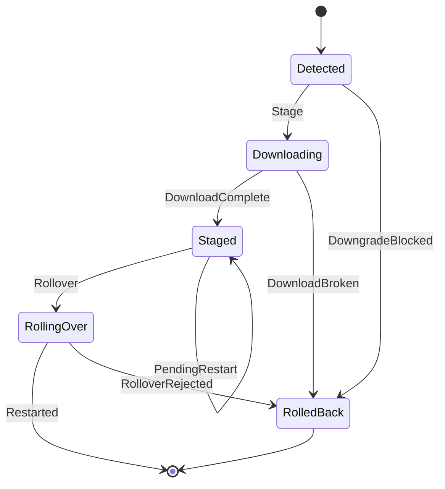
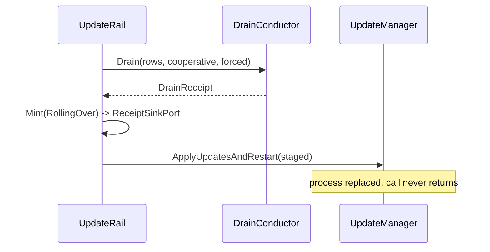

# [APPHOST_PROVISIONING_AND_UPDATE]

Rasm.AppHost owns post-fetch updates through one `UpdateManager` state machine: download, supply-chain admission, staging, drain, restart, and phase receipts. `UpdateChannel` rows carry the release ring and its downgrade policy while the feed itself binds from configuration at boot. `FleetRoll` walks `MembershipView.Serving` through health-gated canary, blue-green, or linear waves selected by a `FlagVerdict`. `UpdateCheck(ReleaseIdentity)` remains the outbound detect leg; this page owns every later phase over Velopack, `SupplyChainGate`, `DrainConductor` (consumed whole through one `DrainThread` carrying its `ILatencyContext`/`CheckpointToken`/`InstrumentSet` tail), `ReceiptSinkPort`, the features owner's `RolloutSegment`/`FlagVerdict` seam, and generated metrics.

## [01]-[INDEX]

- [02]-[UPDATE_RAIL]: Post-fetch state machine, fault band, per-phase receipt, and generated instruments.
- [03]-[CHANNEL_AXIS]: Three feed rows binding explicit channel and downgrade policy onto options.
- [04]-[ROLLOVER_DRAIN]: Drain-before-swap handshake and the canary/blue-green/linear-wave `RollStrategy` axis over a health-gated fleet-wide wave.

## [02]-[UPDATE_RAIL]

- Owner: `UpdatePhase` `[SmartEnum<string>]` five post-fetch phases under the `ComparerAccessors.StringOrdinal` accessor, carrying the `Next` advance arm; `UpdateOutcome` `[Union]` terminal disposition; `UpdateFault` `[Union]` fault family deriving its codes through `FaultBand.Update`; `UpdateReceipt` per-phase evidence record implementing the kernel `IValidityEvidence` fold; `UpdateMetrics` source-gen instrument partial under the `CounterAttribute`/`HistogramAttribute` generator; `UpdateRail` boundary capsule owning the `UpdateManager` handle and the staged-pending probe.
- Cases: 5 phase rows — detected, downloading, staged, rolling-over, rolled-back, each answering `Next` with its success successor and both terminals answering `None`; outcomes restarted | staged-pending | rolled-back | declined; `UpdateFault` = Text | DownloadBroken | StagePending | RolloverRejected | DowngradeBlocked | AdmissionRejected | FeedUnbound.
- Entry: `IO<UpdateReceipt> Stage(UpdateInfo found, IProgress<int> progress, CancellationToken token)` carries the download-and-stage effect and forecloses a blocked downgrade before transfer; `IO<UpdateReceipt> Rollover(VelopackAsset asset, DrainThread drain)` carries the drain-gated restart effect; `IO<UpdateReceipt> Resume(DrainThread drain)` re-enters a staged-pending release after a process bounce.
- Auto: every phase commit mints one `UpdateReceipt` fanned to `ReceiptSinkPort.Send` under the `Rasm.AppHost` package key; the generated counter rises per staged and per rollback phase and the generated histogram records the rollover span; `IsUpdatePendingRestart` is read at boot so a staged-but-unrestarted release re-enters the rail at the staged phase without a second download.
- Receipt: `UpdateReceipt` — phase, channel key, target version, prior version, downgrade flag, delta count, `Instant`, elapsed `Duration`, outcome, correlation id.
- Packages: Velopack, Thinktecture.Runtime.Extensions, LanguageExt.Core, NodaTime, Microsoft.Extensions.Telemetry.Abstractions, Rasm (kernel `IValidityEvidence`/`ValidityClaim`), BCL inbox.
- Growth: one phase row and its `Next` arm, one outcome case, or one fault case breaks every dispatch site at compile time; one instrument is one strongly-typed metric-attribute factory; zero new surface.
- Boundary: `UpdateRail` is the named boundary capsule for the statement carve-out — the `UpdateManager` ctor, the awaited download, and the terminal `ApplyUpdatesAndRestart` carry language-owned statement forms while every other member stays expression-shaped; the rail composes `UpdateManager` directly with no rename adapter — the `UpdateChannel` axis is the only added vocabulary; `VelopackApp.Build()...Run()` is the process-entry bootstrap owned at the app root, never a rail fence, so `VelopackHook` registration stays at the app root and never enters this page; `ApplyUpdatesAndRestart` takes `found.TargetFullRelease` as its `VelopackAsset`, never the `UpdateInfo`, and the call never returns because the host process is replaced — the rolled-over receipt mints and fans before the call; `found.IsDowngrade` — the SHIPPED flag, never a re-derived `target.Version < CurrentVersion` comparison, which reads a lateral re-publish at the same version as a forward roll — against the channel's `AllowVersionDowngrade` column forecloses a disallowed downgrade as `DowngradeBlocked` before any byte transfers; the feed url is the boot-resolved `FeedBinding`, never a row literal, so the rail dials only a proven configuration value; an inline `meter.CreateCounter` call is the deleted form — every spine instrument is a generated factory whose name and tag set are declaration facts and whose generated metric type exposes the strongly-typed `Add`/`Record` over the channel-key tag; the `Target` fold reads `VelopackAsset.Version` (a `SemanticVersion`) through `ToString`, the single version-stamp seam; `UpdateReceipt` rides the suite wire law as one `AppHostWireContext` `[JsonSerializable]` row; `vpk`-side notarization and SBOM emission are build-time signing concerns and carry no rail fence, but `SupplyChainGate.Admit` verifies a downloaded release before staging as `AdmissionSubject.Release`, never a skipped step or second gate; the page is host-local and crosses no browser or peer TS wire — `UpdateReceipt` and `FleetRollReceipt` reconstruct in TS solely through `ReceiptEnvelopeWire`, so the page authors no second wire shape.

```csharp signature

[SmartEnum<string>]
[KeyMemberEqualityComparer<ComparerAccessors.StringOrdinal, string>]
[KeyMemberComparer<ComparerAccessors.StringOrdinal, string>]
public sealed partial class UpdatePhase {
    public static readonly UpdatePhase Detected = new("detected");
    public static readonly UpdatePhase Downloading = new("downloading");
    public static readonly UpdatePhase Staged = new("staged");
    public static readonly UpdatePhase RollingOver = new("rolling-over");
    public static readonly UpdatePhase RolledBack = new("rolled-back");

    // Next is the ADVANCE arm and carries only the success successor: a fault diverts to RolledBack through
    // the outcome union, so the failure edge never doubles as a phase transition. Both terminals answer None —
    // RollingOver because the process is replaced and no later phase runs in it, RolledBack because it is
    // terminal by definition — which is what makes the arm total and a new phase row a compile break here.
    public Option<UpdatePhase> Next => Switch(
        detected: static () => Some(Downloading),
        downloading: static () => Some(Staged),
        staged: static () => Some(RollingOver),
        rollingOver: static () => Option<UpdatePhase>.None,
        rolledBack: static () => Option<UpdatePhase>.None);
}

[Union]
public abstract partial record UpdateOutcome {
    private UpdateOutcome() { }
    public sealed record Restarted(string Target) : UpdateOutcome;
    public sealed record StagedPending(string Target) : UpdateOutcome;
    public sealed record RolledBack(string Prior, UpdateFault Cause) : UpdateOutcome;
    public sealed record Declined(string Reason) : UpdateOutcome;
}

[Union]
public abstract partial record UpdateFault : Expected, IValidationError<UpdateFault> {
    private UpdateFault(string detail, int code) : base(detail, code, None) { }
    public static UpdateFault Create(string message) => new Text(message);
    public sealed record Text : UpdateFault { public Text(string detail) : base(detail, FaultBand.Update.Code(0)) { } }
    public sealed record DownloadBroken : UpdateFault { public DownloadBroken(string detail) : base(detail, FaultBand.Update.Code(1)) { } }
    public sealed record StagePending : UpdateFault { public StagePending(string detail) : base(detail, FaultBand.Update.Code(2)) { } }
    public sealed record RolloverRejected : UpdateFault { public RolloverRejected(string detail) : base(detail, FaultBand.Update.Code(3)) { } }
    public sealed record DowngradeBlocked : UpdateFault { public DowngradeBlocked(string detail) : base(detail, FaultBand.Update.Code(4)) { } }
    public sealed record AdmissionRejected : UpdateFault { public AdmissionRejected(string detail) : base(detail, FaultBand.Update.Code(5)) { } }
    public sealed record FeedUnbound : UpdateFault { public FeedUnbound(string key) : base($"{key}: unset or not absolute", FaultBand.Update.Code(6)) { } }
}

public sealed record UpdateReceipt(
    UpdatePhase Phase,
    string Channel,
    string Target,
    string Prior,
    bool Downgrade,
    int Deltas,
    Instant At,
    Duration Elapsed,
    UpdateOutcome Outcome,
    CorrelationId Correlation) : IValidityEvidence {
    // Phase and outcome are two projections of one transition and a receipt where they disagree records a
    // state the machine cannot reach — a Staged phase carrying RolledBack, or a RolledBack phase claiming a
    // restart. The oracle probes this fold ahead of any category default, so an incoherent receipt is refused
    // at acceptance rather than read back later as evidence of a rollover that never happened.
    [JsonIgnore]
    public bool IsValid => ValidityClaim.All(
        ValidityClaim.Of((Phase == UpdatePhase.RolledBack) == (Outcome is UpdateOutcome.RolledBack)),
        ValidityClaim.Of(Outcome is not UpdateOutcome.Restarted || Phase == UpdatePhase.RollingOver),
        ValidityClaim.Of(Elapsed >= Duration.Zero && Deltas >= 0)).Holds;
}

public static partial class UpdateMetrics {
    [Counter(nameof(UpdateChannel), Name = "rasm.apphost.update.staged")]
    public static partial StagedMetric Staged(Meter meter);

    [Counter(nameof(UpdateChannel), Name = "rasm.apphost.update.rollback")]
    public static partial RollbackMetric Rollback(Meter meter);

    [Histogram(nameof(UpdateChannel), Name = "rasm.apphost.update.rollover.duration")]
    public static partial RolloverDurationMetric RolloverDuration(Meter meter);
}

public sealed class UpdateRail {
    readonly UpdateManager manager;
    readonly UpdateChannel channel;
    readonly Lifecycle host;
    readonly ReceiptSinkPort sink;
    readonly SupplyChainGate.Runtime gate;
    readonly StagedMetric staged;
    readonly RollbackMetric rollback;
    readonly RolloverDurationMetric rolloverDuration;

    // The binding arrives already resolved and validated, so the rail never reads configuration and never
    // dials an unproven host: a refused feed stopped at boot with a named key, and the ring travels ON the
    // binding rather than beside it, which is why there is no second channel parameter to disagree with it.
    public UpdateRail(FeedBinding feed, Lifecycle host, ReceiptSinkPort sink, SupplyChainGate.Runtime gate, Meter meter) {
        this.channel = feed.Channel;
        this.host = host;
        this.sink = sink;
        this.gate = gate;
        this.manager = new UpdateManager(feed.Feed.AbsoluteUri, new UpdateOptions {
            ExplicitChannel = channel.ExplicitChannel,
            AllowVersionDowngrade = channel.AllowVersionDowngrade,
        });
        this.staged = UpdateMetrics.Staged(meter);
        this.rollback = UpdateMetrics.Rollback(meter);
        this.rolloverDuration = UpdateMetrics.RolloverDuration(meter);
    }

    public bool PendingRestart => manager.IsUpdatePendingRestart;
    public Option<VelopackAsset> Pending => Optional(manager.UpdatePendingRestart);
    string Prior => manager.CurrentVersion?.ToString() ?? string.Empty;

    // IsDowngrade is the SHIPPED flag and the hand-rolled `target.Version < CurrentVersion` comparison it
    // replaces was strictly narrower: Velopack's flag also covers the LATERAL move — a re-published build at
    // the same version — which a strict less-than reads as a forward roll and stages without the policy check.
    public IO<UpdateReceipt> Stage(UpdateInfo found, IProgress<int> progress, CancellationToken token) =>
        found.IsDowngrade && !channel.AllowVersionDowngrade
            ? from blocked in Mint(UpdatePhase.RolledBack, Target(found.TargetFullRelease), found.IsDowngrade, found.DeltasToTarget.Length, Duration.Zero, new UpdateOutcome.RolledBack(Prior, new UpdateFault.DowngradeBlocked(Target(found.TargetFullRelease))))
              from _ in IO.lift(() => rollback.Add(1, channel.Key))
              select blocked
            : from start in IO.lift(() => host.Clock.GetCurrentInstant())
              from downloading in Mint(UpdatePhase.Downloading, Target(found.TargetFullRelease), found.IsDowngrade, found.DeltasToTarget.Length, Duration.Zero, new UpdateOutcome.StagedPending(Target(found.TargetFullRelease)))
              from done in IO.liftAsync(async () => {
                  await manager.DownloadUpdatesAsync(found, progress.Report, token).ConfigureAwait(false);
                  return unit;
              })
              // SupplyChainGate verifies the download BEFORE it stages, so a forged or
              // out-of-contract release never reaches ApplyUpdatesAndRestart — a failed admit mints a
              // RolledBack receipt carrying the supply-chain fault rather than staging the bytes.
              from admitted in SupplyChainGate.Admit(gate, new AdmissionSubject.Release(found.TargetFullRelease, channel), token)
              from finish in IO.lift(() => host.Clock.GetCurrentInstant())
              from receipt in admitted.Match(
                  Succ: _ => Mint(UpdatePhase.Staged, Target(found.TargetFullRelease), found.IsDowngrade, found.DeltasToTarget.Length, finish - start, new UpdateOutcome.StagedPending(Target(found.TargetFullRelease))),
                  Fail: faults => Mint(UpdatePhase.RolledBack, Target(found.TargetFullRelease), found.IsDowngrade, found.DeltasToTarget.Length, finish - start, new UpdateOutcome.RolledBack(Prior, new UpdateFault.AdmissionRejected(string.Join("; ", faults.Map(static f => f.Message))))))
              from _ in IO.lift(() => admitted.IsSuccess ? staged.Add(1, channel.Key) : rollback.Add(1, channel.Key))
              select receipt;

    public IO<UpdateReceipt> Rollover(VelopackAsset asset, DrainThread drain) =>
        from drained in host.Drain(DrainRows(), drain.Latency, drain.Cooperative.Allotted, drain.Forced.Allotted, drain.Checkpoint, drain.Instruments)
        // Seal is the drain band's export act: the frozen ledger leaves through the exporter BEFORE the process
        // is replaced, so the last drain's checkpoints are evidence the successor can read, never lost memory.
        from _sealed in LatencySpine.Seal(drain.Exporter, drain.Latency)
        from rolling in Mint(UpdatePhase.RollingOver, Target(asset), false, 0, drained.Elapsed, new UpdateOutcome.Restarted(Target(asset)))
        from _ in IO.lift(() => rolloverDuration.Record((host.Clock.GetCurrentInstant() - drained.At).TotalSeconds, channel.Key))
        from applied in IO.lift(fun(() => manager.ApplyUpdatesAndRestart(asset)))
        select rolling;

    public IO<UpdateReceipt> Resume(DrainThread drain) =>
        Pending.Match(
            Some: asset => Rollover(asset, drain),
            None: () => Mint(UpdatePhase.Detected, string.Empty, false, 0, Duration.Zero, new UpdateOutcome.Declined(nameof(UpdatePhase.Detected))));

    Seq<(string Name, DrainBand Band, int Rank, Func<CancellationToken, IO<Unit>> Drain)> DrainRows() =>
        [(nameof(UpdateRail), DrainBand.Stores, 0, static _ => IO.pure(unit))];

    IO<UpdateReceipt> Mint(UpdatePhase phase, string target, bool downgrade, int deltas, Duration elapsed, UpdateOutcome outcome) =>
        from at in IO.lift(() => host.Clock.GetCurrentInstant())
        let receipt = new UpdateReceipt(phase, channel.Key, target, Prior, downgrade, deltas, at, elapsed, outcome, host.CorrelationId)
        from _ in sink.Send(host.CorrelationId, TenantContext.Current, TelemetrySource.AppHost.Key, phase.Key, JsonSerializer.SerializeToElement(receipt, SuiteContracts.Host))
        select receipt;

    static string Target(VelopackAsset asset) => asset.Version.ToString();
}
```


```mermaid
stateDiagram-v2
    accTitle: Update phase state
    accDescr: Downloaded releases stage, roll over, or end in rollback.
    [*] --> Detected
    Detected --> Downloading : Stage
    Detected --> RolledBack : DowngradeBlocked
    Downloading --> Staged : DownloadComplete
    Downloading --> RolledBack : DownloadBroken
    Staged --> RollingOver : Rollover
    Staged --> Staged : PendingRestart
    RollingOver --> [*] : Restarted
    RollingOver --> RolledBack : RolloverRejected
    RolledBack --> [*]
```

## [03]-[CHANNEL_AXIS]

- Owner: `UpdateChannel` `[SmartEnum<string>]` three release-ring rows under the `ComparerAccessors.StringOrdinal` accessor, carrying the explicit-channel string and the downgrade-allow column; `FeedBinding` the config-resolved per-channel feed the rail dials.
- Cases: 3 channel rows — stable, beta, canary.
- Entry: `UpdateChannel.From(ReleaseIdentity installed)` resolves the row from the detect-leg identity's channel string under the ordinal accessor; `FeedBinding.Of(UpdateChannel channel, IConfiguration configuration)` returns `Fin<FeedBinding>` — the boot-time resolve of that channel's feed key through the ranked `ConfigSource` chain, refusing an unset or non-absolute value on the typed rail under the channel's own name.
- Auto: the resolved row's `ExplicitChannel` seats `UpdateOptions.ExplicitChannel` and its `AllowVersionDowngrade` seats `UpdateOptions.AllowVersionDowngrade`, while the `UpdateManager` ctor url comes from the `FeedBinding` the composition resolved — the two declared columns plus one bound value are the whole update-options surface the rail writes; `MaximumDeltasBeforeFallback` stays unset so the full-package fallback governs; canary alone admits a downgrade so a forward-rolled canary build reverts to its prior pin.
- Receipt: the channel key stamps `UpdateReceipt.Channel` and keys the `AddView` cardinality cap on every update instrument; a refused binding rides the boot `Fin` rail naming the channel and its key, never a receipt.
- Packages: Velopack, Microsoft.Extensions.Configuration, Thinktecture.Runtime.Extensions, LanguageExt.Core.
- Growth: one channel row carries one explicit-channel string and one downgrade column plus one config key its binding reads; a ring split lands as one row and one key, never a second axis; zero new surface.
- Boundary: the axis owns the release-RING decision and never the feed VALUE — a feed URI is a deploy fact that differs per environment, per tenant, and per air-gapped mirror, so a literal frozen into a settled row is the deleted form twice over: it asserts a value no surface was read for, and it forecloses the offline and mirror cases the supply-chain gate exists to serve; the feed therefore binds from the `Runtime/config#POLICY_VALUES` ranked source chain and validates at boot, so an unset or unreachable feed refuses on the typed rail under a named channel instead of surfacing later as a network fault from a dead host; the detect-leg `ReleaseIdentity.Feed` is the outbound poll URI of the `UpdateCheck` hop, a distinct value the axis never reads; `ExplicitChannel` is the Velopack channel-suffix selector that pins which release set the manager resolves; `AllowVersionDowngrade` is the downgrade-policy column the rail reads before any transfer, never a per-call flag; the `AddView` rows at signal-governance cap update-instrument cardinality on the channel key so three channels cap at three series per instrument.

```csharp signature
[SmartEnum<string>]
[KeyMemberEqualityComparer<ComparerAccessors.StringOrdinal, string>]
[KeyMemberComparer<ComparerAccessors.StringOrdinal, string>]
public sealed partial class UpdateChannel {
    public static readonly UpdateChannel Stable = new("stable", explicitChannel: "stable", allowVersionDowngrade: false);
    public static readonly UpdateChannel Beta = new("beta", explicitChannel: "beta", allowVersionDowngrade: false);
    public static readonly UpdateChannel Canary = new("canary", explicitChannel: "canary", allowVersionDowngrade: true);

    public string ExplicitChannel { get; }
    public bool AllowVersionDowngrade { get; }

    public static UpdateChannel From(ReleaseIdentity installed) =>
        TryGet(installed.Channel, out var row) ? row : Stable;
}

// The feed BINDS, it does not declare. One key per ring under the section root the config grammar mints from
// nameof, its suffix being the ring's own key, so a new ring reaches configuration with zero edit here. Boot
// resolves every ring the composition will dial: an absent key and a value that is not an absolute URI both
// refuse on the typed rail naming the ring AND the key an operator must set. A frozen literal could report
// neither — it dials whatever it was born with and a host that stops resolving surfaces mid-transfer as a
// network fault with no configuration to correct, which is also why the mirror and air-gapped installs the
// supply-chain gate exists to serve are unreachable from a settled row.
public sealed record FeedBinding(UpdateChannel Channel, Uri Feed) {
    public const string Section = nameof(FeedBinding);

    public static string KeyOf(UpdateChannel channel) => $"{Section}:{channel.Key}";

    public static Fin<FeedBinding> Of(UpdateChannel channel, IConfiguration configuration) =>
        Uri.TryCreate(configuration[KeyOf(channel)], UriKind.Absolute, out var feed)
            ? Fin.Succ(new FeedBinding(channel, feed))
            : Fin.Fail<FeedBinding>(new UpdateFault.FeedUnbound(KeyOf(channel)));
}
```

## [04]-[ROLLOVER_DRAIN]

- Owner: `RolloverDrain` static surface composing `DrainConductor.Drain` ahead of `UpdateRail.Rollover` so a node empties before its process is replaced; `DrainThread` the composition-supplied record carrying the conductor's telemetry tail and the two deadline rows; `RollStrategy` `[SmartEnum<string>]` the progressive-delivery axis (canary, blue-green, linear-wave) with delegate-backed cohort planning over the features owner's `RolloutSegment` exposure band, the `From(FlagVerdict)` verdict seat, and the shared outcome-and-health advance fold; `RollPlan` the per-wave cohort projection; `FleetRoll` the fleet-wide rolling-update conductor walking `MembershipView.Serving` in strategy-shaped health-gated waves; `FleetRollReceipt` the per-wave fleet-progress projection riding the existing receipt stream; `RollAnnotationWire` the per-wave deploy-annotation record folded off the roll receipts, joining the `AppHostWireContext` roster and fanned under `InstrumentFan.RollKind` so the estate dashboard timeline marks every fleet wave.
- Cases: two conduct paths on the local node — `Conduct` for a staged asset, `ConductPending` for a post-bounce resume; three roll strategies — `Canary` rolls a single-node probe then expands the cohort on a health-hold, `BlueGreen` swaps a parallel half-fleet cohort on a health-pass, `LinearWave` advances fixed N% increments with a bake window between waves; one fleet conduct — `FleetRoll.Roll` paces the wave across the cluster serving set, the `RollStrategy` row shaping each next cohort off the prior cohort's recovered serving status.
- Entry: `IO<UpdateReceipt> Conduct(UpdateRail rail, VelopackAsset staged, DrainThread drain)` — `IO` carries the drain-then-restart effect; the drain receipt seats the rollover, and the `DrainThread` record carries the whole `DrainConductor.Drain` tail (latency context, checkpoint token, instrument set) beside the two deadline rows, so a conductor-side signature change lands on one record rather than three call sites; `IO<Seq<FleetRollReceipt>> Roll(MembershipView membership, UpdateChannel channel, RollStrategy strategy, Func<MemberRecord, IO<UpdateReceipt>> rollNode, Func<MemberRecord, IO<HealthReport>> probe, Func<Duration, IO<Unit>> bake, ReceiptSinkPort sink, IClock clock, TenantContext tenant)` plans the cohorts from `RollStrategy.Plan(membership.Serving)`, rolls each cohort, waits on the post-roll `WireHealth.Evaluate` serving probe, then bakes the strategy's inter-wave dwell through the injected clock-driven `bake` delegate before the next cohort admits.
- Auto: the conductor's first act is the draining transition, so inbound admission ceases before the staged release rolls over; the cooperative and forced budgets arrive from the `DrainCooperative` and `DrainForced` deadline rows; the rollover histogram records the span from drain settle to restart handoff; on a fleet node the parent's drain registration fans the signal to the child over the local-ipc hop before the parent itself rolls over; `RollStrategy.Plan` folds `MembershipView.Serving` into the ordered cohort sequence the strategy shape dictates — `Canary` plans a 1-node lead cohort then the remainder, while `BlueGreen` and `LinearWave` derive every cohort width from their `RolloutSegment` exposure band through the features owner's one `Cohort(population)` projection and apply the row's `BakeWindow` dwell — and `FleetRoll.Roll` rolls each cohort, commits its annotation, then advances only when every node carries `UpdateOutcome.Restarted` and returns `Serving`; rollback, declined, staged-pending, and `NotServing` evidence hold the wave before bake or recursion; the canary health-hold reuses the existing `HealthSnapshot`/`DegradationLevel` gate through the `probe`, never a new probe owner; the strategy row also threads the targeting plane — `RollStrategy.From(FlagVerdict)` keys the row off the verdict's variant exactly as `Agent/reasoning#MODEL_GOVERNANCE` keys `ModelRoute.From`, so progressive binary rollout and feature rollout read one seam and an inert features rail resolves the narrowest exposure rather than an unguarded wave.
- Receipt: the `RollingOver` `UpdateReceipt` carries the `DrainReceipt.Elapsed` as its drain span and the rollover outcome; a straggled drain step does not abort the rollover — the restart proceeds and the straggler surfaces on the drain receipt the rollover receipt references by correlation id; each `FleetRoll` cohort mints one `FleetRollReceipt` — wave index, the `RollStrategy` key, node id, the node's terminal `UpdateOutcome`, post-roll serving status, and the live nodes-remaining countdown (the un-rolled tail of the current cohort and every later cohort, never the constant fleet count) — fanned through the existing receipt stream beside the per-node `UpdateReceipt`, never a parallel fleet instrument; each wave folds one `RollAnnotationWire` — wave, channel, strategy, advanced/held/rolled-back verdict, host count, live remaining, instant — fanned under `InstrumentFan.RollKind`, the deploy-annotation the TypeScript iac timeline rail ingests through the existing `ReceiptEnvelopeWire`.
- Packages: Velopack, LanguageExt.Core, NodaTime, Thinktecture.Runtime.Extensions, Microsoft.Extensions.Telemetry.Abstractions, Rasm (kernel `IValidityEvidence`/`ValidityClaim`/`InstrumentSet`).
- Growth: one drain participant row per update-sensitive subsystem registered through `DrainParticipantPort` at its declared band; a new progressive strategy is one `RollStrategy` row with its plan delegate and policy columns, never a second roll state machine; a wave-width retune is the row's `RolloutSegment` band; zero new surface.
- Boundary: drain-before-swap is the law — `ApplyUpdatesAndRestart` is never reached until `DrainConductor.Drain` settles, so the replaced process leaves no half-flushed store write or in-flight hop; the cooperative and forced deadline values are the `DrainCooperative`/`DrainForced` rows, never an inline literal, and the latency context, checkpoint token, and instrument set the conductor's tail demands arrive on the `DrainThread` from the composition root — this page consumes the drain fold and declares none of its three telemetry threads; the staged asset is `UpdatePendingRestart` read at composition, so a rollover after a process bounce resumes from the staged phase without re-staging; the rollover is the single restart path — the bare `ApplyUpdatesAndExit` and `WaitExitThenApplyUpdates` forms are deleted because the drain-gated restart owns the handoff; `RollStrategy` is one row on the existing `FleetRoll`, not a parallel conductor — a second roll state machine or a strategy-specific scheduler beside `ScheduleEntry.Spread` is the rejected form, and the `ScheduleEntry.Spread` fleet-spread seed stays the wave-pacing cadence the strategy `BakeWindow` reads, never a new scheduler; `FleetRoll` consumes `MembershipView.Serving` as fleet membership and `WireHealthRow` as the recovery gate; each node rolls through the same `RolloverDrain.Conduct`, and the first unrecovered node halts the fleet; fenced conductor election keeps one conductor per fleet so two nodes never drive overlapping waves.

```csharp signature
// The drain thread the composition root owns, travelling as ONE record because every rollover call site needs
// all five and the conductor's own signature proves it: the latency context it marks against, the checkpoint
// token bounding the flush, and the instrument set the band distribution writes arrive from
// `Observability/telemetry#SIGNAL_GOVERNANCE` and `Observability/instruments#INSTRUMENT_CATALOG`, never minted
// here — this page is a drain CONSUMER. Threading them as loose parameters is the deleted form: each of the
// three consumers below would then carry its own five-argument list and drift one argument at a time from the
// conductor's, which is precisely how the pre-tail call site fell two arguments behind.
public sealed record DrainThread(
    ILatencyContext Latency,
    CheckpointToken Checkpoint,
    InstrumentSet Instruments,
    DeadlineClass Cooperative,
    DeadlineClass Forced,
    ILatencyDataExporter Exporter);

public static class RolloverDrain {
    public static IO<UpdateReceipt> Conduct(UpdateRail rail, VelopackAsset staged, DrainThread drain) =>
        rail.Rollover(staged, drain);

    public static IO<UpdateReceipt> ConductPending(UpdateRail rail, DrainThread drain) =>
        rail.PendingRestart
            ? rail.Resume(drain)
            : IO.fail<UpdateReceipt>(new UpdateFault.StagePending(nameof(rail.PendingRestart)));
}

// RollStrategy carries one cohort plan, recover-and-advance
// predicate, and the inter-wave bake window. Plan folds the roster into the ordered cohort sequence the
// strategy shape dictates; Advances admits the following cohort only on a held health-pass. A second roll
// state machine beside this axis is the rejected form.
public sealed record RollPlan(Seq<Seq<MemberRecord>> Cohorts, Duration BakeWindow);

[SmartEnum<string>]
[KeyMemberEqualityComparer<ComparerAccessors.StringOrdinal, string>]
[KeyMemberComparer<ComparerAccessors.StringOrdinal, string>]
public sealed partial class RollStrategy {
    public static readonly RollStrategy Canary = new("canary", wave: RolloutSegment.Create(0), bake: Duration.FromSeconds(120),
        plan: static (nodes, _) => nodes.IsEmpty ? [] : Seq(nodes.Take(1).ToSeq()).Add(nodes.Skip(1).ToSeq()).Filter(static c => !c.IsEmpty));
    public static readonly RollStrategy BlueGreen = new("blue-green", wave: RolloutSegment.Create(50), bake: Duration.Zero,
        plan: static (nodes, wave) => nodes.IsEmpty ? [] : Chunk(nodes, wave.Cohort(nodes.Count)));
    public static readonly RollStrategy LinearWave = new("linear-wave", wave: RolloutSegment.Create(25), bake: Duration.FromSeconds(300),
        plan: static (nodes, wave) => nodes.IsEmpty ? [] : Chunk(nodes, wave.Cohort(nodes.Count)));

    // The exposure band is the features owner's own [0,100) value object, so a wave width and a flag rollout
    // segment are ONE percentage vocabulary the estate validates once. A page-local `Width(count, percent)`
    // helper is the ad-hoc percentage-rollout computation `Runtime/features#FLAG_DEFINITION` names deleted,
    // and it silently admitted an out-of-band literal that the value object's factory refuses at type init.
    public RolloutSegment Wave { get; }
    public Duration Bake { get; }

    // The features rail decides WHICH strategy a wave runs and this page decides what the strategy does, so
    // the verdict's variant keys the row exactly as `ModelRoute.From` keys a model route off the same seam.
    // An unknown variant and an absent features rail both fall to Canary, the narrowest exposure, because an
    // unresolved verdict must never widen a fleet rollout past the safest wave.
    public static readonly RollStrategy Default = Canary;

    public static RollStrategy From(FlagVerdict verdict) =>
        TryGet(verdict.Variant, out var row) ? row : Default;

    [UseDelegateFromConstructor]
    public partial Seq<Seq<MemberRecord>> Cohorts(Seq<MemberRecord> nodes, RolloutSegment wave);

    public RollPlan Plan(Seq<MemberRecord> nodes) => new(Cohorts(nodes, Wave), Bake);

    // A health-pass advances only a cohort whose nodes restarted and returned to service; rollback,
    // staged-pending, declined, or NotServing evidence holds the wave after its annotation commits.
    public bool Advances(Seq<FleetRollReceipt> cohort) => cohort.ForAll(static row =>
        row.Outcome is UpdateOutcome.Restarted && row.Serving == ServingStatus.Serving);

    static Seq<Seq<MemberRecord>> Chunk(Seq<MemberRecord> nodes, int width) =>
        toSeq(nodes.Chunk(width).Select(static c => toSeq(c)));
}

public readonly record struct FleetRollReceipt(
    int Wave,
    string Strategy,
    int NodeId,
    UpdateOutcome Outcome,
    ServingStatus Serving,
    int Remaining,
    Instant At) : IValidityEvidence {
    // Remaining counts DOWN across the whole plan, so a negative value or a wave index below zero is a fold
    // that mis-counted its own tail rather than a fleet state — and a wave whose nodes all reported Restarted
    // while the countdown never moved is the same defect read from the other end.
    [JsonIgnore]
    public bool IsValid => ValidityClaim.All(
        ValidityClaim.Of(Wave >= 0 && Remaining >= 0),
        ValidityClaim.Of(!string.IsNullOrEmpty(Strategy))).Holds;
}

// RollAnnotationWire folds one record per wave off the roll receipts — wave,
// channel, strategy, verdict, host count, live remaining, instant — HLC-stamped on the receipt fan
// under InstrumentFan.RollKind so the estate dashboard timeline marks every fleet wave beside stack
// deploys, and a rollback annotates as loudly as an advance; a parallel deploy-event sender is the
// deleted form.
public readonly record struct RollAnnotationWire(
    int Wave,
    string Channel,
    string Strategy,
    string Verdict,
    int HostCount,
    int Remaining,
    Instant At) {
    public const string Advanced = "advanced";
    public const string Held = "held";
    public const string RolledBack = "rolled-back";

    public static RollAnnotationWire From(UpdateChannel channel, RollStrategy strategy, int wave, Seq<FleetRollReceipt> cohort, bool advanced, Instant at) =>
        new(wave, channel.Key, strategy.Key,
            cohort.Exists(static row => row.Outcome is UpdateOutcome.RolledBack) ? RolledBack : advanced ? Advanced : Held,
            cohort.Count,
            cohort.Last.Map(static row => row.Remaining).IfNone(0),
            at);
}

public static class FleetRoll {
    // Bake delay rides the injected clock-driven `bake` delegate (the SchedulePort cadence the strategy
    // BakeWindow reads, test-fakeable through the same TimeProvider the spine injects), never an ambient
    // Task.Delay — so a LinearWave bakes its 300s window and a Canary holds its 120s probe between cohorts.
    public static IO<Seq<FleetRollReceipt>> Roll(
        MembershipView membership,
        UpdateChannel channel,
        RollStrategy strategy,
        Func<MemberRecord, IO<UpdateReceipt>> rollNode,
        Func<MemberRecord, IO<HealthReport>> probe,
        Func<Duration, IO<Unit>> bake,
        ReceiptSinkPort sink,
        IClock clock,
        TenantContext tenant) =>
        strategy.Plan(membership.Serving) is var plan
            ? Wave(plan.Cohorts, 0, channel, strategy, plan, rollNode, probe, bake, sink, clock, tenant)
            : IO.pure(Seq<FleetRollReceipt>());

    static IO<Seq<FleetRollReceipt>> Wave(
        Seq<Seq<MemberRecord>> cohorts, int index, UpdateChannel channel, RollStrategy strategy, RollPlan plan,
        Func<MemberRecord, IO<UpdateReceipt>> rollNode, Func<MemberRecord, IO<HealthReport>> probe,
        Func<Duration, IO<Unit>> bake, ReceiptSinkPort sink, IClock clock, TenantContext tenant) =>
        cohorts.Head.Match(
            Some: cohort => cohort.Map(static (node, slot) => (node, slot))
                .TraverseM(pair =>
                    from rolled in rollNode(pair.node)
                    from report in probe(pair.node)
                    from at in IO.lift(() => clock.GetCurrentInstant())
                    // Remaining counts down live — the un-rolled tail of this cohort plus every later
                    // cohort — never the constant fleet serving count.
                    let receipt = new FleetRollReceipt(index, strategy.Key, pair.node.NodeId, rolled.Outcome, Serving(report),
                        cohort.Count - pair.slot - 1 + cohorts.Tail.Sum(static c => c.Count), at)
                    from _ in sink.Send(Correlation.Mint(), tenant, TelemetrySource.AppHost.Key, nameof(FleetRoll),
                        JsonSerializer.SerializeToElement(receipt, SuiteContracts.Host))
                    select receipt)
                .As()
                .Bind(here =>
                    from at in IO.lift(() => clock.GetCurrentInstant())
                    let advanced = strategy.Advances(here)
                    // One annotation per wave — the deploy-timeline record the RollKind fan arm projects.
                    from _ in sink.Send(Correlation.Mint(), tenant, TelemetrySource.AppHost.Key, InstrumentFan.RollKind,
                        JsonSerializer.SerializeToElement(RollAnnotationWire.From(channel, strategy, index, here, advanced, at), SuiteContracts.Host))
                    from rest in advanced && !cohorts.Tail.IsEmpty
                        // health-pass with a following cohort: bake the inter-wave dwell, then advance.
                        ? (plan.BakeWindow > Duration.Zero ? bake(plan.BakeWindow) : IO.pure(unit))
                            .Bind(__ => Wave(cohorts.Tail, index + 1, channel, strategy, plan, rollNode, probe, bake, sink, clock, tenant))
                        : IO.pure(Seq<FleetRollReceipt>())
                    select here + rest),
            None: static () => IO.pure(Seq<FleetRollReceipt>()));

    static ServingStatus Serving(HealthReport report) =>
        report.Status == HealthStatus.Unhealthy ? ServingStatus.NotServing : ServingStatus.Serving;
}
```


```mermaid
sequenceDiagram
    accTitle: Drain-gated restart handoff
    accDescr: UpdateRail drains the node, records rollover, and hands restart to Velopack.
    participant Rail as UpdateRail
    participant Drain as DrainConductor
    participant Velopack as UpdateManager
    Rail->>Drain: Drain(rows, cooperative, forced)
    Drain-->>Rail: DrainReceipt
    Rail->>Rail: Mint(RollingOver) -> ReceiptSinkPort
    Rail->>Velopack: ApplyUpdatesAndRestart(staged)
    Note over Velopack: process replaced, call never returns
```

## [05]-[RESEARCH]

(none)
