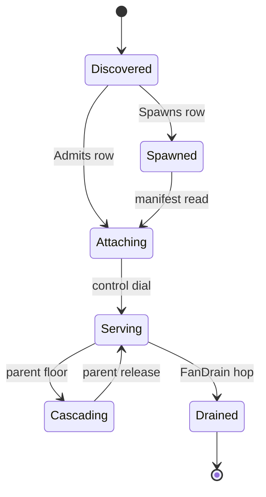
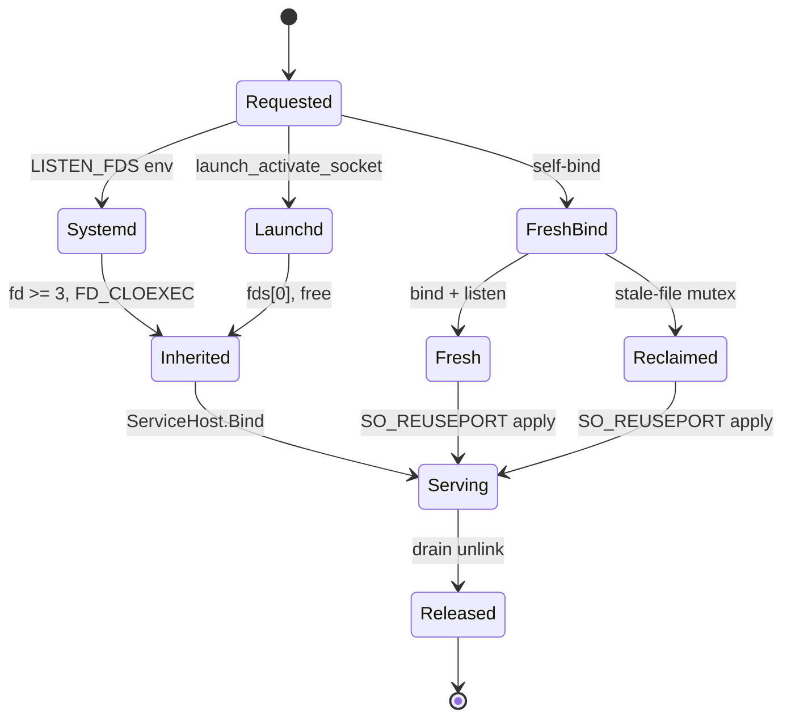

# [APPHOST_COMPANION_SIDECAR]

The inbound serving counterpart to the outbound boundary: one `ProcessModality` axis carries the companion, sidecar, and paired-peer spawn-attach-discovery-degradation rows, one `PeerRoster` folds every accepted connection into a lease-epoch attached-peer set on the serving side, one `ControlInbound` handler folds the three `ControlService` wire verbs onto the existing degradation, options, and support owners, one `ServiceHost` registration mounts the gRPC server over a Unix domain socket, one cross-process cascade writes a parent-observed level onto the child `DegradationCell.Cascade` floor, one `PeerAdmission` reads the connecting peer's credentials at accept over the managed raw-socket-option route, and one `HostBinding` owner acquires the serving endpoint over a nine-row OS-by-activation-source-by-address policy table that folds systemd socket activation, launchd socket activation, and a fresh bind into one acquisition through the `ServiceHost.Bind` listener seam. The page owns the modality axis, the attached-peer roster, the verb-fold handler, the server-host registration, the cascade write, the peer-credential read, and the host-binding acquisition; it consumes `DegradationCell`, `OptionsAdmission`, `SupportTrigger`, `HostAttachPort`, `ReceiptSinkPort`, and the `Discovery` UDS/manifest law as settled vocabulary, leaves SIGTERM/SIGQUIT/SIGHUP to `Runtime/lifecycle#FAULT_SPINE.ArmTraps` and readiness notify to `Runtime/profiles#LIFETIME_ADAPTERS.SystemdNotifier`, and mints no eighth port.

## [01]-[INDEX]

- [01]-[PROCESS_MODALITY]: Three modality rows and lease-epoch attached-peer roster on the serving side.
- [02]-[CONTROL_SERVICE]: Three wire verbs folded onto degradation, options, and support owners.
- [03]-[SERVICE_HOST]: gRPC server registration over a Unix domain socket.
- [04]-[DEGRADATION_CASCADE]: Parent floor written to the child cell over the control hop.
- [05]-[PEER_ADMISSION]: Accept-side peer-credential read over the managed raw-socket-option route.
- [06]-[HOST_BINDING]: OS x activation-source x address bind acquisition, reuse, and override.

## [02]-[PROCESS_MODALITY]

- Owner: `ProcessModality` `[SmartEnum<string>]` three rows under one `ProcessModalityKeyPolicy` comparer accessor; `ModalityRow` per-case policy record; `ModalityRows` frozen row set with the total dispatch; `CompanionPeer` the attached-child capsule the modality row produces; `PeerRoster` the `Atom`-backed serving-side attached-connection set carrying a monotone lease epoch; `RosterEntry` the per-connection lease record; `RosterReceipt` the join/renew/drop transition projection the sink fans.
- Cases: companion, sidecar, paired-peer — companion is the host-spawned single-shot child, sidecar is the externally-supervised attach-only peer, paired-peer is the symmetric dual-attach where each side both spawns and admits; three roster transitions — join on accept, renew on heartbeat, drop on lease expiry or disconnect.
- Entry: `ModalityRow Row` is the extension property total state-free `Switch` from case to frozen row; `Attach(ModalityRow row, ProcessStartInfo spec, Func<int, Fin<DiscoveryManifest>> manifestOf, Func<DiscoveryManifest, CancellationToken, IO<Unit>> drainFan, GrpcChannelPolicy policy)` returns `IO<CompanionPeer>` and carries the spawn-and-dial effect; `PeerRoster.Admit(PeerCredential credential, DiscoveryManifest manifest, Instant now)`, `.Renew(int pid, Instant now)`, and `.Drop(int pid, Instant now)` each fold one transition over the `Atom` and return `IO<RosterReceipt>` carrying the lease epoch.
- Auto: `Attach` reads the discovery manifest through the bound `Discovery.Read` projection and dials the control channel through `Discovery.Connect`, running the single-shot `Discovery.Spawn` only on rows whose `Spawns` column is set, and the `DegradesChild` column gates the cascade write; `Admit` keys the entry by the kernel-reported `PeerCredential.Pid` from the accept seam — never the manifest's self-asserted pid — and stamps the lease deadline from `LeasePolicy.Maintenance.CrashStaleness` so a peer's lease lapses on the same crash-staleness window the maintenance lease uses, `Renew` extends it, and `Sweep(Instant now)` drops every entry whose lease lapsed so a vanished peer leaves the roster without an explicit disconnect; every transition mints one `RosterReceipt` fanned through `ReceiptSinkPort.Send`.
- Receipt: `ModalityReceipt` — modality key, peer pid, attach outcome, elapsed `Duration`, cascade-eligible flag; `RosterReceipt` — transition kind, peer pid+uid, lease epoch, attached-count after the fold, `Instant`.
- Packages: Thinktecture.Runtime.Extensions, LanguageExt.Core, NodaTime, Grpc.Net.Client, BCL inbox
- Growth: one case plus one `ModalityRow` absorbs a new process topology; the spawn, attach, cascade, and write-forward legs are column flips on the row, never a parallel surface; a new roster transition is one `RosterTransition` case plus one fold arm; zero new surface. The `ForwardsWrites` column gates the sidecar durable-write forward — a row with the column set routes a local durable write up the control hop to the owner store rather than persisting locally, so a supervised sidecar never owns its own store; the live cross-process forward convergence is the `[FORWARD_WRITE]` live-host SPIKE.
- Boundary: the modality row consumes `OutboundHop.CompanionSpawn` and `OutboundHop.LocalIpc` from the dial-out owner and never re-declares the spawn or connect mechanics — `Discovery.Spawn`, `Discovery.Connect`, and `Discovery.Read` carry the bytes; `Spawns` is the single-shot guard so a sidecar row attaches without ever starting a process and a paired-peer row both spawns and admits; `DegradesChild` is the cascade-eligibility column the `DEGRADATION_CASCADE` write reads, never a second degradation owner; the attach deadline is the `DeadlineClass.HopAttempt` row read by projection and the lease deadline is the `LeasePolicy.Maintenance.CrashStaleness` value, never a literal here; `CompanionPeer` carries the `CompanionChild` produced by the outbound spawn and the `GrpcChannel` produced by the control dial so one capsule owns both legs of an attached child; `PeerRoster` is the single host-side attached-connection owner — the lease epoch is a monotone `ulong` bumped on every join and drop so a stale peer reconnecting under a prior epoch is detectable, and the roster never re-mints presence: its consequence is an op-log-borne presence value at Persistence/collaboration#PRESENCE_AND_BLOB where each `RosterReceipt` join/drop projects one `PresenceRow` (`Actor` = peer pid+uid, `EntityKind` = the serving service key, `ExpiresAt` = the lease deadline) through `Presence.Beat` over the existing op-log changefeed, so the roster mechanics live here and the durable presence value lives there; `WireHealth` reads the attached-count for per-peer serving status, never a second roster; `FleetRoll` and `ForwardWrite` read `PeerRoster.Attached` as settled vocabulary; the page is host-local and crosses no browser or peer TS wire of its own — the `ControlService` verb messages are Compute/remote#PROTO_VOCABULARY-owned protobuf consumed here, the verb replies project the existing typed receipts field-for-field at that Compute-owned proto, and `RosterReceipt`/`ModalityReceipt` reconstruct through the existing `ReceiptEnvelopeWire` at Runtime/ports#TS_PROJECTION, so the page authors no `TS_PROJECTION` cluster and mints no second wire shape.

```csharp signature
public sealed class ProcessModalityKeyPolicy : IEqualityComparerAccessor<string>, IComparerAccessor<string> {
    private static readonly StringComparer Policy = StringComparer.OrdinalIgnoreCase;
    public static IEqualityComparer<string> EqualityComparer => Policy;
    public static IComparer<string> Comparer => Policy;
}

[SmartEnum<string>]
[KeyMemberEqualityComparer<ProcessModalityKeyPolicy, string>]
[KeyMemberComparer<ProcessModalityKeyPolicy, string>]
public sealed partial class ProcessModality {
    public static readonly ProcessModality Companion = new("companion");
    public static readonly ProcessModality Sidecar = new("sidecar");
    public static readonly ProcessModality PairedPeer = new("paired-peer");
}

public sealed record ModalityRow(
    ProcessModality Modality,
    bool Spawns,
    bool Admits,
    bool DegradesChild,
    bool ForwardsWrites,
    HopIdempotency Idempotency,
    DeadlineClass Attach);

public sealed record CompanionPeer(
    ProcessModality Modality,
    Option<CompanionChild> Child,
    GrpcChannel Control,
    DiscoveryManifest Manifest);

public readonly record struct ModalityReceipt(
    ProcessModality Modality,
    int PeerPid,
    HopOutcome Attach,
    Duration Elapsed,
    bool CascadeEligible);

public static class ModalityRows {
    public static readonly ModalityRow Companion = new(ProcessModality.Companion, Spawns: true, Admits: false, DegradesChild: true, ForwardsWrites: false, HopIdempotency.SingleShot, DeadlineClass.HopAttempt);
    public static readonly ModalityRow Sidecar = new(ProcessModality.Sidecar, Spawns: false, Admits: true, DegradesChild: false, ForwardsWrites: true, HopIdempotency.Keyed, DeadlineClass.HopAttempt);
    public static readonly ModalityRow PairedPeer = new(ProcessModality.PairedPeer, Spawns: true, Admits: true, DegradesChild: true, ForwardsWrites: false, HopIdempotency.Keyed, DeadlineClass.HopAttempt);

    extension(ProcessModality modality) {
        public ModalityRow Row => modality.Switch(
            companion: static () => Companion,
            sidecar: static () => Sidecar,
            pairedPeer: static () => PairedPeer);
    }

    public static IO<CompanionPeer> Attach(ModalityRow row, ProcessStartInfo spec, Func<int, Fin<DiscoveryManifest>> manifestOf, Func<DiscoveryManifest, CancellationToken, IO<Unit>> drainFan, GrpcChannelPolicy policy) =>
        row.Spawns
            ? IO.lift(() => Discovery.Spawn(spec, manifestOf, drainFan))
                .Bind(spawned => spawned.Match(
                    Succ: child => IO.pure(new CompanionPeer(row.Modality, child, Discovery.Connect(child.Manifest, policy), child.Manifest)),
                    Fail: fault => IO.fail<CompanionPeer>(fault)))
            : IO.lift(() => manifestOf(0))
                .Bind(read => read.Match(
                    Succ: manifest => IO.pure(new CompanionPeer(row.Modality, None, Discovery.Connect(manifest, policy), manifest)),
                    Fail: fault => IO.fail<CompanionPeer>(fault)));
}

[SmartEnum]
public sealed partial class RosterTransition {
    public static readonly RosterTransition Joined = new();
    public static readonly RosterTransition Renewed = new();
    public static readonly RosterTransition Dropped = new();
}

public sealed record RosterEntry(
    int Pid,
    uint Uid,
    DiscoveryManifest Manifest,
    ulong Epoch,
    Instant JoinedAt,
    Instant LeaseUntil);

public readonly record struct RosterReceipt(
    RosterTransition Transition,
    int Pid,
    uint Uid,
    ulong Epoch,
    int Attached,
    Instant At);

public sealed record PeerRoster(
    string Service,
    Atom<(HashMap<int, RosterEntry> Entries, ulong Epoch)> Cell,
    ReceiptSinkPort Sink,
    IClock Clock,
    TenantContext Tenant) {
    public static PeerRoster Boot(string service, ReceiptSinkPort sink, IClock clock, TenantContext tenant) =>
        new(service, Atom((HashMap<int, RosterEntry>.Empty, 0UL)), sink, clock, tenant);

    public Seq<RosterEntry> Attached => Cell.Value.Entries.Values.ToSeq();

    public IO<RosterReceipt> Admit(PeerCredential credential, DiscoveryManifest manifest, Instant now) =>
        Commit(RosterTransition.Joined, credential.Pid, credential.Uid, now, state => {
            var epoch = state.Epoch + 1UL;
            var entry = new RosterEntry(credential.Pid, credential.Uid, manifest, epoch, now, now + LeasePolicy.Maintenance.CrashStaleness);
            return (state.Entries.AddOrUpdate(credential.Pid, entry), epoch);
        });

    public IO<RosterReceipt> Renew(int pid, Instant now) =>
        Commit(RosterTransition.Renewed, pid, Uid(pid), now, state =>
            (state.Entries.Find(pid).Match(
                entry => state.Entries.SetItem(pid, entry with { LeaseUntil = now + LeasePolicy.Maintenance.CrashStaleness }),
                () => state.Entries),
             state.Epoch));

    public IO<RosterReceipt> Drop(int pid, Instant now) =>
        Commit(RosterTransition.Dropped, pid, Uid(pid), now, state => (state.Entries.Remove(pid), state.Epoch + 1UL));

    public IO<Seq<RosterReceipt>> Sweep(Instant now) =>
        Cell.Value.Entries.Values.Filter(entry => entry.LeaseUntil <= now).ToSeq()
            .TraverseM(entry => Drop(entry.Pid, now)).As();

    uint Uid(int pid) => Cell.Value.Entries.Find(pid).Match(entry => entry.Uid, () => 0U);

    IO<RosterReceipt> Commit(RosterTransition transition, int pid, uint uid, Instant now, Func<(HashMap<int, RosterEntry> Entries, ulong Epoch), (HashMap<int, RosterEntry> Entries, ulong Epoch)> fold) =>
        IO.lift(() => Cell.Swap(state => fold((state.Entries, state.Epoch))))
            .Map(state => new RosterReceipt(transition, pid, uid, state.Epoch, state.Entries.Count, now))
            .Bind(receipt => Sink.Send(Correlation.Mint(), Tenant, TelemetrySource.AppHost.Key, nameof(PeerRoster), JsonSerializer.SerializeToElement(receipt, AppHostWireContext.Default.RosterReceipt)).Map(_ => receipt));
}
```



## [03]-[CONTROL_SERVICE]

- Owner: `ControlInbound` static handler folding the three `ControlService` verbs onto the existing transition owners; `ControlRuntime` the dependency record carrying the degradation cell, the options invalidation seam, the active-config and reload anchors, the support runtime, the clock, and the receipt sink; `VerbReceipt` the per-verb projection the sink receives.
- Cases: set-degradation folds onto `DegradationCell.Force`, reload-options folds onto `OptionsAdmission.Invalidate` and lands one `ReloadReceipt` under `ReloadReceipt.ControlTrigger` wrapping the `ReloadOutcome.Applied` transition, capture-support folds onto `SupportTrigger.ExternalCommand` and `SupportCapture.Capture`.
- Entry: `SetDegradation(ControlRuntime runtime, string level, string reason)` returns `IO<DegradationState>`; `ReloadOptions(ControlRuntime runtime)` returns `IO<ReloadReceipt>`; `CaptureSupport(ControlRuntime runtime, CorrelationId correlation, string reason)` returns `IO<SupportReceipt>` — each rail is the existing owner's rail, never a new one.
- Auto: each verb emits its existing typed receipt fanned to the lake through `ReceiptSinkPort.Send`; the wire level key admits through `DegradationLevel.TryGet` so an unknown key resolves to `None` and `Force` re-derives rather than forcing a phantom level; reload-options invalidates the options-monitor cache through the bound `InvalidateOptions` seam and stamps the same `ReloadOutcome.Applied` transition the `SIGHUP` signal and the options monitor enqueue, distinguished only by the `ReloadReceipt.ControlTrigger` trigger string carried on the `ReloadReceipt`.
- Receipt: `DegradationState`, `ReloadReceipt` (wrapping `ReloadOutcome.Applied`), and `SupportReceipt` cross verbatim — `VerbReceipt` carries the verb kind and the serialized payload `JsonElement` the sink fans, never a generic control-receipt ledger.
- Packages: LanguageExt.Core, NodaTime, Thinktecture.Runtime.Extensions, Grpc.Core.Api, Microsoft.AspNetCore.JsonPatch.SystemTextJson, BCL inbox
- Growth: a new control verb is one method on `ControlInbound` folding onto its existing owner plus one `VerbReceipt` kind; zero new surface — no `ControlReceipt` abstraction and no new state machine. The host-side tool-dispatch verb is one such method — `DispatchTool(ControlRuntime runtime, string tool, JsonElement arguments)` folds the requested tool call through the redaction-and-audit seam (`RedactionRegistration` classifies the argument payload, `SupportTrigger.ExternalCommand` audits the invocation) before the dispatch lands, riding `VerbReceipt.DispatchTool`; the convergence of a tool call across the live control plane is the `[TOOL_DISPATCH]` live-host SPIKE. The structured-config-patch verb is one such method — `DispatchPatch(ControlRuntime runtime, string section, JsonElement patch)` admits the RFC-6902 `application/json-patch+json` document carried in the request and folds it through `Runtime/config#POLICY_VALUES` `OptionsAdmission.PatchSection` onto the one `ReloadOutcome` transition stamped on a `ReloadReceipt` under `ReloadReceipt.PatchTrigger`, riding `VerbReceipt.DispatchPatch`, so a partial config edit is the same reload concern the SIGHUP signal and the reload-options verb land, distinguished only by the patch trigger and never a second config-mutation owner.
- Boundary: the generated `ControlService.ControlServiceBase` override methods sit at the boundary edge and delegate to these folds, carrying `ServerCallContext` and the generated request and reply messages whose spellings route the G7 spec-compile gate; the set-degradation verb is the service-modality route into the one `OperatorOverride` forcing concern and lands `DegradationCell.Force`, the reload-options verb is the service-modality route into the one `ReloadOutcome.Applied` transition stamped on a `ReloadReceipt` under `ControlTrigger`, and the capture-support verb admits `SupportTrigger.ExternalCommand` into the one support concern — the wire verb is the route in, never a parallel owner; the `Empty` request on reload-options and capture-support carries no payload so the handler reads runtime state, and `SetDegradationRequest` carries the level key text the `TryGet` admission validates; the reply messages project the typed receipts field-for-field at the Compute-owned proto, this page owns only the fold from wire to owner.

```csharp signature
public sealed record ControlRuntime(
    DegradationCell Degradation,
    Func<Option<string>, Unit> InvalidateOptions,
    Func<IConfigurationRoot> ActiveConfig,
    string ReloadSection,
    ReloadClass ReloadClass,
    Func<string, Func<JsonObject, Validation<ConfigError, Unit>>> Revalidate,
    SupportRuntime Support,
    IClock Clock,
    ReceiptSinkPort Sink,
    JsonSerializerOptions Wire) {
    public static readonly string Package = TelemetrySource.AppHost.Key;
}

public readonly record struct VerbReceipt(string Verb, JsonElement Payload) {
    public const string SetDegradation = "set-degradation";
    public const string ReloadOptions = "reload-options";
    public const string CaptureSupport = "capture-support";
    public const string DispatchTool = "dispatch-tool";
    public const string DispatchPatch = "dispatch-patch";
}

public static class ControlInbound {
    public static IO<DegradationState> SetDegradation(ControlRuntime runtime, string level, string reason) =>
        from forced in IO.pure(DegradationLevel.TryGet(level, out var resolved) ? Optional(resolved) : Option<DegradationLevel>.None)
        from state in IO.lift(() => runtime.Degradation.Force(forced))
        from _ in Fan(runtime, VerbReceipt.SetDegradation, state)
        select state;

    public static IO<ReloadReceipt> ReloadOptions(ControlRuntime runtime) =>
        from _invalidate in IO.lift(() => runtime.InvalidateOptions(None))
        from receipt in IO.lift(() => new ReloadReceipt(
            Section: runtime.ReloadSection,
            Class: runtime.ReloadClass,
            Trigger: ReloadReceipt.ControlTrigger,
            Outcome: new ReloadOutcome.Applied(runtime.ReloadSection),
            At: runtime.Clock.GetCurrentInstant(),
            CorrelationId: runtime.Support.Active.Value.IfNone(Correlation.Mint)))
        from _ in Fan(runtime, VerbReceipt.ReloadOptions, receipt)
        select receipt;

    public static IO<SupportReceipt> CaptureSupport(ControlRuntime runtime, CorrelationId correlation, string reason) =>
        from receipt in SupportCapture.Capture(runtime.Support, new SupportTrigger.ExternalCommand(correlation, reason))
        from _ in Fan(runtime, VerbReceipt.CaptureSupport, receipt)
        select receipt;

    public static IO<ReloadReceipt> DispatchPatch(ControlRuntime runtime, string section, JsonElement patch) =>
        from outcome in IO.lift(() => OptionsAdmission.PatchSection(
            live: JsonSerializer.SerializeToNode(runtime.ActiveConfig().GetSection(section), runtime.Wire)!.AsObject(),
            section: section,
            reload: runtime.ReloadClass,
            patch: patch.Deserialize<JsonPatchDocument>(runtime.Wire)!,
            revalidate: runtime.Revalidate(section)))
        from _invalidate in IO.lift(() => outcome.IsSuccess ? runtime.InvalidateOptions(Some(section)) : unit)
        from receipt in IO.lift(() => new ReloadReceipt(
            Section: section,
            Class: runtime.ReloadClass,
            Trigger: ReloadReceipt.PatchTrigger,
            Outcome: outcome.Match(Succ: static applied => applied, Fail: static fault => new ReloadOutcome.Rejected(section, fault)),
            At: runtime.Clock.GetCurrentInstant(),
            CorrelationId: runtime.Support.Active.Value.IfNone(Correlation.Mint)))
        from _ in Fan(runtime, VerbReceipt.DispatchPatch, receipt)
        select receipt;

    static IO<Unit> Fan<T>(ControlRuntime runtime, string verb, T payload) where T : notnull =>
        runtime.Sink.Send(
            runtime.Support.Active.Value.IfNone(Correlation.Mint),
            TenantContext.Current,
            ControlRuntime.Package,
            verb,
            JsonSerializer.SerializeToElement(payload, runtime.Wire)).Map(static _ => unit);
}
```

## [04]-[SERVICE_HOST]

- Owner: `ServiceHost` static registration surface mounting the gRPC server and the control intake transport; `ControlTransport` `[Union]` carrying the Unix-domain-socket and inherited-fd intake legs.
- Cases: unix-domain-socket binds Kestrel over the `sun_path` endpoint, inherited-fd mounts Kestrel over a socket-activated descriptor the `HostBinding` owner acquired — the two local control-plane intake shapes on every supported platform.
- Entry: `Register(IServiceCollection services)` folds `AddGrpc` and the health-service registration; `Map(IEndpointRouteBuilder endpoints)` folds `MapGrpcService<ControlServiceImpl>` and the wire-health mapping; `Bind(KestrelServerOptions kestrel, ControlTransport transport)` folds the Unix `sun_path` Kestrel endpoint or the inherited handle; `BindEndpoint(KestrelServerOptions kestrel, BoundEndpoint endpoint)` projects a `HostBinding` `BoundEndpoint` onto the matching `ControlTransport` case so the host-binding acquisition seats the listener through this one seam.
- Auto: `AddGrpc` registers the server, `MapGrpcService<TService>` maps the `ControlService` implementation, `HealthServiceImpl.SetStatus` registers the wire-health serving status, and `Bind` routes the Unix leg through `KestrelServerOptions.ListenUnixSocket` at the `sun_path` endpoint and the inherited leg through `KestrelServerOptions.ListenHandle` over the activated descriptor; filesystem mode on the socket path is the access guard, so the connecting peer's identity is read at accept by `PeerAdmission` rather than enforced by a transport ACL.
- Receipt: the served `ServingStatus` transition logs through one `SpineLog` delegate in the 1000-1999 band; no parallel host receipt.
- Packages: Grpc.AspNetCore, Grpc.AspNetCore.HealthChecks, Grpc.HealthCheck (transitive: `HealthServiceImpl`/`SetStatus`/`Grpc.Health.V1.ServingStatus`), LanguageExt.Core, BCL inbox
- Growth: a new served service is one `MapGrpcService<TService>` row; a new intake transport is one `ControlTransport` case; zero new surface — no second server-host owner.
- Boundary: the gRPC server-host packages enter only at service app roots behind the app-root pin and never below a plugin row; the Unix leg reuses the `Discovery` `sun_path` law at the 104-byte cap and is the one local control-plane transport — access is gated by the socket-file mode and the accept-side `PeerAdmission` credential read, never a transport-level ACL; the inherited-fd leg consumes the `HostBinding` `BoundEndpoint.Listener` handle the systemd or launchd activation passed, so socket activation enters Kestrel through `ListenHandle` rather than a re-bind; `Grpc.HealthCheck.HealthServiceImpl()` is the parameterless wire-health owner — from the transitive `Grpc.HealthCheck` assembly the `Grpc.AspNetCore.HealthChecks` meta-row pulls, not from `Grpc.AspNetCore.HealthChecks` itself — whose `SetStatus(string, Grpc.Health.V1.HealthCheckResponse.Types.ServingStatus)` registration is the serving projection `WireHealth` only predicate-filters, with `ServingStatus.Serving=1` on healthy and degraded and `ServingStatus.NotServing=2` on unhealthy; the `Grpc.Core.Api` `ServerCallContext`, `IServerStreamWriter<T>`, and `ServerServiceDefinition` types route the G7 spec-compile gate; the `Grpc.Health.V1.ServingStatus` integers (`Unknown=0`, `Serving=1`, `NotServing=2`, `ServiceUnknown=3`) trace to the grounded gRPC health-proto enum, never invented here.

```csharp signature
[Union(ConversionFromValue = ConversionOperatorsGeneration.None)]
public abstract partial record ControlTransport {
    private ControlTransport() { }

    public sealed record UnixDomainSocket(string SocketPath) : ControlTransport;
    public sealed record InheritedHandle(SafeSocketHandle Handle) : ControlTransport;
}

public static class ServiceHost {
    public static IServiceCollection Register(IServiceCollection services) =>
        (services.AddGrpc().Services).AddGrpcHealthChecks().Services
            .AddSingleton(static _ => new HealthServiceImpl());

    public static void Map(IEndpointRouteBuilder endpoints) {
        ignore(endpoints.MapGrpcService<ControlServiceImpl>());
        endpoints.MapGrpcHealthChecksService();
    }

    public static Unit Serving(HealthServiceImpl health, string service, HealthCheckResponse.Types.ServingStatus status) =>
        (health.SetStatus(service, status), unit).Item2;

    public static Unit Bind(KestrelServerOptions kestrel, ControlTransport transport) => transport.Switch(
        unixDomainSocket: uds => (kestrel.ListenUnixSocket(uds.SocketPath), unit).Item2,
        inheritedHandle: inherited => (kestrel.ListenHandle((ulong)inherited.Handle.DangerousGetHandle()), unit).Item2);

    public static Unit BindEndpoint(KestrelServerOptions kestrel, BoundEndpoint endpoint) => Bind(kestrel,
        endpoint.Listener.Match(
            Some: static listener => (ControlTransport)new ControlTransport.InheritedHandle(listener.SafeHandle),
            None: () => endpoint.Address switch {
                BindAddress.UnixPath { SocketPath.Length: > 0 } unix => new ControlTransport.UnixDomainSocket(unix.SocketPath),
                BindAddress.UnixPath => throw new ArgumentException($"{endpoint.Service}: fresh unix endpoint carries an empty sun_path", nameof(endpoint)),
                var other => throw new ArgumentException($"{endpoint.Service}: listenerless {other.GetType().Name} endpoint cannot mount through ServiceHost.Bind", nameof(endpoint)),
            }));
}
```

## [05]-[DEGRADATION_CASCADE]

- Owner: `DegradationCascade` static write surface threading a parent-observed level onto the child `DegradationCell.Cascade` floor over the control hop; `CascadeReceipt` the cascade-decision projection.
- Entry: `Cascade(CompanionPeer peer, DegradationLevel level, string reason, ModalityRow row)` returns `IO<CascadeReceipt>` — the parent forwards its own effective level to the child over the control hop on cascade-eligible rows; `Apply(DegradationCell cell, Option<DegradationLevel> parent)` is the child-side write that consumes `DegradationCell.Cascade` and never derives a second level.
- Auto: the cascade rides the existing `degraded` lifecycle trigger receipt — no new instrument; the child re-derives on parent release because `DegradationCell.Cascade(None)` withdraws the floor and the existing `Derive` fold reclaims control; the floor never escalates below local pressure because `DegradationState.Floor` keeps the worse of the cascaded and derived ranks.
- Receipt: `CascadeReceipt` carries the source level, the child pid, and the `Option<DegradationLevel>` the child acknowledged over the wire reply — the parent never fabricates the child's `DegradationState` from the sibling `Boot` seed, because the child's real state is owned by the child cell and only the acknowledged level crosses the contract; the child-side `DegradationState` transition the existing publisher already exports lands on the child through `Apply`, never a parallel telemetry surface synthesized at the parent.
- Packages: LanguageExt.Core, NodaTime, Grpc.Core.Api, BCL inbox
- Growth: a new cascade trigger is one call site over the existing `Cascade` fold; zero new surface — the parent-to-child cascade is a WRITE consumer of `DegradationCell.Cascade`, never a second `DegradationLevel` or `DegradationCell` owner.
- Boundary: only a row whose `ModalityRow.DegradesChild` column is set cascades, so a sidecar never floors its externally-supervised peer; the parent forwards its own `DegradationCell.Level` value as data to the child over the control hop, so the level value READ stays the parent's degradation owner and the floor WRITE lands on the child cell through `Cascade`, never the operator `Force` the set-degradation verb owns — the seam-split owner on `Observability/health#DEGRADATION_RAIL` keeps the level vocabulary, the `Derive` fold, and the `Cascade` floor admit; the child admits the cascaded key through the same `DegradationLevel.TryGet` admission the wire verb uses so an unknown key never floors the cell; the floor enters `Derive` as data, the existing fold semantics carry the convergence with no added rule row; the cross-process wire delivery of the floor rides the `[CASCADE_CONVERGENCE]` live-host SPIKE.

```csharp signature
public readonly record struct CascadeReceipt(
    DegradationLevel Source,
    int ChildPid,
    Option<DegradationLevel> Acknowledged);

public static class DegradationCascade {
    public static IO<CascadeReceipt> Cascade(CompanionPeer peer, DegradationLevel level, string reason, ModalityRow row) =>
        row.DegradesChild
            ? Forward(peer, level, reason).Map(acked => new CascadeReceipt(level, peer.Manifest.Pid, acked))
            : IO.pure(new CascadeReceipt(level, peer.Manifest.Pid, None));

    public static DegradationState Apply(DegradationCell cell, Option<DegradationLevel> parent) =>
        cell.Cascade(parent);

    static IO<Option<DegradationLevel>> Forward(CompanionPeer peer, DegradationLevel level, string reason) =>
        IO.liftAsync(async () => {
            var client = new ControlService.ControlServiceClient(peer.Control);
            var reply = await client.SetDegradationAsync(new SetDegradationRequest { Level = level.Key, Reason = reason });
            return DegradationLevel.TryGet(reply.Level, out var resolved) ? Optional(resolved) : Option<DegradationLevel>.None;
        });
}
```

## [06]-[PEER_ADMISSION]

- Owner: `PeerAdmission` static accept-side credential read over the managed `Socket.GetRawSocketOption` route; `PeerCredential` the resolved uid-pid record; `Ucred` and `Xucred` the blittable platform-shaped credential structs read into a stack span.
- Cases: linux reads `SO_PEERCRED` at `SOL_SOCKET` into a 12-byte `ucred`, macos reads `LOCAL_PEERCRED` at `SOL_LOCAL` into a 76-byte `xucred` then a second `LOCAL_PEERPID` read at `SOL_LOCAL` for the 4-byte peer pid — the platform branch selects the level, option name, struct width, and pid-read count at the single accept seam.
- Entry: `Read(Socket accepted)` returns `Fin<PeerCredential>` — `Socket.GetRawSocketOption(level, name, span)` fills the platform struct off the connected socket and the read folds to the connecting peer's uid and pid, aborting when the returned count is fewer bytes than the struct width or the macOS `cr_version` word is non-zero; a kernel `getsockopt` failure surfaces as a `SocketException` the `Try` rail traps into `HopFault.Text` carrying the `SocketException.SocketErrorCode`/`NativeErrorCode`, never an escaping exception.
- Auto: the credential read targets a stack `Span<byte>` sized to the platform struct, the macOS pid arrives from a separate `LOCAL_PEERPID` read into a 4-byte span because `xucred` carries no pid field, and the Linux `ucred` carries pid, uid, and gid in one 12-byte read; the returned byte count is the filled-length proof the read compares against the declared struct width before reinterpreting the bytes through `MemoryMarshal.Read`; because `GetRawSocketOption` is the managed seam it raises `SocketException` rather than setting the P/Invoke last error, so the errno is read from `SocketException.SocketErrorCode`/`NativeErrorCode` on the trapped error, never from a stale `Marshal.GetLastPInvokeError()` after a managed call.
- Receipt: `PeerCredential` carries the uid and pid the admission row trusts — read once at accept off the connected socket, never trusted from the manifest.
- Packages: LanguageExt.Core, BCL inbox
- Growth: a new platform is one branch on `Read` plus one struct width and one credential layout; zero new surface.
- Boundary: the read is `Socket.GetRawSocketOption(int level, int optionName, Span<byte> optionValue)` returning the kernel-filled byte count — the raw `getsockopt` P/Invoke and the managed `Socket.GetSocketOption` path are both rejected, the former because the BCL already owns the raw-option seam over the safe handle and the latter because the PAL carries no `SocketOptionLevel.Local`, no `SO_PEERCRED`/`LOCAL_PEERCRED` translation, and `SocketOptionName.BlockSource=17` shares the integer with Linux `SO_PEERCRED=17` only by coincidence; Linux `SOL_SOCKET=1`/`SO_PEERCRED=17` fills `ucred{pid,uid,gid}` 12 bytes captured at connect time so a later exec cannot launder identity, macOS `SOL_LOCAL=0`/`LOCAL_PEERCRED=1` fills `xucred{cr_version,cr_uid,cr_ngroups,cr_groups[16]}` 76 bytes with `cr_version` mandated to equal `XUCRED_VERSION=0` and `SOL_LOCAL=0`/`LOCAL_PEERPID=2` reads the 4-byte peer pid `xucred` omits; every integer traces to the grounded platform-constant table; the accepted-socket credential read is the admission row the `Discovery` manifest read defers to, so a connecting peer's identity is the kernel-reported value, never the manifest's self-asserted pid, and `PeerRoster.Admit` keys the entry on this `PeerCredential.Pid`.

```csharp signature
[StructLayout(LayoutKind.Sequential)]
public readonly struct Ucred {
    public readonly int Pid;
    public readonly uint Uid;
    public readonly uint Gid;
}

[StructLayout(LayoutKind.Sequential, Size = 76)]
public readonly struct Xucred {
    public readonly uint Version;
    public readonly uint Uid;
    public readonly short Ngroups;
}

public readonly record struct PeerCredential(int Pid, uint Uid);

public static class PeerAdmission {
    public const int SolSocketLinux = 1;
    public const int SoPeerCred = 17;
    public const int SolLocalMacos = 0;
    public const int LocalPeerCred = 1;
    public const int LocalPeerPid = 2;
    public const uint XucredVersion = 0;
    public const int UcredSize = 12;
    public const int XucredSize = 76;
    public const int PidSize = 4;

    public static Fin<PeerCredential> Read(Socket accepted) =>
        OperatingSystem.IsLinux() ? ReadLinux(accepted)
        : OperatingSystem.IsMacOS() ? ReadDarwin(accepted)
        : Fin.Fail<PeerCredential>(new HopFault.Excluded("peer-credential unavailable on this platform"));

    static Fin<PeerCredential> ReadLinux(Socket accepted) =>
        Try.lift(() => {
            Span<byte> buffer = stackalloc byte[UcredSize];
            return accepted.GetRawSocketOption(SolSocketLinux, SoPeerCred, buffer) >= UcredSize
                ? Optional(MemoryMarshal.Read<Ucred>(buffer))
                : None;
        }).Run()
            .MapFail(static error => (Error)new HopFault.Text($"SO_PEERCRED read {Errno(error)}"))
            .Bind(read => read.Match(
                cred => Fin.Succ(new PeerCredential(cred.Pid, cred.Uid)),
                () => Fin.Fail<PeerCredential>(new HopFault.Text("SO_PEERCRED short read"))));

    static Fin<PeerCredential> ReadDarwin(Socket accepted) =>
        Try.lift(() => {
            Span<byte> credBuffer = stackalloc byte[XucredSize];
            Span<byte> pidBuffer = stackalloc byte[PidSize];
            return accepted.GetRawSocketOption(SolLocalMacos, LocalPeerCred, credBuffer) >= XucredSize
                && MemoryMarshal.Read<Xucred>(credBuffer) is var cred && cred.Version == XucredVersion
                && accepted.GetRawSocketOption(SolLocalMacos, LocalPeerPid, pidBuffer) >= PidSize
                    ? Optional(new PeerCredential(BinaryPrimitives.ReadInt32LittleEndian(pidBuffer), cred.Uid))
                    : None;
        }).Run()
            .MapFail(static error => (Error)new HopFault.Text($"LOCAL_PEERCRED/LOCAL_PEERPID read {Errno(error)}"))
            .Bind(read => read.ToFin(new HopFault.Text("LOCAL_PEERCRED/LOCAL_PEERPID short read or version mismatch")));

    static string Errno(Error error) =>
        error.Exception.Bind(ex => ex is SocketException sx ? Some($"socket-error {sx.SocketErrorCode} ({sx.NativeErrorCode})") : None)
            .IfNone(error.Message);
}
```

## [07]-[HOST_BINDING]

- Owner: `HostBinding` static acquisition surface that folds OS, activation source, and address shape into one serving-endpoint claim binding through `ServiceHost.Bind`; `BindAddress` `[Union]` the three address shapes; `BindOrigin` `[SmartEnum]` the three provenance cases; `ActivationSource` `[SmartEnum<string>]` the three socket-activation rows; `ReusePolicy` `[SmartEnum<string>]` the port-reuse semantics axis; `PortOverride` the explicit-port value record; `BindRequest` the acquisition input; `BoundEndpoint` the resolved listener artifact; `HostBindPolicy` the per-row policy record; `HostBindRows` the frozen 9-row OS-by-activation-source-by-address table with the total dispatch; the boundary [LibraryImport]/env adapters `SystemdActivation`, `LaunchdActivation`, `SecretAcquisition`, and `ReusePort`.
- Cases: three address shapes — unix-path for the credential-gated control plane, loopback-tcp for a host without a UDS budget, inherited-fd for a socket-activated listener; three provenance cases — fresh on a self-bound socket, inherited on a manager-passed fd, reclaimed on a stale-file takeover; three activation sources — systemd-socket reads the `LISTEN_FDS` env protocol, launchd-socket calls `launch_activate_socket`, fresh-bind self-binds; three reuse policies — load-balance on Linux `SO_REUSEPORT`, last-wins on macOS `SO_REUSEPORT`, none where reuse is rejected; nine policy rows over the OS-by-activation-source-by-address cross-product the platform admits.
- Entry: `Acquire(BindRequest request, ProfileRoots roots)` returns `Fin<BoundEndpoint>` — the source dispatch folds activation-source acquisition (an inherited fd held as a `Socket`) or a fresh bind, stamps the `BindOrigin`, and applies the `ReusePolicy` through `ReusePort.Apply` on the held socket before bind; the `BindRequest.Address` carries the `sun_path` the caller resolved through `Discovery.SocketPath` and `roots` scopes the activation-name lookup, and the fresh unix-path leg returns a `None` listener so `ServiceHost.Bind` owns the `ListenUnixSocket` call against that one path; `Release(BoundEndpoint endpoint)` returns `IO<Unit>` unlinking only a fresh-bound unix path and disposing only a held socket, never an inherited or accepted socket twice; `Identify(Socket accepted)` returns `Fin<PeerCredential>` delegating verbatim to `PeerAdmission.Read` so the host-binding owner and the accept seam read one credential surface.
- Auto: a systemd row consumes `LISTEN_FDS` directly — no libsystemd binding — checking `$LISTEN_PID` equals `Environment.ProcessId`, resolving the activation name positionally against the colon-separated `$LISTEN_FDNAMES` (each name pairs with one fd in order from `SD_LISTEN_FDS_START=3`) so a unit passing multiple named sockets adopts the correct descriptor rather than always the first, falling back to offset 0 only on a single unnamed fd, and self-setting `FD_CLOEXEC` through `fcntl` on the resolved inherited fd because systemd passes them without the flag; a launchd row calls `launch_activate_socket(name, &fds, &cnt)` and frees the returned array through `free` because the man page mandates the caller release it, mapping `ENOENT=2`/`ESRCH=3`/`EALREADY=37` onto the typed fault; an inherited row carries the activated descriptor as a held `Socket` Kestrel adopts through `ListenHandle`, a fresh loopback-tcp row binds and listens the held socket with `SO_REUSEPORT` applied before bind, and a fresh unix-path row holds no socket — it defers the `ListenUnixSocket` bind to `ServiceHost.Bind` at the `Discovery.SocketPath` `sun_path` so the stale-file reclamation stays the `DISCOVERY_ATTACH` bind-failure-is-mutex law and no second socket contends the path; `SO_REUSEPORT` applies through `ReusePort.Apply` over `Socket.SetRawSocketOption` so the Linux load-balance and macOS last-wins kernel behaviors are one option write whose semantic divergence is the `ReusePolicy` row's documented evidence, never a code branch.
- Receipt: `BoundEndpoint` carries the bound `BindAddress`, the `BindOrigin`, the `ReusePolicy`, and the held `Option<Socket>` listener — `Some` for an inherited or fresh-tcp socket the drain disposes and `None` for a fresh unix path Kestrel binds and the drain unlinks; readiness notify stays the `SystemdNotifier` mirror and the SIGTERM/SIGQUIT/SIGHUP traps stay `FaultSpine.ArmTraps`, so the host-binding owner adds only acquisition, reuse, and port override.
- Packages: Microsoft.Extensions.Hosting.Systemd, LanguageExt.Core, Thinktecture.Runtime.Extensions, BCL inbox
- Growth: a new OS or activation source is one `ActivationSource` row plus one `HostBindPolicy` row and one acquisition arm; a new address shape is one `BindAddress` case breaking every dispatch at compile time; a new reuse semantic is one `ReusePolicy` row; the macOS secret-acquisition route is one `SecretAcquisition` adapter call, never a child-process credential surface; zero new surface.
- Boundary: the host-binding owner resides beside `SERVICE_HOST` because `ServiceHost.Bind`/`KestrelServerOptions.ListenUnixSocket` is the listener seam it binds through — `host-profiles` owns profile variance and never the bind() call; `Microsoft.Extensions.Hosting.Systemd` carries the `SystemdNotifier` readiness mirror but no socket-activation fd intake, so `SystemdActivation` reads the `LISTEN_FDS`/`LISTEN_PID` env protocol directly with no libsystemd P/Invoke; there is no `Microsoft.Extensions.Hosting.Launchd` package, so `LaunchdActivation` is a `[LibraryImport("/usr/lib/libSystem.B.dylib")]` adapter over `launch_activate_socket(3)` with the `free(3)` release the man page mandates; the macOS secret-acquisition route is an in-process `Security.framework` `[LibraryImport]` over `SecItemCopyMatching`/`SecItemAdd` for parity with the launchd adapter, avoiding a child-process credential surface, and faults through the canonical `Runtime/config#SECRET_LEASE` `SecretFault` (4780-4789 band) — `AcquireRejected` on an absent item, `StoreUnavailable` on a non-success status — never a second credential-fault owner and never the outbound `HopFault`, so the keychain probe is one `SecretLease` lifecycle input and never a parallel fault rail; its live execution triggers an OS keychain dialog and stays a tier-3 live-host residual the headless session never invokes; the abstract-unix namespace is allowed on Linux and rejected on macOS because no directory mode gates it, riding the `BindAddress.UnixPath` row's platform column, never a fourth address case; `NOTIFY_SOCKET` exists only on systemd so a launchd or fresh-bind row carries no readiness notify; every integer and env key traces to the grounded platform-constant table.

```csharp signature
[Union(ConversionFromValue = ConversionOperatorsGeneration.None)]
public abstract partial record BindAddress {
    private BindAddress() { }

    public sealed record UnixPath(string SocketPath, bool AbstractAllowed) : BindAddress;
    public sealed record LoopbackTcp(int Port) : BindAddress;
    public sealed record InheritedFd(int Handle) : BindAddress;
}

[SmartEnum]
public sealed partial class BindOrigin {
    public static readonly BindOrigin Fresh = new();
    public static readonly BindOrigin Inherited = new();
    public static readonly BindOrigin Reclaimed = new();
}

[SmartEnum<string>]
[KeyMemberEqualityComparer<ProcessModalityKeyPolicy, string>]
[KeyMemberComparer<ProcessModalityKeyPolicy, string>]
public sealed partial class ActivationSource {
    public static readonly ActivationSource SystemdSocket = new("systemd-socket");
    public static readonly ActivationSource LaunchdSocket = new("launchd-socket");
    public static readonly ActivationSource FreshBind = new("fresh-bind");
}

[SmartEnum<string>]
[KeyMemberEqualityComparer<ProcessModalityKeyPolicy, string>]
[KeyMemberComparer<ProcessModalityKeyPolicy, string>]
public sealed partial class ReusePolicy {
    public static readonly ReusePolicy LoadBalance = new("load-balance");
    public static readonly ReusePolicy LastWins = new("last-wins");
    public static readonly ReusePolicy None = new("none");
}

public readonly record struct PortOverride(Option<int> Port) {
    public static readonly PortOverride Unset = new(None);
}

public sealed record BindRequest(
    string Service,
    BindAddress Address,
    ActivationSource Source,
    PortOverride Override,
    string ActivationName);

public sealed record BoundEndpoint(
    string Service,
    BindAddress Address,
    BindOrigin Origin,
    ReusePolicy Reuse,
    Option<Socket> Listener);

public sealed record HostBindPolicy(
    ActivationSource Source,
    ReusePolicy Reuse,
    bool AbstractUnixAllowed,
    bool ReadinessNotify);

public static class HostBindRows {
    public static readonly HostBindPolicy LinuxSystemdUnix = new(ActivationSource.SystemdSocket, ReusePolicy.None, AbstractUnixAllowed: true, ReadinessNotify: true);
    public static readonly HostBindPolicy LinuxSystemdTcp = new(ActivationSource.SystemdSocket, ReusePolicy.LoadBalance, AbstractUnixAllowed: true, ReadinessNotify: true);
    public static readonly HostBindPolicy LinuxFreshUnix = new(ActivationSource.FreshBind, ReusePolicy.None, AbstractUnixAllowed: true, ReadinessNotify: false);
    public static readonly HostBindPolicy LinuxFreshTcp = new(ActivationSource.FreshBind, ReusePolicy.LoadBalance, AbstractUnixAllowed: true, ReadinessNotify: false);
    public static readonly HostBindPolicy MacosLaunchdUnix = new(ActivationSource.LaunchdSocket, ReusePolicy.None, AbstractUnixAllowed: false, ReadinessNotify: false);
    public static readonly HostBindPolicy MacosLaunchdTcp = new(ActivationSource.LaunchdSocket, ReusePolicy.LastWins, AbstractUnixAllowed: false, ReadinessNotify: false);
    public static readonly HostBindPolicy MacosFreshUnix = new(ActivationSource.FreshBind, ReusePolicy.None, AbstractUnixAllowed: false, ReadinessNotify: false);
    public static readonly HostBindPolicy MacosFreshTcp = new(ActivationSource.FreshBind, ReusePolicy.LastWins, AbstractUnixAllowed: false, ReadinessNotify: false);
    public static readonly HostBindPolicy InheritedDirect = new(ActivationSource.FreshBind, ReusePolicy.None, AbstractUnixAllowed: false, ReadinessNotify: false);

    public static HostBindPolicy Of(BindRequest request) => request.Address switch {
        BindAddress.InheritedFd => InheritedDirect,
        var address => request.Source.Switch(
            systemdSocket: () => address is BindAddress.LoopbackTcp ? LinuxSystemdTcp : LinuxSystemdUnix,
            launchdSocket: () => address is BindAddress.LoopbackTcp ? MacosLaunchdTcp : MacosLaunchdUnix,
            freshBind: () => OperatingSystem.IsMacOS()
                ? address is BindAddress.LoopbackTcp ? MacosFreshTcp : MacosFreshUnix
                : address is BindAddress.LoopbackTcp ? LinuxFreshTcp : LinuxFreshUnix),
    };
}

public static class HostBinding {
    public static Fin<BoundEndpoint> Acquire(BindRequest request, ProfileRoots roots) =>
        HostBindRows.Of(request) is var row && request.Source == ActivationSource.SystemdSocket
            ? SystemdActivation.Inherit(request.ActivationName).Map(handle => Settle(request, row, handle))
        : request.Source == ActivationSource.LaunchdSocket
            ? LaunchdActivation.Inherit(request.ActivationName).Map(handle => Settle(request, row, handle))
        : FreshBind(request, row);

    public static IO<Unit> Release(BoundEndpoint endpoint) =>
        IO.lift(() => {
            if (endpoint.Origin == BindOrigin.Fresh && endpoint.Address is BindAddress.UnixPath { AbstractAllowed: false } unix && File.Exists(unix.SocketPath)) {
                File.Delete(unix.SocketPath);
            }
            endpoint.Listener.Iter(static listener => listener.Dispose());
            return unit;
        });

    public static Fin<PeerCredential> Identify(Socket accepted) => PeerAdmission.Read(accepted);

    static Fin<BoundEndpoint> FreshBind(BindRequest request, HostBindPolicy row) => request.Address switch {
        BindAddress.UnixPath unix => Fin.Succ(new BoundEndpoint(request.Service, unix, BindOrigin.Fresh, row.Reuse, None)),
        BindAddress.LoopbackTcp tcp => Try.lift(() => {
            var socket = new Socket(AddressFamily.InterNetwork, SocketType.Stream, ProtocolType.Tcp);
            ReusePort.Apply(socket, row.Reuse);
            socket.Bind(new IPEndPoint(IPAddress.Loopback, request.Override.Port.IfNone(tcp.Port)));
            socket.Listen();
            return socket;
        }).Run().MapFail(static error => (Error)new HopFault.Text($"tcp-bind:{error.Message}"))
            .Map(socket => new BoundEndpoint(request.Service, tcp, BindOrigin.Fresh, row.Reuse, Some(socket))),
        BindAddress.InheritedFd inherited => Fin.Fail<BoundEndpoint>(new HopFault.Text($"inherited-fd-not-fresh:{inherited.Handle}")),
    };

    static BoundEndpoint Settle(BindRequest request, HostBindPolicy row, SafeSocketHandle handle) =>
        new(request.Service, new BindAddress.InheritedFd((int)handle.DangerousGetHandle()), BindOrigin.Inherited, row.Reuse, Some(new Socket(handle)));
}

public static partial class SystemdActivation {
    public const int ListenFdsStart = 3;

    public static Fin<SafeSocketHandle> Inherit(string activationName) {
        var listenPid = Environment.GetEnvironmentVariable("LISTEN_PID");
        var listenFds = Environment.GetEnvironmentVariable("LISTEN_FDS");
        var listenNames = Environment.GetEnvironmentVariable("LISTEN_FDNAMES");
        return int.TryParse(listenPid, CultureInfo.InvariantCulture, out var pid) && pid == Environment.ProcessId
            && int.TryParse(listenFds, CultureInfo.InvariantCulture, out var count) && count >= 1
            && NameIndex(listenNames, activationName, count) is var offset && offset >= 0
                ? Try.lift(() => Cloexec(ListenFdsStart + offset)).Run().MapFail(static error => (Error)new HopFault.Text($"systemd-activation:{error.Message}"))
                : Fin.Fail<SafeSocketHandle>(new HopFault.Excluded($"no systemd socket activation: {activationName}"));
    }

    static int NameIndex(string? listenNames, string activationName, int count) =>
        string.IsNullOrEmpty(activationName)
            ? 0
            : listenNames is { Length: > 0 }
                ? listenNames.Split(':').AsSpan().IndexOf(activationName)
                : count == 1 ? 0 : -1;

    [LibraryImport("libc", SetLastError = true)]
    private static partial int fcntl(int fd, int cmd, int arg);

    static SafeSocketHandle Cloexec(int fd) {
        const int FSetFd = 2;
        const int FdCloexec = 1;
        ignore(fcntl(fd, FSetFd, FdCloexec));
        return new SafeSocketHandle(fd, ownsHandle: true);
    }
}

public static partial class LaunchdActivation {
    public const int ENoEnt = 2;
    public const int ESrch = 3;
    public const int EAlready = 37;

    [LibraryImport("/usr/lib/libSystem.B.dylib", StringMarshalling = StringMarshalling.Utf8)]
    private static unsafe partial int launch_activate_socket(string name, int** fds, nuint* count);

    [LibraryImport("/usr/lib/libSystem.B.dylib")]
    private static unsafe partial void free(void* ptr);

    public static unsafe Fin<SafeSocketHandle> Inherit(string activationName) {
        int* fds = null;
        nuint count = 0;
        var status = launch_activate_socket(activationName, &fds, &count);
        if (status != 0 || count == 0 || fds is null) {
            if (fds is not null) { free(fds); }
            return Fin.Fail<SafeSocketHandle>(new HopFault.Excluded($"launch_activate_socket {activationName} errno {status}"));
        }
        var handle = new SafeSocketHandle(fds[0], ownsHandle: true);
        free(fds);
        return Fin.Succ(handle);
    }
}

public static partial class SecretAcquisition {
    public const int ErrSecSuccess = 0;
    public const int ErrSecItemNotFound = -25300;

    [LibraryImport("/System/Library/Frameworks/Security.framework/Security", EntryPoint = "SecItemCopyMatching")]
    private static partial int SecItemCopyMatching(nint query, out nint result);

    [LibraryImport("/System/Library/Frameworks/Security.framework/Security", EntryPoint = "SecItemAdd")]
    private static partial int SecItemAdd(nint attributes, nint result);

    public static Fin<int> Probe(string keyId, nint query) =>
        SecItemCopyMatching(query, out _) switch {
            ErrSecSuccess => Fin.Succ(ErrSecSuccess),
            ErrSecItemNotFound => Fin.Fail<int>(new SecretFault.AcquireRejected(keyId, "keychain-item-absent")),
            var status => Fin.Fail<int>(new SecretFault.StoreUnavailable($"SecItemCopyMatching status {status}")),
        };

    public static Fin<int> Store(string keyId, nint attributes) =>
        SecItemAdd(attributes, nint.Zero) is var status && status == ErrSecSuccess
            ? Fin.Succ(status)
            : Fin.Fail<int>(new SecretFault.StoreUnavailable($"{keyId}: SecItemAdd status {status}"));
}

public static class ReusePort {
    public const int SolSocketLinux = 1;
    public const int SoReusePortLinux = 15;
    public const int SolSocketMacos = 0xffff;
    public const int SoReusePortMacos = 0x0200;

    public static Unit Apply(Socket listener, ReusePolicy policy) =>
        policy == ReusePolicy.None
            ? unit
            : Set(listener, OperatingSystem.IsMacOS() ? SolSocketMacos : SolSocketLinux, OperatingSystem.IsMacOS() ? SoReusePortMacos : SoReusePortLinux);

    static Unit Set(Socket listener, int level, int name) {
        Span<byte> enable = stackalloc byte[4];
        BinaryPrimitives.WriteInt32LittleEndian(enable, 1);
        listener.SetRawSocketOption(level, name, enable);
        return unit;
    }
}
```



## [08]-[RESEARCH]

- [SPEC_COMPILE]: the generated `ControlService.ControlServiceBase`, `ControlService.ControlServiceClient`, `SetDegradationRequest`, `DegradationReply`, `ReloadReply`, `CaptureSupportReply`, and `Empty` members compile through the G7 spec-compile gate until the `Grpc.Core.Api` assay source map registers the transitive package; the `ServerCallContext` and `IServerStreamWriter<T>` parameter shapes on the base-class overrides resolve through the same rail.
- [HEALTH_SERVICE]: `Grpc.HealthCheck.HealthServiceImpl()` parameterless constructor and `void SetStatus(string service, Grpc.Health.V1.HealthCheckResponse.Types.ServingStatus status)` carry from the `Grpc.HealthCheck` 2.80.0 assembly the `Grpc.AspNetCore.HealthChecks` meta-row pulls transitively (lockfile `Grpc.AspNetCore.HealthChecks` → `Grpc.HealthCheck` 2.80.0), and `Grpc.Health.V1.HealthCheckResponse.Types.ServingStatus` carries the proto-grounded `Unknown=0`/`Serving=1`/`NotServing=2`/`ServiceUnknown=3` set — the folder `.api/api-grpc-aspnetcore.md` catalogues only `Grpc.AspNetCore.HealthChecks`/`Grpc.AspNetCore.Web`/server-core types and omits the `Grpc.HealthCheck` assembly, so this card is the source map until the assay binder registers `Grpc.HealthCheck`; the `MapGrpcHealthChecksService()`/`AddGrpcHealthChecks()` registration members are folder-catalogued, the `HealthServiceImpl`/`SetStatus`/`ServingStatus` runtime members are not.
- [MAP_SERVICE]: the `GrpcHealthChecksOptions.Services` `Map(string, Func<HealthCheckMapContext, bool>)` versus `MapService(string, Func<HealthCheckMapContext, bool>)` behavioral distinction on `ServiceMappingCollection` for the by-service-name versus predicate-routing wire-health registration.
- [KESTREL_ENDPOINT]: the `KestrelServerOptions.ListenUnixSocket(string)` `sun_path` endpoint binding, the `KestrelServerOptions.ListenHandle(ulong)` socket-activation adoption of an inherited descriptor, and the gRPC-over-UDS control intake under the plugin ALC shared framework ride the app-root Kestrel/ASP.NET surface behind the app-root pin.
- [CASCADE_CONVERGENCE]: the live-host cross-process degradation-cascade convergence — a companion observes the parent level over the control hop, lands it as a `DegradationCell.Cascade` floor, and re-derives on release — confirmed against the paired and companion topologies inside the running integrated host; the inbound route that lands a parent-peer floor through `Cascade` rather than the operator `Force` the set-degradation verb owns is the open distinction the live host resolves.
- [TOOL_DISPATCH]: the live-host tool-call dispatch verb convergence — `ControlInbound.DispatchTool` classifies and audits the argument payload through `RedactionRegistration` and `SupportTrigger.ExternalCommand` before the tool call lands, confirmed against the paired and companion topologies inside the running integrated control plane; the audit-then-dispatch ordering and the redacted-argument projection on `VerbReceipt.DispatchTool` are the open distinctions the live host resolves.
- [FORWARD_WRITE]: the live-host sidecar durable-write forward convergence — a `ModalityRow.ForwardsWrites` row routes a local durable write up the control hop to the owner store rather than persisting locally, confirmed against the companion and sidecar topologies inside the running integrated host; the forward acknowledgement and the owner-store landing receipt are the open distinctions the live host resolves.
- [LAUNCHD_ACTIVATION]: `launch_activate_socket(const char *name, int **fds, size_t *cnt)` on `libSystem.B.dylib` returns 0 on success filling a malloc'd `fds` array of length `*cnt` and the typed errno `ENOENT=2`/`ESRCH=3`/`EALREADY=37`, and the caller frees `fds` through `free(3)` — the signature and errno set carry from the Apple `launch_activate_socket(3)` man page; the `int**`/`size_t*` marshalling shape and the `SafeSocketHandle(int, bool)` adoption of the inherited descriptor are the live-host residual, and the native call stays unexecuted in the headless session because there is no `Microsoft.Extensions.Hosting.Launchd` package to verify against and a live launchd intake needs a registered service socket.
- [SECRET_ACQUISITION]: the macOS `Security.framework` `SecItemCopyMatching(CFDictionaryRef query, CFTypeRef *result)` and `SecItemAdd(CFDictionaryRef attributes, CFTypeRef *result)` member signatures and the `errSecSuccess=0`/`errSecItemNotFound=-25300` status codes carry from the `Security/SecItem.h` headers; the `CFDictionaryRef` query construction over the keychain attribute keys is the unverified surface, and SAFETY forecloses any live execution — a `SecItemCopyMatching`/`SecItemAdd` keychain read raises an OS authorization dialog that blocks a headless session, so the adapter is authored from headers and never invoked, the in-process route chosen over a child-process credential surface for parity with the launchd adapter; the adapter faults through the canonical `Runtime/config#SECRET_LEASE` `SecretFault` (`AcquireRejected` 4781 on `errSecItemNotFound`, `StoreUnavailable` 4783 on any other non-success status), carries the `keyId` so the `SecretLease` rotation receipt binds the absent/failed credential, and never re-spells the outbound `HopFault` — the keychain probe is one input leg to the `SecretLease` lifecycle, not a parallel fault owner.
- [HOST_BINDING_REUSE]: the `Socket.GetRawSocketOption`/`SetRawSocketOption(int, int, Span<byte>)` raw-option seam, the `SafeSocketHandle(IntPtr, bool)` and `Socket(SafeSocketHandle)` adoption of an inherited descriptor, and the `KestrelServerOptions.ListenUnixSocket(string)` listener mount are BCL-inbox surfaces; the `SO_REUSEPORT` integer pair (Linux `SOL_SOCKET=1`/`15`, macOS `SOL_SOCKET=0xffff`/`0x0200`) and the systemd `FD_CLOEXEC` self-set via `fcntl(fd, F_SETFD, FD_CLOEXEC)` carry from the platform socket and `fcntl(2)` man pages; the Linux load-balance versus macOS last-wins `SO_REUSEPORT` divergence is the documented `ReusePolicy`-row evidence that the live host confirms by the degrades-to-handoff observation, never a code branch.
