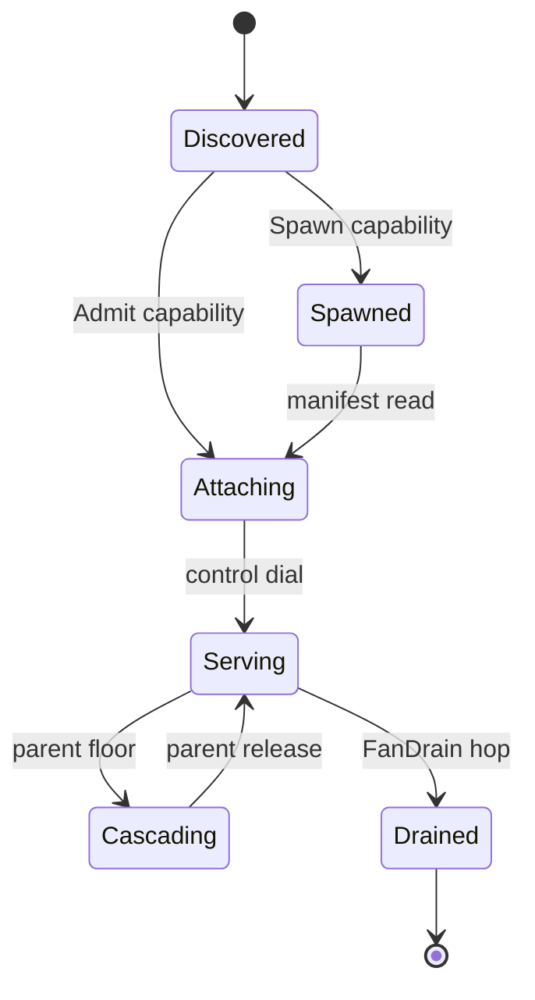
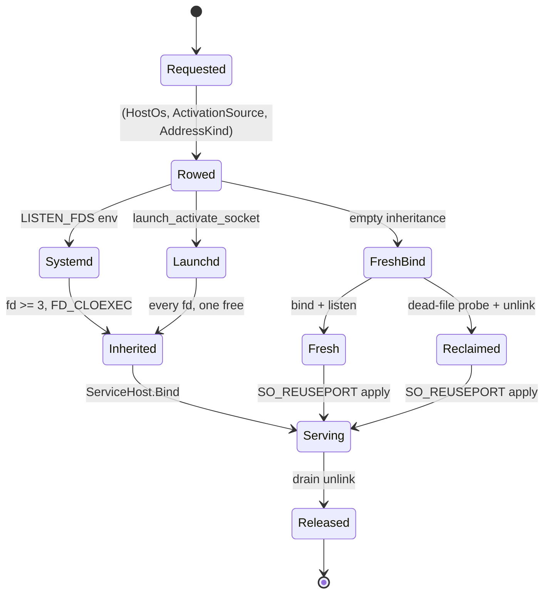

# [APPHOST_COMPANION_SIDECAR]

The inbound serving counterpart to the outbound boundary: three `ModalityRow` rows key on the Tier-0 `DeploymentTopology` closed axis and carry their spawn-attach-degrade-forward capability SET under one legal-corner law, one `PeerRoster` folds every accepted connection into a lease-epoch attached-peer set through verdict-returning transitions, one `ControlVerb` roster folds the wire verbs onto the existing degradation, options, support, dispatch, config, and drain owners under one inbound continuation that audits, traces, fans, and fires in one place, one `ServiceHost` registration mounts the control service, the diagnostic service, the health service, every composition-supplied served plane, and the co-hosted asset seat over a Unix domain socket, one cross-process cascade writes a parent-observed level onto the child `DegradationCell.Cascade` floor, one `PeerAdmission` reads the connecting peer's credentials at accept over the managed raw-socket-option route, and one `HostBinding` owner acquires the serving endpoint through a policy table keyed on `(HostOs, ActivationSource, AddressKind)` that folds systemd socket activation, launchd socket activation, and a fresh bind into one acquisition through the `ServiceHost.Bind` listener seam. The page owns the modality rows, the attached-peer roster, the verb roster and its fold, the server-host registration, the cascade write, the peer-credential read, the host-binding acquisition, and the CloudEvents ingress door; it consumes `DegradationCell`, `OptionsAdmission`, `SupportTrigger`, `HostAttachPort`, `ReceiptSinkPort`, `FactSink<TSignal>`/`AppHostPoint`/`AppHostFact`, `ClockPolicy`, `TraceContext`/`TenantAdoption`, `RedactionRegistration`/`IRedactorProvider`, `CommandDispatch`/`CommandIntent`, `Membership.Contribute`, `HostCapability`/`BootVariable` from `Runtime/profiles`, `OutboxRow.Admit`/`EventBus.Dispatch` and the kernel `EventCarrier` accessor at the ingress door, and the `Discovery` UDS/manifest law as settled vocabulary, leaves SIGTERM/SIGQUIT/SIGHUP to `Runtime/lifecycle#FAULT_SPINE.ArmTraps` and readiness notify to `Runtime/profiles#LIFETIME_ADAPTERS.SystemdNotifier`, and mints no eighth port.

## [01]-[INDEX]

- [02]-[PROCESS_MODALITY]: Three modality rows under one capability law, the lease-epoch attached-peer roster, and the fault and signal families this page owns.
- [03]-[CONTROL_SERVICE]: The wire verb roster folded onto its existing owners under one audit-trace-fan-fire continuation.
- [04]-[SERVICE_HOST]: Served-plane registration and mapping, the co-hosted asset seat, and the Unix-domain-socket intake.
- [05]-[DEGRADATION_CASCADE]: Parent floor written to the child cell over the control hop.
- [06]-[PEER_ADMISSION]: Accept-side peer-credential read over the managed raw-socket-option route.
- [07]-[HOST_BINDING]: The `(HostOs, ActivationSource, AddressKind)` bind-policy table, its acquisition arms, reuse, and override.
- [08]-[EVENT_INGRESS]: CloudEvents HTTP door — the abuse-protection handshake, per-delivery admission, and the semconv families every binding row stamps.

## [02]-[PROCESS_MODALITY]

- Owner: `ModalityCapability` `[SmartEnum<string>]` realizing kernel `ICapability<ModalityCapability>` — the four peer-modality capabilities; `ModalityRow` the per-topology policy record carrying that capability SET; `ModalityRows` the frozen row set with its total dispatch and its `CapabilityLaw`; `CompanionPeer` the attached-child capsule the modality row produces; `PeerRoster` the attached-connection cell carrying a monotone lease epoch; `RosterEntry` the per-connection lease record; `RosterReceipt` the join/renew/drop transition projection; `CompanionFault` `[Union]` the page's own fault family riding the kernel `[FaultCase]`/`Fault` floor (`[FaultCase]` realizes the registry over `FaultBand.Companion`); `CompanionSignal` `[Union]` the rail fact every transition on this page carries.
- Cases: three of the closed axis's six values carry a peer modality — `Companion` is the host-spawned single-shot child (`Spawn`, `Degrade`), `Sidecar` is the co-deployed attach-only peer this process never started (`Admit`, `Forward`), `Service` is the independently-managed peer this process dials and admits (`Spawn`, `Admit`, `Degrade`); `InHost`, `Edge`, and `Cli` reach no peer and refuse on the typed rail naming the axis; three roster transitions — join on accept, renew on heartbeat, drop on lease expiry or disconnect.
- Entry: `Fin<ModalityRow> Row` is the extension property total state-free `Switch` from topology value to frozen row, railing `CompanionFault.Excluded` on the three values this page serves no modality for and admitting the row's corner through `ModalityRows.Law`; `Attach(PeerRoster roster, ModalityRow row, OutboundRuntime outbound, ProcessStartInfo spec, RedrivePolicy attach, Func<Option<int>, Fin<DiscoveryManifest>> manifestOf, Func<DiscoveryManifest, CancellationToken, IO<Unit>> drainFan, GrpcChannelPolicy policy)` returns `IO<CompanionPeer>` and carries the gauged spawn-and-dial effect through `Wire/outbound#DELIVERY_FANOUT` `Discovery.Spawn`'s own five-parameter arity — the outbound runtime and the attach redrive ride the `HopRows.CompanionSpawn` hop — the manifest reader taking the started child's pid as an OPTION so the attach-only arm states that it spawned nothing; `ForwardWrite(PeerRoster roster, ModalityRow row, CommandIntent intent, Func<RosterEntry, CommandIntent, IO<CommandReceipt>> hop)` returns `IO<Option<Seq<CommandReceipt>>>` — the `Forward`-gated durable-write forward; `PeerRoster.Accept(ModalityRow row, ServerCallContext context, DiscoveryManifest manifest)` returns `IO<Fin<RosterReceipt>>` — the serving-side accept hop; `PeerRoster.Admit(PeerCredential credential, DiscoveryManifest manifest, Instant now)`, `.Renew(int pid, Instant now)`, and `.Drop(int pid, Instant now)` each fold one transition over the cell and return `IO<Fin<RosterReceipt>>`, so a verb applied to a pid the roster does not hold answers a REFUSAL rather than a receipt naming a transition that never happened.
- Auto: `Attach` reads the discovery manifest through the bound `Discovery.Read` projection and dials the control channel through `Discovery.Connect`, running the single-shot `Discovery.Spawn` only on rows admitting `Spawn` and the attach-only read only on rows admitting `Admit` — a row holding neither is unrepresentable because the law bars the empty corner — and both arms bracket the dial with the roster's own `ClockPolicy.Line` so one `ModalityReceipt` carries the real outcome, the MEASURED monotone elapsed, and the capability set the cascade consults; `Accept` reads the accepted socket off the connection's `IConnectionSocketFeature`, folds it through `PeerAdmission.Read`, and hands the credential to `Admit`, so the credential chain runs accept to admit with no prose hop between; `Admit` keys the entry by the kernel-reported `PeerCredential.Pid` — never the manifest's self-asserted pid — stamps the lease deadline from `LeasePolicy.Maintenance.CrashStaleness` so a peer's lease lapses on the same crash-staleness window the maintenance lease uses, and fires the bound `Contribute` edge so the local attach reaches the cluster view as a `Joining` row the probe sweep then grades; `Renew` extends the lease and `Sweep(Instant now)` drops every entry whose lease lapsed, so a vanished peer leaves the roster without an explicit disconnect; every landed transition mints one `RosterReceipt` fanned through the one `FactSink` and fired at `AppHostPoint.Companion`.
- Receipt: `ModalityReceipt` — topology key, the peer pid as an `Option`, attach outcome, elapsed `Duration`, and the row's capability set with `CascadeEligible` DERIVED from it; `RosterReceipt` — transition kind, peer pid, the peer uid as an `Option`, lease epoch, attached-count after the fold, `Instant`.
- Packages: Thinktecture.Runtime.Extensions, LanguageExt.Core, NodaTime, Rasm (kernel `CapabilitySet`/`CapabilityLaw`/`Cell`/`Transition`), Grpc.Net.Client, Grpc.AspNetCore (`ServerCallContextExtensions.GetHttpContext`, `IConnectionSocketFeature`), BCL inbox
- Growth: one `ModalityRow` over an existing `DeploymentTopology` value absorbs a new peer shape — the axis roster is Tier-0's and grows there alone; a new peer capability is one `ModalityCapability` row with the legal corners that admit it, never a bool column; a new roster transition is one `RosterTransition` case with one fold arm; a new observable transition is one `CompanionSignal` case with no roster edit; a new refusal is one `CompanionFault` case and the owning `FaultBand` span edit; zero new surface.
- Boundary: the modality row consumes `OutboundHop.CompanionSpawn` and `OutboundHop.LocalIpc` from the dial-out owner and never re-declares the spawn or connect mechanics — `Discovery.Spawn`, `Discovery.Connect`, and `Discovery.Read` carry the bytes; the row keys on `DeploymentTopology` and mints no vocabulary of its own — the closed axis at Tier-0 `[10]-[CONSUMPTION_MODEL]` already spells `companion` and `sidecar`, and a local re-mint of those two values is the anchoring defect `[CONSUMPTION_DESCRIPTOR]` forecloses; a fourth `paired-peer` value is the rejected form for a second reason — pairing DIRECTION is already two capabilities, so a set holding `Admit` without `Spawn` states the symmetric attach exactly and `Service` is the axis value that peer already carries; FOUR ADJACENT BOOLS WERE A CORNER LAW IN DISGUISE — three of sixteen corners are legal and the other thirteen name peers this page cannot serve (a row spawning without degrading, a row forwarding writes it never admitted, the empty row that inherits the attach arm), so the set rides `CapabilitySet<ModalityCapability>` under an UNCONDITIONAL `CapabilityLaw.Legal` roster and `ModalityRows.Law.Admit` refuses at the `Fin` mint; NAMED LOSS — per-column compile-time exhaustiveness, bought back twice by that admit and by every consumer stating the capability it needs as a value through `Admits`; `ModalityReceipt.CascadeEligible` DERIVES from the carried set rather than storing a copy of one column, because a stored mirror answers the question its source already answers and diverges the moment a row moves; the attach deadline is the `DeadlineClass.HopAttempt` row read by projection and the lease deadline is the `LeasePolicy.Maintenance.CrashStaleness` value, never a literal here; `CompanionPeer` carries the `CompanionChild` produced by the outbound spawn and the `GrpcChannel` produced by the control dial so one capsule owns both legs of an attached child; `PeerRoster` is the single host-side attached-connection owner — the lease epoch is a monotone `ulong` bumped on every join and drop so a stale peer reconnecting under a prior epoch is detectable, and the roster never re-mints presence: it is the beat PRODUCER of the `Rasm.Persistence` `Version/ledger#PRESENCE` EPHEMERAL awareness lane — each join and drop crosses as the Persistence-OWNED `PresenceRow(Actor, State, At, Ttl)` through `Awareness.Present(actor, state, ttl, frame)` on the `Runtime/resources#DRAIN_QUEUES` `DrainSurface` lane, `durable: false`, never the durable store, never the exactly-once CDC envelope, and no AppHost type crosses down; THE ABSENT IDENTIFIER IS AN OPTION, NOT A ZERO — a receipt for a pid the roster does not hold reported uid 0, which names root, and an attach that faulted before a manifest existed reported pid 0, which names the kernel's own scheduler, so both columns are `Option`-shaped and an audit reader can no longer read a fabricated superuser or a fabricated peer out of a missing entry; that same law bars the pid-0 SENTINEL an attach-only manifest read once passed as its argument, so the reader takes `Option<int>` and the absent child is a value rather than a number the callee must know to disbelieve; FOREIGN ERRORS ARE ADOPTED, NEVER LAUNDERED — `CompanionFault.Of` passes a companion fault through untouched and wraps anything else as `Foreign`, carrying the original `Error` so its numeric identity and retry semantics survive instead of being rebuilt from message text; NAMED LOSS — the `Verify` case the ingress signature gate once minted from a message, which `Foreign` replaces at its own offset: the verifier's typed refusal now reaches the delivery tally under the band code its own owner gave it, which is stronger than a companion-band name carrying that owner's text; `WireHealth` reads the attached-count for per-peer serving status, never a second roster; the two-tier membership law holds — `PeerRoster` is the LOCAL kernel-credentialed attach set contributing into `Wire/coordination#MEMBERSHIP_VIEW` through `Membership.Contribute`, `FleetRoll` reads `MembershipView.Serving` (cluster liveness) for its fleet wave while each node's actual roll dials local over this control hop, and `ForwardWrite` reads `PeerRoster.Attached` as the LOCAL forwarding set; the page is host-local and crosses no browser or peer TS wire of its own — the verb messages are Rasm.Compute/Runtime/wire#PROTO_VOCABULARY-owned protobuf consumed here, and `RosterReceipt`/`ModalityReceipt` reconstruct through the existing `ReceiptEnvelopeWire` at Runtime/ports#TS_PROJECTION, so the page authors no `TS_PROJECTION` cluster and mints no second wire shape.

```csharp signature
// --- [RUNTIME_PRELUDE] ----------------------------------------------------------------------
using System.Buffers.Binary;
using System.Collections.Frozen;
using System.Diagnostics;
using System.Globalization;
using System.IO;
using System.Linq;
using System.Net.Sockets;
using System.Runtime.InteropServices;
using System.Threading;
using System.Text;
using System.Text.Json;
using System.Text.Json.Nodes;
using CloudNative.CloudEvents;
using CloudNative.CloudEvents.AspNetCore;
using Google.Protobuf;
using Google.Protobuf.WellKnownTypes;
using Grpc.AspNetCore.Server;
using Grpc.Core;
using Grpc.Health.V1;
using Grpc.HealthCheck;
using LanguageExt;
using Microsoft.AspNetCore.Builder;
using Microsoft.AspNetCore.Connections.Features;
using Microsoft.AspNetCore.Http;
using Microsoft.AspNetCore.JsonPatch.SystemTextJson;
using Microsoft.AspNetCore.Routing;
using Microsoft.AspNetCore.Server.Kestrel.Core;
using Microsoft.Extensions.Compliance.Classification;
using Microsoft.Extensions.Compliance.Redaction;
using Microsoft.Extensions.DependencyInjection;
using Microsoft.Extensions.FileProviders;
using NodaTime;
using Rasm.Domain;
using Thinktecture;
using static LanguageExt.Prelude;

namespace Rasm.AppHost.Wire;

// --- [TYPES] --------------------------------------------------------------------------------
[SmartEnum<string>]
[KeyMemberEqualityComparer<ComparerAccessors.StringOrdinal, string>]
[KeyMemberComparer<ComparerAccessors.StringOrdinal, string>]
public sealed partial class ModalityCapability : ICapability<ModalityCapability> {
    public static readonly ModalityCapability Spawn = new("spawn", rank: 0);
    public static readonly ModalityCapability Admit = new("admit", rank: 1);
    public static readonly ModalityCapability Degrade = new("degrade", rank: 2);
    public static readonly ModalityCapability Forward = new("forward", rank: 3);

    public int Rank { get; }
}

// --- [MODELS] -------------------------------------------------------------------------------
public sealed record ModalityRow(
    DeploymentTopology Topology,
    CapabilitySet<ModalityCapability> Capabilities,
    HopIdempotency Idempotency,
    DeadlineClass Attach);

public sealed record CompanionPeer(
    DeploymentTopology Topology,
    Option<CompanionChild> Child,
    GrpcChannel Control,
    DiscoveryManifest Manifest);

// THE ABSENT PID IS AN OPTION, NOT A ZERO: an attach that faulted before a manifest existed has no peer to
// name, and pid 0 names the kernel's own scheduler on both supported platforms.
public readonly record struct ModalityReceipt(
    DeploymentTopology Topology,
    Option<int> PeerPid,
    HopOutcome Attach,
    Duration Elapsed,
    CapabilitySet<ModalityCapability> Capabilities) {
    public bool CascadeEligible => Capabilities.Admits(ModalityCapability.Degrade);
}


// Numeric identity is generated from each direct leaf's `[FaultCase]`.
[Union(ConversionFromValue = ConversionOperatorsGeneration.None)]
public abstract partial record CompanionFault : Fault {
    private static readonly FaultBand FamilyBand = FaultBand.Companion;
    private CompanionFault(string detail) => Detail = detail;
    public string Detail { get; }
    public sealed override string Message => Detail;

    public static CompanionFault Of(Error error) => error as CompanionFault ?? new Foreign(error);


    [FaultCase(0)]
    public sealed partial record Excluded : CompanionFault { public Excluded(string detail) : base(detail) { } }

    [FaultCase(1)]
    public sealed partial record Credential : CompanionFault { public Credential(string detail) : base(detail) { } }

    [FaultCase(2)]
    public sealed partial record Unattached : CompanionFault {
        public Unattached(int pid) : base(string.Create(CultureInfo.InvariantCulture, $"pid:{pid}")) { }
    }

    [FaultCase(3)]
    public sealed partial record Bind : CompanionFault { public Bind(string detail) : base(detail) { } }

    [FaultCase(4)]
    public sealed partial record Held : CompanionFault {
        public Held(string service, string path) : base($"{service}:{path}") { }
        public override Retriability Retriability => Retriability.Transient;
    }

    [FaultCase(5)]
    public sealed partial record Activation : CompanionFault { public Activation(string detail) : base(detail) { } }

    [FaultCase(6)]
    public sealed partial record Origin : CompanionFault { public Origin(string header) : base(header) { } }

    // Adoption carries the cause WHOLE as the inner, so its own code, recovery, and
    // retriability survive the crossing. The signature gate's refusal reaches a reader as the verifier's own
    // typed fault rather than rebuilding its message in this band, which would erase the verifier's code.
    [FaultCase(7)]
    public sealed partial record Foreign : CompanionFault, ICausedFault {
        public Foreign(Error inner) : base(inner.Message) => Cause = inner;
        public Error Cause { get; }
        public override Retriability Retriability => Cause is Fault fault ? fault.Retriability : Retriability.Terminal;
    }
}

[Union]
public abstract partial record CompanionSignal {
    private CompanionSignal() { }

    public sealed record Modality(ModalityReceipt Settled) : CompanionSignal;

    public sealed record Roster(RosterReceipt Settled) : CompanionSignal;

    public sealed record Verb(VerbReceipt Settled) : CompanionSignal;

    public sealed record Cascade(CascadeReceipt Settled) : CompanionSignal;

    public sealed record Bound(BindReceipt Settled) : CompanionSignal;

    public sealed record Ingress(Delivery Settled) : CompanionSignal;
}

// --- [OPERATIONS] ---------------------------------------------------------------------------
public static class ModalityRows {
    public static readonly ModalityRow Companion = new(
        DeploymentTopology.Companion,
        CapabilitySet<ModalityCapability>.Of(ModalityCapability.Spawn, ModalityCapability.Degrade),
        HopIdempotency.SingleShot,
        DeadlineClass.HopAttempt);

    public static readonly ModalityRow Sidecar = new(
        DeploymentTopology.Sidecar,
        CapabilitySet<ModalityCapability>.Of(ModalityCapability.Admit, ModalityCapability.Forward),
        HopIdempotency.Keyed,
        DeadlineClass.HopAttempt);

    public static readonly ModalityRow Service = new(
        DeploymentTopology.Service,
        CapabilitySet<ModalityCapability>.Of(ModalityCapability.Spawn, ModalityCapability.Admit, ModalityCapability.Degrade),
        HopIdempotency.Keyed,
        DeadlineClass.HopAttempt);

    public static readonly CapabilityLaw<ModalityCapability> Law = new(Seq(
        Companion.Capabilities, Sidecar.Capabilities, Service.Capabilities));

    extension(DeploymentTopology topology) {
        public Fin<ModalityRow> Row =>
            topology.Switch(
                inHost: static () => Fin.Fail<ModalityRow>(new CompanionFault.Excluded($"topology:{DeploymentTopology.InHost.Key}:reaches-no-peer")),
                sidecar: static () => Fin.Succ(Sidecar),
                companion: static () => Fin.Succ(Companion),
                service: static () => Fin.Succ(Service),
                edge: static () => Fin.Fail<ModalityRow>(new CompanionFault.Excluded($"topology:{DeploymentTopology.Edge.Key}:reaches-no-peer")),
                cli: static () => Fin.Fail<ModalityRow>(new CompanionFault.Excluded($"topology:{DeploymentTopology.Cli.Key}:reaches-no-peer")))
            .Bind(row => Law.Admit(row.Capabilities).Map(_ => row));
    }

    public static IO<CompanionPeer> Attach(
        PeerRoster roster, ModalityRow row, OutboundRuntime outbound, ProcessStartInfo spec, RedrivePolicy attach,
        Func<Option<int>, Fin<DiscoveryManifest>> manifestOf,
        Func<DiscoveryManifest, CancellationToken, IO<Unit>> drainFan, GrpcChannelPolicy policy) =>
        from start in roster.Stamp
        from peer in Dial(row, outbound, spec, attach, manifestOf, drainFan, policy)
            .Catch(error => Settled(roster, row, None, new HopOutcome.Faulted(error), start).Bind(_ => IO.fail<CompanionPeer>(error)))
        from _ in Settled(roster, row, Some(peer.Manifest.Pid), new HopOutcome.Delivered(), start)
        select peer;

    public static IO<Option<Seq<CommandReceipt>>> ForwardWrite(
        PeerRoster roster, ModalityRow row, CommandIntent intent, Func<RosterEntry, CommandIntent, IO<CommandReceipt>> hop) =>
        row.Capabilities.Admits(ModalityCapability.Forward)
            ? roster.Attached.TraverseM(entry => hop(entry, intent)).As().Map(Some)
            : IO.pure(Option<Seq<CommandReceipt>>.None);

    // Manifest reads take the started child's pid as an OPTION, so the attach-only arm states that it spawned none
    // instead of asking for pid 0 — the spawn arm adapts to `Discovery.Spawn`'s own started-child arity at the
    // one call site that has a real pid to give.
    static IO<CompanionPeer> Dial(
        ModalityRow row, OutboundRuntime outbound, ProcessStartInfo spec, RedrivePolicy attach,
        Func<Option<int>, Fin<DiscoveryManifest>> manifestOf,
        Func<DiscoveryManifest, CancellationToken, IO<Unit>> drainFan, GrpcChannelPolicy policy) =>
        row.Capabilities.Admits(ModalityCapability.Spawn)
            ? Discovery.Spawn(outbound, spec, attach, pid => manifestOf(Some(pid)), drainFan)
                .Bind(child => IO.pure(new CompanionPeer(row.Topology, child, Discovery.Connect(child.Manifest, policy), child.Manifest)))
            : IO.lift(() => manifestOf(None))
                .Bind(read => read.Match(
                    Succ: manifest => IO.pure(new CompanionPeer(row.Topology, None, Discovery.Connect(manifest, policy), manifest)),
                    Fail: fault => IO.fail<CompanionPeer>(fault)));

    static IO<Unit> Settled(PeerRoster roster, ModalityRow row, Option<int> pid, HopOutcome outcome, MonotonicStamp start) =>
        from finish in roster.Stamp
        from span in roster.Clocks.Line.Elapsed(start, finish, roster.Key).Match(Succ: IO.pure, Fail: IO.fail<TimeSpan>)
        let receipt = new ModalityReceipt(row.Topology, pid, outcome, Duration.FromTimeSpan(span), row.Capabilities)
        from _ in roster.Fan.Fan(Correlation.Mint(), nameof(ModalityRows), receipt, new CompanionSignal.Modality(receipt))
        select unit;
}

[SmartEnum]
public sealed partial class RosterTransition {
    public static readonly RosterTransition Joined = new();
    public static readonly RosterTransition Renewed = new();
    public static readonly RosterTransition Dropped = new();
}

public sealed record RosterEntry(
    int Pid,
    uint Uid,
    DiscoveryManifest Manifest,
    ulong Epoch,
    Instant JoinedAt,
    Instant LeaseUntil);

public readonly record struct RosterReceipt(
    RosterTransition Transition,
    int Pid,
    Option<uint> Uid,
    ulong Epoch,
    int Attached,
    Instant At);

public sealed record PeerRoster(
    string Service,
    Atom<(HashMap<int, RosterEntry> Entries, ulong Epoch)> Peers,
    Func<PeerCredential, DiscoveryManifest, Unit> Contribute,
    FactSink<CompanionSignal> Fan,
    ClockPolicy Clocks,
    Op Key) {
    public static PeerRoster Boot(
        string service, Func<PeerCredential, DiscoveryManifest, Unit> contribute,
        FactSink<CompanionSignal> fan, ClockPolicy clocks, Op key) =>
        new(service, Atom((HashMap<int, RosterEntry>.Empty, 0UL)), contribute, fan, clocks, key);

    public Seq<RosterEntry> Attached => Peers.Value.Entries.Values.ToSeq();

    public IO<MonotonicStamp> Stamp => Clocks.Line.Capture(Key).Match(Succ: IO.pure, Fail: IO.fail<MonotonicStamp>);

    // Kestrel exposes the accepted socket through `IConnectionSocketFeature`, so the kernel-reported uid and
    // pid are read off THAT socket; the manifest's own pid is a claim the peer writes about itself.
    public IO<Fin<RosterReceipt>> Accept(ModalityRow row, ServerCallContext context, DiscoveryManifest manifest) =>
        !row.Capabilities.Admits(ModalityCapability.Admit)
            ? IO.pure(Fin.Fail<RosterReceipt>(new CompanionFault.Excluded($"{Service}:{row.Topology.Key}:does-not-admit")))
            : IO.lift(() => Optional(context.GetHttpContext().Features.Get<IConnectionSocketFeature>()))
                .Bind(feature => feature.Match(
                    Some: socket => PeerAdmission.Read(socket.Socket).Match(
                        Succ: credential => Admit(credential, manifest, Clocks.Now),
                        Fail: error => IO.pure(Fin.Fail<RosterReceipt>(error))),
                    None: () => IO.pure(Fin.Fail<RosterReceipt>(new CompanionFault.Credential($"{Service}:no-accepted-socket")))));

    public IO<Fin<RosterReceipt>> Admit(PeerCredential credential, DiscoveryManifest manifest, Instant now) =>
        Commit(RosterTransition.Joined, credential.Pid, Some(credential.Uid), now, held => Some((
                held.Entries.AddOrUpdate(credential.Pid, new RosterEntry(
                    credential.Pid, credential.Uid, manifest, held.Epoch + 1UL, now,
                    now + LeasePolicy.Maintenance.CrashStaleness)),
                held.Epoch + 1UL)))
            .Bind(receipt => receipt.Match(
                Succ: landed => IO.lift(() => Contribute(credential, manifest)).Map(_ => Fin.Succ(landed)),
                Fail: error => IO.pure(Fin.Fail<RosterReceipt>(error))));

    // A renew on a pid the roster does not hold DECLINES: the prior fold swapped an unchanged map and fanned a
    // receipt announcing a renewal that never happened, which reads to every consumer as a live peer.
    public IO<Fin<RosterReceipt>> Renew(int pid, Instant now) =>
        Commit(RosterTransition.Renewed, pid, Uid(pid), now, held => held.Entries.Find(pid).Map(entry => (
            held.Entries.SetItem(pid, entry with { LeaseUntil = now + LeasePolicy.Maintenance.CrashStaleness }),
            held.Epoch)));

    public IO<Fin<RosterReceipt>> Drop(int pid, Instant now) =>
        Commit(RosterTransition.Dropped, pid, Uid(pid), now, held => held.Entries.ContainsKey(pid)
            ? Some((held.Entries.Remove(pid), held.Epoch + 1UL))
            : None);

    public IO<Seq<Fin<RosterReceipt>>> Sweep(Instant now) =>
        Peers.Value.Entries.Values.Filter(entry => entry.LeaseUntil <= now).ToSeq()
            .TraverseM(entry => Drop(entry.Pid, now)).As();

    // Absent means ABSENT: uid 0 is root, so a receipt for a pid the roster does not hold once named the
    // superuser as the peer that transitioned.
    Option<uint> Uid(int pid) => Peers.Value.Entries.Find(pid).Map(static entry => entry.Uid);

    IO<Fin<RosterReceipt>> Commit(
        RosterTransition transition, int pid, Option<uint> uid, Instant now,
        Func<(HashMap<int, RosterEntry> Entries, ulong Epoch), Option<(HashMap<int, RosterEntry> Entries, ulong Epoch)>> step) =>
        IO.lift(() => Cell.Step(Peers, step, new CompanionFault.Unattached(pid)))
            .Bind(settled => settled.Switch(
                committed: landed => Fanned(new RosterReceipt(transition, pid, uid, landed.State.Epoch, landed.State.Entries.Count, now)),
                ceded: _ => IO.pure(Fin.Fail<RosterReceipt>(new CompanionFault.Unattached(pid))),
                refused: declined => IO.pure(Fin.Fail<RosterReceipt>(CompanionFault.Of(declined.Cause))),
                contended: _ => IO.pure(Fin.Fail<RosterReceipt>(new CompanionFault.Unattached(pid)))));

    IO<Fin<RosterReceipt>> Fanned(RosterReceipt receipt) =>
        Fan.Fan(Correlation.Mint(), nameof(PeerRoster), receipt, new CompanionSignal.Roster(receipt)).Map(Fin.Succ);
}
```


```mermaid
stateDiagram-v2
    accTitle: Companion process lifecycle
    accDescr: A discovered companion spawning or attaching directly, serving under a control dial, cascading down and back on parent floor pressure, and draining to termination through the fan hop.
    [*] --> Discovered
    Discovered --> Spawned: Spawn capability
    Discovered --> Attaching: Admit capability
    Spawned --> Attaching: manifest read
    Attaching --> Serving: control dial
    Serving --> Cascading: parent floor
    Cascading --> Serving: parent release
    Serving --> Drained: FanDrain hop
    Drained --> [*]
```

## [03]-[CONTROL_SERVICE]

- Owner: `ServicePlane` `[SmartEnum<string>]` the two served planes the proto declares; `ControlVerb` `[SmartEnum<string>]` the verb roster carrying each verb's plane and its operator-audit projection as a delegate column; `ControlInbound` the static handler folding each verb onto its existing transition owner; `ControlRuntime` the dependency record; `VerbReceipt` the per-verb projection the sink receives; `ControlServiceImpl` and `DiagnosticServiceImpl` the two generated-base implementations `ServiceHost.Map` mounts; `ControlReplyMap` the one `[Mapper]` projecting each typed receipt onto its reply message.
- Cases: six verbs across two planes — set-degradation onto `DegradationCell.Force`, reload-options onto `OptionsAdmission.Invalidate` landing one `ReloadReceipt` under `ReloadReceipt.ControlTrigger`, dispatch-tool onto the `Agent/runtime#COMMAND_DISPATCH` front door behind the redaction-and-audit seam, dispatch-patch onto `OptionsAdmission.PatchSection` under `ReloadReceipt.PatchTrigger`, and drain-runtime onto the `Runtime/lifecycle#DRAIN_CONDUCTOR` fold, all five on the `Control` plane; capture-bundle onto `SupportTrigger.Requested` under the `SupportTriggerKind.ExternalCommand` key and `SupportCapture.Capture` on the `Diagnostic` plane, which is where `compute.proto` declares it.
- Entry: every verb takes the `ServerCallContext` its generated override already holds — `SetDegradation(ControlRuntime runtime, ServerCallContext context, string level, string reason)` returns `IO<DegradationState>`, `ReloadOptions(runtime, context)` returns `IO<ReloadReceipt>`, `CaptureSupport(runtime, context, CorrelationId correlation, string reason)` returns `IO<SupportReceipt>`, `DispatchTool(runtime, context, string tool, JsonElement arguments)` returns `IO<CommandReceipt>`, `DispatchPatch(runtime, context, string section, JsonElement patch)` returns `IO<ReloadReceipt>`, and `DrainRuntime(runtime, context, Duration inherited, string reason)` returns `IO<DrainReceipt>` — each rail is the existing owner's rail, never a new one, and each fold runs inside the one `Continued` bracket.
- Auto: `Continued` is the ONE seat that runs a verb — it resolves the episode correlation, runs the row's own audit projection, brackets the fold in `TraceContext.Continue(runtime.Source, context.RequestHeaders, verb.Key, ControlRuntime.Adoption)` so the companion span descends from the caller's span instead of rooting fresh (the parent's client leg injects the same context through `TraceContext.Inject(Metadata)`, and the two call sites are what make the propagation claim hold), and fans the `VerbReceipt` while firing `AppHostPoint.Companion`; the wire level key admits through `DegradationLevel.TryGet` so an unknown key resolves to `None` and `Force` re-derives rather than forcing a phantom level; reload-options invalidates the options-monitor cache through the bound `InvalidateOptions` seam and stamps the same `ReloadOutcome.Applied` transition the `SIGHUP` signal and the options monitor enqueue, distinguished only by the trigger string; dispatch-tool redacts the argument payload BEFORE the audit and the dispatch, resolving the redactor off the descriptor's own `PermissionShape.Classification` through `IRedactorProvider.GetRedactor`, so an unresolvable tool falls to the `Unknown` row whose erase treatment keeps the audit record fail-closed; the audit itself is the verb ROW's own column — three verbs carry an operator-audit reason and three carry none, and that fact is roster data rather than three hand-spelled capture blocks.
- Receipt: `DegradationState`, `ReloadReceipt`, `SupportReceipt`, `CommandReceipt`, and the conductor's own `DrainReceipt` with its `DrainStep` rows cross verbatim; `VerbReceipt` carries the verb ROW and the serialized payload the sink fans, never a generic control-receipt ledger; dispatch-tool's payload is the `ToolAudit` carrying the tool key and the REDACTED argument text, never the raw payload the dispatch consumed.
- Packages: LanguageExt.Core, NodaTime, NodaTime.Serialization.Protobuf (`ToNodaDuration`/`ToProtobufDuration` and `ToInstant`/`ToTimestamp` carry the drain budget and stamps across the verb), Thinktecture.Runtime.Extensions, Riok.Mapperly, Grpc.Core.Api, Google.Protobuf (`JsonFormatter` carries a `Struct` payload across as canonical JSON), Microsoft.AspNetCore.JsonPatch.SystemTextJson, Microsoft.Extensions.Compliance.Redaction, BCL inbox
- Growth: a new control verb is one `ControlVerb` row carrying its plane and its audit projection, one `ControlInbound` method folding onto its existing owner, and one override on the plane's implementation; zero new surface — no `ControlReceipt` abstraction and no new state machine. The two dispatch verbs are that shape at full size: `DispatchTool` folds the requested tool call through the redaction-and-audit seam before `CommandDispatch.Run` lands it, riding a payload that carries the redacted argument projection so the audited record never holds classified argument text; `DispatchPatch` admits the RFC-6902 `application/json-patch+json` document and folds it through `Runtime/config#POLICY_VALUES` `OptionsAdmission.PatchSection` onto the one `ReloadOutcome` transition, so a partial config edit is the same reload concern the SIGHUP signal and the reload-options verb land.
- Boundary: THE PROTO IS THE ROSTER'S EVIDENCE — `tests/contracts/rasm/compute/v1/compute.proto:352-357` declares FIVE `ControlService` rpcs and `:360-362` puts `CaptureBundle` on `DiagnosticService`, so `CaptureSupport` is NOT a sixth control verb: it carries `ServicePlane.Diagnostic`, `DiagnosticServiceImpl` implements it, and `ServiceHost.Map` mounts BOTH planes — the prior form declared a sixth control verb the proto has no rpc for and mounted a service whose only rpc had no server; the generated contract is settled law, not a spelling to re-ask — `grpc_csharp_plugin` emits both services from the repo's own `.proto` at compile time so they live in no installed artifact and the G7 spec-compile gate is the only rail that can see them, while the SHAPE they must satisfy is fixed: each unary override is `public virtual Task<TReply> Verb(TRequest request, ServerCallContext context)`, each client verb is the four-member quartet over the protected `NewInstance(ClientBaseConfiguration)` clone seam, `BindService` is the registration seam in both its forms, and `__ServiceName` is the proto package-qualified name every `Method<TRequest,TReply>` descriptor keys on — every type those members derive from is catalogued at `libs/csharp/.api/api-grpc-core-api.md` `[STACKING]`; the reply messages project the typed receipts field-for-field through ONE `[Mapper]`, so this page owns the fold from wire to owner and never a hand transcription; the `Empty` request on reload-options carries no payload so the handler reads runtime state, and a `Struct` argument crosses through protobuf's own canonical JSON printer rather than a hand walker; drain-runtime commits the drain phase through `Runtime/lifecycle#DRAIN_CONDUCTOR` and re-implements nothing it holds — `DrainBand`, `DrainOutcome`, `DrainConductor`, `DrainReceipt`, and `DrainStep` are that owner's, and a second ordered flush beside them forks the fence the conductor's first act commits; the inherited allotment is LAW rather than a knob — `docs/stacks/csharp/domain/resilience.md` `[04]-[HOP_TOPOLOGY]` holds that allotments inherit through nested seams as the MINIMUM of the child's class and the inherited remainder, so this fold takes `min(DeadlineClass.DrainCooperative.Allotted, inherited)` and a child re-arming its own full budget unbounds the parent drain that asked for it; ingress tenancy is ADMITTED per carrier and `TenantAdoption` carries no default, so this hop states its trust class explicitly — `ControlRuntime.Adoption` is `TenantAdoption.Adopted` because `PeerAdmission` has already read the connecting peer's kernel-reported uid and pid off the accepted socket, which is exactly the trusted-carrier case the `RULINGS.md` `[02]` ingress-tenancy ruling admits, and a hop without that credential read carries `Refused`.

```csharp signature
// --- [TYPES] --------------------------------------------------------------------------------
[SmartEnum<string>]
[KeyMemberEqualityComparer<ComparerAccessors.StringOrdinal, string>]
[KeyMemberComparer<ComparerAccessors.StringOrdinal, string>]
public sealed partial class ServicePlane {
    public static readonly ServicePlane Control = new("control");
    public static readonly ServicePlane Diagnostic = new("diagnostic");
}

[SmartEnum<string>]
[KeyMemberEqualityComparer<ComparerAccessors.StringOrdinal, string>]
[KeyMemberComparer<ComparerAccessors.StringOrdinal, string>]
public sealed partial class ControlVerb {
    public static readonly ControlVerb SetDegradation = new("set-degradation", ServicePlane.Control, static _ => Option<string>.None);
    public static readonly ControlVerb ReloadOptions = new("reload-options", ServicePlane.Control, static _ => Option<string>.None);
    public static readonly ControlVerb DispatchPatch = new("dispatch-patch", ServicePlane.Control, static _ => Option<string>.None);
    public static readonly ControlVerb DispatchTool = new("dispatch-tool", ServicePlane.Control, static tool => Some($"dispatch-tool:{tool}"));
    public static readonly ControlVerb DrainRuntime = new("drain-runtime", ServicePlane.Control, static reason => Some($"drain-runtime:{reason}"));
    public static readonly ControlVerb CaptureSupport = new("capture-bundle", ServicePlane.Diagnostic, static reason => Some(reason));

    public ServicePlane Plane { get; }

    [UseDelegateFromConstructor]
    public partial Option<string> Audit(string detail);
}

// --- [MODELS] -------------------------------------------------------------------------------
public readonly record struct VerbReceipt(ControlVerb Verb, JsonElement Payload);

public readonly record struct ToolAudit(string Tool, string Arguments);

// --- [SERVICES] -----------------------------------------------------------------------------
public sealed record ControlRuntime(
    DegradationCell Degradation,
    Func<Option<string>, Unit> InvalidateOptions,
    Func<IConfigurationRoot> ActiveConfig,
    string ReloadSection,
    ReloadClass ReloadClass,
    Func<string, Func<JsonObject, Validation<Error, Unit>>> Revalidate,
    Func<CommandIntent, IO<CommandReceipt>> Dispatch,
    Func<Duration, IO<DrainReceipt>> Drain,
    Func<string, DataClassification> Classify,
    IRedactorProvider Redactors,
    ActivitySource Source,
    SupportRuntime Support,
    ClockPolicy Clocks,
    FactSink<CompanionSignal> Fan,
    JsonSerializerOptions Wire) {
    public static readonly TenantAdoption Adoption = TenantAdoption.Adopted;
}

// --- [BOUNDARIES] ---------------------------------------------------------------------------
// `Target`, not `Both`: the reply messages are DELIBERATELY narrower than the receipts they project, which the
// proto states at `DegradationReply` — every target member is answered and an unread receipt column stays host-side.
[Mapper(RequiredMappingStrategy = RequiredMappingStrategy.Target,
        EnabledConversions = MappingConversionType.All & ~MappingConversionType.ExplicitCast)]
internal static partial class ControlReplyMap {
    public static partial DegradationReply Reply(DegradationState state);

    public static partial ReloadReply Reply(ReloadReceipt receipt);

    public static partial CommandReply Reply(CommandReceipt receipt);

    public static partial DrainReply Reply(DrainReceipt receipt);

    public static partial SupportBundleReply Reply(SupportReceipt receipt);
}

// --- [OPERATIONS] ---------------------------------------------------------------------------
public static class ControlInbound {
    public static IO<DegradationState> SetDegradation(ControlRuntime runtime, ServerCallContext context, string level, string reason) =>
        Continued(runtime, context, ControlVerb.SetDegradation, reason, _ =>
            IO.lift(() => runtime.Degradation.Force(DegradationLevel.TryGet(level, out var resolved) ? Optional(resolved) : None))
                .Map(state => (Value: state, Payload: (object)state)));

    public static IO<ReloadReceipt> ReloadOptions(ControlRuntime runtime, ServerCallContext context) =>
        Continued(runtime, context, ControlVerb.ReloadOptions, runtime.ReloadSection, correlation =>
            from _invalidate in IO.lift(() => runtime.InvalidateOptions(None))
            from receipt in IO.lift(() => new ReloadReceipt(
                Section: runtime.ReloadSection,
                Class: runtime.ReloadClass,
                Trigger: ReloadReceipt.ControlTrigger,
                Outcome: new ReloadOutcome.Applied(runtime.ReloadSection),
                At: runtime.Clocks.Now,
                CorrelationId: correlation))
            select (Value: receipt, Payload: (object)receipt));

    public static IO<SupportReceipt> CaptureSupport(ControlRuntime runtime, ServerCallContext context, CorrelationId correlation, string reason) =>
        Continued(runtime, context, ControlVerb.CaptureSupport, reason, _ =>
            SupportCapture.Capture(runtime.Support, new SupportTrigger.Requested(correlation, SupportTriggerKind.ExternalCommand, reason))
                .Map(receipt => (Value: receipt, Payload: (object)receipt)));

    public static IO<CommandReceipt> DispatchTool(ControlRuntime runtime, ServerCallContext context, string tool, JsonElement arguments) =>
        Continued(runtime, context, ControlVerb.DispatchTool, tool, correlation =>
            from audited in IO.lift(() => Audited(runtime, tool, arguments))
            from receipt in runtime.Dispatch(CommandIntent.Of(
                tool, new CommandArguments(arguments, TenantContext.Current, correlation), CallerModality.Operator))
            select (Value: receipt, Payload: (object)audited));

    public static IO<ReloadReceipt> DispatchPatch(ControlRuntime runtime, ServerCallContext context, string section, JsonElement patch) =>
        Continued(runtime, context, ControlVerb.DispatchPatch, section, correlation =>
            from outcome in IO.lift(() => OptionsAdmission.PatchSection(
                live: JsonSerializer.SerializeToNode(runtime.ActiveConfig().GetSection(section), runtime.Wire)!.AsObject(),
                section: section,
                reload: runtime.ReloadClass,
                patch: patch.Deserialize<JsonPatchDocument>(runtime.Wire)!,
                revalidate: runtime.Revalidate(section)))
            from _invalidate in IO.lift(() => outcome.IsSuccess ? runtime.InvalidateOptions(Some(section)) : unit)
            from receipt in IO.lift(() => new ReloadReceipt(
                Section: section,
                Class: runtime.ReloadClass,
                Trigger: ReloadReceipt.PatchTrigger,
                Outcome: outcome.Match(Succ: static applied => applied, Fail: fault => new ReloadOutcome.Rejected(section, fault)),
                At: runtime.Clocks.Now,
                CorrelationId: correlation))
            select (Value: receipt, Payload: (object)receipt));

    public static IO<DrainReceipt> DrainRuntime(ControlRuntime runtime, ServerCallContext context, Duration inherited, string reason) =>
        Continued(runtime, context, ControlVerb.DrainRuntime, reason, _ =>
            runtime.Drain(inherited < DeadlineClass.DrainCooperative.Allotted ? inherited : DeadlineClass.DrainCooperative.Allotted)
                .Map(receipt => (Value: receipt, Payload: (object)receipt)));

    // The scope restores prior baggage on dispose, so the bracket is a statement body — a fold that continued
    // without disposing would leak the caller's tenancy into whatever ran next on the thread.
    // Correlation, audit, trace, fan, and fire happen HERE or nowhere.
    static IO<A> Continued<A>(
        ControlRuntime runtime, ServerCallContext context, ControlVerb verb, string detail,
        Func<CorrelationId, IO<(A Value, object Payload)>> fold) =>
        from correlation in IO.lift(() => runtime.Support.Active.Value.IfNone(Correlation.Mint))
        from _audit in verb.Audit(detail).Match(
            Some: reason => SupportCapture.Capture(runtime.Support, new SupportTrigger.Requested(correlation, SupportTriggerKind.ExternalCommand, reason)).Map(static _ => unit),
            None: () => IO.pure(unit))
        from settled in IO.liftAsync(async () => {
            using var scope = TraceContext.Continue(runtime.Source, context.RequestHeaders, verb.Key, ControlRuntime.Adoption);
            return await fold(correlation).RunAsync();
        })
        let receipt = new VerbReceipt(verb, JsonSerializer.SerializeToElement(settled.Payload, runtime.Wire))
        from _fan in runtime.Fan.Fan(correlation, verb.Key, receipt, new CompanionSignal.Verb(receipt))
        select settled.Value;

    static ToolAudit Audited(ControlRuntime runtime, string tool, JsonElement arguments) =>
        new(tool, RedactedText.Appended(
            new StringBuilder(),
            runtime.Redactors.GetRedactor(new DataClassificationSet(runtime.Classify(tool).Marker)),
            arguments.GetRawText()).ToString());
}

// --- [ENTRY] --------------------------------------------------------------------------------
public sealed class ControlServiceImpl(ControlRuntime runtime) : ControlService.ControlServiceBase {
    public override Task<DegradationReply> SetDegradation(SetDegradationRequest request, ServerCallContext context) =>
        ControlInbound.SetDegradation(runtime, context, request.Level, request.Reason).Map(ControlReplyMap.Reply).RunAsync().AsTask();

    public override Task<ReloadReply> ReloadOptions(Empty request, ServerCallContext context) =>
        ControlInbound.ReloadOptions(runtime, context).Map(ControlReplyMap.Reply).RunAsync().AsTask();

    public override Task<CommandReply> DispatchTool(DispatchToolRequest request, ServerCallContext context) =>
        ControlInbound.DispatchTool(runtime, context, request.Tool, Payload(request.Arguments)).Map(ControlReplyMap.Reply).RunAsync().AsTask();

    public override Task<ReloadReply> DispatchPatch(DispatchPatchRequest request, ServerCallContext context) =>
        ControlInbound.DispatchPatch(runtime, context, request.Section, Payload(request.Patch)).Map(ControlReplyMap.Reply).RunAsync().AsTask();

    public override Task<DrainReply> DrainRuntime(DrainRuntimeRequest request, ServerCallContext context) =>
        ControlInbound.DrainRuntime(runtime, context, request.Cooperative.ToNodaDuration(), request.Reason).Map(ControlReplyMap.Reply).RunAsync().AsTask();

    internal static JsonElement Payload(Struct value) =>
        JsonDocument.Parse(JsonFormatter.Default.Format(value)).RootElement;
}

public sealed class DiagnosticServiceImpl(ControlRuntime runtime) : DiagnosticService.DiagnosticServiceBase {
    public override Task<SupportBundleReply> CaptureBundle(SupportBundleRequest request, ServerCallContext context) =>
        ControlInbound.CaptureSupport(runtime, context, Correlation.Mint(), string.Join(',', request.Collectors))
            .Map(ControlReplyMap.Reply).RunAsync().AsTask();
}
```

## [04]-[SERVICE_HOST]

- Owner: `ServiceHost` static registration surface mounting the gRPC server, both declared planes, every supplied served plane, the co-hosted asset seat, and the control intake transport; `ServedPlane` the composition-supplied port row binding one plane's DI registration arm and its endpoint-map arm together; `ControlTransport` `[Union]` carrying the Unix-domain-socket and inherited-fd intake legs; `BindReceipt` the acquisition transition the rail carries.
- Cases: unix-domain-socket binds Kestrel over the `sun_path` endpoint, inherited-fd mounts Kestrel over a socket-activated descriptor the `HostBinding` owner acquired — the two local control-plane intake shapes on every supported platform.
- Entry: `Register(IServiceCollection services, params ReadOnlySpan<ServedPlane> planes)` folds `AddGrpc`, every plane's registration arm over the `IGrpcServerBuilder` it returns, and the health-service registration; `Assets(IApplicationBuilder app, ResolvedProfile resolved, string bundleRoot)` seats the co-hosted static-file middleware ahead of endpoint routing under the `HostCapability.CoHostedAssets` membership; `Map(IEndpointRouteBuilder endpoints, params ReadOnlySpan<ServedPlane> planes)` folds `MapGrpcService<ControlServiceImpl>`, `MapGrpcService<DiagnosticServiceImpl>`, the wire-health mapping, then each plane's map arm; `Bind(KestrelServerOptions kestrel, ControlTransport transport)` folds the Unix `sun_path` Kestrel endpoint or one inherited handle; `BindEndpoint(KestrelServerOptions kestrel, BoundEndpoint endpoint)` returns `Fin<Unit>` — projects a `HostBinding` `BoundEndpoint` onto the matching `ControlTransport` case per acquired descriptor so the host-binding acquisition seats every listener through this one seam.
- Auto: `AddGrpc` registers the server and RETURNS the builder every plane's registration arm folds onto, `MapGrpcService<TService>` maps both declared implementations, `HealthServiceImpl.SetStatus` registers the wire-health serving status — narrowing a service name to a subset of the health registrations rides `GrpcHealthChecksOptions.Services.Map(string, Func<HealthCheckMapContext, bool>)`, the one name-keyed mapping member — and `Bind` routes the Unix leg through `KestrelServerOptions.ListenUnixSocket` at the `sun_path` endpoint and the inherited leg through `KestrelServerOptions.ListenHandle(ulong)` over the activated descriptor; filesystem mode on the socket path is the access guard, so the connecting peer's identity is read at accept by `PeerAdmission` rather than enforced by a transport ACL; `Assets` runs `UseStaticFiles(StaticFileOptions)` with `FileProvider` bound to a `PhysicalFileProvider` over the SELECTED bundle root and `RequestPath` empty, ordered ahead of `UseRouting` so the asset probe short-circuits before the gRPC endpoint match rather than after it.
- Receipt: an acquisition mints one `BindReceipt` — service, rendered address, origin, reuse policy, listener count — fanned through the one `FactSink` and fired at `AppHostPoint.Companion`; the served `ServingStatus` transition logs through one `SpineLog` delegate in the 1000-1099 EVENT stride (`FaultBand.SpineEvents`); no parallel host receipt.
- Packages: Grpc.AspNetCore, Grpc.AspNetCore.HealthChecks, Grpc.HealthCheck (transitive: `HealthServiceImpl`/`SetStatus`/`Grpc.Health.V1.ServingStatus`), Microsoft.AspNetCore.App (shared framework: `UseStaticFiles`/`StaticFileOptions`/`PhysicalFileProvider`), LanguageExt.Core, BCL inbox
- Growth: a new served service is one `ServedPlane` row the composition root supplies, carrying its registration arm beside its map arm; a new intake transport is one `ControlTransport` case; zero new surface — no second server-host owner.
- Boundary: a served plane arrives as a PORT and never as a named type — Tier-0 `[10]-[CONSUMPTION_MODEL]` holds that sibling presence rides an axis value, that a package composes a sibling through a declared port the composition root binds, and that unbound ports read as a refused capability rather than a crash, so an empty row set serves control, diagnostics, and health alone, which is the whole capability rather than a degraded one; one row binds BOTH halves of a plane, since an armed registration whose endpoint never maps and a mapped endpoint whose service never registers each surface at a different phase from the edit that caused them; the Persistence `Query/federation#FLIGHT_RESULT_PLANE` server is exactly that shape — both its verbs are called INSIDE the row's own delegates by the root already referencing the store package, so this spine names neither that type nor `Apache.Arrow.Flight.AspNetCore`, and `MapGrpcService<TService>` is refused for that plane on its own evidence, since no `[BindServiceMethod]` sits anywhere in the `FlightServer` hierarchy and the generic map therefore resolves no binder and fails at startup; A FIN PAGE DOES NOT THROW — `BindEndpoint` answered its two impossible-shape cases with `ArgumentException` on a page whose every other refusal is typed, so both land as `CompanionFault.Bind` and the caller's own rail carries them; the gRPC server-host packages enter only at service app roots behind the app-root pin and never below a plugin row; the Unix leg reuses the `Discovery` `sun_path` law at the 104-byte cap and is the one local control-plane transport; the inherited-fd leg consumes every `HostBinding` `BoundEndpoint.Listeners` handle the systemd or launchd activation passed, so socket activation enters Kestrel through `ListenHandle` rather than a re-bind; the asset seat is `UseStaticFiles(StaticFileOptions)` and never `MapStaticAssets`, because the endpoint-routing form serves only build-emitted web assets off a build manifest and `HostCapability.CoHostedAssets` SELECTS its bundle at runtime — a TS tree the host build never participated in has no manifest entry, so the manifest form structurally cannot reach it; grpc-web stays DEFERRED at `Runtime/ports#WIRE_CONTRACT` — the control plane is a kernel-credentialed local UDS hop no browser origin reaches, so `UseGrpcWeb`/`EnableGrpcWeb` land only when a cross-origin deployment exists; `Grpc.HealthCheck.HealthServiceImpl()` is the parameterless wire-health owner — from the transitive `Grpc.HealthCheck` assembly the `Grpc.AspNetCore.HealthChecks` meta-row pulls — whose `SetStatus(string, Grpc.Health.V1.HealthCheckResponse.Types.ServingStatus)` registration is the serving projection `WireHealth` only predicate-filters, with `ServingStatus.Serving=1` on healthy and degraded and `ServingStatus.NotServing=2` on unhealthy; the `Grpc.Health.V1.ServingStatus` integers (`Unknown=0`, `Serving=1`, `NotServing=2`, `ServiceUnknown=3`) trace to the grounded gRPC health-proto enum, never invented here.

```csharp signature
// --- [TYPES] --------------------------------------------------------------------------------
[Union(ConversionFromValue = ConversionOperatorsGeneration.None)]
public abstract partial record ControlTransport {
    private ControlTransport() { }

    public sealed record UnixDomainSocket(string SocketPath) : ControlTransport;
    public sealed record InheritedHandle(SafeSocketHandle Handle) : ControlTransport;
}

// --- [MODELS] -------------------------------------------------------------------------------
public readonly record struct BindReceipt(string Service, string Address, BindOrigin Origin, ReusePolicy Reuse, int Listeners);

public sealed record ServedPlane(
    string Key,
    Func<IGrpcServerBuilder, IGrpcServerBuilder> Registration,
    Action<IEndpointRouteBuilder> Map);

// --- [COMPOSITION] --------------------------------------------------------------------------
public static class ServiceHost {
    public static IServiceCollection Register(IServiceCollection services, params ReadOnlySpan<ServedPlane> planes) =>
        Iterable<ServedPlane>.FromSpan(planes).ToSeq()
            .Fold(services.AddGrpc(), static (builder, plane) => plane.Registration(builder))
            .Services
            .AddGrpcHealthChecks().Services
            .AddSingleton(static _ => new HealthServiceImpl());

    public static void Map(IEndpointRouteBuilder endpoints, params ReadOnlySpan<ServedPlane> planes) {
        ignore(endpoints.MapGrpcService<ControlServiceImpl>());
        ignore(endpoints.MapGrpcService<DiagnosticServiceImpl>());
        endpoints.MapGrpcHealthChecksService();
        Iterable<ServedPlane>.FromSpan(planes).ToSeq().Iter(plane => plane.Map(endpoints));
    }

    public static IApplicationBuilder Assets(IApplicationBuilder app, ResolvedProfile resolved, string bundleRoot) =>
        resolved.Holds(HostCapability.CoHostedAssets)
            ? app.UseStaticFiles(new StaticFileOptions {
                FileProvider = new PhysicalFileProvider(bundleRoot),
                RequestPath = PathString.Empty,
            })
            : app;

    public static Unit Serving(HealthServiceImpl health, string service, HealthCheckResponse.Types.ServingStatus status) =>
        (health.SetStatus(service, status), unit).Item2;

    public static Unit Bind(KestrelServerOptions kestrel, ControlTransport transport) => transport.Switch(
        unixDomainSocket: uds => (kestrel.ListenUnixSocket(uds.SocketPath), unit).Item2,
        inheritedHandle: inherited => (kestrel.ListenHandle((ulong)inherited.Handle.DangerousGetHandle()), unit).Item2);

    // Every acquired descriptor mounts: a launchd `Sockets` entry with no `SockFamily` hands back one listener
    // per family and a systemd pair exists only under `BindIPv6Only=ipv6-only`, so the fold is count-driven and
    // binding the first alone leaves a sibling open, unlistened, and undiagnosed. `ListenHandle` ADOPTS without
    // taking the close, so the `SafeSocketHandle` stays the owning side and `Release` is the one close.
    // Dispatch is the union's OWN total `Switch`: the `var other` catch-all it replaces swallowed every address
    // kind but one, so the Growth claim that a fourth `BindAddress` case is a compile break held nowhere.
    public static Fin<Unit> BindEndpoint(KestrelServerOptions kestrel, BoundEndpoint endpoint) =>
        endpoint.Listeners.IsEmpty
            ? endpoint.Address.Switch(
                unixPath: unix => unix.SocketPath.Length > 0
                    ? Fin.Succ(Bind(kestrel, new ControlTransport.UnixDomainSocket(unix.SocketPath)))
                    : Fin.Fail<Unit>(new CompanionFault.Bind($"{endpoint.Service}: fresh unix endpoint carries an empty sun_path")),
                loopbackTcp: tcp => Fin.Fail<Unit>(new CompanionFault.Bind(string.Create(
                    CultureInfo.InvariantCulture, $"{endpoint.Service}: listenerless loopback-tcp endpoint on port {tcp.Port} cannot mount"))),
                inheritedFd: inherited => Fin.Fail<Unit>(new CompanionFault.Bind(string.Create(
                    CultureInfo.InvariantCulture, $"{endpoint.Service}: listenerless inherited-fd endpoint naming {inherited.Handles.Count} handles cannot mount"))))
            : Fin.Succ(endpoint.Listeners.Fold(unit, (_, listener) =>
                Bind(kestrel, new ControlTransport.InheritedHandle(listener.SafeHandle))));
}
```

## [05]-[DEGRADATION_CASCADE]

- Owner: `DegradationCascade` static write surface threading a parent-observed level onto the child `DegradationCell.Cascade` floor over the control hop; `CascadeReceipt` the cascade-decision projection.
- Entry: `Cascade(PeerRoster roster, CompanionPeer peer, DegradationLevel level, string reason, ModalityRow row)` returns `IO<CascadeReceipt>` — the parent forwards its own effective level to the child over the control hop on rows admitting `Degrade`, fans the decision, and fires it.
- Auto: the cascade rides the existing `degraded` lifecycle trigger receipt — no new instrument; the child re-derives on parent release because `DegradationCell.Cascade(None)` withdraws the floor and the existing `Derive` fold reclaims control; the floor never escalates below local pressure because `DegradationState.Floor` keeps the worse of the cascaded and derived ranks; the forwarding call carries `TraceContext.Inject(new Metadata())` as its headers so the child's cascade span descends from the parent's, the client half of the pair `CONTROL_SERVICE`'s `Continued` bracket closes.
- Receipt: `CascadeReceipt` carries the source level, the child pid, and the `Option<DegradationLevel>` the child acknowledged over the wire reply — the parent never fabricates the child's `DegradationState`, because the child's real state is owned by the child cell and only the acknowledged level crosses the contract.
- Packages: LanguageExt.Core, NodaTime, Grpc.Core.Api, BCL inbox
- Growth: a new cascade trigger is one call site over the existing `Cascade` fold; zero new surface — the parent-to-child cascade is a WRITE consumer of `DegradationCell.Cascade`, never a second `DegradationLevel` or `DegradationCell` owner.
- Boundary: only a row admitting `ModalityCapability.Degrade` cascades, so a sidecar never floors its externally-supervised peer; the parent forwards its own `DegradationCell.Level` value as data to the child over the control hop, so the level value READ stays the parent's degradation owner and the floor WRITE lands on the child cell through `Cascade`, never the operator `Force` the set-degradation verb owns — the seam-split owner on `Observability/health#DEGRADATION_RAIL` keeps the level vocabulary, the `Derive` fold, and the `Cascade` floor admit; the child admits the cascaded key through the same `DegradationLevel.TryGet` admission the wire verb uses so an unknown key never floors the cell; NAMED LOSS — none: the child-side `Apply(cell, parent)` member DELETES because it forwarded verbatim to `DegradationCell.Cascade` and resolved no name in one hop, so the child's inbound leg calls that owner directly.

```csharp signature
// --- [MODELS] -------------------------------------------------------------------------------
public readonly record struct CascadeReceipt(
    DegradationLevel Source,
    int ChildPid,
    Option<DegradationLevel> Acknowledged);

// --- [OPERATIONS] ---------------------------------------------------------------------------
public static class DegradationCascade {
    public static IO<CascadeReceipt> Cascade(
        PeerRoster roster, CompanionPeer peer, DegradationLevel level, string reason, ModalityRow row) =>
        (row.Capabilities.Admits(ModalityCapability.Degrade)
            ? Forward(peer, level, reason)
            : IO.pure(Option<DegradationLevel>.None))
        .Map(acked => new CascadeReceipt(level, peer.Manifest.Pid, acked))
        .Bind(receipt => roster.Fan.Fan(Correlation.Mint(), nameof(DegradationCascade), receipt, new CompanionSignal.Cascade(receipt)));

    // The client half of the local-ipc propagation pair: an uninjected call makes the child's span a fresh root
    // and severs the multi-process trace at the one hop the propagation composite names.
    static IO<Option<DegradationLevel>> Forward(CompanionPeer peer, DegradationLevel level, string reason) =>
        IO.liftAsync(async () => {
            var client = new ControlService.ControlServiceClient(peer.Control);
            var reply = await client.SetDegradationAsync(
                new SetDegradationRequest { Level = level.Key, Reason = reason },
                TraceContext.Inject(new Metadata()));
            return DegradationLevel.TryGet(reply.Level, out var resolved) ? Optional(resolved) : Option<DegradationLevel>.None;
        });
}
```

## [06]-[PEER_ADMISSION]

- Owner: `PeerAdmission` static accept-side credential read over the managed `Socket.GetRawSocketOption` route; `PeerCredential` the resolved uid-pid record; `Ucred` and `Xucred` the blittable platform-shaped credential structs read into a stack span.
- Cases: linux reads `SO_PEERCRED` at `SOL_SOCKET` into a 12-byte `ucred`, macos reads `LOCAL_PEERCRED` at `SOL_LOCAL` into a 76-byte `xucred` then a second `LOCAL_PEERPID` read at `SOL_LOCAL` for the 4-byte peer pid — the platform branch selects the level, option name, struct width, and pid-read count at the single accept seam.
- Entry: `Read(Socket accepted)` returns `Fin<PeerCredential>` — `Socket.GetRawSocketOption(level, name, span)` fills the platform struct off the connected socket and the read folds to the connecting peer's uid and pid, aborting when the returned count is fewer bytes than the struct width or the macOS `cr_version` word is non-zero; a kernel `getsockopt` failure surfaces as a `SocketException` the `Try` rail traps into `CompanionFault.Credential` carrying the `SocketException.SocketErrorCode`/`NativeErrorCode`, never an escaping exception.
- Auto: the credential read targets a stack `Span<byte>` sized to the platform struct, the macOS pid arrives from a separate `LOCAL_PEERPID` read into a 4-byte span because `xucred` carries no pid field, and the Linux `ucred` carries pid, uid, and gid in one 12-byte read; the returned byte count is the filled-length proof the read compares against the declared struct width before reinterpreting the bytes through `MemoryMarshal.Read`; because `GetRawSocketOption` is the managed seam it raises `SocketException` rather than setting the P/Invoke last error, so the errno is read from `SocketException.SocketErrorCode`/`NativeErrorCode` on the trapped error, never from a stale `Marshal.GetLastPInvokeError()` after a managed call.
- Receipt: `PeerCredential` carries the uid and pid the admission row trusts — read once at accept off the connected socket, never trusted from the manifest.
- Packages: LanguageExt.Core, BCL inbox
- Growth: a new platform is one branch on `Read` with one struct width and one credential layout; zero new surface.
- Boundary: the read is `Socket.GetRawSocketOption(int level, int optionName, Span<byte> optionValue)` returning the kernel-filled byte count — the raw `getsockopt` P/Invoke and the managed `Socket.GetSocketOption` path are both rejected, the former because the BCL already owns the raw-option seam over the safe handle and the latter because the PAL carries no `SocketOptionLevel.Local`, no `SO_PEERCRED`/`LOCAL_PEERCRED` translation, and `SocketOptionName.BlockSource=17` shares the integer with Linux `SO_PEERCRED=17` only by coincidence; Linux `SOL_SOCKET=1`/`SO_PEERCRED=17` fills `ucred{pid,uid,gid}` 12 bytes captured at connect time so a later exec cannot launder identity, macOS `SOL_LOCAL=0`/`LOCAL_PEERCRED=1` fills `xucred{cr_version,cr_uid,cr_ngroups,cr_groups[16]}` 76 bytes with `cr_version` mandated to equal `XUCRED_VERSION=0` and `SOL_LOCAL=0`/`LOCAL_PEERPID=2` reads the 4-byte peer pid `xucred` omits; every integer traces to the grounded platform-constant table; the accepted-socket credential read is the admission row the `Discovery` manifest read defers to, so a connecting peer's identity is the kernel-reported value, never the manifest's self-asserted pid, and `PeerRoster.Admit` keys the entry on this `PeerCredential.Pid`; the credential faults are the INBOUND band's own — they name a serving-side admission refusal, and reporting them on the outbound hop band made an unreadable peer identity indistinguishable from a failed dial at every reader keying on the code; the peer leg this read gates is `python:runtime/transport/serve#SERVE`, whose UDS serve row admits `insecure_loopback` alone precisely because identity arrives here through `SO_PEERCRED`/`LOCAL_PEERCRED` rather than a wire-carried PEM — so the two ends name one credential source and neither seats a second.

```csharp signature
// --- [MODELS] -------------------------------------------------------------------------------
[StructLayout(LayoutKind.Sequential)]
public readonly struct Ucred {
    public readonly int Pid;
    public readonly uint Uid;
    public readonly uint Gid;
}

[StructLayout(LayoutKind.Sequential, Size = 76)]
public readonly struct Xucred {
    public readonly uint Version;
    public readonly uint Uid;
    public readonly short Ngroups;
}

public readonly record struct PeerCredential(int Pid, uint Uid);

// --- [OPERATIONS] ---------------------------------------------------------------------------
public static class PeerAdmission {
    public const int SolSocketLinux = 1;
    public const int SoPeerCred = 17;
    public const int SolLocalMacos = 0;
    public const int LocalPeerCred = 1;
    public const int LocalPeerPid = 2;
    public const uint XucredVersion = 0;
    public const int UcredSize = 12;
    public const int XucredSize = 76;
    public const int PidSize = 4;

    public static Fin<PeerCredential> Read(Socket accepted) =>
        OperatingSystem.IsLinux() ? ReadLinux(accepted)
        : OperatingSystem.IsMacOS() ? ReadDarwin(accepted)
        : Fin.Fail<PeerCredential>(new CompanionFault.Excluded("peer-credential unavailable on this platform"));

    static Fin<PeerCredential> ReadLinux(Socket accepted) =>
        Op.Of().Catch(() => {
            Span<byte> buffer = stackalloc byte[UcredSize];
            return Fin.Succ(accepted.GetRawSocketOption(SolSocketLinux, SoPeerCred, buffer) >= UcredSize
                ? Optional(MemoryMarshal.Read<Ucred>(buffer))
                : None);
        })
            .MapFail(static error => (Error)CompanionFault.Of(error))
            .Bind(read => read.Match(
                cred => Fin.Succ(new PeerCredential(cred.Pid, cred.Uid)),
                () => Fin.Fail<PeerCredential>(new CompanionFault.Credential("SO_PEERCRED short read"))));

    static Fin<PeerCredential> ReadDarwin(Socket accepted) =>
        Op.Of().Catch(() => {
            Span<byte> credBuffer = stackalloc byte[XucredSize];
            Span<byte> pidBuffer = stackalloc byte[PidSize];
            return Fin.Succ(accepted.GetRawSocketOption(SolLocalMacos, LocalPeerCred, credBuffer) >= XucredSize
                && MemoryMarshal.Read<Xucred>(credBuffer) is var cred && cred.Version == XucredVersion
                && accepted.GetRawSocketOption(SolLocalMacos, LocalPeerPid, pidBuffer) >= PidSize
                    ? Optional(new PeerCredential(BinaryPrimitives.ReadInt32LittleEndian(pidBuffer), cred.Uid))
                    : None);
        })
            .MapFail(static error => (Error)CompanionFault.Of(error))
            .Bind(read => read.ToFin(new CompanionFault.Credential("LOCAL_PEERCRED/LOCAL_PEERPID short read or version mismatch")));

}
```

## [07]-[HOST_BINDING]

- Owner: `HostBinding` static acquisition surface folding the OS, the activation source, and the address shape into one serving-endpoint claim binding through `ServiceHost.Bind`; `HostOs` `[SmartEnum<string>]` and `AddressKind` `[SmartEnum<string>]` the two axes the policy key needs beside the source; `BindAddress` `[Union]` the three address shapes; `BindOrigin` `[SmartEnum]` the three provenance cases; `ActivationSource` `[SmartEnum<string>]` the three socket-activation rows, each binding its own inheritance arm as a delegate column; `ReusePolicy` `[SmartEnum<string>]` the port-reuse semantics axis; `PortOverride` the explicit-port value record; `BindRequest` the acquisition input; `BoundEndpoint` the resolved listener artifact; `HostBindPolicy` the per-row policy record carrying its own key triple; `HostBindRows` the frozen keyed table; the boundary [LibraryImport]/env adapters `SystemdActivation`, `LaunchdActivation`, `SecretAcquisition`, and `ReusePort`.
- Cases: three address shapes — unix-path for the credential-gated control plane, loopback-tcp for a host without a UDS budget, inherited-fd for a socket-activated listener; three provenance cases — fresh on a self-bound socket, inherited on a manager-passed fd, reclaimed on a stale-file takeover; three activation sources — systemd-socket reads the `LISTEN_FDS` env protocol, launchd-socket calls `launch_activate_socket`, fresh-bind inherits nothing; three reuse policies — load-balance on Linux `SO_REUSEPORT`, last-wins on macOS `SO_REUSEPORT`, none where reuse is rejected; twelve policy rows over the `(HostOs, ActivationSource, AddressKind)` cross-product each platform admits, so a Linux row asking for launchd activation is an unrostered key that REFUSES rather than a ternary's fall-through.
- Entry: `Acquire(BindRequest request, FactSink<CompanionSignal> fan)` returns `IO<Fin<BoundEndpoint>>` — resolves the policy row by its key triple, runs the source's own inheritance arm, and settles the acquisition on the descriptors it returned or falls to a fresh bind when it returned none, applying the `ReusePolicy` through `ReusePort.Apply` on each held socket before bind; `Release(BoundEndpoint endpoint)` returns `IO<Unit>` unlinking a fresh-bound or reclaimed unix path and disposing every held socket exactly once, never an accepted socket.
- Auto: the two activation platforms INVERT each other on descriptor count and neither adapter is written to expect the other's shape, so each rides its OWN row's arm rather than a source comparison at the call site. A systemd row consumes `LISTEN_FDS` directly — no libsystemd binding — checking `$LISTEN_PID` equals `Environment.ProcessId`, taking the count off `LISTEN_FDS` (never an assumed family pair), adopting every fd of the named service's contiguous run from `SD_LISTEN_FDS_START=3`, and self-setting `FD_CLOEXEC` through `fcntl` on each because systemd passes them without the flag; a bare `ListenStream=<port>` yields ONE dual-mode `AF_INET6` descriptor serving IPv4 as `::ffff:*` under the default `net.ipv6.bindv6only=0`, and a second descriptor exists ONLY where the unit declares `BindIPv6Only=ipv6-only`; `$LISTEN_FDNAMES` REPEATS the unit name once per fd rather than naming each distinctly, so a name lookup returns the run's FIRST index and never disambiguates within it, and POSITION is the only selector — the adapter reads the name only to find and skip a foreign unit's block, then takes the whole matching span, answering an OPTION rather than a `(-1, 0)` sentinel a caller could arithmetic on; a launchd row calls `launch_activate_socket(name, &fds, &cnt)` and adopts EVERY descriptor the count reports before freeing the array through `free` — a `Sockets` entry declaring no `SockFamily` yields one listener per family, so taking `fds[0]` alone leaves its sibling open, unlistened, and undiagnosed, and each adopted descriptor's family is read off the `Socket` it opens rather than assumed from its array position; the call RETURNS its errno as the `int` result and never sets the errno global, so the mapping reads the return value alone and `EALREADY=37`, `ESRCH=3`, and `ENOENT=2` are separate typed cases routing to separate repairs; the set is captured once at composition-root startup and threaded, never re-derived per listener, and `free(fds)` is owed on the success arm alone because both failure arms answer NULL; an inherited row carries each activated descriptor as a held `Socket` Kestrel adopts through `ListenHandle`, a fresh loopback-tcp row binds and listens the held socket with `SO_REUSEPORT` applied before bind, and a fresh unix-path row holds no socket — it defers the `ListenUnixSocket` bind to `ServiceHost.Bind` at the `Discovery.SocketPath` `sun_path`, and a bind onto an existing path probes it first: a live peer answers and the acquisition refuses, a dead file unlinks and re-binds as `Reclaimed`, which is the bind-failure-is-mutex law spelled as a fold; `SO_REUSEPORT` applies through `ReusePort.Apply` over `Socket.SetRawSocketOption` so the Linux load-balance and macOS last-wins kernel behaviors are one option write whose semantic divergence is the `ReusePolicy` row's documented evidence, never a code branch.
- Receipt: `BoundEndpoint` carries the bound `BindAddress`, the `BindOrigin`, the `ReusePolicy`, and the held `Seq<Socket>` listeners — one entry per fresh-tcp socket, one per activated descriptor, and empty for a unix path Kestrel binds and the drain unlinks; the acquisition itself fans one `BindReceipt` at `SERVICE_HOST`; readiness notify stays the `SystemdNotifier` mirror and the SIGTERM/SIGQUIT/SIGHUP traps stay `FaultSpine.ArmTraps`.
- Packages: Microsoft.Extensions.Hosting.Systemd, Rasm (kernel `CapabilitySet`), LanguageExt.Core, Thinktecture.Runtime.Extensions, BCL inbox
- Growth: a new OS or activation source is one `HostOs`/`ActivationSource` row carrying its own inheritance arm beside the policy rows its platform admits; a new address shape is one `BindAddress` case and one `AddressKind` row breaking every dispatch at compile time; a new reuse semantic is one `ReusePolicy` row; the macOS secret-acquisition route is one `SecretAcquisition` adapter call, never a child-process credential surface; zero new surface.
- Boundary: THE POLICY KEY IS THE ROW'S OWN — the prior form re-derived the key inside a nested ternary that asked `is BindAddress.LoopbackTcp` four times and read `OperatingSystem.IsMacOS()` inside one arm of it, so the table's key existed only in that expression and a row could never be added without editing it; keying on `(HostOs, ActivationSource, AddressKind)` makes an unrostered combination a REFUSAL (Linux with launchd activation is exactly that) where the ternary answered a neighboring row; DISPATCH IS THE ROW'S OWN TOO — `Acquire` compared `request.Source` against two of the three rows over a `[SmartEnum]` that generates a total `Switch`, so a fourth source silently took the fresh-bind arm; the inheritance arm now rides the row and fresh-bind's arm answers an empty descriptor set, which is what selects the fresh path; `ProfileRoots` LEAVES the signature — it was never read and the activation-name lookup it claimed to scope is `BindRequest.ActivationName`; the host-binding owner resides beside `SERVICE_HOST` because `ServiceHost.Bind`/`KestrelServerOptions.ListenUnixSocket` is the listener seam it binds through — `host-profiles` owns profile variance and never the bind() call; `Microsoft.Extensions.Hosting.Systemd` carries the `SystemdNotifier` readiness mirror but no socket-activation fd intake, so `SystemdActivation` reads the listen protocol directly with no libsystemd P/Invoke — through the `Runtime/profiles#LIFETIME_ADAPTERS` `BootVariable` roster, the one owner of a coordinate resolved before any configuration source mounts, so the three handoff variables sit beside the watchdog pair rather than as bare reads at this boundary; there is no `Microsoft.Extensions.Hosting.Launchd` package, so `LaunchdActivation` is a `[LibraryImport("/usr/lib/libSystem.B.dylib")]` adapter over `launch_activate_socket(3)` whose `int**` out-parameter is a heap array of `getaddrinfo(3)`-derived descriptors the caller adopts WHOLE and whose `size_t*` count is the discriminant, with one `free(3)` release the man page mandates — the import carries no `SetLastError` because the call's own return value IS the errno, and the descriptors copy out of the array in ONE span read before the free rather than accumulating through a quadratic append; `SafeSocketHandle(nint preexistingHandle, bool ownsHandle)` is the adoption ctor — the `int` fd widens implicitly and the parameter is `nint`, so a fence spelling `(int, bool)` names a member that does not exist; descriptor OWNERSHIP settles at the `SafeSocketHandle` alone — `KestrelServerOptions.ListenHandle(ulong)` adopts the descriptor for listening and never takes the close, so `Release` disposing each held handle is the one close; the macOS secret-acquisition route is an in-process `Security.framework` `[LibraryImport]` over `SecItemCopyMatching`/`SecItemAdd` for parity with the launchd adapter, avoiding a child-process credential surface, and returns an exact kernel refusal which the `Runtime/secrets#SECRET_LEASE` owner wraps only after redacting the key id — never a second credential-fault owner and never this page's own band; its live execution triggers an OS keychain dialog and stays a tier-3 live-host residual the headless session never invokes; the abstract-unix namespace lands on Linux and refuses on macOS because no directory mode gates it, riding the policy row's own column, never a fourth address case; `NOTIFY_SOCKET` exists only on systemd so a launchd or fresh-bind row carries no readiness notify; every integer and env key traces to the grounded platform-constant table.

```csharp signature
// --- [TYPES] --------------------------------------------------------------------------------
[SmartEnum<string>]
[KeyMemberEqualityComparer<ComparerAccessors.StringOrdinal, string>]
[KeyMemberComparer<ComparerAccessors.StringOrdinal, string>]
public sealed partial class HostOs {
    public static readonly HostOs Linux = new("linux");
    public static readonly HostOs Macos = new("macos");

    public static Fin<HostOs> Current =>
        OperatingSystem.IsLinux() ? Fin.Succ(Linux)
        : OperatingSystem.IsMacOS() ? Fin.Succ(Macos)
        : Fin.Fail<HostOs>(new CompanionFault.Excluded("host binding unavailable on this platform"));
}

[SmartEnum<string>]
[KeyMemberEqualityComparer<ComparerAccessors.StringOrdinal, string>]
[KeyMemberComparer<ComparerAccessors.StringOrdinal, string>]
public sealed partial class AddressKind {
    public static readonly AddressKind UnixPath = new("unix-path");
    public static readonly AddressKind LoopbackTcp = new("loopback-tcp");
    public static readonly AddressKind InheritedFd = new("inherited-fd");

    public static AddressKind Of(BindAddress address) => address.Switch(
        unixPath: static _ => UnixPath,
        loopbackTcp: static _ => LoopbackTcp,
        inheritedFd: static _ => InheritedFd);
}

[Union(ConversionFromValue = ConversionOperatorsGeneration.None)]
public abstract partial record BindAddress {
    private BindAddress() { }

    public sealed record UnixPath(string SocketPath, bool AbstractAllowed) : BindAddress;
    public sealed record LoopbackTcp(int Port) : BindAddress;

    public sealed record InheritedFd(Seq<int> Handles) : BindAddress;
}

[SmartEnum]
public sealed partial class BindOrigin {
    public static readonly BindOrigin Fresh = new();
    public static readonly BindOrigin Inherited = new();
    public static readonly BindOrigin Reclaimed = new();
}

[SmartEnum<string>]
[KeyMemberEqualityComparer<ComparerAccessors.StringOrdinalIgnoreCase, string>]
[KeyMemberComparer<ComparerAccessors.StringOrdinalIgnoreCase, string>]
public sealed partial class ActivationSource {
    public static readonly ActivationSource SystemdSocket = new("systemd-socket", inherit: SystemdActivation.Inherit);
    public static readonly ActivationSource LaunchdSocket = new("launchd-socket", inherit: LaunchdActivation.Inherit);
    public static readonly ActivationSource FreshBind = new("fresh-bind", inherit: static _ => Fin.Succ(Seq<SafeSocketHandle>()));

    [UseDelegateFromConstructor]
    public partial Fin<Seq<SafeSocketHandle>> Inherit(string activationName);
}

[SmartEnum<string>]
[KeyMemberEqualityComparer<ComparerAccessors.StringOrdinalIgnoreCase, string>]
[KeyMemberComparer<ComparerAccessors.StringOrdinalIgnoreCase, string>]
public sealed partial class ReusePolicy {
    public static readonly ReusePolicy LoadBalance = new("load-balance");
    public static readonly ReusePolicy LastWins = new("last-wins");
    public static readonly ReusePolicy None = new("none");
}

// --- [MODELS] -------------------------------------------------------------------------------
public readonly record struct PortOverride(Option<int> Port) {
    public static readonly PortOverride Unset = new(None);
}

public sealed record BindRequest(
    string Service,
    BindAddress Address,
    ActivationSource Source,
    PortOverride Override,
    string ActivationName);

public sealed record BoundEndpoint(
    string Service,
    BindAddress Address,
    BindOrigin Origin,
    ReusePolicy Reuse,
    Seq<Socket> Listeners);

// --- [POLICIES] -----------------------------------------------------------------------------
public sealed record HostBindPolicy(
    HostOs Os,
    ActivationSource Source,
    AddressKind Address,
    ReusePolicy Reuse,
    bool AbstractUnixAllowed,
    bool ReadinessNotify);

public static class HostBindRows {
    public static readonly Seq<HostBindPolicy> Items = Seq(
        new HostBindPolicy(HostOs.Linux, ActivationSource.SystemdSocket, AddressKind.UnixPath, ReusePolicy.None, true, true),
        new HostBindPolicy(HostOs.Linux, ActivationSource.SystemdSocket, AddressKind.LoopbackTcp, ReusePolicy.LoadBalance, true, true),
        new HostBindPolicy(HostOs.Linux, ActivationSource.SystemdSocket, AddressKind.InheritedFd, ReusePolicy.None, true, true),
        new HostBindPolicy(HostOs.Linux, ActivationSource.FreshBind, AddressKind.UnixPath, ReusePolicy.None, true, false),
        new HostBindPolicy(HostOs.Linux, ActivationSource.FreshBind, AddressKind.LoopbackTcp, ReusePolicy.LoadBalance, true, false),
        new HostBindPolicy(HostOs.Linux, ActivationSource.FreshBind, AddressKind.InheritedFd, ReusePolicy.None, true, false),
        new HostBindPolicy(HostOs.Macos, ActivationSource.LaunchdSocket, AddressKind.UnixPath, ReusePolicy.None, false, false),
        new HostBindPolicy(HostOs.Macos, ActivationSource.LaunchdSocket, AddressKind.LoopbackTcp, ReusePolicy.LastWins, false, false),
        new HostBindPolicy(HostOs.Macos, ActivationSource.LaunchdSocket, AddressKind.InheritedFd, ReusePolicy.None, false, false),
        new HostBindPolicy(HostOs.Macos, ActivationSource.FreshBind, AddressKind.UnixPath, ReusePolicy.None, false, false),
        new HostBindPolicy(HostOs.Macos, ActivationSource.FreshBind, AddressKind.LoopbackTcp, ReusePolicy.LastWins, false, false),
        new HostBindPolicy(HostOs.Macos, ActivationSource.FreshBind, AddressKind.InheritedFd, ReusePolicy.None, false, false));

    private static readonly Lazy<FrozenDictionary<(HostOs Os, ActivationSource Source, AddressKind Address), HostBindPolicy>> Index =
        new(static () => Items.ToFrozenDictionary(static row => (row.Os, row.Source, row.Address)),
            LazyThreadSafetyMode.ExecutionAndPublication);

    public static Fin<HostBindPolicy> Of(BindRequest request) =>
        HostOs.Current.Bind(os => Seated(os, request.Source, AddressKind.Of(request.Address)));

    static Fin<HostBindPolicy> Seated(HostOs os, ActivationSource source, AddressKind address) =>
        Index.Value.TryGetValue((os, source, address), out HostBindPolicy? row)
            ? Fin.Succ(row)
            : Fin.Fail<HostBindPolicy>(new CompanionFault.Bind($"{os.Key}:{source.Key}:{address.Key}"));
}

// --- [OPERATIONS] ---------------------------------------------------------------------------
public static class HostBinding {
    // The acquisition is the transition, so it fans here: a `BoundEndpoint` that reached Kestrel with no receipt
    // left the one host-binding fact readable nowhere but a debugger.
    public static IO<Fin<BoundEndpoint>> Acquire(BindRequest request, FactSink<CompanionSignal> fan) =>
        Bound(request).Match(
            Succ: endpoint => Fanned(fan, endpoint).Map(Fin.Succ),
            Fail: error => IO.pure(Fin.Fail<BoundEndpoint>(error)));

    static Fin<BoundEndpoint> Bound(BindRequest request) =>
        from row in HostBindRows.Of(request)
        from handles in request.Source.Inherit(request.ActivationName)
        from bound in handles.IsEmpty ? FreshBind(request, row) : Fin.Succ(Settle(request, row, handles))
        select bound;

    static IO<BoundEndpoint> Fanned(FactSink<CompanionSignal> fan, BoundEndpoint endpoint) =>
        IO.lift(() => new BindReceipt(
                endpoint.Service, Rendered(endpoint.Address), endpoint.Origin, endpoint.Reuse, endpoint.Listeners.Count))
            .Bind(receipt => fan.Fan(Correlation.Mint(), nameof(HostBinding), receipt, new CompanionSignal.Bound(receipt)))
            .Map(_ => endpoint);

    static string Rendered(BindAddress address) => address.Switch(
        unixPath: static unix => unix.SocketPath,
        loopbackTcp: static tcp => string.Create(CultureInfo.InvariantCulture, $"127.0.0.1:{tcp.Port}"),
        inheritedFd: static inherited => string.Create(CultureInfo.InvariantCulture, $"fd:{inherited.Handles.Count}"));

    // A fresh AND a reclaimed unix path both own their file, so both unlink; every held socket disposes once,
    // which is also the one close of the descriptor `ListenHandle` adopted for listening.
    public static IO<Unit> Release(BoundEndpoint endpoint) =>
        IO.lift(() => {
            if (endpoint.Origin != BindOrigin.Inherited && endpoint.Address is BindAddress.UnixPath { AbstractAllowed: false } unix && File.Exists(unix.SocketPath)) {
                File.Delete(unix.SocketPath);
            }
            endpoint.Listeners.Iter(static listener => listener.Dispose());
            return unit;
        });

    static Fin<BoundEndpoint> FreshBind(BindRequest request, HostBindPolicy row) => request.Address.Switch(
        unixPath: unix => Reclaim(request, unix).Map(origin =>
            new BoundEndpoint(request.Service, unix, origin, row.Reuse, Seq<Socket>())),
        loopbackTcp: tcp => Op.Of().Catch(() => {
            var socket = new Socket(AddressFamily.InterNetwork, SocketType.Stream, ProtocolType.Tcp);
            ReusePort.Apply(socket, row.Reuse);
            socket.Bind(new IPEndPoint(IPAddress.Loopback, request.Override.Port.IfNone(tcp.Port)));
            socket.Listen();
            return Fin.Succ(socket);
        }).MapFail(static error => (Error)CompanionFault.Of(error))
            .Map(socket => new BoundEndpoint(request.Service, tcp, BindOrigin.Fresh, row.Reuse, [socket])),
        inheritedFd: inherited => Fin.Fail<BoundEndpoint>(
            new CompanionFault.Bind($"inherited-fd-not-fresh:{inherited.Handles.Count}")));

    // Bind-failure-is-mutex, stated where the origin is stamped: an absent file is Fresh, a file a live peer
    // answers on is a held mutex the acquisition refuses, and a file nothing answers on unlinks as Reclaimed.
    // A blind unlink would evict a serving peer.
    static Fin<BindOrigin> Reclaim(BindRequest request, BindAddress.UnixPath unix) =>
        !File.Exists(unix.SocketPath)
            ? Fin.Succ(BindOrigin.Fresh)
            : Op.Of().Catch(() => {
                using var probe = new Socket(AddressFamily.Unix, SocketType.Stream, ProtocolType.Unspecified);
                probe.Connect(new UnixDomainSocketEndPoint(unix.SocketPath));
                return Fin.Succ(true);
            }).Match(
                Succ: _ => Fin.Fail<BindOrigin>(new CompanionFault.Held(request.Service, unix.SocketPath)),
                Fail: _ => Op.Of().Catch(() => { File.Delete(unix.SocketPath); return Fin.Succ(BindOrigin.Reclaimed); })
                    .MapFail(static error => (Error)CompanionFault.Of(error)));

    // `Socket(SafeSocketHandle)` loads the descriptor's real family off the kernel, so each listener is TAGGED
    // by what it is rather than by its array position; descriptor numbers repeat across activations and key nothing.
    static BoundEndpoint Settle(BindRequest request, HostBindPolicy row, Seq<SafeSocketHandle> handles) =>
        new(request.Service,
            new BindAddress.InheritedFd(handles.Map(static handle => (int)handle.DangerousGetHandle())),
            BindOrigin.Inherited,
            row.Reuse,
            handles.Map(static handle => new Socket(handle)));
}

// --- [BOUNDARIES] ---------------------------------------------------------------------------
public static partial class SystemdActivation {
    public const int ListenFdsStart = 3;

    // `$LISTEN_FDNAMES` repeats the unit name once per fd, so a name lookup returns the run's FIRST index and
    // never disambiguates within it — the service's fds are the maximal contiguous name-matching span and every
    // one adopts, which serves the count-one norm and the explicit `BindIPv6Only=ipv6-only` pair alike.
    public static Fin<Seq<SafeSocketHandle>> Inherit(string activationName) =>
        int.TryParse(BootVariable.ListenOwner.Read().IfNone(string.Empty), CultureInfo.InvariantCulture, out int pid) && pid == Environment.ProcessId
        && int.TryParse(BootVariable.ListenCount.Read().IfNone(string.Empty), CultureInfo.InvariantCulture, out int count) && count >= 1
            ? NameRun(BootVariable.ListenNames.Read(), activationName, count).Match(
                Some: run => Op.Of().Catch(() => Fin.Succ(Range(ListenFdsStart + run.Offset, run.Length).Map(Cloexec).ToSeq().Strict()))
                    .MapFail(static error => (Error)CompanionFault.Of(error)),
                None: () => Fin.Fail<Seq<SafeSocketHandle>>(new CompanionFault.Activation($"no systemd fd run: {activationName}")))
            : Fin.Fail<Seq<SafeSocketHandle>>(new CompanionFault.Activation($"no systemd socket activation: {activationName}"));

    // A name matching nothing answers ABSENCE rather than a `(-1, 0)` pair a caller can still index with.
    static Option<(int Offset, int Length)> NameRun(Option<string> listenNames, string activationName, int count) =>
        string.IsNullOrEmpty(activationName)
            ? Some((0, count))
            : listenNames.Match(
                None: () => count == 1 ? Some((0, 1)) : Option<(int, int)>.None,
                Some: names => names.Split(':') is var rows && Array.IndexOf(rows, activationName) is var offset && offset >= 0
                    ? Some((offset, rows.Skip(offset).TakeWhile(name => string.Equals(name, activationName, StringComparison.Ordinal)).Count()))
                    : None);

    [LibraryImport("libc", SetLastError = true)]
    private static partial int fcntl(int fd, int cmd, int arg);

    static SafeSocketHandle Cloexec(int fd) {
        const int FSetFd = 2;
        const int FdCloexec = 1;
        ignore(fcntl(fd, FSetFd, FdCloexec));
        return new SafeSocketHandle((nint)fd, ownsHandle: true);
    }
}

public static partial class LaunchdActivation {
    public const int ENoEnt = 2;
    public const int ESrch = 3;
    public const int EAlready = 37;

    // No `SetLastError`: this call RETURNS the errno as its int result and never sets the errno global, so
    // `Marshal.GetLastPInvokeError()` reads a stale unrelated value here. Zero is success; every other value
    // is the diagnosis itself.
    [LibraryImport("/usr/lib/libSystem.B.dylib", StringMarshalling = StringMarshalling.Utf8)]
    private static unsafe partial int launch_activate_socket(string name, int** fds, nuint* count);

    [LibraryImport("/usr/lib/libSystem.B.dylib")]
    private static unsafe partial void free(void* ptr);

    // The out-parameter is a heap ARRAY the count sizes — one entry per `getaddrinfo(3)` result — so taking
    // `fds[0]` alone abandons its sibling open and undiagnosable, and emission ORDER is launchd's own detail.
    // The call is once-per-process: a repeat answers `EALREADY` with count 0 and a NULL out-pointer, so both
    // failure arms answer NULL and `free` is owed on the success arm alone. The descriptors copy out in ONE
    // span read, so the array releases before any managed handle is minted.
    public static unsafe Fin<Seq<SafeSocketHandle>> Inherit(string activationName) {
        int* fds = null;
        nuint count = 0;
        int status = launch_activate_socket(activationName, &fds, &count);
        if (status != 0 || count == 0 || fds is null) {
            return Fin.Fail<Seq<SafeSocketHandle>>(status switch {
                EAlready => new CompanionFault.Activation($"launch_activate_socket {activationName}: already activated in this process"),
                ESrch => new CompanionFault.Excluded($"launch_activate_socket {activationName}: no such socket entry"),
                ENoEnt => new CompanionFault.Excluded($"launch_activate_socket {activationName}: job holds no sockets"),
                _ => new CompanionFault.Activation($"launch_activate_socket {activationName}: errno {status}, count {count}"),
            });
        }
        int[] adopted = new ReadOnlySpan<int>(fds, (int)count).ToArray();
        free(fds);
        return Fin.Succ(toSeq(adopted).Map(static fd => new SafeSocketHandle((nint)fd, ownsHandle: true)).Strict());
    }
}

public static partial class SecretAcquisition {
    public const int ErrSecSuccess = 0;
    public const int ErrSecItemNotFound = -25300;

    [LibraryImport("/System/Library/Frameworks/Security.framework/Security", EntryPoint = "SecItemCopyMatching")]
    private static partial int SecItemCopyMatching(nint query, out nint result);

    [LibraryImport("/System/Library/Frameworks/Security.framework/Security", EntryPoint = "SecItemAdd")]
    private static partial int SecItemAdd(nint attributes, nint result);

    public static Fin<int> Probe(nint query) =>
        SecItemCopyMatching(query, out _) switch {
            ErrSecSuccess => Fin.Succ(ErrSecSuccess),
            ErrSecItemNotFound => Fin.Fail<int>(Op.Of().InvalidResult("keychain item absent")),
            var status => Fin.Fail<int>(Op.Of().InvalidResult($"SecItemCopyMatching status {status}")),
        };

    public static Fin<int> Store(nint attributes) =>
        SecItemAdd(attributes, nint.Zero) is var status && status == ErrSecSuccess
            ? Fin.Succ(status)
            : Fin.Fail<int>(Op.Of().InvalidResult($"SecItemAdd status {status}"));
}

public static class ReusePort {
    public const int SolSocketLinux = 1;
    public const int SoReusePortLinux = 15;
    public const int SolSocketMacos = 0xffff;
    public const int SoReusePortMacos = 0x0200;

    public static Unit Apply(Socket listener, ReusePolicy policy) =>
        policy == ReusePolicy.None
            ? unit
            : Set(listener, OperatingSystem.IsMacOS() ? SolSocketMacos : SolSocketLinux, OperatingSystem.IsMacOS() ? SoReusePortMacos : SoReusePortLinux);

    static Unit Set(Socket listener, int level, int name) {
        Span<byte> enable = stackalloc byte[4];
        BinaryPrimitives.WriteInt32LittleEndian(enable, 1);
        listener.SetRawSocketOption(level, name, enable);
        return unit;
    }
}
```


```mermaid
stateDiagram-v2
    accTitle: Companion socket acquisition arms
    accDescr: A requested listener resolving its policy row by OS, source, and address kind, then running the source's own inheritance arm through systemd, launchd, or a fresh self-bind that reclaims a stale file under mutex, every arm converging on serve and releasing through drain unlink.
    [*] --> Requested
    Requested --> Rowed: (HostOs, ActivationSource, AddressKind)
    Rowed --> Systemd: LISTEN_FDS env
    Rowed --> Launchd: launch_activate_socket
    Rowed --> FreshBind: empty inheritance
    Systemd --> Inherited: fd >= 3, FD_CLOEXEC
    Launchd --> Inherited: every fd, one free
    FreshBind --> Fresh: bind + listen
    FreshBind --> Reclaimed: dead-file probe + unlink
    Inherited --> Serving: ServiceHost.Bind
    Fresh --> Serving: SO_REUSEPORT apply
    Reclaimed --> Serving: SO_REUSEPORT apply
    Serving --> Released: drain unlink
    Released --> [*]
```

## [08]-[EVENT_INGRESS]

- Owner: `WebhookOrigin` the abuse-protection handshake row family carrying each header field the specification fixes and whether a target owes it; `IngressBinding` the `[SmartEnum<string>]` row per protocol this spine receives on, carrying its `messaging.system` value and the destination coordinate its semconv attributes read; `EventSemconv` the ONE attribute family every binding row stamps; `Delivery` the per-request tally carrying its refusal CAUSES; `EventIngress` the door itself.
- Cases: three handshake fields inbound (`WebHook-Request-Origin` required, `WebHook-Request-Callback` and `WebHook-Request-Rate` optional) against two outbound (`WebHook-Allowed-Origin`, `WebHook-Allowed-Rate`); binding rows `http`, `kafka`, `mqtt`, `amqp`, and `nats`, each naming the `messaging.system` value its deliveries carry; five `cloudevents.*` attributes and four `messaging.*` attributes per delivery.
- Entry: `EventIngress.Validate(HttpRequest request, HttpResponse response, IngressPolicy policy)` answers the `OPTIONS` validation request — the REQUIRED rows must all be present and the claimed origin must be admitted, so an allowed origin echoes with the policy's rate ceiling and every other case answers 405, never a silent 200; `EventIngress.Deliver(HttpRequest request, IngressPolicy policy, EventBus.Cell bus, Op key)` returns `IO<Fin<Delivery>>` — it re-runs the same handshake per message, decodes through the package's own request extensions, verifies the DSSE material against the trust row, admits tenancy, stamps the semconv family, dedups on the envelope's uniqueness composite, and dispatches each admitted envelope onto `EventBus.Dispatch`.
- Law: the package ships `HttpRequestExtensions` and `HttpResponseExtensions` and NOTHING else — no handshake, no origin policy, no batch admission beyond the decode itself — so the whole abuse-protection exchange is BRANCH-OWNED around those two classes, and a page claiming the package performs it states a capability the assembly does not carry.
- Law: the REQUIRED column is the handshake's own gate — `WebhookOrigin.Items.Filter(Required)` is what a request must satisfy, so a sixth field is one row and no fold names a header literal.
- Law: `WebHook-Request-Origin` rides EVERY delivery request, not the handshake alone, so a target re-reads the claimed origin per message rather than trusting one validation forever; an origin the policy no longer allows refuses at that message without unregistering the whole subscription.
- Law: signature verification reads the encoded bytes ONCE, before any reserialization — the DSSE material in `dssematerial` covers the digest preimage the kernel roster publishes in alphabetical order, and a re-encode between arrival and verification respells bytes the signer never saw.
- Law: ingress ADMITS tenancy through `TenantAdoption` and inherits nothing, so a decoded envelope carries no authority its transport happened to hold — the binding's own `IngressPolicy.Adoption` row reads the envelope's propagation carrier and an unadopted claim lands `TenantContext.Root`, never the ambient slot, which answers whatever the serving thread last carried; `source` and `authcontext` are producer CLAIMS verified against the trust row BEFORE any routing decision reads them, since routing on an unverified claim is the spoofing path the pair exists to close.
- Law: dedup is the envelope's own `(source, id)` composite through the one `Runtime/resources#DEDUPE_WINDOW` window — the same window the bus subscriptions and the outbox relay admit against — so a redelivered webhook and a re-published outbox row collapse on one cell rather than three.
- Auto: batch and single share ONE door — `IsCloudEventBatch` reads the media-type prefix and the matching decode runs, so a batch settles per event and a single delivery is the one-member case of that same traverse; every admitted envelope stamps the `EventSemconv` family onto the active span before it dispatches, so one query spans every binding's ingress instead of five per-leg literals; every admitted envelope dispatches through `EventBus.Dispatch`, so the HTTP door and the outbox relay feed one bus rather than two.
- Receipt: one `Delivery` per request carrying accepted, duplicate, and externalized counts beside the REFUSAL CAUSES themselves, fanned through the one `FactSink` and fired at `AppHostPoint.Companion` — a 4xx names the axis or claim that refused it rather than a bare count, which is what the receipt line promised while both refusal arms discarded the cause.
- Packages: CloudNative.CloudEvents, CloudNative.CloudEvents.AspNetCore (`HttpRequestExtensions.IsCloudEventBatch`/`ToCloudEventAsync`/`ToCloudEventBatchAsync`, `HttpResponseExtensions.CopyToHttpResponseAsync` — the whole assembly), Microsoft.AspNetCore.App (shared framework), Rasm (the `Rasm/Domain/event` envelope algebra), Thinktecture.Runtime.Extensions, LanguageExt.Core, NodaTime, BCL inbox
- Growth: a new receive protocol is one `IngressBinding` row carrying its `messaging.system` value and destination coordinate, and every semconv stamp reads it untouched; a new handshake field is one `WebhookOrigin` row; a foreign refusal needs no case at all, since `CompanionFault.Of` adopts it whole — never a second door.
- Boundary: this door DECODES and dispatches and owns nothing downstream — the bus fan, the durable outbox, and each sink's transport are their own owners, so an ingress writing a durable row directly bypasses the transactional boundary the outbox exists to hold; the decode itself is the outbox owner's `OutboxRow.Admit`, the ONE crossing that admits a rostered topic off `subject`, a causal position off `sequence`, and a stamp off `time`, so a raised event carries the ordinal and instant its producer signed rather than columns this door invented — a hand-built row here spelled a binding COORDINATE where a `Topic` belongs, a retired disposition, and an arity the record does not carry, and each of the three read correct only at this site; the format, framing, roster, and validator all belong to `Rasm/Domain/event`, so the package extensions receive the kernel formatter instance rather than one minted here; `dataclassification` gates which binding a fact may cross and this door refuses a class its own binding row cannot honor, since a `secret` payload arriving over a public endpoint is an exfiltration path a 200 confirms; the per-member traverse rides `TraverseM` over the effect, so the fold that walked an `IO` by hand and re-entered it per member is the deleted form.

| [INDEX] | [ATTRIBUTE]                      | [CARRIES]                                         |
| :-----: | :------------------------------- | :------------------------------------------------ |
|  [01]   | `cloudevents.event_id`           | the envelope `id`, the operation identity         |
|  [02]   | `cloudevents.event_source`       | the producing capability reference                |
|  [03]   | `cloudevents.event_spec_version` | the specification version the envelope declares   |
|  [04]   | `cloudevents.event_type`         | the fact identity a subscription filters on       |
|  [05]   | `cloudevents.event_subject`      | the payload's own address                         |
|  [06]   | `messaging.system`               | the binding row's own system value                |
|  [07]   | `messaging.operation.name`       | receive, process, or publish at this span         |
|  [08]   | `messaging.destination.name`     | the topic, subject, queue, or route the row names |
|  [09]   | `messaging.message.id`           | the transport's own message identity              |

```csharp signature
// --- [TYPES] --------------------------------------------------------------------------------
[SmartEnum<string>]
[KeyMemberEqualityComparer<ComparerAccessors.StringOrdinal, string>]
[KeyMemberComparer<ComparerAccessors.StringOrdinal, string>]
public sealed partial class WebhookOrigin {
    public static readonly WebhookOrigin Requested = new("WebHook-Request-Origin", required: true);
    public static readonly WebhookOrigin Callback = new("WebHook-Request-Callback", required: false);
    public static readonly WebhookOrigin Rate = new("WebHook-Request-Rate", required: false);
    public static readonly WebhookOrigin Allowed = new("WebHook-Allowed-Origin", required: false);
    public static readonly WebhookOrigin AllowedRate = new("WebHook-Allowed-Rate", required: false);

    public bool Required { get; }
}

[SmartEnum<string>]
[KeyMemberEqualityComparer<ComparerAccessors.StringOrdinal, string>]
[KeyMemberComparer<ComparerAccessors.StringOrdinal, string>]
public sealed partial class IngressBinding {
    public static readonly IngressBinding Http = new("http", system: "http", destination: "route");
    public static readonly IngressBinding Kafka = new("kafka", system: "kafka", destination: "topic");
    public static readonly IngressBinding Mqtt = new("mqtt", system: "mqtt", destination: "topic");
    public static readonly IngressBinding Amqp = new("amqp", system: "rabbitmq", destination: "address");
    public static readonly IngressBinding Nats = new("nats", system: "nats", destination: "subject");

    public string System { get; }

    public string Destination { get; }
}

// --- [CONSTANTS] ----------------------------------------------------------------------------
public static class EventSemconv {
    public const string EventId = "cloudevents.event_id";
    public const string EventSource = "cloudevents.event_source";
    public const string SpecVersion = "cloudevents.event_spec_version";
    public const string EventType = "cloudevents.event_type";
    public const string EventSubject = "cloudevents.event_subject";
    public const string System = "messaging.system";
    public const string Operation = "messaging.operation.name";
    public const string Destination = "messaging.destination.name";
    public const string MessageId = "messaging.message.id";

    public const string Receive = "receive";

    public static Seq<(string Slot, object? Value)> Of(
        CloudEvent envelope, IngressBinding binding, string operation, string destination, Option<string> message) =>
        Seq<(string, object?)>(
            (EventId, envelope.Id),
            (EventSource, envelope.Source?.ToString()),
            (SpecVersion, envelope.SpecVersion.VersionId),
            (EventType, envelope.Type),
            (EventSubject, envelope.Subject),
            (System, binding.System),
            (Operation, operation),
            (Destination, destination))
        .Append(message.Map(static id => (MessageId, (object?)id)).ToSeq());
}

// --- [MODELS] -------------------------------------------------------------------------------
[Equatable]
public sealed partial record Delivery(
    int Accepted, int Duplicate, int Externalized, [property: OrderedEquality] Seq<CompanionFault> Refusals) {
    public static readonly Delivery Empty = new(0, 0, 0, Seq<CompanionFault>());

    public int Refused => Refusals.Count;

    public Delivery Add(Delivery member) => new(
        Accepted + member.Accepted,
        Duplicate + member.Duplicate,
        Externalized + member.Externalized,
        Refusals + member.Refusals);
}

public sealed record IngressPolicy(
    IngressBinding Binding,
    Func<string, bool> Origin,
    Option<string> Rate,
    TenantAdoption Adoption,
    DedupeWindow Dedupe,
    Func<CloudEvent, Op, Fin<Unit>> Verify,
    ClockPolicy Clocks,
    FactSink<CompanionSignal> Fan);

// --- [OPERATIONS] ---------------------------------------------------------------------------
public static class EventIngress {
    public static IResult Validate(HttpRequest request, HttpResponse response, IngressPolicy policy) =>
        Handshake(request, policy).Match(
            Succ: origin => {
                response.Headers[WebhookOrigin.Allowed.Key] = origin;
                policy.Rate.Iter(rate => response.Headers[WebhookOrigin.AllowedRate.Key] = rate);
                return Results.Ok();
            },
            Fail: static _ => Results.StatusCode(StatusCodes.Status405MethodNotAllowed));

    public static IO<Fin<Delivery>> Deliver(HttpRequest request, IngressPolicy policy, EventBus.Cell bus, Op key) =>
        Handshake(request, policy).Match(
            Fail: error => IO.pure(Fin.Fail<Delivery>(error)),
            Succ: _ => IO.liftAsync(async () => await Decoded(request, key).ConfigureAwait(false))
                .Bind(rail => rail.Match(
                    Succ: envelopes => envelopes
                        .TraverseM(envelope => Admitted(envelope, policy, bus, key)).As()
                        .Map(static members => members.Fold(Delivery.Empty, static (tally, member) => tally.Add(member)))
                        .Bind(tally => policy.Fan.Fan(Correlation.Mint(), nameof(EventIngress), tally, new CompanionSignal.Ingress(tally)))
                        .Map(Fin.Succ),
                    Fail: error => IO.pure(Fin.Fail<Delivery>(error)))));

    static Fin<string> Handshake(HttpRequest request, IngressPolicy policy) =>
        toSeq(WebhookOrigin.Items).Filter(static row => row.Required)
            .Traverse(row => Header(request, row)).As()
            .Bind(present => present.Head
                .Filter(policy.Origin)
                .ToFin(new CompanionFault.Origin(WebhookOrigin.Requested.Key)));

    static Fin<string> Header(HttpRequest request, WebhookOrigin row) =>
        request.Headers.TryGetValue(row.Key, out var values) && values.Count > 0 && values[0] is { Length: > 0 } value
            ? Fin.Succ(value)
            : Fin.Fail<string>(new CompanionFault.Origin(row.Key));

    static async Task<Fin<Seq<CloudEvent>>> Decoded(HttpRequest request, Op key) =>
        await key.Catch(async _ => Fin.Succ(request.IsCloudEventBatch()
            ? toSeq(await request.ToCloudEventBatchAsync(EventFormat.Json.Formatter, EventRoster.Declared).ConfigureAwait(false))
            : Seq(await request.ToCloudEventAsync(EventFormat.Json.Formatter, EventRoster.Declared).ConfigureAwait(false))),
            request.HttpContext.RequestAborted)
            .ConfigureAwait(false);

    static IO<Delivery> Admitted(CloudEvent envelope, IngressPolicy policy, EventBus.Cell bus, Op key) =>
        policy.Verify(envelope, key).Match(
            Fail: error => IO.pure(Delivery.Empty with { Refusals = Seq(CompanionFault.Of(error)) }),
            Succ: _ => policy.Dedupe.Admit($"{envelope.Source}\u0000{envelope.Id}", policy.Clocks.Now)
                ? Dispatched(envelope, policy, bus, key)
                : IO.pure(Delivery.Empty with { Duplicate = 1 }));

    static IO<Delivery> Dispatched(CloudEvent envelope, IngressPolicy policy, EventBus.Cell bus, Op key) =>
        Raised(envelope, policy, key).Match(
            Fail: error => IO.pure(Delivery.Empty with { Refusals = Seq(CompanionFault.Of(error)) }),
            Succ: evt => IO.lift(() => Stamped(envelope, policy))
                .Bind(_ => EventBus.Dispatch(bus, evt))
                .Map(_ => Delivery.Empty with { Accepted = 1, Externalized = Externalized(envelope, key) ? 1 : 0 }));

    static Unit Stamped(CloudEvent envelope, IngressPolicy policy) =>
        EventSemconv.Of(envelope, policy.Binding, EventSemconv.Receive, policy.Binding.Destination, Optional(envelope.Id))
            .Fold(unit, static (_, pair) => (Activity.Current?.SetTag(pair.Slot, pair.Value), unit).Item2);

    // THE decode crossing is the outbox owner's, not a second one spelled here: `OutboxRow.Admit` reads the
    // rostered topic off `subject`, the causal position off `sequence`, and the stamp off `time`, each refusing
    // with the entry named, so the raised event carries the ORIGINAL ordinal and instant its producer signed.
    // Hand-minting that row spelled a binding COORDINATE where a `Topic` belongs, a retired disposition, and an
    // arity the record does not have, then read tenancy off the ambient slot — which answers whatever the
    // serving thread last carried for a claim this door has not admitted.
    static Fin<DomainEvent> Raised(CloudEvent envelope, IngressPolicy policy, Op key) =>
        from row in OutboxRow.Admit(envelope, Tenanted(envelope, policy), key)
        from raised in row.ToEvent(key)
        select raised;

    // Tenancy is ADMITTED per carrier: the adoption row reads the envelope's own propagation carrier, an
    // adopting binding seats the wire tenant, and a refusing one lands ROOT — the tenant every receipt and every
    // RLS predicate below already answers for an unadmitted claim.
    static TenantContext Tenanted(CloudEvent envelope, IngressPolicy policy) =>
        policy.Adoption.Adopt(TraceContext.Extract(envelope, Carried).Baggage).IfNone(TenantContext.Root);

    static IEnumerable<string> Carried(CloudEvent envelope, string field) =>
        EventCarrier.Read(envelope, field).ToSeq();

    static bool Externalized(CloudEvent envelope, Op key) =>
        EventExtension.DataRef.Read<Uri>(envelope, key).Map(static held => held.IsSome).IfNone(false);
}
```

## [09]-[RESEARCH]

<!-- source-only: research row template:
[TOKEN]-[OPEN|BLOCKED]: <exact question>; <verification route>.
[SPLIT_MEMBER]-[OPEN]: does `shape-core` expose `split_all`; verify against the member rail.
-->

(none)
