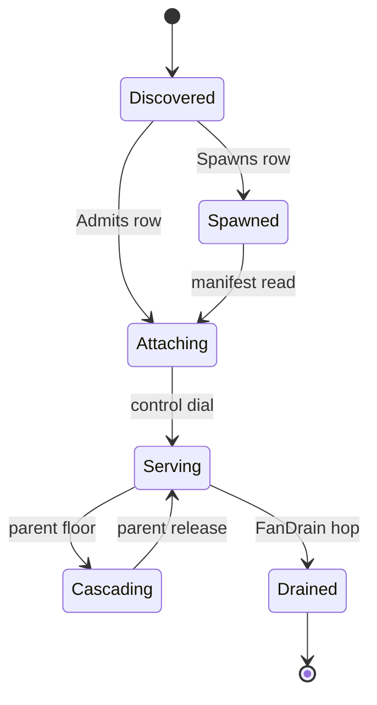
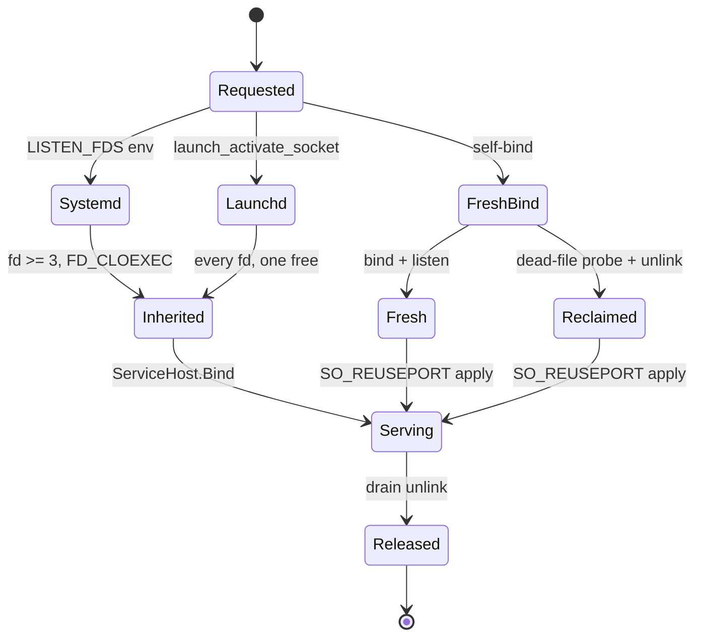

# [APPHOST_COMPANION_SIDECAR]

The inbound serving counterpart to the outbound boundary: one `ProcessModality` axis carries the companion, sidecar, and paired-peer spawn-attach-discovery-degradation rows, one `PeerRoster` folds every accepted connection into a lease-epoch attached-peer set on the serving side, one `ControlInbound` handler folds the five `ControlService` wire verbs onto the existing degradation, options, support, dispatch, and config owners under one inbound trace continuation, one `ServiceHost` registration mounts the gRPC server and the co-hosted asset seat over a Unix domain socket, one cross-process cascade writes a parent-observed level onto the child `DegradationCell.Cascade` floor, one `PeerAdmission` reads the connecting peer's credentials at accept over the managed raw-socket-option route, and one `HostBinding` owner acquires the serving endpoint over a nine-row OS-by-activation-source-by-address policy table that folds systemd socket activation, launchd socket activation, and a fresh bind into one acquisition through the `ServiceHost.Bind` listener seam. The page owns the modality axis, the attached-peer roster, the verb-fold handler, the server-host registration, the cascade write, the peer-credential read, and the host-binding acquisition; it consumes `DegradationCell`, `OptionsAdmission`, `SupportTrigger`, `HostAttachPort`, `ReceiptSinkPort`, `TraceContext`/`TenantAdoption`, `RedactionRegistration`/`IRedactorProvider`, `CommandDispatch`/`CommandIntent`, `Membership.Contribute`, and the `Discovery` UDS/manifest law as settled vocabulary, leaves SIGTERM/SIGQUIT/SIGHUP to `Runtime/lifecycle#FAULT_SPINE.ArmTraps` and readiness notify to `Runtime/profiles#LIFETIME_ADAPTERS.SystemdNotifier`, and mints no eighth port.

## [01]-[INDEX]

- [02]-[PROCESS_MODALITY]: Three modality rows and lease-epoch attached-peer roster on the serving side.
- [03]-[CONTROL_SERVICE]: Five wire verbs folded onto their existing owners under one trace continuation.
- [04]-[SERVICE_HOST]: gRPC server registration, the co-hosted asset seat, and the Unix-domain-socket intake.
- [05]-[DEGRADATION_CASCADE]: Parent floor written to the child cell over the control hop.
- [06]-[PEER_ADMISSION]: Accept-side peer-credential read over the managed raw-socket-option route.
- [07]-[HOST_BINDING]: OS x activation-source x address bind acquisition, reuse, and override.

## [02]-[PROCESS_MODALITY]

- Owner: `ProcessModality` `[SmartEnum<string>]` three rows under the shipped `ComparerAccessors.StringOrdinalIgnoreCase` accessor; `ModalityRow` per-case policy record; `ModalityRows` frozen row set with the total dispatch; `CompanionPeer` the attached-child capsule the modality row produces; `PeerRoster` the `Atom`-backed serving-side attached-connection set carrying a monotone lease epoch; `RosterEntry` the per-connection lease record; `RosterReceipt` the join/renew/drop transition projection the sink fans.
- Cases: companion, sidecar, paired-peer — companion is the host-spawned single-shot child, sidecar is the externally-supervised attach-only peer, paired-peer is the symmetric dual-attach where each side both spawns and admits; three roster transitions — join on accept, renew on heartbeat, drop on lease expiry or disconnect.
- Entry: `ModalityRow Row` is the extension property total state-free `Switch` from case to frozen row; `Attach(PeerRoster roster, ModalityRow row, ProcessStartInfo spec, Func<int, Fin<DiscoveryManifest>> manifestOf, Func<DiscoveryManifest, CancellationToken, IO<Unit>> drainFan, GrpcChannelPolicy policy)` returns `IO<CompanionPeer>` and carries the timed spawn-and-dial effect; `ForwardWrite(PeerRoster roster, ModalityRow row, CommandIntent intent, Func<RosterEntry, CommandIntent, IO<CommandReceipt>> hop)` returns `IO<Option<Seq<CommandReceipt>>>` — the `ForwardsWrites`-gated durable-write forward; `PeerRoster.Accept(ModalityRow row, ServerCallContext context, DiscoveryManifest manifest)` returns `IO<Fin<RosterReceipt>>` — the serving-side accept hop; `PeerRoster.Admit(PeerCredential credential, DiscoveryManifest manifest, Instant now)`, `.Renew(int pid, Instant now)`, and `.Drop(int pid, Instant now)` each fold one transition over the `Atom` and return `IO<RosterReceipt>` carrying the lease epoch.
- Auto: `Attach` reads the discovery manifest through the bound `Discovery.Read` projection and dials the control channel through `Discovery.Connect`, running the single-shot `Discovery.Spawn` only on rows whose `Spawns` column is set and the attach-only read only on rows whose `Admits` column is set — a row carrying neither refuses on the typed rail rather than inheriting the attach arm — and both arms bracket the dial with the roster's clock so one `ModalityReceipt` carries the real outcome, the measured elapsed, and the `DegradesChild` cascade-eligibility the write consults; `Accept` reads the accepted socket off the connection's `IConnectionSocketFeature`, folds it through `PeerAdmission.Read`, and hands the credential to `Admit`, so the credential chain runs accept to admit with no prose hop between; `Admit` keys the entry by the kernel-reported `PeerCredential.Pid` — never the manifest's self-asserted pid — stamps the lease deadline from `LeasePolicy.Maintenance.CrashStaleness` so a peer's lease lapses on the same crash-staleness window the maintenance lease uses, and fires the bound `Contribute` edge so the local attach reaches the cluster view as a `Joining` row the probe sweep then grades; `Renew` extends the lease, and `Sweep(Instant now)` drops every entry whose lease lapsed so a vanished peer leaves the roster without an explicit disconnect; every transition mints one `RosterReceipt` fanned through `ReceiptSinkPort.Send`.
- Receipt: `ModalityReceipt` — modality key, peer pid, attach outcome, elapsed `Duration`, cascade-eligible flag; `RosterReceipt` — transition kind, peer pid+uid, lease epoch, attached-count after the fold, `Instant`.
- Packages: Thinktecture.Runtime.Extensions, LanguageExt.Core, NodaTime, Grpc.Net.Client, Grpc.AspNetCore (`ServerCallContextExtensions.GetHttpContext`, `IConnectionSocketFeature`), BCL inbox
- Growth: one case plus one `ModalityRow` absorbs a new process topology; the spawn, attach, cascade, and write-forward legs are column flips on the row, never a parallel surface; a new roster transition is one `RosterTransition` case plus one fold arm; zero new surface. `ForwardWrite` is the whole write-forward surface — the `ForwardsWrites` column routes a local durable write up the control hop to the attached owners rather than persisting locally, so a supervised sidecar never owns its own store and the acknowledgement is the owner store's own landing receipt, never a locally minted one.
- Boundary: the modality row consumes `OutboundHop.CompanionSpawn` and `OutboundHop.LocalIpc` from the dial-out owner and never re-declares the spawn or connect mechanics — `Discovery.Spawn`, `Discovery.Connect`, and `Discovery.Read` carry the bytes; `Spawns` is the single-shot guard so a sidecar row attaches without ever starting a process and a paired-peer row both spawns and admits, `Admits` gates both the attach arm and the serving-side `Accept` registration so an unadmitting row seats no peer, and `ForwardsWrites` gates `ForwardWrite` — every column has its reader on this page; `DegradesChild` is the cascade-eligibility column the `DEGRADATION_CASCADE` write reads, never a second degradation owner; the attach deadline is the `DeadlineClass.HopAttempt` row read by projection and the lease deadline is the `LeasePolicy.Maintenance.CrashStaleness` value, never a literal here; `CompanionPeer` carries the `CompanionChild` produced by the outbound spawn and the `GrpcChannel` produced by the control dial so one capsule owns both legs of an attached child; `PeerRoster` is the single host-side attached-connection owner — the lease epoch is a monotone `ulong` bumped on every join and drop so a stale peer reconnecting under a prior epoch is detectable, and the roster never re-mints presence: it is the beat PRODUCER of the `Rasm.Persistence` `Version/ledger#PRESENCE` EPHEMERAL awareness lane — each join/drop and each heartbeat crosses as the Persistence-OWNED `PresenceRow(Actor, State, At, Ttl)` wire row through `Awareness.Present(actor, state, ttl, frame)` (the lossy signal riding `Awareness.Beat`), the `Runtime/resources#DRAIN_QUEUES` `DrainSurface` lane the in-process transport — the presence lane is `durable: false`, NEVER the durable store, never the exactly-once CDC envelope, and no AppHost type crosses down, so the roster mechanics live here and the ephemeral presence value lives there; `WireHealth` reads the attached-count for per-peer serving status, never a second roster; the two-tier membership law holds — `PeerRoster` is the LOCAL kernel-credentialed attach set contributing into `Wire/coordination#MEMBERSHIP_VIEW` through `Membership.Contribute`, `FleetRoll` reads `MembershipView.Serving` (cluster liveness) for its fleet wave while each node's actual roll dials local over this control hop, and `ForwardWrite` reads `PeerRoster.Attached` as the LOCAL forwarding set; the page is host-local and crosses no browser or peer TS wire of its own — the `ControlService` verb messages are Rasm.Compute/Runtime/wire#PROTO_VOCABULARY-owned protobuf consumed here, the verb replies project the existing typed receipts field-for-field at that Compute-owned proto, and `RosterReceipt`/`ModalityReceipt` reconstruct through the existing `ReceiptEnvelopeWire` at Runtime/ports#TS_PROJECTION, so the page authors no `TS_PROJECTION` cluster and mints no second wire shape.

```csharp signature

[SmartEnum<string>]
[KeyMemberEqualityComparer<ComparerAccessors.StringOrdinalIgnoreCase, string>]
[KeyMemberComparer<ComparerAccessors.StringOrdinalIgnoreCase, string>]
public sealed partial class ProcessModality {
    public static readonly ProcessModality Companion = new("companion");
    public static readonly ProcessModality Sidecar = new("sidecar");
    public static readonly ProcessModality PairedPeer = new("paired-peer");
}

public sealed record ModalityRow(
    ProcessModality Modality,
    bool Spawns,
    bool Admits,
    bool DegradesChild,
    bool ForwardsWrites,
    HopIdempotency Idempotency,
    DeadlineClass Attach);

public sealed record CompanionPeer(
    ProcessModality Modality,
    Option<CompanionChild> Child,
    GrpcChannel Control,
    DiscoveryManifest Manifest);

public readonly record struct ModalityReceipt(
    ProcessModality Modality,
    int PeerPid,
    HopOutcome Attach,
    Duration Elapsed,
    bool CascadeEligible);

public static class ModalityRows {
    public static readonly ModalityRow Companion = new(ProcessModality.Companion, Spawns: true, Admits: false, DegradesChild: true, ForwardsWrites: false, HopIdempotency.SingleShot, DeadlineClass.HopAttempt);
    public static readonly ModalityRow Sidecar = new(ProcessModality.Sidecar, Spawns: false, Admits: true, DegradesChild: false, ForwardsWrites: true, HopIdempotency.Keyed, DeadlineClass.HopAttempt);
    public static readonly ModalityRow PairedPeer = new(ProcessModality.PairedPeer, Spawns: true, Admits: true, DegradesChild: true, ForwardsWrites: false, HopIdempotency.Keyed, DeadlineClass.HopAttempt);

    extension(ProcessModality modality) {
        public ModalityRow Row => modality.Switch(
            companion: static () => Companion,
            sidecar: static () => Sidecar,
            pairedPeer: static () => PairedPeer);
    }

    // The row's own columns decide the arm — Spawns selects the single-shot spawn, Admits selects the
    // attach-only read, and a row carrying neither refuses rather than silently taking the attach arm a
    // Spawns:false row would otherwise inherit. Every arm is timed and receipted through the roster's own
    // clock and sink, so the declared attach outcome and elapsed duration have a producer.
    public static IO<CompanionPeer> Attach(PeerRoster roster, ModalityRow row, ProcessStartInfo spec, Func<int, Fin<DiscoveryManifest>> manifestOf, Func<DiscoveryManifest, CancellationToken, IO<Unit>> drainFan, GrpcChannelPolicy policy) =>
        IO.lift(() => roster.Clock.GetCurrentInstant()).Bind(mark =>
            Dial(row, spec, manifestOf, drainFan, policy)
                .Bind(peer => Receipted(roster, row, peer.Manifest.Pid, new HopOutcome.Delivered(), mark).Map(_ => peer))
                .Catch(error => Receipted(roster, row, 0, new HopOutcome.Faulted(error), mark)
                    .Bind(_ => IO.fail<CompanionPeer>(error))));

    // The sidecar write-forward gate lives on the row, never at a call site: a ForwardsWrites row routes the
    // durable write up the control hop to every attached owner and answers with THEIR landing receipts, so a
    // supervised sidecar owns no store and mints no local acknowledgement; a row without the column answers
    // None and its caller persists locally against the store it does own.
    public static IO<Option<Seq<CommandReceipt>>> ForwardWrite(PeerRoster roster, ModalityRow row, CommandIntent intent, Func<RosterEntry, CommandIntent, IO<CommandReceipt>> hop) =>
        row.ForwardsWrites
            ? roster.Attached.TraverseM(entry => hop(entry, intent)).As().Map(Some)
            : IO.pure(Option<Seq<CommandReceipt>>.None);

    static IO<CompanionPeer> Dial(ModalityRow row, ProcessStartInfo spec, Func<int, Fin<DiscoveryManifest>> manifestOf, Func<DiscoveryManifest, CancellationToken, IO<Unit>> drainFan, GrpcChannelPolicy policy) =>
        row.Spawns
            ? IO.lift(() => Discovery.Spawn(spec, manifestOf, drainFan))
                .Bind(spawned => spawned.Match(
                    Succ: child => IO.pure(new CompanionPeer(row.Modality, child, Discovery.Connect(child.Manifest, policy), child.Manifest)),
                    Fail: fault => IO.fail<CompanionPeer>(fault)))
        : row.Admits
            ? IO.lift(() => manifestOf(0))
                .Bind(read => read.Match(
                    Succ: manifest => IO.pure(new CompanionPeer(row.Modality, None, Discovery.Connect(manifest, policy), manifest)),
                    Fail: fault => IO.fail<CompanionPeer>(fault)))
            : IO.fail<CompanionPeer>(new HopFault.Excluded($"{row.Modality.Key}: row neither spawns nor admits"));

    static IO<Unit> Receipted(PeerRoster roster, ModalityRow row, int pid, HopOutcome outcome, Instant mark) =>
        IO.lift(() => new ModalityReceipt(row.Modality, pid, outcome, roster.Clock.GetCurrentInstant() - mark, row.DegradesChild))
            .Bind(receipt => roster.Sink.Send(Correlation.Mint(), roster.Tenant, TelemetrySource.AppHost.Key, nameof(ModalityRows),
                JsonSerializer.SerializeToElement(receipt, SuiteContracts.Host)))
            .Map(static _ => unit);
}

[SmartEnum]
public sealed partial class RosterTransition {
    public static readonly RosterTransition Joined = new();
    public static readonly RosterTransition Renewed = new();
    public static readonly RosterTransition Dropped = new();
}

public sealed record RosterEntry(
    int Pid,
    uint Uid,
    DiscoveryManifest Manifest,
    ulong Epoch,
    Instant JoinedAt,
    Instant LeaseUntil);

public readonly record struct RosterReceipt(
    RosterTransition Transition,
    int Pid,
    uint Uid,
    ulong Epoch,
    int Attached,
    Instant At);

public sealed record PeerRoster(
    string Service,
    Atom<(HashMap<int, RosterEntry> Entries, ulong Epoch)> Cell,
    Func<PeerCredential, DiscoveryManifest, Unit> Contribute,
    ReceiptSinkPort Sink,
    IClock Clock,
    TenantContext Tenant) {
    // Contribute is the bound local-to-cluster edge: the composition root fills it with the page's declared
    // Membership.Contribute call under this node's RoleName, so the two-tier fold is a wired delegate rather
    // than a prose claim, and a harness with no cluster view binds the no-op without forking the roster.
    public static PeerRoster Boot(string service, Func<PeerCredential, DiscoveryManifest, Unit> contribute, ReceiptSinkPort sink, IClock clock, TenantContext tenant) =>
        new(service, Atom((HashMap<int, RosterEntry>.Empty, 0UL)), contribute, sink, clock, tenant);

    public Seq<RosterEntry> Attached => Cell.Value.Entries.Values.ToSeq();

    // The ONE accept hop the credential chain needed: Kestrel exposes the accepted socket on the connection
    // through IConnectionSocketFeature, so the kernel-reported uid and pid are read off THAT socket and the
    // entry keys on them. The manifest's own pid is a claim the peer writes about itself and never keys here.
    // An Admits:false row refuses the attach rather than seating a peer its modality never serves.
    public IO<Fin<RosterReceipt>> Accept(ModalityRow row, ServerCallContext context, DiscoveryManifest manifest) =>
        !row.Admits
            ? IO.pure(Fin.Fail<RosterReceipt>(new HopFault.Excluded($"{Service}:{row.Modality.Key}:does-not-admit")))
            : IO.lift(() => Optional(context.GetHttpContext().Features.Get<IConnectionSocketFeature>()))
                .Bind(feature => feature.Match(
                    Some: socket => PeerAdmission.Read(socket.Socket).Match(
                        Succ: credential => Admit(credential, manifest, Clock.GetCurrentInstant()).Map(Fin.Succ),
                        Fail: error => IO.pure(Fin.Fail<RosterReceipt>(error))),
                    None: () => IO.pure(Fin.Fail<RosterReceipt>(new HopFault.Excluded($"{Service}:no-accepted-socket")))));

    public IO<RosterReceipt> Admit(PeerCredential credential, DiscoveryManifest manifest, Instant now) =>
        Commit(RosterTransition.Joined, credential.Pid, credential.Uid, now, state => {
            var epoch = state.Epoch + 1UL;
            var entry = new RosterEntry(credential.Pid, credential.Uid, manifest, epoch, now, now + LeasePolicy.Maintenance.CrashStaleness);
            return (state.Entries.AddOrUpdate(credential.Pid, entry), epoch);
        }).Bind(receipt => IO.lift(() => Contribute(credential, manifest)).Map(_ => receipt));

    public IO<RosterReceipt> Renew(int pid, Instant now) =>
        Commit(RosterTransition.Renewed, pid, Uid(pid), now, state =>
            (state.Entries.Find(pid).Match(
                entry => state.Entries.SetItem(pid, entry with { LeaseUntil = now + LeasePolicy.Maintenance.CrashStaleness }),
                () => state.Entries),
             state.Epoch));

    public IO<RosterReceipt> Drop(int pid, Instant now) =>
        Commit(RosterTransition.Dropped, pid, Uid(pid), now, state => (state.Entries.Remove(pid), state.Epoch + 1UL));

    public IO<Seq<RosterReceipt>> Sweep(Instant now) =>
        Cell.Value.Entries.Values.Filter(entry => entry.LeaseUntil <= now).ToSeq()
            .TraverseM(entry => Drop(entry.Pid, now)).As();

    uint Uid(int pid) => Cell.Value.Entries.Find(pid).Match(entry => entry.Uid, () => 0U);

    IO<RosterReceipt> Commit(RosterTransition transition, int pid, uint uid, Instant now, Func<(HashMap<int, RosterEntry> Entries, ulong Epoch), (HashMap<int, RosterEntry> Entries, ulong Epoch)> fold) =>
        IO.lift(() => Cell.Swap(state => fold((state.Entries, state.Epoch))))
            .Map(state => new RosterReceipt(transition, pid, uid, state.Epoch, state.Entries.Count, now))
            .Bind(receipt => Sink.Send(Correlation.Mint(), Tenant, TelemetrySource.AppHost.Key, nameof(PeerRoster), JsonSerializer.SerializeToElement(receipt, SuiteContracts.Host)).Map(_ => receipt));
}
```


```mermaid
stateDiagram-v2
    accTitle: Companion process lifecycle
    accDescr: A discovered companion spawning or attaching directly, serving under a control dial, cascading down and back on parent floor pressure, and draining to termination through the fan hop.
    [*] --> Discovered
    Discovered --> Spawned: Spawns row
    Discovered --> Attaching: Admits row
    Spawned --> Attaching: manifest read
    Attaching --> Serving: control dial
    Serving --> Cascading: parent floor
    Cascading --> Serving: parent release
    Serving --> Drained: FanDrain hop
    Drained --> [*]
```

## [03]-[CONTROL_SERVICE]

- Owner: `ControlInbound` static handler folding the three `ControlService` verbs onto the existing transition owners; `ControlRuntime` the dependency record carrying the degradation cell, the options invalidation seam, the active-config and reload anchors, the support runtime, the clock, and the receipt sink; `VerbReceipt` the per-verb projection the sink receives.
- Cases: five verbs, each folding onto an existing owner — set-degradation onto `DegradationCell.Force`, reload-options onto `OptionsAdmission.Invalidate` landing one `ReloadReceipt` under `ReloadReceipt.ControlTrigger` wrapping the `ReloadOutcome.Applied` transition, capture-support onto `SupportTrigger.ExternalCommand` and `SupportCapture.Capture`, dispatch-tool onto the `Agent/runtime#COMMAND_DISPATCH` `CommandDispatch.Run` front door behind the redaction-and-audit seam, dispatch-patch onto `OptionsAdmission.PatchSection` under `ReloadReceipt.PatchTrigger`.
- Entry: every verb takes the `ServerCallContext` its generated override already holds — `SetDegradation(ControlRuntime runtime, ServerCallContext context, string level, string reason)` returns `IO<DegradationState>`, `ReloadOptions(ControlRuntime runtime, ServerCallContext context)` returns `IO<ReloadReceipt>`, `CaptureSupport(ControlRuntime runtime, ServerCallContext context, CorrelationId correlation, string reason)` returns `IO<SupportReceipt>`, `DispatchTool(ControlRuntime runtime, ServerCallContext context, string tool, JsonElement arguments)` returns `IO<CommandReceipt>`, and `DispatchPatch(ControlRuntime runtime, ServerCallContext context, string section, JsonElement patch)` returns `IO<ReloadReceipt>` — each rail is the existing owner's rail, never a new one, and each fold runs inside the one `Continued` trace bracket.
- Auto: each verb emits its existing typed receipt fanned to the lake through `ReceiptSinkPort.Send`; the wire level key admits through `DegradationLevel.TryGet` so an unknown key resolves to `None` and `Force` re-derives rather than forcing a phantom level; reload-options invalidates the options-monitor cache through the bound `InvalidateOptions` seam and stamps the same `ReloadOutcome.Applied` transition the `SIGHUP` signal and the options monitor enqueue, distinguished only by the `ReloadReceipt.ControlTrigger` trigger string carried on the `ReloadReceipt`; every fold brackets in `TraceContext.Continue(runtime.Source, context.RequestHeaders, verb, ControlRuntime.Adoption)` so the companion span descends from the caller's span instead of rooting fresh, and the parent's client leg injects the same context through `TraceContext.Inject(Metadata)` — the local-ipc hop is the one leg the propagation composite names and the two call sites are what make the claim hold; dispatch-tool redacts the argument payload BEFORE the audit and the dispatch, resolving the redactor off the descriptor's own `PermissionShape.Classification` through `IRedactorProvider.GetRedactor`, so an unresolvable tool falls to the `Unknown` row whose erase treatment keeps the audit record fail-closed.
- Receipt: `DegradationState`, `ReloadReceipt` (wrapping `ReloadOutcome.Applied`), `SupportReceipt`, and `CommandReceipt` cross verbatim — `VerbReceipt` carries the verb kind and the serialized payload `JsonElement` the sink fans, never a generic control-receipt ledger; dispatch-tool fans a `ToolAudit` carrying the tool key and the REDACTED argument text, never the raw payload the dispatch consumed.
- Packages: LanguageExt.Core, NodaTime, Thinktecture.Runtime.Extensions, Grpc.Core.Api, Microsoft.AspNetCore.JsonPatch.SystemTextJson, Microsoft.Extensions.Compliance.Redaction, BCL inbox
- Growth: a new control verb is one method on `ControlInbound` folding onto its existing owner plus one `VerbReceipt` kind and one `Continued` bracket; zero new surface — no `ControlReceipt` abstraction and no new state machine. The two dispatch verbs are that shape at full size: `DispatchTool` folds the requested tool call through the redaction-and-audit seam (the bound `Classify` column resolves the payload's classification, `SupportTrigger.ExternalCommand` audits the invocation) before `CommandDispatch.Run` lands it, riding `VerbReceipt.DispatchTool` whose payload carries the redacted argument projection so the audited record never holds classified argument text; `DispatchPatch` admits the RFC-6902 `application/json-patch+json` document carried in the request and folds it through `Runtime/config#POLICY_VALUES` `OptionsAdmission.PatchSection` onto the one `ReloadOutcome` transition stamped on a `ReloadReceipt` under `ReloadReceipt.PatchTrigger`, so a partial config edit is the same reload concern the SIGHUP signal and the reload-options verb land, distinguished only by the patch trigger and never a second config-mutation owner.
- Boundary: the generated contract is settled law, not a spelling to re-ask — `grpc_csharp_plugin` emits `ControlService` from the repo's own `.proto` at compile time, so it lives in no installed artifact and the G7 spec-compile gate is the only rail that can see it, while the SHAPE it must satisfy is fixed: each unary override on `ControlService.ControlServiceBase` is `public virtual Task<TReply> Verb(TRequest request, ServerCallContext context)`, each client verb on `ControlService.ControlServiceClient : ClientBase<ControlServiceClient>` is the four-member quartet (blocking `TReply Verb(TRequest, Metadata, DateTime?, CancellationToken)`, blocking `TReply Verb(TRequest, CallOptions)`, `AsyncUnaryCall<TReply> VerbAsync(TRequest, Metadata, DateTime?, CancellationToken)`, `AsyncUnaryCall<TReply> VerbAsync(TRequest, CallOptions)`) over the protected `NewInstance(ClientBaseConfiguration)` clone seam, `BindService` is the registration seam in both its `ServerServiceDefinition BindService(ControlServiceBase)` and `void BindService(ServiceBinderBase, ControlServiceBase)` forms, and `__ServiceName` is the proto package-qualified name every `Method<TRequest,TReply>` descriptor keys on — every type those members derive from is catalogued at `libs/csharp/.api/api-grpc-core-api.md` `[STACKING]`; the set-degradation verb is the service-modality route into the one `OperatorOverride` forcing concern and lands `DegradationCell.Force`, the reload-options verb is the service-modality route into the one `ReloadOutcome.Applied` transition stamped on a `ReloadReceipt` under `ControlTrigger`, and the capture-support verb admits `SupportTrigger.ExternalCommand` into the one support concern — the wire verb is the route in, never a parallel owner; the `Empty` request on reload-options and capture-support carries no payload so the handler reads runtime state, and `SetDegradationRequest` carries the level key text the `TryGet` admission validates; the reply messages project the typed receipts field-for-field at the Compute-owned proto, this page owns only the fold from wire to owner; ingress tenancy is ADMITTED per carrier and `TenantAdoption` carries no default, so this hop states its trust class explicitly — `ControlRuntime.Adoption` is `TenantAdoption.Adopted` because `PeerAdmission` has already read the connecting peer's kernel-reported uid and pid off the accepted socket, which is exactly the trusted-carrier case the `RULINGS.md` `[02]` ingress-tenancy ruling admits, and a hop without that credential read carries `Refused`.

```csharp signature
public sealed record ControlRuntime(
    DegradationCell Degradation,
    Func<Option<string>, Unit> InvalidateOptions,
    Func<IConfigurationRoot> ActiveConfig,
    string ReloadSection,
    ReloadClass ReloadClass,
    Func<string, Func<JsonObject, Validation<ConfigError, Unit>>> Revalidate,
    Func<CommandIntent, IO<CommandReceipt>> Dispatch,
    Func<string, DataClassification> Classify,
    IRedactorProvider Redactors,
    ActivitySource Source,
    SupportRuntime Support,
    IClock Clock,
    ReceiptSinkPort Sink,
    JsonSerializerOptions Wire) {
    public static readonly string Package = TelemetrySource.AppHost.Key;

    // The control hop's trust class, stated because TenantAdoption carries no default: PeerAdmission has
    // already read this peer's kernel-reported uid and pid off the accepted socket, so the wire tenancy
    // rides a carrier the kernel authenticated. A hop reached without that read carries Refused instead.
    public static readonly TenantAdoption Adoption = TenantAdoption.Adopted;
}

public readonly record struct VerbReceipt(string Verb, JsonElement Payload) {
    public const string SetDegradation = "set-degradation";
    public const string ReloadOptions = "reload-options";
    public const string CaptureSupport = "capture-support";
    public const string DispatchTool = "dispatch-tool";
    public const string DispatchPatch = "dispatch-patch";
}

// The audited tool row: the tool key beside the REDACTED argument text. The raw payload reaches the command
// algebra and nothing else — a receipt lake carrying the unredacted arguments of every operator tool call is
// the disclosure this shape forecloses.
public readonly record struct ToolAudit(string Tool, string Arguments);

public static class ControlInbound {
    public static IO<DegradationState> SetDegradation(ControlRuntime runtime, ServerCallContext context, string level, string reason) =>
        Continued(runtime, context, VerbReceipt.SetDegradation, () =>
            from forced in IO.pure(DegradationLevel.TryGet(level, out var resolved) ? Optional(resolved) : Option<DegradationLevel>.None)
            from state in IO.lift(() => runtime.Degradation.Force(forced))
            from _ in Fan(runtime, VerbReceipt.SetDegradation, state)
            select state);

    public static IO<ReloadReceipt> ReloadOptions(ControlRuntime runtime, ServerCallContext context) =>
        Continued(runtime, context, VerbReceipt.ReloadOptions, () =>
            from _invalidate in IO.lift(() => runtime.InvalidateOptions(None))
            from receipt in IO.lift(() => new ReloadReceipt(
                Section: runtime.ReloadSection,
                Class: runtime.ReloadClass,
                Trigger: ReloadReceipt.ControlTrigger,
                Outcome: new ReloadOutcome.Applied(runtime.ReloadSection),
                At: runtime.Clock.GetCurrentInstant(),
                CorrelationId: runtime.Support.Active.Value.IfNone(Correlation.Mint)))
            from _ in Fan(runtime, VerbReceipt.ReloadOptions, receipt)
            select receipt);

    public static IO<SupportReceipt> CaptureSupport(ControlRuntime runtime, ServerCallContext context, CorrelationId correlation, string reason) =>
        Continued(runtime, context, VerbReceipt.CaptureSupport, () =>
            from receipt in SupportCapture.Capture(runtime.Support, new SupportTrigger.ExternalCommand(correlation, reason))
            from _ in Fan(runtime, VerbReceipt.CaptureSupport, receipt)
            select receipt);

    // Redact, audit, THEN dispatch: the audited row is minted off the redacted projection before the command
    // algebra sees the payload, so an abort inside the dispatch still leaves the invocation on the audit trail
    // and no arm can reorder the fold into recording raw arguments.
    public static IO<CommandReceipt> DispatchTool(ControlRuntime runtime, ServerCallContext context, string tool, JsonElement arguments) =>
        Continued(runtime, context, VerbReceipt.DispatchTool, () =>
            from correlation in IO.lift(() => runtime.Support.Active.Value.IfNone(Correlation.Mint))
            from audited in IO.lift(() => Audited(runtime, tool, arguments))
            from _audit in SupportCapture.Capture(runtime.Support,
                new SupportTrigger.ExternalCommand(correlation, $"{VerbReceipt.DispatchTool}:{tool}"))
            from receipt in runtime.Dispatch(CommandIntent.Of(
                tool, new CommandArguments(arguments, TenantContext.Current, correlation), CallerModality.Operator))
            from _ in Fan(runtime, VerbReceipt.DispatchTool, audited)
            select receipt);

    public static IO<ReloadReceipt> DispatchPatch(ControlRuntime runtime, ServerCallContext context, string section, JsonElement patch) =>
        Continued(runtime, context, VerbReceipt.DispatchPatch, () =>
            from outcome in IO.lift(() => OptionsAdmission.PatchSection(
                live: JsonSerializer.SerializeToNode(runtime.ActiveConfig().GetSection(section), runtime.Wire)!.AsObject(),
                section: section,
                reload: runtime.ReloadClass,
                patch: patch.Deserialize<JsonPatchDocument>(runtime.Wire)!,
                revalidate: runtime.Revalidate(section)))
            from _invalidate in IO.lift(() => outcome.IsSuccess ? runtime.InvalidateOptions(Some(section)) : unit)
            from receipt in IO.lift(() => new ReloadReceipt(
                Section: section,
                Class: runtime.ReloadClass,
                Trigger: ReloadReceipt.PatchTrigger,
                Outcome: outcome.Match(Succ: static applied => applied, Fail: static fault => new ReloadOutcome.Rejected(section, fault)),
                At: runtime.Clock.GetCurrentInstant(),
                CorrelationId: runtime.Support.Active.Value.IfNone(Correlation.Mint)))
            from _ in Fan(runtime, VerbReceipt.DispatchPatch, receipt)
            select receipt);

    // The ONE inbound continuation seat: every verb runs under the parent's extracted context so a companion
    // span descends from the caller instead of rooting fresh. The scope restores prior baggage on dispose, so
    // the bracket is a statement body — a fold that continued without disposing would leak the caller's
    // tenancy into whatever ran next on the thread.
    static IO<A> Continued<A>(ControlRuntime runtime, ServerCallContext context, string verb, Func<IO<A>> fold) =>
        IO.liftAsync(async () => {
            using var scope = TraceContext.Continue(runtime.Source, context.RequestHeaders, verb, ControlRuntime.Adoption);
            return await fold().RunAsync();
        });

    // Whole-set redactor lookup off the descriptor's own PermissionShape.Classification. An unresolvable tool
    // key answers Unknown, whose erase treatment makes the miss fail closed — the audit row then names the
    // tool and an erased argument shape rather than leaking a payload nobody graded.
    static ToolAudit Audited(ControlRuntime runtime, string tool, JsonElement arguments) {
        var redactor = runtime.Redactors.GetRedactor(new DataClassificationSet(runtime.Classify(tool).Marker));
        return new ToolAudit(tool, RedactedText.Appended(new StringBuilder(), redactor, arguments.GetRawText()).ToString());
    }

    static IO<Unit> Fan<T>(ControlRuntime runtime, string verb, T payload) where T : notnull =>
        runtime.Sink.Send(
            runtime.Support.Active.Value.IfNone(Correlation.Mint),
            TenantContext.Current,
            ControlRuntime.Package,
            verb,
            JsonSerializer.SerializeToElement(payload, runtime.Wire)).Map(static _ => unit);
}
```

## [04]-[SERVICE_HOST]

- Owner: `ServiceHost` static registration surface mounting the gRPC server, the co-hosted asset seat, and the control intake transport; `ControlTransport` `[Union]` carrying the Unix-domain-socket and inherited-fd intake legs.
- Cases: unix-domain-socket binds Kestrel over the `sun_path` endpoint, inherited-fd mounts Kestrel over a socket-activated descriptor the `HostBinding` owner acquired — the two local control-plane intake shapes on every supported platform.
- Entry: `Register(IServiceCollection services)` folds `AddGrpc` and the health-service registration; `Assets(IApplicationBuilder app, ResolvedProfile resolved, string bundleRoot)` seats the co-hosted static-file middleware ahead of endpoint routing under the `CoHostedAssets` gate; `Map(IEndpointRouteBuilder endpoints)` folds `MapGrpcService<ControlServiceImpl>`, `MapGrpcService<FederationFlight>` (the Persistence `Query/federation#FLIGHT_RESULT_PLANE` FlightServer result plane — its boundary assigns channel, TLS, credentials, and service binding to THIS composition root), and the wire-health mapping; `Bind(KestrelServerOptions kestrel, ControlTransport transport)` folds the Unix `sun_path` Kestrel endpoint or one inherited handle; `BindEndpoint(KestrelServerOptions kestrel, BoundEndpoint endpoint)` projects a `HostBinding` `BoundEndpoint` onto the matching `ControlTransport` case per acquired descriptor so the host-binding acquisition seats every listener through this one seam.
- Auto: `AddGrpc` registers the server, `MapGrpcService<TService>` maps the `ControlService` implementation and the Flight result plane, `HealthServiceImpl.SetStatus` registers the wire-health serving status — narrowing a service name to a subset of the health registrations rides `GrpcHealthChecksOptions.Services.Map(string, Func<HealthCheckMapContext, bool>)`, the one name-keyed mapping member (the collection keys by service name through `Map` and `Remove`, and no `MapService` member exists to route predicates beside it) — and `Bind` routes the Unix leg through `KestrelServerOptions.ListenUnixSocket` at the `sun_path` endpoint and the inherited leg through `KestrelServerOptions.ListenHandle(ulong)` over the activated descriptor; filesystem mode on the socket path is the access guard, so the connecting peer's identity is read at accept by `PeerAdmission` rather than enforced by a transport ACL; `Assets` runs `UseStaticFiles(StaticFileOptions)` with `FileProvider` bound to a `PhysicalFileProvider` over the SELECTED bundle root and `RequestPath` empty, ordered ahead of `UseRouting` so the asset probe short-circuits before the gRPC endpoint match rather than after it.
- Receipt: the served `ServingStatus` transition logs through one `SpineLog` delegate in the 1000-1099 EVENT stride (`FaultBand.SpineEvents`); no parallel host receipt.
- Packages: Grpc.AspNetCore, Grpc.AspNetCore.HealthChecks, Grpc.HealthCheck (transitive: `HealthServiceImpl`/`SetStatus`/`Grpc.Health.V1.ServingStatus`), Microsoft.AspNetCore.App (shared framework: `UseStaticFiles`/`StaticFileOptions`/`PhysicalFileProvider`), LanguageExt.Core, BCL inbox
- Growth: a new served service is one `MapGrpcService<TService>` row; a new intake transport is one `ControlTransport` case; zero new surface — no second server-host owner.
- Boundary: the gRPC server-host packages enter only at service app roots behind the app-root pin and never below a plugin row; the Unix leg reuses the `Discovery` `sun_path` law at the 104-byte cap and is the one local control-plane transport — access is gated by the socket-file mode and the accept-side `PeerAdmission` credential read, never a transport-level ACL; the inherited-fd leg consumes every `HostBinding` `BoundEndpoint.Listeners` handle the systemd or launchd activation passed, so socket activation enters Kestrel through `ListenHandle` rather than a re-bind; the asset seat is `UseStaticFiles(StaticFileOptions)` and never `MapStaticAssets`, because the endpoint-routing form serves only build-emitted web assets off a build manifest and `CoHostedAssets` SELECTS its bundle at runtime — a TS tree the host build never participated in has no manifest entry, so the manifest form structurally cannot reach it; grpc-web stays DEFERRED at `Runtime/ports#WIRE_CONTRACT` — the control plane is a kernel-credentialed local UDS hop no browser origin reaches, so `UseGrpcWeb`/`EnableGrpcWeb` land only when a cross-origin deployment exists and a host-wide `GrpcWebOptions.DefaultEnabled` on a local control socket is the deleted form; `Grpc.HealthCheck.HealthServiceImpl()` is the parameterless wire-health owner — from the transitive `Grpc.HealthCheck` assembly the `Grpc.AspNetCore.HealthChecks` meta-row pulls, not from `Grpc.AspNetCore.HealthChecks` itself — whose `SetStatus(string, Grpc.Health.V1.HealthCheckResponse.Types.ServingStatus)` registration is the serving projection `WireHealth` only predicate-filters, with `ServingStatus.Serving=1` on healthy and degraded and `ServingStatus.NotServing=2` on unhealthy; the `Grpc.Core.Api` `ServerCallContext`, `IServerStreamWriter<T>`, and `ServerServiceDefinition` types route the G7 spec-compile gate; the `Grpc.Health.V1.ServingStatus` integers (`Unknown=0`, `Serving=1`, `NotServing=2`, `ServiceUnknown=3`) trace to the grounded gRPC health-proto enum, never invented here.

```csharp signature
[Union(ConversionFromValue = ConversionOperatorsGeneration.None)]
public abstract partial record ControlTransport {
    private ControlTransport() { }

    public sealed record UnixDomainSocket(string SocketPath) : ControlTransport;
    public sealed record InheritedHandle(SafeSocketHandle Handle) : ControlTransport;
}

public static class ServiceHost {
    public static IServiceCollection Register(IServiceCollection services) =>
        (services.AddGrpc().Services).AddGrpcHealthChecks().Services
            .AddSingleton(static _ => new HealthServiceImpl());

    public static void Map(IEndpointRouteBuilder endpoints) {
        ignore(endpoints.MapGrpcService<ControlServiceImpl>());
        ignore(endpoints.MapGrpcService<FederationFlight>());
        endpoints.MapGrpcHealthChecksService();
    }

    // Ahead of UseRouting by construction: the asset probe short-circuits before endpoint matching, so a
    // bundle path never reaches the gRPC matcher. The provider is opened over the SELECTED bundle root the
    // caller resolved — MapStaticAssets reads a build manifest and reaches no runtime-selected tree at all.
    public static IApplicationBuilder Assets(IApplicationBuilder app, ResolvedProfile resolved, string bundleRoot) =>
        resolved.CoHostedAssets
            ? app.UseStaticFiles(new StaticFileOptions {
                FileProvider = new PhysicalFileProvider(bundleRoot),
                RequestPath = PathString.Empty,
            })
            : app;

    public static Unit Serving(HealthServiceImpl health, string service, HealthCheckResponse.Types.ServingStatus status) =>
        (health.SetStatus(service, status), unit).Item2;

    public static Unit Bind(KestrelServerOptions kestrel, ControlTransport transport) => transport.Switch(
        unixDomainSocket: uds => (kestrel.ListenUnixSocket(uds.SocketPath), unit).Item2,
        inheritedHandle: inherited => (kestrel.ListenHandle((ulong)inherited.Handle.DangerousGetHandle()), unit).Item2);

    // Every acquired descriptor mounts, whatever the count and platform: a launchd Sockets entry with no
    // SockFamily hands back one listener per family (two), while a bare systemd ListenStream hands back one
    // dual-mode listener and a systemd pair exists only under explicit BindIPv6Only=ipv6-only — the count
    // rides LISTEN_FDS / the activation array, never an assumed family pair, so the fold is count-driven and
    // binding the first alone leaves any sibling open, unlistened, and undiagnosed. Kestrel's ListenHandle
    // ADOPTS the descriptor — the SafeSocketHandle stays the owning side and Release closes it once at drain,
    // so neither Kestrel's shutdown nor a second Bind closes an fd this endpoint still holds.
    public static Unit BindEndpoint(KestrelServerOptions kestrel, BoundEndpoint endpoint) =>
        endpoint.Listeners.IsEmpty
            ? Bind(kestrel, endpoint.Address switch {
                BindAddress.UnixPath { SocketPath.Length: > 0 } unix => new ControlTransport.UnixDomainSocket(unix.SocketPath),
                BindAddress.UnixPath => throw new ArgumentException($"{endpoint.Service}: fresh unix endpoint carries an empty sun_path", nameof(endpoint)),
                var other => throw new ArgumentException($"{endpoint.Service}: listenerless {other.GetType().Name} endpoint cannot mount through ServiceHost.Bind", nameof(endpoint)),
            })
            : endpoint.Listeners.Fold(unit, (_, listener) =>
                Bind(kestrel, new ControlTransport.InheritedHandle(listener.SafeHandle)));
}
```

## [05]-[DEGRADATION_CASCADE]

- Owner: `DegradationCascade` static write surface threading a parent-observed level onto the child `DegradationCell.Cascade` floor over the control hop; `CascadeReceipt` the cascade-decision projection.
- Entry: `Cascade(CompanionPeer peer, DegradationLevel level, string reason, ModalityRow row)` returns `IO<CascadeReceipt>` — the parent forwards its own effective level to the child over the control hop on cascade-eligible rows; `Apply(DegradationCell cell, Option<DegradationLevel> parent)` is the child-side write that consumes `DegradationCell.Cascade` and never derives a second level.
- Auto: the cascade rides the existing `degraded` lifecycle trigger receipt — no new instrument; the child re-derives on parent release because `DegradationCell.Cascade(None)` withdraws the floor and the existing `Derive` fold reclaims control; the floor never escalates below local pressure because `DegradationState.Floor` keeps the worse of the cascaded and derived ranks; the forwarding call carries `TraceContext.Inject(new Metadata())` as its headers so the child's cascade span descends from the parent's, the client half of the pair `CONTROL_SERVICE`'s `Continued` bracket closes.
- Receipt: `CascadeReceipt` carries the source level, the child pid, and the `Option<DegradationLevel>` the child acknowledged over the wire reply — the parent never fabricates the child's `DegradationState` from the sibling `Boot` seed, because the child's real state is owned by the child cell and only the acknowledged level crosses the contract; the child-side `DegradationState` transition the existing publisher already exports lands on the child through `Apply`, never a parallel telemetry surface synthesized at the parent.
- Packages: LanguageExt.Core, NodaTime, Grpc.Core.Api, BCL inbox
- Growth: a new cascade trigger is one call site over the existing `Cascade` fold; zero new surface — the parent-to-child cascade is a WRITE consumer of `DegradationCell.Cascade`, never a second `DegradationLevel` or `DegradationCell` owner.
- Boundary: only a row whose `ModalityRow.DegradesChild` column is set cascades, so a sidecar never floors its externally-supervised peer; the parent forwards its own `DegradationCell.Level` value as data to the child over the control hop, so the level value READ stays the parent's degradation owner and the floor WRITE lands on the child cell through `Cascade`, never the operator `Force` the set-degradation verb owns — the seam-split owner on `Observability/health#DEGRADATION_RAIL` keeps the level vocabulary, the `Derive` fold, and the `Cascade` floor admit; the child admits the cascaded key through the same `DegradationLevel.TryGet` admission the wire verb uses so an unknown key never floors the cell; the floor enters `Derive` as data, the existing fold semantics carry the convergence with no added rule row, and the child's inbound cascade leg lands through `Cascade` on every topology — paired and companion alike — so a parent-peer floor never arrives as an operator `Force`.

```csharp signature
public readonly record struct CascadeReceipt(
    DegradationLevel Source,
    int ChildPid,
    Option<DegradationLevel> Acknowledged);

public static class DegradationCascade {
    public static IO<CascadeReceipt> Cascade(CompanionPeer peer, DegradationLevel level, string reason, ModalityRow row) =>
        row.DegradesChild
            ? Forward(peer, level, reason).Map(acked => new CascadeReceipt(level, peer.Manifest.Pid, acked))
            : IO.pure(new CascadeReceipt(level, peer.Manifest.Pid, None));

    public static DegradationState Apply(DegradationCell cell, Option<DegradationLevel> parent) =>
        cell.Cascade(parent);

    // The client half of the local-ipc propagation pair: the active context writes onto call headers here and
    // the serving handler continues off them through ControlInbound.Continued. An uninjected call makes the
    // child's span a fresh root and severs the multi-process trace at the one hop the composite names.
    static IO<Option<DegradationLevel>> Forward(CompanionPeer peer, DegradationLevel level, string reason) =>
        IO.liftAsync(async () => {
            var client = new ControlService.ControlServiceClient(peer.Control);
            var reply = await client.SetDegradationAsync(
                new SetDegradationRequest { Level = level.Key, Reason = reason },
                TraceContext.Inject(new Metadata()));
            return DegradationLevel.TryGet(reply.Level, out var resolved) ? Optional(resolved) : Option<DegradationLevel>.None;
        });
}
```

## [06]-[PEER_ADMISSION]

- Owner: `PeerAdmission` static accept-side credential read over the managed `Socket.GetRawSocketOption` route; `PeerCredential` the resolved uid-pid record; `Ucred` and `Xucred` the blittable platform-shaped credential structs read into a stack span.
- Cases: linux reads `SO_PEERCRED` at `SOL_SOCKET` into a 12-byte `ucred`, macos reads `LOCAL_PEERCRED` at `SOL_LOCAL` into a 76-byte `xucred` then a second `LOCAL_PEERPID` read at `SOL_LOCAL` for the 4-byte peer pid — the platform branch selects the level, option name, struct width, and pid-read count at the single accept seam.
- Entry: `Read(Socket accepted)` returns `Fin<PeerCredential>` — `Socket.GetRawSocketOption(level, name, span)` fills the platform struct off the connected socket and the read folds to the connecting peer's uid and pid, aborting when the returned count is fewer bytes than the struct width or the macOS `cr_version` word is non-zero; a kernel `getsockopt` failure surfaces as a `SocketException` the `Try` rail traps into `HopFault.Text` carrying the `SocketException.SocketErrorCode`/`NativeErrorCode`, never an escaping exception.
- Auto: the credential read targets a stack `Span<byte>` sized to the platform struct, the macOS pid arrives from a separate `LOCAL_PEERPID` read into a 4-byte span because `xucred` carries no pid field, and the Linux `ucred` carries pid, uid, and gid in one 12-byte read; the returned byte count is the filled-length proof the read compares against the declared struct width before reinterpreting the bytes through `MemoryMarshal.Read`; because `GetRawSocketOption` is the managed seam it raises `SocketException` rather than setting the P/Invoke last error, so the errno is read from `SocketException.SocketErrorCode`/`NativeErrorCode` on the trapped error, never from a stale `Marshal.GetLastPInvokeError()` after a managed call.
- Receipt: `PeerCredential` carries the uid and pid the admission row trusts — read once at accept off the connected socket, never trusted from the manifest.
- Packages: LanguageExt.Core, BCL inbox
- Growth: a new platform is one branch on `Read` plus one struct width and one credential layout; zero new surface.
- Boundary: the read is `Socket.GetRawSocketOption(int level, int optionName, Span<byte> optionValue)` returning the kernel-filled byte count — the raw `getsockopt` P/Invoke and the managed `Socket.GetSocketOption` path are both rejected, the former because the BCL already owns the raw-option seam over the safe handle and the latter because the PAL carries no `SocketOptionLevel.Local`, no `SO_PEERCRED`/`LOCAL_PEERCRED` translation, and `SocketOptionName.BlockSource=17` shares the integer with Linux `SO_PEERCRED=17` only by coincidence; Linux `SOL_SOCKET=1`/`SO_PEERCRED=17` fills `ucred{pid,uid,gid}` 12 bytes captured at connect time so a later exec cannot launder identity, macOS `SOL_LOCAL=0`/`LOCAL_PEERCRED=1` fills `xucred{cr_version,cr_uid,cr_ngroups,cr_groups[16]}` 76 bytes with `cr_version` mandated to equal `XUCRED_VERSION=0` and `SOL_LOCAL=0`/`LOCAL_PEERPID=2` reads the 4-byte peer pid `xucred` omits; every integer traces to the grounded platform-constant table; the accepted-socket credential read is the admission row the `Discovery` manifest read defers to, so a connecting peer's identity is the kernel-reported value, never the manifest's self-asserted pid, and `PeerRoster.Admit` keys the entry on this `PeerCredential.Pid`; the peer leg this read gates is `python:runtime/transport/serve#SERVE`, whose UDS serve row admits `insecure_loopback` alone precisely because identity arrives here through `SO_PEERCRED`/`LOCAL_PEERCRED` rather than a wire-carried PEM — so the two ends name one credential source and neither seats a second, and a transport row admitting a wire credential on this leg would strand this read as the weaker of two answers.

```csharp signature
[StructLayout(LayoutKind.Sequential)]
public readonly struct Ucred {
    public readonly int Pid;
    public readonly uint Uid;
    public readonly uint Gid;
}

[StructLayout(LayoutKind.Sequential, Size = 76)]
public readonly struct Xucred {
    public readonly uint Version;
    public readonly uint Uid;
    public readonly short Ngroups;
}

public readonly record struct PeerCredential(int Pid, uint Uid);

public static class PeerAdmission {
    public const int SolSocketLinux = 1;
    public const int SoPeerCred = 17;
    public const int SolLocalMacos = 0;
    public const int LocalPeerCred = 1;
    public const int LocalPeerPid = 2;
    public const uint XucredVersion = 0;
    public const int UcredSize = 12;
    public const int XucredSize = 76;
    public const int PidSize = 4;

    public static Fin<PeerCredential> Read(Socket accepted) =>
        OperatingSystem.IsLinux() ? ReadLinux(accepted)
        : OperatingSystem.IsMacOS() ? ReadDarwin(accepted)
        : Fin.Fail<PeerCredential>(new HopFault.Excluded("peer-credential unavailable on this platform"));

    static Fin<PeerCredential> ReadLinux(Socket accepted) =>
        Try.lift(() => {
            Span<byte> buffer = stackalloc byte[UcredSize];
            return accepted.GetRawSocketOption(SolSocketLinux, SoPeerCred, buffer) >= UcredSize
                ? Optional(MemoryMarshal.Read<Ucred>(buffer))
                : None;
        }).Run()
            .MapFail(static error => (Error)new HopFault.Text($"SO_PEERCRED read {Errno(error)}"))
            .Bind(read => read.Match(
                cred => Fin.Succ(new PeerCredential(cred.Pid, cred.Uid)),
                () => Fin.Fail<PeerCredential>(new HopFault.Text("SO_PEERCRED short read"))));

    static Fin<PeerCredential> ReadDarwin(Socket accepted) =>
        Try.lift(() => {
            Span<byte> credBuffer = stackalloc byte[XucredSize];
            Span<byte> pidBuffer = stackalloc byte[PidSize];
            return accepted.GetRawSocketOption(SolLocalMacos, LocalPeerCred, credBuffer) >= XucredSize
                && MemoryMarshal.Read<Xucred>(credBuffer) is var cred && cred.Version == XucredVersion
                && accepted.GetRawSocketOption(SolLocalMacos, LocalPeerPid, pidBuffer) >= PidSize
                    ? Optional(new PeerCredential(BinaryPrimitives.ReadInt32LittleEndian(pidBuffer), cred.Uid))
                    : None;
        }).Run()
            .MapFail(static error => (Error)new HopFault.Text($"LOCAL_PEERCRED/LOCAL_PEERPID read {Errno(error)}"))
            .Bind(read => read.ToFin(new HopFault.Text("LOCAL_PEERCRED/LOCAL_PEERPID short read or version mismatch")));

    static string Errno(Error error) =>
        error.Exception.Bind(ex => ex is SocketException sx ? Some($"socket-error {sx.SocketErrorCode} ({sx.NativeErrorCode})") : None)
            .IfNone(error.Message);
}
```

## [07]-[HOST_BINDING]

- Owner: `HostBinding` static acquisition surface that folds OS, activation source, and address shape into one serving-endpoint claim binding through `ServiceHost.Bind`; `BindAddress` `[Union]` the three address shapes; `BindOrigin` `[SmartEnum]` the three provenance cases; `ActivationSource` `[SmartEnum<string>]` the three socket-activation rows; `ReusePolicy` `[SmartEnum<string>]` the port-reuse semantics axis; `PortOverride` the explicit-port value record; `BindRequest` the acquisition input; `BoundEndpoint` the resolved listener artifact; `HostBindPolicy` the per-row policy record; `HostBindRows` the frozen 9-row OS-by-activation-source-by-address table with the total dispatch; the boundary [LibraryImport]/env adapters `SystemdActivation`, `LaunchdActivation`, `SecretAcquisition`, and `ReusePort`.
- Cases: three address shapes — unix-path for the credential-gated control plane, loopback-tcp for a host without a UDS budget, inherited-fd for a socket-activated listener; three provenance cases — fresh on a self-bound socket, inherited on a manager-passed fd, reclaimed on a stale-file takeover; three activation sources — systemd-socket reads the `LISTEN_FDS` env protocol, launchd-socket calls `launch_activate_socket`, fresh-bind self-binds; three reuse policies — load-balance on Linux `SO_REUSEPORT`, last-wins on macOS `SO_REUSEPORT`, none where reuse is rejected; nine policy rows over the OS-by-activation-source-by-address cross-product the platform admits.
- Entry: `Acquire(BindRequest request, ProfileRoots roots)` returns `Fin<BoundEndpoint>` — the source dispatch folds activation-source acquisition (every inherited fd held as a `Socket`) or a fresh bind, stamps the `BindOrigin`, and applies the `ReusePolicy` through `ReusePort.Apply` on each held socket before bind; the `BindRequest.Address` carries the `sun_path` the caller resolved through `Discovery.SocketPath` and `roots` scopes the activation-name lookup, and the fresh unix-path leg returns an EMPTY listener set so `ServiceHost.Bind` owns the `ListenUnixSocket` call against that one path; `Release(BoundEndpoint endpoint)` returns `IO<Unit>` unlinking a fresh-bound or reclaimed unix path and disposing every held socket exactly once, never an accepted socket; `Identify(Socket accepted)` returns `Fin<PeerCredential>` delegating verbatim to `PeerAdmission.Read` so the host-binding owner and the accept seam read one credential surface.
- Auto: the two activation platforms INVERT each other on descriptor count and neither adapter is written to expect the other's shape. A systemd row consumes `LISTEN_FDS` directly — no libsystemd binding — checking `$LISTEN_PID` equals `Environment.ProcessId`, taking the count off `LISTEN_FDS` (never an assumed family pair), adopting every fd of the named service's contiguous run from `SD_LISTEN_FDS_START=3`, and self-setting `FD_CLOEXEC` through `fcntl` on each because systemd passes them without the flag; a bare `ListenStream=<port>` yields ONE dual-mode `AF_INET6` descriptor serving IPv4 as `::ffff:*` under the default `net.ipv6.bindv6only=0`, the two-entry `0.0.0.0` + `[::]` form fails to start with the second bind claiming the first's space, and a second descriptor exists ONLY where the unit declares `BindIPv6Only=ipv6-only` — so a systemd run of one is the norm and a pair is explicit unit config, the mirror of the launchd default below; `$LISTEN_FDNAMES` REPEATS the unit name once per fd rather than naming each distinctly, so a name lookup returns the run's FIRST index and never disambiguates within it, and POSITION is the only selector — the adapter reads the name only to find and skip a foreign unit's block, then takes the whole matching span; a launchd row calls `launch_activate_socket(name, &fds, &cnt)` and adopts EVERY descriptor the count reports before freeing the array through `free` — a `Sockets` entry declaring no `SockFamily` yields one listener per family, so taking `fds[0]` alone leaves its sibling open, unlistened, and undiagnosed while the job serves exactly one family, and each adopted descriptor's family is read off the `Socket` it opens rather than assumed from its array position, because emission order is launchd's own detail; the call RETURNS its errno as the `int` result and never sets the errno global, so the mapping reads the return value alone and `EALREADY=37` (a repeat activation in one process, answering count 0 and a NULL pointer) and `ESRCH=3` (a name matching no plist entry) are separate typed cases routing to separate repairs, `ENOENT=2` the header's third; the set is captured once at composition-root startup and threaded, never re-derived per listener, and `free(fds)` is owed on the success arm alone because both failure arms answer NULL; an inherited row carries each activated descriptor as a held `Socket` Kestrel adopts through `ListenHandle`, a fresh loopback-tcp row binds and listens the held socket with `SO_REUSEPORT` applied before bind, and a fresh unix-path row holds no socket — it defers the `ListenUnixSocket` bind to `ServiceHost.Bind` at the `Discovery.SocketPath` `sun_path`, and a bind onto an existing path probes it first: a live peer answers and the acquisition refuses, a dead file unlinks and re-binds as `Reclaimed`, which is the bind-failure-is-mutex law spelled as a fold here rather than deferred elsewhere; `SO_REUSEPORT` applies through `ReusePort.Apply` over `Socket.SetRawSocketOption` so the Linux load-balance and macOS last-wins kernel behaviors are one option write whose semantic divergence is the `ReusePolicy` row's documented evidence, never a code branch.
- Receipt: `BoundEndpoint` carries the bound `BindAddress`, the `BindOrigin`, the `ReusePolicy`, and the held `Seq<Socket>` listeners — one entry per fresh-tcp socket, one per activated descriptor (two on a no-`SockFamily` launchd entry, one on a bare systemd `ListenStream`, two on a systemd `BindIPv6Only=ipv6-only` pair), and empty for a unix path Kestrel binds and the drain unlinks; readiness notify stays the `SystemdNotifier` mirror and the SIGTERM/SIGQUIT/SIGHUP traps stay `FaultSpine.ArmTraps`, so the host-binding owner adds only acquisition, reuse, reclamation, and port override.
- Packages: Microsoft.Extensions.Hosting.Systemd, LanguageExt.Core, Thinktecture.Runtime.Extensions, BCL inbox
- Growth: a new OS or activation source is one `ActivationSource` row plus one `HostBindPolicy` row and one acquisition arm; a new address shape is one `BindAddress` case breaking every dispatch at compile time; a new reuse semantic is one `ReusePolicy` row; the macOS secret-acquisition route is one `SecretAcquisition` adapter call, never a child-process credential surface; zero new surface.
- Boundary: the host-binding owner resides beside `SERVICE_HOST` because `ServiceHost.Bind`/`KestrelServerOptions.ListenUnixSocket` is the listener seam it binds through — `host-profiles` owns profile variance and never the bind() call; `Microsoft.Extensions.Hosting.Systemd` carries the `SystemdNotifier` readiness mirror but no socket-activation fd intake, so `SystemdActivation` reads the `LISTEN_FDS`/`LISTEN_PID` env protocol directly with no libsystemd P/Invoke; there is no `Microsoft.Extensions.Hosting.Launchd` package, so `LaunchdActivation` is a `[LibraryImport("/usr/lib/libSystem.B.dylib")]` adapter over `launch_activate_socket(3)` whose `int**` out-parameter is a heap array of `getaddrinfo(3)`-derived descriptors the caller adopts WHOLE and whose `size_t*` count is the discriminant, with one `free(3)` release the man page mandates for the array however long — the import carries no `SetLastError` because the call's own return value IS the errno, so a `Marshal.GetLastPInvokeError()` read after it names an unrelated failure, and the once-per-process handoff makes the activation a startup act whose tagged set threads outward rather than a per-listener call every repeat answers `EALREADY` to; `SafeSocketHandle(nint preexistingHandle, bool ownsHandle)` is the adoption ctor — the `int` fd widens implicitly and the parameter is `nint`, so a fence spelling `(int, bool)` names a member that does not exist; descriptor OWNERSHIP settles at the `SafeSocketHandle` alone — `KestrelServerOptions.ListenHandle(ulong)` adopts the descriptor for listening and never takes the close, so `Release` disposing each held handle is the one close and a second owner claiming it would close an fd the endpoint still serves; the macOS secret-acquisition route is an in-process `Security.framework` `[LibraryImport]` over `SecItemCopyMatching`/`SecItemAdd` for parity with the launchd adapter, avoiding a child-process credential surface, and faults through the canonical `Runtime/secrets#SECRET_LEASE` `SecretFault` (4780-4789 band) — `AcquireRejected` on an absent item, `StoreUnavailable` on a non-success status — never a second credential-fault owner and never the outbound `HopFault`, so the keychain probe is one `SecretLease` lifecycle input and never a parallel fault rail; its live execution triggers an OS keychain dialog and stays a tier-3 live-host residual the headless session never invokes; the abstract-unix namespace is allowed on Linux and rejected on macOS because no directory mode gates it, riding the `BindAddress.UnixPath` row's platform column, never a fourth address case; `NOTIFY_SOCKET` exists only on systemd so a launchd or fresh-bind row carries no readiness notify; every integer and env key traces to the grounded platform-constant table.

```csharp signature
[Union(ConversionFromValue = ConversionOperatorsGeneration.None)]
public abstract partial record BindAddress {
    private BindAddress() { }

    public sealed record UnixPath(string SocketPath, bool AbstractAllowed) : BindAddress;
    public sealed record LoopbackTcp(int Port) : BindAddress;

    // The activated descriptor SET, not one fd: launch_activate_socket fills one entry per address family,
    // so the address carries every descriptor the activation named and the count is readable evidence.
    public sealed record InheritedFd(Seq<int> Handles) : BindAddress;
}

[SmartEnum]
public sealed partial class BindOrigin {
    public static readonly BindOrigin Fresh = new();
    public static readonly BindOrigin Inherited = new();
    public static readonly BindOrigin Reclaimed = new();
}

[SmartEnum<string>]
[KeyMemberEqualityComparer<ComparerAccessors.StringOrdinalIgnoreCase, string>]
[KeyMemberComparer<ComparerAccessors.StringOrdinalIgnoreCase, string>]
public sealed partial class ActivationSource {
    public static readonly ActivationSource SystemdSocket = new("systemd-socket");
    public static readonly ActivationSource LaunchdSocket = new("launchd-socket");
    public static readonly ActivationSource FreshBind = new("fresh-bind");
}

[SmartEnum<string>]
[KeyMemberEqualityComparer<ComparerAccessors.StringOrdinalIgnoreCase, string>]
[KeyMemberComparer<ComparerAccessors.StringOrdinalIgnoreCase, string>]
public sealed partial class ReusePolicy {
    public static readonly ReusePolicy LoadBalance = new("load-balance");
    public static readonly ReusePolicy LastWins = new("last-wins");
    public static readonly ReusePolicy None = new("none");
}

public readonly record struct PortOverride(Option<int> Port) {
    public static readonly PortOverride Unset = new(None);
}

public sealed record BindRequest(
    string Service,
    BindAddress Address,
    ActivationSource Source,
    PortOverride Override,
    string ActivationName);

// Listeners is a SET, not an option: one launchd Sockets entry yields one descriptor per address family, so
// a dual-stack job binds two and a single-family or fresh-tcp acquisition binds one. A fresh unix path binds
// none here — Kestrel opens it at ServiceHost.Bind and the drain unlinks the file.
public sealed record BoundEndpoint(
    string Service,
    BindAddress Address,
    BindOrigin Origin,
    ReusePolicy Reuse,
    Seq<Socket> Listeners);

public sealed record HostBindPolicy(
    ActivationSource Source,
    ReusePolicy Reuse,
    bool AbstractUnixAllowed,
    bool ReadinessNotify);

public static class HostBindRows {
    public static readonly HostBindPolicy LinuxSystemdUnix = new(ActivationSource.SystemdSocket, ReusePolicy.None, AbstractUnixAllowed: true, ReadinessNotify: true);
    public static readonly HostBindPolicy LinuxSystemdTcp = new(ActivationSource.SystemdSocket, ReusePolicy.LoadBalance, AbstractUnixAllowed: true, ReadinessNotify: true);
    public static readonly HostBindPolicy LinuxFreshUnix = new(ActivationSource.FreshBind, ReusePolicy.None, AbstractUnixAllowed: true, ReadinessNotify: false);
    public static readonly HostBindPolicy LinuxFreshTcp = new(ActivationSource.FreshBind, ReusePolicy.LoadBalance, AbstractUnixAllowed: true, ReadinessNotify: false);
    public static readonly HostBindPolicy MacosLaunchdUnix = new(ActivationSource.LaunchdSocket, ReusePolicy.None, AbstractUnixAllowed: false, ReadinessNotify: false);
    public static readonly HostBindPolicy MacosLaunchdTcp = new(ActivationSource.LaunchdSocket, ReusePolicy.LastWins, AbstractUnixAllowed: false, ReadinessNotify: false);
    public static readonly HostBindPolicy MacosFreshUnix = new(ActivationSource.FreshBind, ReusePolicy.None, AbstractUnixAllowed: false, ReadinessNotify: false);
    public static readonly HostBindPolicy MacosFreshTcp = new(ActivationSource.FreshBind, ReusePolicy.LastWins, AbstractUnixAllowed: false, ReadinessNotify: false);
    public static readonly HostBindPolicy InheritedDirect = new(ActivationSource.FreshBind, ReusePolicy.None, AbstractUnixAllowed: false, ReadinessNotify: false);

    public static HostBindPolicy Of(BindRequest request) => request.Address switch {
        BindAddress.InheritedFd => InheritedDirect,
        var address => request.Source.Switch(
            systemdSocket: () => address is BindAddress.LoopbackTcp ? LinuxSystemdTcp : LinuxSystemdUnix,
            launchdSocket: () => address is BindAddress.LoopbackTcp ? MacosLaunchdTcp : MacosLaunchdUnix,
            freshBind: () => OperatingSystem.IsMacOS()
                ? address is BindAddress.LoopbackTcp ? MacosFreshTcp : MacosFreshUnix
                : address is BindAddress.LoopbackTcp ? LinuxFreshTcp : LinuxFreshUnix),
    };
}

public static class HostBinding {
    public static Fin<BoundEndpoint> Acquire(BindRequest request, ProfileRoots roots) =>
        HostBindRows.Of(request) is var row && request.Source == ActivationSource.SystemdSocket
            ? SystemdActivation.Inherit(request.ActivationName).Map(handles => Settle(request, row, handles))
        : request.Source == ActivationSource.LaunchdSocket
            ? LaunchdActivation.Inherit(request.ActivationName).Map(handles => Settle(request, row, handles))
        : FreshBind(request, row);

    // A fresh AND a reclaimed unix path both own their file, so both unlink; every held socket disposes once,
    // which is also the one close of the descriptor ListenHandle adopted for listening.
    public static IO<Unit> Release(BoundEndpoint endpoint) =>
        IO.lift(() => {
            if (endpoint.Origin != BindOrigin.Inherited && endpoint.Address is BindAddress.UnixPath { AbstractAllowed: false } unix && File.Exists(unix.SocketPath)) {
                File.Delete(unix.SocketPath);
            }
            endpoint.Listeners.Iter(static listener => listener.Dispose());
            return unit;
        });

    public static Fin<PeerCredential> Identify(Socket accepted) => PeerAdmission.Read(accepted);

    static Fin<BoundEndpoint> FreshBind(BindRequest request, HostBindPolicy row) => request.Address switch {
        BindAddress.UnixPath unix => Reclaim(request, unix).Map(origin =>
            new BoundEndpoint(request.Service, unix, origin, row.Reuse, Seq<Socket>())),
        BindAddress.LoopbackTcp tcp => Try.lift(() => {
            var socket = new Socket(AddressFamily.InterNetwork, SocketType.Stream, ProtocolType.Tcp);
            ReusePort.Apply(socket, row.Reuse);
            socket.Bind(new IPEndPoint(IPAddress.Loopback, request.Override.Port.IfNone(tcp.Port)));
            socket.Listen();
            return socket;
        }).Run().MapFail(static error => (Error)new HopFault.Text($"tcp-bind:{error.Message}"))
            .Map(socket => new BoundEndpoint(request.Service, tcp, BindOrigin.Fresh, row.Reuse, [socket])),
        BindAddress.InheritedFd inherited => Fin.Fail<BoundEndpoint>(new HopFault.Text($"inherited-fd-not-fresh:{inherited.Handles.Count}")),
    };

    // The bind-failure-is-mutex fold, stated where the origin is stamped: an absent file is Fresh, a file a
    // live peer answers on is a held mutex the acquisition refuses, and a file nothing answers on is a crashed
    // predecessor's leftover that unlinks and re-binds as Reclaimed. A blind unlink would evict a serving peer.
    static Fin<BindOrigin> Reclaim(BindRequest request, BindAddress.UnixPath unix) =>
        !File.Exists(unix.SocketPath)
            ? Fin.Succ(BindOrigin.Fresh)
            : Try.lift(() => {
                using var probe = new Socket(AddressFamily.Unix, SocketType.Stream, ProtocolType.Unspecified);
                probe.Connect(new UnixDomainSocketEndPoint(unix.SocketPath));
                return true;
            }).Run().Match(
                Succ: _ => Fin.Fail<BindOrigin>(new HopFault.Excluded($"{request.Service}: live peer holds {unix.SocketPath}")),
                Fail: _ => Try.lift(() => { File.Delete(unix.SocketPath); return BindOrigin.Reclaimed; })
                    .Run().MapFail(static error => (Error)new HopFault.Text($"stale-unlink:{error.Message}")));

    // Socket(SafeSocketHandle) loads the descriptor's real address family off the kernel, so each activated
    // listener is TAGGED by what it is rather than by where it sat in the array — the BCL owns that read the
    // way it owns the raw-option seam, and a hand-rolled getsockname beside it is the deleted form. Descriptor
    // NUMBERS are launchd-assigned and repeat across activations, so they key nothing.
    static BoundEndpoint Settle(BindRequest request, HostBindPolicy row, Seq<SafeSocketHandle> handles) =>
        new(request.Service,
            new BindAddress.InheritedFd(handles.Map(static handle => (int)handle.DangerousGetHandle())),
            BindOrigin.Inherited,
            row.Reuse,
            handles.Map(static handle => new Socket(handle)));
}

public static partial class SystemdActivation {
    public const int ListenFdsStart = 3;

    // Count-driven like the launchd arm, because `BindIPv6Only=ipv6-only` passes one service TWO descriptors:
    // `$LISTEN_FDNAMES` repeats the unit name once per fd, so a name lookup returns the run's FIRST index and
    // never disambiguates within it — the service's fds are the maximal contiguous name-matching span, and
    // every one adopts. A bare `ListenStream` is that span of length one (a single dual-mode AF_INET6 fd), so
    // the same fold serves the count-one norm and the explicit-pair case with no family assumption.
    public static Fin<Seq<SafeSocketHandle>> Inherit(string activationName) {
        var listenPid = Environment.GetEnvironmentVariable("LISTEN_PID");
        var listenFds = Environment.GetEnvironmentVariable("LISTEN_FDS");
        var listenNames = Environment.GetEnvironmentVariable("LISTEN_FDNAMES");
        return int.TryParse(listenPid, CultureInfo.InvariantCulture, out var pid) && pid == Environment.ProcessId
            && int.TryParse(listenFds, CultureInfo.InvariantCulture, out var count) && count >= 1
            && NameRun(listenNames, activationName, count) is var run && run.Length > 0
                ? Try.lift(() => Range(ListenFdsStart + run.Offset, run.Length)
                        .Map(Cloexec).ToSeq().Strict())
                    .Run().MapFail(static error => (Error)new HopFault.Text($"systemd-activation:{error.Message}"))
                : Fin.Fail<Seq<SafeSocketHandle>>(new HopFault.Excluded($"no systemd socket activation: {activationName}"));
    }

    // The offset AND length of the named service's fd run: an unnamed single fd is (0, count), a named lookup
    // is the first matching index and the contiguous span of that same name after it, so a two-fd ipv6-only
    // unit answers length 2 and a foreign unit's block is skipped whole.
    static (int Offset, int Length) NameRun(string? listenNames, string activationName, int count) {
        if (string.IsNullOrEmpty(activationName)) { return (0, count); }
        if (listenNames is not { Length: > 0 }) { return count == 1 ? (0, 1) : (-1, 0); }
        var names = listenNames.Split(':');
        var offset = Array.IndexOf(names, activationName);
        if (offset < 0) { return (-1, 0); }
        var length = 1;
        while (offset + length < names.Length && names[offset + length] == activationName) { length++; }
        return (offset, length);
    }

    [LibraryImport("libc", SetLastError = true)]
    private static partial int fcntl(int fd, int cmd, int arg);

    static SafeSocketHandle Cloexec(int fd) {
        const int FSetFd = 2;
        const int FdCloexec = 1;
        ignore(fcntl(fd, FSetFd, FdCloexec));
        return new SafeSocketHandle((nint)fd, ownsHandle: true);
    }
}

public static partial class LaunchdActivation {
    public const int ENoEnt = 2;
    public const int ESrch = 3;
    public const int EAlready = 37;

    // No SetLastError: this call RETURNS the errno as its int result and never sets the errno global, so
    // Marshal.GetLastPInvokeError() reads a stale unrelated value here. Zero is success; every other value
    // is the diagnosis itself.
    [LibraryImport("/usr/lib/libSystem.B.dylib", StringMarshalling = StringMarshalling.Utf8)]
    private static unsafe partial int launch_activate_socket(string name, int** fds, nuint* count);

    [LibraryImport("/usr/lib/libSystem.B.dylib")]
    private static unsafe partial void free(void* ptr);

    // The out-parameter is a heap ARRAY whose length the count reports — one entry per getaddrinfo(3) result,
    // so a Sockets entry carrying no SockFamily hands back one listener per family. Every descriptor is
    // adopted; taking fds[0] alone abandons its sibling open, unlistened, and undiagnosable, and the job then
    // serves one family while the plist declares two. Emission ORDER is launchd's own detail and no contract,
    // so a descriptor's family is read off the socket it opens, never inferred from its index.
    //
    // The call is once-per-process: a repeat for the same name answers EALREADY with count 0 and a NULL
    // out-pointer, so the set is captured at composition-root startup and threaded, never re-derived per
    // listener — and the two failure diagnoses are separate cases because they route to separate repairs
    // (EALREADY is a double-activation programming fault, ESRCH a name that matches no plist entry). Both
    // failure arms answer a NULL pointer, so free is owed on the success arm alone and a defensive free on
    // the failure path is a null-free waiting to be written. One free releases the whole array at any count,
    // and the adoption ctor takes nint — the int fd widens implicitly, so the parameter type is not int.
    public static unsafe Fin<Seq<SafeSocketHandle>> Inherit(string activationName) {
        int* fds = null;
        nuint count = 0;
        var status = launch_activate_socket(activationName, &fds, &count);
        if (status != 0 || count == 0 || fds is null) {
            return Fin.Fail<Seq<SafeSocketHandle>>(status switch {
                EAlready => new HopFault.Text($"launch_activate_socket {activationName}: already activated in this process"),
                ESrch => new HopFault.Excluded($"launch_activate_socket {activationName}: no such socket entry"),
                ENoEnt => new HopFault.Excluded($"launch_activate_socket {activationName}: job holds no sockets"),
                _ => new HopFault.Text($"launch_activate_socket {activationName}: errno {status}, count {count}"),
            });
        }
        var handles = Seq<SafeSocketHandle>();
        for (nuint index = 0; index < count; index++) {
            handles = handles.Add(new SafeSocketHandle((nint)fds[index], ownsHandle: true));
        }
        free(fds);
        return Fin.Succ(handles);
    }
}

public static partial class SecretAcquisition {
    public const int ErrSecSuccess = 0;
    public const int ErrSecItemNotFound = -25300;

    [LibraryImport("/System/Library/Frameworks/Security.framework/Security", EntryPoint = "SecItemCopyMatching")]
    private static partial int SecItemCopyMatching(nint query, out nint result);

    [LibraryImport("/System/Library/Frameworks/Security.framework/Security", EntryPoint = "SecItemAdd")]
    private static partial int SecItemAdd(nint attributes, nint result);

    public static Fin<int> Probe(string keyId, nint query) =>
        SecItemCopyMatching(query, out _) switch {
            ErrSecSuccess => Fin.Succ(ErrSecSuccess),
            ErrSecItemNotFound => Fin.Fail<int>(new SecretFault.AcquireRejected(keyId, "keychain-item-absent")),
            var status => Fin.Fail<int>(new SecretFault.StoreUnavailable($"SecItemCopyMatching status {status}")),
        };

    public static Fin<int> Store(string keyId, nint attributes) =>
        SecItemAdd(attributes, nint.Zero) is var status && status == ErrSecSuccess
            ? Fin.Succ(status)
            : Fin.Fail<int>(new SecretFault.StoreUnavailable($"{keyId}: SecItemAdd status {status}"));
}

public static class ReusePort {
    public const int SolSocketLinux = 1;
    public const int SoReusePortLinux = 15;
    public const int SolSocketMacos = 0xffff;
    public const int SoReusePortMacos = 0x0200;

    public static Unit Apply(Socket listener, ReusePolicy policy) =>
        policy == ReusePolicy.None
            ? unit
            : Set(listener, OperatingSystem.IsMacOS() ? SolSocketMacos : SolSocketLinux, OperatingSystem.IsMacOS() ? SoReusePortMacos : SoReusePortLinux);

    static Unit Set(Socket listener, int level, int name) {
        Span<byte> enable = stackalloc byte[4];
        BinaryPrimitives.WriteInt32LittleEndian(enable, 1);
        listener.SetRawSocketOption(level, name, enable);
        return unit;
    }
}
```


```mermaid
stateDiagram-v2
    accTitle: Companion socket acquisition arms
    accDescr: A requested listener resolving through systemd inheritance, launchd activation, or a fresh self-bind that reclaims a stale file under mutex, every arm converging on serve and releasing through drain unlink.
    [*] --> Requested
    Requested --> Systemd: LISTEN_FDS env
    Requested --> Launchd: launch_activate_socket
    Requested --> FreshBind: self-bind
    Systemd --> Inherited: fd >= 3, FD_CLOEXEC
    Launchd --> Inherited: every fd, one free
    FreshBind --> Fresh: bind + listen
    FreshBind --> Reclaimed: dead-file probe + unlink
    Inherited --> Serving: ServiceHost.Bind
    Fresh --> Serving: SO_REUSEPORT apply
    Reclaimed --> Serving: SO_REUSEPORT apply
    Serving --> Released: drain unlink
    Released --> [*]
```

## [08]-[RESEARCH]

(none)
