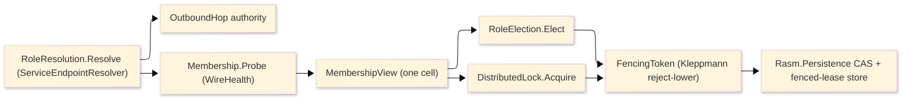

# [APPHOST_CLUSTER_COORDINATION]

One cluster-coordination owner for the runtime spine: a `ServiceEndpointResolver` resolves every logical role name to its live endpoint set so coordination rows address peers by role rather than host string, a probe-driven `MembershipView` folds each node's liveness into one attached-membership cell, a `RoleElection` mints a fenced `FencingToken` per role through the one maintenance-lease so exactly one node leads a role, and a `DistributedLock` gates cross-process critical sections through the same `FencingToken.Admits` reject-lower the resource enforces. The page turns the single-writer lease into a multi-node coordination surface — membership answers *who is alive*, election answers *who leads this role*, the lock answers *who may enter this section*, and endpoint resolution answers *where that node is* — and it owns the endpoint-resolution rail, the membership view, the role-election fold, the distributed-lock surface, and the probe cadence projected as `SchedulePort` heartbeats. It consumes `FencingToken`/`LeaseElection.Acquire`/`Fence` and `LeasePolicy.Maintenance` from `Runtime/time#FENCING_TOKEN`, the `SchedulePort`/`ScheduleEntry.Spread` cadence from `Runtime/time#SCHEDULE_PORT`, `OutboundHop.HttpApi(Uri)`/`Grpc(Uri)` and the `HopPolicy` rows from `Wire/outbound#HOP_AXIS`, `PeerRoster.Attached` from `Wire/companion#PROCESS_MODALITY`, `WireHealthRow`/`WireHealth.Evaluate` from `Observability/health#WIRE_HEALTH`, `TenantContext`/`CorrelationId` and `ReceiptSinkPort` from `Runtime/ports`, and `ClockPolicy` and `DeadlineClass` as settled vocabulary, minting no eighth port. The CAS-and-fenced-lease store backing the election and lock is the `Rasm.Persistence` `ONE_FENCED_LEASE_STORE` leg consumed at the seam, never an AppHost-owned store. `Microsoft.Extensions.ServiceDiscovery` owns the endpoint-resolution and round-robin client load-balancing surface; Thinktecture owns the vocabularies and LanguageExt the rails.

## [01]-[INDEX]

- [01]-[ENDPOINT_RESOLUTION]: `ServiceEndpointResolver` resolving a logical role to its live endpoint set and seating the outbound hop authority.
- [02]-[MEMBERSHIP_VIEW]: Probe-driven liveness fold over the resolved endpoints into one attached-membership cell.
- [03]-[ROLE_ELECTION]: Per-role fenced election over the one maintenance-lease minting a `FencingToken` per leader.
- [04]-[DISTRIBUTED_LOCK]: Cross-process critical-section gate over the same fenced reject-lower lease.

## [02]-[ENDPOINT_RESOLUTION]

- Owner: `RoleName` `[ValueObject<string>]` the logical cluster-role identity under the shipped `ComparerAccessors.StringOrdinal` accessor; `ResolvedRole` the role-to-endpoints projection carrying the resolved endpoint set and the refresh change token; `RoleResolution` the static surface over the one resolved `ServiceEndpointResolver` and the round-robin selection.
- Entry: `Resolve(ServiceEndpointResolver resolver, RoleName role, CancellationToken token)` returns `IO<Validation<CoordinationFault, ResolvedRole>>` — runs `resolver.GetEndpointsAsync((string)role, token)` returning a `ServiceEndpointSource`, projects its `Endpoints` (`IReadOnlyList<ServiceEndpoint>`) onto the `ResolvedRole`, and lifts an empty resolution to `CoordinationFault.NoEndpoint`; `Authority(ResolvedRole role, ulong cursor)` returns `Uri` — selects one endpoint by the round-robin cursor modulo the endpoint count and projects its `ServiceEndpoint.EndPoint` to the authority the outbound hop carries.
- Auto: coordination rows address peers by logical role, never a host literal — `GetEndpointsAsync` resolves the role name to the live endpoint set through the registered `ConfigurationServiceEndpointProvider` (cluster rows under the `Services` config section) so a membership probe, an election peer, and a lock holder all dial a `RoleName`, and the resolved `Authority` seats the `OutboundHop.HttpApi(Uri)`/`Grpc(Uri)` the resilient hop dials so endpoint resolution feeds the existing resilience spine rather than a parallel client; the round-robin selection mirrors the package's own `RoundRobinServiceEndpointSelector` — `cursor % Endpoints.Count` advances by an interlocked counter so successive calls fan across the resolved instances without re-implementing the selector; the `ServiceEndpointSource.ChangeToken` drives refresh so a membership change is observed through the token rather than by polling endpoint values, and the resolver caches per-role watchers and evicts unused entries on its own 10-second cleanup timer so the page holds no parallel endpoint cache; scheme admission rides `ServiceDiscoveryOptions.AllowedSchemes` so a resolved authority honors the configured scheme set.
- Receipt: a role resolution logs one `SpineLog` event in the 1000-1999 band carrying the role name and the resolved endpoint count; a change-token refresh rides the same event stream, never a parallel discovery receipt.
- Packages: Microsoft.Extensions.ServiceDiscovery, Thinktecture.Runtime.Extensions, LanguageExt.Core, BCL inbox
- Growth: a new addressable role is one `RoleName` plus its config endpoint row; a richer query is one `ServiceEndpointQuery` carrying the role name plus included schemes; a non-resolving already-addressable target rides the `AddPassThroughServiceEndpointProvider` so a fixed endpoint enters the same resolution path; zero new surface.
- Boundary: the resolver is the only endpoint-resolution owner — a hard-coded host string, a hand-rolled instance round-robin at a call site, and a second endpoint cache are the deleted forms; resolution feeds the existing outbound hops by seating the `Uri` authority so the resilience, breaker, and rate-limit stay the `Wire/outbound` hop policy, never a coordination-private client; the in-app companion attach stays the `Wire/companion` `DiscoveryManifest` UDS owner so `ServiceDiscovery` resolves only outbound network endpoints and never the local-IPC peer; the resolver is `IAsyncDisposable` and disposed at the composition root, never per call.

```csharp signature
// --- [TYPES] ----------------------------------------------------------------------------
[ValueObject<string>(KeyMemberName = "Value")]
[KeyMemberEqualityComparer<ComparerAccessors.StringOrdinal, string>]
public readonly partial struct RoleName;

// --- [MODELS] ---------------------------------------------------------------------------
public sealed record ResolvedRole(RoleName Role, Seq<ServiceEndpoint> Endpoints, IChangeToken Refresh) {
    public bool Any => Endpoints.Count > 0;
}

// --- [OPERATIONS] -----------------------------------------------------------------------
public static class RoleResolution {
    public static IO<Validation<CoordinationFault, ResolvedRole>> Resolve(ServiceEndpointResolver resolver, RoleName role, CancellationToken token) =>
        IO.liftAsync(async () => await resolver.GetEndpointsAsync((string)role, token))
            .Map(source => source.Endpoints.Count > 0
                ? Success<CoordinationFault, ResolvedRole>(new ResolvedRole(role, source.Endpoints.AsIterable().ToSeq(), source.ChangeToken))
                : Fail<CoordinationFault, ResolvedRole>(new CoordinationFault.NoEndpoint((string)role)));

    public static Uri Authority(ResolvedRole role, ulong cursor) =>
        role.Endpoints[(int)(cursor % (ulong)role.Endpoints.Count)].EndPoint switch {
            UriEndPoint uri => uri.Uri,
            DnsEndPoint dns => new UriBuilder(Uri.UriSchemeHttps, dns.Host, dns.Port).Uri,
            IPEndPoint ip => new UriBuilder(Uri.UriSchemeHttps, ip.Address.ToString(), ip.Port).Uri,
            { } endpoint => new UriBuilder(Uri.UriSchemeHttps, endpoint.ToString()).Uri,
        };
}
```

## [03]-[MEMBERSHIP_VIEW]

- Owner: `NodeState` `[SmartEnum<string>]` the per-node liveness axis (joining, serving, suspect, departed); `MemberRecord` the per-node membership row carrying the node id, the resolved endpoint, the last-probe instant, and the state; `MembershipView` the `Atom`-backed attached-membership cell folding every probe onto one frozen view; `Membership` the static probe-and-fold surface projecting the probe cadence as `SchedulePort` heartbeats.
- Cases: `NodeState` rows — `Joining` (resolved but not yet serving), `Serving` (a passing `WireHealth` probe), `Suspect` (a missed probe inside the crash-staleness window), `Departed` (a probe gap past `LeasePolicy.Maintenance.CrashStaleness`) — a node advances through the states off its probe outcome and the view drops a `Departed` node so a vanished peer leaves the membership without an explicit leave.
- Entry: `Probe(Membership.Runtime runtime, MemberRecord member, Instant now)` returns `IO<MemberRecord>` — dials the member's resolved endpoint over the `WireHealthRow` serving probe through `WireHealth.Evaluate`, folds the `HealthReport` status onto the next `NodeState`, and stamps the probe instant; `Fold(MembershipView view, MemberRecord probed)` advances the membership cell in one `Atom` swap; `Cadence(Membership.Runtime runtime)` returns `ScheduleEntry` — the heartbeat row registering the probe sweep on the `SchedulePort` at the health-probe cadence.
- Auto: membership is one cell folded from probes, never a gossip protocol — each member's serving status reads the existing `WireHealth.Evaluate` tag-filtered registry sweep so the membership probe reuses the health owner rather than a second probe, and the `HealthReport.Status` maps onto the `NodeState` (`Healthy` to `Serving`, `Degraded` to `Suspect`, an unreachable probe to `Suspect` then `Departed` past the staleness window); the probe cadence is one `ScheduleEntry` registered on the one `SchedulePort` at three times the health-probe period (the watchdog-row precedent) so the sweep rides the existing scheduler, never a per-membership timer loop; the staleness window is the `LeasePolicy.Maintenance.CrashStaleness` value the election lease shares so a `Departed` node and a lapsed lease use one window; the membership swap is atomic so the `MembershipView.Serving` read the election and lock consult is race-free; the local node's own row is seeded `Serving` at boot and the remaining rows resolve through `RoleResolution.Resolve` so membership is the resolved endpoint set folded with liveness.
- Receipt: every state transition mints one `MembershipReceipt` — node id, prior state, next state, probe elapsed `Duration`, the resolved endpoint — fanned through `ReceiptSinkPort.Send` under the `Rasm.AppHost` package key; a `Departed` transition rides the same stream so a membership change is one receipt, never a parallel membership log.
- Packages: Microsoft.Extensions.ServiceDiscovery, Thinktecture.Runtime.Extensions, LanguageExt.Core, NodaTime, BCL inbox
- Growth: a new liveness state is one `NodeState` row breaking every state-fold arm; a richer probe is one column on `MemberRecord`; a per-role membership is the view keyed by `RoleName`; zero new surface.
- Boundary: the membership view is the only liveness owner — a gossip membership protocol, a second heartbeat loop, and an Orleans/Consul membership table are the deleted forms (the IDEAS card's no-Orleans, no-Consul law); the probe is the `WireHealth` serving probe so membership and health read one status, never two; the cadence is one `SchedulePort` row so the sweep rides the one scheduler; the `MembershipView.Serving` set is the wave membership `Sandbox/provisioning#ROLLOVER_DRAIN` `FleetRoll` reads and the lock-and-election eligible set, so the three coordination surfaces consult one membership cell; the membership backing reads from the same `Rasm.Persistence` store the lease fences when a durable view is required, never a second store.

```csharp signature
// --- [TYPES] ----------------------------------------------------------------------------
[SmartEnum<string>]
public sealed partial class NodeState {
    public static readonly NodeState Joining = new("joining");
    public static readonly NodeState Serving = new("serving");
    public static readonly NodeState Suspect = new("suspect");
    public static readonly NodeState Departed = new("departed");
}

// --- [MODELS] ---------------------------------------------------------------------------
public sealed record MemberRecord(int NodeId, RoleName Role, EndPoint Endpoint, Instant LastProbe, NodeState State);

public readonly record struct MembershipReceipt(int NodeId, NodeState From, NodeState To, Duration Elapsed, CorrelationId Correlation);

// --- [SERVICES] -------------------------------------------------------------------------
public sealed record MembershipView(HashMap<int, MemberRecord> Members) {
    public Seq<MemberRecord> Serving => Members.Values.Filter(static m => m.State == NodeState.Serving).ToSeq();
    public MembershipView With(MemberRecord member) => new(Members.AddOrUpdate(member.NodeId, member, member));
}

// --- [OPERATIONS] -----------------------------------------------------------------------
public static class Membership {
    public sealed record Runtime(
        HealthCheckService Health,
        WireHealthRow Probe,
        Atom<MembershipView> View,
        ClockPolicy Clocks,
        Duration Staleness,
        ReceiptSinkPort Sink);

    public static IO<MemberRecord> Probe(Runtime runtime, MemberRecord member, Instant now) =>
        IO.liftAsync(async () => await runtime.Probe.Evaluate(runtime.Health, CancellationToken.None))
            .Map(report => member with {
                LastProbe = now,
                State = report.Status switch {
                    HealthStatus.Healthy => NodeState.Serving,
                    HealthStatus.Degraded => NodeState.Suspect,
                    _ => now - member.LastProbe > runtime.Staleness ? NodeState.Departed : NodeState.Suspect,
                },
            });

    public static MembershipView Fold(Atom<MembershipView> view, MemberRecord probed) =>
        view.Swap(current => probed.State == NodeState.Departed
            ? new MembershipView(current.Members.Remove(probed.NodeId))
            : current.With(probed));
}
```

## [04]-[ROLE_ELECTION]

- Owner: `RoleLeadership` the per-role election outcome carrying the leader node id and the minted `FencingToken`; `RoleElection` the static acquire-and-fence surface extending `LeaseElection.Acquire` per role; the `LeasePolicy.Maintenance` lease the election shares with the scheduler and provisioning conductor.
- Entry: `Elect(RoleElection.Runtime runtime, RoleName role)` returns `IO<Validation<CoordinationFault, RoleLeadership>>` — acquires the role's maintenance lease through `LeaseElection.Acquire` minting one strictly-increasing `FencingToken`, projects the acquisition onto a `RoleLeadership`, and lifts a lost election to `CoordinationFault.NotLeader`; `Renew(RoleElection.Runtime runtime, RoleLeadership leadership)` extends the lease ahead of the crash-staleness window; `Resign(RoleElection.Runtime runtime, RoleName role)` releases the lease on drain so a draining leader hands off immediately.
- Auto: exactly one node leads a role — the election acquires through the one `LeaseElection.Acquire` so it mints the same monotone `FencingToken` the resource fences, never a second token type, and the `FencingToken.Admits` reject-lower predicate the leader's writes carry means a resumed stale leader presenting a lower token is rejected at the resource even before its lease lapses (the Kleppmann safety the timeout alone cannot give); the election reuses the `LeasePolicy.Maintenance.CrashStaleness` window as the lease timeout so a crashed leader's role re-elects after the staleness window and the renew cadence rides the one `SchedulePort` maintenance heartbeat; only a `MembershipView.Serving` node contests a role so a `Suspect`/`Departed` node never wins, and the leader's renew folds through the same lease so the leadership and the membership read one liveness; the lease store is the `Rasm.Persistence` CAS-and-fenced-lease leg so the compare-and-set is the store's atomic operation and the token is the store's fenced column, never an AppHost in-memory lease that survives no crash; the `FleetRoll` conductor election and the sidecar write-forward acquire through this same rail so the host has one election owner across coordination, rollout, and write-forwarding.
- Receipt: a leadership transition mints one `LeadershipReceipt` — role, leader node id, the `FencingToken` value, the lease deadline `Instant` — fanned through `ReceiptSinkPort.Send`; a lost or resigned election rides the same stream carrying the prior token so a leadership change is one receipt, never a parallel election log.
- Packages: Thinktecture.Runtime.Extensions, LanguageExt.Core, NodaTime, BCL inbox
- Growth: a new elected role is one `Elect` call over its `RoleName`; a new fenced resource reads the same `FencingToken.Admits`, never a second token; a per-role lease cadence retune is the lease policy's staleness column; zero new surface.
- Boundary: the election is the only leadership owner — a timeout-only lease without a fenced token, a second token type, and a per-role bespoke election are the deleted forms; the token is the correctness proof the resource checks, not merely held, so a fenced write rejects a stale leader through `Admits`; the election shares the one `LeaseElection.Acquire` and `LeasePolicy.Maintenance` with the scheduler, the provisioning `FleetRoll`, and the sidecar write-forward so the suite has one fenced-election rail aligned to the Persistence store, never four; a leader that loses its lease stops contesting the role and its in-flight fenced writes fail at the resource so a split-brain write is structurally foreclosed; the distributed quota debit (`Agent/capability#GRANT_BROKER` `DistributedBudget`) fences through the same lock store so the budget CAS and the leadership lease read one fencing identity.

```csharp signature
// --- [MODELS] ---------------------------------------------------------------------------
public sealed record RoleLeadership(RoleName Role, int LeaderNode, FencingToken Token, Instant LeaseDeadline);

public readonly record struct LeadershipReceipt(RoleName Role, int LeaderNode, ulong Token, Instant LeaseDeadline, CorrelationId Correlation);

// --- [OPERATIONS] -----------------------------------------------------------------------
public static class RoleElection {
    public sealed record Runtime(
        int NodeId,
        Func<RoleName, LeaseElection.Runtime> LeaseOf,
        Func<RoleName, MembershipView> ViewOf,
        ClockPolicy Clocks,
        Duration Staleness,
        ReceiptSinkPort Sink);

    public static IO<Validation<CoordinationFault, RoleLeadership>> Elect(Runtime runtime, RoleName role) =>
        runtime.ViewOf(role).Serving.Exists(m => m.NodeId == runtime.NodeId)
            ? IO.lift(() => LeaseElection.Acquire(runtime.LeaseOf(role)).Match(
                Succ: token => Success<CoordinationFault, RoleLeadership>(
                    new RoleLeadership(role, runtime.NodeId, token, runtime.Clocks.Now + runtime.Staleness)),
                Fail: error => Fail<CoordinationFault, RoleLeadership>(new CoordinationFault.NotLeader($"{(string)role}:{error.Message}"))))
            : IO.pure(Fail<CoordinationFault, RoleLeadership>(new CoordinationFault.NotLeader($"{(string)role}:not-serving")));

    public static Fin<Unit> Renew(Runtime runtime, RoleLeadership leadership) =>
        LeaseElection.Fence(runtime.LeaseOf(leadership.Role), leadership.Token);
}
```

## [05]-[DISTRIBUTED_LOCK]

- Owner: `LockHolding` the held-lock evidence carrying the lock key, the holder node, and the fencing token; `DistributedLock` the static acquire-fence-release surface over the same maintenance-lease reject-lower; `CoordinationFault` `[Union]` the closed coordination-fault family in the 4520 band the page's rails share.
- Cases: `CoordinationFault` = `Text` | `NoEndpoint` | `NotLeader` | `LockHeld` | `FenceRejected` | `Stale` — one case per coordination-rejection cause, each breaking every consumer arm.
- Entry: `Acquire(DistributedLock.Runtime runtime, string key)` returns `IO<Validation<CoordinationFault, LockHolding>>` — acquires the key's fenced lease through `LeaseElection.Acquire` minting a `FencingToken`, projecting onto a `LockHolding` or lifting a contended key to `CoordinationFault.LockHeld`; `Guard(DistributedLock.Runtime runtime, LockHolding holding, IO<A> section)` returns `IO<Validation<CoordinationFault, A>>` — fences the holding through `FencingToken.Admits` before and after the critical section so a section that runs past a lease lapse fails the fence rather than committing under a stolen lock; `Release(DistributedLock.Runtime runtime, LockHolding holding)` returns the lease.
- Auto: a cross-process critical section is gated by a fenced lease, not a timeout — `Acquire` mints the same monotone `FencingToken` the election mints so the lock and the leadership read one fencing identity, and `Guard` re-checks `FencingToken.Admits` after the section so a paused holder whose lease lapsed and was re-granted cannot commit (the fenced write at the resource rejects its lower token); the lock store is the `Rasm.Persistence` CAS-and-fenced-lease leg so acquisition is the store's atomic compare-and-set and the token is the store's fenced column, never an in-process mutex that ignores other nodes; the lease timeout is the `LeasePolicy.Maintenance.CrashStaleness` window so a crashed holder's lock reclaims after the window and a long section renews through the one `SchedulePort` heartbeat ahead of it; the lock is the same rail multi-instance singleton execution rides — a singleton-per-role job acquires the role lock before running so two nodes never run the singleton concurrently.
- Receipt: a lock acquisition mints one `LockReceipt` — lock key, holder node, the `FencingToken` value, the lease deadline — fanned through `ReceiptSinkPort.Send`; a contended acquire and a release ride the same stream so a lock transition is one receipt, never a parallel lock log.
- Packages: Thinktecture.Runtime.Extensions, LanguageExt.Core, NodaTime, BCL inbox
- Growth: a new locked section acquires the same `DistributedLock` over its key; a new fenced resource reads the same `Admits`; a read-write lock is the lock keyed by mode, never a second lock type; zero new surface.
- Boundary: the distributed lock is the only cross-process critical-section owner — an in-process `lock`/`SemaphoreSlim` for a multi-node section, a timeout-only lease without a fenced token, and a second lock store are the deleted forms; the lock shares the one `FencingToken`, `LeaseElection.Acquire`, and `LeasePolicy.Maintenance` with the election so a lock and a leadership fence one identity; the `Guard` re-fences after the section so a stolen lock is detected at commit, the Kleppmann safety; the lock store is the `Rasm.Persistence` CAS leg so the lock survives a process crash and reclaims on the staleness window, and the distributed-quota debit fences through the same store so the budget CAS, the leadership lease, and the lock read one fencing identity, never three.

```csharp signature
// --- [MODELS] ---------------------------------------------------------------------------
public sealed record LockHolding(string Key, int HolderNode, FencingToken Token, Instant LeaseDeadline);

public readonly record struct LockReceipt(string Key, int HolderNode, ulong Token, Instant LeaseDeadline, CorrelationId Correlation);

// --- [ERRORS] ---------------------------------------------------------------------------
[Union]
public abstract partial record CoordinationFault : Expected, IValidationError<CoordinationFault> {
    private CoordinationFault(string detail, int code) : base(detail, code, None) { }
    public static CoordinationFault Create(string message) => new Text(message);
    public sealed record Text : CoordinationFault { public Text(string detail) : base(detail, 4520) { } }
    public sealed record NoEndpoint : CoordinationFault { public NoEndpoint(string role) : base(role, 4521) { } }
    public sealed record NotLeader : CoordinationFault { public NotLeader(string detail) : base(detail, 4522) { } }
    public sealed record LockHeld : CoordinationFault { public LockHeld(string key) : base(key, 4523) { } }
    public sealed record FenceRejected : CoordinationFault { public FenceRejected(string detail) : base(detail, 4524) { } }
    public sealed record Stale : CoordinationFault { public Stale(string detail) : base(detail, 4525) { } }
}

// --- [OPERATIONS] -----------------------------------------------------------------------
public static class DistributedLock {
    public sealed record Runtime(
        int NodeId,
        Func<string, LeaseElection.Runtime> LeaseOf,
        ClockPolicy Clocks,
        Duration Staleness,
        ReceiptSinkPort Sink);

    public static IO<Validation<CoordinationFault, LockHolding>> Acquire(Runtime runtime, string key) =>
        IO.lift(() => LeaseElection.Acquire(runtime.LeaseOf(key)).Match(
            Succ: token => Success<CoordinationFault, LockHolding>(
                new LockHolding(key, runtime.NodeId, token, runtime.Clocks.Now + runtime.Staleness)),
            Fail: error => Fail<CoordinationFault, LockHolding>(new CoordinationFault.LockHeld($"{key}:{error.Message}"))));

    public static IO<Validation<CoordinationFault, A>> Guard<A>(Runtime runtime, LockHolding holding, IO<A> section) =>
        LeaseElection.Fence(runtime.LeaseOf(holding.Key), holding.Token).Match(
            Succ: _ => section.Map(value => LeaseElection.Fence(runtime.LeaseOf(holding.Key), holding.Token).Match(
                Succ: _ => Success<CoordinationFault, A>(value),
                Fail: error => Fail<CoordinationFault, A>(new CoordinationFault.FenceRejected(error.Message)))),
            Fail: error => IO.pure(Fail<CoordinationFault, A>(new CoordinationFault.FenceRejected(error.Message))));
}
```



## [06]-[TS_PROJECTION]

- Owner: `MembershipViewWire` and `RoleLeadershipWire` transcribe the live membership view and the per-role leadership the dashboard ingests; the fencing tokens and lock holdings stay host-side.
- Packages: BCL inbox
- Growth: one member row or one leadership field, zero new surface.
- Boundary: only the membership view (node id, role, state, last-probe instant) and the leadership (role, leader node, lease deadline) cross — the `FencingToken` value never crosses the wire so a token cannot be forged from the dashboard; instants cross as extended-ISO text; the node state crosses as the `NodeState` key string; the lock holdings never cross because a lock is a host-internal critical-section gate, not a dashboard concern.

```ts contract
interface MembershipViewWire {
  readonly members: readonly {
    readonly nodeId: number;
    readonly role: string;
    readonly state: string;
    readonly lastProbe: string;
  }[];
}

interface RoleLeadershipWire {
  readonly role: string;
  readonly leaderNode: number;
  readonly leaseDeadline: string;
}
```

## [07]-[RESEARCH]

- [LEASE_STORE_SEAM]: the CAS-and-fenced-lease store the election and lock acquire against is the `Rasm.Persistence` `ONE_FENCED_LEASE_STORE` leg under the `TenantId` RLS predicate, doubling as the membership backing store the resolver reads — the compare-and-set semantics, the fenced-token column, and the lease-deadline column settle against the store's coordination/lease page (`Wire/coordination ⇄ csharp:Rasm.Persistence`), consumed at the seam and never an AppHost-owned store; the `LeaseElection.Runtime.AcquireLease` delegate binds the store's CAS at composition so the election rail stays host-neutral over the store interface.
- [ENDPOINT_PROVIDER]: the cluster endpoint rows the `ServiceEndpointResolver` resolves bind from the `ConfigurationServiceEndpointProvider` `Services` config section — the role-to-endpoint mapping, the scheme allow-list, and the refresh period settle against the config-section schema the resolver reads, with the `PassThroughServiceEndpointProvider` admitting an already-addressable fixed endpoint into the same resolution path; the resolver's round-robin selection is the package default and the page never registers a second selector.
- [SINGLETON_PLACEMENT]: the multi-instance singleton execution the distributed lock gates settles which roles run as cluster singletons (a single fleet-roll conductor, a single outbox sweep leader) against the consuming owners' cadence — each singleton acquires its role lock before running so two nodes never run the singleton concurrently, and the `FencingToken` the lock mints is the same identity the singleton's fenced writes carry.
