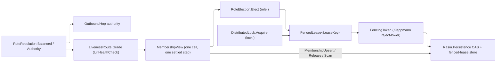

# [APPHOST_CLUSTER_COORDINATION]

One cluster-coordination owner for the runtime spine: one `RoleName` identity is the authority every coordination row dials so peers are addressed by role rather than host string and `Microsoft.Extensions.ServiceDiscovery` resolves that name to a live instance inside the resolving `HttpClient` itself, a probe-driven `MembershipView` folds each node's liveness into one attached-membership cell whose swapped value carries the transition it settled, and both leadership and cross-process locking ride the ONE `Runtime/time#FENCING_TOKEN` `FencedLease` algebra as two `LeaseKey` namespaces — `role:` electing exactly one leader per role, `lock:` gating one holder per critical section, each acquiring a store-issued `FencingToken` through the one decode-only PORT adapter and bracketing its section with the `LeaseGuard` read that DETECTS a stolen lease while the authoritative rejection stays each guarded write's own reject-lower predicate. The page turns the single-writer lease into a multi-node coordination surface — membership answers *who is alive*, the role namespace answers *who leads this role*, the lock namespace answers *who may enter this section*, and the role authority answers *where that node is dialled* — and it owns the role-authority rail, the membership view, the lease-key vocabulary, the two fenced namespaces, and the probe cadence projected as a `SchedulePort` heartbeat. It consumes `FencingToken`/`FencedLease`/`FencedRuntime`/`FenceVerb`/`FenceHolding`/`FenceStep` and `LeasePolicy.Maintenance` from `Runtime/time#FENCING_TOKEN`, the `SchedulePort`/`ScheduleEntry` cadence from `Runtime/time#SCHEDULE_PORT`, `OutboundHop.HttpApi(Uri)`/`Grpc(Uri)` and the `HopPolicy` rows from `Wire/outbound#HOP_AXIS`, `PeerRoster.Attached` from `Wire/companion#PROCESS_MODALITY`, `WireHealthRow`/`WireHealth.Evaluate` and the `DriverProbe.Upstream` contributor from `Observability/health#WIRE_HEALTH`, `AppHostPoint`/`AppHostFact` from `Observability/hooks#HOOK_ROSTER`, the `CoordinationOp`/`CoordinationReceipt` membership triple from `Rasm.Persistence` `Store/coordination#COORDINATION_OP` over the one decode-only PORT, `TenantContext`/`CorrelationId` and `ReceiptSinkPort` from `Runtime/ports`, and `ClockPolicy` and `DeadlineClass` as settled vocabulary, minting no eighth port. The CAS-and-fenced-lease store backing the election, the lock, and the durable membership row is the `Rasm.Persistence` `ONE_FENCED_LEASE_STORE` leg consumed at the seam, never an AppHost-owned store. `Microsoft.Extensions.ServiceDiscovery` owns endpoint resolution and client-side instance selection, `AspNetCore.HealthChecks.Uris` the remote liveness probe; Thinktecture owns the vocabularies, Riok.Mapperly the receipt projection, and LanguageExt the rails.

## [01]-[INDEX]

- [02]-[ENDPOINT_RESOLUTION]: `RoleName` names every peer and two authorities carry the dial — a contributor's own endpoint and the role's balanced one.
- [03]-[MEMBERSHIP_VIEW]: Route-keyed liveness fold over the resolved endpoints into one attached-membership cell and its durable half.
- [04]-[ROLE_ELECTION]: The `role:` lease namespace — per-role fenced election over the one maintenance lease and the receipt projection both namespaces share.
- [05]-[DISTRIBUTED_LOCK]: The `lock:` lease namespace — cross-process critical-section gate over the same fenced reject-lower lease.

## [02]-[ENDPOINT_RESOLUTION]

- Owner: `RoleName` `[ValueObject<string>]` the logical cluster-role identity under the shipped `ComparerAccessors.StringOrdinal` accessor; `RoleResolution` the static authority surface every coordination row dials through.
- Entry: `Authority(EndPoint endpoint)` returns `Validation<Error, Uri>` — projects ONE endpoint shape onto the authority the outbound hop dials and REFUSES an endpoint family it cannot name; `Balanced(RoleName role)` returns `Uri` — the service-name authority the resolving `HttpClient` balances across the live instance set.
- Auto: coordination rows address peers by logical role, never a host literal — a `Balanced` authority naming the role is what a membership probe, an election peer, and a lock holder dial, and the package resolves that name to a live endpoint INSIDE the handler through the registered `ConfigurationServiceEndpointProvider` (cluster rows under the `Services` config section), so this page never calls a resolver and never holds the endpoint set that call returns; INSTANCE SELECTION IS THE PACKAGE'S — the round-robin selector is `internal`, registered as the default, and reached by giving the probe client `IHttpClientBuilder.AddServiceDiscovery()`, so one authority resolves to one live instance per call under the package's own `Interlocked` advance; the resolver caches per-role watchers and evicts unused entries on its own cleanup timer, so this page holds no endpoint cache, registers no change callback, and keeps no cursor; scheme admission rides `ServiceDiscoveryOptions.AllowedSchemes` so a resolved authority honors the configured scheme set; a contributor that supplied its OWN `EndPoint` is dialled at the `Authority` that endpoint projects, which seats the `OutboundHop.HttpApi(Uri)`/`Grpc(Uri)` the resilient hop already carries.
- Receipt: an authority projection mints no fact of its own — the dial it seats is graded by `MEMBERSHIP_VIEW`, whose `MembershipReceipt` is the one transition a probe records, and a refused endpoint family accumulates onto that sweep's `Validation` rather than logging a parallel discovery event.
- Packages: Microsoft.Extensions.ServiceDiscovery, Thinktecture.Runtime.Extensions, LanguageExt.Core, BCL inbox
- Growth: a new addressable role is one `RoleName` with its config endpoint row; a non-resolving already-addressable target rides the `AddPassThroughServiceEndpointProvider` so a fixed endpoint enters the same resolution path; a new endpoint family is one `Authority` arm that must be NAMED to be admitted; zero new surface.
- Boundary: the role NAME is the address this page owns and endpoint resolution itself is the PACKAGE's — a hard-coded host string, a second endpoint cache, a hand-rolled instance round-robin, and an explicit resolver call this page then folds are the deleted forms; the prior `cursor % Endpoints.Count` selection re-implemented the package's own internal selector AND assigned member A the endpoint of member B, so a per-member probe graded whichever instance the counter happened to land on; NAMED LOSS — the eager `Resolve` fold and the non-empty `ResolvedRole` carrier it filled, which no consumer ever read: a resolution materialized here is stale the moment the watcher moves, so the two honest addresses a member can hold (the one its contributor supplied and the role's own balanced authority) are what the record carries and the resolution happens at the dial; `Authority` REFUSES an unknown `EndPoint` family instead of stringifying it into a `UriBuilder`, because a fabricated authority dials a host nobody configured and reports the result as that member's health; the authority feeds the existing outbound hops so the resilience, breaker, and rate-limit stay the `Wire/outbound` hop policy, never a coordination-private client; the in-app companion attach stays the `Wire/companion` `DiscoveryManifest` UDS owner so `ServiceDiscovery` resolves only outbound network endpoints and never the local-IPC peer; the resolver the package registers is `IAsyncDisposable` and owned by the composition root, never seated on a runtime capsule here.

```csharp signature
// --- [RUNTIME_PRELUDE] --------------------------------------------------------------------
using System.Globalization;
using System.Net;
using System.Text.Json;
using LanguageExt;
using Microsoft.Extensions.Diagnostics.HealthChecks;
using Microsoft.Extensions.ServiceDiscovery;
using NodaTime;
using Rasm.Domain;
using Riok.Mapperly.Abstractions;
using Thinktecture;
using static LanguageExt.Prelude;

namespace Rasm.AppHost.Wire;

// --- [TYPES] ------------------------------------------------------------------------------
[ValueObject<string>(KeyMemberName = "Value")]
[KeyMemberEqualityComparer<ComparerAccessors.StringOrdinal, string>]
public readonly partial struct RoleName;

// --- [OPERATIONS] -------------------------------------------------------------------------
// `RoleName` IS the address: `Balanced` hands the resolving handler an authority it resolves per call, and
// `Authority` projects the one endpoint a contributor supplied for itself. No resolver call, no endpoint set,
// and no cursor lives here — a set materialized at this seam is stale the instant the package's watcher moves.
public static class RoleResolution {
    public static Validation<Error, Uri> Authority(EndPoint endpoint) =>
        endpoint switch {
            UriEndPoint uri => Success<Error, Uri>(uri.Uri),
            DnsEndPoint dns => Success<Error, Uri>(new UriBuilder(Uri.UriSchemeHttps, dns.Host, dns.Port).Uri),
            IPEndPoint ip => Success<Error, Uri>(new UriBuilder(Uri.UriSchemeHttps, ip.Address.ToString(), ip.Port).Uri),
            var other => Fail<Error, Uri>(new CoordinationFault.NoEndpoint(other.GetType().Name)),
        };

    public static Uri Balanced(RoleName role) => new($"{Uri.UriSchemeHttps}://{(string)role}");
}
```

## [03]-[MEMBERSHIP_VIEW]

- Owner: `NodeState` `[SmartEnum<string>]` the per-node liveness axis; `LivenessRoute` `[SmartEnum<string>]` the three grading routes, each row binding its own probe arm as a delegate column; `MemberRecord` the per-node membership row carrying the node id, its route, its optional endpoint, the last-probe instant, the measured probe duration, and the state; `MembershipStep` the transition a swap settles; `MembershipView` the frozen membership cell carrying the members beside the step that produced them; `FactSink<CoordinationSignal>` from `Observability/hooks#HOOK_ROSTER` the receipt-and-rail pair every transition on this page fans through; `Membership` the static probe-and-fold surface projecting the probe cadence as one `SchedulePort` heartbeat and crossing the durable half through the one `CoordinationOp` PORT.
- Cases: `NodeState` rows — `Joining` (seated but not yet graded), `Serving` (a passing probe), `Suspect` (a missed probe inside the crash-staleness window), `Departed` (a probe gap past `LeasePolicy.Maintenance.CrashStaleness`); `LivenessRoute` rows — `Local` (this node, read off its own `WireHealth` registry), `AttachedPeer` (a kernel-credentialed companion, graded off the roster lease that admitted it), `Network` (every remote peer, dialled at its own authority or at the role's balanced one); three `CoordinationOp` membership cases carry the durable half — `MembershipUpsert` on a row entering or renewing `Serving`, `MembershipRelease` on the `Departed` transition and on drain, `MembershipScan` on the boot rebuild.
- Entry: `Probe(Membership.Runtime runtime, MemberRecord member, Instant now)` returns `IO<Validation<Error, MemberRecord>>` — runs the member's own route arm, folds the returned `HealthStatus` onto the next `NodeState`, and stamps the probe instant and the MEASURED span; `Fold(Membership.Runtime runtime, MemberRecord probed)` returns `IO<Validation<Error, MembershipReceipt>>` — commits the membership cell, crosses the matching `CoordinationOp`, and fans the transition receipt; `Contribute(Membership.Runtime runtime, int nodeId, RoleName role, EndPoint endpoint)` returns `Transition<MembershipView>` — folds one companion `PeerRoster` local entry INTO the cluster view as a `Joining` `AttachedPeer` row the probe sweep then grades, first-writer-wins so a re-attach cedes rather than re-stamping a join instant; `Rebuild(Membership.Runtime runtime)` returns `IO<Validation<Error, MembershipView>>` — the boot read that reseats the durable member set through `MembershipScan`; `Cadence(Membership.Runtime runtime)` returns `ScheduleEntry` — the heartbeat row registering the probe sweep on the `SchedulePort` under the `membership:` lease key at the health-probe cadence.
- Auto: the ROUTE is a column set at mint, never a runtime type test — `Contribute` knows it is seating this node or a credentialed local peer and `Rebuild` knows it is seating a durable remote row, so the fact each mint already holds rides the record instead of being re-derived from an `EndPoint` subtype at every probe; the `Local` arm alone reads the in-process `WireHealth` registry, because grading a remote peer off this host's registry answers whether THIS node is healthy and would report a dead peer `Serving`; the `AttachedPeer` arm reads the `PeerRoster` lease that admitted the companion and is never HTTP-dialled, because the network resolver knows nothing of a `sun_path` and dialling one would depart a process that is alive and attached; the `Network` arm grades through the admitted `UriHealthCheck` — `Observability/health#WIRE_HEALTH`'s `DriverProbe.Upstream` row IS that contributor, registered through `AddUrlGroup(Func<IServiceProvider, Uri>)` over an `HttpClient` carrying both `AddServiceDiscovery()` and the shared resilience handler, so probe and live traffic resolve one instance set and share one breaker state; a member holding its own endpoint is dialled there and a scan-seated member with no endpoint is dialled at the role's `Balanced` authority, which grades the role's reachability while that member's OWN liveness stays the TTL only it can renew; the status maps onto the `NodeState` (`Healthy` to `Serving`, `Degraded` to `Suspect`, an unreachable probe to `Suspect` then `Departed` past the staleness window); the probe cadence is one `ScheduleEntry` at a derived third of the staleness window so three sweeps run before a silent node is graded `Departed`; the staleness window is the `LeasePolicy.Maintenance.CrashStaleness` value the fenced namespaces share so a `Departed` node and a lapsed lease use one window; the fold is a `Cell.Commit` whose computed view CARRIES its own `MembershipStep`, so the prior state the receipt names is the winning attempt's own reading rather than a separate read racing the swap, and a spent CAS budget answers `CoordinationFault.Contended` instead of a success-shaped fall-through; every fold crosses its durable half — a `Serving` row upserts its TTL-expiring membership row and a `Departed` row releases immediately rather than waiting out the lapse — so a restarted node `Rebuild`s the cluster view from the store instead of starting empty under a `FleetRoll` that reads `Serving`.
- Receipt: every state transition mints one `MembershipReceipt` — node id, prior state, next state, the MEASURED probe `Duration`, the graded route — fanned through `ReceiptSinkPort.Send` and fired at `AppHostPoint.Coordination` as `CoordinationSignal.Membership`; a sweep's accumulated refusals fire once as `CoordinationSignal.Refused`, so a cadence that graded nothing is readable rather than silent.
- Packages: Microsoft.Extensions.ServiceDiscovery, AspNetCore.HealthChecks.Uris, Thinktecture.Runtime.Extensions, LanguageExt.Core, NodaTime, BCL inbox
- Growth: a new liveness state is one `NodeState` row breaking every state-fold arm; a new grading route is one `LivenessRoute` row carrying its own arm, with no probe body to edit; a richer probe is one `UriHealthCheckOptions` column (`ExpectHttpCodes`, `ExpectContent`, `AddCustomHeader` for an authenticated peer); a per-role membership is the view keyed by `RoleName`; zero new surface.
- Boundary: the membership view is the only liveness owner — a gossip membership protocol, a second heartbeat loop, and an Orleans/Consul membership table are the deleted forms; the remote probe is the admitted `UriHealthCheck` graded per member and never a hand-rolled HTTP liveness fold; the cadence is one `SchedulePort` row so the sweep rides the one scheduler and its key is a `LeaseKey` under the `membership:` namespace, never an interpolated literal; REFUSAL NEVER GRADES — a member whose authority does not project or whose route arm refuses keeps its prior state and contributes its fault to the sweep's accumulated `Validation`, because the prior form answered `HealthStatus.Unhealthy` on a resolver failure and departed live nodes on a lookup blip; the `MembershipView.Serving` set is the fleet wave membership `Sandbox/provisioning#ROLLOVER_DRAIN` `FleetRoll.Roll` reads and the lease-eligible set the `role:` namespace gates on, so the three coordination surfaces consult one membership cell; the two-tier law is explicit — companion's `PeerRoster` (LOCAL kernel-credentialed attach) contributes through `Contribute` and this view (CLUSTER probe-driven liveness) is the one truth fleet-wide reads consult, never two membership owners; the durable half is the `Rasm.Persistence` `Store/coordination#COORDINATION_OP` `MembershipUpsert`/`MembershipRelease`/`MembershipScan` triple crossed through the one decode-only PORT the lease already rides — the store owns the TTL-expiring row and the fenced departure, this page owns the in-process view, and a second membership store is the deleted form; the boot rebuild ACCUMULATES — a malformed member key and a lapsed deadline are independent refusals graded per row and reported together, because a first-fail rebuild reported one lapsed row of five and a silent `Choose` drop reported a partial view as a complete one.

```csharp signature
// --- [TYPES] ------------------------------------------------------------------------------
[SmartEnum<string>]
[KeyMemberEqualityComparer<ComparerAccessors.StringOrdinal, string>]
[KeyMemberComparer<ComparerAccessors.StringOrdinal, string>]
public sealed partial class NodeState {
    public static readonly NodeState Joining = new("joining");
    public static readonly NodeState Serving = new("serving");
    public static readonly NodeState Suspect = new("suspect");
    public static readonly NodeState Departed = new("departed");
}

[SmartEnum<string>]
[KeyMemberEqualityComparer<ComparerAccessors.StringOrdinal, string>]
[KeyMemberComparer<ComparerAccessors.StringOrdinal, string>]
public sealed partial class LivenessRoute {
    public static readonly LivenessRoute Local = new("local", grade: Membership.Registry);
    public static readonly LivenessRoute AttachedPeer = new("attached-peer", grade: Membership.Leased);
    public static readonly LivenessRoute Network = new("network", grade: Membership.Dialled);

    [UseDelegateFromConstructor]
    public partial IO<Validation<Error, HealthStatus>> Grade(Membership.Runtime runtime, MemberRecord member);
}

// --- [MODELS] -----------------------------------------------------------------------------
public sealed record MemberRecord(
    int NodeId,
    RoleName Role,
    LivenessRoute Route,
    Option<EndPoint> Endpoint,
    Instant LastProbe,
    Duration Elapsed,
    NodeState State);

public readonly record struct MembershipStep(int NodeId, NodeState From, NodeState To);

public readonly record struct MembershipReceipt(
    int NodeId, NodeState From, NodeState To, Duration Elapsed, LivenessRoute Route, CorrelationId Correlation);

// The decision RIDES the swapped value: `Settled` is written by the same pure fold that wrote the members, so
// the winning CAS attempt's prior state is readable off the transition instead of from a second racing read.
[Equatable]
public sealed partial record MembershipView(HashMap<int, MemberRecord> Members, Option<MembershipStep> Settled) {
    public static readonly MembershipView Empty = new(HashMap<int, MemberRecord>.Empty, None);

    public Seq<MemberRecord> Serving => Members.Values.Filter(static m => m.State == NodeState.Serving).ToSeq();

    public MembershipView Advance(MemberRecord probed) =>
        new(probed.State == NodeState.Departed ? Members.Remove(probed.NodeId) : Members.AddOrUpdate(probed.NodeId, probed, probed),
            Some(new MembershipStep(
                probed.NodeId,
                Members.Find(probed.NodeId).Map(static held => held.State).IfNone(NodeState.Joining),
                probed.State)));

    public MembershipView Seat(MemberRecord member) =>
        new(Members.AddOrUpdate(member.NodeId, member, member),
            Some(new MembershipStep(member.NodeId, NodeState.Joining, member.State)));
}

// --- [OPERATIONS] -------------------------------------------------------------------------
public static class Membership {
    public sealed record Runtime(
        int NodeId,
        RoleName Role,
        string Group,
        HealthCheckService Health,
        WireHealthRow Local,
        Func<Uri, CancellationToken, Task<HealthStatus>> Remote,
        Func<int, bool> Attached,
        // Wire-stable primitives only: the group and member cross as string keys and the scan answers keys
        // beside deadlines, so no Persistence record crosses upward and no AppHost record crosses down.
        Func<string, string, Duration, Fin<Unit>> MemberUpsert,
        Func<string, string, Fin<Unit>> MemberRelease,
        Func<string, Fin<Seq<(string Member, Instant Until)>>> MemberScan,
        Atom<MembershipView> View,
        ClockPolicy Clocks,
        Duration Staleness,
        FactSink<CoordinationSignal> Fan) {
        public Duration Cadence => Staleness / 3L;
    }

    // --- [LIVENESS_ROUTES]

    internal static IO<Validation<Error, HealthStatus>> Registry(Runtime runtime, MemberRecord member) =>
        IO.liftAsync(async () => Success<Error, HealthStatus>(
            (await WireHealth.Evaluate(runtime.Health, runtime.Local, runtime.Clocks.Clock, Correlation.Mint(), CancellationToken.None)).Status));

    internal static IO<Validation<Error, HealthStatus>> Leased(Runtime runtime, MemberRecord member) =>
        IO.lift(() => Success<Error, HealthStatus>(
            runtime.Attached(member.NodeId) ? HealthStatus.Healthy : HealthStatus.Unhealthy));

    // An unprojectable authority is a REFUSAL, not a dead peer: the member keeps the state it held and the
    // sweep reports why it could not be graded.
    internal static IO<Validation<Error, HealthStatus>> Dialled(Runtime runtime, MemberRecord member) =>
        member.Endpoint.Match(Some: RoleResolution.Authority, None: () => Success<Error, Uri>(RoleResolution.Balanced(member.Role)))
            .Match(
                Succ: authority => IO.liftAsync(async () => Success<Error, HealthStatus>(
                    await runtime.Remote(authority, CancellationToken.None))),
                Fail: faults => IO.pure(Fail<Error, HealthStatus>(faults)));

    // --- [PROBE_FOLD]

    public static IO<Validation<Error, MemberRecord>> Probe(Runtime runtime, MemberRecord member, Instant now) =>
        from start in Stamp(runtime)
        from graded in member.Route.Grade(runtime, member)
        from finish in Stamp(runtime)
        from span in runtime.Clocks.Line.Elapsed(start, finish, runtime.Fan.Key).Match(Succ: IO.pure, Fail: IO.fail<TimeSpan>)
        select graded.Map(status => member with {
            LastProbe = now,
            Elapsed = Duration.FromTimeSpan(span),
            State = status switch {
                HealthStatus.Healthy => NodeState.Serving,
                HealthStatus.Degraded => NodeState.Suspect,
                _ => now - member.LastProbe > runtime.Staleness ? NodeState.Departed : NodeState.Suspect,
            },
        });

    static IO<MonotonicStamp> Stamp(Runtime runtime) =>
        runtime.Clocks.Line.Capture(runtime.Fan.Key).Match(Succ: IO.pure, Fail: IO.fail<MonotonicStamp>);

    public static IO<Validation<Error, MembershipReceipt>> Fold(Runtime runtime, MemberRecord probed) =>
        IO.lift(() => Cell.Commit(runtime.View, view => view.Advance(probed)))
            .Bind(settled => settled.Switch(
                // Unwrapping happens HERE and once: `Advance` settles a step on every swap, so the empty corner
                // is the boot view alone and it rails as the seat that never happened. `Fanned` below is total
                // on the step it receives, where the prior form carried the whole view down and answered that
                // corner with a contended receipt naming ZERO attempts — a committed swap read as a spent budget.
                committed: landed => landed.State.Settled.Match(
                    Some: step => Durable(runtime, probed).Bind(_ => Fanned(runtime, step, probed)),
                    None: () => IO.pure(Fail<Error, MembershipReceipt>(
                        new CoordinationFault.Seated(probed.NodeId)))),
                ceded: _ => IO.pure(Fail<Error, MembershipReceipt>(new CoordinationFault.Seated(probed.NodeId))),
                refused: declined => IO.pure(Fail<Error, MembershipReceipt>(CoordinationFault.Of(declined.Cause))),
                contended: spent => IO.pure(Fail<Error, MembershipReceipt>(
                    new CoordinationFault.Contended($"membership:{probed.NodeId}", spent.Attempts.Value)))));

    // The joining row mints ONCE as `Step`'s candidate, so a contended retry cannot re-stamp its join instant.
    public static Transition<MembershipView> Contribute(Runtime runtime, int nodeId, RoleName role, EndPoint endpoint) =>
        Seated(runtime, new MemberRecord(
            nodeId,
            role,
            nodeId == runtime.NodeId ? LivenessRoute.Local : LivenessRoute.AttachedPeer,
            Some(endpoint),
            runtime.Clocks.Now,
            Duration.Zero,
            NodeState.Joining));

    public static IO<Validation<Error, MembershipView>> Rebuild(Runtime runtime) =>
        IO.lift(() => (Scan: runtime.MemberScan(runtime.Group), At: runtime.Clocks.Now))
            .Map(read => read.Scan.Match(
                    Succ: rows => rows.Fold(
                        Success<Error, Seq<MemberRecord>>(Seq<MemberRecord>()),
                        (held, row) => (held, Admitted(runtime, row, read.At)).Apply(static (seats, seat) => seats.Add(seat)).As()),
                    Fail: error => Fail<Error, Seq<MemberRecord>>(CoordinationFault.Of(error)))
                .Bind(seats => Reseated(runtime, seats)));

    public static ScheduleEntry Cadence(Runtime runtime) =>
        new(Key: LeaseKey.Probe(runtime.Group).Value,
            Spec: new OccurrenceSpec.Every(runtime.Cadence),
            Deadline: DeadlineClass.HealthProbe,
            Lease: None,
            Redrive: RedrivePolicy.None,
            Work: () => Sweep(runtime));

    // --- [SWEEP]

    static IO<Unit> Sweep(Runtime runtime) =>
        runtime.View.Value.Members.Values.AsIterable().ToSeq()
            .TraverseM(member => Graded(runtime, member)).As()
            .Map(static graded => graded.Fold(
                Success<Error, Unit>(unit),
                static (held, row) => (held, row).Apply(static (_, _) => unit).As()))
            .Bind(outcome => outcome.Match(
                Succ: static _ => IO.pure(unit),
                Fail: cause => runtime.Fan
                    .Fan(Correlation.Mint(), nameof(Membership), cause, new CoordinationSignal.Refused(cause))
                    .Map(static _ => unit)));

    static IO<Validation<Error, MembershipReceipt>> Graded(Runtime runtime, MemberRecord member) =>
        Probe(runtime, member, runtime.Clocks.Now)
            .Bind(probed => probed.Match(
                Succ: row => Fold(runtime, row),
                Fail: faults => IO.pure(Fail<Error, MembershipReceipt>(faults))));

    // --- [DURABLE_HALF]

    static IO<Unit> Durable(Runtime runtime, MemberRecord probed) =>
        IO.lift(() => probed.State == NodeState.Departed
            ? runtime.MemberRelease(runtime.Group, Key(probed.NodeId))
            : runtime.MemberUpsert(runtime.Group, Key(probed.NodeId), runtime.Staleness))
            .Map(static _ => unit);

    static Validation<Error, MemberRecord> Admitted(Runtime runtime, (string Member, Instant Until) row, Instant at) =>
        (Node(row.Member), Live(runtime, row, at))
            .Apply((node, _) => new MemberRecord(
                node, runtime.Role, LivenessRoute.Network, Option<EndPoint>.None, at, Duration.Zero, NodeState.Joining))
            .As();

    static Validation<Error, int> Node(string member) =>
        int.TryParse(member, CultureInfo.InvariantCulture, out int node)
            ? Success<Error, int>(node)
            : Fail<Error, int>(new CoordinationFault.Malformed(member));

    static Validation<Error, Unit> Live(Runtime runtime, (string Member, Instant Until) row, Instant at) =>
        row.Until > at
            ? Success<Error, Unit>(unit)
            : Fail<Error, Unit>(new CoordinationFault.Stale($"{runtime.Group}:{row.Member}@{row.Until}"));

    // Rebuild reads the VERDICT, never the cell: a ceded seat, a declined step, and a spent CAS budget
    // each leave the view the swap never wrote, and answering `.Current` there reported an uncommitted read as a
    // rebuilt cluster — the same four arms `Fold` switches, because one swap has one set of outcomes.
    static Validation<Error, MembershipView> Reseated(Runtime runtime, Seq<MemberRecord> seats) =>
        Cell.Commit(runtime.View, view => seats.Fold(view, static (held, seat) => held.Seat(seat))).Switch(
            committed: landed => Success<Error, MembershipView>(landed.State),
            ceded: _ => Fail<Error, MembershipView>(new CoordinationFault.Seated(runtime.NodeId)),
            refused: declined => Fail<Error, MembershipView>(CoordinationFault.Of(declined.Cause)),
            contended: spent => Fail<Error, MembershipView>(
                new CoordinationFault.Contended($"membership:{runtime.Group}", spent.Attempts.Value)));

    static Transition<MembershipView> Seated(Runtime runtime, MemberRecord joined) =>
        Cell.Step(
            runtime.View,
            view => view.Members.ContainsKey(joined.NodeId) ? None : Some(view.Seat(joined)),
            new CoordinationFault.Seated(joined.NodeId));

    static IO<Validation<Error, MembershipReceipt>> Fanned(Runtime runtime, MembershipStep step, MemberRecord probed) =>
        Emitted(runtime, new MembershipReceipt(
            step.NodeId, step.From, step.To, probed.Elapsed, probed.Route, Correlation.Mint()));

    static IO<Validation<Error, MembershipReceipt>> Emitted(Runtime runtime, MembershipReceipt receipt) =>
        runtime.Fan.Fan(receipt.Correlation, nameof(Membership), receipt, new CoordinationSignal.Membership(receipt))
            .Map(Success<Error, MembershipReceipt>);

    static string Key(int nodeId) => nodeId.ToString(CultureInfo.InvariantCulture);
}
```

## [04]-[ROLE_ELECTION]

- Owner: `LeaseNamespace` `[SmartEnum<string>]` the three lease-key heads, each row keyed BY its own head so the reverse read is the roster's own total lookup; `LeaseKey` `[ValueObject<string>]` the namespaced key every keyed lease on this page mints; `CoordinationSignal` `[Union]` the rail fact this page's transitions carry; `RoleElection` the `role:` namespace over the one `FencedLease` algebra; `CoordinationMap` the one `[Mapper]` projecting a `FenceStep` onto its wire receipt.
- Entry: `Elect(FencedRuntime runtime, FactSink<CoordinationSignal> fan, MembershipView view, RoleName role)` returns `IO<Validation<Error, FenceHolding<LeaseKey>>>` — refuses a node the view does not report `Serving`, then acquires the role's maintenance lease through `FencedLease<LeaseKey>.Acquire`, minting one strictly-increasing `FencingToken`; `Hold(FencedRuntime runtime, FactSink<CoordinationSignal> fan, FenceHolding<LeaseKey> held, FenceVerb verb)` returns `IO<Validation<Error, FenceHolding<LeaseKey>>>` — applies `Renew` ahead of the crash-staleness window or `Release` on drain, both authorized by the held token and both answering the holding the store agreed to; every landed step fans one `FenceReceipt<LeaseKey>`.
- Auto: exactly one node leads a role — acquisition runs through the one `LeaseElection` PORT adapter so the store ISSUES the monotone generation (AppHost mints nothing), and the store's row-CAS predicate on every guarded write means a resumed stale leader presenting a lower token is rejected AT THE STORE even before its lease lapses (the Kleppmann safety the timeout alone cannot give), the rejection reaching every consumer as the port's `CoordinationFault.FenceRejected` carrying the store's own rejected-generation pair as its inner; a renewal ADVANCES the holding onto the generation the store re-issued, because the prior form discarded that generation and left the leader fencing on the token it won with; the election reuses the `LeasePolicy.Maintenance.CrashStaleness` window as the lease timeout so a crashed leader's role re-elects after the staleness window and the renew cadence rides the one `SchedulePort` maintenance heartbeat; only a `MembershipView.Serving` node contests a role so a `Suspect`/`Departed` node never wins, and the leader's renew folds through the same lease so the leadership and the membership read one liveness; the lease store is the `Rasm.Persistence` CAS-and-fenced-lease leg so the compare-and-set is the store's atomic operation and an AppHost in-memory lease is the deleted form.
- Receipt: every landed transition mints one `FenceReceipt<LeaseKey>` — the namespaced key, the holder node, the `FencingToken` value, the lease deadline, and the `FenceVerb` that produced it — projected by the one `[Mapper]`, fanned through `ReceiptSinkPort.Send`, and fired at `AppHostPoint.Coordination` as `CoordinationSignal.Fence`, so a win, its renewals, and its handoff join on one causal key; a LOST election fans none, because the refusal is already the caller's typed value and a receipt naming no leader records nothing.
- Packages: Thinktecture.Runtime.Extensions, Riok.Mapperly, LanguageExt.Core, NodaTime, BCL inbox
- Growth: a new elected role is one `Elect` call over its `LeaseKey.Role`; a new keyed lease family is one `LeaseNamespace` row and its typed mint; a new fenced resource carries the same decoded `FencingToken` into its own guarded write, never a second token; zero new surface.
- Boundary: THE KEY HAS ONE AUTHOR — `LeaseKey` carries every head and every mint, so `$"role:{…}"`, `$"lock:{…}"`, and a bare `"membership:probe"` are unspellable rather than discouraged, and this is the generalized keyed-registry key law `Runtime/laneguard`'s `PipelineKey` and `Runtime/orchestration`'s `WakeKey` read at their own registries; NAMED LOSS — the per-family receipt TYPE. A `LeadershipReceipt` typed its key as `RoleName` and a `LockReceipt` typed its key as a bare `string`; one `FenceReceipt<LeaseKey>` types both as the value object and restores the discrimination through `LeaseKey.Namespace`, which is stronger than the `string` half it replaces and one hop longer than the `RoleName` half; election and lock are TWO NAMESPACES over one algebra — `Runtime/time#FENCING_TOKEN` owns acquire, renew, guard, and release, so a second holding record, a second receipt struct, a second runtime capsule, and a second fan body are all deleted forms; the election shares the one `LeasePolicy.Maintenance` with the scheduler, the provisioning `FleetRoll`, and the sidecar write-forward so the suite has one fenced-election rail aligned to the Persistence store; a leader that loses its lease stops contesting the role and its in-flight fenced writes fail at the resource, so a split-brain write is structurally foreclosed; the distributed quota debit (`Agent/capability#GRANT_BROKER` `DistributedBudget`) reads its own tenant-scoped generation through this store's `BudgetToken` case, so the budget fence, the leadership lease, and the lock hold one fencing identity, never three.

```csharp signature
// --- [TYPES] ------------------------------------------------------------------------------
// Keyed BY the head itself, so the reverse read on a minted key is the generator's own total lookup.
[SmartEnum<string>]
[KeyMemberEqualityComparer<ComparerAccessors.StringOrdinal, string>]
[KeyMemberComparer<ComparerAccessors.StringOrdinal, string>]
public sealed partial class LeaseNamespace {
    public static readonly LeaseNamespace Role = new("role:");
    public static readonly LeaseNamespace Lock = new("lock:");
    public static readonly LeaseNamespace Membership = new("membership:");
}

[ValueObject<string>(KeyMemberName = "Value")]
[KeyMemberEqualityComparer<ComparerAccessors.StringOrdinal, string>]
public sealed partial class LeaseKey {
    public static LeaseKey Of(LeaseNamespace space, string id) => Create(space.Key + id);

    public static LeaseKey Role(RoleName role) => Of(LeaseNamespace.Role, (string)role);

    public static LeaseKey Lock(string section) => Of(LeaseNamespace.Lock, section);

    public static LeaseKey Probe(string group) => Of(LeaseNamespace.Membership, group);

    public LeaseNamespace Namespace => LeaseNamespace.Get(Value[..(Value.IndexOf(':') + 1)]);

    public string Id => Value[(Value.IndexOf(':') + 1)..];

    static partial void ValidateFactoryArguments(ref ValidationError? validationError, ref string value) {
        if (!toSeq(LeaseNamespace.Items).Exists(space =>
                (value ?? string.Empty).StartsWith(space.Key, StringComparison.Ordinal) && value!.Length > space.Key.Length)) {
            validationError = new ValidationError("a namespaced lease key: a rostered head followed by an id");
        }
    }
}

// --- [MODELS] -----------------------------------------------------------------------------
[Union]
public abstract partial record CoordinationSignal {
    private CoordinationSignal() { }

    public sealed record Membership(MembershipReceipt Settled) : CoordinationSignal;

    public sealed record Fence(FenceReceipt<LeaseKey> Settled) : CoordinationSignal;

    public sealed record Refused(CoordinationFault Cause) : CoordinationSignal;
}

// --- [BOUNDARIES] -------------------------------------------------------------------------
[Mapper(RequiredMappingStrategy = RequiredMappingStrategy.Both,
        EnabledConversions = MappingConversionType.All & ~MappingConversionType.ExplicitCast)]
internal static partial class CoordinationMap {
    [MapNestedProperties(nameof(FenceStep<LeaseKey>.Holding))]
    [MapProperty([nameof(FenceStep<LeaseKey>.Holding), nameof(FenceHolding<LeaseKey>.Token)], [nameof(FenceReceipt<LeaseKey>.Token)], Use = nameof(Generation))]
    public static partial FenceReceipt<LeaseKey> Settled(FenceStep<LeaseKey> step);

    [NamedMapping(nameof(Generation))]
    private static ulong Generation(FencingToken token) => (ulong)token;
}

// --- [OPERATIONS] -------------------------------------------------------------------------
public static class RoleElection {
    public static IO<Validation<Error, FenceHolding<LeaseKey>>> Elect(
        FencedRuntime runtime, FactSink<CoordinationSignal> fan, MembershipView view, RoleName role) =>
        view.Serving.Exists(member => member.NodeId == runtime.NodeId)
            ? FencedLease<LeaseKey>.Acquire(runtime, LeaseKey.Role(role), Correlation.Mint()).Bind(step => Settled(fan, step))
            : IO.pure(Fail<Error, FenceHolding<LeaseKey>>(
                new CoordinationFault.NotLeader($"{(string)role}:not-serving")));

    public static IO<Validation<Error, FenceHolding<LeaseKey>>> Hold(
        FencedRuntime runtime, FactSink<CoordinationSignal> fan, FenceHolding<LeaseKey> held, FenceVerb verb) =>
        FencedLease<LeaseKey>.Fenced(runtime, held, verb).Bind(step => Settled(fan, step));

    internal static IO<Validation<Error, FenceHolding<LeaseKey>>> Settled(FactSink<CoordinationSignal> fan, Fin<FenceStep<LeaseKey>> step) =>
        step.Match(
            Succ: landed => Emitted(fan, landed.Holding, CoordinationMap.Settled(landed)),
            Fail: error => IO.pure(Fail<Error, FenceHolding<LeaseKey>>(CoordinationFault.Of(error))));

    static IO<Validation<Error, FenceHolding<LeaseKey>>> Emitted(
        FactSink<CoordinationSignal> fan, FenceHolding<LeaseKey> holding, FenceReceipt<LeaseKey> receipt) =>
        fan.Fan(holding.Correlation, holding.Key.Namespace.Key, receipt, new CoordinationSignal.Fence(receipt))
            .Map(_ => Success<Error, FenceHolding<LeaseKey>>(holding));
}
```

## [05]-[DISTRIBUTED_LOCK]

- Owner: `CoordinationFault` `[Union]` the closed coordination-rejection family riding the kernel `[FaultCase]`/`Fault` floor (`[FaultCase]` realizes the registry over `FaultBand.HostCoordination`; `Code` derive SEALED); `DistributedLock` the `lock:` namespace over the same `FencedLease` algebra the role namespace rides.
- Cases: `CoordinationFault` = `NoEndpoint` | `NotLeader` | `LockHeld` | `FenceRejected` | `Stale` | `Malformed` | `Contended` | `Seated` | `Foreign` — one case per coordination-rejection cause, each breaking every consumer arm; `Stale` is the boot-rebuild refusal a scanned member's lapsed deadline constructs, `Malformed` its sibling for a member key that is not a node id, `Contended` the TYPED exhaustion a spent CAS budget answers, `Seated` the first-writer refusal a re-contribute cedes to, `LockHeld` the DECODED contention refusal an acquire against an unexpired foreign hold answers — constructed at the composition-root delegate binding every `LeaseElection` consumer shares, which is the one seat that knows the op it issued carried no held token — `FenceRejected` the fence's own rejection carrying the store's rejected-generation verdict as its inner, and `Foreign` the adoption arm carrying an unrecognized `Error` WHOLE so its own code survives on the inner rather than being laundered into a message; independent failures accumulate on `Validation<Error,T>` as `ManyErrors`.
- Entry: `Acquire(FencedRuntime runtime, FactSink<CoordinationSignal> fan, LeaseKey key)` returns `IO<Validation<Error, FenceHolding<LeaseKey>>>` — acquires the key's fenced lease through the same `Settled` fold the role namespace lands on, so a contended key reaches the caller as the seam's own `CoordinationFault.LockHeld` and every other refusal as what the store reported; `Guard<A>(FencedRuntime runtime, FenceHolding<LeaseKey> held, IO<A> section)` returns `IO<Validation<Error, A>>` — brackets the critical section with the `LeaseGuard` read on both sides through the algebra's own `Guard`, so a section that ran past its lease lapse surfaces `CoordinationFault.FenceRejected` naming the guarded key and carrying the store's verdict, instead of reporting success under a stolen lock; `Release(FencedRuntime runtime, FactSink<CoordinationSignal> fan, FenceHolding<LeaseKey> held)` returns the lease through the same `Hold` fold the role namespace uses.
- Auto: a cross-process critical section is gated by a fenced lease, not a timeout — the lock mints the same monotone `FencingToken` the election mints so the two read one fencing identity, and `Guard` re-reads the lease after the section so a paused holder whose lease lapsed and was re-granted is DETECTED at the bracket, while the writes it attempted were already refused by each guarded write's own reject-lower predicate; the lock store is the `Rasm.Persistence` CAS-and-fenced-lease leg so acquisition is the store's atomic compare-and-set and an in-process mutex that ignores other nodes is the deleted form; the lease timeout is the `LeasePolicy.Maintenance.CrashStaleness` window so a crashed holder's lock reclaims after the window and a long section renews through the one `SchedulePort` heartbeat ahead of it; the lock is the same rail multi-instance singleton execution rides — the `Sandbox/provisioning#ROLLOVER_DRAIN` rollover conductor takes `LeaseKey.Lock("rollover-drain")` before it drains, so two nodes never conduct one fleet wave concurrently and the wave's fenced writes carry the lock's own token.
- Receipt: a lock transition mints the same `FenceReceipt<LeaseKey>` the role namespace mints, keyed by the `lock:` namespace, so a hold and its return join on one key and no parallel lock log exists; a CONTENDED acquire fans none.
- Packages: Thinktecture.Runtime.Extensions, LanguageExt.Core, NodaTime, BCL inbox
- Growth: a new locked section acquires the same `DistributedLock` over its `LeaseKey.Lock`; a new fenced resource carries the same decoded token into its own guarded write; a read-write lock is the lock keyed by mode, never a second lock type; a new refusal cause is one `CoordinationFault` case inside the twenty-code `HostCoordination` band; zero new surface.
- Boundary: the distributed lock is the only cross-process critical-section owner — an in-process `lock`/`SemaphoreSlim` for a multi-node section, a timeout-only lease without a fenced token, and a second lock store are the deleted forms; `Guard` re-reads the lease after the section so a stolen lock is DETECTED rather than admitted, the write-side reject-lower being the Kleppmann safety itself; FOREIGN ERRORS ARE ADOPTED, NEVER LAUNDERED — `CoordinationFault.Of` passes a coordination fault through untouched and wraps anything else as `Foreign`, carrying the original `Error` so its numeric identity and retry semantics survive instead of being rebuilt from message text, and `DistributedLock.Acquire` preserves the same identity rather than recasting every acquire refusal as a transient `LockHeld`; retriability is DECLARED per case — `LockHeld` and `NotLeader` are `Transient` because the next election window is a real retry, `FenceRejected` inherits the band's `Terminal` default because a fenced write is never retriable at the same generation, and `Foreign` forwards whatever its inner declares; `CoordinationFault` is the PORT-SIDE half of a two-formed pair — the store-side rejection it decodes stays a Persistence name on its own band, and the two never reference each other across the decode seam, which is why the rejected-generation PAIR rides `FenceRejected`'s inner rather than being re-declared here: a port-side case mirroring the store's own `LeaseFenced(Stale, Current)` field-for-field had no seat to fill it, because no delegate on the `LeaseElection.Runtime` returns the store's current generation and the held token alone names half a pair (`LAW_WITHOUT_PRODUCER`); this page authors no TS projection — the membership view and the fence receipts reach the dashboard through the existing `ReceiptEnvelopeWire` at `Runtime/ports#TS_PROJECTION`, and the two interfaces once declared here had no C# producer, no manifest row, and no peer decoder, so they crossed nothing and are withdrawn rather than left as a wire face a reader believes in (`LAW_WITHOUT_PRODUCER`).

```csharp signature


// Numeric identity is generated from each direct leaf's `[FaultCase]`.
[Union(ConversionFromValue = ConversionOperatorsGeneration.None)]
public abstract partial record CoordinationFault : Fault {
    private static readonly FaultBand FamilyBand = FaultBand.HostCoordination;
    private CoordinationFault(string detail) => Detail = detail;
    public string Detail { get; }
    public sealed override string Message => Detail;

    public static CoordinationFault Of(Error error) => error as CoordinationFault ?? new Foreign(error);


    [FaultCase(0)]
    public sealed partial record NoEndpoint : CoordinationFault { public NoEndpoint(string detail) : base(detail) { } }

    [FaultCase(1)]
    public sealed partial record NotLeader : CoordinationFault {
        public NotLeader(string detail) : base(detail) { }
        public override Retriability Retriability => Retriability.Transient;
    }

    [FaultCase(2)]
    public sealed partial record LockHeld : CoordinationFault {
        public LockHeld(string key) : base(key) { }
        public override Retriability Retriability => Retriability.Transient;
    }

    // Fence rejection names the KEY it guarded and carries the store's verdict WHOLE as the inner, so the
    // rejected generation PAIR the Persistence case already holds crosses with its own band code intact instead
    // of collapsing into a message. It inherits the band's `Terminal` default: a fenced write is never retriable
    // at the same generation.
    [FaultCase(3)]
    public sealed partial record FenceRejected : CoordinationFault, ICausedFault {
        public FenceRejected(LeaseKey key, Error cause) : base(key.Value) => Cause = cause;
        public Error Cause { get; }
    }

    [FaultCase(4)]
    public sealed partial record Stale : CoordinationFault { public Stale(string detail) : base(detail) { } }

    [FaultCase(5)]
    public sealed partial record Malformed : CoordinationFault { public Malformed(string member) : base(member) { } }

    [FaultCase(6)]
    public sealed partial record Contended : CoordinationFault {
        public Contended(string subject, int attempts) : base($"{subject}@{attempts}") => Attempts = attempts;
        public int Attempts { get; }
        public override Retriability Retriability => Retriability.Transient;
    }

    [FaultCase(7)]
    public sealed partial record Seated : CoordinationFault {
        public Seated(int nodeId) : base(string.Create(CultureInfo.InvariantCulture, $"node:{nodeId}")) { }
    }

    [FaultCase(8)]
    public sealed partial record Foreign : CoordinationFault, ICausedFault {
        public Foreign(Error inner) : base(inner.Message) => Cause = inner;
        public Error Cause { get; }
        public override Retriability Retriability => Cause is Fault fault ? fault.Retriability : Retriability.Terminal;
    }
}

// --- [OPERATIONS] -------------------------------------------------------------------------
public static class DistributedLock {
    // Acquisition ADOPTS whatever the seam decoded: the store answers contention, a lapsed row, and an
    // unreachable ledger as three different verdicts, and the prior form rebuilt all three as one transient
    // `LockHeld` carrying the message — so a Terminal refusal was re-published as retriable and the code the
    // store had just reported was erased at the one hop that could still read it.
    public static IO<Validation<Error, FenceHolding<LeaseKey>>> Acquire(
        FencedRuntime runtime, FactSink<CoordinationSignal> fan, LeaseKey key) =>
        FencedLease<LeaseKey>.Acquire(runtime, key, Correlation.Mint()).Bind(step => RoleElection.Settled(fan, step));

    public static IO<Validation<Error, A>> Guard<A>(FencedRuntime runtime, FenceHolding<LeaseKey> held, IO<A> section) =>
        FencedLease<LeaseKey>.Guard(runtime, held, section)
            .Map(outcome => outcome.Match(
                Succ: Success<Error, A>,
                Fail: error => Fail<Error, A>(new CoordinationFault.FenceRejected(held.Key, error))));

    public static IO<Validation<Error, FenceHolding<LeaseKey>>> Release(
        FencedRuntime runtime, FactSink<CoordinationSignal> fan, FenceHolding<LeaseKey> held) =>
        RoleElection.Hold(runtime, fan, held, FenceVerb.Release);
}
```


```mermaid
---
config:
  layout: elk
  flowchart:
    curve: linear
    padding: 25
---
flowchart LR
    accTitle: One coordination surface over the fenced lease and the role authority
    accDescr: A role name projects the authority the outbound hop dials and the package resolves per call; route-keyed probes fold into one membership view whose durable half crosses the coordination port; the role and lock namespaces reach one fenced-lease algebra backed by the Persistence CAS store.
    Resolve["RoleResolution.Balanced / Authority"] --> Authority["OutboundHop authority"]
    Resolve --> Probe["LivenessRoute.Grade (UriHealthCheck)"]
    Probe --> View["MembershipView (one cell, one settled step)"]
    View -->|"MembershipUpsert / Release / Scan"| Store
    View --> Elect["RoleElection.Elect (role:)"]
    Elect --> Algebra["FencedLease&lt;LeaseKey&gt;"]
    Lock["DistributedLock.Acquire (lock:)"] --> Algebra
    Algebra --> Token["FencingToken (Kleppmann reject-lower)"]
    Token --> Store["Rasm.Persistence CAS + fenced-lease store"]
```

## [06]-[RESEARCH]

<!-- source-only: research row template:
[TOKEN]-[OPEN|BLOCKED]: <exact question>; <verification route>.
[SPLIT_MEMBER]-[OPEN]: does `shape-core` expose `split_all`; verify against the member rail.
-->

(none)
