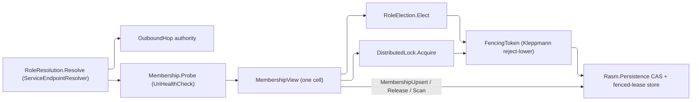

# [APPHOST_CLUSTER_COORDINATION]

One cluster-coordination owner for the runtime spine: a `ServiceEndpointResolver` resolves every logical role name to its live endpoint set so coordination rows address peers by role rather than host string, a probe-driven `MembershipView` folds each node's liveness into one attached-membership cell, a `RoleElection` acquires a store-issued `FencingToken` per role through the one `Runtime/time#FENCING_TOKEN` decode-only PORT adapter so exactly one node leads a role, and a `DistributedLock` gates cross-process critical sections through the same store-validated CAS predicate — one election rail, zero in-memory fencing. The page turns the single-writer lease into a multi-node coordination surface — membership answers *who is alive*, election answers *who leads this role*, the lock answers *who may enter this section*, and endpoint resolution answers *where that node is* — and it owns the endpoint-resolution rail, the membership view, the role-election fold, the distributed-lock surface, and the probe cadence projected as `SchedulePort` heartbeats. It consumes `FencingToken`/`LeaseElection.Acquire`/`Fence` and `LeasePolicy.Maintenance` from `Runtime/time#FENCING_TOKEN`, the `SchedulePort`/`ScheduleEntry.Spread` cadence from `Runtime/time#SCHEDULE_PORT`, `OutboundHop.HttpApi(Uri)`/`Grpc(Uri)` and the `HopPolicy` rows from `Wire/outbound#HOP_AXIS`, `PeerRoster.Attached` from `Wire/companion#PROCESS_MODALITY`, `WireHealthRow`/`WireHealth.Evaluate` from `Observability/health#WIRE_HEALTH`, the `CoordinationOp`/`CoordinationReceipt` membership triple from `Rasm.Persistence` `Store/coordination#COORDINATION_OP` over the one decode-only PORT, `TenantContext`/`CorrelationId` and `ReceiptSinkPort` from `Runtime/ports`, and `ClockPolicy` and `DeadlineClass` as settled vocabulary, minting no eighth port. The CAS-and-fenced-lease store backing the election, the lock, and the durable membership row is the `Rasm.Persistence` `ONE_FENCED_LEASE_STORE` leg consumed at the seam, never an AppHost-owned store. `Microsoft.Extensions.ServiceDiscovery` owns the endpoint-resolution and round-robin client load-balancing surface, `AspNetCore.HealthChecks.Uris` the remote liveness probe; Thinktecture owns the vocabularies and LanguageExt the rails.

## [01]-[INDEX]

- [02]-[ENDPOINT_RESOLUTION]: `ServiceEndpointResolver` resolving a logical role to its live endpoint set and seating the outbound hop authority.
- [03]-[MEMBERSHIP_VIEW]: Probe-driven liveness fold over the resolved endpoints into one attached-membership cell and its durable half.
- [04]-[ROLE_ELECTION]: Per-role fenced election over the one maintenance-lease minting a `FencingToken` per leader.
- [05]-[DISTRIBUTED_LOCK]: Cross-process critical-section gate over the same fenced reject-lower lease.

## [02]-[ENDPOINT_RESOLUTION]

- Owner: `RoleName` `[ValueObject<string>]` the logical cluster-role identity under the shipped `ComparerAccessors.StringOrdinal` accessor; `ResolvedRole` the role-to-endpoints projection carrying the resolved endpoint set and the refresh change token; `RoleResolution` the static surface over the one resolved `ServiceEndpointResolver` and the round-robin selection.
- Entry: `Resolve(ServiceEndpointResolver resolver, RoleName role, CancellationToken token)` returns `IO<Validation<CoordinationFault, ResolvedRole>>` — runs `resolver.GetEndpointsAsync((string)role, token)` returning a `ServiceEndpointSource`, projects its `Endpoints` (`IReadOnlyList<ServiceEndpoint>`) onto the `ResolvedRole`, and lifts an empty resolution to `CoordinationFault.NoEndpoint`; `Authority(ResolvedRole role, ulong cursor)` returns `Uri` — selects one endpoint by the round-robin cursor modulo the endpoint count and projects its `ServiceEndpoint.EndPoint` to the authority the outbound hop carries.
- Auto: coordination rows address peers by logical role, never a host literal — `GetEndpointsAsync` resolves the role name to the live endpoint set through the registered `ConfigurationServiceEndpointProvider` (cluster rows under the `Services` config section) so a membership probe, an election peer, and a lock holder all dial a `RoleName`, and the resolved `Authority` seats the `OutboundHop.HttpApi(Uri)`/`Grpc(Uri)` the resilient hop dials so endpoint resolution feeds the existing resilience spine rather than a parallel client; the round-robin selection mirrors the package's own `RoundRobinServiceEndpointSelector` — `cursor % Endpoints.Count` advances by the membership runtime's own interlocked `Next` counter so successive probes fan across the resolved instances without re-implementing the selector; `ResolvedRole.Refresh` carries the source's own `ChangeToken` for a consumer needing sub-cadence reaction, while the membership sweep re-resolves each role on its own cadence and the resolver caches per-role watchers and evicts unused entries on its own 10-second cleanup timer, so the page holds no parallel endpoint cache and registers no second callback; scheme admission rides `ServiceDiscoveryOptions.AllowedSchemes` so a resolved authority honors the configured scheme set.
- Receipt: a role resolution logs one `SpineLog` event in the 1000-1099 EVENT stride (`FaultBand.SpineEvents`) carrying the role name and the resolved endpoint count; a change-token refresh rides the same event stream, never a parallel discovery receipt.
- Packages: Microsoft.Extensions.ServiceDiscovery, Thinktecture.Runtime.Extensions, LanguageExt.Core, BCL inbox
- Growth: a new addressable role is one `RoleName` plus its config endpoint row; a richer query is one `ServiceEndpointQuery` carrying the role name plus included schemes; a non-resolving already-addressable target rides the `AddPassThroughServiceEndpointProvider` so a fixed endpoint enters the same resolution path; zero new surface.
- Boundary: the resolver is the only endpoint-resolution owner and `MEMBERSHIP_VIEW`'s probe sweep is its consumer — every sweep re-resolves each member's role and re-seats its probe authority here, so a hard-coded host string, a hand-rolled instance round-robin at a call site, and a second endpoint cache are the deleted forms; resolution feeds the existing outbound hops by seating the `Uri` authority so the resilience, breaker, and rate-limit stay the `Wire/outbound` hop policy, never a coordination-private client; the in-app companion attach stays the `Wire/companion` `DiscoveryManifest` UDS owner so `ServiceDiscovery` resolves only outbound network endpoints and never the local-IPC peer; the resolver is `IAsyncDisposable` and disposed at the composition root, never per call.

```csharp signature
// --- [TYPES] ----------------------------------------------------------------------------
[ValueObject<string>(KeyMemberName = "Value")]
[KeyMemberEqualityComparer<ComparerAccessors.StringOrdinal, string>]
public readonly partial struct RoleName;

// --- [MODELS] ---------------------------------------------------------------------------
public sealed record ResolvedRole(RoleName Role, Seq<ServiceEndpoint> Endpoints, IChangeToken Refresh) {
    public bool Any => Endpoints.Count > 0;
}

// --- [OPERATIONS] -----------------------------------------------------------------------
public static class RoleResolution {
    public static IO<Validation<CoordinationFault, ResolvedRole>> Resolve(ServiceEndpointResolver resolver, RoleName role, CancellationToken token) =>
        IO.liftAsync(async () => await resolver.GetEndpointsAsync((string)role, token))
            .Map(source => new ResolvedRole(role, source.Endpoints.AsIterable().ToSeq(), source.ChangeToken))
            .Map(resolved => resolved.Any
                ? Success<CoordinationFault, ResolvedRole>(resolved)
                : Fail<CoordinationFault, ResolvedRole>(new CoordinationFault.NoEndpoint((string)role)));

    public static Uri Authority(ResolvedRole role, ulong cursor) =>
        role.Endpoints[(int)(cursor % (ulong)role.Endpoints.Count)].EndPoint switch {
            UriEndPoint uri => uri.Uri,
            DnsEndPoint dns => new UriBuilder(Uri.UriSchemeHttps, dns.Host, dns.Port).Uri,
            IPEndPoint ip => new UriBuilder(Uri.UriSchemeHttps, ip.Address.ToString(), ip.Port).Uri,
            { } endpoint => new UriBuilder(Uri.UriSchemeHttps, endpoint.ToString()).Uri,
        };
}
```

## [03]-[MEMBERSHIP_VIEW]

- Owner: `NodeState` `[SmartEnum<string>]` the per-node liveness axis (joining, serving, suspect, departed); `MemberRecord` the per-node membership row carrying the node id, the resolved endpoint, the last-probe instant, and the state; `MembershipView` the `Atom`-backed attached-membership cell folding every probe onto one frozen view; `Membership` the static probe-and-fold surface projecting the probe cadence as `SchedulePort` heartbeats and crossing the durable half through the one `CoordinationOp` PORT.
- Cases: `NodeState` rows — `Joining` (resolved but not yet serving), `Serving` (a passing remote probe), `Suspect` (a missed probe inside the crash-staleness window), `Departed` (a probe gap past `LeasePolicy.Maintenance.CrashStaleness`) — a node advances through the states off its probe outcome and the view drops a `Departed` node so a vanished peer leaves the membership without an explicit leave; three `CoordinationOp` membership cases carry the durable half — `MembershipUpsert` on a row entering or renewing `Serving`, `MembershipRelease` on the `Departed` transition and on drain, `MembershipScan` on the boot rebuild.
- Entry: `Probe(Membership.Runtime runtime, MemberRecord member, Instant now)` returns `IO<MemberRecord>` — dials THAT member's own resolved authority over the remote HTTP(S) liveness check, folds the returned `HealthStatus` onto the next `NodeState`, and stamps the probe instant; `Fold(Membership.Runtime runtime, MemberRecord probed)` advances the membership cell in one `Atom` swap, crosses the matching `CoordinationOp`, and fans the transition receipt; `Contribute(Membership.Runtime runtime, int nodeId, RoleName role, EndPoint endpoint)` folds one companion `PeerRoster` local entry INTO the cluster view as a `Joining` row the probe sweep then grades — the two-tier fold, bound at the composition root as the `PeerRoster.Contribute` delegate so the local kernel-credentialed attach set CONTRIBUTES rather than substituting for probe-driven liveness; `Rebuild(Membership.Runtime runtime)` returns `IO<Validation<CoordinationFault, MembershipView>>` — the boot read that reseats the durable member set through `MembershipScan`; `Cadence(Membership.Runtime runtime)` returns `ScheduleEntry` — the heartbeat row registering the probe sweep on the `SchedulePort` at the health-probe cadence.
- Auto: membership is one cell folded from probes, never a gossip protocol — the ENDPOINT SHAPE picks the liveness route, so a `UnixDomainSocketEndPoint` row is a locally-attached companion graded off the `PeerRoster` lease that admitted it (never re-resolved and never HTTP-dialled, because the network resolver knows nothing of a `sun_path` and dialling one would depart a process that is alive and attached), while each remote member is graded by the admitted `UriHealthCheck` over ITS OWN resolved authority (the `AddUrlGroup(Func<IServiceProvider, Uri>)` service-discovery form is the registration shape, `UriHealthCheck(UriHealthCheckOptions, Func<HttpClient>)` the contributor, and `configurePrimaryHttpMessageHandler` seats the shared resilience handler so probe and live traffic share one breaker state), while the LOCAL node's own row alone reads the in-process `WireHealth` registry — grading a remote peer off this host's registry answers whether THIS node is healthy and would report a dead peer `Serving`; the status maps onto the `NodeState` (`Healthy` to `Serving`, `Degraded` to `Suspect`, an unreachable probe to `Suspect` then `Departed` past the staleness window); the sweep resolves each role through `RoleResolution.Resolve` and seats the probe authority through `RoleResolution.Authority` over the runtime's own interlocked round-robin cursor, registering the sweep against `ResolvedRole.Refresh` so an endpoint-set change re-folds the view instead of waiting out a probe cycle; the probe cadence is one `ScheduleEntry` registered on the one `SchedulePort` at a derived third of the staleness window (three probe sweeps before a silent node is graded `Departed`) so the sweep rides the existing scheduler under a structurally-under-`Staleness` cadence, never a per-membership timer loop; the staleness window is the `LeasePolicy.Maintenance.CrashStaleness` value the election lease shares so a `Departed` node and a lapsed lease use one window; the membership swap is atomic so the `MembershipView.Serving` read the election and lock consult is race-free; every fold crosses its durable half — a `Serving` row upserts its TTL-expiring membership row and a `Departed` row releases immediately rather than waiting out the lapse — so a restarted node `Rebuild`s the cluster view from the store instead of starting empty under a `FleetRoll` that reads `Serving`.
- Receipt: every state transition mints one `MembershipReceipt` — node id, prior state, next state, the MEASURED probe `Duration`, the resolved endpoint — fanned through `ReceiptSinkPort.Send` under the `Rasm.AppHost` package key; a `Departed` transition rides the same stream so a membership change is one receipt, never a parallel membership log.
- Packages: Microsoft.Extensions.ServiceDiscovery, AspNetCore.HealthChecks.Uris, Thinktecture.Runtime.Extensions, LanguageExt.Core, NodaTime, BCL inbox
- Growth: a new liveness state is one `NodeState` row breaking every state-fold arm; a richer probe is one `UriHealthCheckOptions` column (`ExpectHttpCodes`, `ExpectContent`, `AddCustomHeader` for an authenticated peer); a per-role membership is the view keyed by `RoleName`; zero new surface.
- Boundary: the membership view is the only liveness owner — a gossip membership protocol, a second heartbeat loop, and an Orleans/Consul membership table are the deleted forms; the remote probe is the admitted `UriHealthCheck` graded per member and never a hand-rolled HTTP liveness fold, and the local row alone reads `WireHealth.Evaluate` so membership and health read one status for this node without pretending it speaks for peers; the cadence is one `SchedulePort` row so the sweep rides the one scheduler; the `MembershipView.Serving` set is the fleet wave membership `Sandbox/provisioning#ROLLOVER_DRAIN` `FleetRoll` reads and the lock-and-election eligible set, so the three coordination surfaces consult one membership cell; the two-tier law is explicit — companion's `PeerRoster` (LOCAL kernel-credentialed attach) contributes through `Contribute` and this view (CLUSTER probe-driven liveness) is the one truth fleet-wide reads consult, never two membership owners; the durable half is the `Rasm.Persistence` `Store/coordination#COORDINATION_OP` `MembershipUpsert`/`MembershipRelease`/`MembershipScan` triple crossed through the one decode-only PORT the lease already rides — the store owns the TTL-expiring row and the fenced departure, this page owns the in-process view, and a second membership store is the deleted form; a `MembershipScan` row whose `Until` already trails the read instant is `CoordinationFault.Stale` and never seats — a lapsed durable member re-entering the view on a restart would hand `FleetRoll` a peer that departed before the boot.

```csharp signature
// --- [TYPES] ----------------------------------------------------------------------------
[SmartEnum<string>]
public sealed partial class NodeState {
    public static readonly NodeState Joining = new("joining");
    public static readonly NodeState Serving = new("serving");
    public static readonly NodeState Suspect = new("suspect");
    public static readonly NodeState Departed = new("departed");
}

// --- [MODELS] ---------------------------------------------------------------------------
// Elapsed is the MEASURED dial duration the probe times, not a default — the receipt's own latency column
// reads it, so a probe that never timed itself would publish zero for every peer.
public sealed record MemberRecord(int NodeId, RoleName Role, EndPoint Endpoint, Instant LastProbe, Duration Elapsed, NodeState State);

public readonly record struct MembershipReceipt(int NodeId, NodeState From, NodeState To, Duration Elapsed, EndPoint Endpoint, CorrelationId Correlation);

// --- [SERVICES] -------------------------------------------------------------------------
public sealed record MembershipView(HashMap<int, MemberRecord> Members) {
    public Seq<MemberRecord> Serving => Members.Values.Filter(static m => m.State == NodeState.Serving).ToSeq();
    public MembershipView With(MemberRecord member) => new(Members.AddOrUpdate(member.NodeId, member, member));
}

// --- [OPERATIONS] -----------------------------------------------------------------------
public static class Membership {
    public sealed record Runtime(
        int NodeId,
        RoleName Role,
        string Group,
        ServiceEndpointResolver Resolver,
        HealthCheckService Health,
        WireHealthRow Local,
        Func<Uri, CancellationToken, Task<HealthStatus>> Remote,
        Func<int, bool> Attached,
        // The durable half rides WIRE-STABLE PRIMITIVES, the exact decode-only shape `LeaseElection.Runtime`
        // takes: the group and member cross as their string keys and the scan answers keys beside deadlines,
        // so no Persistence record crosses upward and no AppHost record crosses down. The three arrows are
        // the `CoordinationOp` membership triple decoded at the composition root, never named here.
        Func<string, string, Duration, Fin<Unit>> MemberUpsert,
        Func<string, string, Fin<Unit>> MemberRelease,
        Func<string, Fin<Seq<(string Member, Instant Until)>>> MemberScan,
        Atom<MembershipView> View,
        Atom<ulong> Cursor,
        ClockPolicy Clocks,
        Duration Staleness,
        ReceiptSinkPort Sink) {
        // Probe cadence is derived a third of the staleness window so three sweeps run before a silent node
        // is graded Departed — Cadence strictly under Staleness is structural, never a bypassable config field.
        public Duration Cadence => Staleness / 3L;

        // The round-robin advance the resolver's own selector uses: one interlocked bump per selection, so
        // successive probes fan across the resolved instances instead of pinning the first forever.
        public ulong Next => Cursor.Swap(static cursor => cursor + 1UL);
    }

    // Three liveness routes, and the ENDPOINT SHAPE picks among them — this node reads its own registry, an
    // attached local companion reads the roster lease that admitted it, and every network peer is dialled at
    // its own authority. Grading a peer off the local registry answers a question about this node and reports
    // a dead peer Serving; dialling HTTP at a companion's `sun_path` answers NoEndpoint and departs a process
    // that is alive and attached. MembershipView.Serving is exactly what RoleElection and FleetRoll gate on,
    // so a wrong route here is a wrong fleet wave.
    public static IO<MemberRecord> Probe(Runtime runtime, MemberRecord member, Instant now) =>
        IO.lift(() => runtime.Clocks.Mark()).Bind(mark =>
            ((member.NodeId, member.Endpoint) switch {
                var (node, _) when node == runtime.NodeId =>
                    IO.liftAsync(async () => (await WireHealth.Evaluate(runtime.Health, runtime.Local, runtime.Clocks.Clock, Correlation.Mint(), CancellationToken.None)).Status),
                (_, UnixDomainSocketEndPoint) =>
                    IO.lift(() => runtime.Attached(member.NodeId) ? HealthStatus.Healthy : HealthStatus.Unhealthy),
                _ => Authority(runtime, member).Match(
                    Succ: authority => IO.liftAsync(async () => await runtime.Remote(authority, CancellationToken.None)),
                    Fail: _ => IO.pure(HealthStatus.Unhealthy)),
            })
            .Map(status => member with {
                LastProbe = now,
                Elapsed = runtime.Clocks.Elapsed(mark),
                State = status switch {
                    HealthStatus.Healthy => NodeState.Serving,
                    HealthStatus.Degraded => NodeState.Suspect,
                    _ => now - member.LastProbe > runtime.Staleness ? NodeState.Departed : NodeState.Suspect,
                },
            }));

    // One fold, three consequences: the in-process swap, the durable half, and the transition receipt. A
    // Departed row RELEASES its store row now rather than waiting out the TTL, so a successor's rebuild
    // never reads a member that already left; a Serving row upserts under the staleness TTL so a crashed
    // node's row lapses on the same window the lease uses.
    public static IO<MembershipReceipt> Fold(Runtime runtime, MemberRecord probed) =>
        IO.lift(() => (Prior: runtime.View.Value.Members.Find(probed.NodeId).Map(static m => m.State).IfNone(NodeState.Joining),
                       Next: runtime.View.Swap(current => probed.State == NodeState.Departed
                           ? new MembershipView(current.Members.Remove(probed.NodeId))
                           : current.With(probed))))
            .Bind(swap => Durable(runtime, probed).Map(_ => swap))
            .Bind(swap => Fan(runtime, new MembershipReceipt(
                probed.NodeId, swap.Prior, probed.State, probed.Elapsed, probed.Endpoint, Correlation.Mint())));

    // The two-tier fold: companion's LOCAL roster contributes into the CLUSTER view — an attached
    // local peer enters Joining and the probe sweep grades it to Serving/Suspect/Departed; the local
    // tier never substitutes for cluster liveness and FleetRoll reads MembershipView.Serving only. The
    // composition root binds this as PeerRoster.Contribute, so the edge is a wired delegate, not prose.
    public static MembershipView Contribute(Runtime runtime, int nodeId, RoleName role, EndPoint endpoint) {
        // The joining row is minted ONCE, ahead of the exchange: a clock read inside the CAS body stamps a new
        // join instant on every retry, so the row that lands is not the row the winning attempt derived.
        MemberRecord joined = new(nodeId, role, endpoint, runtime.Clocks.Now, Duration.Zero, NodeState.Joining);
        return runtime.View.Swap(current => current.Members.ContainsKey(nodeId) ? current : current.With(joined));
    }

    // Boot rebuild: a restarted node reads the durable member set rather than starting empty under a
    // FleetRoll that would then see a one-node cluster. A row whose lease already lapsed is Stale and never
    // seats — it names a peer that departed before this boot and the probe sweep would only re-derive it.
    public static IO<Validation<CoordinationFault, MembershipView>> Rebuild(Runtime runtime) =>
        IO.lift(() => runtime.MemberScan(runtime.Group))
            .Map(scanned => scanned.Match(
                Succ: rows => Seated(runtime, rows),
                Fail: error => Fail<CoordinationFault, MembershipView>(new CoordinationFault.Text(error.Message))));

    // The heartbeat row on the ONE SchedulePort: the occurrence sweeps every member through Probe and
    // folds the graded record into the view — the probe cadence is one schedule row, never a second
    // scheduler, and Cadence stays strictly under Staleness so liveness grading never self-departs.
    public static ScheduleEntry Cadence(Runtime runtime) =>
        new(Key: "membership:probe",
            Spec: new OccurrenceSpec.Every(runtime.Cadence),
            Deadline: DeadlineClass.HealthProbe,
            Lease: None,
            Work: () => Sweep(runtime));

    static IO<Unit> Sweep(Runtime runtime) =>
        runtime.View.Value.Members.Values.AsIterable().ToSeq()
            .FoldM(unit, (_, member) => Resolved(runtime, member)
                .Bind(current => Probe(runtime, current, runtime.Clocks.Now))
                .Bind(probed => Fold(runtime, probed)).Map(static _ => unit))
            .As();

    // Every sweep re-resolves the member's role through the ONE resolver and re-seats its endpoint off the
    // round-robin selection, so a rescheduled peer is probed at its new address on the next cadence. An
    // unresolvable role keeps the prior endpoint, so a resolver blip grades on the last known address rather
    // than departing a live node on a lookup failure. A locally-attached companion is NOT re-resolved: its
    // `sun_path` is the contributed identity and the network resolver knows nothing about it, so re-seating
    // would replace a live UDS peer's endpoint with a sibling node's authority and probe the wrong process.
    static IO<MemberRecord> Resolved(Runtime runtime, MemberRecord member) =>
        member.Endpoint is UnixDomainSocketEndPoint
            ? IO.pure(member)
            : RoleResolution.Resolve(runtime.Resolver, member.Role, CancellationToken.None)
                .Map(resolved => resolved.Match(
                    Succ: role => member with { Endpoint = new UriEndPoint(RoleResolution.Authority(role, runtime.Next)) },
                    Fail: _ => member));

    static IO<Fin<Unit>> Durable(Runtime runtime, MemberRecord probed) =>
        IO.lift(() => probed.State == NodeState.Departed
            ? runtime.MemberRelease(runtime.Group, Key(probed.NodeId))
            : runtime.MemberUpsert(runtime.Group, Key(probed.NodeId), runtime.Staleness));

    // A scanned row whose deadline already trails the read is Stale and never seats: it names a peer that
    // departed before this boot, so seating it would hand FleetRoll a member the sweep must then re-derive
    // as dead. A live row seats Joining and the sweep grades it exactly like a contributed one.
    static Validation<CoordinationFault, MembershipView> Seated(Runtime runtime, Seq<(string Member, Instant Until)> rows) {
        // ONE clock read grades the scan and stamps every seat. A per-row read grades two rows of one scan
        // against two instants, and a read inside the CAS body re-stamps the whole seat set on every retry.
        Instant at = runtime.Clocks.Now;
        // The seat carries the ROLE as its address because the scan answers keys and deadlines, never
        // endpoints. That placeholder is never dialled: `Sweep` runs `Resolved` ahead of `Probe`, so the
        // first pass replaces it with the resolver's own authority before any probe reads it.
        Seq<MemberRecord> seats = rows.Choose(row => int.TryParse(row.Member, CultureInfo.InvariantCulture, out var node)
            ? Some(new MemberRecord(node, runtime.Role, new DnsEndPoint((string)runtime.Role, 0), at, Duration.Zero, NodeState.Joining))
            : Option<MemberRecord>.None);
        return rows.Filter(row => row.Until <= at).Head.Match(
            Some: lapsed => Fail<CoordinationFault, MembershipView>(new CoordinationFault.Stale($"{runtime.Group}:{lapsed.Member}@{lapsed.Until}")),
            None: () => Success<CoordinationFault, MembershipView>(
                runtime.View.Swap(current => seats.Fold(current, static (view, seat) => view.With(seat)))));
    }

    static string Key(int nodeId) => nodeId.ToString(CultureInfo.InvariantCulture);

    static IO<MembershipReceipt> Fan(Runtime runtime, MembershipReceipt receipt) =>
        runtime.Sink.Send(receipt.Correlation, TenantContext.Current, TelemetrySource.AppHost.Key, nameof(Membership),
            JsonSerializer.SerializeToElement(receipt, SuiteContracts.Host)).Map(_ => receipt);
}
```

## [04]-[ROLE_ELECTION]

- Owner: `RoleLeadership` the per-role election outcome carrying the leader node id and the minted `FencingToken`; `RoleElection` the static acquire-and-fence surface extending `LeaseElection.Acquire` per role; the `LeasePolicy.Maintenance` lease the election shares with the scheduler and provisioning conductor.
- Entry: `Elect(RoleElection.Runtime runtime, RoleName role)` returns `IO<Validation<CoordinationFault, RoleLeadership>>` — acquires the role's maintenance lease through `LeaseElection.Acquire` minting one strictly-increasing `FencingToken`, projects the acquisition onto a `RoleLeadership`, and lifts a lost election to `CoordinationFault.NotLeader`; `Renew(RoleElection.Runtime runtime, RoleLeadership leadership)` returns `IO<Fin<Unit>>` extending the lease ahead of the crash-staleness window; `Resign(RoleElection.Runtime runtime, RoleLeadership leadership)` returns `IO<Fin<Unit>>` releasing the lease on drain through the fenced store-side return so a draining leader hands off immediately — the held token authorizes the release, never a bare role name; all three fan one `LeadershipReceipt` on the held arm under the leadership's own correlation.
- Auto: exactly one node leads a role — the election acquires through the one `LeaseElection.Acquire` PORT adapter so the store ISSUES the monotone token generation (AppHost mints nothing), and the store's row-CAS predicate on every guarded write means a resumed stale leader presenting a lower token is rejected AT THE STORE even before its lease lapses (the Kleppmann safety the timeout alone cannot give), the rejection decoding as `CoordinationFault.LeaseFenced`; the election reuses the `LeasePolicy.Maintenance.CrashStaleness` window as the lease timeout so a crashed leader's role re-elects after the staleness window and the renew cadence rides the one `SchedulePort` maintenance heartbeat; only a `MembershipView.Serving` node contests a role so a `Suspect`/`Departed` node never wins, and the leader's renew folds through the same lease so the leadership and the membership read one liveness; the lease store is the `Rasm.Persistence` CAS-and-fenced-lease leg so the compare-and-set is the store's atomic operation, the token is the store's fenced column decoded through the port, and an AppHost in-memory lease is the deleted form; the `FleetRoll` conductor election and the sidecar write-forward acquire through this same rail so the host has one election owner across coordination, rollout, and write-forwarding.
- Receipt: a leadership transition mints one `LeadershipReceipt` — role, leader node id, the `FencingToken` value, the lease deadline `Instant`, the episode correlation — fanned through `ReceiptSinkPort.Send` by `Elect`, `Renew`, and `Resign` alike, so a win, its renewals, and its handoff join on one causal key and a leadership change is one receipt, never a parallel election log; a LOST election fans none — the refusal is already the caller's typed value and a receipt naming no leader records nothing.
- Packages: Thinktecture.Runtime.Extensions, LanguageExt.Core, NodaTime, BCL inbox
- Growth: a new elected role is one `Elect` call over its `RoleName`; a new fenced resource reads the same `FencingToken.Admits`, never a second token; a per-role lease cadence retune is the lease policy's staleness column; zero new surface.
- Boundary: the election is the only leadership owner — a timeout-only lease without a fenced token, a second token type, and a per-role bespoke election are the deleted forms; the token is the correctness proof the resource checks, not merely held, so a fenced write rejects a stale leader through `Admits`; the election shares the one `LeaseElection.Acquire` and `LeasePolicy.Maintenance` with the scheduler, the provisioning `FleetRoll`, and the sidecar write-forward so the suite has one fenced-election rail aligned to the Persistence store, never four; a leader that loses its lease stops contesting the role and its in-flight fenced writes fail at the resource so a split-brain write is structurally foreclosed; the distributed quota debit (`Agent/capability#GRANT_BROKER` `DistributedBudget`) fences through the same lock store so the budget CAS and the leadership lease read one fencing identity.

```csharp signature
// --- [MODELS] ---------------------------------------------------------------------------
// The correlation rides the HOLDING, not each fan call: a win, its renewals, and its resignation are one
// leadership episode, so every receipt they mint joins on one causal key.
public sealed record RoleLeadership(RoleName Role, int LeaderNode, FencingToken Token, Instant LeaseDeadline, CorrelationId Correlation);

public readonly record struct LeadershipReceipt(RoleName Role, int LeaderNode, ulong Token, Instant LeaseDeadline, CorrelationId Correlation);

// --- [OPERATIONS] -----------------------------------------------------------------------
public static class RoleElection {
    public sealed record Runtime(
        int NodeId,
        LeaseElection.Runtime Lease,
        Func<RoleName, MembershipView> ViewOf,
        ClockPolicy Clocks,
        Duration Staleness,
        ReceiptSinkPort Sink);

    static string KeyOf(RoleName role) => $"role:{(string)role}";

    public static IO<Validation<CoordinationFault, RoleLeadership>> Elect(Runtime runtime, RoleName role) =>
        runtime.ViewOf(role).Serving.Exists(m => m.NodeId == runtime.NodeId)
            ? IO.lift(() => LeaseElection.Acquire(runtime.Lease, KeyOf(role)).Match(
                Succ: token => Success<CoordinationFault, RoleLeadership>(
                    new RoleLeadership(role, runtime.NodeId, token, runtime.Clocks.Now + runtime.Staleness, Correlation.Mint())),
                Fail: error => Fail<CoordinationFault, RoleLeadership>(new CoordinationFault.NotLeader($"{(string)role}:{error.Message}"))))
                .Bind(elected => Fan(runtime, role, elected).Map(_ => elected))
            : IO.pure(Fail<CoordinationFault, RoleLeadership>(new CoordinationFault.NotLeader($"{(string)role}:not-serving")));

    public static IO<Fin<Unit>> Renew(Runtime runtime, RoleLeadership leadership) =>
        IO.lift(() => LeaseElection.Renew(runtime.Lease, KeyOf(leadership.Role), leadership.Token).Map(static _ => unit))
            .Bind(renewed => Fan(runtime, leadership.Role, Held(leadership, renewed)).Map(_ => renewed));

    // Drain handoff: the fenced release returns the lease store-side so a successor elects
    // immediately — a resignation without the held token is unfenceable and rejects store-side.
    public static IO<Fin<Unit>> Resign(Runtime runtime, RoleLeadership leadership) =>
        IO.lift(() => LeaseElection.Release(runtime.Lease, KeyOf(leadership.Role), leadership.Token))
            .Bind(released => Fan(runtime, leadership.Role, Held(leadership, released)).Map(_ => released));

    // Every leadership transition — won, renewed, resigned, lost — fans ONE receipt carrying the prior or
    // held token, so a leadership change is readable from the envelope stream rather than inferred from a
    // lease store nobody exports. A declared receipt with no producer is the shape this closes.
    static IO<Unit> Fan(Runtime runtime, RoleName role, Validation<CoordinationFault, RoleLeadership> outcome) =>
        outcome.Match(
            Succ: leadership => runtime.Sink.Send(leadership.Correlation, TenantContext.Current, TelemetrySource.AppHost.Key, nameof(RoleElection),
                JsonSerializer.SerializeToElement(
                    new LeadershipReceipt(role, leadership.LeaderNode, (ulong)leadership.Token, leadership.LeaseDeadline, leadership.Correlation),
                    SuiteContracts.Host)).Map(static _ => unit),
            Fail: _ => IO.pure(unit));

    static Validation<CoordinationFault, RoleLeadership> Held(RoleLeadership leadership, Fin<Unit> outcome) =>
        outcome.Match(
            Succ: _ => Success<CoordinationFault, RoleLeadership>(leadership),
            Fail: error => Fail<CoordinationFault, RoleLeadership>(new CoordinationFault.NotLeader(error.Message)));
}
```

## [05]-[DISTRIBUTED_LOCK]

- Owner: `LockHolding` the held-lock evidence carrying the lock key, the holder node, and the fencing token; `DistributedLock` the static acquire-fence-release surface over the same maintenance-lease reject-lower; `CoordinationFault` `[Union]` the closed coordination-fault family deriving its codes through `FaultBand.Coordination` (re-banded off the Compute Remote `WireFault` neighborhood the registry mirror-pins).
- Cases: `CoordinationFault` = `Text` | `NoEndpoint` | `NotLeader` | `LockHeld` | `FenceRejected` | `Stale` | `LeaseFenced` — one case per coordination-rejection cause, each breaking every consumer arm; `Stale` is the boot-rebuild refusal `MEMBERSHIP_VIEW` constructs when a scanned durable member's lease already trails the read instant; `LeaseFenced` is the DECODED store-side rejection (the Persistence CAS rejecting a lower token), constructed at the composition-root delegate binding every `LeaseElection` consumer shares.
- Entry: `Acquire(DistributedLock.Runtime runtime, string key)` returns `IO<Validation<CoordinationFault, LockHolding>>` — acquires the key's fenced lease through `LeaseElection.Acquire` minting a `FencingToken`, projecting onto a `LockHolding` or lifting a contended key to `CoordinationFault.LockHeld`; `Guard(DistributedLock.Runtime runtime, LockHolding holding, IO<A> section)` returns `IO<Validation<CoordinationFault, A>>` — fences the holding through `FencingToken.Admits` before and after the critical section so a section that runs past a lease lapse fails the fence rather than committing under a stolen lock; `Release(DistributedLock.Runtime runtime, LockHolding holding)` returns `IO<Fin<Unit>>` returning the lease; `Acquire` and `Release` each fan one `LockReceipt` on the held arm.
- Auto: a cross-process critical section is gated by a fenced lease, not a timeout — `Acquire` mints the same monotone `FencingToken` the election mints so the lock and the leadership read one fencing identity, and `Guard` re-checks `FencingToken.Admits` after the section so a paused holder whose lease lapsed and was re-granted cannot commit (the fenced write at the resource rejects its lower token); the lock store is the `Rasm.Persistence` CAS-and-fenced-lease leg so acquisition is the store's atomic compare-and-set and the token is the store's fenced column, never an in-process mutex that ignores other nodes; the lease timeout is the `LeasePolicy.Maintenance.CrashStaleness` window so a crashed holder's lock reclaims after the window and a long section renews through the one `SchedulePort` heartbeat ahead of it; the lock is the same rail multi-instance singleton execution rides — a singleton-per-role job, the one fleet-roll conductor and the one outbox sweep leader among them, acquires the role lock before running so two nodes never run the singleton concurrently and the singleton's fenced writes carry the lock's own token.
- Receipt: a lock acquisition mints one `LockReceipt` — lock key, holder node, the `FencingToken` value, the lease deadline, the holding correlation — fanned through `ReceiptSinkPort.Send` by `Acquire` and `Release` alike so a hold and its return join on one key, never a parallel lock log; a CONTENDED acquire fans none, because a receipt for a lock never held names no holder.
- Packages: Thinktecture.Runtime.Extensions, LanguageExt.Core, NodaTime, BCL inbox
- Growth: a new locked section acquires the same `DistributedLock` over its key; a new fenced resource reads the same `Admits`; a read-write lock is the lock keyed by mode, never a second lock type; zero new surface.
- Boundary: the distributed lock is the only cross-process critical-section owner — an in-process `lock`/`SemaphoreSlim` for a multi-node section, a timeout-only lease without a fenced token, and a second lock store are the deleted forms; the lock shares the one `FencingToken`, `LeaseElection.Acquire`, and `LeasePolicy.Maintenance` with the election so a lock and a leadership fence one identity; the `Guard` re-fences after the section so a stolen lock is detected at commit, the Kleppmann safety; the lock store is the `Rasm.Persistence` CAS leg so the lock survives a process crash and reclaims on the staleness window, and the distributed-quota debit fences through the same store so the budget CAS, the leadership lease, and the lock read one fencing identity, never three.

```csharp signature
// --- [MODELS] ---------------------------------------------------------------------------
public sealed record LockHolding(string Key, int HolderNode, FencingToken Token, Instant LeaseDeadline, CorrelationId Correlation);

public readonly record struct LockReceipt(string Key, int HolderNode, ulong Token, Instant LeaseDeadline, CorrelationId Correlation);

// --- [ERRORS] ---------------------------------------------------------------------------
[Union]
public abstract partial record CoordinationFault : Expected, IValidationError<CoordinationFault> {
    private CoordinationFault(string detail, int code) : base(detail, code, None) { }
    public static CoordinationFault Create(string message) => new Text(message);
    public sealed record Text : CoordinationFault { public Text(string detail) : base(detail, FaultBand.Coordination.Code(0)) { } }
    public sealed record NoEndpoint : CoordinationFault { public NoEndpoint(string role) : base(role, FaultBand.Coordination.Code(1)) { } }
    public sealed record NotLeader : CoordinationFault { public NotLeader(string detail) : base(detail, FaultBand.Coordination.Code(2)) { } }
    public sealed record LockHeld : CoordinationFault { public LockHeld(string key) : base(key, FaultBand.Coordination.Code(3)) { } }
    public sealed record FenceRejected : CoordinationFault { public FenceRejected(string detail) : base(detail, FaultBand.Coordination.Code(4)) { } }
    public sealed record Stale : CoordinationFault { public Stale(string detail) : base(detail, FaultBand.Coordination.Code(5)) { } }
    public sealed record LeaseFenced : CoordinationFault { public LeaseFenced(ulong stale, ulong current) : base($"{stale}<{current}", FaultBand.Coordination.Code(6)) { } }
}

// --- [OPERATIONS] -----------------------------------------------------------------------
public static class DistributedLock {
    public sealed record Runtime(
        int NodeId,
        LeaseElection.Runtime Lease,
        ClockPolicy Clocks,
        Duration Staleness,
        ReceiptSinkPort Sink);

    static string KeyOf(string key) => $"lock:{key}";

    public static IO<Validation<CoordinationFault, LockHolding>> Acquire(Runtime runtime, string key) =>
        IO.lift(() => LeaseElection.Acquire(runtime.Lease, KeyOf(key)).Match(
            Succ: token => Success<CoordinationFault, LockHolding>(
                new LockHolding(key, runtime.NodeId, token, runtime.Clocks.Now + runtime.Staleness, Correlation.Mint())),
            Fail: error => Fail<CoordinationFault, LockHolding>(new CoordinationFault.LockHeld($"{key}:{error.Message}"))))
            .Bind(acquired => Fan(runtime, key, acquired).Map(_ => acquired));

    // The store's CAS predicate is the authoritative fence on BOTH sides of the section: a paused
    // holder whose lease lapsed commits nothing — the post-section guard rejects store-side.
    public static IO<Validation<CoordinationFault, A>> Guard<A>(Runtime runtime, LockHolding holding, IO<A> section) =>
        LeaseElection.Fence(runtime.Lease, KeyOf(holding.Key), holding.Token).Match(
            Succ: _ => section.Map(value => LeaseElection.Fence(runtime.Lease, KeyOf(holding.Key), holding.Token).Match(
                Succ: _ => Success<CoordinationFault, A>(value),
                Fail: error => Fail<CoordinationFault, A>(new CoordinationFault.FenceRejected(error.Message)))),
            Fail: error => IO.pure(Fail<CoordinationFault, A>(new CoordinationFault.FenceRejected(error.Message))));

    // The fenced return: the holding's token authorizes the release so a stale holder cannot free a
    // successor's lease — the store rejects, exactly the Guard predicate law.
    public static IO<Fin<Unit>> Release(Runtime runtime, LockHolding holding) =>
        IO.lift(() => LeaseElection.Release(runtime.Lease, KeyOf(holding.Key), holding.Token))
            .Bind(released => Fan(runtime, holding.Key, released.Match(
                Succ: _ => Success<CoordinationFault, LockHolding>(holding),
                Fail: error => Fail<CoordinationFault, LockHolding>(new CoordinationFault.FenceRejected(error.Message))))
                .Map(_ => released));

    // Acquire and release both fan ONE receipt on the held arm, so the lock transition stream exists rather
    // than being promised by a Receipt line over a struct nothing constructs. A contended acquire fans none —
    // the refusal is already the caller's typed value and a receipt for a lock never held names no holder.
    static IO<Unit> Fan(Runtime runtime, string key, Validation<CoordinationFault, LockHolding> outcome) =>
        outcome.Match(
            Succ: holding => runtime.Sink.Send(holding.Correlation, TenantContext.Current, TelemetrySource.AppHost.Key, nameof(DistributedLock),
                JsonSerializer.SerializeToElement(
                    new LockReceipt(key, holding.HolderNode, (ulong)holding.Token, holding.LeaseDeadline, holding.Correlation),
                    SuiteContracts.Host)).Map(static _ => unit),
            Fail: _ => IO.pure(unit));
}
```


```mermaid
---
config:
  layout: elk
  flowchart:
    curve: linear
    padding: 25
---
flowchart LR
    accTitle: One coordination surface over the fenced lease and the endpoint resolver
    accDescr: The resolver maps a role to live endpoints feeding the outbound hop authority; remote probes fold into one membership view whose durable half crosses the coordination port; the election and lock mint a fenced token over the one maintenance lease backed by the Persistence CAS store.
    Resolve["RoleResolution.Resolve (ServiceEndpointResolver)"] --> Authority["OutboundHop authority"]
    Resolve --> Probe["Membership.Probe (UriHealthCheck)"]
    Probe --> View["MembershipView (one cell)"]
    View -->|"MembershipUpsert / Release / Scan"| Store
    View --> Elect["RoleElection.Elect"]
    View --> Lock["DistributedLock.Acquire"]
    Elect --> Token["FencingToken (Kleppmann reject-lower)"]
    Lock --> Token
    Token --> Store["Rasm.Persistence CAS + fenced-lease store"]
```

## [06]-[TS_PROJECTION]

- Owner: `MembershipViewWire` and `RoleLeadershipWire` transcribe the live membership view and the per-role leadership the dashboard ingests; the fencing tokens and lock holdings stay host-side.
- Packages: BCL inbox
- Growth: one member row or one leadership field, zero new surface.
- Boundary: only the membership view (node id, role, state, last-probe instant) and the leadership (role, leader node, lease deadline) cross — the `FencingToken` value never crosses the wire so a token cannot be forged from the dashboard; instants cross as extended-ISO text; the node state crosses as the `NodeState` key string; the lock holdings never cross because a lock is a host-internal critical-section gate, not a dashboard concern.

```ts signature
interface MembershipViewWire {
  readonly members: readonly {
    readonly nodeId: number;
    readonly role: string;
    readonly state: string;
    readonly lastProbe: string;
  }[];
}

interface RoleLeadershipWire {
  readonly role: string;
  readonly leaderNode: number;
  readonly leaseDeadline: string;
}
```

## [07]-[RESEARCH]

(none)
