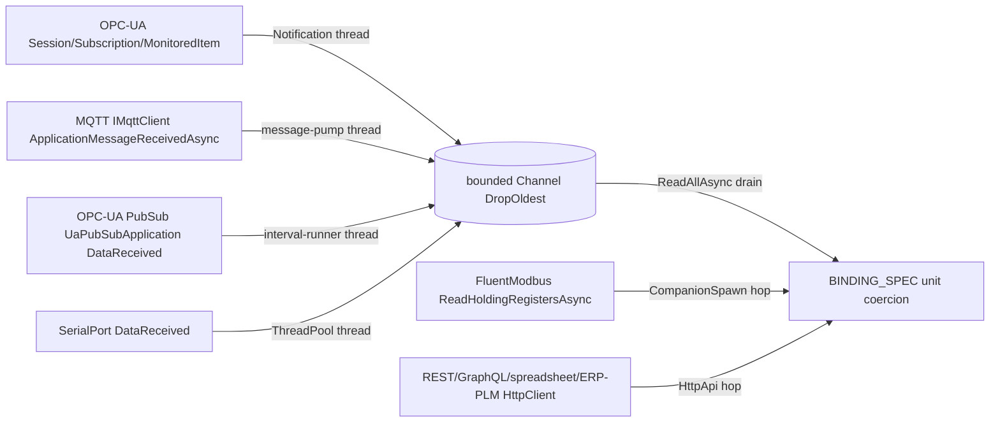
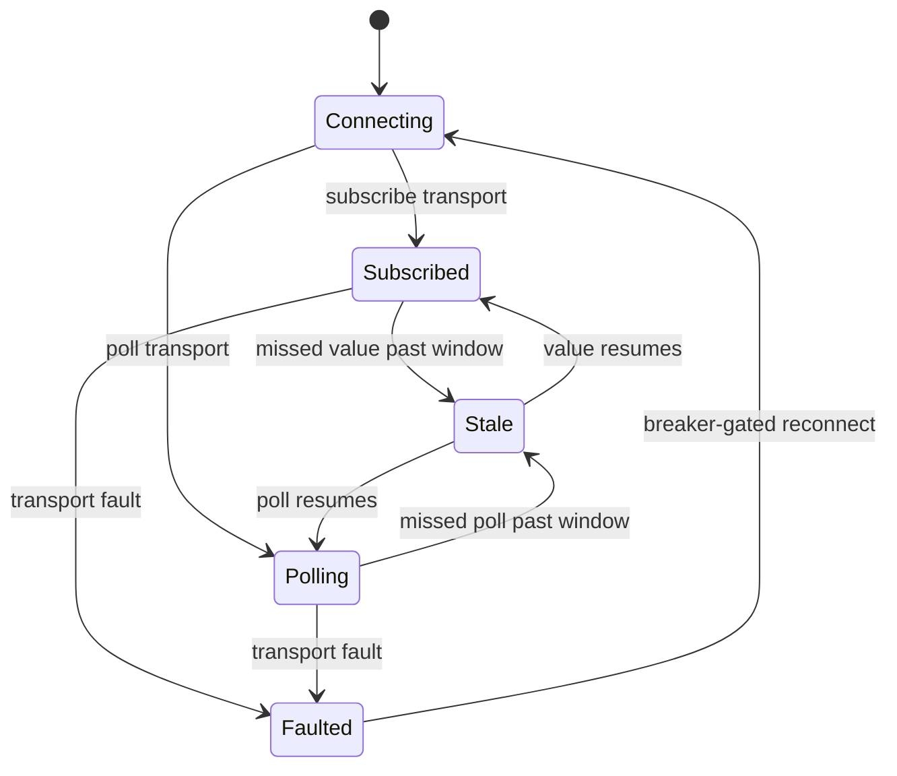

# [APPHOST_LIVE_WIRE]

The reactive bidirectional external-binding studio for the runtime spine: one industrial-transport axis carries every two-way edge — OPC-UA, Modbus, MQTT, serial, REST, GraphQL, spreadsheet, ERP/PLM — as rows whose adapter reads and writes through one binding contract, a binding spec pairs an external source with an internal target and a direction, every inbound value coerces its unit at the edge through the Compute unit algebra before it enters the suite, a write-back transaction commits an outbound value with an acknowledgement receipt and rolls back on rejection, and a binding-health lifecycle tracks connect, subscribe, stale, and fault states per binding. The page owns the transport axis, the binding spec and direction, the edge unit coercion, the write-back transaction, and the binding-health lifecycle; it consumes `QuantityFamily`/`UnitAlgebra`/`UnitPolicy`, `OutboundHop`/`OutboundSurface`, `SchedulePort`/`ScheduleEntry`, `CommandAlgebra`, `DeadlineClass`, `DegradationLevel`, and `ReceiptSinkPort` as settled vocabulary and mints no eighth port.

## [01]-[INDEX]

- [01]-[TRANSPORT_AXIS]: Eight industrial-transport rows with one read/write adapter contract.
- [02]-[TRANSPORT_BINDING]: Per-case `Read`/`Write` dispatch; OPC-UA session/subscription and MQTT client.
- [03]-[BINDING_SPEC]: Source-target binding, direction, edge unit coercion, and poll/subscribe cadence.
- [04]-[WRITE_BACK]: Outbound write-back transaction, acknowledgement, and rollback.
- [05]-[BINDING_HEALTH]: Per-binding connect/subscribe/stale/fault lifecycle and health contribution.
- [06]-[TS_PROJECTION]: Binding-status and write-receipt wire shapes the studio dashboard consumes.

## [02]-[TRANSPORT_AXIS]

- Owner: `ExternalTransport` `[SmartEnum<string>]` the eight-row industrial-transport axis under the `ComparerAccessors.StringOrdinal` accessor; `TransportRow` per-transport policy record; `TransportRows` the frozen row set with the total dispatch; `WireFault` `[Union]` fault family in the 4720 band; `ExternalValue` the at-edge value carrier.
- Cases: opc-ua, modbus, mqtt, serial, rest, graphql, spreadsheet, erp-plm — each carrying its read shape (poll versus subscribe), its write capability, and the outbound hop class its bytes ride; `WireFault` = Text | ConnectRejected | ReadFailed | WriteRejected | UnitRejected | StaleSource.
- Entry: `TransportRow Row` is the extension property total state-free `Switch` from transport to frozen row; the `Read(TransportRow row, BindingSpec spec, CancellationToken token)` returning `IO<ExternalValue>` and `Write(TransportRow row, BindingSpec spec, ExternalValue value, CancellationToken token)` returning `IO<HopReceipt>` dispatch on the row's `Transport.Switch` to the per-case binding at `Wire/livewire#TRANSPORT_BINDING`, so the axis owns the row shape and the binding cluster owns each protocol's client surface.
- Auto: a `Subscribe`-shaped transport (OPC-UA, MQTT) opens a streaming subscription whose values arrive as a reactive sequence, while a `Poll`-shaped transport (Modbus, REST, GraphQL, spreadsheet, ERP/PLM) reads on a `SchedulePort` cadence row, so the binding engine reads both shapes through one contract differing only by the row's `ReadShape` column; the transport bytes ride the existing `OutboundHop` cases — REST and GraphQL on `HttpApi`, MQTT and OPC-UA on a keyed `LocalIpc`/`ServerStream` pipeline, serial and Modbus on the `CompanionSpawn` process-spawn adapter where the FluentModbus/`SerialPort` client owns the line inside the companion — so the resilience, retry, and breaker semantics are the existing hop policy, never a per-transport retry loop; the `Writable` column gates the write-back so a read-only source (a spreadsheet view) rejects a write at the row, never at the transaction.
- Receipt: `ExternalValue` carries the raw value, its declared unit, the source quality flag, and the source timestamp; the read and write transitions log through one `SpineLog` event.
- Packages: OPCFoundation.NetStandard.Opc.Ua, OPCFoundation.NetStandard.Opc.Ua.PubSub, MQTTnet, FluentModbus, System.IO.Ports, Thinktecture.Runtime.Extensions, LanguageExt.Core, NodaTime, BCL inbox
- Growth: one transport row absorbs a new industrial edge — a new fieldbus or ERP connector is one `ExternalTransport` row carrying its read shape, write capability, and hop class, never a parallel adapter; a new fault is one `WireFault` case; zero new surface.
- Boundary: the transport axis is the only external-binding owner — a per-protocol client, a protocol-specific binding service, and a parallel poller are the deleted forms, so all eight transports ride one adapter contract; the OPC-UA leg composes the OPC-Foundation-certified `OPCFoundation.NetStandard.Opc.Ua` session/subscription/monitored-item surface (with `.PubSub` for the PubSub-over-MQTT leg), the MQTT leg composes `MQTTnet`, and the REST/GraphQL legs compose the existing `OutboundHop.HttpApi` — a hand-rolled OPC-UA or MQTT client is the deleted form; the transport never owns its own resilience — it composes the `OutboundHop` row its bytes ride, so a flapping Modbus source breaks on the same circuit breaker an HTTP API breaks on; the at-edge value carries its declared unit so the coercion at `BINDING_SPEC` reads a known unit, never a guessed one; a subscribe transport's reactive sequence and a poll transport's scheduled read are one inbound contract, so the binding engine never branches on transport at the call site; serial and spreadsheet transports that have no native streaming poll on the schedule cadence, so the cadence is the row's read mechanism, not a transport quirk.

```csharp signature
[SmartEnum<string>]
[KeyMemberEqualityComparer<ComparerAccessors.StringOrdinal, string>]
[KeyMemberComparer<ComparerAccessors.StringOrdinal, string>]
public sealed partial class ReadShape {
    public static readonly ReadShape Poll = new("poll");
    public static readonly ReadShape Subscribe = new("subscribe");
}

[SmartEnum<string>]
[KeyMemberEqualityComparer<ComparerAccessors.StringOrdinal, string>]
[KeyMemberComparer<ComparerAccessors.StringOrdinal, string>]
public sealed partial class ExternalTransport {
    public static readonly ExternalTransport OpcUa = new("opc-ua");
    public static readonly ExternalTransport Modbus = new("modbus");
    public static readonly ExternalTransport Mqtt = new("mqtt");
    public static readonly ExternalTransport Serial = new("serial");
    public static readonly ExternalTransport Rest = new("rest");
    public static readonly ExternalTransport GraphQl = new("graphql");
    public static readonly ExternalTransport Spreadsheet = new("spreadsheet");
    public static readonly ExternalTransport ErpPlm = new("erp-plm");
}

[Union]
public abstract partial record WireFault : Expected, IValidationError<WireFault> {
    private WireFault(string detail, int code) : base(detail, code, None) { }
    public static WireFault Create(string message) => new Text(message);
    public sealed record Text : WireFault { public Text(string detail) : base(detail, 4720) { } }
    public sealed record ConnectRejected : WireFault { public ConnectRejected(string detail) : base(detail, 4721) { } }
    public sealed record ReadFailed : WireFault { public ReadFailed(string detail) : base(detail, 4722) { } }
    public sealed record WriteRejected : WireFault { public WriteRejected(string detail) : base(detail, 4723) { } }
    public sealed record UnitRejected : WireFault { public UnitRejected(string detail) : base(detail, 4724) { } }
    public sealed record StaleSource : WireFault { public StaleSource(string detail) : base(detail, 4725) { } }
}

public readonly record struct ExternalValue(
    double Raw,
    string Unit,
    bool Good,
    Instant SourceAt);

[SmartEnum<string>]
[KeyMemberEqualityComparer<ComparerAccessors.StringOrdinal, string>]
[KeyMemberComparer<ComparerAccessors.StringOrdinal, string>]
public sealed partial class WireProtocol {
    public static readonly WireProtocol None = new("none");
    public static readonly WireProtocol MqttJson = new("mqtt-json");
    public static readonly WireProtocol MqttUadp = new("mqtt-uadp");
    public static readonly WireProtocol UdpUadp = new("udp-uadp");
}

public sealed record TransportRow(
    ExternalTransport Transport,
    ReadShape ReadShape,
    bool Writable,
    OutboundHop Hop,
    DeadlineClass Attempt,
    WireProtocol Protocol);

public static class TransportRows {
    public static readonly TransportRow OpcUa = new(ExternalTransport.OpcUa, ReadShape.Subscribe, Writable: true, new OutboundHop.ServerStream(new Uri("opc.tcp://localhost")), DeadlineClass.HopAttempt, WireProtocol.None);
    public static readonly TransportRow Modbus = new(ExternalTransport.Modbus, ReadShape.Poll, Writable: true, new OutboundHop.CompanionSpawn(new ProcessStartInfo("rasm-modbus")), DeadlineClass.HopAttempt, WireProtocol.None);
    public static readonly TransportRow Mqtt = new(ExternalTransport.Mqtt, ReadShape.Subscribe, Writable: true, new OutboundHop.ServerStream(new Uri("mqtt://localhost")), DeadlineClass.HopAttempt, WireProtocol.None);
    public static readonly TransportRow Serial = new(ExternalTransport.Serial, ReadShape.Poll, Writable: true, new OutboundHop.CompanionSpawn(new ProcessStartInfo("rasm-serial")), DeadlineClass.HopAttempt, WireProtocol.None);
    public static readonly TransportRow Rest = new(ExternalTransport.Rest, ReadShape.Poll, Writable: true, new OutboundHop.HttpApi(new Uri("https://localhost")), DeadlineClass.HopAttempt, WireProtocol.None);
    public static readonly TransportRow GraphQl = new(ExternalTransport.GraphQl, ReadShape.Poll, Writable: true, new OutboundHop.HttpApi(new Uri("https://localhost/graphql")), DeadlineClass.HopAttempt, WireProtocol.None);
    public static readonly TransportRow Spreadsheet = new(ExternalTransport.Spreadsheet, ReadShape.Poll, Writable: false, new OutboundHop.HttpApi(new Uri("https://localhost")), DeadlineClass.HopAttempt, WireProtocol.None);
    public static readonly TransportRow ErpPlm = new(ExternalTransport.ErpPlm, ReadShape.Poll, Writable: true, new OutboundHop.HttpApi(new Uri("https://localhost")), DeadlineClass.HopAttempt, WireProtocol.None);

    extension(ExternalTransport transport) {
        public TransportRow Row => transport.Switch(
            opcUa: static () => OpcUa,
            modbus: static () => Modbus,
            mqtt: static () => Mqtt,
            serial: static () => Serial,
            rest: static () => Rest,
            graphQl: static () => GraphQl,
            spreadsheet: static () => Spreadsheet,
            erpPlm: static () => ErpPlm);
    }
}
```

## [03]-[TRANSPORT_BINDING]

- Owner: `TransportRows.Read`/`TransportRows.Write` the per-case `ExternalTransport.Switch` dispatch from row to its protocol binding; `OpcUaLane` the held OPC-UA session/subscription/monitored-item owner whose subscription callbacks feed one bounded lane; `MqttLane` the held `IMqttClient` owner whose `ApplicationMessageReceivedAsync` callback feeds the same lane shape; `PubSubLane` the held `UaPubSubApplication` owner whose `DataReceived` dataset fan feeds the SAME bounded lane the per-node OPC-UA subscription drains into; `HttpPoll` the REST/GraphQL/spreadsheet/ERP-PLM body over the row's `OutboundHop.HttpApi`; `ModbusLane` the `FluentModbus` `ModbusClient` register-window body and `SerialLane` the `System.IO.Ports` `SerialPort` line-frame body, both over the row's `OutboundHop.CompanionSpawn`; `SubscriptionLane` the bounded `Channel<ExternalValue>` value carrier the foreign callback writes and the reactive read drains, holding the `Atom<Gate>` lifecycle cell; `LiveClient` `[Union]` the held-connection family — `Opc` carries the `Session`, `Mqtt` the `IMqttClient`, `Serial` the `SerialPort`, `Modbus` the `ModbusClient`, `PubSub` the `UaPubSubApplication` — so one `Gate.Live(Guid, LiveClient)` cell serves every protocol; `OpcUaRuntime`/`MqttRuntime`/`ModbusRuntime`/`SerialRuntime`/`PubSubRuntime` the held per-protocol configuration, factory, and lane-accessor state the `LiveWireRuntime` composes.
- Cases: read dispatch is the eight-arm `Transport.Switch` — OPC-UA, MQTT, and OPC-UA-PubSub drain their lane's `ReadAllAsync` head, Modbus reads its register window through `ModbusClient.ReadHoldingRegistersAsync<short>`, serial reads its line frame through `SerialPort.ReadLine`/`ReadExisting`, REST/GraphQL/spreadsheet/ERP-PLM read once through `OutboundHop.HttpApi`; write dispatch is the same eight-arm `Switch` — OPC-UA writes one `WriteValue`, MQTT publishes one `MqttApplicationMessage`, Modbus writes through `WriteMultipleRegistersAsync`, serial writes one `WriteLine`, the HTTP transports ride a `PutAsync` body, the non-writable spreadsheet rejects at the row.
- Entry: `Subscribe(LiveWireRuntime runtime, TransportRow row, BindingSpec spec)` returns `IO<SubscriptionLane>` opening the held client and attaching the foreign callback (OPC-UA monitored-item, MQTT message-pump, `PubSubLane.Subscribe` dataset fan, `SerialLane.Attach` `DataReceived`); `Read` drains one value from the lane (subscribe rows) or runs one poll body over the row's hop (poll rows); `Write` renders the at-edge value and writes it through the row's protocol or hop.
- Auto: the OPC-UA leg composes the high-level managed `Opc.Ua.Client` API — `Session.CreateAsync(configuration, reverseConnectManager, endpoint, updateBeforeConnect, checkDomain, sessionName, sessionTimeout, userIdentity, preferredLocales, ct)` mints the session over the configuration-loaded endpoint, a `Subscription(telemetry)` carries `PublishingInterval`, `KeepAliveCount`, and `LifetimeCount` as policy ints read off the row, `subscription.AddItem(new MonitoredItem(telemetry){ StartNodeId, AttributeId, MonitoringMode, SamplingInterval })` and `subscription.CreateAsync(ct)` arm the monitored node, and the `monitoredItem.Notification` event hands each `MonitoredItemNotificationEventArgs.NotificationValue` cast to `MonitoredItemNotification` whose `Value` is one `DataValue` — the callback projects `DataValue.Value`/`StatusCode`/`SourceTimestamp` into `ExternalValue` and `TryWrite`s it into the bounded lane, never running the interior on the foreign thread; the OPC-UA read-back and write-back ride `Session.ReadAsync(requestHeader, maxAge, TimestampsToReturn.Both, nodesToRead, ct)` and `Session.WriteAsync(requestHeader, nodesToWrite, ct)` inherited from `SessionClient`, building `ReadValueIdCollection`/`WriteValueCollection` from the binding's node id; the MQTT leg composes `MqttClientFactory.CreateMqttClient()` returning `IMqttClient` (v5 keeps the interface), `ConnectAsync(options, ct)` over a `MqttClientOptionsBuilder` carrying connection uri, client id, keep-alive, clean-start, session-expiry, and last-will as policy data, `SubscribeAsync(options, ct)` over one `WithTopicFilter(topic, qos, noLocal, retainAsPublished, retainHandling)`, and the `ApplicationMessageReceivedAsync` handler decodes `MqttApplicationMessageReceivedEventArgs.ApplicationMessage.Payload` (`ReadOnlySequence<byte>`) at the boundary and `TryWrite`s into the same bounded lane, with the inbound write-back as one `PublishAsync` over a `MqttApplicationMessageBuilder` carrying topic, payload, qos, and retain; QoS, retain, last-will, and session-expiry are policy columns on `TransportRow`, never new cases or transports; the Modbus leg composes the `FluentModbus` `ModbusClient` base surface (the TCP/RTU clients inherit the function-code operations) — `ReadHoldingRegistersAsync<short>(unitId, startAddress, count, ct)` (or `ReadInputRegistersAsync<short>` when the window is non-holding) reinterprets the register window as a `Task<Memory<short>>` the `Decode` fold collapses into one `double` under the row's `ModbusEndianness`, and `WriteMultipleRegistersAsync(unitId, startAddress, short[], ct)` writes one register block; the `ModbusWindow` (`unitId`/`startAddress`/`count`/`endianness`/`holding`) is `PollPolicy.Register` binding-spec policy data, never a per-read flag; the serial leg composes `System.IO.Ports.SerialPort` — `ReadLine`/`ReadExisting` for a line-framed protocol and `WriteLine` for the inbound write, the `SerialFraming` (`baudRate`/`parity`/`dataBits`/`stopBits`/`handshake`/`newLine`/`lineFramed`) carried as `PollPolicy.Line` binding-spec policy; the serial subscribe variant `SerialLane.Attach` opens the port, wires the `DataReceived` event (firing on a `ThreadPool` thread) to `TryWrite` one parsed `ExternalValue` into the bounded lane at the boundary and `ErrorReceived` to a not-good value, so a streaming serial line rides the SAME bounded lane the OPC-UA/MQTT subscriptions ride; the REST/GraphQL/spreadsheet/ERP-PLM legs compose the held `HttpClient` over `OutboundHop.HttpApi` — a `PollPolicy.Http` carries the resource path and the optional GraphQL query, REST a `GetAsync`, GraphQL a `PostAsync` of the query body, spreadsheet a read-only range fetch, each projecting the response body into one `ExternalValue`; the OPC-UA PubSub leg composes `UaPubSubApplication.Create(configPath, telemetry, dataStore)`/`Start`/`Stop` whose `DataReceived` `SubscribedDataEventArgs` dataset fan projects each `DataSet.Fields` field into one `ExternalValue` and `TryWrite`s into the SAME bounded lane the per-node OPC-UA subscription drains into — one PubSub application per process, the high-throughput fan-in path the per-item subscription cannot scale to, a `WireProtocol` row variant (mqtt-json/mqtt-uadp/udp-uadp) on the OPC-UA transport, never an eighth transport.
- Receipt: the OPC-UA `DataValue`, the MQTT decoded payload, the Modbus register window, the serial line frame, the HTTP response body, and the PubSub dataset field each mint one `ExternalValue` carrying raw value, declared unit, the source quality flag, and the source timestamp; the lane drain at `BINDING_SPEC` coerces the unit before the value enters the suite.
- Packages: OPCFoundation.NetStandard.Opc.Ua, OPCFoundation.NetStandard.Opc.Ua.PubSub, MQTTnet, FluentModbus, System.IO.Ports, LanguageExt.Core, NodaTime, Thinktecture.Runtime.Extensions, BCL `System.Net.Http`/`System.Text.Json`
- Growth: a new subscribe transport is one `Subscribe`/`Attach` arm feeding the one lane shape; a new poll transport is one `Read`/`Write` arm over its hop; a new PubSub message mapping is one `WireProtocol` row; one bounded lane shape serves every subscribe transport; zero new surface.
- Boundary: this cluster is the only protocol-client owner — a per-protocol binding service and a parallel poller are the deleted forms; the foreign OPC-UA monitored-item thread, the MQTT message-pump thread, the serial `DataReceived` `ThreadPool` thread, and the PubSub interval-runner thread never run the interior — each callback projects its raw value into `ExternalValue` and `TryWrite`s into the bounded `Channel<ExternalValue>` under `BoundedChannelFullMode.DropOldest` (boundaries.md SUBSCRIPTION_VALUE/HANDOFF_DRAIN), so producer back-pressure is the lane's declared drop policy and the reactive consumer drains at its own pace; the held session, client, port, Modbus connection, and PubSub application live in one `Atom<Gate>` token-gated state cell per binding carrying a `LiveClient.Opc`/`Mqtt`/`Serial`/`Modbus`/`PubSub` (boundaries.md TOKEN_LIFECYCLE) so a reconnect replaces the whole cell and a stale teardown that lost its token never disposes a fresh handle; the per-row retry is the channel's own auto-reconnect (MQTT) XOR the seam's `OutboundHop` redial — never both — so a subscribe transport's reconnect rides the protocol client and a poll transport's retry rides the `CompanionSpawn`/`HttpApi` hop, the one-retry-owner law the transport axis declares — never a FluentModbus or `SerialPort` reconnect loop; a `ModbusException`/`SerialError`/`ModbusFrameError` projects to `WireFault.ReadFailed`/`WriteRejected` at the boundary, never propagating into the interior; the register-window decode reads the `ModbusEndianness` off the window, never a guessed byte order; the OPC-UA `Subscription.CurrentPublishingInterval` is a `double`, never a `TimeSpan`, so the row carries the publishing interval as the int `PublishingInterval` the subscription sets and reads the negotiated `double` back without a unit cast; the at-edge `DataValue.SourceTimestamp`, the MQTT receive instant, the serial/Modbus/HTTP read instant, and the PubSub `Value.SourceTimestamp` cross as the value's `SourceAt` so the staleness check at `BINDING_HEALTH` reads a real source clock, never the host clock.

```csharp signature
[Union(ConversionFromValue = ConversionOperatorsGeneration.None)]
public abstract partial record LiveClient {
    private LiveClient() { }
    public sealed record Opc(Session Session) : LiveClient;
    public sealed record Mqtt(IMqttClient Client) : LiveClient;
    public sealed record Serial(SerialPort Port) : LiveClient;
    public sealed record Modbus(ModbusClient Client) : LiveClient;
    public sealed record PubSub(UaPubSubApplication Application) : LiveClient;
}

[Union(ConversionFromValue = ConversionOperatorsGeneration.None)]
public abstract partial record Gate {
    private Gate() { }
    public sealed record Pending : Gate;
    public sealed record Live(Guid Token, LiveClient Client) : Gate;
    public sealed record Failed(WireFault Reason) : Gate;
}

public sealed record SubscriptionLane(
    Channel<ExternalValue> Values,
    Action Detach,
    Atom<Gate> Cell);

public sealed record OpcUaBinding(
    Session Session,
    Subscription Subscription,
    MonitoredItem Item);

public sealed record OpcUaRuntime(
    ApplicationConfiguration Configuration,
    ReverseConnectManager ReverseConnect,
    ITelemetryContext Telemetry,
    IUserIdentity Identity,
    IList<string> Locales,
    uint SessionTimeout,
    int PublishingInterval,
    uint KeepAliveCount,
    uint LifetimeCount,
    int SamplingInterval,
    Func<string, ConfiguredEndpoint> Endpoint,
    Func<string, Session> Held,
    Func<string, Channel<ExternalValue>> Lane);

public sealed record MqttRuntime(
    MqttClientFactory Factory,
    Duration KeepAlive,
    bool CleanStart,
    uint SessionExpiry,
    MqttQualityOfServiceLevel Qos,
    bool Retain,
    Func<string, IMqttClient> Client,
    Func<string, Channel<ExternalValue>> Lane);

public sealed record ModbusRuntime(
    Func<string, ModbusClient> Held,
    Func<string, Channel<ExternalValue>> Lane);

public sealed record SerialRuntime(
    Func<string, SerialPort> Held,
    Func<string, Channel<ExternalValue>> Lane);

public sealed record PubSubRuntime(
    ITelemetryContext Telemetry,
    IUaPubSubDataStore DataStore,
    Func<string, string> ConfigPath,
    Func<string, UaPubSubApplication> Held,
    Func<string, Channel<ExternalValue>> Lane);

public static class TransportRows {
    public static IO<ExternalValue> Read(LiveWireRuntime runtime, TransportRow row, BindingSpec spec, CancellationToken token) =>
        row.Transport.Switch(
            opcUa: static (s, _) => OpcUaLane.Read(s.Runtime, s.Spec, s.Token),
            mqtt: static (s, _) => MqttLane.Read(s.Runtime, s.Spec, s.Token),
            modbus: static (s, _) => ModbusLane.Read(s.Runtime, s.Row, s.Spec, s.Token),
            serial: static (s, _) => SerialLane.Read(s.Runtime, s.Row, s.Spec, s.Token),
            rest: static (s, _) => HttpPoll.Read(s.Runtime, s.Row, s.Spec, s.Token),
            graphQl: static (s, _) => HttpPoll.Read(s.Runtime, s.Row, s.Spec, s.Token),
            spreadsheet: static (s, _) => HttpPoll.Read(s.Runtime, s.Row, s.Spec, s.Token),
            erpPlm: static (s, _) => HttpPoll.Read(s.Runtime, s.Row, s.Spec, s.Token),
            state: (Runtime: runtime, Row: row, Spec: spec, Token: token));

    public static IO<HopReceipt> Write(LiveWireRuntime runtime, TransportRow row, BindingSpec spec, ExternalValue value, CancellationToken token) =>
        !row.Writable
            ? IO.fail<HopReceipt>(new WireFault.WriteRejected(spec.ExternalAddress))
            : row.Transport.Switch(
                opcUa: static (s, _) => OpcUaLane.Write(s.Runtime, s.Spec, s.Value, s.Token),
                mqtt: static (s, _) => MqttLane.Write(s.Runtime, s.Spec, s.Value, s.Token),
                modbus: static (s, _) => ModbusLane.Write(s.Runtime, s.Row, s.Spec, s.Value, s.Token),
                serial: static (s, _) => SerialLane.Write(s.Runtime, s.Row, s.Spec, s.Value, s.Token),
                rest: static (s, _) => HttpPoll.Write(s.Runtime, s.Row, s.Spec, s.Value, s.Token),
                graphQl: static (s, _) => HttpPoll.Write(s.Runtime, s.Row, s.Spec, s.Value, s.Token),
                spreadsheet: static (s, _) => HttpPoll.Write(s.Runtime, s.Row, s.Spec, s.Value, s.Token),
                erpPlm: static (s, _) => HttpPoll.Write(s.Runtime, s.Row, s.Spec, s.Value, s.Token),
                state: (Runtime: runtime, Row: row, Spec: spec, Value: value, Token: token));
}

public static class HttpPoll {
    public static IO<ExternalValue> Read(LiveWireRuntime runtime, TransportRow row, BindingSpec spec, CancellationToken token) =>
        OutboundSurface.Run(runtime.Outbound, row.Hop, async ct => {
            var http = runtime.Http(spec.BindingId);
            using var response = spec.Poll switch {
                PollPolicy.Http { GraphQlQuery: { IsSome: true } q } =>
                    await http.PostAsync(spec.ExternalAddress, JsonContent.Create(new { query = q.IfNone(string.Empty) }, options: runtime.Wire), ct).ConfigureAwait(false),
                PollPolicy.Http h =>
                    await http.GetAsync(new Uri(spec.ExternalAddress) is var u && u.IsAbsoluteUri ? u.ToString() : h.ResourcePath, ct).ConfigureAwait(false),
                _ => await http.GetAsync(spec.ExternalAddress, ct).ConfigureAwait(false),
            };
            return response.IsSuccessStatusCode
                ? new HopOutcome.Delivered()
                : new HopOutcome.Faulted(Error.New(new WireFault.ReadFailed($"{spec.Transport.Key}:{(int)response.StatusCode}")));
        }).Bind(receipt => Project(runtime, row, spec, receipt, token));

    public static IO<HopReceipt> Write(LiveWireRuntime runtime, TransportRow row, BindingSpec spec, ExternalValue value, CancellationToken token) =>
        OutboundSurface.Run(runtime.Outbound, row.Hop, async ct => {
            using var response = await runtime.Http(spec.BindingId).PutAsync(
                spec.ExternalAddress,
                JsonContent.Create(new { value = value.Raw, unit = value.Unit }, options: runtime.Wire),
                ct).ConfigureAwait(false);
            return response.IsSuccessStatusCode
                ? new HopOutcome.Delivered()
                : new HopOutcome.Faulted(Error.New(new WireFault.WriteRejected($"{spec.Transport.Key}:{(int)response.StatusCode}")));
        });

    static IO<ExternalValue> Project(LiveWireRuntime runtime, TransportRow row, BindingSpec spec, HopReceipt receipt, CancellationToken token) =>
        receipt.Outcome is HopOutcome.Delivered
            ? IO.liftAsync(async () => {
                var body = await runtime.LastBody(spec.BindingId, token).ConfigureAwait(false);
                using var doc = JsonDocument.Parse(body);
                var root = doc.RootElement;
                var node = (spec.Poll as PollPolicy.Http)?.ResourcePath is { Length: > 0 } pointer && root.TryGetProperty(pointer, out var picked) ? picked : root;
                return new ExternalValue(
                    Raw: node.ValueKind == JsonValueKind.Number ? node.GetDouble() : double.Parse(node.GetString() ?? "0", CultureInfo.InvariantCulture),
                    Unit: spec.Family.Canonical.ToString(),
                    Good: true,
                    SourceAt: runtime.Clocks.Now);
            })
            : IO.fail<ExternalValue>(new WireFault.ReadFailed($"poll-read:{spec.Transport.Key}"));
}

public static class ModbusLane {
    public static IO<ExternalValue> Read(LiveWireRuntime runtime, TransportRow row, BindingSpec spec, CancellationToken token) =>
        spec.Poll is PollPolicy.Register { Window: var w }
            ? OutboundSurface.Run(runtime.Outbound, row.Hop, async ct => {
                  var client = runtime.Modbus.Held(spec.BindingId);
                  Memory<short> window = w.Holding
                      ? await client.ReadHoldingRegistersAsync<short>(w.UnitId, w.StartAddress, w.Count, ct).ConfigureAwait(false)
                      : await client.ReadInputRegistersAsync<short>(w.UnitId, w.StartAddress, w.Count, ct).ConfigureAwait(false);
                  return new HopOutcome.Delivered();
              }).Bind(receipt => receipt.Outcome is HopOutcome.Delivered
                  ? IO.liftAsync(async () => {
                        var window = await runtime.Modbus.Held(spec.BindingId)
                            .ReadHoldingRegistersAsync<short>(w.UnitId, w.StartAddress, w.Count, token).ConfigureAwait(false);
                        return new ExternalValue(
                            Raw: Decode(window.Span, w.Endianness),
                            Unit: spec.Family.Canonical.ToString(),
                            Good: true,
                            SourceAt: runtime.Clocks.Now);
                    })
                  : IO.fail<ExternalValue>(new WireFault.ReadFailed($"modbus:{spec.BindingId}")))
            : IO.fail<ExternalValue>(new WireFault.ReadFailed($"modbus-window-missing:{spec.BindingId}"));

    public static IO<HopReceipt> Write(LiveWireRuntime runtime, TransportRow row, BindingSpec spec, ExternalValue value, CancellationToken token) =>
        spec.Poll is PollPolicy.Register { Window: var w }
            ? OutboundSurface.Run(runtime.Outbound, row.Hop, async ct => {
                  await runtime.Modbus.Held(spec.BindingId)
                      .WriteMultipleRegistersAsync(w.UnitId, w.StartAddress, new[] { (short)value.Raw }, ct).ConfigureAwait(false);
                  return new HopOutcome.Delivered();
              })
            : IO.fail<HopReceipt>(new WireFault.WriteRejected($"modbus-window-missing:{spec.BindingId}"));

    static double Decode(ReadOnlySpan<short> window, ModbusEndianness endianness) =>
        window.Length >= 2
            ? (endianness == ModbusEndianness.BigEndian
                ? ((ushort)window[0] << 16) | (ushort)window[1]
                : ((ushort)window[1] << 16) | (ushort)window[0])
            : window.Length == 1 ? (ushort)window[0] : 0d;
}

public static class SerialLane {
    public static IO<ExternalValue> Read(LiveWireRuntime runtime, TransportRow row, BindingSpec spec, CancellationToken token) =>
        spec.Poll is PollPolicy.Line { Framing: var f }
            ? OutboundSurface.Run(runtime.Outbound, row.Hop, _ => Task.FromResult<HopOutcome>(
                  runtime.Serial.Held(spec.BindingId).IsOpen ? new HopOutcome.Delivered() : new HopOutcome.Faulted(Error.New(new WireFault.ConnectRejected(spec.BindingId)))))
                  .Bind(receipt => receipt.Outcome is HopOutcome.Delivered
                      ? IO.liftAsync(async () => {
                            var port = runtime.Serial.Held(spec.BindingId);
                            var frame = f.LineFramed ? port.ReadLine() : port.ReadExisting();
                            return new ExternalValue(
                                Raw: ParseFrame(frame, spec),
                                Unit: spec.Family.Canonical.ToString(),
                                Good: true,
                                SourceAt: runtime.Clocks.Now);
                        })
                      : IO.fail<ExternalValue>(new WireFault.ReadFailed($"serial:{spec.BindingId}")))
            : IO.fail<ExternalValue>(new WireFault.ReadFailed($"serial-framing-missing:{spec.BindingId}"));

    public static IO<HopReceipt> Write(LiveWireRuntime runtime, TransportRow row, BindingSpec spec, ExternalValue value, CancellationToken token) =>
        spec.Poll is PollPolicy.Line { Framing.LineFramed: true }
            ? OutboundSurface.Run(runtime.Outbound, row.Hop, _ => {
                  runtime.Serial.Held(spec.BindingId).WriteLine(value.Raw.ToString(CultureInfo.InvariantCulture));
                  return Task.FromResult<HopOutcome>(new HopOutcome.Delivered());
              })
            : IO.fail<HopReceipt>(new WireFault.WriteRejected($"serial-not-line-framed:{spec.BindingId}"));

    static double ParseFrame(string frame, BindingSpec spec) =>
        double.TryParse(frame.AsSpan().Trim(), NumberStyles.Float, CultureInfo.InvariantCulture, out var parsed)
            ? parsed
            : double.NaN;

    public static IO<SubscriptionLane> Attach(LiveWireRuntime runtime, TransportRow row, BindingSpec spec) =>
        spec.Poll is PollPolicy.Line { Framing: var f }
            ? from port in IO.lift(() => new SerialPort(spec.ExternalAddress, f.BaudRate, f.Parity, f.DataBits, f.StopBits) { Handshake = f.Handshake, NewLine = f.NewLine })
              let lane = SubscriptionLane.Open()
              from _ in IO.lift(() => Wire(port, spec, lane.Writer, runtime))
              from __ in IO.lift(() => { port.Open(); return unit; })
              select new SubscriptionLane(lane, () => port.Close(), Atom<Gate>(new Gate.Live(Guid.NewGuid(), new LiveClient.Serial(port))))
            : IO.fail<SubscriptionLane>(new WireFault.ConnectRejected($"serial-framing-missing:{spec.BindingId}"));

    static Unit Wire(SerialPort port, BindingSpec spec, ChannelWriter<ExternalValue> sink, LiveWireRuntime runtime) {
        port.DataReceived += (_, args) => {
            if (args.EventType == SerialData.Chars) {
                ignore(sink.TryWrite(new ExternalValue(
                    Raw: ParseFrame(port.ReadLine(), spec),
                    Unit: spec.Family.Canonical.ToString(),
                    Good: true,
                    SourceAt: runtime.Clocks.Now)));
            }
        };
        port.ErrorReceived += (_, _) => ignore(sink.TryWrite(new ExternalValue(0d, spec.Family.Canonical.ToString(), Good: false, runtime.Clocks.Now)));
        return unit;
    }
}

public static class SubscriptionLane {
    static readonly BoundedChannelOptions Options = new(capacity: 1024) {
        FullMode = BoundedChannelFullMode.DropOldest,
        SingleReader = true,
        SingleWriter = false,
    };

    public static Channel<ExternalValue> Open() => Channel.CreateBounded<ExternalValue>(Options);

    public static IO<ExternalValue> Drain(Channel<ExternalValue> lane, CancellationToken token) =>
        IO.liftAsync(async () => await lane.Reader.ReadAsync(token).ConfigureAwait(false));

    public static Unit Submit(ChannelWriter<ExternalValue> sink, ExternalValue value) =>
        ignore(sink.TryWrite(value));
}

public static class OpcUaLane {
    public static IO<SubscriptionLane> Subscribe(LiveWireRuntime runtime, TransportRow row, BindingSpec spec) =>
        from session in IO.liftAsync(() => Session.CreateAsync(
            runtime.OpcUa.Configuration, runtime.OpcUa.ReverseConnect, runtime.OpcUa.Endpoint(spec.ExternalAddress),
            updateBeforeConnect: false, checkDomain: false, sessionName: spec.BindingId,
            sessionTimeout: runtime.OpcUa.SessionTimeout, userIdentity: runtime.OpcUa.Identity,
            preferredLocales: runtime.OpcUa.Locales, ct: runtime.Spine.Token))
        let lane = SubscriptionLane.Open()
        let subscription = new Subscription(runtime.OpcUa.Telemetry) {
            PublishingInterval = runtime.OpcUa.PublishingInterval,
            KeepAliveCount = runtime.OpcUa.KeepAliveCount,
            LifetimeCount = runtime.OpcUa.LifetimeCount,
        }
        let item = new MonitoredItem(runtime.OpcUa.Telemetry) {
            StartNodeId = NodeId.Parse(spec.ExternalAddress),
            AttributeId = Attributes.Value,
            MonitoringMode = MonitoringMode.Reporting,
            SamplingInterval = runtime.OpcUa.SamplingInterval,
        }
        from _ in IO.lift(() => Attach(session, subscription, item, lane.Writer))
        from __ in IO.liftAsync(() => session.AddSubscription(subscription)
            ? subscription.CreateAsync(runtime.Spine.Token)
            : Task.CompletedTask)
        select new SubscriptionLane(lane, () => item.DetachNotificationEventHandlers(), Atom<Gate>(new Gate.Live(Guid.NewGuid(), new LiveClient.Opc(session))));

    public static IO<ExternalValue> Read(LiveWireRuntime runtime, BindingSpec spec, CancellationToken token) =>
        SubscriptionLane.Drain(runtime.OpcUa.Lane(spec.BindingId), token);

    public static IO<HopReceipt> Write(LiveWireRuntime runtime, BindingSpec spec, ExternalValue value, CancellationToken token) =>
        OutboundSurface.Run(runtime.Outbound, spec.Transport.Row.Hop, async ct =>
            await runtime.OpcUa.Held(spec.BindingId).WriteAsync(
                requestHeader: null,
                nodesToWrite: [new WriteValue {
                    NodeId = NodeId.Parse(spec.ExternalAddress),
                    AttributeId = Attributes.Value,
                    Value = new DataValue(new Variant(value.Raw)) { SourceTimestamp = value.SourceAt.ToDateTimeUtc() },
                }],
                ct: ct) is { Results: [var status] } && StatusCode.IsGood(status)
                    ? new HopOutcome.Delivered()
                    : new HopOutcome.Faulted(new WireFault.WriteRejected(spec.ExternalAddress)));

    static Unit Attach(Session session, Subscription subscription, MonitoredItem item, ChannelWriter<ExternalValue> sink) {
        item.Notification += (sender, args) => {
            if (args.NotificationValue is MonitoredItemNotification { Value: { } data }) {
                ignore(sink.TryWrite(new ExternalValue(
                    Raw: Convert.ToDouble(data.Value, CultureInfo.InvariantCulture),
                    Unit: sender.DisplayName ?? string.Empty,
                    Good: StatusCode.IsGood(data.StatusCode),
                    SourceAt: Instant.FromDateTimeUtc(DateTime.SpecifyKind(data.SourceTimestamp, DateTimeKind.Utc)))));
            }
        };
        subscription.AddItem(item);
        return unit;
    }
}

public static class MqttLane {
    public static IO<SubscriptionLane> Subscribe(LiveWireRuntime runtime, TransportRow row, BindingSpec spec) =>
        from client in IO.lift(() => runtime.Mqtt.Factory.CreateMqttClient())
        let lane = SubscriptionLane.Open()
        let options = runtime.Mqtt.Factory.CreateClientOptionsBuilder()
            .WithConnectionUri(spec.ExternalAddress)
            .WithClientId($"rasm-{spec.BindingId}")
            .WithKeepAlivePeriod(runtime.Mqtt.KeepAlive)
            .WithCleanStart(runtime.Mqtt.CleanStart)
            .WithSessionExpiryInterval(runtime.Mqtt.SessionExpiry)
            .Build()
        from _ in IO.lift(() => Attach(client, spec, lane.Writer))
        from __ in IO.liftAsync(() => client.ConnectAsync(options, runtime.Spine.Token))
        from ___ in IO.liftAsync(() => client.SubscribeAsync(
            runtime.Mqtt.Factory.CreateSubscribeOptionsBuilder()
                .WithTopicFilter(spec.ExternalAddress, runtime.Mqtt.Qos, noLocal: true, retainAsPublished: false, MqttRetainHandling.SendAtSubscribe)
                .Build(),
            runtime.Spine.Token))
        select new SubscriptionLane(lane, () => ignore(client.DisconnectAsync()), Atom<Gate>(new Gate.Live(Guid.NewGuid(), new LiveClient.Mqtt(client))));

    public static IO<ExternalValue> Read(LiveWireRuntime runtime, BindingSpec spec, CancellationToken token) =>
        SubscriptionLane.Drain(runtime.Mqtt.Lane(spec.BindingId), token);

    public static IO<HopReceipt> Write(LiveWireRuntime runtime, BindingSpec spec, ExternalValue value, CancellationToken token) =>
        OutboundSurface.Run(runtime.Outbound, spec.Transport.Row.Hop, async ct =>
            await runtime.Mqtt.Client(spec.BindingId).PublishAsync(
                runtime.Mqtt.Factory.CreateApplicationMessageBuilder()
                    .WithTopic(spec.ExternalAddress)
                    .WithPayload(value.Raw.ToString(CultureInfo.InvariantCulture))
                    .WithQualityOfServiceLevel(runtime.Mqtt.Qos)
                    .WithRetainFlag(runtime.Mqtt.Retain)
                    .Build(),
                ct) is { IsSuccess: true }
                    ? new HopOutcome.Delivered()
                    : new HopOutcome.Faulted(new WireFault.WriteRejected(spec.ExternalAddress)));

    static Unit Attach(IMqttClient client, BindingSpec spec, ChannelWriter<ExternalValue> sink) {
        client.ApplicationMessageReceivedAsync += args => {
            args.AutoAcknowledge = true;
            ignore(sink.TryWrite(new ExternalValue(
                Raw: double.Parse(Encoding.UTF8.GetString(args.ApplicationMessage.Payload), CultureInfo.InvariantCulture),
                Unit: spec.Family.Canonical.ToString(),
                Good: true,
                SourceAt: SystemClock.Instance.GetCurrentInstant())));
            return Task.CompletedTask;
        };
        return unit;
    }
}

public static class PubSubLane {
    public static IO<SubscriptionLane> Subscribe(LiveWireRuntime runtime, TransportRow row, BindingSpec spec) =>
        from app in IO.lift(() => UaPubSubApplication.Create(runtime.PubSub.ConfigPath(spec.ExternalAddress), runtime.OpcUa.Telemetry, runtime.PubSub.DataStore))
        let lane = SubscriptionLane.Open()
        from _ in IO.lift(() => Attach(app, spec, lane.Writer, runtime))
        from __ in IO.lift(() => { app.Start(); return unit; })
        select new SubscriptionLane(lane, () => app.Stop(), Atom<Gate>(new Gate.Live(Guid.NewGuid(), new LiveClient.PubSub(app))));

    public static IO<ExternalValue> Read(LiveWireRuntime runtime, BindingSpec spec, CancellationToken token) =>
        SubscriptionLane.Drain(runtime.PubSub.Lane(spec.BindingId), token);

    static Unit Attach(UaPubSubApplication app, BindingSpec spec, ChannelWriter<ExternalValue> sink, LiveWireRuntime runtime) {
        app.DataReceived += (sender, args) => {
            foreach (var dataSet in args.DataSetMessages) {
                foreach (var field in dataSet.DataSet.Fields) {
                    ignore(sink.TryWrite(new ExternalValue(
                        Raw: Convert.ToDouble(field.Value.Value, CultureInfo.InvariantCulture),
                        Unit: field.TargetNodeId?.ToString() ?? spec.Family.Canonical.ToString(),
                        Good: StatusCode.IsGood(field.Value.StatusCode),
                        SourceAt: Instant.FromDateTimeUtc(DateTime.SpecifyKind(field.Value.SourceTimestamp, DateTimeKind.Utc)))));
                }
            }
        };
        return unit;
    }
}
```



## [04]-[BINDING_SPEC]

- Owner: `BindingDirection` `[Flags]` the read/write direction; `BindingSpec` the source-target binding record; `CoercedValue` the unit-coerced inbound value; `LiveWire` the static reactive binding-engine surface.
- Cases: direction flags Inbound, Outbound, Bidirectional — bidirectional binds both legs; the binding pairs one external address with one internal target through the transport row.
- Entry: `Bind(LiveWireRuntime runtime, BindingSpec spec)` returns `IO<BindingHandle>` — opens the transport, starts the inbound read (subscribe stream or scheduled poll), coerces each inbound value's unit at the edge, and pushes the coerced value to the internal target; `Coerce(QuantityFamily family, ExternalValue value, UnitPolicy policy, Guid correlation)` returns `Fin<CoercedValue>` — the at-edge unit coercion projecting the external unit into the suite's canonical unit.
- Auto: every inbound value coerces through `QuantityFamily.Admit(value.Raw, value.Unit, policy, correlation)` so an external sensor reporting in millimeters lands as canonical meters before it enters the suite, never a raw unit-ambiguous double; a poll-shaped binding registers one `ScheduleEntry` on the schedule port at its cadence so the binding engine owns no timer; a subscribe-shaped binding's reactive sequence pushes coerced values as they arrive; a `Bidirectional` binding opens both legs so an internal change writes back and an external change reads in, with the write-back transaction guarding against a feedback loop through the source-timestamp staleness check; the inbound push routes through the internal target's `CapabilityDescriptor` so a bound value lands as a real command, never a side-channel write.
- Receipt: `CoercedValue` carries the canonical value, the canonical unit, the unit evidence, and the source timestamp; each inbound push mints one binding receipt fanned through the sink.
- Packages: LanguageExt.Core, NodaTime, Thinktecture.Runtime.Extensions, BCL inbox
- Growth: one binding is one `BindingSpec` row; a new direction is impossible — the flags are closed; a new coercion rule rides the Compute unit algebra, never a binding-page coercion; zero new surface.
- Boundary: the binding engine is the only reactive-binding owner — a per-binding background loop, a protocol-specific subscription handler, and a hand-rolled poll timer are the deleted forms; unit coercion at the edge is mandatory — an inbound value that fails coercion is rejected with `WireFault.UnitRejected` and never enters the suite, so the suite's interior never sees an unconverted external unit, deleting every interior unit guess; the binding reads the Compute `QuantityFamily.Admit` overload that takes a value and a unit string, so the coercion is the suite's single unit-conversion truth and the binding never re-implements unit math; a bidirectional binding's feedback-loop guard is the source-timestamp staleness check — an outbound write the binding itself caused does not re-trigger an inbound read because the write-back records its own timestamp; the internal target is a `CapabilityDescriptor` so the inbound push is brokered, metered, and audited exactly as any command, and a binding gains no privileged write path.

```csharp signature
[Flags]
public enum BindingDirection {
    Inbound = 1,
    Outbound = 2,
    Bidirectional = Inbound | Outbound,
}

public sealed record ModbusWindow(
    int UnitId,
    int StartAddress,
    int Count,
    ModbusEndianness Endianness,
    bool Holding);

public sealed record SerialFraming(
    int BaudRate,
    Parity Parity,
    int DataBits,
    StopBits StopBits,
    Handshake Handshake,
    string NewLine,
    bool LineFramed);

[Union(ConversionFromValue = ConversionOperatorsGeneration.None)]
public abstract partial record PollPolicy {
    private PollPolicy() { }
    public sealed record None : PollPolicy;
    public sealed record Register(ModbusWindow Window) : PollPolicy;
    public sealed record Line(SerialFraming Framing) : PollPolicy;
    public sealed record Http(string ResourcePath, Option<string> GraphQlQuery) : PollPolicy;
}

public sealed record BindingSpec(
    string BindingId,
    ExternalTransport Transport,
    string ExternalAddress,
    string InternalDescriptor,
    BindingDirection Direction,
    QuantityFamily Family,
    OccurrenceSpec Cadence,
    Duration Staleness,
    PollPolicy Poll);

public sealed record CoercedValue(
    double Canonical,
    string CanonicalUnit,
    UnitEvidence Evidence,
    Instant SourceAt);

public sealed record BindingHandle(
    BindingSpec Spec,
    CancelScope Spine,
    Atom<BindingState> State,
    Option<ScheduleEntry> Poll);

public sealed record LiveWireRuntime(
    UnitPolicy Units,
    Func<BindingSpec, CommandArguments, IO<ToolResult>> PushInbound,
    Func<DeadlineClass, Duration> Allotted,
    ClockPolicy Clocks,
    ReceiptSinkPort Sink,
    JsonSerializerOptions Wire,
    OpcUaRuntime OpcUa,
    MqttRuntime Mqtt,
    ModbusRuntime Modbus,
    SerialRuntime Serial,
    PubSubRuntime PubSub,
    Func<string, HttpClient> Http,
    Func<string, CancellationToken, Task<string>> LastBody,
    OutboundRuntime Outbound,
    CancelScope Spine);

public static class LiveWire {
    public static Fin<CoercedValue> Coerce(QuantityFamily family, ExternalValue value, UnitPolicy policy, Guid correlation) =>
        value.Good
            ? family.Admit(value.Raw, value.Unit, policy, correlation).Match(
                Succ: evidence => Fin.Succ(new CoercedValue(evidence.Canonical, family.Canonical.ToString(), evidence, value.SourceAt)),
                Fail: error => Fin.Fail<CoercedValue>(new WireFault.UnitRejected($"{value.Unit}->{family.Canonical}:{error.Message}")))
            : Fin.Fail<CoercedValue>(new WireFault.StaleSource($"{value.Unit}@{value.SourceAt}"));

    public static IO<BindingHandle> Bind(LiveWireRuntime runtime, BindingSpec spec) =>
        from scope in IO.pure(runtime.Spine.Derive($"binding-{spec.BindingId}", runtime.Clocks.Time))
        let row = spec.Transport.Row
        from poll in spec.Direction.HasFlag(BindingDirection.Inbound) && row.ReadShape == ReadShape.Poll
            ? IO.pure(Some(PollEntry(runtime, spec, row, scope)))
            : IO.pure(Option<ScheduleEntry>.None)
        let handle = new BindingHandle(spec, scope, Atom(BindingState.Connecting), poll)
        select handle;

    public static IO<Unit> Inbound(LiveWireRuntime runtime, BindingSpec spec, ExternalValue value) =>
        Coerce(spec.Family, value, runtime.Units, Guid.NewGuid()).Match(
            Succ: coerced => runtime.PushInbound(spec, new CommandArguments(JsonSerializer.SerializeToElement(coerced, runtime.Wire), TenantContext.Current, Correlation.Mint())).Map(static _ => unit),
            Fail: fault => runtime.Sink.Send(Correlation.Mint(), TenantContext.Current, TelemetrySource.AppHost.Key, nameof(LiveWire), JsonSerializer.SerializeToElement(fault.Message, runtime.Wire)).Map(static _ => unit));

    static ScheduleEntry PollEntry(LiveWireRuntime runtime, BindingSpec spec, TransportRow row, CancelScope scope) =>
        new($"live-wire-{spec.BindingId}", spec.Cadence, row.Attempt, None,
            () => TransportRows.Read(runtime, row, spec, scope.Token).Bind(value => Inbound(runtime, spec, value)));
}
```

## [05]-[WRITE_BACK]

- Owner: `WriteBack` `[Union]` the write-back transaction disposition; `WriteReceipt` the per-write evidence record; `WriteBackSurface` the static commit-or-rollback surface.
- Cases: write-back dispositions Acknowledged | Rejected | RolledBack | Coalesced — Acknowledged carries the source ack, Rejected carries the source's write rejection, RolledBack restores the prior external value, Coalesced folds a write arriving before the prior write acknowledged.
- Entry: `Write(LiveWireRuntime runtime, BindingSpec spec, double canonicalValue)` returns `IO<WriteReceipt>` — the write-back renders the canonical value into the source's declared unit, writes it through the transport, awaits the acknowledgement, and commits or rolls back to the prior external value on rejection.
- Auto: the outbound value renders from canonical to the source's unit through `QuantityFamily.Render` so an internal meters value writes to a millimeter-expecting PLC tag in millimeters, the inverse of the inbound coercion; the write rides the transport row's `OutboundHop` so the write inherits the hop's retry, breaker, and deadline; the prior external value is read before the write so a rejected write rolls back to the last-good value rather than leaving the source in a half-written state; a write arriving while the prior write is unacknowledged coalesces so a rapid internal change does not flood the source with intermediate writes.
- Receipt: `WriteReceipt` — binding id, written canonical value, rendered external value and unit, disposition, source ack timestamp, elapsed `Duration`, correlation id.
- Packages: LanguageExt.Core, NodaTime, Thinktecture.Runtime.Extensions, BCL inbox
- Growth: one disposition is one `WriteBack` case breaking every consumer arm; zero new surface.
- Boundary: the write-back is the only outbound-edge owner — a fire-and-forget write, a per-binding write queue, and a write without acknowledgement are the deleted forms, so every write is transactional with an explicit disposition; the rendering from canonical to source unit is the inverse of the inbound coercion through the same `QuantityFamily`, so the binding's two legs share one unit truth; the rollback restores the prior external value, so a rejected write leaves the source as the binding found it, never a partial write; the coalescing prevents a write storm — a write-back in flight folds a newer write into `Coalesced` and writes the latest value once the prior acknowledges, so the source sees the settled value, not every intermediate; a non-writable transport row rejects the write at the transport with `WireFault.WriteRejected` before any byte moves, so a read-only source never receives a write attempt.

```csharp signature
[Union(ConversionFromValue = ConversionOperatorsGeneration.None)]
public abstract partial record WriteBack {
    private WriteBack() { }
    public sealed record Acknowledged(Instant SourceAck) : WriteBack;
    public sealed record Rejected(WireFault Fault) : WriteBack;
    public sealed record RolledBack(double PriorValue) : WriteBack;
    public sealed record Coalesced(double FoldedInto) : WriteBack;
}

public sealed record WriteReceipt(
    string BindingId,
    double Canonical,
    double Rendered,
    string RenderedUnit,
    WriteBack Disposition,
    Duration Elapsed,
    CorrelationId Correlation,
    Instant At);

public static class WriteBackSurface {
    public static IO<WriteReceipt> Write(LiveWireRuntime runtime, BindingSpec spec, double canonicalValue) =>
        spec.Transport.Row is var row && !row.Writable
            ? Mint(runtime, spec, canonicalValue, 0d, new WriteBack.Rejected(new WireFault.WriteRejected(spec.ExternalAddress)))
            : from rendered in IO.lift(() => spec.Family.Render(canonicalValue, runtime.Units))
              from prior in ReadPrior(runtime, spec, row)
              from value in IO.pure(new ExternalValue(double.Parse(rendered, runtime.Units.Culture), row.Transport.Key, Good: true, runtime.Clocks.Now))
              from receipt in TransportRows.Write(runtime, row, spec, value, runtime.Spine.Token)
                  .Map(hop => hop.Outcome is HopOutcome.Delivered
                      ? new WriteBack.Acknowledged(runtime.Clocks.Now) as WriteBack
                      : new WriteBack.RolledBack(prior))
                  | @catch<IO, WriteBack>(static _ => true, error => IO.pure<WriteBack>(new WriteBack.Rejected(new WireFault.WriteRejected(error.Message))))
              from minted in Mint(runtime, spec, canonicalValue, value.Raw, receipt)
              select minted;

    static IO<double> ReadPrior(LiveWireRuntime runtime, BindingSpec spec, TransportRow row) =>
        TransportRows.Read(runtime, row, spec, runtime.Spine.Token)
            .Map(value => value.Raw)
            | @catch<IO, double>(static _ => true, static _ => IO.pure(0d));

    static IO<WriteReceipt> Mint(LiveWireRuntime runtime, BindingSpec spec, double canonical, double rendered, WriteBack disposition) =>
        from at in IO.lift(() => runtime.Clocks.Now)
        let receipt = new WriteReceipt(spec.BindingId, canonical, rendered, spec.Family.Canonical.ToString(), disposition, Duration.Zero, Correlation.Mint(), at)
        from _ in runtime.Sink.Send(receipt.Correlation, TenantContext.Current, TelemetrySource.AppHost.Key, nameof(WriteBackSurface), JsonSerializer.SerializeToElement(receipt, runtime.Wire))
        select receipt;
}
```

## [06]-[BINDING_HEALTH]

- Owner: `BindingState` `[SmartEnum<string>]` the per-binding lifecycle vocabulary; `BindingHealth` the static health-contribution surface projecting binding state onto the health fold.
- Cases: 5 state rows — connecting, subscribed, polling, stale, faulted — in lifecycle order; a binding transitions connecting to subscribed/polling on connect, to stale on a missed read past its staleness window, to faulted on a transport fault.
- Entry: `Contribute(Seq<BindingHandle> bindings, Duration cadence)` returns `HealthContributorRow` — projects the aggregate binding state into one `remote`-tagged health-contributor row probing at the cadence so a faulted critical binding degrades the host through the existing degradation rail; `Transition(BindingHandle handle, BindingState next, Instant at)` folds one state transition over the binding's atom.
- Auto: a binding goes stale when its last good read is older than its staleness window, read against the injected clock so a fake-clock spec drives staleness deterministically; a faulted binding's health contribution carries `HealthStatus.Unhealthy` so a critical industrial binding's loss escalates the host to `ReducedRemote` through the existing `remote`-tagged degradation rule, never a parallel binding alarm; a binding's reconnect rides the transport's `OutboundHop` breaker so a flapping source's reconnect is rate-limited by the existing circuit breaker; the binding health row registers through the health contributor port so binding health is one row in the host health fold, never a second health surface.
- Receipt: each state transition logs through one `SpineLog` event carrying the binding id and the transition; the aggregate state is the health snapshot's contribution.
- Packages: Thinktecture.Runtime.Extensions, LanguageExt.Core, NodaTime, BCL inbox
- Growth: one state is one `BindingState` row; a new health tag rides the existing health contributor row family; zero new surface.
- Boundary: binding health is a read into the existing health fold — a parallel binding monitor, a per-binding alarm, and a binding-specific degradation level are the deleted forms; a faulted binding's consequence is the existing degradation rail, so a lost OPC-UA connection degrades the host exactly as a lost remote compute hop does, through one `remote`-tagged rule; the staleness window is the binding's own `Staleness` value read by projection, never a literal; the binding state lifecycle is the binding's own atom, distinct from the host lifecycle phase, so a binding faults and recovers without touching the host phase machine; the health contribution aggregates all bindings into one row so a host with a hundred bindings contributes one health entry, not a hundred, keeping the health fold bounded.

```csharp signature
[SmartEnum<string>]
[KeyMemberEqualityComparer<ComparerAccessors.StringOrdinal, string>]
[KeyMemberComparer<ComparerAccessors.StringOrdinal, string>]
public sealed partial class BindingState {
    public static readonly BindingState Connecting = new("connecting");
    public static readonly BindingState Subscribed = new("subscribed");
    public static readonly BindingState Polling = new("polling");
    public static readonly BindingState Stale = new("stale");
    public static readonly BindingState Faulted = new("faulted");
}

public static class BindingHealth {
    public static BindingHandle Transition(BindingHandle handle, BindingState next, Instant at) =>
        (ignore(handle.State.Swap(_ => next)), handle).Item2;

    public static HealthContributorRow Contribute(Seq<BindingHandle> bindings, Duration cadence) =>
        HealthContributorRow.Peer(
            name: nameof(BindingHealth),
            tag: HealthContributorRow.Remote,
            cadence: cadence,
            probe: _ => ValueTask.FromResult(Grade(bindings)));

    static HealthCheckResult Grade(Seq<BindingHandle> bindings) =>
        bindings.Exists(static b => b.State.Value == BindingState.Faulted)
            ? HealthCheckResult.Unhealthy($"faulted: {bindings.Count(static b => b.State.Value == BindingState.Faulted)}")
            : bindings.Exists(static b => b.State.Value == BindingState.Stale)
                ? HealthCheckResult.Degraded($"stale: {bindings.Count(static b => b.State.Value == BindingState.Stale)}")
                : HealthCheckResult.Healthy();
}
```



## [07]-[TS_PROJECTION]

- Owner: `BindingStatusWire`/`CoercedValueWire`/`WriteReceiptWire` the host-free JSON wire records the live-wire studio dashboard decodes; `WriteBackWire` the disposition projection of the `[5]-[WRITE_BACK]` `WriteBack` `[Union]` carrying the kind discriminant; `LiveWireProjection` the static producer projecting the binding-engine records onto the wire shapes; `LiveWireContext`/`LiveWireOptions` the json-stj serializer registering the wire records and the disposition union beside the existing `ReceiptEnvelopeWire` machinery.
- Entry: `LiveWireProjection.Status(BindingSpec spec, BindingState state, Option<Instant> lastGood)` projects the binding status, `LiveWireProjection.Coerced(CoercedValue value, string sourceUnit)` projects the unit coercion, and `LiveWireProjection.Receipt(WriteReceipt receipt)` projects the write receipt onto `WriteReceiptWire` with the `WriteBack` union lowered to `WriteBackWire` by its disposition kind; the write receipt also reconstructs through the existing `ReceiptEnvelopeWire` so the studio's evidence timeline reads one envelope vocabulary.
- Auto: the `BindingState` `[SmartEnum<string>]` and `ExternalTransport` `[SmartEnum<string>]` serialize by their string `Key` through the `ThinktectureJsonConverterFactory`, so the dashboard switches on the smart-enum token, never the ordinal; the `BindingDirection` `[Flags]` enum does NOT cross as a flags bitmask or a comma-joined STJ string — `LiveWireProjection.DirectionKey` lowers the flag set to the single lower token (`Inbound→"inbound"`, `Outbound→"outbound"`, `Inbound|Outbound→"bidirectional"`) so the wire carries the one `BindingDirectionKey` token the TS literal decodes; the `WriteBack` `[Union]` arms lower to the `WriteBackWire` kind discriminant (`Acknowledged→"acknowledged"`, `Rejected→"rejected"`, `RolledBack→"rolled-back"`, `Coalesced→"coalesced"`) carrying each arm's payload; the `Instant` source/ack timestamps serialize as `InstantPattern.ExtendedIso` text and the `Duration` elapsed as round-trip text.
- Packages: Thinktecture.Runtime.Extensions.Json, Thinktecture.Runtime.Extensions, NodaTime, LanguageExt.Core, BCL `System.Text.Json`
- Growth: one wire-member row per new binding field; a new write disposition is one `WriteBackWire` kind arm mirroring its `WriteBack` `[Union]` case; a new lifecycle state or transport is one `BindingState`/`ExternalTransport` row crossing as its smart-enum token; zero new surface.
- Boundary: binding state and transport keys cross as the smart-enum string `Key`, an ordinal-keyed enum crossing the wire being the named seam violation; the `BindingDirection` `[Flags]` enum crosses as the projected lower token only — a raw flags integer or the STJ default comma-joined `"Inbound, Outbound"` string crossing the wire is the named defect because the TS `BindingDirectionKey` literal decodes the single token; the source and canonical units cross as their unit strings so the studio shows the coercion; the write disposition reconstructs in TS as a literal-discriminated union on the `kind`, projected once in C# by `LiveWireProjection`, never re-minted branch-side; the source timestamp crosses as extended-ISO text so the studio renders source freshness against host time; a second `JsonSerializerOptions` or a hand-authored DTO mirror beside `LiveWireOptions.Json` is the deleted form.

```csharp signature
public sealed record CoercedValueWire(
    double Canonical,
    string CanonicalUnit,
    string SourceUnit,
    Instant SourceAt);

public sealed record BindingStatusWire(
    string BindingId,
    ExternalTransport Transport,
    BindingState State,
    string Direction,
    Option<Instant> LastGoodAt);

[Union(ConversionFromValue = ConversionOperatorsGeneration.None)]
public abstract partial record WriteBackWire {
    private WriteBackWire() { }
    public sealed record Acknowledged(Instant SourceAck) : WriteBackWire;
    public sealed record Rejected(string Fault) : WriteBackWire;
    public sealed record RolledBack(double PriorValue) : WriteBackWire;
    public sealed record Coalesced(double FoldedInto) : WriteBackWire;
}

public sealed record WriteReceiptWire(
    string BindingId,
    double Canonical,
    double Rendered,
    string RenderedUnit,
    WriteBackWire Disposition,
    Duration Elapsed,
    string Correlation);

public static class LiveWireProjection {
    public static string DirectionKey(BindingDirection direction) =>
        direction.HasFlag(BindingDirection.Inbound) && direction.HasFlag(BindingDirection.Outbound)
            ? "bidirectional"
            : direction.HasFlag(BindingDirection.Outbound) ? "outbound" : "inbound";

    public static BindingStatusWire Status(BindingSpec spec, BindingState state, Option<Instant> lastGood) =>
        new(spec.BindingId, spec.Transport, state, DirectionKey(spec.Direction), lastGood);

    public static CoercedValueWire Coerced(CoercedValue value, string sourceUnit) =>
        new(value.Canonical, value.CanonicalUnit, sourceUnit, value.SourceAt);

    public static WriteReceiptWire Receipt(WriteReceipt receipt) =>
        new(receipt.BindingId, receipt.Canonical, receipt.Rendered, receipt.RenderedUnit,
            Lower(receipt.Disposition), receipt.Elapsed, receipt.Correlation.ToString());

    static WriteBackWire Lower(WriteBack disposition) => disposition.Match(
        Acknowledged: static a => new WriteBackWire.Acknowledged(a.SourceAck),
        Rejected: static r => new WriteBackWire.Rejected(r.Fault.Message),
        RolledBack: static b => new WriteBackWire.RolledBack(b.PriorValue),
        Coalesced: static c => new WriteBackWire.Coalesced(c.FoldedInto));
}

public static class LiveWireOptions {
    public static readonly JsonSerializerOptions Json = Compose();

    static JsonSerializerOptions Compose() {
        var options = new JsonSerializerOptions {
            TypeInfoResolver = LiveWireContext.Default,
            PropertyNamingPolicy = JsonNamingPolicy.CamelCase,
            DefaultIgnoreCondition = JsonIgnoreCondition.WhenWritingNull,
        };
        options.Converters.Add(new ThinktectureJsonConverterFactory());
        options.MakeReadOnly();
        return options;
    }
}

[JsonSerializable(typeof(BindingStatusWire))]
[JsonSerializable(typeof(CoercedValueWire))]
[JsonSerializable(typeof(WriteReceiptWire))]
[JsonSerializable(typeof(WriteBackWire))]
public sealed partial class LiveWireContext : JsonSerializerContext;
```

```ts contract
type ExternalTransportKey =
  | "opc-ua" | "modbus" | "mqtt" | "serial" | "rest" | "graphql" | "spreadsheet" | "erp-plm";

type BindingStateKey = "connecting" | "subscribed" | "polling" | "stale" | "faulted";

type BindingDirectionKey = "inbound" | "outbound" | "bidirectional";

interface BindingStatusWire {
  readonly bindingId: string;
  readonly transport: ExternalTransportKey;
  readonly state: BindingStateKey;
  readonly direction: BindingDirectionKey;
  readonly lastGoodAt: string | null;
}

interface CoercedValueWire {
  readonly canonical: number;
  readonly canonicalUnit: string;
  readonly sourceUnit: string;
  readonly sourceAt: string;
}

interface WriteReceiptWire {
  readonly bindingId: string;
  readonly canonical: number;
  readonly rendered: number;
  readonly renderedUnit: string;
  readonly disposition:
    | { readonly kind: "acknowledged"; readonly sourceAck: string }
    | { readonly kind: "rejected"; readonly fault: string }
    | { readonly kind: "rolled-back"; readonly priorValue: number }
    | { readonly kind: "coalesced"; readonly foldedInto: number };
  readonly elapsed: string;
  readonly correlation: string;
}
```

## [08]-[RESEARCH]

- [TRANSPORT_CLIENTS]: the MQTT member surface at `TRANSPORT_BINDING` is settled fence code verified against the pinned `MQTTnet` 5.1.0.1559 catalogue `.api/api-mqtt.md` — `MqttClientFactory.CreateMqttClient()` returning `IMqttClient`, `CreateClientOptionsBuilder`/`CreateSubscribeOptionsBuilder`/`CreateApplicationMessageBuilder`, `ConnectAsync(MqttClientOptions, ct)`/`SubscribeAsync(MqttClientSubscribeOptions, ct)`/`PublishAsync(MqttApplicationMessage, ct)`/`ApplicationMessageReceivedAsync`, `MqttApplicationMessageReceivedEventArgs.ApplicationMessage.Payload` a `ReadOnlySequence<byte>` decoded through the `System.Text.EncodingExtensions.GetString(this Encoding, in ReadOnlySequence<byte>)` overload, the `WithTopicFilter(string, MqttQualityOfServiceLevel, bool, bool, MqttRetainHandling)` subscribe filter, and `MqttClientPublishResult.IsSuccess` — all rows present in the catalogue. The high-level managed `Opc.Ua.Client` surface the OPC-UA leg composes (`Session.CreateAsync(ApplicationConfiguration, ReverseConnectManager, ConfiguredEndpoint, bool, bool, string, uint, IUserIdentity, IList<string>, CancellationToken)`, `bool Session.AddSubscription`, `Subscription(ITelemetryContext)` with `int PublishingInterval`/`uint KeepAliveCount`/`uint LifetimeCount`/`double CurrentPublishingInterval` plus `void AddItem` and `Subscription.CreateAsync`, `MonitoredItem(ITelemetryContext)` with `NodeId StartNodeId`/`uint AttributeId`/`MonitoringMode`/`int SamplingInterval`, the `event MonitoredItemNotificationEventHandler Notification` and `void DetachNotificationEventHandlers`, `MonitoredItemNotificationEventArgs.NotificationValue` cast to `MonitoredItemNotification` whose `DataValue Value` carries `object Value`/`StatusCode`/`DateTime SourceTimestamp`, the inherited `SessionClient.ReadAsync`/`WriteAsync` with `WriteResponse.Results` a `StatusCodeCollection`, and `NodeId.Parse(string)`/`new Variant(double)`/`new DataValue(Variant)`/`Attributes.Value`/`StatusCode.IsGood`) is settled fence code against the `OPCFoundation.NetStandard.Opc.Ua` 1.5.378.145 catalogue `.api/api-opcua.md`, which now carries the `Opc.Ua.Client` managed-client cluster (the `Session`/`Subscription`/`MonitoredItem` member tables, the address-space/value primitive scope, and the `[MANAGED_CLIENT_LAW]` rail) promoted by `TASKLOG#T-OPCUA-MANAGED-CLIENT-CATALOG`, so the `OpcUaLane` member spellings are catalogue-of-record (decompile correction: `CurrentPublishingInterval` is `double`). The `ModbusLane` body is settled fence code against `.api/api-modbus.md` — `ModbusClient.ReadHoldingRegistersAsync<short>(unitId, startAddress, count, ct)` returning `Task<Memory<short>>`, `ReadInputRegistersAsync<short>`, `WriteMultipleRegistersAsync(unitId, startAddress, short[], ct)`, the `ModbusEndianness` byte-order column the `Decode` fold reads, and the `ModbusException` boundary projection — the register-read/write surface declares on the `ModbusClient` BASE (rows [1]/[4]) and the TCP/RTU clients inherit it, so the bind references the base-typed surface; the synchronous reads return `Span<T>` and the async reads return `Task<Memory<T>>`, the arity the `[GENERIC_SPAN_ARITY]` `.api/api-modbus.md` residual confirms at the assay binder. The `SerialLane` body is settled fence code against `.api/api-serialport.md` — `new SerialPort(portName, baudRate, parity, dataBits, stopBits)`, `Open`/`Close`/`ReadLine`/`ReadExisting`/`WriteLine`, the `DataReceived`/`ErrorReceived` events, and the `BaudRate`/`Parity`/`DataBits`/`StopBits`/`Handshake`/`NewLine` line-policy properties carried as `PollPolicy.Line`. The `PubSubLane` body is settled fence code against `.api/api-opcua.md` — `UaPubSubApplication.Create(configPath, telemetry, dataStore)`/`Start`/`Stop`, the `DataReceived` `SubscribedDataEventArgs` dataset fan, and the `WireProtocol` (mqtt-json/mqtt-uadp/udp-uadp) profile column over `UaPubSubApplication.SupportedTransportProfiles`. The `FluentModbus` transitive `System.IO.Ports` declaration (5.0.0) is floated to the explicit `Directory.Packages.props` pin (10.0.9) — the explicit pin is retained, never aligned down to the transitive. A missing protocol is one `ExternalTransport` row plus its admitted client, never a transport-page client reimplementation.
- [UNIT_COERCION]: the `QuantityFamily.Admit(double value, string unit, UnitPolicy policy, Guid correlation)` and `QuantityFamily.Render(double canonicalValue, UnitPolicy policy, Option<Enum> target)` overloads the edge coercion and write rendering read resolve against the finalized Compute/units#QUANTITY_TABLE surface, so the binding's coercion is the suite's single unit truth and carries no unit math of its own.
- [FEEDBACK_GUARD]: the bidirectional feedback-loop guard — a write-back the binding itself caused not re-triggering an inbound read — confirms against the source-timestamp staleness semantics at the live industrial source, the open distinction the integrated edge resolves.
