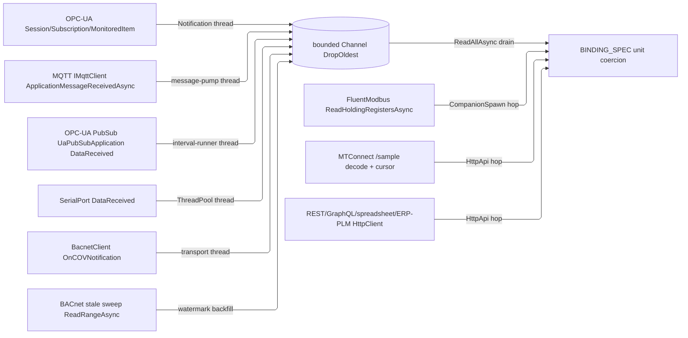
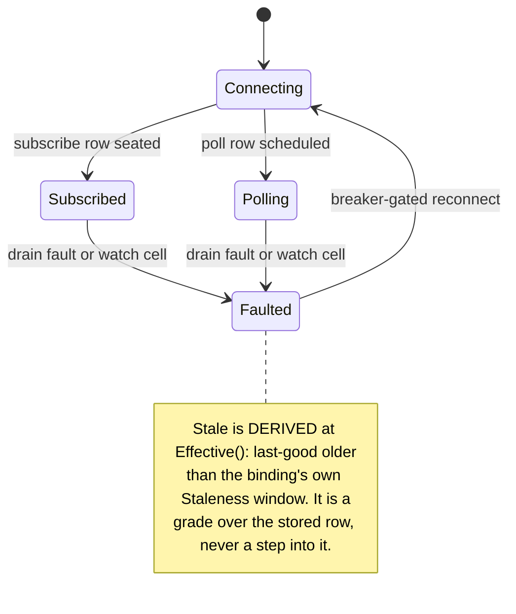

# [APPHOST_LIVE_WIRE]

Rasm.AppHost owns one reactive bidirectional binding studio: industrial transport rows carry OPC-UA, OPC-UA PubSub, Modbus, MQTT, serial, BACnet, MTConnect, REST, GraphQL, spreadsheet, and ERP/PLM through one read/write contract. Binding specs pair external sources with directed internal targets, inbound values coerce through the Compute unit algebra, write-back commits or rolls back with evidence, and binding health tracks connection state.

Settled composition: `Quality`, `Symbol`, `CapabilitySet<TCapability>`, `ICapability<TSelf>`, and `CapabilityLaw<TCapability>` arrive from `Rasm/Domain/validation`; `Transition<TState>` and `Cell.Seat`/`Step`/`Take` from `Rasm/Domain/rails#TRANSITION`; `Retriability`, `RedrivePolicy`, and `Verdict` from `Rasm/Domain/rails#REDRIVE`; `FaultBand.LiveWire` from `Rasm/Domain/rails#FAULT_BAND`; `CanonicalWriter`/`ContentHash` from `Rasm/Domain/identity#CONTENT_KEY`; `ReceiptSinkPort` and `TenantContext` from `Rasm/Domain/frame`.

In-folder: `ClockPolicy`, `DeadlineClass`, `ScheduleEntry`, and `OccurrenceSpec` from Runtime/time; `ReceiptKind` from Observability/instruments#RECEIPT_PROJECTION; `OutboundHop`, `HopOutcome`, and `OutboundSurface.Carry` from Wire/outbound; `DrainSpec`/`DrainQueue` from Runtime/resources#DRAIN_QUEUES; `TraceContext`/`TenantAdoption` and `Correlation` from Observability/telemetry.

This page owns the transport axis, binding direction, edge coercion, write transaction, and health lifecycle, and it mints no eighth port. Every live-wire schedule entry and every un-hopped foreign await takes `DeadlineClass.HopAttempt`, so no transport row carries a deadline column of its own.

## [01]-[INDEX]

- [02]-[TRANSPORT_AXIS]: Eleven behaviour-carrying transport rows — read, write, open, entries, and watch as row columns.
- [03]-[LANE_SUBSTRATE]: Protocol-agnostic lane — held-client family, bounded queue, seat-and-take client cell.
- [04]-[STREAMING_CLIENTS]: OPC-UA, PubSub, MQTT, serial, and BACnet openers with their held seats.
- [05]-[REQUEST_CLIENTS]: HTTP, Modbus, and MTConnect request bodies with the Modbus address-space algebra.
- [06]-[MACHINE_LANE]: Machine-observation decode and receipt fan the Fabrication consumers read.
- [07]-[BINDING_SPEC]: Source-target binding, protocol admission, direction, edge unit coercion, and poll/subscribe cadence.
- [08]-[WRITE_BACK]: Outbound write-back transaction, acknowledgement, refusal, and rollback.
- [09]-[BINDING_HEALTH]: Per-binding connect/subscribe/stale/fault lifecycle and health contribution.
- [10]-[TS_PROJECTION]: Generated binding-status, coercion, and write-receipt producers plus host-local observation projection.

## [02]-[TRANSPORT_AXIS]

- Owner: `ExternalTransport` `[SmartEnum<Host.ExternalTransport>]` the eleven-row axis carrying every per-transport BEHAVIOUR as a column — `Read`, `Write`, `Entries` as `[UseDelegateFromConstructor]` partials, `Open` as the `Option`-shaped opener whose presence IS the read shape, and `Watch` derived off the row's own fault surface; `TransportRow` the per-transport POLICY the axis names; `WireProtocol` `[SmartEnum<string>]` the PubSub message mapping carrying its own transport-profile URI; `EchoClass` `[SmartEnum<Host.EchoClass>]` the echo capability each row DECLARES and `EchoDiscriminator` `[Union]` the payload a write RETAINED, joined through the `IEchoProof<TSelf>` type-space column; `FaultSurface` `[SmartEnum<string>]` the out-of-band surface the composition subscribes; `WireFault` `[Union]` the fault family riding the kernel `[FaultCase]`/`Fault` floor (`[FaultCase]` realizes the registry over `FaultBand.LiveWire`) and its retry posture through kernel `Retriability`; `ExternalValue` the at-edge value carrier; `WireReason` the admitted `Symbol` roster every `Quality` refusal names.
- Cases: opc-ua, opc-ua-pubsub, modbus, mqtt, serial, bacnet, mtconnect, rest, graphql, spreadsheet, erp-plm — each carrying its read body, its write body or the absent arm that IS its refusal, its opener or none, its transport-owned schedule entries, the hop class its bytes ride, the protocol mappings it ADMITS, the echo class its protocol publishes, and the surface its out-of-band faults reach; opc-ua-pubsub is the broadcast edge dialing a broker or a UDP multicast group rather than the server's `opc.tcp` endpoint, bacnet the building-management edge (COV-subscribed metered points, confirmed-request write) and mtconnect the machine-tool observation edge (the `-Common` model slice over the row's HTTP hop, read-only); `WireProtocol` = None | MqttJson | MqttUadp | UdpUadp, the ten point-to-point rows admitting `{None}` alone and opc-ua-pubsub admitting the three real mappings; `EchoClass` = absent | stamped | tokened | slotted and `EchoDiscriminator` = Absent | Stamped | Tokened | Slotted its measured counterpart; `FaultSurface` = keep-alive | connection | disconnect | confirmed, absence being the row's `None`; `WireFault` = ConnectRejected | ReadFailed | WriteRejected | WriteFailed | ProtocolRefused | UnitRejected | StaleSource | TransportFaulted | TransportRefused; `Quality` = Good | Uncertain(Symbol) | Bad(Symbol), the kernel verdict every protocol boundary mints from the status it holds.
- Entry: `row.Read(runtime, spec, token)` returns `IO<ExternalValue>`, `row.Write(runtime, spec, value)` returns `IO<EchoDiscriminator>`, `row.Entries(runtime, handle)` returns `Seq<ScheduleEntry>`, `row.Open` answers the opener the activation fold runs, and `row.Watch(runtime, spec)` returns `Option<WireFault>` — five columns on ONE roster, so the axis owns both the row shape and its dispatch and no adapter table stands beside it.
- Auto: a row seating an opener is subscribe-shaped and one answering `None` is poll-shaped, so `ReadShape` DERIVES off the opener column and the two can never disagree; the transport bytes ride the existing `OutboundHop` cases — REST, GraphQL, spreadsheet, ERP/PLM, and MTConnect on `HttpApi`, MQTT, OPC-UA, and OPC-UA PubSub on a keyed `ServerStream` pipeline, serial and Modbus on the `CompanionSpawn` process-spawn adapter where the FluentModbus/`SerialPort` client owns the line inside the companion — so the resilience, retry, and breaker semantics are the existing hop policy, never a per-transport retry loop; the `Write` column's absent arm gates the write-back so a read-only source (a spreadsheet view, a PubSub subscriber) rejects at the row and admission reads the same column, never at the transaction; the `Protocols` column gates admission so a binding selecting a mapping its edge cannot carry refuses at `Bind` with the axis named; every `WireFault` case answers kernel `Retriability` so the four protocol legs classify a code and decide nothing.
- Receipt: `ExternalValue` carries the reading where one exists, its declared unit, the kernel `Quality` its source stated, the source timestamp, the echo payload the protocol published, and the binding's admitted tenancy; a write answers the payload it minted, so both ends of a suppression comparison exist as evidence.
- Packages: OPCFoundation.NetStandard.Opc.Ua, OPCFoundation.NetStandard.Opc.Ua.PubSub, MQTTnet, FluentModbus, System.IO.Ports, BACnet, MTConnect.NET-Common, Thinktecture.Runtime.Extensions, LanguageExt.Core, NodaTime, BCL inbox
- Growth: one transport row absorbs a new industrial edge — a new fieldbus or ERP connector is one `ExternalTransport` row carrying its five behaviour columns and its policy, never a parallel adapter; a new echo proof is one `EchoClass` row and its `EchoDiscriminator` arm implementing `IEchoProof<TSelf>`, breaking the class projection and the arm's own static column until the pair lands; a new PubSub mapping is one `WireProtocol` row carrying its profile URI; a new fault is one `WireFault` case with the `Retriability` it overrides; zero new surface.
- Boundary: no transport-neutral echo token exists — three writable protocols publish a proof and each publishes a DIFFERENT one, so the axis splits the DECLARATION from the MEASUREMENT: the row's `EchoClass` column is valueless because a frozen row is written before any write runs, so a payload seated there is invented, and an epoch instant, a zero slot, or an empty key seated there reads identical to a measured proof at the comparison; the two ends join through `IEchoProof<TSelf>`, so a fifth proof breaks the arm that omits its class and the class projection that omits its arm; `Absent` is a real row and the suppression fold reads it FIRST, so a modbus, serial, or HTTP binding never reaches a payload comparison and reads its own write-back like any other value rather than under a heuristic time window; `MqttLane.Subscribe`'s `noLocal: true` filter is protocol-level echo suppression already enforced at the broker for a same-connection publish, and `Tokened` covers the cross-client case that flag cannot reach.
- Boundary: quality is a three-state MEASUREMENT and never a bit — OPC-UA hands a `StatusCode` with its own good/uncertain/bad partition, PubSub a decode reason beside a field status, BACnet a status-flag word carrying fault and overridden, MTConnect an availability flag beside its own `Quality` enum, and a parse hands absence — so each boundary mints the kernel arm it holds and the reading rides `Option<double>` where `Bad` carries none; the `IfNone(0d)` fill beside a false flag is the `docs/laws/scars.md` `[FORGED_ZERO]` form, and the mint is the only constructor so no consumer can build a good value carrying no reading or a bad one carrying a number the source disowned; `Uncertain` COERCES because a source flagging its own reading doubtful still measured it, and its symbol rides the receipt — refusing it drops every BACnet point reporting through a fault and every MTConnect observation the agent left unverified.
- Boundary: protocol selection splits the same way — the row ADMITS a set and the binding SELECTS one member, because the edge's capability is frozen at the row while one PubSub deployment picks its mapping per connection, so a single-valued column pinned on every row decides nothing and a selection seated on the row cannot express two connections against one edge; refusal at admission carries the axis name under `libs/.planning/ARCHITECTURE.md` `[10]-[CONSUMPTION_MODEL]`, so an unserved mapping never degrades to a neighbouring one; each `WireProtocol` row reads its profile URI off `Opc.Ua.Profiles` rather than spelling the string, and `WireProtocol.None` carries no URI at all because a point-to-point edge has no PubSub transport facet.
- Boundary: a frozen row carries no endpoint — `Hop` is a `Func<LiveWireRuntime, BindingSpec, OutboundHop>` reading the binding's own external address and the composition's own companion spec, so the eleven `localhost` URI literals and the two `ProcessStartInfo` mints that sat inside `static readonly` rows leave the axis entirely and `ARCHITECTURE.md` `[05]-[BOUNDARIES]`'s composition-root-pin clause holds at every row; the transport axis is the only external-binding owner — a per-protocol client, a protocol-specific binding service, and a parallel poller are the deleted forms, so all eleven transports ride one adapter contract; the OPC-UA legs compose the OPC-Foundation-certified session/subscription/monitored-item surface and the `.PubSub` application, the MQTT leg composes `MQTTnet`, and the REST/GraphQL legs compose the existing `OutboundHop.HttpApi` — a hand-rolled OPC-UA or MQTT client is the deleted form; the transport never owns its own resilience — it composes the `OutboundHop` row its bytes ride, so a flapping Modbus source breaks on the same circuit breaker an HTTP API breaks on; the at-edge value carries its declared unit so the coercion at `BINDING_SPEC` reads a known unit, never a guessed one; spreadsheet and ERP/PLM transports that have no native streaming poll on the schedule cadence, so the cadence is the row's read mechanism, not a transport quirk.

```csharp signature
using Host = Rasm.Contracts.Binding.V1;

// --- [TYPES] --------------------------------------------------------------------------------
[SmartEnum<string>]
[KeyMemberEqualityComparer<ComparerAccessors.StringOrdinal, string>]
[KeyMemberComparer<ComparerAccessors.StringOrdinal, string>]
public sealed partial class ReadShape {
    public static readonly ReadShape Poll = new("poll");
    public static readonly ReadShape Subscribe = new("subscribe");
}

[SmartEnum<string>]
[KeyMemberEqualityComparer<ComparerAccessors.StringOrdinal, string>]
[KeyMemberComparer<ComparerAccessors.StringOrdinal, string>]
public sealed partial class WireProtocol {
    public static readonly WireProtocol None = new("none", Option<string>.None);
    public static readonly WireProtocol MqttJson = new("mqtt-json", Some(Profiles.PubSubMqttJsonTransport));
    public static readonly WireProtocol MqttUadp = new("mqtt-uadp", Some(Profiles.PubSubMqttUadpTransport));
    public static readonly WireProtocol UdpUadp = new("udp-uadp", Some(Profiles.PubSubUdpUadpTransport));

    public Option<string> ProfileUri { get; }
}

[SmartEnum<Host.EchoClass>]
public sealed partial class EchoClass {
    public static readonly EchoClass Absent = new(Host.EchoClass.Absent);
    public static readonly EchoClass Stamped = new(Host.EchoClass.Stamped);
    public static readonly EchoClass Tokened = new(Host.EchoClass.Tokened);
    public static readonly EchoClass Slotted = new(Host.EchoClass.Slotted);
}

// Serial names no row: SerialPort.ErrorReceived is declared on every runtime yet raised on none but win, so
// a cell fed from that event would never move on this host.
[SmartEnum<string>]
[KeyMemberEqualityComparer<ComparerAccessors.StringOrdinal, string>]
[KeyMemberComparer<ComparerAccessors.StringOrdinal, string>]
public sealed partial class FaultSurface {
    public static readonly FaultSurface KeepAlive = new("keep-alive");
    public static readonly FaultSurface Connection = new("connection");
    public static readonly FaultSurface Disconnect = new("disconnect");
    public static readonly FaultSurface Confirmed = new("confirmed");
}

public interface IEchoProof<TSelf> where TSelf : EchoDiscriminator, IEchoProof<TSelf> {
    static abstract EchoClass Class { get; }
}

// --- [CONSTANTS] ----------------------------------------------------------------------------
public static class WireReason {
    public static readonly Symbol Unparsed = Symbol.Create("unparsed");
    public static readonly Symbol Unreadable = Symbol.Create("unreadable");
    public static readonly Symbol StatusBad = Symbol.Create("status-bad");
    public static readonly Symbol StatusUncertain = Symbol.Create("status-uncertain");
    public static readonly Symbol SchemaMoved = Symbol.Create("schema-moved");
    public static readonly Symbol PointFaulted = Symbol.Create("point-faulted");
    public static readonly Symbol PointOverridden = Symbol.Create("point-overridden");
    public static readonly Symbol Unavailable = Symbol.Create("unavailable");
    public static readonly Symbol Unverifiable = Symbol.Create("unverifiable");
    public static readonly Symbol ReadRefused = Symbol.Create("read-refused");

    // Falls to the roster row only when the package hands back nothing nameable.
    public static Symbol Named(string text, Symbol fallback) =>
        Symbol.Validate(text, out Symbol? row) is null && row is { } named ? named : fallback;
}

// --- [ERRORS] ---------------------------------------------------------------------------
// Retriability stays the family's own retry posture.
[Union(ConversionFromValue = ConversionOperatorsGeneration.None)]
public abstract partial record WireFault : Fault {
    private static readonly FaultBand FamilyBand = FaultBand.LiveWire;
    private WireFault(string detail) => Detail = detail;
    public string Detail { get; }
    public sealed override string Message => Detail;

    [FaultCase(0)]
    public sealed partial record ConnectRejected : WireFault {
        public ConnectRejected(string detail) : base(detail) { }
        public override Retriability Retriability => Retriability.Transient;
    }
    [FaultCase(1)]
    public sealed partial record ReadFailed : WireFault {
        public ReadFailed(string detail) : base(detail) { }
        public override Retriability Retriability => Retriability.Transient;
    }
    // WriteRejected is a DEFINITE refusal — a device, broker, or row that declined and changed nothing, so the
    // write-back reports it and never compensates. WriteFailed is the ambiguous half: a timeout, a dropped
    // connection, a framing fault, where remote application can be neither proved nor disproved, so it is the
    // only arm that reaches the compensating write.
    [FaultCase(2)]
    public sealed partial record WriteRejected : WireFault { public WriteRejected(string detail) : base(detail) { } }
    [FaultCase(3)]
    public sealed partial record WriteFailed : WireFault {
        public WriteFailed(string detail) : base(detail) { }
        public override Retriability Retriability => Retriability.Transient;
    }
    [FaultCase(4)]
    public sealed partial record ProtocolRefused : WireFault { public ProtocolRefused(string detail) : base(detail) { } }
    [FaultCase(5)]
    public sealed partial record UnitRejected : WireFault { public UnitRejected(string detail) : base(detail) { } }
    [FaultCase(6)]
    public sealed partial record StaleSource : WireFault {
        public StaleSource(string detail) : base(detail) { }
        public override Retriability Retriability => Retriability.Transient;
    }
    // Provider throws retain the exact exceptional Error. Faulted means remote application is ambiguous and
    // therefore transient; Refused means the provider supplied a definite protocol decline and is terminal.
    [FaultCase(7)]
    public sealed partial record TransportFaulted(ExternalTransport Transport, Error Cause)
        : WireFault($"{Transport.Key}: {Cause.Message}"), ICausedFault {
        public override Retriability Retriability => Retriability.Transient;
    }
    [FaultCase(8)]
    public sealed partial record TransportRefused(ExternalTransport Transport, Error Cause)
        : WireFault($"{Transport.Key}: {Cause.Message}"), ICausedFault;

    // Compensation is about remote application, not retriability: only an in-flight write failure can have
    // changed the device without proving it. The generated switch makes a new case declare that posture.
    public bool WriteApplicationAmbiguous => Switch(
        connectRejected: static _ => false,
        readFailed: static _ => false,
        writeRejected: static _ => false,
        writeFailed: static _ => true,
        protocolRefused: static _ => false,
        unitRejected: static _ => false,
        staleSource: static _ => false,
        transportFaulted: static _ => true,
        transportRefused: static _ => false);
}

// --- [MODELS] -------------------------------------------------------------------------------
[Union(ConversionFromValue = ConversionOperatorsGeneration.None)]
public abstract partial record EchoDiscriminator {
    private EchoDiscriminator() { }

    // Named canonical absence, spelled Unproven rather than None because LanguageExt's bare None is in scope
    // across this whole file for Option construction and a shadowing member turns every such call site into a
    // resolution puzzle.
    public static readonly EchoDiscriminator Unproven = new Absent();

    public sealed record Absent : EchoDiscriminator, IEchoProof<Absent> {
        public static EchoClass Class => EchoClass.Absent;
    }
    public sealed record Stamped(Instant SourceAt, uint ClientHandle) : EchoDiscriminator, IEchoProof<Stamped> {
        public static EchoClass Class => EchoClass.Stamped;
    }
    [Equatable]
    public sealed partial record Tokened([property: OrderedEquality] ReadOnlyMemory<byte> Correlation)
        : EchoDiscriminator, IEchoProof<Tokened> {
        public static EchoClass Class => EchoClass.Tokened;
    }
    public sealed record Slotted(byte Priority) : EchoDiscriminator, IEchoProof<Slotted> {
        public static EchoClass Class => EchoClass.Slotted;
    }

    public EchoClass Class => Switch(
        absent: static _ => Absent.Class,
        stamped: static _ => Stamped.Class,
        tokened: static _ => Tokened.Class,
        slotted: static _ => Slotted.Class);

    // Payload equality is the generated member-level compare, so the byte arm needs no hand SequenceEqual.
    public bool Echoes(EchoDiscriminator acknowledged) =>
        Class == acknowledged.Class && this is not Absent && Equals(acknowledged);
}

public sealed record ExternalValue {
    private ExternalValue(Option<double> reading, string unit, Quality quality, Instant sourceAt, EchoDiscriminator echo, TenantContext tenant) =>
        (Reading, Unit, Quality, SourceAt, Echo, Tenant) = (reading, unit, quality, sourceAt, echo, tenant);

    public Option<double> Reading { get; }
    public string Unit { get; }
    public Quality Quality { get; }
    public Instant SourceAt { get; }
    public EchoDiscriminator Echo { get; }
    public TenantContext Tenant { get; }

    public static ExternalValue Parsed(Option<double> reading, BindingSpec spec, Instant sourceAt, Symbol absent, EchoDiscriminator echo, Option<string> unit = default) =>
        reading.Match(
            Some: value => Graded(value, Quality.Good, spec, sourceAt, echo, unit),
            None: () => new(None, unit.IfNone(spec.Family.Canonical.ToString()), new Quality.Bad(absent), sourceAt, echo, spec.Tenant));

    // Bad DROPS the reading at the mint, so the coercion never sees a number its own source disowned.
    public static ExternalValue Graded(double reading, Quality quality, BindingSpec spec, Instant sourceAt, EchoDiscriminator echo, Option<string> unit = default) =>
        new(quality is Quality.Bad ? None : Some(reading), unit.IfNone(spec.Family.Canonical.ToString()), quality, sourceAt, echo, spec.Tenant);

    public Symbol Reason => Quality.Switch(
        good: static _ => WireReason.Unreadable,
        uncertain: static row => row.Reason,
        bad: static row => row.Reason);
}

// --- [TABLES] -------------------------------------------------------------------------------
public sealed record TransportRow(
    Func<LiveWireRuntime, BindingSpec, OutboundHop> Hop,
    Seq<WireProtocol> Protocols,
    EchoClass Echo,
    Option<FaultSurface> Fault);

// NAMED LOSS on the five collapsed dispatch tables: the arm names read as an inventory of what each transport
// does; the roster is that inventory now, policy and behaviour on the same line.
[SmartEnum<Host.ExternalTransport>]
public sealed partial class ExternalTransport {
    public delegate IO<SubscriptionLane> Opener(LiveWireRuntime runtime, BindingSpec spec);
    public delegate IO<EchoDiscriminator> Writer(LiveWireRuntime runtime, BindingSpec spec, ExternalValue value);

    public static readonly ExternalTransport OpcUa = new(Host.ExternalTransport.OpcUa,
        new TransportRow(Stream, Seq(WireProtocol.None), EchoClass.Stamped, Some(FaultSurface.KeepAlive)),
        Some<Writer>(OpcUaLane.Write), Some<Opener>(OpcUaLane.Subscribe), Drained, NoEntries);
    // Bytes ride a broker dial or a UDP multicast group, never the server's opc.tcp endpoint. The writer is
    // absent because the lane declares no write member at all: a PubSub subscriber consumes a publisher's fan.
    public static readonly ExternalTransport OpcUaPubSub = new(Host.ExternalTransport.OpcUaPubsub,
        new TransportRow(Stream, Seq(WireProtocol.MqttJson, WireProtocol.MqttUadp, WireProtocol.UdpUadp), EchoClass.Absent, Some(FaultSurface.Connection)),
        None, Some<Opener>(PubSubLane.Subscribe), Drained, NoEntries);
    public static readonly ExternalTransport Modbus = new(Host.ExternalTransport.Modbus,
        new TransportRow(Companion, Seq(WireProtocol.None), EchoClass.Absent, None),
        Some<Writer>(ModbusLane.Write), None, ModbusLane.Read, NoEntries);
    public static readonly ExternalTransport Mqtt = new(Host.ExternalTransport.Mqtt,
        new TransportRow(Stream, Seq(WireProtocol.None), EchoClass.Tokened, Some(FaultSurface.Disconnect)),
        Some<Writer>(MqttLane.Write), Some<Opener>(MqttLane.Subscribe), Drained, NoEntries);
    // Serial reads through DataReceived, so the row seats an opener and mints no poll entry: the framed line
    // arrives on the same bounded lane every subscribe transport writes into.
    public static readonly ExternalTransport Serial = new(Host.ExternalTransport.Serial,
        new TransportRow(Companion, Seq(WireProtocol.None), EchoClass.Absent, None),
        Some<Writer>(SerialLane.Write), Some<Opener>(SerialLane.Attach), Drained, NoEntries);
    // BACnet is the one row owning schedule entries: a BBMD renewal and a stale-COV sweep, both under scope.
    public static readonly ExternalTransport Bacnet = new(Host.ExternalTransport.Bacnet,
        new TransportRow(Stream, Seq(WireProtocol.None), EchoClass.Slotted, Some(FaultSurface.Confirmed)),
        Some<Writer>(BacnetLane.Write), Some<Opener>(BacnetLane.Subscribe), Drained, BacnetLane.Entries);
    public static readonly ExternalTransport Mtconnect = new(Host.ExternalTransport.Mtconnect,
        new TransportRow(Http, Seq(WireProtocol.None), EchoClass.Absent, None),
        None, None, MtconnectLane.Read, NoEntries);
    public static readonly ExternalTransport Rest = new(Host.ExternalTransport.Rest,
        new TransportRow(Http, Seq(WireProtocol.None), EchoClass.Absent, None),
        Some<Writer>(HttpPoll.Write), None, HttpPoll.Read, NoEntries);
    public static readonly ExternalTransport GraphQl = new(Host.ExternalTransport.Graphql,
        new TransportRow(Http, Seq(WireProtocol.None), EchoClass.Absent, None),
        Some<Writer>(HttpPoll.Write), None, HttpPoll.Read, NoEntries);
    public static readonly ExternalTransport Spreadsheet = new(Host.ExternalTransport.Spreadsheet,
        new TransportRow(Http, Seq(WireProtocol.None), EchoClass.Absent, None),
        None, None, HttpPoll.Read, NoEntries);
    public static readonly ExternalTransport ErpPlm = new(Host.ExternalTransport.ErpPlm,
        new TransportRow(Http, Seq(WireProtocol.None), EchoClass.Absent, None),
        Some<Writer>(HttpPoll.Write), None, HttpPoll.Read, NoEntries);

    public TransportRow Row { get; }

    public Option<Writer> Writer { get; }
    public Option<Opener> Open { get; }

    [UseDelegateFromConstructor]
    public partial IO<ExternalValue> Read(LiveWireRuntime runtime, BindingSpec spec, CancellationToken token);

    // Schedule entries a TRANSPORT owns. Only BACnet carries any, and a renewal factory invoked on every row
    // would arm a BBMD registration against an MQTT binding id and read a client that binding never seated.
    [UseDelegateFromConstructor]
    public partial Seq<ScheduleEntry> Entries(LiveWireRuntime runtime, BindingHandle handle);

    public ReadShape ReadShape => Open.IsSome ? ReadShape.Subscribe : ReadShape.Poll;
    public bool Writable => Writer.IsSome;

    public IO<EchoDiscriminator> Write(LiveWireRuntime runtime, BindingSpec spec, ExternalValue value) =>
        Writer.Match(
            Some: body => body(runtime, spec, value),
            None: () => IO.fail<EchoDiscriminator>(new WireFault.WriteRejected($"read-only-row:{Key}:{spec.ExternalAddress}")));

    public Option<WireFault> Watch(LiveWireRuntime runtime, BindingSpec spec) =>
        Row.Fault.Bind(_ => runtime.Watch(spec.BindingId));

    static IO<ExternalValue> Drained(LiveWireRuntime runtime, BindingSpec spec, CancellationToken token) =>
        SubscriptionLane.Drain(runtime.Lane(spec.BindingId), token);

    static Seq<ScheduleEntry> NoEntries(LiveWireRuntime runtime, BindingHandle handle) => Seq<ScheduleEntry>.Empty;

    static OutboundHop Http(LiveWireRuntime runtime, BindingSpec spec) => new OutboundHop.HttpApi(new Uri(spec.ExternalAddress));
    static OutboundHop Stream(LiveWireRuntime runtime, BindingSpec spec) => new OutboundHop.ServerStream(new Uri(spec.ExternalAddress));
    static OutboundHop Companion(LiveWireRuntime runtime, BindingSpec spec) => new OutboundHop.CompanionSpawn(runtime.Companion(spec.Transport));
}
```

## [03]-[LANE_SUBSTRATE]

- Owner: `SubscriptionLane` the ONE lane record — the `Runtime/resources#DRAIN_QUEUES` `DrainQueue<ExternalValue>.Pipe` the foreign callback writes and the reactive read drains, the writer proved off its `Pipe` arm exactly once at `Open`, its detach rail, and the client it opened — with `Open`/`Drain`/`Submit` its own statics; `LiveClient` `[Union]` the held-connection family, one arm per subscribe row; `TransportSeat` `[Union]` the composition-supplied per-protocol configuration, factory, and seat state the runtime holds in ONE keyed column.
- Cases: `LiveClient` = Opc | Mqtt | Serial | PubSub | Bacnet — `Opc` carries the session/subscription/item triple, `PubSub` the process-held application beside this binding's reader id, and a poll transport holds no arm because its client carries no per-binding state between frames; `TransportSeat` = Opc | Mqtt | Modbus | Serial | PubSub | Bacnet | Mtconnect, one arm per protocol whose composition seats a held handle or a factory.
- Entry: `SubscriptionLane.Open(runtime, spec, detach, client)` returns `IO<SubscriptionLane>` — the drain-owned queue with its mandatory drop receipt; `SubscriptionLane.Drain(lane, token)` returns `IO<ExternalValue>` — the one reactive read; `SubscriptionLane.Submit(sink, value)` is the ONE submission point every foreign callback on the page reaches; `runtime.Seat<TSeat>(transport)` returns `Fin<TSeat>` — the one narrowing every lane runs at its entry; `runtime.Client(bindingId)` returns `Fin<LiveClient>` — the seated client every write and every teardown resolves through.
- Auto: the client cell lives on the BINDING HANDLE rather than on a lane instance, so `Cell.Seat` answers `Committed` to the opener that landed the client and `Ceded` to a second opener racing a reconnect — the verdict a three-arm gate union declared and never constructed — and `Cell.Take` drains that cell at teardown so the closure disposing what it drained holds it and a second teardown drains `None` and disposes nothing; the drop receipt fans under `ReceiptKind.WireRejection` carrying the binding's own admitted tenancy and structured fault observation, so a lane's loss is counted against the tenant that owns it.
- Receipt: every dropped value fans one wire receipt naming the binding and the dropped value's own source instant, so the drain owner's `DropOldest` policy is accounted rather than silent.
- Packages: LanguageExt.Core, Thinktecture.Runtime.Extensions, NodaTime, BCL `System.Threading.Channels`
- Growth: a new subscribe transport is one `LiveClient` arm, one `TransportSeat` arm, and one opener on its `ExternalTransport` row; the lane shape absorbs it with no branch.
- Boundary: the foreign OPC-UA monitored-item thread, the MQTT message-pump thread, the serial `DataReceived` `ThreadPool` thread, the BACnet transport thread, and the PubSub interval-runner thread never run the interior — each callback projects its raw value into `ExternalValue` and `Submit`s into the ONE `DrainSpec.WireInbound` lane opened through `DrainSurface.Open`, so the lane's `DropOldest` back-pressure, its `DrainBand` completion, and its mandatory `onDrop` receipt delegate are the drain owner's declared policy — a bespoke `Channel.CreateBounded` beside that owner is the deleted form and an unreceipted-loss row refuses at `Open` on the `Fin` rail (`docs/stacks/csharp/boundaries#SUBSCRIPTION_VALUE`/`#HANDOFF_DRAIN`), and a callback writing its channel writer directly rather than through `Submit` is the second deleted form because the lane's single submission point is what makes that policy total.
- Boundary: tenancy is ADMITTED at the binding and RIDES the value — no industrial protocol carries this estate's tenancy, so `TenantAdoption.Refused` is the standing trust class for every row and the binding's own declared tenant is the authority; the deleted form is an ambient `TenantContext.Current` read on the drain fork, which resolves to root for a value the MQTT receive pump already refused a tenant for, so every receipt and every RLS predicate downstream disagreed with the callback that admitted it.
- Boundary: one seat column keyed by transport replaces seven positional runtime columns, so a runtime record does not grow a column per protocol and a lane narrows at its own entry through `Seat<TSeat>` — NAMED LOSS: the per-protocol seat type is no longer statically reachable off the runtime, and the union arm buys it back — each seat stays a distinct closed shape — with one narrowing whose failure is a real composition fault the `Fin` rail names, the shape every lane already runs against `LiveClient`.
- Boundary: the held session triple, MQTT client, serial port, BACnet client, and PubSub reader id live in the handle's own client cell (`docs/stacks/csharp/boundaries#TOKEN_LIFECYCLE`), so every lane member resolves its client through `runtime.Client` and a write against a torn-down binding refuses on the cell rather than dialling a disposed handle — a parallel per-protocol accessor beside that cell is the deleted form, and the take-and-clear teardown retires the incarnation-token compare a reconnect raced against.

```csharp signature
// --- [TYPES] --------------------------------------------------------------------------------
// Poll transports are absent by construction: a register read and an HTTP GET carry no per-binding state
// between frames, so seating them here mints a cell nothing gates and nothing tears down.
[Union(ConversionFromValue = ConversionOperatorsGeneration.None)]
public abstract partial record LiveClient {
    private LiveClient() { }
    public sealed record Opc(OpcUaBinding Binding) : LiveClient;
    public sealed record Mqtt(IMqttClient Client) : LiveClient;
    public sealed record Serial(SerialPort Port) : LiveClient;
    // Application is NON-OWNING: one instance serves every PubSub binding in the process, so this arm
    // carries the reader-config id its own teardown removes and never the Stop() that would darken every sibling.
    public sealed record PubSub(UaPubSubApplication Application, uint Reader) : LiveClient;
    public sealed record Bacnet(BacnetClient Client) : LiveClient;
}

// --- [MODELS] -------------------------------------------------------------------------------
// Session, subscription, and item travel as ONE triple because the write needs the item's ClientHandle to scope
// its echo and the teardown needs all three: a runtime accessor answering the session alone leaves the handle
// unreachable and the Stamped arm unbuildable.
public sealed record OpcUaBinding(Session Session, Subscription Subscription, MonitoredItem Item);

// Every arm's Func column is a per-call effect the composition owns — a session mint, a client factory, a
// configurator fold — never a typed port this page could have taken instead.
[Union(ConversionFromValue = ConversionOperatorsGeneration.None)]
public abstract partial record TransportSeat {
    private TransportSeat() { }

    public sealed record Opc(
        ApplicationConfiguration Configuration,
        ReverseConnectManager ReverseConnect,
        ITelemetryContext Telemetry,
        IUserIdentity Identity,
        IList<string> Locales,
        uint SessionTimeout,
        int PublishingInterval,
        uint KeepAliveCount,
        uint LifetimeCount,
        SamplePolicy Sampling,
        Func<string, ConfiguredEndpoint> Endpoint) : TransportSeat;

    // Two CONDITIONAL corners a flat legal-corner list cannot state, each refusing at the mint after the column
    // that discriminates it is set. Clean start discards exactly the session a non-zero expiry preserves.
    // ExactlyOnce promises the APPLICATION one delivery, and this lane cannot keep that promise: the receive
    // callback settles on ADMISSION — MQTTnet's `AutoAcknowledge` acks before the handler's outcome is known —
    // while the lane's own `DropOldest` bound may discard an admitted value, so a QoS 2 binding would advertise
    // exactly-once and deliver at-most-once. AtLeastOnce is served honestly: every delivery acks once, none
    // redelivers, and every discard receipts. Corners ride a ROSTER so a third lands as one row.
    public sealed record Mqtt(
        MqttClientFactory Factory,
        Duration KeepAlive,
        uint SessionExpiry,
        MqttQualityOfServiceLevel Qos,
        CapabilitySet<MqttOption> Options) : TransportSeat {
        public static Fin<Mqtt> Of(MqttClientFactory factory, Duration keepAlive, uint sessionExpiry, MqttQualityOfServiceLevel qos, CapabilitySet<MqttOption> options) =>
            Seq((Broken: options.Admits(MqttOption.CleanStart) && sessionExpiry > 0,
                 Detail: $"mqtt-clean-start-expiry:{sessionExpiry}"),
                (Broken: qos == MqttQualityOfServiceLevel.ExactlyOnce,
                 Detail: $"mqtt-exactly-once-over-dropping-lane:{qos}"))
                .Find(static corner => corner.Broken)
                .Match(
                    Some: corner => Fin.Fail<Mqtt>(new WireFault.ProtocolRefused(corner.Detail)),
                    None: () => Fin.Succ(new Mqtt(factory, keepAlive, sessionExpiry, qos, options)));
    }

    public sealed record Modbus(Func<string, ModbusClient> Held) : TransportSeat;

    // Open is the ONE port seat per binding: the lane never constructs a port, so the MS/TP master a BACnet
    // binding may drive and the serial row can never hold two handles on one physical line.
    public sealed record Serial(Func<string, SerialFraming, SerialPort> Open) : TransportSeat;

    // Held answers the ONE process application. UaPubSubApplication has no public constructor and five Create
    // factories, and its Start/Stop are void signalling nothing, so per-binding creation would mint one runner
    // thread set per binding and per-binding Stop would darken every sibling riding the same instance.
    public sealed record PubSub(
        ITelemetryContext Telemetry,
        IUaPubSubDataStore DataStore,
        Func<UaPubSubApplication> Held,
        Func<UaPubSubApplication, BindingSpec, WireProtocol, Fin<uint>> Configure,
        Func<UaPubSubApplication, uint, Fin<Unit>> Remove) : TransportSeat;

    // Open supplies the whole transport chain: BacnetIpUdpProtocolTransport for BACnet/IP, or
    // BacnetMstpProtocolTransport over the composition's own IBacnetSerialTransport for a bus-attached
    // controller under the same SerialFraming the serial row configures. That line's contract is the MS/TP
    // master's: one dedicated Highest-priority thread calls every member synchronously, Read answers negative
    // ETIMEDOUT for a benign OR dead line, nothing catches around Read/Write so a thrown fault ends MS/TP
    // permanently, and partial returns are legal — so the line the composition hands in owes a total, non-
    // throwing implementation and this page holds none of its own.
    public sealed record Bacnet(
        Func<string, BacnetClient> Open,
        Func<string, BacnetAddress> Address,
        Func<BacnetClient, BacnetAddress, BacnetPoint, ChannelWriter<ExternalValue>, CancellationToken, Task> Cov,
        Func<BacnetClient, BacnetAddress, BacnetPoint, CancellationToken, Task> Unsubscribe,
        Func<string, byte> Invoke,
        Func<BacnetClient, BacnetAddress, BacnetPoint, Option<double>, byte, CancellationToken, Task> Write,
        Func<string, byte, Option<WireFault>> Fault,
        Func<string, byte[], uint, Seq<ExternalValue>> DecodeTrend,
        Option<BbmdRegistration> Bbmd,
        // COV watermark: the last instant a lane accepted a readable value, read by the scheduled stale sweep
        // to bound its ReadRangeAsync and advanced exactly as the MTConnect seat commits its LastSequence.
        Func<string, Instant> Watermark,
        Action<string, Instant> Advance,
        // Backfill page and its re-drive law are DECLARED here rather than spelled as a literal at the sweep,
        // so a device with a deep history and one with a shallow one are a composition edit, not a code edit.
        Dimension BackfillPage,
        RedrivePolicy Recovery) : TransportSeat;

    public sealed record Mtconnect(
        Func<string, MTConnectClientInformation> Cursor,
        Func<string, string, Seq<(ExternalValue Value, long Sequence, long InstanceId)>> Decode,
        Action<string, long, long> Advance) : TransportSeat;
}

// Client here is the OPENER'S PROPOSAL; the handle's cell is the authority every read resolves through, and
// they differ exactly when a reconnect ceded.
public sealed record SubscriptionLane(
    DrainQueue<ExternalValue> Queue,
    ChannelWriter<ExternalValue> Sink,
    Func<IO<Unit>> Detach,
    LiveClient Client) {
    public static IO<SubscriptionLane> Open(LiveWireRuntime runtime, BindingSpec spec, Func<IO<Unit>> detach, LiveClient client) =>
        IO.lift(() => DrainSpec.WireInbound.Open<ExternalValue>(Some<Action<ExternalValue>>(dropped =>
                ignore(WireEvidence.Rejected(runtime, spec, Correlation.Mint(), "lane-drop",
                    new WireFault.StaleSource($"{dropped.SourceAt}")).Run())))
            .Bind(queue => queue.Switch(
                pipe: q => Fin.Succ(new SubscriptionLane(queue, q.Channel.Writer, detach, client)),
                network: static n => Fin.Fail<SubscriptionLane>(new DrainFault.TopologyMismatch(n.Spec.Name, DrainKind.Pipe.Key)))))
            .Bind(static admitted => admitted.Match(Succ: IO.pure, Fail: IO.fail<SubscriptionLane>));

    public static IO<ExternalValue> Drain(SubscriptionLane lane, CancellationToken token) =>
        lane.Queue.Switch(
            state: token,
            pipe: static (t, p) => IO.liftAsync(async () => await p.Channel.Reader.ReadAsync(t).ConfigureAwait(false)),
            network: static (_, n) => IO.fail<ExternalValue>(new DrainFault.TopologyMismatch(n.Spec.Name, DrainKind.Pipe.Key)));

    public static Unit Submit(ChannelWriter<ExternalValue> sink, ExternalValue value) => ignore(sink.TryWrite(value));
}
```

## [04]-[STREAMING_CLIENTS]

- Owner: `OpcUaLane` the session/subscription/monitored-item owner whose callbacks feed one bounded lane; `MqttLane` the `IMqttClient` owner whose `ApplicationMessageReceivedAsync` callback feeds the same lane shape; `PubSubLane` the reader-group owner over the ONE process-held `UaPubSubApplication` whose `DataReceived` dataset fan feeds that same lane; `SerialLane` the `SerialPort` line-frame owner whose `DataReceived` callback feeds it and whose `WriteLine` is the inbound write; `BacnetLane` the COV-subscription owner with the scheduled stale backfill and the BBMD renewal; `MqttOption`/`LineCapability` the two capability vocabularies their seats carry; `SamplePolicy`, `SerialFraming`, `BacnetPoint`, `BbmdRegistration`, `CovService` the protocol policy each lane reads.
- Cases: five openers seat a `LiveClient` and attach one foreign callback; three of the five carry a write — OPC-UA one `WriteValue` reading its per-node `StatusCode`, MQTT one `MqttApplicationMessage` reading its PUBACK reason code, BACnet one confirmed `WritePropertyAsync` at the point's priority-array slot reading the typed verdict off the client's own service events — serial writes one `WriteLine`, and PubSub declares none; `CovService` = confirmed | unconfirmed selects the notification service the subscribe arms.
- Entry: `Subscribe`/`Attach` return `IO<SubscriptionLane>` and are the `Open` column the activation fold runs; `Write` returns `IO<EchoDiscriminator>` and is the `Writer` column; `BacnetLane.Entries` is the `Entries` column answering the renewal and the stale sweep; `BacnetLane.Recover` is the sweep's own backfill body.
- Auto: the OPC-UA leg composes the high-level managed `Opc.Ua.Client` API — `Session.CreateAsync(configuration, reverseConnectManager, endpoint, updateBeforeConnect, checkDomain, sessionName, sessionTimeout, userIdentity, preferredLocales, ct)` mints the session over the configuration-loaded endpoint, a `Subscription(telemetry)` carries `PublishingInterval`, `KeepAliveCount`, and `LifetimeCount` as policy ints read off the seat, `subscription.AddItem(new MonitoredItem(telemetry){ StartNodeId, AttributeId, MonitoringMode, SamplingInterval, QueueSize, DiscardOldest, Filter })` and `subscription.CreateAsync(ct)` arm the monitored node under the seat's whole `SamplePolicy` — `CreateAsync` runs `CreateItemsAsync`, which lands each per-item refusal on `MonitoredItem.Status.Error` and raises nothing, so the opener proves the item armed before handing a lane back — and the `monitoredItem.Notification` event hands each `MonitoredItemNotificationEventArgs.NotificationValue` cast to `MonitoredItemNotification` whose `Value` is one `DataValue` — the callback projects `DataValue.Value`/`StatusCode`/`SourceTimestamp` into `ExternalValue`, `Submit`s it into the bounded lane, and fans the `StatusCode.Overflow` InfoBit as the server's own discard evidence; the OPC-UA write rides `Session.WriteAsync(requestHeader, nodesToWrite, ct)` inherited from `SessionClient`, refusing client-side through `WriteValue.Validate(WriteValue)` before a round trip; the MQTT leg composes `MqttClientFactory.CreateMqttClient()` returning `IMqttClient`, `ConnectAsync(options, ct)` over an options builder carrying connection uri, client id, keep-alive, clean-start, session-expiry, and `RequestProblemInformation` as seat data, `SubscribeAsync(options, ct)` over one `WithTopicFilter(topic, qos, noLocal, retainAsPublished, retainHandling)`, and the received-message handler decodes the `ReadOnlySequence<byte>` payload at the boundary, with the inbound write-back as one `PublishAsync` carrying topic, payload, qos, and retain; the serial leg composes `System.IO.Ports.SerialPort` — `SerialFraming` carried as `PollPolicy.Line` binding-spec policy, `ReadTimeout`/`WriteTimeout` bounding a wait that otherwise defaults to `InfiniteTimeout` and the `Rts` capability driving the RS-485 half-duplex transceiver line under every Modbus-RTU and BACnet MS/TP bus, `SerialLane.Attach` seating the one port through the serial seat — whose `Open` applies the framing's own capability set to `RtsEnable` and `DtrEnable` before the port opens, so the two line rows are the composition's read and no lane touches a pin — and wiring `DataReceived` (firing on a `ThreadPool` thread) to `Submit` one parsed `ExternalValue`; the PubSub leg composes ONE process-held `UaPubSubApplication` whose `DataReceived` `EventHandler<SubscribedDataEventArgs>` hands `args.NetworkMessage.DataSetMessages`, each `UaDataSetMessage` carrying its `DataSet` whose `Field[] Fields` project one `ExternalValue` per field into the SAME bounded lane, the per-binding connection and reader landing through `UaPubSubConfigurator` mutators that answer `StatusCode` and throw nothing; the BACnet leg composes `BacnetClient` over the seat's own transport chain — `RegisterAsForeignDevice(bbmdIp, ttl, port)` registers with the BBMD BEFORE `Start()` since `WhoIs` reaches the local broadcast domain alone, and the TTL renewal is one `OccurrenceSpec.Every` `ScheduleEntry` on the page's own schedule arrow; `SubscribeCOVAsync(adr, objectId, subscribeId, cancel, issueConfirmedNotifications, lifetime)` arms the metered points under the point's own `CovService` row and `OnCOVNotification` (the `COVNotificationHandler` firing on a transport thread with the `ICollection<BacnetPropertyValue>` triple set) projects each `BacnetValue` into one `ExternalValue`, the detach rail awaiting that same member with `cancel: true` before disposal; the scheduled stale sweep reads the point's `TrendLog` column — `ReadRangeAsync(adr, trendLog, readFrom, quantity)` awaits a `BacnetReadRangeResult` whose `Range` bytes and `ItemCount` drain the device's own history from the lane watermark, `ReadPropertyAsync(adr, objectId, propertyId)` awaits the one current `IList<BacnetValue>` when the point names no history object — and `WritePropertyAsync(adr, objectId, propertyId, valueList, invokeId, priority)` writes at the point's priority-array slot (1-16, the assembly's own admitted range) with a `None` value the RELEASE at that same slot.
- Receipt: the OPC-UA `DataValue`, the MQTT decoded payload, the serial line frame, and the PubSub dataset field each mint one `ExternalValue` carrying reading, declared unit, kernel `Quality`, source timestamp, echo, and the binding's tenancy; MQTT CONNACK and every SUBACK item admit before the live client publishes, with a refused reason code projected onto `WireFault`; every configurator mutator's `StatusCode` folds onto the `Fin` rail before the reader arms.
- Packages: OPCFoundation.NetStandard.Opc.Ua, OPCFoundation.NetStandard.Opc.Ua.PubSub, MQTTnet, System.IO.Ports, BACnet, LanguageExt.Core, NodaTime, Thinktecture.Runtime.Extensions
- Growth: a new subscribe transport is one opener feeding the one lane shape; a new MQTT legal corner is one row on the seat's corner roster; a new monitored-item negotiation knob is one `SamplePolicy` column the create request already carries; a new serial line-discipline knob is one `LineCapability` row; a new BACnet request knob is one `BacnetPoint` column; a new MQTT v5 option is one `MqttOption` row and its legal corner on the seat's mint.
- Boundary: SETTLEMENT AND THE LANE BOUND ARE ONE BARGAIN — MQTTnet acks a QoS 1/2 delivery on admission under `AutoAcknowledge`, so the broker releases its copy before the bounded lane decides, and a discarded value receipts locally and never redelivers; a live-wire binding wants the newest reading and takes that trade, so the trade is DECLARED at the callback and the one quality of service it breaks — `ExactlyOnce`, which promises the application a single delivery this lane cannot guarantee — refuses at the seat's own mint beside the clean-start corner rather than shipping a binding whose advertised contract no path keeps.
- Boundary: the per-row retry is the channel's own auto-reconnect (MQTT) XOR the seam's `OutboundHop` redial — never both — so a subscribe transport's reconnect rides the protocol client and the one-retry-owner law the transport axis declares holds; a refusal the wire STATES rather than throws is read at every arm — the MQTT PUBACK reason code, the OPC-UA per-node `StatusCode`, and the BACnet service-event verdict each cross as a `HopOutcome` the body states, so a returned refusal nothing inspects is the named defect this cluster refuses to carry; every one of those legs maps a protocol code to a `WireFault` CASE and stops there, because the case's own `Retriability` is what decides whether the frame is re-offered — a per-leg retriable/terminal decision is the deleted form and it existed four times.
- Boundary: LOSS OUTSIDE THE LANE IS STILL LOSS — an OPC-UA server holds the monitored item's own queue, so depth and discard policy are DECLARED at the seat rather than inherited from `MonitoredItemOptions`, whose uninitialized `QueueSize` crosses verbatim and reads at the server as a one-deep queue keeping the newest sample and dropping every change behind it; that discard happens one hop outside this process, so the drain owner's `onDrop` delegate can never observe it and the specification's own `StatusCode.Overflow` InfoBit — set on the first value after a discard — is the only evidence there is, fanned through the same `WireEvidence.Rejected` rail the lane drop takes so both halves of one binding's loss reach one board; a deadband reads the same axis the other way, the server suppressing an uninteresting change rather than discarding an interesting one, so trigger and deadband ride the `SamplePolicy` the queue rides and `DataChangeFilter.Validate()` refuses a negative band or a percent past 100 before the subscription arms rather than after the server declines the item; an item the server declines is refused at the opener, because `CreateItemsAsync` states that refusal on `Status.Error` and raises nothing, and a lane opened over a dead item reads healthy forever while nothing will ever arrive on it.
- Boundary: a multi-homed host pins `localEndpointIp` on `BacnetIpUdpProtocolTransport` because `Start()` otherwise throws `InvalidOperationException` listing the candidate interfaces rather than guessing one, and `RegisterAsForeignDevice` answers `void` and LOGS a transport mismatch, so a BBMD registration against a non-IP transport silently no-ops and an MS/TP seat carries none; a BACnet write carries the point's priority-array slot and its `None` release, so a host override is revocable, and a device-default write no later write can distinguish is the deleted form; a stale COV lane recovers through the point's declared history object on its own `ScheduleEntry`, and the backfill is a BOUNDED PAGE that re-drives while the device's answer fills it and states a typed unconverged fault when the bound spends — a silent truncation certifying an incomplete history as a caught-up one is the deleted form; a BBMD-routed binding renews on one `ScheduleEntry` under the binding's own scope, so a background re-registration timer beside the scheduler and an entry outliving the binding it serves are the deleted forms.
- Boundary: every foreign callback parses TOTALLY and mints through `ExternalValue.Parsed` or `.Graded`, so a malformed frame neither throws out of a foreign callback nor mints a `NaN` the coercion admits as a real measurement — absence becomes a `Bad` arm carrying the parse's own reason and no reading at all; the OPC-UA `Subscription.CurrentPublishingInterval` is a `double`, never a `TimeSpan`, so the seat carries the publishing interval as the int the subscription sets and reads the negotiated `double` back without a unit cast; the at-edge `DataValue.SourceTimestamp`, the MQTT receive instant, the serial read instant, and the PubSub `Field.Value.SourceTimestamp` cross as the value's `SourceAt` so the staleness check at `BINDING_HEALTH` reads a real source clock, never the host clock; the MQTT legs are the trace-carrier mount — `TraceContext.Inject` threads the context over the message builder before `Build()` and the receive pump continues the propagated context through the seam owner's own `MqttApplicationMessage` overload under `TenantAdoption.Refused`, a broker topic being a field-device carrier this process never authorized; the PubSub application is process-scoped and one binding's teardown removes its own data-set reader through the configurator rather than calling `Stop`, because `Stop` darkens every other binding riding the same application; an MS/TP line is single-custody — the serial seat opens ONE port per binding and the client cell's take-and-clear teardown disposes client, transport, and port as ONE chain.
- Boundary: the MQTT correlation token is DERIVED, not drawn — `ContentHash.Of` over the framed `(binding, source instant, reading)` preimage renders through its one text correspondence into the bytes the broker echoes back, so a replayed write mints the byte-identical token its recorded receipt retained and the suppression comparison holds across a replay; the ambient `Guid.CreateVersion7()` that stood here was the page's one unseeded draw and `Runtime/determinism.md` names ambient entropy the deleted form for this folder.

```csharp signature
// --- [TYPES] --------------------------------------------------------------------------------
// RequestProblemInformation is LOAD-BEARING rather than a default worth restating: the v5 broker omits
// ReasonString on every refusal when it is unset, so the write-back's typed refusal would carry a bare code.
[SmartEnum<string>]
[KeyMemberEqualityComparer<ComparerAccessors.StringOrdinal, string>]
[KeyMemberComparer<ComparerAccessors.StringOrdinal, string>]
public sealed partial class MqttOption : ICapability<MqttOption> {
    public static readonly MqttOption CleanStart = new("clean-start", rank: 1);
    public static readonly MqttOption ProblemInformation = new("problem-information", rank: 2);
    public static readonly MqttOption Retain = new("retain", rank: 3);

    public int Rank { get; }
    static IReadOnlyList<MqttOption> ICapability<MqttOption>.Items => Items;
}

// Rts is the RS-485 half-duplex transceiver DE/RE line every Modbus-RTU and BACnet MS/TP bus drives off RTS —
// a Handshake row alone cannot express it, so a serial binding on the bus type it exists for stays unusable
// without it, and the driver-owned corner refuses at the framing mint rather than on the wire.
[SmartEnum<string>]
[KeyMemberEqualityComparer<ComparerAccessors.StringOrdinal, string>]
[KeyMemberComparer<ComparerAccessors.StringOrdinal, string>]
public sealed partial class LineCapability : ICapability<LineCapability> {
    public static readonly LineCapability LineFramed = new("line-framed", rank: 1);
    public static readonly LineCapability Rts = new("rts", rank: 2);
    public static readonly LineCapability Dtr = new("dtr", rank: 3);

    public int Rank { get; }
    static IReadOnlyList<LineCapability> ICapability<LineCapability>.Items => Items;
}

// Not a default worth a bool: an unconfirmed subscription on a congested MS/TP segment loses samples the
// stale sweep then reads back, a different operational bargain.
[SmartEnum<string>]
[KeyMemberEqualityComparer<ComparerAccessors.StringOrdinal, string>]
[KeyMemberComparer<ComparerAccessors.StringOrdinal, string>]
public sealed partial class CovService {
    public static readonly CovService Confirmed = new("confirmed", issue: true);
    public static readonly CovService Unconfirmed = new("unconfirmed", issue: false);

    public bool Issue { get; }
}

// --- [MODELS] -------------------------------------------------------------------------------
// Sampling interval, queue depth, discard policy, trigger, and deadband are ONE negotiated policy: the server
// takes them together in MonitoredItemCreateRequest.RequestedParameters and revises them together. Carrying the
// interval alone left `MonitoredItemOptions.QueueSize` at its uninitialized 0, which the client sends verbatim
// and a server reads as a one-deep queue — every change between two publishes discarded ON THE SERVER, where
// this process's bounded-lane drop receipt cannot see it, so the same undeclared-overflow-policy defect
// `docs/stacks/csharp/boundaries.md` `[HANDOFF_DRAIN]` names lived one hop outside the lane that receipts it.
// DeadbandType is a `uint` slot on the wire filter and `Opc.Ua.DeadbandType` the roster it admits, so the cast
// is the one place the two spellings meet.
public sealed record SamplePolicy(
    int Interval,
    uint QueueSize,
    bool DiscardOldest,
    DataChangeTrigger Trigger,
    DeadbandType Deadband,
    double DeadbandValue) {
    // `DataChangeFilter.Validate()` answers `ServiceResult.Good` on admission where `WriteValue.Validate`
    // answers NULL, so this page's two pre-wire refusals read through different predicates — one tests its
    // result, one tests for null. Refusing here keeps a percent deadband past 100, a negative band, and an
    // unrostered trigger off the wire instead of arming a subscription the server then declines per item.
    public Fin<DataChangeFilter> Filter() =>
        Admitted(new DataChangeFilter {
            Trigger = Trigger,
            DeadbandType = (uint)Deadband,
            DeadbandValue = DeadbandValue,
        });

    static Fin<DataChangeFilter> Admitted(DataChangeFilter filter) =>
        filter.Validate() is var verdict && ServiceResult.IsBad(verdict)
            ? Fin.Fail<DataChangeFilter>(new WireFault.ProtocolRefused($"opc-ua-filter:{verdict.StatusCode.SymbolicId}"))
            : Fin.Succ(filter);
}

// ReadTimeout/WriteTimeout are LOAD-BEARING columns: SerialPort defaults both to InfiniteTimeout, so an unset
// write on a wedged line blocks past DeadlineClass.HopAttempt with nothing to cancel it.
public sealed record SerialFraming(
    int BaudRate,
    Parity Parity,
    int DataBits,
    StopBits StopBits,
    Handshake Handshake,
    string NewLine,
    int ReadTimeout,
    int WriteTimeout,
    CapabilitySet<LineCapability> Line) {
    // Hardware handshake gives the driver RTS, so an Rts capability there names a line the framing cannot
    // drive — the corner refuses at the mint, after the handshake column that discriminates it is set.
    public static Fin<SerialFraming> Of(int baudRate, Parity parity, int dataBits, StopBits stopBits, Handshake handshake, string newLine, int readTimeout, int writeTimeout, CapabilitySet<LineCapability> line) =>
        line.Admits(LineCapability.Rts) && handshake is Handshake.RequestToSend or Handshake.RequestToSendXOnXOff
            ? Fin.Fail<SerialFraming>(new WireFault.ProtocolRefused($"serial-rts-handshake:{handshake}"))
            : Fin.Succ(new SerialFraming(baudRate, parity, dataBits, stopBits, handshake, newLine, readTimeout, writeTimeout, line));
}

// BACnet point map, binding-spec DATA. Priority is the COMMAND PRIORITY ARRAY slot: every host write lands at
// that slot and a RELEASE writes a null value at the SAME slot, so a host override is distinguishable from —
// and revocable against — a manual one. TrendLog names the device's own history object the stale sweep drains.
public sealed record BacnetPoint(
    BacnetObjectId Object,
    BacnetPropertyIds Property,
    uint CovLifetime,
    CovService Service,
    Option<byte> Priority = default,
    Option<BacnetObjectId> TrendLog = default);

// BBMD foreign-device registration, the ONLY way a BACnet/IP binding crosses a subnet: the IP transport's
// WhoIs reaches the local broadcast domain alone, so a controller on another VLAN never answers.
public sealed record BbmdRegistration(string BbmdIp, short Ttl, int Port = 47808);

// --- [POLICIES] -----------------------------------------------------------------------------
public static class WireRecovery {
    // Refused protocols never fall back: a device rejecting the request rejects the fallback alike.
    public static CatchM<Error, IO, ExternalValue> Present(Func<IO<ExternalValue>> current) =>
        @catch<IO, ExternalValue>(
            static error => error is WireFault and not (
                WireFault.ProtocolRefused or WireFault.WriteRejected or WireFault.TransportRefused),
            first => current() | @catch<IO, ExternalValue>(static _ => true,
                second => IO.fail<ExternalValue>(first + second)));

    // A refusal before bytes move is a settled write disposition; foreign and cancellation errors remain on
    // the rail because they are not a device verdict.
    public static CatchM<Error, IO, WriteAttempt> Refused() =>
        @catch<IO, WriteAttempt>(static error => error is WireFault,
            static error => IO.pure(WriteAttempt.Refused((WireFault)error)));

    public static CatchM<Error, IO, Unit> Diagnostic(LiveWireRuntime runtime, BindingSpec spec, string at) =>
        @catch<IO, Unit>(static error => error is Fault,
            error => WireEvidence.Rejected(runtime, spec, Correlation.Mint(), at, error));
}

public static class WireEvidence {
    public static IO<Unit> Rejected(
        LiveWireRuntime runtime, BindingSpec spec, CorrelationId correlation, string at, Error error) =>
        runtime.Sink.Send(correlation, spec.Tenant, TelemetrySource.AppHost, ReceiptKind.WireRejection.Key,
            JsonSerializer.SerializeToElement(new WireRejectionWire(
                spec.BindingId, at, WireJson.Element(FaultWire.Observe(error))), runtime.Wire))
            .Map(static _ => unit);
}

// --- [OPERATIONS] ---------------------------------------------------------------------------
public static class OpcUaLane {
    public static IO<SubscriptionLane> Subscribe(LiveWireRuntime runtime, BindingSpec spec) =>
        from seat in runtime.Seat<TransportSeat.Opc>(spec.Transport).Match(Succ: IO.pure, Fail: IO.fail<TransportSeat.Opc>)
        from session in IO.liftAsync(() => Session.CreateAsync(
            seat.Configuration, seat.ReverseConnect, seat.Endpoint(spec.ExternalAddress),
            updateBeforeConnect: false, checkDomain: false, sessionName: spec.BindingId,
            sessionTimeout: seat.SessionTimeout, userIdentity: seat.Identity,
            preferredLocales: seat.Locales, ct: runtime.Spine.Token))
        let subscription = new Subscription(seat.Telemetry) {
            PublishingInterval = seat.PublishingInterval,
            KeepAliveCount = seat.KeepAliveCount,
            LifetimeCount = seat.LifetimeCount,
        }
        from filter in seat.Sampling.Filter().Match(Succ: IO.pure, Fail: IO.fail<DataChangeFilter>)
        // Queue depth and discard policy are DECLARED, never inherited: the options record leaves QueueSize at
        // zero, the client sends it verbatim, and a server holds one value per item — so an unset pair is the
        // server discarding every sample between publishes with nothing on this side able to observe it.
        let item = new MonitoredItem(seat.Telemetry) {
            StartNodeId = NodeId.Parse(spec.ExternalAddress),
            AttributeId = Attributes.Value,
            MonitoringMode = MonitoringMode.Reporting,
            SamplingInterval = seat.Sampling.Interval,
            QueueSize = seat.Sampling.QueueSize,
            DiscardOldest = seat.Sampling.DiscardOldest,
            Filter = filter,
        }
        from lane in SubscriptionLane.Open(runtime, spec,
            () => IO.lift(() => { item.DetachNotificationEventHandlers(); return ignore(session.Close()); }),
            new LiveClient.Opc(new OpcUaBinding(session, subscription, item)))
        from _ in IO.lift(() => Attach(runtime, subscription, item, spec, lane.Sink))
        from __ in IO.liftAsync(() => session.AddSubscription(subscription)
            ? subscription.CreateAsync(runtime.Spine.Token)
            : Task.CompletedTask)
        from armed in Armed(item, spec, lane)
        select lane;

    // `Subscription.CreateAsync` runs `CreateItemsAsync`, which records each per-item refusal on
    // `MonitoredItem.Status.Error` and THROWS NOTHING — only a service-level fault raises. An item the server
    // declined therefore leaves a lane that opened, a client that seated, and a binding reading healthy while
    // no notification will ever arrive, which is the same "a refusal the wire STATES rather than throws" defect
    // this cluster already refuses on its write path. Pattern-binding carries the result into the message, and
    // `IsBad` still decides, because `ServiceResult` admits a Good-valued instance the pattern alone would take.
    static IO<Unit> Armed(MonitoredItem item, BindingSpec spec, SubscriptionLane lane) =>
        item.Status.Error is { } refusal && ServiceResult.IsBad(refusal)
            ? lane.Detach().Bind(_ => IO.fail<Unit>(new WireFault.ConnectRejected(
                $"opc-ua-item:{refusal.StatusCode.SymbolicId}:{spec.ExternalAddress}")))
            : IO.pure(unit);

    // Refusal arrives as an ELEMENT of Results and throws nothing: WriteAsync raises only on a null response
    // or a bad SERVICE-level header, and ClientBase.ValidateResponse is an arity guard reading no status value,
    // so BadNotWritable, BadUserAccessDenied, BadTypeMismatch, BadOutOfRange, and BadWriteNotSupported reach a
    // leg reading only exceptions as silent successes. DiagnosticInfos stays empty by construction: this leg
    // passes requestHeader null, so ReturnDiagnostics is unset on every response the server can send.
    public static IO<EchoDiscriminator> Write(LiveWireRuntime runtime, BindingSpec spec, ExternalValue value) =>
        from client in runtime.Client(spec.BindingId).Match(Succ: IO.pure, Fail: IO.fail<LiveClient>)
        from held in client is LiveClient.Opc { Binding: var binding }
            ? IO.pure(binding)
            : IO.fail<OpcUaBinding>(new WireFault.ConnectRejected($"opc-ua-client-mismatch:{spec.BindingId}"))
        from reading in value.Reading.Match(Some: IO.pure, None: () => IO.fail<double>(new WireFault.WriteRejected($"opc-ua-no-reading:{value.Reason.Value}")))
        from echo in Written(runtime, spec, value, reading, held)
        select echo;

    static IO<EchoDiscriminator> Written(LiveWireRuntime runtime, BindingSpec spec, ExternalValue value, double reading, OpcUaBinding held) {
        var node = new WriteValue {
            NodeId = NodeId.Parse(spec.ExternalAddress),
            AttributeId = Attributes.Value,
            Value = new DataValue(new Variant(reading)) { SourceTimestamp = value.SourceAt.ToDateTimeUtc() },
        };
        // ServiceResult statics are NULL-TOLERANT WITH ASYMMETRIC DEFAULTS — IsGood(null) is true and
        // IsBad(null) false — so the admissible answer is tested as null itself rather than through either.
        return WriteValue.Validate(node) is { } refusal
            ? IO.fail<EchoDiscriminator>(new WireFault.WriteRejected($"opc-ua-invalid:{refusal.StatusCode.SymbolicId}:{spec.ExternalAddress}"))
            : OutboundSurface.Carry(runtime.Outbound, spec.Transport.Row.Hop(runtime, spec), async ct =>
                await held.Session.WriteAsync(requestHeader: null, nodesToWrite: [node], ct: ct).ConfigureAwait(false) switch {
                    { Results: [var status] } when StatusCode.IsGood(status) =>
                        ((HopOutcome)new HopOutcome.Delivered(), (EchoDiscriminator)new EchoDiscriminator.Stamped(value.SourceAt, held.Item.ClientHandle)),
                    { Results: [var status] } =>
                        (new HopOutcome.Refused(new WireFault.WriteRejected($"opc-ua:{StatusCodes.GetSymbolicId(status)}:{spec.ExternalAddress}")), EchoDiscriminator.Unproven),
                    { Results.Count: var arity } =>
                        (new HopOutcome.Faulted(new WireFault.WriteFailed($"opc-ua-arity:{arity}:{spec.ExternalAddress}")), EchoDiscriminator.Unproven),
                }, latency: runtime.Latency);
    }

    // ClientHandle scopes the echo to THIS item, so the suppression fold compares an item-scoped instant.
    // Overflow is the SERVER's own discard evidence: the specification sets the InfoBit on the first value after
    // a queue discard, so the arriving value is good and the samples behind it are gone. That loss happens one
    // hop outside this process and the lane's own onDrop delegate can never see it, so the bit fans through the
    // SAME receipt rail the lane drop takes and a server-side discard stops being the one loss this page cannot
    // count. The bit only means anything when the code carries data-value info, which `StatusCode.Overflow`
    // already gates on, so no second flag test stands beside it.
    static Unit Attach(LiveWireRuntime runtime, Subscription subscription, MonitoredItem item, BindingSpec spec, ChannelWriter<ExternalValue> sink) {
        item.Notification += (sender, args) => {                                 // Exemption: the platform-forced callback seam; the interior never runs on this thread
            if (args.NotificationValue is MonitoredItemNotification { Value: { } data } notification) {
                Instant at = Instant.FromDateTimeUtc(DateTime.SpecifyKind(data.SourceTimestamp, DateTimeKind.Utc));
                ignore(SubscriptionLane.Submit(sink, ExternalValue.Graded(
                    Convert.ToDouble(data.Value, CultureInfo.InvariantCulture), Graded(data.StatusCode), spec, at,
                    new EchoDiscriminator.Stamped(at, notification.ClientHandle),
                    unit: Optional(sender.DisplayName))));
                if (data.StatusCode.Overflow) {
                    ignore(WireEvidence.Rejected(runtime, spec, Correlation.Mint(), "server-queue-overflow",
                        new WireFault.StaleSource($"{spec.ExternalAddress}@{at}")).Run());
                }
            }
        };
        subscription.AddItem(item);
        return unit;
    }

    static Quality Graded(StatusCode status) =>
        StatusCode.IsGood(status) ? Quality.Good
        : StatusCode.IsUncertain(status) ? new Quality.Uncertain(WireReason.Named(StatusCodes.GetSymbolicId(status), WireReason.StatusUncertain))
        : new Quality.Bad(WireReason.Named(StatusCodes.GetSymbolicId(status), WireReason.StatusBad));
}

public static class MqttLane {
    public static IO<SubscriptionLane> Subscribe(LiveWireRuntime runtime, BindingSpec spec) =>
        from seat in runtime.Seat<TransportSeat.Mqtt>(spec.Transport).Match(Succ: IO.pure, Fail: IO.fail<TransportSeat.Mqtt>)
        from client in IO.lift(() => seat.Factory.CreateMqttClient())
        from lane in SubscriptionLane.Open(runtime, spec, () => IO.liftAsync(() => client.DisconnectAsync()).Map(static _ => unit), new LiveClient.Mqtt(client))
        let options = seat.Factory.CreateClientOptionsBuilder()
            .WithConnectionUri(spec.ExternalAddress)
            .WithClientId($"rasm-{spec.BindingId}")
            .WithKeepAlivePeriod(seat.KeepAlive)
            .WithCleanStart(seat.Options.Admits(MqttOption.CleanStart))
            .WithSessionExpiryInterval(seat.SessionExpiry)
            .WithRequestProblemInformation(seat.Options.Admits(MqttOption.ProblemInformation))
            .Build()
        from _ in IO.lift(() => Attach(client, spec, lane.Sink, runtime))
        from connected in IO.liftAsync(() => client.ConnectAsync(options, runtime.Spine.Token))
        from connection in connected.ResultCode == MqttClientConnectResultCode.Success
            ? IO.pure(unit)
            : IO.fail<Unit>(new WireFault.ConnectRejected($"mqtt:{connected.ResultCode}"))
        from subscribed in IO.liftAsync(() => client.SubscribeAsync(
            seat.Factory.CreateSubscribeOptionsBuilder()
                .WithTopicFilter(spec.ExternalAddress, seat.Qos, noLocal: true, retainAsPublished: false, MqttRetainHandling.SendAtSubscribe)
                .Build(),
            runtime.Spine.Token))
        from subscription in subscribed.Items.Count == 1 && subscribed.Items.All(static item => (int)item.ResultCode < 128)
            ? IO.pure(unit)
            : IO.fail<Unit>(new WireFault.ReadFailed($"mqtt-suback:{string.Join(',', subscribed.Items.Select(static item => item.ResultCode))}"))
        select lane;

    // Verdict reads the REASON CODE and never IsSuccess, a computed property answering true for Success OR
    // NoMatchingSubscribers — a publish reaching no subscriber would fold to a delivery and mint a Tokened echo
    // against a message nothing received. PublishAsync throws for LOCAL faults alone (cancelled token, invalid
    // topic, disposed, not connected, unsupported feature); no broker verdict throws.
    public static IO<EchoDiscriminator> Write(LiveWireRuntime runtime, BindingSpec spec, ExternalValue value) =>
        from seat in runtime.Seat<TransportSeat.Mqtt>(spec.Transport).Match(Succ: IO.pure, Fail: IO.fail<TransportSeat.Mqtt>)
        from client in runtime.Client(spec.BindingId).Match(Succ: IO.pure, Fail: IO.fail<LiveClient>)
        from held in client is LiveClient.Mqtt { Client: var mqtt }
            ? IO.pure(mqtt)
            : IO.fail<IMqttClient>(new WireFault.ConnectRejected($"mqtt-client-mismatch:{spec.BindingId}"))
        from reading in value.Reading.Match(Some: IO.pure, None: () => IO.fail<double>(new WireFault.WriteRejected($"mqtt-no-reading:{value.Reason.Value}")))
        from echo in Published(runtime, seat, spec, value, reading, held)
        select echo;

    static IO<EchoDiscriminator> Published(LiveWireRuntime runtime, TransportSeat.Mqtt seat, BindingSpec spec, ExternalValue value, double reading, IMqttClient held) =>
        Token(spec, value, reading) is var correlation
            ? OutboundSurface.Carry(runtime.Outbound, spec.Transport.Row.Hop(runtime, spec), async ct =>
                  Verdict(await held.PublishAsync(
                      TraceContext.Inject(seat.Factory.CreateApplicationMessageBuilder()
                              .WithTopic(spec.ExternalAddress)
                              .WithPayload(reading.ToString(CultureInfo.InvariantCulture))
                              .WithCorrelationData(correlation.ToArray())
                              .WithQualityOfServiceLevel(seat.Qos)
                              .WithRetainFlag(seat.Options.Admits(MqttOption.Retain)))
                          .Build(),
                      ct).ConfigureAwait(false), spec, correlation),
                  latency: runtime.Latency)
            : IO.fail<EchoDiscriminator>(new WireFault.WriteFailed(spec.BindingId));

    // Derived, not drawn: a replayed write mints byte-identical bytes, so the recorded receipt's retained
    // token still matches the broker's echo. The digest renders through its ONE text correspondence.
    static ReadOnlyMemory<byte> Token(BindingSpec spec, ExternalValue value, double reading) =>
        Encoding.ASCII.GetBytes(ContentHash.Hex(ContentHash.Of(
            (spec.BindingId, At: value.SourceAt, Reading: reading),
            static (state, writer) => writer.String(state.BindingId).I64(state.At.ToUnixTimeTicks()).Bits(state.Reading))));

    // NoMatchingSubscribers is neither delivery nor fault — the broker accepted the packet and no subscriber
    // exists — so it takes the REFUSED arm and no compensating write fires over a device that never moved.
    // Faulted roster: UnspecifiedError 128, ImplementationSpecificError 131, NotAuthorized 135,
    // TopicNameInvalid 144, PacketIdentifierInUse 145, QuotaExceeded 151, PayloadFormatInvalid 153.
    static (HopOutcome, EchoDiscriminator) Verdict(MqttClientPublishResult result, BindingSpec spec, ReadOnlyMemory<byte> correlation) => result.ReasonCode switch {
        MqttClientPublishReasonCode.Success =>
            ((HopOutcome)new HopOutcome.Delivered(), (EchoDiscriminator)new EchoDiscriminator.Tokened(correlation)),
        MqttClientPublishReasonCode.NoMatchingSubscribers =>
            (new HopOutcome.Refused(new WireFault.WriteRejected($"mqtt-no-subscriber:{spec.ExternalAddress}")), EchoDiscriminator.Unproven),
        var code =>
            (new HopOutcome.Faulted(new WireFault.WriteFailed($"mqtt:{code}:{result.ReasonString}:{spec.ExternalAddress}")), EchoDiscriminator.Unproven),
    };

    // Broker topics are field-device carriers this process never authorized, so tenancy REFUSES here and the
    // value carries the BINDING's declared tenant onward: an ambient read on the drain fork resolves to root.
    // Settling on ADMISSION is this lane's declared bargain, not an inherited default: the ack releases the
    // broker's copy before the handler's outcome is known, so a value the `DropOldest` bound later discards
    // never redelivers and its only evidence is the drop receipt. Live sensor bindings want exactly that trade,
    // newest reading kept and an older one dead on arrival, so the seat's mint refuses the ONE quality of
    // service whose contract it breaks and the flag reads as a stated posture rather than a package default
    // resting under a promise nothing kept.
    static Unit Attach(IMqttClient client, BindingSpec spec, ChannelWriter<ExternalValue> sink, LiveWireRuntime runtime) {
        client.ApplicationMessageReceivedAsync += args => {
            args.AutoAcknowledge = true;
            using var span = TraceContext.Continue(runtime.Traces, args.ApplicationMessage, $"mqtt-receive:{spec.BindingId}", TenantAdoption.Refused);
            ignore(SubscriptionLane.Submit(sink, ExternalValue.Parsed(
                Payload(args.ApplicationMessage), spec, runtime.Clocks.Now, WireReason.Unparsed,
                args.ApplicationMessage.CorrelationData is { Length: > 0 } key
                    ? new EchoDiscriminator.Tokened(key)
                    : EchoDiscriminator.Unproven)));
            return Task.CompletedTask;
        };
        return unit;
    }

    // ConvertPayloadToString is the package's own UTF-8 read over the ReadOnlySequence<byte> payload — an
    // Encoding.UTF8.GetString call has no sequence overload — and the parse is total, so a malformed payload
    // yields None on the message-pump thread instead of throwing out of a foreign callback.
    static Option<double> Payload(MqttApplicationMessage message) =>
        double.TryParse(message.ConvertPayloadToString(), NumberStyles.Float, CultureInfo.InvariantCulture, out var parsed) && double.IsFinite(parsed)
            ? Some(parsed)
            : None;
}

// Start and Stop are the composition's, never a binding's: both are void, signal nothing, and Stop would
// darken every sibling on the same instance.
public static class PubSubLane {
    public static IO<SubscriptionLane> Subscribe(LiveWireRuntime runtime, BindingSpec spec) =>
        from seat in runtime.Seat<TransportSeat.PubSub>(spec.Transport).Match(Succ: IO.pure, Fail: IO.fail<TransportSeat.PubSub>)
        from app in IO.lift(seat.Held)
        from reader in seat.Configure(app, spec, spec.Protocol).Match(Succ: IO.pure, Fail: IO.fail<uint>)
        from lane in SubscriptionLane.Open(runtime, spec,
            () => seat.Remove(app, reader).Match(Succ: IO.pure, Fail: IO.fail<Unit>),
            new LiveClient.PubSub(app, reader))
        from _ in IO.lift(() => Attach(app, spec, lane.Sink))
        select lane;

    // Metadata network messages carry DataSetMetaData with NO dataset messages and ride the separate
    // MetaDataReceived event, so IsMetaDataMessage gates the fan rather than an empty-list coincidence.
    // DecodeErrorReason grades UNCERTAIN beside the field's own status: a field decoded against a stale major
    // version carries a value the reader can no longer fully interpret. Unit is the binding's declared family
    // because a dataset field publishes no engineering unit.
    static Unit Attach(UaPubSubApplication app, BindingSpec spec, ChannelWriter<ExternalValue> sink) {
        app.DataReceived += (sender, args) => {                                 // Exemption: the platform-forced callback seam; the interior never runs on this thread
            if (args.NetworkMessage is { IsMetaDataMessage: false, DataSetMessages: { } messages }) {
                foreach (var message in messages) {
                    foreach (var field in message.DataSet?.Fields ?? []) {
                        ignore(SubscriptionLane.Submit(sink, ExternalValue.Graded(
                            Convert.ToDouble(field.Value.Value, CultureInfo.InvariantCulture),
                            Graded(message.DecodeErrorReason, field.Value.StatusCode), spec,
                            Instant.FromDateTimeUtc(DateTime.SpecifyKind(field.Value.SourceTimestamp, DateTimeKind.Utc)),
                            EchoDiscriminator.Unproven)));
                    }
                }
            }
        };
        return unit;
    }

    static Quality Graded(DataSetDecodeErrorReason reason, StatusCode status) =>
        reason != DataSetDecodeErrorReason.NoError ? new Quality.Uncertain(WireReason.Named(reason.ToString(), WireReason.SchemaMoved))
        : StatusCode.IsGood(status) ? Quality.Good
        : StatusCode.IsUncertain(status) ? new Quality.Uncertain(WireReason.Named(StatusCodes.GetSymbolicId(status), WireReason.StatusUncertain))
        : new Quality.Bad(WireReason.Named(StatusCodes.GetSymbolicId(status), WireReason.StatusBad));
}

// ONE port from the seat and no second read body: the port is single-custody with the MS/TP master that may
// share the line.
public static class SerialLane {
    public static IO<SubscriptionLane> Attach(LiveWireRuntime runtime, BindingSpec spec) =>
        spec.Poll is PollPolicy.Line { Framing: var framing }
            ? from seat in runtime.Seat<TransportSeat.Serial>(spec.Transport).Match(Succ: IO.pure, Fail: IO.fail<TransportSeat.Serial>)
              from port in IO.lift(() => seat.Open(spec.BindingId, framing))
              from lane in SubscriptionLane.Open(runtime, spec, () => IO.lift(() => { port.Close(); return unit; }), new LiveClient.Serial(port))
              from _ in IO.lift(() => Wire(port, spec, lane.Sink, runtime))
              from __ in IO.lift(() => { if (!port.IsOpen) { port.Open(); } return unit; })
              select lane
            : IO.fail<SubscriptionLane>(new WireFault.ConnectRejected($"serial-framing-missing:{spec.BindingId}"));

    // Provider-failure surface is exactly two exceptions: SerialStream.Write raises TimeoutException from its
    // own OperationCanceledException on an expired WriteTimeout, and a closed port raises InvalidOperationException.
    // Both occur in flight, so remote application is ambiguous and the write-back owns compensation.
    public static IO<EchoDiscriminator> Write(LiveWireRuntime runtime, BindingSpec spec, ExternalValue value) =>
        spec.Poll is PollPolicy.Line { Framing.Line: var line } && line.Admits(LineCapability.LineFramed)
            ? from client in runtime.Client(spec.BindingId).Match(Succ: IO.pure, Fail: IO.fail<LiveClient>)
              from port in client is LiveClient.Serial { Port: var held }
                  ? IO.pure(held)
                  : IO.fail<SerialPort>(new WireFault.ConnectRejected($"serial-client-mismatch:{spec.BindingId}"))
              from reading in value.Reading.Match(Some: IO.pure, None: () => IO.fail<double>(new WireFault.WriteRejected($"serial-no-reading:{value.Reason.Value}")))
              from echo in OutboundSurface.Carry(runtime.Outbound, spec.Transport.Row.Hop(runtime, spec), _ => {
                  try {
                      port.WriteLine(reading.ToString(CultureInfo.InvariantCulture));
                      return Task.FromResult(((HopOutcome)new HopOutcome.Delivered(), EchoDiscriminator.Unproven));
                  }
                  catch (TimeoutException timeout) {
                      return Task.FromResult(((HopOutcome)new HopOutcome.Faulted(
                          new WireFault.TransportFaulted(spec.Transport, Error.New(timeout.Message, (Exception)timeout))),
                          EchoDiscriminator.Unproven));
                  }
                  catch (InvalidOperationException closed) {
                      return Task.FromResult(((HopOutcome)new HopOutcome.Faulted(
                          new WireFault.TransportFaulted(spec.Transport, Error.New(closed.Message, (Exception)closed))),
                          EchoDiscriminator.Unproven));
                  }
              }, latency: runtime.Latency)
              select echo
            : IO.fail<EchoDiscriminator>(new WireFault.WriteRejected($"serial-not-line-framed:{spec.BindingId}"));

    static Option<double> ParseFrame(ReadOnlySpan<char> frame) =>
        double.TryParse(frame.Trim(), NumberStyles.Float, CultureInfo.InvariantCulture, out var parsed) && double.IsFinite(parsed)
            ? Some(parsed)
            : None;

    static Unit Wire(SerialPort port, BindingSpec spec, ChannelWriter<ExternalValue> sink, LiveWireRuntime runtime) {
        port.DataReceived += (_, args) => {                                     // Exemption: the platform-forced callback seam; the interior never runs on this thread
            if (args.EventType == SerialData.Chars) {
                ignore(SubscriptionLane.Submit(sink, ExternalValue.Parsed(
                    ParseFrame(port.ReadLine()), spec, runtime.Clocks.Now, WireReason.Unparsed, EchoDiscriminator.Unproven)));
            }
        };
        return unit;
    }
}

public static class BacnetLane {
    // BBMD registration precedes Start(): WhoIs discovers only the local broadcast domain. Detach unsubscribes
    // at the device (cancel: true) BEFORE disposal and RAILS — a refused unsubscribe is receipted and the
    // disposal still runs, where a swallowed catch left a device publishing forever with no fact anywhere.
    // Both un-hopped awaits bound on DeadlineClass.HopAttempt: neither runs inside a hop, so nothing else would
    // cancel a COV subscribe against a dead controller.
    public static IO<SubscriptionLane> Subscribe(LiveWireRuntime runtime, BindingSpec spec) =>
        spec.Poll is PollPolicy.Point { Map: var point }
            ? from seat in runtime.Seat<TransportSeat.Bacnet>(spec.Transport).Match(Succ: IO.pure, Fail: IO.fail<TransportSeat.Bacnet>)
              from client in IO.lift(() => seat.Open(spec.BindingId))
              let address = seat.Address(spec.ExternalAddress)
              from lane in SubscriptionLane.Open(runtime, spec,
                  () => IO.lift(() => new CancellationTokenSource(DeadlineClass.HopAttempt.Bound)).Bracket(
                      Use: attempt => IO.liftAsync(() => seat.Unsubscribe(client, address, point, attempt.Token)).Map(static _ => unit),
                      Catch: error => WireEvidence.Rejected(
                          runtime, spec, Correlation.Mint(), "bacnet-detach", error),
                      Fin: attempt => IO.lift(() => { attempt.Dispose(); client.Dispose(); return unit; })),
                  new LiveClient.Bacnet(client))
              from _ in IO.lift(() => seat.Bbmd.Match(
                  Some: bbmd => { client.RegisterAsForeignDevice(bbmd.BbmdIp, bbmd.Ttl, bbmd.Port); return unit; },
                  None: static () => unit))
              from __ in IO.lift(() => { client.Start(); client.WhoIs(); return unit; })
              from ___ in IO.lift(() => CancellationTokenSource.CreateLinkedTokenSource(runtime.Spine.Token)).Bracket(
                  Use: attempt => IO.liftAsync(() => { attempt.CancelAfter(DeadlineClass.HopAttempt.Bound); return seat.Cov(client, address, point, lane.Sink, attempt.Token); }).Map(static _ => unit),
                  Fin: static attempt => IO.lift(() => { attempt.Dispose(); return unit; }))
              select lane
            : IO.fail<SubscriptionLane>(new WireFault.ConnectRejected($"bacnet-point-missing:{spec.BindingId}"));

    // Both read the handle's own scope, so a torn-down binding stops re-registering and a scheduled entry
    // never outlives the binding it serves.
    public static Seq<ScheduleEntry> Entries(LiveWireRuntime runtime, BindingHandle handle) =>
        runtime.Seat<TransportSeat.Bacnet>(handle.Spec.Transport)
            .Map(seat => Renewal(runtime, seat, handle).ToSeq().Add(Sweep(runtime, seat, handle)))
            .IfFail(static _ => Seq<ScheduleEntry>.Empty);

    static Option<ScheduleEntry> Renewal(LiveWireRuntime runtime, TransportSeat.Bacnet seat, BindingHandle handle) =>
        seat.Bbmd.Map(bbmd => new ScheduleEntry(
            $"bacnet-bbmd-{handle.Spec.BindingId}",
            new OccurrenceSpec.Every(Duration.FromSeconds(bbmd.Ttl / 2d)),
            DeadlineClass.HopAttempt,
            None,
            RedrivePolicy.None,
            () => handle.Spine.Token.IsCancellationRequested
                ? IO.pure(unit)
                : Client(runtime, handle.Spec).Match(
                    Succ: client => IO.lift(() => {
                        client.RegisterAsForeignDevice(bbmd.BbmdIp, bbmd.Ttl, bbmd.Port);
                        return unit;
                    }),
                    Fail: static _ => IO.pure(unit))));

    // Entry re-checks the watermark rather than draining, so a healthy lane costs one comparison and the
    // activation drain fork keeps sole ownership of the queue.
    static ScheduleEntry Sweep(LiveWireRuntime runtime, TransportSeat.Bacnet seat, BindingHandle handle) =>
        new($"bacnet-recover-{handle.Spec.BindingId}",
            new OccurrenceSpec.Every(handle.Spec.Staleness),
            DeadlineClass.HopAttempt,
            None,
            seat.Recovery,
            () => handle.Spine.Token.IsCancellationRequested || runtime.Clocks.Now - seat.Watermark(handle.Spec.BindingId) <= handle.Spec.Staleness
                ? IO.pure(unit)
                : Recover(runtime, handle.Spec, handle.Spine.Token).Map(static _ => unit));

    public static IO<ExternalValue> Recover(LiveWireRuntime runtime, BindingSpec spec, CancellationToken token) =>
        spec.Poll is PollPolicy.Point { Map: var point }
            ? from seat in runtime.Seat<TransportSeat.Bacnet>(spec.Transport).Match(Succ: IO.pure, Fail: IO.fail<TransportSeat.Bacnet>)
              from value in point.TrendLog.Match(
                  Some: log => Backfill(runtime, seat, spec, point, log, token),
                  None: () => Current(runtime, seat, spec, point, token))
              select value
            : IO.fail<ExternalValue>(new WireFault.ReadFailed($"bacnet-point-missing:{spec.BindingId}"));

    static Fin<BacnetClient> Client(LiveWireRuntime runtime, BindingSpec spec) =>
        runtime.Client(spec.BindingId)
            .Bind(client => client is LiveClient.Bacnet { Client: var held }
                ? Fin.Succ(held)
                : Fin.Fail<BacnetClient>(new WireFault.ConnectRejected($"bacnet-client-mismatch:{spec.BindingId}")));

    // Confirmed read AWAITS its values and signals failure by throwing, so an empty answer is a Bad arm
    // carrying its reason rather than a bool the member no longer returns, and the caller's token is the only
    // deadline. The recovery policy takes the fallback, so a REFUSED protocol never re-asks.
    static IO<ExternalValue> Current(LiveWireRuntime runtime, TransportSeat.Bacnet seat, BindingSpec spec, BacnetPoint point, CancellationToken token) =>
        Client(runtime, spec).Match(Succ: IO.pure, Fail: IO.fail<BacnetClient>)
            .Bind(client => IO.liftAsync(async () =>
                await client.ReadPropertyAsync(seat.Address(spec.ExternalAddress), point.Object, point.Property, cancellationToken: token)
                        .ConfigureAwait(false) is [{ } head, ..]
                    ? ExternalValue.Graded(Convert.ToDouble(head.Value, CultureInfo.InvariantCulture), Quality.Good, spec, runtime.Clocks.Now, EchoDiscriminator.Unproven)
                    : ExternalValue.Parsed(None, spec, runtime.Clocks.Now, WireReason.Unreadable, EchoDiscriminator.Unproven)))
        | WireRecovery.Present(() => IO.pure(ExternalValue.Parsed(None, spec, runtime.Clocks.Now, WireReason.ReadRefused, EchoDiscriminator.Unproven)));

    // Full pages mean history remains, so the sweep advances its watermark and asks again; exhausting the
    // re-drive bound is a TYPED unconverged fault, never a truncation certifying a partial history as caught-up.
    static IO<ExternalValue> Backfill(LiveWireRuntime runtime, TransportSeat.Bacnet seat, BindingSpec spec, BacnetPoint point, BacnetObjectId log, CancellationToken token) =>
        Page(runtime, seat, spec, log, token)
            .RepeatWhile(seat.Recovery.Curve, static page => page.Truncated)
            .Bind(page => page.Truncated
                ? IO.fail<ExternalValue>(new WireFault.StaleSource($"bacnet-backfill-unconverged:{spec.BindingId}:{seat.BackfillPage.Value}"))
                : IO.pure(page.Newest))
        | WireRecovery.Present(() => Current(runtime, seat, spec, point, token));

    // Each trend record's OWN timestamp becomes the sample's SourceAt, so a backfilled point reads on the
    // SOURCE clock, and its BacnetStatusFlags decide the sample's Quality rather than a blanket good.
    static IO<BacnetPage> Page(LiveWireRuntime runtime, TransportSeat.Bacnet seat, BindingSpec spec, BacnetObjectId log, CancellationToken token) =>
        from client in Client(runtime, spec).Match(Succ: IO.pure, Fail: IO.fail<BacnetClient>)
        from window in IO.liftAsync(() => client.ReadRangeAsync(
            seat.Address(spec.ExternalAddress), log, seat.Watermark(spec.BindingId).ToDateTimeUtc(),
            (uint)seat.BackfillPage.Value, cancellationToken: token))
        from samples in IO.lift(() => seat.DecodeTrend(spec.BindingId, window.Range, window.ItemCount))
        from newest in samples.Last.Match(
            Some: IO.pure,
            None: () => IO.fail<ExternalValue>(new WireFault.StaleSource($"bacnet-trend-empty:{spec.BindingId}")))
        from _ in IO.lift(() => {
            ChannelWriter<ExternalValue> sink = runtime.Lane(spec.BindingId).Sink;
            samples.Iter(sample => ignore(SubscriptionLane.Submit(sink, sample)));
            seat.Advance(spec.BindingId, newest.SourceAt);
            return unit;
        })
        select new BacnetPage(newest, window.ItemCount, seat.BackfillPage);

    // Throw is the SIGNAL and the event cell is the VERDICT: every awaited confirmed service rethrows a bare
    // Exception whose message is a stringified class and code, so the arm reads the correlated typed fault and
    // falls to an ambiguous WriteFailed only when no event arrived — a genuine timeout rather than a refusal.
    public static IO<EchoDiscriminator> Write(LiveWireRuntime runtime, BindingSpec spec, ExternalValue value) =>
        spec.Poll is PollPolicy.Point { Map: var point }
            ? from seat in runtime.Seat<TransportSeat.Bacnet>(spec.Transport).Match(Succ: IO.pure, Fail: IO.fail<TransportSeat.Bacnet>)
              from client in Client(runtime, spec).Match(Succ: IO.pure, Fail: IO.fail<BacnetClient>)
              from echo in OutboundSurface.Carry(runtime.Outbound, spec.Transport.Row.Hop(runtime, spec), async ct => {
                  byte invoke = seat.Invoke(spec.BindingId);
                  try {
                      await seat.Write(client, seat.Address(spec.ExternalAddress), point, value.Reading, invoke, ct).ConfigureAwait(false);
                  }
                  catch (Exception rejected) {
                      return seat.Fault(spec.BindingId, invoke).Match(
                          Some: fault => ((HopOutcome)new HopOutcome.Refused(new WireFault.TransportRefused(
                              spec.Transport, fault + Error.New(rejected.Message, (Exception)rejected))), EchoDiscriminator.Unproven),
                          None: () => (new HopOutcome.Faulted(
                              new WireFault.TransportFaulted(spec.Transport, Error.New(rejected.Message, (Exception)rejected))),
                              EchoDiscriminator.Unproven));
                  }
                  return ((HopOutcome)new HopOutcome.Delivered(), point.Priority.Match(
                      Some: static slot => (EchoDiscriminator)new EchoDiscriminator.Slotted(slot),
                      None: static () => EchoDiscriminator.Unproven));
              }, latency: runtime.Latency)
              select echo
            : IO.fail<EchoDiscriminator>(new WireFault.WriteRejected($"bacnet-point-missing:{spec.BindingId}"));

    sealed record BacnetPage(ExternalValue Newest, uint Count, Dimension Page) {
        public bool Truncated => Count >= (uint)Page.Value;
    }
}
```


```mermaid
---
config:
  layout: elk
  flowchart:
    curve: linear
    padding: 25
---
flowchart LR
    accTitle: Live-wire transport ingress lanes
    accDescr: Five subscription transports delivering notifications on their own threads into one bounded drop-oldest channel drained into unit coercion, the BACnet stale sweep backfilling that same channel from device history, and the polled request transports reaching the same coercion through their companion and HTTP hops.
    OpcUa[OPC-UA Session/Subscription/MonitoredItem] -->|Notification thread| Lane[(bounded Channel DropOldest)]
    Mqtt[MQTT IMqttClient ApplicationMessageReceivedAsync] -->|message-pump thread| Lane
    PubSub[OPC-UA PubSub UaPubSubApplication DataReceived] -->|interval-runner thread| Lane
    Serial[SerialPort DataReceived] -->|ThreadPool thread| Lane
    Bacnet[BacnetClient OnCOVNotification] -->|transport thread| Lane
    Sweep[BACnet stale sweep ReadRangeAsync] -->|watermark backfill| Lane
    Lane -->|ReadAllAsync drain| Coerce[BINDING_SPEC unit coercion]
    Modbus[FluentModbus ReadHoldingRegistersAsync] -->|CompanionSpawn hop| Coerce
    Mtconnect[MTConnect /sample decode + cursor] -->|HttpApi hop| Coerce
    Http[REST/GraphQL/spreadsheet/ERP-PLM HttpClient] -->|HttpApi hop| Coerce
```

## [05]-[REQUEST_CLIENTS]

- Owner: `HttpPoll` the REST/GraphQL/spreadsheet/ERP-PLM body over the row's `OutboundHop.HttpApi`; `ModbusLane` the `FluentModbus` register-window body over the row's `OutboundHop.CompanionSpawn`; `MtconnectLane` the read-only `-Common` model-slice decode with the durable poll cursor; `ModbusSpace` the closed four-row address-space algebra carrying its own read and write bodies; `ModbusElement` the register-element decode roster; `ModbusWindow` the addressed window.
- Cases: `ModbusSpace` = holding | input | coil | discrete, the two read-only rows binding `RefuseWrite` as their write body so the refusal is protocol truth at the row rather than a caller-side guard; `ModbusElement` = word | unsigned | long | single | double, one row per admitted `T : unmanaged, INumber<T>` the package reinterprets.
- Entry: `Read` returns `IO<ExternalValue>` and `Write` returns `IO<EchoDiscriminator>` — the row columns the axis dispatches; `ModbusSpace.Read`/`.Write` and `ModbusElement.Holding`/`.Input` are the `[UseDelegateFromConstructor]` bodies the lane invokes without a single space branch.
- Auto: the Modbus leg composes the `ModbusClient` base surface through the window's own `ModbusSpace` row — the register spaces reinterpret their window through the package's own generic read, `ReadHoldingRegistersAsync<T>`/`ReadInputRegistersAsync<T>(unitId, startAddress, count, ct)` returning `Task<Memory<T>>` over the window's declared element, so an IEEE-754 analog point reads as a `float` and the byte order is the `ModbusEndianness` the `Connect` call fixed for the whole connection; the bit spaces read `Task<Memory<byte>>` through `ReadCoilsAsync`/`ReadDiscreteInputsAsync(unitId, startAddress, quantity, ct)` one bit per point low-bit-first and cross as 0/1 against a dimensionless family; `WriteSingleRegisterAsync` writes the one-register window and `WriteMultipleRegistersAsync` the block, `WriteSingleCoilAsync` the coil; the HTTP legs compose the held `HttpClient` over the row's hop — a `PollPolicy.Http` carries the resource path and the optional GraphQL query, REST a `GetAsync`, GraphQL a `PostAsync` of the query body, spreadsheet a read-only range fetch; the MTConnect leg composes the `-Common` MODEL slice ONLY — no bundled HTTP or MQTT client, transport firewalled to the row's hop — parsing the `/sample` body through `ResponseDocumentFormatter.CreateStreamsResponseDocument(documentFormatterId, content)` into a `FormatReadResult<IStreamsResponseDocument>` whose `GetObservations()` flattens the device streams, each observation crossing as TEXT parsed invariant-culture, `DataItem?.Units` the declared unit with the binding family the fallback, `IsUnavailable` and its own `Quality` grading the kernel arm, and `MTConnectClientInformation` the durable poll cursor whose `InstanceId` change forces a re-`current`.
- Receipt: the Modbus register window, the HTTP response body, and the MTConnect observation each mint one `ExternalValue`; the body the read REPORTS is carried out of the SAME hop that timed it through `OutboundSurface.Carry`, so the value and the receipt describe one frame.
- Packages: FluentModbus, MTConnect.NET-Common, LanguageExt.Core, NodaTime, Thinktecture.Runtime.Extensions, BCL `System.Net.Http`/`System.Text.Json`
- Growth: a new poll transport is one read body and one write body on its `ExternalTransport` row; a new Modbus address space is one `ModbusSpace` row carrying its two bodies and the lane gains no branch; a new register element is one `ModbusElement` row.
- Boundary: a transport call whose VALUE the read reports runs INSIDE the hop through `OutboundSurface.Carry`, so the reported value and the receipt describe one frame and the second raw untimed call is the deleted form; a hop-carried body takes no caller token at all, because the hop's own environment supplies the cancellation its deadline class bounds — a token threaded into that signature and never read declares a cancellation owner the frame does not have; the register-window decode reinterprets the window as the point's declared element under the endianness `Connect` fixed for the connection — never a per-read byte-order branch, which reaches no float32 register at all — and the address space is the closed `ModbusSpace` row carrying its own bodies, so a `bool Holding` two-valued switch reaching half a closed protocol, a lane-side space branch beside it, and a `bool Writable` column standing beside `RefuseWrite` are all deleted forms; a value the parse cannot read is a `Bad` arm carrying its reason, never the `?? "0"` sentinel the coercion admits as a real measurement.
- Boundary: the MTConnect cursor and the observation do NOT share a numeric type — `MTConnectClientInformation.LastSequence`/`InstanceId` are `long` while `IObservation.Sequence`/`InstanceId` are `ulong` — so every cursor advance and every re-`current` comparison spells its narrowing at the crossing rather than inferring one; `IStreamsResponseDocument.GetObservations()` returns NULL on a device-stream-free document, which is the ordinary steady-state `/sample` response when nothing crossed since the cursor, so the decode folds the null through an empty-sequence arm and an unguarded traversal is the deleted form; the cursor is durable poll state committing the sequence the drain consumed, the outbox watermark discipline at the machine edge.

```csharp signature
// --- [TABLES] -------------------------------------------------------------------------------
// Read-only spaces refuse at the ROW, so the write refusal is protocol truth and the bool that stood beside
// RefuseWrite as a second authority is gone.
[SmartEnum<string>]
[KeyMemberEqualityComparer<ComparerAccessors.StringOrdinal, string>]
[KeyMemberComparer<ComparerAccessors.StringOrdinal, string>]
public sealed partial class ModbusSpace {
    public static readonly ModbusSpace Holding  = new("holding",  ReadRegisters, WriteRegisters);
    public static readonly ModbusSpace Input    = new("input",    ReadInputs,    RefuseWrite);
    public static readonly ModbusSpace Coil     = new("coil",     ReadBits,      WriteBit);
    public static readonly ModbusSpace Discrete = new("discrete", ReadDiscrete,  RefuseWrite);

    [UseDelegateFromConstructor]
    public partial IO<double> Read(ModbusClient client, ModbusWindow window, CancellationToken token);

    [UseDelegateFromConstructor]
    public partial IO<Unit> Write(ModbusClient client, ModbusWindow window, double value, CancellationToken token);

    // Package reinterprets the register window as the ELEMENT the point declares — the whole point of the
    // generic read — so an IEEE-754 analog register lands as a float. Two raw shorts folded into an integer
    // under a per-read endianness flag reach no float32 register at all.
    static IO<double> ReadRegisters(ModbusClient c, ModbusWindow w, CancellationToken t) => w.Element.Holding(c, w, t);

    static IO<double> ReadInputs(ModbusClient c, ModbusWindow w, CancellationToken t) => w.Element.Input(c, w, t);

    // Coil read returns one BIT PER COIL bit-packed into bytes, so the first coil of the window is the low bit
    // of the first byte — the window's own address IS the point, and the value crosses as 0/1.
    static IO<double> ReadBits(ModbusClient c, ModbusWindow w, CancellationToken t) =>
        IO.liftAsync(async () => Bit((await c.ReadCoilsAsync(w.UnitId, w.StartAddress, w.Count, t).ConfigureAwait(false)).Span, w.BitOffset));

    static IO<double> ReadDiscrete(ModbusClient c, ModbusWindow w, CancellationToken t) =>
        IO.liftAsync(async () => Bit((await c.ReadDiscreteInputsAsync(w.UnitId, w.StartAddress, w.Count, t).ConfigureAwait(false)).Span, w.BitOffset));

    // Single-register write is function 06, never a one-element function-16 block: the count is the window's
    // own value, so the arity is recoverable from the window and no caller passes a mode.
    static IO<Unit> WriteRegisters(ModbusClient c, ModbusWindow w, double value, CancellationToken t) =>
        IO.liftAsync(async () => {
            await (w.Count == 1
                ? c.WriteSingleRegisterAsync(w.UnitId, w.StartAddress, (short)value, t)
                : c.WriteMultipleRegistersAsync(w.UnitId, w.StartAddress, new[] { (short)value }, t)).ConfigureAwait(false);
            return unit;
        });

    static IO<Unit> WriteBit(ModbusClient c, ModbusWindow w, double value, CancellationToken t) =>
        IO.liftAsync(async () => {
            await c.WriteSingleCoilAsync(w.UnitId, w.StartAddress, value != 0d, t).ConfigureAwait(false);
            return unit;
        });

    static IO<Unit> RefuseWrite(ModbusClient _, ModbusWindow w, double __, CancellationToken ___) =>
        IO.fail<Unit>(new WireFault.WriteRejected($"modbus-space-read-only:{w.Space.Key}:{w.UnitId}:{w.StartAddress}"));

    // Coil window addresses ONE point per bit low-bit-first, so the window's own bit offset selects it; reading
    // bit 0 of byte 0 alone silently discards every point past the first.
    static double Bit(ReadOnlySpan<byte> packed, int offset) =>
        offset >> 3 < packed.Length && (packed[offset >> 3] & (1 << (offset & 7))) != 0 ? 1d : 0d;
}

// Endianness is absent by construction: `Connect` fixed it for the whole connection.
[SmartEnum<string>]
[KeyMemberEqualityComparer<ComparerAccessors.StringOrdinal, string>]
[KeyMemberComparer<ComparerAccessors.StringOrdinal, string>]
public sealed partial class ModbusElement {
    public static readonly ModbusElement Word = new("word", Read<short>, ReadInput<short>);
    public static readonly ModbusElement Unsigned = new("unsigned", Read<ushort>, ReadInput<ushort>);
    public static readonly ModbusElement Long = new("long", Read<int>, ReadInput<int>);
    public static readonly ModbusElement Single = new("single", Read<float>, ReadInput<float>);
    public static readonly ModbusElement Double = new("double", Read<double>, ReadInput<double>);

    [UseDelegateFromConstructor]
    public partial IO<double> Holding(ModbusClient client, ModbusWindow window, CancellationToken token);

    [UseDelegateFromConstructor]
    public partial IO<double> Input(ModbusClient client, ModbusWindow window, CancellationToken token);

    static IO<double> Read<T>(ModbusClient c, ModbusWindow w, CancellationToken t) where T : unmanaged, INumber<T> =>
        IO.liftAsync(async () => Head(await c.ReadHoldingRegistersAsync<T>(w.UnitId, w.StartAddress, w.Count, t).ConfigureAwait(false), w))
            .Bind(static read => read.Match(Succ: IO.pure, Fail: IO.fail<double>));

    static IO<double> ReadInput<T>(ModbusClient c, ModbusWindow w, CancellationToken t) where T : unmanaged, INumber<T> =>
        IO.liftAsync(async () => Head(await c.ReadInputRegistersAsync<T>(w.UnitId, w.StartAddress, w.Count, t).ConfigureAwait(false), w))
            .Bind(static read => read.Match(Succ: IO.pure, Fail: IO.fail<double>));

    // Empty returned window is a typed refusal, never a zero the coercion admits as a measurement.
    static Fin<double> Head<T>(Memory<T> window, ModbusWindow w) where T : unmanaged, INumber<T> =>
        window.Span is [var head, ..]
            ? Fin.Succ(double.CreateChecked(head))
            : Fin.Fail<double>(new WireFault.ReadFailed($"modbus-empty-window:{w.UnitId}:{w.StartAddress}"));
}

// --- [MODELS] -------------------------------------------------------------------------------
// Count is the register COUNT the element consumes; BitOffset selects the addressed point inside a coil window.
public sealed record ModbusWindow(
    int UnitId,
    int StartAddress,
    int Count,
    ModbusElement Element,
    ModbusSpace Space,
    int BitOffset = 0);

// --- [OPERATIONS] ---------------------------------------------------------------------------
public static class HttpPoll {
    // Policy match is a REFUSAL rather than a fallback: a bare GET against the raw address would report
    // whatever the document root happened to parse as.
    public static IO<ExternalValue> Read(LiveWireRuntime runtime, BindingSpec spec, CancellationToken token) =>
        spec.Poll is PollPolicy.Http http
            ? OutboundSurface.Carry(runtime.Outbound, spec.Transport.Row.Hop(runtime, spec), async ct => {
                  var client = runtime.Http(spec.BindingId);
                  using var response = http.GraphQlQuery is { IsSome: true, Case: string query }
                      ? await client.PostAsync(spec.ExternalAddress, JsonContent.Create(new { query }, options: runtime.Wire), ct).ConfigureAwait(false)
                      : await client.GetAsync(spec.ExternalAddress, ct).ConfigureAwait(false);
                  return response.IsSuccessStatusCode
                      ? ((HopOutcome)new HopOutcome.Delivered(), Parsed(await response.Content.ReadAsStringAsync(ct).ConfigureAwait(false), http))
                      : (new HopOutcome.Faulted(new WireFault.ReadFailed($"{spec.Transport.Key}:{(int)response.StatusCode}")), Option<double>.None);
              }, latency: runtime.Latency)
              .Map(parsed => ExternalValue.Parsed(parsed, spec, runtime.Clocks.Now, WireReason.Unparsed, EchoDiscriminator.Unproven))
            : IO.fail<ExternalValue>(new WireFault.ReadFailed($"http-policy-missing:{spec.BindingId}"));

    // 4xx is the server DECLINING a value it understood and 5xx an ambiguous transport-side failure, so the two
    // take different WireFault arms and only the ambiguous one reaches the compensating write.
    public static IO<EchoDiscriminator> Write(LiveWireRuntime runtime, BindingSpec spec, ExternalValue value) =>
        value.Reading.Match(
            Some: reading => OutboundSurface.Carry(runtime.Outbound, spec.Transport.Row.Hop(runtime, spec), async ct => {
                using var response = await runtime.Http(spec.BindingId).PutAsync(
                    spec.ExternalAddress,
                    JsonContent.Create(new { value = reading, unit = value.Unit }, options: runtime.Wire),
                    ct).ConfigureAwait(false);
                int status = (int)response.StatusCode;
                return (response.IsSuccessStatusCode, status) switch {
                    (true, _) => ((HopOutcome)new HopOutcome.Delivered(), EchoDiscriminator.Unproven),
                    (_, >= 400 and < 500) => (new HopOutcome.Refused(new WireFault.WriteRejected($"{spec.Transport.Key}:{status}")), EchoDiscriminator.Unproven),
                    _ => (new HopOutcome.Faulted(new WireFault.WriteFailed($"{spec.Transport.Key}:{status}")), EchoDiscriminator.Unproven),
                };
            }, latency: runtime.Latency),
            None: () => IO.fail<EchoDiscriminator>(new WireFault.WriteRejected($"http-no-reading:{value.Reason.Value}")));

    // Declared resource path selects the value node; a missing, non-numeric, or non-finite node is absence,
    // never a sentinel the coercion would admit as a real measurement.
    static Option<double> Parsed(string body, PollPolicy.Http http) {
        using var doc = JsonDocument.Parse(body);                                 // Exemption: the reader's disposal seam; the rail resumes at the projected Option
        var root = doc.RootElement;
        var node = http.ResourcePath is { Length: > 0 } pointer && root.TryGetProperty(pointer, out var picked) ? picked : root;
        return node.ValueKind switch {
            JsonValueKind.Number when node.TryGetDouble(out var numeric) && double.IsFinite(numeric) => Some(numeric),
            JsonValueKind.String when double.TryParse(node.GetString(), NumberStyles.Float, CultureInfo.InvariantCulture, out var text) && double.IsFinite(text) => Some(text),
            _ => None,
        };
    }
}

public static class ModbusLane {
    public static IO<ExternalValue> Read(LiveWireRuntime runtime, BindingSpec spec, CancellationToken token) =>
        spec.Poll is PollPolicy.Register { Window: var w }
            ? from seat in runtime.Seat<TransportSeat.Modbus>(spec.Transport).Match(Succ: IO.pure, Fail: IO.fail<TransportSeat.Modbus>)
              from raw in OutboundSurface.Carry(runtime.Outbound, spec.Transport.Row.Hop(runtime, spec), async ct =>
                  ((HopOutcome)new HopOutcome.Delivered(),
                   await w.Space.Read(seat.Held(spec.BindingId), w, ct).RunAsync().ConfigureAwait(false)),
                  latency: runtime.Latency)
              select ExternalValue.Graded(raw, Quality.Good, spec, runtime.Clocks.Now, EchoDiscriminator.Unproven)
            : IO.fail<ExternalValue>(new WireFault.ReadFailed($"modbus-window-missing:{spec.BindingId}"));

    // Message-only ModbusException ctors yield ExceptionCode 255, an UNNAMED sentinel meaning "not a
    // protocol code" that an invalid protocol identifier or response function code takes, so reading the code
    // without that guard mis-routes a framing fault as a device refusal. Acknowledge and ServerDeviceBusy are
    // DEFERRED ACCEPTANCE, never decline. The arms map a CODE to a CASE and nothing more — the case's own
    // Retriability decides re-offer.
    public static IO<EchoDiscriminator> Write(LiveWireRuntime runtime, BindingSpec spec, ExternalValue value) =>
        spec.Poll is PollPolicy.Register { Window: var w }
            ? from seat in runtime.Seat<TransportSeat.Modbus>(spec.Transport).Match(Succ: IO.pure, Fail: IO.fail<TransportSeat.Modbus>)
              from reading in value.Reading.Match(Some: IO.pure, None: () => IO.fail<double>(new WireFault.WriteRejected($"modbus-no-reading:{value.Reason.Value}")))
              from echo in OutboundSurface.Carry(runtime.Outbound, spec.Transport.Row.Hop(runtime, spec), async ct => {
                  try {
                      await w.Space.Write(seat.Held(spec.BindingId), w, reading, ct).RunAsync().ConfigureAwait(false);
                      return ((HopOutcome)new HopOutcome.Delivered(), EchoDiscriminator.Unproven);
                  }
                  catch (ModbusException modbus) {
                      return (Verdict(modbus), EchoDiscriminator.Unproven);
                  }
              }, latency: runtime.Latency)
              select echo
            : IO.fail<EchoDiscriminator>(new WireFault.WriteRejected($"modbus-window-missing:{spec.BindingId}"));

    static HopOutcome Verdict(ModbusException rejected) => rejected.ExceptionCode switch {
        (ModbusExceptionCode)255 => new HopOutcome.Faulted(
            new WireFault.TransportFaulted(ExternalTransport.Modbus, Error.New(rejected.Message, (Exception)rejected))),
        ModbusExceptionCode.Acknowledge or ModbusExceptionCode.ServerDeviceBusy =>
            new HopOutcome.Faulted(
                new WireFault.TransportFaulted(ExternalTransport.Modbus, Error.New(rejected.Message, (Exception)rejected))),
        _ => new HopOutcome.Refused(
            new WireFault.TransportRefused(ExternalTransport.Modbus, Error.New(rejected.Message, (Exception)rejected))),
    };
}

// InstanceId changes are the agent restart that forces a re-`current`.
public static class MtconnectLane {
    public static IO<ExternalValue> Read(LiveWireRuntime runtime, BindingSpec spec, CancellationToken token) =>
        from seat in runtime.Seat<TransportSeat.Mtconnect>(spec.Transport).Match(Succ: IO.pure, Fail: IO.fail<TransportSeat.Mtconnect>)
        from body in OutboundSurface.Carry(runtime.Outbound, spec.Transport.Row.Hop(runtime, spec), async ct => {
            using var response = await runtime.Http(spec.BindingId)
                .GetAsync($"{spec.ExternalAddress}/sample?from={seat.Cursor(spec.BindingId).LastSequence + 1}", ct)
                .ConfigureAwait(false);
            return response.IsSuccessStatusCode
                ? ((HopOutcome)new HopOutcome.Delivered(), await response.Content.ReadAsStringAsync(ct).ConfigureAwait(false))
                : (new HopOutcome.Faulted(new WireFault.ReadFailed($"mtconnect:{(int)response.StatusCode}")), string.Empty);
        }, latency: runtime.Latency)
        from value in Drain(seat, spec, body)
        select value;

    // Empty /sample window is the ordinary steady state when nothing crossed since the cursor — the SDK answers
    // it with a NULL observation set, which the seat's decode folds to an empty Seq, so the drain stales rather
    // than dereferencing it.
    static IO<ExternalValue> Drain(TransportSeat.Mtconnect seat, BindingSpec spec, string body) =>
        IO.lift(() => seat.Decode(spec.BindingId, body))
            .Bind(observations => observations.Last.Match(
                Some: newest => IO.lift(() => {
                    seat.Advance(spec.BindingId, newest.Sequence, newest.InstanceId);
                    return newest.Value;
                }),
                None: () => IO.fail<ExternalValue>(new WireFault.StaleSource($"mtconnect-empty:{spec.BindingId}"))));
}
```

## [06]-[MACHINE_LANE]

- Owner: `MachineLane` the machine-observation decode lane and `MachineObservationWire` its one typed record — a `BindingSpec.Machine`-sliced inbound value projects once into value, unit, quality, machine identity, and freshness instant, fanned under `ReceiptKind.Observation`.
- Entry: `MachineLane.Fan(runtime, spec, value, correlation)` returns `IO<Unit>` — the best-effort fan the inbound fold runs AFTER the control push.
- Auto: the decode is the single truth Fabrication's wear, fleet-performance, and engagement consumers read off the receipt stream and re-admit into their own `MachineObservation` vocabulary, so a per-consumer transport decoder is the deleted form and a transport swap never touches a consumer; `Observability/instruments#RECEIPT_PROJECTION`'s `ReceiptKind.Observation` is the in-process arm that counts them per machine.
- Receipt: one `MachineObservationWire` per machine-sliced inbound value, carrying the binding's own tenancy through the envelope.
- Packages: LanguageExt.Core, NodaTime, BCL `System.Text.Json`
- Growth: a new observation column is one record member every consumer answers; a new consumer reads the same receipt kind and mints no decoder.
- Boundary: this family is an IN-PROCESS receipt payload, not a cross-language wire face — its producer is here, its decoder is `ReceiptKind.Observation`, and its consumers are the C# Fabrication readers, so it carries no `tests/contracts` family row and no peer census row; a registration asserting a peer decoder that no branch declares is the STRANDED state (`docs/laws/scars.md` `[LAW_WITHOUT_PRODUCER]` read in the consumer direction), and the honest close is the withdrawal rather than a TypeScript decoder no surface reads; the fan is best-effort and its refusal is RECEIPTED under `ReceiptKind.WireRejection` rather than discarded, so an undeliverable observation is counted and the control path it merely describes is never blocked by it.

```csharp signature
// --- [MODELS] -------------------------------------------------------------------------------
public sealed record MachineObservationWire(
    string Machine,
    string Item,
    Option<double> Value,
    string Unit,
    QualityWire Quality,
    Instant SourceAt,
    ExternalTransport Transport);

// --- [OPERATIONS] ---------------------------------------------------------------------------
public static class MachineLane {
    public static IO<Unit> Fan(LiveWireRuntime runtime, BindingSpec spec, ExternalValue value, CorrelationId correlation) =>
        spec.Machine.Match(
            Some: machine => runtime.Sink.Send(correlation, spec.Tenant, TelemetrySource.AppHost, ReceiptKind.Observation.Key,
                JsonSerializer.SerializeToElement(LiveWireMap.Observed(value, spec, machine), runtime.Wire)).Map(static _ => unit),
            None: static () => IO.pure(unit));
}
```

## [07]-[BINDING_SPEC]

- Owner: `BindingDirection` `[SmartEnum<Host.BindingDirection>]` the three legal legs of the read/write product, each row carrying the two it admits; `BindingSpec` the source-target binding record; `PollPolicy` `[Union]` the per-shape request policy; `Coercion` the unit-coerced inbound value; `BindingHandle` the per-binding scope, state cell, last-good cell, client cell, and poll entry; `LiveWireRuntime` the composed accessor record; `LiveWire` the static reactive binding-engine surface.
- Cases: direction rows inbound | outbound | bidirectional; `PollPolicy` = None | Register | Line | Http | Point, `None` the honest arm for a subscribe edge whose lane carries no request policy; the binding pairs one external address with one internal `CapabilityDescriptor` through the transport row, and selects one `WireProtocol` mapping the row must admit.
- Entry: `Bind(runtime, spec)` returns `IO<BindingHandle>` — the admission seat accumulating every independent refusal, deriving the binding scope, and minting the poll schedule descriptor when the row is poll-shaped; `Activate(runtime, handle)` returns `IO<BindingHandle>` — the ONE fold that runs the row's opener, SEATS the opened client on the handle's cell, publishes the lane, forks the drain, and registers the entries the transport owns; `Release(runtime, handle)` returns `IO<Unit>` — the take-and-clear teardown; `Coerce(spec, value, policy, correlation)` returns `Fin<Coercion>` — the at-edge unit coercion.
- Auto: admission is APPLICATIVE — the protocol selection, the direction against the row's write column, and the poll policy against the row's read shape are independent facts, so a spec wrong on all three reports all three rather than the first; every inbound value coerces through `QuantityFamily.Admit` so an external sensor reporting in millimetres lands as canonical metres before it enters the suite; a poll-shaped binding yields one `ScheduleEntry` at its cadence and a subscribe row yields one drain-owned lane, and `Activate` is the single caller of both legs; a bidirectional binding suppresses exactly the echo its transport PROVES, on the row's declared class first and the measured pair second; every admitted value stamps the handle's last-good cell, so staleness grading and the write-back's prior value read ONE producer.
- Receipt: `Coercion` carries the canonical value, the canonical unit, the SOURCE unit the coercion crossed from, the seam `MeasureEvidence` conversion receipt, and the source timestamp, crossing as generated `Host.CoercedValueWire`; each inbound rejection fans one structured receipt under `ReceiptKind.WireRejection`.
- Packages: LanguageExt.Core, NodaTime, Thinktecture.Runtime.Extensions, Rasm.Compute (project — `QuantityFamily`, `QuantityInput`, `UnitPolicy`), Rasm.Element (project — `MeasureEvidence` the seam conversion receipt the coercion carries), BCL inbox
- Growth: one binding is one `BindingSpec` row; a new direction is one `BindingDirection` row carrying its two legs; a new request policy is one `PollPolicy` case; a new coercion rule rides the Compute unit algebra, never a binding-page coercion; zero new surface.
- Boundary: the binding engine is the only reactive-binding owner — a per-binding background loop, a protocol-specific subscription handler, and a hand-rolled poll timer are deleted forms; a binding whose selected `WireProtocol` falls outside its row's admitted set refuses with typed evidence rather than degrading to a neighbouring mapping (`libs/.planning/ARCHITECTURE.md` `[10]-[CONSUMPTION_MODEL]`); unit coercion at the edge is mandatory — an inbound value that fails coercion is rejected with `WireFault.UnitRejected` and never enters the suite; the binding admits through Compute `QuantityFamily.Admit(QuantityInput, UnitPolicy, CorrelationId)` with `QuantityInput.Abbreviated`, resolves a declared source unit through `QuantityFamily.Resolve` returning `Option<Enum>`, converts through `UnitAlgebra.Numeric(double, Enum, Enum)` returning `Fin<double>`, and renders the receipt's display text through `QuantityFamily.Render`, so the binding never re-implements unit math and never round-trips a number through formatted text.
- Boundary: schedule registration is the composition-supplied arrow on the runtime record, the one spelling every scheduled concern in the spine takes — `SchedulePort` publishes no `Register` member and a page reaching for one is the deleted form; a transport-owned entry registers through the row's own `Entries` column under the handle's scope, so a BACnet renewal never arms against an MQTT binding id and a scheduled entry never outlives the binding it serves; the internal target is a `CapabilityDescriptor` the push reads by name, so inbound push is brokered, metered, and audited like any command.
- Boundary: the drain's fault arm sits OUTSIDE its repeat — a subscribe read faulting is a broken lane, not a frame to re-read, so the fold grades the binding faulted and STOPS, and the breaker-gated reconnect the lifecycle declares is what re-activates it; a catch inside the repeat re-enters a permanently faulted channel read forever and reports a live binding while doing it.
- Boundary: tenancy is the BINDING's own declared context — no industrial protocol carries this estate's tenancy, so `TenantAdoption.Refused` is the standing trust class and the value carries `spec.Tenant` from its callback to its receipt; the deleted form is an ambient read on the drain fork, which answered root for a value the MQTT receive pump had already refused a tenant for, so the push, the receipt, and every RLS predicate below disagreed with the admission above them.
- Boundary: the client cell is the HANDLE's, so a second opener racing a reconnect reads `Ceded` and RELEASES what it opened rather than publishing a lane the winner's teardown will never reach; teardown is `Cell.Take`, so the closure disposing what it drained holds it and a repeated release drains nothing and disposes nothing.

```csharp signature
// --- [TYPES] --------------------------------------------------------------------------------
// Rows rather than a CapabilitySet over {reads, writes}: the wire keys on the CORNER name, and a set renders
// "reads,writes" and forks the frozen BindingDirectionKey the TS face decodes. The empty corner has no row.
[SmartEnum<Host.BindingDirection>]
public sealed partial class BindingDirection {
    public static readonly BindingDirection Inbound = new(Host.BindingDirection.Inbound, reads: true, writes: false);
    public static readonly BindingDirection Outbound = new(Host.BindingDirection.Outbound, reads: false, writes: true);
    public static readonly BindingDirection Bidirectional = new(Host.BindingDirection.Bidirectional, reads: true, writes: true);

    public bool Reads { get; }
    public bool Writes { get; }
}

[Union(ConversionFromValue = ConversionOperatorsGeneration.None)]
public abstract partial record PollPolicy {
    private PollPolicy() { }
    public sealed record None : PollPolicy;
    public sealed record Register(ModbusWindow Window) : PollPolicy;
    public sealed record Line(SerialFraming Framing) : PollPolicy;
    public sealed record Http(string ResourcePath, Option<string> GraphQlQuery) : PollPolicy;
    public sealed record Point(BacnetPoint Map) : PollPolicy;
}

// --- [MODELS] -------------------------------------------------------------------------------
// Tenant is the binding's DECLARED tenancy: the edge admits none of its own, so the authority is the
// configuration that mounted the binding and it rides every value the binding produces.
public sealed record BindingSpec(
    string BindingId,
    ExternalTransport Transport,
    string ExternalAddress,
    string InternalDescriptor,
    BindingDirection Direction,
    QuantityFamily Family,
    OccurrenceSpec Cadence,
    Duration Staleness,
    PollPolicy Poll,
    WireProtocol Protocol,
    TenantContext Tenant,
    Option<string> Machine = default);

// SourceUnit rides HERE: the coercion is the only place both units are in hand.
public sealed record Coercion(
    double Canonical,
    string CanonicalUnit,
    string SourceUnit,
    MeasureEvidence Evidence,
    Instant SourceAt);

// LastGood holds the newest ADMITTED value, not merely its instant: staleness grades off its SourceAt and the
// write-back reads it as the prior external value with its own declared unit. Client is the seat every opener
// claims and every teardown drains — the verdict a three-arm gate union declared and never constructed.
public sealed record BindingHandle(
    BindingSpec Spec,
    CancelScope Spine,
    Atom<BindingState> State,
    Atom<Option<ExternalValue>> LastGood,
    Atom<Option<LiveClient>> Client,
    Option<ScheduleEntry> Poll);

// --- [SERVICES] -----------------------------------------------------------------------------
// Seats is the ONE keyed protocol column seven positional records used to be; Companion supplies the two
// process specs a frozen transport row must not carry; PushInbound takes the DESCRIPTOR rather than the whole
// spec. No allotment column: a deadline row carries its own bound.
public sealed record LiveWireRuntime(
    UnitPolicy Units,
    Func<string, CommandArguments, IO<ToolResult>> PushInbound,
    ClockPolicy Clocks,
    ReceiptSinkPort Sink,
    InstrumentSet Instruments,
    Option<ILatencyContext> Latency,
    JsonSerializerOptions Wire,
    ActivitySource Traces,
    Func<ScheduleEntry, IO<Unit>> Schedule,
    Action<string, SubscriptionLane> Publish,
    Func<string, SubscriptionLane> Lane,
    Func<Seq<BindingHandle>> Bound,
    Atom<HashMap<string, EchoDiscriminator>> Echoes,
    Func<string, Option<WireFault>> Watch,
    HashMap<ExternalTransport, TransportSeat> Seats,
    Func<ExternalTransport, ProcessStartInfo> Companion,
    Func<string, HttpClient> Http,
    OutboundRuntime Outbound,
    CancelScope Spine) {
    public Option<BindingHandle> Handle(string bindingId) => Bound().Find(row => row.Spec.BindingId == bindingId);

    public Fin<TSeat> Seat<TSeat>(ExternalTransport transport) where TSeat : TransportSeat =>
        Seats.Find(transport).Bind(static held => held is TSeat seat ? Some(seat) : Option<TSeat>.None)
            .ToFin(new WireFault.ConnectRejected($"seat-missing:{transport.Key}:{typeof(TSeat).Name}"));

    public Fin<LiveClient> Client(string bindingId) =>
        Handle(bindingId).Bind(static row => row.Client.Value)
            .ToFin(new WireFault.ConnectRejected($"not-live:{bindingId}"));
}

// --- [OPERATIONS] ---------------------------------------------------------------------------
public static class LiveWire {
    public static Fin<Coercion> Coerce(BindingSpec spec, ExternalValue value, UnitPolicy policy, CorrelationId correlation) =>
        value.Reading.Match(
            Some: reading => spec.Family.Admit(new QuantityInput.Abbreviated(reading, value.Unit), policy, correlation).Match(
                Succ: evidence => Fin.Succ(new Coercion(evidence.CanonicalValue, spec.Family.Canonical.ToString(), value.Unit, evidence, value.SourceAt)),
                Fail: error => Fin.Fail<Coercion>(error)),
            None: () => Fin.Fail<Coercion>(new WireFault.StaleSource($"{value.Reason.Value}@{value.SourceAt}")));

    // Monadic chaining here reported the first defect and hid the rest, turning one config pass into three.
    public static IO<BindingHandle> Bind(LiveWireRuntime runtime, BindingSpec spec) =>
        Admit(spec).Match(
            Succ: admitted => IO.pure(Seated(runtime, admitted)),
            Fail: errors => IO.fail<BindingHandle>(Error.Many(errors)));

    static Validation<Error, BindingSpec> Admit(BindingSpec spec) =>
        (Mapping(spec), Legs(spec), Shape(spec)).Apply((_, _, _) => spec).As();

    static Validation<Error, Unit> Mapping(BindingSpec spec) =>
        spec.Transport.Row.Protocols.Contains(spec.Protocol)
            ? Validation<Error, Unit>.Success(unit)
            : new WireFault.ProtocolRefused($"wire-protocol:{spec.Transport.Key}:{spec.Protocol.Key}");

    // Direction reads the SAME write column the write-back dispatches through, so an outbound binding on a
    // read-only edge refuses at configuration rather than on its first write attempt.
    static Validation<Error, Unit> Legs(BindingSpec spec) =>
        !spec.Direction.Writes || spec.Transport.Writable
            ? Validation<Error, Unit>.Success(unit)
            : new WireFault.WriteRejected($"read-only-row:{spec.Transport.Key}:{spec.Direction.Key}");

    // Poll rows need the policy arm their own read body matches, so a shape mismatch refuses at admission
    // with the axis named rather than inside a hop the binding already dialled.
    static Validation<Error, Unit> Shape(BindingSpec spec) =>
        (spec.Transport.ReadShape == ReadShape.Poll) == (spec.Poll is not PollPolicy.None)
            ? Validation<Error, Unit>.Success(unit)
            : new WireFault.ProtocolRefused($"poll-policy:{spec.Transport.Key}:{spec.Poll.GetType().Name}");

    static BindingHandle Seated(LiveWireRuntime runtime, BindingSpec spec) {
        CancelScope scope = runtime.Spine.Derive($"binding-{spec.BindingId}", runtime.Clocks.Time);
        return new BindingHandle(spec, scope, Atom(BindingState.Connecting), Atom(Option<ExternalValue>.None),
            Atom(Option<LiveClient>.None),
            spec.Direction.Reads && spec.Transport.ReadShape == ReadShape.Poll
                ? Some(PollEntry(runtime, spec, scope))
                : Option<ScheduleEntry>.None);
    }

    // ONE activation fold. A row with an opener runs it and SEATS the client; the loser of that seat releases
    // what it opened rather than publishing a lane the winner's teardown will never reach. A row without one
    // registers its poll entry on the composition's schedule arrow. Both legs land the state transition, so no
    // binding sits in Connecting forever.
    public static IO<BindingHandle> Activate(LiveWireRuntime runtime, BindingHandle handle) =>
        handle.Spec.Transport.Open.Match(
            Some: open =>
                from lane in open(runtime, handle.Spec)
                from seated in IO.lift(() => Cell.Seat(handle.Client, () => lane.Client))
                from settled in seated is Transition<Option<LiveClient>>.Committed
                    ? Armed(runtime, handle, lane)
                    : lane.Detach().Map(_ => handle)
                select settled,
            None: () => handle.Poll.Match(
                Some: entry => runtime.Schedule(entry).Bind(_ => BindingHealth.Transition(runtime, handle, BindingState.Polling)),
                None: () => IO.pure(handle)));

    static IO<BindingHandle> Armed(LiveWireRuntime runtime, BindingHandle handle, SubscriptionLane lane) =>
        from _ in IO.lift(() => { runtime.Publish(handle.Spec.BindingId, lane); return unit; })
        from __ in handle.Spec.Transport.Entries(runtime, handle).TraverseM(runtime.Schedule).As()
        from ___ in Drain(runtime, handle).ForkIO()
        from settled in BindingHealth.Transition(runtime, handle, BindingState.Subscribed)
        select settled;

    // Take-and-clear teardown: the drained client is what the detach rail disposes, so a second release drains
    // None and disposes nothing — the race a token compare could lose is unspellable here.
    public static IO<Unit> Release(LiveWireRuntime runtime, BindingHandle handle) =>
        IO.lift(() => Cell.Take(handle.Client))
            .Bind(taken => taken.Current.Match(
                Some: _ => runtime.Lane(handle.Spec.BindingId).Detach(),
                None: static () => IO.pure(unit)));

    // Drain reads through the ONE row contract, so the subscribe arms and the poll arms share a single caller
    // shape. The fault arm sits OUTSIDE the repeat: a lane whose read faults is broken, and the reconnect the
    // lifecycle declares is what recovers it.
    static IO<Unit> Drain(LiveWireRuntime runtime, BindingHandle handle) =>
        handle.Spec.Transport.Read(runtime, handle.Spec, handle.Spine.Token)
            .Bind(value => Inbound(runtime, handle.Spec, value))
            .RepeatUntil(_ => handle.Spine.Token.IsCancellationRequested)
        | @catch<IO, Unit>(static error => error is WireFault, error =>
            WireEvidence.Rejected(runtime, handle.Spec, Correlation.Mint(), "binding-drain", error)
                .Bind(_ => BindingHealth.Transition(runtime, handle, BindingState.Faulted).Map(static _ => unit)));

    public static IO<Unit> Inbound(LiveWireRuntime runtime, BindingSpec spec, ExternalValue value) {
        // One correlation id per inbound value: minted once, threaded through coercion, PushInbound, and sink
        // publication. Push is the control path and never waits on telemetry: a machine-sliced binding fans its
        // decoded observation AFTER the push under its own recovery arm.
        CorrelationId correlation = Correlation.Mint();
        return Suppression(runtime, spec, value).Switch(
            proven: static _ => IO.pure(unit),
            mismatched: row => WireEvidence.Rejected(runtime, spec, correlation, "echo-class",
                new WireFault.ProtocolRefused(row.Detail)),
            open: _ => Coerce(spec, value, runtime.Units, correlation).Match(
                Succ: coerced =>
                    from stamped in IO.lift(() => runtime.Handle(spec.BindingId).Map(handle => handle.LastGood.Swap(_ => Some(value))))
                    // Capability receives the generated contract, never the operational record: Coercion carries a
                    // MeasureEvidence the capability boundary has no vocabulary for and no TS face decodes.
                    from pushed in runtime.PushInbound(spec.InternalDescriptor, new CommandArguments(
                        WireJson.Element(LiveWireContract.Coerced(coerced, spec)),
                        spec.Tenant, correlation))
                    from observed in MachineLane.Fan(runtime, spec, value, correlation)
                        | WireRecovery.Diagnostic(runtime, spec, "observation-fan")
                    select unit,
                Fail: fault => WireEvidence.Rejected(runtime, spec, correlation, "inbound-coercion", fault)));
    }

    // Three-way rather than a boolean gate, so every declared echo class discriminates: a row publishing no
    // proof never reaches a payload comparison at all, a row whose declared class disagrees with the class the
    // value actually carried is a PROTOCOL VIOLATION the receipt names, and only a matching class reaches the
    // payload compare. A bool answered "not suppressed" to the middle case and lost it.
    static Suppression Suppression(LiveWireRuntime runtime, BindingSpec spec, ExternalValue value) =>
        spec.Transport.Row.Echo == EchoClass.Absent || !spec.Direction.Writes
            ? new Suppression.Open()
            : value.Echo.Class != EchoClass.Absent && value.Echo.Class != spec.Transport.Row.Echo
                ? new Suppression.Mismatched($"echo-class:{spec.BindingId}:{spec.Transport.Row.Echo.Key}!={value.Echo.Class.Key}")
                : runtime.Echoes.Value.Find(spec.BindingId) is { IsSome: true, Case: EchoDiscriminator echo }
                  && value.Echo.Echoes(echo)
                    ? new Suppression.Proven()
                    : new Suppression.Open();

    static ScheduleEntry PollEntry(LiveWireRuntime runtime, BindingSpec spec, CancelScope scope) =>
        new($"live-wire-{spec.BindingId}", spec.Cadence, DeadlineClass.HopAttempt, None, RedrivePolicy.None,
            () => spec.Transport.Read(runtime, spec, scope.Token).Bind(value => Inbound(runtime, spec, value)));
}

[Union(ConversionFromValue = ConversionOperatorsGeneration.None)]
public abstract partial record Suppression {
    private Suppression() { }
    public sealed record Proven : Suppression;
    public sealed record Mismatched(string Detail) : Suppression;
    public sealed record Open : Suppression;
}
```

## [08]-[WRITE_BACK]

- Owner: `WriteVerdict` `[Union]` the operational write-back transaction disposition; `WriteAttempt` the verdict beside what it rendered; `WriteBackSurface` the static commit-or-rollback surface; generated `Host.WriteBackWire` and `Host.WriteReceiptWire` own the peer contract.
- Cases: Acknowledged | Rejected | RolledBack | Indeterminate — Acknowledged carries the ECHO KEY the transport itself minted, Rejected the typed refusal that changed no external state, RolledBack carries the ambiguous attempt beside proof the prior external value was restored, and Indeterminate preserves both failures when rollback cannot establish the external state.
- Entry: `Write(runtime, spec, canonicalValue)` returns `IO<Host.WriteReceiptWire>` — the write-back reads the prior external value, resolves the source's declared unit against the binding's `QuantityFamily`, converts the canonical value onto that unit numerically, writes through the row, retains the acknowledgement's echo proof in the host-local `Echoes` cell, consults the row's out-of-band fault surface, and executes the compensating write on an ambiguous outcome alone.
- Auto: the write converts NUMERICALLY — `QuantityFamily.Resolve` turns the source's declared unit string into its `Enum` and `UnitAlgebra.Numeric` rescales onto it — so a bidirectional binding against a millimetre-reporting source writes millimetres with no local conversion math and no format-lossy text round-trip; `QuantityFamily.Render` stays the receipt's DISPLAY projection alone; the write rides the row's `OutboundHop` so it inherits retry, breaker, and deadline; the prior `ExternalValue` must carry a reading before conversion or transport begins; a definite refusal reports `Rejected` and moves no further bytes, while an ambiguous failure invokes the row's write with that exact admitted prior value; `RolledBack` retains that attempt after the compensating hop acknowledges, and `Indeterminate` carries both exact errors when it does not.
- Receipt: generated `Host.WriteReceiptWire` — binding id, written canonical value, the OPTIONAL rendered external value and unit, generated oneof disposition, protobuf duration, and 16-byte correlation; the rendered pair is present only on an arm that genuinely rendered, so a refusal reports absence rather than a zero the dashboard reads as a written value.
- Packages: LanguageExt.Core, NodaTime, Thinktecture.Runtime.Extensions, BCL inbox
- Growth: one disposition is one `WriteVerdict` case and one generated oneof arm breaking the producer switch and every generated consumer; zero hand carrier.
- Boundary: refusal and failure are DIFFERENT dispositions because the compensating write is only ever correct over an ambiguous outcome — a broker that routed to nobody, a device that declined the value, a read-only row, each changed nothing, so a rollback fired over them writes a second value onto a line that never moved; a hop outcome never crosses back into this fold because `OutboundSurface.Carry` rails the body's value on delivery and fails on every other outcome, so the discriminant rides the typed `WireFault`; the prior value reads the binding's own last-good cell rather than the transport, so a write-back against a subscribe binding never dequeues the lane its drain fork owns, and a subscribe binding with no admitted value yet refuses rather than blocking on a queue for one; an acknowledgement standing beside a live out-of-band fault is exactly the ambiguous case, so the row's `Watch` downgrades it into the compensating path rather than reporting a delivery the transport already told someone else it lost; rollback is an actual second transport write and never a renamed failed acknowledgement; a rollback failure is indeterminate rather than a typed rejection because remote application cannot be disproved.
- Boundary: recovery is keyed on `WireFault.WriteApplicationAmbiguous` — only `WriteFailed` and `TransportFaulted` compensate, every definite no-application case becomes `Rejected`, and a non-`WireFault` propagates because a disposed handle or cancelled scope is not a device verdict; the generated switch forces a new fault case to declare application posture, while a catch-all or retriability-based guess is the deleted classifier; elapsed rides the kernel timeline's own `Capture`/`Elapsed` pair, so a fake-provider spec measures a deterministic span and no `Stopwatch` mark survives on this page.

```csharp signature
// --- [MODELS] -------------------------------------------------------------------------------
[Union(ConversionFromValue = ConversionOperatorsGeneration.None)]
public abstract partial record WriteVerdict {
    private WriteVerdict() { }
    public sealed record Acknowledged(EchoDiscriminator Echo) : WriteVerdict;
    public sealed record Rejected(WireFault Fault) : WriteVerdict;
    public sealed record RolledBack(Error Attempt, double PriorValue) : WriteVerdict;
    public sealed record Indeterminate(Error Attempt, Error Rollback) : WriteVerdict;
}

// Disposition travels WITH what the attempt rendered, so the seal is one projection rather than four
// parameters threaded through every arm and defaulted at the refusal ones.
public sealed record WriteAttempt(WriteVerdict Verdict, Option<double> Rendered, Option<string> RenderedUnit) {
    public static WriteAttempt Refused(WireFault fault) => new(new WriteVerdict.Rejected(fault), None, None);
}

// --- [OPERATIONS] ---------------------------------------------------------------------------
public static class WriteBackSurface {
    public static IO<Host.WriteReceiptWire> Write(LiveWireRuntime runtime, BindingSpec spec, double canonicalValue) =>
        from key in IO.pure(Op.Of())
        from start in runtime.Clocks.Line.Capture(key).Match(Succ: IO.pure, Fail: IO.fail<MonotonicStamp>)
        from attempt in Conduct(runtime, spec, canonicalValue) | WireRecovery.Refused()
        from remembered in IO.lift(() => Remember(runtime, spec.BindingId, attempt.Verdict))
        from correlation in IO.lift(Correlation.Mint)
        from receipt in Sealed(runtime, spec, canonicalValue, attempt, correlation, start, key)
        from published in Publish(runtime, spec, correlation, receipt) | WireRecovery.Diagnostic(runtime, spec, "write-receipt")
        select receipt;

    // Rendering to TEXT and re-parsing is lossy under every UnitPolicy format but the default.
    static IO<WriteAttempt> Conduct(LiveWireRuntime runtime, BindingSpec spec, double canonical) =>
        from prior in Prior(runtime, spec)
        from admitted in prior.Reading.Match(
            Some: _ => IO.pure(prior),
            None: () => IO.fail<ExternalValue>(new WireFault.StaleSource($"{prior.Reason.Value}@{prior.SourceAt}")))
        from target in spec.Family.Resolve(admitted.Unit, runtime.Units).Match(
            Some: IO.pure,
            None: () => IO.fail<Enum>(new WireFault.UnitRejected($"{spec.Family.Key}:{admitted.Unit}")))
        from rendered in IO.lift(() => UnitAlgebra.Numeric(canonical, spec.Family.Canonical, target))
            .Bind(static fin => fin.Match(Succ: IO.pure, Fail: IO.fail<double>))
        let value = ExternalValue.Graded(rendered, Quality.Good, spec, runtime.Clocks.Now, EchoDiscriminator.Unproven, Some(admitted.Unit))
        from disposition in Attempt(runtime, spec, value, admitted)
        select new WriteAttempt(disposition, Some(rendered), Some(admitted.Unit));

    // Subscribe rows DEQUEUE the lane on a transport read, stealing a value the activation drain owns, so a
    // subscribe binding with nothing admitted yet refuses instead: a rollback needs a KNOWN prior.
    static IO<ExternalValue> Prior(LiveWireRuntime runtime, BindingSpec spec) =>
        runtime.Handle(spec.BindingId).Bind(static held => held.LastGood.Value) is { IsSome: true, Case: ExternalValue value }
            ? IO.pure(value)
            : spec.Transport.ReadShape == ReadShape.Subscribe
                ? IO.fail<ExternalValue>(new WireFault.StaleSource($"no-admitted-prior:{spec.BindingId}"))
                : spec.Transport.Read(runtime, spec, runtime.Spine.Token);

    // Watch downgrades an acknowledgement standing beside a live transport fault, and a DEFINITE refusal
    // short-circuits the compensating write because nothing on the device moved.
    static IO<WriteVerdict> Attempt(LiveWireRuntime runtime, BindingSpec spec, ExternalValue value, ExternalValue prior) =>
        spec.Transport.Write(runtime, spec, value)
            .Bind(echo => spec.Transport.Watch(runtime, spec).Match(
                Some: pending => Restore(runtime, spec, prior, pending),
                None: () => IO.pure<WriteVerdict>(new WriteVerdict.Acknowledged(echo))))
            | @catch<IO, WriteVerdict>(static error => error is WireFault,
                error => ((WireFault)error).WriteApplicationAmbiguous
                    ? Restore(runtime, spec, prior, error)
                    : IO.pure<WriteVerdict>(new WriteVerdict.Rejected((WireFault)error)));

    static IO<WriteVerdict> Restore(LiveWireRuntime runtime, BindingSpec spec, ExternalValue prior, Error attempt) =>
        spec.Transport.Write(runtime, spec, prior)
            .Map(_ => prior.Reading.Match(
                Some: value => (WriteVerdict)new WriteVerdict.RolledBack(attempt, value),
                None: () => new WriteVerdict.Indeterminate(attempt, new WireFault.StaleSource(prior.Reason.Value))))
            | @catch<IO, WriteVerdict>(static error => error is WireFault,
                rollback => IO.pure<WriteVerdict>(new WriteVerdict.Indeterminate(attempt, rollback)));

    static IO<Host.WriteReceiptWire> Sealed(
        LiveWireRuntime runtime, BindingSpec spec, double canonical, WriteAttempt attempt,
        CorrelationId correlation, MonotonicStamp start, Op key) =>
        from end in runtime.Clocks.Line.Capture(key).Match(Succ: IO.pure, Fail: IO.fail<MonotonicStamp>)
        from span in runtime.Clocks.Line.Elapsed(start, end, key).Match(Succ: IO.pure, Fail: IO.fail<TimeSpan>)
        select LiveWireContract.Receipt(
            spec.BindingId, canonical, attempt, Duration.FromTimeSpan(span), correlation);

    static Unit Remember(LiveWireRuntime runtime, string bindingId, WriteVerdict verdict) =>
        verdict.Switch(
            acknowledged: row => { ignore(runtime.Echoes.Swap(held => held.SetItem(bindingId, row.Echo))); return unit; },
            rejected: static _ => unit,
            rolledBack: static _ => unit,
            indeterminate: static _ => unit);

    static IO<Unit> Publish(
        LiveWireRuntime runtime, BindingSpec spec, CorrelationId correlation, Host.WriteReceiptWire receipt) =>
        runtime.Sink.Send(correlation, spec.Tenant, TelemetrySource.AppHost, ReceiptKind.Write.Key,
            WireJson.Element(receipt)).Map(static _ => unit);
}
```

## [09]-[BINDING_HEALTH]

- Owner: `BindingState` `[SmartEnum<Host.BindingState>]` the per-binding lifecycle vocabulary whose rows carry their OWN legal successors; `BindingHealth` the static health-contribution surface projecting binding state onto the health fold.
- Cases: 5 rows — connecting, subscribed, polling, stale, faulted — in lifecycle order; `stale` carries an EMPTY successor set because nothing transitions to it or out of it: it is derived at read off the stamped last-good value, and the empty row is that fact stated in the table rather than asserted in prose.
- Entry: `Transition(runtime, handle, next)` returns `IO<BindingHandle>` — one guarded step over the binding's cell, refusing an illegal transition with typed evidence, levelling the stale gauge off the same step, and fanning the status wire row; `Effective(runtime, handle, now)` grades one binding's live state; `Contribute(runtime, cadence)` returns the one `HealthContributorRow` the host health fold reads.
- Auto: the transition is `Cell.Step` over the row's OWN successor set, so the lifecycle diagram IS the table and an illegal transition answers `Refused` with a receipt rather than landing silently; staleness is DERIVED, never a fourth stored state — `Effective` compares `now - handle.LastGood` against the binding's own `Staleness` against the injected clock so a fake-clock spec drives staleness deterministically, and a resumed value clears it with no second transition; a silently dropped connection grades faulted the moment its out-of-band surface reports, rather than aging through the staleness window first; a faulted binding's health contribution carries `HealthStatus.Unhealthy` so a critical industrial binding's loss escalates the host through the existing `remote`-tagged degradation rule, never a parallel binding alarm.
- Receipt: each committed state transition fans one generated `Host.BindingStatus` row under receipt-only `ReceiptKind.WireStatus`; a refused transition fans structured `WireRejectionWire` evidence under `ReceiptKind.WireRejection`; the aggregate state is the health snapshot's contribution.
- Packages: Thinktecture.Runtime.Extensions, LanguageExt.Core, NodaTime, BCL inbox
- Growth: one state is one `BindingState` row naming its successors; a new health tag rides the existing health contributor row family; zero new surface.
- Boundary: the stale-and-faulted population level writes at its PRODUCING arm — the transition that changed it — so `AppHostMeasure.BindingStale` derives from the same step rather than a sampler re-reading the set, and a refused instrument write fans as wire evidence rather than failing the transition it merely describes; binding health is a read into the existing health fold — a parallel binding monitor, a per-binding alarm, and a binding-specific degradation level are the deleted forms; the staleness window is the binding's own `Staleness` value read by projection, never a literal; the binding state lifecycle is the binding's own cell, distinct from the host lifecycle phase, so a binding faults and recovers without touching the host phase machine; the contribution aggregates all bindings into one row so a host with a hundred bindings contributes one health entry, keeping the health fold bounded.

```csharp signature
// --- [TABLES] -------------------------------------------------------------------------------
// Stale names no successor and no predecessor because it is DERIVED at read: the empty row states the
// derived-only fact where a five-row cell would have stored a grade nothing transitions into.
[SmartEnum<Host.BindingState>]
public sealed partial class BindingState {
    public static readonly BindingState Connecting = new(Host.BindingState.Connecting, static () => Seq(Subscribed, Polling, Faulted));
    public static readonly BindingState Subscribed = new(Host.BindingState.Subscribed, static () => Seq(Faulted));
    public static readonly BindingState Polling = new(Host.BindingState.Polling, static () => Seq(Faulted));
    public static readonly BindingState Stale = new(Host.BindingState.Stale, static () => Seq<BindingState>());
    public static readonly BindingState Faulted = new(Host.BindingState.Faulted, static () => Seq(Connecting));

    [UseDelegateFromConstructor]
    public partial Seq<BindingState> Next();

    public bool Admits(BindingState next) => Next().Contains(next);
}

// --- [OPERATIONS] ---------------------------------------------------------------------------
public static class BindingHealth {
    // Refused instrument writes park as wire evidence, so a missing instrument row never fails the binding
    // it describes.
    public static IO<BindingHandle> Transition(LiveWireRuntime runtime, BindingHandle handle, BindingState next) =>
        from stepped in IO.lift(() => Cell.Step(handle.State, held => held.Admits(next) ? Some(next) : None,
            new WireFault.ProtocolRefused($"binding-state:{handle.Spec.BindingId}:{handle.State.Value.Key}->{next.Key}")))
        from _ in stepped.Switch(
            committed: _ => Levelled(runtime, handle).Bind(__ => Fanned(runtime, handle)),
            ceded: _ => WireEvidence.Rejected(runtime, handle.Spec, Correlation.Mint(), "binding-state",
                new KernelFault.InvalidResult(Op.Of(), Some("Cell.Step returned Ceded"))),
            refused: refused => WireEvidence.Rejected(
                runtime, handle.Spec, Correlation.Mint(), "binding-state", refused.Cause),
            contended: row => WireEvidence.Rejected(runtime, handle.Spec, Correlation.Mint(), "binding-state",
                new KernelFault.InvalidResult(Op.Of(), Some($"Cell.Step returned Contended after {row.Attempts.Value} attempts"))))
        select handle;

    static IO<Unit> Levelled(LiveWireRuntime runtime, BindingHandle handle) =>
        runtime.Instruments.Level(AppHostMeasure.BindingStale.Row, (double)Unhealthy(runtime, runtime.Bound(), runtime.Clocks.Now)).Match(
            Succ: static _ => IO.pure(unit),
            Fail: fault => WireEvidence.Rejected(
                runtime, handle.Spec, Correlation.Mint(), "binding-level", fault));

    static IO<Unit> Fanned(LiveWireRuntime runtime, BindingHandle handle) =>
        runtime.Sink.Send(Correlation.Mint(), handle.Spec.Tenant, TelemetrySource.AppHost, ReceiptKind.WireStatus.Key,
            WireJson.Element(LiveWireContract.Status(handle, Effective(runtime, handle, runtime.Clocks.Now))))
            .Map(static _ => unit)
        | WireRecovery.Diagnostic(runtime, handle.Spec, "binding-status");

    // Bindings whose transport reported a drop on an event nothing awaited grade faulted immediately rather
    // than aging through the staleness window first.
    public static BindingState Effective(LiveWireRuntime runtime, BindingHandle handle, Instant now) =>
        handle.State.Value == BindingState.Faulted || handle.Spec.Transport.Watch(runtime, handle.Spec).IsSome
            ? BindingState.Faulted
            : handle.LastGood.Value.Match(
                Some: last => now - last.SourceAt > handle.Spec.Staleness ? BindingState.Stale : handle.State.Value,
                None: () => handle.State.Value == BindingState.Connecting ? BindingState.Connecting : BindingState.Stale);

    public static HealthContributorRow Contribute(LiveWireRuntime runtime, Duration cadence) =>
        HealthContributorRow.Of(
            new ProbeSource.Peer(
                Service: nameof(BindingHealth),
                Facet: ContributorTag.Remote,
                Read: _ => ValueTask.FromResult(Grade(runtime, runtime.Bound(), runtime.Clocks.Now))),
            cadence);

    static HealthCheckResult Grade(LiveWireRuntime runtime, Seq<BindingHandle> bindings, Instant now) =>
        bindings.Map(handle => Effective(runtime, handle, now)) is var graded && graded.Exists(static state => state == BindingState.Faulted)
            ? HealthCheckResult.Unhealthy($"faulted: {graded.Count(static state => state == BindingState.Faulted)}")
            : graded.Exists(static state => state == BindingState.Stale)
                ? HealthCheckResult.Degraded($"stale: {graded.Count(static state => state == BindingState.Stale)}")
                : HealthCheckResult.Healthy();

    static long Unhealthy(LiveWireRuntime runtime, Seq<BindingHandle> bindings, Instant now) =>
        bindings.Count(handle => Effective(runtime, handle, now) is var state && (state == BindingState.Stale || state == BindingState.Faulted));
}
```


```mermaid
stateDiagram-v2
    accTitle: Live-wire connection lifecycle
    accDescr: A connecting endpoint stepping to the subscribed or polled arm through the state row's own successor set, a transport fault from the drain or the out-of-band surface stepping to faulted, the breaker-gated reconnect stepping back to connecting, and stale shown as the grade derived at read from the stamped last-good value rather than a stored step.
    [*] --> Connecting
    Connecting --> Subscribed : subscribe row seated
    Connecting --> Polling : poll row scheduled
    Subscribed --> Faulted : drain fault or watch cell
    Polling --> Faulted : drain fault or watch cell
    Faulted --> Connecting : breaker-gated reconnect
    note right of Faulted
        Stale is DERIVED at Effective(): last-good older
        than the binding's own Staleness window. It is a
        grade over the stored row, never a step into it.
    end note
```

## [10]-[TS_PROJECTION]

- Owner: generated `Host.BindingStatus`, `Host.CoercedValueWire`, `Host.WriteBackWire`, and `Host.WriteReceiptWire` own every peer-decoded live-wire contract; `LiveWireContract` is their single C# producer; `WireRejectionWire`, `MachineObservationWire`, and `QualityWire` remain host-local receipt payloads under `LiveWireContext`.
- Entry: `LiveWireContract.Status(handle, state)` projects the graded lifecycle; `Coerced(value, spec)` projects capability input; `Receipt(...)` seals the generated write receipt; `LiveWireMap.Observed(value, spec, machine)` projects the host-local machine observation.
- Auto: the operational `ExternalTransport`, `BindingState`, `BindingDirection`, and `EchoClass` tables key directly on their generated enums, so no string roster or enum lowering table stands between runtime policy and the descriptor; protobuf optional fields preserve absence; timestamps, durations, correlation ids, faults, and write disposition cross through their shared generated boundary types.
- Packages: Rasm.Contracts (project — host live-wire messages/enums), Google.Protobuf, NodaTime.Serialization.Protobuf, Thinktecture.Runtime.Extensions, NodaTime, LanguageExt.Core, BCL `System.Text.Json`
- Growth: one protobuf member or oneof arm at the corpus and one producer assignment here; a new enum row keys the operational table directly; zero peer-facing hand carrier.
- Boundary: generated messages cross only through `WireJson`, so ProtoJSON naming, optional presence, enum spelling, oneof shape, and shared `FaultObservation` stay descriptor-owned. Mapperly and STJ never transcribe a generated family. `Coercion`, `WriteAttempt`, and `WriteVerdict` are operational records containing evidence and control decisions a peer must not receive; their one crossing is `LiveWireContract`.
- Boundary: the host-local rejection embeds the shared generated fault as a detached `JsonElement` produced by `WireJson.Element(FaultWire.Observe(error))`; this avoids asking STJ to rediscover protobuf semantics while retaining the local receipt envelope.
- Boundary: the reading crosses OPTIONAL beside its quality, because a `Bad` measurement carries no number and a required slot filled with zero reads on the wire as a value the source published; `MachineObservationWire` rides `LiveWireContext` as a receipt payload and carries NO family row at the contracts manifest, its decoder being `ReceiptKind.Observation` in this same process.

```csharp signature
// --- [MODELS] -------------------------------------------------------------------------------
public sealed record WireRejectionWire(
    string BindingId,
    string At,
    JsonElement Fault);

[Union(ConversionFromValue = ConversionOperatorsGeneration.None)]
public abstract partial record QualityWire {
    private QualityWire() { }
    public sealed record Good : QualityWire;
    public sealed record Uncertain(string Reason) : QualityWire;
    public sealed record Bad(string Reason) : QualityWire;
}

// --- [BOUNDARIES] ---------------------------------------------------------------------------
public static class LiveWireContract {
    public static Host.BindingStatus Status(BindingHandle handle, BindingState state) {
        Host.BindingStatus wire = new() {
            BindingId = handle.Spec.BindingId,
            Transport = handle.Spec.Transport.Key,
            State = state.Key,
            Direction = handle.Spec.Direction.Key,
        };
        handle.LastGood.Value.Map(static value => value.SourceAt)
            .Iter(value => wire.LastGoodAt = value.ToTimestamp());
        return wire;
    }

    public static Host.CoercedValueWire Coerced(Coercion value, BindingSpec spec) => new() {
        BindingId = spec.BindingId,
        Canonical = value.Canonical,
        CanonicalUnit = value.CanonicalUnit,
        SourceUnit = value.SourceUnit,
        SourceAt = value.SourceAt.ToTimestamp(),
    };

    public static Host.WriteReceiptWire Receipt(
        string bindingId, double canonical, WriteAttempt attempt, Duration elapsed, CorrelationId correlation) {
        Host.WriteReceiptWire wire = new() {
            BindingId = bindingId,
            Canonical = canonical,
            Disposition = Verdict(attempt.Verdict),
            Elapsed = elapsed.ToProtobufDuration(),
            Correlation = HostWire.Correlation(correlation),
        };
        attempt.Rendered.Iter(value => wire.Rendered = value);
        attempt.RenderedUnit.Iter(value => wire.RenderedUnit = value);
        return wire;
    }

    public static Host.WriteBackWire Verdict(WriteVerdict verdict) => verdict.Switch(
        acknowledged: row => new Host.WriteBackWire {
            Acknowledged = new Host.WriteBackWire.Types.Acknowledged { Echo = row.Echo.Class.Key },
        },
        rejected: row => new Host.WriteBackWire {
            Rejected = new Host.WriteBackWire.Types.Rejected { Fault = FaultWire.Observe(row.Fault) },
        },
        rolledBack: row => new Host.WriteBackWire {
            RolledBack = new Host.WriteBackWire.Types.RolledBack {
                Attempt = FaultWire.Observe(row.Attempt),
                PriorValue = row.PriorValue,
            },
        },
        indeterminate: row => new Host.WriteBackWire {
            Indeterminate = new Host.WriteBackWire.Types.Indeterminate {
                Attempt = FaultWire.Observe(row.Attempt),
                Rollback = FaultWire.Observe(row.Rollback),
            },
        });
}

public static class LiveWireMap {
    public static MachineObservationWire Observed(ExternalValue value, BindingSpec spec, string machine) =>
        new(machine, spec.ExternalAddress, value.Reading, value.Unit, Graded(value.Quality), value.SourceAt, spec.Transport);

    public static QualityWire Graded(Quality quality) => quality.Switch(
        good: static _ => new QualityWire.Good(),
        uncertain: static row => new QualityWire.Uncertain(row.Reason.Value),
        bad: static row => new QualityWire.Bad(row.Reason.Value));
}

// --- [ENTRY] --------------------------------------------------------------------------------
// [V8] ONE merge per app root: LiveWireContext is a CONTEXT ARGUMENT to the ports WIRE_LAW merge —
// SuiteContracts.Wire(AppHostWireContext.Default, LiveWireContext.Default) — and every livewire wire surface
// reads the ONE merged options handle threaded through the runtime; a standalone options owner is the deleted
// form, and the one absence encoding rides THE MERGE ROW — every `Option<T>` slot below omits through the
// resolver's `OmitAbsent` modifier, so no wire record here carries a nullable twin to spell the same absence.
[JsonSerializable(typeof(WireRejectionWire))]
[JsonSerializable(typeof(QualityWire))]
[JsonSerializable(typeof(MachineObservationWire))]
public sealed partial class LiveWireContext : JsonSerializerContext;
```

## [11]-[RESEARCH]

<!-- source-only: research row template:
[TOKEN]-[OPEN|BLOCKED]: <exact question>; <verification route>.
-->

(none)
