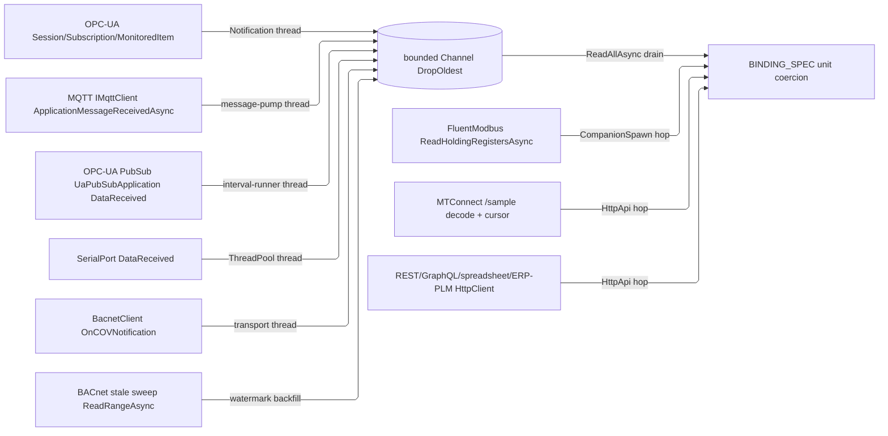
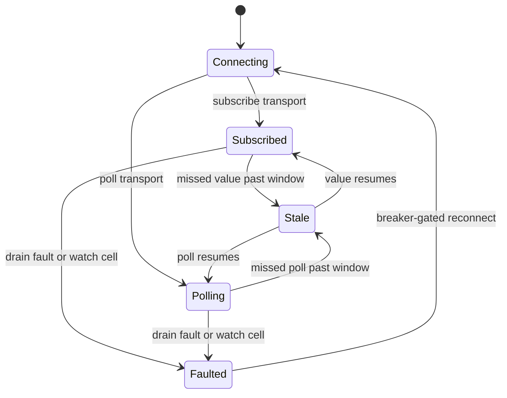

# [APPHOST_LIVE_WIRE]

Rasm.AppHost owns one reactive bidirectional binding studio: industrial transport rows carry OPC-UA, OPC-UA PubSub, Modbus, MQTT, serial, BACnet, MTConnect, REST, GraphQL, spreadsheet, and ERP/PLM through one read/write contract. Binding specs pair external sources with directed internal targets, inbound values coerce through the Compute unit algebra, write-back commits or rolls back with evidence, and binding health tracks connection state.

Live-wire composition consumes `QuantityFamily`/`UnitAlgebra`/`UnitPolicy`, `OutboundHop`/`OutboundSurface`, `SchedulePort`/`ScheduleEntry`, `CommandAlgebra`, `DeadlineClass`, `DegradationLevel`, and `ReceiptSinkPort`; this page owns the transport axis, binding direction, edge coercion, write transaction, and health lifecycle, and it mints no eighth port. Every live-wire schedule entry and every un-hopped foreign await takes `DeadlineClass.HopAttempt`, so no transport row carries a deadline column of its own.

## [01]-[INDEX]

- [02]-[TRANSPORT_AXIS]: Eleven industrial-transport rows with one read/write adapter contract.
- [03]-[TRANSPORT_BINDING]: Per-case `Read`/`Write`/`Watch` dispatch; OPC-UA session/subscription, PubSub fan, and MQTT client.
- [04]-[BINDING_SPEC]: Source-target binding, protocol admission, direction, edge unit coercion, and poll/subscribe cadence.
- [05]-[WRITE_BACK]: Outbound write-back transaction, acknowledgement, refusal, and rollback.
- [06]-[BINDING_HEALTH]: Per-binding connect/subscribe/stale/fault lifecycle and health contribution.
- [07]-[TS_PROJECTION]: Binding-status, coercion, observation, and write-receipt wire shapes the studio dashboard consumes.

## [02]-[TRANSPORT_AXIS]

- Owner: `ExternalTransport` `[SmartEnum<string>]` the eleven-row industrial-transport axis under the `ComparerAccessors.StringOrdinal` accessor; `TransportRow` per-transport policy record; `TransportRows` the frozen row set with the total dispatch; `WireProtocol` `[SmartEnum<string>]` the PubSub message mapping carrying its own transport-profile URI; `EchoClass` `[SmartEnum<string>]` the echo capability each row DECLARES and `EchoDiscriminator` `[Union]` the payload a write RETAINED and an inbound value CARRIED, joined by the one `Echoes` match; `FaultSurface` `[SmartEnum<string>]` the out-of-band fault surface each row declares; `WireFault` `[Union]` fault family deriving its codes through `FaultBand.LiveWire`; `ExternalValue` the at-edge value carrier.
- Cases: opc-ua, opc-ua-pubsub, modbus, mqtt, serial, bacnet, mtconnect, rest, graphql, spreadsheet, erp-plm — each carrying its read shape (poll versus subscribe), its write capability, the outbound hop class its bytes ride, the protocol mappings it ADMITS, the echo class its protocol publishes, and the surface its out-of-band faults reach; opc-ua-pubsub is the broadcast edge dialing a broker or a UDP multicast group rather than the server's `opc.tcp` endpoint, bacnet the building-management edge (COV-subscribed metered points, confirmed-request write) and mtconnect the machine-tool observation edge (the `-Common` model slice over the row's HTTP hop, read-only); `WireProtocol` = None | MqttJson | MqttUadp | UdpUadp, the ten point-to-point rows admitting `{None}` alone and opc-ua-pubsub admitting the three real mappings; `EchoClass` = absent | stamped | tokened | slotted, the valueless row declaration, and `EchoDiscriminator` = Absent | Stamped | Tokened | Slotted its measured counterpart — `Stamped` carries the write's own `DataValue.SourceTimestamp` returned on the notification beside the item's `ClientHandle` (opc-ua), `Tokened` a write-minted `CorrelationData` key returned on the inbound message (mqtt), `Slotted` the host-owned command priority-array slot carried on the inbound value (bacnet), and `Absent` the explicit arm every protocol publishing no echo proof takes; `FaultSurface` = absent | keep-alive | connection | disconnect | confirmed; `WireFault` = Text | ConnectRejected | ReadFailed | WriteRejected | WriteFailed | ProtocolRefused | UnitRejected | StaleSource.
- Entry: `TransportRow Row` is the extension property total state-free `Switch` from transport to frozen row; `TransportBinding.Read(LiveWireRuntime runtime, TransportRow row, BindingSpec spec, CancellationToken token)` returning `IO<ExternalValue>`, `TransportBinding.Write(LiveWireRuntime runtime, TransportRow row, BindingSpec spec, ExternalValue value)` returning `IO<EchoDiscriminator>`, and `TransportBinding.Watch(LiveWireRuntime runtime, TransportRow row, BindingSpec spec)` returning `Option<WireFault>` dispatch on the row's `Transport.Switch` to the per-case binding at `Wire/livewire#TRANSPORT_BINDING`, so the axis owns the row shape and the binding cluster owns each protocol's client surface and its dispatch.
- Auto: a `Subscribe`-shaped transport (OPC-UA, OPC-UA PubSub, MQTT, serial, BACnet) opens a streaming subscription whose values arrive as a reactive sequence, while a `Poll`-shaped transport (Modbus, MTConnect, REST, GraphQL, spreadsheet, ERP/PLM) reads on a `SchedulePort` cadence row, so the binding engine reads both shapes through one contract differing only by the row's `ReadShape` column, and opener presence agrees with that column on every row by construction; the transport bytes ride the existing `OutboundHop` cases — REST, GraphQL, spreadsheet, ERP/PLM, and MTConnect on `HttpApi`, MQTT, OPC-UA, and OPC-UA PubSub on a keyed `ServerStream` pipeline, serial and Modbus on the `CompanionSpawn` process-spawn adapter where the FluentModbus/`SerialPort` client owns the line inside the companion — so the resilience, retry, and breaker semantics are the existing hop policy, never a per-transport retry loop; the `Writable` column gates the write-back so a read-only source (a spreadsheet view, a PubSub subscriber) rejects a write at the row, never at the transaction; the `Protocols` column gates admission so a binding selecting a mapping its edge cannot carry refuses at `Bind` with the axis named.
- Receipt: `ExternalValue` carries the raw value, its declared unit, the source quality flag, the source timestamp, and the echo payload the protocol published with it; a write answers the payload it minted, so both ends of a suppression comparison exist as evidence; the read and write transitions log through one `SpineLog` event.
- Packages: OPCFoundation.NetStandard.Opc.Ua, OPCFoundation.NetStandard.Opc.Ua.PubSub, MQTTnet, FluentModbus, System.IO.Ports, BACnet, MTConnect.NET-Common, Thinktecture.Runtime.Extensions, LanguageExt.Core, NodaTime, BCL inbox
- Growth: one transport row absorbs a new industrial edge — a new fieldbus or ERP connector is one `ExternalTransport` row carrying its read shape, write capability, hop class, admitted mappings, echo class, and fault surface, never a parallel adapter; a new echo proof is one `EchoClass` row and its `EchoDiscriminator` arm, breaking the `Echoes` match until the pair lands; a new PubSub mapping is one `WireProtocol` row carrying its profile URI and one admitted-set entry; a new fault is one `WireFault` case; zero new surface.
- Boundary: no transport-neutral echo token exists — three writable protocols publish a proof and each publishes a DIFFERENT one, so the axis splits the DECLARATION from the MEASUREMENT: the row's `EchoClass` column is valueless because a frozen row is written before any write runs, so a payload seated there is invented, and an epoch instant, a zero slot, or an empty key seated there reads identical to a measured proof at the comparison — an `Option<string>` slot spells that same forged token; `Absent` is a real row and the suppression fold reads it FIRST, so a modbus, serial, or HTTP binding never reaches a payload comparison and reads its own write-back like any other value rather than under a heuristic time window; `MqttLane.Subscribe`'s `noLocal: true` filter is protocol-level echo suppression already enforced at the broker for a same-connection publish, and `Tokened` covers the cross-client case that flag cannot reach.
- Boundary: protocol selection splits the same way — the row ADMITS a set and the binding SELECTS one member, because the edge's capability is frozen at the row while one PubSub deployment picks its mapping per connection, so a single-valued column pinned on every row decides nothing and a selection seated on the row cannot express two connections against one edge; refusal at admission carries the axis name under `libs/.planning/ARCHITECTURE.md` `[10]-[CONSUMPTION_MODEL]`, so an unserved mapping never degrades to a neighbouring one; each `WireProtocol` row reads its profile URI off `Opc.Ua.Profiles` rather than spelling the string, and `WireProtocol.None` carries no URI at all because a point-to-point edge has no PubSub transport facet — an empty string seated there is the forged zero the `docs/laws/scars.md` `[FORGED_ZERO]` rule names.
- Boundary: the transport axis is the only external-binding owner — a per-protocol client, a protocol-specific binding service, and a parallel poller are the deleted forms, so all eleven transports ride one adapter contract; the OPC-UA legs compose the OPC-Foundation-certified `OPCFoundation.NetStandard.Opc.Ua` session/subscription/monitored-item surface and the `.PubSub` application, the MQTT leg composes `MQTTnet`, and the REST/GraphQL legs compose the existing `OutboundHop.HttpApi` — a hand-rolled OPC-UA or MQTT client is the deleted form; the transport never owns its own resilience — it composes the `OutboundHop` row its bytes ride, so a flapping Modbus source breaks on the same circuit breaker an HTTP API breaks on; the at-edge value carries its declared unit so the coercion at `BINDING_SPEC` reads a known unit, never a guessed one; a subscribe transport's reactive sequence and a poll transport's scheduled read are one inbound contract, so the binding engine never branches on transport at the call site; spreadsheet and ERP/PLM transports that have no native streaming poll on the schedule cadence, so the cadence is the row's read mechanism, not a transport quirk.

```csharp signature
[SmartEnum<string>]
[KeyMemberEqualityComparer<ComparerAccessors.StringOrdinal, string>]
[KeyMemberComparer<ComparerAccessors.StringOrdinal, string>]
public sealed partial class ReadShape {
    public static readonly ReadShape Poll = new("poll");
    public static readonly ReadShape Subscribe = new("subscribe");
}

[SmartEnum<string>]
[KeyMemberEqualityComparer<ComparerAccessors.StringOrdinal, string>]
[KeyMemberComparer<ComparerAccessors.StringOrdinal, string>]
public sealed partial class ExternalTransport {
    public static readonly ExternalTransport OpcUa = new("opc-ua");
    public static readonly ExternalTransport OpcUaPubSub = new("opc-ua-pubsub");
    public static readonly ExternalTransport Modbus = new("modbus");
    public static readonly ExternalTransport Mqtt = new("mqtt");
    public static readonly ExternalTransport Serial = new("serial");
    public static readonly ExternalTransport Bacnet = new("bacnet");
    public static readonly ExternalTransport Mtconnect = new("mtconnect");
    public static readonly ExternalTransport Rest = new("rest");
    public static readonly ExternalTransport GraphQl = new("graphql");
    public static readonly ExternalTransport Spreadsheet = new("spreadsheet");
    public static readonly ExternalTransport ErpPlm = new("erp-plm");
}

[Union]
public abstract partial record WireFault : Expected, IValidationError<WireFault> {
    private WireFault(string detail, int code) : base(detail, code, None) { }
    public static WireFault Create(string message) => new Text(message);
    public sealed record Text : WireFault { public Text(string detail) : base(detail, FaultBand.LiveWire.Code(0)) { } }
    public sealed record ConnectRejected : WireFault { public ConnectRejected(string detail) : base(detail, FaultBand.LiveWire.Code(1)) { } }
    public sealed record ReadFailed : WireFault { public ReadFailed(string detail) : base(detail, FaultBand.LiveWire.Code(2)) { } }
    // WriteRejected is a DEFINITE refusal — a device, broker, or row that declined and changed nothing, so the
    // write-back reports it and never compensates. WriteFailed is the ambiguous half: a timeout, a dropped
    // connection, a framing fault, where remote application can be neither proved nor disproved, so it is the
    // only arm that reaches the compensating write. Folding both onto one case forces a spurious second write
    // after every clean refusal and hides which failures actually left the device in an unknown state.
    public sealed record WriteRejected : WireFault { public WriteRejected(string detail) : base(detail, FaultBand.LiveWire.Code(3)) { } }
    public sealed record WriteFailed : WireFault { public WriteFailed(string detail) : base(detail, FaultBand.LiveWire.Code(4)) { } }
    public sealed record ProtocolRefused : WireFault { public ProtocolRefused(string detail) : base(detail, FaultBand.LiveWire.Code(5)) { } }
    public sealed record UnitRejected : WireFault { public UnitRejected(string detail) : base(detail, FaultBand.LiveWire.Code(6)) { } }
    public sealed record StaleSource : WireFault { public StaleSource(string detail) : base(detail, FaultBand.LiveWire.Code(7)) { } }
}

// Reference-shaped BY CONSTRUCTION: a value type carrying a reference-typed union field admits `default`, whose
// Echo reads null and NREs the suppression match on the one path built to refuse safely. As a record class the
// nullable annotation binds at every construction site and no defaulted instance exists to reach the fold.
public sealed record ExternalValue(
    double Raw,
    string Unit,
    bool Good,
    Instant SourceAt,
    EchoDiscriminator Echo);

// PubSub message mapping. ProfileUri reads off Opc.Ua.Profiles rather than a spelled literal, and None carries
// no URI because a point-to-point edge has no PubSub transport facet to name. UaPubSubApplication
// .SupportedTransportProfiles is STATIC and re-inlines these same three in udp-uadp, mqtt-json, mqtt-uadp order.
[SmartEnum<string>]
[KeyMemberEqualityComparer<ComparerAccessors.StringOrdinal, string>]
[KeyMemberComparer<ComparerAccessors.StringOrdinal, string>]
public sealed partial class WireProtocol {
    public static readonly WireProtocol None = new("none", Option<string>.None);
    public static readonly WireProtocol MqttJson = new("mqtt-json", Some(Profiles.PubSubMqttJsonTransport));
    public static readonly WireProtocol MqttUadp = new("mqtt-uadp", Some(Profiles.PubSubMqttUadpTransport));
    public static readonly WireProtocol UdpUadp = new("udp-uadp", Some(Profiles.PubSubUdpUadpTransport));

    public Option<string> ProfileUri { get; }
}

// What a row's protocol DECLARES it can publish, valueless by construction: a frozen row is written long
// before any write runs, so a row seating a payload-bearing arm would have to invent the payload — and an
// epoch instant or an empty key is a forged token that reads identical to a measured one at the comparison.
// Class is the gate the suppression fold reads first; the payload is EchoDiscriminator's alone.
[SmartEnum<string>]
[KeyMemberEqualityComparer<ComparerAccessors.StringOrdinal, string>]
[KeyMemberComparer<ComparerAccessors.StringOrdinal, string>]
public sealed partial class EchoClass {
    public static readonly EchoClass Absent = new("absent");
    public static readonly EchoClass Stamped = new("stamped");
    public static readonly EchoClass Tokened = new("tokened");
    public static readonly EchoClass Slotted = new("slotted");
}

// Where a row's faults arrive when the awaited call cannot carry them. Five transports report a broken edge on
// a surface no read or write return reaches, so the row NAMES its surface and the composition root subscribes
// exactly those rows into one cell. Absent is the honest arm for rows with no such surface at all, including
// serial: SerialPort.ErrorReceived is declared on every runtime yet raised on none but win, so SerialError and
// its TXFull member are unreachable on this host and a cell fed from that event would never move.
[SmartEnum<string>]
[KeyMemberEqualityComparer<ComparerAccessors.StringOrdinal, string>]
[KeyMemberComparer<ComparerAccessors.StringOrdinal, string>]
public sealed partial class FaultSurface {
    public static readonly FaultSurface Absent = new("absent");
    public static readonly FaultSurface KeepAlive = new("keep-alive");
    public static readonly FaultSurface Connection = new("connection");
    public static readonly FaultSurface Disconnect = new("disconnect");
    public static readonly FaultSurface Confirmed = new("confirmed");
}

// MEASURED write-echo proof, one arm per shape of evidence a protocol actually publishes and one arm per
// EchoClass row. Absence is an ARM, never an Option<string> a value fills with an empty key or an epoch
// instant — a forged token reads identical to a measured one at the suppression fold, and six of the eight
// writable rows have nothing to carry.
[Union(ConversionFromValue = ConversionOperatorsGeneration.None)]
public abstract partial record EchoDiscriminator {
    private EchoDiscriminator() { }

    // Named canonical absence, spelled Unproven rather than None because LanguageExt's bare None is in scope
    // across this whole file for Option construction and a shadowing member turns every such call site into a
    // resolution puzzle. Every no-echo row and every value from a protocol publishing none reads this one
    // instance rather than allocating a fresh nothing.
    public static readonly EchoDiscriminator Unproven = new Absent();

    public sealed record Absent : EchoDiscriminator;
    public sealed record Stamped(Instant SourceAt, uint ClientHandle) : EchoDiscriminator;
    public sealed record Tokened(ReadOnlyMemory<byte> Correlation) : EchoDiscriminator;
    public sealed record Slotted(byte Priority) : EchoDiscriminator;

    // Suppression is a SHAPE-AND-PAYLOAD match on one arm; Absent never matches, so a protocol publishing no
    // proof reads its own write-back like any other value rather than under a fabricated time window.
    public bool Echoes(EchoDiscriminator acknowledged) => (this, acknowledged) switch {
        (Stamped inbound, Stamped written) => inbound.SourceAt == written.SourceAt && inbound.ClientHandle == written.ClientHandle,
        (Tokened inbound, Tokened written) => inbound.Correlation.Span.SequenceEqual(written.Correlation.Span),
        (Slotted inbound, Slotted written) => inbound.Priority == written.Priority,
        _ => false,
    };
}

public sealed record TransportRow(
    ExternalTransport Transport,
    ReadShape ReadShape,
    bool Writable,
    OutboundHop Hop,
    Seq<WireProtocol> Protocols,
    EchoClass Echo,
    FaultSurface Fault);

public static class TransportRows {
    // Echo is the row's DECLARED capability and carries no payload: three writable protocols publish a proof and
    // each publishes a different one, five publish none, and the three read-only rows cannot echo a write they
    // refuse. Protocols is the ADMITTED set a binding selects from — one member for every point-to-point edge,
    // three for the broadcast edge whose deployment picks its mapping per connection.
    public static readonly TransportRow OpcUa = new(ExternalTransport.OpcUa, ReadShape.Subscribe, Writable: true, new OutboundHop.ServerStream(new Uri("opc.tcp://localhost")), Seq(WireProtocol.None), EchoClass.Stamped, FaultSurface.KeepAlive);
    // Bytes ride a broker dial or a UDP multicast group, never the server's opc.tcp endpoint, so the row carries
    // its own ServerStream hop rather than sharing the per-node row's. Writable is false because the lane
    // declares no Write member at all — a PubSub subscriber consumes a publisher's fan and answers nothing.
    public static readonly TransportRow OpcUaPubSub = new(ExternalTransport.OpcUaPubSub, ReadShape.Subscribe, Writable: false, new OutboundHop.ServerStream(new Uri("opc.udp://239.0.0.1:4840")), Seq(WireProtocol.MqttJson, WireProtocol.MqttUadp, WireProtocol.UdpUadp), EchoClass.Absent, FaultSurface.Connection);
    public static readonly TransportRow Modbus = new(ExternalTransport.Modbus, ReadShape.Poll, Writable: true, new OutboundHop.CompanionSpawn(new ProcessStartInfo("rasm-modbus")), Seq(WireProtocol.None), EchoClass.Absent, FaultSurface.Absent);
    public static readonly TransportRow Mqtt = new(ExternalTransport.Mqtt, ReadShape.Subscribe, Writable: true, new OutboundHop.ServerStream(new Uri("mqtt://localhost")), Seq(WireProtocol.None), EchoClass.Tokened, FaultSurface.Disconnect);
    // Serial reads through DataReceived, so the row is Subscribe and mints no poll entry: SerialLane.Attach is
    // its opener and the framed line arrives on the same bounded lane every subscribe transport writes into.
    public static readonly TransportRow Serial = new(ExternalTransport.Serial, ReadShape.Subscribe, Writable: true, new OutboundHop.CompanionSpawn(new ProcessStartInfo("rasm-serial")), Seq(WireProtocol.None), EchoClass.Absent, FaultSurface.Absent);
    public static readonly TransportRow Bacnet = new(ExternalTransport.Bacnet, ReadShape.Subscribe, Writable: true, new OutboundHop.ServerStream(new Uri("bacnet://localhost")), Seq(WireProtocol.None), EchoClass.Slotted, FaultSurface.Confirmed);
    public static readonly TransportRow Mtconnect = new(ExternalTransport.Mtconnect, ReadShape.Poll, Writable: false, new OutboundHop.HttpApi(new Uri("http://localhost:5000")), Seq(WireProtocol.None), EchoClass.Absent, FaultSurface.Absent);
    public static readonly TransportRow Rest = new(ExternalTransport.Rest, ReadShape.Poll, Writable: true, new OutboundHop.HttpApi(new Uri("https://localhost")), Seq(WireProtocol.None), EchoClass.Absent, FaultSurface.Absent);
    public static readonly TransportRow GraphQl = new(ExternalTransport.GraphQl, ReadShape.Poll, Writable: true, new OutboundHop.HttpApi(new Uri("https://localhost/graphql")), Seq(WireProtocol.None), EchoClass.Absent, FaultSurface.Absent);
    public static readonly TransportRow Spreadsheet = new(ExternalTransport.Spreadsheet, ReadShape.Poll, Writable: false, new OutboundHop.HttpApi(new Uri("https://localhost")), Seq(WireProtocol.None), EchoClass.Absent, FaultSurface.Absent);
    public static readonly TransportRow ErpPlm = new(ExternalTransport.ErpPlm, ReadShape.Poll, Writable: true, new OutboundHop.HttpApi(new Uri("https://localhost")), Seq(WireProtocol.None), EchoClass.Absent, FaultSurface.Absent);

    extension(ExternalTransport transport) {
        public TransportRow Row => transport.Switch(
            opcUa: static () => OpcUa,
            opcUaPubSub: static () => OpcUaPubSub,
            modbus: static () => Modbus,
            mqtt: static () => Mqtt,
            serial: static () => Serial,
            bacnet: static () => Bacnet,
            mtconnect: static () => Mtconnect,
            rest: static () => Rest,
            graphQl: static () => GraphQl,
            spreadsheet: static () => Spreadsheet,
            erpPlm: static () => ErpPlm);
    }
}
```

## [03]-[TRANSPORT_BINDING]

- Owner: `TransportBinding.Read`/`TransportBinding.Write`/`TransportBinding.Watch` the per-case `ExternalTransport.Switch` dispatch from row to its protocol binding; `OpcUaLane` the OPC-UA session/subscription/monitored-item owner whose subscription callbacks feed one bounded lane; `MqttLane` the `IMqttClient` owner whose `ApplicationMessageReceivedAsync` callback feeds the same lane shape; `PubSubLane` the reader-group owner over the ONE process-held `UaPubSubApplication` whose `DataReceived` dataset fan feeds the SAME bounded lane the per-node OPC-UA subscription drains into; `HttpPoll` the REST/GraphQL/spreadsheet/ERP-PLM body over the row's `OutboundHop.HttpApi`; `ModbusLane` the `FluentModbus` `ModbusClient` register-window body over the row's `OutboundHop.CompanionSpawn`; `SerialLane` the `System.IO.Ports` `SerialPort` line-frame owner whose `DataReceived` callback feeds the same lane and whose `WriteLine` is the inbound write; `BacnetLane` the `BacnetClient` COV-subscription owner whose notification callback feeds the same bounded lane with `Recover` the scheduled stale backfill; `MstpLine` the host-implemented `IBacnetSerialTransport` adapter over the held `SerialPort` the MS/TP transport construction takes; `MtconnectLane` the read-only `-Common` model-slice decode over the row's HTTP hop with the `MTConnectClientInformation` durable cursor; `MachineLane` the machine-observation decode lane — a `BindingSpec.Machine`-sliced inbound value projects once into one typed `MachineObservationWire` (value, unit, machine identity, freshness instant) fanned under `InstrumentFan.ObservationKind`, the single decoded truth Fabrication's wear, fleet-performance, and engagement consumers read, never a direct transport reference and never three decoders; `SubscriptionLane` the ONE lane record — the `Runtime/resources#DRAIN_QUEUES` `DrainQueue<ExternalValue>.Pipe` the foreign callback writes and the reactive read drains, its detach closure, and the `Atom<Gate>` lifecycle cell, with `Open`/`Drain`/`Submit`/`Held` its own statics so the record, its openers, and the client every lane member resolves are one owner; `LiveClient` `[Union]` the held-connection family — `Opc` carries the `OpcUaBinding` triple, `Mqtt` the `IMqttClient`, `Serial` the `SerialPort`, `PubSub` the process-held `UaPubSubApplication` beside this binding's reader id, `Bacnet` the `BacnetClient` — one arm per subscribe row, so one `Gate.Live(Guid, LiveClient)` cell serves every lane-bearing protocol and a poll transport holds no cell because its client carries no per-binding state between frames; `OpcUaRuntime`/`MqttRuntime`/`ModbusRuntime`/`SerialRuntime`/`PubSubRuntime`/`BacnetRuntime`/`MtconnectRuntime` the held per-protocol configuration, factory, and seat state the `LiveWireRuntime` composes.
- Cases: read dispatch is the eleven-arm `Transport.Switch` — the five subscribe rows drain the one published lane through `SubscriptionLane.Drain`, Modbus reads its window through the window's own `ModbusSpace` row body, MTConnect parses the `/sample` document through `ResponseDocumentFormatter` into the observation stream over the row's HTTP hop, REST/GraphQL/spreadsheet/ERP-PLM read once through `OutboundHop.HttpApi`; write dispatch is the same eleven-arm `Switch` answering the echo the protocol minted — OPC-UA writes one `WriteValue` and reads its per-node `StatusCode`, MQTT publishes one `MqttApplicationMessage` and reads its PUBACK reason code, Modbus writes through the space row's write body and folds `ModbusException.ExceptionCode`, serial writes one `WriteLine`, the HTTP transports ride a `PutAsync` body, BACnet awaits one confirmed `WritePropertyAsync` at the point's priority-array slot and reads the typed verdict off the client's own service events, and the non-writable spreadsheet, MTConnect, and PubSub rows reject at the row with the read-only Modbus spaces rejecting at theirs; watch dispatch is one cell read the row's `FaultSurface` gates, so a row declaring `Absent` never consults a cell nothing feeds.
- Entry: each subscribe adapter owns its concrete opener — `OpcUaLane.Subscribe`, `MqttLane.Subscribe`, `PubSubLane.Subscribe`, `SerialLane.Attach`, or `BacnetLane.Subscribe` — returning `IO<SubscriptionLane>` after seating its client in the gate cell and attaching its foreign callback, and `LiveWire.Activate` at `BINDING_SPEC` is their one caller, selecting the opener off the row and publishing the opened lane into the runtime accessors; `TransportBinding.Read` drains the published lane for subscribe rows or runs one poll body over the row's hop; `TransportBinding.Write` dispatches the at-edge value through the row's protocol or hop and answers the echo key the write minted; `BacnetLane.Recover` is the scheduled stale-lane backfill `LiveWire.Entries` registers for the BACnet row alone.
- Auto: the OPC-UA leg composes the high-level managed `Opc.Ua.Client` API — `Session.CreateAsync(configuration, reverseConnectManager, endpoint, updateBeforeConnect, checkDomain, sessionName, sessionTimeout, userIdentity, preferredLocales, ct)` mints the session over the configuration-loaded endpoint, a `Subscription(telemetry)` carries `PublishingInterval`, `KeepAliveCount`, and `LifetimeCount` as policy ints read off the runtime, `subscription.AddItem(new MonitoredItem(telemetry){ StartNodeId, AttributeId, MonitoringMode, SamplingInterval })` and `subscription.CreateAsync(ct)` arm the monitored node, and the `monitoredItem.Notification` event hands each `MonitoredItemNotificationEventArgs.NotificationValue` cast to `MonitoredItemNotification` whose `Value` is one `DataValue` — the callback projects `DataValue.Value`/`StatusCode`/`SourceTimestamp` into `ExternalValue` and `Submit`s it into the bounded lane, never running the interior on the foreign thread; the OPC-UA write rides `Session.WriteAsync(requestHeader, nodesToWrite, ct)` inherited from `SessionClient`, building the `WriteValueCollection` from the binding's node id and refusing client-side through `WriteValue.Validate(WriteValue)` before a round trip; the MQTT leg composes `MqttClientFactory.CreateMqttClient()` returning `IMqttClient` (v5 keeps the interface), `ConnectAsync(options, ct)` over a `MqttClientOptionsBuilder` carrying connection uri, client id, keep-alive, clean-start, session-expiry, and `RequestProblemInformation` as policy data, `SubscribeAsync(options, ct)` over one `WithTopicFilter(topic, qos, noLocal, retainAsPublished, retainHandling)`, and the `ApplicationMessageReceivedAsync` handler decodes `MqttApplicationMessageReceivedEventArgs.ApplicationMessage.Payload` (`ReadOnlySequence<byte>`) at the boundary and `Submit`s into the same bounded lane, with the inbound write-back as one `PublishAsync` over a `MqttApplicationMessageBuilder` carrying topic, payload, qos, and retain; QoS, retain, last-will, and session-expiry are policy columns on `MqttRuntime`, never new cases or transports; the Modbus leg composes the `FluentModbus` `ModbusClient` base surface (the TCP/RTU clients inherit the function-code operations) through the window's own `ModbusSpace` row, which carries its read and write bodies as `[UseDelegateFromConstructor]` columns over all four protocol address spaces — the register spaces reinterpret their window through the package's own generic read — `ReadHoldingRegistersAsync<T>`/`ReadInputRegistersAsync<T>(unitId, startAddress, count, ct)` returning `Task<Memory<T>>` over the window's declared `T : unmanaged` register element (`short`, `ushort`, `int`, `float`, `double`) — so an IEEE-754 analog point reads as a `float` and the byte order is the `ModbusEndianness` the `Connect` call fixed for the whole connection, the bit spaces read `Task<Memory<byte>>` through `ReadCoilsAsync`/`ReadDiscreteInputsAsync(unitId, startAddress, quantity, ct)` one bit per point low-bit-first and cross as 0/1 against a dimensionless family, `WriteSingleRegisterAsync(unitId, registerAddress, short, ct)` writes the one-register window and `WriteMultipleRegistersAsync(unitId, startAddress, short[], ct)` the block, `WriteSingleCoilAsync(unitId, registerAddress, bool, ct)` the coil, and the input-register and discrete-input rows refuse their write at the row because the protocol declares them read-only; the `ModbusWindow` (`unitId`/`startAddress`/`count`/`element`/`space`) is `PollPolicy.Register` binding-spec policy data and its `ModbusElement` row carries the read body, never a per-read endianness flag; the serial leg composes `System.IO.Ports.SerialPort` — the `SerialFraming` (`baudRate`/`parity`/`dataBits`/`stopBits`/`handshake`/`newLine`/`lineFramed`/`readTimeout`/`writeTimeout`/`rts`/`dtr`) carried as `PollPolicy.Line` binding-spec policy, `ReadTimeout`/`WriteTimeout` bounding a wait that otherwise defaults to `InfiniteTimeout` and `RtsEnable` driving the RS-485 half-duplex transceiver line under every Modbus-RTU and BACnet MS/TP bus, `SerialLane.Attach` seating the one port through `SerialRuntime.Open`, wiring the `DataReceived` event (firing on a `ThreadPool` thread) to `Submit` one parsed `ExternalValue` into the bounded lane at the boundary, and `WriteLine` carrying the inbound write; the REST/GraphQL/spreadsheet/ERP-PLM legs compose the held `HttpClient` over `OutboundHop.HttpApi` — a `PollPolicy.Http` carries the resource path and the optional GraphQL query, REST a `GetAsync`, GraphQL a `PostAsync` of the query body, spreadsheet a read-only range fetch, each projecting the response body into one `ExternalValue`; the OPC-UA PubSub leg composes ONE process-held `UaPubSubApplication` — the type has no public constructor and five `Create` factories (`(ITelemetryContext)`, `(IUaPubSubDataStore, ITelemetryContext)`, `(string configFilePath, ITelemetryContext, IUaPubSubDataStore = null)`, `(PubSubConfigurationDataType, ITelemetryContext)`, `(PubSubConfigurationDataType, IUaPubSubDataStore, ITelemetryContext)`) — whose `DataReceived` `EventHandler<SubscribedDataEventArgs>` hands `args.NetworkMessage.DataSetMessages`, each `UaDataSetMessage` carrying its `DataSet` whose `Field[] Fields` project one `ExternalValue` per field and `Submit` into the SAME bounded lane the per-node OPC-UA subscription drains into, the per-binding connection and reader landing through `UaPubSubConfigurator` mutators that answer `StatusCode` and throw nothing; the BACnet leg composes `BacnetClient` over `BacnetIpUdpProtocolTransport` for BACnet/IP, or over `BacnetMstpProtocolTransport(IBacnetSerialTransport, short sourceAddress = -1, byte maxMaster = 127, byte maxInfoFrames = 1)` for a bus-attached controller — the `MstpLine` adapter over the held `SerialPort` supplies the host-implemented line under the SAME `SerialFraming` policy the serial row configures (`Rts` the RS-485 DE/RE line), the MS/TP node knobs riding the ctor's own defaults at the `BacnetRuntime.Open` composition seat, and no second serial package enters the folder — `RegisterAsForeignDevice(bbmdIp, ttl, port)` registers with the BBMD BEFORE `Start()` where the runtime carries a `BbmdRegistration`, since `WhoIs` reaches the local broadcast domain alone and a controller on another VLAN never answers without it, and the TTL renewal is one `OccurrenceSpec.Every` `ScheduleEntry` on the page's own `SchedulePort`; `SubscribeCOVAsync(adr, objectId, subscribeId, cancel, issueConfirmedNotifications, lifetime)` arms the metered points under the point's own `Confirmed` column and `OnCOVNotification` (the `COVNotificationHandler` firing on a transport thread with the `ICollection<BacnetPropertyValue>` triple set) projects each `BacnetValue` into one `ExternalValue` and `Submit`s into the SAME bounded lane every subscribe transport rides, the detach closure awaiting that same member with `cancel: true` before disposal so the device stops publishing into a closed transport; the scheduled stale sweep reads the point's `TrendLog` column — `ReadRangeAsync(adr, trendLog, readFrom, quantity)` awaits a `BacnetReadRangeResult` whose `Range` bytes and `ItemCount` drain the device's own history from the lane watermark into that same bounded lane when the point names a history object, `ReadPropertyAsync(adr, objectId, propertyId)` awaits the one current `IList<BacnetValue>` when it does not — and `WritePropertyAsync(adr, objectId, propertyId, valueList, invokeId, priority)` writes at the point's priority-array slot (1-16, the assembly's own admitted range) with a `None` value the RELEASE at that same slot, every one of them carrying an explicit invoke id and the binding's `CancellationToken` rather than a seam-local timeout; the point map (object id / property id / COV lifetime / confirmed / priority / trend log) is binding-spec DATA; the MTConnect leg composes the `-Common` MODEL slice ONLY (no bundled HTTP/MQTT client — transport is firewalled to the row's `OutboundHop.HttpApi`): `ResponseDocumentFormatter.CreateStreamsResponseDocument(documentFormatterId, content)` parses the `/sample` body into a `FormatReadResult<IStreamsResponseDocument>` whose `GetObservations()` flattens the device streams, and each `MTConnect.Streams.IObservation` projects into one `ExternalValue` — `GetValue(ValueKeys.Result)` parsed invariant-culture into `Option<double>` because every observation value crosses as TEXT, `DataItem?.Units` the declared unit with the binding family the fallback, `!IsUnavailable && Quality == Quality.VALID` the three-state good flag, and `Timestamp` the source instant — while `MTConnectClientInformation` is the durable poll cursor (`InstanceId` + `LastSequence`, `Save` after each drain, an `InstanceId` change forcing re-`current`) mirroring the outbox watermark discipline.
- Receipt: the OPC-UA `DataValue`, the MQTT decoded payload, the Modbus register window, the serial line frame, the HTTP response body, and the PubSub dataset field each mint one `ExternalValue` carrying raw value, declared unit, the source quality flag, and the source timestamp; MQTT CONNACK and every SUBACK item admit before the live client publishes, with a refused reason code projected onto `WireFault`; every configurator mutator's `StatusCode` folds onto the `Fin` rail before the reader arms; the lane drain at `BINDING_SPEC` coerces the unit before the value enters the suite.
- Packages: OPCFoundation.NetStandard.Opc.Ua, OPCFoundation.NetStandard.Opc.Ua.PubSub, MQTTnet, FluentModbus, System.IO.Ports, BACnet, MTConnect.NET-Common, LanguageExt.Core, NodaTime, Thinktecture.Runtime.Extensions, BCL `System.Net.Http`/`System.Text.Json`
- Growth: a new subscribe transport is one `Subscribe`/`Attach` arm feeding the one lane shape; a new poll transport is one `Read`/`Write` arm over its hop; a new Modbus address space is one `ModbusSpace` row carrying its two bodies and the lane gains no branch; a new serial line-discipline knob is one `SerialFraming` column; a new BACnet request knob is one `BacnetPoint` column; a new out-of-band fault surface is one `FaultSurface` row and one composition subscription; one bounded lane shape serves every subscribe transport and every backfilled history sample; zero new surface.
- Boundary: this cluster is the only protocol-client owner — a per-protocol binding service and a parallel poller are the deleted forms; the foreign OPC-UA monitored-item thread, the MQTT message-pump thread, the serial `DataReceived` `ThreadPool` thread, the BACnet transport thread, and the PubSub interval-runner thread never run the interior — each callback projects its raw value into `ExternalValue` and `Submit`s into the ONE `Runtime/resources#DRAIN_QUEUES` `DrainSpec.WireInbound` lane opened through `DrainSurface.Open`, so the lane's `DropOldest` back-pressure, its `DrainBand` completion, and its mandatory `onDrop` receipt delegate are the drain owner's declared policy — a bespoke `Channel.CreateBounded` beside that owner is the deleted form and an unreceipted-loss row refuses at `Open` on the `Fin` rail (`docs/stacks/csharp/boundaries#SUBSCRIPTION_VALUE`/`#HANDOFF_DRAIN`), and a callback writing its channel writer directly rather than through `Submit` is the second deleted form because the lane's single submission point is what makes that policy total; the held session triple, MQTT client, serial port, BACnet client, and PubSub reader id live in the lane's own `Atom<Gate>` token-gated cell (`docs/stacks/csharp/boundaries#TOKEN_LIFECYCLE`), so every lane member resolves its client through `SubscriptionLane.Held` and a write against a torn-down binding refuses on the cell rather than dialling a disposed handle — a parallel per-protocol `Held` accessor beside that cell is the deleted form, and the reconnect that replaces the whole cell leaves a stale teardown holding a dead token that disposes nothing; the per-row retry is the channel's own auto-reconnect (MQTT) XOR the seam's `OutboundHop` redial — never both — so a subscribe transport's reconnect rides the protocol client and a poll transport's retry rides the `CompanionSpawn`/`HttpApi` hop, the one-retry-owner law the transport axis declares — never a FluentModbus or `SerialPort` reconnect loop; a refusal that the wire STATES rather than throws is read at every arm — the MQTT PUBACK reason code, the OPC-UA per-node `StatusCode`, the `ModbusException.ExceptionCode`, and the BACnet service-event verdict each cross as a `HopOutcome` the body states, so a returned refusal nothing inspects is the named defect this cluster refuses to carry; a multi-homed host pins `localEndpointIp` on `BacnetIpUdpProtocolTransport` because `Start()` otherwise throws `InvalidOperationException` listing the candidate interfaces rather than guessing one, and `RegisterAsForeignDevice` answers `void` and LOGS a transport mismatch, so a BBMD registration against a non-IP transport silently no-ops and the MS/TP row never carries one; the register-window decode reinterprets the window as the point's declared `ModbusElement` under the `ModbusEndianness` `Connect` fixed for the connection — never a per-read byte-order branch, which reaches no float32 register at all — and the address space is the closed `ModbusSpace` row carrying its own read and write bodies, so a `bool Holding` two-valued switch reaching half a closed protocol and a lane-side space branch beside it are both the deleted forms; a transport call whose VALUE the read reports runs INSIDE the hop through `OutboundSurface.Carry`, so the reported value and the receipt describe one frame and the second raw untimed call is the deleted form; a hop-carried body takes no caller token at all, because the hop's own environment supplies the cancellation its deadline class bounds — a token threaded into that signature and never read declares a cancellation owner the frame does not have, so only the lane drain and the two un-hopped BACnet confirmed reads carry one; a serial frame parses into `Option<double>` at the callback, so a malformed line neither throws out of a foreign callback nor mints a `NaN` the coercion admits as a real measurement — the sentinel-as-value pair is the deleted form; a BACnet write carries the point's priority-array slot and its `None` release, so a host override is revocable, and a device-default write no later write can distinguish is the deleted form; a stale COV lane recovers through the point's declared history object on its own `ScheduleEntry`, so the samples between a dropped subscription and its recovery are read back rather than lost, and both a current-value-only fallback and a recovery arm nothing schedules are the deleted forms; a BBMD-routed binding registers as a foreign device before `Start()` and renews on one `ScheduleEntry` under the binding's own scope, so a background re-registration timer beside the scheduler and an entry outliving the binding it serves are the deleted forms; an MS/TP line is single-custody — `SerialRuntime.Open` seats ONE port per binding and the gate cell's teardown disposes client, transport, `MstpLine`, and port as ONE chain, so no lane ever constructs a second port on a line another master owns; the OPC-UA `Subscription.CurrentPublishingInterval` is a `double`, never a `TimeSpan`, so the runtime carries the publishing interval as the int `PublishingInterval` the subscription sets and reads the negotiated `double` back without a unit cast; the at-edge `DataValue.SourceTimestamp`, the MQTT receive instant, the serial/Modbus/HTTP read instant, and the PubSub `Field.Value.SourceTimestamp` cross as the value's `SourceAt` so the staleness check at `BINDING_HEALTH` reads a real source clock, never the host clock; the MQTT legs are the trace-carrier mount — `MqttLane.Write` threads `TraceContext.Inject` over the message builder before `Build()` and the receive pump continues the propagated context through the seam owner's own `MqttApplicationMessage` overload, consumer-kinded, so broker-hop trace continuity is wholly the adapter's and this runtime carries no extraction delegate to compose; the BACnet point map (`BacnetObjectId`/`BacnetPropertyIds`/COV lifetime) is `PollPolicy.Point` binding-spec DATA and the COV, write, and fault-reader bindings are `BacnetRuntime` composition slots, so protocol-signature drift lands at one composition seat; the PubSub application is process-scoped and one binding's teardown removes its own data-set reader through the configurator rather than calling `Stop`, because `Stop` darkens every other binding riding the same application; the MTConnect cursor is durable poll state — `MTConnectClientInformation.Read(string deviceKey, string path = null)` restores it, `Save(string path = null)` commits it after each drain, and an `InstanceId` change forces a full re-current, the outbox watermark discipline at the machine edge; the cursor and the observation do NOT share a numeric type — `MTConnectClientInformation.LastSequence`/`InstanceId` are `long` while `IObservation.Sequence`/`InstanceId` are `ulong` — so every cursor advance and every re-`current` comparison spells its `(long)` narrowing at the crossing rather than inferring one; `IStreamsResponseDocument.GetObservations()` returns NULL on a device-stream-free document, which is the ordinary steady-state `/sample` response when nothing crossed since the cursor, so the drain folds the null through an empty-sequence arm and an unguarded traversal is the deleted form.

```csharp signature
// One arm per SUBSCRIBE row, because a lane-bearing binding is exactly what holds a client across frames. Poll
// transports are absent by construction: a Modbus register read and an HTTP GET carry no per-binding state
// between frames, so seating them here would mint a cell nothing gates and nothing tears down.
[Union(ConversionFromValue = ConversionOperatorsGeneration.None)]
public abstract partial record LiveClient {
    private LiveClient() { }
    public sealed record Opc(OpcUaBinding Binding) : LiveClient;
    public sealed record Mqtt(IMqttClient Client) : LiveClient;
    public sealed record Serial(SerialPort Port) : LiveClient;
    // Application is NON-OWNING: one instance serves every PubSub binding in the process, so this arm
    // carries the reader-config id its own teardown removes and never the Stop() that would darken every sibling.
    public sealed record PubSub(UaPubSubApplication Application, uint Reader) : LiveClient;
    public sealed record Bacnet(BacnetClient Client) : LiveClient;
}

[Union(ConversionFromValue = ConversionOperatorsGeneration.None)]
public abstract partial record Gate {
    private Gate() { }
    public sealed record Pending : Gate;
    public sealed record Live(Guid Token, LiveClient Client) : Gate;
    public sealed record Failed(WireFault Reason) : Gate;
}

// Session, subscription, and item travel as ONE triple because the write needs the item's ClientHandle to scope
// its echo and the teardown needs all three: a runtime accessor answering the session alone leaves the handle
// unreachable and the Stamped arm unbuildable.
public sealed record OpcUaBinding(
    Session Session,
    Subscription Subscription,
    MonitoredItem Item);

// ONE lane owner: the record carries the drain-owned queue, the writer proved off its Pipe arm exactly once at
// Open, its detach closure, and the token-gated cell — and Open/Drain/Submit/Held are its own statics, so the
// record, the members that build it, and the client resolution every lane member performs are one type.
public sealed record SubscriptionLane(
    DrainQueue<ExternalValue> Queue,
    ChannelWriter<ExternalValue> Sink,
    Action Detach,
    Atom<Gate> Cell) {
    // Lane IS the drain owner's DropOldest row: capacity, full-mode, band, and the MANDATORY onDrop receipt are
    // DrainSpec.WireInbound columns, so an unreceipted-loss lane refuses at Open on the Fin rail rather than
    // dropping values no fact stream ever counted. Drop receipt fans under the registered wire arm.
    public static IO<SubscriptionLane> Open(LiveWireRuntime runtime, BindingSpec spec, Action detach, LiveClient client) =>
        IO.lift(() => DrainSpec.WireInbound.Open<ExternalValue>(Some<Action<ExternalValue>>(dropped =>
                ignore(runtime.Sink.Send(Correlation.Mint(), TenantContext.Current, TelemetrySource.AppHost.Key,
                    InstrumentFan.WireKind,
                    JsonSerializer.SerializeToElement(new WireFault.StaleSource($"lane-drop:{spec.BindingId}@{dropped.SourceAt}").Message, runtime.Wire)).Run())))
            .Bind(queue => queue.Switch(
                pipe: q => Fin.Succ(new SubscriptionLane(queue, q.Channel.Writer, detach, Atom<Gate>(new Gate.Live(Guid.NewGuid(), client)))),
                network: static n => Fin.Fail<SubscriptionLane>(new DrainFault.TopologyMismatch(n.Spec.Name, DrainKind.Pipe.Key)))))
            .Bind(static admitted => admitted.Match(Succ: IO.pure, Fail: IO.fail<SubscriptionLane>));

    public static IO<ExternalValue> Drain(SubscriptionLane lane, CancellationToken token) =>
        lane.Queue.Switch(
            state: token,
            pipe: static (t, p) => IO.liftAsync(async () => await p.Channel.Reader.ReadAsync(t).ConfigureAwait(false)),
            network: static (_, n) => IO.fail<ExternalValue>(new DrainFault.TopologyMismatch(n.Spec.Name, DrainKind.Pipe.Key)));

    // ONE submission point for every foreign callback on the page, so the drain owner's drop policy has exactly
    // one place to apply and a lane whose writer a callback reached directly cannot exist.
    public static Unit Submit(ChannelWriter<ExternalValue> sink, ExternalValue value) => ignore(sink.TryWrite(value));

    // Client resolution IS the gate read: a write or detach against a torn-down binding refuses on the cell
    // rather than dialling a disposed handle, which is the whole reason the token-gated cell exists.
    public static Fin<LiveClient> Held(SubscriptionLane lane, string bindingId) =>
        lane.Cell.Value is Gate.Live { Client: var client }
            ? Fin.Succ(client)
            : Fin.Fail<LiveClient>(new WireFault.ConnectRejected($"not-live:{bindingId}"));
}

public sealed record OpcUaRuntime(
    ApplicationConfiguration Configuration,
    ReverseConnectManager ReverseConnect,
    ITelemetryContext Telemetry,
    IUserIdentity Identity,
    IList<string> Locales,
    uint SessionTimeout,
    int PublishingInterval,
    uint KeepAliveCount,
    uint LifetimeCount,
    int SamplingInterval,
    Func<string, ConfiguredEndpoint> Endpoint);

// RequestProblemInformation is a LOAD-BEARING option rather than a default worth restating: the v5 broker omits
// ReasonString on every refusal when it is unset, so the write-back's typed refusal would carry a bare code.
public sealed record MqttRuntime(
    MqttClientFactory Factory,
    Duration KeepAlive,
    bool CleanStart,
    uint SessionExpiry,
    bool ProblemInformation,
    MqttQualityOfServiceLevel Qos,
    bool Retain);

public sealed record ModbusRuntime(
    Func<string, ModbusClient> Held);

// Open is the ONE port seat per binding: the lane never constructs a port, so the MS/TP master and the serial
// row can never hold two handles on one physical line.
public sealed record SerialRuntime(
    Func<string, SerialFraming, SerialPort> Open);

// Held answers the ONE process application. UaPubSubApplication has no public constructor and five Create
// factories, and its Start/Stop are void signalling nothing, so per-binding creation would mint one runner
// thread set per binding and per-binding Stop would darken every sibling riding the same instance.
// Configure lands the binding's connection, reader group, and data-set reader through UaPubSubConfigurator —
// AddConnection/AddReaderGroup(parentConnectionId,..)/AddDataSetReader(parentReaderGroupId,..) each answer a
// StatusCode and throw nothing, so the seat folds every one onto the rail and answers the reader config id
// FindIdForObject resolved. Remove is its inverse through RemoveDataSetReader, the binding's whole teardown.
public sealed record PubSubRuntime(
    ITelemetryContext Telemetry,
    IUaPubSubDataStore DataStore,
    Func<UaPubSubApplication> Held,
    Func<UaPubSubApplication, BindingSpec, WireProtocol, Fin<uint>> Configure,
    Func<UaPubSubApplication, uint, Fin<Unit>> Remove);

// BACnet point map, binding-spec DATA. Priority is the BACnet COMMAND PRIORITY ARRAY slot (1-16, the assembly's
// own admitted range): every host write lands at that slot and a RELEASE writes a null value at the SAME slot,
// so a host override is distinguishable from — and revocable against — a manual one, which a priority-less
// write can neither express nor undo. Confirmed selects the COV notification service
// (issueConfirmedNotifications) and TrendLog names the device's own history object the stale sweep drains, so
// samples a dropped subscription lost are read back rather than skipped.
public sealed record BacnetPoint(
    BacnetObjectId Object,
    BacnetPropertyIds Property,
    uint CovLifetime,
    Option<byte> Priority = default,
    bool Confirmed = true,
    Option<BacnetObjectId> TrendLog = default);

// BBMD foreign-device registration, the ONLY way a BACnet/IP binding crosses a subnet: the IP transport's WhoIs
// reaches the local broadcast domain alone, so a controller on another VLAN — the normal building deployment
// this transport row exists for — never answers. Ttl is the device's registration lifetime, and the
// re-registration cadence rides the page's own ScheduleEntry, never a background timer.
public sealed record BbmdRegistration(string BbmdIp, short Ttl, int Port = 47808);

public sealed record BacnetRuntime(
    Func<string, BacnetClient> Open,
    Func<string, BacnetAddress> Address,
    // Cov binds SubscribeCOVAsync(adr, objectId, subscribeId, cancel, issueConfirmedNotifications, lifetime)
    // and the OnCOVNotification handler whose ICollection<BacnetPropertyValue> carries each (property, value,
    // priority) triple; cancel: true is the SAME member Unsubscribe calls, so subscribe and unsubscribe are one
    // binding rather than an orphaned lane the device keeps feeding. That triple's own `priority` byte fills the
    // value's EchoDiscriminator.Slotted arm, so a host override the write placed at a priority slot is
    // distinguishable from a manual change at another. Both delegates take the attempt-bounded token because
    // neither runs inside a hop and an unbounded COV subscribe parks the activation fold on a dead device.
    Func<BacnetClient, BacnetAddress, BacnetPoint, ChannelWriter<ExternalValue>, CancellationToken, Task> Cov,
    Func<BacnetClient, BacnetAddress, BacnetPoint, CancellationToken, Task> Unsubscribe,
    // Invoke mints this binding's next invoke id and Write binds WritePropertyAsync(adr, objectId, propertyId,
    // valueList, invokeId, priority) with it — the None value is the priority-array RELEASE the same slot
    // revokes. Explicit rather than the member's own 0 default because Fault correlates ON that id.
    Func<string, byte> Invoke,
    Func<BacnetClient, BacnetAddress, BacnetPoint, Option<double>, byte, CancellationToken, Task> Write,
    // Fault is the TYPED verdict reader, and it exists because the awaited rail destroys the verdict: every
    // BacnetAsyncResult folds the device's answer to message TEXT — `Error from device: {errorClass} -
    // {errorCode}`, `Reject from device, reason: {reason}`, `Abort from device, reason: {reason}` — and rethrows
    // that bare Exception, so parsing the throw is the deleted form. Class and code survive ONLY on the client's
    // own events, which the composition root subscribes and correlates by invoke id: OnError carries
    // BacnetErrorClasses + BacnetErrorCodes (WRITE_ACCESS_DENIED 40, VALUE_OUT_OF_RANGE 37, INVALID_DATA_TYPE 9,
    // UNKNOWN_OBJECT 31, UNKNOWN_PROPERTY 32, NO_SPACE_TO_WRITE_PROPERTY 20, DEVICE_BUSY 3,
    // COMMUNICATION_DISABLED 83, INVALID_VALUE_IN_THIS_STATE 138), OnReject a BacnetRejectReason and OnAbort a
    // BacnetAbortReason, both byte-valued rosters. SendRequestAsync answering true proves nothing either — the
    // Error setter calls MarkDone() — so the event cell is the whole verdict.
    Func<string, byte, Option<WireFault>> Fault,
    // DecodeTrend binds Serialize.Services.DecodeLogRecord(byte[] buffer, int offset, int length, int nCurves,
    // out BacnetLogRecord[] records), each record carrying `DateTime timestamp`, `BacnetTrendLogValueType
    // type`, the boxed `object Value` its type column decodes, and `BacnetStatusFlags statusFlags` — that record's own
    // timestamp becomes the sample's SourceAt so a backfilled point reads on the SOURCE clock the staleness
    // check already trusts, never the host clock the drain happened to run under, and the status flags decide
    // Good rather than a blanket true.
    Func<string, byte[], uint, Seq<ExternalValue>> DecodeTrend,
    Option<BbmdRegistration> Bbmd,
    // COV watermark: the last instant a lane accepted a good value, read by the scheduled stale sweep to bound
    // its ReadRangeAsync and advanced exactly as MtconnectRuntime.Advance commits its LastSequence.
    Func<string, Instant> Watermark,
    Action<string, Instant> Advance);

public sealed record MtconnectRuntime(
    Func<string, MTConnectClientInformation> Cursor,
    // Decode parses the /sample body through ResponseDocumentFormatter.CreateStreamsResponseDocument(
    // string documentFormatterId, Stream content) returning FormatReadResult<IStreamsResponseDocument>, then
    // flattens IStreamsResponseDocument.GetObservations() — which returns NULL, not an empty sequence, on a
    // document carrying no device stream — and projects each IObservation into one ExternalValue beside the
    // (long) narrowing of its ulong Sequence. That pair mirrors BacnetRuntime.Watermark/Advance: the drain
    // commits the sequence it consumed rather than a cursor the runtime re-derives.
    Func<string, string, Seq<(ExternalValue Value, long Sequence, long InstanceId)>> Decode,
    Action<string, long, long> Advance);

// Per-case dispatch owner, named for the section it belongs to: TransportRows at [02] owns the frozen row set
// and the Row extension, this owns the read, write, and watch dispatch over them.
public static class TransportBinding {
    // Five subscribe rows share ONE body because the lane is protocol-agnostic — that is the whole point of one
    // bounded lane — so a per-protocol Read forwarder over the same drain call is the deleted form.
    public static IO<ExternalValue> Read(LiveWireRuntime runtime, TransportRow row, BindingSpec spec, CancellationToken token) =>
        row.Transport.Switch(
            opcUa: static (s, _) => Drained(s),
            opcUaPubSub: static (s, _) => Drained(s),
            mqtt: static (s, _) => Drained(s),
            serial: static (s, _) => Drained(s),
            bacnet: static (s, _) => Drained(s),
            modbus: static (s, _) => ModbusLane.Read(s.Runtime, s.Row, s.Spec),
            mtconnect: static (s, _) => MtconnectLane.Read(s.Runtime, s.Row, s.Spec),
            rest: static (s, _) => HttpPoll.Read(s.Runtime, s.Row, s.Spec),
            graphQl: static (s, _) => HttpPoll.Read(s.Runtime, s.Row, s.Spec),
            spreadsheet: static (s, _) => HttpPoll.Read(s.Runtime, s.Row, s.Spec),
            erpPlm: static (s, _) => HttpPoll.Read(s.Runtime, s.Row, s.Spec),
            state: (Runtime: runtime, Row: row, Spec: spec, Token: token));

    static IO<ExternalValue> Drained((LiveWireRuntime Runtime, TransportRow Row, BindingSpec Spec, CancellationToken Token) s) =>
        SubscriptionLane.Drain(s.Runtime.Lane(s.Spec.BindingId), s.Token);

    // Write answers the echo key the protocol minted and NOTHING else: OutboundSurface.Carry rails the body's
    // value on a delivered outcome and fails on every other, so a receipt paired into this return would carry
    // an outcome only ever reading Delivered while the refusal it was meant to discriminate rode the error rail
    // past it. Refusal shape therefore lives on the typed WireFault — WriteRejected for a definite decline,
    // WriteFailed for an ambiguous one — and the write-back reads THAT.
    public static IO<EchoDiscriminator> Write(LiveWireRuntime runtime, TransportRow row, BindingSpec spec, ExternalValue value) =>
        !row.Writable
            ? IO.fail<EchoDiscriminator>(new WireFault.WriteRejected($"read-only-row:{row.Transport.Key}:{spec.ExternalAddress}"))
            : row.Transport.Switch(
                opcUa: static (s, _) => OpcUaLane.Write(s.Runtime, s.Row, s.Spec, s.Value),
                mqtt: static (s, _) => MqttLane.Write(s.Runtime, s.Row, s.Spec, s.Value),
                bacnet: static (s, _) => BacnetLane.Write(s.Runtime, s.Row, s.Spec, Some(s.Value)),
                modbus: static (s, _) => ModbusLane.Write(s.Runtime, s.Row, s.Spec, s.Value),
                serial: static (s, _) => SerialLane.Write(s.Runtime, s.Row, s.Spec, s.Value),
                rest: static (s, _) => HttpPoll.Write(s.Runtime, s.Row, s.Spec, s.Value),
                graphQl: static (s, _) => HttpPoll.Write(s.Runtime, s.Row, s.Spec, s.Value),
                erpPlm: static (s, _) => HttpPoll.Write(s.Runtime, s.Row, s.Spec, s.Value),
                opcUaPubSub: static (s, _) => Refused(s.Row, s.Spec),
                mtconnect: static (s, _) => Refused(s.Row, s.Spec),
                spreadsheet: static (s, _) => Refused(s.Row, s.Spec),
                state: (Runtime: runtime, Row: row, Spec: spec, Value: value));

    static IO<EchoDiscriminator> Refused(TransportRow row, BindingSpec spec) =>
        IO.fail<EchoDiscriminator>(new WireFault.WriteRejected($"read-only-row:{row.Transport.Key}:{spec.ExternalAddress}"));

    // Out-of-band fault read, gated by the row's declared surface so a row standing behind no event never reads
    // a cell nothing feeds. Five transports report a broken edge where no awaited return can reach it — the
    // OPC-UA session keep-alive, the PubSub connection state, MqttClientDisconnectedEventArgs carrying its
    // reason and exception as FIELDS, and the three BACnet service events — and the composition root subscribes
    // exactly those into one cell. Modbus, serial, and the HTTP rows declare Absent: a Modbus frame fault is the
    // awaited ModbusException, an HTTP failure is the response, and SerialPort.ErrorReceived is raised on no
    // runtime but win, so a cell fed from it would never move on this host.
    public static Option<WireFault> Watch(LiveWireRuntime runtime, TransportRow row, BindingSpec spec) =>
        row.Fault == FaultSurface.Absent ? None : runtime.Watch(spec.BindingId);
}

// Body the read REPORTS is carried out of the SAME hop that timed it through OutboundSurface.Carry, so the
// value and the receipt describe one frame. A hop run for its outcome beside an out-of-band body fetch is the
// deleted form — a second untimed, unretried, unbroken-circuit frame over a response the hop already disposed.
// Value parse is total: a non-numeric node yields None and the constructing read stamps Good: false, the same
// absence-not-a-sentinel law SerialLane.ParseFrame holds.
public static class HttpPoll {
    // Policy match is a REFUSAL rather than a fallback: a row reaching here without its Http policy has no
    // resource path to select a value node with, so a bare GET against the raw address would report
    // whatever the document root happened to parse as.
    public static IO<ExternalValue> Read(LiveWireRuntime runtime, TransportRow row, BindingSpec spec) =>
        spec.Poll is PollPolicy.Http http
            ? OutboundSurface.Carry(runtime.Outbound, row.Hop, async ct => {
                  var client = runtime.Http(spec.BindingId);
                  using var response = http.GraphQlQuery is { IsSome: true, Case: string query }
                      ? await client.PostAsync(spec.ExternalAddress, JsonContent.Create(new { query }, options: runtime.Wire), ct).ConfigureAwait(false)
                      : await client.GetAsync(spec.ExternalAddress, ct).ConfigureAwait(false);
                  return response.IsSuccessStatusCode
                      ? ((HopOutcome)new HopOutcome.Delivered(), Parsed(await response.Content.ReadAsStringAsync(ct).ConfigureAwait(false), http))
                      : (new HopOutcome.Faulted(new WireFault.ReadFailed($"{spec.Transport.Key}:{(int)response.StatusCode}")), Option<double>.None);
              }, latency: runtime.Latency).Map(parsed => new ExternalValue(
                  Raw: parsed.IfNone(0d),
                  Unit: spec.Family.Canonical.ToString(),
                  Good: parsed.IsSome,
                  SourceAt: runtime.Clocks.Now,
                  Echo: EchoDiscriminator.Unproven))
            : IO.fail<ExternalValue>(new WireFault.ReadFailed($"http-policy-missing:{spec.BindingId}"));

    // 4xx is the server DECLINING a value it understood and 5xx an ambiguous transport-side failure, so the two
    // take different WireFault arms and only the ambiguous one reaches the compensating write.
    public static IO<EchoDiscriminator> Write(LiveWireRuntime runtime, TransportRow row, BindingSpec spec, ExternalValue value) =>
        OutboundSurface.Carry(runtime.Outbound, row.Hop, async ct => {
            using var response = await runtime.Http(spec.BindingId).PutAsync(
                spec.ExternalAddress,
                JsonContent.Create(new { value = value.Raw, unit = value.Unit }, options: runtime.Wire),
                ct).ConfigureAwait(false);
            int status = (int)response.StatusCode;
            return (response.IsSuccessStatusCode, status) switch {
                (true, _) => ((HopOutcome)new HopOutcome.Delivered(), EchoDiscriminator.Unproven),
                (_, >= 400 and < 500) => (new HopOutcome.Refused(new WireFault.WriteRejected($"{spec.Transport.Key}:{status}")), EchoDiscriminator.Unproven),
                _ => (new HopOutcome.Faulted(new WireFault.WriteFailed($"{spec.Transport.Key}:{status}")), EchoDiscriminator.Unproven),
            };
        }, latency: runtime.Latency);

    // Declared resource path selects the value node; a missing, non-numeric, or non-finite node is absence,
    // never the `?? "0"` sentinel the coercion would admit as a real measurement.
    static Option<double> Parsed(string body, PollPolicy.Http http) {
        using var doc = JsonDocument.Parse(body);                                 // Exemption: the reader's disposal seam; the rail resumes at the projected Option
        var root = doc.RootElement;
        var node = http.ResourcePath is { Length: > 0 } pointer && root.TryGetProperty(pointer, out var picked) ? picked : root;
        return node.ValueKind switch {
            JsonValueKind.Number when node.TryGetDouble(out var numeric) && double.IsFinite(numeric) => Some(numeric),
            JsonValueKind.String when double.TryParse(node.GetString(), NumberStyles.Float, CultureInfo.InvariantCulture, out var text) && double.IsFinite(text) => Some(text),
            _ => None,
        };
    }
}

// Both legs read the window's OWN ModbusSpace row and invoke its body, so the four address spaces cost this
// lane zero branches, the read-only refusal is the row's, and the register decode lives beside the read it
// gates.
public static class ModbusLane {
    public static IO<ExternalValue> Read(LiveWireRuntime runtime, TransportRow row, BindingSpec spec) =>
        spec.Poll is PollPolicy.Register { Window: var w }
            ? OutboundSurface.Carry(runtime.Outbound, row.Hop, async ct =>
                  ((HopOutcome)new HopOutcome.Delivered(),
                   await w.Space.Read(runtime.Modbus.Held(spec.BindingId), w, ct).RunAsync().ConfigureAwait(false)),
                  latency: runtime.Latency)
                  .Map(raw => new ExternalValue(raw, spec.Family.Canonical.ToString(), Good: true, runtime.Clocks.Now, EchoDiscriminator.Unproven))
            : IO.fail<ExternalValue>(new WireFault.ReadFailed($"modbus-window-missing:{spec.BindingId}"));

    // FluentModbus states a refusal as a THROW carrying its typed code, so the catch IS the fold — but the
    // message-only ModbusException ctor yields ExceptionCode 255, an UNNAMED sentinel meaning "not a protocol
    // code" that an invalid protocol identifier or an invalid response function code takes. Reading the code
    // without that guard mis-routes a framing fault as a device refusal, so 255 takes the ambiguous arm.
    // Acknowledge and ServerDeviceBusy are DEFERRED ACCEPTANCE, never decline: they fold to Faulted so the
    // hop's own retry owner re-offers the frame, and folding them onto WriteRejected would abandon a write the
    // device asked to be re-sent.
    public static IO<EchoDiscriminator> Write(LiveWireRuntime runtime, TransportRow row, BindingSpec spec, ExternalValue value) =>
        spec.Poll is PollPolicy.Register { Window: var w }
            ? !w.Space.Writable
                ? IO.fail<EchoDiscriminator>(new WireFault.WriteRejected($"modbus-space-read-only:{w.Space.Key}:{spec.BindingId}"))
                : OutboundSurface.Carry(runtime.Outbound, row.Hop, async ct => {
                      try {
                          await w.Space.Write(runtime.Modbus.Held(spec.BindingId), w, value.Raw, ct).RunAsync().ConfigureAwait(false);
                          return ((HopOutcome)new HopOutcome.Delivered(), EchoDiscriminator.Unproven);
                      }
                      catch (ModbusException modbus) {
                          return (Verdict(modbus.ExceptionCode, spec), EchoDiscriminator.Unproven);
                      }
                  }, latency: runtime.Latency)
            : IO.fail<EchoDiscriminator>(new WireFault.WriteRejected($"modbus-window-missing:{spec.BindingId}"));

    static HopOutcome Verdict(ModbusExceptionCode code, BindingSpec spec) => code switch {
        (ModbusExceptionCode)255 => new HopOutcome.Faulted(new WireFault.WriteFailed($"modbus-framing:{spec.BindingId}")),
        ModbusExceptionCode.Acknowledge or ModbusExceptionCode.ServerDeviceBusy =>
            new HopOutcome.Faulted(new WireFault.WriteFailed($"modbus-deferred:{code}:{spec.BindingId}")),
        _ => new HopOutcome.Refused(new WireFault.WriteRejected($"modbus:{code}:{spec.BindingId}")),
    };
}

// Serial reads through its own DataReceived stream, so this lane opens ONE port from the runtime seat,
// wires the callback, and owns no second read body: the port is single-custody with the MS/TP master that may
// share the line. Parse is total at the callback, so an unparseable frame crosses as Good: false rather than as
// NaN the coercion admits as a real measurement.
public static class SerialLane {
    public static IO<SubscriptionLane> Attach(LiveWireRuntime runtime, TransportRow row, BindingSpec spec) =>
        spec.Poll is PollPolicy.Line { Framing: var f }
            ? from port in IO.lift(() => runtime.Serial.Open(spec.BindingId, f))
              from lane in SubscriptionLane.Open(runtime, spec, port.Close, new LiveClient.Serial(port))
              from _ in IO.lift(() => Wire(port, spec, lane.Sink, runtime))
              from __ in IO.lift(() => { if (!port.IsOpen) { port.Open(); } return unit; })
              select lane
            : IO.fail<SubscriptionLane>(new WireFault.ConnectRejected($"serial-framing-missing:{spec.BindingId}"));

    // Refusal surface here is exactly two exceptions and nothing else: SerialStream.Write raises TimeoutException
    // from its own OperationCanceledException on an expired WriteTimeout, and a closed port raises
    // InvalidOperationException. SerialError — RXOver, Overrun, RXParity, Frame, TXFull — reaches only
    // SerialPort.ErrorReceived, whose five construction sites all live under runtimes/win, so the unix runtime
    // declares that event and raises it never. TXFull is therefore unreachable on this host and the row's
    // FaultSurface.Absent is that structural zero stated at its site rather than a cell nothing writes.
    public static IO<EchoDiscriminator> Write(LiveWireRuntime runtime, TransportRow row, BindingSpec spec, ExternalValue value) =>
        spec.Poll is PollPolicy.Line { Framing.LineFramed: true }
            ? SubscriptionLane.Held(runtime.Lane(spec.BindingId), spec.BindingId).Match(
                Succ: client => client is LiveClient.Serial { Port: var port }
                    ? OutboundSurface.Carry(runtime.Outbound, row.Hop, _ => {
                          try {
                              port.WriteLine(value.Raw.ToString(CultureInfo.InvariantCulture));
                              return Task.FromResult(((HopOutcome)new HopOutcome.Delivered(), EchoDiscriminator.Unproven));
                          }
                          catch (TimeoutException) {
                              return Task.FromResult(((HopOutcome)new HopOutcome.Faulted(new WireFault.WriteFailed($"serial-timeout:{spec.BindingId}")), EchoDiscriminator.Unproven));
                          }
                          catch (InvalidOperationException) {
                              return Task.FromResult(((HopOutcome)new HopOutcome.Refused(new WireFault.WriteRejected($"serial-closed:{spec.BindingId}")), EchoDiscriminator.Unproven));
                          }
                      }, latency: runtime.Latency)
                    : IO.fail<EchoDiscriminator>(new WireFault.ConnectRejected($"serial-client-mismatch:{spec.BindingId}")),
                Fail: IO.fail<EchoDiscriminator>)
            : IO.fail<EchoDiscriminator>(new WireFault.WriteRejected($"serial-not-line-framed:{spec.BindingId}"));

    // Absence, not a sentinel: a blank or malformed frame yields None and the constructing read stamps
    // Good: false, so no unparseable line ever crosses the edge wearing a value.
    static Option<double> ParseFrame(ReadOnlySpan<char> frame) =>
        double.TryParse(frame.Trim(), NumberStyles.Float, CultureInfo.InvariantCulture, out var parsed) && double.IsFinite(parsed)
            ? Some(parsed)
            : None;

    static Unit Wire(SerialPort port, BindingSpec spec, ChannelWriter<ExternalValue> sink, LiveWireRuntime runtime) {
        port.DataReceived += (_, args) => {                                     // Exemption: the platform-forced callback seam; the interior never runs on this thread
            if (args.EventType == SerialData.Chars) {
                Option<double> parsed = ParseFrame(port.ReadLine());
                ignore(SubscriptionLane.Submit(sink, new ExternalValue(
                    Raw: parsed.IfNone(0d),
                    Unit: spec.Family.Canonical.ToString(),
                    Good: parsed.IsSome,
                    SourceAt: runtime.Clocks.Now,
                    Echo: EchoDiscriminator.Unproven)));
            }
        };
        return unit;
    }
}

// Package's host-implemented serial line over the ONE seated SerialPort — the bacnet package ships no concrete
// line, and a vendored companion would admit a fourth package for five members. MS/TP master (one dedicated
// IsBackground, ThreadPriority.Highest thread calling every member synchronously) imposes the whole behavioral
// contract:
//  - Read honors the per-call timeout and answers -110 (negative ETIMEDOUT) for a benign OR dead line: the
//    state machine maps exactly -110 to Timeout (the arm a sole master claims the token through), any other
//    negative to ConnectionError and 0 to ConnectionClose, and BOTH of those log and re-enter the master loop
//    without stopping it — so 0 on an idle line burns a Highest-priority core forever.
//  - Nothing catches around Read/Write, and a thrown fault ends MS/TP permanently (IsRunning = false, no
//    restart): every fault — timeout, disposed port, I/O error — therefore translates to -110, a swallowed
//    write surfacing as the awaited confirmed service's own TimeoutException at the seam that carries it,
//    and the line's death stays the lifecycle cell's fact.
//  - Partial returns are legal (the header and body loops accumulate; a started frame collapses the wait
//    to the 80 ms inter-character gap), and Start/StartSpyMode call Open unguarded, so Open is idempotent.
// Disposal is ONE chain — the gate cell's LiveClient.Bacnet teardown releases client, transport, this adapter,
// and the port together — so the adapter owns the port it wraps and no twin disposal exists.
public sealed record MstpLine(SerialPort Port) : IBacnetSerialTransport {
    const int Etimedout = -110;

    public int BytesToRead {
        get { try { return Port.IsOpen ? Port.BytesToRead : 0; } catch (Exception) { return 0; } }
    }

    public void Open() {
        if (!Port.IsOpen) Port.Open();
    }

    public void Close() {
        try { if (Port.IsOpen) Port.Close(); } catch (Exception) { }
    }

    public int Read(byte[] buffer, int offset, int length, int timeoutMs) {
        try {
            Port.ReadTimeout = timeoutMs;
            int count = Port.Read(buffer, offset, length);
            return count > 0 ? count : Etimedout;
        }
        catch (Exception) { return Etimedout; }
    }

    public void Write(byte[] buffer, int offset, int length) {
        try { Port.Write(buffer, offset, length); } catch (Exception) { }
    }

    public void Dispose() => Port.Dispose();
}

public static class OpcUaLane {
    public static IO<SubscriptionLane> Subscribe(LiveWireRuntime runtime, TransportRow row, BindingSpec spec) =>
        from session in IO.liftAsync(() => Session.CreateAsync(
            runtime.OpcUa.Configuration, runtime.OpcUa.ReverseConnect, runtime.OpcUa.Endpoint(spec.ExternalAddress),
            updateBeforeConnect: false, checkDomain: false, sessionName: spec.BindingId,
            sessionTimeout: runtime.OpcUa.SessionTimeout, userIdentity: runtime.OpcUa.Identity,
            preferredLocales: runtime.OpcUa.Locales, ct: runtime.Spine.Token))
        let subscription = new Subscription(runtime.OpcUa.Telemetry) {
            PublishingInterval = runtime.OpcUa.PublishingInterval,
            KeepAliveCount = runtime.OpcUa.KeepAliveCount,
            LifetimeCount = runtime.OpcUa.LifetimeCount,
        }
        let item = new MonitoredItem(runtime.OpcUa.Telemetry) {
            StartNodeId = NodeId.Parse(spec.ExternalAddress),
            AttributeId = Attributes.Value,
            MonitoringMode = MonitoringMode.Reporting,
            SamplingInterval = runtime.OpcUa.SamplingInterval,
        }
        from lane in SubscriptionLane.Open(runtime, spec, () => ignore(session.Close()),
            new LiveClient.Opc(new OpcUaBinding(session, subscription, item)))
        from _ in IO.lift(() => Attach(subscription, item, lane.Sink))
        from __ in IO.liftAsync(() => session.AddSubscription(subscription)
            ? subscription.CreateAsync(runtime.Spine.Token)
            : Task.CompletedTask)
        select lane with { Detach = () => item.DetachNotificationEventHandlers() };

    // Write STAMPS its own SourceTimestamp onto the WriteValue's DataValue, so the echo key the receipt retains
    // is the exact instant the server returns on the next notification for that item, scoped by the held item's
    // ClientHandle. Refusal arrives as an ELEMENT of Results and throws nothing: WriteAsync raises only on a
    // null response or a bad SERVICE-level header, and ClientBase.ValidateResponse is an arity guard reading no
    // status value at all, so BadNotWritable, BadUserAccessDenied, BadTypeMismatch, BadOutOfRange, and
    // BadWriteNotSupported reach a leg reading only exceptions as silent successes. Validate refuses the
    // malformed WriteValue client-side ahead of a round trip — answering null when admissible and otherwise
    // BadStructureMissing, BadNodeIdInvalid, BadAttributeIdInvalid, BadIndexRangeInvalid, BadIndexRangeNoData,
    // or BadTypeMismatch. DiagnosticInfos stays unread by construction: this leg passes requestHeader null, so
    // ReturnDiagnostics is unset and the collection is empty on every response the server can send.
    public static IO<EchoDiscriminator> Write(LiveWireRuntime runtime, TransportRow row, BindingSpec spec, ExternalValue value) =>
        SubscriptionLane.Held(runtime.Lane(spec.BindingId), spec.BindingId).Match(
            Succ: client => client is LiveClient.Opc { Binding: var held }
                ? Written(runtime, row, spec, value, held)
                : IO.fail<EchoDiscriminator>(new WireFault.ConnectRejected($"opc-ua-client-mismatch:{spec.BindingId}")),
            Fail: IO.fail<EchoDiscriminator>);

    static IO<EchoDiscriminator> Written(LiveWireRuntime runtime, TransportRow row, BindingSpec spec, ExternalValue value, OpcUaBinding held) {
        var node = new WriteValue {
            NodeId = NodeId.Parse(spec.ExternalAddress),
            AttributeId = Attributes.Value,
            Value = new DataValue(new Variant(value.Raw)) { SourceTimestamp = value.SourceAt.ToDateTimeUtc() },
        };
        // ServiceResult statics are NULL-TOLERANT WITH ASYMMETRIC DEFAULTS — IsGood(null) is true and
        // IsBad(null) false — so the admissible answer is tested as null itself rather than through either.
        return WriteValue.Validate(node) is { } refusal
            ? IO.fail<EchoDiscriminator>(new WireFault.WriteRejected($"opc-ua-invalid:{refusal.StatusCode.SymbolicId}:{spec.ExternalAddress}"))
            : OutboundSurface.Carry(runtime.Outbound, row.Hop, async ct =>
                await held.Session.WriteAsync(requestHeader: null, nodesToWrite: [node], ct: ct).ConfigureAwait(false) switch {
                    { Results: [var status] } when StatusCode.IsGood(status) =>
                        ((HopOutcome)new HopOutcome.Delivered(), (EchoDiscriminator)new EchoDiscriminator.Stamped(value.SourceAt, held.Item.ClientHandle)),
                    { Results: [var status] } =>
                        (new HopOutcome.Refused(new WireFault.WriteRejected($"opc-ua:{StatusCodes.GetSymbolicId(status)}:{spec.ExternalAddress}")), EchoDiscriminator.Unproven),
                    { Results.Count: var arity } =>
                        (new HopOutcome.Faulted(new WireFault.WriteFailed($"opc-ua-arity:{arity}:{spec.ExternalAddress}")), EchoDiscriminator.Unproven),
                }, latency: runtime.Latency);
    }

    // ClientHandle scopes the echo to THIS monitored item and the source stamp orders the apply, so the
    // suppression fold at BINDING_SPEC compares an item-scoped instant rather than a subscription-wide one.
    static Unit Attach(Subscription subscription, MonitoredItem item, ChannelWriter<ExternalValue> sink) {
        item.Notification += (sender, args) => {                                 // Exemption: the platform-forced callback seam; the interior never runs on this thread
            if (args.NotificationValue is MonitoredItemNotification { Value: { } data } notification) {
                ignore(SubscriptionLane.Submit(sink, new ExternalValue(
                    Raw: Convert.ToDouble(data.Value, CultureInfo.InvariantCulture),
                    Unit: sender.DisplayName ?? string.Empty,
                    Good: StatusCode.IsGood(data.StatusCode),
                    SourceAt: Instant.FromDateTimeUtc(DateTime.SpecifyKind(data.SourceTimestamp, DateTimeKind.Utc)),
                    Echo: new EchoDiscriminator.Stamped(
                        Instant.FromDateTimeUtc(DateTime.SpecifyKind(data.SourceTimestamp, DateTimeKind.Utc)),
                        notification.ClientHandle))));
            }
        };
        subscription.AddItem(item);
        return unit;
    }
}

public static class MqttLane {
    public static IO<SubscriptionLane> Subscribe(LiveWireRuntime runtime, TransportRow row, BindingSpec spec) =>
        from client in IO.lift(() => runtime.Mqtt.Factory.CreateMqttClient())
        from lane in SubscriptionLane.Open(runtime, spec, () => ignore(client.DisconnectAsync()), new LiveClient.Mqtt(client))
        let options = runtime.Mqtt.Factory.CreateClientOptionsBuilder()
            .WithConnectionUri(spec.ExternalAddress)
            .WithClientId($"rasm-{spec.BindingId}")
            .WithKeepAlivePeriod(runtime.Mqtt.KeepAlive)
            .WithCleanStart(runtime.Mqtt.CleanStart)
            .WithSessionExpiryInterval(runtime.Mqtt.SessionExpiry)
            .WithRequestProblemInformation(runtime.Mqtt.ProblemInformation)
            .Build()
        from _ in IO.lift(() => Attach(client, spec, lane.Sink, runtime))
        from connected in IO.liftAsync(() => client.ConnectAsync(options, runtime.Spine.Token))
        from connection in connected.ResultCode == MqttClientConnectResultCode.Success
            ? IO.pure(unit)
            : IO.fail<Unit>(new WireFault.ConnectRejected($"mqtt:{connected.ResultCode}"))
        from subscribed in IO.liftAsync(() => client.SubscribeAsync(
            runtime.Mqtt.Factory.CreateSubscribeOptionsBuilder()
                .WithTopicFilter(spec.ExternalAddress, runtime.Mqtt.Qos, noLocal: true, retainAsPublished: false, MqttRetainHandling.SendAtSubscribe)
                .Build(),
            runtime.Spine.Token))
        from subscription in subscribed.Items.Count == 1 && subscribed.Items.All(static item => (int)item.ResultCode < 128)
            ? IO.pure(unit)
            : IO.fail<Unit>(new WireFault.ReadFailed($"mqtt-suback:{string.Join(',', subscribed.Items.Select(static item => item.ResultCode))}"))
        select lane;

    // Publish edge: TraceContext.Inject threads traceparent/tracestate and baggage as v5 user properties before
    // Build(), so a broker hop continues the W3C trace the gRPC legs carry. Verdict reads the REASON CODE and
    // never IsSuccess, which is a computed property answering true for Success OR NoMatchingSubscribers — so a
    // publish that reached no subscriber at all would fold to a delivery, mint a Tokened echo, and record an
    // acknowledgement against a message nothing received. PublishAsync throws for LOCAL faults alone (cancelled
    // token, invalid topic, disposed, not connected, unsupported feature); no broker verdict throws, and
    // ReasonString arrives because the options pin RequestProblemInformation.
    public static IO<EchoDiscriminator> Write(LiveWireRuntime runtime, TransportRow row, BindingSpec spec, ExternalValue value) =>
        SubscriptionLane.Held(runtime.Lane(spec.BindingId), spec.BindingId).Match(
            Succ: client => client is LiveClient.Mqtt { Client: var held }
                ? Published(runtime, row, spec, value, held)
                : IO.fail<EchoDiscriminator>(new WireFault.ConnectRejected($"mqtt-client-mismatch:{spec.BindingId}")),
            Fail: IO.fail<EchoDiscriminator>);

    static IO<EchoDiscriminator> Published(LiveWireRuntime runtime, TransportRow row, BindingSpec spec, ExternalValue value, IMqttClient held) =>
        IO.lift(() => (ReadOnlyMemory<byte>)Guid.CreateVersion7().ToByteArray()).Bind(correlation =>
            OutboundSurface.Carry(runtime.Outbound, row.Hop, async ct =>
                Verdict(await held.PublishAsync(
                    TraceContext.Inject(runtime.Mqtt.Factory.CreateApplicationMessageBuilder()
                            .WithTopic(spec.ExternalAddress)
                            .WithPayload(value.Raw.ToString(CultureInfo.InvariantCulture))
                            .WithCorrelationData(correlation.ToArray())
                            .WithQualityOfServiceLevel(runtime.Mqtt.Qos)
                            .WithRetainFlag(runtime.Mqtt.Retain))
                        .Build(),
                    ct).ConfigureAwait(false), spec, correlation),
                latency: runtime.Latency));

    // NoMatchingSubscribers is neither delivery nor fault — the broker accepted the packet and no subscriber
    // exists — so it takes the REFUSED arm, which is what keeps a write-back from reporting an acknowledgement
    // for a value nothing consumed and what keeps the compensating write from firing over a device unchanged.
    // Definite roster on the faulted arm: UnspecifiedError 128, ImplementationSpecificError 131,
    // NotAuthorized 135, TopicNameInvalid 144, PacketIdentifierInUse 145, QuotaExceeded 151,
    // PayloadFormatInvalid 153 — each carried with its ReasonString rather than the address alone.
    static (HopOutcome, EchoDiscriminator) Verdict(MqttClientPublishResult result, BindingSpec spec, ReadOnlyMemory<byte> correlation) => result.ReasonCode switch {
        MqttClientPublishReasonCode.Success =>
            ((HopOutcome)new HopOutcome.Delivered(), (EchoDiscriminator)new EchoDiscriminator.Tokened(correlation)),
        MqttClientPublishReasonCode.NoMatchingSubscribers =>
            (new HopOutcome.Refused(new WireFault.WriteRejected($"mqtt-no-subscriber:{spec.ExternalAddress}")), EchoDiscriminator.Unproven),
        var code =>
            (new HopOutcome.Faulted(new WireFault.WriteFailed($"mqtt:{code}:{result.ReasonString}:{spec.ExternalAddress}")), EchoDiscriminator.Unproven),
    };

    // Receive edge: the message-pump callback continues the propagated trace through the seam owner's own
    // MqttApplicationMessage overload before the value enters the lane — the getter is the adapter's, so this
    // runtime carries no extraction delegate to wire. A broker topic is a field-device carrier this process
    // never authorized, so tenancy REFUSES here and the wire entry clears rather than scoping a tenant every
    // receipt and RLS predicate on the lane would then disagree with.
    static Unit Attach(IMqttClient client, BindingSpec spec, ChannelWriter<ExternalValue> sink, LiveWireRuntime runtime) {
        client.ApplicationMessageReceivedAsync += args => {
            args.AutoAcknowledge = true;
            using var span = TraceContext.Continue(runtime.Traces, args.ApplicationMessage, $"mqtt-receive:{spec.BindingId}", TenantAdoption.Refused);
            Option<double> parsed = Payload(args.ApplicationMessage);
            ignore(SubscriptionLane.Submit(sink, new ExternalValue(
                Raw: parsed.IfNone(0d),
                Unit: spec.Family.Canonical.ToString(),
                Good: parsed.IsSome,
                SourceAt: runtime.Clocks.Now,
                Echo: args.ApplicationMessage.CorrelationData is { Length: > 0 } key
                    ? new EchoDiscriminator.Tokened(key)
                    : EchoDiscriminator.Unproven)));
            return Task.CompletedTask;
        };
        return unit;
    }

    // ConvertPayloadToString is the package's own UTF-8 read over the ReadOnlySequence<byte> payload — an
    // Encoding.UTF8.GetString call has no sequence overload — and the parse is total, so a malformed payload
    // yields None on the message-pump thread instead of throwing out of a foreign callback.
    static Option<double> Payload(MqttApplicationMessage message) =>
        double.TryParse(message.ConvertPayloadToString(), NumberStyles.Float, CultureInfo.InvariantCulture, out var parsed) && double.IsFinite(parsed)
            ? Some(parsed)
            : None;
}

// High-throughput fan-in the per-item subscription cannot scale to, riding ONE process application whose
// connection and reader this binding adds and removes. Start and Stop are the composition's, never a binding's:
// both are void, signal nothing, and Stop would darken every sibling binding on the same instance.
public static class PubSubLane {
    public static IO<SubscriptionLane> Subscribe(LiveWireRuntime runtime, TransportRow row, BindingSpec spec) =>
        from app in IO.lift(runtime.PubSub.Held)
        from reader in runtime.PubSub.Configure(app, spec, spec.Protocol).Match(Succ: IO.pure, Fail: IO.fail<uint>)
        from lane in SubscriptionLane.Open(runtime, spec,
            () => ignore(runtime.PubSub.Remove(app, reader)),
            new LiveClient.PubSub(app, reader))
        from _ in IO.lift(() => Attach(app, spec, lane.Sink, runtime))
        select lane;

    // Decode chain is the event's OWN shape: SubscribedDataEventArgs carries NetworkMessage and Source alone,
    // so the dataset fan hangs off UaNetworkMessage.DataSetMessages (List<UaDataSetMessage>), each message's
    // DataSet exposing Field[] Fields whose Value is one DataValue and whose TargetNodeId names the source
    // node. A metadata network message carries its DataSetMetaData with no dataset messages and rides the separate
    // MetaDataReceived event, so IsMetaDataMessage gates the fan rather than an empty-list coincidence.
    // DecodeErrorReason is the per-message decode verdict — NoError or MetadataMajorVersion, the publisher's
    // schema having moved under the reader — and it decides Good beside the field's own status code, because a
    // field decoded against a stale major version carries a value the reader can no longer interpret. Unit
    // is the binding's declared family: a dataset field publishes no engineering unit, and the target node id is
    // an address rather than a unit, so seating it as one would feed the coercion an abbreviation it must
    // reject on every value.
    static Unit Attach(UaPubSubApplication app, BindingSpec spec, ChannelWriter<ExternalValue> sink, LiveWireRuntime runtime) {
        app.DataReceived += (sender, args) => {                                 // Exemption: the platform-forced callback seam; the interior never runs on this thread
            if (args.NetworkMessage is { IsMetaDataMessage: false, DataSetMessages: { } messages }) {
                foreach (var message in messages) {
                    bool decoded = message.DecodeErrorReason == DataSetDecodeErrorReason.NoError;
                    foreach (var field in message.DataSet?.Fields ?? []) {
                        ignore(SubscriptionLane.Submit(sink, new ExternalValue(
                            Raw: Convert.ToDouble(field.Value.Value, CultureInfo.InvariantCulture),
                            Unit: spec.Family.Canonical.ToString(),
                            Good: decoded && StatusCode.IsGood(field.Value.StatusCode),
                            SourceAt: Instant.FromDateTimeUtc(DateTime.SpecifyKind(field.Value.SourceTimestamp, DateTimeKind.Utc)),
                            Echo: EchoDiscriminator.Unproven)));
                    }
                }
            }
        };
        return unit;
    }
}

public static class BacnetLane {
    // BBMD registration precedes Start(): WhoIs discovers only the local broadcast domain, so a foreign-device
    // registration is what makes the routed network answer at all, and RegisterAsForeignDevice answers void
    // while LOGGING a transport mismatch, so an MS/TP binding carrying one silently no-ops. Detach unsubscribes
    // at the device (cancel: true) BEFORE disposing the client, so a torn-down binding stops the notification
    // stream rather than leaving the device publishing into a closed transport, and it BLOCKS on that await
    // under the same attempt bound because a fire-and-forget teardown races the disposal that follows it.
    // Both un-hopped foreign awaits take that bound from DeadlineClass.HopAttempt: neither runs inside a hop,
    // so nothing else would ever cancel a COV subscribe against a dead controller.
    public static IO<SubscriptionLane> Subscribe(LiveWireRuntime runtime, TransportRow row, BindingSpec spec) =>
        spec.Poll is PollPolicy.Point { Map: var point }
            ? from client in IO.lift(() => runtime.Bacnet.Open(spec.BindingId))
              let address = runtime.Bacnet.Address(spec.ExternalAddress)
              let bound = runtime.Allotted(DeadlineClass.HopAttempt).ToTimeSpan()
              from lane in SubscriptionLane.Open(runtime, spec,
                  () => {
                      using var attempt = new CancellationTokenSource(bound);
                      try { runtime.Bacnet.Unsubscribe(client, address, point, attempt.Token).GetAwaiter().GetResult(); }
                      catch (Exception) { }
                      client.Dispose();
                  },
                  new LiveClient.Bacnet(client))
              from _ in IO.lift(() => runtime.Bacnet.Bbmd.Match(
                  Some: bbmd => { client.RegisterAsForeignDevice(bbmd.BbmdIp, bbmd.Ttl, bbmd.Port); return unit; },
                  None: static () => unit))
              from __ in IO.lift(() => { client.Start(); client.WhoIs(); return unit; })
              from ___ in IO.liftAsync(async () => {
                  using var attempt = CancellationTokenSource.CreateLinkedTokenSource(runtime.Spine.Token);
                  attempt.CancelAfter(bound);
                  await runtime.Bacnet.Cov(client, address, point, lane.Sink, attempt.Token).ConfigureAwait(false);
                  return unit;
              })
              select lane
            : IO.fail<SubscriptionLane>(new WireFault.ConnectRejected($"bacnet-point-missing:{spec.BindingId}"));

    // BBMD re-registration cadence: one ScheduleEntry at a fraction of the declared Ttl, so the foreign device
    // stays registered across the device table's own expiry without a second timing owner. Body reads the
    // binding's own scope, so a torn-down binding stops re-registering instead of holding a device-table entry
    // for a lane nothing drains.
    public static Option<ScheduleEntry> Renewal(LiveWireRuntime runtime, BindingSpec spec, CancelScope scope) =>
        runtime.Bacnet.Bbmd.Map(bbmd => new ScheduleEntry(
            $"bacnet-bbmd-{spec.BindingId}",
            new OccurrenceSpec.Every(Duration.FromSeconds(bbmd.Ttl / 2d)),
            DeadlineClass.HopAttempt,
            None,
            () => scope.Token.IsCancellationRequested
                ? IO.pure(unit)
                : Client(runtime, spec).Match(
                    Succ: client => IO.lift(() => {
                        client.RegisterAsForeignDevice(bbmd.BbmdIp, bbmd.Ttl, bbmd.Port);
                        return unit;
                    }),
                    Fail: static _ => IO.pure(unit))));

    // Stale-COV cadence: the row is Subscribe and mints no poll entry, so nothing else would ever fire the
    // recovery — the arm that makes the whole Backfill/Current subtree, the Watermark/Advance pair, and the
    // TrendLog column reachable at all. Entry re-checks the watermark rather than draining, so a healthy lane
    // costs one comparison and the Activate drain fork keeps sole ownership of the queue.
    public static ScheduleEntry Sweep(LiveWireRuntime runtime, BindingSpec spec, CancelScope scope) =>
        new($"bacnet-recover-{spec.BindingId}",
            new OccurrenceSpec.Every(spec.Staleness),
            DeadlineClass.HopAttempt,
            None,
            () => scope.Token.IsCancellationRequested || runtime.Clocks.Now - runtime.Bacnet.Watermark(spec.BindingId) <= spec.Staleness
                ? IO.pure(unit)
                : Recover(runtime, spec, scope.Token).Map(static _ => unit));

    // ONE stale-COV recovery, the point map's own TrendLog column selecting its depth: a point naming a history
    // object DRAINS the samples the dropped subscription lost — ReadRangeAsync(adr, trendLog, readFrom,
    // quantity) awaits a BacnetReadRangeResult reading BY TIME from the lane's watermark — and every drained
    // sample enters the SAME bounded lane an ordinary COV notification does, the watermark advancing exactly as
    // MtconnectRuntime.Advance commits its LastSequence. A point with no history object reads its one CURRENT
    // value.
    public static IO<ExternalValue> Recover(LiveWireRuntime runtime, BindingSpec spec, CancellationToken token) =>
        spec.Poll is PollPolicy.Point { Map: var point }
            ? point.TrendLog.Match(
                Some: log => Backfill(runtime, spec, point, log, token),
                None: () => Current(runtime, spec, point, token))
            : IO.fail<ExternalValue>(new WireFault.ReadFailed($"bacnet-point-missing:{spec.BindingId}"));

    static Fin<BacnetClient> Client(LiveWireRuntime runtime, BindingSpec spec) =>
        SubscriptionLane.Held(runtime.Lane(spec.BindingId), spec.BindingId)
            .Bind(client => client is LiveClient.Bacnet { Client: var held }
                ? Fin.Succ(held)
                : Fin.Fail<BacnetClient>(new WireFault.ConnectRejected($"bacnet-client-mismatch:{spec.BindingId}")));

    // Confirmed read AWAITS its values and signals failure by throwing, so the not-good value is the catch arm
    // rather than a bool the member no longer returns, and the caller's token is the only deadline.
    static IO<ExternalValue> Current(LiveWireRuntime runtime, BindingSpec spec, BacnetPoint point, CancellationToken token) =>
        Client(runtime, spec).Match(Succ: IO.pure, Fail: IO.fail<BacnetClient>)
            .Bind(client => IO.liftAsync(async () =>
                await client.ReadPropertyAsync(
                        runtime.Bacnet.Address(spec.ExternalAddress), point.Object, point.Property, cancellationToken: token)
                        .ConfigureAwait(false) is [{ } head, ..]
                    ? new ExternalValue(Convert.ToDouble(head.Value, CultureInfo.InvariantCulture), spec.Family.Canonical.ToString(), Good: true, runtime.Clocks.Now, EchoDiscriminator.Unproven)
                    : NotGood(runtime, spec)))
        | @catch<IO, ExternalValue>(static _ => true, _ => IO.pure(NotGood(runtime, spec)));

    // History read that throws falls back to the current value rather than failing the whole recovery: a device
    // answering nothing about its past still answers about its present.
    static IO<ExternalValue> Backfill(LiveWireRuntime runtime, BindingSpec spec, BacnetPoint point, BacnetObjectId log, CancellationToken token) =>
        Client(runtime, spec).Match(Succ: IO.pure, Fail: IO.fail<BacnetClient>)
            .Bind(client => IO.liftAsync(async () =>
                await client.ReadRangeAsync(
                        runtime.Bacnet.Address(spec.ExternalAddress), log,
                        runtime.Bacnet.Watermark(spec.BindingId).ToDateTimeUtc(), BackfillCeiling, cancellationToken: token)
                    .ConfigureAwait(false)))
            .Bind(window => Drain(runtime, spec, window.Range, window.ItemCount))
        | @catch<IO, ExternalValue>(static _ => true, _ => Current(runtime, spec, point, token));

    static ExternalValue NotGood(LiveWireRuntime runtime, BindingSpec spec) =>
        new(0d, spec.Family.Canonical.ToString(), Good: false, runtime.Clocks.Now, EchoDiscriminator.Unproven);

    // Each decoded trend sample enters the ONE bounded lane every subscribe transport writes into, so a
    // backfilled history and a live notification are indistinguishable downstream; the watermark advances
    // to the newest drained instant so the next recovery reads only what this one did not.
    static IO<ExternalValue> Drain(LiveWireRuntime runtime, BindingSpec spec, byte[] range, uint count) =>
        IO.lift(() => runtime.Bacnet.DecodeTrend(spec.BindingId, range, count))
            .Bind(samples => samples.Last.Match(
                Some: newest => IO.lift(() => {
                    ChannelWriter<ExternalValue> sink = runtime.Lane(spec.BindingId).Sink;
                    samples.Iter(sample => ignore(SubscriptionLane.Submit(sink, sample)));
                    runtime.Bacnet.Advance(spec.BindingId, newest.SourceAt);
                    return newest;
                }),
                None: () => IO.fail<ExternalValue>(new WireFault.StaleSource($"bacnet-trend-empty:{spec.BindingId}"))));

    const uint BackfillCeiling = 512;

    // Write lands at the point's OWN priority-array slot and a None value is the RELEASE at that same slot
    // — the pair a BMS operator needs to take and then hand back control of a commandable point. Throw is the
    // SIGNAL and the event cell is the VERDICT: every awaited confirmed service rethrows a bare Exception whose
    // message is a stringified class and code, so the arm reads the correlated typed fault instead and falls to
    // an ambiguous WriteFailed only when no event arrived at all — a genuine timeout rather than a refusal.
    public static IO<EchoDiscriminator> Write(LiveWireRuntime runtime, TransportRow row, BindingSpec spec, Option<ExternalValue> value) =>
        spec.Poll is PollPolicy.Point { Map: var point }
            ? Client(runtime, spec).Match(Succ: IO.pure, Fail: IO.fail<BacnetClient>)
                .Bind(client => OutboundSurface.Carry(runtime.Outbound, row.Hop, async ct => {
                    byte invoke = runtime.Bacnet.Invoke(spec.BindingId);
                    try {
                        await runtime.Bacnet.Write(client, runtime.Bacnet.Address(spec.ExternalAddress), point,
                            value.Map(static v => v.Raw), invoke, ct).ConfigureAwait(false);
                    }
                    catch (Exception) {
                        return runtime.Bacnet.Fault(spec.BindingId, invoke).Match(
                            Some: fault => ((HopOutcome)new HopOutcome.Refused(fault), EchoDiscriminator.Unproven),
                            None: () => (new HopOutcome.Faulted(new WireFault.WriteFailed($"bacnet-timeout:{spec.BindingId}:{invoke}")), EchoDiscriminator.Unproven));
                    }
                    return ((HopOutcome)new HopOutcome.Delivered(), point.Priority.Match(
                        Some: static slot => (EchoDiscriminator)new EchoDiscriminator.Slotted(slot),
                        None: static () => EchoDiscriminator.Unproven));
                }, latency: runtime.Latency))
            : IO.fail<EchoDiscriminator>(new WireFault.WriteRejected($"bacnet-point-missing:{spec.BindingId}"));
}

// Document the read decodes is carried out of the SAME hop that fetched it, so the observation and the receipt
// describe one frame. Cursor advance commits the sequence and instance the drain actually consumed — an
// InstanceId change is the agent restart that forces a re-`current`.
public static class MtconnectLane {
    public static IO<ExternalValue> Read(LiveWireRuntime runtime, TransportRow row, BindingSpec spec) =>
        OutboundSurface.Carry(runtime.Outbound, row.Hop, async ct => {
            using var response = await runtime.Http(spec.BindingId)
                .GetAsync($"{spec.ExternalAddress}/sample?from={runtime.Mtconnect.Cursor(spec.BindingId).LastSequence + 1}", ct)
                .ConfigureAwait(false);
            return response.IsSuccessStatusCode
                ? ((HopOutcome)new HopOutcome.Delivered(), await response.Content.ReadAsStringAsync(ct).ConfigureAwait(false))
                : (new HopOutcome.Faulted(new WireFault.ReadFailed($"mtconnect:{(int)response.StatusCode}")), string.Empty);
        }, latency: runtime.Latency).Bind(body => Drain(runtime, spec, body));

    // Empty /sample window is the ordinary steady state when nothing crossed since the cursor — the SDK answers
    // it with a NULL observation set, which the Decode projection folds to an empty Seq, so the drain stales
    // rather than dereferencing it.
    static IO<ExternalValue> Drain(LiveWireRuntime runtime, BindingSpec spec, string body) =>
        IO.lift(() => runtime.Mtconnect.Decode(spec.BindingId, body))
            .Bind(observations => observations.Last.Match(
                Some: newest => IO.lift(() => {
                    runtime.Mtconnect.Advance(spec.BindingId, newest.Sequence, newest.InstanceId);
                    return newest.Value;
                }),
                None: () => IO.fail<ExternalValue>(new WireFault.StaleSource($"mtconnect-empty:{spec.BindingId}"))));
}

// Machine-observation decode lane: transport bytes already folded to ExternalValue by the protocol lanes
// project ONCE into one typed observation record — value, unit, machine identity, freshness instant — fanned
// under InstrumentFan.ObservationKind, the single decoded truth the Fabrication wear, fleet-performance, and
// engagement consumers read off the receipt stream and re-admit into their MachineObservation vocabulary; a
// per-consumer transport decoder is the deleted form, and a transport swap never touches a consumer.
public sealed record MachineObservationWire(
    string Machine,
    string Item,
    double Value,
    string Unit,
    bool Good,
    Instant SourceAt,
    ExternalTransport Transport);

public static class MachineLane {
    public static MachineObservationWire Observed(BindingSpec spec, ExternalValue value, string machine) =>
        new(machine, spec.ExternalAddress, value.Raw, value.Unit, value.Good, value.SourceAt, spec.Transport);

    public static IO<Unit> Fan(LiveWireRuntime runtime, BindingSpec spec, ExternalValue value, CorrelationId correlation) =>
        spec.Machine.Match(
            Some: machine => runtime.Sink.Send(correlation, TenantContext.Current, TelemetrySource.AppHost.Key, InstrumentFan.ObservationKind,
                JsonSerializer.SerializeToElement(Observed(spec, value, machine), runtime.Wire)).Map(static _ => unit),
            None: () => IO.pure(unit));
}
```


```mermaid
---
config:
  layout: elk
  flowchart:
    curve: linear
    padding: 25
---
flowchart LR
    accTitle: Live-wire transport ingress lanes
    accDescr: Five subscription transports delivering notifications on their own threads into one bounded drop-oldest channel drained into unit coercion, the BACnet stale sweep backfilling that same channel from device history, and the polled request transports reaching the same coercion through their companion and HTTP hops.
    OpcUa[OPC-UA Session/Subscription/MonitoredItem] -->|Notification thread| Lane[(bounded Channel DropOldest)]
    Mqtt[MQTT IMqttClient ApplicationMessageReceivedAsync] -->|message-pump thread| Lane
    PubSub[OPC-UA PubSub UaPubSubApplication DataReceived] -->|interval-runner thread| Lane
    Serial[SerialPort DataReceived] -->|ThreadPool thread| Lane
    Bacnet[BacnetClient OnCOVNotification] -->|transport thread| Lane
    Sweep[BACnet stale sweep ReadRangeAsync] -->|watermark backfill| Lane
    Lane -->|ReadAllAsync drain| Coerce[BINDING_SPEC unit coercion]
    Modbus[FluentModbus ReadHoldingRegistersAsync] -->|CompanionSpawn hop| Coerce
    Mtconnect[MTConnect /sample decode + cursor] -->|HttpApi hop| Coerce
    Http[REST/GraphQL/spreadsheet/ERP-PLM HttpClient] -->|HttpApi hop| Coerce
```

## [04]-[BINDING_SPEC]

- Owner: `BindingDirection` `[Flags]` the read/write direction; `BindingSpec` the source-target binding record; `CoercedValue` the unit-coerced inbound value; `BindingHandle` the per-binding scope, state cell, last-good cell, and poll entry; `LiveWireRuntime` the composed accessor record; `LiveWire` the static reactive binding-engine surface.
- Cases: direction flags Inbound, Outbound, Bidirectional — bidirectional binds both legs; the binding pairs one external address with one internal `CapabilityDescriptor` through the transport row, and selects one `WireProtocol` mapping the row must admit; `PollPolicy` = None | Register | Line | Http | Point, `None` the honest arm for a subscribe edge whose lane carries no request policy.
- Entry: `Bind(LiveWireRuntime runtime, BindingSpec spec)` returns `IO<BindingHandle>` — the admission seat, refusing a protocol selection the row does not admit, deriving the binding scope, and minting the poll schedule descriptor when the row is poll-shaped; `Activate(LiveWireRuntime runtime, BindingHandle handle)` returns `IO<BindingHandle>` — the ONE fold that opens the row's selected subscribe adapter, publishes the opened lane into the runtime accessor, forks the drain until the handle's `CancelScope` closes, registers the schedule entries the transport owns, or registers the poll `ScheduleEntry`, transitioning the handle to `Subscribed` or `Polling`; `Coerce(QuantityFamily family, ExternalValue value, UnitPolicy policy, CorrelationId correlation)` returns `Fin<CoercedValue>` — the at-edge unit coercion projecting the external unit into the suite's canonical unit.
- Auto: admission refuses BEFORE any scope, lane, or schedule exists, so an unserved protocol mapping never reaches a client at all; every inbound value coerces through `QuantityFamily.Admit(value.Raw, value.Unit, policy, correlation)` so an external sensor reporting in millimeters lands as canonical meters before it enters the suite, never a raw unit-ambiguous double; a poll-shaped binding yields one `ScheduleEntry` at its cadence and a subscribe adapter yields one drain-owned lane, and `Activate` is the single caller of both legs so opener presence and the row's `ReadShape` decide the same binding the same way; `Bidirectional` suppresses exactly the echo its transport PROVES — the binding's last acknowledged `WriteReceipt` echo key compared against the inbound value's own arm ahead of coercion, with `Absent` meaning no suppression is attempted at all; `Inbound` routes an admitted value through the internal target's `CapabilityDescriptor`, never a side-channel write; every admitted value stamps the handle's last-good cell, so staleness grading and the write-back's prior value read ONE producer.
- Receipt: `CoercedValue` carries the canonical value, the canonical unit, the unit evidence, and the source timestamp, crossing to the capability as its wire projection rather than as the domain record; each inbound push mints one binding receipt fanned through the sink.
- Packages: LanguageExt.Core, NodaTime, Thinktecture.Runtime.Extensions, BCL inbox
- Growth: one binding is one `BindingSpec` row; a new direction is impossible — the flags are closed; a new subscribe adapter is one `Opener` arm the activation fold already dispatches; a new transport-owned schedule entry is one `Entries` arm; a new coercion rule rides the Compute unit algebra, never a binding-page coercion; zero new surface.
- Boundary: the binding engine is the only reactive-binding owner — a per-binding background loop, a protocol-specific subscription handler, and a hand-rolled poll timer are deleted forms; admission is the spec's one gate and it names its axis, so a binding whose selected `WireProtocol` falls outside its row's admitted set refuses with typed evidence rather than degrading to a neighbouring mapping (`libs/.planning/ARCHITECTURE.md` `[10]-[CONSUMPTION_MODEL]`); unit coercion at the edge is mandatory — an inbound value that fails coercion is rejected with `WireFault.UnitRejected` and never enters the suite; the binding admits through Compute `QuantityFamily.Admit(QuantityInput, UnitPolicy, CorrelationId)` with `QuantityInput.Abbreviated(value.Raw, value.Unit)`, resolves a declared source unit through `QuantityFamily.Resolve(string, UnitPolicy)` returning `Option<Enum>`, converts through `UnitAlgebra.Numeric(double, Enum, Enum)` returning `Fin<double>`, and renders the receipt's display text through `QuantityFamily.Render(double, UnitPolicy, Option<Enum>)` returning `Fin<string>`, so the binding never re-implements unit math and never round-trips a number through formatted text; schedule registration is the composition-supplied `Func<ScheduleEntry, IO<Unit>>` arrow on the runtime record, the one spelling every scheduled concern in the spine takes — `SchedulePort` publishes no `Register` member and a page reaching for one is the deleted form; a transport-owned entry registers through the transport's own `Entries` arm under the handle's scope, so a BACnet renewal never arms against an MQTT binding id and a scheduled entry never outlives the binding it serves; the internal target is a `CapabilityDescriptor` the push reads by name, so inbound push is brokered, metered, and audited like any command and the descriptor column has exactly one reader.

```csharp signature
[Flags]
public enum BindingDirection {
    Inbound = 1,
    Outbound = 2,
    Bidirectional = Inbound | Outbound,
}

// Modbus ADDRESS SPACE the window addresses — the closed four-row protocol vocabulary carrying its OWN read and
// write bodies, so ModbusLane holds no space branch and a Modbus device's binary points (run/stop, alarm, valve
// open) are bindable. Register spaces delegate to the window's own ModbusElement row, which reinterprets the
// window as that element's Memory<T>; the bit spaces read Memory<byte> one bit per point at the window's own bit
// offset and carry 0/1 against a dimensionless family. Read-only spaces (input registers, discrete inputs)
// refuse at the row, so the write refusal is protocol truth rather than a caller-side guard.
[SmartEnum<string>]
public sealed partial class ModbusSpace {
    public static readonly ModbusSpace Holding  = new("holding",  writable: true,  ReadRegisters, WriteRegisters);
    public static readonly ModbusSpace Input    = new("input",    writable: false, ReadInputs,    RefuseWrite);
    public static readonly ModbusSpace Coil     = new("coil",     writable: true,  ReadBits,      WriteBit);
    public static readonly ModbusSpace Discrete = new("discrete", writable: false, ReadDiscrete,  RefuseWrite);

    public bool Writable { get; }

    [UseDelegateFromConstructor]
    public partial IO<double> Read(ModbusClient client, ModbusWindow window, CancellationToken token);

    [UseDelegateFromConstructor]
    public partial IO<Unit> Write(ModbusClient client, ModbusWindow window, double value, CancellationToken token);

    // Package reinterprets the register window as the ELEMENT the point declares — the whole point of the
    // generic read — so an IEEE-754 analog register lands as a float, and byte order is the ModbusEndianness
    // that Connect fixed once for the whole connection. Two raw shorts folded into an integer under a per-read
    // endianness flag reach no float32 register at all.
    static IO<double> ReadRegisters(ModbusClient c, ModbusWindow w, CancellationToken t) =>
        w.Element.Holding(c, w, t);

    static IO<double> ReadInputs(ModbusClient c, ModbusWindow w, CancellationToken t) =>
        w.Element.Input(c, w, t);

    // Coil read returns one BIT PER COIL bit-packed into bytes, so the first coil of the window is the low bit
    // of the first byte — the window's own address IS the point, and the value crosses as 0/1.
    static IO<double> ReadBits(ModbusClient c, ModbusWindow w, CancellationToken t) =>
        IO.liftAsync(async () => Bit((await c.ReadCoilsAsync(w.UnitId, w.StartAddress, w.Count, t).ConfigureAwait(false)).Span, w.BitOffset));

    static IO<double> ReadDiscrete(ModbusClient c, ModbusWindow w, CancellationToken t) =>
        IO.liftAsync(async () => Bit((await c.ReadDiscreteInputsAsync(w.UnitId, w.StartAddress, w.Count, t).ConfigureAwait(false)).Span, w.BitOffset));

    // Single-register write is function 06, never a one-element function-16 block: the count is the window's own
    // value, so the arity is recoverable from the window and no caller passes a mode.
    static IO<Unit> WriteRegisters(ModbusClient c, ModbusWindow w, double value, CancellationToken t) =>
        IO.liftAsync(async () => {
            await (w.Count == 1
                ? c.WriteSingleRegisterAsync(w.UnitId, w.StartAddress, (short)value, t)
                : c.WriteMultipleRegistersAsync(w.UnitId, w.StartAddress, new[] { (short)value }, t)).ConfigureAwait(false);
            return unit;
        });

    static IO<Unit> WriteBit(ModbusClient c, ModbusWindow w, double value, CancellationToken t) =>
        IO.liftAsync(async () => {
            await c.WriteSingleCoilAsync(w.UnitId, w.StartAddress, value != 0d, t).ConfigureAwait(false);
            return unit;
        });

    static IO<Unit> RefuseWrite(ModbusClient _, ModbusWindow w, double __, CancellationToken ___) =>
        IO.fail<Unit>(new WireFault.WriteRejected($"modbus-space-read-only:{w.UnitId}:{w.StartAddress}"));

    // Coil window addresses ONE point per bit low-bit-first, so the window's own bit offset selects it; reading
    // bit 0 of byte 0 alone silently discards every point past the first.
    static double Bit(ReadOnlySpan<byte> packed, int offset) =>
        offset >> 3 < packed.Length && (packed[offset >> 3] & (1 << (offset & 7))) != 0 ? 1d : 0d;
}

// Register ELEMENT the point declares, one row per admitted `T : unmanaged` the package reinterprets — so an
// analog float32 point, a 32-bit counter, and a scaled 16-bit word are three rows over one read, never three
// hand-folded byte orders. Endianness is absent by construction: `Connect` fixed it for the whole connection.
[SmartEnum<string>]
public sealed partial class ModbusElement {
    public static readonly ModbusElement Word = new("word", Read<short>, ReadInput<short>);
    public static readonly ModbusElement Unsigned = new("unsigned", Read<ushort>, ReadInput<ushort>);
    public static readonly ModbusElement Long = new("long", Read<int>, ReadInput<int>);
    public static readonly ModbusElement Single = new("single", Read<float>, ReadInput<float>);
    public static readonly ModbusElement Double = new("double", Read<double>, ReadInput<double>);

    [UseDelegateFromConstructor]
    public partial IO<double> Holding(ModbusClient client, ModbusWindow window, CancellationToken token);

    [UseDelegateFromConstructor]
    public partial IO<double> Input(ModbusClient client, ModbusWindow window, CancellationToken token);

    static IO<double> Read<T>(ModbusClient c, ModbusWindow w, CancellationToken t) where T : unmanaged, INumber<T> =>
        IO.liftAsync(async () => Head(await c.ReadHoldingRegistersAsync<T>(w.UnitId, w.StartAddress, w.Count, t).ConfigureAwait(false), w))
            .Bind(static read => read.Match(Succ: IO.pure, Fail: IO.fail<double>));

    static IO<double> ReadInput<T>(ModbusClient c, ModbusWindow w, CancellationToken t) where T : unmanaged, INumber<T> =>
        IO.liftAsync(async () => Head(await c.ReadInputRegistersAsync<T>(w.UnitId, w.StartAddress, w.Count, t).ConfigureAwait(false), w))
            .Bind(static read => read.Match(Succ: IO.pure, Fail: IO.fail<double>));

    // Empty returned window is a typed refusal, never a zero the coercion admits as a measurement.
    static Fin<double> Head<T>(Memory<T> window, ModbusWindow w) where T : unmanaged, INumber<T> =>
        window.Span is [var head, ..]
            ? Fin.Succ(double.CreateChecked(head))
            : Fin.Fail<double>(new WireFault.ReadFailed($"modbus-empty-window:{w.UnitId}:{w.StartAddress}"));
}

// Count is the register COUNT the element consumes; BitOffset selects the addressed point inside a coil window.
public sealed record ModbusWindow(
    int UnitId,
    int StartAddress,
    int Count,
    ModbusElement Element,
    ModbusSpace Space,
    int BitOffset = 0);

// ReadTimeout/WriteTimeout are LOAD-BEARING columns: SerialPort defaults both to InfiniteTimeout, so an unset
// write on a wedged line blocks past DeadlineClass.HopAttempt with nothing to cancel it. Rts is the RS-485
// half-duplex transceiver DE/RE line every Modbus-RTU and BACnet MS/TP bus drives off RTS — a Handshake row
// alone cannot express it, so a serial binding on the bus type it exists for stays unusable without it.
public sealed record SerialFraming(
    int BaudRate,
    Parity Parity,
    int DataBits,
    StopBits StopBits,
    Handshake Handshake,
    string NewLine,
    bool LineFramed,
    int ReadTimeout,
    int WriteTimeout,
    bool Rts = false,
    bool Dtr = false);

// None is the SUBSCRIBE edge's policy: an OPC-UA, PubSub, or MQTT binding issues no shaped request, so it
// carries no request policy, and every lane matching on its own arm refuses a spec arriving without one.
[Union(ConversionFromValue = ConversionOperatorsGeneration.None)]
public abstract partial record PollPolicy {
    private PollPolicy() { }
    public sealed record None : PollPolicy;
    public sealed record Register(ModbusWindow Window) : PollPolicy;
    public sealed record Line(SerialFraming Framing) : PollPolicy;
    public sealed record Http(string ResourcePath, Option<string> GraphQlQuery) : PollPolicy;
    public sealed record Point(BacnetPoint Map) : PollPolicy;
}

// Protocol is the SELECTED PubSub mapping, per binding because one deployment picks its profile per connection
// while the edge's admitted set is frozen on the row. Machine names the machine-telemetry slice: Some(machineId)
// routes every inbound value through the MachineLane observation fan beside the command push, None keeps the
// binding a plain data edge.
public sealed record BindingSpec(
    string BindingId,
    ExternalTransport Transport,
    string ExternalAddress,
    string InternalDescriptor,
    BindingDirection Direction,
    QuantityFamily Family,
    OccurrenceSpec Cadence,
    Duration Staleness,
    PollPolicy Poll,
    WireProtocol Protocol,
    Option<string> Machine = default);

public sealed record CoercedValue(
    double Canonical,
    string CanonicalUnit,
    UnitEvidence Evidence,
    Instant SourceAt);

// LastGood holds the newest ADMITTED at-edge value, not merely its instant: staleness grades off its SourceAt
// and the write-back reads it as the prior external value with its own declared unit. One cell serves both, so
// a write-back never dequeues a subscribe lane for a prior read and steals a value the drain fork owns.
public sealed record BindingHandle(
    BindingSpec Spec,
    CancelScope Spine,
    Atom<BindingState> State,
    Atom<Option<ExternalValue>> LastGood,
    Option<ScheduleEntry> Poll);

// One lane accessor pair serves every protocol because the lane is protocol-agnostic — Publish is the
// writer the five openers fill and Lane the reader every subscribe read and every held-client resolution drains, so a
// per-protocol accessor pair is the deleted form. Schedule is the composition-supplied registration arrow every
// scheduled concern in the spine takes, Watch the one cell every out-of-band protocol surface writes into, and
// PushInbound takes the DESCRIPTOR rather than the whole spec so the binding's internal target has exactly one
// reader. Allotted bounds the two foreign awaits that run outside any hop; no column carries an out-of-band
// body the hop's own Carry rail already answers.
public sealed record LiveWireRuntime(
    UnitPolicy Units,
    Func<string, CommandArguments, IO<ToolResult>> PushInbound,
    Func<DeadlineClass, Duration> Allotted,
    ClockPolicy Clocks,
    ReceiptSinkPort Sink,
    InstrumentSet Instruments,
    Option<ILatencyContext> Latency,
    JsonSerializerOptions Wire,
    ActivitySource Traces,
    Func<ScheduleEntry, IO<Unit>> Schedule,
    Action<string, SubscriptionLane> Publish,
    Func<string, SubscriptionLane> Lane,
    Func<Seq<BindingHandle>> Bound,
    Func<string, Option<WriteReceipt>> LastWrite,
    Func<string, Option<WireFault>> Watch,
    OpcUaRuntime OpcUa,
    MqttRuntime Mqtt,
    ModbusRuntime Modbus,
    SerialRuntime Serial,
    PubSubRuntime PubSub,
    BacnetRuntime Bacnet,
    MtconnectRuntime Mtconnect,
    Func<string, HttpClient> Http,
    OutboundRuntime Outbound,
    CancelScope Spine);

public static class LiveWire {
    public static Fin<CoercedValue> Coerce(QuantityFamily family, ExternalValue value, UnitPolicy policy, CorrelationId correlation) =>
        value.Good
            ? family.Admit(new QuantityInput.Abbreviated(value.Raw, value.Unit), policy, correlation).Match(
                Succ: evidence => Fin.Succ(new CoercedValue(evidence.CanonicalValue, family.Canonical.ToString(), evidence, value.SourceAt)),
                Fail: error => Fin.Fail<CoercedValue>(new WireFault.UnitRejected($"{value.Unit}->{family.Canonical}:{error.Message}")))
            : Fin.Fail<CoercedValue>(new WireFault.StaleSource($"{value.Unit}@{value.SourceAt}"));

    // Admission gate first: a selection outside the row's admitted set refuses HERE with the axis named, before
    // a scope, a lane, or a schedule exists to unwind. Degrading to a neighbouring mapping would dial a broker
    // under an encoding the publisher never speaks and report the resulting silence as staleness.
    public static IO<BindingHandle> Bind(LiveWireRuntime runtime, BindingSpec spec) {
        var row = spec.Transport.Row;
        return !row.Protocols.Contains(spec.Protocol)
            ? IO.fail<BindingHandle>(new WireFault.ProtocolRefused($"wire-protocol:{spec.Transport.Key}:{spec.Protocol.Key}"))
            : from scope in IO.pure(runtime.Spine.Derive($"binding-{spec.BindingId}", runtime.Clocks.Time))
              from poll in spec.Direction.HasFlag(BindingDirection.Inbound) && row.ReadShape == ReadShape.Poll
                  ? IO.pure(Some(PollEntry(runtime, spec, row, scope)))
                  : IO.pure(Option<ScheduleEntry>.None)
              select new BindingHandle(spec, scope, Atom(BindingState.Connecting), Atom(Option<ExternalValue>.None), poll);
    }

    // ONE activation fold. A row with an opener opens it, publishes the lane the reads drain, registers every
    // schedule entry its transport owns, and forks the drain under the handle's own scope; a row without one
    // registers its poll entry on the composition's schedule arrow. Both legs land the state transition, so no
    // binding sits in Connecting forever.
    public static IO<BindingHandle> Activate(LiveWireRuntime runtime, BindingHandle handle) =>
        Opener(handle.Spec.Transport.Row).Match(
            Some: open =>
                from lane in open(runtime, handle.Spec.Transport.Row, handle.Spec)
                from _ in IO.lift(() => { runtime.Publish(handle.Spec.BindingId, lane); return unit; })
                from __ in Entries(runtime, handle).TraverseM(runtime.Schedule).As()
                from ___ in Drain(runtime, handle, lane).ForkIO()
                from settled in BindingHealth.Transition(runtime, handle, BindingState.Subscribed, runtime.Clocks.Now)
                select settled,
            None: () => handle.Poll.Match(
                Some: entry => runtime.Schedule(entry).Bind(_ => BindingHealth.Transition(runtime, handle, BindingState.Polling, runtime.Clocks.Now)),
                None: () => IO.pure(handle)));

    // Schedule entries a TRANSPORT owns, dispatched on the transport that owns them: only BACnet carries any,
    // and both ride the handle's own scope. A renewal factory invoked on every opener arm arms a BBMD
    // registration against an MQTT or OPC-UA binding id and reads a BACnet client that binding never seated.
    static Seq<ScheduleEntry> Entries(LiveWireRuntime runtime, BindingHandle handle) =>
        handle.Spec.Transport == ExternalTransport.Bacnet
            ? BacnetLane.Renewal(runtime, handle.Spec, handle.Spine).ToSeq()
                .Add(BacnetLane.Sweep(runtime, handle.Spec, handle.Spine))
            : Seq<ScheduleEntry>.Empty;

    // Drain runs until the binding's own scope closes and reads through the ONE transport contract, so the
    // subscribe arms and the poll arms of TransportBinding.Read share a single caller shape; teardown cancels
    // exactly this lane and the token-gated cell's detach closure releases the foreign handle under its token.
    static IO<Unit> Drain(LiveWireRuntime runtime, BindingHandle handle, SubscriptionLane lane) =>
        (TransportBinding.Read(runtime, handle.Spec.Transport.Row, handle.Spec, handle.Spine.Token)
            .Bind(value => Inbound(runtime, handle.Spec, value))
            | @catch<IO, Unit>(static error => error is WireFault, _ =>
                BindingHealth.Transition(runtime, handle, BindingState.Faulted, runtime.Clocks.Now).Map(static _ => unit)))
            .RepeatUntil(_ => handle.Spine.Token.IsCancellationRequested);

    // Opener presence and the row's ReadShape agree on every row by construction, so the selection is the row's
    // transport alone and no second discriminant exists to drift against the first.
    static Option<Func<LiveWireRuntime, TransportRow, BindingSpec, IO<SubscriptionLane>>> Opener(TransportRow row) =>
        row.Transport.Switch(
            opcUa: static () => Some<Func<LiveWireRuntime, TransportRow, BindingSpec, IO<SubscriptionLane>>>(OpcUaLane.Subscribe),
            opcUaPubSub: static () => Some<Func<LiveWireRuntime, TransportRow, BindingSpec, IO<SubscriptionLane>>>(PubSubLane.Subscribe),
            mqtt: static () => Some<Func<LiveWireRuntime, TransportRow, BindingSpec, IO<SubscriptionLane>>>(MqttLane.Subscribe),
            bacnet: static () => Some<Func<LiveWireRuntime, TransportRow, BindingSpec, IO<SubscriptionLane>>>(BacnetLane.Subscribe),
            serial: static () => Some<Func<LiveWireRuntime, TransportRow, BindingSpec, IO<SubscriptionLane>>>(SerialLane.Attach),
            modbus: static () => None,
            mtconnect: static () => None,
            rest: static () => None,
            graphQl: static () => None,
            spreadsheet: static () => None,
            erpPlm: static () => None);

    public static IO<Unit> Inbound(LiveWireRuntime runtime, BindingSpec spec, ExternalValue value) {
        // One correlation id per inbound value: minted once, threaded through coercion, PushInbound, and sink
        // publication; rejection fans under the registered InstrumentFan.WireKind so the wire arm counts it.
        // Push is the control path and never waits on telemetry: a machine-sliced binding fans its decoded
        // observation AFTER the push, best-effort under its own recovery arm, so an observation-fan fault can
        // never block or fail the inbound update it merely describes.
        CorrelationId correlation = Correlation.Mint();
        // Echo suppression ahead of coercion, on PROOF alone: the binding's last acknowledged write carries the
        // key its transport minted, and only a matching arm-and-payload suppresses. An Absent arm never matches,
        // so a modbus, serial, or HTTP binding reads its own write-back like any other value — the honest
        // refusal rather than a heuristic time window that would swallow a real change.
        if (Suppressed(runtime, spec, value)) { return IO.pure(unit); }           // Exemption: the one pre-dispatch guard, so no coercion, push, or receipt runs for a proven echo
        return Coerce(spec.Family, value, runtime.Units, correlation).Match(
            Succ: coerced =>
                from stamped in IO.lift(() => runtime.Bound().Find(b => b.Spec.BindingId == spec.BindingId)
                    .Map(handle => handle.LastGood.Swap(_ => Some(value))))
                // Capability receives the WIRE projection, never the domain record: CoercedValue carries a
                // UnitEvidence the capability boundary has no vocabulary for and no TS face decodes.
                from pushed in runtime.PushInbound(spec.InternalDescriptor, new CommandArguments(
                    JsonSerializer.SerializeToElement(LiveWireProjection.Coerced(coerced, value.Unit), runtime.Wire),
                    TenantContext.Current, correlation))
                from observed in MachineLane.Fan(runtime, spec, value, correlation)
                    | @catch<IO, Unit>(static _ => true, static _ => IO.pure(unit))
                select unit,
            Fail: fault => runtime.Sink.Send(correlation, TenantContext.Current, TelemetrySource.AppHost.Key, InstrumentFan.WireKind, JsonSerializer.SerializeToElement(fault.Message, runtime.Wire)).Map(static _ => unit));
    }

    // Two gates in order: the ROW's declared class first, so a transport that publishes no proof never reaches
    // a payload comparison at all, then the measured pair. Declaration is what makes the refusal a protocol
    // fact rather than an accident of two values happening not to match.
    static bool Suppressed(LiveWireRuntime runtime, BindingSpec spec, ExternalValue value) =>
        spec.Transport.Row.Echo != EchoClass.Absent
        && spec.Direction.HasFlag(BindingDirection.Outbound)
        && runtime.LastWrite(spec.BindingId) is { IsSome: true, Case: WriteReceipt written }
        && written.Disposition is WriteBack.Acknowledged acknowledged
        && value.Echo.Echoes(acknowledged.Echo);

    static ScheduleEntry PollEntry(LiveWireRuntime runtime, BindingSpec spec, TransportRow row, CancelScope scope) =>
        new($"live-wire-{spec.BindingId}", spec.Cadence, DeadlineClass.HopAttempt, None,
            () => TransportBinding.Read(runtime, row, spec, scope.Token).Bind(value => Inbound(runtime, spec, value)));
}
```

## [05]-[WRITE_BACK]

- Owner: `WriteBack` `[Union]` the write-back transaction disposition; `WriteReceipt` the per-write evidence record; `WriteBackSurface` the static commit-or-rollback surface.
- Cases: write-back dispositions Acknowledged | Rejected | RolledBack | Indeterminate — Acknowledged carries the ECHO KEY the transport itself minted, Rejected carries the typed refusal a device declined without changing state, RolledBack proves the prior external value was restored after an ambiguous write, and Indeterminate preserves both failures when rollback cannot establish the external state.
- Entry: `Write(LiveWireRuntime runtime, BindingSpec spec, double canonicalValue)` returns `IO<WriteReceipt>` — the write-back reads the prior external value, resolves the source's declared unit against the binding's `QuantityFamily`, converts the canonical value onto that unit numerically, writes through the transport, retains the acknowledgement's echo key, consults the row's out-of-band fault surface, and executes the compensating write on an ambiguous outcome alone.
- Auto: the write converts NUMERICALLY — `QuantityFamily.Resolve` turns the source's declared unit string into its `Enum` and `UnitAlgebra.Numeric(canonical, family.Canonical, target)` rescales onto it — so a bidirectional binding against a source reporting in millimetres writes millimetres with no local conversion math and no format-lossy text round-trip; `QuantityFamily.Render` stays the receipt's DISPLAY projection alone; the write rides the transport row's `OutboundHop` so it inherits retry, breaker, and deadline; the prior `ExternalValue` must be good before conversion or transport begins; a definite refusal reports `Rejected` and moves no further bytes, while an ambiguous failure invokes `TransportBinding.Write` with that exact admitted prior value; `RolledBack` appears only after the compensating hop acknowledges, and `Indeterminate` carries both exact errors when it does not.
- Receipt: `WriteReceipt` — binding id, written canonical value, the OPTIONAL rendered external value and unit, disposition, elapsed `Duration`, correlation id; the rendered pair is present only on an arm that genuinely rendered, so a refusal reports absence rather than a zero the dashboard reads as a written value; the receipt publishes as its wire projection, so the evidence timeline decodes one vocabulary; observation and receipt publication are best-effort diagnostics outside the control and transport outcomes.
- Packages: LanguageExt.Core, NodaTime, Thinktecture.Runtime.Extensions, BCL inbox
- Growth: one disposition is one `WriteBack` case breaking every consumer arm; zero new surface.
- Boundary: the write-back is the only outbound-edge owner — a fire-and-forget write, a per-binding write queue, and a write without acknowledgement are deleted forms, so every attempted write returns one timed disposition; refusal and failure are DIFFERENT dispositions because the compensating write is only ever correct over an ambiguous outcome — a broker that routed to nobody, a device that declined the value, a read-only row, each changed nothing, so a rollback fired over them writes a second value onto a line that never moved; a hop outcome never crosses back into this fold because `OutboundSurface.Carry` rails the body's value on delivery and fails on every other outcome, so the discriminant rides the typed `WireFault` and a receipt-outcome switch here reads `Delivered` on every reachable path; the prior value reads the binding's own last-good cell rather than the transport, so a write-back against a subscribe binding never dequeues the lane its drain fork owns, and a subscribe binding with no admitted value yet refuses rather than blocking on a queue for one; an acknowledgement standing beside a live out-of-band fault is exactly the ambiguous case, so `TransportBinding.Watch` downgrades it into the compensating path rather than reporting a delivery the transport already told someone else it lost; `WireFault.UnitRejected` scopes to a target unit the binding's `QuantityFamily` genuinely does not admit — an unresolvable abbreviation or one outside the family's dimension — never a resolvable non-canonical unit the algebra converts; the acknowledgement retains the transport's OWN discriminator, so the host clock is not evidence of a source ack and the suppression gate at `BINDING_SPEC` has a real key to compare; rollback is an actual second transport write and never a renamed failed acknowledgement; a failed or bad prior read aborts before rendering and preserves its typed fault; a rollback failure is indeterminate rather than a typed rejection because remote application cannot be disproved; a non-writable transport row rejects before any byte moves.

```csharp signature
[Union(ConversionFromValue = ConversionOperatorsGeneration.None)]
public abstract partial record WriteBack {
    private WriteBack() { }
    public sealed record Acknowledged(EchoDiscriminator Echo) : WriteBack;
    public sealed record Rejected(WireFault Fault) : WriteBack;
    public sealed record RolledBack(double PriorValue) : WriteBack;
    public sealed record Indeterminate(Error Attempt, Error Rollback) : WriteBack;
}

// Rendered and RenderedUnit are OPTIONAL because a refused or non-writable arm rendered nothing: a required
// slot filled with 0d and the canonical unit name reads on the wire as a value the write put on the line.
public sealed record WriteReceipt(
    string BindingId,
    double Canonical,
    Option<double> Rendered,
    Option<string> RenderedUnit,
    WriteBack Disposition,
    Duration Elapsed,
    CorrelationId Correlation,
    Instant At);

public static class WriteBackSurface {
    public static IO<WriteReceipt> Write(LiveWireRuntime runtime, BindingSpec spec, double canonicalValue) =>
        from mark in IO.lift(runtime.Clocks.Mark)
        from receipt in Conduct(runtime, spec, canonicalValue, mark)
            | @catch<IO, WriteReceipt>(static _ => true, error =>
                Mint(runtime, spec, canonicalValue, None, None,
                    new WriteBack.Rejected(error is WireFault wire ? wire : new WireFault.WriteRejected(error.Message)), mark))
        from published in Publish(runtime, receipt)
            | @catch<IO, Unit>(static _ => true, static _ => IO.pure(unit))
        select receipt;

    // Source's OWN declared unit is the write target: Resolve turns its abbreviation into the family's Enum and
    // UnitAlgebra.Numeric rescales the canonical value onto it, so a millimetre-reporting source receives
    // millimetres. Rendering to TEXT and re-parsing is lossy under every UnitPolicy format but the default.
    static IO<WriteReceipt> Conduct(LiveWireRuntime runtime, BindingSpec spec, double canonical, long mark) {
        var row = spec.Transport.Row;
        return !row.Writable
            ? Mint(runtime, spec, canonical, None, None, new WriteBack.Rejected(new WireFault.WriteRejected(spec.ExternalAddress)), mark)
            : from prior in Prior(runtime, row, spec)
              from admitted in prior.Good
                  ? IO.pure(prior)
                  : IO.fail<ExternalValue>(new WireFault.StaleSource($"{prior.Unit}@{prior.SourceAt}"))
              from target in spec.Family.Resolve(admitted.Unit, runtime.Units).Match(
                  Some: IO.pure,
                  None: () => IO.fail<Enum>(new WireFault.UnitRejected($"{spec.Family.Key}:{admitted.Unit}")))
              from rendered in IO.lift(() => UnitAlgebra.Numeric(canonical, spec.Family.Canonical, target))
                  .Bind(static fin => fin.Match(Succ: IO.pure, Fail: IO.fail<double>))
              let value = new ExternalValue(rendered, admitted.Unit, Good: true, runtime.Clocks.Now, EchoDiscriminator.Unproven)
              from disposition in Attempt(runtime, row, spec, value, admitted)
              from receipt in Mint(runtime, spec, canonical, Some(rendered), Some(admitted.Unit), disposition, mark)
              select receipt;
    }

    // Prior value is the binding's own last admitted edge value: a subscribe row's transport read DEQUEUES the
    // lane, stealing a value the activation drain owns and blocking until the next notification arrives, so a
    // subscribe binding with nothing admitted yet refuses instead — a rollback needs a KNOWN prior, and a
    // binding that never received one has nothing to restore.
    static IO<ExternalValue> Prior(LiveWireRuntime runtime, TransportRow row, BindingSpec spec) =>
        runtime.Bound().Find(b => b.Spec.BindingId == spec.BindingId).Bind(static h => h.LastGood.Value) is { IsSome: true, Case: ExternalValue held }
            ? IO.pure(held)
            : row.ReadShape == ReadShape.Subscribe
                ? IO.fail<ExternalValue>(new WireFault.StaleSource($"no-admitted-prior:{spec.BindingId}"))
                : TransportBinding.Read(runtime, row, spec, runtime.Spine.Token);

    // Acknowledgement retains the ECHO the write minted — the OPC-UA source stamp it wrote, the MQTT
    // correlation bytes it built, the BACnet priority slot it took — so the inbound suppression gate has a
    // comparable key. Watch downgrades an acknowledgement standing beside a live transport fault, and a
    // DEFINITE refusal short-circuits the compensating write because nothing on the device moved.
    static IO<WriteBack> Attempt(LiveWireRuntime runtime, TransportRow row, BindingSpec spec, ExternalValue value, ExternalValue prior) =>
        TransportBinding.Write(runtime, row, spec, value)
            .Bind(echo => TransportBinding.Watch(runtime, row, spec).Match(
                Some: pending => Restore(runtime, row, spec, prior, pending),
                None: () => IO.pure<WriteBack>(new WriteBack.Acknowledged(echo))))
            | @catch<IO, WriteBack>(static _ => true, error => error is WireFault.WriteRejected or WireFault.ProtocolRefused
                ? IO.pure<WriteBack>(new WriteBack.Rejected((WireFault)error))
                : Restore(runtime, row, spec, prior, error));

    static IO<WriteBack> Restore(LiveWireRuntime runtime, TransportRow row, BindingSpec spec, ExternalValue prior, Error attempt) =>
        TransportBinding.Write(runtime, row, spec, prior)
            .Map(_ => (WriteBack)new WriteBack.RolledBack(prior.Raw))
            | @catch<IO, WriteBack>(static _ => true, rollback => IO.pure<WriteBack>(new WriteBack.Indeterminate(attempt, rollback)));

    static IO<WriteReceipt> Mint(LiveWireRuntime runtime, BindingSpec spec, double canonical, Option<double> rendered, Option<string> unit, WriteBack disposition, long mark) =>
        from at in IO.lift(() => runtime.Clocks.Now)
        select new WriteReceipt(spec.BindingId, canonical, rendered, unit, disposition, runtime.Clocks.Elapsed(mark), Correlation.Mint(), at);

    // Receipt crosses as its WIRE projection: the domain record carries an Option pair, a CorrelationId, and a
    // union no TS face decodes, so serializing it directly publishes a shape the studio cannot read.
    static IO<Unit> Publish(LiveWireRuntime runtime, WriteReceipt receipt) =>
        runtime.Sink.Send(receipt.Correlation, TenantContext.Current, TelemetrySource.AppHost.Key, InstrumentFan.WriteKind,
            JsonSerializer.SerializeToElement(LiveWireProjection.Receipt(receipt), runtime.Wire)).Map(static _ => unit);
}
```

## [06]-[BINDING_HEALTH]

- Owner: `BindingState` `[SmartEnum<string>]` the per-binding lifecycle vocabulary; `BindingHealth` the static health-contribution surface projecting binding state onto the health fold.
- Cases: 5 state rows — connecting, subscribed, polling, stale, faulted — in lifecycle order; a binding transitions connecting to subscribed/polling on connect, to stale on a missed read past its staleness window, to faulted on a transport fault the drain caught or the row's out-of-band surface reported.
- Entry: `Contribute(LiveWireRuntime runtime, Duration cadence)` returns `HealthContributorRow` — projects the aggregate binding state into one `remote`-tagged health-contributor row probing at the cadence so a faulted critical binding degrades the host through the existing degradation rail; `Transition(LiveWireRuntime runtime, BindingHandle handle, BindingState next, Instant at)` returns `IO<BindingHandle>` — folds one state transition over the binding's atom, levels the stale-binding gauge off the same swap, and fans the binding's status wire row; `Effective(LiveWireRuntime runtime, BindingHandle handle, Instant now)` grades one binding's live state, deriving `Stale` from the stamped last-good value and `Faulted` from the row's own fault cell rather than a transition nobody fires.
- Auto: staleness is DERIVED, never a fourth stored state — `Effective` compares `now - handle.LastGood` against the binding's own `Staleness` against the injected clock so a fake-clock spec drives staleness deterministically, and a resumed value clears it with no second transition; the cell stores only what a transition genuinely observes (connecting, subscribed, polling, faulted); a silently dropped connection grades faulted the moment its out-of-band surface reports, rather than aging through the staleness window first; a faulted binding's health contribution carries `HealthStatus.Unhealthy` so a critical industrial binding's loss escalates the host to `ReducedRemote` through the existing `remote`-tagged degradation rule, never a parallel binding alarm; a binding's reconnect rides the transport's `OutboundHop` breaker so a flapping source's reconnect is rate-limited by the existing circuit breaker; the binding health row registers through the health contributor port so binding health is one row in the host health fold, never a second health surface.
- Receipt: each state transition logs through one `SpineLog` event carrying the binding id and the transition and fans one `BindingStatusWire` row; the aggregate state is the health snapshot's contribution.
- Packages: Thinktecture.Runtime.Extensions, LanguageExt.Core, NodaTime, BCL inbox
- Growth: one state is one `BindingState` row; a new health tag rides the existing health contributor row family; zero new surface.
- Boundary: the stale-and-faulted population level writes at its PRODUCING arm — the transition fold that changed it — so `rasm.apphost.binding.stale` derives from the same swap rather than a sampler re-reading the set, and a refused write (an unmounted row) fans as wire evidence rather than failing the transition it merely describes; binding health is a read into the existing health fold — a parallel binding monitor, a per-binding alarm, and a binding-specific degradation level are the deleted forms; a faulted binding's consequence is the existing degradation rail, so a lost OPC-UA connection degrades the host exactly as a lost remote compute hop does, through one `remote`-tagged rule; the staleness window is the binding's own `Staleness` value read by projection, never a literal; the binding state lifecycle is the binding's own atom, distinct from the host lifecycle phase, so a binding faults and recovers without touching the host phase machine; the health contribution aggregates all bindings into one row so a host with a hundred bindings contributes one health entry, not a hundred, keeping the health fold bounded.

```csharp signature
[SmartEnum<string>]
[KeyMemberEqualityComparer<ComparerAccessors.StringOrdinal, string>]
[KeyMemberComparer<ComparerAccessors.StringOrdinal, string>]
public sealed partial class BindingState {
    public static readonly BindingState Connecting = new("connecting");
    public static readonly BindingState Subscribed = new("subscribed");
    public static readonly BindingState Polling = new("polling");
    public static readonly BindingState Stale = new("stale");
    public static readonly BindingState Faulted = new("faulted");
}

public static class BindingHealth {
    // Transition IS the producing arm for both the level and the status stream: one swap, one gauge write
    // over the live population, one wire row for the dashboard, and a refused instrument write parked as wire
    // evidence so a missing instrument row never fails the binding it describes.
    public static IO<BindingHandle> Transition(LiveWireRuntime runtime, BindingHandle handle, BindingState next, Instant at) =>
        from _ in IO.lift(() => handle.State.Swap(_ => next))
        from __ in runtime.Instruments.Level(HostInstruments.BindingStale, Unhealthy(runtime, runtime.Bound(), at)).Match(
            Succ: static _ => IO.pure(unit),
            Fail: fault => runtime.Sink.Send(Correlation.Mint(), TenantContext.Current, TelemetrySource.AppHost.Key,
                InstrumentFan.WireKind, JsonSerializer.SerializeToElement(fault.Message, runtime.Wire)).Map(static _ => unit))
        from ___ in runtime.Sink.Send(Correlation.Mint(), TenantContext.Current, TelemetrySource.AppHost.Key,
                InstrumentFan.WireKind, JsonSerializer.SerializeToElement(LiveWireProjection.Status(runtime, handle, at), runtime.Wire))
                .Map(static _ => unit)
            | @catch<IO, Unit>(static _ => true, static _ => IO.pure(unit))
        select handle;

    // Stale is a DERIVED grade over the stamped last-good value and Faulted a derived grade over the row's own
    // out-of-band cell, so a binding whose transport reported a drop on an event nothing awaited grades faulted
    // immediately rather than aging through its window first.
    public static BindingState Effective(LiveWireRuntime runtime, BindingHandle handle, Instant now) =>
        handle.State.Value == BindingState.Faulted
        || TransportBinding.Watch(runtime, handle.Spec.Transport.Row, handle.Spec).IsSome
            ? BindingState.Faulted
            : handle.LastGood.Value.Match(
                Some: last => now - last.SourceAt > handle.Spec.Staleness ? BindingState.Stale : handle.State.Value,
                None: () => handle.State.Value == BindingState.Connecting ? BindingState.Connecting : BindingState.Stale);

    public static HealthContributorRow Contribute(LiveWireRuntime runtime, Duration cadence) =>
        HealthContributorRow.Peer(
            name: nameof(BindingHealth),
            tag: HealthContributorRow.Remote,
            cadence: cadence,
            probe: _ => ValueTask.FromResult(Grade(runtime, runtime.Bound(), runtime.Clocks.Now)));

    static HealthCheckResult Grade(LiveWireRuntime runtime, Seq<BindingHandle> bindings, Instant now) =>
        bindings.Map(handle => Effective(runtime, handle, now)) is var graded && graded.Exists(static state => state == BindingState.Faulted)
            ? HealthCheckResult.Unhealthy($"faulted: {graded.Count(static state => state == BindingState.Faulted)}")
            : graded.Exists(static state => state == BindingState.Stale)
                ? HealthCheckResult.Degraded($"stale: {graded.Count(static state => state == BindingState.Stale)}")
                : HealthCheckResult.Healthy();

    static long Unhealthy(LiveWireRuntime runtime, Seq<BindingHandle> bindings, Instant now) =>
        bindings.Count(handle => Effective(runtime, handle, now) is var state && (state == BindingState.Stale || state == BindingState.Faulted));
}
```


```mermaid
stateDiagram-v2
    accTitle: Live-wire connection lifecycle
    accDescr: A connecting endpoint resolving to the subscribed or polled arm, either aging into stale past its window and resuming on the next value, and a transport fault from the drain or the row's out-of-band surface routing through the breaker-gated reconnect.
    [*] --> Connecting
    Connecting --> Subscribed : subscribe transport
    Connecting --> Polling : poll transport
    Subscribed --> Stale : missed value past window
    Polling --> Stale : missed poll past window
    Stale --> Subscribed : value resumes
    Stale --> Polling : poll resumes
    Subscribed --> Faulted : drain fault or watch cell
    Polling --> Faulted : drain fault or watch cell
    Faulted --> Connecting : breaker-gated reconnect
```

## [07]-[TS_PROJECTION]

- Owner: `BindingStatusWire`/`CoercedValueWire`/`WriteReceiptWire`/`MachineObservationWire` the four host-free JSON wire records the live-wire studio dashboard decodes, registered as the `apphost-wire` family at `tests/contracts/MANIFEST.md` `[02.21]-[APPHOST_WIRE]` so every shape crosses under one canonical-JSON-plus-digest seam; `WriteBackWire` the disposition projection of the `[05]-[WRITE_BACK]` `WriteBack` `[Union]` carrying the kind discriminant; `LiveWireProjection` the static producer projecting the binding-engine records onto the wire shapes; `LiveWireContext` the `[JsonSerializable]` context registering the four wire records and the disposition union — folded into the ONE `Runtime/ports#WIRE_LAW` `SuiteContracts.Wire` merge as a context argument at the app root, never a standalone options owner.
- Entry: `LiveWireProjection.Status(LiveWireRuntime runtime, BindingHandle handle, Instant now)` projects the binding status off the handle's graded state and stamped last-good value at every transition, `LiveWireProjection.Coerced(CoercedValue value, string sourceUnit)` projects the unit coercion the capability push carries, and `LiveWireProjection.Receipt(WriteReceipt receipt)` projects the write receipt the sink publishes with the `WriteBack` union lowered to `WriteBackWire` by its disposition kind; the write receipt also reconstructs through the existing `ReceiptEnvelopeWire` so the studio's evidence timeline reads one message-envelope vocabulary.
- Auto: the `BindingState` `[SmartEnum<string>]` and `ExternalTransport` `[SmartEnum<string>]` serialize by their string `Key` through the `ThinktectureJsonConverterFactory`, so the dashboard switches on the smart-enum token, never the ordinal; the `BindingDirection` `[Flags]` enum does not cross as a bitmask or comma-joined string — `LiveWireProjection.DirectionKey` lowers the flag set to `inbound`, `outbound`, or `bidirectional`; `WriteBack` arms lower to matching `WriteBackWire` discriminants; `Instant` source/ack timestamps serialize as `InstantPattern.ExtendedIso` text and `Duration` elapsed as round-trip text.
- Packages: Thinktecture.Runtime.Extensions.Json, Thinktecture.Runtime.Extensions, NodaTime, LanguageExt.Core, BCL `System.Text.Json`
- Growth: one wire-member row per new binding field; a new write disposition is one `WriteBackWire` kind arm mirroring its `WriteBack` `[Union]` case; a new lifecycle state or transport is one `BindingState`/`ExternalTransport` row crossing as its smart-enum token; zero new surface.
- Boundary: every producer on this page publishes through these projections, so a domain record carrying a `UnitEvidence`, an `Option<T>`, or a `[Union]` never reaches a sink or a capability payload — the direct serialization of `CoercedValue` and `WriteReceipt` is the deleted form because no TS face decodes either; binding state and transport keys cross as the smart-enum string `Key`, an ordinal-keyed enum crossing the wire being the named seam violation; the `BindingDirection` `[Flags]` enum crosses as the projected lower token only — a raw flags integer or the STJ default comma-joined `"Inbound, Outbound"` string crossing the wire is the named defect because the TS `BindingDirectionKey` literal decodes the single token; the source and canonical units cross as their unit strings so the studio shows the coercion; the write disposition reconstructs in TS as a literal-discriminated union on the `kind`, projected once in C# by `LiveWireProjection`, never re-minted branch-side; the source timestamp crosses as extended-ISO text so the studio renders source freshness against host time; a second `JsonSerializerOptions` (including a standalone livewire-private options owner) or a hand-authored DTO mirror beside the ONE app-root merge is the deleted form — `LiveWireContext` enters as a context argument and the declared `WhenWritingNull` divergence rides the merge row — so every `Option<T>` slot crosses ABSENT and the TS face spells it `field?: T`, a `| null` union there declaring a token the merge posture guarantees never appears.

```csharp signature
public sealed record CoercedValueWire(
    double Canonical,
    string CanonicalUnit,
    string SourceUnit,
    Instant SourceAt);

public sealed record BindingStatusWire(
    string BindingId,
    ExternalTransport Transport,
    BindingState State,
    string Direction,
    Option<Instant> LastGoodAt = default);

[Union(ConversionFromValue = ConversionOperatorsGeneration.None)]
public abstract partial record WriteBackWire {
    private WriteBackWire() { }
    public sealed record Acknowledged(string Echo) : WriteBackWire;
    public sealed record Rejected(string Fault) : WriteBackWire;
    public sealed record RolledBack(double PriorValue) : WriteBackWire;
    public sealed record Indeterminate(string Attempt, string Rollback) : WriteBackWire;
}

public sealed record WriteReceiptWire(
    string BindingId,
    double Canonical,
    WriteBackWire Disposition,
    Duration Elapsed,
    string Correlation,
    Option<double> Rendered = default,
    Option<string> RenderedUnit = default);

public static class LiveWireProjection {
    public static string DirectionKey(BindingDirection direction) =>
        direction.HasFlag(BindingDirection.Inbound) && direction.HasFlag(BindingDirection.Outbound)
            ? "bidirectional"
            : direction.HasFlag(BindingDirection.Outbound) ? "outbound" : "inbound";

    public static BindingStatusWire Status(LiveWireRuntime runtime, BindingHandle handle, Instant now) =>
        new(handle.Spec.BindingId, handle.Spec.Transport, BindingHealth.Effective(runtime, handle, now),
            DirectionKey(handle.Spec.Direction), handle.LastGood.Value.Map(static value => value.SourceAt));

    public static CoercedValueWire Coerced(CoercedValue value, string sourceUnit) =>
        new(value.Canonical, value.CanonicalUnit, sourceUnit, value.SourceAt);

    public static WriteReceiptWire Receipt(WriteReceipt receipt) =>
        new(receipt.BindingId, receipt.Canonical, Lower(receipt.Disposition), receipt.Elapsed,
            receipt.Correlation.ToString(), receipt.Rendered, receipt.RenderedUnit);

    // Echo lowers to its ARM KEY, so a dashboard tells a write whose echo the transport can prove from one no
    // protocol can — the difference between a suppressible reflection and an unverifiable one.
    static WriteBackWire Lower(WriteBack disposition) => disposition.Match(
        Acknowledged: static a => new WriteBackWire.Acknowledged(EchoKey(a.Echo)),
        Rejected: static r => new WriteBackWire.Rejected(r.Fault.Message),
        RolledBack: static b => new WriteBackWire.RolledBack(b.PriorValue),
        Indeterminate: static i => new WriteBackWire.Indeterminate(i.Attempt.Message, i.Rollback.Message));

    static string EchoKey(EchoDiscriminator echo) => echo.Match(
        Absent: static _ => "absent",
        Stamped: static _ => "stamped",
        Tokened: static _ => "tokened",
        Slotted: static _ => "slotted");
}

// [V8] ONE merge per app root: LiveWireContext is a CONTEXT ARGUMENT to the ports WIRE_LAW merge —
// SuiteContracts.Wire(AppHostWireContext.Default, LiveWireContext.Default) — and every livewire wire surface
// reads the ONE merged options handle threaded through the runtime; a standalone LiveWireOptions.Json owner
// is the deleted form, and the WhenWritingNull emission posture rides THE MERGE ROW as the suite-wide posture
// (optional wire slots omit, never null-fill).

[JsonSerializable(typeof(BindingStatusWire))]
[JsonSerializable(typeof(CoercedValueWire))]
[JsonSerializable(typeof(WriteReceiptWire))]
[JsonSerializable(typeof(WriteBackWire))]
[JsonSerializable(typeof(MachineObservationWire))]
public sealed partial class LiveWireContext : JsonSerializerContext;
```

```ts signature
type ExternalTransportKey =
  | "opc-ua" | "opc-ua-pubsub" | "modbus" | "mqtt" | "serial" | "bacnet"
  | "mtconnect" | "rest" | "graphql" | "spreadsheet" | "erp-plm";

type BindingStateKey = "connecting" | "subscribed" | "polling" | "stale" | "faulted";

type BindingDirectionKey = "inbound" | "outbound" | "bidirectional";

type EchoKindKey = "absent" | "stamped" | "tokened" | "slotted";

interface BindingStatusWire {
  readonly bindingId: string;
  readonly transport: ExternalTransportKey;
  readonly state: BindingStateKey;
  readonly direction: BindingDirectionKey;
  readonly lastGoodAt?: string;
}

interface CoercedValueWire {
  readonly canonical: number;
  readonly canonicalUnit: string;
  readonly sourceUnit: string;
  readonly sourceAt: string;
}

interface WriteReceiptWire {
  readonly bindingId: string;
  readonly canonical: number;
  readonly rendered?: number;
  readonly renderedUnit?: string;
  readonly disposition:
    | { readonly kind: "acknowledged"; readonly echo: EchoKindKey }
    | { readonly kind: "rejected"; readonly fault: string }
    | { readonly kind: "rolled-back"; readonly priorValue: number }
    | { readonly kind: "indeterminate"; readonly attempt: string; readonly rollback: string };
  readonly elapsed: string;
  readonly correlation: string;
}

interface MachineObservationWire {
  readonly machine: string;
  readonly item: string;
  readonly value: number;
  readonly unit: string;
  readonly good: boolean;
  readonly sourceAt: string;
  readonly transport: ExternalTransportKey;
}
```

## [08]-[RESEARCH]

(none)
