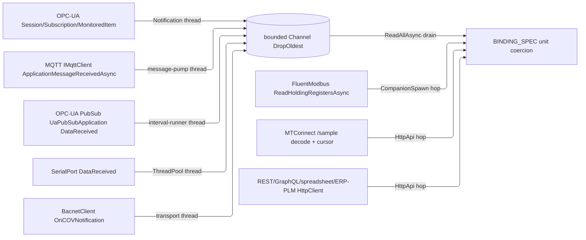
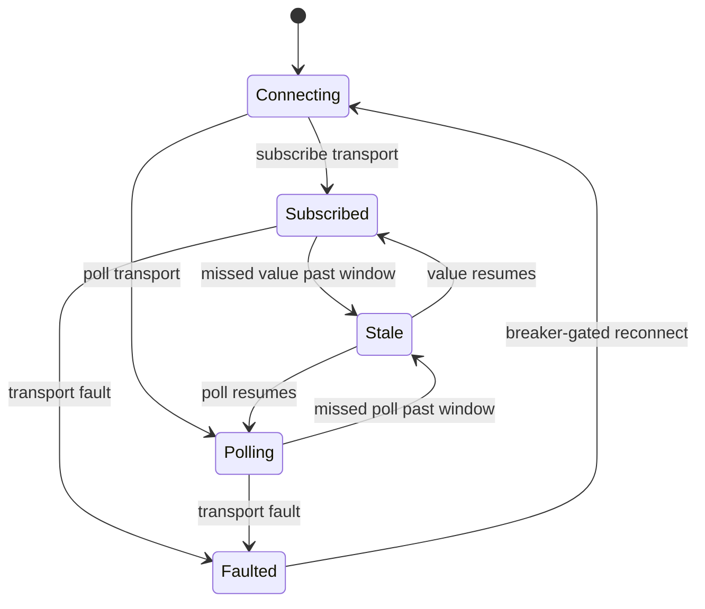

# [APPHOST_LIVE_WIRE]

Rasm.AppHost owns one reactive bidirectional binding studio: industrial transport rows carry OPC-UA, Modbus, MQTT, serial, BACnet, MTConnect, REST, GraphQL, spreadsheet, and ERP/PLM through one read/write contract. Binding specs pair external sources with directed internal targets, inbound values coerce through the Compute unit algebra, write-back commits or rolls back with evidence, and binding health tracks connection state.

Live-wire composition consumes `QuantityFamily`/`UnitAlgebra`/`UnitPolicy`, `OutboundHop`/`OutboundSurface`, `SchedulePort`/`ScheduleEntry`, `CommandAlgebra`, `DeadlineClass`, `DegradationLevel`, and `ReceiptSinkPort`; this page owns the transport axis, binding direction, edge coercion, write transaction, and health lifecycle, and it mints no eighth port.

## [01]-[INDEX]

- [02]-[TRANSPORT_AXIS]: Ten industrial-transport rows with one read/write adapter contract.
- [03]-[TRANSPORT_BINDING]: Per-case `Read`/`Write` dispatch; OPC-UA session/subscription and MQTT client.
- [04]-[BINDING_SPEC]: Source-target binding, direction, edge unit coercion, and poll/subscribe cadence.
- [05]-[WRITE_BACK]: Outbound write-back transaction, acknowledgement, and rollback.
- [06]-[BINDING_HEALTH]: Per-binding connect/subscribe/stale/fault lifecycle and health contribution.
- [07]-[TS_PROJECTION]: Binding-status and write-receipt wire shapes the studio dashboard consumes.

## [02]-[TRANSPORT_AXIS]

- Owner: `ExternalTransport` `[SmartEnum<string>]` the ten-row industrial-transport axis under the `ComparerAccessors.StringOrdinal` accessor; `TransportRow` per-transport policy record; `TransportRows` the frozen row set with the total dispatch; `WireFault` `[Union]` fault family deriving its codes through `FaultBand.LiveWire`; `ExternalValue` the at-edge value carrier.
- Cases: opc-ua, modbus, mqtt, serial, bacnet, mtconnect, rest, graphql, spreadsheet, erp-plm — each carrying its read shape (poll versus subscribe), its write capability, and the outbound hop class its bytes ride; bacnet is the building-management edge (COV-subscribed metered points, confirmed-request write) and mtconnect the machine-tool observation edge (the `-Common` model slice over the row's HTTP hop, read-only); `WireFault` = Text | ConnectRejected | ReadFailed | WriteRejected | UnitRejected | StaleSource.
- Entry: `TransportRow Row` is the extension property total state-free `Switch` from transport to frozen row; the `Read(TransportRow row, BindingSpec spec, CancellationToken token)` returning `IO<ExternalValue>` and `Write(TransportRow row, BindingSpec spec, ExternalValue value, CancellationToken token)` returning `IO<HopReceipt>` dispatch on the row's `Transport.Switch` to the per-case binding at `Wire/livewire#TRANSPORT_BINDING`, so the axis owns the row shape and the binding cluster owns each protocol's client surface.
- Auto: a `Subscribe`-shaped transport (OPC-UA, MQTT) opens a streaming subscription whose values arrive as a reactive sequence, while a `Poll`-shaped transport (Modbus, REST, GraphQL, spreadsheet, ERP/PLM) reads on a `SchedulePort` cadence row, so the binding engine reads both shapes through one contract differing only by the row's `ReadShape` column; the transport bytes ride the existing `OutboundHop` cases — REST and GraphQL on `HttpApi`, MQTT and OPC-UA on a keyed `LocalIpc`/`ServerStream` pipeline, serial and Modbus on the `CompanionSpawn` process-spawn adapter where the FluentModbus/`SerialPort` client owns the line inside the companion — so the resilience, retry, and breaker semantics are the existing hop policy, never a per-transport retry loop; the `Writable` column gates the write-back so a read-only source (a spreadsheet view) rejects a write at the row, never at the transaction.
- Receipt: `ExternalValue` carries the raw value, its declared unit, the source quality flag, and the source timestamp; the read and write transitions log through one `SpineLog` event.
- Packages: OPCFoundation.NetStandard.Opc.Ua, OPCFoundation.NetStandard.Opc.Ua.PubSub, MQTTnet, FluentModbus, System.IO.Ports, BACnet, MTConnect.NET-Common, Thinktecture.Runtime.Extensions, LanguageExt.Core, NodaTime, BCL inbox
- Growth: one transport row absorbs a new industrial edge — a new fieldbus or ERP connector is one `ExternalTransport` row carrying its read shape, write capability, and hop class, never a parallel adapter; a new fault is one `WireFault` case; zero new surface.
- Boundary: the transport axis is the only external-binding owner — a per-protocol client, a protocol-specific binding service, and a parallel poller are the deleted forms, so all ten transports ride one adapter contract; the OPC-UA leg composes the OPC-Foundation-certified `OPCFoundation.NetStandard.Opc.Ua` session/subscription/monitored-item surface (with `.PubSub` for the PubSub-over-MQTT leg), the MQTT leg composes `MQTTnet`, and the REST/GraphQL legs compose the existing `OutboundHop.HttpApi` — a hand-rolled OPC-UA or MQTT client is the deleted form; the transport never owns its own resilience — it composes the `OutboundHop` row its bytes ride, so a flapping Modbus source breaks on the same circuit breaker an HTTP API breaks on; the at-edge value carries its declared unit so the coercion at `BINDING_SPEC` reads a known unit, never a guessed one; a subscribe transport's reactive sequence and a poll transport's scheduled read are one inbound contract, so the binding engine never branches on transport at the call site; serial and spreadsheet transports that have no native streaming poll on the schedule cadence, so the cadence is the row's read mechanism, not a transport quirk.

```csharp signature
[SmartEnum<string>]
[KeyMemberEqualityComparer<ComparerAccessors.StringOrdinal, string>]
[KeyMemberComparer<ComparerAccessors.StringOrdinal, string>]
public sealed partial class ReadShape {
    public static readonly ReadShape Poll = new("poll");
    public static readonly ReadShape Subscribe = new("subscribe");
}

[SmartEnum<string>]
[KeyMemberEqualityComparer<ComparerAccessors.StringOrdinal, string>]
[KeyMemberComparer<ComparerAccessors.StringOrdinal, string>]
public sealed partial class ExternalTransport {
    public static readonly ExternalTransport OpcUa = new("opc-ua");
    public static readonly ExternalTransport Modbus = new("modbus");
    public static readonly ExternalTransport Mqtt = new("mqtt");
    public static readonly ExternalTransport Serial = new("serial");
    public static readonly ExternalTransport Bacnet = new("bacnet");
    public static readonly ExternalTransport Mtconnect = new("mtconnect");
    public static readonly ExternalTransport Rest = new("rest");
    public static readonly ExternalTransport GraphQl = new("graphql");
    public static readonly ExternalTransport Spreadsheet = new("spreadsheet");
    public static readonly ExternalTransport ErpPlm = new("erp-plm");
}

[Union]
public abstract partial record WireFault : Expected, IValidationError<WireFault> {
    private WireFault(string detail, int code) : base(detail, code, None) { }
    public static WireFault Create(string message) => new Text(message);
    public sealed record Text : WireFault { public Text(string detail) : base(detail, FaultBand.LiveWire.Code(0)) { } }
    public sealed record ConnectRejected : WireFault { public ConnectRejected(string detail) : base(detail, FaultBand.LiveWire.Code(1)) { } }
    public sealed record ReadFailed : WireFault { public ReadFailed(string detail) : base(detail, FaultBand.LiveWire.Code(2)) { } }
    public sealed record WriteRejected : WireFault { public WriteRejected(string detail) : base(detail, FaultBand.LiveWire.Code(3)) { } }
    public sealed record UnitRejected : WireFault { public UnitRejected(string detail) : base(detail, FaultBand.LiveWire.Code(4)) { } }
    public sealed record StaleSource : WireFault { public StaleSource(string detail) : base(detail, FaultBand.LiveWire.Code(5)) { } }
}

public readonly record struct ExternalValue(
    double Raw,
    string Unit,
    bool Good,
    Instant SourceAt);

[SmartEnum<string>]
[KeyMemberEqualityComparer<ComparerAccessors.StringOrdinal, string>]
[KeyMemberComparer<ComparerAccessors.StringOrdinal, string>]
public sealed partial class WireProtocol {
    public static readonly WireProtocol None = new("none");
    public static readonly WireProtocol MqttJson = new("mqtt-json");
    public static readonly WireProtocol MqttUadp = new("mqtt-uadp");
    public static readonly WireProtocol UdpUadp = new("udp-uadp");
}

public sealed record TransportRow(
    ExternalTransport Transport,
    ReadShape ReadShape,
    bool Writable,
    OutboundHop Hop,
    DeadlineClass Attempt,
    WireProtocol Protocol);

public static class TransportRows {
    public static readonly TransportRow OpcUa = new(ExternalTransport.OpcUa, ReadShape.Subscribe, Writable: true, new OutboundHop.ServerStream(new Uri("opc.tcp://localhost")), DeadlineClass.HopAttempt, WireProtocol.None);
    public static readonly TransportRow Modbus = new(ExternalTransport.Modbus, ReadShape.Poll, Writable: true, new OutboundHop.CompanionSpawn(new ProcessStartInfo("rasm-modbus")), DeadlineClass.HopAttempt, WireProtocol.None);
    public static readonly TransportRow Mqtt = new(ExternalTransport.Mqtt, ReadShape.Subscribe, Writable: true, new OutboundHop.ServerStream(new Uri("mqtt://localhost")), DeadlineClass.HopAttempt, WireProtocol.None);
    public static readonly TransportRow Serial = new(ExternalTransport.Serial, ReadShape.Poll, Writable: true, new OutboundHop.CompanionSpawn(new ProcessStartInfo("rasm-serial")), DeadlineClass.HopAttempt, WireProtocol.None);
    public static readonly TransportRow Bacnet = new(ExternalTransport.Bacnet, ReadShape.Subscribe, Writable: true, new OutboundHop.ServerStream(new Uri("bacnet://localhost")), DeadlineClass.HopAttempt, WireProtocol.None);
    public static readonly TransportRow Mtconnect = new(ExternalTransport.Mtconnect, ReadShape.Poll, Writable: false, new OutboundHop.HttpApi(new Uri("http://localhost:5000")), DeadlineClass.HopAttempt, WireProtocol.None);
    public static readonly TransportRow Rest = new(ExternalTransport.Rest, ReadShape.Poll, Writable: true, new OutboundHop.HttpApi(new Uri("https://localhost")), DeadlineClass.HopAttempt, WireProtocol.None);
    public static readonly TransportRow GraphQl = new(ExternalTransport.GraphQl, ReadShape.Poll, Writable: true, new OutboundHop.HttpApi(new Uri("https://localhost/graphql")), DeadlineClass.HopAttempt, WireProtocol.None);
    public static readonly TransportRow Spreadsheet = new(ExternalTransport.Spreadsheet, ReadShape.Poll, Writable: false, new OutboundHop.HttpApi(new Uri("https://localhost")), DeadlineClass.HopAttempt, WireProtocol.None);
    public static readonly TransportRow ErpPlm = new(ExternalTransport.ErpPlm, ReadShape.Poll, Writable: true, new OutboundHop.HttpApi(new Uri("https://localhost")), DeadlineClass.HopAttempt, WireProtocol.None);

    extension(ExternalTransport transport) {
        public TransportRow Row => transport.Switch(
            opcUa: static () => OpcUa,
            modbus: static () => Modbus,
            mqtt: static () => Mqtt,
            serial: static () => Serial,
            bacnet: static () => Bacnet,
            mtconnect: static () => Mtconnect,
            rest: static () => Rest,
            graphQl: static () => GraphQl,
            spreadsheet: static () => Spreadsheet,
            erpPlm: static () => ErpPlm);
    }
}
```

## [03]-[TRANSPORT_BINDING]

- Owner: `TransportRows.Read`/`TransportRows.Write` the per-case `ExternalTransport.Switch` dispatch from row to its protocol binding; `OpcUaLane` the held OPC-UA session/subscription/monitored-item owner whose subscription callbacks feed one bounded lane; `MqttLane` the held `IMqttClient` owner whose `ApplicationMessageReceivedAsync` callback feeds the same lane shape; `PubSubLane` the held `UaPubSubApplication` owner whose `DataReceived` dataset fan feeds the SAME bounded lane the per-node OPC-UA subscription drains into; `HttpPoll` the REST/GraphQL/spreadsheet/ERP-PLM body over the row's `OutboundHop.HttpApi`; `ModbusLane` the `FluentModbus` `ModbusClient` register-window body and `SerialLane` the `System.IO.Ports` `SerialPort` line-frame body, both over the row's `OutboundHop.CompanionSpawn`; `BacnetLane` the `BacnetClient` COV-subscription owner whose notification callback feeds the same bounded lane with `ReadPropertyRequest` the poll fallback; `MtconnectLane` the read-only `-Common` model-slice decode over the row's HTTP hop with the `MTConnectClientInformation` durable cursor; `MachineLane` the machine-observation decode lane — a `BindingSpec.Machine`-sliced inbound value projects once into one typed `MachineObservationWire` (value, unit, machine identity, freshness instant) fanned under `InstrumentFan.ObservationKind`, the single decoded truth Fabrication's wear, fleet-performance, and engagement consumers read, never a direct transport reference and never three decoders; `SubscriptionLane` the bounded `Channel<ExternalValue>` value carrier the foreign callback writes and the reactive read drains, holding the `Atom<Gate>` lifecycle cell; `LiveClient` `[Union]` the held-connection family — `Opc` carries the `Session`, `Mqtt` the `IMqttClient`, `Serial` the `SerialPort`, `Modbus` the `ModbusClient`, `PubSub` the `UaPubSubApplication`, `Bacnet` the `BacnetClient`, `Mtconnect` the cursor — so one `Gate.Live(Guid, LiveClient)` cell serves every protocol; `OpcUaRuntime`/`MqttRuntime`/`ModbusRuntime`/`SerialRuntime`/`PubSubRuntime`/`BacnetRuntime`/`MtconnectRuntime` the held per-protocol configuration, factory, and lane-accessor state the `LiveWireRuntime` composes.
- Cases: read dispatch is the ten-arm `Transport.Switch` — OPC-UA, MQTT, and OPC-UA-PubSub drain their lane's `ReadAllAsync` head, Modbus reads its window through the window's own `ModbusSpace` row body, serial reads its line frame through `SerialPort.ReadLine`/`ReadExisting` behind a `BytesToRead` gate, BACnet drains its COV lane (with the `Recover` stale-lane read), MTConnect parses the `/sample` document through `ResponseDocumentFormatter` into the `Observation` stream over the row's HTTP hop, REST/GraphQL/spreadsheet/ERP-PLM read once through `OutboundHop.HttpApi`; write dispatch is the same ten-arm `Switch` — OPC-UA writes one `WriteValue`, MQTT publishes one `MqttApplicationMessage`, Modbus writes through the space row's write body, serial writes one `WriteLine`, the HTTP transports ride a `PutAsync` body, BACnet writes one confirmed `WritePropertyRequest` at the point's priority-array slot, the non-writable spreadsheet and MTConnect rows reject at the row and the read-only Modbus spaces at theirs.
- Entry: each subscribe adapter owns its concrete opener — `OpcUaLane.Subscribe`, `MqttLane.Subscribe`, `PubSubLane.Subscribe`, `SerialLane.Attach`, or `BacnetLane.Subscribe` — returning `IO<SubscriptionLane>` after attaching its foreign callback; `TransportRows.Read` drains the composition-held lane for subscribe rows or runs one poll body over the row's hop; `TransportRows.Write` dispatches the at-edge value through the row's protocol or hop.
- Auto: the OPC-UA leg composes the high-level managed `Opc.Ua.Client` API — `Session.CreateAsync(configuration, reverseConnectManager, endpoint, updateBeforeConnect, checkDomain, sessionName, sessionTimeout, userIdentity, preferredLocales, ct)` mints the session over the configuration-loaded endpoint, a `Subscription(telemetry)` carries `PublishingInterval`, `KeepAliveCount`, and `LifetimeCount` as policy ints read off the row, `subscription.AddItem(new MonitoredItem(telemetry){ StartNodeId, AttributeId, MonitoringMode, SamplingInterval })` and `subscription.CreateAsync(ct)` arm the monitored node, and the `monitoredItem.Notification` event hands each `MonitoredItemNotificationEventArgs.NotificationValue` cast to `MonitoredItemNotification` whose `Value` is one `DataValue` — the callback projects `DataValue.Value`/`StatusCode`/`SourceTimestamp` into `ExternalValue` and `TryWrite`s it into the bounded lane, never running the interior on the foreign thread; the OPC-UA read-back and write-back ride `Session.ReadAsync(requestHeader, maxAge, TimestampsToReturn.Both, nodesToRead, ct)` and `Session.WriteAsync(requestHeader, nodesToWrite, ct)` inherited from `SessionClient`, building `ReadValueIdCollection`/`WriteValueCollection` from the binding's node id; the MQTT leg composes `MqttClientFactory.CreateMqttClient()` returning `IMqttClient` (v5 keeps the interface), `ConnectAsync(options, ct)` over a `MqttClientOptionsBuilder` carrying connection uri, client id, keep-alive, clean-start, session-expiry, and last-will as policy data, `SubscribeAsync(options, ct)` over one `WithTopicFilter(topic, qos, noLocal, retainAsPublished, retainHandling)`, and the `ApplicationMessageReceivedAsync` handler decodes `MqttApplicationMessageReceivedEventArgs.ApplicationMessage.Payload` (`ReadOnlySequence<byte>`) at the boundary and `TryWrite`s into the same bounded lane, with the inbound write-back as one `PublishAsync` over a `MqttApplicationMessageBuilder` carrying topic, payload, qos, and retain; QoS, retain, last-will, and session-expiry are policy columns on `TransportRow`, never new cases or transports; the Modbus leg composes the `FluentModbus` `ModbusClient` base surface (the TCP/RTU clients inherit the function-code operations) through the window's own `ModbusSpace` row, which carries its read and write bodies as `[UseDelegateFromConstructor]` columns over all four protocol address spaces — the register spaces reinterpret their window as `Task<Memory<short>>` through `ReadHoldingRegistersAsync<short>`/`ReadInputRegistersAsync<short>(unitId, startAddress, count, ct)` and fold it into one `double` under the window's `ModbusEndianness`, the bit spaces read `Task<Memory<byte>>` through `ReadCoilsAsync`/`ReadDiscreteInputsAsync(unitId, startAddress, quantity, ct)` one bit per point and cross as 0/1 against a dimensionless family, `WriteSingleRegisterAsync(unitId, registerAddress, short, ct)` writes the one-register window and `WriteMultipleRegistersAsync(unitId, startAddress, short[], ct)` the block, `WriteSingleCoilAsync(unitId, registerAddress, bool, ct)` the coil, and the input-register and discrete-input rows refuse their write at the row because the protocol declares them read-only; the `ModbusWindow` (`unitId`/`startAddress`/`count`/`endianness`/`space`) is `PollPolicy.Register` binding-spec policy data, never a per-read flag; the serial leg composes `System.IO.Ports.SerialPort` — `ReadLine`/`ReadExisting` for a line-framed protocol behind a `BytesToRead` presence gate and `WriteLine` for the inbound write, the `SerialFraming` (`baudRate`/`parity`/`dataBits`/`stopBits`/`handshake`/`newLine`/`lineFramed`/`readTimeout`/`writeTimeout`/`rts`/`dtr`) carried as `PollPolicy.Line` binding-spec policy, `ReadTimeout`/`WriteTimeout` bounding a wait that otherwise defaults to `InfiniteTimeout` and `RtsEnable` driving the RS-485 half-duplex transceiver line under every Modbus-RTU and BACnet MS/TP bus; the serial subscribe variant `SerialLane.Attach` opens the port, wires the `DataReceived` event (firing on a `ThreadPool` thread) to `TryWrite` one parsed `ExternalValue` into the bounded lane at the boundary and `ErrorReceived` to a not-good value, so a streaming serial line rides the SAME bounded lane the OPC-UA/MQTT subscriptions ride; the REST/GraphQL/spreadsheet/ERP-PLM legs compose the held `HttpClient` over `OutboundHop.HttpApi` — a `PollPolicy.Http` carries the resource path and the optional GraphQL query, REST a `GetAsync`, GraphQL a `PostAsync` of the query body, spreadsheet a read-only range fetch, each projecting the response body into one `ExternalValue`; the OPC-UA PubSub leg composes `UaPubSubApplication.Create(configPath, telemetry, dataStore)`/`Start`/`Stop` whose `DataReceived` `SubscribedDataEventArgs` dataset fan projects each `DataSet.Fields` field into one `ExternalValue` and `TryWrite`s into the SAME bounded lane the per-node OPC-UA subscription drains into — one PubSub application per process, the high-throughput fan-in path the per-item subscription cannot scale to, a `WireProtocol` row variant (mqtt-json/mqtt-uadp/udp-uadp) on the OPC-UA transport, never a parallel transport; the BACnet leg composes `BacnetClient` over `BacnetIpUdpProtocolTransport` — `RegisterAsForeignDevice(bbmdIp, ttl, port)` registers with the BBMD BEFORE `Start()` where the runtime carries a `BbmdRegistration`, since `WhoIs` reaches the local broadcast domain alone and a controller on another VLAN never answers without it, and the TTL renewal is one `OccurrenceSpec.Every` `ScheduleEntry` on the page's own `SchedulePort`; `SubscribeCOVRequest(adr, objectId, subscribeId, cancel, issueConfirmedNotifications, lifetime, invokeId)` arms the metered points under the point's own `Confirmed` column and `OnCOVNotification` (the `COVNotificationHandler` firing on a transport thread with the `ICollection<BacnetPropertyValue>` triple set) projects each `BacnetValue` into one `ExternalValue` and `TryWrite`s into the SAME bounded lane every subscribe transport rides, the detach closure calling that same member with `cancel: true` before disposal so the device stops publishing into a closed transport; the stale-lane `Recover` reads the point's `TrendLog` column — `ReadRangeRequest(adr, trendLog, readFrom, ref quantity, out range)` drains the device's own history from the lane watermark into that same bounded lane when the point names a history object, `ReadPropertyRequest(adr, objectId, propertyId, out IList<BacnetValue>, invokeId)` reads the one current value when it does not — and `WritePropertyRequest(adr, objectId, propertyId, valueList, invokeId, priority)` writes at the point's priority-array slot (1-16, the assembly's own admitted range) with a `None` value the RELEASE at that same slot; the point map (object id / property id / COV lifetime / confirmed / priority / trend log) is binding-spec DATA; the MTConnect leg composes the `-Common` MODEL slice ONLY (no bundled HTTP/MQTT client — transport is firewalled to the row's `OutboundHop.HttpApi`): `ResponseDocumentFormatter` parses the `/sample` body into a `StreamsResponseDocument` whose traversal projects each `Observation` into one `ExternalValue`, and `MTConnectClientInformation` is the durable poll cursor (`InstanceId` + `LastSequence`, `Save` after each drain, an `InstanceId` change forcing re-`current`) mirroring the outbox watermark discipline.
- Receipt: the OPC-UA `DataValue`, the MQTT decoded payload, the Modbus register window, the serial line frame, the HTTP response body, and the PubSub dataset field each mint one `ExternalValue` carrying raw value, declared unit, the source quality flag, and the source timestamp; MQTT CONNACK and every SUBACK item admit before the live client publishes, with a refused reason code projected onto `WireFault`; the lane drain at `BINDING_SPEC` coerces the unit before the value enters the suite.
- Packages: OPCFoundation.NetStandard.Opc.Ua, OPCFoundation.NetStandard.Opc.Ua.PubSub, MQTTnet, FluentModbus, System.IO.Ports, BACnet, MTConnect.NET-Common, LanguageExt.Core, NodaTime, Thinktecture.Runtime.Extensions, BCL `System.Net.Http`/`System.Text.Json`
- Growth: a new subscribe transport is one `Subscribe`/`Attach` arm feeding the one lane shape; a new poll transport is one `Read`/`Write` arm over its hop; a new Modbus address space is one `ModbusSpace` row carrying its two bodies and the lane gains no branch; a new serial line-discipline knob is one `SerialFraming` column; a new BACnet request knob is one `BacnetPoint` column; a new PubSub message mapping is one `WireProtocol` row; one bounded lane shape serves every subscribe transport and every backfilled history sample; zero new surface.
- Boundary: this cluster is the only protocol-client owner — a per-protocol binding service and a parallel poller are the deleted forms; the foreign OPC-UA monitored-item thread, the MQTT message-pump thread, the serial `DataReceived` `ThreadPool` thread, and the PubSub interval-runner thread never run the interior — each callback projects its raw value into `ExternalValue` and `TryWrite`s into the bounded `Channel<ExternalValue>` under `BoundedChannelFullMode.DropOldest` (boundaries.md SUBSCRIPTION_VALUE/HANDOFF_DRAIN), so producer back-pressure is the lane's declared drop policy and the reactive consumer drains at its own pace; the held session, client, port, Modbus connection, and PubSub application live in one `Atom<Gate>` token-gated state cell per binding carrying a `LiveClient.Opc`/`Mqtt`/`Serial`/`Modbus`/`PubSub` (boundaries.md TOKEN_LIFECYCLE) so a reconnect replaces the whole cell and a stale teardown that lost its token never disposes a fresh handle; the per-row retry is the channel's own auto-reconnect (MQTT) XOR the seam's `OutboundHop` redial — never both — so a subscribe transport's reconnect rides the protocol client and a poll transport's retry rides the `CompanionSpawn`/`HttpApi` hop, the one-retry-owner law the transport axis declares — never a FluentModbus or `SerialPort` reconnect loop; a `ModbusException`/`SerialError`/`ModbusFrameError` projects to `WireFault.ReadFailed`/`WriteRejected` at the boundary, never propagating into the interior; the register-window decode reads the `ModbusEndianness` off the window, never a guessed byte order, and the address space is the closed `ModbusSpace` row carrying its own read and write bodies, so a `bool Holding` two-valued switch reaching half a closed protocol — leaving every coil and discrete input unbindable — and a lane-side space branch beside it are both the deleted forms; a transport call whose VALUE the read reports runs INSIDE the hop through `OutboundSurface.Carry`, so the reported value and the receipt describe one frame and the second raw untimed call is the deleted form; a serial read gates on `BytesToRead` under a finite `ReadTimeout` and parses into `Option<double>`, so a silent line neither parks the poll thread nor mints a `NaN` the coercion admits as a real measurement — the sentinel-as-value pair is the deleted form; a BACnet write carries the point's priority-array slot and its `None` release, so a host override is revocable, and a device-default write no later write can distinguish is the deleted form; a stale COV lane recovers through the point's declared history object, so the samples between a dropped subscription and its recovery are read back rather than lost, and a current-value-only fallback beside a device that buffers them is the deleted form; a BBMD-routed binding registers as a foreign device before `Start()` and renews on one `ScheduleEntry`, so a background re-registration timer beside the scheduler is the deleted form; the OPC-UA `Subscription.CurrentPublishingInterval` is a `double`, never a `TimeSpan`, so the row carries the publishing interval as the int `PublishingInterval` the subscription sets and reads the negotiated `double` back without a unit cast; the at-edge `DataValue.SourceTimestamp`, the MQTT receive instant, the serial/Modbus/HTTP read instant, and the PubSub `Value.SourceTimestamp` cross as the value's `SourceAt` so the staleness check at `BINDING_HEALTH` reads a real source clock, never the host clock; the MQTT legs are the trace-carrier mount — `MqttLane.Write` threads `TraceContext.Inject` over the message builder before `Build()` and the receive pump continues the propagated context through the seam owner's own `MqttApplicationMessage` overload, consumer-kinded, so broker-hop trace continuity is wholly the adapter's and this runtime carries no extraction delegate to compose; the BACnet point map (`BacnetObjectId`/`BacnetPropertyIds`/COV lifetime) is `PollPolicy.Point` binding-spec DATA and the COV/write request bindings are `BacnetRuntime` composition slots, so protocol-signature drift lands at one composition seat; the MTConnect cursor is durable poll state — `MTConnectClientInformation.Read(string deviceKey, string path = null)` restores it, `Save(string path = null)` commits it after each drain, and an `InstanceId` change forces a full re-current, the outbox watermark discipline at the machine edge.

```csharp signature
[Union(ConversionFromValue = ConversionOperatorsGeneration.None)]
public abstract partial record LiveClient {
    private LiveClient() { }
    public sealed record Opc(Session Session) : LiveClient;
    public sealed record Mqtt(IMqttClient Client) : LiveClient;
    public sealed record Serial(SerialPort Port) : LiveClient;
    public sealed record Modbus(ModbusClient Client) : LiveClient;
    public sealed record PubSub(UaPubSubApplication Application) : LiveClient;
    public sealed record Bacnet(BacnetClient Client) : LiveClient;
    public sealed record Mtconnect(MTConnectClientInformation Cursor) : LiveClient;
}

[Union(ConversionFromValue = ConversionOperatorsGeneration.None)]
public abstract partial record Gate {
    private Gate() { }
    public sealed record Pending : Gate;
    public sealed record Live(Guid Token, LiveClient Client) : Gate;
    public sealed record Failed(WireFault Reason) : Gate;
}

public sealed record SubscriptionLane(
    Channel<ExternalValue> Values,
    Action Detach,
    Atom<Gate> Cell);

public sealed record OpcUaBinding(
    Session Session,
    Subscription Subscription,
    MonitoredItem Item);

public sealed record OpcUaRuntime(
    ApplicationConfiguration Configuration,
    ReverseConnectManager ReverseConnect,
    ITelemetryContext Telemetry,
    IUserIdentity Identity,
    IList<string> Locales,
    uint SessionTimeout,
    int PublishingInterval,
    uint KeepAliveCount,
    uint LifetimeCount,
    int SamplingInterval,
    Func<string, ConfiguredEndpoint> Endpoint,
    Func<string, Session> Held,
    Func<string, Channel<ExternalValue>> Lane);

public sealed record MqttRuntime(
    MqttClientFactory Factory,
    Duration KeepAlive,
    bool CleanStart,
    uint SessionExpiry,
    MqttQualityOfServiceLevel Qos,
    bool Retain,
    Func<string, IMqttClient> Client,
    Func<string, Channel<ExternalValue>> Lane);

public sealed record ModbusRuntime(
    Func<string, ModbusClient> Held,
    Func<string, Channel<ExternalValue>> Lane);

public sealed record SerialRuntime(
    Func<string, SerialPort> Held,
    Func<string, Channel<ExternalValue>> Lane);

public sealed record PubSubRuntime(
    ITelemetryContext Telemetry,
    IUaPubSubDataStore DataStore,
    Func<string, string> ConfigPath,
    Func<string, UaPubSubApplication> Held,
    Func<string, Channel<ExternalValue>> Lane);

// The BACnet point map, binding-spec DATA. Priority is the BACnet COMMAND PRIORITY ARRAY slot (1-16, the
// assembly's own admitted range): every host write lands at that slot and a RELEASE writes a null value at
// the SAME slot, so a host override is distinguishable from — and revocable against — a manual one, which a
// priority-less write can neither express nor undo. Confirmed selects the COV notification service
// (issueConfirmedNotifications) and TrendLog names the device's own history object the stale-lane recovery
// drains, so the samples a dropped subscription lost are read back rather than skipped.
public sealed record BacnetPoint(
    BacnetObjectId Object,
    BacnetPropertyIds Property,
    uint CovLifetime,
    Option<byte> Priority = default,
    bool Confirmed = true,
    Option<BacnetObjectId> TrendLog = default);

// BBMD foreign-device registration, the ONLY way a BACnet/IP binding crosses a subnet: the IP transport's
// WhoIs reaches the local broadcast domain alone, so a controller on another VLAN — the normal building
// deployment this transport row exists for — never answers. Ttl is the device's registration lifetime, and
// the re-registration cadence rides the page's own ScheduleEntry, never a background timer.
public sealed record BbmdRegistration(string BbmdIp, short Ttl, int Port = 47808);

public sealed record BacnetRuntime(
    Func<string, BacnetClient> Held,
    Func<string, BacnetAddress> Address,
    // Cov binds SubscribeCOVRequest(adr, objectId, subscribeId, cancel, issueConfirmedNotifications, lifetime,
    // invokeId) and the OnCOVNotification handler whose ICollection<BacnetPropertyValue> carries each
    // (property, value, priority) triple; cancel: true is the SAME member the detach closure calls, so
    // subscribe and unsubscribe are one binding rather than an orphaned lane the device keeps feeding.
    Action<BacnetClient, BacnetAddress, BacnetPoint, ChannelWriter<ExternalValue>> Cov,
    Func<BacnetClient, BacnetAddress, BacnetPoint, bool> Unsubscribe,
    // Write binds WritePropertyRequest(adr, objectId, propertyId, valueList, invokeId, priority) — the None
    // value is the priority-array RELEASE the same slot revokes.
    Func<BacnetClient, BacnetAddress, BacnetPoint, Option<double>, bool> Write,
    // DecodeTrend binds Serialize.Services.DecodeLogRecord(byte[] buffer, int offset, int length, int nCurves,
    // out BacnetLogRecord[] records), each record carrying `DateTime timestamp`, `BacnetTrendLogValueType type`,
    // the boxed `object Value` its type column decodes, and `BacnetBitString statusFlags` — the record's own
    // timestamp becomes the sample's SourceAt so a backfilled point reads on the SOURCE clock the staleness
    // check already trusts, never the host clock the drain happened to run under, and the status flags decide
    // Good rather than a blanket true.
    Func<string, byte[], uint, Seq<ExternalValue>> DecodeTrend,
    Option<BbmdRegistration> Bbmd,
    // The COV watermark: the last instant a lane accepted a good value, read by the stale recovery to bound
    // its ReadRangeRequest and advanced exactly as MtconnectRuntime.Advance commits its LastSequence.
    Func<string, Instant> Watermark,
    Action<string, Instant> Advance,
    Func<string, Channel<ExternalValue>> Lane);

public sealed record MtconnectRuntime(
    Func<string, MTConnectClientInformation> Cursor,
    // Decode parses the /sample body through ResponseDocumentFormatter.CreateStreamsResponseDocument(
    // string documentFormatterId, Stream content) returning FormatReadResult<IStreamsResponseDocument>,
    // then flattens IStreamsResponseDocument.GetObservations() (IEnumerable<IObservation>) into the
    // ExternalValue seq; the per-observation accessor and LastSequence numeric spellings ride the
    // terminal RESEARCH row.
    Func<string, string, Seq<ExternalValue>> Decode,
    Action<string> Advance);

public static class TransportRows {
    public static IO<ExternalValue> Read(LiveWireRuntime runtime, TransportRow row, BindingSpec spec, CancellationToken token) =>
        row.Transport.Switch(
            opcUa: static (s, _) => OpcUaLane.Read(s.Runtime, s.Spec, s.Token),
            mqtt: static (s, _) => MqttLane.Read(s.Runtime, s.Spec, s.Token),
            modbus: static (s, _) => ModbusLane.Read(s.Runtime, s.Row, s.Spec, s.Token),
            serial: static (s, _) => SerialLane.Read(s.Runtime, s.Row, s.Spec, s.Token),
            bacnet: static (s, _) => BacnetLane.Read(s.Runtime, s.Spec, s.Token),
            mtconnect: static (s, _) => MtconnectLane.Read(s.Runtime, s.Row, s.Spec, s.Token),
            rest: static (s, _) => HttpPoll.Read(s.Runtime, s.Row, s.Spec, s.Token),
            graphQl: static (s, _) => HttpPoll.Read(s.Runtime, s.Row, s.Spec, s.Token),
            spreadsheet: static (s, _) => HttpPoll.Read(s.Runtime, s.Row, s.Spec, s.Token),
            erpPlm: static (s, _) => HttpPoll.Read(s.Runtime, s.Row, s.Spec, s.Token),
            state: (Runtime: runtime, Row: row, Spec: spec, Token: token));

    public static IO<HopReceipt> Write(LiveWireRuntime runtime, TransportRow row, BindingSpec spec, ExternalValue value, CancellationToken token) =>
        !row.Writable
            ? IO.fail<HopReceipt>(new WireFault.WriteRejected(spec.ExternalAddress))
            : row.Transport.Switch(
                opcUa: static (s, _) => OpcUaLane.Write(s.Runtime, s.Spec, s.Value, s.Token),
                mqtt: static (s, _) => MqttLane.Write(s.Runtime, s.Spec, s.Value, s.Token),
                modbus: static (s, _) => ModbusLane.Write(s.Runtime, s.Row, s.Spec, s.Value, s.Token),
                serial: static (s, _) => SerialLane.Write(s.Runtime, s.Row, s.Spec, s.Value, s.Token),
                bacnet: static (s, _) => BacnetLane.Write(s.Runtime, s.Row, s.Spec, Some(s.Value), s.Token),
                mtconnect: static (s, _) => IO.fail<HopReceipt>(new WireFault.WriteRejected(s.Spec.ExternalAddress)),
                rest: static (s, _) => HttpPoll.Write(s.Runtime, s.Row, s.Spec, s.Value, s.Token),
                graphQl: static (s, _) => HttpPoll.Write(s.Runtime, s.Row, s.Spec, s.Value, s.Token),
                spreadsheet: static (s, _) => HttpPoll.Write(s.Runtime, s.Row, s.Spec, s.Value, s.Token),
                erpPlm: static (s, _) => HttpPoll.Write(s.Runtime, s.Row, s.Spec, s.Value, s.Token),
                state: (Runtime: runtime, Row: row, Spec: spec, Value: value, Token: token));
}

public static class HttpPoll {
    public static IO<ExternalValue> Read(LiveWireRuntime runtime, TransportRow row, BindingSpec spec, CancellationToken token) =>
        OutboundSurface.Run(runtime.Outbound, row.Hop, async ct => {
            var http = runtime.Http(spec.BindingId);
            using var response = spec.Poll switch {
                PollPolicy.Http { GraphQlQuery: { IsSome: true } q } =>
                    await http.PostAsync(spec.ExternalAddress, JsonContent.Create(new { query = q.IfNone(string.Empty) }, options: runtime.Wire), ct).ConfigureAwait(false),
                PollPolicy.Http h =>
                    await http.GetAsync(new Uri(spec.ExternalAddress) is var u && u.IsAbsoluteUri ? u.ToString() : h.ResourcePath, ct).ConfigureAwait(false),
                _ => await http.GetAsync(spec.ExternalAddress, ct).ConfigureAwait(false),
            };
            return response.IsSuccessStatusCode
                ? new HopOutcome.Delivered()
                : new HopOutcome.Faulted(Error.New(new WireFault.ReadFailed($"{spec.Transport.Key}:{(int)response.StatusCode}")));
        }).Bind(receipt => Project(runtime, row, spec, receipt, token));

    public static IO<HopReceipt> Write(LiveWireRuntime runtime, TransportRow row, BindingSpec spec, ExternalValue value, CancellationToken token) =>
        OutboundSurface.Run(runtime.Outbound, row.Hop, async ct => {
            using var response = await runtime.Http(spec.BindingId).PutAsync(
                spec.ExternalAddress,
                JsonContent.Create(new { value = value.Raw, unit = value.Unit }, options: runtime.Wire),
                ct).ConfigureAwait(false);
            return response.IsSuccessStatusCode
                ? new HopOutcome.Delivered()
                : new HopOutcome.Faulted(Error.New(new WireFault.WriteRejected($"{spec.Transport.Key}:{(int)response.StatusCode}")));
        });

    static IO<ExternalValue> Project(LiveWireRuntime runtime, TransportRow row, BindingSpec spec, HopReceipt receipt, CancellationToken token) =>
        receipt.Outcome is HopOutcome.Delivered
            ? IO.liftAsync(async () => {
                var body = await runtime.LastBody(spec.BindingId, token).ConfigureAwait(false);
                using var doc = JsonDocument.Parse(body);
                var root = doc.RootElement;
                var node = (spec.Poll as PollPolicy.Http)?.ResourcePath is { Length: > 0 } pointer && root.TryGetProperty(pointer, out var picked) ? picked : root;
                return new ExternalValue(
                    Raw: node.ValueKind == JsonValueKind.Number ? node.GetDouble() : double.Parse(node.GetString() ?? "0", CultureInfo.InvariantCulture),
                    Unit: spec.Family.Canonical.ToString(),
                    Good: true,
                    SourceAt: runtime.Clocks.Now);
            })
            : IO.fail<ExternalValue>(new WireFault.ReadFailed($"poll-read:{spec.Transport.Key}"));
}

// Both legs read the window's OWN ModbusSpace row and invoke its body, so the four address spaces cost this
// lane zero branches, the read-only refusal is the row's, and the register decode lives beside the read it
// gates. The prior form ran its transport call TWICE — once inside the hop for the outcome and once outside
// for the value — so every poll issued two frames and the reported value came from the untimed second one.
public static class ModbusLane {
    public static IO<ExternalValue> Read(LiveWireRuntime runtime, TransportRow row, BindingSpec spec, CancellationToken token) =>
        spec.Poll is PollPolicy.Register { Window: var w }
            ? OutboundSurface.Carry(runtime.Outbound, row.Hop, async ct =>
                  ((HopOutcome)new HopOutcome.Delivered(),
                   await w.Space.Read(runtime.Modbus.Held(spec.BindingId), w, ct).RunAsync().ConfigureAwait(false)))
                  .Map(raw => new ExternalValue(raw, spec.Family.Canonical.ToString(), Good: true, runtime.Clocks.Now))
            : IO.fail<ExternalValue>(new WireFault.ReadFailed($"modbus-window-missing:{spec.BindingId}"));

    public static IO<HopReceipt> Write(LiveWireRuntime runtime, TransportRow row, BindingSpec spec, ExternalValue value, CancellationToken token) =>
        spec.Poll is PollPolicy.Register { Window: var w }
            ? !w.Space.Writable
                ? IO.fail<HopReceipt>(new WireFault.WriteRejected($"modbus-space-read-only:{w.Space.Key}:{spec.BindingId}"))
                : OutboundSurface.Run(runtime.Outbound, row.Hop, async ct => {
                      await w.Space.Write(runtime.Modbus.Held(spec.BindingId), w, value.Raw, ct).RunAsync().ConfigureAwait(false);
                      return (HopOutcome)new HopOutcome.Delivered();
                  })
            : IO.fail<HopReceipt>(new WireFault.WriteRejected($"modbus-window-missing:{spec.BindingId}"));
}

// The read is gated TWICE and the parse is total: BytesToRead proves the line has a frame before ReadLine —
// the port's ReadTimeout bounds the wait, so a silent line surfaces as a not-good value inside the hop rather
// than parking the poll thread — and ParseFrame yields Option<double>, so an unparseable or empty frame is
// Good: false. The prior form turned an empty read into double.NaN and stamped Good: true, which LiveWire.Coerce
// admits and pushes into the suite as a real measurement.
public static class SerialLane {
    public static IO<ExternalValue> Read(LiveWireRuntime runtime, TransportRow row, BindingSpec spec, CancellationToken token) =>
        spec.Poll is PollPolicy.Line { Framing: var f }
            ? OutboundSurface.Carry(runtime.Outbound, row.Hop, _ => {
                  SerialPort port = runtime.Serial.Held(spec.BindingId);
                  return Task.FromResult(port switch {
                      { IsOpen: false } => ((HopOutcome)new HopOutcome.Faulted(Error.New(new WireFault.ConnectRejected(spec.BindingId))), Option<double>.None),
                      { BytesToRead: 0 } => (new HopOutcome.Delivered(), Option<double>.None),
                      _ => (new HopOutcome.Delivered(), ParseFrame(f.LineFramed ? port.ReadLine() : port.ReadExisting())),
                  });
              }).Map(parsed => new ExternalValue(
                  Raw: parsed.IfNone(0d),
                  Unit: spec.Family.Canonical.ToString(),
                  Good: parsed.IsSome,
                  SourceAt: runtime.Clocks.Now))
            : IO.fail<ExternalValue>(new WireFault.ReadFailed($"serial-framing-missing:{spec.BindingId}"));

    public static IO<HopReceipt> Write(LiveWireRuntime runtime, TransportRow row, BindingSpec spec, ExternalValue value, CancellationToken token) =>
        spec.Poll is PollPolicy.Line { Framing.LineFramed: true }
            ? OutboundSurface.Run(runtime.Outbound, row.Hop, _ => {
                  runtime.Serial.Held(spec.BindingId).WriteLine(value.Raw.ToString(CultureInfo.InvariantCulture));
                  return Task.FromResult<HopOutcome>(new HopOutcome.Delivered());
              })
            : IO.fail<HopReceipt>(new WireFault.WriteRejected($"serial-not-line-framed:{spec.BindingId}"));

    // Absence, not a sentinel: a blank or malformed frame yields None and the constructing read stamps
    // Good: false, so no unparseable line ever crosses the edge wearing a value.
    static Option<double> ParseFrame(ReadOnlySpan<char> frame) =>
        double.TryParse(frame.Trim(), NumberStyles.Float, CultureInfo.InvariantCulture, out var parsed) && double.IsFinite(parsed)
            ? Some(parsed)
            : None;

    public static IO<SubscriptionLane> Attach(LiveWireRuntime runtime, TransportRow row, BindingSpec spec) =>
        spec.Poll is PollPolicy.Line { Framing: var f }
            ? from port in IO.lift(() => new SerialPort(spec.ExternalAddress, f.BaudRate, f.Parity, f.DataBits, f.StopBits) {
                  Handshake = f.Handshake,
                  NewLine = f.NewLine,
                  ReadTimeout = f.ReadTimeout,
                  WriteTimeout = f.WriteTimeout,
                  RtsEnable = f.Rts,
                  DtrEnable = f.Dtr,
              })
              let lane = SubscriptionLane.Open()
              from _ in IO.lift(() => Wire(port, spec, lane.Writer, runtime))
              from __ in IO.lift(() => { port.Open(); return unit; })
              select new SubscriptionLane(lane, () => port.Close(), Atom<Gate>(new Gate.Live(Guid.NewGuid(), new LiveClient.Serial(port))))
            : IO.fail<SubscriptionLane>(new WireFault.ConnectRejected($"serial-framing-missing:{spec.BindingId}"));

    static Unit Wire(SerialPort port, BindingSpec spec, ChannelWriter<ExternalValue> sink, LiveWireRuntime runtime) {
        port.DataReceived += (_, args) => {                                     // Exemption: the platform-forced callback seam; the interior never runs on this thread
            if (args.EventType == SerialData.Chars) {
                Option<double> parsed = ParseFrame(port.ReadLine());
                ignore(sink.TryWrite(new ExternalValue(
                    Raw: parsed.IfNone(0d),
                    Unit: spec.Family.Canonical.ToString(),
                    Good: parsed.IsSome,
                    SourceAt: runtime.Clocks.Now)));
            }
        };
        port.ErrorReceived += (_, _) => ignore(sink.TryWrite(new ExternalValue(0d, spec.Family.Canonical.ToString(), Good: false, runtime.Clocks.Now)));
        return unit;
    }
}

public static class SubscriptionLane {
    static readonly BoundedChannelOptions Options = new(capacity: 1024) {
        FullMode = BoundedChannelFullMode.DropOldest,
        SingleReader = true,
        SingleWriter = false,
    };

    public static Channel<ExternalValue> Open() => Channel.CreateBounded<ExternalValue>(Options);

    public static IO<ExternalValue> Drain(Channel<ExternalValue> lane, CancellationToken token) =>
        IO.liftAsync(async () => await lane.Reader.ReadAsync(token).ConfigureAwait(false));

    public static Unit Submit(ChannelWriter<ExternalValue> sink, ExternalValue value) =>
        ignore(sink.TryWrite(value));
}

public static class OpcUaLane {
    public static IO<SubscriptionLane> Subscribe(LiveWireRuntime runtime, TransportRow row, BindingSpec spec) =>
        from session in IO.liftAsync(() => Session.CreateAsync(
            runtime.OpcUa.Configuration, runtime.OpcUa.ReverseConnect, runtime.OpcUa.Endpoint(spec.ExternalAddress),
            updateBeforeConnect: false, checkDomain: false, sessionName: spec.BindingId,
            sessionTimeout: runtime.OpcUa.SessionTimeout, userIdentity: runtime.OpcUa.Identity,
            preferredLocales: runtime.OpcUa.Locales, ct: runtime.Spine.Token))
        let lane = SubscriptionLane.Open()
        let subscription = new Subscription(runtime.OpcUa.Telemetry) {
            PublishingInterval = runtime.OpcUa.PublishingInterval,
            KeepAliveCount = runtime.OpcUa.KeepAliveCount,
            LifetimeCount = runtime.OpcUa.LifetimeCount,
        }
        let item = new MonitoredItem(runtime.OpcUa.Telemetry) {
            StartNodeId = NodeId.Parse(spec.ExternalAddress),
            AttributeId = Attributes.Value,
            MonitoringMode = MonitoringMode.Reporting,
            SamplingInterval = runtime.OpcUa.SamplingInterval,
        }
        from _ in IO.lift(() => Attach(session, subscription, item, lane.Writer))
        from __ in IO.liftAsync(() => session.AddSubscription(subscription)
            ? subscription.CreateAsync(runtime.Spine.Token)
            : Task.CompletedTask)
        select new SubscriptionLane(lane, () => item.DetachNotificationEventHandlers(), Atom<Gate>(new Gate.Live(Guid.NewGuid(), new LiveClient.Opc(session))));

    public static IO<ExternalValue> Read(LiveWireRuntime runtime, BindingSpec spec, CancellationToken token) =>
        SubscriptionLane.Drain(runtime.OpcUa.Lane(spec.BindingId), token);

    public static IO<HopReceipt> Write(LiveWireRuntime runtime, BindingSpec spec, ExternalValue value, CancellationToken token) =>
        OutboundSurface.Run(runtime.Outbound, spec.Transport.Row.Hop, async ct =>
            await runtime.OpcUa.Held(spec.BindingId).WriteAsync(
                requestHeader: null,
                nodesToWrite: [new WriteValue {
                    NodeId = NodeId.Parse(spec.ExternalAddress),
                    AttributeId = Attributes.Value,
                    Value = new DataValue(new Variant(value.Raw)) { SourceTimestamp = value.SourceAt.ToDateTimeUtc() },
                }],
                ct: ct) is { Results: [var status] } && StatusCode.IsGood(status)
                    ? new HopOutcome.Delivered()
                    : new HopOutcome.Faulted(new WireFault.WriteRejected(spec.ExternalAddress)));

    static Unit Attach(Session session, Subscription subscription, MonitoredItem item, ChannelWriter<ExternalValue> sink) {
        item.Notification += (sender, args) => {
            if (args.NotificationValue is MonitoredItemNotification { Value: { } data }) {
                ignore(sink.TryWrite(new ExternalValue(
                    Raw: Convert.ToDouble(data.Value, CultureInfo.InvariantCulture),
                    Unit: sender.DisplayName ?? string.Empty,
                    Good: StatusCode.IsGood(data.StatusCode),
                    SourceAt: Instant.FromDateTimeUtc(DateTime.SpecifyKind(data.SourceTimestamp, DateTimeKind.Utc)))));
            }
        };
        subscription.AddItem(item);
        return unit;
    }
}

public static class MqttLane {
    public static IO<SubscriptionLane> Subscribe(LiveWireRuntime runtime, TransportRow row, BindingSpec spec) =>
        from client in IO.lift(() => runtime.Mqtt.Factory.CreateMqttClient())
        let lane = SubscriptionLane.Open()
        let options = runtime.Mqtt.Factory.CreateClientOptionsBuilder()
            .WithConnectionUri(spec.ExternalAddress)
            .WithClientId($"rasm-{spec.BindingId}")
            .WithKeepAlivePeriod(runtime.Mqtt.KeepAlive)
            .WithCleanStart(runtime.Mqtt.CleanStart)
            .WithSessionExpiryInterval(runtime.Mqtt.SessionExpiry)
            .Build()
        from _ in IO.lift(() => Attach(client, spec, lane.Writer, runtime))
        from connected in IO.liftAsync(() => client.ConnectAsync(options, runtime.Spine.Token))
        from connection in connected.ResultCode == MqttClientConnectResultCode.Success
            ? IO.pure(unit)
            : IO.fail<Unit>(new WireFault.ConnectRejected($"mqtt:{connected.ResultCode}"))
        from subscribed in IO.liftAsync(() => client.SubscribeAsync(
            runtime.Mqtt.Factory.CreateSubscribeOptionsBuilder()
                .WithTopicFilter(spec.ExternalAddress, runtime.Mqtt.Qos, noLocal: true, retainAsPublished: false, MqttRetainHandling.SendAtSubscribe)
                .Build(),
            runtime.Spine.Token))
        from subscription in subscribed.Items.Count == 1 && subscribed.Items.All(static item => (int)item.ResultCode < 128)
            ? IO.pure(unit)
            : IO.fail<Unit>(new WireFault.ReadFailed($"mqtt-suback:{string.Join(',', subscribed.Items.Select(static item => item.ResultCode))}"))
        select new SubscriptionLane(lane, () => ignore(client.DisconnectAsync()), Atom<Gate>(new Gate.Live(Guid.NewGuid(), new LiveClient.Mqtt(client))));

    public static IO<ExternalValue> Read(LiveWireRuntime runtime, BindingSpec spec, CancellationToken token) =>
        SubscriptionLane.Drain(runtime.Mqtt.Lane(spec.BindingId), token);

    // Publish edge: TraceContext.Inject threads traceparent/tracestate and baggage as v5 user
    // properties before Build(), so a broker hop continues the W3C trace the gRPC legs carry.
    public static IO<HopReceipt> Write(LiveWireRuntime runtime, BindingSpec spec, ExternalValue value, CancellationToken token) =>
        OutboundSurface.Run(runtime.Outbound, spec.Transport.Row.Hop, async ct =>
            await runtime.Mqtt.Client(spec.BindingId).PublishAsync(
                TraceContext.Inject(runtime.Mqtt.Factory.CreateApplicationMessageBuilder()
                        .WithTopic(spec.ExternalAddress)
                        .WithPayload(value.Raw.ToString(CultureInfo.InvariantCulture))
                        .WithQualityOfServiceLevel(runtime.Mqtt.Qos)
                        .WithRetainFlag(runtime.Mqtt.Retain))
                    .Build(),
                ct) is { IsSuccess: true }
                    ? new HopOutcome.Delivered()
                    : new HopOutcome.Faulted(new WireFault.WriteRejected(spec.ExternalAddress)));

    // Receive edge: the message-pump callback continues the propagated trace through the seam owner's own
    // `MqttApplicationMessage` overload before the value enters the lane — the getter is the adapter's, so
    // this runtime carries no extraction delegate to wire. A broker topic is a field-device carrier this
    // process never authorized, so tenancy REFUSES here and the wire entry clears rather than scoping a
    // tenant every receipt and RLS predicate on the lane would then disagree with.
    static Unit Attach(IMqttClient client, BindingSpec spec, ChannelWriter<ExternalValue> sink, LiveWireRuntime runtime) {
        client.ApplicationMessageReceivedAsync += args => {
            args.AutoAcknowledge = true;
            using var span = TraceContext.Continue(runtime.Traces, args.ApplicationMessage, $"mqtt-receive:{spec.BindingId}", TenantAdoption.Refused);
            ignore(sink.TryWrite(new ExternalValue(
                Raw: double.Parse(Encoding.UTF8.GetString(args.ApplicationMessage.Payload), CultureInfo.InvariantCulture),
                Unit: spec.Family.Canonical.ToString(),
                Good: true,
                SourceAt: SystemClock.Instance.GetCurrentInstant())));
            return Task.CompletedTask;
        };
        return unit;
    }
}

public static class PubSubLane {
    public static IO<SubscriptionLane> Subscribe(LiveWireRuntime runtime, TransportRow row, BindingSpec spec) =>
        from app in IO.lift(() => UaPubSubApplication.Create(runtime.PubSub.ConfigPath(spec.ExternalAddress), runtime.OpcUa.Telemetry, runtime.PubSub.DataStore))
        let lane = SubscriptionLane.Open()
        from _ in IO.lift(() => Attach(app, spec, lane.Writer, runtime))
        from __ in IO.lift(() => { app.Start(); return unit; })
        select new SubscriptionLane(lane, () => app.Stop(), Atom<Gate>(new Gate.Live(Guid.NewGuid(), new LiveClient.PubSub(app))));

    public static IO<ExternalValue> Read(LiveWireRuntime runtime, BindingSpec spec, CancellationToken token) =>
        SubscriptionLane.Drain(runtime.PubSub.Lane(spec.BindingId), token);

    static Unit Attach(UaPubSubApplication app, BindingSpec spec, ChannelWriter<ExternalValue> sink, LiveWireRuntime runtime) {
        app.DataReceived += (sender, args) => {
            foreach (var dataSet in args.DataSetMessages) {
                foreach (var field in dataSet.DataSet.Fields) {
                    ignore(sink.TryWrite(new ExternalValue(
                        Raw: Convert.ToDouble(field.Value.Value, CultureInfo.InvariantCulture),
                        Unit: field.TargetNodeId?.ToString() ?? spec.Family.Canonical.ToString(),
                        Good: StatusCode.IsGood(field.Value.StatusCode),
                        SourceAt: Instant.FromDateTimeUtc(DateTime.SpecifyKind(field.Value.SourceTimestamp, DateTimeKind.Utc)))));
                }
            }
        };
        return unit;
    }
}

public static class BacnetLane {
    // BBMD registration precedes Start(): WhoIs discovers only the local broadcast domain, so a foreign-device
    // registration is what makes the routed network answer at all, and the Ttl rides one ScheduleEntry on the
    // page's own SchedulePort — the row IS the re-registration mechanism, never a background timer beside it.
    // Detach unsubscribes at the device (cancel: true) BEFORE disposing the client, so a torn-down binding
    // stops the notification stream rather than leaving the device publishing into a closed transport.
    public static IO<SubscriptionLane> Subscribe(LiveWireRuntime runtime, TransportRow row, BindingSpec spec) =>
        spec.Poll is PollPolicy.Point { Map: var point }
            ? from client in IO.lift(() => runtime.Bacnet.Held(spec.BindingId))
              let address = runtime.Bacnet.Address(spec.ExternalAddress)
              let lane = SubscriptionLane.Open()
              from _ in IO.lift(() => { runtime.Bacnet.Cov(client, address, point, lane.Writer); return unit; })
              from __ in IO.lift(() => runtime.Bacnet.Bbmd.Match(
                  Some: bbmd => { client.RegisterAsForeignDevice(bbmd.BbmdIp, bbmd.Ttl, bbmd.Port); return unit; },
                  None: static () => unit))
              from ___ in IO.lift(() => { client.Start(); client.WhoIs(); return unit; })
              select new SubscriptionLane(
                  lane,
                  () => { ignore(runtime.Bacnet.Unsubscribe(client, address, point)); client.Dispose(); },
                  Atom<Gate>(new Gate.Live(Guid.NewGuid(), new LiveClient.Bacnet(client))))
            : IO.fail<SubscriptionLane>(new WireFault.ConnectRejected($"bacnet-point-missing:{spec.BindingId}"));

    // The BBMD re-registration cadence: one ScheduleEntry at a fraction of the declared Ttl, so the foreign
    // device stays registered across the device table's own expiry without a second timing owner.
    public static Option<ScheduleEntry> Renewal(LiveWireRuntime runtime, BindingSpec spec, TransportRow row, CancelScope scope) =>
        runtime.Bacnet.Bbmd.Map(bbmd => new ScheduleEntry(
            $"bacnet-bbmd-{spec.BindingId}",
            new OccurrenceSpec.Every(Duration.FromSeconds(bbmd.Ttl / 2d)),
            row.Attempt,
            None,
            () => IO.lift(() => {
                runtime.Bacnet.Held(spec.BindingId).RegisterAsForeignDevice(bbmd.BbmdIp, bbmd.Ttl, bbmd.Port);
                return unit;
            })));

    public static IO<ExternalValue> Read(LiveWireRuntime runtime, BindingSpec spec, CancellationToken token) =>
        SubscriptionLane.Drain(runtime.Bacnet.Lane(spec.BindingId), token);

    // ONE stale-COV recovery, the point map's own TrendLog column selecting its depth: a point naming a history
    // object DRAINS the samples the dropped subscription lost — ReadRangeRequest(adr, trendLog, readFrom, ref
    // quantity, out range) reads BY TIME from the lane's watermark — and every drained sample enters the SAME
    // bounded lane an ordinary COV notification does, the watermark advancing exactly as MtconnectRuntime.Advance
    // commits its LastSequence. A point with no history object reads its one CURRENT value. The prior form had
    // only the current read, so every sample between the subscription dropping and the fallback firing was lost
    // while the device's own TrendLog still held it.
    public static IO<ExternalValue> Recover(LiveWireRuntime runtime, BindingSpec spec) =>
        spec.Poll is PollPolicy.Point { Map: var point }
            ? point.TrendLog.Match(
                Some: log => Backfill(runtime, spec, point, log),
                None: () => Current(runtime, spec, point))
            : IO.fail<ExternalValue>(new WireFault.ReadFailed($"bacnet-point-missing:{spec.BindingId}"));

    static IO<ExternalValue> Current(LiveWireRuntime runtime, BindingSpec spec, BacnetPoint point) =>
        IO.lift(() => runtime.Bacnet.Held(spec.BindingId).ReadPropertyRequest(
                runtime.Bacnet.Address(spec.ExternalAddress), point.Object, point.Property, out IList<BacnetValue> values, 0)
            && values is [{ } head, ..]
                ? new ExternalValue(Convert.ToDouble(head.Value, CultureInfo.InvariantCulture), spec.Family.Canonical.ToString(), Good: true, runtime.Clocks.Now)
                : new ExternalValue(0d, spec.Family.Canonical.ToString(), Good: false, runtime.Clocks.Now));

    static IO<ExternalValue> Backfill(LiveWireRuntime runtime, BindingSpec spec, BacnetPoint point, BacnetObjectId log) =>
        IO.lift(() => {                                                          // Exemption: the ref/out request seam the assembly forces; the rail resumes at the drained value
            uint quantity = BackfillCeiling;
            return runtime.Bacnet.Held(spec.BindingId).ReadRangeRequest(
                runtime.Bacnet.Address(spec.ExternalAddress), log,
                runtime.Bacnet.Watermark(spec.BindingId).ToDateTimeUtc(), ref quantity, out byte[] range)
                ? Some((range, quantity))
                : Option<(byte[] Range, uint Count)>.None;
        })
        .Bind(drained => drained.Match(
            Some: window => Drain(runtime, spec, window.Item1, window.Item2),
            None: () => Current(runtime, spec, point)));

    // Each decoded trend sample enters the ONE bounded lane every subscribe transport writes into, so a
    // backfilled history and a live notification are indistinguishable downstream; the watermark advances to
    // the newest drained instant so the next recovery reads only what this one did not.
    static IO<ExternalValue> Drain(LiveWireRuntime runtime, BindingSpec spec, byte[] range, uint count) =>
        IO.lift(() => runtime.Bacnet.DecodeTrend(spec.BindingId, range, count))
            .Bind(samples => samples.Last.Match(
                Some: newest => IO.lift(() => {
                    ChannelWriter<ExternalValue> sink = runtime.Bacnet.Lane(spec.BindingId).Writer;
                    samples.Iter(sample => ignore(sink.TryWrite(sample)));
                    runtime.Bacnet.Advance(spec.BindingId, newest.SourceAt);
                    return newest;
                }),
                None: () => IO.fail<ExternalValue>(new WireFault.StaleSource($"bacnet-trend-empty:{spec.BindingId}"))));

    const uint BackfillCeiling = 512;

    // The write lands at the point's OWN priority-array slot and a None value is the RELEASE at that same
    // slot — the pair a BMS operator needs to take and then hand back control of a commandable point. A
    // priority-less write lands at the device default, which no later write can distinguish or revoke.
    public static IO<HopReceipt> Write(LiveWireRuntime runtime, TransportRow row, BindingSpec spec, Option<ExternalValue> value, CancellationToken token) =>
        spec.Poll is PollPolicy.Point { Map: var point }
            ? OutboundSurface.Run(runtime.Outbound, row.Hop, _ => Task.FromResult<HopOutcome>(
                  runtime.Bacnet.Write(runtime.Bacnet.Held(spec.BindingId), runtime.Bacnet.Address(spec.ExternalAddress), point, value.Map(static v => v.Raw))
                      ? new HopOutcome.Delivered()
                      : new HopOutcome.Faulted(new WireFault.WriteRejected(spec.ExternalAddress))))
            : IO.fail<HopReceipt>(new WireFault.WriteRejected($"bacnet-point-missing:{spec.BindingId}"));
}

public static class MtconnectLane {
    public static IO<ExternalValue> Read(LiveWireRuntime runtime, TransportRow row, BindingSpec spec, CancellationToken token) =>
        OutboundSurface.Run(runtime.Outbound, row.Hop, async ct => {
            using var response = await runtime.Http(spec.BindingId)
                .GetAsync($"{spec.ExternalAddress}/sample?from={runtime.Mtconnect.Cursor(spec.BindingId).LastSequence + 1}", ct)
                .ConfigureAwait(false);
            return response.IsSuccessStatusCode
                ? new HopOutcome.Delivered()
                : new HopOutcome.Faulted(Error.New(new WireFault.ReadFailed($"mtconnect:{(int)response.StatusCode}")));
        }).Bind(receipt => receipt.Outcome is HopOutcome.Delivered
            ? Drain(runtime, spec, token)
            : IO.fail<ExternalValue>(new WireFault.ReadFailed($"mtconnect:{spec.BindingId}")));

    // Decode parses the fetched /sample body through the -Common model slice and projects each
    // Observation into one ExternalValue; Advance commits the durable cursor (LastSequence save,
    // InstanceId change forcing re-current) mirroring the outbox watermark discipline.
    static IO<ExternalValue> Drain(LiveWireRuntime runtime, BindingSpec spec, CancellationToken token) =>
        IO.liftAsync(async () => await runtime.LastBody(spec.BindingId, token).ConfigureAwait(false))
            .Map(body => runtime.Mtconnect.Decode(spec.BindingId, body))
            .Bind(observations => observations.Last.Match(
                Some: static value => IO.pure(value),
                None: () => IO.fail<ExternalValue>(new WireFault.StaleSource($"mtconnect-empty:{spec.BindingId}"))))
            .Map(value => (fun(() => runtime.Mtconnect.Advance(spec.BindingId))(), value).Item2);
}

// Machine-observation decode lane: transport bytes already folded to ExternalValue by the
// protocol lanes project ONCE into one typed observation record — value, unit, machine identity,
// freshness instant — fanned under InstrumentFan.ObservationKind, the single decoded truth the
// Fabrication wear, fleet-performance, and engagement consumers read off the receipt stream and
// re-admit into their MachineObservation vocabulary; a per-consumer transport decoder is the
// deleted form, and a transport swap never touches a consumer.
public readonly record struct MachineObservationWire(
    string Machine,
    string Item,
    double Value,
    string Unit,
    bool Good,
    Instant SourceAt,
    ExternalTransport Transport);

public static class MachineLane {
    public static MachineObservationWire Observed(BindingSpec spec, ExternalValue value, string machine) =>
        new(machine, spec.ExternalAddress, value.Raw, value.Unit, value.Good, value.SourceAt, spec.Transport);

    public static IO<Unit> Fan(LiveWireRuntime runtime, BindingSpec spec, ExternalValue value, CorrelationId correlation) =>
        spec.Machine.Match(
            Some: machine => runtime.Sink.Send(correlation, TenantContext.Current, TelemetrySource.AppHost.Key, InstrumentFan.ObservationKind,
                JsonSerializer.SerializeToElement(Observed(spec, value, machine), runtime.Wire)).Map(static _ => unit),
            None: () => IO.pure(unit));
}
```


```mermaid
---
config:
  layout: elk
  flowchart:
    curve: linear
    padding: 25
---
flowchart LR
    accTitle: Live-wire transport ingress lanes
    accDescr: Subscription transports delivering notifications on their own threads into one bounded drop-oldest channel drained into unit coercion, while the polled request transports reach the same coercion through their companion and HTTP hops.
    OpcUa[OPC-UA Session/Subscription/MonitoredItem] -->|Notification thread| Lane[(bounded Channel DropOldest)]
    Mqtt[MQTT IMqttClient ApplicationMessageReceivedAsync] -->|message-pump thread| Lane
    PubSub[OPC-UA PubSub UaPubSubApplication DataReceived] -->|interval-runner thread| Lane
    Serial[SerialPort DataReceived] -->|ThreadPool thread| Lane
    Bacnet[BacnetClient OnCOVNotification] -->|transport thread| Lane
    Lane -->|ReadAllAsync drain| Coerce[BINDING_SPEC unit coercion]
    Modbus[FluentModbus ReadHoldingRegistersAsync] -->|CompanionSpawn hop| Coerce
    Mtconnect[MTConnect /sample decode + cursor] -->|HttpApi hop| Coerce
    Http[REST/GraphQL/spreadsheet/ERP-PLM HttpClient] -->|HttpApi hop| Coerce
```

## [04]-[BINDING_SPEC]

- Owner: `BindingDirection` `[Flags]` the read/write direction; `BindingSpec` the source-target binding record; `CoercedValue` the unit-coerced inbound value; `LiveWire` the static reactive binding-engine surface.
- Cases: direction flags Inbound, Outbound, Bidirectional — bidirectional binds both legs; the binding pairs one external address with one internal target through the transport row.
- Entry: `Bind(LiveWireRuntime runtime, BindingSpec spec)` returns `IO<BindingHandle>` — derives the binding scope and produces the poll schedule descriptor when the row is poll-shaped; composition owns schedule registration and subscribe-lane open/drain until the activation fold is settled; `Coerce(QuantityFamily family, ExternalValue value, UnitPolicy policy, Guid correlation)` returns `Fin<CoercedValue>` — the at-edge unit coercion projecting the external unit into the suite's canonical unit.
- Auto: every inbound value coerces through `QuantityFamily.Admit(value.Raw, value.Unit, policy, correlation)` so an external sensor reporting in millimeters lands as canonical meters before it enters the suite, never a raw unit-ambiguous double; a poll-shaped binding yields one `ScheduleEntry` at its cadence and a subscribe adapter yields one bounded lane; `Bidirectional` declares both legs but makes no source-echo suppression claim until the feedback-guard research closes; `Inbound` routes an admitted value through the internal target's `CapabilityDescriptor`, never a side-channel write.
- Receipt: `CoercedValue` carries the canonical value, the canonical unit, the unit evidence, and the source timestamp; each inbound push mints one binding receipt fanned through the sink.
- Packages: LanguageExt.Core, NodaTime, Thinktecture.Runtime.Extensions, BCL inbox
- Growth: one binding is one `BindingSpec` row; a new direction is impossible — the flags are closed; a new coercion rule rides the Compute unit algebra, never a binding-page coercion; zero new surface.
- Boundary: the binding engine is the only reactive-binding owner — a per-binding background loop, a protocol-specific subscription handler, and a hand-rolled poll timer are deleted forms; unit coercion at the edge is mandatory — an inbound value that fails coercion is rejected with `WireFault.UnitRejected` and never enters the suite; the binding admits through Compute `QuantityFamily.Admit(QuantityInput, UnitPolicy, CorrelationId)` with `QuantityInput.Abbreviated(value.Raw, value.Unit)` and renders canonical write values through `Render(double, UnitPolicy)` returning `Fin<string>`, so the binding never re-implements unit math; source-echo suppression remains outside settled fence code because no sequence, timestamp, or source-token comparison currently exists; the internal target is a `CapabilityDescriptor` so inbound push is brokered, metered, and audited like any command.

```csharp signature
[Flags]
public enum BindingDirection {
    Inbound = 1,
    Outbound = 2,
    Bidirectional = Inbound | Outbound,
}

// The Modbus ADDRESS SPACE the window addresses — the closed four-row protocol vocabulary carrying its OWN
// read and write bodies, so ModbusLane holds no space branch and a Modbus device's binary points (run/stop,
// alarm, valve open) are bindable. The register spaces reinterpret their window as Memory<short> and decode
// under the window's ModbusEndianness; the bit spaces read Memory<byte> one bit per point and carry 0/1
// against a dimensionless family. Read-only spaces (input registers, discrete inputs) refuse at the row, so
// the write refusal is protocol truth rather than a caller-side guard, and a `bool Holding` two-valued switch
// reaching half a closed protocol is the deleted form.
[SmartEnum<string>]
public sealed partial class ModbusSpace {
    public static readonly ModbusSpace Holding  = new("holding",  writable: true,  ReadRegisters, WriteRegisters);
    public static readonly ModbusSpace Input    = new("input",    writable: false, ReadInputs,    RefuseWrite);
    public static readonly ModbusSpace Coil     = new("coil",     writable: true,  ReadBits,      WriteBit);
    public static readonly ModbusSpace Discrete = new("discrete", writable: false, ReadDiscrete,  RefuseWrite);

    public bool Writable { get; }

    [UseDelegateFromConstructor]
    public partial IO<double> Read(ModbusClient client, ModbusWindow window, CancellationToken token);

    [UseDelegateFromConstructor]
    public partial IO<Unit> Write(ModbusClient client, ModbusWindow window, double value, CancellationToken token);

    static IO<double> ReadRegisters(ModbusClient c, ModbusWindow w, CancellationToken t) =>
        IO.liftAsync(async () => Decode((await c.ReadHoldingRegistersAsync<short>(w.UnitId, w.StartAddress, w.Count, t).ConfigureAwait(false)).Span, w.Endianness));

    static IO<double> ReadInputs(ModbusClient c, ModbusWindow w, CancellationToken t) =>
        IO.liftAsync(async () => Decode((await c.ReadInputRegistersAsync<short>(w.UnitId, w.StartAddress, w.Count, t).ConfigureAwait(false)).Span, w.Endianness));

    // A coil read returns one BIT PER COIL bit-packed into bytes, so the first coil of the window is the low
    // bit of the first byte — the window's own address IS the point, and the value crosses as 0/1.
    static IO<double> ReadBits(ModbusClient c, ModbusWindow w, CancellationToken t) =>
        IO.liftAsync(async () => Bit((await c.ReadCoilsAsync(w.UnitId, w.StartAddress, w.Count, t).ConfigureAwait(false)).Span));

    static IO<double> ReadDiscrete(ModbusClient c, ModbusWindow w, CancellationToken t) =>
        IO.liftAsync(async () => Bit((await c.ReadDiscreteInputsAsync(w.UnitId, w.StartAddress, w.Count, t).ConfigureAwait(false)).Span));

    // A single-register write is function 06, never a one-element function-16 block: the count is the window's
    // own value, so the arity is recoverable from the window and no caller passes a mode.
    static IO<Unit> WriteRegisters(ModbusClient c, ModbusWindow w, double value, CancellationToken t) =>
        IO.liftAsync(async () => {
            await (w.Count == 1
                ? c.WriteSingleRegisterAsync(w.UnitId, w.StartAddress, (short)value, t)
                : c.WriteMultipleRegistersAsync(w.UnitId, w.StartAddress, new[] { (short)value }, t)).ConfigureAwait(false);
            return unit;
        });

    static IO<Unit> WriteBit(ModbusClient c, ModbusWindow w, double value, CancellationToken t) =>
        IO.liftAsync(async () => {
            await c.WriteSingleCoilAsync(w.UnitId, w.StartAddress, value != 0d, t).ConfigureAwait(false);
            return unit;
        });

    static IO<Unit> RefuseWrite(ModbusClient _, ModbusWindow w, double __, CancellationToken ___) =>
        IO.fail<Unit>(new WireFault.WriteRejected($"modbus-space-read-only:{w.UnitId}:{w.StartAddress}"));

    static double Decode(ReadOnlySpan<short> window, ModbusEndianness endianness) =>
        window switch {
            [var high, var low, ..] => endianness == ModbusEndianness.BigEndian
                ? ((ushort)high << 16) | (ushort)low
                : ((ushort)low << 16) | (ushort)high,
            [var only] => (ushort)only,
            _ => 0d,
        };

    static double Bit(ReadOnlySpan<byte> packed) => packed is [var head, ..] && (head & 1) == 1 ? 1d : 0d;
}

public sealed record ModbusWindow(
    int UnitId,
    int StartAddress,
    int Count,
    ModbusEndianness Endianness,
    ModbusSpace Space);

// ReadTimeout/WriteTimeout are LOAD-BEARING columns: SerialPort defaults both to InfiniteTimeout, so an
// unset ReadLine on a silent line blocks the poll past DeadlineClass.HopAttempt with nothing to cancel it.
// Rts is the RS-485 half-duplex transceiver DE/RE line every Modbus-RTU and BACnet MS/TP bus drives off RTS —
// a Handshake row alone cannot express it, so a serial binding on the bus type it exists for stays unusable
// without this column.
public sealed record SerialFraming(
    int BaudRate,
    Parity Parity,
    int DataBits,
    StopBits StopBits,
    Handshake Handshake,
    string NewLine,
    bool LineFramed,
    int ReadTimeout,
    int WriteTimeout,
    bool Rts = false,
    bool Dtr = false);

[Union(ConversionFromValue = ConversionOperatorsGeneration.None)]
public abstract partial record PollPolicy {
    private PollPolicy() { }
    public sealed record None : PollPolicy;
    public sealed record Register(ModbusWindow Window) : PollPolicy;
    public sealed record Line(SerialFraming Framing) : PollPolicy;
    public sealed record Http(string ResourcePath, Option<string> GraphQlQuery) : PollPolicy;
    public sealed record Point(BacnetPoint Map) : PollPolicy;
}

// Machine names the machine-telemetry slice: Some(machineId) routes every inbound value through the
// MachineLane observation fan beside the command push, None keeps the binding a plain data edge.
public sealed record BindingSpec(
    string BindingId,
    ExternalTransport Transport,
    string ExternalAddress,
    string InternalDescriptor,
    BindingDirection Direction,
    QuantityFamily Family,
    OccurrenceSpec Cadence,
    Duration Staleness,
    PollPolicy Poll,
    Option<string> Machine = default);

public sealed record CoercedValue(
    double Canonical,
    string CanonicalUnit,
    UnitEvidence Evidence,
    Instant SourceAt);

public sealed record BindingHandle(
    BindingSpec Spec,
    CancelScope Spine,
    Atom<BindingState> State,
    Option<ScheduleEntry> Poll);

public sealed record LiveWireRuntime(
    UnitPolicy Units,
    Func<BindingSpec, CommandArguments, IO<ToolResult>> PushInbound,
    Func<DeadlineClass, Duration> Allotted,
    ClockPolicy Clocks,
    ReceiptSinkPort Sink,
    JsonSerializerOptions Wire,
    ActivitySource Traces,
    OpcUaRuntime OpcUa,
    MqttRuntime Mqtt,
    ModbusRuntime Modbus,
    SerialRuntime Serial,
    PubSubRuntime PubSub,
    BacnetRuntime Bacnet,
    MtconnectRuntime Mtconnect,
    Func<string, HttpClient> Http,
    Func<string, CancellationToken, Task<string>> LastBody,
    OutboundRuntime Outbound,
    CancelScope Spine);

public static class LiveWire {
    public static Fin<CoercedValue> Coerce(QuantityFamily family, ExternalValue value, UnitPolicy policy, CorrelationId correlation) =>
        value.Good
            ? family.Admit(new QuantityInput.Abbreviated(value.Raw, value.Unit), policy, correlation).Match(
                Succ: evidence => Fin.Succ(new CoercedValue(evidence.CanonicalValue, family.Canonical.ToString(), evidence, value.SourceAt)),
                Fail: error => Fin.Fail<CoercedValue>(new WireFault.UnitRejected($"{value.Unit}->{family.Canonical}:{error.Message}")))
            : Fin.Fail<CoercedValue>(new WireFault.StaleSource($"{value.Unit}@{value.SourceAt}"));

    public static IO<BindingHandle> Bind(LiveWireRuntime runtime, BindingSpec spec) =>
        from scope in IO.pure(runtime.Spine.Derive($"binding-{spec.BindingId}", runtime.Clocks.Time))
        let row = spec.Transport.Row
        from poll in spec.Direction.HasFlag(BindingDirection.Inbound) && row.ReadShape == ReadShape.Poll
            ? IO.pure(Some(PollEntry(runtime, spec, row, scope)))
            : IO.pure(Option<ScheduleEntry>.None)
        let handle = new BindingHandle(spec, scope, Atom(BindingState.Connecting), poll)
        select handle;

    public static IO<Unit> Inbound(LiveWireRuntime runtime, BindingSpec spec, ExternalValue value) {
        // One correlation id per inbound value: minted once, threaded through coercion, PushInbound, and
        // sink publication; rejection fans under the registered InstrumentFan.WireKind so the wire arm counts
        // it. The push is the control path and never waits on telemetry: a machine-sliced binding fans its
        // decoded observation AFTER the push, best-effort under its own recovery arm, so an observation-fan
        // fault can never block or fail the inbound update it merely describes.
        CorrelationId correlation = Correlation.Mint();
        return Coerce(spec.Family, value, runtime.Units, correlation).Match(
            Succ: coerced =>
                from pushed in runtime.PushInbound(spec, new CommandArguments(JsonSerializer.SerializeToElement(coerced, runtime.Wire), TenantContext.Current, correlation))
                from observed in MachineLane.Fan(runtime, spec, value, correlation)
                    | @catch<IO, Unit>(static _ => true, static _ => IO.pure(unit))
                select unit,
            Fail: fault => runtime.Sink.Send(correlation, TenantContext.Current, TelemetrySource.AppHost.Key, InstrumentFan.WireKind, JsonSerializer.SerializeToElement(fault.Message, runtime.Wire)).Map(static _ => unit));
    }

    static ScheduleEntry PollEntry(LiveWireRuntime runtime, BindingSpec spec, TransportRow row, CancelScope scope) =>
        new($"live-wire-{spec.BindingId}", spec.Cadence, row.Attempt, None,
            () => TransportRows.Read(runtime, row, spec, scope.Token).Bind(value => Inbound(runtime, spec, value)));
}
```

## [05]-[WRITE_BACK]

- Owner: `WriteBack` `[Union]` the write-back transaction disposition; `WriteReceipt` the per-write evidence record; `WriteBackSurface` the static commit-or-rollback surface.
- Cases: write-back dispositions Acknowledged | Rejected | RolledBack | Indeterminate — Acknowledged carries the source ack, Rejected carries the typed refusal, RolledBack proves the prior external value was restored after the attempted mutation failed, and Indeterminate preserves both failed hop outcomes when rollback cannot establish the external state.
- Entry: `Write(LiveWireRuntime runtime, BindingSpec spec, double canonicalValue)` returns `IO<WriteReceipt>` — the write-back reads the prior external value, admits only a canonical-unit target, renders through `QuantityFamily.Render`, writes through the transport, awaits acknowledgement, and executes the compensating write on rejection.
- Auto: `QuantityFamily.Render` supplies the canonical textual value; a source already declaring that canonical unit receives the parsed value, while a foreign-unit source rejects before any byte moves until the Compute owner admits target-unit rendering; the write rides the transport row's `OutboundHop` so it inherits retry, breaker, and deadline; the prior `ExternalValue` must be good before rendering or transport begins; any non-delivered or faulted first write invokes `TransportRows.Write` with that exact admitted prior value; `RolledBack` appears only after the compensating hop acknowledges, while `Indeterminate` carries both exact hop errors when it does not.
- Receipt: `WriteReceipt` — binding id, written canonical value, rendered external value and unit, disposition, source ack timestamp, elapsed `Duration`, correlation id; observation and receipt publication are best-effort diagnostics outside the control and transport outcomes.
- Packages: LanguageExt.Core, NodaTime, Thinktecture.Runtime.Extensions, BCL inbox
- Growth: one disposition is one `WriteBack` case breaking every consumer arm; zero new surface.
- Boundary: the write-back is the only outbound-edge owner — a fire-and-forget write, a per-binding write queue, and a write without acknowledgement are deleted forms, so every attempted write returns one timed disposition; a foreign-unit target is a typed `WireFault.UnitRejected`, never a falsely labelled canonical number; rollback is an actual second transport write and never a renamed failed acknowledgement; a failed or bad prior read aborts before rendering and preserves its typed fault; a rollback failure is indeterminate rather than a typed rejection because remote application cannot be disproved; a non-writable transport row rejects before any byte moves.

```csharp signature
[Union(ConversionFromValue = ConversionOperatorsGeneration.None)]
public abstract partial record WriteBack {
    private WriteBack() { }
    public sealed record Acknowledged(Instant SourceAck) : WriteBack;
    public sealed record Rejected(WireFault Fault) : WriteBack;
    public sealed record RolledBack(double PriorValue) : WriteBack;
    public sealed record Indeterminate(Error Attempt, Error Rollback) : WriteBack;
}

public sealed record WriteReceipt(
    string BindingId,
    double Canonical,
    double Rendered,
    string RenderedUnit,
    WriteBack Disposition,
    Duration Elapsed,
    CorrelationId Correlation,
    Instant At);

public static class WriteBackSurface {
    public static IO<WriteReceipt> Write(LiveWireRuntime runtime, BindingSpec spec, double canonicalValue) =>
        from mark in IO.lift(runtime.Clocks.Mark)
        from receipt in Conduct(runtime, spec, canonicalValue, mark)
            | @catch<IO, WriteReceipt>(static _ => true, error =>
                Mint(runtime, spec, canonicalValue, 0d, spec.Family.Canonical.ToString(),
                    new WriteBack.Rejected(error is WireFault wire ? wire : new WireFault.WriteRejected(error.Message)), mark))
        from published in Publish(runtime, receipt)
            | @catch<IO, Unit>(static _ => true, static _ => IO.pure(unit))
        select receipt;

    static IO<WriteReceipt> Conduct(LiveWireRuntime runtime, BindingSpec spec, double canonical, long mark) {
        var row = spec.Transport.Row;
        var unit = spec.Family.Canonical.ToString();
        return !row.Writable
            ? Mint(runtime, spec, canonical, 0d, unit, new WriteBack.Rejected(new WireFault.WriteRejected(spec.ExternalAddress)), mark)
            : from prior in TransportRows.Read(runtime, row, spec, runtime.Spine.Token)
              from admitted in prior.Good
                  ? IO.pure(prior)
                  : IO.fail<ExternalValue>(new WireFault.StaleSource($"{prior.Unit}@{prior.SourceAt}"))
              from text in IO.lift(() => spec.Family.Render(canonical, runtime.Units))
                  .Bind(static fin => fin.Match(Succ: IO.pure, Fail: IO.fail<string>))
              from rendered in admitted.Unit == unit
                  ? IO.pure(double.Parse(text, runtime.Units.Culture))
                  : IO.fail<double>(new WireFault.UnitRejected($"{admitted.Unit}->{unit}"))
              let value = new ExternalValue(rendered, unit, Good: true, runtime.Clocks.Now)
              from disposition in Attempt(runtime, row, spec, value, admitted)
              from receipt in Mint(runtime, spec, canonical, rendered, unit, disposition, mark)
              select receipt;
    }

    static IO<WriteBack> Attempt(LiveWireRuntime runtime, TransportRow row, BindingSpec spec, ExternalValue value, ExternalValue prior) =>
        TransportRows.Write(runtime, row, spec, value, runtime.Spine.Token)
            .Bind(hop => hop.Outcome is HopOutcome.Delivered
                ? IO.pure<WriteBack>(new WriteBack.Acknowledged(runtime.Clocks.Now))
                : Restore(runtime, row, spec, prior, Failure(hop.Outcome)))
            | @catch<IO, WriteBack>(static _ => true, error => Restore(runtime, row, spec, prior, error));

    static IO<WriteBack> Restore(LiveWireRuntime runtime, TransportRow row, BindingSpec spec, ExternalValue prior, Error attempt) =>
        TransportRows.Write(runtime, row, spec, prior, runtime.Spine.Token)
            .Map(hop => hop.Outcome is HopOutcome.Delivered
                ? new WriteBack.RolledBack(prior.Raw) as WriteBack
                : new WriteBack.Indeterminate(attempt, Failure(hop.Outcome)))
            | @catch<IO, WriteBack>(static _ => true, rollback => IO.pure<WriteBack>(new WriteBack.Indeterminate(attempt, rollback)));

    static Error Failure(HopOutcome outcome) => outcome.Switch(
        delivered: static _ => new WireFault.WriteRejected("<unexpected-delivered>"),
        refused: static refusal => refusal.Reason,
        faulted: static failure => failure.Reason);

    static IO<WriteReceipt> Mint(LiveWireRuntime runtime, BindingSpec spec, double canonical, double rendered, string unit, WriteBack disposition, long mark) =>
        from at in IO.lift(() => runtime.Clocks.Now)
        select new WriteReceipt(spec.BindingId, canonical, rendered, unit, disposition, runtime.Clocks.Elapsed(mark), Correlation.Mint(), at);

    static IO<Unit> Publish(LiveWireRuntime runtime, WriteReceipt receipt) =>
        runtime.Sink.Send(receipt.Correlation, TenantContext.Current, TelemetrySource.AppHost.Key, InstrumentFan.WriteKind,
            JsonSerializer.SerializeToElement(receipt, runtime.Wire)).Map(static _ => unit);
}
```

## [06]-[BINDING_HEALTH]

- Owner: `BindingState` `[SmartEnum<string>]` the per-binding lifecycle vocabulary; `BindingHealth` the static health-contribution surface projecting binding state onto the health fold.
- Cases: 5 state rows — connecting, subscribed, polling, stale, faulted — in lifecycle order; a binding transitions connecting to subscribed/polling on connect, to stale on a missed read past its staleness window, to faulted on a transport fault.
- Entry: `Contribute(Seq<BindingHandle> bindings, Duration cadence)` returns `HealthContributorRow` — projects the aggregate binding state into one `remote`-tagged health-contributor row probing at the cadence so a faulted critical binding degrades the host through the existing degradation rail; `Transition(BindingHandle handle, BindingState next, Instant at)` folds one state transition over the binding's atom.
- Auto: a binding goes stale when its last good read is older than its staleness window, read against the injected clock so a fake-clock spec drives staleness deterministically; a faulted binding's health contribution carries `HealthStatus.Unhealthy` so a critical industrial binding's loss escalates the host to `ReducedRemote` through the existing `remote`-tagged degradation rule, never a parallel binding alarm; a binding's reconnect rides the transport's `OutboundHop` breaker so a flapping source's reconnect is rate-limited by the existing circuit breaker; the binding health row registers through the health contributor port so binding health is one row in the host health fold, never a second health surface.
- Receipt: each state transition logs through one `SpineLog` event carrying the binding id and the transition; the aggregate state is the health snapshot's contribution.
- Packages: Thinktecture.Runtime.Extensions, LanguageExt.Core, NodaTime, BCL inbox
- Growth: one state is one `BindingState` row; a new health tag rides the existing health contributor row family; zero new surface.
- Boundary: binding health is a read into the existing health fold — a parallel binding monitor, a per-binding alarm, and a binding-specific degradation level are the deleted forms; a faulted binding's consequence is the existing degradation rail, so a lost OPC-UA connection degrades the host exactly as a lost remote compute hop does, through one `remote`-tagged rule; the staleness window is the binding's own `Staleness` value read by projection, never a literal; the binding state lifecycle is the binding's own atom, distinct from the host lifecycle phase, so a binding faults and recovers without touching the host phase machine; the health contribution aggregates all bindings into one row so a host with a hundred bindings contributes one health entry, not a hundred, keeping the health fold bounded.

```csharp signature
[SmartEnum<string>]
[KeyMemberEqualityComparer<ComparerAccessors.StringOrdinal, string>]
[KeyMemberComparer<ComparerAccessors.StringOrdinal, string>]
public sealed partial class BindingState {
    public static readonly BindingState Connecting = new("connecting");
    public static readonly BindingState Subscribed = new("subscribed");
    public static readonly BindingState Polling = new("polling");
    public static readonly BindingState Stale = new("stale");
    public static readonly BindingState Faulted = new("faulted");
}

public static class BindingHealth {
    public static BindingHandle Transition(BindingHandle handle, BindingState next, Instant at) =>
        (ignore(handle.State.Swap(_ => next)), handle).Item2;

    public static HealthContributorRow Contribute(Seq<BindingHandle> bindings, Duration cadence) =>
        HealthContributorRow.Peer(
            name: nameof(BindingHealth),
            tag: HealthContributorRow.Remote,
            cadence: cadence,
            probe: _ => ValueTask.FromResult(Grade(bindings)));

    static HealthCheckResult Grade(Seq<BindingHandle> bindings) =>
        bindings.Exists(static b => b.State.Value == BindingState.Faulted)
            ? HealthCheckResult.Unhealthy($"faulted: {bindings.Count(static b => b.State.Value == BindingState.Faulted)}")
            : bindings.Exists(static b => b.State.Value == BindingState.Stale)
                ? HealthCheckResult.Degraded($"stale: {bindings.Count(static b => b.State.Value == BindingState.Stale)}")
                : HealthCheckResult.Healthy();
}
```


```mermaid
stateDiagram-v2
    accTitle: Live-wire connection lifecycle
    accDescr: A connecting endpoint resolving to the subscribed or polled arm, either aging into stale past its window and resuming on the next value, and a transport fault routing through the breaker-gated reconnect.
    [*] --> Connecting
    Connecting --> Subscribed : subscribe transport
    Connecting --> Polling : poll transport
    Subscribed --> Stale : missed value past window
    Polling --> Stale : missed poll past window
    Stale --> Subscribed : value resumes
    Stale --> Polling : poll resumes
    Subscribed --> Faulted : transport fault
    Polling --> Faulted : transport fault
    Faulted --> Connecting : breaker-gated reconnect
```

## [07]-[TS_PROJECTION]

- Owner: `BindingStatusWire`/`CoercedValueWire`/`WriteReceiptWire` the host-free JSON wire records the live-wire studio dashboard decodes; `WriteBackWire` the disposition projection of the `[5]-[WRITE_BACK]` `WriteBack` `[Union]` carrying the kind discriminant; `LiveWireProjection` the static producer projecting the binding-engine records onto the wire shapes; `LiveWireContext` the `[JsonSerializable]` context registering the wire records and the disposition union — folded into the ONE `Runtime/ports#WIRE_LAW` `SuiteContracts.Wire` merge as a context argument at the app root, never a standalone options owner.
- Entry: `LiveWireProjection.Status(BindingSpec spec, BindingState state, Option<Instant> lastGood)` projects the binding status, `LiveWireProjection.Coerced(CoercedValue value, string sourceUnit)` projects the unit coercion, and `LiveWireProjection.Receipt(WriteReceipt receipt)` projects the write receipt onto `WriteReceiptWire` with the `WriteBack` union lowered to `WriteBackWire` by its disposition kind; the write receipt also reconstructs through the existing `ReceiptEnvelopeWire` so the studio's evidence timeline reads one envelope vocabulary.
- Auto: the `BindingState` `[SmartEnum<string>]` and `ExternalTransport` `[SmartEnum<string>]` serialize by their string `Key` through the `ThinktectureJsonConverterFactory`, so the dashboard switches on the smart-enum token, never the ordinal; the `BindingDirection` `[Flags]` enum does not cross as a bitmask or comma-joined string — `LiveWireProjection.DirectionKey` lowers the flag set to `inbound`, `outbound`, or `bidirectional`; `WriteBack` arms lower to matching `WriteBackWire` discriminants; `Instant` source/ack timestamps serialize as `InstantPattern.ExtendedIso` text and `Duration` elapsed as round-trip text.
- Packages: Thinktecture.Runtime.Extensions.Json, Thinktecture.Runtime.Extensions, NodaTime, LanguageExt.Core, BCL `System.Text.Json`
- Growth: one wire-member row per new binding field; a new write disposition is one `WriteBackWire` kind arm mirroring its `WriteBack` `[Union]` case; a new lifecycle state or transport is one `BindingState`/`ExternalTransport` row crossing as its smart-enum token; zero new surface.
- Boundary: binding state and transport keys cross as the smart-enum string `Key`, an ordinal-keyed enum crossing the wire being the named seam violation; the `BindingDirection` `[Flags]` enum crosses as the projected lower token only — a raw flags integer or the STJ default comma-joined `"Inbound, Outbound"` string crossing the wire is the named defect because the TS `BindingDirectionKey` literal decodes the single token; the source and canonical units cross as their unit strings so the studio shows the coercion; the write disposition reconstructs in TS as a literal-discriminated union on the `kind`, projected once in C# by `LiveWireProjection`, never re-minted branch-side; the source timestamp crosses as extended-ISO text so the studio renders source freshness against host time; a second `JsonSerializerOptions` (including a standalone livewire-private options owner) or a hand-authored DTO mirror beside the ONE app-root merge is the deleted form — `LiveWireContext` enters as a context argument and the declared `WhenWritingNull` divergence rides the merge row.

```csharp signature
public sealed record CoercedValueWire(
    double Canonical,
    string CanonicalUnit,
    string SourceUnit,
    Instant SourceAt);

public sealed record BindingStatusWire(
    string BindingId,
    ExternalTransport Transport,
    BindingState State,
    string Direction,
    Option<Instant> LastGoodAt);

[Union(ConversionFromValue = ConversionOperatorsGeneration.None)]
public abstract partial record WriteBackWire {
    private WriteBackWire() { }
    public sealed record Acknowledged(Instant SourceAck) : WriteBackWire;
    public sealed record Rejected(string Fault) : WriteBackWire;
    public sealed record RolledBack(double PriorValue) : WriteBackWire;
    public sealed record Indeterminate(string Attempt, string Rollback) : WriteBackWire;
}

public sealed record WriteReceiptWire(
    string BindingId,
    double Canonical,
    double Rendered,
    string RenderedUnit,
    WriteBackWire Disposition,
    Duration Elapsed,
    string Correlation);

public static class LiveWireProjection {
    public static string DirectionKey(BindingDirection direction) =>
        direction.HasFlag(BindingDirection.Inbound) && direction.HasFlag(BindingDirection.Outbound)
            ? "bidirectional"
            : direction.HasFlag(BindingDirection.Outbound) ? "outbound" : "inbound";

    public static BindingStatusWire Status(BindingSpec spec, BindingState state, Option<Instant> lastGood) =>
        new(spec.BindingId, spec.Transport, state, DirectionKey(spec.Direction), lastGood);

    public static CoercedValueWire Coerced(CoercedValue value, string sourceUnit) =>
        new(value.Canonical, value.CanonicalUnit, sourceUnit, value.SourceAt);

    public static WriteReceiptWire Receipt(WriteReceipt receipt) =>
        new(receipt.BindingId, receipt.Canonical, receipt.Rendered, receipt.RenderedUnit,
            Lower(receipt.Disposition), receipt.Elapsed, receipt.Correlation.ToString());

    static WriteBackWire Lower(WriteBack disposition) => disposition.Match(
        Acknowledged: static a => new WriteBackWire.Acknowledged(a.SourceAck),
        Rejected: static r => new WriteBackWire.Rejected(r.Fault.Message),
        RolledBack: static b => new WriteBackWire.RolledBack(b.PriorValue),
        Indeterminate: static i => new WriteBackWire.Indeterminate(i.Attempt.Message, i.Rollback.Message));
}

// [V8] ONE merge per app root: LiveWireContext is a CONTEXT ARGUMENT to the ports WIRE_LAW merge —
// SuiteContracts.Wire(AppHostWireContext.Default, LiveWireContext.Default) — and every livewire wire
// surface reads the ONE merged options handle threaded through the runtime; the standalone
// LiveWireOptions.Json owner is the deleted form, and the WhenWritingNull emission posture this page
// declared now rides THE MERGE ROW as the suite-wide posture (optional wire slots omit, never null-fill).

[JsonSerializable(typeof(BindingStatusWire))]
[JsonSerializable(typeof(CoercedValueWire))]
[JsonSerializable(typeof(WriteReceiptWire))]
[JsonSerializable(typeof(WriteBackWire))]
[JsonSerializable(typeof(MachineObservationWire))]
public sealed partial class LiveWireContext : JsonSerializerContext;
```

```ts signature
type ExternalTransportKey =
  | "opc-ua" | "modbus" | "mqtt" | "serial" | "bacnet" | "mtconnect" | "rest" | "graphql" | "spreadsheet" | "erp-plm";

type BindingStateKey = "connecting" | "subscribed" | "polling" | "stale" | "faulted";

type BindingDirectionKey = "inbound" | "outbound" | "bidirectional";

interface BindingStatusWire {
  readonly bindingId: string;
  readonly transport: ExternalTransportKey;
  readonly state: BindingStateKey;
  readonly direction: BindingDirectionKey;
  readonly lastGoodAt: string | null;
}

interface CoercedValueWire {
  readonly canonical: number;
  readonly canonicalUnit: string;
  readonly sourceUnit: string;
  readonly sourceAt: string;
}

interface WriteReceiptWire {
  readonly bindingId: string;
  readonly canonical: number;
  readonly rendered: number;
  readonly renderedUnit: string;
  readonly disposition:
    | { readonly kind: "acknowledged"; readonly sourceAck: string }
    | { readonly kind: "rejected"; readonly fault: string }
    | { readonly kind: "rolled-back"; readonly priorValue: number }
    | { readonly kind: "indeterminate"; readonly attempt: string; readonly rollback: string };
  readonly elapsed: string;
  readonly correlation: string;
}

interface MachineObservationWire {
  readonly machine: string;
  readonly item: string;
  readonly value: number;
  readonly unit: string;
  readonly good: boolean;
  readonly sourceAt: string;
  readonly transport: ExternalTransportKey;
}
```

## [08]-[RESEARCH]

- [MTCONNECT_DECODE_MEMBERS]-[BLOCKED]: Which per-observation value/timestamp accessors and `MTConnectClientInformation.LastSequence` numeric type bind the projection and cursor? Route: query `MTConnect.Observations.IObservation` and `MTConnect.Clients.MTConnectClientInformation` through `tools.assay api` under `MTConnect.NET-Common`; `ResponseDocumentFormatter.CreateStreamsResponseDocument(string, Stream)` and `IStreamsResponseDocument.GetObservations()` remain settled.
- [FEEDBACK_GUARD]-[BLOCKED]: Which transport-stable sequence, timestamp, or source token proves an inbound value echoes this binding's acknowledged write so the engine can suppress only that echo? Route: `libs/csharp/Rasm.AppHost/.planning/Wire/livewire.md#[TRANSPORT_ROWS]`, then the owning industrial-source catalog row; keep source-echo suppression out of settled claims until one discriminator is admitted.
- [WRITE_TARGET_UNIT]-[BLOCKED]: Which exact `QuantityFamily` member renders a canonical value into an arbitrary admitted source unit so a bidirectional non-canonical binding can write without local conversion math? Route: `libs/csharp/Rasm.Compute/.planning/Symbolic/units.md`, then `libs/csharp/.api/api-unitsnet.md`; keep foreign-unit writes rejected before transport until the owner admits the member.
- [BINDING_ACTIVATION]-[BLOCKED]: Which one `LiveWire` fold opens the selected subscribe adapter, publishes its held client and lane into the runtime accessors, drains until `CancelScope` closes, or registers the poll `ScheduleEntry` on `SchedulePort`? Route: `libs/csharp/Rasm.AppHost/.planning/Wire/livewire.md#[BINDING_SPEC]`, then `libs/csharp/Rasm.AppHost/.planning/Runtime/ports.md#[PORT_RECORDS]`; keep activation claims out of `Bind` until the fold consumes both row shapes.
