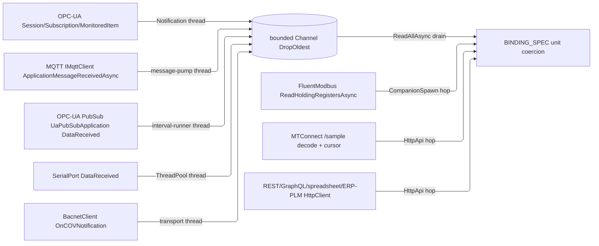
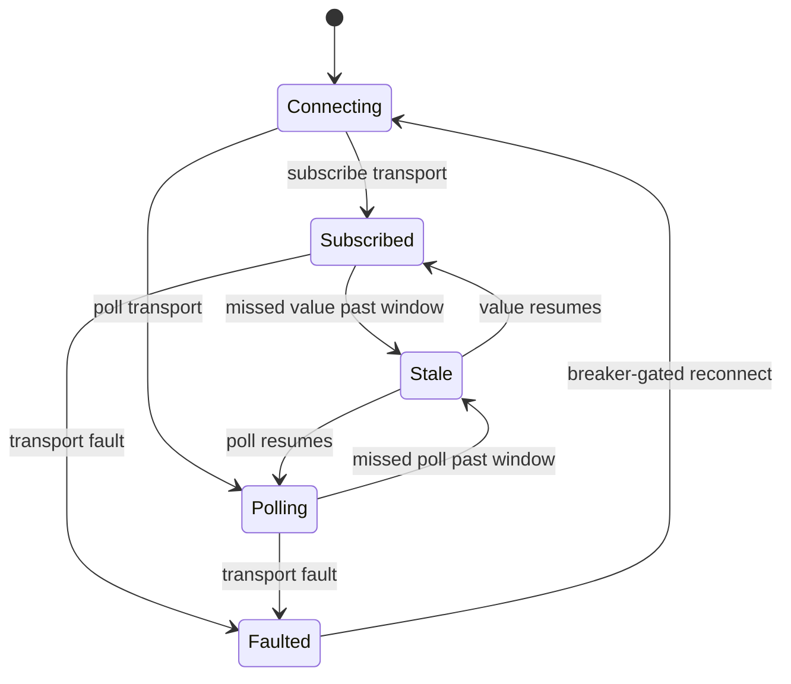

# [APPHOST_LIVE_WIRE]

Rasm.AppHost owns one reactive bidirectional binding studio: industrial transport rows carry OPC-UA, Modbus, MQTT, serial, BACnet, MTConnect, REST, GraphQL, spreadsheet, and ERP/PLM through one read/write contract. Binding specs pair external sources with directed internal targets, inbound values coerce through the Compute unit algebra, write-back commits or rolls back with evidence, and binding health tracks connection state.

Live-wire composition consumes `QuantityFamily`/`UnitAlgebra`/`UnitPolicy`, `OutboundHop`/`OutboundSurface`, `SchedulePort`/`ScheduleEntry`, `CommandAlgebra`, `DeadlineClass`, `DegradationLevel`, and `ReceiptSinkPort`; this page owns the transport axis, binding direction, edge coercion, write transaction, and health lifecycle, and it mints no eighth port.

## [01]-[INDEX]

- [02]-[TRANSPORT_AXIS]: Ten industrial-transport rows with one read/write adapter contract.
- [03]-[TRANSPORT_BINDING]: Per-case `Read`/`Write` dispatch; OPC-UA session/subscription and MQTT client.
- [04]-[BINDING_SPEC]: Source-target binding, direction, edge unit coercion, and poll/subscribe cadence.
- [05]-[WRITE_BACK]: Outbound write-back transaction, acknowledgement, and rollback.
- [06]-[BINDING_HEALTH]: Per-binding connect/subscribe/stale/fault lifecycle and health contribution.
- [07]-[TS_PROJECTION]: Binding-status and write-receipt wire shapes the studio dashboard consumes.

## [02]-[TRANSPORT_AXIS]

- Owner: `ExternalTransport` `[SmartEnum<string>]` the ten-row industrial-transport axis under the `ComparerAccessors.StringOrdinal` accessor; `TransportRow` per-transport policy record; `TransportRows` the frozen row set with the total dispatch; `EchoClass` `[SmartEnum<string>]` the echo capability each row DECLARES and `EchoDiscriminator` `[Union]` the payload a write RETAINED and an inbound value CARRIED, joined by the one `Echoes` match; `WireFault` `[Union]` fault family deriving its codes through `FaultBand.LiveWire`; `ExternalValue` the at-edge value carrier.
- Cases: opc-ua, modbus, mqtt, serial, bacnet, mtconnect, rest, graphql, spreadsheet, erp-plm — each carrying its read shape (poll versus subscribe), its write capability, the outbound hop class its bytes ride, and the echo class its protocol publishes; bacnet is the building-management edge (COV-subscribed metered points, confirmed-request write) and mtconnect the machine-tool observation edge (the `-Common` model slice over the row's HTTP hop, read-only); `EchoClass` = absent | stamped | tokened | slotted, the valueless row declaration, and `EchoDiscriminator` = Absent | Stamped | Tokened | Slotted its measured counterpart — `Stamped` carries the write's own `DataValue.SourceTimestamp` returned on the notification beside the item's `ClientHandle` (opc-ua), `Tokened` a write-minted `CorrelationData` key returned on the inbound message (mqtt), `Slotted` the host-owned command priority-array slot carried on the inbound value (bacnet), and `Absent` the explicit arm every protocol publishing no echo proof takes; `WireFault` = Text | ConnectRejected | ReadFailed | WriteRejected | UnitRejected | StaleSource.
- Entry: `TransportRow Row` is the extension property total state-free `Switch` from transport to frozen row; the `TransportBinding.Read(LiveWireRuntime runtime, TransportRow row, BindingSpec spec, CancellationToken token)` returning `IO<ExternalValue>` and `TransportBinding.Write(LiveWireRuntime runtime, TransportRow row, BindingSpec spec, ExternalValue value, CancellationToken token)` returning `IO<(HopReceipt Receipt, EchoDiscriminator Echo)>` dispatch on the row's `Transport.Switch` to the per-case binding at `Wire/livewire#TRANSPORT_BINDING`, so the axis owns the row shape and the binding cluster owns each protocol's client surface and its dispatch.
- Auto: a `Subscribe`-shaped transport (OPC-UA, MQTT) opens a streaming subscription whose values arrive as a reactive sequence, while a `Poll`-shaped transport (Modbus, REST, GraphQL, spreadsheet, ERP/PLM) reads on a `SchedulePort` cadence row, so the binding engine reads both shapes through one contract differing only by the row's `ReadShape` column; the transport bytes ride the existing `OutboundHop` cases — REST and GraphQL on `HttpApi`, MQTT and OPC-UA on a keyed `LocalIpc`/`ServerStream` pipeline, serial and Modbus on the `CompanionSpawn` process-spawn adapter where the FluentModbus/`SerialPort` client owns the line inside the companion — so the resilience, retry, and breaker semantics are the existing hop policy, never a per-transport retry loop; the `Writable` column gates the write-back so a read-only source (a spreadsheet view) rejects a write at the row, never at the transaction.
- Receipt: `ExternalValue` carries the raw value, its declared unit, the source quality flag, the source timestamp, and the echo payload the protocol published with it; a write returns its receipt paired with the payload it minted, so both ends of a suppression comparison exist as evidence; the read and write transitions log through one `SpineLog` event.
- Packages: OPCFoundation.NetStandard.Opc.Ua, OPCFoundation.NetStandard.Opc.Ua.PubSub, MQTTnet, FluentModbus, System.IO.Ports, BACnet, MTConnect.NET-Common, Thinktecture.Runtime.Extensions, LanguageExt.Core, NodaTime, BCL inbox
- Growth: one transport row absorbs a new industrial edge — a new fieldbus or ERP connector is one `ExternalTransport` row carrying its read shape, write capability, hop class, and echo class, never a parallel adapter; a new echo proof is one `EchoClass` row and its `EchoDiscriminator` arm, breaking the `Echoes` match until the pair lands; a new fault is one `WireFault` case; zero new surface.
- Boundary: no transport-neutral echo token exists — three writable protocols publish a proof and each publishes a DIFFERENT one, so the axis splits the DECLARATION from the MEASUREMENT: the row's `EchoClass` column is valueless because a frozen row is written before any write runs and could only invent a payload, and an epoch instant, a zero slot, or an empty key seated there reads identical to a measured proof at the comparison — the forged token an `Option<string>` slot would spell just as loudly; `Absent` is a real row and the suppression fold reads it FIRST, so a modbus, serial, or HTTP binding never reaches a payload comparison and reads its own write-back like any other value rather than under a heuristic time window; `MqttLane.Subscribe`'s `noLocal: true` filter is protocol-level echo suppression already enforced at the broker for a same-connection publish, and `Tokened` covers the cross-client case that flag cannot reach.
- Boundary: the transport axis is the only external-binding owner — a per-protocol client, a protocol-specific binding service, and a parallel poller are the deleted forms, so all ten transports ride one adapter contract; the OPC-UA leg composes the OPC-Foundation-certified `OPCFoundation.NetStandard.Opc.Ua` session/subscription/monitored-item surface (with `.PubSub` for the PubSub-over-MQTT leg), the MQTT leg composes `MQTTnet`, and the REST/GraphQL legs compose the existing `OutboundHop.HttpApi` — a hand-rolled OPC-UA or MQTT client is the deleted form; the transport never owns its own resilience — it composes the `OutboundHop` row its bytes ride, so a flapping Modbus source breaks on the same circuit breaker an HTTP API breaks on; the at-edge value carries its declared unit so the coercion at `BINDING_SPEC` reads a known unit, never a guessed one; a subscribe transport's reactive sequence and a poll transport's scheduled read are one inbound contract, so the binding engine never branches on transport at the call site; serial and spreadsheet transports that have no native streaming poll on the schedule cadence, so the cadence is the row's read mechanism, not a transport quirk.

```csharp signature
[SmartEnum<string>]
[KeyMemberEqualityComparer<ComparerAccessors.StringOrdinal, string>]
[KeyMemberComparer<ComparerAccessors.StringOrdinal, string>]
public sealed partial class ReadShape {
    public static readonly ReadShape Poll = new("poll");
    public static readonly ReadShape Subscribe = new("subscribe");
}

[SmartEnum<string>]
[KeyMemberEqualityComparer<ComparerAccessors.StringOrdinal, string>]
[KeyMemberComparer<ComparerAccessors.StringOrdinal, string>]
public sealed partial class ExternalTransport {
    public static readonly ExternalTransport OpcUa = new("opc-ua");
    public static readonly ExternalTransport Modbus = new("modbus");
    public static readonly ExternalTransport Mqtt = new("mqtt");
    public static readonly ExternalTransport Serial = new("serial");
    public static readonly ExternalTransport Bacnet = new("bacnet");
    public static readonly ExternalTransport Mtconnect = new("mtconnect");
    public static readonly ExternalTransport Rest = new("rest");
    public static readonly ExternalTransport GraphQl = new("graphql");
    public static readonly ExternalTransport Spreadsheet = new("spreadsheet");
    public static readonly ExternalTransport ErpPlm = new("erp-plm");
}

[Union]
public abstract partial record WireFault : Expected, IValidationError<WireFault> {
    private WireFault(string detail, int code) : base(detail, code, None) { }
    public static WireFault Create(string message) => new Text(message);
    public sealed record Text : WireFault { public Text(string detail) : base(detail, FaultBand.LiveWire.Code(0)) { } }
    public sealed record ConnectRejected : WireFault { public ConnectRejected(string detail) : base(detail, FaultBand.LiveWire.Code(1)) { } }
    public sealed record ReadFailed : WireFault { public ReadFailed(string detail) : base(detail, FaultBand.LiveWire.Code(2)) { } }
    public sealed record WriteRejected : WireFault { public WriteRejected(string detail) : base(detail, FaultBand.LiveWire.Code(3)) { } }
    public sealed record UnitRejected : WireFault { public UnitRejected(string detail) : base(detail, FaultBand.LiveWire.Code(4)) { } }
    public sealed record StaleSource : WireFault { public StaleSource(string detail) : base(detail, FaultBand.LiveWire.Code(5)) { } }
}

public readonly record struct ExternalValue(
    double Raw,
    string Unit,
    bool Good,
    Instant SourceAt,
    EchoDiscriminator Echo);

[SmartEnum<string>]
[KeyMemberEqualityComparer<ComparerAccessors.StringOrdinal, string>]
[KeyMemberComparer<ComparerAccessors.StringOrdinal, string>]
public sealed partial class WireProtocol {
    public static readonly WireProtocol None = new("none");
    public static readonly WireProtocol MqttJson = new("mqtt-json");
    public static readonly WireProtocol MqttUadp = new("mqtt-uadp");
    public static readonly WireProtocol UdpUadp = new("udp-uadp");
}

// What a row's protocol DECLARES it can publish, valueless by construction: a frozen row is written long
// before any write runs, so a row seating a payload-bearing arm would have to invent the payload — and an
// epoch instant or an empty key is a forged token that reads identical to a measured one at the comparison.
// The class is the gate the suppression fold reads first; the payload is EchoDiscriminator's alone.
[SmartEnum<string>]
[KeyMemberEqualityComparer<ComparerAccessors.StringOrdinal, string>]
[KeyMemberComparer<ComparerAccessors.StringOrdinal, string>]
public sealed partial class EchoClass {
    public static readonly EchoClass Absent = new("absent");
    public static readonly EchoClass Stamped = new("stamped");
    public static readonly EchoClass Tokened = new("tokened");
    public static readonly EchoClass Slotted = new("slotted");
}

// The MEASURED write-echo proof, one arm per shape of evidence a protocol actually publishes and one arm per
// EchoClass row. Absence is an ARM, never an Option<string> a value fills with an empty key or an epoch
// instant — a forged token reads identical to a measured one at the suppression fold, and five of the eight
// writable rows have nothing to carry.
[Union(ConversionFromValue = ConversionOperatorsGeneration.None)]
public abstract partial record EchoDiscriminator {
    private EchoDiscriminator() { }

    // The named canonical absence: an owner-typed `= default` would spell null, so every no-echo row and every
    // value from a protocol publishing none reads this one instance rather than allocating a fresh nothing.
    public static readonly EchoDiscriminator None = new Absent();

    public sealed record Absent : EchoDiscriminator;
    public sealed record Stamped(Instant SourceAt, uint ClientHandle) : EchoDiscriminator;
    public sealed record Tokened(ReadOnlyMemory<byte> Correlation) : EchoDiscriminator;
    public sealed record Slotted(byte Priority) : EchoDiscriminator;

    // Suppression is a SHAPE-AND-PAYLOAD match on one arm; Absent never matches, so a protocol publishing no
    // proof reads its own write-back like any other value rather than under a fabricated time window.
    public bool Echoes(EchoDiscriminator acknowledged) => (this, acknowledged) switch {
        (Stamped inbound, Stamped written) => inbound.SourceAt == written.SourceAt && inbound.ClientHandle == written.ClientHandle,
        (Tokened inbound, Tokened written) => inbound.Correlation.Span.SequenceEqual(written.Correlation.Span),
        (Slotted inbound, Slotted written) => inbound.Priority == written.Priority,
        _ => false,
    };
}

public sealed record TransportRow(
    ExternalTransport Transport,
    ReadShape ReadShape,
    bool Writable,
    OutboundHop Hop,
    DeadlineClass Attempt,
    WireProtocol Protocol,
    EchoClass Echo);

public static class TransportRows {
    // The Echo column is the row's DECLARED capability and carries no payload: three writable protocols
    // publish a proof and each publishes a different one, five publish none, and both read-only rows cannot
    // echo a write they refuse. The measured payload is minted where it is observed, never here.
    public static readonly TransportRow OpcUa = new(ExternalTransport.OpcUa, ReadShape.Subscribe, Writable: true, new OutboundHop.ServerStream(new Uri("opc.tcp://localhost")), DeadlineClass.HopAttempt, WireProtocol.None, EchoClass.Stamped);
    public static readonly TransportRow Modbus = new(ExternalTransport.Modbus, ReadShape.Poll, Writable: true, new OutboundHop.CompanionSpawn(new ProcessStartInfo("rasm-modbus")), DeadlineClass.HopAttempt, WireProtocol.None, EchoClass.Absent);
    public static readonly TransportRow Mqtt = new(ExternalTransport.Mqtt, ReadShape.Subscribe, Writable: true, new OutboundHop.ServerStream(new Uri("mqtt://localhost")), DeadlineClass.HopAttempt, WireProtocol.None, EchoClass.Tokened);
    public static readonly TransportRow Serial = new(ExternalTransport.Serial, ReadShape.Poll, Writable: true, new OutboundHop.CompanionSpawn(new ProcessStartInfo("rasm-serial")), DeadlineClass.HopAttempt, WireProtocol.None, EchoClass.Absent);
    public static readonly TransportRow Bacnet = new(ExternalTransport.Bacnet, ReadShape.Subscribe, Writable: true, new OutboundHop.ServerStream(new Uri("bacnet://localhost")), DeadlineClass.HopAttempt, WireProtocol.None, EchoClass.Slotted);
    public static readonly TransportRow Mtconnect = new(ExternalTransport.Mtconnect, ReadShape.Poll, Writable: false, new OutboundHop.HttpApi(new Uri("http://localhost:5000")), DeadlineClass.HopAttempt, WireProtocol.None, EchoClass.Absent);
    public static readonly TransportRow Rest = new(ExternalTransport.Rest, ReadShape.Poll, Writable: true, new OutboundHop.HttpApi(new Uri("https://localhost")), DeadlineClass.HopAttempt, WireProtocol.None, EchoClass.Absent);
    public static readonly TransportRow GraphQl = new(ExternalTransport.GraphQl, ReadShape.Poll, Writable: true, new OutboundHop.HttpApi(new Uri("https://localhost/graphql")), DeadlineClass.HopAttempt, WireProtocol.None, EchoClass.Absent);
    public static readonly TransportRow Spreadsheet = new(ExternalTransport.Spreadsheet, ReadShape.Poll, Writable: false, new OutboundHop.HttpApi(new Uri("https://localhost")), DeadlineClass.HopAttempt, WireProtocol.None, EchoClass.Absent);
    public static readonly TransportRow ErpPlm = new(ExternalTransport.ErpPlm, ReadShape.Poll, Writable: true, new OutboundHop.HttpApi(new Uri("https://localhost")), DeadlineClass.HopAttempt, WireProtocol.None, EchoClass.Absent);

    extension(ExternalTransport transport) {
        public TransportRow Row => transport.Switch(
            opcUa: static () => OpcUa,
            modbus: static () => Modbus,
            mqtt: static () => Mqtt,
            serial: static () => Serial,
            bacnet: static () => Bacnet,
            mtconnect: static () => Mtconnect,
            rest: static () => Rest,
            graphQl: static () => GraphQl,
            spreadsheet: static () => Spreadsheet,
            erpPlm: static () => ErpPlm);
    }
}
```

## [03]-[TRANSPORT_BINDING]

- Owner: `TransportBinding.Read`/`TransportBinding.Write` the per-case `ExternalTransport.Switch` dispatch from row to its protocol binding; `OpcUaLane` the held OPC-UA session/subscription/monitored-item owner whose subscription callbacks feed one bounded lane; `MqttLane` the held `IMqttClient` owner whose `ApplicationMessageReceivedAsync` callback feeds the same lane shape; `PubSubLane` the held `UaPubSubApplication` owner whose `DataReceived` dataset fan feeds the SAME bounded lane the per-node OPC-UA subscription drains into; `HttpPoll` the REST/GraphQL/spreadsheet/ERP-PLM body over the row's `OutboundHop.HttpApi`; `ModbusLane` the `FluentModbus` `ModbusClient` register-window body and `SerialLane` the `System.IO.Ports` `SerialPort` line-frame body, both over the row's `OutboundHop.CompanionSpawn`; `BacnetLane` the `BacnetClient` COV-subscription owner whose notification callback feeds the same bounded lane with `ReadPropertyAsync` the poll fallback; `MstpLine` the host-implemented `IBacnetSerialTransport` adapter over the held `SerialPort` the MS/TP transport construction takes; `MtconnectLane` the read-only `-Common` model-slice decode over the row's HTTP hop with the `MTConnectClientInformation` durable cursor; `MachineLane` the machine-observation decode lane — a `BindingSpec.Machine`-sliced inbound value projects once into one typed `MachineObservationWire` (value, unit, machine identity, freshness instant) fanned under `InstrumentFan.ObservationKind`, the single decoded truth Fabrication's wear, fleet-performance, and engagement consumers read, never a direct transport reference and never three decoders; `SubscriptionLane` the ONE lane record — the `Runtime/resources#DRAIN_QUEUES` `DrainQueue<ExternalValue>.Pipe` the foreign callback writes and the reactive read drains, its detach closure, and the `Atom<Gate>` lifecycle cell, with `Open`/`Drain`/`Submit` its own statics so the record and its openers are one owner; `LiveClient` `[Union]` the held-connection family — `Opc` carries the `Session`, `Mqtt` the `IMqttClient`, `Serial` the `SerialPort`, `Modbus` the `ModbusClient`, `PubSub` the `UaPubSubApplication`, `Bacnet` the `BacnetClient`, `Mtconnect` the cursor — so one `Gate.Live(Guid, LiveClient)` cell serves every protocol; `OpcUaRuntime`/`MqttRuntime`/`ModbusRuntime`/`SerialRuntime`/`PubSubRuntime`/`BacnetRuntime`/`MtconnectRuntime` the held per-protocol configuration, factory, and lane-accessor state the `LiveWireRuntime` composes.
- Cases: read dispatch is the ten-arm `Transport.Switch` — OPC-UA, MQTT, and OPC-UA-PubSub drain their lane's `ReadAllAsync` head, Modbus reads its window through the window's own `ModbusSpace` row body, serial reads its line frame through `SerialPort.ReadLine`/`ReadExisting` behind a `BytesToRead` gate, BACnet discriminates on its lane watermark — a live lane drains and a watermark older than the binding's `Staleness` takes the `Recover` history read — MTConnect parses the `/sample` document through `ResponseDocumentFormatter` into the observation stream over the row's HTTP hop, REST/GraphQL/spreadsheet/ERP-PLM read once through `OutboundHop.HttpApi`; write dispatch is the same ten-arm `Switch` — OPC-UA writes one `WriteValue`, MQTT publishes one `MqttApplicationMessage`, Modbus writes through the space row's write body, serial writes one `WriteLine`, the HTTP transports ride a `PutAsync` body, BACnet awaits one confirmed `WritePropertyAsync` at the point's priority-array slot, the non-writable spreadsheet and MTConnect rows reject at the row and the read-only Modbus spaces at theirs.
- Entry: each subscribe adapter owns its concrete opener — `OpcUaLane.Subscribe`, `MqttLane.Subscribe`, `PubSubLane.Subscribe`, `SerialLane.Attach`, or `BacnetLane.Subscribe` — returning `IO<SubscriptionLane>` after attaching its foreign callback, and `LiveWire.Activate` at `BINDING_SPEC` is their one caller, selecting the opener off the row and publishing the opened lane into the runtime accessors; `TransportBinding.Read` drains the published lane for subscribe rows or runs one poll body over the row's hop; `TransportBinding.Write` dispatches the at-edge value through the row's protocol or hop and returns the echo key the write minted.
- Auto: the OPC-UA leg composes the high-level managed `Opc.Ua.Client` API — `Session.CreateAsync(configuration, reverseConnectManager, endpoint, updateBeforeConnect, checkDomain, sessionName, sessionTimeout, userIdentity, preferredLocales, ct)` mints the session over the configuration-loaded endpoint, a `Subscription(telemetry)` carries `PublishingInterval`, `KeepAliveCount`, and `LifetimeCount` as policy ints read off the row, `subscription.AddItem(new MonitoredItem(telemetry){ StartNodeId, AttributeId, MonitoringMode, SamplingInterval })` and `subscription.CreateAsync(ct)` arm the monitored node, and the `monitoredItem.Notification` event hands each `MonitoredItemNotificationEventArgs.NotificationValue` cast to `MonitoredItemNotification` whose `Value` is one `DataValue` — the callback projects `DataValue.Value`/`StatusCode`/`SourceTimestamp` into `ExternalValue` and `TryWrite`s it into the bounded lane, never running the interior on the foreign thread; the OPC-UA read-back and write-back ride `Session.ReadAsync(requestHeader, maxAge, TimestampsToReturn.Both, nodesToRead, ct)` and `Session.WriteAsync(requestHeader, nodesToWrite, ct)` inherited from `SessionClient`, building `ReadValueIdCollection`/`WriteValueCollection` from the binding's node id; the MQTT leg composes `MqttClientFactory.CreateMqttClient()` returning `IMqttClient` (v5 keeps the interface), `ConnectAsync(options, ct)` over a `MqttClientOptionsBuilder` carrying connection uri, client id, keep-alive, clean-start, session-expiry, and last-will as policy data, `SubscribeAsync(options, ct)` over one `WithTopicFilter(topic, qos, noLocal, retainAsPublished, retainHandling)`, and the `ApplicationMessageReceivedAsync` handler decodes `MqttApplicationMessageReceivedEventArgs.ApplicationMessage.Payload` (`ReadOnlySequence<byte>`) at the boundary and `TryWrite`s into the same bounded lane, with the inbound write-back as one `PublishAsync` over a `MqttApplicationMessageBuilder` carrying topic, payload, qos, and retain; QoS, retain, last-will, and session-expiry are policy columns on `TransportRow`, never new cases or transports; the Modbus leg composes the `FluentModbus` `ModbusClient` base surface (the TCP/RTU clients inherit the function-code operations) through the window's own `ModbusSpace` row, which carries its read and write bodies as `[UseDelegateFromConstructor]` columns over all four protocol address spaces — the register spaces reinterpret their window through the package's own generic read — `ReadHoldingRegistersAsync<T>`/`ReadInputRegistersAsync<T>(unitId, startAddress, count, ct)` returning `Task<Memory<T>>` over the window's declared `T : unmanaged` register element (`short`, `ushort`, `int`, `float`, `double`) — so an IEEE-754 analog point reads as a `float` and the byte order is the `ModbusEndianness` the `Connect` call fixed for the whole connection, the bit spaces read `Task<Memory<byte>>` through `ReadCoilsAsync`/`ReadDiscreteInputsAsync(unitId, startAddress, quantity, ct)` one bit per point low-bit-first and cross as 0/1 against a dimensionless family, `WriteSingleRegisterAsync(unitId, registerAddress, short, ct)` writes the one-register window and `WriteMultipleRegistersAsync(unitId, startAddress, short[], ct)` the block, `WriteSingleCoilAsync(unitId, registerAddress, bool, ct)` the coil, and the input-register and discrete-input rows refuse their write at the row because the protocol declares them read-only; the `ModbusWindow` (`unitId`/`startAddress`/`count`/`element`/`space`) is `PollPolicy.Register` binding-spec policy data and its `ModbusElement` row carries the read body, never a per-read endianness flag; the serial leg composes `System.IO.Ports.SerialPort` — `ReadLine`/`ReadExisting` for a line-framed protocol behind a `BytesToRead` presence gate and `WriteLine` for the inbound write, the `SerialFraming` (`baudRate`/`parity`/`dataBits`/`stopBits`/`handshake`/`newLine`/`lineFramed`/`readTimeout`/`writeTimeout`/`rts`/`dtr`) carried as `PollPolicy.Line` binding-spec policy, `ReadTimeout`/`WriteTimeout` bounding a wait that otherwise defaults to `InfiniteTimeout` and `RtsEnable` driving the RS-485 half-duplex transceiver line under every Modbus-RTU and BACnet MS/TP bus; the serial subscribe variant `SerialLane.Attach` opens the port, wires the `DataReceived` event (firing on a `ThreadPool` thread) to `TryWrite` one parsed `ExternalValue` into the bounded lane at the boundary and `ErrorReceived` to a not-good value, so a streaming serial line rides the SAME bounded lane the OPC-UA/MQTT subscriptions ride; the REST/GraphQL/spreadsheet/ERP-PLM legs compose the held `HttpClient` over `OutboundHop.HttpApi` — a `PollPolicy.Http` carries the resource path and the optional GraphQL query, REST a `GetAsync`, GraphQL a `PostAsync` of the query body, spreadsheet a read-only range fetch, each projecting the response body into one `ExternalValue`; the OPC-UA PubSub leg composes `UaPubSubApplication.Create(configPath, telemetry, dataStore)`/`Start`/`Stop` whose `DataReceived` `SubscribedDataEventArgs` dataset fan projects each `DataSet.Fields` field into one `ExternalValue` and `TryWrite`s into the SAME bounded lane the per-node OPC-UA subscription drains into — one PubSub application per process, the high-throughput fan-in path the per-item subscription cannot scale to, a `WireProtocol` row variant (mqtt-json/mqtt-uadp/udp-uadp) on the OPC-UA transport, never a parallel transport; the BACnet leg composes `BacnetClient` over `BacnetIpUdpProtocolTransport` for BACnet/IP, or over `BacnetMstpProtocolTransport(IBacnetSerialTransport, short sourceAddress = -1, byte maxMaster = 127, byte maxInfoFrames = 1)` for a bus-attached controller — the `MstpLine` adapter over the held `SerialPort` supplies the host-implemented line under the SAME `SerialFraming` policy the serial row configures (`Rts` the RS-485 DE/RE line), the MS/TP node knobs riding the ctor's own defaults at the `BacnetRuntime.Held` composition seat, and no second serial package enters the folder — `RegisterAsForeignDevice(bbmdIp, ttl, port)` registers with the BBMD BEFORE `Start()` where the runtime carries a `BbmdRegistration`, since `WhoIs` reaches the local broadcast domain alone and a controller on another VLAN never answers without it, and the TTL renewal is one `OccurrenceSpec.Every` `ScheduleEntry` on the page's own `SchedulePort`; `SubscribeCOVAsync(adr, objectId, subscribeId, cancel, issueConfirmedNotifications, lifetime)` arms the metered points under the point's own `Confirmed` column and `OnCOVNotification` (the `COVNotificationHandler` firing on a transport thread with the `ICollection<BacnetPropertyValue>` triple set) projects each `BacnetValue` into one `ExternalValue` and `TryWrite`s into the SAME bounded lane every subscribe transport rides, the detach closure awaiting that same member with `cancel: true` before disposal so the device stops publishing into a closed transport; the stale-lane `Recover` reads the point's `TrendLog` column — `ReadRangeAsync(adr, trendLog, readFrom, quantity)` awaits a `BacnetReadRangeResult` whose `Range` bytes and `ItemCount` drain the device's own history from the lane watermark into that same bounded lane when the point names a history object, `ReadPropertyAsync(adr, objectId, propertyId)` awaits the one current `IList<BacnetValue>` when it does not — and `WritePropertyAsync(adr, objectId, propertyId, valueList, invokeId, priority)` writes at the point's priority-array slot (1-16, the assembly's own admitted range) with a `None` value the RELEASE at that same slot, every one of them carrying the binding's `CancellationToken` rather than a seam-local timeout; the point map (object id / property id / COV lifetime / confirmed / priority / trend log) is binding-spec DATA; the MTConnect leg composes the `-Common` MODEL slice ONLY (no bundled HTTP/MQTT client — transport is firewalled to the row's `OutboundHop.HttpApi`): `ResponseDocumentFormatter.CreateStreamsResponseDocument(documentFormatterId, content)` parses the `/sample` body into a `FormatReadResult<IStreamsResponseDocument>` whose `GetObservations()` flattens the device streams, and each `MTConnect.Streams.IObservation` projects into one `ExternalValue` — `GetValue(ValueKeys.Result)` parsed invariant-culture into `Option<double>` because every observation value crosses as TEXT, `DataItem?.Units` the declared unit with the binding family the fallback, `!IsUnavailable && Quality == Quality.VALID` the three-state good flag, and `Timestamp` the source instant — while `MTConnectClientInformation` is the durable poll cursor (`InstanceId` + `LastSequence`, `Save` after each drain, an `InstanceId` change forcing re-`current`) mirroring the outbox watermark discipline.
- Receipt: the OPC-UA `DataValue`, the MQTT decoded payload, the Modbus register window, the serial line frame, the HTTP response body, and the PubSub dataset field each mint one `ExternalValue` carrying raw value, declared unit, the source quality flag, and the source timestamp; MQTT CONNACK and every SUBACK item admit before the live client publishes, with a refused reason code projected onto `WireFault`; the lane drain at `BINDING_SPEC` coerces the unit before the value enters the suite.
- Packages: OPCFoundation.NetStandard.Opc.Ua, OPCFoundation.NetStandard.Opc.Ua.PubSub, MQTTnet, FluentModbus, System.IO.Ports, BACnet, MTConnect.NET-Common, LanguageExt.Core, NodaTime, Thinktecture.Runtime.Extensions, BCL `System.Net.Http`/`System.Text.Json`
- Growth: a new subscribe transport is one `Subscribe`/`Attach` arm feeding the one lane shape; a new poll transport is one `Read`/`Write` arm over its hop; a new Modbus address space is one `ModbusSpace` row carrying its two bodies and the lane gains no branch; a new serial line-discipline knob is one `SerialFraming` column; a new BACnet request knob is one `BacnetPoint` column; a new PubSub message mapping is one `WireProtocol` row; one bounded lane shape serves every subscribe transport and every backfilled history sample; zero new surface.
- Boundary: this cluster is the only protocol-client owner — a per-protocol binding service and a parallel poller are the deleted forms; the foreign OPC-UA monitored-item thread, the MQTT message-pump thread, the serial `DataReceived` `ThreadPool` thread, and the PubSub interval-runner thread never run the interior — each callback projects its raw value into `ExternalValue` and `Submit`s into the ONE `Runtime/resources#DRAIN_QUEUES` `DrainSpec.WireInbound` lane opened through `DrainSurface.Open`, so the lane's `DropOldest` back-pressure, its `DrainBand` completion, and its mandatory `onDrop` receipt delegate are the drain owner's declared policy — a bespoke `Channel.CreateBounded` beside that owner is the deleted form and an unreceipted-loss row refuses at `Open` on the `Fin` rail (`docs/stacks/csharp/boundaries#SUBSCRIPTION_VALUE`/`#HANDOFF_DRAIN`); the held session, client, port, Modbus connection, and PubSub application live in one `Atom<Gate>` token-gated state cell per binding carrying a `LiveClient.Opc`/`Mqtt`/`Serial`/`Modbus`/`PubSub`/`Bacnet`/`Mtconnect` (`docs/stacks/csharp/boundaries#TOKEN_LIFECYCLE`) so a reconnect replaces the whole cell and a stale teardown that lost its token never disposes a fresh handle; the per-row retry is the channel's own auto-reconnect (MQTT) XOR the seam's `OutboundHop` redial — never both — so a subscribe transport's reconnect rides the protocol client and a poll transport's retry rides the `CompanionSpawn`/`HttpApi` hop, the one-retry-owner law the transport axis declares — never a FluentModbus or `SerialPort` reconnect loop; a `ModbusException`/`SerialError`/`ModbusFrameError`, and the bare `Exception`/`TimeoutException` every awaited BACnet confirmed service throws, all project to `WireFault.ReadFailed`/`WriteRejected` at the boundary, never propagating into the interior — the BACnet arm reads its error class and code off the exception message because the assembly ships no typed error carrier on the throw path; a multi-homed host pins `localEndpointIp` on `BacnetIpUdpProtocolTransport` because `Start()` otherwise throws `InvalidOperationException` listing the candidate interfaces rather than guessing one; the register-window decode reinterprets the window as the point's declared `ModbusElement` under the `ModbusEndianness` `Connect` fixed for the connection — never a per-read byte-order branch, which could not read a float32 register at all — and the address space is the closed `ModbusSpace` row carrying its own read and write bodies, so a `bool Holding` two-valued switch reaching half a closed protocol — leaving every coil and discrete input unbindable — and a lane-side space branch beside it are both the deleted forms; a transport call whose VALUE the read reports runs INSIDE the hop through `OutboundSurface.Carry`, so the reported value and the receipt describe one frame and the second raw untimed call is the deleted form; a serial read gates on `BytesToRead` under a finite `ReadTimeout` and parses into `Option<double>`, so a silent line neither parks the poll thread nor mints a `NaN` the coercion admits as a real measurement — the sentinel-as-value pair is the deleted form; a BACnet write carries the point's priority-array slot and its `None` release, so a host override is revocable, and a device-default write no later write can distinguish is the deleted form; a stale COV lane recovers through the point's declared history object, so the samples between a dropped subscription and its recovery are read back rather than lost, and a current-value-only fallback beside a device that buffers them is the deleted form; a BBMD-routed binding registers as a foreign device before `Start()` and renews on one `ScheduleEntry`, so a background re-registration timer beside the scheduler is the deleted form; an MS/TP line is single-custody — the gate cell's `LiveClient.Bacnet` teardown disposes client, transport, `MstpLine`, and port as ONE chain, so `SerialLane` never reads a bus an MS/TP master owns and no twin disposal exists; the OPC-UA `Subscription.CurrentPublishingInterval` is a `double`, never a `TimeSpan`, so the row carries the publishing interval as the int `PublishingInterval` the subscription sets and reads the negotiated `double` back without a unit cast; the at-edge `DataValue.SourceTimestamp`, the MQTT receive instant, the serial/Modbus/HTTP read instant, and the PubSub `Value.SourceTimestamp` cross as the value's `SourceAt` so the staleness check at `BINDING_HEALTH` reads a real source clock, never the host clock; the MQTT legs are the trace-carrier mount — `MqttLane.Write` threads `TraceContext.Inject` over the message builder before `Build()` and the receive pump continues the propagated context through the seam owner's own `MqttApplicationMessage` overload, consumer-kinded, so broker-hop trace continuity is wholly the adapter's and this runtime carries no extraction delegate to compose; the BACnet point map (`BacnetObjectId`/`BacnetPropertyIds`/COV lifetime) is `PollPolicy.Point` binding-spec DATA and the COV/write request bindings are `BacnetRuntime` composition slots, so protocol-signature drift lands at one composition seat; the MTConnect cursor is durable poll state — `MTConnectClientInformation.Read(string deviceKey, string path = null)` restores it, `Save(string path = null)` commits it after each drain, and an `InstanceId` change forces a full re-current, the outbox watermark discipline at the machine edge; the cursor and the observation do NOT share a numeric type — `MTConnectClientInformation.LastSequence`/`InstanceId` are `long` while `IObservation.Sequence`/`InstanceId` are `ulong` — so every cursor advance and every re-`current` comparison spells its `(long)` narrowing at the crossing rather than inferring one; `IStreamsResponseDocument.GetObservations()` returns NULL on a device-stream-free document, which is the ordinary steady-state `/sample` response when nothing crossed since the cursor, so the drain folds the null through an empty-sequence arm and an unguarded traversal is the deleted form.

```csharp signature
[Union(ConversionFromValue = ConversionOperatorsGeneration.None)]
public abstract partial record LiveClient {
    private LiveClient() { }
    public sealed record Opc(Session Session) : LiveClient;
    public sealed record Mqtt(IMqttClient Client) : LiveClient;
    public sealed record Serial(SerialPort Port) : LiveClient;
    public sealed record Modbus(ModbusClient Client) : LiveClient;
    public sealed record PubSub(UaPubSubApplication Application) : LiveClient;
    public sealed record Bacnet(BacnetClient Client) : LiveClient;
    public sealed record Mtconnect(MTConnectClientInformation Cursor) : LiveClient;
}

[Union(ConversionFromValue = ConversionOperatorsGeneration.None)]
public abstract partial record Gate {
    private Gate() { }
    public sealed record Pending : Gate;
    public sealed record Live(Guid Token, LiveClient Client) : Gate;
    public sealed record Failed(WireFault Reason) : Gate;
}

// ONE lane owner: the record carries the drain-owned queue, the writer proved off its Pipe arm exactly once at
// Open, its detach closure, and the token-gated cell — and `Open`/`Drain`/`Submit` are its own statics, so the
// record and the members that build it are one type rather than a record and a same-named static class.
public sealed record SubscriptionLane(
    DrainQueue<ExternalValue> Queue,
    ChannelWriter<ExternalValue> Sink,
    Action Detach,
    Atom<Gate> Cell) {
    // The lane IS the drain owner's DropOldest row: capacity, full-mode, band, and the MANDATORY onDrop receipt
    // are DrainSpec.WireInbound columns, so an unreceipted-loss lane refuses at Open on the Fin rail rather than
    // dropping values no fact stream ever counted. The drop receipt fans under the registered wire arm.
    public static IO<SubscriptionLane> Open(LiveWireRuntime runtime, BindingSpec spec, Action detach, LiveClient client) =>
        IO.lift(() => DrainSpec.WireInbound.Open<ExternalValue>(Some<Action<ExternalValue>>(dropped =>
                ignore(runtime.Sink.Send(Correlation.Mint(), TenantContext.Current, TelemetrySource.AppHost.Key,
                    InstrumentFan.WireKind,
                    JsonSerializer.SerializeToElement(new WireFault.StaleSource($"lane-drop:{spec.BindingId}@{dropped.SourceAt}").Message, runtime.Wire)).Run())))
            .Bind(queue => queue.Switch(
                pipe: q => Fin.Succ(new SubscriptionLane(queue, q.Channel.Writer, detach, Atom<Gate>(new Gate.Live(Guid.NewGuid(), client)))),
                network: static n => Fin.Fail<SubscriptionLane>(new DrainFault.TopologyMismatch(n.Spec.Name, DrainKind.Pipe.Key)))))
            .Bind(static admitted => admitted.Match(Succ: IO.pure, Fail: IO.fail<SubscriptionLane>));

    public static IO<ExternalValue> Drain(SubscriptionLane lane, CancellationToken token) =>
        lane.Queue.Switch(
            state: token,
            pipe: static (t, p) => IO.liftAsync(async () => await p.Channel.Reader.ReadAsync(t).ConfigureAwait(false)),
            network: static (_, n) => IO.fail<ExternalValue>(new DrainFault.TopologyMismatch(n.Spec.Name, DrainKind.Pipe.Key)));

    public static Unit Submit(ChannelWriter<ExternalValue> sink, ExternalValue value) => ignore(sink.TryWrite(value));
}

public sealed record OpcUaBinding(
    Session Session,
    Subscription Subscription,
    MonitoredItem Item);

public sealed record OpcUaRuntime(
    ApplicationConfiguration Configuration,
    ReverseConnectManager ReverseConnect,
    ITelemetryContext Telemetry,
    IUserIdentity Identity,
    IList<string> Locales,
    uint SessionTimeout,
    int PublishingInterval,
    uint KeepAliveCount,
    uint LifetimeCount,
    int SamplingInterval,
    Func<string, ConfiguredEndpoint> Endpoint,
    Func<string, Session> Held);

public sealed record MqttRuntime(
    MqttClientFactory Factory,
    Duration KeepAlive,
    bool CleanStart,
    uint SessionExpiry,
    MqttQualityOfServiceLevel Qos,
    bool Retain,
    Func<string, IMqttClient> Client);

public sealed record ModbusRuntime(
    Func<string, ModbusClient> Held);

public sealed record SerialRuntime(
    Func<string, SerialPort> Held);

public sealed record PubSubRuntime(
    ITelemetryContext Telemetry,
    IUaPubSubDataStore DataStore,
    Func<string, string> ConfigPath,
    Func<string, UaPubSubApplication> Held);

// The BACnet point map, binding-spec DATA. Priority is the BACnet COMMAND PRIORITY ARRAY slot (1-16, the
// assembly's own admitted range): every host write lands at that slot and a RELEASE writes a null value at
// the SAME slot, so a host override is distinguishable from — and revocable against — a manual one, which a
// priority-less write can neither express nor undo. Confirmed selects the COV notification service
// (issueConfirmedNotifications) and TrendLog names the device's own history object the stale-lane recovery
// drains, so the samples a dropped subscription lost are read back rather than skipped.
public sealed record BacnetPoint(
    BacnetObjectId Object,
    BacnetPropertyIds Property,
    uint CovLifetime,
    Option<byte> Priority = default,
    bool Confirmed = true,
    Option<BacnetObjectId> TrendLog = default);

// BBMD foreign-device registration, the ONLY way a BACnet/IP binding crosses a subnet: the IP transport's
// WhoIs reaches the local broadcast domain alone, so a controller on another VLAN — the normal building
// deployment this transport row exists for — never answers. Ttl is the device's registration lifetime, and
// the re-registration cadence rides the page's own ScheduleEntry, never a background timer.
public sealed record BbmdRegistration(string BbmdIp, short Ttl, int Port = 47808);

public sealed record BacnetRuntime(
    Func<string, BacnetClient> Held,
    Func<string, BacnetAddress> Address,
    // Cov binds SubscribeCOVAsync(adr, objectId, subscribeId, cancel, issueConfirmedNotifications, lifetime)
    // and the OnCOVNotification handler whose ICollection<BacnetPropertyValue> carries each
    // (property, value, priority) triple; cancel: true is the SAME member the detach closure calls, so
    // subscribe and unsubscribe are one binding rather than an orphaned lane the device keeps feeding. The
    // triple's own `priority` byte fills the value's EchoDiscriminator.Slotted arm, so a host override the
    // write placed at a priority slot is distinguishable from a manual change at another.
    Func<BacnetClient, BacnetAddress, BacnetPoint, ChannelWriter<ExternalValue>, CancellationToken, Task> Cov,
    Func<BacnetClient, BacnetAddress, BacnetPoint, CancellationToken, Task> Unsubscribe,
    // Write binds WritePropertyAsync(adr, objectId, propertyId, valueList, invokeId, priority) — the None
    // value is the priority-array RELEASE the same slot revokes. The awaited rail reports failure by THROWING
    // (a bare Exception carrying the device's error class and code in its message, TimeoutException on an
    // exhausted retry), so each of these delegates is awaited inside the seam's own catch and no arm reads a
    // bool the members no longer return.
    Func<BacnetClient, BacnetAddress, BacnetPoint, Option<double>, CancellationToken, Task> Write,
    // DecodeTrend binds Serialize.Services.DecodeLogRecord(byte[] buffer, int offset, int length, int nCurves,
    // out BacnetLogRecord[] records), each record carrying `DateTime timestamp`, `BacnetTrendLogValueType type`,
    // the boxed `object Value` its type column decodes, and `BacnetStatusFlags statusFlags` — the record's own
    // timestamp becomes the sample's SourceAt so a backfilled point reads on the SOURCE clock the staleness
    // check already trusts, never the host clock the drain happened to run under, and the status flags decide
    // Good rather than a blanket true.
    Func<string, byte[], uint, Seq<ExternalValue>> DecodeTrend,
    Option<BbmdRegistration> Bbmd,
    // The COV watermark: the last instant a lane accepted a good value, read by the stale recovery to bound
    // its ReadRangeAsync and advanced exactly as MtconnectRuntime.Advance commits its LastSequence.
    Func<string, Instant> Watermark,
    Action<string, Instant> Advance);

public sealed record MtconnectRuntime(
    Func<string, MTConnectClientInformation> Cursor,
    // Decode parses the /sample body through ResponseDocumentFormatter.CreateStreamsResponseDocument(
    // string documentFormatterId, Stream content) returning FormatReadResult<IStreamsResponseDocument>, then
    // flattens IStreamsResponseDocument.GetObservations() — which returns NULL, not an empty sequence, on a
    // document carrying no device stream — and projects each IObservation into one ExternalValue beside the
    // (long) narrowing of its ulong Sequence. The pair mirrors BacnetRuntime.Watermark/Advance: the drain
    // commits the sequence it consumed rather than a cursor the runtime re-derives.
    Func<string, string, Seq<(ExternalValue Value, long Sequence, long InstanceId)>> Decode,
    Action<string, long, long> Advance);

// The per-case dispatch owner, named for the section it belongs to: `TransportRows` at [02] owns the frozen row
// set and the `Row` extension, this owns the read and write dispatch over them. The prior form declared one
// non-partial `TransportRows` class twice in one fence namespace.
public static class TransportBinding {
    public static IO<ExternalValue> Read(LiveWireRuntime runtime, TransportRow row, BindingSpec spec, CancellationToken token) =>
        row.Transport.Switch(
            opcUa: static (s, _) => OpcUaLane.Read(s.Runtime, s.Spec, s.Token),
            mqtt: static (s, _) => MqttLane.Read(s.Runtime, s.Spec, s.Token),
            modbus: static (s, _) => ModbusLane.Read(s.Runtime, s.Row, s.Spec, s.Token),
            serial: static (s, _) => SerialLane.Read(s.Runtime, s.Row, s.Spec, s.Token),
            bacnet: static (s, _) => BacnetLane.Read(s.Runtime, s.Spec, s.Token),
            mtconnect: static (s, _) => MtconnectLane.Read(s.Runtime, s.Row, s.Spec, s.Token),
            rest: static (s, _) => HttpPoll.Read(s.Runtime, s.Row, s.Spec, s.Token),
            graphQl: static (s, _) => HttpPoll.Read(s.Runtime, s.Row, s.Spec, s.Token),
            spreadsheet: static (s, _) => HttpPoll.Read(s.Runtime, s.Row, s.Spec, s.Token),
            erpPlm: static (s, _) => HttpPoll.Read(s.Runtime, s.Row, s.Spec, s.Token),
            state: (Runtime: runtime, Row: row, Spec: spec, Token: token));

    // Write answers the receipt AND the echo key the protocol minted, so the write-back transaction retains a
    // comparable discriminator instead of stamping the host clock; the five rows publishing none answer the
    // canonical absence and the suppression fold refuses to suppress on it.
    public static IO<(HopReceipt Receipt, EchoDiscriminator Echo)> Write(LiveWireRuntime runtime, TransportRow row, BindingSpec spec, ExternalValue value, CancellationToken token) =>
        !row.Writable
            ? IO.fail<(HopReceipt, EchoDiscriminator)>(new WireFault.WriteRejected(spec.ExternalAddress))
            : row.Transport.Switch(
                opcUa: static (s, _) => OpcUaLane.Write(s.Runtime, s.Spec, s.Value, s.Token),
                mqtt: static (s, _) => MqttLane.Write(s.Runtime, s.Spec, s.Value, s.Token),
                modbus: static (s, _) => Echoless(ModbusLane.Write(s.Runtime, s.Row, s.Spec, s.Value, s.Token)),
                serial: static (s, _) => Echoless(SerialLane.Write(s.Runtime, s.Row, s.Spec, s.Value, s.Token)),
                bacnet: static (s, _) => BacnetLane.Write(s.Runtime, s.Row, s.Spec, Some(s.Value), s.Token),
                mtconnect: static (s, _) => IO.fail<(HopReceipt, EchoDiscriminator)>(new WireFault.WriteRejected(s.Spec.ExternalAddress)),
                rest: static (s, _) => Echoless(HttpPoll.Write(s.Runtime, s.Row, s.Spec, s.Value, s.Token)),
                graphQl: static (s, _) => Echoless(HttpPoll.Write(s.Runtime, s.Row, s.Spec, s.Value, s.Token)),
                spreadsheet: static (s, _) => Echoless(HttpPoll.Write(s.Runtime, s.Row, s.Spec, s.Value, s.Token)),
                erpPlm: static (s, _) => Echoless(HttpPoll.Write(s.Runtime, s.Row, s.Spec, s.Value, s.Token)),
                state: (Runtime: runtime, Row: row, Spec: spec, Value: value, Token: token));

    static IO<(HopReceipt Receipt, EchoDiscriminator Echo)> Echoless(IO<HopReceipt> write) =>
        write.Map(static receipt => (receipt, EchoDiscriminator.None));
}

// The body the read REPORTS is carried out of the SAME hop that timed it through OutboundSurface.Carry, so the
// value and the receipt describe one frame. A hop run for its outcome beside an out-of-band body fetch is the
// deleted form — a second untimed, unretried, unbroken-circuit frame over a response the hop already disposed.
// The value parse is total: a non-numeric node yields None and the constructing read stamps Good: false, the
// same absence-not-a-sentinel law SerialLane.ParseFrame holds.
public static class HttpPoll {
    public static IO<ExternalValue> Read(LiveWireRuntime runtime, TransportRow row, BindingSpec spec, CancellationToken token) =>
        OutboundSurface.Carry(runtime.Outbound, row.Hop, async ct => {
            var http = runtime.Http(spec.BindingId);
            using var response = spec.Poll switch {
                PollPolicy.Http { GraphQlQuery: { IsSome: true } q } =>
                    await http.PostAsync(spec.ExternalAddress, JsonContent.Create(new { query = q.IfNone(string.Empty) }, options: runtime.Wire), ct).ConfigureAwait(false),
                PollPolicy.Http h =>
                    await http.GetAsync(new Uri(spec.ExternalAddress) is var u && u.IsAbsoluteUri ? u.ToString() : h.ResourcePath, ct).ConfigureAwait(false),
                _ => await http.GetAsync(spec.ExternalAddress, ct).ConfigureAwait(false),
            };
            return response.IsSuccessStatusCode
                ? ((HopOutcome)new HopOutcome.Delivered(), Parsed(await response.Content.ReadAsStringAsync(ct).ConfigureAwait(false), spec))
                : (new HopOutcome.Faulted(Error.New(new WireFault.ReadFailed($"{spec.Transport.Key}:{(int)response.StatusCode}"))), Option<double>.None);
        }, latency: runtime.Latency).Map(parsed => new ExternalValue(
            Raw: parsed.IfNone(0d),
            Unit: spec.Family.Canonical.ToString(),
            Good: parsed.IsSome,
            SourceAt: runtime.Clocks.Now,
            Echo: EchoDiscriminator.None));

    public static IO<HopReceipt> Write(LiveWireRuntime runtime, TransportRow row, BindingSpec spec, ExternalValue value, CancellationToken token) =>
        OutboundSurface.Run(runtime.Outbound, row.Hop, async ct => {
            using var response = await runtime.Http(spec.BindingId).PutAsync(
                spec.ExternalAddress,
                JsonContent.Create(new { value = value.Raw, unit = value.Unit }, options: runtime.Wire),
                ct).ConfigureAwait(false);
            return response.IsSuccessStatusCode
                ? new HopOutcome.Delivered()
                : new HopOutcome.Faulted(Error.New(new WireFault.WriteRejected($"{spec.Transport.Key}:{(int)response.StatusCode}")));
        }, latency: runtime.Latency);

    // The declared resource path selects the value node; a missing, non-numeric, or non-finite node is absence,
    // never the `?? "0"` sentinel the coercion would admit as a real measurement.
    static Option<double> Parsed(string body, BindingSpec spec) {
        using var doc = JsonDocument.Parse(body);                                 // Exemption: the reader's disposal seam; the rail resumes at the projected Option
        var root = doc.RootElement;
        var node = (spec.Poll as PollPolicy.Http)?.ResourcePath is { Length: > 0 } pointer && root.TryGetProperty(pointer, out var picked) ? picked : root;
        return node.ValueKind switch {
            JsonValueKind.Number when node.TryGetDouble(out var numeric) && double.IsFinite(numeric) => Some(numeric),
            JsonValueKind.String when double.TryParse(node.GetString(), NumberStyles.Float, CultureInfo.InvariantCulture, out var text) && double.IsFinite(text) => Some(text),
            _ => None,
        };
    }
}

// Both legs read the window's OWN ModbusSpace row and invoke its body, so the four address spaces cost this
// lane zero branches, the read-only refusal is the row's, and the register decode lives beside the read it
// gates. The prior form ran its transport call TWICE — once inside the hop for the outcome and once outside
// for the value — so every poll issued two frames and the reported value came from the untimed second one.
public static class ModbusLane {
    public static IO<ExternalValue> Read(LiveWireRuntime runtime, TransportRow row, BindingSpec spec, CancellationToken token) =>
        spec.Poll is PollPolicy.Register { Window: var w }
            ? OutboundSurface.Carry(runtime.Outbound, row.Hop, async ct =>
                  ((HopOutcome)new HopOutcome.Delivered(),
                   await w.Space.Read(runtime.Modbus.Held(spec.BindingId), w, ct).RunAsync().ConfigureAwait(false)),
                  latency: runtime.Latency)
                  .Map(raw => new ExternalValue(raw, spec.Family.Canonical.ToString(), Good: true, runtime.Clocks.Now, EchoDiscriminator.None))
            : IO.fail<ExternalValue>(new WireFault.ReadFailed($"modbus-window-missing:{spec.BindingId}"));

    public static IO<HopReceipt> Write(LiveWireRuntime runtime, TransportRow row, BindingSpec spec, ExternalValue value, CancellationToken token) =>
        spec.Poll is PollPolicy.Register { Window: var w }
            ? !w.Space.Writable
                ? IO.fail<HopReceipt>(new WireFault.WriteRejected($"modbus-space-read-only:{w.Space.Key}:{spec.BindingId}"))
                : OutboundSurface.Run(runtime.Outbound, row.Hop, async ct => {
                      await w.Space.Write(runtime.Modbus.Held(spec.BindingId), w, value.Raw, ct).RunAsync().ConfigureAwait(false);
                      return (HopOutcome)new HopOutcome.Delivered();
                  }, latency: runtime.Latency)
            : IO.fail<HopReceipt>(new WireFault.WriteRejected($"modbus-window-missing:{spec.BindingId}"));
}

// The read is gated TWICE and the parse is total: BytesToRead proves the line has a frame before ReadLine —
// the port's ReadTimeout bounds the wait, so a silent line surfaces as a not-good value inside the hop rather
// than parking the poll thread — and ParseFrame yields Option<double>, so an unparseable or empty frame is
// Good: false. The prior form turned an empty read into double.NaN and stamped Good: true, which LiveWire.Coerce
// admits and pushes into the suite as a real measurement.
public static class SerialLane {
    public static IO<ExternalValue> Read(LiveWireRuntime runtime, TransportRow row, BindingSpec spec, CancellationToken token) =>
        spec.Poll is PollPolicy.Line { Framing: var f }
            ? OutboundSurface.Carry(runtime.Outbound, row.Hop, _ => {
                  SerialPort port = runtime.Serial.Held(spec.BindingId);
                  return Task.FromResult(port switch {
                      { IsOpen: false } => ((HopOutcome)new HopOutcome.Faulted(Error.New(new WireFault.ConnectRejected(spec.BindingId))), Option<double>.None),
                      { BytesToRead: 0 } => (new HopOutcome.Delivered(), Option<double>.None),
                      _ => (new HopOutcome.Delivered(), ParseFrame(f.LineFramed ? port.ReadLine() : port.ReadExisting())),
                  });
              }, latency: runtime.Latency).Map(parsed => new ExternalValue(
                  Raw: parsed.IfNone(0d),
                  Unit: spec.Family.Canonical.ToString(),
                  Good: parsed.IsSome,
                  SourceAt: runtime.Clocks.Now,
                  Echo: EchoDiscriminator.None))
            : IO.fail<ExternalValue>(new WireFault.ReadFailed($"serial-framing-missing:{spec.BindingId}"));

    public static IO<HopReceipt> Write(LiveWireRuntime runtime, TransportRow row, BindingSpec spec, ExternalValue value, CancellationToken token) =>
        spec.Poll is PollPolicy.Line { Framing.LineFramed: true }
            ? OutboundSurface.Run(runtime.Outbound, row.Hop, _ => {
                  runtime.Serial.Held(spec.BindingId).WriteLine(value.Raw.ToString(CultureInfo.InvariantCulture));
                  return Task.FromResult<HopOutcome>(new HopOutcome.Delivered());
              }, latency: runtime.Latency)
            : IO.fail<HopReceipt>(new WireFault.WriteRejected($"serial-not-line-framed:{spec.BindingId}"));

    // Absence, not a sentinel: a blank or malformed frame yields None and the constructing read stamps
    // Good: false, so no unparseable line ever crosses the edge wearing a value.
    static Option<double> ParseFrame(ReadOnlySpan<char> frame) =>
        double.TryParse(frame.Trim(), NumberStyles.Float, CultureInfo.InvariantCulture, out var parsed) && double.IsFinite(parsed)
            ? Some(parsed)
            : None;

    public static IO<SubscriptionLane> Attach(LiveWireRuntime runtime, TransportRow row, BindingSpec spec) =>
        spec.Poll is PollPolicy.Line { Framing: var f }
            ? from port in IO.lift(() => new SerialPort(spec.ExternalAddress, f.BaudRate, f.Parity, f.DataBits, f.StopBits) {
                  Handshake = f.Handshake,
                  NewLine = f.NewLine,
                  ReadTimeout = f.ReadTimeout,
                  WriteTimeout = f.WriteTimeout,
                  RtsEnable = f.Rts,
                  DtrEnable = f.Dtr,
              })
              from lane in SubscriptionLane.Open(runtime, spec, port.Close, new LiveClient.Serial(port))
              from _ in IO.lift(() => Wire(port, spec, lane.Sink, runtime))
              from __ in IO.lift(() => { port.Open(); return unit; })
              select lane
            : IO.fail<SubscriptionLane>(new WireFault.ConnectRejected($"serial-framing-missing:{spec.BindingId}"));

    static Unit Wire(SerialPort port, BindingSpec spec, ChannelWriter<ExternalValue> sink, LiveWireRuntime runtime) {
        port.DataReceived += (_, args) => {                                     // Exemption: the platform-forced callback seam; the interior never runs on this thread
            if (args.EventType == SerialData.Chars) {
                Option<double> parsed = ParseFrame(port.ReadLine());
                ignore(sink.TryWrite(new ExternalValue(
                    Raw: parsed.IfNone(0d),
                    Unit: spec.Family.Canonical.ToString(),
                    Good: parsed.IsSome,
                    SourceAt: runtime.Clocks.Now,
                    Echo: EchoDiscriminator.None)));
            }
        };
        port.ErrorReceived += (_, _) => ignore(sink.TryWrite(new ExternalValue(0d, spec.Family.Canonical.ToString(), Good: false, runtime.Clocks.Now, EchoDiscriminator.None)));
        return unit;
    }
}

// The package's host-implemented serial line over the ONE held SerialPort — the bacnet package ships no
// concrete line, and the vendored companion would admit a fourth package for five members. The MS/TP master
// (one dedicated IsBackground, ThreadPriority.Highest thread calling every member synchronously) imposes the
// whole behavioral contract:
//  - Read honors the per-call timeout and answers -110 (negative ETIMEDOUT) for a benign OR dead line: the
//    state machine maps exactly -110 to Timeout (the arm a sole master claims the token through), any other
//    negative to ConnectionError and 0 to ConnectionClose, and BOTH of those log and re-enter the master
//    loop without stopping it — so 0 on an idle line burns a Highest-priority core forever.
//  - Nothing catches around Read/Write, and a thrown fault ends MS/TP permanently (IsRunning = false, no
//    restart): every fault — timeout, disposed port, I/O error — therefore translates to -110, a swallowed
//    write surfacing as the awaited confirmed service's own TimeoutException at the seam that carries it,
//    and the line's death stays the lifecycle cell's fact.
//  - Partial returns are legal (the header and body loops accumulate; a started frame collapses the wait to
//    the 80 ms inter-character gap), and Start/StartSpyMode call Open unguarded, so Open is idempotent.
// Disposal is ONE chain — the gate cell's LiveClient.Bacnet teardown releases client, transport, this
// adapter, and the port together — so the adapter owns the port it wraps and no twin disposal exists.
public sealed record MstpLine(SerialPort Port) : IBacnetSerialTransport {
    const int Etimedout = -110;

    public int BytesToRead {
        get { try { return Port.IsOpen ? Port.BytesToRead : 0; } catch (Exception) { return 0; } }
    }

    public void Open() {
        if (!Port.IsOpen) Port.Open();
    }

    public void Close() {
        try { if (Port.IsOpen) Port.Close(); } catch (Exception) { }
    }

    public int Read(byte[] buffer, int offset, int length, int timeoutMs) {
        try {
            Port.ReadTimeout = timeoutMs;
            int count = Port.Read(buffer, offset, length);
            return count > 0 ? count : Etimedout;
        }
        catch (Exception) { return Etimedout; }
    }

    public void Write(byte[] buffer, int offset, int length) {
        try { Port.Write(buffer, offset, length); } catch (Exception) { }
    }

    public void Dispose() => Port.Dispose();
}

public static class OpcUaLane {
    public static IO<SubscriptionLane> Subscribe(LiveWireRuntime runtime, TransportRow row, BindingSpec spec) =>
        from session in IO.liftAsync(() => Session.CreateAsync(
            runtime.OpcUa.Configuration, runtime.OpcUa.ReverseConnect, runtime.OpcUa.Endpoint(spec.ExternalAddress),
            updateBeforeConnect: false, checkDomain: false, sessionName: spec.BindingId,
            sessionTimeout: runtime.OpcUa.SessionTimeout, userIdentity: runtime.OpcUa.Identity,
            preferredLocales: runtime.OpcUa.Locales, ct: runtime.Spine.Token))
        from lane in SubscriptionLane.Open(runtime, spec, () => ignore(session.Close()), new LiveClient.Opc(session))
        let subscription = new Subscription(runtime.OpcUa.Telemetry) {
            PublishingInterval = runtime.OpcUa.PublishingInterval,
            KeepAliveCount = runtime.OpcUa.KeepAliveCount,
            LifetimeCount = runtime.OpcUa.LifetimeCount,
        }
        let item = new MonitoredItem(runtime.OpcUa.Telemetry) {
            StartNodeId = NodeId.Parse(spec.ExternalAddress),
            AttributeId = Attributes.Value,
            MonitoringMode = MonitoringMode.Reporting,
            SamplingInterval = runtime.OpcUa.SamplingInterval,
        }
        from _ in IO.lift(() => Attach(session, subscription, item, lane.Sink))
        from __ in IO.liftAsync(() => session.AddSubscription(subscription)
            ? subscription.CreateAsync(runtime.Spine.Token)
            : Task.CompletedTask)
        select lane with { Detach = () => item.DetachNotificationEventHandlers() };

    public static IO<ExternalValue> Read(LiveWireRuntime runtime, BindingSpec spec, CancellationToken token) =>
        SubscriptionLane.Drain(runtime.Lane(spec.BindingId), token);

    // The write STAMPS its own SourceTimestamp onto the WriteValue's DataValue, so the echo key the receipt
    // retains is the exact instant the server returns on the next notification for that item — the whole
    // Stamped arm, carried out of the hop rather than discarded for the host clock.
    public static IO<(HopReceipt Receipt, EchoDiscriminator Echo)> Write(LiveWireRuntime runtime, BindingSpec spec, ExternalValue value, CancellationToken token) =>
        OutboundSurface.Carry(runtime.Outbound, spec.Transport.Row.Hop, async ct =>
            await runtime.OpcUa.Held(spec.BindingId).WriteAsync(
                requestHeader: null,
                nodesToWrite: [new WriteValue {
                    NodeId = NodeId.Parse(spec.ExternalAddress),
                    AttributeId = Attributes.Value,
                    Value = new DataValue(new Variant(value.Raw)) { SourceTimestamp = value.SourceAt.ToDateTimeUtc() },
                }],
                ct: ct) is { Results: [var status] } && StatusCode.IsGood(status)
                    ? ((HopOutcome)new HopOutcome.Delivered(), (EchoDiscriminator)new EchoDiscriminator.Stamped(value.SourceAt, runtime.OpcUa.ClientHandle(spec.BindingId)))
                    : (new HopOutcome.Faulted(new WireFault.WriteRejected(spec.ExternalAddress)), EchoDiscriminator.None),
            latency: runtime.Latency);

    // ClientHandle scopes the echo to THIS monitored item and ServerTimestamp orders the apply against the
    // source stamp, so the suppression fold at BINDING_SPEC compares an item-scoped instant rather than a
    // subscription-wide one; both rode the notification and both were dropped at the callback.
    static Unit Attach(Session session, Subscription subscription, MonitoredItem item, ChannelWriter<ExternalValue> sink) {
        item.Notification += (sender, args) => {                                 // Exemption: the platform-forced callback seam; the interior never runs on this thread
            if (args.NotificationValue is MonitoredItemNotification { Value: { } data } notification) {
                ignore(sink.TryWrite(new ExternalValue(
                    Raw: Convert.ToDouble(data.Value, CultureInfo.InvariantCulture),
                    Unit: sender.DisplayName ?? string.Empty,
                    Good: StatusCode.IsGood(data.StatusCode),
                    SourceAt: Instant.FromDateTimeUtc(DateTime.SpecifyKind(data.SourceTimestamp, DateTimeKind.Utc)),
                    Echo: new EchoDiscriminator.Stamped(
                        Instant.FromDateTimeUtc(DateTime.SpecifyKind(data.SourceTimestamp, DateTimeKind.Utc)),
                        notification.ClientHandle))));
            }
        };
        subscription.AddItem(item);
        return unit;
    }
}

public static class MqttLane {
    public static IO<SubscriptionLane> Subscribe(LiveWireRuntime runtime, TransportRow row, BindingSpec spec) =>
        from client in IO.lift(() => runtime.Mqtt.Factory.CreateMqttClient())
        from lane in SubscriptionLane.Open(runtime, spec, () => ignore(client.DisconnectAsync()), new LiveClient.Mqtt(client))
        let options = runtime.Mqtt.Factory.CreateClientOptionsBuilder()
            .WithConnectionUri(spec.ExternalAddress)
            .WithClientId($"rasm-{spec.BindingId}")
            .WithKeepAlivePeriod(runtime.Mqtt.KeepAlive)
            .WithCleanStart(runtime.Mqtt.CleanStart)
            .WithSessionExpiryInterval(runtime.Mqtt.SessionExpiry)
            .Build()
        from _ in IO.lift(() => Attach(client, spec, lane.Sink, runtime))
        from connected in IO.liftAsync(() => client.ConnectAsync(options, runtime.Spine.Token))
        from connection in connected.ResultCode == MqttClientConnectResultCode.Success
            ? IO.pure(unit)
            : IO.fail<Unit>(new WireFault.ConnectRejected($"mqtt:{connected.ResultCode}"))
        from subscribed in IO.liftAsync(() => client.SubscribeAsync(
            runtime.Mqtt.Factory.CreateSubscribeOptionsBuilder()
                .WithTopicFilter(spec.ExternalAddress, runtime.Mqtt.Qos, noLocal: true, retainAsPublished: false, MqttRetainHandling.SendAtSubscribe)
                .Build(),
            runtime.Spine.Token))
        from subscription in subscribed.Items.Count == 1 && subscribed.Items.All(static item => (int)item.ResultCode < 128)
            ? IO.pure(unit)
            : IO.fail<Unit>(new WireFault.ReadFailed($"mqtt-suback:{string.Join(',', subscribed.Items.Select(static item => item.ResultCode))}"))
        select lane;

    public static IO<ExternalValue> Read(LiveWireRuntime runtime, BindingSpec spec, CancellationToken token) =>
        SubscriptionLane.Drain(runtime.Lane(spec.BindingId), token);

    // Publish edge: TraceContext.Inject threads traceparent/tracestate and baggage as v5 user
    // properties before Build(), so a broker hop continues the W3C trace the gRPC legs carry.
    public static IO<(HopReceipt Receipt, EchoDiscriminator Echo)> Write(LiveWireRuntime runtime, BindingSpec spec, ExternalValue value, CancellationToken token) =>
        IO.lift(() => (ReadOnlyMemory<byte>)Guid.CreateVersion7().ToByteArray()).Bind(correlation =>
            OutboundSurface.Carry(runtime.Outbound, spec.Transport.Row.Hop, async ct =>
                await runtime.Mqtt.Client(spec.BindingId).PublishAsync(
                    TraceContext.Inject(runtime.Mqtt.Factory.CreateApplicationMessageBuilder()
                            .WithTopic(spec.ExternalAddress)
                            .WithPayload(value.Raw.ToString(CultureInfo.InvariantCulture))
                            .WithCorrelationData(correlation.ToArray())
                            .WithQualityOfServiceLevel(runtime.Mqtt.Qos)
                            .WithRetainFlag(runtime.Mqtt.Retain))
                        .Build(),
                    ct) is { IsSuccess: true }
                        ? ((HopOutcome)new HopOutcome.Delivered(), (EchoDiscriminator)new EchoDiscriminator.Tokened(correlation))
                        : (new HopOutcome.Faulted(new WireFault.WriteRejected(spec.ExternalAddress)), EchoDiscriminator.None),
                latency: runtime.Latency));

    // Receive edge: the message-pump callback continues the propagated trace through the seam owner's own
    // `MqttApplicationMessage` overload before the value enters the lane — the getter is the adapter's, so
    // this runtime carries no extraction delegate to wire. A broker topic is a field-device carrier this
    // process never authorized, so tenancy REFUSES here and the wire entry clears rather than scoping a
    // tenant every receipt and RLS predicate on the lane would then disagree with.
    static Unit Attach(IMqttClient client, BindingSpec spec, ChannelWriter<ExternalValue> sink, LiveWireRuntime runtime) {
        client.ApplicationMessageReceivedAsync += args => {
            args.AutoAcknowledge = true;
            using var span = TraceContext.Continue(runtime.Traces, args.ApplicationMessage, $"mqtt-receive:{spec.BindingId}", TenantAdoption.Refused);
            Option<double> parsed = Payload(args.ApplicationMessage);
            ignore(sink.TryWrite(new ExternalValue(
                Raw: parsed.IfNone(0d),
                Unit: spec.Family.Canonical.ToString(),
                Good: parsed.IsSome,
                SourceAt: runtime.Clocks.Now,
                Echo: args.ApplicationMessage.CorrelationData is { Length: > 0 } key
                    ? new EchoDiscriminator.Tokened(key)
                    : EchoDiscriminator.None)));
            return Task.CompletedTask;
        };
        return unit;
    }

    // ConvertPayloadToString is the package's own UTF-8 read over the ReadOnlySequence<byte> payload — a
    // Encoding.UTF8.GetString call has no sequence overload and never compiled — and the parse is total, so a
    // malformed payload yields None on the message-pump thread instead of throwing out of a foreign callback.
    static Option<double> Payload(MqttApplicationMessage message) =>
        double.TryParse(message.ConvertPayloadToString(), NumberStyles.Float, CultureInfo.InvariantCulture, out var parsed) && double.IsFinite(parsed)
            ? Some(parsed)
            : None;
}

public static class PubSubLane {
    public static IO<SubscriptionLane> Subscribe(LiveWireRuntime runtime, TransportRow row, BindingSpec spec) =>
        from app in IO.lift(() => UaPubSubApplication.Create(runtime.PubSub.ConfigPath(spec.ExternalAddress), runtime.OpcUa.Telemetry, runtime.PubSub.DataStore))
        from lane in SubscriptionLane.Open(runtime, spec, app.Stop, new LiveClient.PubSub(app))
        from _ in IO.lift(() => Attach(app, spec, lane.Sink, runtime))
        from __ in IO.lift(() => { app.Start(); return unit; })
        select lane;

    public static IO<ExternalValue> Read(LiveWireRuntime runtime, BindingSpec spec, CancellationToken token) =>
        SubscriptionLane.Drain(runtime.Lane(spec.BindingId), token);

    static Unit Attach(UaPubSubApplication app, BindingSpec spec, ChannelWriter<ExternalValue> sink, LiveWireRuntime runtime) {
        app.DataReceived += (sender, args) => {
            foreach (var dataSet in args.DataSetMessages) {
                foreach (var field in dataSet.DataSet.Fields) {
                    ignore(sink.TryWrite(new ExternalValue(
                        Raw: Convert.ToDouble(field.Value.Value, CultureInfo.InvariantCulture),
                        Unit: field.TargetNodeId?.ToString() ?? spec.Family.Canonical.ToString(),
                        Good: StatusCode.IsGood(field.Value.StatusCode),
                        SourceAt: Instant.FromDateTimeUtc(DateTime.SpecifyKind(field.Value.SourceTimestamp, DateTimeKind.Utc)),
                        Echo: EchoDiscriminator.None)));
                }
            }
        };
        return unit;
    }
}

public static class BacnetLane {
    // BBMD registration precedes Start(): WhoIs discovers only the local broadcast domain, so a foreign-device
    // registration is what makes the routed network answer at all, and the Ttl rides one ScheduleEntry on the
    // page's own SchedulePort — the row IS the re-registration mechanism, never a background timer beside it.
    // Detach unsubscribes at the device (cancel: true) BEFORE disposing the client, so a torn-down binding
    // stops the notification stream rather than leaving the device publishing into a closed transport.
    public static IO<SubscriptionLane> Subscribe(LiveWireRuntime runtime, TransportRow row, BindingSpec spec) =>
        spec.Poll is PollPolicy.Point { Map: var point }
            ? from client in IO.lift(() => runtime.Bacnet.Held(spec.BindingId))
              let address = runtime.Bacnet.Address(spec.ExternalAddress)
              from lane in SubscriptionLane.Open(runtime, spec,
                  () => { ignore(runtime.Bacnet.Unsubscribe(client, address, point)); client.Dispose(); },
                  new LiveClient.Bacnet(client))
              from _ in IO.lift(() => { runtime.Bacnet.Cov(client, address, point, lane.Sink); return unit; })
              from __ in IO.lift(() => runtime.Bacnet.Bbmd.Match(
                  Some: bbmd => { client.RegisterAsForeignDevice(bbmd.BbmdIp, bbmd.Ttl, bbmd.Port); return unit; },
                  None: static () => unit))
              from ___ in IO.lift(() => { client.Start(); client.WhoIs(); return unit; })
              select lane
            : IO.fail<SubscriptionLane>(new WireFault.ConnectRejected($"bacnet-point-missing:{spec.BindingId}"));

    // The BBMD re-registration cadence: one ScheduleEntry at a fraction of the declared Ttl, so the foreign
    // device stays registered across the device table's own expiry without a second timing owner.
    public static Option<ScheduleEntry> Renewal(LiveWireRuntime runtime, BindingSpec spec, TransportRow row, CancelScope scope) =>
        runtime.Bacnet.Bbmd.Map(bbmd => new ScheduleEntry(
            $"bacnet-bbmd-{spec.BindingId}",
            new OccurrenceSpec.Every(Duration.FromSeconds(bbmd.Ttl / 2d)),
            row.Attempt,
            None,
            () => IO.lift(() => {
                runtime.Bacnet.Held(spec.BindingId).RegisterAsForeignDevice(bbmd.BbmdIp, bbmd.Ttl, bbmd.Port);
                return unit;
            })));

    // The read is watermark-discriminated: a lane whose newest accepted value is inside the binding's own
    // staleness window drains normally, and one older than it takes Recover — the arm that makes the whole
    // Backfill/Current subtree, the Watermark/Advance pair, and the TrendLog column reachable at all. The prior
    // form always drained, so a dropped subscription parked forever on a lane the device had stopped feeding.
    public static IO<ExternalValue> Read(LiveWireRuntime runtime, BindingSpec spec, CancellationToken token) =>
        runtime.Clocks.Now - runtime.Bacnet.Watermark(spec.BindingId) > spec.Staleness
            ? Recover(runtime, spec, token)
            : SubscriptionLane.Drain(runtime.Lane(spec.BindingId), token);

    // ONE stale-COV recovery, the point map's own TrendLog column selecting its depth: a point naming a history
    // object DRAINS the samples the dropped subscription lost — ReadRangeAsync(adr, trendLog, readFrom, quantity)
    // awaits a BacnetReadRangeResult reading BY TIME from the lane's watermark — and every drained sample enters
    // the SAME bounded lane an ordinary COV notification does, the watermark advancing exactly as
    // MtconnectRuntime.Advance commits its LastSequence. A point with no history object reads its one CURRENT
    // value. The prior form had only the current read, so every sample between the subscription dropping and the
    // fallback firing was lost while the device's own TrendLog still held it.
    public static IO<ExternalValue> Recover(LiveWireRuntime runtime, BindingSpec spec, CancellationToken token) =>
        spec.Poll is PollPolicy.Point { Map: var point }
            ? point.TrendLog.Match(
                Some: log => Backfill(runtime, spec, point, log, token),
                None: () => Current(runtime, spec, point, token))
            : IO.fail<ExternalValue>(new WireFault.ReadFailed($"bacnet-point-missing:{spec.BindingId}"));

    // The confirmed read AWAITS its values and signals failure by throwing, so the not-good value is the catch
    // arm rather than a bool the member no longer returns, and the caller's token is the only deadline.
    static IO<ExternalValue> Current(LiveWireRuntime runtime, BindingSpec spec, BacnetPoint point, CancellationToken token) =>
        IO.liftAsync(async () =>
            await runtime.Bacnet.Held(spec.BindingId).ReadPropertyAsync(
                    runtime.Bacnet.Address(spec.ExternalAddress), point.Object, point.Property, cancellationToken: token)
                    .ConfigureAwait(false) is [{ } head, ..]
                ? new ExternalValue(Convert.ToDouble(head.Value, CultureInfo.InvariantCulture), spec.Family.Canonical.ToString(), Good: true, runtime.Clocks.Now, EchoDiscriminator.None)
                : NotGood(runtime, spec))
        | @catch<IO, ExternalValue>(static _ => true, _ => IO.pure(NotGood(runtime, spec)));

    // A history read that throws falls back to the current value rather than failing the whole recovery: the
    // device answering nothing about its past still answers about its present.
    static IO<ExternalValue> Backfill(LiveWireRuntime runtime, BindingSpec spec, BacnetPoint point, BacnetObjectId log, CancellationToken token) =>
        IO.liftAsync(async () =>
            await runtime.Bacnet.Held(spec.BindingId).ReadRangeAsync(
                    runtime.Bacnet.Address(spec.ExternalAddress), log,
                    runtime.Bacnet.Watermark(spec.BindingId).ToDateTimeUtc(), BackfillCeiling, cancellationToken: token)
                .ConfigureAwait(false))
        .Bind(window => Drain(runtime, spec, window.Range, window.ItemCount))
        | @catch<IO, ExternalValue>(static _ => true, _ => Current(runtime, spec, point, token));

    static ExternalValue NotGood(LiveWireRuntime runtime, BindingSpec spec) =>
        new(0d, spec.Family.Canonical.ToString(), Good: false, runtime.Clocks.Now, EchoDiscriminator.None);

    // Each decoded trend sample enters the ONE bounded lane every subscribe transport writes into, so a
    // backfilled history and a live notification are indistinguishable downstream; the watermark advances to
    // the newest drained instant so the next recovery reads only what this one did not.
    static IO<ExternalValue> Drain(LiveWireRuntime runtime, BindingSpec spec, byte[] range, uint count) =>
        IO.lift(() => runtime.Bacnet.DecodeTrend(spec.BindingId, range, count))
            .Bind(samples => samples.Last.Match(
                Some: newest => IO.lift(() => {
                    ChannelWriter<ExternalValue> sink = runtime.Lane(spec.BindingId).Sink;
                    samples.Iter(sample => ignore(sink.TryWrite(sample)));
                    runtime.Bacnet.Advance(spec.BindingId, newest.SourceAt);
                    return newest;
                }),
                None: () => IO.fail<ExternalValue>(new WireFault.StaleSource($"bacnet-trend-empty:{spec.BindingId}"))));

    const uint BackfillCeiling = 512;

    // The write lands at the point's OWN priority-array slot and a None value is the RELEASE at that same
    // slot — the pair a BMS operator needs to take and then hand back control of a commandable point. A
    // priority-less write lands at the device default, which no later write can distinguish or revoke.
    public static IO<(HopReceipt Receipt, EchoDiscriminator Echo)> Write(LiveWireRuntime runtime, TransportRow row, BindingSpec spec, Option<ExternalValue> value, CancellationToken token) =>
        spec.Poll is PollPolicy.Point { Map: var point }
            ? OutboundSurface.Carry(runtime.Outbound, row.Hop, _ => Task.FromResult(
                  runtime.Bacnet.Write(runtime.Bacnet.Held(spec.BindingId), runtime.Bacnet.Address(spec.ExternalAddress), point, value.Map(static v => v.Raw))
                      ? ((HopOutcome)new HopOutcome.Delivered(), point.Priority.Match(
                            Some: static slot => (EchoDiscriminator)new EchoDiscriminator.Slotted(slot),
                            None: static () => EchoDiscriminator.None))
                      : (new HopOutcome.Faulted(new WireFault.WriteRejected(spec.ExternalAddress)), EchoDiscriminator.None)),
                  latency: runtime.Latency)
            : IO.fail<(HopReceipt, EchoDiscriminator)>(new WireFault.WriteRejected($"bacnet-point-missing:{spec.BindingId}"));
}

// The document the read decodes is carried out of the SAME hop that fetched it, so the observation and the
// receipt describe one frame; the prior form ran the hop for its outcome and re-fetched the body through an
// ambient delegate after the response had already been disposed. The cursor advance commits the sequence and
// instance the drain actually consumed — an InstanceId change is the agent restart that forces a re-`current`.
public static class MtconnectLane {
    public static IO<ExternalValue> Read(LiveWireRuntime runtime, TransportRow row, BindingSpec spec, CancellationToken token) =>
        OutboundSurface.Carry(runtime.Outbound, row.Hop, async ct => {
            using var response = await runtime.Http(spec.BindingId)
                .GetAsync($"{spec.ExternalAddress}/sample?from={runtime.Mtconnect.Cursor(spec.BindingId).LastSequence + 1}", ct)
                .ConfigureAwait(false);
            return response.IsSuccessStatusCode
                ? ((HopOutcome)new HopOutcome.Delivered(), await response.Content.ReadAsStringAsync(ct).ConfigureAwait(false))
                : (new HopOutcome.Faulted(Error.New(new WireFault.ReadFailed($"mtconnect:{(int)response.StatusCode}"))), string.Empty);
        }, latency: runtime.Latency).Bind(body => Drain(runtime, spec, body));

    // An empty /sample window is the ordinary steady state when nothing crossed since the cursor — the SDK
    // answers it with a NULL observation set, which the Decode projection folds to an empty Seq, so the drain
    // stales rather than dereferencing it.
    static IO<ExternalValue> Drain(LiveWireRuntime runtime, BindingSpec spec, string body) =>
        IO.lift(() => runtime.Mtconnect.Decode(spec.BindingId, body))
            .Bind(observations => observations.Last.Match(
                Some: newest => IO.lift(() => {
                    runtime.Mtconnect.Advance(spec.BindingId, newest.Sequence, newest.InstanceId);
                    return newest.Value;
                }),
                None: () => IO.fail<ExternalValue>(new WireFault.StaleSource($"mtconnect-empty:{spec.BindingId}"))));
}

// Machine-observation decode lane: transport bytes already folded to ExternalValue by the
// protocol lanes project ONCE into one typed observation record — value, unit, machine identity,
// freshness instant — fanned under InstrumentFan.ObservationKind, the single decoded truth the
// Fabrication wear, fleet-performance, and engagement consumers read off the receipt stream and
// re-admit into their MachineObservation vocabulary; a per-consumer transport decoder is the
// deleted form, and a transport swap never touches a consumer.
public readonly record struct MachineObservationWire(
    string Machine,
    string Item,
    double Value,
    string Unit,
    bool Good,
    Instant SourceAt,
    ExternalTransport Transport);

public static class MachineLane {
    public static MachineObservationWire Observed(BindingSpec spec, ExternalValue value, string machine) =>
        new(machine, spec.ExternalAddress, value.Raw, value.Unit, value.Good, value.SourceAt, spec.Transport);

    public static IO<Unit> Fan(LiveWireRuntime runtime, BindingSpec spec, ExternalValue value, CorrelationId correlation) =>
        spec.Machine.Match(
            Some: machine => runtime.Sink.Send(correlation, TenantContext.Current, TelemetrySource.AppHost.Key, InstrumentFan.ObservationKind,
                JsonSerializer.SerializeToElement(Observed(spec, value, machine), runtime.Wire)).Map(static _ => unit),
            None: () => IO.pure(unit));
}
```


```mermaid
---
config:
  layout: elk
  flowchart:
    curve: linear
    padding: 25
---
flowchart LR
    accTitle: Live-wire transport ingress lanes
    accDescr: Subscription transports delivering notifications on their own threads into one bounded drop-oldest channel drained into unit coercion, while the polled request transports reach the same coercion through their companion and HTTP hops.
    OpcUa[OPC-UA Session/Subscription/MonitoredItem] -->|Notification thread| Lane[(bounded Channel DropOldest)]
    Mqtt[MQTT IMqttClient ApplicationMessageReceivedAsync] -->|message-pump thread| Lane
    PubSub[OPC-UA PubSub UaPubSubApplication DataReceived] -->|interval-runner thread| Lane
    Serial[SerialPort DataReceived] -->|ThreadPool thread| Lane
    Bacnet[BacnetClient OnCOVNotification] -->|transport thread| Lane
    Lane -->|ReadAllAsync drain| Coerce[BINDING_SPEC unit coercion]
    Modbus[FluentModbus ReadHoldingRegistersAsync] -->|CompanionSpawn hop| Coerce
    Mtconnect[MTConnect /sample decode + cursor] -->|HttpApi hop| Coerce
    Http[REST/GraphQL/spreadsheet/ERP-PLM HttpClient] -->|HttpApi hop| Coerce
```

## [04]-[BINDING_SPEC]

- Owner: `BindingDirection` `[Flags]` the read/write direction; `BindingSpec` the source-target binding record; `CoercedValue` the unit-coerced inbound value; `LiveWire` the static reactive binding-engine surface.
- Cases: direction flags Inbound, Outbound, Bidirectional — bidirectional binds both legs; the binding pairs one external address with one internal target through the transport row.
- Entry: `Bind(LiveWireRuntime runtime, BindingSpec spec)` returns `IO<BindingHandle>` — derives the binding scope and mints the poll schedule descriptor when the row is poll-shaped; `Activate(LiveWireRuntime runtime, BindingHandle handle)` returns `IO<BindingHandle>` — the ONE fold that opens the row's selected subscribe adapter, publishes the opened lane into the runtime accessor, forks the drain until the handle's `CancelScope` closes, registers the BBMD renewal entry a BACnet row owes, or registers the poll `ScheduleEntry` on the composition's schedule arrow, transitioning the handle to `Subscribed` or `Polling`; `Coerce(QuantityFamily family, ExternalValue value, UnitPolicy policy, CorrelationId correlation)` returns `Fin<CoercedValue>` — the at-edge unit coercion projecting the external unit into the suite's canonical unit.
- Auto: every inbound value coerces through `QuantityFamily.Admit(value.Raw, value.Unit, policy, correlation)` so an external sensor reporting in millimeters lands as canonical meters before it enters the suite, never a raw unit-ambiguous double; a poll-shaped binding yields one `ScheduleEntry` at its cadence and a subscribe adapter yields one drain-owned lane, and `Activate` is the single caller of both legs so the opener selection reads the row's `WireProtocol` column rather than a second transport vocabulary; `Bidirectional` suppresses exactly the echo its transport PROVES — the binding's last acknowledged `WriteReceipt` echo key compared against the inbound value's own arm ahead of coercion, with `Absent` meaning no suppression is attempted at all; `Inbound` routes an admitted value through the internal target's `CapabilityDescriptor`, never a side-channel write.
- Receipt: `CoercedValue` carries the canonical value, the canonical unit, the unit evidence, and the source timestamp; each inbound push mints one binding receipt fanned through the sink.
- Packages: LanguageExt.Core, NodaTime, Thinktecture.Runtime.Extensions, BCL inbox
- Growth: one binding is one `BindingSpec` row; a new direction is impossible — the flags are closed; a new subscribe adapter is one `Opener` arm the activation fold already dispatches; a new coercion rule rides the Compute unit algebra, never a binding-page coercion; zero new surface.
- Boundary: the binding engine is the only reactive-binding owner — a per-binding background loop, a protocol-specific subscription handler, and a hand-rolled poll timer are deleted forms; unit coercion at the edge is mandatory — an inbound value that fails coercion is rejected with `WireFault.UnitRejected` and never enters the suite; the binding admits through Compute `QuantityFamily.Admit(QuantityInput, UnitPolicy, CorrelationId)` with `QuantityInput.Abbreviated(value.Raw, value.Unit)`, resolves a declared source unit through `QuantityFamily.Resolve(string, UnitPolicy)` returning `Option<Enum>`, converts through `UnitAlgebra.Numeric(double, Enum, Enum)` returning `Fin<double>`, and renders the receipt's display text through `QuantityFamily.Render(double, UnitPolicy, Option<Enum>)` returning `Fin<string>`, so the binding never re-implements unit math and never round-trips a number through formatted text; schedule registration is the composition-supplied `Func<ScheduleEntry, IO<Unit>>` arrow on the runtime record, the one spelling every scheduled concern in the spine takes — `SchedulePort` publishes no `Register` member and a page reaching for one is the deleted form; the internal target is a `CapabilityDescriptor` so inbound push is brokered, metered, and audited like any command.

```csharp signature
[Flags]
public enum BindingDirection {
    Inbound = 1,
    Outbound = 2,
    Bidirectional = Inbound | Outbound,
}

// The Modbus ADDRESS SPACE the window addresses — the closed four-row protocol vocabulary carrying its OWN
// read and write bodies, so ModbusLane holds no space branch and a Modbus device's binary points (run/stop,
// alarm, valve open) are bindable. The register spaces delegate to the window's own ModbusElement row, which
// reinterprets the window as that element's Memory<T>; the bit spaces read Memory<byte> one bit per point at
// the window's own bit offset and carry 0/1 against a dimensionless family. Read-only spaces (input registers, discrete inputs) refuse at the row, so
// the write refusal is protocol truth rather than a caller-side guard, and a `bool Holding` two-valued switch
// reaching half a closed protocol is the deleted form.
[SmartEnum<string>]
public sealed partial class ModbusSpace {
    public static readonly ModbusSpace Holding  = new("holding",  writable: true,  ReadRegisters, WriteRegisters);
    public static readonly ModbusSpace Input    = new("input",    writable: false, ReadInputs,    RefuseWrite);
    public static readonly ModbusSpace Coil     = new("coil",     writable: true,  ReadBits,      WriteBit);
    public static readonly ModbusSpace Discrete = new("discrete", writable: false, ReadDiscrete,  RefuseWrite);

    public bool Writable { get; }

    [UseDelegateFromConstructor]
    public partial IO<double> Read(ModbusClient client, ModbusWindow window, CancellationToken token);

    [UseDelegateFromConstructor]
    public partial IO<Unit> Write(ModbusClient client, ModbusWindow window, double value, CancellationToken token);

    // The package reinterprets the register window as the ELEMENT the point declares — the whole point of the
    // generic read — so an IEEE-754 analog register lands as a float and the byte order is the ModbusEndianness
    // the Connect call fixed once for the connection. The prior form folded two raw shorts into an integer under
    // a per-read endianness flag, which could not read a float32 register at all.
    static IO<double> ReadRegisters(ModbusClient c, ModbusWindow w, CancellationToken t) =>
        w.Element.Holding(c, w, t);

    static IO<double> ReadInputs(ModbusClient c, ModbusWindow w, CancellationToken t) =>
        w.Element.Input(c, w, t);

    // A coil read returns one BIT PER COIL bit-packed into bytes, so the first coil of the window is the low
    // bit of the first byte — the window's own address IS the point, and the value crosses as 0/1.
    static IO<double> ReadBits(ModbusClient c, ModbusWindow w, CancellationToken t) =>
        IO.liftAsync(async () => Bit((await c.ReadCoilsAsync(w.UnitId, w.StartAddress, w.Count, t).ConfigureAwait(false)).Span, w.BitOffset));

    static IO<double> ReadDiscrete(ModbusClient c, ModbusWindow w, CancellationToken t) =>
        IO.liftAsync(async () => Bit((await c.ReadDiscreteInputsAsync(w.UnitId, w.StartAddress, w.Count, t).ConfigureAwait(false)).Span, w.BitOffset));

    // A single-register write is function 06, never a one-element function-16 block: the count is the window's
    // own value, so the arity is recoverable from the window and no caller passes a mode.
    static IO<Unit> WriteRegisters(ModbusClient c, ModbusWindow w, double value, CancellationToken t) =>
        IO.liftAsync(async () => {
            await (w.Count == 1
                ? c.WriteSingleRegisterAsync(w.UnitId, w.StartAddress, (short)value, t)
                : c.WriteMultipleRegistersAsync(w.UnitId, w.StartAddress, new[] { (short)value }, t)).ConfigureAwait(false);
            return unit;
        });

    static IO<Unit> WriteBit(ModbusClient c, ModbusWindow w, double value, CancellationToken t) =>
        IO.liftAsync(async () => {
            await c.WriteSingleCoilAsync(w.UnitId, w.StartAddress, value != 0d, t).ConfigureAwait(false);
            return unit;
        });

    static IO<Unit> RefuseWrite(ModbusClient _, ModbusWindow w, double __, CancellationToken ___) =>
        IO.fail<Unit>(new WireFault.WriteRejected($"modbus-space-read-only:{w.UnitId}:{w.StartAddress}"));

    // A coil window addresses ONE point per bit low-bit-first, so the window's own bit offset selects it; the
    // prior form read bit 0 of byte 0 alone and silently discarded every point past the first.
    static double Bit(ReadOnlySpan<byte> packed, int offset) =>
        offset >> 3 < packed.Length && (packed[offset >> 3] & (1 << (offset & 7))) != 0 ? 1d : 0d;
}

// The register ELEMENT the point declares, one row per admitted `T : unmanaged` the package reinterprets — so
// an analog float32 point, a 32-bit counter, and a scaled 16-bit word are three rows over one read, never three
// hand-folded byte orders. Endianness is absent by construction: `Connect` fixed it for the whole connection.
[SmartEnum<string>]
public sealed partial class ModbusElement {
    public static readonly ModbusElement Word = new("word", Read<short>, ReadInput<short>);
    public static readonly ModbusElement Unsigned = new("unsigned", Read<ushort>, ReadInput<ushort>);
    public static readonly ModbusElement Long = new("long", Read<int>, ReadInput<int>);
    public static readonly ModbusElement Single = new("single", Read<float>, ReadInput<float>);
    public static readonly ModbusElement Double = new("double", Read<double>, ReadInput<double>);

    [UseDelegateFromConstructor]
    public partial IO<double> Holding(ModbusClient client, ModbusWindow window, CancellationToken token);

    [UseDelegateFromConstructor]
    public partial IO<double> Input(ModbusClient client, ModbusWindow window, CancellationToken token);

    static IO<double> Read<T>(ModbusClient c, ModbusWindow w, CancellationToken t) where T : unmanaged, INumber<T> =>
        IO.liftAsync(async () => Head(await c.ReadHoldingRegistersAsync<T>(w.UnitId, w.StartAddress, w.Count, t).ConfigureAwait(false), w))
            .Bind(static read => read.Match(Succ: IO.pure, Fail: IO.fail<double>));

    static IO<double> ReadInput<T>(ModbusClient c, ModbusWindow w, CancellationToken t) where T : unmanaged, INumber<T> =>
        IO.liftAsync(async () => Head(await c.ReadInputRegistersAsync<T>(w.UnitId, w.StartAddress, w.Count, t).ConfigureAwait(false), w))
            .Bind(static read => read.Match(Succ: IO.pure, Fail: IO.fail<double>));

    // An empty returned window is a typed refusal, never a zero the coercion admits as a measurement.
    static Fin<double> Head<T>(Memory<T> window, ModbusWindow w) where T : unmanaged, INumber<T> =>
        window.Span is [var head, ..]
            ? Fin.Succ(double.CreateChecked(head))
            : Fin.Fail<double>(new WireFault.ReadFailed($"modbus-empty-window:{w.UnitId}:{w.StartAddress}"));
}

// Count is the register COUNT the element consumes; BitOffset selects the addressed point inside a coil window.
public sealed record ModbusWindow(
    int UnitId,
    int StartAddress,
    int Count,
    ModbusElement Element,
    ModbusSpace Space,
    int BitOffset = 0);

// ReadTimeout/WriteTimeout are LOAD-BEARING columns: SerialPort defaults both to InfiniteTimeout, so an
// unset ReadLine on a silent line blocks the poll past DeadlineClass.HopAttempt with nothing to cancel it.
// Rts is the RS-485 half-duplex transceiver DE/RE line every Modbus-RTU and BACnet MS/TP bus drives off RTS —
// a Handshake row alone cannot express it, so a serial binding on the bus type it exists for stays unusable
// without this column.
public sealed record SerialFraming(
    int BaudRate,
    Parity Parity,
    int DataBits,
    StopBits StopBits,
    Handshake Handshake,
    string NewLine,
    bool LineFramed,
    int ReadTimeout,
    int WriteTimeout,
    bool Rts = false,
    bool Dtr = false);

[Union(ConversionFromValue = ConversionOperatorsGeneration.None)]
public abstract partial record PollPolicy {
    private PollPolicy() { }
    public sealed record None : PollPolicy;
    public sealed record Register(ModbusWindow Window) : PollPolicy;
    public sealed record Line(SerialFraming Framing) : PollPolicy;
    public sealed record Http(string ResourcePath, Option<string> GraphQlQuery) : PollPolicy;
    public sealed record Point(BacnetPoint Map) : PollPolicy;
}

// Machine names the machine-telemetry slice: Some(machineId) routes every inbound value through the
// MachineLane observation fan beside the command push, None keeps the binding a plain data edge.
public sealed record BindingSpec(
    string BindingId,
    ExternalTransport Transport,
    string ExternalAddress,
    string InternalDescriptor,
    BindingDirection Direction,
    QuantityFamily Family,
    OccurrenceSpec Cadence,
    Duration Staleness,
    PollPolicy Poll,
    Option<string> Machine = default);

public sealed record CoercedValue(
    double Canonical,
    string CanonicalUnit,
    UnitEvidence Evidence,
    Instant SourceAt);

// LastGood is the STAMPED source instant of the newest admitted value — the one producer the staleness grade
// reads. The prior form declared a staleness window nothing wrote and nothing sampled, so BindingState.Stale
// was unreachable and every binding graded Healthy for the life of the process.
public sealed record BindingHandle(
    BindingSpec Spec,
    CancelScope Spine,
    Atom<BindingState> State,
    Atom<Option<Instant>> LastGood,
    Option<ScheduleEntry> Poll);

// One lane accessor pair serves every protocol because the lane is protocol-agnostic — `Publish` is the writer
// the five openers fill and `Lane` the reader every subscribe read drains, so a per-protocol accessor pair is
// the deleted form. `Schedule` is the composition-supplied registration arrow every scheduled concern in the
// spine takes, and no column carries an out-of-band body the hop's own Carry rail already answers.
public sealed record LiveWireRuntime(
    UnitPolicy Units,
    Func<BindingSpec, CommandArguments, IO<ToolResult>> PushInbound,
    Func<DeadlineClass, Duration> Allotted,
    ClockPolicy Clocks,
    ReceiptSinkPort Sink,
    InstrumentSet Instruments,
    Option<ILatencyContext> Latency,
    JsonSerializerOptions Wire,
    ActivitySource Traces,
    Func<ScheduleEntry, IO<Unit>> Schedule,
    Action<string, SubscriptionLane> Publish,
    Func<string, SubscriptionLane> Lane,
    Func<Seq<BindingHandle>> Bound,
    Func<string, Option<WriteReceipt>> LastWrite,
    OpcUaRuntime OpcUa,
    MqttRuntime Mqtt,
    ModbusRuntime Modbus,
    SerialRuntime Serial,
    PubSubRuntime PubSub,
    BacnetRuntime Bacnet,
    MtconnectRuntime Mtconnect,
    Func<string, HttpClient> Http,
    OutboundRuntime Outbound,
    CancelScope Spine);

public static class LiveWire {
    public static Fin<CoercedValue> Coerce(QuantityFamily family, ExternalValue value, UnitPolicy policy, CorrelationId correlation) =>
        value.Good
            ? family.Admit(new QuantityInput.Abbreviated(value.Raw, value.Unit), policy, correlation).Match(
                Succ: evidence => Fin.Succ(new CoercedValue(evidence.CanonicalValue, family.Canonical.ToString(), evidence, value.SourceAt)),
                Fail: error => Fin.Fail<CoercedValue>(new WireFault.UnitRejected($"{value.Unit}->{family.Canonical}:{error.Message}")))
            : Fin.Fail<CoercedValue>(new WireFault.StaleSource($"{value.Unit}@{value.SourceAt}"));

    public static IO<BindingHandle> Bind(LiveWireRuntime runtime, BindingSpec spec) =>
        from scope in IO.pure(runtime.Spine.Derive($"binding-{spec.BindingId}", runtime.Clocks.Time))
        let row = spec.Transport.Row
        from poll in spec.Direction.HasFlag(BindingDirection.Inbound) && row.ReadShape == ReadShape.Poll
            ? IO.pure(Some(PollEntry(runtime, spec, row, scope)))
            : IO.pure(Option<ScheduleEntry>.None)
        let handle = new BindingHandle(spec, scope, Atom(BindingState.Connecting), Atom(Option<Instant>.None), poll)
        select handle;

    // The ONE activation fold. A row with an opener opens it, publishes the lane the reads drain, registers the
    // BBMD renewal a routed BACnet binding owes, and forks the drain under the handle's own scope; a row without
    // one registers its poll entry on the composition's schedule arrow. Both legs land the state transition, so
    // no binding sits in Connecting forever and the openers, the renewal entry, and the poll entry all gain the
    // single caller they were minted for.
    public static IO<BindingHandle> Activate(LiveWireRuntime runtime, BindingHandle handle) =>
        Opener(handle.Spec.Transport.Row).Match(
            Some: open =>
                from lane in open(runtime, handle.Spec.Transport.Row, handle.Spec)
                from _ in IO.lift(() => { runtime.Publish(handle.Spec.BindingId, lane); return unit; })
                from renewal in BacnetLane.Renewal(runtime, handle.Spec, handle.Spec.Transport.Row, handle.Spine)
                    .Match(Some: runtime.Schedule, None: static () => IO.pure(unit))
                from __ in Drain(runtime, handle, lane).ForkIO()
                from settled in BindingHealth.Transition(runtime, handle, BindingState.Subscribed, runtime.Clocks.Now)
                select settled,
            None: () => handle.Poll.Match(
                Some: entry => runtime.Schedule(entry).Bind(_ => BindingHealth.Transition(runtime, handle, BindingState.Polling, runtime.Clocks.Now)),
                None: () => IO.pure(handle)));

    // The drain runs until the binding's own scope closes, so a teardown cancels exactly this lane and the
    // token-gated cell's detach closure releases the foreign handle under its own token.
    static IO<Unit> Drain(LiveWireRuntime runtime, BindingHandle handle, SubscriptionLane lane) =>
        (SubscriptionLane.Drain(lane, handle.Spine.Token)
            .Bind(value => Inbound(runtime, handle.Spec, value))
            | @catch<IO, Unit>(static error => error is WireFault, _ =>
                BindingHealth.Transition(runtime, handle, BindingState.Faulted, runtime.Clocks.Now).Map(static _ => unit)))
            .RepeatUntil(_ => handle.Spine.Token.IsCancellationRequested);

    // Opener selection reads the row's WireProtocol column, never a second transport vocabulary: the OPC-UA
    // transport splits into the per-node subscription and the PubSub fan on that column alone, and the serial
    // row owns a subscribe variant its Poll read shape does not advertise, so presence of an arm — not
    // ReadShape — is the discriminant.
    static Option<Func<LiveWireRuntime, TransportRow, BindingSpec, IO<SubscriptionLane>>> Opener(TransportRow row) =>
        row.Transport.Switch(
            state: row,
            opcUa: static r => Some<Func<LiveWireRuntime, TransportRow, BindingSpec, IO<SubscriptionLane>>>(
                r.Protocol == WireProtocol.None ? OpcUaLane.Subscribe : PubSubLane.Subscribe),
            mqtt: static _ => Some<Func<LiveWireRuntime, TransportRow, BindingSpec, IO<SubscriptionLane>>>(MqttLane.Subscribe),
            bacnet: static _ => Some<Func<LiveWireRuntime, TransportRow, BindingSpec, IO<SubscriptionLane>>>(BacnetLane.Subscribe),
            serial: static _ => Some<Func<LiveWireRuntime, TransportRow, BindingSpec, IO<SubscriptionLane>>>(SerialLane.Attach),
            modbus: static _ => None,
            mtconnect: static _ => None,
            rest: static _ => None,
            graphQl: static _ => None,
            spreadsheet: static _ => None,
            erpPlm: static _ => None);

    public static IO<Unit> Inbound(LiveWireRuntime runtime, BindingSpec spec, ExternalValue value) {
        // One correlation id per inbound value: minted once, threaded through coercion, PushInbound, and
        // sink publication; rejection fans under the registered InstrumentFan.WireKind so the wire arm counts
        // it. The push is the control path and never waits on telemetry: a machine-sliced binding fans its
        // decoded observation AFTER the push, best-effort under its own recovery arm, so an observation-fan
        // fault can never block or fail the inbound update it merely describes.
        CorrelationId correlation = Correlation.Mint();
        // Echo suppression ahead of coercion, on PROOF alone: the binding's last acknowledged write carries the
        // key its transport minted, and only a matching arm-and-payload suppresses. An Absent arm never matches,
        // so a modbus, serial, or HTTP binding reads its own write-back like any other value — the honest
        // refusal rather than a heuristic time window that would swallow a real change.
        if (Suppressed(runtime, spec, value)) { return IO.pure(unit); }           // Exemption: the one pre-dispatch guard, so no coercion, push, or receipt runs for a proven echo
        return Coerce(spec.Family, value, runtime.Units, correlation).Match(
            Succ: coerced =>
                from stamped in IO.lift(() => runtime.Bound().Find(b => b.Spec.BindingId == spec.BindingId)
                    .Map(handle => handle.LastGood.Swap(_ => Some(coerced.SourceAt))))
                from pushed in runtime.PushInbound(spec, new CommandArguments(JsonSerializer.SerializeToElement(coerced, runtime.Wire), TenantContext.Current, correlation))
                from observed in MachineLane.Fan(runtime, spec, value, correlation)
                    | @catch<IO, Unit>(static _ => true, static _ => IO.pure(unit))
                select unit,
            Fail: fault => runtime.Sink.Send(correlation, TenantContext.Current, TelemetrySource.AppHost.Key, InstrumentFan.WireKind, JsonSerializer.SerializeToElement(fault.Message, runtime.Wire)).Map(static _ => unit));
    }

    // Two gates in order: the ROW's declared class first, so a transport that publishes no proof never reaches
    // a payload comparison at all, then the measured pair. The declaration is what makes the refusal a protocol
    // fact rather than an accident of two values happening not to match.
    static bool Suppressed(LiveWireRuntime runtime, BindingSpec spec, ExternalValue value) =>
        spec.Transport.Row.Echo != EchoClass.Absent
        && spec.Direction.HasFlag(BindingDirection.Outbound)
        && runtime.LastWrite(spec.BindingId) is { IsSome: true, Case: WriteReceipt written }
        && written.Disposition is WriteBack.Acknowledged acknowledged
        && value.Echo.Echoes(acknowledged.Echo);

    static ScheduleEntry PollEntry(LiveWireRuntime runtime, BindingSpec spec, TransportRow row, CancelScope scope) =>
        new($"live-wire-{spec.BindingId}", spec.Cadence, row.Attempt, None,
            () => TransportBinding.Read(runtime, row, spec, scope.Token).Bind(value => Inbound(runtime, spec, value)));
}
```

## [05]-[WRITE_BACK]

- Owner: `WriteBack` `[Union]` the write-back transaction disposition; `WriteReceipt` the per-write evidence record; `WriteBackSurface` the static commit-or-rollback surface.
- Cases: write-back dispositions Acknowledged | Rejected | RolledBack | Indeterminate — Acknowledged carries the ECHO KEY the transport itself minted, Rejected carries the typed refusal, RolledBack proves the prior external value was restored after the attempted mutation failed, and Indeterminate preserves both failed hop outcomes when rollback cannot establish the external state.
- Entry: `Write(LiveWireRuntime runtime, BindingSpec spec, double canonicalValue)` returns `IO<WriteReceipt>` — the write-back reads the prior external value, resolves the source's declared unit against the binding's `QuantityFamily`, converts the canonical value onto that unit numerically, writes through the transport, retains the acknowledgement's echo key, and executes the compensating write on rejection.
- Auto: the write converts NUMERICALLY — `QuantityFamily.Resolve` turns the source's declared unit string into its `Enum` and `UnitAlgebra.Numeric(canonical, family.Canonical, target)` rescales onto it — so a bidirectional binding against a source reporting in millimetres writes millimetres with no local conversion math and no format-lossy text round-trip; `QuantityFamily.Render` stays the receipt's DISPLAY projection alone; the write rides the transport row's `OutboundHop` so it inherits retry, breaker, and deadline; the prior `ExternalValue` must be good before conversion or transport begins; any non-delivered or faulted first write invokes `TransportBinding.Write` with that exact admitted prior value; `RolledBack` appears only after the compensating hop acknowledges, while `Indeterminate` carries both exact hop errors when it does not.
- Receipt: `WriteReceipt` — binding id, written canonical value, the OPTIONAL rendered external value and unit, disposition, elapsed `Duration`, correlation id; the rendered pair is present only on an arm that genuinely rendered, so a refusal reports absence rather than a zero the dashboard reads as a written value; observation and receipt publication are best-effort diagnostics outside the control and transport outcomes.
- Packages: LanguageExt.Core, NodaTime, Thinktecture.Runtime.Extensions, BCL inbox
- Growth: one disposition is one `WriteBack` case breaking every consumer arm; zero new surface.
- Boundary: the write-back is the only outbound-edge owner — a fire-and-forget write, a per-binding write queue, and a write without acknowledgement are deleted forms, so every attempted write returns one timed disposition; `WireFault.UnitRejected` scopes to a target unit the binding's `QuantityFamily` genuinely does not admit — an unresolvable abbreviation or one outside the family's dimension — never a resolvable non-canonical unit the algebra converts; the acknowledgement retains the transport's OWN discriminator, so the host clock is not evidence of a source ack and the suppression gate at `BINDING_SPEC` has a real key to compare; rollback is an actual second transport write and never a renamed failed acknowledgement; a failed or bad prior read aborts before rendering and preserves its typed fault; a rollback failure is indeterminate rather than a typed rejection because remote application cannot be disproved; a non-writable transport row rejects before any byte moves.

```csharp signature
[Union(ConversionFromValue = ConversionOperatorsGeneration.None)]
public abstract partial record WriteBack {
    private WriteBack() { }
    public sealed record Acknowledged(EchoDiscriminator Echo) : WriteBack;
    public sealed record Rejected(WireFault Fault) : WriteBack;
    public sealed record RolledBack(double PriorValue) : WriteBack;
    public sealed record Indeterminate(Error Attempt, Error Rollback) : WriteBack;
}

// Rendered and RenderedUnit are OPTIONAL because a refused or non-writable arm rendered nothing: a required
// slot filled with 0d and the canonical unit name reads on the wire as a value the write put on the line.
public sealed record WriteReceipt(
    string BindingId,
    double Canonical,
    Option<double> Rendered,
    Option<string> RenderedUnit,
    WriteBack Disposition,
    Duration Elapsed,
    CorrelationId Correlation,
    Instant At);

public static class WriteBackSurface {
    public static IO<WriteReceipt> Write(LiveWireRuntime runtime, BindingSpec spec, double canonicalValue) =>
        from mark in IO.lift(runtime.Clocks.Mark)
        from receipt in Conduct(runtime, spec, canonicalValue, mark)
            | @catch<IO, WriteReceipt>(static _ => true, error =>
                Mint(runtime, spec, canonicalValue, None, None,
                    new WriteBack.Rejected(error is WireFault wire ? wire : new WireFault.WriteRejected(error.Message)), mark))
        from published in Publish(runtime, receipt)
            | @catch<IO, Unit>(static _ => true, static _ => IO.pure(unit))
        select receipt;

    // The source's OWN declared unit is the write target: Resolve turns its abbreviation into the family's
    // Enum and UnitAlgebra.Numeric rescales the canonical value onto it, so a millimetre-reporting source
    // receives millimetres. The prior form rendered to TEXT and re-parsed it — lossy under every UnitPolicy
    // format but the default — and refused every non-canonical source before a byte moved.
    static IO<WriteReceipt> Conduct(LiveWireRuntime runtime, BindingSpec spec, double canonical, long mark) {
        var row = spec.Transport.Row;
        return !row.Writable
            ? Mint(runtime, spec, canonical, None, None, new WriteBack.Rejected(new WireFault.WriteRejected(spec.ExternalAddress)), mark)
            : from prior in TransportBinding.Read(runtime, row, spec, runtime.Spine.Token)
              from admitted in prior.Good
                  ? IO.pure(prior)
                  : IO.fail<ExternalValue>(new WireFault.StaleSource($"{prior.Unit}@{prior.SourceAt}"))
              from target in spec.Family.Resolve(admitted.Unit, runtime.Units).Match(
                  Some: IO.pure,
                  None: () => IO.fail<Enum>(new WireFault.UnitRejected($"{spec.Family.Key}:{admitted.Unit}")))
              from rendered in IO.lift(() => UnitAlgebra.Numeric(canonical, spec.Family.Canonical, target))
                  .Bind(static fin => fin.Match(Succ: IO.pure, Fail: IO.fail<double>))
              let value = new ExternalValue(rendered, admitted.Unit, Good: true, runtime.Clocks.Now, EchoDiscriminator.None)
              from disposition in Attempt(runtime, row, spec, value, admitted)
              from receipt in Mint(runtime, spec, canonical, Some(rendered), Some(admitted.Unit), disposition, mark)
              select receipt;
    }

    // The acknowledgement retains the ECHO the write minted — the OPC-UA source stamp it wrote, the MQTT
    // correlation bytes it built, the BACnet priority slot it took — so the inbound suppression gate has a
    // comparable key; the host clock the prior form stamped proved nothing about the source.
    static IO<WriteBack> Attempt(LiveWireRuntime runtime, TransportRow row, BindingSpec spec, ExternalValue value, ExternalValue prior) =>
        TransportBinding.Write(runtime, row, spec, value, runtime.Spine.Token)
            .Bind(written => written.Receipt.Outcome is HopOutcome.Delivered
                ? IO.pure<WriteBack>(new WriteBack.Acknowledged(written.Echo))
                : Restore(runtime, row, spec, prior, Failure(written.Receipt.Outcome)))
            | @catch<IO, WriteBack>(static _ => true, error => Restore(runtime, row, spec, prior, error));

    static IO<WriteBack> Restore(LiveWireRuntime runtime, TransportRow row, BindingSpec spec, ExternalValue prior, Error attempt) =>
        TransportBinding.Write(runtime, row, spec, prior, runtime.Spine.Token)
            .Map(written => written.Receipt.Outcome is HopOutcome.Delivered
                ? new WriteBack.RolledBack(prior.Raw) as WriteBack
                : new WriteBack.Indeterminate(attempt, Failure(written.Receipt.Outcome)))
            | @catch<IO, WriteBack>(static _ => true, rollback => IO.pure<WriteBack>(new WriteBack.Indeterminate(attempt, rollback)));

    static Error Failure(HopOutcome outcome) => outcome.Switch(
        delivered: static _ => new WireFault.WriteRejected("<unexpected-delivered>"),
        refused: static refusal => refusal.Reason,
        faulted: static failure => failure.Reason);

    static IO<WriteReceipt> Mint(LiveWireRuntime runtime, BindingSpec spec, double canonical, Option<double> rendered, Option<string> unit, WriteBack disposition, long mark) =>
        from at in IO.lift(() => runtime.Clocks.Now)
        select new WriteReceipt(spec.BindingId, canonical, rendered, unit, disposition, runtime.Clocks.Elapsed(mark), Correlation.Mint(), at);

    static IO<Unit> Publish(LiveWireRuntime runtime, WriteReceipt receipt) =>
        runtime.Sink.Send(receipt.Correlation, TenantContext.Current, TelemetrySource.AppHost.Key, InstrumentFan.WriteKind,
            JsonSerializer.SerializeToElement(receipt, runtime.Wire)).Map(static _ => unit);
}
```

## [06]-[BINDING_HEALTH]

- Owner: `BindingState` `[SmartEnum<string>]` the per-binding lifecycle vocabulary; `BindingHealth` the static health-contribution surface projecting binding state onto the health fold.
- Cases: 5 state rows — connecting, subscribed, polling, stale, faulted — in lifecycle order; a binding transitions connecting to subscribed/polling on connect, to stale on a missed read past its staleness window, to faulted on a transport fault.
- Entry: `Contribute(LiveWireRuntime runtime, Duration cadence)` returns `HealthContributorRow` — projects the aggregate binding state into one `remote`-tagged health-contributor row probing at the cadence so a faulted critical binding degrades the host through the existing degradation rail; `Transition(LiveWireRuntime runtime, BindingHandle handle, BindingState next, Instant at)` returns `IO<BindingHandle>` — folds one state transition over the binding's atom and levels the stale-binding gauge off the same swap; `Effective(BindingHandle handle, Instant now)` grades one binding's live state, deriving `Stale` from the stamped last-good instant rather than a transition nobody fires.
- Auto: staleness is DERIVED, never a fourth stored state — `Effective` compares `now - handle.LastGood` against the binding's own `Staleness` against the injected clock so a fake-clock spec drives staleness deterministically, and a resumed value clears it with no second transition; the cell stores only what a transition genuinely observes (connecting, subscribed, polling, faulted); a faulted binding's health contribution carries `HealthStatus.Unhealthy` so a critical industrial binding's loss escalates the host to `ReducedRemote` through the existing `remote`-tagged degradation rule, never a parallel binding alarm; a binding's reconnect rides the transport's `OutboundHop` breaker so a flapping source's reconnect is rate-limited by the existing circuit breaker; the binding health row registers through the health contributor port so binding health is one row in the host health fold, never a second health surface.
- Receipt: each state transition logs through one `SpineLog` event carrying the binding id and the transition; the aggregate state is the health snapshot's contribution.
- Packages: Thinktecture.Runtime.Extensions, LanguageExt.Core, NodaTime, BCL inbox
- Growth: one state is one `BindingState` row; a new health tag rides the existing health contributor row family; zero new surface.
- Boundary: the stale-and-faulted population level writes at its PRODUCING arm — the transition fold that changed it — so `rasm.apphost.binding.stale` derives from the same swap rather than a sampler re-reading the set, and a refused write (an unmounted row) fans as wire evidence rather than failing the transition it merely describes; binding health is a read into the existing health fold — a parallel binding monitor, a per-binding alarm, and a binding-specific degradation level are the deleted forms; a faulted binding's consequence is the existing degradation rail, so a lost OPC-UA connection degrades the host exactly as a lost remote compute hop does, through one `remote`-tagged rule; the staleness window is the binding's own `Staleness` value read by projection, never a literal; the binding state lifecycle is the binding's own atom, distinct from the host lifecycle phase, so a binding faults and recovers without touching the host phase machine; the health contribution aggregates all bindings into one row so a host with a hundred bindings contributes one health entry, not a hundred, keeping the health fold bounded.

```csharp signature
[SmartEnum<string>]
[KeyMemberEqualityComparer<ComparerAccessors.StringOrdinal, string>]
[KeyMemberComparer<ComparerAccessors.StringOrdinal, string>]
public sealed partial class BindingState {
    public static readonly BindingState Connecting = new("connecting");
    public static readonly BindingState Subscribed = new("subscribed");
    public static readonly BindingState Polling = new("polling");
    public static readonly BindingState Stale = new("stale");
    public static readonly BindingState Faulted = new("faulted");
}

public static class BindingHealth {
    // The transition IS the level's producing arm: one swap, one gauge write over the live population, and a
    // refused write parked as wire evidence so a missing instrument row never fails the binding it describes.
    public static IO<BindingHandle> Transition(LiveWireRuntime runtime, BindingHandle handle, BindingState next, Instant at) =>
        from _ in IO.lift(() => handle.State.Swap(_ => next))
        from __ in runtime.Instruments.Level(HostInstruments.BindingStale, Unhealthy(runtime.Bound(), at)).Match(
            Succ: static _ => IO.pure(unit),
            Fail: fault => runtime.Sink.Send(Correlation.Mint(), TenantContext.Current, TelemetrySource.AppHost.Key,
                InstrumentFan.WireKind, JsonSerializer.SerializeToElement(fault.Message, runtime.Wire)).Map(static _ => unit))
        select handle;

    // Stale is a DERIVED grade over the stamped last-good instant, so the window the spec declares is genuinely
    // read and a binding that never received a value grades stale the moment its window elapses past connect.
    public static BindingState Effective(BindingHandle handle, Instant now) =>
        handle.State.Value == BindingState.Faulted
            ? BindingState.Faulted
            : handle.LastGood.Value.Match(
                Some: last => now - last > handle.Spec.Staleness ? BindingState.Stale : handle.State.Value,
                None: () => handle.State.Value == BindingState.Connecting ? BindingState.Connecting : BindingState.Stale);

    public static HealthContributorRow Contribute(LiveWireRuntime runtime, Duration cadence) =>
        HealthContributorRow.Peer(
            name: nameof(BindingHealth),
            tag: HealthContributorRow.Remote,
            cadence: cadence,
            probe: _ => ValueTask.FromResult(Grade(runtime.Bound(), runtime.Clocks.Now)));

    static HealthCheckResult Grade(Seq<BindingHandle> bindings, Instant now) =>
        bindings.Map(handle => Effective(handle, now)) is var graded && graded.Exists(static state => state == BindingState.Faulted)
            ? HealthCheckResult.Unhealthy($"faulted: {graded.Count(static state => state == BindingState.Faulted)}")
            : graded.Exists(static state => state == BindingState.Stale)
                ? HealthCheckResult.Degraded($"stale: {graded.Count(static state => state == BindingState.Stale)}")
                : HealthCheckResult.Healthy();

    static long Unhealthy(Seq<BindingHandle> bindings, Instant now) =>
        bindings.Count(handle => Effective(handle, now) is var state && (state == BindingState.Stale || state == BindingState.Faulted));
}
```


```mermaid
stateDiagram-v2
    accTitle: Live-wire connection lifecycle
    accDescr: A connecting endpoint resolving to the subscribed or polled arm, either aging into stale past its window and resuming on the next value, and a transport fault routing through the breaker-gated reconnect.
    [*] --> Connecting
    Connecting --> Subscribed : subscribe transport
    Connecting --> Polling : poll transport
    Subscribed --> Stale : missed value past window
    Polling --> Stale : missed poll past window
    Stale --> Subscribed : value resumes
    Stale --> Polling : poll resumes
    Subscribed --> Faulted : transport fault
    Polling --> Faulted : transport fault
    Faulted --> Connecting : breaker-gated reconnect
```

## [07]-[TS_PROJECTION]

- Owner: `BindingStatusWire`/`CoercedValueWire`/`WriteReceiptWire` the host-free JSON wire records the live-wire studio dashboard decodes, registered as the `apphost-wire` family at `tests/contracts/MANIFEST.md` `[02.21]-[APPHOST_WIRE]` so the three shapes cross under one canonical-JSON-plus-digest seam; `WriteBackWire` the disposition projection of the `[5]-[WRITE_BACK]` `WriteBack` `[Union]` carrying the kind discriminant; `LiveWireProjection` the static producer projecting the binding-engine records onto the wire shapes; `LiveWireContext` the `[JsonSerializable]` context registering the wire records and the disposition union — folded into the ONE `Runtime/ports#WIRE_LAW` `SuiteContracts.Wire` merge as a context argument at the app root, never a standalone options owner.
- Entry: `LiveWireProjection.Status(BindingHandle handle, Instant now)` projects the binding status off the handle's own graded state and stamped last-good instant, `LiveWireProjection.Coerced(CoercedValue value, string sourceUnit)` projects the unit coercion, and `LiveWireProjection.Receipt(WriteReceipt receipt)` projects the write receipt onto `WriteReceiptWire` with the `WriteBack` union lowered to `WriteBackWire` by its disposition kind; the write receipt also reconstructs through the existing `ReceiptEnvelopeWire` so the studio's evidence timeline reads one envelope vocabulary.
- Auto: the `BindingState` `[SmartEnum<string>]` and `ExternalTransport` `[SmartEnum<string>]` serialize by their string `Key` through the `ThinktectureJsonConverterFactory`, so the dashboard switches on the smart-enum token, never the ordinal; the `BindingDirection` `[Flags]` enum does not cross as a bitmask or comma-joined string — `LiveWireProjection.DirectionKey` lowers the flag set to `inbound`, `outbound`, or `bidirectional`; `WriteBack` arms lower to matching `WriteBackWire` discriminants; `Instant` source/ack timestamps serialize as `InstantPattern.ExtendedIso` text and `Duration` elapsed as round-trip text.
- Packages: Thinktecture.Runtime.Extensions.Json, Thinktecture.Runtime.Extensions, NodaTime, LanguageExt.Core, BCL `System.Text.Json`
- Growth: one wire-member row per new binding field; a new write disposition is one `WriteBackWire` kind arm mirroring its `WriteBack` `[Union]` case; a new lifecycle state or transport is one `BindingState`/`ExternalTransport` row crossing as its smart-enum token; zero new surface.
- Boundary: binding state and transport keys cross as the smart-enum string `Key`, an ordinal-keyed enum crossing the wire being the named seam violation; the `BindingDirection` `[Flags]` enum crosses as the projected lower token only — a raw flags integer or the STJ default comma-joined `"Inbound, Outbound"` string crossing the wire is the named defect because the TS `BindingDirectionKey` literal decodes the single token; the source and canonical units cross as their unit strings so the studio shows the coercion; the write disposition reconstructs in TS as a literal-discriminated union on the `kind`, projected once in C# by `LiveWireProjection`, never re-minted branch-side; the source timestamp crosses as extended-ISO text so the studio renders source freshness against host time; a second `JsonSerializerOptions` (including a standalone livewire-private options owner) or a hand-authored DTO mirror beside the ONE app-root merge is the deleted form — `LiveWireContext` enters as a context argument and the declared `WhenWritingNull` divergence rides the merge row — so every `Option<T>` slot crosses ABSENT and the TS face spells it `field?: T`, a `| null` union there declaring a token the merge posture guarantees never appears.

```csharp signature
public sealed record CoercedValueWire(
    double Canonical,
    string CanonicalUnit,
    string SourceUnit,
    Instant SourceAt);

public sealed record BindingStatusWire(
    string BindingId,
    ExternalTransport Transport,
    BindingState State,
    string Direction,
    Option<Instant> LastGoodAt = default);

[Union(ConversionFromValue = ConversionOperatorsGeneration.None)]
public abstract partial record WriteBackWire {
    private WriteBackWire() { }
    public sealed record Acknowledged(string Echo) : WriteBackWire;
    public sealed record Rejected(string Fault) : WriteBackWire;
    public sealed record RolledBack(double PriorValue) : WriteBackWire;
    public sealed record Indeterminate(string Attempt, string Rollback) : WriteBackWire;
}

public sealed record WriteReceiptWire(
    string BindingId,
    double Canonical,
    WriteBackWire Disposition,
    Duration Elapsed,
    string Correlation,
    Option<double> Rendered = default,
    Option<string> RenderedUnit = default);

public static class LiveWireProjection {
    public static string DirectionKey(BindingDirection direction) =>
        direction.HasFlag(BindingDirection.Inbound) && direction.HasFlag(BindingDirection.Outbound)
            ? "bidirectional"
            : direction.HasFlag(BindingDirection.Outbound) ? "outbound" : "inbound";

    public static BindingStatusWire Status(BindingHandle handle, Instant now) =>
        new(handle.Spec.BindingId, handle.Spec.Transport, BindingHealth.Effective(handle, now),
            DirectionKey(handle.Spec.Direction), handle.LastGood.Value);

    public static CoercedValueWire Coerced(CoercedValue value, string sourceUnit) =>
        new(value.Canonical, value.CanonicalUnit, sourceUnit, value.SourceAt);

    public static WriteReceiptWire Receipt(WriteReceipt receipt) =>
        new(receipt.BindingId, receipt.Canonical, Lower(receipt.Disposition), receipt.Elapsed,
            receipt.Correlation.ToString(), receipt.Rendered, receipt.RenderedUnit);

    // The echo lowers to its ARM KEY, so a dashboard tells a write whose echo the transport can prove from one
    // no protocol can — the difference between a suppressible reflection and an unverifiable one.
    static WriteBackWire Lower(WriteBack disposition) => disposition.Match(
        Acknowledged: static a => new WriteBackWire.Acknowledged(EchoKey(a.Echo)),
        Rejected: static r => new WriteBackWire.Rejected(r.Fault.Message),
        RolledBack: static b => new WriteBackWire.RolledBack(b.PriorValue),
        Indeterminate: static i => new WriteBackWire.Indeterminate(i.Attempt.Message, i.Rollback.Message));

    static string EchoKey(EchoDiscriminator echo) => echo.Match(
        Absent: static _ => "absent",
        Stamped: static _ => "stamped",
        Tokened: static _ => "tokened",
        Slotted: static _ => "slotted");
}

// [V8] ONE merge per app root: LiveWireContext is a CONTEXT ARGUMENT to the ports WIRE_LAW merge —
// SuiteContracts.Wire(AppHostWireContext.Default, LiveWireContext.Default) — and every livewire wire
// surface reads the ONE merged options handle threaded through the runtime; the standalone
// LiveWireOptions.Json owner is the deleted form, and the WhenWritingNull emission posture this page
// declared now rides THE MERGE ROW as the suite-wide posture (optional wire slots omit, never null-fill).

[JsonSerializable(typeof(BindingStatusWire))]
[JsonSerializable(typeof(CoercedValueWire))]
[JsonSerializable(typeof(WriteReceiptWire))]
[JsonSerializable(typeof(WriteBackWire))]
[JsonSerializable(typeof(MachineObservationWire))]
public sealed partial class LiveWireContext : JsonSerializerContext;
```

```ts signature
type ExternalTransportKey =
  | "opc-ua" | "modbus" | "mqtt" | "serial" | "bacnet" | "mtconnect" | "rest" | "graphql" | "spreadsheet" | "erp-plm";

type BindingStateKey = "connecting" | "subscribed" | "polling" | "stale" | "faulted";

type BindingDirectionKey = "inbound" | "outbound" | "bidirectional";

type EchoKindKey = "absent" | "stamped" | "tokened" | "slotted";

interface BindingStatusWire {
  readonly bindingId: string;
  readonly transport: ExternalTransportKey;
  readonly state: BindingStateKey;
  readonly direction: BindingDirectionKey;
  readonly lastGoodAt?: string;
}

interface CoercedValueWire {
  readonly canonical: number;
  readonly canonicalUnit: string;
  readonly sourceUnit: string;
  readonly sourceAt: string;
}

interface WriteReceiptWire {
  readonly bindingId: string;
  readonly canonical: number;
  readonly rendered?: number;
  readonly renderedUnit?: string;
  readonly disposition:
    | { readonly kind: "acknowledged"; readonly echo: EchoKindKey }
    | { readonly kind: "rejected"; readonly fault: string }
    | { readonly kind: "rolled-back"; readonly priorValue: number }
    | { readonly kind: "indeterminate"; readonly attempt: string; readonly rollback: string };
  readonly elapsed: string;
  readonly correlation: string;
}

interface MachineObservationWire {
  readonly machine: string;
  readonly item: string;
  readonly value: number;
  readonly unit: string;
  readonly good: boolean;
  readonly sourceAt: string;
  readonly transport: ExternalTransportKey;
}
```

## [08]-[RESEARCH]

(none)
