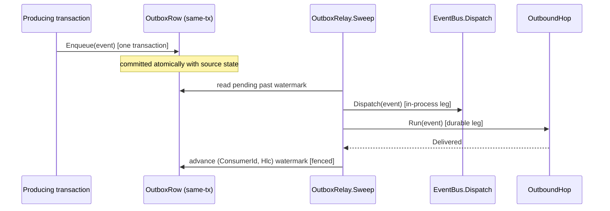

# [APPHOST_TRANSACTIONAL_OUTBOX]

The transactional-outbox and dead-letter owner for the runtime spine: a `DomainEvent` persists into a durable `Outbox` row in the SAME transaction as the producing write, a dispatch sweep on the one `SchedulePort` relays each pending row over an `OutboundHop` advancing a `(ConsumerId, Hlc)` watermark, a poison row exhausting its attempt budget routes to a `DeadLetter` lane, and the relay feeds the in-process `Wire/topics#BUS_CONDUCTOR` `EventBus.Dispatch` — so a decoupled domain event gains at-least-once dispatch with idempotent-key dedupe and exactly-once-effective delivery. The outbox row writes atomically with the producing transaction at `Rasm.Persistence` (the `ONE_OUTBOX_EGRESS_SPINE` ripple) and the workflow step-state row commits under the same tenant-scoped transaction (`SEAM_OUTBOX_AND_WORKFLOW_PERSISTENCE_TABLE`); the AppHost names the seam and the relay, atomicity stays Persistence. The page owns the outbox vocabulary, the dispatch sweep, the dead-letter lane, and the watermark-advancing relay; it consumes `DomainEvent`/`Topic`/`EventBus`, `DeliveryFanout`/`DeliveryReceipt` (the dedup-key precedent), `OutboundHop`/`OutboundSurface.Run` (the relay), `SchedulePort`/`ScheduleEntry.Spread` (the one sweep cadence), `HLC`/`EventLog` (ordering and the op-log), `FencingToken`, `TenantContext`, `ClockPolicy`, and `ReceiptSinkPort` as settled vocabulary, carries the durable outbox as a coordinated Persistence ripple, and mints no eighth port.

## [01]-[INDEX]

- [01]-[OUTBOX_FABRIC]: The transactional `OutboxRow`, the dispatch status, and the dead-letter lane.
- [02]-[DISPATCH_SWEEP]: The one `SchedulePort` sweep relaying pending rows over the watermark.
- [03]-[TS_PROJECTION]: Outbox-row and dead-letter wire shapes the dashboard consumes.

## [02]-[OUTBOX_FABRIC]

- Owner: `DispatchStatus` `[SmartEnum<string>]` the outbox-row lifecycle under the `ComparerAccessors.StringOrdinal` accessor; `OutboxRow` the durable transactional-outbox record; `DeadLetterRow` the poison-row record; `OutboxFault` `[Union]` fault family deriving its codes through `FaultBand.Outbox`.
- Cases: dispatch statuses pending | dispatched | dead-lettered; `OutboxFault` = Text | RelayRejected | Exhausted | WatermarkStale.
- Entry: `OutboxRow.Enqueue(DomainEvent evt, TenantContext tenant)` materializes a pending row carrying the event payload, the topic, the dedup key, the event's `DataClassification`, the HLC stamp, and a zero attempt count; `OutboxRow.Relayed(Instant at)` folds a successful relay onto the row as `dispatched` stamping the dispatched-at column, and `OutboxRow.Deferred(Instant at)` increments the attempt, stamps the same column, and routes to `dead-lettered` when the attempt budget is exhausted.
- Auto: the outbox row writes same-transaction with the producing write so a domain event and its source state commit atomically — a crash between the state write and the event publish cannot lose the event because both ride one transaction, and the dispatch sweep relays the durable row after commit, the transactional-outbox guarantee; the dedup key is the event's idempotency key so a re-enqueued identical event within the relay window dedupes through the `DeliveryFanout` cell exactly as the bus and notification fan-out dedupe, never a second dedup map; a row exhausting its attempt budget routes to `DeadLetterRow` carrying the last fault and the attempt history so a poison message leaves the dispatch lane rather than blocking it, and a dead-letter row is replayable through an operator command; the row carries the HLC stamp so the relay advances a `(ConsumerId, Hlc)` watermark monotonically and a relayed row never re-relays; the row persists the event's `DataClassification` and `ToEvent` re-emits it verbatim, so a `Personal`/`Confidential`/`Secret` event relayed through the durable lane re-enters the bus under its original classification and the `Observability/telemetry#REDACTION_TAXONOMY` seam never sees a silently-`Operational` downgrade.
- Receipt: a relayed row mints one `DeliveryReceipt` (the `DeliveryFanout` shape) carrying the topic and the dispatched flag; a dead-letter transition fans one `SpineLog` event; no parallel outbox receipt.
- Packages: Thinktecture.Runtime.Extensions, LanguageExt.Core, NodaTime, BCL inbox
- Growth: one dispatch status is one `DispatchStatus` row; a new outbox column is one field on `OutboxRow`; a new fault is one `OutboxFault` case; zero new surface.
- Boundary: the outbox is the only transactional-message owner — a fire-and-forget publish, a separate message queue, and a parallel event store are the deleted forms; the outbox row writes atomically with the producing transaction so atomicity stays Persistence and the AppHost names the seam — the durable outbox table, the dispatch-sweep cursor, and the dedup-key index land as the branch `ONE_OUTBOX_EGRESS_SPINE` Persistence ripple under the `TenantId` RLS predicate; the outbox row and the `Runtime/orchestration#STEP_STATE_SEAM` workflow step-state row commit under one tenant-scoped transaction so exactly-once-effective delivery and crash-durable step resumption share one durable boundary (`SEAM_OUTBOX_AND_WORKFLOW_PERSISTENCE_TABLE`); the relay registers as one keyed `OutboundHop` consumer advancing its own `(ConsumerId, Hlc)` watermark over the `ONE_OUTBOX_EGRESS_SPINE` op-log; the `[ONE_OUTBOX_EGRESS_SPINE]` branch binds three keyed `OutboundHop` consumers over the one op-log — this outbox relay, the `Runtime/orchestration#STEP_STATE_SEAM` workflow-step dispatch, and the `Rasm.Persistence/Version/egress` webhook/gRPC sinks (registered through the `Runtime ⇄ Rasm.Persistence/Version/egress # [PORT]: keyed OutboundHop egress` seam) — each draining the SAME Persistence-owned `CdcEnvelope` CloudEvents projection as the hop payload (`id` = `OpLogEntry.ContentKey` lower-hex, the `Sequence` extension = the outbox cursor, `partitionkey` = `EntityKey`) — the envelope is DECODED, never re-minted, and a per-consumer re-pack is the drift defect; the dedup reuses the `DeliveryFanout` idempotency-key precedent so the outbox dedup and the delivery dedup are one cell, never two.

```csharp signature
[SmartEnum<string>]
[KeyMemberEqualityComparer<ComparerAccessors.StringOrdinal, string>]
[KeyMemberComparer<ComparerAccessors.StringOrdinal, string>]
public sealed partial class DispatchStatus {
    public static readonly DispatchStatus Pending = new("pending");
    public static readonly DispatchStatus Dispatched = new("dispatched");
    public static readonly DispatchStatus DeadLettered = new("dead-lettered");
}

[Union]
public abstract partial record OutboxFault : Expected, IValidationError<OutboxFault> {
    private OutboxFault(string detail, int code) : base(detail, code, None) { }
    public static OutboxFault Create(string message) => new Text(message);
    public sealed record Text : OutboxFault { public Text(string detail) : base(detail, FaultBand.Outbox.Code(0)) { } }
    public sealed record RelayRejected : OutboxFault { public RelayRejected(string detail) : base(detail, FaultBand.Outbox.Code(1)) { } }
    public sealed record Exhausted : OutboxFault { public Exhausted(string detail) : base(detail, FaultBand.Outbox.Code(2)) { } }
    public sealed record WatermarkStale : OutboxFault { public WatermarkStale(string detail) : base(detail, FaultBand.Outbox.Code(3)) { } }
}

public sealed record OutboxRow(
    string OutboxId,
    string Topic,
    string DedupKey,
    JsonElement Payload,
    DataClassification Classification,
    DispatchStatus Status,
    int Attempt,
    ulong Logical,
    Instant Physical,
    TenantContext Tenant,
    Option<Instant> DispatchedAt = default) {
    public const int MaxAttempts = 8;

    public static OutboxRow Enqueue(DomainEvent evt, TenantContext tenant) =>
        new($"{evt.Topic}:{evt.IdempotencyKey}", evt.Topic, evt.IdempotencyKey, evt.Payload, evt.Classification, DispatchStatus.Pending, Attempt: 0, evt.Logical, evt.Physical, tenant);

    // Every Instant parameter is CONSUMED: the transition stamps the row's dispatched-at column.
    public OutboxRow Relayed(Instant at) => this with { Status = DispatchStatus.Dispatched, DispatchedAt = Some(at) };

    public OutboxRow Deferred(Instant at) =>
        Attempt + 1 >= MaxAttempts
            ? this with { Status = DispatchStatus.DeadLettered, Attempt = Attempt + 1, DispatchedAt = Some(at) }
            : this with { Attempt = Attempt + 1, DispatchedAt = Some(at) };

    // The relayed event round-trips its ORIGINAL classification — a durable hop never downgrades the redaction taxonomy.
    public DomainEvent ToEvent() => new(Topic, DedupKey, Payload, Classification, Logical, Physical);
}

public sealed record DeadLetterRow(
    string OutboxId,
    string Topic,
    JsonElement Payload,
    string LastFault,
    int Attempts,
    Instant At);
```

## [03]-[DISPATCH_SWEEP]

- Owner: `OutboxRelay` the static sweep-and-relay surface over the one `SchedulePort` cadence, advancing the `(ConsumerId, Hlc)` watermark.
- Entry: `Sweep(OutboxRelay.Runtime runtime, TenantContext tenant, ulong watermark)` returns `IO<Seq<DeliveryReceipt>>` — reads the pending outbox rows past the `watermark` cursor, relays each through the in-process `EventBus.Dispatch` and the durable `OutboundHop`, advances the watermark on each success, and defers or dead-letters a failed row; `Replay(OutboxRelay.Runtime runtime, string outboxId)` returns `IO<DeliveryReceipt>` — re-enqueues a dead-letter row for one more dispatch attempt.
- Auto: the sweep rides one `ScheduleEntry.Spread` row on the one `SchedulePort` so the dispatch cadence is one schedule row, never a second scheduler — the fleet-spread seed distributes the sweep across nodes so two nodes do not relay the same row simultaneously, and the `FencingToken` fences the watermark advance so a stale node cannot rewind it; each pending row relays through `EventBus.Dispatch` to feed the in-process bus and through `OutboundSurface.Run` over its topic's `OutboundHop` for a durable subscriber, so the in-process and durable delivery legs ride one relay; a successful relay advances the `(ConsumerId, Hlc)` watermark monotonically so a relayed row never re-relays — the at-least-once-with-watermark guarantee that, with the consumer-side dedup, is exactly-once-effective; a failed relay increments the row's attempt and PERSISTS the deferred row through the `Park` port — the retry budget is durable, so exhaustion actually trips across sweeps — routing to dead-letter on budget exhaustion so a poison row leaves the lane and its dead-lettered status leaves the pending set.
- Receipt: each relayed row mints one `DeliveryReceipt` carrying the topic, the dispatched flag, and the ADVANCED watermark — the fenced advance THREADS into the returned receipt so delivery accounting is wired, never notional (a bound-then-discarded advance is the deleted form); a dead-letter transition fans one `SpineLog` event; no parallel per-row relay receipt — the sweep itself seals with one `OutboxSweepReceipt` fanned under `InstrumentFan.SweepKind`, carrying lag, oldest-undelivered age, the advanced cursor, the relayed/deferred split, and the per-topic `Lanes` rows the partitioned outbox gauges read, so the outbox gauges read sweep evidence, never a store scan.
- Packages: LanguageExt.Core, NodaTime, System.IO.Hashing, BCL inbox
- Growth: a new relay target is one `OutboundHop` the topic binds; the sweep cadence is one `ScheduleEntry.Spread` row column; zero new surface.
- Boundary: the dispatch sweep is the only outbox-relay owner — a per-row background loop, a second scheduler for the sweep, and a parallel relay are the deleted forms; the sweep rides the one `SchedulePort` so the cadence is one schedule row and the fleet-spread seed distributes it; the relay registers as one keyed `OutboundHop` consumer advancing its own `(ConsumerId, Hlc)` watermark over the `ONE_OUTBOX_EGRESS_SPINE` op-log, never re-minting the Persistence-owned `CdcEnvelope` CloudEvents projection or a second egress table; the watermark advance fences through `FencingToken.Admits` so two nodes cannot both advance it past one row; the consumer-side dedup reuses the `DeliveryFanout` cell so at-least-once dispatch plus idempotent-key dedup is exactly-once-effective, never an exactly-once distributed-transaction protocol.

```csharp signature
public sealed record OutboxLaneRow(
    string Topic,
    long Lag,
    double OldestAgeSeconds);

public sealed record OutboxSweepReceipt(
    long Lag,
    double OldestAgeSeconds,
    ulong Watermark,
    int Relayed,
    int Deferred,
    Instant At,
    Seq<OutboxLaneRow> Lanes);

public static class OutboxRelay {
    public sealed record Runtime(
        EventBus.Cell Bus,
        OutboundRuntime Outbound,
        Func<TenantContext, ulong, Fin<Seq<OutboxRow>>> Pending,
        Func<OutboxRow, FencingToken, Fin<ulong>> Advance,
        Func<OutboxRow, Fin<Unit>> Park,
        Func<DeadLetterRow, Fin<Unit>> DeadLetter,
        Func<TenantContext, Fin<FencingToken>> Fence,
        Func<string, OutboundHop> Hop,
        Func<OutboxRow, DomainEvent, Func<CancellationToken, Task<HopOutcome>>> Send,
        ClockPolicy Clocks,
        ReceiptSinkPort Sink);

    public static IO<Seq<DeliveryReceipt>> Sweep(Runtime runtime, TenantContext tenant, ulong watermark) =>
        runtime.Pending(tenant, watermark).Match(
            Succ: rows => rows.TraverseM(row => Relay(runtime, tenant, row)).As()
                .Bind(receipts => Evidence(runtime, tenant, rows, receipts, watermark).Map(_ => receipts)),
            Fail: fault => IO.pure(Seq<DeliveryReceipt>()));

    // Sweep seal: lag and oldest age derive from the rows still past the advanced cursor, so the
    // gauges read the sweep's own census — never a second store scan beside the relay.
    static IO<ReceiptEnvelope> Evidence(Runtime runtime, TenantContext tenant, Seq<OutboxRow> rows, Seq<DeliveryReceipt> receipts, ulong floor) =>
        IO.lift(() => runtime.Clocks.Now).Bind(now => {
            var advanced = receipts.Choose(static receipt => receipt.Watermark).Fold(floor, ulong.Max);
            var pending = rows.Filter(row => row.Logical > advanced);
            var receipt = new OutboxSweepReceipt(
                Lag: pending.Count,
                OldestAgeSeconds: pending.Map(row => (now - row.Physical).TotalSeconds).Fold(0d, double.Max),
                Watermark: advanced,
                Relayed: receipts.Filter(static receipt => receipt.Watermark.IsSome).Count,
                Deferred: receipts.Filter(static receipt => receipt.Watermark.IsNone).Count,
                At: now,
                Lanes: toSeq(pending.GroupBy(static row => row.Topic).Select(group =>
                    new OutboxLaneRow(group.Key, group.Count(), group.Max(row => (now - row.Physical).TotalSeconds)))));
            return runtime.Sink.Send(Correlation.Mint(), tenant, TelemetrySource.AppHost.Key, InstrumentFan.SweepKind,
                JsonSerializer.SerializeToElement(receipt, AppHostWireContext.Default.OutboxSweepReceipt));
        });

    // The fenced advance THREADS: the store-validated watermark lands IN the returned receipt (Some on
    // a delivered advance, None on a defer), so accounting derives from the wired value — a bound-then-
    // discarded advance and a constant sentinel cursor are the deleted forms.
    static IO<DeliveryReceipt> Relay(Runtime runtime, TenantContext tenant, OutboxRow row) =>
        from _bus in EventBus.Dispatch(runtime.Bus, row.ToEvent())
        from receipt in OutboundSurface.Run(runtime.Outbound, runtime.Hop(row.Topic), runtime.Send(row, row.ToEvent()))
        from advanced in receipt.Outcome is HopOutcome.Delivered
            ? IO.lift(() => runtime.Fence(tenant)
                .Bind(token => runtime.Advance(row.Relayed(runtime.Clocks.Now), token))
                .Map(Some))
            : Defer(runtime, row)
        select new DeliveryReceipt(
            row.Topic, row.DedupKey, receipt.Outcome, Deduped: false, receipt.Attempts, receipt.Elapsed,
            advanced.Match(Succ: static cursor => cursor, Fail: static _ => Option<ulong>.None), Correlation.Mint());

    // A deferred row advances NO watermark — the defer answers None — and the incremented attempt /
    // DispatchedAt row PERSISTS through Park on BOTH arms, so the retry budget is durable across sweeps
    // and a dead-lettered row leaves the pending set; a computed-then-dropped Deferred is the deleted form.
    static IO<Fin<Option<ulong>>> Defer(Runtime runtime, OutboxRow row) =>
        row.Deferred(runtime.Clocks.Now) is var deferred && deferred.Status == DispatchStatus.DeadLettered
            ? IO.lift(() => runtime.Park(deferred)
                .Bind(_ => runtime.DeadLetter(new DeadLetterRow(
                    row.OutboxId, row.Topic, row.Payload, "relay-exhausted", deferred.Attempt, runtime.Clocks.Now)))
                .Map(static _ => Option<ulong>.None))
            : IO.lift(() => runtime.Park(deferred).Map(static _ => Option<ulong>.None));
}
```



## [04]-[TS_PROJECTION]

- Owner: `OutboxRowWire`, `DeadLetterRowWire`, `OutboxSweepWire` — the outbox-row, dead-letter, and sweep-evidence wire shapes the dashboard ingests; the per-relay `DeliveryReceipt`s ride the existing `Wire/outbound#DELIVERY_FANOUT` `DeliveryReceiptWire`, bound here, never re-authored.
- Packages: BCL inbox
- Growth: one wire-member row per new outbox or dead-letter field; the dispatch status crosses as its smart-enum key; zero new surface.
- Boundary: the dispatch status crosses as its smart-enum string key; the HLC stamp crosses through the existing `HlcStampWire` so the outbox ordering reads the same causal primitive the receipt envelope carries; instants cross as extended-ISO text; the dead-letter row carries the last fault and attempt count so the dashboard surfaces a poison message for operator replay.

```ts contract
type DispatchStatusKey = "pending" | "dispatched" | "dead-lettered";

interface OutboxRowWire {
  readonly outboxId: string;
  readonly topic: string;
  readonly dedupKey: string;
  readonly status: DispatchStatusKey;
  readonly attempt: number;
  readonly logical: number;
  readonly physical: string;
}

interface DeadLetterRowWire {
  readonly outboxId: string;
  readonly topic: string;
  readonly lastFault: string;
  readonly attempts: number;
  readonly at: string;
}

interface OutboxLaneWire {
  readonly topic: string;
  readonly lag: number;
  readonly oldestAgeSeconds: number;
}

interface OutboxSweepWire {
  readonly lag: number;
  readonly oldestAgeSeconds: number;
  readonly watermark: number;
  readonly relayed: number;
  readonly deferred: number;
  readonly at: string;
  readonly lanes: readonly OutboxLaneWire[];
}
```

## [05]-[RESEARCH]

- [OUTBOX_RIPPLE]: the durable transactional-outbox table, the dispatch-sweep cursor, and the dedup-key index are the `Rasm.Persistence` `ONE_OUTBOX_EGRESS_SPINE` ripple under the `TenantId` RLS predicate — the AppHost names the seam and the relay, the outbox row writes atomically with the producing transaction at Persistence, and the `[ONE_OUTBOX_EGRESS_SPINE]` branch binds three keyed `OutboundHop` consumers over the one op-log: this outbox relay, the `Runtime/orchestration#STEP_STATE_SEAM` workflow-step dispatch, and the `Rasm.Persistence/Version/egress#EGRESS_SINK` webhook/gRPC sinks through the `[PORT]: keyed OutboundHop egress` seam — each advancing its own `(ConsumerId, Hlc)` watermark (the Persistence cursor owner is `Store/coordination#OUTBOX_CURSOR`, `OutboxAdvance(Sink, Through)` the one fenced CAS writer) and draining the SAME Persistence-owned `CdcEnvelope` CloudEvents projection as the hop payload (`id` = `OpLogEntry.ContentKey` lower-hex, `Sequence` = the outbox cursor, `partitionkey` = `EntityKey`) — decoded, never re-minted, so the CloudEvents projection is the one wire payload across all three consumers; the wire-native gRPC hop reads its `HopDelivery.ExactlyOnceEffective` row so the delivery guarantee is STATED per sink; the outbox row and the `Runtime/orchestration#STEP_STATE_SEAM` workflow step-state row commit under one tenant-scoped transaction (`SEAM_OUTBOX_AND_WORKFLOW_PERSISTENCE_TABLE`), so exactly-once-effective delivery and crash-durable step resumption share one durable boundary that lands in parallel as the two Persistence legs.
- [SWEEP_CADENCE]: the dispatch sweep rides one `Runtime/time#SCHEDULE_PORT` `ScheduleEntry.Spread` row so the cadence is one schedule row and the fleet-spread `XxHash3` seed distributes the sweep across nodes — a second scheduler for the outbox sweep is the rejected form; the watermark advance fences through `Runtime/time#FENCING_TOKEN` `FencingToken.Admits` so two nodes cannot both advance it past one row, and the consumer-side dedup reuses the `Wire/outbound#DELIVERY_FANOUT` idempotency-key precedent so at-least-once dispatch plus idempotent-key dedup is exactly-once-effective, never an exactly-once distributed-transaction protocol.
- [BUS_FEED]: the relay feeds the in-process `Wire/topics#BUS_CONDUCTOR` `EventBus.Dispatch` and the durable `OutboundHop` over `OutboundSurface.Run` in one relay, so the in-process leg carries bounded back-pressure and the durable leg rides the one retry owner; the `DeadLetter` lane carries a poison row for operator replay through `Replay`, never a blocked dispatch lane.
