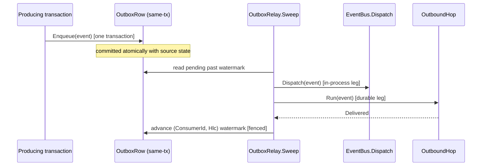

# [APPHOST_TRANSACTIONAL_OUTBOX]

The transactional-outbox and dead-letter owner for the runtime spine: a `DomainEvent` persists into a durable `Outbox` row in the SAME transaction as the producing write, a dispatch sweep on the one `SchedulePort` relays each pending row over an `OutboundHop` advancing a `(ConsumerId, Hlc)` watermark, a poison row exhausting its attempt budget routes to a `DeadLetter` lane, and the relay feeds the in-process `Wire/topics#BUS_CONDUCTOR` `EventBus.Dispatch` — so a decoupled domain event gains at-least-once dispatch with idempotent-key dedupe and exactly-once-effective delivery. The outbox row writes atomically with the producing transaction at `Rasm.Persistence` (the `ONE_OUTBOX_EGRESS_SPINE` ripple) and the workflow step-state row commits under the same tenant-scoped transaction (`SEAM_OUTBOX_AND_WORKFLOW_PERSISTENCE_TABLE`); the AppHost names the seam and the relay, atomicity stays Persistence. The page owns the outbox vocabulary, the dispatch sweep, the dead-letter lane, and the watermark-advancing relay; it consumes `DomainEvent`/`Topic`/`EventBus`, `DeliveryFanout`/`DeliveryReceipt` (the dedup-key precedent), `OutboundHop`/`OutboundSurface.Run` (the relay), `SchedulePort`/`ScheduleEntry.Spread` (the one sweep cadence), `HLC`/`EventLog` (ordering and the op-log), `FencingToken`, `TenantContext`, `ClockPolicy`, and `ReceiptSinkPort` as settled vocabulary, carries the durable outbox as a coordinated Persistence ripple, and mints no eighth port.

## [01]-[INDEX]

- [02]-[OUTBOX_FABRIC]: The transactional `OutboxRow`, the dispatch status, and the dead-letter lane.
- [03]-[DISPATCH_SWEEP]: The one `SchedulePort` sweep relaying pending rows over the watermark.
- [04]-[TS_PROJECTION]: Outbox-row and dead-letter wire shapes the dashboard consumes.

## [02]-[OUTBOX_FABRIC]

- Owner: `DispatchStatus` `[SmartEnum<string>]` the outbox-row lifecycle under the `ComparerAccessors.StringOrdinal` accessor; `OutboxRow` the durable transactional-outbox record; `DeadLetterRow` the poison-row record; `OutboxFault` `[Union]` fault family deriving its codes through `FaultBand.Outbox`.
- Cases: dispatch statuses pending | dispatched | dead-lettered; `OutboxFault` = Text | RelayRejected | Exhausted | WatermarkStale.
- Entry: `OutboxRow.Enqueue(DomainEvent evt, TenantContext tenant)` materializes a pending row carrying the event payload, the topic, the dedup key, the event's `DataClassification`, the HLC stamp, the producing span's kernel `TraceCarrier`, and a zero attempt count; `OutboxRow.Relayed(Instant at)` folds a successful relay onto the row as `dispatched` stamping the dispatched-at column, and `OutboxRow.Deferred(Instant at)` increments the attempt, stamps the same column, and routes to `dead-lettered` when the attempt budget is exhausted.
- Auto: the outbox row writes same-transaction with the producing write so a domain event and its source state commit atomically — a crash between the state write and event publish cannot lose the event because both ride one transaction, and the dispatch sweep relays the durable row after commit; the dedup key is the event's idempotency key so a re-enqueued identical event within the relay window dedupes through the `DeliveryFanout` cell, never a second dedup map; a row exhausting its attempt budget routes to `DeadLetterRow` carrying the last fault and attempt history so a poison message leaves the dispatch lane rather than blocking it; the row carries the HLC stamp so the relay advances a `(ConsumerId, Hlc)` watermark monotonically and a relayed row never re-relays; the row persists the event's `DataClassification` and `ToEvent` re-emits it verbatim, so a durable hop cannot silently downgrade classification; the row persists the producing span's `TraceCarrier` beside the causal stamp, because the durable hop severs the in-process trace and the carrier is what lets the sweep name every write that caused it.
- Receipt: a relayed row mints one `DeliveryReceipt` (the `DeliveryFanout` shape) carrying the topic and the dispatched flag; a dead-letter transition fans one `SpineLog` event; no parallel outbox receipt.
- Packages: Thinktecture.Runtime.Extensions, LanguageExt.Core, NodaTime, BCL inbox
- Growth: one dispatch status is one `DispatchStatus` row; a new outbox column is one field on `OutboxRow`; a new fault is one `OutboxFault` case; zero new surface.
- Boundary: the outbox is the only transactional-message owner — a fire-and-forget publish, a separate message queue, and a parallel event store are the deleted forms; the outbox row writes atomically with the producing transaction so atomicity stays Persistence and the AppHost names the seam — the durable outbox table, the dispatch-sweep cursor, and the dedup-key index land as the branch `ONE_OUTBOX_EGRESS_SPINE` Persistence ripple under the `TenantId` RLS predicate; the outbox row and the `Runtime/orchestration#STEP_STATE_SEAM` workflow step-state row commit under one tenant-scoped transaction so exactly-once-effective delivery and crash-durable step resumption share one durable boundary (`SEAM_OUTBOX_AND_WORKFLOW_PERSISTENCE_TABLE`); the relay registers as one keyed `OutboundHop` consumer advancing its own `(ConsumerId, Hlc)` watermark over the `ONE_OUTBOX_EGRESS_SPINE` op-log; the `[ONE_OUTBOX_EGRESS_SPINE]` branch binds three keyed `OutboundHop` consumers over the one op-log — this outbox relay, the `Runtime/orchestration#STEP_STATE_SEAM` workflow-step dispatch, and the `Rasm.Persistence/Version/egress` webhook/gRPC sinks (registered through the `Runtime ⇄ Rasm.Persistence/Version/egress # [PORT]: keyed OutboundHop egress` seam) — each draining the SAME Persistence-owned `CdcEnvelope` CloudEvents projection as the hop payload (`id` = `OpLogEntry.ContentKey` lower-hex, the `Sequence` extension = the outbox cursor, `partitionkey` = `EntityKey`) — the envelope is DECODED, never re-minted, and a per-consumer re-pack is the drift defect; the dedup reuses the `DeliveryFanout` idempotency-key precedent so the outbox dedup and the delivery dedup are one cell, never two.

```csharp signature
[SmartEnum<string>]
[KeyMemberEqualityComparer<ComparerAccessors.StringOrdinal, string>]
[KeyMemberComparer<ComparerAccessors.StringOrdinal, string>]
public sealed partial class DispatchStatus {
    public static readonly DispatchStatus Pending = new("pending");
    public static readonly DispatchStatus Dispatched = new("dispatched");
    public static readonly DispatchStatus DeadLettered = new("dead-lettered");
}

[Union]
public abstract partial record OutboxFault : Expected, IValidationError<OutboxFault> {
    private OutboxFault(string detail, int code) : base(detail, code, None) { }
    public static OutboxFault Create(string message) => new Text(message);
    public sealed record Text : OutboxFault { public Text(string detail) : base(detail, FaultBand.Outbox.Code(0)) { } }
    public sealed record RelayRejected : OutboxFault { public RelayRejected(string detail) : base(detail, FaultBand.Outbox.Code(1)) { } }
    public sealed record Exhausted : OutboxFault { public Exhausted(string detail) : base(detail, FaultBand.Outbox.Code(2)) { } }
    public sealed record WatermarkStale : OutboxFault { public WatermarkStale(string detail) : base(detail, FaultBand.Outbox.Code(3)) { } }
}

public sealed record OutboxRow(
    string OutboxId,
    string Topic,
    string DedupKey,
    JsonElement Payload,
    DataClassification Classification,
    DispatchStatus Status,
    int Attempt,
    ulong Logical,
    Instant Physical,
    TenantContext Tenant,
    TraceCarrier Trace,
    Option<Instant> DispatchedAt = default) {
    public const int MaxAttempts = 8;

    // The carrier captures at ENQUEUE, inside the producing transaction, because that is the only moment the
    // causing span is live — the sweep runs on its own cadence minutes later with no ambient trace to read,
    // so a carrier stamped anywhere downstream would name the sweep that relayed the row, never the write
    // that produced it. An unlistened producer stamps the absent pair and its row contributes no edge.
    public static OutboxRow Enqueue(DomainEvent evt, TenantContext tenant) =>
        new($"{evt.Topic}:{evt.IdempotencyKey}", evt.Topic, evt.IdempotencyKey, evt.Payload, evt.Classification, DispatchStatus.Pending, Attempt: 0, evt.Logical, evt.Physical, tenant, TraceCarrier.Of(Activity.Current));

    // Every Instant parameter is CONSUMED: the transition stamps the row's dispatched-at column.
    public OutboxRow Relayed(Instant at) => this with { Status = DispatchStatus.Dispatched, DispatchedAt = Some(at) };

    public OutboxRow Deferred(Instant at) =>
        Attempt + 1 >= MaxAttempts
            ? this with { Status = DispatchStatus.DeadLettered, Attempt = Attempt + 1, DispatchedAt = Some(at) }
            : this with { Attempt = Attempt + 1, DispatchedAt = Some(at) };

    // The relayed event round-trips its ORIGINAL classification — a durable hop never downgrades the redaction taxonomy.
    public DomainEvent ToEvent() => new(Topic, DedupKey, Payload, Classification, Logical, Physical);
}

public sealed record DeadLetterRow(
    string OutboxId,
    string Topic,
    JsonElement Payload,
    string LastFault,
    int Attempts,
    Instant At);
```

## [03]-[DISPATCH_SWEEP]

- Owner: `OutboxRelay` the static sweep-and-relay surface over the one `SchedulePort` cadence, advancing the `(ConsumerId, Hlc)` watermark and bracketing each drain in the kernel `SpanBand` under this page's one `Scope` row, linked to every producing write it relays.
- Entry: `Sweep(OutboxRelay.Runtime runtime, TenantContext tenant, ulong watermark)` returns `IO<Seq<DeliveryReceipt>>` — reads pending rows past the cursor, opens one producer-kind drain span whose `SpanEdge` carries one `ActivityLink` per pending row, relays each through `EventBus.Dispatch` and the durable `OutboundHop`, advances the watermark on success, and defers or dead-letters a failed row; `OutboxRelay.Scope` rides the platform contributor port into `TelemetryComposition.Band`, which `Runtime.Band` binds.
- Auto: the sweep rides one `ScheduleEntry.Spread` row on the one `SchedulePort` so the dispatch cadence is one schedule row, never a second scheduler — the fleet-spread seed distributes the sweep across nodes so two nodes do not relay the same row simultaneously, and the `FencingToken` fences the watermark advance so a stale node cannot rewind it; each pending row relays through `EventBus.Dispatch` to feed the in-process bus and through `OutboundSurface.Run` over its topic's `OutboundHop` for a durable subscriber, so the in-process and durable delivery legs ride one relay; a successful relay advances the `(ConsumerId, Hlc)` watermark monotonically so a relayed row never re-relays — the at-least-once-with-watermark guarantee that, with the consumer-side dedup, is exactly-once-effective; a failed relay increments the row's attempt and PERSISTS the deferred row through the `Park` port — the retry budget is durable, so exhaustion actually trips across sweeps — routing to dead-letter on budget exhaustion so a poison row leaves the lane and its dead-lettered status leaves the pending set; a relay that RAISES converts to that same defer at its own row before the traverse sees it, so every pending row is attempted and receipted and one poison row can never abort the sweep it was queued behind.
- Receipt: each relayed row mints one `DeliveryReceipt` carrying the topic, the dispatched flag, and the ADVANCED watermark — the fenced advance THREADS into the returned receipt so delivery accounting is wired, never notional (a bound-then-discarded advance is the deleted form); a dead-letter transition fans one `SpineLog` event; no parallel per-row relay receipt — the sweep itself seals with one `OutboxSweepReceipt` fanned under `InstrumentFan.SweepKind`, carrying lag, oldest-undelivered age, the advanced cursor, the relayed/deferred split, and the per-topic `Lanes` rows the partitioned outbox gauges read, so the outbox gauges read sweep evidence, never a store scan.
- Packages: LanguageExt.Core, NodaTime, System.IO.Hashing, BCL inbox
- Growth: a new relay target is one `OutboundHop` the topic binds; the sweep cadence is one `ScheduleEntry.Spread` row column; zero new surface.
- Boundary: the drain is a FAN-IN, so its span links every relayed row's producing trace and parents on none of them — a parent edge to the first row invents a chain the batch never had, and a per-row child span under the sweep re-costs a trace per relayed row while stranding the batch's own shape; the band arrives as an `Option` on the runtime record, so a harness wiring the relay without a telemetry composition relays untraced rather than minting a second `ActivitySource` owner; the dispatch sweep is the only outbox-relay owner — a per-row background loop, a second scheduler for the sweep, and a parallel relay are the deleted forms; the sweep rides the one `SchedulePort` so the cadence is one schedule row and the fleet-spread seed distributes it; the relay registers as one keyed `OutboundHop` consumer advancing its own `(ConsumerId, Hlc)` watermark over the `ONE_OUTBOX_EGRESS_SPINE` op-log, never re-minting the Persistence-owned `CdcEnvelope` CloudEvents projection or a second egress table; the watermark advance fences through `FencingToken.Admits` so two nodes cannot both advance it past one row; the consumer-side dedup reuses the `DeliveryFanout` cell so at-least-once dispatch plus idempotent-key dedup is exactly-once-effective, never an exactly-once distributed-transaction protocol.

```csharp signature
public sealed record OutboxLaneRow(
    string Topic,
    long Lag,
    double OldestAgeSeconds);

public sealed record OutboxSweepReceipt(
    long Lag,
    double OldestAgeSeconds,
    ulong Watermark,
    int Relayed,
    int Deferred,
    Instant At,
    Seq<OutboxLaneRow> Lanes);

public static class OutboxRelay {
    public sealed record Runtime(
        EventBus.Cell Bus,
        OutboundRuntime Outbound,
        Func<TenantContext, ulong, Fin<Seq<OutboxRow>>> Pending,
        Func<OutboxRow, FencingToken, Fin<ulong>> Advance,
        Func<OutboxRow, Fin<Unit>> Park,
        Func<DeadLetterRow, Fin<Unit>> DeadLetter,
        Func<TenantContext, Fin<FencingToken>> Fence,
        Func<string, OutboundHop> Hop,
        Func<OutboxRow, DomainEvent, Func<CancellationToken, Task<HopOutcome>>> Send,
        ClockPolicy Clocks,
        ReceiptSinkPort Sink,
        Option<SpanBand> Band = default);

    // This relay opens one drain plane, travelling inward on the platform's contributor port beside the
    // instrument rows, so the telemetry composition admits it into the one band and registers its name on the
    // tracer provider in one fold. Admission and registration fail separately and silently: an unadmitted
    // scope refuses on the kernel rail at the first sweep, while an admitted-but-unregistered one strands its
    // source listenerless and every sweep takes the null-span arm an untraced composition legitimately takes.
    public static readonly TraceScope Scope = TraceScope.Create(value: "rasm.apphost.outbox");

    // Link-edge attribution rides the package's own dotted namespace like every sibling dimension; these key
    // SPAN LINKS rather than a metric series, so no census row or view tag-key is owed for either.
    public const string OutboxTopicSlot = "rasm.apphost.outbox.topic";
    public const string OutboxDedupSlot = "rasm.apphost.outbox.dedup";

    public static IO<Seq<DeliveryReceipt>> Sweep(Runtime runtime, TenantContext tenant, ulong watermark) =>
        runtime.Pending(tenant, watermark).Match(
            Succ: rows => runtime.Band.Match(
                Some: band => band.Traced(Scope, Op.Of(), _ => Drain(runtime, tenant, rows, watermark), Edges(rows)),
                None: () => Drain(runtime, tenant, rows, watermark)),
            Fail: fault => IO.pure(Seq<DeliveryReceipt>()));

    // Fan-in carriage, one edge per relayed row: the sweep descends from no single producing transaction, so
    // each row's persisted carrier becomes a link and the batch states exactly which writes caused it, while
    // an adopted parent would fabricate descent from whichever row happened to sort first. `Producer` is the
    // kind because this bracket writes onto the broker; topic and dedup key ride each edge because a trace
    // reader routing a stuck lane needs the row's identity on the link itself, never a payload fetch. An
    // unparseable or absent carrier drops ITS edge alone and the sweep keeps every edge it could reconstruct.
    static SpanEdge Edges(Seq<OutboxRow> rows) =>
        SpanEdge.FanIn(
            rows.Choose(static row => row.Trace.Link(
                (OutboxTopicSlot, row.Topic), (OutboxDedupSlot, row.DedupKey))).Strict(),
            ActivityKind.Producer);

    static IO<Seq<DeliveryReceipt>> Drain(Runtime runtime, TenantContext tenant, Seq<OutboxRow> rows, ulong watermark) =>
        rows.TraverseM(row => Relayed(runtime, tenant, row)).As()
            .Bind(receipts => Evidence(runtime, tenant, rows, receipts, watermark).Map(_ => receipts));

    // Row-local shield AHEAD of the traverse: a monadic traverse short-circuits the whole sweep on the first
    // raise, so one row faulting inside the bus dispatch or the hop leg strands every later row unattempted and
    // seals no evidence at all — the exact lane blocking the dead-letter path exists to clear. The raise converts
    // to that row's own Defer, so its attempt increments durably, its budget still trips toward dead-letter, and
    // every remaining row is still attempted and still receipted.
    static IO<DeliveryReceipt> Relayed(Runtime runtime, TenantContext tenant, OutboxRow row) =>
        Relay(runtime, tenant, row).Catch(static _ => true, error =>
            Defer(runtime, row).Map(_ => new DeliveryReceipt(
                row.Topic, row.DedupKey,
                new HopOutcome.Faulted(new OutboxFault.RelayRejected($"{row.OutboxId}:{error.Message}")),
                Deduped: false, row.Attempt + 1, Duration.Zero, Option<ulong>.None, Correlation.Mint())));

    // Sweep seal: lag and oldest age derive from the rows still past the advanced cursor, so the
    // gauges read the sweep's own census — never a second store scan beside the relay.
    static IO<ReceiptEnvelope> Evidence(Runtime runtime, TenantContext tenant, Seq<OutboxRow> rows, Seq<DeliveryReceipt> receipts, ulong floor) =>
        IO.lift(() => runtime.Clocks.Now).Bind(now => {
            var advanced = receipts.Choose(static receipt => receipt.Watermark).Fold(floor, ulong.Max);
            var pending = rows.Filter(row => row.Logical > advanced);
            var receipt = new OutboxSweepReceipt(
                Lag: pending.Count,
                OldestAgeSeconds: pending.Map(row => (now - row.Physical).TotalSeconds).Fold(0d, double.Max),
                Watermark: advanced,
                Relayed: receipts.Filter(static receipt => receipt.Watermark.IsSome).Count,
                Deferred: receipts.Filter(static receipt => receipt.Watermark.IsNone).Count,
                At: now,
                Lanes: toSeq(pending.GroupBy(static row => row.Topic).Select(group =>
                    new OutboxLaneRow(group.Key, group.Count(), group.Max(row => (now - row.Physical).TotalSeconds)))));
            return runtime.Sink.Send(Correlation.Mint(), tenant, TelemetrySource.AppHost.Key, InstrumentFan.SweepKind,
                JsonSerializer.SerializeToElement(receipt, AppHostWireContext.Default.OutboxSweepReceipt));
        });

    // The fenced advance THREADS: the store-validated watermark lands IN the returned receipt (Some on
    // a delivered advance, None on a defer), so accounting derives from the wired value — a bound-then-
    // discarded advance and a constant sentinel cursor are the deleted forms.
    static IO<DeliveryReceipt> Relay(Runtime runtime, TenantContext tenant, OutboxRow row) =>
        from _bus in EventBus.Dispatch(runtime.Bus, row.ToEvent())
        from receipt in OutboundSurface.Run(runtime.Outbound, runtime.Hop(row.Topic), runtime.Send(row, row.ToEvent()))
        from advanced in receipt.Outcome is HopOutcome.Delivered
            ? IO.lift(() => runtime.Fence(tenant)
                .Bind(token => runtime.Advance(row.Relayed(runtime.Clocks.Now), token))
                .Map(Some))
            : Defer(runtime, row)
        select new DeliveryReceipt(
            row.Topic, row.DedupKey, receipt.Outcome, Deduped: false, receipt.Attempts, receipt.Elapsed,
            advanced.Match(Succ: static cursor => cursor, Fail: static _ => Option<ulong>.None), Correlation.Mint());

    // A deferred row advances NO watermark — the defer answers None — and the incremented attempt /
    // DispatchedAt row PERSISTS through Park on BOTH arms, so the retry budget is durable across sweeps
    // and a dead-lettered row leaves the pending set; a computed-then-dropped Deferred is the deleted form.
    static IO<Fin<Option<ulong>>> Defer(Runtime runtime, OutboxRow row) =>
        row.Deferred(runtime.Clocks.Now) is var deferred && deferred.Status == DispatchStatus.DeadLettered
            ? IO.lift(() => runtime.Park(deferred)
                .Bind(_ => runtime.DeadLetter(new DeadLetterRow(
                    row.OutboxId, row.Topic, row.Payload, "relay-exhausted", deferred.Attempt, runtime.Clocks.Now)))
                .Map(static _ => Option<ulong>.None))
            : IO.lift(() => runtime.Park(deferred).Map(static _ => Option<ulong>.None));
}
```


```mermaid
sequenceDiagram
    accTitle: Transactional outbox dispatch and watermark advance
    accDescr: A producing transaction enqueueing an event atomically with source state, the relay sweep reading past the watermark and dispatching the in-process and durable legs, and the fenced watermark advancing only after delivery.
    participant Tx as Producing transaction
    participant Outbox as OutboxRow (same-tx)
    participant Sweep as OutboxRelay.Sweep
    participant Bus as EventBus.Dispatch
    participant Hop as OutboundHop
    Tx->>Outbox: Enqueue(event) [one transaction]
    Note over Outbox: committed atomically with source state
    Sweep->>Outbox: read pending past watermark
    Sweep->>Bus: Dispatch(event) [in-process leg]
    Sweep->>Hop: Run(event) [durable leg]
    Hop-->>Sweep: Delivered
    Sweep->>Outbox: advance (ConsumerId, Hlc) watermark [fenced]
```

## [04]-[TS_PROJECTION]

- Owner: `OutboxRowWire`, `DeadLetterRowWire`, `OutboxSweepWire` — the outbox-row, dead-letter, and sweep-evidence wire shapes the dashboard ingests; the per-relay `DeliveryReceipt`s ride the existing `Wire/outbound#DELIVERY_FANOUT` `DeliveryReceiptWire`, bound here, never re-authored.
- Packages: BCL inbox
- Growth: one wire-member row per new outbox or dead-letter field; the dispatch status crosses as its smart-enum key; zero new surface.
- Boundary: the dispatch status crosses as its smart-enum string key; the HLC stamp crosses through the existing `HlcStampWire` so outbox ordering reads the same causal primitive the receipt envelope carries; instants cross as extended-ISO text; the `TraceCarrier` crosses as its two nullable W3C members under their own names, so a dashboard row deep-links to the producing trace and an unlistened producer reads as two nulls rather than an empty-string trace id no backend resolves; the dead-letter row carries the last fault and attempt count so the dashboard surfaces poison evidence without promising an absent replay command.

```ts signature
type DispatchStatusKey = "pending" | "dispatched" | "dead-lettered";

interface OutboxRowWire {
  readonly outboxId: string;
  readonly topic: string;
  readonly dedupKey: string;
  readonly status: DispatchStatusKey;
  readonly attempt: number;
  readonly logical: number;
  readonly physical: string;
  readonly traceParent: string | null;
  readonly traceState: string | null;
}

interface DeadLetterRowWire {
  readonly outboxId: string;
  readonly topic: string;
  readonly lastFault: string;
  readonly attempts: number;
  readonly at: string;
}

interface OutboxLaneWire {
  readonly topic: string;
  readonly lag: number;
  readonly oldestAgeSeconds: number;
}

interface OutboxSweepWire {
  readonly lag: number;
  readonly oldestAgeSeconds: number;
  readonly watermark: number;
  readonly relayed: number;
  readonly deferred: number;
  readonly at: string;
  readonly lanes: readonly OutboxLaneWire[];
}
```

## [05]-[RESEARCH]

- [DEAD_LETTER_REPLAY]-[BLOCKED]: Which Persistence-owned read-and-requeue primitives recover a `DeadLetterRow` under the tenant transaction and reset its attempt state without bypassing the fenced outbox cursor? Route: `/Users/bardiasamiee/Documents/99.Github/Rasm/libs/csharp/Rasm.Persistence/.planning/Store/coordination.md`; keep `Replay` out of the AppHost fence and dashboard claims until that owner admits both primitives.
