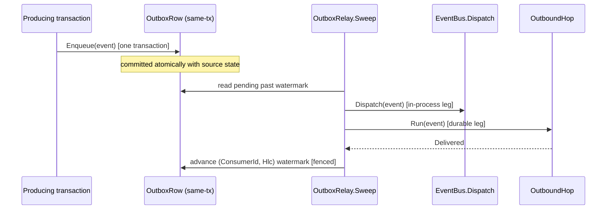

# [APPHOST_TRANSACTIONAL_OUTBOX]

The transactional-outbox and dead-letter owner for the runtime spine: a `DomainEvent` lands in the op-log the producing transaction already commits, a dispatch sweep on the one `SchedulePort` relays each entry past the sink's `OutboxCursor` over an `OutboundHop` advancing a `(ConsumerId, Hlc)` watermark, a poison entry exhausting its attempt budget crosses to the Persistence `DeadLetter` lane, and the relay feeds the in-process `Wire/topics#BUS_CONDUCTOR` `EventBus.Dispatch` — so a decoupled domain event gains at-least-once dispatch with idempotent-key dedupe and exactly-once-effective delivery. The committed event stream IS the outbox under `Rasm.Persistence` `ONE_OUTBOX_EGRESS_SPINE`, and the workflow step-state row commits under the same tenant-scoped transaction (`SEAM_OUTBOX_AND_WORKFLOW_PERSISTENCE_TABLE`); the AppHost names the seam and the relay, atomicity stays Persistence, and this page asks for no table of its own. The page owns the relay vocabulary, the dispatch sweep, the dead-letter lane's naming, and the watermark-advancing relay; it consumes `DomainEvent`/`Topic`/`EventBus`, `DeliveryFanout`/`DeliveryReceipt` (the dedup-key precedent), `OutboundHop`/`OutboundSurface.Run` (the relay), `SchedulePort`/`ScheduleEntry.Spread` (the one sweep cadence), `HLC`/`EventLog` (ordering and the op-log), `OutboxCursor`/`EgressPump.Replay` across the decode-only port, `FencingToken`, `TenantContext`, `ClockPolicy`, `ILatencyContext`, and `ReceiptSinkPort` as settled vocabulary, and mints no eighth port.

## [01]-[INDEX]

- [02]-[OUTBOX_FABRIC]: The transactional `OutboxRow`, the dispatch status, and the dead-letter lane.
- [03]-[DISPATCH_SWEEP]: The one `SchedulePort` sweep relaying pending rows over the watermark.
- [04]-[TS_PROJECTION]: Outbox-row and dead-letter wire shapes the dashboard consumes.

## [02]-[OUTBOX_FABRIC]

- Owner: `DispatchStatus` `[SmartEnum<string>]` the outbox-row lifecycle under the `ComparerAccessors.StringOrdinal` accessor; `OutboxRow` the durable transactional-outbox record; `OutboxFault` `[Union]` fault family deriving its codes through `FaultBand.Outbox`. The poison row is NOT owned here — it declares at `Rasm.Persistence` `Version/egress#EGRESS_PUMP` and this relay reaches it through wire-stable primitives on the decode-only recovery port under the S1 spine law, so the lane is named here and the record lives at its store.
- Cases: dispatch statuses pending | dispatched | dead-lettered; `OutboxFault` = Text | RelayRejected | Exhausted | WatermarkStale.
- Entry: `OutboxRow.Enqueue(DomainEvent evt, TenantContext tenant)` returns `Option<OutboxRow>` — it materializes a pending row only for a topic whose `TopicDurability` column reads `Durable`, so an `Ephemeral` row answers `None` and never enters the sweep; the materialized row carries the event payload, the topic, the dedup key, the event's `DataClassification`, the HLC stamp, the producing span's kernel `TraceCarrier`, and a zero attempt count; `OutboxRow.Deferred(Instant at)` increments the attempt, stamps the same column, and routes to `dead-lettered` at the poison ceiling — `dispatched` is never folded here, because a row the sink's cursor has passed already reads dispatched.
- Auto: the sweep enqueues a `Topic` row whose `TopicDurability` is `Durable` and never an `Ephemeral` row, so presence and health frames are in-process by COLUMN rather than by prose and the sweep reads the durability axis instead of every topic — the counterpart half of `Wire/topics#TOPIC_FABRIC`'s at-least-once law, where a `Durable` subscription that misses the bounded in-process fan re-receives on this sweep while an `Ephemeral` one accepts the loss its own row declares; the outbox row writes same-transaction with the producing write so a domain event and its source state commit atomically — a crash between the state write and event publish cannot lose the event because both ride one transaction, and the dispatch sweep relays the durable row after commit; the dedup key is the event's idempotency key so a re-enqueued identical event within the relay window refuses at the one `Runtime/resources#DEDUPE_WINDOW` window the delivery fan admits against, never a second dedup map; a row reaching the poison ceiling routes to the Persistence-owned `DeadLetterRow` carrying the last fault and the monotone `Attempts` count so a poison message leaves the dispatch lane rather than blocking it — `Attempts` never resets, retirement is its terminal state, and the replay schedule reads that count at the store's own loader rather than through a second attempt ledger here; the row carries the HLC stamp so the relay advances a `(ConsumerId, Hlc)` watermark monotonically and a relayed row never re-relays; the row persists the event's `DataClassification` and `ToEvent` re-emits it verbatim, so a durable hop cannot silently downgrade classification; the row persists the producing span's `TraceCarrier` beside the causal stamp, because the durable hop severs the in-process trace and the carrier is what lets the sweep name every write that caused it.
- Receipt: a relayed row mints one `DeliveryReceipt` (the `DeliveryFanout` shape) carrying the topic, the dispatched flag, and the MEASURED dedupe verdict — the relay admits against the one shared window rather than pinning the column false, so a re-offered window reports its matched-duplicate half instead of reading as fresh delivery; a dead-letter transition fans one `SpineLog` event; no parallel outbox receipt.
- Packages: Thinktecture.Runtime.Extensions, LanguageExt.Core, NodaTime, BCL inbox
- Growth: one dispatch status is one `DispatchStatus` row; a new outbox column is one field on `OutboxRow`; a new fault is one `OutboxFault` case; zero new surface.
- Boundary: the outbox is the only transactional-message owner — a fire-and-forget publish, a separate message queue, and a parallel event store are the deleted forms; the outbox row writes atomically with the producing transaction so atomicity stays Persistence and the AppHost names the seam — and there is NO envelope table to name: `ONE_OUTBOX_EGRESS_SPINE` settles that the committed event stream IS the outbox, so a domain commit and its egress obligation are one `SaveChangesAsync`, the drainable row is the `OpLogEntry` the commit projects, and the durable state this relay reads is the per-sink `OutboxCursor` over that op-log under the `TenantId` RLS predicate; a second envelope table is the deleted parallel store, so `OutboxRow` is the relay's IN-PROCESS carrier over the decoded op-log entry and never a durable table this page asks Persistence to fill; the outbox row and the `Runtime/orchestration#STEP_STATE_SEAM` workflow step-state row commit under one tenant-scoped transaction so exactly-once-effective delivery and crash-durable step resumption share one durable boundary (`SEAM_OUTBOX_AND_WORKFLOW_PERSISTENCE_TABLE`); the relay registers as one keyed `OutboundHop` consumer advancing its own `(ConsumerId, Hlc)` watermark over the `ONE_OUTBOX_EGRESS_SPINE` op-log; the `[ONE_OUTBOX_EGRESS_SPINE]` branch binds three keyed `OutboundHop` consumers over the one op-log — this outbox relay, the `Runtime/orchestration#STEP_STATE_SEAM` workflow-step dispatch, and the `Rasm.Persistence/Version/egress` webhook/gRPC sinks (registered through the `Runtime ⇄ Rasm.Persistence/Version/egress # [PORT]: keyed OutboundHop egress` seam) — each draining the SAME payload the Persistence-owned `Egress.Envelope` projection mints (`id` = `OpLogEntry.ContentKey` lower-hex, the `Sequence` extension = the OP-LOG ENTRY's own sequence, `partitionkey` = `EntityKey`) — `Egress.Envelope` is a static PROJECTION member, not a type, so a consumer names the projection and decodes what it produced, never re-minting it, and a per-consumer re-pack is the drift defect; the dedup reuses the `DeliveryFanout` idempotency-key precedent so the outbox dedup and the delivery dedup are one cell, never two; the poison ceiling stays this row's own column and never migrates onto a `Wire/outbound#HOP_AXIS` `HopPolicy` row, because a hop derives its attempt COUNT from its deadline pair and seating a quarantine threshold there forks one derivation across two concepts.

```csharp signature
[SmartEnum<string>]
[KeyMemberEqualityComparer<ComparerAccessors.StringOrdinal, string>]
[KeyMemberComparer<ComparerAccessors.StringOrdinal, string>]
public sealed partial class DispatchStatus {
    // Pending and DeadLettered are folds the in-process carrier keeps; Dispatched is the CURSOR's reading —
    // this committed op-log holds no per-row status column, so a row the sink's cursor has passed reads
    // dispatched and one it trails reads pending. Persisting a status beside the cursor gives one fact two
    // owners and lets them disagree.
    public static readonly DispatchStatus Pending = new("pending");
    public static readonly DispatchStatus Dispatched = new("dispatched");
    public static readonly DispatchStatus DeadLettered = new("dead-lettered");
}

[Union]
public abstract partial record OutboxFault : Expected, IValidationError<OutboxFault> {
    private OutboxFault(string detail, int code) : base(detail, code, None) { }
    public static OutboxFault Create(string message) => new Text(message);
    public sealed record Text : OutboxFault { public Text(string detail) : base(detail, FaultBand.Outbox.Code(0)) { } }
    public sealed record RelayRejected : OutboxFault { public RelayRejected(string detail) : base(detail, FaultBand.Outbox.Code(1)) { } }
    public sealed record Exhausted : OutboxFault { public Exhausted(string detail) : base(detail, FaultBand.Outbox.Code(2)) { } }
    public sealed record WatermarkStale : OutboxFault { public WatermarkStale(string detail) : base(detail, FaultBand.Outbox.Code(3)) { } }
}

public sealed record OutboxRow(
    string OutboxId,
    string Topic,
    string DedupKey,
    JsonElement Payload,
    DataClassification Classification,
    DispatchStatus Status,
    int Attempt,
    ulong Logical,
    Instant Physical,
    TenantContext Tenant,
    TraceCarrier Trace,
    Option<Instant> DispatchedAt = default) {
    // Poison-quarantine THRESHOLD, never a retry schedule: it decides when to stop trying forever, while
    // when to try again belongs to the hop pipeline `OutboundSurface.Run` already brackets. This row names
    // its retry owner and carries no schedule of its own.
    public const int PoisonCeiling = 8;

    // The carrier captures at ENQUEUE, inside the producing transaction, because that is the only moment the
    // causing span is live — the sweep runs on its own cadence minutes later with no ambient trace to read,
    // so a carrier stamped anywhere downstream would name the sweep that relayed the row, never the write
    // that produced it. An unlistened producer stamps the absent pair and its row contributes no edge.
    //
    // Enqueue admits on the topic's OWN durability column, so a `Durable` row enters the sweep and an
    // `Ephemeral` one answers None and never does — presence and awareness frames stay in-process because
    // their row says so, not because a call site remembered to skip them. An unknown topic key refuses the
    // same way, since a durability the roster cannot answer is not a durability guarantee.
    public static Option<OutboxRow> Enqueue(DomainEvent evt, TenantContext tenant) =>
        Topic.TryGet(evt.Topic, out var topic) && topic.Durability == TopicDurability.Durable
            ? Some(new OutboxRow($"{evt.Topic}:{evt.IdempotencyKey}", evt.Topic, evt.IdempotencyKey, evt.Payload, evt.Classification, DispatchStatus.Pending, Attempt: 0, evt.Logical, evt.Physical, tenant, TraceCarrier.Of(Activity.Current)))
            : None;

    // Every Instant parameter is CONSUMED: the transition stamps the row's dispatched-at column.
    public OutboxRow Deferred(Instant at) =>
        Attempt + 1 >= PoisonCeiling
            ? this with { Status = DispatchStatus.DeadLettered, Attempt = Attempt + 1, DispatchedAt = Some(at) }
            : this with { Attempt = Attempt + 1, DispatchedAt = Some(at) };

    // Relayed event round-trips its ORIGINAL classification — a durable hop never downgrades the redaction
    // taxonomy — and hands an UNSTAMPED ordinal: this sweep republishes through the one `EventBus.Dispatch`
    // entry and `Wire/topics#TOPIC_FABRIC` `TopicFabric.Publish` owns the stamp, so a relay minting its own
    // would fork the dense per-topic sequence the subscription gap fold reads as loss.
    public DomainEvent ToEvent() => new(Topic, DedupKey, Payload, Classification, Logical, Physical, Offset: 0);
}

// The poison row is the Persistence `Version/egress#EGRESS_PUMP` `DeadLetterRow(UInt128 ContentKey, SinkKey
// Sink, long Sequence, string Fault, int Attempts, Instant At)` DECODED across the port — the relay names the
// lane and the store owns the record. The prior form re-minted a same-named record on a different key
// (`string OutboxId` against the store's content key), a different lane identity (`string Topic` against
// `SinkKey`), and its own payload custody, so two dead-letter lanes wore one spelling and neither replay could
// read the other's letters.
```

## [03]-[DISPATCH_SWEEP]

- Owner: `OutboxRelay` the static sweep-and-relay surface over the one `SchedulePort` cadence, addressing the store as ONE keyed sink — the relay's own consumer key seated on its runtime — advancing the `(ConsumerId, Hlc)` watermark and bracketing each drain in the kernel `SpanBand` under this page's one `Scope` row, linked to every producing write it relays.
- Entry: `Recover(OutboxRelay.Runtime runtime, string sink, int batch)` returns `IO<Fin<ReplayTally>>` — names a sink and a batch on the decode-only recovery arrow, so the Persistence pump loads its own Attempts-ordered letters and re-drives them through the ONE delivery fold the drain already uses and this page mints no replay path, no letter record, and no attempt ledger of its own — it names its sink and batch explicitly because an operator replays a NAMED lane, which need not be this relay's own; `Sweep(OutboxRelay.Runtime runtime, TenantContext tenant, ulong watermark)` returns `IO<Seq<DeliveryReceipt>>` — reads pending rows past the cursor through the coordination `OutboxPending` case at the runtime's sink and batch width, opens one producer-kind drain span whose `SpanEdge` carries one `ActivityLink` per pending row, relays each through `EventBus.Dispatch` and the durable `OutboundHop`, advances the watermark on success, and defers or dead-letters a failed row; `OutboxRelay.Scope` rides the platform contributor port into `TelemetryComposition.Band`, which `Runtime.Band` binds.
- Auto: the sweep rides one `ScheduleEntry.Spread` row on the one `SchedulePort` so the dispatch cadence is one schedule row, never a second scheduler — the fleet-spread seed distributes the sweep across nodes so two nodes do not relay the same row simultaneously, and the `FencingToken` decoded off the `BudgetToken` read fences the `OutboxAdvance` cursor CAS so a stale node cannot rewind it; each pending row relays through `EventBus.Dispatch` to feed the in-process bus and through `OutboundSurface.Run` over its topic's `OutboundHop` for a durable subscriber — the runtime's composition-root `ILatencyContext` threading in so the relayed hop records its phase on the one checkpoint recorder — so the in-process and durable delivery legs ride one relay; a successful relay advances the `(ConsumerId, Hlc)` watermark monotonically so a relayed row never re-relays — the at-least-once-with-watermark guarantee that, with the consumer-side dedup, is exactly-once-effective; a failed relay increments the row's attempt and PERSISTS the deferred row through the coordination `OutboxPark` case, which writes attempt and status onto the op-log row the commit already owns — the retry budget is durable, so exhaustion actually trips across sweeps — routing to dead-letter on budget exhaustion so a poison row leaves the lane and its dead-lettered status leaves the pending set; a relay that RAISES converts to that same defer at its own row before the traverse sees it, so every pending row is attempted and receipted and one poison row can never abort the sweep it was queued behind.
- Receipt: each relayed row mints one `DeliveryReceipt` carrying the topic, the dispatched flag, and the ADVANCED watermark — the fenced advance THREADS into the returned receipt so delivery accounting is wired, never notional (a bound-then-discarded advance is the deleted form); a dead-letter transition fans one `SpineLog` event; no parallel per-row relay receipt — the sweep itself seals with one `OutboxSweepReceipt` fanned under `InstrumentFan.SweepKind`, carrying lag, oldest-undelivered age, the advanced cursor, the relayed/duplicate/deferred split, and the per-topic `Lanes` rows the partitioned outbox gauges read, so the outbox gauges read sweep evidence, never a store scan.
- Packages: LanguageExt.Core, NodaTime, System.IO.Hashing, BCL inbox
- Growth: a new relay target is one `OutboundHop` the topic binds; the sweep cadence is one `ScheduleEntry.Spread` row column; zero new surface.
- Boundary: the drain is a FAN-IN, so its span links every relayed row's producing trace and parents on none of them — a parent edge to the first row invents a chain the batch never had, and a per-row child span under the sweep re-costs a trace per relayed row while stranding the batch's own shape; the band arrives as an `Option` on the runtime record, so a harness wiring the relay without a telemetry composition relays untraced rather than minting a second `ActivitySource` owner; the dispatch sweep is the only outbox-relay owner — a per-row background loop, a second scheduler for the sweep, and a parallel relay are the deleted forms; the sweep rides the one `SchedulePort` so the cadence is one schedule row and the fleet-spread seed distributes it; the relay registers as one keyed `OutboundHop` consumer advancing its own `(ConsumerId, Hlc)` watermark over the `ONE_OUTBOX_EGRESS_SPINE` op-log, never re-minting what the Persistence-owned `Egress.Envelope` projection already produced and never a second egress table; the watermark advance is the `OutboxAdvance` CAS under the decoded token so two nodes cannot both advance it past one row, and the `OutboxCursor` it moves is keyed PER SINK — this relay and the Persistence `Version/egress` pump are DIFFERENT consumers holding different sink keys, two rows of one table rather than two writers of one row, so the store's forward-only intra-leg edge stands untouched; the consumer-side dedup reuses the `DeliveryFanout` cell so at-least-once dispatch plus idempotent-key dedup is exactly-once-effective, never an exactly-once distributed-transaction protocol.

```csharp signature
public sealed record OutboxLaneRow(
    string Topic,
    long Lag,
    double OldestAgeSeconds);

// The decoded recovery outcome: the pump's own conservation counts, wire-stable primitives, so a dashboard
// reads what a replay did without the AppHost naming a store record or re-deriving a second tally.
public readonly record struct ReplayTally(int Delivered, int Held, int Dead);

// Accepted and matched-duplicate stay SEPARATE halves, because one merged tally claims zero redelivery and a
// lane re-offering one window forever reports exactly that. `Relayed` counts advances, `Duplicates` counts the
// subset the consumer window already held, and `Deferred` counts every row whose watermark stood still.
public sealed record OutboxSweepReceipt(
    long Lag,
    double OldestAgeSeconds,
    ulong Watermark,
    int Relayed,
    int Duplicates,
    int Deferred,
    Instant At,
    Seq<OutboxLaneRow> Lanes);

public static class OutboxRelay {
    public sealed record Runtime(
        EventBus.Cell Bus,
        OutboundRuntime Outbound,
        // Sink is this relay's OWN consumer key, one value per runtime, because the relay registers as ONE
        // keyed `OutboundHop` consumer over the op-log: a per-row sink column would hand one consumer many
        // cursors, and deriving the key from the topic would seat a second topic-to-sink table beside the
        // `Hop` binding that already carries that mapping. Batch is the read width `OutboxPending` takes.
        string Sink,
        int Batch,
        Func<string, long, int, Fin<Seq<OutboxRow>>> Pending,
        Func<string, long, ulong, Fin<ulong>> Advance,
        // Park writes attempt and status onto the row the committed op-log ALREADY owns. Any shape implying
        // its own park table is the second envelope table the package ruling forecloses — one commit with
        // two owners and no shared transaction.
        Func<string, long, int, string, Fin<Unit>> Park,
        // Two poison arrows speak WIRE-STABLE PRIMITIVES, the same decode-only shape `LeaseElection` and
        // `StepStateSeam` take: no store record crosses upward and no AppHost record crosses down. `DeadLetter`
        // persists the poisoned entry through the Persistence `Version/egress#EGRESS_PUMP` letter store, and
        // `Recover` names a sink and a batch — the pump loads its OWN Attempts-ordered letters through the
        // `EgressPorts.Letters` loader and re-drives them through `EgressPump.Replay`, the drain fold
        // re-parameterized over the letter set. Recovery writes no cursor: the cursor advanced past the entry
        // when its letter was persisted, and the durable letter has owned it since.
        Func<UInt128, string, long, string, int, Fin<Unit>> DeadLetter,
        Func<string, int, IO<Fin<ReplayTally>>> Recover,
        // Fence reads the tenant-scoped generation through the coordination `BudgetToken` case — the SAME
        // read `Agent/capability#GRANT_BROKER` `DistributedBudget.Token` takes, composed rather than
        // re-minted, so a watermark advance and a budget debit present one generation identity.
        Func<TenantId, Fin<FencingToken>> Fence,
        Func<string, OutboundHop> Hop,
        Func<OutboxRow, DomainEvent, Func<CancellationToken, Task<HopOutcome>>> Send,
        // One `Runtime/resources#DEDUPE_WINDOW` cell serves the delivery fan, the subscription fabric, and this
        // relay alike, composed rather than re-minted: the relay's duplicate half and the consumer's suppression
        // settle as one verdict, and a second window here reports halves the consumer never saw.
        DedupeWindow Dedupe,
        ClockPolicy Clocks,
        ILatencyContext Latency,
        ReceiptSinkPort Sink,
        Option<SpanBand> Band = default);

    // This relay opens one drain plane, travelling inward on the platform's contributor port beside the
    // instrument rows, so the telemetry composition admits it into the one band and registers its name on the
    // tracer provider in one fold. Admission and registration fail separately and silently: an unadmitted
    // scope refuses on the kernel rail at the first sweep, while an admitted-but-unregistered one strands its
    // source listenerless and every sweep takes the null-span arm an untraced composition legitimately takes.
    public static readonly TraceScope Scope = TraceScope.Create(value: "rasm.apphost.outbox");

    // Link-edge attribution rides the package's own dotted namespace like every sibling dimension; these key
    // SPAN LINKS rather than a metric series, so no census row or view tag-key is owed for either.
    public const string OutboxTopicSlot = "rasm.apphost.outbox.topic";
    public const string OutboxDedupSlot = "rasm.apphost.outbox.dedup";

    // Recovery is cursor-free by construction and answers the pump's own conservation counts: a re-delivered
    // letter retires, an ambiguous one holds, and a still-refusing one re-letters at Attempts + 1 — the store's
    // monotone backoff gate, never a reset, because resetting it would erase the backoff a poison row earned.
    public static IO<Fin<ReplayTally>> Recover(Runtime runtime, string sink, int batch) =>
        runtime.Recover(sink, batch);

    public static IO<Seq<DeliveryReceipt>> Sweep(Runtime runtime, TenantContext tenant, ulong watermark) =>
        runtime.Pending(runtime.Sink, (long)watermark, runtime.Batch).Match(
            Succ: rows => runtime.Band.Match(
                Some: band => band.Traced(Scope, Op.Of(), _ => Drain(runtime, tenant, rows, watermark), Edges(rows)),
                None: () => Drain(runtime, tenant, rows, watermark)),
            Fail: fault => IO.pure(Seq<DeliveryReceipt>()));

    // Fan-in carriage, one edge per relayed row: the sweep descends from no single producing transaction, so
    // each row's persisted carrier becomes a link and the batch states exactly which writes caused it, while
    // an adopted parent would fabricate descent from whichever row happened to sort first. `Producer` is the
    // kind because this bracket writes onto the broker; topic and dedup key ride each edge because a trace
    // reader routing a stuck lane needs the row's identity on the link itself, never a payload fetch. An
    // unparseable or absent carrier drops ITS edge alone and the sweep keeps every edge it could reconstruct.
    static SpanEdge Edges(Seq<OutboxRow> rows) =>
        SpanEdge.FanIn(
            rows.Choose(static row => row.Trace.Link(
                (OutboxTopicSlot, row.Topic), (OutboxDedupSlot, row.DedupKey))).Strict(),
            ActivityKind.Producer);

    static IO<Seq<DeliveryReceipt>> Drain(Runtime runtime, TenantContext tenant, Seq<OutboxRow> rows, ulong watermark) =>
        rows.TraverseM(row => Relayed(runtime, tenant, row)).As()
            .Bind(receipts => Evidence(runtime, tenant, rows, receipts, watermark).Map(_ => receipts));

    // Row-local shield AHEAD of the traverse: a monadic traverse short-circuits the whole sweep on the first
    // raise, so one row faulting inside the bus dispatch or the hop leg strands every later row unattempted and
    // seals no evidence at all — the exact lane blocking the dead-letter path exists to clear. The raise converts
    // to that row's own Defer, so its attempt increments durably, its budget still trips toward dead-letter, and
    // every remaining row is still attempted and still receipted.
    static IO<DeliveryReceipt> Relayed(Runtime runtime, TenantContext tenant, OutboxRow row) =>
        Relay(runtime, tenant, row).Catch(static _ => true, error =>
            Defer(runtime, row).Map(_ => new DeliveryReceipt(
                row.Topic, row.DedupKey,
                new HopOutcome.Faulted(new OutboxFault.RelayRejected($"{row.OutboxId}:{error.Message}")),
                Deduped: false, row.Attempt + 1, Duration.Zero, Option<ulong>.None, Correlation.Mint())));

    // Sweep seal: lag and oldest age derive from the rows still past the advanced cursor, so the
    // gauges read the sweep's own census — never a second store scan beside the relay.
    static IO<ReceiptEnvelope> Evidence(Runtime runtime, TenantContext tenant, Seq<OutboxRow> rows, Seq<DeliveryReceipt> receipts, ulong floor) =>
        IO.lift(() => runtime.Clocks.Now).Bind(now => {
            var advanced = receipts.Choose(static receipt => receipt.Watermark).Fold(floor, ulong.Max);
            var pending = rows.Filter(row => row.Logical > advanced);
            var receipt = new OutboxSweepReceipt(
                Lag: pending.Count,
                OldestAgeSeconds: pending.Map(row => (now - row.Physical).TotalSeconds).Fold(0d, double.Max),
                Watermark: advanced,
                Relayed: receipts.Filter(static receipt => receipt.Watermark.IsSome).Count,
                Duplicates: receipts.Filter(static receipt => receipt.Deduped).Count,
                Deferred: receipts.Filter(static receipt => receipt.Watermark.IsNone).Count,
                At: now,
                Lanes: toSeq(pending.GroupBy(static row => row.Topic).Select(group =>
                    new OutboxLaneRow(group.Key, group.Count(), group.Max(row => (now - row.Physical).TotalSeconds)))));
            return runtime.Sink.Send(Correlation.Mint(), tenant, TelemetrySource.AppHost.Key, InstrumentFan.SweepKind,
                JsonSerializer.SerializeToElement(receipt, SuiteContracts.Host));
        });

    // The fenced advance THREADS: the store-validated watermark lands IN the returned receipt (Some on
    // a delivered advance, None on a defer), so accounting derives from the wired value — a bound-then-
    // discarded advance and a constant sentinel cursor are the deleted forms.
    // Fence loss on a DELIVERED row lands in neither half under a naive fold: the advance answers Fail, the
    // receipt reads no watermark, and the row's attempt never increments because nothing took the defer arm —
    // so the sweep counts it as Deferred while its retry budget stands still and its Park never fires. Binding
    // that loss RE-ENTERS the defer, which is the one arm persisting an attempt, so the durable budget still
    // trips toward dead-letter on a row the delivery leg keeps re-offering.
    //
    // `Deduped` is MEASURED rather than pinned false. Re-offered windows are exactly what a watermark advance
    // that never committed produces, and the shared consumer window is what absorbs them, so the sweep reports
    // accepted beside matched-duplicate as separate halves; a hardcoded false claims zero redelivery, and zero
    // redelivery reads identically to a lane re-offering one window forever.
    static IO<DeliveryReceipt> Relay(Runtime runtime, TenantContext tenant, OutboxRow row) =>
        from _bus in EventBus.Dispatch(runtime.Bus, row.ToEvent())
        from deduped in IO.lift(() => !runtime.Dedupe.Admit(row.DedupKey, runtime.Clocks.Now))
        from receipt in OutboundSurface.Run(runtime.Outbound, runtime.Hop(row.Topic), runtime.Send(row, row.ToEvent()), runtime.Latency)
        from advanced in receipt.Outcome is HopOutcome.Delivered
            ? IO.lift(() => runtime.Fence(tenant.TenantId)
                  .Bind(token => runtime.Advance(runtime.Sink, (long)row.Logical, (ulong)token))
                  .Map(Some))
              .Bind(fenced => fenced.IsSucc ? IO.pure(fenced) : Defer(runtime, row))
            : Defer(runtime, row)
        select new DeliveryReceipt(
            row.Topic, row.DedupKey, receipt.Outcome, deduped, receipt.Attempts, receipt.Elapsed,
            advanced.Match(Succ: static cursor => cursor, Fail: static _ => Option<ulong>.None), Correlation.Mint());

    // A deferred row advances NO watermark — the defer answers None — and the incremented attempt /
    // DispatchedAt row PERSISTS through Park on BOTH arms, so the retry budget is durable across sweeps
    // and a dead-lettered row leaves the pending set; a computed-then-dropped Deferred is the deleted form.
    static IO<Fin<Option<ulong>>> Defer(Runtime runtime, OutboxRow row) =>
        row.Deferred(runtime.Clocks.Now) is var deferred && deferred.Status == DispatchStatus.DeadLettered
            ? IO.lift(() => Parked(runtime, deferred)
                .Bind(_ => runtime.DeadLetter(
                    ContentHash.Of(row.Topic, row.DedupKey), row.Topic, (long)row.Logical, "relay-exhausted", deferred.Attempt))
                .Map(static _ => Option<ulong>.None))
            : IO.lift(() => Parked(runtime, deferred).Map(static _ => Option<ulong>.None));

    // One seat for the park spelling on both arms: sink key, the op-log entry's own sequence, the attempt
    // ordinal, and the status key — four primitives onto the row the commit already owns.
    static Fin<Unit> Parked(Runtime runtime, OutboxRow deferred) =>
        runtime.Park(runtime.Sink, (long)deferred.Logical, deferred.Attempt, deferred.Status.Key);
}
```


```mermaid
sequenceDiagram
    accTitle: Transactional outbox dispatch and watermark advance
    accDescr: A producing transaction enqueueing an event atomically with source state, the relay sweep reading past the watermark and dispatching the in-process and durable legs, and the fenced watermark advancing only after delivery.
    participant Tx as Producing transaction
    participant Outbox as OutboxRow (same-tx)
    participant Sweep as OutboxRelay.Sweep
    participant Bus as EventBus.Dispatch
    participant Hop as OutboundHop
    Tx->>Outbox: Enqueue(event) [one transaction]
    Note over Outbox: committed atomically with source state
    Sweep->>Outbox: read pending past watermark
    Sweep->>Bus: Dispatch(event) [in-process leg]
    Sweep->>Hop: Run(event) [durable leg]
    Hop-->>Sweep: Delivered
    Sweep->>Outbox: advance (ConsumerId, Hlc) watermark [fenced]
```

## [04]-[TS_PROJECTION]

- Owner: `OutboxRowWire`, `DeadLetterRowWire`, `ReplayTallyWire`, `OutboxSweepWire` — the outbox-row, dead-letter, recovery-outcome, and sweep-evidence wire shapes the dashboard ingests, the dead-letter shape transcribing the store's own primitives (content key lower-hex, sink key, entry sequence) so a board row addresses the letter the pump would replay; the per-relay `DeliveryReceipt`s ride the existing `Wire/outbound#DELIVERY_FANOUT` `DeliveryReceiptWire`, bound here, never re-authored.
- Packages: BCL inbox
- Growth: one wire-member row per new outbox or dead-letter field; the dispatch status crosses as its smart-enum key; zero new surface.
- Boundary: the dispatch status crosses as its smart-enum string key; the HLC stamp crosses through the existing `HlcStampWire` so outbox ordering reads the same causal primitive the receipt envelope carries; instants cross as extended-ISO text; the `TraceCarrier` crosses as its two nullable W3C members under their own names, so a dashboard row deep-links to the producing trace and an unlistened producer reads as two nulls rather than an empty-string trace id no backend resolves; the dead-letter row carries the last fault and the monotone attempt count so the dashboard surfaces poison evidence beside the replay command that clears it — `Recover` re-drives a sink's letters through the one Persistence delivery fold, so a poison lane is operable from the board rather than only observable.

```ts signature
type DispatchStatusKey = "pending" | "dispatched" | "dead-lettered";

interface OutboxRowWire {
  readonly outboxId: string;
  readonly topic: string;
  readonly dedupKey: string;
  readonly status: DispatchStatusKey;
  readonly attempt: number;
  readonly logical: number;
  readonly physical: string;
  readonly traceParent: string | null;
  readonly traceState: string | null;
}

interface DeadLetterRowWire {
  readonly contentKey: string;
  readonly sink: string;
  readonly sequence: number;
  readonly fault: string;
  readonly attempts: number;
  readonly at: string;
}

interface ReplayTallyWire {
  readonly delivered: number;
  readonly held: number;
  readonly dead: number;
}

interface OutboxLaneWire {
  readonly topic: string;
  readonly lag: number;
  readonly oldestAgeSeconds: number;
}

interface OutboxSweepWire {
  readonly lag: number;
  readonly oldestAgeSeconds: number;
  readonly watermark: number;
  readonly relayed: number;
  readonly duplicates: number;
  readonly deferred: number;
  readonly at: string;
  readonly lanes: readonly OutboxLaneWire[];
}
```

## [05]-[RESEARCH]

(none)
