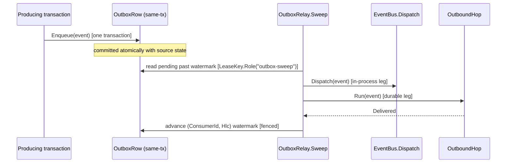

# [APPHOST_TRANSACTIONAL_OUTBOX]

Transactional-outbox and dead-letter ownership for the runtime spine: a `DomainEvent` lands in the op-log its producing transaction already commits, a dispatch sweep on the one `SchedulePort` relays each entry past the sink's `OutboxCursor` over an `OutboundHop` advancing a `(ConsumerId, Hlc)` watermark, a poison entry exhausting its re-drive bound crosses to the Persistence `DeadLetter` lane carrying the fault that spent it, and the relay feeds `Wire/topics#BUS_CONDUCTOR` `EventBus.Dispatch`.

Decoupled domain events therefore gain at-least-once dispatch with idempotent-key dedupe and exactly-once-effective delivery.

Persistence holds the committed event stream AS the outbox under `ONE_OUTBOX_EGRESS_SPINE`, and the workflow step-state row commits under the same tenant-scoped transaction (`SEAM_OUTBOX_AND_WORKFLOW_PERSISTENCE_TABLE`); this page names the seam and the relay, atomicity stays Persistence, and no table is asked for here.

Settled composition: `RedrivePolicy`, `Redrive.Settle`, `Verdict`, and `Retriability` arrive from `Rasm/Domain/rails#REDRIVE`; `FaultBand.Outbox` from `Rasm/Domain/rails#FAULT_BAND`; `ContentHash`/`CanonicalWriter` from `Rasm/Domain/identity#CONTENT_KEY`; `CloudEvent`, `EventMint`, `EventEnvelope.Mint`/`.Trace`, `EventExtension`, and `DataGrade` from `Rasm/Domain/event`; `ReceiptSinkPort`, `ReceiptEnvelope`, `TelemetrySource`, and `TenantContext` from `Rasm/Domain/frame`.

In-folder composition: `ReceiptKind` from `Observability/instruments#RECEIPT_PROJECTION`; `DataClassification`/`RedactorKind` from `Observability/telemetry#REDACTION_TAXONOMY`; `SchedulePort.Missed`, `ScheduleEntry.Spread`, and `ClockPolicy` from `Runtime/time`; `LeaseKey` from `Wire/coordination#ROLE_ELECTION`; `DedupeWindow` from `Runtime/resources#DEDUPE_WINDOW`.

Owned surfaces: the relay vocabulary, the `HlcOrdinal` sign boundary, the dispatch sweep, the dead-letter lane's naming, and the watermark-advancing relay; it consumes `DomainEvent`/`Topic`/`EventBus`, `DeliveryReceipt`/`HopDial` (the delivery evidence shape), `OutboundHop`/`OutboundSurface.Run` (the relay), `HLC`/`EventLog` (ordering and the op-log), `OutboxCursor`/`EgressPump.Replay` across the decode-only port, `FencingToken`, `ILatencyContext`, and `SuiteContracts` as settled vocabulary, and mints no eighth port.

## [01]-[INDEX]

- [02]-[OUTBOX_FABRIC]: Transactional `OutboxRow`, its disposition union, the HLC sign boundary, and the two-way classification crossing.
- [03]-[DISPATCH_SWEEP]: One `SchedulePort` sweep relaying pending rows over the watermark under the coordination role lease.
- [04]-[TS_PROJECTION]: Outbox-row, dead-letter, recovery, and sweep wire shapes with their producers and the one seam mapper.

## [02]-[OUTBOX_FABRIC]

- Owner: `OutboxDisposition` `[Union]` the outbox-row lifecycle carrying its own stamp, ordinal, and — on the terminal arm — the fault that spent the bound; `HlcOrdinal` `[ValueObject<ulong>]` the ONE admission of the op-log sign boundary; `OutboxRow` the durable transactional-outbox carrier holding the projected envelope whole, its `Project` half the ONE crossing between the bus vocabulary and the wire vocabulary and its `ToEvent` half the inverse; `OutboxFault` `[Union]` fault family riding the kernel `[FaultCase]`/`Fault` floor (`[FaultCase]` realizes the registry over `FaultBand.Outbox`) and its retriability through the kernel discriminant. Persistence owns the poison row — it declares at `Rasm.Persistence` `Version/egress#EGRESS_PUMP` and this relay reaches it through wire-stable primitives on the decode-only recovery port under the S1 spine law, so the lane is named here and the record lives at its store.
- Cases: `OutboxDisposition` = `Pending` | `Deferred(At, Attempt)` | `DeadLettered(At, Attempt, Cause)`; `OutboxFault` = `RelayRejected` | `Exhausted` | `WatermarkStale`.
- Entry: `OutboxRow.Enqueue(DomainEvent evt, TenantContext tenant, Op key)` returns `Fin<Option<OutboxRow>>` — it materializes a pending row only for a topic whose `TopicDurability` column reads `Durable`, so an `Ephemeral` row answers `None` and never enters the sweep; `OutboxRow.Admit(CloudEvent envelope, TenantContext tenant, Op key)` returns `Fin<OutboxRow>` — the ONE decode crossing the store's pending read composes, where the topic, the ordinal, and the stamp are admitted once and the interior never re-reads the envelope for them; `OutboxRow.Settled(RedrivePolicy policy, Error cause, Instant at)` returns `Fin<OutboxRow>` — the kernel `Redrive.Settle` verdict lowered onto the disposition; `ToEvent(Op key)` raises the row back onto the bus carrier.
- Auto: the sweep enqueues a `Topic` row whose `TopicDurability` is `Durable` and never an `Ephemeral` row, so presence and health frames are in-process by COLUMN rather than by prose — the counterpart half of `Wire/topics#TOPIC_FABRIC`'s at-least-once law, where a `Durable` subscription that misses the bounded in-process fan re-receives on this sweep while an `Ephemeral` one accepts the loss its own row declares; the outbox row writes same-transaction with the producing write so a domain event and its source state commit atomically — a crash between the state write and event publish cannot lose the event because both ride one transaction; the dedup key is the envelope's own `(source, id)` composite so a re-enqueued identical event within the relay window refuses at the one `Runtime/resources#DEDUPE_WINDOW` window the delivery fan admits against, never a second dedup map; a row whose re-drive bound is spent routes to the Persistence-owned `DeadLetterRow` carrying the last fault and the monotone attempt count, so a poison message leaves the dispatch lane rather than blocking it — the attempt never resets, retirement is its terminal state, and the replay schedule reads that count at the store's own loader rather than through a second attempt ledger here; the row carries the HLC ordinal so the relay advances a `(ConsumerId, Hlc)` watermark monotonically and a relayed row never re-relays; the row persists the event's `DataClassification` and `ToEvent` re-emits it verbatim, so a durable hop cannot silently downgrade classification; the row persists the producing span's `TraceCarrier` beside the causal stamp, because the durable hop severs the in-process trace and the carrier is what lets the sweep name every write that caused it.
- Law: the projection is SINGLE and lives here — `Wire/topics#TOPIC_FABRIC` keeps `Topic` and `EventType` as two vocabularies over one fact, and this row is where they meet: `Project` lowers a `DomainEvent` onto the kernel envelope and `ToEvent` raises it back, so a sink, a peer runtime, and a replay all read one object rather than three re-packs of it. Any second mapping table in the branch is the drift defect.
- Law: dedup reads the envelope's own `(source, id)` composite through the ONE `Runtime/resources#DEDUPE_WINDOW` window every at-least-once consumer in this suite admits against; a synthesized `topic:key` row identity was a THIRD address for a fact already carrying two, and a second seen-key map beside that window is the deleted form.
- Law: the classification crossing NARROWS one way and states its forfeit — the branch taxonomy is finer than the four estate grades, the wire carries the grade because a peer runtime holds none of this branch's rows, and `ToEvent` raises the coarsest branch row carrying the same redactor, so a relayed payload is redacted exactly as its producer required while nothing claims to recover which finer row produced it. Every inverse read REFUSES rather than fills: a grade the roster cannot answer, an ordinal that will not parse, and an absent type, source, or id are each a typed refusal, because the one arm that filled — a `Secret` row whose extension failed to parse relaying as `Internal` — is the narrowing law violating itself in silence at the exact seam the law exists to hold.
- Law: replay relation declares against `Runtime/determinism#EVENT_LOG` and `Runtime/determinism#REPLAY_VERIFY` rather than restating a durability claim of its own — the hash-chained content-addressed log proves a relayed sequence was neither re-ordered nor re-authored, and the replay verifier proves a re-executed drain reaches the same per-step content hash, so this relay owes its replay evidence to those owners and mints none beside them.
- Receipt: a relayed row mints one `DeliveryReceipt` (the `Wire/outbound#DELIVERY_FANOUT` shape) carrying the topic, the hop outcome, and the MEASURED dedupe verdict on its disposition — the relay admits against the one shared window rather than pinning the column, so a re-offered window reports its matched-duplicate half instead of reading as fresh delivery; a dead-letter transition fans one `SpineLog` event; no parallel outbox receipt.
- Packages: Rasm (kernel `Redrive`/`ContentHash`/`EventEnvelope`), CloudNative.CloudEvents, Thinktecture.Runtime.Extensions, LanguageExt.Core, NodaTime, BCL inbox
- Growth: a new lifecycle state is one `OutboxDisposition` case breaking every reader's `Switch`; a new outbox column is one field on `OutboxRow`; a new fault is one `OutboxFault` case with the `Retriability` it overrides; zero new surface.
- Boundary: the outbox is the only transactional-message owner — a fire-and-forget publish, a separate message queue, and a parallel event store are the deleted forms; the outbox row writes atomically with the producing transaction so atomicity stays Persistence and the AppHost names the seam — and there is NO envelope table to name: `ONE_OUTBOX_EGRESS_SPINE` settles that the committed event stream IS the outbox, so a domain commit and its egress obligation are one `SaveChangesAsync`, the drainable row is the `OpLogEntry` the commit projects, and the durable state this relay reads is the per-sink `OutboxCursor` over that op-log under the `TenantId` RLS predicate; a second envelope table is the deleted parallel store, so `OutboxRow` is the relay's IN-PROCESS carrier over the decoded op-log entry and never a durable table this page asks Persistence to fill; the disposition is the row's WHOLE lifecycle in one column — an attempt ordinal stamped on a `Pending` row and a `Dispatched` case nothing ever constructed were two halves of one defect, since dispatched is the CURSOR's reading rather than a row state and this committed op-log holds no per-row status column at all; the outbox row and the `Runtime/orchestration#STEP_STATE_SEAM` workflow step-state row commit under one tenant-scoped transaction so exactly-once-effective delivery and crash-durable step resumption share one durable boundary (`SEAM_OUTBOX_AND_WORKFLOW_PERSISTENCE_TABLE`); the relay registers as one keyed `OutboundHop` consumer advancing its own `(ConsumerId, Hlc)` watermark over the `ONE_OUTBOX_EGRESS_SPINE` op-log; the `[ONE_OUTBOX_EGRESS_SPINE]` branch binds three keyed `OutboundHop` consumers over the one op-log — this outbox relay, the `Runtime/orchestration#STEP_STATE_SEAM` workflow-step dispatch, and the `Rasm.Persistence/Version/egress` webhook/gRPC sinks (registered through the `Runtime ⇄ Rasm.Persistence/Version/egress # [PORT]: keyed OutboundHop egress` seam) — each draining the SAME payload the Persistence-owned `Egress.Envelope` projection mints (`id` = `OpLogEntry.ContentKey` lower-hex, the `Sequence` extension = the OP-LOG ENTRY's own sequence, `partitionkey` = `EntityKey`) — `Egress.Envelope` is a static PROJECTION member, not a type, so a consumer names the projection and decodes what it produced, never re-minting it; the store's arrows take a `long` sequence while the HLC logical half is a `ulong`, and `HlcOrdinal` is the ONE place that crossing is admitted — five unchecked casts at five sites were five independent chances to wrap a sequence past `long.MaxValue` into a negative cursor the store's forward-only predicate then accepts forever; the poison bound stays this row's own `RedrivePolicy` contribution and never migrates onto a `Wire/outbound#HOP_AXIS` `HopPolicy` row, because a hop derives its attempt COUNT from its deadline pair and seating a quarantine threshold there forks one derivation across two concepts — the outbox contributes the `Bound` and the composition supplies the `Law`, structurally — the relay runtime carries the backoff `Schedule` alone and derives its policy through `OutboxRow.Bounded`, so `PoisonCeiling` is the ceiling every settlement on this lane is graded against rather than a constant beside a policy a caller chose — and `Redrive.Settle` decides which of the three verdicts a failed relay earned, so a non-transient fault dead-letters on attempt one instead of burning eight sweeps and eight durable park writes to reach a conclusion its own discriminant already carried.

```csharp signature
// --- [TYPES] --------------------------------------------------------------------------------
// One column carries the whole lifecycle. `Pending` holds no stamp and no ordinal because a row nothing has
// attempted has neither; `DeadLettered` holds the fault that spent the bound, which the relay-exhausted
// string discarded at the one seam an operator reads to decide whether a replay can succeed.
[Union(ConversionFromValue = ConversionOperatorsGeneration.None)]
public abstract partial record OutboxDisposition {
    private OutboxDisposition() { }

    public sealed record Pending : OutboxDisposition;
    public sealed record Deferred(Instant At, int Attempt) : OutboxDisposition;
    public sealed record DeadLettered(Instant At, int Attempt, Error Cause) : OutboxDisposition;

    public int Attempt => Switch(
        pending: static _ => 0,
        deferred: static row => row.Attempt,
        deadLettered: static row => row.Attempt);

    public string Wire => Switch(
        pending: static _ => "pending",
        deferred: static _ => "deferred",
        deadLettered: static _ => "dead-lettered");

    public Option<Instant> At => Switch(
        pending: static _ => Option<Instant>.None,
        deferred: static row => Some(row.At),
        deadLettered: static row => Some(row.At));
}

// Sign boundary admits ONCE. Op-log arrows take `long` while the HLC logical half is `ulong`, so validation
// happens here and every arrow downstream reads the already-admitted `Sequence`.
[ValueObject<ulong>(KeyMemberName = "Value")]
public sealed partial class HlcOrdinal {
    public static Fin<HlcOrdinal> Admit(string text, Op key) =>
        ulong.TryParse(text, NumberStyles.None, CultureInfo.InvariantCulture, out ulong held)
            ? Admit(held, key)
            : Fin.Fail<HlcOrdinal>(key.InvalidInput(nameof(HlcOrdinal)));

    public static Fin<HlcOrdinal> Admit(ulong ordinal, Op key) =>
        key.AcceptValidated<HlcOrdinal, ulong>(ordinal);

    // Checked once at construction, so this projection is total by the validator above it.
    public long Sequence => unchecked((long)Value);

    static partial void ValidateFactoryArguments(ref ValidationError? validationError, ref ulong value) {
        if (value > long.MaxValue) {
            validationError = new ValidationError("an op-log sequence inside the long domain");
        }
    }
}

// --- [ERRORS] ---------------------------------------------------------------------------
// the kernel discriminant each case declares.
[Union(ConversionFromValue = ConversionOperatorsGeneration.None)]
public abstract partial record OutboxFault : Fault {
    private static readonly FaultBand FamilyBand = FaultBand.Outbox;
    private OutboxFault(string detail) => Detail = detail;
    public string Detail { get; }
    public sealed override string Message => Detail;


    // Relay refusals default to transient, so `Redrive.Settle` defers them until the bound is spent; a hop
    // stating a terminal fault of its own overrides that through its own case and dead-letters on attempt one.
    [FaultCase(0)]
    public sealed partial record RelayRejected : OutboxFault {
        public RelayRejected(string detail) : base(detail) { }
        public override Retriability Retriability => Retriability.Transient;
    }

    [FaultCase(1)]
    public sealed partial record Exhausted : OutboxFault { public Exhausted(string detail) : base(detail) { } }

    // Cursor reads refuse transiently: the store is momentarily unreadable, not permanently wrong.
    [FaultCase(2)]
    public sealed partial record WatermarkStale : OutboxFault, ICausedFault {
        public WatermarkStale(string detail, Error cause) : base(detail) => Cause = cause;
        public Error Cause { get; }
        public override Retriability Retriability => Retriability.Transient;
    }
}

// --- [MODELS] -------------------------------------------------------------------------------
// Rows carry the ENVELOPE plus the three facts the sweep reads on every pass. An earlier shape kept a
// `JsonElement` body, a `DataClassification` column, an HLC pair, and a `TraceCarrier` beside each other, which
// made the relayed classification, the causal stamp, and the producing trace each readable two ways with
// nothing reconciling them; projecting once at enqueue collapses all four onto attributes the specification
// already defines. Topic, ordinal, and stamp stay COLUMNS because the sweep sorts, links, and ages on them
// once per row and a per-read re-derivation off the envelope is a parse inside a fold.
public sealed record OutboxRow(
    Topic Topic,
    CloudEvent Envelope,
    OutboxDisposition Disposition,
    HlcOrdinal Ordinal,
    Instant Physical,
    TenantContext Tenant) {
    public const string HlcSequence = "rasm.hlc.logical";

    // This lane contributes the re-drive BOUND and the composition supplies the LAW: when to stop trying
    // forever is a poison-quarantine threshold, while when to try again belongs to the hop pipeline
    // `OutboundSurface.Run` already brackets. `Bounded` is the only seat a relay policy is minted at —
    // `OutboxRelay.Runtime` takes the curve and derives its policy here — so the ceiling the disposition
    // column is proven against cannot be overridden by a composition that carried its own policy value.
    public const int PoisonCeiling = 8;

    public static RedrivePolicy Bounded(Schedule law) => RedrivePolicy.Of(law, PoisonCeiling);

    public string Dedup => $"{Envelope.Source}\0{Envelope.Id}";

    public TraceCarrier Trace => EventEnvelope.Trace(Envelope, Op.Of());

    // Enqueue admits on the topic's OWN durability column, so a `Durable` row enters the sweep and an
    // `Ephemeral` one answers None. Projection runs INSIDE the producing transaction, the only moment the
    // causing span is live: this sweep runs on its own cadence minutes later with no ambient trace to read.
    public static Fin<Option<OutboxRow>> Enqueue(DomainEvent evt, TenantContext tenant, Op key) =>
        evt.Topic.Durability == TopicDurability.Durable
            ? from envelope in Project(evt, key)
              from ordinal in HlcOrdinal.Admit(evt.Logical, key)
              select Some(new OutboxRow(evt.Topic, envelope, new OutboxDisposition.Pending(), ordinal, evt.Physical, tenant))
            : Fin.Succ(Option<OutboxRow>.None);

    // THE decode crossing. Every fact the sweep reads is admitted ONCE here — an unrostered topic, an
    // unparseable ordinal, and an absent stamp each refuse with the entry named — so the interior sorts,
    // links, and ages on typed columns and never re-parses the envelope mid-fold.
    public static Fin<OutboxRow> Admit(CloudEvent envelope, TenantContext tenant, Op key) =>
        from subject in key.Need(envelope.Subject)
        from topic in Topic.TryGet(subject, out Topic? row) ? Fin.Succ(row!) : Fin.Fail<Topic>(new BusFault.TopicUnknown(subject))
        from sequence in EventExtension.Sequence.Read<string>(envelope, key)
        from text in key.Need(sequence)
        from ordinal in HlcOrdinal.Admit(text, key)
        from stamp in key.Need(envelope.Time)
        select new OutboxRow(topic, envelope, new OutboxDisposition.Pending(), ordinal, Instant.FromDateTimeOffset(stamp), tenant);

    // THE one projection between the two vocabularies `Wire/topics#TOPIC_FABRIC` holds distinct. Every column
    // lands on the attribute the specification already defines: the idempotency key IS the operation identity
    // `(source, id)` dedups on, the HLC logical position rides `sequence` under a `sequencetype` naming its
    // domain, the classification federates onto the kernel handling grade, and the creation-time trace rides
    // that same kernel carrier.
    static Fin<CloudEvent> Project(DomainEvent evt, Op key) =>
        EventEnvelope.Mint(
            new EventMint(
                Type: evt.Type,
                Source: evt.Source,
                Id: evt.IdempotencyKey,
                Subject: Some(evt.Topic.Key),
                Time: evt.Physical,
                DataSchema: None,
                DataContentType: Some(MediaTypeNames.Application.Json),
                Data: evt.Payload,
                Trace: TraceCarrier.Of(Activity.Current),
                Extensions: Seq<(EventExtension Row, object Value)>(
                    (EventExtension.DataClassification, Graded(evt.Classification).Key),
                    (EventExtension.Sequence, evt.Logical.ToString(CultureInfo.InvariantCulture)),
                    (EventExtension.SequenceType, HlcSequence))),
            key: key);

    // Discrimination is JOINT — the row's redactor beside whether the row is the unclassified one — so the
    // classification arm resolves first and the redactor's own generated `Switch` closes the rest. Every
    // never-reviewed row grades at the STRICTEST class, because an ungraded redactor crossing a broker names
    // one direction this narrowing must not guess in.
    static DataGrade Graded(DataClassification classification) =>
        classification == DataClassification.None
            ? DataGrade.Public
            : classification.Redactor.Switch(
                erase: static () => DataGrade.Secret,
                hmac: static () => DataGrade.Restricted,
                none: static () => DataGrade.Internal,
                unknown: static () => DataGrade.Secret);

    // Raising restores the OBLIGATION and forfeits the provenance label, the honest inverse of a narrowing:
    // each grade lands the coarsest branch row carrying its own redactor. Reading a raised label as
    // provenance is the misuse this table's declared forfeit forecloses.
    static DataClassification Raised(DataGrade grade) => grade.Switch(
        @public: static () => DataClassification.Operational,
        @internal: static () => DataClassification.Internal,
        restricted: static () => DataClassification.Confidential,
        secret: static () => DataClassification.Credential);

    // Kernel verdicts ARE the transition: `Deferred` re-stamps and increments, `Abandoned` dead-letters with
    // whatever fault spent the bound, and `Terminal` dead-letters on attempt one — a non-transient refusal
    // burning eight sweeps and eight durable park writes reaches a conclusion its discriminant carried.
    public OutboxRow Settled(RedrivePolicy policy, Error cause, Instant at) =>
        Redrive.Settle(policy, cause, Disposition.Attempt).Switch(
            deferred: next => this with { Disposition = new OutboxDisposition.Deferred(at, next.Attempt) },
            abandoned: spent => this with { Disposition = new OutboxDisposition.DeadLettered(at, spent.Attempt, spent.Cause) },
            terminal: refused => this with { Disposition = new OutboxDisposition.DeadLettered(at, Disposition.Attempt + 1, refused.Cause) });

    // Relayed event round-trips its ORIGINAL classification and causal position and hands an UNSTAMPED offset:
    // this sweep republishes through the one `EventBus.Dispatch` entry and `TopicFabric.Publish` owns the
    // stamp, so a relay minting its own forks the dense per-topic sequence the gap fold reads as loss. Every
    // read REFUSES rather than fills, and independent refusals accumulate so one pass names every column an
    // envelope failed to answer.
    public Fin<DomainEvent> ToEvent(Op key) =>
        (from type in Admitted(EventType.Create, Envelope.Type, key)
         from source in Admitted(EventSource.Create, Envelope.Source?.ToString(), key)
         from id in key.Need(Envelope.Id)
         from grade in EventExtension.DataClassification.Read<string>(Envelope, key).Bind(read => key.Need(read))
         from row in DataGrade.TryGet(grade, out DataGrade? held) ? Fin.Succ(held!) : Fin.Fail<DataGrade>(key.InvalidInput(nameof(DataGrade)))
         from body in key.Need(Envelope.Data as JsonElement?)
         select new DomainEvent(Topic, type, source, id, body, Raised(row), Ordinal.Value, Physical, Offset: 0));

    static Fin<T> Admitted<T>(Func<string, T> mint, string? spelled, Op key) =>
        key.Need(spelled).Bind(text => key.Catch(() => Fin.Succ(mint(text))));
}

// Persistence owns the poison row and stores its fault as opaque structured JSON; the composition adapter
// decodes that payload into this AppHost-owned view. The store therefore depends on neither `Error` nor an
// AppHost wire type, while the reader never reparses a message to recover causal identity.
public readonly record struct DeadLetterView(
    UInt128 ContentKey,
    string Sink,
    HlcOrdinal Ordinal,
    FaultObservationWire Fault,
    int Attempts,
    Instant At) {
    public static Fin<DeadLetterView> Decode(
        UInt128 contentKey, string sink, HlcOrdinal ordinal, JsonElement fault, int attempts, Instant at) =>
        OutboxFaultWire.Decode(fault)
            .Map(observed => new DeadLetterView(contentKey, sink, ordinal, observed, attempts, at));
}

// The composition binds BOTH Persistence `ObserveFault` delegates to `Encode`; Persistence retains the
// resulting JSON opaquely, and its AppHost reader binds `DeadLetterView.Decode`. That is the whole adapter:
// no store package references this wire type and no message round-trip exists beside it.
public static class OutboxFaultWire {
    public static JsonElement Encode(Error error) =>
        JsonSerializer.SerializeToElement(AppHostFaultMap.Wire(error), SuiteContracts.Host);

    public static Fin<FaultObservationWire> Decode(JsonElement payload) =>
        Op.Of().Catch(() => Optional(payload.Deserialize<FaultObservationWire>(SuiteContracts.Host))
            .ToFin(new OutboxFault.RelayRejected("dead-letter fault observation is absent")));
}
```

## [03]-[DISPATCH_SWEEP]

- Owner: `OutboxRelay` the static sweep-and-relay surface over the one `SchedulePort` cadence, addressing the store as ONE keyed sink — the relay's own consumer key seated on its runtime — advancing the `(ConsumerId, Hlc)` watermark and bracketing each drain in the kernel `SpanBand` under this page's one `Scope` row, linked to every producing write it relays.
- Entry: `Sweep(OutboxRelay.Runtime runtime, TenantContext tenant, HlcOrdinal watermark)` returns `IO<Fin<Seq<DeliveryReceipt>>>` — reads pending rows past the cursor through the coordination `OutboxPending` case at the runtime's consumer key and batch width, opens one producer-kind drain span whose `SpanEdge` carries one `ActivityLink` per pending row, relays each through `EventBus.Dispatch` and the durable `OutboundHop`, advances the watermark on success, and settles a failed row on the kernel re-drive verdict; `Missed(OutboxRelay.Runtime runtime, Instant lastFired, Instant now)` returns `Fin<Seq<Instant>>` — the occurrence-history read a sweep that lost its window composes off `SchedulePort.Missed`, so a node resuming after a pause knows how many cadences it owes rather than tracking a counter; `Letters(runtime, sink, batch)` and `Recover(runtime, sink, batch)` are the decode-only poison arrows the board reads and drives; `OutboxRelay.Scope` rides the platform contributor port into `TelemetryComposition.Band`, which `Runtime.Band` binds.
- Auto: each sweep rides one `ScheduleEntry.Spread` row on the one `SchedulePort` so the dispatch cadence is one schedule row, never a second scheduler — the fleet-spread seed distributes the sweep across nodes and the sweep itself runs under the `LeaseKey.Role("outbox-sweep")` election at `Wire/coordination#ROLE_ELECTION`, so exactly one node holds the lane at a time and the `FencingToken` decoded off the `BudgetToken` read fences the `OutboxAdvance` cursor CAS so a stale node cannot rewind it; each pending row relays through `EventBus.Dispatch` to feed the in-process bus and through `OutboundSurface.Run` over its topic's `OutboundHop` for a durable subscriber — the runtime's composition-root `ILatencyContext` threading in so the relayed hop records its phase on the one checkpoint recorder — so the in-process and durable delivery legs ride one relay; a successful relay advances the `(ConsumerId, Hlc)` watermark monotonically so a relayed row never re-relays — the at-least-once-with-watermark guarantee that, with the consumer-side dedup, is exactly-once-effective; a failed relay hands its fault to `Redrive.Settle` against the lane's bound and PERSISTS the settled row through the coordination `OutboxPark` case, which writes attempt and disposition onto the op-log row the commit already owns — the retry budget is durable, so exhaustion trips across sweeps; a relay that RAISES converts to that same settlement at its own row before the traverse sees it, so every pending row is attempted and receipted and one poison row can never abort the sweep it was queued behind.
- Receipt: each relayed row mints one `DeliveryReceipt` carrying the topic, its disposition, and the ADVANCED watermark — the fenced advance THREADS into the returned receipt so delivery accounting is wired, never notional; a dead-letter transition fans one `SpineLog` event; no parallel per-row relay receipt — the sweep itself seals with one `OutboxSweepReceipt` fanned under `ReceiptKind.Sweep`, carrying the advanced cursor, the relayed/duplicate/deferred split, and the per-topic `Lanes` rows the partitioned outbox gauges read, with lag and oldest-undelivered age DERIVING off those rows so the outbox gauges read sweep evidence and the receipt stores no total its own lane set can answer.
- Packages: Rasm (kernel `Redrive`/`ContentHash`), Riok.Mapperly, LanguageExt.Core, NodaTime, System.IO.Hashing, BCL inbox
- Growth: a new relay target is one `OutboundHop` the topic binds; the sweep cadence is one `ScheduleEntry.Spread` row column; zero new surface.
- Boundary: each drain is a FAN-IN, so its span links every relayed row's producing trace and parents on none of them — a parent edge to the first row invents a chain the batch never had, and a per-row child span under the sweep re-costs a trace per relayed row while stranding the batch's own shape; each band arrives as an `Option` on the runtime record, so a harness wiring the relay without a telemetry composition relays untraced rather than minting a second `ActivitySource` owner; a pending read that REFUSES is a typed refusal on the sweep's own rail and never an empty successful sweep — a store the relay cannot read reports zero lag, zero oldest age, and zero deferred rows, which is byte-identical to a fully drained lane and is the one shape an operator cannot distinguish from health; the dispatch sweep is the only outbox-relay owner — a per-row background loop, a second scheduler for the sweep, and a parallel relay are the deleted forms; the relay registers as one keyed `OutboundHop` consumer advancing its own `(ConsumerId, Hlc)` watermark over the `ONE_OUTBOX_EGRESS_SPINE` op-log, never re-minting what the Persistence-owned `Egress.Envelope` projection already produced and never a second egress table; the watermark advance is the `OutboxAdvance` CAS under the decoded token so two nodes cannot both advance it past one row, and the `OutboxCursor` it moves is keyed PER SINK — this relay and the Persistence `Version/egress` pump are DIFFERENT consumers holding different sink keys, two rows of one table rather than two writers of one row, so the store's forward-only intra-leg edge stands untouched; recovery is cursor-free by construction and answers the pump's own conservation counts — a re-delivered letter retires, an ambiguous one holds, and a still-refusing one re-letters at attempt + 1 under the store's monotone backoff gate, never a reset that erases the backoff a poison row earned — and `Letters` is the read half of that same arrow, so the board surfaces the poison evidence beside the replay command that clears it rather than offering a command with nothing to aim it at; the consumer-side dedup reuses the one `DedupeWindow` cell so at-least-once dispatch and idempotent-key dedup are exactly-once-effective, never an exactly-once distributed-transaction protocol; the dead-letter content key rides the kernel framed writer over the `(topic, dedup)` pair rather than a two-argument overload no `ContentHash` entry declares, so the preimage is length-framed on both halves and a topic-and-key pair cannot collide with a differently-split one.

```csharp signature
// --- [MODELS] -------------------------------------------------------------------------------
public sealed record OutboxLaneRow(
    Topic Topic,
    long Lag,
    double OldestAgeSeconds);

// Recovery decodes to the pump's own conservation counts, wire-stable primitives, so a dashboard reads what
// a replay did without the AppHost naming a store record or re-deriving a second tally.
public readonly record struct ReplayTally(int Delivered, int Held, int Dead);

// Accepted and matched-duplicate stay SEPARATE halves, because one merged tally claims zero redelivery and a
// lane re-offering one window forever reports exactly that. Lag and oldest age DERIVE off the lane rows — a
// stored total beside the roster that produces it is one fact with two owners.
[Equatable]
public sealed partial record OutboxSweepReceipt(
    HlcOrdinal Watermark,
    int Relayed,
    int Duplicates,
    int Deferred,
    Instant At,
    [property: OrderedEquality] Seq<OutboxLaneRow> Lanes) {
    public long Lag => Lanes.Fold(0L, static (held, lane) => held + lane.Lag);
    public double OldestAgeSeconds => Lanes.Fold(0d, static (held, lane) => double.Max(held, lane.OldestAgeSeconds));
}

// --- [SERVICES] -----------------------------------------------------------------------------
public static class OutboxRelay {
    public sealed record Runtime(
        EventBus.Cell Bus,
        OutboundRuntime Outbound,
        // Consumer is this relay's OWN key, one value per runtime, because the relay registers as ONE keyed
        // `OutboundHop` consumer over the op-log: a per-row column would hand one consumer many cursors, and
        // deriving the key from the topic would seat a second topic-to-sink table beside the `Hop` binding.
        string Consumer,
        int Batch,
        ScheduleEntry Cadence,
        // Composition owns the re-drive LAW and this row owns its BOUND, so this column carries the CURVE
        // alone and `Redrive` derives: a deployment retunes the backoff without touching the quarantine
        // threshold, where a whole `RedrivePolicy` here was a slot seating any ceiling a composition liked
        // beside a `PoisonCeiling` no runtime read.
        Schedule Backoff,
        Func<string, long, int, Fin<Seq<OutboxRow>>> Pending,
        Func<string, long, ulong, Fin<HlcOrdinal>> Advance,
        // Park writes attempt and disposition onto the row the committed op-log ALREADY owns. Any shape
        // implying its own park table is the second envelope table the package ruling forecloses.
        Func<string, long, int, string, Fin<Unit>> Park,
        // Poison arrows speak WIRE-STABLE PRIMITIVES, the same decode-only shape `LeaseElection` and
        // `StepStateSeam` take. `DeadLetter` persists the poisoned entry; `Letters` reads the store's own
        // Attempts-ordered lane; `Recover` re-drives them through `EgressPump.Replay`, the drain fold
        // re-parameterized over the letter set. Recovery writes no cursor: the cursor advanced past the entry
        // when its letter was persisted, and the durable letter has owned it since.
        Func<UInt128, string, long, JsonElement, int, Fin<Unit>> DeadLetter,
        Func<string, int, IO<Fin<Seq<DeadLetterView>>>> Letters,
        Func<string, int, IO<Fin<ReplayTally>>> Replay,
        // Fence reads the tenant-scoped generation through the coordination `BudgetToken` case — the SAME
        // read `Agent/capability#GRANT_BROKER` `DistributedBudget.Token` takes, composed rather than
        // re-minted, so a watermark advance and a budget debit present one generation identity.
        Func<TenantId, Fin<FencingToken>> Fence,
        Func<Topic, OutboundHop> Hop,
        Func<OutboxRow, DomainEvent, Func<CancellationToken, Task<HopOutcome>>> Send,
        // One `Runtime/resources#DEDUPE_WINDOW` cell serves the delivery fan, the subscription fabric, and
        // this relay alike, composed rather than re-minted: the relay's duplicate half and the consumer's
        // suppression settle as one verdict.
        DedupeWindow Dedupe,
        ClockPolicy Clocks,
        ILatencyContext Latency,
        ReceiptSinkPort Sink,
        JsonSerializerOptions Wire,
        Option<SpanBand> Band = default) {
        // One policy serves every settlement on this lane: the composed curve under this page's own ceiling.
        public RedrivePolicy Redrive => OutboxRow.Bounded(Backoff);
    }

    // --- [OPERATIONS] -------------------------------------------------------------------------
    // This relay opens one drain plane, travelling inward on the platform's contributor port beside the
    // instrument rows. Admission and registration fail separately and silently: an unadmitted scope refuses
    // on its kernel rail at the first sweep, while an admitted-but-unregistered one strands its source
    // listenerless and every sweep takes the null-span arm an untraced composition takes.
    public static readonly TraceScope Scope = TraceScope.Create(value: "rasm.apphost.outbox");

    // Link-edge attribution rides the package's own dotted namespace; these key SPAN LINKS rather than a
    // metric series, so no census row or view tag-key is owed for either.
    public const string OutboxTopicSlot = "rasm.apphost.outbox.topic";
    public const string OutboxDedupSlot = "rasm.apphost.outbox.dedup";

    // `LeaseKey` names the ONE namespaced registry key every keyed registry on the spine reads, so the role a
    // sweep holds is a value the coordination owner resolves rather than an interpolated string two pages
    // spell differently.
    public static readonly LeaseKey SweepRole = LeaseKey.Role("outbox-sweep");

    // Nodes resuming after a pause read their own occurrence HISTORY rather than a running counter, and each
    // entry's re-drive bound caps the window — a hundred-day second-resolution gap reports typed exhaustion
    // instead of a silently narrowed count.
    public static Fin<Seq<Instant>> Missed(Runtime runtime, Instant lastFired, Instant now) =>
        SchedulePort.Missed(runtime.Cadence, lastFired, now);

    public static IO<Fin<Seq<DeadLetterView>>> Letters(Runtime runtime, string sink, int batch) =>
        runtime.Letters(sink, batch);

    public static IO<Fin<ReplayTally>> Recover(Runtime runtime, string sink, int batch) =>
        runtime.Replay(sink, batch);

    // Refusing pending reads fail the sweep on its own rail. An empty successful sweep and an unreadable
    // store read byte-identically on every gauge the receipt feeds, so the store's refusal rides the rail out.
    public static IO<Fin<Seq<DeliveryReceipt>>> Sweep(Runtime runtime, TenantContext tenant, HlcOrdinal watermark) =>
        runtime.Pending(runtime.Consumer, watermark.Sequence, runtime.Batch).Match(
            Succ: rows => runtime.Band.Match(
                    Some: band => band.Traced(Scope, Op.Of(), _ => Drain(runtime, tenant, rows, watermark), Edges(rows)),
                    None: () => Drain(runtime, tenant, rows, watermark))
                .Map(Fin.Succ),
            Fail: fault => IO.pure(Fin.Fail<Seq<DeliveryReceipt>>(new OutboxFault.WatermarkStale(fault.Message, fault))));

    // Fan-in carriage, one edge per relayed row: the sweep descends from no single producing transaction, so
    // each row's persisted carrier becomes a link and the batch states exactly which writes caused it. An
    // unparseable or absent carrier drops ITS edge alone and the sweep keeps every edge it could reconstruct.
    static SpanEdge Edges(Seq<OutboxRow> rows) =>
        SpanEdge.FanIn(
            rows.Choose(static row => row.Trace.Link(
                (OutboxTopicSlot, row.Topic.Key), (OutboxDedupSlot, row.Dedup))).Strict(),
            ActivityKind.Producer);

    static IO<Seq<DeliveryReceipt>> Drain(Runtime runtime, TenantContext tenant, Seq<OutboxRow> rows, HlcOrdinal watermark) =>
        rows.TraverseM(row => Relayed(runtime, tenant, row)).As()
            .Bind(receipts => Evidence(runtime, tenant, rows, receipts, watermark).Map(_ => receipts));

    // Row-local shield AHEAD of the traverse: a monadic traverse short-circuits the whole sweep on the first
    // raise, so one row faulting inside the bus dispatch or the hop leg strands every later row unattempted
    // and seals no evidence at all — the exact lane blocking the dead-letter path exists to clear.
    static IO<DeliveryReceipt> Relayed(Runtime runtime, TenantContext tenant, OutboxRow row) =>
        Relay(runtime, tenant, row).Catch(static _ => true, error =>
            Settle(runtime, row, error).Map(settled => new DeliveryReceipt(
                row.Topic.Key, row.Dedup,
                new HopOutcome.Faulted(error),
                new DeliveryDisposition.Unbound(error), Option<ulong>.None, Correlation.Mint())));

    // Sweep seal: the lane rows carry the census and the two totals derive off them, so the gauges read the
    // sweep's own evidence rather than a second store scan or a stored sum that can disagree with its rows.
    static IO<ReceiptEnvelope> Evidence(
        Runtime runtime, TenantContext tenant, Seq<OutboxRow> rows, Seq<DeliveryReceipt> receipts, HlcOrdinal floor) =>
        from now in IO.lift(() => runtime.Clocks.Now)
        from advanced in IO.lift(() => HlcOrdinal
            .Admit(receipts.Choose(static receipt => receipt.Watermark).Fold(floor.Value, ulong.Max), Op.Of())
            .IfFail(floor))
        from envelope in runtime.Sink.Send(
            Correlation.Mint(), tenant, TelemetrySource.AppHost, ReceiptKind.Sweep.Key,
            JsonSerializer.SerializeToElement(OutboxMap.ToWire(new OutboxSweepReceipt(
                Watermark: advanced,
                Relayed: receipts.Filter(static receipt => receipt.Watermark.IsSome).Count,
                Duplicates: receipts.Filter(static receipt => receipt.Deduped).Count,
                Deferred: receipts.Filter(static receipt => receipt.Watermark.IsNone).Count,
                At: now,
                Lanes: toSeq(rows.Filter(row => row.Ordinal.Value > advanced.Value)
                    .GroupBy(static row => row.Topic)
                    .Select(group => new OutboxLaneRow(
                        group.Key, group.Count(), group.Max(row => (now - row.Physical).TotalSeconds)))))),
                runtime.Wire))
        select envelope;

    // Fenced advance THREADS: the store-validated watermark lands IN the returned receipt (Some on a
    // delivered advance, None on a settlement), so accounting derives from the wired value. Fence loss on a
    // DELIVERED row lands in neither half under a naive fold — the advance answers Fail, the receipt reads no
    // watermark, and the row's attempt never increments — so binding that loss RE-ENTERS the settlement, the
    // one arm persisting an attempt. `Deduped` is MEASURED rather than pinned: re-offered windows are exactly
    // what a watermark advance that never committed produces.
    static IO<DeliveryReceipt> Relay(Runtime runtime, TenantContext tenant, OutboxRow row) =>
        from evt in IO.lift(() => row.ToEvent(Op.Of())).Bind(static read => read.Match(Succ: IO.pure, Fail: IO.fail<DomainEvent>))
        from _bus in EventBus.Dispatch(runtime.Bus, evt)
        from deduped in IO.lift(() => !runtime.Dedupe.Admit(row.Dedup, runtime.Clocks.Now))
        from receipt in OutboundSurface.Run(runtime.Outbound, runtime.Hop(row.Topic), runtime.Send(row, evt), runtime.Latency)
        from advanced in receipt.Outcome is HopOutcome.Delivered
            ? IO.lift(() => runtime.Fence(tenant.TenantId)
                  .Bind(token => runtime.Advance(runtime.Consumer, row.Ordinal.Sequence, (ulong)token)))
              .Bind(fenced => fenced.Match(
                  Succ: cursor => IO.pure(Some(cursor.Value)),
                  Fail: fault => Settle(runtime, row, fault)))
            : Settle(runtime, row, receipt.Outcome is HopOutcome.Faulted faulted
                ? faulted.Reason
                : new OutboxFault.RelayRejected(row.Dedup))
        select new DeliveryReceipt(
            row.Topic.Key, row.Dedup, receipt.Outcome,
            deduped
                ? new DeliveryDisposition.Suppressed()
                : receipt.Dial.Match(
                    Some: static dial => (DeliveryDisposition)new DeliveryDisposition.Dialed(dial),
                    None: () => new DeliveryDisposition.Unbound(new OutboxFault.RelayRejected(row.Dedup))),
            advanced, Correlation.Mint());

    // Settled rows advance NO watermark and PERSIST on both arms, so the re-drive budget is durable across
    // sweeps and a dead-lettered row leaves the pending set. The kernel verdict decides which arm: a
    // non-transient fault reaches `DeadLettered` on its first pass rather than burning the whole bound.
    static IO<Option<ulong>> Settle(Runtime runtime, OutboxRow row, Error cause) =>
        IO.lift(() => row.Settled(runtime.Redrive, cause, runtime.Clocks.Now)).Bind(settled =>
            IO.lift(() => Parked(runtime, settled)).Bind(_ => settled.Disposition switch {
                OutboxDisposition.DeadLettered dead => IO.lift(() => runtime.DeadLetter(
                    ContentHash.Of(
                        (row.Topic.Key, row.Dedup),
                        static (state, writer) => writer.String(state.Key).String(state.Dedup)),
                    row.Topic.Key, row.Ordinal.Sequence,
                    OutboxFaultWire.Encode(dead.Cause),
                    dead.Attempt)),
                _ => IO.pure(Fin.Succ(unit)),
            })).Map(static _ => Option<ulong>.None);

    // One seat for the park spelling on both arms: consumer key, the op-log entry's own sequence, the attempt
    // ordinal, and the disposition key — four primitives onto the row the commit already owns.
    static Fin<Unit> Parked(Runtime runtime, OutboxRow settled) =>
        runtime.Park(runtime.Consumer, settled.Ordinal.Sequence, settled.Disposition.Attempt, settled.Disposition.Wire);
}
```


```mermaid
sequenceDiagram
    accTitle: Transactional outbox dispatch and watermark advance
    accDescr: A producing transaction enqueueing an event atomically with source state, the relay sweep reading past the watermark under the role lease and dispatching the in-process and durable legs, and the fenced watermark advancing only after delivery while a failed relay settles on the kernel re-drive verdict.
    participant Tx as Producing transaction
    participant Outbox as OutboxRow (same-tx)
    participant Sweep as OutboxRelay.Sweep
    participant Bus as EventBus.Dispatch
    participant Hop as OutboundHop
    Tx->>Outbox: Enqueue(event) [one transaction]
    Note over Outbox: committed atomically with source state
    Sweep->>Outbox: read pending past watermark [LeaseKey.Role("outbox-sweep")]
    Sweep->>Bus: Dispatch(event) [in-process leg]
    Sweep->>Hop: Run(event) [durable leg]
    Hop-->>Sweep: Delivered
    Sweep->>Outbox: advance (ConsumerId, Hlc) watermark [fenced]
```

## [04]-[TS_PROJECTION]

- Owner: `OutboxRowWire`, `DeadLetterRowWire`, `ReplayTallyWire`, `OutboxLaneWire`, `OutboxSweepWire` — the outbox-row, dead-letter, recovery-outcome, lane, and sweep-evidence wire shapes the dashboard ingests, each with a C# producer on this page; `OutboxMap` the one `[Mapper]` projecting all five, so a renamed receipt column breaks the projection at compile time rather than at a peer decode.
- Packages: Riok.Mapperly, BCL inbox
- Growth: one wire-member row per new outbox or dead-letter field; the disposition crosses as its union key; zero new surface.
- Boundary: every wire face on this page holds a producer, a manifest row on the `[02.21]` family registration, and a census row at `typescript:core/interchange/codec#WIRE_CENSUS` — a declared TS shape with no C# minter is the stranded state `topology.md [FENCE_SEAM]` refuses, and serializing `OutboxSweepReceipt` directly was that same defect wearing a domain record; the disposition crosses as its union key and the retired `dispatched` spelling crosses NOWHERE, because dispatched is the cursor's reading rather than a row state and a wire vocabulary carrying a value no producer mints is a law with no producer; the HLC ordinal crosses as a decimal STRING because a `ulong` past 2^53 loses precision in a JSON number and the whole point of the ordinal is exact comparison; the content key crosses as lower-hex through the kernel `ContentHash.Hex` projection so a board row addresses the letter the pump replays; instants cross as extended-ISO text; the `TraceCarrier` crosses as its two nullable W3C members under their own names, so a dashboard row deep-links to the producing trace and an unlistened producer reads as two ABSENT keys rather than an empty-string trace id no backend resolves; absence encodes ONCE for this whole seam at `Runtime/ports#WIRE_LAW` — the merge omits every unset slot — so `at`, `fault`, and the two trace members are omitted keys on the wire and `field?: T` on the peer face, while `DeadLetterRowWire.fault` is required because a letter reaches that table only by failing; the dead-letter row carries the last structured fault observation and monotone attempt count so the dashboard surfaces generated code, typed recovery, and bounded exact causes beside the replay command; Persistence stores that observation as opaque JSON and the composition adapter decodes it into `DeadLetterView`, preserving package direction without laundering it through a message string; `Recover` re-drives a sink's letters through the one Persistence delivery fold, so a poison lane is operable from the board rather than only observable.

```csharp signature
// --- [BOUNDARIES] ---------------------------------------------------------------------------
public sealed record OutboxRowWire(
    string Topic, string DedupKey, string Disposition, int Attempt, string Ordinal, string Physical,
    string? At, FaultObservationWire? Fault, string? TraceParent, string? TraceState);

public sealed record DeadLetterRowWire(
    string ContentKey, string Sink, string Ordinal, FaultObservationWire Fault, int Attempts, string At);

public sealed record ReplayTallyWire(int Delivered, int Held, int Dead);

public sealed record OutboxLaneWire(string Topic, long Lag, double OldestAgeSeconds);

public sealed record OutboxSweepWire(
    long Lag, double OldestAgeSeconds, string Watermark, int Relayed, int Duplicates, int Deferred,
    string At, IReadOnlyList<OutboxLaneWire> Lanes);

// `All & ~ExplicitCast` is load-bearing: the default binds the THROWING explicit `Option<T>→T` cast and
// prefers it over the registered converter, so an unstamped pending row would throw at the projection.
[Mapper(RequiredMappingStrategy = RequiredMappingStrategy.Both,
        EnabledConversions = MappingConversionType.All & ~MappingConversionType.ExplicitCast)]
internal static partial class OutboxMap {
    [MapProperty(nameof(OutboxRow.Topic), nameof(OutboxRowWire.Topic), Use = nameof(TopicKey))]
    [MapProperty(nameof(OutboxRow.Dedup), nameof(OutboxRowWire.DedupKey))]
    [MapProperty(nameof(OutboxRow.Disposition), nameof(OutboxRowWire.Disposition), Use = nameof(DispositionKey))]
    [MapProperty(nameof(OutboxRow.Disposition), nameof(OutboxRowWire.Attempt), Use = nameof(DispositionAttempt))]
    [MapProperty(nameof(OutboxRow.Disposition), nameof(OutboxRowWire.At), Use = nameof(DispositionAt))]
    [MapProperty(nameof(OutboxRow.Disposition), nameof(OutboxRowWire.Fault), Use = nameof(DispositionFault))]
    [MapProperty(nameof(OutboxRow.Ordinal), nameof(OutboxRowWire.Ordinal), Use = nameof(OrdinalText))]
    [MapProperty(nameof(OutboxRow.Physical), nameof(OutboxRowWire.Physical), Use = nameof(Stamp))]
    [MapProperty(nameof(OutboxRow.Trace), nameof(OutboxRowWire.TraceParent), Use = nameof(Parent))]
    [MapProperty(nameof(OutboxRow.Trace), nameof(OutboxRowWire.TraceState), Use = nameof(State))]
    public static partial OutboxRowWire ToWire(OutboxRow row);

    [MapProperty(nameof(DeadLetterView.ContentKey), nameof(DeadLetterRowWire.ContentKey), Use = nameof(Hex))]
    [MapProperty(nameof(DeadLetterView.Ordinal), nameof(DeadLetterRowWire.Ordinal), Use = nameof(OrdinalText))]
    [MapProperty(nameof(DeadLetterView.At), nameof(DeadLetterRowWire.At), Use = nameof(Stamp))]
    public static partial DeadLetterRowWire ToWire(DeadLetterView letter);

    public static partial ReplayTallyWire ToWire(ReplayTally tally);

    [MapProperty(nameof(OutboxLaneRow.Topic), nameof(OutboxLaneWire.Topic), Use = nameof(TopicKey))]
    public static partial OutboxLaneWire ToWire(OutboxLaneRow lane);

    [MapProperty(nameof(OutboxSweepReceipt.Watermark), nameof(OutboxSweepWire.Watermark), Use = nameof(OrdinalText))]
    [MapProperty(nameof(OutboxSweepReceipt.At), nameof(OutboxSweepWire.At), Use = nameof(Stamp))]
    public static partial OutboxSweepWire ToWire(OutboxSweepReceipt receipt);

    [NamedMapping(nameof(TopicKey))]
    private static string TopicKey(Topic topic) => topic.Key;

    [NamedMapping(nameof(OrdinalText))]
    private static string OrdinalText(HlcOrdinal ordinal) => ordinal.Value.ToString(CultureInfo.InvariantCulture);

    [NamedMapping(nameof(Hex))]
    private static string Hex(UInt128 key) => ContentHash.Hex(key);

    [NamedMapping(nameof(Stamp))]
    private static string Stamp(Instant at) => ClockPolicy.Persisted(at);

    [NamedMapping(nameof(DispositionKey))]
    private static string DispositionKey(OutboxDisposition disposition) => disposition.Wire;

    [NamedMapping(nameof(DispositionAttempt))]
    private static int DispositionAttempt(OutboxDisposition disposition) => disposition.Attempt;

    [NamedMapping(nameof(DispositionAt))]
    private static string? DispositionAt(OutboxDisposition disposition) =>
        disposition.At.Match(Some: static at => ClockPolicy.Persisted(at), None: static () => null);

    [NamedMapping(nameof(DispositionFault))]
    private static FaultObservationWire? DispositionFault(OutboxDisposition disposition) => disposition.Switch(
        pending: static _ => (FaultObservationWire?)null,
        deferred: static _ => null,
        deadLettered: static row => AppHostFaultMap.Wire(row.Cause));

    [NamedMapping(nameof(Parent))]
    private static string? Parent(TraceCarrier carrier) => carrier.TraceParent;

    [NamedMapping(nameof(State))]
    private static string? State(TraceCarrier carrier) => carrier.TraceState;
}
```

```ts signature
type OutboxDispositionKey = "pending" | "deferred" | "dead-lettered";

// Optional slots OMIT under the one suite emission posture (`Runtime/ports#WIRE_LAW`), so each reads
// `field?: T`; the dead-letter fault stays REQUIRED, which is what makes the two fault columns different facts.
interface OutboxRowWire {
  readonly topic: string;
  readonly dedupKey: string;
  readonly disposition: OutboxDispositionKey;
  readonly attempt: number;
  readonly ordinal: string;
  readonly physical: string;
  readonly at?: string;
  readonly fault?: FaultObservationWire;
  readonly traceParent?: string;
  readonly traceState?: string;
}

interface DeadLetterRowWire {
  readonly contentKey: string;
  readonly sink: string;
  readonly ordinal: string;
  readonly fault: FaultObservationWire;
  readonly attempts: number;
  readonly at: string;
}

interface ReplayTallyWire {
  readonly delivered: number;
  readonly held: number;
  readonly dead: number;
}

interface OutboxLaneWire {
  readonly topic: string;
  readonly lag: number;
  readonly oldestAgeSeconds: number;
}

interface OutboxSweepWire {
  readonly lag: number;
  readonly oldestAgeSeconds: number;
  readonly watermark: string;
  readonly relayed: number;
  readonly duplicates: number;
  readonly deferred: number;
  readonly at: string;
  readonly lanes: readonly OutboxLaneWire[];
}
```

## [05]-[RESEARCH]

<!-- source-only: research row template:
[TOKEN]-[OPEN|BLOCKED]: <exact question>; <verification route>.
[SPLIT_MEMBER]-[OPEN]: does `shape-core` expose `split_all`; verify against the member rail.
-->

(none)
