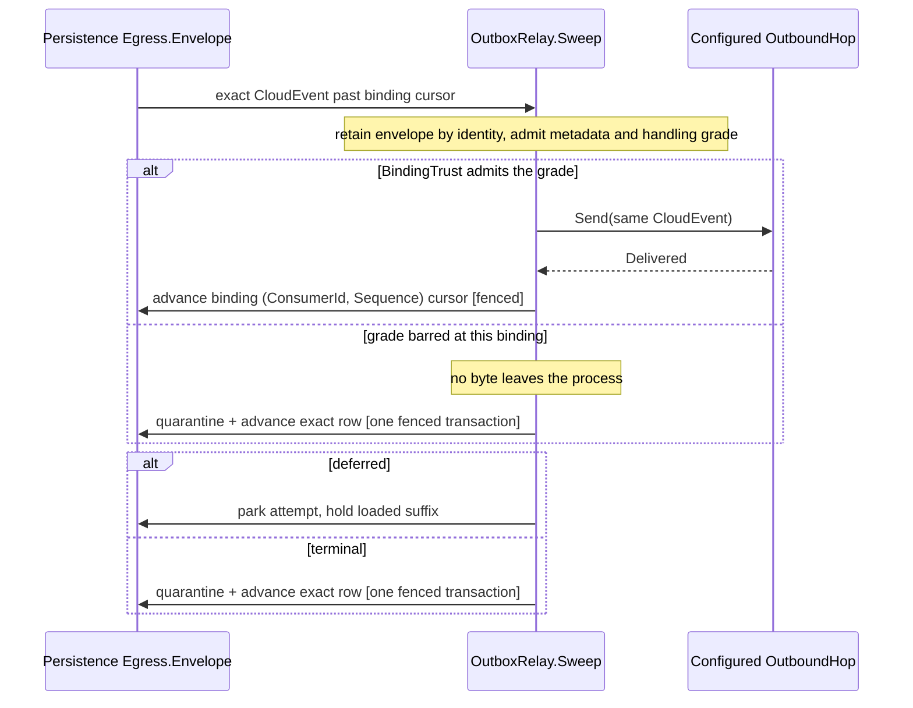

# [APPHOST_TRANSACTIONAL_OUTBOX]

Transactional-outbox and dead-letter ownership for the runtime spine: Persistence mints one CloudEvent from the op-log entry its producing transaction already commits, and a dispatch sweep on the one `SchedulePort` relays that exact envelope past the binding sink's `OutboxCursor` over its configured `OutboundHop`, advancing a `(ConsumerId, Sequence)` watermark. A poison entry exhausting its re-drive bound crosses to the Persistence `DeadLetter` lane carrying the fault that spent it.

Decoupled domain events therefore gain at-least-once dispatch with idempotent-key dedupe and exactly-once-effective delivery.

Persistence holds the committed event stream AS the outbox under `ONE_OUTBOX_EGRESS_SPINE`, and the workflow step-state row commits under the same tenant-scoped transaction (`SEAM_OUTBOX_AND_WORKFLOW_PERSISTENCE_TABLE`); this page names the seam and the relay, atomicity stays Persistence, and no table is asked for here.

Settled composition: `RedrivePolicy`, `Redrive.Settle`, `Verdict`, and `Retriability` arrive from `Rasm/Domain/rails#REDRIVE`; `FaultBand.Outbox` from `Rasm/Domain/rails#FAULT_BAND`; `ContentHash`/`CanonicalWriter` from `Rasm/Domain/identity#CONTENT_KEY`; CloudEvents mechanics from `Rasm/Domain/event`, whose `DataGrade`/`BrokerReach` handling policy (`#HANDLING_POLICY`) this lane grades every envelope against before it dials; generated event vocabulary from `Rasm.Contracts`; `ReceiptSinkPort`, `ReceiptEnvelope`, `TelemetrySource`, and `TenantContext` from `Rasm/Domain/frame`.

In-folder composition: `ReceiptKind` from `Observability/instruments#RECEIPT_PROJECTION`; `SchedulePort.Missed`, `ScheduleEntry.Spread`, and `ClockPolicy` from `Runtime/time`; `LeaseKey` from `Wire/coordination#ROLE_ELECTION`.

Owned surfaces: the relay vocabulary, the `OutboxOrdinal` sign boundary, the dialled binding's `BindingTrust` declaration, the dispatch sweep, the dead-letter lane's naming, the native sweep receipt, and the watermark-advancing relay; it consumes the Persistence-minted `CloudEvent`, the native `DeliveryReceipt`, the binding's configured `OutboundHop`, `FencingToken`, and `ILatencyContext`, and mints no envelope or eighth port.

## [01]-[INDEX]

- [02]-[OUTBOX_FABRIC]: Exact-envelope `RelayEntry`, its lifecycle union, the sequence sign boundary, strict metadata admission, and the binding-trust reach table.
- [03]-[DISPATCH_SWEEP]: One `SchedulePort` sweep relaying pending rows over the watermark under the coordination role lease.
- [04]-[SWEEP_RECEIPT]: Native sweep conservation evidence retained on the in-process receipt spine.

## [02]-[OUTBOX_FABRIC]

- Owner: `RelayState` `[Union]` the in-process relay lifecycle carrying its own stamp, ordinal, and terminal fault; `OutboxOrdinal` `[ValueObject<ulong>]` the ONE admission of the op-log sign boundary; `BindingTrust` `[SmartEnum<string>]` the reach set the dialled binding is composed at, the binding-owned half the kernel handling policy delegates; `RelayEntry` the operational carrier retaining the Persistence envelope by identity beside its admitted `DataGrade`; `OutboxFault` `[Union]` fault family riding the kernel `[FaultCase]`/`Fault` floor. Persistence owns the envelope mint and poison row.
- Cases: `RelayState` = `Pending` | `Deferred(At, Attempt)` | `DeadLettered(At, Attempt, Cause)`; `BindingTrust` = `estate` | `foreign`, their reach sets `{every, trusted}` and `{every}`; `OutboxFault` = `RelayRejected` | `Exhausted` | `WatermarkStale` | `EnvelopeRejected` | `ClassificationBarred`.
- Entry: `RelayEntry.Admit` admits the whole generated extension message and its persisted active relay state, then reads sequence, handling grade, and trace beside envelope time; `BindingTrust.Admits(grade)` answers the reach question every dial crosses; `RelayEntry.Settled` lowers the kernel re-drive verdict. No inverse DomainEvent projection exists.
- Auto: the outbox row writes same-transaction with the producing write, then Persistence `Egress.Envelope` mints once for the actual subscription binding. The relay retains that CloudEvent whole, dedupes by its operation identity `(source, id)`, sends the same object through the configured binding hop, and advances the per-sink watermark. A spent row routes to the Persistence-owned dead-letter lane with monotone attempts and the exact terminal fault.
- Law: envelope identity is conserved end to end — `id` remains `OpLogEntry.Id.Wire`, `subject` remains the rendered content key, data/content type/schema/dataref remain the payload frame's, and routing remains the subscription binding's metadata. AppHost never treats subject as a topic and never reconstructs generic bytes or dataref as JSON.
- Law: dedup reads the exact envelope's `(source, id)` composite through the ONE `Runtime/resources#DEDUPE_WINDOW`; a synthesized topic key or content digest in the id slot is a third identity and the deleted form.
- Law: metadata admission is strict and non-transforming — the fixed-width sequence, event time, source, id, subject, and handling grade must be present and canonical, while trace context is copied only when present. A malformed envelope refuses before dispatch; no fallback grade, fabricated identity, or interior-event inverse exists.
- Law: `dataclassification` GATES the dial, so a class the dialled binding cannot honor refuses at that binding (`libs/.planning/ARCHITECTURE.md` `[14]-[EVENT_FABRIC]` `[SECURITY]`). Kernel policy fixes how far a class reaches and leaves WHICH bindings the trusted row admits to the binding owner, and this relay is that owner for the one hop it dials: `BindingTrust` is a composition value stating the hop's own trust, `BrokerReach.Barred` sits in no row's reach set, and a reference-only fact is therefore unrelayable by construction rather than guarded at a call site.
- Law: absence is a REFUSAL and never a permissive default — the optional extension reads as the empty string no `DataGrade` key spells, so an ungraded envelope and a foreign key take one arm and neither reaches a hop; the producing mint stamps the grade it framed (`Rasm.Persistence` `Version/egress#EGRESS_SINK`), so an unstamped envelope names a broken producer rather than a public fact.
- Law: replay relation declares against `Runtime/determinism#EVENT_LOG` and `Runtime/determinism#REPLAY_VERIFY` rather than restating a durability claim of its own — the hash-chained content-addressed log proves a relayed sequence was neither re-ordered nor re-authored, and the replay verifier proves a re-executed drain reaches the same per-step content hash, so this relay owes its replay evidence to those owners and mints none beside them.
- Receipt: a relayed row mints one native `DeliveryReceipt` carrying the binding consumer key and hop verdict; a dead-letter transition persists generated fault evidence; no parallel outbox receipt.
- Packages: Rasm.Contracts (`event.v1.Extensions`, `fault.v1.FaultObservation`), Celly.Protovalidate, Rasm (kernel `Redrive`/`ContentHash`/`EventEnvelope`/`DataGrade`/`BrokerReach`), CloudNative.CloudEvents, Thinktecture.Runtime.Extensions, LanguageExt.Core, NodaTime, BCL inbox
- Growth: a new lifecycle state is one `RelayState` case breaking every reader's `Switch`; a new operational column is one field on `RelayEntry`; a new binding trust class is one `BindingTrust` row naming the reaches it admits; a new fault is one `OutboxFault` case with the `Retriability` it overrides; zero new surface.
- Boundary: Persistence alone owns the transactional message and its one CloudEvent mint. The committed op-log is the outbox, the per-binding `OutboxCursor` is dispatch state, and `RelayEntry` is only the AppHost's in-process carrier over the exact envelope returned by `Egress.Envelope`; a second envelope table, a second event mint, or a durable AppHost row is the deleted parallel store. The envelope id remains `OpLogEntry.Id.Wire`, its subject remains `ContentHash.Hex(OpLogEntry.ContentKey)`, and its sequence is the op-log sequence encoded as canonical fixed-width `D20`; none is repurposed as another. The binding subscription supplies the consumer key and configured `OutboundHop`, so semantic subject never becomes routing metadata. The store's arrows take a `long` sequence while the relay ordinal is a `ulong`, and `OutboxOrdinal` is the one checked crossing. The outbox and workflow step-state rows share the producing tenant-scoped transaction, while each durable binding advances its own fenced cursor over the one egress spine. `Redrive.Settle` owns retry disposition against this lane's bound: a non-transient fault dead-letters on its first attempt, and a transient fault retains its earned attempt across sweeps.

```csharp signature
// --- [TYPES] --------------------------------------------------------------------------------
// One column carries the whole lifecycle. `Pending` holds no stamp and no ordinal because a row nothing has
// attempted has neither; `DeadLettered` holds the fault that spent the bound, which the relay-exhausted
// string discarded at the one seam an operator reads to decide whether a replay can succeed.
[Union(ConversionFromValue = ConversionOperatorsGeneration.None)]
public abstract partial record RelayState {
    private RelayState() { }

    public sealed record Pending : RelayState;
    public sealed record Deferred(Instant At, int Attempt) : RelayState;
    public sealed record DeadLettered(Instant At, int Attempt, Error Cause) : RelayState;

    public int Attempt => Switch(
        pending: static _ => 0,
        deferred: static row => row.Attempt,
        deadLettered: static row => row.Attempt);

    public Option<Instant> At => Switch(
        pending: static _ => Option<Instant>.None,
        deferred: static row => Some(row.At),
        deadLettered: static row => Some(row.At));
}

// Sign boundary admits ONCE. The generated extension carries the op-log sequence as `uint64` while store arrows
// take `long`; the checked crossing happens here and every downstream arrow reads the admitted `Sequence`.
[ValueObject<ulong>(KeyMemberName = "Value")]
public sealed partial class OutboxOrdinal {
    public static Fin<OutboxOrdinal> Admit(string text, Op key) =>
        ulong.TryParse(text, NumberStyles.None, CultureInfo.InvariantCulture, out ulong held)
            && StringComparer.Ordinal.Equals(text, held.ToString("D20", CultureInfo.InvariantCulture))
            ? Admit(held, key)
            : Fin.Fail<OutboxOrdinal>(key.InvalidInput(nameof(OutboxOrdinal)));

    public static Fin<OutboxOrdinal> Admit(ulong ordinal, Op key) =>
        key.AcceptValidated<OutboxOrdinal, ulong>(ordinal);

    // Checked once at construction, so this projection is total by the validator above it.
    public long Sequence => checked((long)Value);

    static partial void ValidateFactoryArguments(ref ValidationError? validationError, ref ulong value) {
        if (value > long.MaxValue) {
            validationError = new ValidationError("an op-log sequence inside the long domain");
        }
    }
}

// Kernel policy fixes how far a CLASS may reach and leaves which bindings the trusted row admits to each binding
// owner, because trust is a property of the transport a kernel cannot see; this relay is that owner for the one
// hop it dials, so its trust is a composition VALUE. Reach rides as a SET per row rather than a rank compare:
// `BrokerReach.Barred` sits in no row, so a reference-only fact is unrelayable by construction and no call site
// guards for it, and a third trust class lands as one row naming the reaches it admits.
[SmartEnum<string>]
[KeyMemberEqualityComparer<ComparerAccessors.StringOrdinal, string>]
[KeyMemberComparer<ComparerAccessors.StringOrdinal, string>]
public sealed partial class BindingTrust {
    public static readonly BindingTrust Estate = new("estate", Seq(BrokerReach.Every, BrokerReach.Trusted));
    public static readonly BindingTrust Foreign = new("foreign", Seq(BrokerReach.Every));

    public Seq<BrokerReach> Reaches { get; }

    public bool Admits(DataGrade grade) => Reaches.Contains(grade.Broker);
}

// --- [ERRORS] ---------------------------------------------------------------------------
// the kernel discriminant each case declares.
[Union(ConversionFromValue = ConversionOperatorsGeneration.None)]
public abstract partial record OutboxFault : Fault {
    private static readonly FaultBand FamilyBand = FaultBand.Outbox;
    private OutboxFault(string detail) => Detail = detail;
    public string Detail { get; }
    public sealed override string Message => Detail;


    // Relay refusals default to transient, so `Redrive.Settle` defers them until the bound is spent; a hop
    // stating a terminal fault of its own overrides that through its own case and dead-letters on attempt one.
    [FaultCase(0)]
    public sealed partial record RelayRejected : OutboxFault {
        public RelayRejected(string detail) : base(detail) { }
        public override Retriability Retriability => Retriability.Transient;
    }

    [FaultCase(1)]
    public sealed partial record Exhausted : OutboxFault { public Exhausted(string detail) : base(detail) { } }

    // Cursor reads refuse transiently: the store is momentarily unreadable, not permanently wrong.
    [FaultCase(2)]
    public sealed partial record WatermarkStale : OutboxFault, ICausedFault {
        public WatermarkStale(string detail, Error cause) : base(detail) => Cause = cause;
        public Error Cause { get; }
        public override Retriability Retriability => Retriability.Transient;
    }

    [FaultCase(3)]
    public sealed partial record EnvelopeRejected : OutboxFault, ICausedFault {
        public EnvelopeRejected(string detail, Error cause) : base(detail) => Cause = cause;
        public Error Cause { get; }
    }

    // Terminal by the band's default and never overridden: no number of re-drives makes a barred class crossable
    // on a hop whose trust the deployment already declared, so this row quarantines on its first pass and the
    // cursor advances past it instead of parking a fact the binding will refuse for as long as it is configured.
    [FaultCase(4)]
    public sealed partial record ClassificationBarred : OutboxFault {
        public ClassificationBarred(string detail) : base(detail) { }
    }
}

public static class OutboxEventExtensions {
    private static readonly EventExtensionContract<global::Rasm.Contracts.Event.V1.Extensions> Contract = new(
        global::Rasm.Contracts.Event.V1.Extensions.Parser,
        global::Rasm.Contracts.Event.V1.Extensions.Descriptor,
        new global::Celly.Protovalidate.Validator([
            global::Rasm.Contracts.Event.V1.EventReflection.Descriptor,
        ]));

    public static Fin<RasmEvent<global::Rasm.Contracts.Event.V1.Extensions>> Admit(CloudEvent envelope, Op key) =>
        RasmEventEnvelope.Admit(envelope, Contract, key);

    public static TraceCarrier Trace(global::Rasm.Contracts.Event.V1.Extensions message) =>
        TraceCarrier.Admit(
            message.HasTraceparent ? message.Traceparent : null,
            message.HasTracestate ? message.Tracestate : null,
            message.HasBaggage ? message.Baggage : null);

}

// --- [MODELS] -------------------------------------------------------------------------------
// Rows retain the exact Persistence envelope plus the admitted ordinal, time, and trace the sweep reads.
// Generic data, dataref, subject, and schema never cross through an AppHost interior model.
public sealed record PendingRelay(CloudEvent Envelope, RelayState State);

public sealed record RelayEntry(
    CloudEvent Envelope,
    RelayState State,
    OutboxOrdinal Ordinal,
    Instant Physical,
    DataGrade Grade,
    TraceCarrier Trace) {
    // This lane contributes the re-drive BOUND and the composition supplies the LAW: when to stop trying
    // forever is a poison-quarantine threshold, while when to try again belongs to the hop pipeline
    // `OutboundSurface.Run` already brackets. `Bounded` is the only seat a relay policy is minted at —
    // `OutboxRelay.Runtime` takes the curve and derives its policy here — so the ceiling the disposition
    // column is proven against cannot be overridden by a composition that carried its own policy value.
    public const int PoisonCeiling = 8;

    public static RedrivePolicy Bounded(Schedule law) => RedrivePolicy.Of(law, PoisonCeiling);

    public string Dedup => $"{Envelope.Source}\0{Envelope.Id}";

    // Subject stays the Persistence content-key coordinate and Data stays whatever the binding framed (JSON,
    // bytes, or dataref); this admission reads only scheduling metadata from the exact envelope.
    public static Fin<RelayEntry> Admit(PendingRelay pending, Op key) =>
        from state in pending.State switch {
            RelayState.Pending { } when pending.State.Attempt == 0 => Fin.Succ(pending.State),
            RelayState.Deferred { Attempt: > 0 } => Fin.Succ(pending.State),
            _ => Fin.Fail<RelayState>(key.InvalidInput(nameof(PendingRelay.State))),
        }
        from admitted in OutboxEventExtensions.Admit(pending.Envelope, key)
        let extensions = admitted.Extensions
        from sequence in extensions.HasSequence
            ? Fin.Succ(extensions.Sequence)
            : Fin.Fail<string>(key.InvalidInput(nameof(global::Rasm.Contracts.Event.V1.Extensions.Sequence)))
        from ordinal in OutboxOrdinal.Admit(sequence, key)
        // Absence reads as the empty string no `DataGrade` key spells, so an ungraded envelope and a foreign
        // key take ONE arm and neither reaches a hop — the permissive default this gate exists to deny.
        from grade in DataGrade.Validate(
                extensions.Dataclassification, provider: null, out DataGrade? admittedGrade) is null
                && admittedGrade is { } handling
            ? Fin.Succ(handling)
            : Fin.Fail<DataGrade>(key.InvalidInput(nameof(global::Rasm.Contracts.Event.V1.Extensions.Dataclassification)))
        select new RelayEntry(
            admitted.Envelope, state, ordinal, admitted.Time, grade,
            OutboxEventExtensions.Trace(extensions));

    // Kernel verdicts ARE the transition: `Deferred` re-stamps and increments, `Abandoned` dead-letters with
    // whatever fault spent the bound, and `Terminal` dead-letters on attempt one — a non-transient refusal
    // burning eight sweeps and eight durable park writes reaches a conclusion its discriminant carried.
    public RelayEntry Settled(RedrivePolicy policy, Error cause, Instant at) =>
        Redrive.Settle(policy, cause, State.Attempt).Switch(
            deferred: next => this with { State = new RelayState.Deferred(at, next.Attempt) },
            abandoned: spent => this with { State = new RelayState.DeadLettered(at, spent.Attempt, spent.Cause) },
            terminal: refused => this with { State = new RelayState.DeadLettered(at, State.Attempt + 1, refused.Cause) });

}

```

## [03]-[DISPATCH_SWEEP]

- Owner: `OutboxRelay` the static sweep-and-relay surface over the one `SchedulePort` cadence, addressing the store as ONE keyed sink — the relay's own consumer key seated on its runtime — advancing the `(ConsumerId, Sequence)` watermark and bracketing each drain in the kernel `SpanBand` under this page's one `Scope` row, linked to every producing write it relays.
- Entry: `Sweep(OutboxRelay.Runtime runtime, TenantContext tenant, OutboxOrdinal watermark)` returns `IO<Fin<Seq<DeliveryReceipt>>>` — reads exact Persistence-minted envelopes and their persisted active relay state past the binding cursor, admits scheduling metadata and the handling grade, opens one producer-kind drain span linked to every envelope, grades each against the dialled binding's `BindingTrust` before sending it unchanged through the configured `OutboundHop`, and advances only a contiguous settled prefix. `Missed` composes occurrence history from `SchedulePort.Missed`; dead-letter inspection and replay remain Persistence-native operations.
- Auto: each sweep rides one `ScheduleEntry.Spread` row on the one `SchedulePort` and runs under the `LeaseKey.Role("outbox-sweep")` election. The decoded fencing token guards every cursor transition, so a stale node cannot rewind it. A delivered row advances and continues; a durably dead-lettered row advances atomically with its quarantine write and continues — a barred classification reaching that arm before any byte moves; a deferred row persists its earned attempt, advances nothing, and holds the remaining suffix unattempted. EventBus remains the immediate in-process publication leg owned by the producer; this relay sends only the already-minted CloudEvent and never suppresses a send from a process-local seen-key cache. The receiving binding dedupes any at-least-once replay by the unchanged operation id.
- Receipt: each attempted envelope mints one native delivery receipt carrying the binding consumer, hop verdict, and any delivered watermark. The sweep seals with one native `OutboxSweep` under `ReceiptKind.Sweep`: `examined`, `relayed`, `deferred`, and `dead_lettered` conserve the attempted prefix, `watermark` is its terminal cursor, and `oldest_age` is present only when that prefix ends deferred. No peer decodes either receipt, and no sink-wide backlog, topic lane, or locally guessed duplicate count is fabricated from a bounded read.
- Packages: Rasm.Contracts (project — event and fault evidence), Rasm (kernel `Redrive`/`ContentHash`), LanguageExt.Core, NodaTime, BCL inbox
- Growth: a new durable target is one subscription binding carrying its consumer key and configured `OutboundHop`; the sweep cadence remains one `ScheduleEntry.Spread` row; zero new surface.
- Law: attempts COMPOSE across the two owners and the composition is the idempotency window every receiving binding owes — the hop pipeline owns the per-send schedule (`docs/stacks/csharp/domain/resilience.md` `[ONE_OWNER]`) while this lane owns the re-drive BOUND alone, so one entry's whole span is the hop's allotment repeated across at most `RelayEntry.PoisonCeiling` sweeps; a receiver whose dedup window covers one hop allotment rather than that re-drive horizon admits a duplicate both owners read as correct.
- Boundary: each drain is a fan-in, so its span links every admitted envelope's producing trace and parents on none. A pending read refusal remains a typed failure rather than an empty healthy sweep. The store read returns the first due unsettled row, including its persisted deferred attempt, and never skips that row to expose a later sequence. This is the only durable AppHost relay: it neither re-mints the Persistence envelope nor republishes it on EventBus. The fenced `OutboxAdvance` CAS moves the binding cursor after delivery; the Persistence dead-letter arrow quarantines and advances one terminal row in the same fenced transaction. A deferred row stops the loaded suffix, so no later success can move the monotone cursor past a gap. Receiving bindings dedupe at-least-once replay by the conserved operation id; a relay-local seen-key cache is the deleted loss window. Barred classes never reach a binding at all, so no receiver sees a fact its own trust class forbids and no downstream filter re-decides what this gate settled. The dead-letter content key uses a framed `(consumer, dedup)` preimage so separate bindings cannot alias the same failed delivery.

```csharp signature
// --- [SERVICES] -----------------------------------------------------------------------------
public static class OutboxRelay {
    public sealed record Runtime(
        OutboundRuntime Outbound,
        // Consumer is this relay's OWN key, one value per runtime, because the relay registers as ONE keyed
        // `OutboundHop` consumer over the op-log: a per-row column would hand one consumer many cursors, and
        // deriving the key from semantic subject would seat a second content-to-sink table beside the binding.
        string Consumer,
        int Batch,
        ScheduleEntry Cadence,
        // Composition owns the re-drive LAW and this row owns its BOUND, so this column carries the CURVE
        // alone and `Redrive` derives: a deployment retunes the backoff without touching the quarantine
        // threshold, where a whole `RedrivePolicy` here was a slot seating any ceiling a composition liked
        // beside a `PoisonCeiling` no runtime read.
        Schedule Backoff,
        // Returns the first due unsettled row and its ordered suffix. A deferred head stays the head until due;
        // its persisted state carries the earned attempt back into `Redrive.Settle` instead of resetting at read.
        Func<string, long, int, Fin<Seq<PendingRelay>>> Pending,
        Func<string, long, ulong, Fin<OutboxOrdinal>> Advance,
        // Park writes attempt and store-local status onto the row the committed op-log ALREADY owns. Any shape
        // implying its own park table is the second envelope table the package ruling forecloses.
        Func<string, long, int, string, Fin<Unit>> Park,
        // Poison arrows speak WIRE-STABLE PRIMITIVES, the same decode-only shape `LeaseElection` and
        // `StepStateSeam` take. `DeadLetter` persists quarantine and advances that exact row in one fenced
        // Persistence transaction; recovery remains `EgressPump.Replay` until a real public boundary consumes it.
        Func<UInt128, string, long, Rasm.Contracts.Fault.V1.FaultObservation, int, ulong, Fin<OutboxOrdinal>> DeadLetter,
        // Fence reads the tenant-scoped generation through the coordination `BudgetToken` case — the SAME
        // read `Agent/capability#GRANT_BROKER` `DistributedBudget.Token` takes, composed rather than
        // re-minted, so a watermark advance and a budget debit present one generation identity.
        Func<TenantId, Fin<FencingToken>> Fence,
        OutboundHop Hop,
        // Composition declares the dialled hop's own trust class, one value per runtime because one runtime
        // dials one hop: a per-row column would let one configured binding grade two facts against two trusts
        // with nothing reconciling them.
        BindingTrust Trust,
        Func<CloudEvent, Func<CancellationToken, Task<HopOutcome>>> Send,
        ClockPolicy Clocks,
        ILatencyContext Latency,
        ReceiptSinkPort Sink,
        Option<SpanBand> Band = default) {
        // One policy serves every settlement on this lane: the composed curve under this page's own ceiling.
        public RedrivePolicy Redrive => RelayEntry.Bounded(Backoff);
    }

    // --- [OPERATIONS] -------------------------------------------------------------------------
    // This relay opens one drain plane, travelling inward on the platform's contributor port beside the
    // instrument rows. Admission and registration fail separately and silently: an unadmitted scope refuses
    // on its kernel rail at the first sweep, while an admitted-but-unregistered one strands its source
    // listenerless and every sweep takes the null-span arm an untraced composition takes.
    public static readonly TraceScope Scope = TraceScope.Create(value: "rasm.apphost.outbox");

    // Link-edge attribution rides the package's own dotted namespace; these key SPAN LINKS rather than a
    // metric series, so no census row or view tag-key is owed for either.
    public const string OutboxSinkSlot = "rasm.apphost.outbox.sink";
    public const string OutboxDedupSlot = "rasm.apphost.outbox.dedup";

    // `LeaseKey` names the ONE namespaced registry key every keyed registry on the spine reads, so the role a
    // sweep holds is a value the coordination owner resolves rather than an interpolated string two pages
    // spell differently.
    public static readonly LeaseKey SweepRole = LeaseKey.Role("outbox-sweep");

    // `Settlement = None` is a delivered row. A settled row retains the exact Deferred/DeadLettered state
    // the summary counts, while `Cursor` is present only when this row joined the contiguous settled prefix.
    public sealed record RelayResult(
        DeliveryReceipt Receipt,
        Option<RelayEntry> Settlement,
        Option<OutboxOrdinal> Cursor);

    public sealed record DrainState(
        Seq<RelayEntry> Examined,
        Seq<RelayResult> Results,
        bool Open);

    // Nodes resuming after a pause read their own occurrence HISTORY rather than a running counter, and each
    // entry's re-drive bound caps the window — a hundred-day second-resolution gap reports typed exhaustion
    // instead of a silently narrowed count.
    public static Fin<Seq<Instant>> Missed(Runtime runtime, Instant lastFired, Instant now) =>
        SchedulePort.Missed(runtime.Cadence, lastFired, now);

    // Refusing pending reads fail the sweep on its own rail. An empty successful sweep and an unreadable
    // store read byte-identically on every gauge the receipt feeds, so the store's refusal rides the rail out.
    public static IO<Fin<Seq<DeliveryReceipt>>> Sweep(Runtime runtime, TenantContext tenant, OutboxOrdinal watermark) =>
        runtime.Pending(runtime.Consumer, watermark.Sequence, runtime.Batch).Match(
            Succ: pending => pending.Traverse(row => RelayEntry.Admit(row, Op.Of())).As().Match(
                Succ: rows => runtime.Band.Match(
                        Some: band => band.Traced(Scope, Op.Of(), _ => Drain(runtime, tenant, rows, watermark), Edges(runtime, rows)),
                        None: () => Drain(runtime, tenant, rows, watermark))
                    .Map(Fin.Succ),
                Fail: fault => IO.pure(Fin.Fail<Seq<DeliveryReceipt>>(
                    new OutboxFault.EnvelopeRejected(fault.Message, fault)))),
            Fail: fault => IO.pure(Fin.Fail<Seq<DeliveryReceipt>>(new OutboxFault.WatermarkStale(fault.Message, fault))));

    // Fan-in carriage, one edge per relayed row: the sweep descends from no single producing transaction, so
    // each row's persisted carrier becomes a link and the batch states exactly which writes caused it. An
    // unparseable or absent carrier drops ITS edge alone and the sweep keeps every edge it could reconstruct.
    static SpanEdge Edges(Runtime runtime, Seq<RelayEntry> rows) =>
        SpanEdge.FanIn(
            rows.Choose(row => row.Trace.Link(
                (OutboxSinkSlot, runtime.Consumer), (OutboxDedupSlot, row.Dedup))).Strict(),
            ActivityKind.Producer);

    static IO<Seq<DeliveryReceipt>> Drain(
        Runtime runtime, TenantContext tenant, Seq<RelayEntry> rows, OutboxOrdinal watermark) =>
        rows.FoldM(
            new DrainState(Seq<RelayEntry>(), Seq<RelayResult>(), Open: true),
            (state, row) => !state.Open
                ? IO.pure(state)
                : Relay(runtime, tenant, row).Map(result => new DrainState(
                    state.Examined.Add(row),
                    state.Results.Add(result),
                    result.Cursor.IsSome)))
        .As()
        .Bind(state => Evidence(runtime, tenant, state, watermark)
            .Map(_ => state.Results.Map(static result => result.Receipt).Strict()));

    // Sweep seal: the lane rows carry the census and the two totals derive off them, so the gauges read the
    // sweep's own evidence rather than a second store scan or a stored sum that can disagree with its rows.
    static IO<ReceiptEnvelope> Evidence(
        Runtime runtime, TenantContext tenant, DrainState state, OutboxOrdinal floor) =>
        from now in IO.lift(() => runtime.Clocks.Now)
        from advanced in IO.lift(() => OutboxOrdinal
            .Admit(state.Results.Choose(static result => result.Cursor).Strict()
                .Fold(floor.Value, static (held, cursor) => ulong.Max(held, cursor.Value)), Op.Of())
            .IfFail(floor))
        from sweep in IO.lift(() => OutboxEvidence.Sweep(state, advanced, now))
        from envelope in runtime.Sink.Send(
            Correlation.Mint(), tenant, TelemetrySource.AppHost, ReceiptKind.Sweep.Key,
            JsonSerializer.SerializeToElement(sweep, SuiteContracts.Host))
        select envelope;

    // Classification gates the DIAL: a grade the configured binding cannot honor refuses before any byte moves
    // and settles TERMINAL, so a barred fact neither leaves the process nor wedges the cursor behind it —
    // `Redrive.Settle` reads the case's terminal posture, quarantines on attempt one, and advances that exact
    // row inside the same fenced transaction every other terminal row takes.
    static IO<RelayResult> Relay(Runtime runtime, TenantContext tenant, RelayEntry row) =>
        runtime.Trust.Admits(row.Grade)
            ? Dialled(runtime, tenant, row)
            : Barred(runtime, tenant, row);

    // `Unbound` is the receipt a refusal before the dial earns: it carries `Some(HopVerdict.Refused)` beside the
    // fault observation, and this page's own reading of the disposition is "no hop measure was taken", which is
    // exactly true here. `Suppressed` carries NO verdict and would erase a barred fact from the outcome rows.
    static IO<RelayResult> Barred(Runtime runtime, TenantContext tenant, RelayEntry row) =>
        IO.lift(() => (Error)new OutboxFault.ClassificationBarred(
                $"{row.Grade.Key}@{runtime.Trust.Key}:{row.Dedup}"))
            .Bind(cause => Settle(runtime, tenant, row, cause, DeliveryReceipt.Unbound(runtime.Consumer, cause)));

    // Fenced advance THREADS: the store-validated watermark lands IN the returned receipt (Some on a
    // delivered advance, None on a settlement), so accounting derives from the wired value. Fence loss on a
    // DELIVERED row lands in neither half under a naive fold — the advance answers Fail, the receipt reads no
    // watermark, and the row's attempt never increments — so binding that loss RE-ENTERS the settlement, the
    // one arm persisting an attempt. A retry always sends the same envelope again; only the receiving binding
    // can safely decide whether an ambiguous prior attempt was already applied.
    static IO<RelayResult> Dialled(Runtime runtime, TenantContext tenant, RelayEntry row) =>
        from settled in OutboundSurface.Dispatch<Unit>(runtime.Outbound, runtime.Hop,
            async token => (await runtime.Send(row.Envelope)(token).ConfigureAwait(false), unit), runtime.Latency)
        from result in settled.Carried.IsSucc
            ? IO.lift(() => runtime.Fence(tenant.TenantId)
                  .Bind(token => runtime.Advance(runtime.Consumer, row.Ordinal.Sequence, (ulong)token)))
              .Bind(fenced => fenced.Match(
                  Succ: cursor => IO.pure(new RelayResult(
                      DeliveryReceipt.Dialed(runtime.Consumer, settled, Some(cursor.Value)),
                      Option<RelayEntry>.None,
                      Some(cursor))),
                  Fail: fault => Settle(runtime, tenant, row, fault,
                      DeliveryReceipt.Dialed(runtime.Consumer, settled, Option<ulong>.None))))
            : Settle(runtime, tenant, row, settled.Carried.Match(
                  Succ: _ => new OutboxFault.RelayRejected(row.Dedup),
                  Fail: static error => error),
                DeliveryReceipt.Dialed(runtime.Consumer, settled, Option<ulong>.None))
        select result;

    // Deferred settlement parks the earned attempt and stops the suffix. Terminal settlement quarantines and
    // advances atomically, so removing a poison row from the pending set cannot leave the cursor stranded behind
    // it. The kernel verdict decides the arm; a non-transient fault reaches terminal on its first pass.
    static IO<RelayResult> Settle(
        Runtime runtime,
        TenantContext tenant,
        RelayEntry row,
        Error cause,
        DeliveryReceipt receipt) =>
        IO.lift(() => row.Settled(runtime.Redrive, cause, runtime.Clocks.Now)).Bind(settled =>
            settled.State switch {
                RelayState.Deferred _ => IO.lift(() => Parked(runtime, settled)).Bind(parked => parked.Match(
                    Succ: _ => IO.pure(new RelayResult(receipt, Some(settled), Option<OutboxOrdinal>.None)),
                    Fail: IO.fail<RelayResult>)),
                RelayState.DeadLettered dead => IO.lift(() => runtime.Fence(tenant.TenantId).Bind(token =>
                    runtime.DeadLetter(
                        ContentHash.Of(
                            (Consumer: runtime.Consumer, Dedup: row.Dedup),
                            static (state, writer) => writer.String(state.Consumer).String(state.Dedup)),
                        runtime.Consumer,
                        row.Ordinal.Sequence,
                        FaultWire.Observe(dead.Cause),
                        dead.Attempt,
                        (ulong)token)))
                    .Bind(fenced => fenced.Match(
                        Succ: cursor => IO.pure(new RelayResult(receipt, Some(settled), Some(cursor))),
                        Fail: IO.fail<RelayResult>)),
                _ => IO.fail<RelayResult>(new OutboxFault.RelayRejected(row.Dedup)),
            });

    // One seat for the store-local deferred spelling. Terminal status belongs to the atomic dead-letter arrow;
    // no peer contract publishes either internal lifecycle as a generated enum.
    static Fin<Unit> Parked(Runtime runtime, RelayEntry settled) =>
        settled.State.Switch(
            pending: _ => Fin.Fail<Unit>(new OutboxFault.RelayRejected(settled.Dedup)),
            deferred: _ => runtime.Park(runtime.Consumer, settled.Ordinal.Sequence, settled.State.Attempt, "deferred"),
            deadLettered: _ => Fin.Fail<Unit>(new OutboxFault.RelayRejected(settled.Dedup)));
}
```


```mermaid
sequenceDiagram
    accTitle: Transactional outbox dispatch and watermark advance
    accDescr: Persistence mints one CloudEvent from the committed op-log entry, the relay grades its dataclassification against the dialled binding's trust before sending that same envelope through the configured hop, and the fenced binding cursor advances only after settlement.
    participant Store as Persistence Egress.Envelope
    participant Sweep as OutboxRelay.Sweep
    participant Hop as Configured OutboundHop
    Store->>Sweep: exact CloudEvent past binding cursor
    Note over Sweep: retain envelope by identity, admit metadata and handling grade
    alt BindingTrust admits the grade
        Sweep->>Hop: Send(same CloudEvent)
        Hop-->>Sweep: Delivered
        Sweep->>Store: advance binding (ConsumerId, Sequence) cursor [fenced]
    else grade barred at this binding
        Note over Sweep: no byte leaves the process
        Sweep->>Store: quarantine + advance exact row [one fenced transaction]
    end
    alt deferred
        Sweep->>Store: park attempt, hold loaded suffix
    else terminal
        Sweep->>Store: quarantine + advance exact row [one fenced transaction]
    end
```

## [04]-[SWEEP_RECEIPT]

- Owner: native `OutboxSweep` is the in-process conservation receipt; `OutboxEvidence.Sweep` is its sole producer. Persistence owns the exact CloudEvent and its internal dead-letter/replay rail; this page authors no peer interface.
- Entry: `OutboxEvidence.Sweep` projects the attempted prefix and terminal sequence watermark without a generated message.
- Packages: Rasm.Contracts (project — delivery evidence), LanguageExt.Core, NodaTime, BCL inbox
- Growth: a new internal settlement state extends `RelayState` and breaks this receipt's exhaustive fold, with no peer enum or hand carrier.
- Boundary: no per-row, per-topic, or sweep projection exists here. The exact Persistence envelope carries content-key subject and operation id, not an AppHost topic. Dead-letter rows, replay receipts, and sweep evidence remain native until a real serialized peer consumer lands; a producer-only protobuf family is deleted rather than registered as dormant wire.

```csharp signature
// --- [BOUNDARIES] ---------------------------------------------------------------------------
public sealed record OutboxSweep(
    uint Examined,
    ulong Watermark,
    uint Relayed,
    uint Deferred,
    uint DeadLettered,
    Instant At,
    Option<Duration> OldestAge);

public static class OutboxEvidence {
    public static OutboxSweep Sweep(OutboxRelay.DrainState drain, OutboxOrdinal watermark, Instant at) {
        uint relayed = 0;
        uint deferred = 0;
        uint deadLettered = 0;
        Option<Duration> oldest = Option<Duration>.None;
        foreach (OutboxRelay.RelayResult result in drain.Results) {
            result.Settlement.Match(
                Some: settled => settled.State.Switch(
                    pending: _ => unit,
                    deferred: _ => {
                        deferred = checked(deferred + 1);
                        Duration age = at - settled.Physical;
                        oldest = oldest.Match(
                            Some: held => Some(held >= age ? held : age),
                            None: () => Some(age));
                        return unit;
                    },
                    deadLettered: _ => {
                        deadLettered = checked(deadLettered + 1);
                        return unit;
                    }),
                None: () => {
                    relayed = checked(relayed + 1);
                    return unit;
                });
        }
        return new OutboxSweep(
            checked((uint)drain.Examined.Count),
            watermark.Value,
            relayed,
            deferred,
            deadLettered,
            at,
            oldest);
    }
}
```

## [05]-[RESEARCH]

<!-- source-only: research row template:
[TOKEN]-[OPEN|BLOCKED]: <exact question>; <verification route>.
[SPLIT_MEMBER]-[OPEN]: does `shape-core` expose `split_all`; verify against the member rail.
-->

(none)
