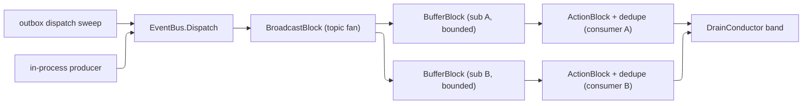

# [APPHOST_EVENT_BUS_TOPICS]

The in-process event-bus topology for the runtime spine: a `Topic<T>` fans a `DomainEvent` to ordered `Subscription` queues by offset through a `BroadcastBlock`, each subscription drains a bounded `BufferBlock` under back-pressure into an `ActionBlock` consumer, correlation and coalesce ride `JoinBlock`/`BatchedJoinBlock`, and every block is a `Runtime/resources#DRAIN_QUEUES` `DrainSurface` builder over the one `DrainKind` union — the `Network` case whose `Row.Kind` names the topology — so the bus turns the single-message `Wire/outbound#DELIVERY_FANOUT` fan-out into a multi-topic bus carrying bounded back-pressure with zero hand-rolled fan-out loops. The page owns the topic/subscription topology, the offset-ordered fan, the bounded-buffer back-pressure, and the in-process delivery the outbox dispatch sweep feeds; it consumes `DrainSurface`/`DrainKind`/`DrainSpec`/`DrainQueue`/`DrainBand`, `DeliveryFanout`/`DeliveryReceipt` (the dedupe-key precedent), `OutboundSurface.Run`/`OutboundHop` (the relay), `HLC`/`EventLog` (ordering and the chain), `CancelScope`, `ClockPolicy`, and `ReceiptSinkPort` as settled vocabulary, treats `System.Threading.Tasks.Dataflow` as the transitive framework floor (never a direct project asset), and mints no eighth port.

## [01]-[INDEX]

- [01]-[TOPIC_FABRIC]: `Topic<T>` over a `BroadcastBlock` fan and the `DomainEvent` carrier.
- [02]-[SUBSCRIPTION_FABRIC]: Offset-ordered bounded subscriptions, consumers, and correlation joins.
- [03]-[BUS_CONDUCTOR]: One conductor folding topics and subscriptions under the drain band with back-pressure.

## [02]-[TOPIC_FABRIC]

- Owner: `DomainEvent` the topic-agnostic event carrier; `Topic` `[SmartEnum<string>]` the topic axis under the `ComparerAccessors.StringOrdinal` accessor; `TopicHead` the `BroadcastBlock`-backed fan capsule; `BusFault` `[Union]` fault family in the 4730 band.
- Cases: topic rows are the declared event channels — `Command`, `Lifecycle`, `Health`, `Delivery` — each binding its `DrainSpec` back-pressure row; `BusFault` = Text | TopicUnknown | SubscriptionFull | JoinUnmatched.
- Entry: `Open(Topic topic, CancellationToken token)` returns `TopicHead` — mints the topic's `BroadcastBlock` fan over the topic's `DrainSpec.ReceiptFanOut`-derived row through `DrainSurface.Broadcast`, ready to link subscriptions; `Publish(TopicHead head, DomainEvent evt)` returns `IO<Unit>` — posts the event onto the fan head under the topic's bounded back-pressure so a fast producer awaits fullness rather than dropping.
- Auto: the topic fan is one `BroadcastBlock<DomainEvent>` minted through `DrainSurface.Broadcast` so the fan-out is the `DrainSurface` builder over the one `DrainKind` union, never a hand-rolled fan-out loop, and the clone delegate is the receipt-fan-out copy guard so a subscription mutating a received event cannot leak the mutation across subscriptions; the event carries its HLC stamp so subscriptions order events by the `(Physical, Logical)` pair the `Runtime/determinism#EVENT_LOG` chain and the `ReceiptEnvelope` carry, never a per-topic counter; `Publish` rides the topic's `DrainSpec` `BoundedCapacity` so a fast producer awaits on a `Wait` row rather than dropping — back-pressure is the bound, never unbounded accumulation; the topic row's `DrainBand` seats the fan under the conductor so a topic completes at its declared drain band on unload.
- Receipt: a published event is one `DomainEvent` on the fan; the per-subscription delivery is the subscription's own `DeliveryReceipt`; no parallel topic receipt.
- Packages: Thinktecture.Runtime.Extensions, LanguageExt.Core, NodaTime, BCL inbox
- Growth: one topic is one `Topic` row binding its `DrainSpec`; a new event shape is one `DomainEvent` payload column; zero new surface.
- Boundary: the topic fabric is the only in-process pub/sub owner — a per-topic background loop, a hand-rolled fan-out, and a second queue owner are the deleted forms; the fan is a `DrainSurface.Broadcast` builder over the one `DrainKind` union so the Dataflow `BroadcastBlock` rides the `Runtime/resources#DRAIN_QUEUES` direct project reference (central pin 10.0.9), one Dataflow owner for the whole spine; the event ordering is the HLC stamp the suite already carries so the bus and the command log order by one causal primitive, never a re-minted timeline; producer back-pressure is the fan's own `BoundedCapacity` — `Publish`'s `SendAsync` awaits when the bounded `BroadcastBlock` is full, never an unbounded fan — while the `BroadcastBlock` is latest-value to a slow target by construction, so the in-process leg is bounded best-effort fan-out and the AT-LEAST-ONCE guarantee is the durable `Wire/outbox#DISPATCH_SWEEP` leg (the outbox row + watermark + consumer dedup), never the in-process broadcast: a subscription whose bounded buffer is full when the fan offers misses the in-process copy and re-receives it on the outbox sweep, so durability is the outbox's and the in-process bus is the fast path; the relay to a durable subscriber rides the `Wire/outbound#DELIVERY_FANOUT` fold as one subscriber so the bus and the notification fan-out share one relay, never a parallel sender.

```csharp signature
public sealed record DomainEvent(
    string Topic,
    string IdempotencyKey,
    JsonElement Payload,
    DataClassification Classification,
    ulong Logical,
    Instant Physical) {
    public static DomainEvent Of(Topic topic, string idempotencyKey, JsonElement payload, DataClassification classification, ulong logical, Instant physical) =>
        new(topic.Key, idempotencyKey, payload, classification, logical, physical);
}

[SmartEnum<string>]
[KeyMemberEqualityComparer<ComparerAccessors.StringOrdinal, string>]
[KeyMemberComparer<ComparerAccessors.StringOrdinal, string>]
public sealed partial class Topic {
    public static readonly Topic Command = new("command", DrainSpec.ReceiptFanOut);
    public static readonly Topic Lifecycle = new("lifecycle", DrainSpec.ReceiptFanOut);
    public static readonly Topic Health = new("health", DrainSpec.ReceiptFanOut);
    public static readonly Topic Delivery = new("delivery", DrainSpec.ReceiptFanOut);

    public DrainSpec Spec { get; }
}

[Union]
public abstract partial record BusFault : Expected, IValidationError<BusFault> {
    private BusFault(string detail, int code) : base(detail, code, None) { }
    public static BusFault Create(string message) => new Text(message);
    public sealed record Text : BusFault { public Text(string detail) : base(detail, FaultBand.Bus.Code(0)) { } }
    public sealed record TopicUnknown : BusFault { public TopicUnknown(string detail) : base(detail, FaultBand.Bus.Code(1)) { } }
    public sealed record SubscriptionFull : BusFault { public SubscriptionFull(string detail) : base(detail, FaultBand.Bus.Code(2)) { } }
    public sealed record JoinUnmatched : BusFault { public JoinUnmatched(string detail) : base(detail, FaultBand.Bus.Code(3)) { } }
}

public sealed record TopicHead(Topic Topic, BroadcastBlock<DomainEvent> Fan);

public static class TopicFabric {
    public static TopicHead Open(Topic topic, CancellationToken token) =>
        new(topic, new BroadcastBlock<DomainEvent>(static evt => evt, topic.Spec.BroadcastOptions(token)));

    public static IO<Unit> Publish(TopicHead head, DomainEvent evt) =>
        IO.liftAsync(async () => { await head.Fan.SendAsync(evt); return unit; });
}
```

## [03]-[SUBSCRIPTION_FABRIC]

- Owner: `Subscription` the offset-ordered subscriber capsule over a bounded `BufferBlock` feeding an `ActionBlock`; `SubscriptionFabric` the static link-and-correlate surface over the `DrainSurface` builders.
- Entry: `Subscribe(TopicHead head, DrainSpec spec, Func<DomainEvent, IO<Unit>> consume, Atom<HashMap<string, Instant>> dedupe, Duration window, ClockPolicy clocks, CancellationToken token)` returns `Subscription` — links a bounded `BufferBlock` to the topic fan and an `ActionBlock` consumer to the buffer, deduplicating each event by its idempotency key through the `DeliveryFanout` dedupe cell (window-pruned through the injected `ClockPolicy`) before the consumer runs; `Correlate(DrainSpec spec, ITargetBlock<Tuple<DomainEvent, DomainEvent>> sink, CancellationToken token)` returns `DrainQueue<Tuple<DomainEvent, DomainEvent>>` — a `JoinBlock` correlation over two event streams; `Coalesce(DrainSpec spec, ITargetBlock<Tuple<IList<DomainEvent>, IList<DomainEvent>>> sink, CancellationToken token)` returns the `BatchedJoinBlock` coalesce.
- Auto: each subscription is a bounded `BufferBlock<DomainEvent>` linked to the topic fan under `DrainSurface` `LinkOptions` carrying `PropagateCompletion` so a topic completion fans completion to every subscription, and the buffer's `BoundedCapacity` is the subscription's back-pressure so a slow consumer pressures the fan rather than buffering unbounded; the `ActionBlock` consumer drains the buffer at the subscription's `MaxDegree` so an ordered subscription processes one event at a time and a parallel subscription fans across degrees; the dedupe reads the `DeliveryFanout` idempotency-key cell BEFORE the consumer runs so a re-published identical event within the window folds to a no-op rather than re-consuming, mirroring the delivery-fanout dedupe precedent exactly; the correlation join is a non-greedy `JoinBlock` so two event streams pair atomically rather than buffering one unbounded, and the coalesce is a greedy `BatchedJoinBlock` so the artifact and error streams coalesce into one batched hand-off — both are `DrainSurface` builders over the one union; an unmatched residual on a join arm at drain fails the `Completion` and folds onto the lifecycle fault rail.
- Receipt: each consumed event mints one `DeliveryReceipt` (the `DeliveryFanout` receipt shape) carrying the subscription key and the dedupe flag; no parallel subscription receipt.
- Packages: Thinktecture.Runtime.Extensions, LanguageExt.Core, NodaTime, BCL inbox
- Growth: one subscription is one `Subscribe` call over a topic; a new correlation arity is one `DrainSpec` `CorrelatedJoin` row column, never a new owner; zero new surface.
- Boundary: the subscription is a `DrainSurface` builder over the one `DrainKind` union — a parallel correlation buffer, a dual-queue zip, and a per-subscription background loop are the deleted forms; bounded `BufferBlock`s carry `BoundedCapacity` so a never-draining subscription caps at its bound rather than growing without bound — a full subscription buffer declines the fan's offer and re-receives the event on the durable outbox sweep, so the bound is the loss boundary the at-least-once outbox leg closes, never unbounded accumulation; the dedupe reuses the `Wire/outbound#DELIVERY_FANOUT` idempotency-key cell so the bus dedupe and the notification dedupe share one cell and one window-bound, never a second dedupe map; the offset ordering is the HLC `Logical` so a subscription replays in causal order; the durable relay to a persistent subscriber rides the `OutboundHop` so the bus rides the one retry owner, and the outbox dispatch sweep feeds the topics over the `ONE_OUTBOX_EGRESS_SPINE` op-log (`Wire/outbox#OUTBOX_FABRIC`) so the durable leg of delivery feeds the in-process bus, never a second egress table.

```csharp signature
public sealed record Subscription(
    string Key,
    DrainQueue<DomainEvent> Buffer,
    ActionBlock<DomainEvent> Consumer);

public static class SubscriptionFabric {
    public static Subscription Subscribe(
        TopicHead head, DrainSpec spec, Func<DomainEvent, IO<Unit>> consume,
        Atom<HashMap<string, Instant>> dedupe, Duration window, ClockPolicy clocks, CancellationToken token) {
        var buffer = new BufferBlock<DomainEvent>(spec.NetworkOptions(token));
        var consumer = new ActionBlock<DomainEvent>(
            async evt => { if (!Dedupe(dedupe, window, clocks, evt)) await consume(evt).RunAsync(); },
            spec.NetworkOptions(token));
        ignore(head.Fan.LinkTo(buffer, spec.LinkOptions()));
        ignore(buffer.LinkTo(consumer, spec.LinkOptions()));
        return new Subscription($"{head.Topic.Key}:{spec.Name}", spec.Open<DomainEvent>(buffer, consumer), consumer);
    }

    // Read-modify-write INSIDE the swap, exactly the DELIVERY_FANOUT idiom: prune and add fold over
    // the LIVE cell value and the verdict derives from the swap result, so concurrent fans never lose
    // each other's records — a Swap closing over a stale .Value read is the deleted form.
    static bool Dedupe(Atom<HashMap<string, Instant>> cell, Duration window, ClockPolicy clocks, DomainEvent evt) {
        var now = clocks.Now;
        var seen = false;
        ignore(cell.Swap(current => {
            var pruned = current.Filter(stamp => now - stamp < window);
            seen = pruned.ContainsKey(evt.IdempotencyKey);
            return pruned.AddOrUpdate(evt.IdempotencyKey, now, now);
        }));
        return seen;
    }

    public static DrainQueue<Tuple<DomainEvent, DomainEvent>> Correlate(DrainSpec spec, ITargetBlock<Tuple<DomainEvent, DomainEvent>> sink, CancellationToken token) =>
        spec.Join<DomainEvent, DomainEvent>(sink, token);

    public static DrainQueue<Tuple<IList<DomainEvent>, IList<DomainEvent>>> Coalesce(DrainSpec spec, ITargetBlock<Tuple<IList<DomainEvent>, IList<DomainEvent>>> sink, CancellationToken token) =>
        spec.Coalesce<DomainEvent, DomainEvent>(sink, token);
}
```

## [04]-[BUS_CONDUCTOR]

- Owner: `EventBus` the static conductor folding topics and their subscriptions into one bus and draining them under the `Runtime/lifecycle#DRAIN_CONDUCTOR` band.
- Entry: `Mount(EventBus.Runtime runtime, params ReadOnlySpan<(Topic Topic, Seq<(DrainSpec Spec, Func<DomainEvent, IO<Unit>> Consume)> Subscribers)> rows)` returns `EventBus.Cell` — opens each topic's fan, links every subscriber, and registers the bus drain rows at the topics' declared bands; `Dispatch(EventBus.Cell cell, DomainEvent evt)` returns `IO<Unit>` — publishes an event to its topic fan, the one entry the outbox dispatch sweep and the in-process producers both invoke.
- Auto: the conductor opens each topic head once and links its subscribers so the topology is built at mount, never per-publish; the bus registers its drain rows at the topics' `DrainBand` so on unload the conductor completes each topic fan, fanning completion to every subscription buffer and consumer through `PropagateCompletion`, and awaits the consumers' `Completion` at the drain band so an in-flight event drains before the band closes; `Dispatch` routes an event to its topic by key so a producer and the outbox sweep both publish through one entry; the bus reads the live degradation level so a `Suspended` host sheds non-critical topic delivery through the existing degradation rail, never a parallel throttle.
- Receipt: the bus drain folds into the `DrainReceipt` the conductor mints; per-event delivery rides the subscriptions' `DeliveryReceipt`s; no parallel bus receipt.
- Packages: LanguageExt.Core, NodaTime, BCL inbox
- Growth: one topic-plus-subscribers row absorbs a new event channel; a new producer drives the one `Dispatch`; zero new surface.
- Boundary: the bus conductor is the only multi-topic bus owner — a per-topic conductor, a parallel drain, and a second bus owner are the deleted forms; the bus drains under the one `DrainConductor` band so the bus completion and the runtime drain are one fold, never a bus-specific shutdown; the bus dispatch is the one entry the outbox dispatch sweep feeds and the in-process producers invoke so the durable and in-process delivery legs meet at one bus, never two; the relay to a durable subscriber rides the `OutboundHop` over `OutboundSurface.Run` so the bus rides the one retry owner and the `DeliveryFanout` folds in as one subscriber rather than a parallel sender.

```csharp signature
public static class EventBus {
    public sealed record Runtime(
        DeliveryRuntime Delivery,
        Func<DegradationLevel> Level,
        Func<DrainBand, int, string, Func<CancellationToken, IO<Unit>>, Unit> Register,
        ClockPolicy Clocks,
        CancelScope Spine);

    public sealed record Cell(HashMap<string, TopicHead> Heads, Seq<Subscription> Subscriptions);

    public static Cell Mount(Runtime runtime, params ReadOnlySpan<(Topic Topic, Seq<(DrainSpec Spec, Func<DomainEvent, IO<Unit>> Consume)> Subscribers)> rows) =>
        rows.ToArray().ToSeq().Fold(new Cell(HashMap<string, TopicHead>.Empty, Seq<Subscription>()), (cell, row) => {
            var head = TopicFabric.Open(row.Topic, runtime.Spine.Token);
            var subs = row.Subscribers.Map(sub => SubscriptionFabric.Subscribe(
                head, sub.Spec, sub.Consume, runtime.Delivery.Dedupe, runtime.Delivery.DedupeWindow, runtime.Clocks, runtime.Spine.Token));
            ignore(runtime.Register(row.Topic.Spec.Band, 0, $"bus:{row.Topic.Key}", _ => Drain(head, subs)));
            return new Cell(cell.Heads.Add(row.Topic.Key, head), cell.Subscriptions + subs);
        });

    public static IO<Unit> Dispatch(Cell cell, DomainEvent evt) =>
        cell.Heads.Find(evt.Topic).Match(
            Some: head => TopicFabric.Publish(head, evt),
            None: () => IO.fail<Unit>(new BusFault.TopicUnknown(evt.Topic)));

    static IO<Unit> Drain(TopicHead head, Seq<Subscription> subs) =>
        IO.liftAsync(async () => {
            head.Fan.Complete();
            await Task.WhenAll(subs.Map(static s => s.Consumer.Completion).ToArray());
            return unit;
        });
}
```



## [05]-[RESEARCH]

- [COLLAB_DELTA_FEED]: the `Rasm.AppUi` `Collab/sync` live-delta broadcast rides this one topics law as OPAQUE payload rows — the session-ephemeral Loro CRDT wire crosses as `DomainEvent.Payload` bytes on a collab topic (durable document deltas on one topic, lossy presence/awareness on a separate ephemeral topic), NEVER durable truth and never a second bus (AppUi the demanding consumer; the seam is ledgered both sides).
- [DATAFLOW_FLOOR]: the topic fan, the bounded subscriptions, the correlation join, and the coalesce are all `Runtime/resources#DRAIN_QUEUES` `DrainSurface` builders over the one `DrainKind` union — `BroadcastBlock` through `DrainSurface.Broadcast`, the bounded `BufferBlock`/`ActionBlock` over `DrainSpec.NetworkOptions`, `JoinBlock` through `DrainSurface.Join`, `BatchedJoinBlock` through `DrainSurface.Coalesce` — so `System.Threading.Tasks.Dataflow` is a direct project reference against its central pin (admitted 10.0.9, `.api/api-dataflow.md`) — not in the shared framework, so a transitive-floor claim is the corrected fiction — never a second Dataflow-owning project asset; the `BoundedCapacity` back-pressure, the `PropagateCompletion` link option, and the `Greedy`/`MaxGroups` policy columns are the `DrainSpec` row's, so the bus adds no new Dataflow surface beyond the builders.
- [DEDUPE_PRECEDENT]: the per-subscription dedupe reads the `Wire/outbound#DELIVERY_FANOUT` idempotency-key cell BEFORE the consumer runs, exactly the delivery-fanout dedupe precedent (first sight within the window is absent so deliver, a re-published identical event is present so fold to a no-op), so the bus dedupe and the notification dedupe share one cell and one window-bound; the relay to a durable subscriber rides `OutboundSurface.Run` over an `OutboundHop` so the bus rides the one retry owner and the `DeliveryFanout` folds in as one subscriber, never a parallel sender.
- [OUTBOX_FEED]: the outbox dispatch sweep feeds the topics over the `Rasm.Persistence` `ONE_OUTBOX_EGRESS_SPINE` op-log shared with `SEAM_OUTBOX_AND_WORKFLOW_PERSISTENCE_TABLE` — the `Wire/outbox.md` owner relays each outbox row as one keyed `OutboundHop` consumer advancing its `(ConsumerId, Hlc)` watermark and dispatches it through `EventBus.Dispatch`, so the durable leg of exactly-once-effective delivery feeds the in-process bus and the in-process leg carries bounded back-pressure, never a second egress table; the event HLC ordering is the `Runtime/determinism#EVENT_LOG` causal primitive so the bus and the command log order by one stamp.
