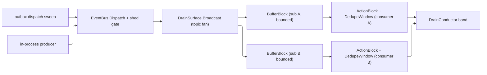

# [APPHOST_EVENT_BUS_TOPICS]

Rasm.AppHost runs one in-process event bus on the runtime spine: a `Topic` row fans a `DomainEvent` to offset-ordered `Subscription` queues, each subscription draining a bounded `BufferBlock` under back-pressure into an `ActionBlock` consumer, every block a `Runtime/resources#DRAIN_QUEUES` `DrainSurface` builder over the one `DrainKind` union whose `Row.Kind` names the topology. This page owns the topic and subscription topology, the offset-ordered fan, the bounded-buffer back-pressure, the per-topic durability and shed columns, and the in-process delivery the outbox dispatch sweep feeds, composing `DrainSurface`/`DrainKind`/`DrainSpec`/`DrainQueue`/`DrainBand`, the `Runtime/resources#DEDUPE_WINDOW` `DedupeWindow`, `DeliveryFanout`/`DeliveryReceipt`, `OutboundSurface.Run`/`OutboundHop`, `HLC`/`EventLog`, `DegradationLevel`, `CancelScope`, `ClockPolicy`, and `ReceiptSinkPort` as settled vocabulary, reaches `System.Threading.Tasks.Dataflow` through the drain owner's direct project reference against its central pin — the library ships outside the shared framework, so no transitive floor carries it — and mints no eighth port.

## [01]-[INDEX]

- [02]-[TOPIC_FABRIC]: `Topic` rows over a `DrainSurface.Broadcast` fan and the `DomainEvent` carrier.
- [03]-[SUBSCRIPTION_FABRIC]: Offset-ordered bounded subscriptions, consumers, and the composed dedupe window.
- [04]-[BUS_CONDUCTOR]: One conductor folding topics and subscriptions under the drain band with back-pressure.

## [02]-[TOPIC_FABRIC]

- Owner: `DomainEvent` the topic-agnostic event carrier; `Topic` `[SmartEnum<string>]` the topic axis under the `ComparerAccessors.StringOrdinal` accessor carrying its `DrainSpec`, its `TopicDurability`, and its shed threshold; `TopicDurability` `[SmartEnum<string>]` the two-row durability axis the outbox enqueue reads; `TopicHead` the `DrainQueue<DomainEvent>` fan capsule; `BusFault` `[Union]` fault family in the 4730 band.
- Cases: topic rows are the declared event channels — `Command`, `Lifecycle`, `Health`, `Delivery`, and the two `Rasm.AppUi` `Collab/sync` channels, `Collab` carrying the durable document deltas and `Presence` the lossy presence and awareness frames — each binding its `DrainSpec` back-pressure row, its `TopicDurability` arm, and the `Option<DegradationLevel>` rank at which its delivery sheds; `TopicDurability` = durable | ephemeral; `BusFault` = Text | TopicUnknown.
- Entry: `Open(Topic topic, Seq<ITargetBlock<DomainEvent>> sinks, CancellationToken token)` returns `TopicHead` — mints the topic's fan through `DrainSurface.Broadcast` over the subscription intakes already built, so the builder owns both the block and every link; `Publish(TopicHead head, DomainEvent evt)` returns `IO<Unit>` — posts the event onto the fan's intake under the topic's bounded back-pressure so a fast producer awaits fullness rather than dropping.
- Auto: the topic fan is one `DrainSurface.Broadcast` builder over the `DrainKind.FanOut` row, so the block, its `LinkOptions` `PropagateCompletion`, and its `Tail.Completion` are the drain owner's, never a hand-rolled fan-out loop beside them; the clone delegate detaches the payload — `JsonElement.Clone()` copies the element out of its parent `JsonDocument` so a subscription holding a received event past the producer's document lifetime reads live bytes rather than a recycled buffer, the copy guard the identity delegate never gave; the event carries its HLC stamp so subscriptions order events by the `(Physical, Logical)` pair the `Runtime/determinism#EVENT_LOG` chain and the `ReceiptEnvelope` carry, never a per-topic counter; `Publish` rides the topic's `DrainSpec` `BoundedCapacity` so a fast producer awaits on a `Wait` row rather than dropping — back-pressure is the bound, never unbounded accumulation; the topic row's `DrainBand` seats the fan under the conductor so a topic completes at its declared drain band on unload.
- Receipt: a published event is one `DomainEvent` on the fan; the per-subscription delivery is the subscription's own `DeliveryReceipt`; no parallel topic receipt.
- Packages: Thinktecture.Runtime.Extensions, LanguageExt.Core, NodaTime, BCL inbox
- Growth: one topic is one `Topic` row binding its `DrainSpec`, durability arm, and shed threshold; a new event shape is one `DomainEvent` payload column; zero new surface.
- Boundary: the topic fabric is the only in-process pub/sub owner — a per-topic background loop, a hand-rolled fan-out, and a second queue owner are the deleted forms; the fan is a `DrainSurface.Broadcast` builder over the one `DrainKind` union so the Dataflow `BroadcastBlock` rides the `Runtime/resources#DRAIN_QUEUES` direct project reference against its central pin, one Dataflow owner for the whole spine, and the producer reaches the intake through a total arm projection at the publish site rather than a raw block retained beside the queue; the event ordering is the HLC stamp the suite already carries so the bus and the command log order by one causal primitive, never a re-minted timeline; producer back-pressure is the fan's own `BoundedCapacity` — `Publish`'s `SendAsync` awaits when the bounded fan is full, never an unbounded fan — while the `BroadcastBlock` is latest-value to a slow target by construction, so the in-process leg is bounded best-effort fan-out and the AT-LEAST-ONCE guarantee is the durable `Wire/outbox#DISPATCH_SWEEP` leg (the outbox row + watermark + consumer dedup), never the in-process broadcast: a subscription whose bounded buffer is full at the fan's offer misses the in-process copy and re-receives it on the outbox sweep, so durability is the outbox's and the in-process bus is the fast path; that re-receive is the `TopicDurability.Durable` row's guarantee alone — an `Ephemeral` row is NEVER enqueued, so the outbox sweep reads the durability column rather than every topic, and a claim of per-topic loss classes expressed in no column is the deleted form; the `Rasm.AppUi` `Collab/sync` live-delta broadcast rides these topic rows as OPAQUE `DomainEvent.Payload` bytes — the session-ephemeral CRDT wire is the subscriber's to decode and never durable truth here — with the document deltas on the `Durable` `Collab` row riding the outbox leg and the `Ephemeral` `Presence` frames staying in-process, so an awareness frame a slow subscriber misses is lost by design and a second bus for collaboration is the deleted form.

```csharp signature
public sealed record DomainEvent(
    string Topic,
    string IdempotencyKey,
    JsonElement Payload,
    DataClassification Classification,
    ulong Logical,
    Instant Physical) {
    public static DomainEvent Of(Topic topic, string idempotencyKey, JsonElement payload, DataClassification classification, ulong logical, Instant physical) =>
        new(topic.Key, idempotencyKey, payload, classification, logical, physical);

    // Clone() detaches the element onto its own storage, discharging the fan's copy guard: JsonElement over a
    // pooled JsonDocument stays valid only while that document lives, so a subscription outliving the
    // producer's parse reads a recycled buffer. An identity delegate hands every sink the same borrowed
    // window and proves no isolation at all.
    public static DomainEvent Detach(DomainEvent evt) => evt with { Payload = evt.Payload.Clone() };
}

[SmartEnum<string>]
[KeyMemberEqualityComparer<ComparerAccessors.StringOrdinal, string>]
[KeyMemberComparer<ComparerAccessors.StringOrdinal, string>]
public sealed partial class TopicDurability {
    public static readonly TopicDurability Durable = new("durable");
    public static readonly TopicDurability Ephemeral = new("ephemeral");
}

// Sheds is the degradation RANK at or above which this topic's delivery is dropped, and None is the arm a
// topic that never sheds takes — an absent threshold, never a sentinel rank a comparison would still admit.
// Command, lifecycle, health, delivery, and the durable collab deltas carry no threshold; presence is
// awareness traffic whose loss is already the design, so it sheds at the first reduced level.
[SmartEnum<string>]
[KeyMemberEqualityComparer<ComparerAccessors.StringOrdinal, string>]
[KeyMemberComparer<ComparerAccessors.StringOrdinal, string>]
public sealed partial class Topic {
    public static readonly Topic Command = new("command", DrainSpec.ReceiptFanOut, TopicDurability.Durable, None);
    public static readonly Topic Lifecycle = new("lifecycle", DrainSpec.ReceiptFanOut, TopicDurability.Durable, None);
    public static readonly Topic Health = new("health", DrainSpec.ReceiptFanOut, TopicDurability.Ephemeral, None);
    public static readonly Topic Delivery = new("delivery", DrainSpec.ReceiptFanOut, TopicDurability.Durable, None);
    public static readonly Topic Collab = new("collab", DrainSpec.ReceiptFanOut, TopicDurability.Durable, None);
    public static readonly Topic Presence = new("presence", DrainSpec.ReceiptFanOut, TopicDurability.Ephemeral, Some(DegradationLevel.ReducedRemote));

    public DrainSpec Spec { get; }

    public TopicDurability Durability { get; }

    public Option<DegradationLevel> Sheds { get; }
}

[Union]
public abstract partial record BusFault : Expected, IValidationError<BusFault> {
    private BusFault(string detail, int code) : base(detail, code, None) { }
    public static BusFault Create(string message) => new Text(message);
    public sealed record Text : BusFault { public Text(string detail) : base(detail, FaultBand.Bus.Code(0)) { } }
    public sealed record TopicUnknown : BusFault { public TopicUnknown(string detail) : base(detail, FaultBand.Bus.Code(1)) { } }
}

public sealed record TopicHead(Topic Topic, DrainQueue<DomainEvent> Fan);

public static class TopicFabric {
    // Callers build every subscription intake BEFORE the fan, so the builder owns every link: the head links
    // to each sink under the row's PropagateCompletion and exposes itself as intake and Tail, and a completed
    // head fans completion to every subscription without a second LinkTo at this call site.
    public static TopicHead Open(Topic topic, Seq<ITargetBlock<DomainEvent>> sinks, CancellationToken token) =>
        new(topic, topic.Spec.Broadcast(DomainEvent.Detach, sinks, token));

    // Total arm projection at the call site, the shape Wire/livewire's lane drain takes: the fan-out row's
    // intake IS the broadcast head, and the pipe arm is a typed rail failure rather than a throw.
    public static IO<Unit> Publish(TopicHead head, DomainEvent evt) =>
        head.Fan.Switch(
            state: evt,
            pipe: static (_, p) => IO.fail<Unit>(new DrainFault.TopologyMismatch(p.Spec.Name, DrainKind.FanOut.Key)),
            network: static (e, n) => IO.liftAsync(async () => { await n.Intake.SendAsync(e).ConfigureAwait(false); return unit; }));
}
```

## [03]-[SUBSCRIPTION_FABRIC]

- Owner: `Subscription` the offset-ordered subscriber capsule over a bounded `BufferBlock` feeding an `ActionBlock`; `SubscriptionFabric` the static open-and-link surface over the `DrainSurface` builders.
- Entry: `Open(Topic topic, DrainSpec spec, Func<DomainEvent, IO<Unit>> consume, DedupeWindow dedupe, ClockPolicy clocks, CancellationToken token)` returns `Subscription` — mints the bounded `BufferBlock`, links the `ActionBlock` consumer behind it, and admits each event through the composed dedupe window before the consumer runs; the buffer is handed to `TopicFabric.Open` as one of the fan's sinks, so the subscription exists before the topic it drains.
- Auto: each subscription is a bounded `BufferBlock<DomainEvent>` the topic fan links under `PropagateCompletion` so a topic completion fans completion to every subscription, and the buffer's `BoundedCapacity` is the subscription's back-pressure so a slow consumer pressures the fan rather than buffering unbounded; the `ActionBlock` consumer drains the buffer at the subscription's `MaxDegree` so an ordered subscription processes one event at a time and a parallel subscription fans across degrees; the dedupe is the `Runtime/resources#DEDUPE_WINDOW` `DedupeWindow` value the composition hands in — `Admit(key, clocks.Now)` prunes, decides, and records inside one compare-and-swap, so a re-published identical event inside the window folds to a no-op before the consumer runs and two fans racing one key admit exactly one; the instant is the threaded `ClockPolicy`'s, so a fake-clock spec expires the window deterministically.
- Receipt: each consumed event mints one `DeliveryReceipt` (the `DeliveryFanout` receipt shape) carrying the subscription key and the dedupe verdict; no parallel subscription receipt.
- Packages: Thinktecture.Runtime.Extensions, LanguageExt.Core, NodaTime, BCL inbox
- Growth: one subscription is one `Open` call over a topic row; a new back-pressure class is one `DrainSpec` row at the drain owner; zero new surface.
- Boundary: the subscription is a `DrainSurface` builder over the one `DrainKind` union — a per-subscription background loop and a second queue owner are the deleted forms; bounded `BufferBlock`s carry `BoundedCapacity` so a never-draining subscription caps at its bound rather than growing without bound — a full subscription buffer declines the fan's offer and re-receives the event on the durable outbox sweep, so the bound is the loss boundary the at-least-once outbox leg closes for a `Durable` row and the declared loss for an `Ephemeral` one, never unbounded accumulation; the dedupe composes the ONE `DedupeWindow` primitive the delivery fan-out also composes, so the bus dedupe and the notification dedupe are one owner and one window-bound — a local seen-key map beside it is the deleted form; the offset ordering is the HLC `Logical` so a subscription replays in causal order; a correlated join or dual-stream coalesce over two event streams reaches `DrainSurface.Join`/`DrainSurface.Coalesce` at the drain owner directly, so a renaming forward on this page is the deleted form; the durable relay to a persistent subscriber rides the `OutboundHop` so the bus rides the one retry owner, and the outbox dispatch sweep feeds the topics over the `ONE_OUTBOX_EGRESS_SPINE` op-log (`Wire/outbox#OUTBOX_FABRIC`) so the durable leg of delivery feeds the in-process bus, never a second egress table.

```csharp signature
public sealed record Subscription(
    string Key,
    DrainQueue<DomainEvent> Buffer,
    ITargetBlock<DomainEvent> Intake,
    ActionBlock<DomainEvent> Consumer);

public static class SubscriptionFabric {
    public static Subscription Open(
        Topic topic, DrainSpec spec, Func<DomainEvent, IO<Unit>> consume,
        DedupeWindow dedupe, ClockPolicy clocks, CancellationToken token) {
        var buffer = new BufferBlock<DomainEvent>(spec.NetworkOptions(token));
        var consumer = new ActionBlock<DomainEvent>(
            async evt => { if (dedupe.Admit(evt.IdempotencyKey, clocks.Now)) { await consume(evt).RunAsync().ConfigureAwait(false); } },
            spec.NetworkOptions(token));
        ignore(buffer.LinkTo(consumer, spec.LinkOptions()));
        return new Subscription($"{topic.Key}:{spec.Name}", spec.Open<DomainEvent>(buffer, consumer), buffer, consumer);
    }
}
```

## [04]-[BUS_CONDUCTOR]

- Owner: `EventBus` the static conductor folding topics and their subscriptions into one bus and draining them under the `Runtime/lifecycle#DRAIN_CONDUCTOR` band.
- Entry: `Mount(EventBus.Runtime runtime, params ReadOnlySpan<(Topic Topic, Seq<(DrainSpec Spec, Func<DomainEvent, IO<Unit>> Consume)> Subscribers)> rows)` returns `EventBus.Cell` — opens every subscriber, then the topic fan over their intakes, and registers the bus drain rows at the topics' declared bands; `Dispatch(EventBus.Cell cell, DomainEvent evt)` returns `IO<Unit>` — publishes an event to its topic fan under the live degradation gate, the one entry the outbox dispatch sweep and the in-process producers both invoke.
- Auto: the conductor opens each topic's subscribers first and its fan second so the topology is one builder call at mount, never per-publish and never a second link pass; the bus registers its drain rows at the topics' `DrainBand` so on unload the conductor completes each topic fan, fanning completion to every subscription buffer and consumer through `PropagateCompletion`, and awaits the consumers' `Completion` at the drain band so an in-flight event drains before the band closes; `Dispatch` routes an event to its topic by key so a producer and the outbox sweep both publish through one entry, and it reads the live `DegradationLevel` against the topic's own `Sheds` rank so a reduced host drops awareness traffic and keeps every unthresholded channel, the existing degradation rail rather than a parallel throttle.
- Receipt: the bus drain folds into the `DrainReceipt` the conductor mints; per-event delivery rides the subscriptions' `DeliveryReceipt`s; a shed dispatch is a receipted no-op, never a fault.
- Packages: LanguageExt.Core, NodaTime, BCL inbox
- Growth: one topic-plus-subscribers row absorbs a new event channel; a new producer drives the one `Dispatch`; zero new surface.
- Boundary: the bus conductor is the only multi-topic bus owner — a per-topic conductor, a parallel drain, and a second bus owner are the deleted forms; the bus drains under the one `DrainConductor` band so the bus completion and the runtime drain are one fold, never a bus-specific shutdown; the bus dispatch is the one entry the outbox dispatch sweep feeds and the in-process producers invoke so the durable and in-process delivery legs meet at one bus, never two; shedding is a per-topic rank comparison against the live level, so a `Suspended` host sheds exactly the topics whose rows declare a threshold and a blanket dispatch gate is the deleted form; the relay to a durable subscriber rides the `OutboundHop` over `OutboundSurface.Run` so the bus rides the one retry owner and the `DeliveryFanout` folds in as one subscriber rather than a parallel sender.

```csharp signature
public static class EventBus {
    public sealed record Runtime(
        DeliveryRuntime Delivery,
        Func<DegradationLevel> Level,
        Func<DrainBand, int, string, Func<CancellationToken, IO<Unit>>, Unit> Register,
        ClockPolicy Clocks,
        CancelScope Spine);

    public sealed record Cell(HashMap<string, TopicHead> Heads, Seq<Subscription> Subscriptions, Func<DegradationLevel> Level);

    public static Cell Mount(Runtime runtime, params ReadOnlySpan<(Topic Topic, Seq<(DrainSpec Spec, Func<DomainEvent, IO<Unit>> Consume)> Subscribers)> rows) =>
        toSeq(rows.ToArray()).Fold(new Cell(HashMap<string, TopicHead>.Empty, Seq<Subscription>(), runtime.Level), (cell, row) => {
            var subs = row.Subscribers.Map(sub => SubscriptionFabric.Open(
                row.Topic, sub.Spec, sub.Consume, runtime.Delivery.Dedupe, runtime.Clocks, runtime.Spine.Token));
            var head = TopicFabric.Open(row.Topic, subs.Map(static s => s.Intake), runtime.Spine.Token);
            ignore(runtime.Register(row.Topic.Spec.Band, 0, $"bus:{row.Topic.Key}", _ => Drain(head, subs)));
            return cell with { Heads = cell.Heads.Add(row.Topic.Key, head), Subscriptions = cell.Subscriptions + subs };
        });

    // Shedding returns unit rather than a fault: the level ruled the drop, so the producer is not in error
    // and the caller has nothing to retry. Only an unknown key is a typed refusal.
    public static IO<Unit> Dispatch(Cell cell, DomainEvent evt) =>
        cell.Heads.Find(evt.Topic).Match(
            Some: head => Shed(head.Topic, cell.Level()) ? IO.pure(unit) : TopicFabric.Publish(head, evt),
            None: () => IO.fail<Unit>(new BusFault.TopicUnknown(evt.Topic)));

    static bool Shed(Topic topic, DegradationLevel level) =>
        topic.Sheds.Match(Some: threshold => level.Rank >= threshold.Rank, None: static () => false);

    static IO<Unit> Drain(TopicHead head, Seq<Subscription> subs) =>
        IO.liftAsync(async () => {
            await head.Fan.Drained(CancellationToken.None).ConfigureAwait(false);
            await Task.WhenAll(subs.Map(static s => s.Consumer.Completion).ToArray()).ConfigureAwait(false);
            return unit;
        });
}
```


```mermaid
---
config:
  layout: elk
  flowchart:
    curve: linear
    padding: 25
---
flowchart LR
    accTitle: One topic fan, bounded subscriptions, one drain
    accDescr: A DomainEvent posts to the topic fan through the drain-surface broadcast builder; each subscription is a bounded BufferBlock feeding an ActionBlock consumer behind the composed dedupe window; the outbox dispatch sweep and in-process producers both publish through EventBus.Dispatch under the degradation shed gate; the bus drains under the runtime conductor.
    Sweep["outbox dispatch sweep"] --> Dispatch
    Producer["in-process producer"] --> Dispatch
    Dispatch["EventBus.Dispatch + shed gate"] --> Fan["DrainSurface.Broadcast (topic fan)"]
    Fan --> Buf1["BufferBlock (sub A, bounded)"]
    Fan --> Buf2["BufferBlock (sub B, bounded)"]
    Buf1 --> Act1["ActionBlock + DedupeWindow (consumer A)"]
    Buf2 --> Act2["ActionBlock + DedupeWindow (consumer B)"]
    Act1 --> Drain["DrainConductor band"]
    Act2 --> Drain
```

## [05]-[RESEARCH]

(none)
