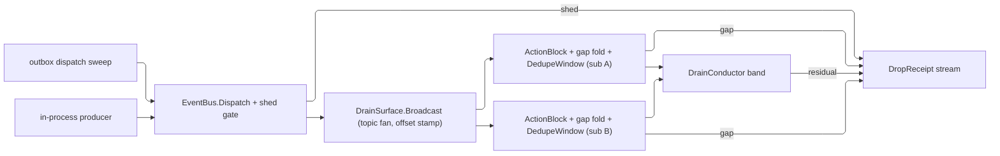

# [APPHOST_EVENT_BUS_TOPICS]

Rasm.AppHost runs one in-process event bus on the runtime spine: a `Topic` row stamps each `DomainEvent` with its topic's next dense `Offset` and fans it to bounded `ActionBlock` subscriptions, each subscription seated directly as a fan sink so one hop owns exactly one waiting room. This page owns the topic and subscription topology, the per-topic delivery ordinal, the gap-and-residual fold accounting every declined offer, the per-topic durability and shed columns, and the in-process delivery the outbox dispatch sweep feeds.

Composition takes `DrainSurface`/`DrainKind`/`DrainSpec`/`DrainQueue`/`DrainBand`/`FanMiss` from `Runtime/resources#DRAIN_QUEUES`, the `Runtime/resources#DEDUPE_WINDOW` `DedupeWindow`, `DeliveryFanout`/`DeliveryReceipt`, `OutboundSurface.Run`/`OutboundHop`, `HLC`/`EventLog`, `DegradationLevel`, `CancelScope`, `ClockPolicy`, and `ReceiptSinkPort` as settled vocabulary. `System.Threading.Tasks.Dataflow` resolves from the `net10.0` shared framework, so no manifest row and no package reference carry it, and this page mints no eighth port.

## [01]-[INDEX]

- [02]-[TOPIC_FABRIC]: `Topic` rows over a `DrainSurface.Broadcast` fan, the `DomainEvent` carrier, and the drop-receipt vocabulary.
- [03]-[SUBSCRIPTION_FABRIC]: Bounded `ActionBlock` subscriptions, the gap fold over dense offsets, and the composed dedupe window.
- [04]-[BUS_CONDUCTOR]: One conductor folding topics and subscriptions under the drain band, shedding by rank and closing tail loss at drain.

## [02]-[TOPIC_FABRIC]

- Owner: `DomainEvent` the topic-agnostic event carrier stamped with its topic's delivery ordinal; `Topic` `[SmartEnum<string>]` the topic axis under the `ComparerAccessors.StringOrdinal` accessor carrying its `DrainSpec`, its `TopicDurability`, and its shed threshold; `TopicDurability` `[SmartEnum<string>]` the two-row durability axis the outbox enqueue reads; `DropClass` `[SmartEnum<string>]` the two-row loss axis; `DropReceipt` the one loss evidence both classes mint; `TopicHead` the fan capsule carrying the topic's `Atom<ulong>` offer cursor; `BusFault` `[Union]` fault family in the 4730 band.
- Cases: topic rows are the declared event channels — `Command`, `Lifecycle`, `Health`, `Delivery`, and the two `Rasm.AppUi` `Collab/sync` channels, `Collab` carrying the durable document deltas and `Presence` the lossy presence and awareness frames — each binding its `DrainSpec` back-pressure row, its `TopicDurability` arm, and the `Option<DegradationLevel>` rank at which its delivery sheds; `TopicDurability` = durable | ephemeral; `DropClass` = shed | missed; `BusFault` = Text | TopicUnknown.
- Law: the HLC `(Physical, Logical)` pair and `Offset` are TWO facts rather than two spellings of one — HLC orders causally ACROSS topics and carries no density, while `Offset` counts deliveries WITHIN one topic and is dense by construction because `Publish` is its only stamper; a gap read off HLC `Logical` cannot separate a lost delivery from a concurrent producer's stamp, so delivery accounting reads `Offset` alone and causal replay reads the pair alone.
- Law: loss classes stay DISJOINT — `Shed` names what the degradation gate refused before the fan and rises with producer load, `Missed` names what a bounded sink declined at the fan and rises with consumer lag; one merged tally erases the only signal separating producer-hot from consumer-slow, so no receipt spans both and no consumer sums them.
- Entry: `Open(Topic topic, Seq<ITargetBlock<DomainEvent>> sinks, Action<FanMiss> missed, CancellationToken token)` returns `Fin<TopicHead>` — mints the topic's fan through `DrainSurface.Broadcast` over the subscription consumers already built, so the builder owns both the block and every link, and the drain owner refuses a fan-out row carrying no loss reporter; `Publish(TopicHead head, DomainEvent evt)` returns `IO<Unit>` — advances the head's cursor, stamps the ordinal onto the copy it hands the fan, and posts under the topic's bounded back-pressure so a fast producer awaits fullness rather than dropping.
- Auto: the topic fan is one `DrainSurface.Broadcast` builder over the `DrainKind.FanOut` row, so the block, its `LinkOptions` `PropagateCompletion`, and its `Tail.Completion` are the drain owner's, never a hand-rolled fan-out loop beside them; the clone delegate detaches the payload — `JsonElement.Clone()` copies the element out of its parent `JsonDocument` so a subscription holding a received event past the producer's document lifetime reads live bytes rather than a recycled buffer, the copy guard the identity delegate never gave; `Publish` advances the head's `Atom<ulong>` cursor and stamps the post-swap value onto the copy it hands out, so the sequence reaching every sink is dense and monotone per topic and the first published event carries one; the event also carries its HLC stamp so subscriptions replay causally by the `(Physical, Logical)` pair the `Runtime/determinism#EVENT_LOG` chain and the `ReceiptEnvelope` carry; `Publish` rides the topic's `DrainSpec` `BoundedCapacity` so a fast producer awaits on a `Wait` row rather than dropping — back-pressure is the bound at the HEAD alone, never unbounded accumulation and never a promise about what a bounded sink does with the head's offer; the topic row's `DrainBand` seats the fan under the conductor so a topic completes at its declared drain band on unload.
- Receipt: a published event is one `DomainEvent` on the fan; a declined offer accounts as one `Missed` `DropReceipt` naming the inclusive ordinal span, minted by the subscription's gap fold in flight and by the conductor's residual at drain through the topic's one `FanMiss` projection; per-subscription delivery rides the subscription's own `DeliveryReceipt`; no parallel topic receipt.
- Packages: Thinktecture.Runtime.Extensions, LanguageExt.Core, NodaTime, BCL inbox
- Growth: one topic is one `Topic` row binding its `DrainSpec`, durability arm, and shed threshold; a new event shape is one `DomainEvent` payload column; a third loss class earns a `DropClass` row only by naming a cause the two rows merge, never by naming a new site; zero new surface.
- Boundary: the topic fabric is the only in-process pub/sub owner — a per-topic background loop, a hand-rolled fan-out, and a second queue owner are the deleted forms; the fan is a `DrainSurface.Broadcast` builder over the one `DrainKind` union so the Dataflow `BroadcastBlock` reaches this page only through `Runtime/resources#DRAIN_QUEUES`, one Dataflow owner for the whole spine, and the producer reaches the intake through a total arm projection at the publish site rather than a raw block retained beside the queue; causal ordering is the HLC stamp the suite already carries so the bus and the command log order by one primitive, never a re-minted timeline, while `Offset` is delivery accounting alone and never crosses into ordering — gap detection over HLC `Logical` is the deleted form, because HLC logical is not dense per topic and a normal jump is then indistinguishable from a lost delivery; producer back-pressure is the fan's own `BoundedCapacity` — `Publish`'s `SendAsync` awaits when the bounded head is full — while the `BroadcastBlock` is latest-value to a slow target by construction, so the in-process leg is bounded best-effort fan-out and the AT-LEAST-ONCE guarantee is the durable `Wire/outbox#DISPATCH_SWEEP` leg (the outbox row + watermark + consumer dedup), never the in-process broadcast; a subscription whose bounded consumer declines the fan's offer therefore misses the in-process copy, and that miss is EVIDENCE rather than silence — the gap fold and the drain residual account it at both ends, so no declined delivery leaves the bus unrecorded on any topic; the outbox re-receive is the `TopicDurability.Durable` row's guarantee alone — an `Ephemeral` row is NEVER enqueued, so the outbox sweep reads the durability column rather than every topic, the receipt's `Resent` verdict derives from that one column, and a claim of per-topic loss classes expressed in no column is the deleted form; the `Rasm.AppUi` `Collab/sync` live-delta broadcast rides these topic rows as OPAQUE `DomainEvent.Payload` bytes — the session-ephemeral CRDT wire is the subscriber's to decode and never durable truth here — with the document deltas on the `Durable` `Collab` row riding the outbox leg and the `Ephemeral` `Presence` frames staying in-process, so an awareness frame a slow subscriber misses is receipted and final by design and a second bus for collaboration is the deleted form.

```csharp signature
public sealed record DomainEvent(
    string Topic,
    string IdempotencyKey,
    JsonElement Payload,
    DataClassification Classification,
    ulong Logical,
    Instant Physical,
    ulong Offset) {
    public static DomainEvent Of(Topic topic, string idempotencyKey, JsonElement payload, DataClassification classification, ulong logical, Instant physical) =>
        new(topic.Key, idempotencyKey, payload, classification, logical, physical, Offset: 0);

    // Clone() detaches the element onto its own storage, discharging the fan's copy guard: JsonElement over a
    // pooled JsonDocument stays valid only while that document lives, so a subscription outliving the
    // producer's parse reads a recycled buffer. An identity delegate hands every sink the same borrowed
    // window and proves no isolation at all.
    public static DomainEvent Detach(DomainEvent evt) => evt with { Payload = evt.Payload.Clone() };

    // Of stays a pure MINT and Publish the one stamper, because an ordinal is a property of ARRIVAL at one
    // topic's fan rather than of the event a caller composed: two producers building the same event never
    // agree on a number, and one fan handing out its own always does.
    public static DomainEvent Stamped(DomainEvent evt, ulong offset) => evt with { Offset = offset };
}

[SmartEnum<string>]
[KeyMemberEqualityComparer<ComparerAccessors.StringOrdinal, string>]
[KeyMemberComparer<ComparerAccessors.StringOrdinal, string>]
public sealed partial class TopicDurability {
    public static readonly TopicDurability Durable = new("durable");
    public static readonly TopicDurability Ephemeral = new("ephemeral");
}

// Two rows, two causes, never one tally. Shed counts dispatches the degradation gate refused ahead of the
// fan and tracks producer load; Missed counts offers a bounded sink declined at the fan and tracks consumer
// lag. Summing them yields a number no operator can act on.
[SmartEnum<string>]
[KeyMemberEqualityComparer<ComparerAccessors.StringOrdinal, string>]
[KeyMemberComparer<ComparerAccessors.StringOrdinal, string>]
public sealed partial class DropClass {
    public static readonly DropClass Shed = new("shed");
    public static readonly DropClass Missed = new("missed");
}

// Sheds is the degradation RANK at or above which this topic's delivery is dropped, and None is the arm a
// topic that never sheds takes — an absent threshold, never a sentinel rank a comparison would still admit.
// Command, lifecycle, health, delivery, and the durable collab deltas carry no threshold; presence is
// awareness traffic whose loss is already the design, so it sheds at the first reduced level.
[SmartEnum<string>]
[KeyMemberEqualityComparer<ComparerAccessors.StringOrdinal, string>]
[KeyMemberComparer<ComparerAccessors.StringOrdinal, string>]
public sealed partial class Topic {
    public static readonly Topic Command = new("command", DrainSpec.ReceiptFanOut, TopicDurability.Durable, None);
    public static readonly Topic Lifecycle = new("lifecycle", DrainSpec.ReceiptFanOut, TopicDurability.Durable, None);
    public static readonly Topic Health = new("health", DrainSpec.ReceiptFanOut, TopicDurability.Ephemeral, None);
    public static readonly Topic Delivery = new("delivery", DrainSpec.ReceiptFanOut, TopicDurability.Durable, None);
    public static readonly Topic Collab = new("collab", DrainSpec.ReceiptFanOut, TopicDurability.Durable, None);
    public static readonly Topic Presence = new("presence", DrainSpec.ReceiptFanOut, TopicDurability.Ephemeral, Some(DegradationLevel.ReducedRemote));

    public DrainSpec Spec { get; }

    public TopicDurability Durability { get; }

    public Option<DegradationLevel> Sheds { get; }
}

public sealed record DropReceipt(
    string Topic,
    Option<string> Subscription,
    DropClass Class,
    ulong First,
    ulong Last,
    ulong Count,
    bool Resent) {
    // Missed projects the drain owner's payload-agnostic FanMiss, so the span arrives already inclusive on
    // both ends and Count is its width. Shed carries no subscription at all, because the degradation gate
    // refused the dispatch before any fan offered it; its span pins the head cursor, which locates the
    // refusal inside the topic's own sequence rather than inventing an ordinal nothing stamped.
    public static DropReceipt Missed(Topic topic, FanMiss miss) =>
        new(topic.Key, Some(miss.Sink), DropClass.Missed, miss.First, miss.Last, miss.Last - miss.First + 1, Resends(topic));

    public static DropReceipt Shed(Topic topic, ulong cursor) =>
        new(topic.Key, None, DropClass.Shed, cursor, cursor, 1, Resends(topic));

    // Resent DERIVES from the durability column rather than sitting beside it: only a Durable topic reaches
    // an outbox sweep re-sending what the in-process leg lost, so a second column disagrees with its own
    // topic row eventually and makes one loss read two ways.
    static bool Resends(Topic topic) => topic.Durability == TopicDurability.Durable;
}

[Union]
public abstract partial record BusFault : Expected, IValidationError<BusFault> {
    private BusFault(string detail, int code) : base(detail, code, None) { }
    public static BusFault Create(string message) => new Text(message);
    public sealed record Text : BusFault { public Text(string detail) : base(detail, FaultBand.Bus.Code(0)) { } }
    public sealed record TopicUnknown : BusFault { public TopicUnknown(string detail) : base(detail, FaultBand.Bus.Code(1)) { } }
}

public sealed record TopicHead(Topic Topic, DrainQueue<DomainEvent> Fan, Atom<ulong> Cursor);

public static class TopicFabric {
    // Callers build every subscription consumer BEFORE the fan, so the builder owns every link: the head links
    // to each sink under the row's PropagateCompletion and exposes itself as intake and Tail, and a completed
    // head fans completion to every subscription without a second LinkTo at this call site.
    public static Fin<TopicHead> Open(Topic topic, Seq<ITargetBlock<DomainEvent>> sinks, Action<FanMiss> missed, CancellationToken token) =>
        topic.Spec.Broadcast(DomainEvent.Detach, sinks, Some(missed), token)
            .Map(fan => new TopicHead(topic, fan, Atom(0UL)));

    // Ordinal burns on the offering arm alone, so a topology mismatch never punches a hole in the sequence the
    // gap fold reads as loss; Swap returns the POST-swap value, so the first published event carries one and
    // zero stays the empty seat a subscription opens on rather than a delivered offer.
    public static IO<Unit> Publish(TopicHead head, DomainEvent evt) =>
        head.Fan.Switch(
            state: (Head: head, Event: evt),
            pipe: static (_, p) => IO.fail<Unit>(new DrainFault.TopologyMismatch(p.Spec.Name, DrainKind.FanOut.Key)),
            network: static (s, n) => IO.liftAsync(async () => {
                await n.Intake.SendAsync(DomainEvent.Stamped(s.Event, s.Head.Cursor.Swap(static held => held + 1))).ConfigureAwait(false);
                return unit;
            }));
}
```

Every row orders on the HLC `(Physical, Logical)` pair, counts deliveries on its own dense `Offset`, and bounds on its `DrainSpec` `BoundedCapacity`, so those three coordinates carry no per-row signal and stay out of the table; guarantee and give-up clause are where these rows genuinely diverge.

| [INDEX] | [TOPIC]     | [DELIVER]                     | [DEGRADE]                                                   |
| :-----: | :---------- | :---------------------------- | :---------------------------------------------------------- |
|  [01]   | `Command`   | at-least-once via the outbox  | a declined offer receipts `Missed`; the sweep resends       |
|  [02]   | `Lifecycle` | at-least-once via the outbox  | a declined offer receipts `Missed`; the sweep resends       |
|  [03]   | `Health`    | best-effort, never enqueued   | a declined offer receipts `Missed`; nothing resends         |
|  [04]   | `Delivery`  | at-least-once via the outbox  | a declined offer receipts `Missed`; the sweep resends       |
|  [05]   | `Collab`    | at-least-once via the outbox  | opaque payload; a miss receipts `Missed`, the sweep resends |
|  [06]   | `Presence`  | best-effort, sheds on reduced | `Shed` at reduced, `Missed` at the fan; neither resends     |

## [03]-[SUBSCRIPTION_FABRIC]

- Owner: `Subscription` the subscriber capsule over ONE bounded `ActionBlock` seated as a fan sink, carrying its `Atom<Received>` offset seat; `Received` the transition record that seat swaps through; `SubscriptionFabric` the static open-and-link surface over the `DrainSurface` builders.
- Law: each hop owns exactly one waiting room — the `ActionBlock`'s own `BoundedCapacity` IS the subscription's back-pressure, and a second bounded block in front of it splits one hop's pressure evidence across two policies while making the fan's decline no more observable than before.
- Law: the gap fold is CONSERVATION, never interception — an arriving `Offset` more than one past the seat proves every ordinal between them reached the fan and was refused, which is the only account available because a `BroadcastBlock` overwrites per target and reports no decline to its source.
- Entry: `Open(Topic topic, DrainSpec spec, Func<DomainEvent, IO<Unit>> consume, Action<FanMiss> missed, DedupeWindow dedupe, ClockPolicy clocks, CancellationToken token)` returns `Subscription` — mints the bounded `ActionBlock`, folds each arriving offset into the seat before the dedupe window decides, and hands the block to `TopicFabric.Open` as one of the fan's sinks, so the subscription exists before the topic it drains.
- Auto: each subscription is a bounded `ActionBlock<DomainEvent>` the topic fan links under `PropagateCompletion` so a topic completion fans completion to every subscription, and the block's `BoundedCapacity` is the subscription's back-pressure so a slow consumer pressures the fan rather than buffering unbounded; the block drains at the subscription's `MaxDegree` so an ordered subscription processes one event at a time and a parallel subscription fans across degrees, which is why the seat advances monotonically and only a FORWARD jump mints a span; the seat rides one compare-and-swap so two fan deliveries racing one subscription never both claim one span; the dedupe is the `Runtime/resources#DEDUPE_WINDOW` `DedupeWindow` value the composition hands in — `Admit(key, clocks.Now)` prunes, decides, and records inside one compare-and-swap, so a re-published identical event inside the window folds to a no-op before the consumer runs and two fans racing one key admit exactly one; the instant is the threaded `ClockPolicy`'s, so a fake-clock spec expires the window deterministically.
- Receipt: each consumed event mints one `DeliveryReceipt` (the `DeliveryFanout` receipt shape) carrying the subscription key and the dedupe verdict; each forward jump in the arriving `Offset` mints one `FanMiss` the topic's projection turns into a `Missed` `DropReceipt`; no parallel subscription receipt.
- Packages: Thinktecture.Runtime.Extensions, LanguageExt.Core, NodaTime, BCL inbox
- Growth: one subscription is one `Open` call over a topic row; a new back-pressure class is one `DrainSpec` row at the drain owner; zero new surface.
- Boundary: the subscription is a `DrainSurface` builder over the one `DrainKind` union — a per-subscription background loop and a second queue owner are the deleted forms; a bounded `BufferBlock` in front of the consumer is deleted twice over, since `docs/stacks/csharp/domain/concurrency.md` `[BLOCK_ADMISSION]` rejects that block outright and it buys nothing anyway — a bounded `BufferBlock` declines the fan's offer exactly as silently as the bounded `ActionBlock` does, so it adds a waiting room and no evidence; a hand-written receipting `ITargetBlock<DomainEvent>` intercepting each offer is likewise deleted, because it re-implements the `consumeToAccept`, `ConsumeMessage`, and postponement protocol the drain owner deliberately declines to own, against an admission rail that admits blocks on four named capabilities and never on a hand-written target; the bound is the loss boundary the at-least-once outbox leg closes for a `Durable` row and the receipted, final loss for an `Ephemeral` one, never unbounded accumulation; the dedupe composes the ONE `DedupeWindow` primitive the delivery fan-out also composes, so the bus dedupe and the notification dedupe are one owner and one window-bound — a local seen-key map beside it is the deleted form; replay ordering is the HLC pair and delivery accounting is the `Offset` seat, two facts one hop apart that never collapse into one column; a correlated join or dual-stream coalesce over two event streams reaches `DrainSurface.Join`/`DrainSurface.Coalesce` at the drain owner directly, so a renaming forward on this page is the deleted form; the durable relay to a persistent subscriber rides the `OutboundHop` so the bus rides the one retry owner, and the outbox dispatch sweep feeds the topics over the `ONE_OUTBOX_EGRESS_SPINE` op-log (`Wire/outbox#OUTBOX_FABRIC`) so the durable leg of delivery feeds the in-process bus, never a second egress table.

```csharp signature
public sealed record Subscription(
    string Key,
    DrainQueue<DomainEvent> Queue,
    ActionBlock<DomainEvent> Consumer,
    Atom<Received> Seat);

// Verdict rides the TRANSITION rather than a read-then-write pair, the shape DedupeWindow.Admit already
// takes: one compare-and-swap advances the seat, widens the tally, and carries the span its caller receipts,
// so two fan offers racing one subscription never both claim one span. Seat advances monotonically because a
// parallel subscription's degrees deliver out of order, so only a FORWARD jump mints a span.
public readonly record struct Received(ulong Last, ulong Missed, Option<(ulong First, ulong Last)> Gap) {
    public static readonly Received Empty = new(Last: 0, Missed: 0, Gap: None);

    public Received Seated(ulong arrived) =>
        arrived > Last + 1
            ? new(arrived, Missed + arrived - Last - 1, Some((Last + 1, arrived - 1)))
            : new(ulong.Max(arrived, Last), Missed, None);
}

public static class SubscriptionFabric {
    // ONE waiting room per hop: the ActionBlock IS the fan's sink, so its own BoundedCapacity carries the whole
    // back-pressure and its own decline is the loss the seat accounts. Nothing here intercepts the offer,
    // because the broadcast head reports no decline to the source it fans from.
    public static Subscription Open(
        Topic topic, DrainSpec spec, Func<DomainEvent, IO<Unit>> consume, Action<FanMiss> missed,
        DedupeWindow dedupe, ClockPolicy clocks, CancellationToken token) {
        var key = $"{topic.Key}:{spec.Name}";
        var seat = Atom(Received.Empty);
        var consumer = new ActionBlock<DomainEvent>(
            async evt => {
                seat.Swap(held => held.Seated(evt.Offset)).Gap.Iter(gap => missed(new FanMiss(topic.Spec.Name, key, gap.First, gap.Last)));
                if (dedupe.Admit(evt.IdempotencyKey, clocks.Now)) { await consume(evt).RunAsync().ConfigureAwait(false); }
            },
            spec.NetworkOptions(token));
        return new Subscription(key, spec.Open<DomainEvent>(consumer, consumer), consumer, seat);
    }
}
```

## [04]-[BUS_CONDUCTOR]

- Owner: `EventBus` the static conductor folding topics and their subscriptions into one bus, draining them under the `Runtime/lifecycle#DRAIN_CONDUCTOR` band and closing tail loss at that drain.
- Law: mounting is a `Fin` fold — the drain owner refuses a fan-out row opened with no loss reporter, so a bus whose composition supplies no receipt sink never mounts rather than running unaccounted.
- Entry: `Mount(EventBus.Runtime runtime, params ReadOnlySpan<(Topic Topic, Seq<(DrainSpec Spec, Func<DomainEvent, IO<Unit>> Consume)> Subscribers)> rows)` returns `Fin<EventBus.Cell>` — opens every subscriber, then the topic fan over their consumers, and registers the bus drain rows at the topics' declared bands; `Dispatch(EventBus.Cell cell, DomainEvent evt)` returns `IO<Unit>` — publishes an event to its topic fan under the live degradation gate, the one entry the outbox dispatch sweep and the in-process producers both invoke.
- Auto: the conductor opens each topic's subscribers first and its fan second so the topology is one builder call at mount, never per-publish and never a second link pass; each topic row mints ONE `FanMiss` projection threaded to the gap fold, the tail residual, and the drain owner's admission, so the loss class and the durability verdict fix once per topic; the bus registers its drain rows at the topics' `DrainBand` so on unload the conductor completes each topic fan, fans completion to every subscription through `PropagateCompletion`, and awaits the consumers' `Completion` at the drain band so an in-flight event drains before the band closes; after those completions the conductor compares the head's final cursor against each subscription's seat and mints the residual `Missed` receipt, which is the only account of a subscription that missed the LAST deliveries and therefore never sees a later ordinal; `Dispatch` routes an event to its topic by key so a producer and the outbox sweep both publish through one entry, and it reads the live `DegradationLevel` against the topic's own `Sheds` rank so a reduced host drops awareness traffic and keeps every unthresholded channel, the existing degradation rail rather than a parallel throttle.
- Receipt: the bus drain folds into the `DrainReceipt` the conductor mints; per-event delivery rides the subscriptions' `DeliveryReceipt`s; a shed dispatch is a receipted no-op minting one `Shed` `DropReceipt` rather than a fault; the drain residual mints the closing `Missed` receipts onto the same `ReceiptSinkPort` seat the in-flight gaps feed.
- Packages: LanguageExt.Core, NodaTime, BCL inbox
- Growth: one topic-plus-subscribers row absorbs a new event channel; a new producer drives the one `Dispatch`; zero new surface.
- Boundary: the bus conductor is the only multi-topic bus owner — a per-topic conductor, a parallel drain, and a second bus owner are the deleted forms; the bus drains under the one `DrainConductor` band so the bus completion and the runtime drain are one fold, never a bus-specific shutdown; loss accounting closes at exactly two ends — a gap in flight and a residual at drain — so an interception layer between them is the deleted form and every declined offer lands on one of the two; the two `DropClass` rows never merge into one tally, so a bus-wide drop counter is the deleted form; the bus dispatch is the one entry the outbox dispatch sweep feeds and the in-process producers invoke so the durable and in-process delivery legs meet at one bus, never two; shedding is a per-topic rank comparison against the live level, so a `Suspended` host sheds exactly the topics whose rows declare a threshold and a blanket dispatch gate is the deleted form; the relay to a durable subscriber rides the `OutboundHop` over `OutboundSurface.Run` so the bus rides the one retry owner and the `DeliveryFanout` folds in as one subscriber rather than a parallel sender.

```csharp signature
public static class EventBus {
    public sealed record Runtime(
        DeliveryRuntime Delivery,
        Func<DegradationLevel> Level,
        Action<DropReceipt> Drops,
        Func<DrainBand, int, string, Func<CancellationToken, IO<Unit>>, Unit> Register,
        ClockPolicy Clocks,
        CancelScope Spine);

    public sealed record Cell(
        HashMap<string, TopicHead> Heads,
        Seq<Subscription> Subscriptions,
        Func<DegradationLevel> Level,
        Action<DropReceipt> Drops);

    public static Fin<Cell> Mount(Runtime runtime, params ReadOnlySpan<(Topic Topic, Seq<(DrainSpec Spec, Func<DomainEvent, IO<Unit>> Consume)> Subscribers)> rows) =>
        toSeq(rows.ToArray()).Fold(
            Fin.Succ(new Cell(HashMap<string, TopicHead>.Empty, Seq<Subscription>(), runtime.Level, runtime.Drops)),
            (acc, row) => acc.Bind(cell => Mounted(runtime, cell, row)));

    static Fin<Cell> Mounted(Runtime runtime, Cell cell, (Topic Topic, Seq<(DrainSpec Spec, Func<DomainEvent, IO<Unit>> Consume)> Subscribers) row) {
        var missed = Missed(runtime.Drops, row.Topic);
        var subs = row.Subscribers.Map(sub => SubscriptionFabric.Open(
            row.Topic, sub.Spec, sub.Consume, missed, runtime.Delivery.Dedupe, runtime.Clocks, runtime.Spine.Token));
        return TopicFabric.Open(row.Topic, subs.Map(static s => (ITargetBlock<DomainEvent>)s.Consumer), missed, runtime.Spine.Token)
            .Map(head => {
                ignore(runtime.Register(row.Topic.Spec.Band, 0, $"bus:{row.Topic.Key}", _ => Drain(head, subs, missed)));
                return cell with { Heads = cell.Heads.Add(row.Topic.Key, head), Subscriptions = cell.Subscriptions + subs };
            });
    }

    // ONE projection per topic row, minted before either the subscriptions or the fan exist and threaded to all
    // three seats that report: gap fold, tail residual, and the drain owner's admission. Class and durability
    // fix here, so nothing downstream re-decides which loss class a fan miss belongs to.
    static Action<FanMiss> Missed(Action<DropReceipt> drops, Topic topic) =>
        miss => drops(DropReceipt.Missed(topic, miss));

    // Shedding returns unit rather than a fault: the level ruled the drop, so the producer is not in error and
    // has nothing to retry. Receipt mints anyway on its own class, because producer-side shed and consumer-side
    // miss diverge in cause and one merged tally erases the only signal separating them.
    public static IO<Unit> Dispatch(Cell cell, DomainEvent evt) =>
        cell.Heads.Find(evt.Topic).Match(
            Some: head => Shed(head.Topic, cell.Level())
                ? IO.lift(() => fun(cell.Drops)(DropReceipt.Shed(head.Topic, head.Cursor.Value)))
                : TopicFabric.Publish(head, evt),
            None: () => IO.fail<Unit>(new BusFault.TopicUnknown(evt.Topic)));

    static bool Shed(Topic topic, DegradationLevel level) =>
        topic.Sheds.Match(Some: threshold => level.Rank >= threshold.Rank, None: static () => false);

    static IO<Unit> Drain(TopicHead head, Seq<Subscription> subs, Action<FanMiss> missed) =>
        IO.liftAsync(async () => {
            await head.Fan.Drained(CancellationToken.None).ConfigureAwait(false);
            await Task.WhenAll(subs.Map(static s => s.Consumer.Completion).ToArray()).ConfigureAwait(false);
            return subs.Fold(unit, (_, sub) => Residual(head, sub, missed));
        });

    // Tail loss closes HERE and nowhere else: a subscription that missed the final offers never sees a later
    // ordinal, so the gap fold alone stays blind to them. Cursor reads AFTER every consumer completed, so the
    // head's ordinal is final and its distance from the seat is exactly what never arrived.
    static Unit Residual(TopicHead head, Subscription sub, Action<FanMiss> missed) =>
        (head.Cursor.Value, sub.Seat.Value.Last) switch {
            var (final, seated) when final > seated => fun(missed)(new FanMiss(head.Topic.Spec.Name, sub.Key, seated + 1, final)),
            _ => unit,
        };
}
```


```mermaid
---
config:
  layout: elk
  flowchart:
    curve: linear
    padding: 25
---
flowchart LR
    accTitle: One topic fan, one waiting room per subscription, loss receipted at both ends
    accDescr: A DomainEvent enters EventBus.Dispatch from the outbox dispatch sweep or an in-process producer; the degradation shed gate either mints a Shed drop receipt or hands the event to the topic fan, which stamps the topic's next dense offset through the drain-surface broadcast builder; each subscription is one bounded ActionBlock seated directly as a fan sink, folding the arriving offset into its seat and minting a Missed drop receipt for any gap before the composed dedupe window admits the event; the bus drains under the runtime conductor, which compares the head cursor against each seat and mints the residual Missed receipt for tail loss.
    Sweep["outbox dispatch sweep"] --> Dispatch
    Producer["in-process producer"] --> Dispatch
    Dispatch["EventBus.Dispatch + shed gate"] --> Fan["DrainSurface.Broadcast (topic fan, offset stamp)"]
    Dispatch -- shed --> Drops["DropReceipt stream"]
    Fan --> Act1["ActionBlock + gap fold + DedupeWindow (sub A)"]
    Fan --> Act2["ActionBlock + gap fold + DedupeWindow (sub B)"]
    Act1 -- gap --> Drops
    Act2 -- gap --> Drops
    Act1 --> Drain["DrainConductor band"]
    Act2 --> Drain
    Drain -- residual --> Drops
```

## [05]-[RESEARCH]

(none)
