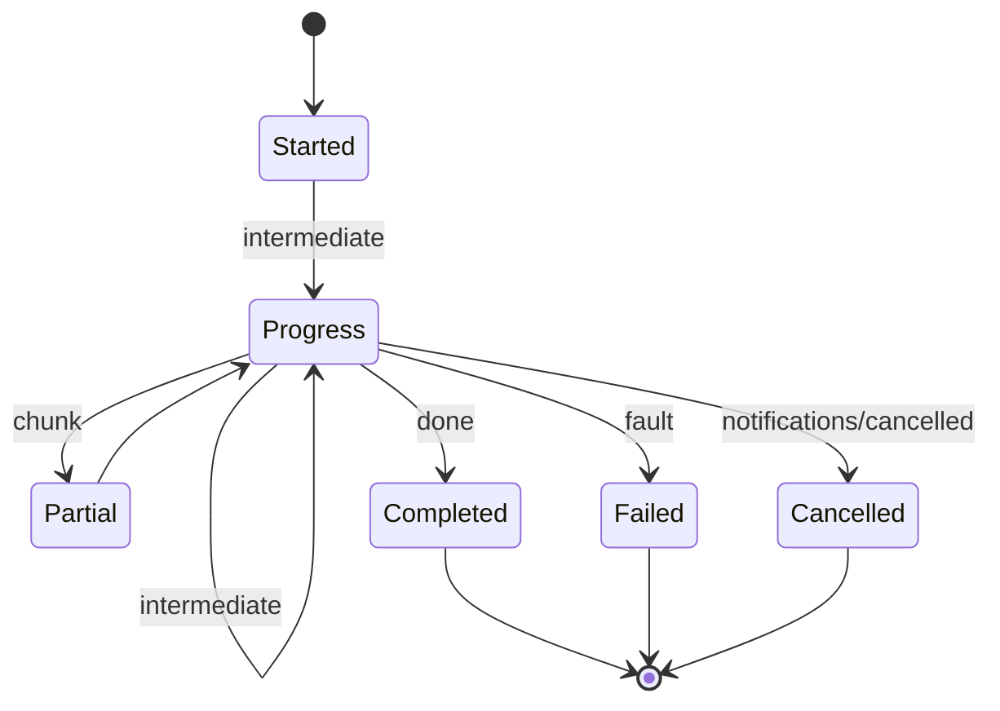

# [APPHOST_MCP_PROJECTION]

The Model Context Protocol serving surface for the runtime spine: the official `ModelContextProtocol` SDK owns the protocol — JSON-RPC framing, transport, the initialize handshake, error-code mapping, and SSE-resumable long-running requests — and this page projects the capability registry onto the SDK's tool/resource/prompt surface. Each `CapabilityDescriptor` projects to one `Microsoft.Extensions.AI` `AIFunction` that `McpServerTool.Create` adopts, so one descriptor source drives the MCP tool surface, in-process `IChatClient` function-calling, and the SDK codegen. A brokered dry-run prices any tool call before invocation, dispatch routes through the command algebra, server-initiated sampling rides `IChatClient`, elicitation gathers structured input mid-call, and the SDK's task primitives carry a long-running call with status/poll/result and cancellation over the cancel spine. The page owns the method axis, the descriptor-to-`AIFunction` tool projection, the brokered dispatch, the sampling and elicitation legs, and the agent-session roster; it consumes `CapabilityRegistry`/`DiscoveryQuery`, `CommandAlgebra`/`GrantBroker`, `ControlInbound.DispatchTool`, `CancelScope`, `TenantContext`, and `ReceiptSinkPort` as settled vocabulary and mints no eighth port.

## [1]-[INDEX]

| [INDEX] | [CLUSTER]       | [OWNS]                                                                       |
| :-----: | :-------------- | :--------------------------------------------------------------------------- |
|   [1]   | METHOD_AXIS     | MCP method vocabulary; tool/resource/prompt projection from the registry     |
|   [2]   | TOOL_DISPATCH   | Dry-run cost preview, brokered dispatch, structured tool result              |
|   [3]   | STREAM_PROGRESS | Server-stream progress fan, cancellation, backpressure, resumable handles    |
|   [4]   | TS_PROJECTION   | MCP tool-catalog and progress-frame wire shapes the agent transport consumes |

## [2]-[METHOD_AXIS]

- Owner: `McpMethod` `[SmartEnum<string>]` the MCP method vocabulary under the `CapabilityKeyPolicy` accessor; `ToolProjection` the descriptor-to-tool fold; `McpTool` the projected tool descriptor; `McpResource` the projected resource handle; `McpPrompt` the projected prompt template.
- Cases: 8 method rows — initialize, tools-list, tools-call, resources-list, resources-read, prompts-list, prompts-get, ping — the closed MCP request surface; tool/resource/prompt projections fold the registry's `DiscoveryResult` rows.
- Entry: `Project(CapabilityRegistry registry, DegradationLevel level, Func<DiscoveryResult, JsonNode> schemaOf, JsonNode receiptSchema)` returns `McpCatalog` — one fold projects the level-gated discovery result into the MCP tool catalog (each tool carrying its descriptor input schema and the uniform `CommandReceipt` output schema), so an agent sees exactly the tools the host can serve at its current degradation; `Tool(DiscoveryResult descriptor, JsonNode inputSchema, JsonNode outputSchema)` is the single descriptor-to-tool projection.
- Auto: each `DiscoveryResult` projects to one `Microsoft.Extensions.AI.AIFunction` (the `AIFunction : AIFunctionDeclaration : AITool` chain, where `JsonSchema` is a `JsonElement` on `AIFunctionDeclaration` and `Name`/`Description` are virtuals on `AITool`) whose overridden `JsonSchema` is the `JsonSchemaExporter` schema the descriptor's `CommandArguments` resolves through `SuiteContracts.Schema`, so the SDK's `inputSchema` derives from the same schema the codegen and command binder read, never a hand-authored JSON Schema and never the SDK's reflected delegate-parameter schema; the projection adopts a `CommandAIFunction : AIFunction` subclass that closes the host-injected `TenantContext`/`CorrelationId` over the brokered invoker (so only `payload` is the agent-facing input) and overrides `JsonSchema` to the descriptor schema, and `McpServerTool.Create(AIFunction, McpServerToolCreateOptions)` adopts it, with the projection setting the `McpServerToolCreateOptions` annotations from the descriptor's `EffectClass` (`pure`/`read` set `ReadOnly`, `write`/`external`/`irreversible` set `Destructive`) and `Idempotency` so an agent reads the side-effect class from the SDK's tool metadata; the `Destructive` knob is `bool?` and the SDK treats unset/`true` as destructive, meaningful only when `ReadOnly=false`, so the projection always sets both explicitly with `ReadOnly` forcing `Destructive=false`, never inheriting the destructive default on an unset path; `Permitting` gating means a degraded host registers only the still-servable tools with zero parallel catalog.
- Receipt: the projection is a pure fold producing the registered `McpServerTool` set; the served-method transition logs through one `SpineLog` event in the 1000-1999 band — no parallel projection receipt.
- Packages: ModelContextProtocol, ModelContextProtocol.Core, Microsoft.Extensions.AI.Abstractions, Thinktecture.Runtime.Extensions, LanguageExt.Core, BCL inbox
- Growth: a new method row tracks a new MCP request kind the SDK already serves; a new projection target (tool, resource, prompt) is one fold arm; zero new surface — the agent transport is the registry projected onto the SDK, never a parallel command catalog.
- Boundary: the MCP projection is a read-only view of the capability registry — an MCP-specific tool definition divorced from a `CapabilityDescriptor` is the deleted form, so every advertised tool is a real registry descriptor adopted as an `AIFunction` and every tool call routes through the command algebra; the JSON-RPC framing, the initialize handshake, and the method dispatch belong to the SDK — a hand-rolled JSON-RPC dispatcher is the deleted form, so `McpMethod` is the closed vocabulary the projection reads to gate per-method behavior, never a transport re-implementation; a host-specific verb rides the `ControlService` `DispatchTool` route instead, never a tenth MCP method; resource and prompt projections read the same descriptor rows filtered by effect class — a `read` descriptor projects as both a tool and a resource, a `pure` template-shaped descriptor projects as a prompt — so one descriptor source serves all three MCP surfaces; tool names are the descriptor ids verbatim so the SDK's `tools/call` resolves through `CapabilityRegistry.Resolve` with no name translation; the page-local `McpTool`/`McpResource`/`McpPrompt` records are the projected descriptors and `ToolProjection.Adopt` is the only seam that reaches the SDK serving type — the `CommandAIFunction : AIFunction` subclass wraps the brokered invoker with the descriptor schema and `McpServerTool.Create` adopts it with the descriptor-derived `McpServerToolCreateOptions`, so the SDK adoption is fenced at one site and never re-derived per registration.

```csharp signature
[SmartEnum<string>]
[KeyMemberEqualityComparer<CapabilityKeyPolicy, string>]
[KeyMemberComparer<CapabilityKeyPolicy, string>]
public sealed partial class McpMethod {
    public static readonly McpMethod Initialize = new("initialize");
    public static readonly McpMethod ToolsList = new("tools/list");
    public static readonly McpMethod ToolsCall = new("tools/call");
    public static readonly McpMethod ResourcesList = new("resources/list");
    public static readonly McpMethod ResourcesRead = new("resources/read");
    public static readonly McpMethod PromptsList = new("prompts/list");
    public static readonly McpMethod PromptsGet = new("prompts/get");
    public static readonly McpMethod Ping = new("ping");
}

public sealed record McpTool(
    string Name,
    string Title,
    JsonNode InputSchema,
    JsonNode OutputSchema,
    bool ReadOnly,
    bool Destructive,
    bool Idempotent,
    CostVector EstimatedCost);

public sealed record McpResource(string Uri, string Name, string Surface);

public sealed record McpPrompt(string Name, JsonNode ArgumentsSchema);

public sealed record McpCatalog(
    Seq<McpTool> Tools,
    Seq<McpResource> Resources,
    Seq<McpPrompt> Prompts) {
    public static readonly McpCatalog Empty = new([], [], []);
}

public static class ToolProjection {
    public static McpTool Tool(DiscoveryResult descriptor, JsonNode inputSchema, JsonNode outputSchema) =>
        new(
            Name: descriptor.Descriptor,
            Title: descriptor.Surface,
            InputSchema: inputSchema,
            OutputSchema: outputSchema,
            ReadOnly: descriptor.Effect is "pure" or "read",
            Destructive: descriptor.Effect is "write" or "external" or "irreversible",
            Idempotent: descriptor.Idempotency is "idempotent" or "keyed",
            EstimatedCost: descriptor.Estimated);

    public static McpCatalog Project(CapabilityRegistry registry, DegradationLevel level, Func<DiscoveryResult, JsonNode> schemaOf, JsonNode receiptSchema) =>
        registry.Discover(new DiscoveryQuery.Permitting(level)) is var rows
            ? new McpCatalog(
                Tools: rows.Map(row => Tool(row, schemaOf(row), receiptSchema)),
                Resources: rows.Filter(static row => row.Effect is "pure" or "read").Map(static row => new McpResource($"rasm://{row.Surface}/{row.Descriptor}", row.Descriptor, row.Surface)),
                Prompts: rows.Filter(static row => row.Effect is "pure").Map(row => new McpPrompt(row.Descriptor, schemaOf(row))))
            : McpCatalog.Empty;

    public static McpServerTool Adopt(McpRuntime runtime, McpTool tool, TenantContext tenant, CorrelationId correlation, JsonSerializerOptions wire) =>
        McpServerTool.Create(
            new CommandAIFunction(runtime, tool, tenant, correlation, wire),
            new McpServerToolCreateOptions {
                Name = tool.Name,
                Title = tool.Title,
                ReadOnly = tool.ReadOnly,
                Destructive = tool.Destructive,
                Idempotent = tool.Idempotent,
                UseStructuredContent = true,
                OutputSchema = JsonSerializer.SerializeToElement(tool.OutputSchema, wire),
                SerializerOptions = wire,
            });
}

public sealed class CommandAIFunction(McpRuntime runtime, McpTool tool, TenantContext tenant, CorrelationId correlation, JsonSerializerOptions wire) : AIFunction {
    public override string Name => tool.Name;
    public override string Description => tool.Title;
    public override JsonElement JsonSchema { get; } = JsonSerializer.SerializeToElement(tool.InputSchema, wire);

    protected override async ValueTask<object?> InvokeCoreAsync(AIFunctionArguments arguments, CancellationToken cancellationToken) =>
        await McpDispatch.Call(runtime, tool.Name, new CommandArguments((JsonElement)arguments["payload"]!, tenant, correlation))
            .RunAsync(EnvIO.New(token: cancellationToken));
}
```

## [3]-[TOOL_DISPATCH]

- Owner: `McpFault` `[Union]` fault family in the 4640 band (the JSON-RPC error-code band the MCP transport maps); `CostPreview` the dry-run pricing record; `ToolResult` the structured tool-call result; `McpDispatch` the static brokered-dispatch surface.
- Cases: `McpFault` = Text | UnknownTool | InvalidArguments | CostRejected | Cancelled — each mapping to a JSON-RPC error code at the transport edge.
- Entry: `Preview(McpRuntime runtime, string tool, CommandArguments arguments)` returns `IO<CostPreview>` — the dry-run cost preview prices the tool call through `GrantBroker.Admit(dryRun: true)` and returns the estimated cost and whether the standing grant covers it, before any execution; `Call(McpRuntime runtime, string tool, CommandArguments arguments)` returns `IO<ToolResult>` — the brokered dispatch routes the tool call through `CommandAlgebra.Run` and projects the `CommandReceipt` onto the MCP structured result.
- Auto: the preview reuses the broker's admission fold so the previewed price is the exact price the live call charges, never an estimate that drifts from the charge — surfaced to the agent through the SDK's elicitation leg when a call exceeds the standing grant; the dispatch routes through `ControlInbound.DispatchTool` so an agent call on a companion lands through the same audit-and-redaction seam an operator tool call lands through; a `CommandTxn.Refused` projects to the matching `McpFault` whose 4640-band code the SDK maps onto its JSON-RPC `-32xxx` error frame so a denied tool call returns a protocol error, never a thrown exception; `McpFault`, `CommandFault`, and `GrantFault` omit the `ConversionFromValue = ConversionOperatorsGeneration.None` knob that `ProgressFrame`/`DiscoveryQuery` carry — a fault union's only ingress is its coded constructors plus the `Expected` base and the `Create` factory, so no bare-payload conversion hole exists to seal and the knob stays absent on every fault union.
- Receipt: `ToolResult` carries the structured content blocks and the `isError` flag the SDK emits as `CallToolResult`, plus the `CommandReceipt` correlation id so the agent result correlates with the host evidence stream.
- Packages: ModelContextProtocol.Core, Microsoft.Extensions.AI.Abstractions, LanguageExt.Core, NodaTime, Thinktecture.Runtime.Extensions, BCL inbox
- Growth: one fault case is one `McpFault` row the SDK maps to a JSON-RPC code; a new content-block kind is one column on `ToolResult`; zero new surface.
- Boundary: the tool dispatch is the only MCP execution owner — it never executes an op itself, it routes through the command algebra, so the transaction, grant, and cost semantics are the command algebra's and the MCP layer is the protocol projection over the SDK; the dry-run preview is backed by the broker's simulate fold and projected through SDK elicitation, so the preview and the charge share one pricing source; cancellation maps the SDK's `notifications/cancelled` onto the `CancelScope` the call derived, so an agent cancel propagates through the same cancel spine a drain or deadline propagates through, never a parallel cancellation flag; the `isError` result and the JSON-RPC error are distinct — a tool that runs and reports a domain failure returns `isError: true` content while a tool that cannot run returns a JSON-RPC `McpFault`, so the agent distinguishes a failed execution from a refused dispatch; the `McpRuntime.Wire` `JsonSerializerOptions` is the single converter-owner handle threaded from the composition edge into the runtime record — the `PROTOCOL_EDGE`/`CONVERTER_OWNER` law admits it only as that one handle the dispatch reads when it projects a `CommandReceipt` onto a structured result, never a codec surface the interior transforms re-derive or a second serializer beside the generated Thinktecture and NodaTime converters.

```csharp signature
[Union]
public abstract partial record McpFault : Expected, IValidationError<McpFault> {
    private McpFault(string detail, int code) : base(detail, code, None) { }
    public static McpFault Create(string message) => new Text(message);
    public sealed record Text : McpFault { public Text(string detail) : base(detail, 4640) { } }
    public sealed record UnknownTool : McpFault { public UnknownTool(string detail) : base(detail, 4641) { } }
    public sealed record InvalidArguments : McpFault { public InvalidArguments(string detail) : base(detail, 4642) { } }
    public sealed record CostRejected : McpFault { public CostRejected(string detail) : base(detail, 4643) { } }
    public sealed record Cancelled : McpFault { public Cancelled(string detail) : base(detail, 4644) { } }
}

public sealed record CostPreview(
    string Tool,
    CostVector Estimated,
    bool Covered,
    Option<string> ShortfallUnit);

public sealed record ToolResult(
    string Tool,
    Seq<JsonNode> Content,
    bool IsError,
    CorrelationId Correlation);

public sealed record McpRuntime(
    CapabilityRegistry Registry,
    CommandRuntime Command,
    GrantBroker Broker,
    Func<DegradationLevel> Level,
    Func<DiscoveryResult, JsonNode> SchemaOf,
    ClockPolicy Clocks,
    ReceiptSinkPort Sink,
    JsonSerializerOptions Wire);

public static class McpDispatch {
    public static IO<CostPreview> Preview(McpRuntime runtime, string tool, CommandArguments arguments) =>
        runtime.Registry.Resolve(tool).Match(
            Some: descriptor => IO.pure(runtime.Broker.Admit(descriptor, arguments, dryRun: true).Match(
                Succ: cost => new CostPreview(tool, cost, Covered: true, None),
                Fail: fault => new CostPreview(tool, descriptor.Cost.Estimate(arguments), Covered: false, Optional((fault as GrantFault.CeilingExceeded)?.Unit)))),
            None: () => IO.pure(new CostPreview(tool, CostVector.Zero, Covered: false, Some("unknown-tool"))));

    public static IO<ToolResult> Call(McpRuntime runtime, string tool, CommandArguments arguments) =>
        runtime.Registry.Resolve(tool).IsSome
            ? CommandAlgebra.Run(runtime.Command, tool, arguments).Map(receipt => Project(tool, receipt))
            : IO.pure(new ToolResult(tool, [JsonValue.Create(new McpFault.UnknownTool(tool).Message)!], IsError: true, arguments.Correlation));

    static ToolResult Project(string tool, CommandReceipt receipt) =>
        receipt.Txn switch {
            CommandTxn.Committed => new ToolResult(tool, [JsonSerializer.SerializeToNode(receipt.Dispatch)!], IsError: false, receipt.Correlation),
            CommandTxn.Compensated c => new ToolResult(tool, [JsonValue.Create($"compensated:{c.Compensation}")!], IsError: true, receipt.Correlation),
            CommandTxn.RolledBack r => new ToolResult(tool, [JsonValue.Create(r.Reason)!], IsError: true, receipt.Correlation),
            CommandTxn.Refused f => new ToolResult(tool, [JsonValue.Create(f.Fault.Message)!], IsError: true, receipt.Correlation),
            _ => new ToolResult(tool, [], IsError: true, receipt.Correlation),
        };
}
```

## [4]-[STREAM_PROGRESS]

- Owner: `ProgressFrame` `[Union]` the progress-notification vocabulary; `ResumeToken` the resumable-handle record; `AgentSession` the per-agent progress-and-backpressure cell; `StreamProgress` the static progress-fan surface over the SDK's SSE-resumable transport and task primitives.
- Cases: `ProgressFrame` = Started | Progress | Partial | Completed | Failed | Cancelled — the frame sequence a long tool call emits as SDK progress notifications.
- Entry: `Stream(McpRuntime runtime, AgentSession session, string tool, CommandArguments arguments, IProgress<ProgressNotificationValue> reporter)` returns `IO<ToolResult>` — the call runs through the command algebra while each intermediate `ProgressFrame` projects to a `ProgressNotificationValue` the SDK fans over the resumable SSE transport through the SDK reporter, terminating with a completed or failed frame and returning the structured result; `Resume(McpRuntime runtime, AgentSession session, ResumeToken token, IProgress<ProgressNotificationValue> reporter)` reattaches after a transport bounce from the token's last-frame cursor, re-reporting through the same reporter only the frames the SDK's `Last-Event-ID` resumption did not deliver.
- Auto: progress fan rides the SDK's `IProgress<ProgressNotificationValue>` reporter and SSE-resumable transport so deadline and resumption are the SDK's, never a new transport; the SDK auto-binds the reporter from the request's `_meta.progressToken` (the host never news up the internal `TokenProgress` implementation), so a tool method declaring an `IProgress<ProgressNotificationValue>` parameter receives the live reporter; each interior `ProgressFrame` projects to one `ProgressNotificationValue` (`Progress` fraction, optional `Total`, optional `Message`) at the single `ToNotification` seam, so the frame union is the host vocabulary and the notification value is the wire shape; backpressure rides the keyed token-bucket admission so a slow agent consumer applies pressure to the producer through the existing rate-limiter, not an unbounded buffer; cancellation derives a `CancelScope` from the session spine so the SDK's `notifications/cancelled` cancels the in-flight intent and emits a `Cancelled` frame; the resume token carries the HLC stamp of the last delivered frame — the `Logical` component is the session-monotone HLC logical `AgentSession.Next` mints (the same cursor `ReceiptSinkPort` advances) and `Physical` the HLC physical, so the cursor never resets per stream and concurrent streams within one session never collide — and a reattach replays only the frames after the cursor from the bounded session buffer, never the whole stream; a long call also adopts the SDK's task primitive (`McpServerOptions.TaskStore`/`SendTaskStatusNotifications`, `RequestContext.EnablePollingAsync`) so status/poll/result survive a disconnect with no host-held stream.
- Receipt: each completed stream mints one `CommandReceipt` through the command algebra; the per-frame fan is the progress notification itself, not a separate receipt; the session roster transition logs through one `SpineLog` event.
- Packages: ModelContextProtocol.Core, Microsoft.Extensions.AI.Abstractions, LanguageExt.Core, NodaTime, Thinktecture.Runtime.Extensions, BCL inbox
- Growth: one frame case is one `ProgressFrame` row breaking every consumer arm; a new session-policy column is one field on `AgentSession`; zero new surface.
- Boundary: the streaming substrate is the SDK's SSE-resumable progress transport and task primitives — a bespoke WebSocket or gRPC server-stream is the deleted form, so the agent transport rides the protocol the SDK serves and the host owns only the progress vocabulary and the bounded session buffer; the resumable handle is bounded — the session buffer caps at the `DrainSpec.ReceiptFanOut` capacity so a never-reattaching agent's buffer evicts oldest under the same `DropOldest` receipt the drain queues carry, never an unbounded retained stream; the session roster keys by the agent's `PeerCredential` from the accept seam, mirroring the `PeerRoster` lease-epoch law, so a vanished agent's session sweeps on the same crash-staleness window; cancellation and deadline never race silently — a deadline-expired stream emits a `Failed` frame carrying the `DeadlineReceipt` while a cancelled stream emits `Cancelled`, so the agent distinguishes timeout from cancel; the host replay cursor (`ResumeToken.LastLogical`, the session-monotone HLC logical) and the SDK `progressToken` (the per-request progress-correlation token typed `object`, string-or-long) are distinct cursors the boundary never conflates — the host buffer indexes its replay by the HLC logical while the SDK correlates live notifications by its own `progressToken`, so a reattach replays by the host cursor and never by the SDK token.

```csharp signature
[Union(ConversionFromValue = ConversionOperatorsGeneration.None)]
public abstract partial record ProgressFrame {
    private ProgressFrame() { }
    public sealed record Started(string Tool, ulong Logical) : ProgressFrame;
    public sealed record Progress(double Fraction, string Stage, ulong Logical) : ProgressFrame;
    public sealed record Partial(JsonNode Chunk, ulong Logical) : ProgressFrame;
    public sealed record Completed(ToolResult Result, ulong Logical) : ProgressFrame;
    public sealed record Failed(McpFault Fault, ulong Logical) : ProgressFrame;
    public sealed record Cancelled(string Reason, ulong Logical) : ProgressFrame;
}

public readonly record struct ResumeToken(string Session, string Tool, ulong LastLogical, Instant Physical);

public sealed record AgentSession(
    PeerCredential Agent,
    CancelScope Spine,
    Atom<Seq<ProgressFrame>> Buffer,
    Atom<ulong> Cursor,
    ulong Capacity,
    Instant LeaseUntil) {
    public static AgentSession Open(PeerCredential agent, CancelScope parent, Instant now) =>
        new(agent, parent.Derive($"agent-{agent.Pid}", TimeProvider.System), Atom(Seq<ProgressFrame>()), Atom(0UL), DrainSpec.ReceiptFanOut.Capacity, now + LeasePolicy.Maintenance.CrashStaleness);

    public ProgressFrame Next(Func<ulong, ProgressFrame> stamp) =>
        stamp(Cursor.Swap(static logical => logical + 1UL));

    public AgentSession Record(ProgressFrame frame) =>
        (ignore(Buffer.Swap(frames => (frames.Add(frame).Count > (int)Capacity ? frames.Tail : frames).Add(frame))), this).Item2;

    public Seq<ProgressFrame> After(ulong cursor) =>
        Buffer.Value.Filter(frame => Logical(frame) > cursor);

    static ulong Logical(ProgressFrame frame) => frame.Switch(
        started: static f => f.Logical, progress: static f => f.Logical, partial: static f => f.Logical,
        completed: static f => f.Logical, failed: static f => f.Logical, cancelled: static f => f.Logical);
}

public static class StreamProgress {
    public static IO<ToolResult> Stream(McpRuntime runtime, AgentSession session, string tool, CommandArguments arguments, IProgress<ProgressNotificationValue> reporter) =>
        from start in Fan(runtime, session, reporter, session.Next(logical => new ProgressFrame.Started(tool, logical)))
        from result in McpDispatch.Call(runtime, tool, arguments)
            .Map(done => session.Next(logical => new ProgressFrame.Completed(done, logical) as ProgressFrame))
            | @catch<IO, ProgressFrame>(error => error.Is(Errors.Cancelled), _ => IO.pure(session.Next(logical => new ProgressFrame.Cancelled("agent-cancel", logical) as ProgressFrame)))
            | @catch<IO, ProgressFrame>(static _ => true, error => IO.pure(session.Next(logical => new ProgressFrame.Failed(new McpFault.Text(error.Message), logical) as ProgressFrame)))
        from terminal in Fan(runtime, session, reporter, result)
        select result switch {
            ProgressFrame.Completed c => c.Result,
            ProgressFrame.Failed f => new ToolResult(tool, [JsonValue.Create(f.Fault.Message)!], IsError: true, arguments.Correlation),
            ProgressFrame.Cancelled x => new ToolResult(tool, [JsonValue.Create(x.Reason)!], IsError: true, arguments.Correlation),
            _ => new ToolResult(tool, [], IsError: true, arguments.Correlation),
        };

    public static IO<Unit> Resume(McpRuntime runtime, AgentSession session, ResumeToken token, IProgress<ProgressNotificationValue> reporter) =>
        session.After(token.LastLogical).TraverseM(frame => IO.lift(() => { reporter.Report(ToNotification(frame)); return unit; })).As().Map(static _ => unit);

    static ProgressNotificationValue ToNotification(ProgressFrame frame) => frame.Switch(
        started: static f => new ProgressNotificationValue { Progress = 0f, Message = $"started:{f.Tool}" },
        progress: static f => new ProgressNotificationValue { Progress = (float)f.Fraction, Total = 1f, Message = f.Stage },
        partial: static f => new ProgressNotificationValue { Progress = 0f, Message = "partial" },
        completed: static f => new ProgressNotificationValue { Progress = 1f, Total = 1f, Message = "completed" },
        failed: static f => new ProgressNotificationValue { Progress = 1f, Total = 1f, Message = $"failed:{f.Fault.Message}" },
        cancelled: static f => new ProgressNotificationValue { Progress = 1f, Total = 1f, Message = $"cancelled:{f.Reason}" });

    static IO<ProgressFrame> Fan(McpRuntime runtime, AgentSession session, IProgress<ProgressNotificationValue> reporter, ProgressFrame frame) =>
        IO.lift(() => { reporter.Report(ToNotification(frame)); session.Record(frame); return frame; });
}
```



## [5]-[TS_PROJECTION]

- Owner: `McpToolWire`, `ProgressNotificationWire`, `ProgressFrameWire`, `CostPreviewWire` — the MCP tool-catalog and progress wire shapes the agent transport consumes; `ProgressNotificationWire` is the SDK's live `notifications/progress` value the transport emits and `ProgressFrameWire` is the interior frame reconstruction the host buffers for replay; the structured tool result rides the existing `ReceiptEnvelopeWire`.
- Entry: the tool catalog crosses as the standard MCP `tools/list` JSON the agent transport reads, the progress frames cross as the server-stream frame sequence, and the cost preview crosses as the dry-run pricing the agent reads before a call.
- Packages: BCL inbox
- Growth: one wire-member row per new tool annotation or frame field; the frame sequence crosses as a literal-discriminated union; zero new surface.
- Boundary: the tool input schema crosses as the standard JSON Schema the descriptor resolves, so an MCP client's schema validation reads the same schema the host binder reads; effect annotations cross as the MCP `readOnlyHint`/`destructiveHint` booleans the projection sets from `EffectClass`; the wire the SDK transport actually emits for progress is the standard MCP `notifications/progress` `ProgressNotificationValue` shape (`progress`/`total`/`message`), so `ProgressNotificationWire` is the contract the agent transport reads off the SSE stream, while `ProgressFrameWire` is the interior frame reconstruction the host buffers and replays — the `ToNotification` seam is where the interior frame becomes the wire value, so the TS side never reconstructs the frame union from the SDK notification, it reads the notification directly; the resume token crosses as the session/tool/logical/physical tuple so an agent reattaches by replaying the same cursor through the SDK's `Last-Event-ID` resumption.

```ts contract
interface McpToolWire {
  readonly name: string;
  readonly title: string;
  readonly inputSchema: unknown;
  readonly annotations: {
    readonly readOnlyHint: boolean;
    readonly destructiveHint: boolean;
    readonly idempotentHint: boolean;
  };
  readonly estimatedCost: Readonly<Record<string, number>>;
}

interface CostPreviewWire {
  readonly tool: string;
  readonly estimated: Readonly<Record<string, number>>;
  readonly covered: boolean;
  readonly shortfallUnit: string | null;
}

interface ProgressNotificationWire {
  readonly progress: number;
  readonly total?: number;
  readonly message?: string;
}

type ProgressFrameWire =
  | { readonly kind: "started"; readonly tool: string; readonly logical: number }
  | { readonly kind: "progress"; readonly fraction: number; readonly stage: string; readonly logical: number }
  | { readonly kind: "partial"; readonly chunk: unknown; readonly logical: number }
  | { readonly kind: "completed"; readonly result: unknown; readonly logical: number }
  | { readonly kind: "failed"; readonly fault: string; readonly logical: number }
  | { readonly kind: "cancelled"; readonly reason: string; readonly logical: number };

interface ResumeTokenWire {
  readonly session: string;
  readonly tool: string;
  readonly lastLogical: number;
  readonly physical: string;
}
```

## [6]-[RESEARCH]

The MCP SDK and `Microsoft.Extensions.AI` member spellings the cards compose verify against a `ModelContextProtocol`/`ModelContextProtocol.Core`/`ModelContextProtocol.AspNetCore` and `Microsoft.Extensions.AI.Abstractions` `.api/` catalogue once those packages are admitted to the folder catalogue set; until then each item below is the SDK shape the projection reads.

- [SDK_HOSTING]: the app-root server-builder fold is `services.AddMcpServer()` (`IMcpServerBuilder`) then a transport extension — `WithStdioServerTransport()` (`ModelContextProtocol`) for stdio, `WithHttpTransport(o => o.Stateless = false)` + `app.MapMcp()` (`ModelContextProtocol.AspNetCore`) for the SSE/HTTP transport — and the enumerable registration `.WithTools(IEnumerable<McpServerTool>)` over the projected catalog, never the generic attribute-discovery `.WithTools<T>()` or `.WithToolsFromAssembly()`: `ToolProjection.Adopt` constructs `McpServerTool` instances programmatically with no `[McpServerToolType]`/`[McpServerTool]` attribute surface for the generic/assembly overloads to scan, so the projected surface reaches the server as one deliberate registry. `McpServerToolCreateOptions` carries settable `Name`/`Title`/`Description`/`ReadOnly`/`Idempotent`/`Destructive`/`OpenWorld`/`UseStructuredContent`/`OutputSchema`/`SerializerOptions`/`SchemaCreateOptions`/`Metadata`/`Services`, with `ReadOnly`/`Destructive`/`Idempotent` typed `bool?`; the projection sets `ReadOnly`/`Destructive`/`Idempotent` from `EffectClass`/`Idempotency`, `UseStructuredContent = true`, and `OutputSchema` explicitly from the `CommandReceipt` schema, because an unset `OutputSchema` defaults to the return-type shape rather than the receipt shape. The MCP HTTP transport is the app-root pin named in `ARCHITECTURE.md`, never an interior dependency of this package and never a hand-rolled JSON-RPC transport beside the SDK.
- [SDK_FAULT_MAP]: the SDK projects a thrown `McpException` or a returned `JsonRpcError` onto the JSON-RPC `-32xxx` reserved range at the transport edge; the mapping direction is interior 4640-band `McpFault` ⟶ SDK `-32xxx`, so the host emits the 4640-band application code on the `McpFault` and the SDK transport frames it, and the interior never emits a `-32xxx` code directly nor re-numbers a fault to the reserved range. `RequestContext<T>.Server` is the abstract `McpServer`, an inherited get/set property on `MessageContext`, typed `McpServer`.
- [SDK_PROGRESS]: the progress fan binds by declaring an `IProgress<ProgressNotificationValue>` parameter on the tool method — the SDK auto-binds it from the request's `_meta.progressToken` backed by the `internal` `TokenProgress(McpSession, ProgressToken)`, which never news up host-side; `ProgressNotificationValue` carries required `float Progress` and optional `float? Total`/`string? Message`. The SSE `Last-Event-ID` resumption, the task primitive's status/poll/result surface (`McpServerOptions.TaskStore`/`SendTaskStatusNotifications`, `RequestContext.EnablePollingAsync`, `McpServer.GetTaskAsync`/`WaitForTaskResultAsync<T>`/`PollTaskUntilCompleteAsync`), and the `notifications/cancelled`-to-`CancelScope` binding are the SDK's long-running-request transport. Server-initiated sampling rides `McpServer.SampleAsync`/`AsSamplingChatClient` (`IChatClient`) and elicitation rides `McpServer.ElicitAsync<T>` — both are server→client legs that force `HttpServerTransportOptions.Stateless = false`, because the sampling and elicitation responses survive across requests on one session and a stateless transport drops the in-flight server→client leg.
- [BUILD_ORDER]: `McpRuntime` embeds `CapabilityRegistry`/`CommandRuntime`/`GrantBroker` by type, which transitively pull the cross-page settled vocabulary (`ComputeIntent`, `IntentAdmission`, `SelectionReceipt`, `DegradationLevel`, `TenantContext`, `ClockPolicy`, `ReceiptSinkPort`, `CancelScope`, `PeerCredential`, `DrainSpec`, `LeasePolicy`, `Interval`, `Correlation`/`CorrelationId`, `TelemetrySource`); the capability page plus its `ports`/`time`/`hosting` vocabulary and the `Rasm.Compute` intent-and-selection contract (`ComputeIntent`/`IntentAdmission`/`SelectionReceipt`/`AdmittedIntent`) settle before this page transcribes. The `CommandAIFunction : AIFunction` subclass subtypes the `AIFunction : AIFunctionDeclaration : AITool` chain — `JsonSchema` is a `JsonElement` on `AIFunctionDeclaration`, `InvokeCoreAsync` the abstract override point — so `Microsoft.Extensions.AI.Abstractions` is the sole `Microsoft.Extensions.AI` admission this page needs; the concrete `Microsoft.Extensions.AI` package carrying `AIFunctionFactory`/`AIFunctionFactoryOptions` stays unpulled, because the projection derives the function from the schema-overriding subclass over the brokered invoker, never a delegate factory whose reflected-parameter schema is blind to the descriptor contract.

The app-root composition is the service-host-root pin named in `ARCHITECTURE.md`, not this package: the interior carries no `AddMcpServer`/transport call. The projected catalog folds to a programmatic `McpServerTool` set once at the composition edge — `ToolProjection.Project` gated to the live degradation level, each row adopted through `ToolProjection.Adopt`. The stdio host routes logging to stderr because stdout is the JSON-RPC channel; the HTTP host pins `Stateless = false` so the server-initiated sampling (`IChatClient`) and elicitation server→client legs survive across requests on one session.

```csharp signature
IEnumerable<McpServerTool> projectedTools =
    ToolProjection.Project(mcpRuntime.Registry, mcpRuntime.Level(), mcpRuntime.SchemaOf, receiptSchema).Tools
        .Map(tool => ToolProjection.Adopt(mcpRuntime, tool, TenantContext.Current, Correlation.Mint(), mcpRuntime.Wire));

var builder = Host.CreateApplicationBuilder(args);
builder.Logging.AddConsole(o => o.LogToStandardErrorThreshold = LogLevel.Trace);
builder.Services.AddSingleton(mcpRuntime);
builder.Services.AddMcpServer()
    .WithStdioServerTransport()
    .WithTools(projectedTools);
await builder.Build().RunAsync();

var web = WebApplication.CreateBuilder(args);
web.Services.AddSingleton(mcpRuntime);
web.Services.AddMcpServer()
    .WithHttpTransport(o => o.Stateless = false)
    .WithTools(projectedTools);
var app = web.Build();
app.MapMcp();
await app.RunAsync();
```
