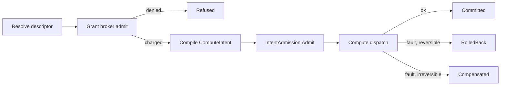

# [APPHOST_CAPABILITY_REGISTRY]

One self-describing operation catalog for the whole suite: every canonical op surface contributes a typed `CapabilityDescriptor` carrying its effect class, idempotency, cost model, and permission shape, the registry folds those rows into a discovery surface answering shape-discriminated queries, a command algebra wraps any descriptor invocation in a commit-or-rollback intent over the Compute `ComputeIntent` rail, a scoped grant broker meters every admission against an object-set × op-class × cost-ceiling × time-window algebra with consent and dry-run simulation, and one codegen surface emits identical command shapes for C#, TypeScript, and Python off the same descriptor rows. The page owns the descriptor vocabulary, the discovery fold, the command-algebra transaction, the grant-and-cost broker, and the polyglot SDK codegen; it consumes `ComputeIntent`/`IntentAdmission`, `WorkLane`, `CostModel` cousins, `TenantContext`, `DegradationLevel`, `ReceiptSinkPort`, and `DataClassification` as settled vocabulary and mints no eighth port.

## [1]-[INDEX]

| [INDEX] | [CLUSTER]       | [OWNS]                                                                      |
| :-----: | :-------------- | :-------------------------------------------------------------------------- |
|   [1]   | DESCRIPTOR_AXIS | Self-describing op rows: effect class, idempotency, cost, permission shape  |
|   [2]   | DISCOVERY_FOLD  | Frozen registry; shape-discriminated discovery queries over descriptor rows |
|   [3]   | COMMAND_ALGEBRA | Commit-or-rollback intent transaction over the Compute dispatch rail        |
|   [4]   | GRANT_BROKER    | Scoped grant algebra, consent/elevation, cost metering, dry-run policy sim  |
|   [5]   | SDK_CODEGEN     | C#/TS/Python command-shape emission off one descriptor source               |
|   [6]   | TS_PROJECTION   | Descriptor catalog and command-envelope wire shapes the dashboard consumes  |

## [2]-[DESCRIPTOR_AXIS]

- Owner: `EffectClass` `[SmartEnum<string>]` five-row effect taxonomy under the `CapabilityKeyPolicy` ordinal accessor; `Idempotency` `[SmartEnum<string>]` four-row repeat-safety vocabulary; `CostUnit` `[SmartEnum<string>]` the metered-resource axis; `CostModel` per-descriptor cost record; `PermissionShape` the object-set × op-class scope record; `CapabilityDescriptor` the self-describing op row; `DescriptorReceipt` the per-registration projection.
- Cases: 5 effect rows — pure, read, write, external, irreversible — in escalating side-effect severity; 4 idempotency rows — idempotent, keyed, single-shot, non-idempotent; cost units cpu-millis, wall-millis, bytes-egress, model-tokens, calls.
- Entry: `CapabilityDescriptor.Of(string surface, string op, EffectClass effect, Idempotency idempotency, CostModel cost, PermissionShape permission, Func<CommandArguments, Fin<ComputeIntent>> compile)` materializes one row whose id is the `{surface}.{op}` join, binding the descriptor to the `ComputeIntent` it compiles to; `Describe(IServiceCollection services, params ReadOnlySpan<CapabilityDescriptor> rows)` admits descriptor rows through one `Contributors` fan-in registration.
- Auto: each canonical op surface — `TensorOpFamily`, `ModelIdentity`, `ComputeEndpoint`, `QuantityFamily`, `SolverPluginContract` — projects its rows into descriptors at composition through one `Project` fold per surface so the catalog is generated from the op surfaces, never hand-listed, and a hand-authored op divorced from a descriptor (a free command method, a per-op MCP tool definition, a hand-written SDK client method) is the deleted form — the worked `TensorProjection.Project` fence is the one shape every surface follows, the sandbox `SolverPluginContract.Descriptors` projection the plugin-contract instance; the `Permission.Classification` field rides the `DataClassification` taxonomy so an op touching classified state declares it on the descriptor and the broker reads it before admission; `Cost.Estimate` projects a static pre-flight cost from the argument shape so a dry run prices the command before any byte moves.
- Receipt: `DescriptorReceipt` — descriptor id, effect key, idempotency key, estimated cost vector, permission scope hash, `Instant`.
- Packages: Thinktecture.Runtime.Extensions, LanguageExt.Core, NodaTime, BCL inbox
- Growth: one descriptor row absorbs a new op — the effect, idempotency, cost, and permission are column values on the row, never a parallel op-metadata table; a new effect class is one `EffectClass` row, a new metered resource one `CostUnit` row, a new cost shape one `CostModel` field; zero new surface.
- Boundary: the descriptor is the suite's only op-metadata owner — a per-op attribute scatter, a hand-kept command list, and a second cost table are the deleted forms; the descriptor never carries the op's body, only its self-description and the `compile` projection to a `ComputeIntent`, so the registry stays metadata and the execution stays on the Compute dispatch rail; `EffectClass.Irreversible` forces the command algebra onto the saga-compensation path because no rollback restores the prior state, and `EffectClass.Pure`/`Read` admit without a grant when the broker's read-floor policy permits; `Idempotency` is the same vocabulary `HopIdempotency` carries at the transport edge, re-keyed for op-level repeat safety, so a keyed command and a keyed hop share one repeat-safety semantic, never two; the estimated cost vector traces to `CostUnit` rows and the descriptor's `CostModel`, never an inline literal; descriptor ids are `nameof`-derived op symbols joined with the owning surface key, never free literals.

```csharp signature
public sealed class CapabilityKeyPolicy : IEqualityComparerAccessor<string>, IComparerAccessor<string> {
    public static IEqualityComparer<string> EqualityComparer => StringComparer.Ordinal;
    public static IComparer<string> Comparer => StringComparer.Ordinal;
}

[SmartEnum<string>]
[KeyMemberEqualityComparer<CapabilityKeyPolicy, string>]
[KeyMemberComparer<CapabilityKeyPolicy, string>]
public sealed partial class EffectClass {
    public static readonly EffectClass Pure = new("pure", rank: 0, reversible: true);
    public static readonly EffectClass Read = new("read", rank: 1, reversible: true);
    public static readonly EffectClass Write = new("write", rank: 2, reversible: true);
    public static readonly EffectClass External = new("external", rank: 3, reversible: false);
    public static readonly EffectClass Irreversible = new("irreversible", rank: 4, reversible: false);

    public int Rank { get; }
    public bool Reversible { get; }
}

[SmartEnum<string>]
[KeyMemberEqualityComparer<CapabilityKeyPolicy, string>]
[KeyMemberComparer<CapabilityKeyPolicy, string>]
public sealed partial class Idempotency {
    public static readonly Idempotency Idempotent = new("idempotent");
    public static readonly Idempotency Keyed = new("keyed");
    public static readonly Idempotency SingleShot = new("single-shot");
    public static readonly Idempotency NonIdempotent = new("non-idempotent");
}

[SmartEnum<string>]
[KeyMemberEqualityComparer<CapabilityKeyPolicy, string>]
[KeyMemberComparer<CapabilityKeyPolicy, string>]
public sealed partial class CostUnit {
    public static readonly CostUnit CpuMillis = new("cpu-millis");
    public static readonly CostUnit WallMillis = new("wall-millis");
    public static readonly CostUnit BytesEgress = new("bytes-egress");
    public static readonly CostUnit ModelTokens = new("model-tokens");
    public static readonly CostUnit Calls = new("calls");
}

public readonly record struct CostVector(HashMap<CostUnit, long> Units) {
    public static readonly CostVector Zero = new(HashMap<CostUnit, long>.Empty);
    public CostVector Add(CostVector other) =>
        new(other.Units.Fold(Units, static (acc, kv) => acc.AddOrUpdate(kv.Key, existing => existing + kv.Value, kv.Value)));
    public long Of(CostUnit unit) => Units.Find(unit).IfNone(0L);
}

public sealed record CostModel(CostVector Fixed, Func<CommandArguments, CostVector> Variable) {
    public static readonly CostModel Free = new(CostVector.Zero, static _ => CostVector.Zero);
    public CostVector Estimate(CommandArguments arguments) => Fixed.Add(Variable(arguments));
}

public sealed record PermissionShape(
    FrozenSet<string> ObjectSet,
    EffectClass OpClass,
    DataClassification Classification) {
    public static readonly PermissionShape Open = new(FrozenSet<string>.Empty, EffectClass.Read, DataClassification.Operational);
    public string ScopeHash => $"{OpClass.Key}:{Classification.Key}:{string.Join(',', ObjectSet.Order(StringComparer.Ordinal))}";
}

public sealed record CommandArguments(JsonElement Payload, TenantContext Tenant, CorrelationId Correlation);

public sealed record CapabilityDescriptor(
    string Id,
    string Surface,
    EffectClass Effect,
    Idempotency Idempotency,
    CostModel Cost,
    PermissionShape Permission,
    Func<CommandArguments, Fin<ComputeIntent>> Compile) {
    public static CapabilityDescriptor Of(string surface, string op, EffectClass effect, Idempotency idempotency, CostModel cost, PermissionShape permission, Func<CommandArguments, Fin<ComputeIntent>> compile) =>
        new($"{surface}.{op}", surface, effect, idempotency, cost, permission, compile);

    public DescriptorReceipt Receipt(CommandArguments arguments, Instant at) =>
        new(Id, Effect.Key, Idempotency.Key, Cost.Estimate(arguments), Permission.ScopeHash, at);
}

public readonly record struct DescriptorReceipt(
    string Descriptor,
    string Effect,
    string Idempotency,
    CostVector Estimated,
    string ScopeHash,
    Instant At);

public static class DescriptorSurface {
    public static IServiceCollection Describe(IServiceCollection services, params ReadOnlySpan<CapabilityDescriptor> rows) =>
        Iterable<CapabilityDescriptor>.FromSpan(rows).Fold(services, static (current, row) =>
            (current.TryAddEnumerable(ServiceDescriptor.Singleton(typeof(CapabilityDescriptor), row)), current).Item2);
}

public static class TensorProjection {
    public static IServiceCollection Project(IServiceCollection services, Func<TensorOpFamily, JsonElement, Fin<ComputeIntent>> compileOf) =>
        TensorOpFamily.Items.Fold(services, (current, family) =>
            DescriptorSurface.Describe(current, Row(family, compileOf)));

    static CapabilityDescriptor Row(TensorOpFamily family, Func<TensorOpFamily, JsonElement, Fin<ComputeIntent>> compileOf) =>
        CapabilityDescriptor.Of(
            surface: nameof(TensorOpFamily),
            op: family.Key,
            effect: EffectClass.Pure,
            idempotency: Idempotency.Idempotent,
            cost: new CostModel(
                Fixed: new CostVector(HashMap((CostUnit.Calls, 1L))),
                Variable: static args => new CostVector(HashMap(
                    (CostUnit.CpuMillis, args.Payload.GetProperty("elements").GetInt64())))),
            permission: new PermissionShape(FrozenSet<string>.Empty, EffectClass.Pure, DataClassification.Operational),
            compile: args => compileOf(family, args.Payload));
}
```

## [3]-[DISCOVERY_FOLD]

- Owner: `CapabilityRegistry` the frozen descriptor catalog with the alternate-lookup probe; `DiscoveryQuery` `[Union]` the shape-discriminated query family; `DiscoveryResult` the matched-descriptor projection.
- Cases: `ById(string Id)`, `BySurface(string Surface)`, `ByEffect(EffectClass Effect)`, `Permitting(DegradationLevel Level)`, `All` — one polymorphic discovery entrypoint discriminates on the query value, never a `GetById`/`GetBySurface`/`List` proliferation.
- Entry: `Discover(DiscoveryQuery query)` returns `Seq<DiscoveryResult>` — the single discovery operation folds the query case over the frozen catalog; `Resolve(string id)` returns `Option<CapabilityDescriptor>` through the ordinal alternate-lookup.
- Auto: the registry freezes the descriptor fan-in into one `FrozenDictionary<string, CapabilityDescriptor>` at composition and a `Lookup<string, CapabilityDescriptor>` index by surface so a surface query reads one bucket; `Permitting` folds the level's retained capability set against each descriptor's `EffectClass` so a degraded host advertises only the ops it can still serve, deleting a parallel per-level command list.
- Receipt: `DiscoveryResult` — descriptor id, surface, effect key, idempotency key, estimated cost vector for the empty argument shape, permission scope hash.
- Packages: Thinktecture.Runtime.Extensions, LanguageExt.Core, BCL inbox
- Growth: one query case absorbs a new discovery axis; a new index is one frozen projection over the catalog, never a second registry; zero new surface.
- Boundary: the registry is read-only after the composition freeze — a runtime descriptor mutation is the deleted form, mirroring the composition-root `MakeReadOnly` law; `Permitting` reads `DegradationLevel.Retains` as settled vocabulary and maps each `EffectClass` to its gating `Capability` (write maps to `StoreWrite`, external to `RemoteCompute`, read to `StoreRead`) so discovery and the runtime degradation rail share one capability semantic; the discovery surface is the projection the MCP `tools/list`, the SDK codegen, and the dashboard command palette all read, so a new consumer reads the same fold and never re-enumerates the descriptor fan-in.

```csharp signature
[Union(ConversionFromValue = ConversionOperatorsGeneration.None)]
public abstract partial record DiscoveryQuery {
    private DiscoveryQuery() { }
    public sealed record ById(string Id) : DiscoveryQuery;
    public sealed record BySurface(string Surface) : DiscoveryQuery;
    public sealed record ByEffect(EffectClass Effect) : DiscoveryQuery;
    public sealed record Permitting(DegradationLevel Level) : DiscoveryQuery;
    public sealed record All : DiscoveryQuery;
}

public readonly record struct DiscoveryResult(
    string Descriptor,
    string Surface,
    string Effect,
    string Idempotency,
    CostVector Estimated,
    string ScopeHash);

public sealed class CapabilityRegistry {
    readonly FrozenDictionary<string, CapabilityDescriptor> byId;
    readonly ILookup<string, CapabilityDescriptor> bySurface;
    readonly FrozenDictionary<string, CapabilityDescriptor>.AlternateLookup<ReadOnlySpan<char>> probe;

    public CapabilityRegistry(IEnumerable<CapabilityDescriptor> rows) {
        var rowSet = rows.ToArray();
        byId = rowSet.ToFrozenDictionary(static row => row.Id, StringComparer.Ordinal);
        bySurface = rowSet.ToLookup(static row => row.Surface, StringComparer.Ordinal);
        probe = byId.GetAlternateLookup<ReadOnlySpan<char>>();
    }

    public Option<CapabilityDescriptor> Resolve(string id) =>
        probe.TryGetValue(id, out var row) ? Optional(row) : None;

    public Seq<DiscoveryResult> Discover(DiscoveryQuery query) =>
        Project(query.Switch(
            byId: q => Resolve(q.Id).ToSeq(),
            bySurface: q => bySurface[q.Surface].ToSeq(),
            byEffect: q => byId.Values.Where(row => row.Effect == q.Effect).ToSeq(),
            permitting: q => byId.Values.Where(row => q.Level.Permits(Gate(row.Effect))).ToSeq(),
            all: _ => byId.Values.ToSeq()));

    static Capability Gate(EffectClass effect) => effect.Switch(
        pure: static () => Capability.LocalCompute,
        read: static () => Capability.StoreRead,
        write: static () => Capability.StoreWrite,
        external: static () => Capability.RemoteCompute,
        irreversible: static () => Capability.StoreWrite);

    static Seq<DiscoveryResult> Project(Seq<CapabilityDescriptor> rows) =>
        rows.Map(static row => new DiscoveryResult(
            row.Id, row.Surface, row.Effect.Key, row.Idempotency.Key,
            row.Cost.Estimate(new CommandArguments(default, TenantContext.Current, Correlation.Mint())),
            row.Permission.ScopeHash));
}
```

## [4]-[COMMAND_ALGEBRA]

- Owner: `CommandTxn` `[Union]` the transaction disposition; `CommandFault` `[Union]` fault family in the 4600 band; `CommandReceipt` the per-command evidence record; `CommandAlgebra` the static commit-or-rollback surface threading a descriptor invocation through the grant broker and onto the Compute dispatch rail.
- Cases: transaction dispositions Committed | RolledBack | Compensated | Refused; `CommandFault` = Text | NotFound | GrantDenied | CompileRejected | ExecutionFaulted | CompensationFailed.
- Entry: `Run(CommandRuntime runtime, string descriptorId, CommandArguments arguments)` returns `IO<CommandReceipt>` — the algebra resolves the descriptor, brokers the grant, compiles the `ComputeIntent`, admits it through `IntentAdmission.Admit`, dispatches it, and commits or rolls back; `Batch(CommandRuntime runtime, Seq<(string Id, CommandArguments Args)> commands)` runs an all-or-nothing intent group folding each command's compensation in reverse on the first failure.
- Auto: a reversible-effect command captures no compensation and the rollback is the absence of commit; an `EffectClass.Irreversible` command requires a compensation descriptor declared on the runtime and rolls forward through it, never a phantom undo; the dispatch lands through the Compute `SubstrateSelection.Dispatch` rail so the command algebra owns the transaction boundary while Compute owns substrate selection and execution, never a second dispatcher; every disposition mints one `CommandReceipt` fanned through `ReceiptSinkPort.Send` under the `Rasm.AppHost` package key.
- Receipt: `CommandReceipt` — descriptor id, transaction disposition, charged cost vector, `SelectionReceipt` of the dispatched intent, elapsed `Duration`, correlation id, tenant.
- Packages: LanguageExt.Core, NodaTime, Thinktecture.Runtime.Extensions, BCL inbox
- Growth: one transaction disposition is one `CommandTxn` case breaking every consumer arm; one fault is one `CommandFault` case; a new compensation strategy is one column on the descriptor runtime, never a second algebra; zero new surface.
- Boundary: the command algebra is the only commit-or-rollback owner for op invocation — a per-op transaction helper and a hand-rolled saga loop are the deleted forms; the `Batch` group is an intent transaction, not a database transaction — durable atomicity stays the Persistence execution strategy and the algebra composes the Compute intent group, so the two transaction concerns never merge; the grant brokerage at `GRANT_BROKER` runs before compile so a denied command never compiles a `ComputeIntent` and never charges cost; the compensation runs under the same `CancelScope` the forward command derived, so a drain-interrupted rollback escalates through the conductor rather than orphaning; `CommandTxn.Compensated` carries the compensation's own receipt so the evidence stream records the roll-forward, never a silent swallow.

```csharp signature
[Union(ConversionFromValue = ConversionOperatorsGeneration.None)]
public abstract partial record CommandTxn {
    private CommandTxn() { }
    public sealed record Committed(SelectionReceipt Dispatch) : CommandTxn;
    public sealed record RolledBack(string Reason) : CommandTxn;
    public sealed record Compensated(SelectionReceipt Forward, SelectionReceipt Compensation) : CommandTxn;
    public sealed record Refused(CommandFault Fault) : CommandTxn;
}

[Union]
public abstract partial record CommandFault : Expected, IValidationError<CommandFault> {
    private CommandFault(string detail, int code) : base(detail, code, None) { }
    public static CommandFault Create(string message) => new Text(message);
    public sealed record Text : CommandFault { public Text(string detail) : base(detail, 4600) { } }
    public sealed record NotFound : CommandFault { public NotFound(string detail) : base(detail, 4601) { } }
    public sealed record GrantDenied : CommandFault { public GrantDenied(string detail) : base(detail, 4602) { } }
    public sealed record CompileRejected : CommandFault { public CompileRejected(string detail) : base(detail, 4603) { } }
    public sealed record ExecutionFaulted : CommandFault { public ExecutionFaulted(string detail) : base(detail, 4604) { } }
    public sealed record CompensationFailed : CommandFault { public CompensationFailed(string detail) : base(detail, 4605) { } }
}

public sealed record CommandReceipt(
    string Descriptor,
    CommandTxn Txn,
    CostVector Charged,
    Option<SelectionReceipt> Dispatch,
    Duration Elapsed,
    CorrelationId Correlation,
    TenantContext Tenant,
    Instant At);

public sealed record CommandRuntime(
    CapabilityRegistry Registry,
    GrantBroker Broker,
    Func<AdmittedIntent, IO<SelectionReceipt>> Dispatch,
    Func<string, Option<string>> CompensationOf,
    ClockPolicy Clocks,
    ReceiptSinkPort Sink,
    JsonSerializerOptions Wire,
    CancelScope Spine);

public static class CommandAlgebra {
    public static IO<CommandReceipt> Run(CommandRuntime runtime, string descriptorId, CommandArguments arguments) =>
        runtime.Registry.Resolve(descriptorId).Match(
            Some: descriptor => Brokered(runtime, descriptor, arguments),
            None: () => Mint(runtime, descriptorId, new CommandTxn.Refused(new CommandFault.NotFound(descriptorId)), CostVector.Zero, None, arguments));

    static IO<CommandReceipt> Brokered(CommandRuntime runtime, CapabilityDescriptor descriptor, CommandArguments arguments) =>
        runtime.Broker.Admit(descriptor, arguments, dryRun: false).Match(
            Succ: charged => Dispatch(runtime, descriptor, arguments, charged),
            Fail: fault => Mint(runtime, descriptor.Id, new CommandTxn.Refused(new CommandFault.GrantDenied(fault.Message)), CostVector.Zero, None, arguments));

    static IO<CommandReceipt> Dispatch(CommandRuntime runtime, CapabilityDescriptor descriptor, CommandArguments arguments, CostVector charged) =>
        descriptor.Compile(arguments).Match(
            Succ: intent =>
                from admitted in IO.lift(() => IntentAdmission.Admit(intent, Spec(descriptor), arguments.Correlation, runtime.Spine, runtime.Clocks))
                from receipt in admitted.Match(
                    Succ: ok => runtime.Dispatch(ok)
                        .Map(dispatched => new CommandTxn.Committed(dispatched) as CommandTxn)
                        | @catch<IO, CommandTxn>(static _ => true, error => Compensate(runtime, descriptor, arguments, error)),
                    Fail: error => IO.pure<CommandTxn>(new CommandTxn.Refused(new CommandFault.CompileRejected(error.Message))))
                from minted in Mint(runtime, descriptor.Id, receipt, charged, Dispatched(receipt), arguments)
                select minted,
            Fail: error => Mint(runtime, descriptor.Id, new CommandTxn.Refused(new CommandFault.CompileRejected(error.Message)), CostVector.Zero, None, arguments));

    static IO<CommandTxn> Compensate(CommandRuntime runtime, CapabilityDescriptor descriptor, CommandArguments arguments, Error forward) =>
        descriptor.Effect.Reversible
            ? IO.pure<CommandTxn>(new CommandTxn.RolledBack(forward.Message))
            : runtime.CompensationOf(descriptor.Id).Match(
                Some: compId => runtime.Registry.Resolve(compId).Match(
                    Some: comp => comp.Compile(arguments).Match(
                        Succ: intent => IO.lift(() => IntentAdmission.Admit(intent, Spec(comp), arguments.Correlation, runtime.Spine, runtime.Clocks))
                            .Bind(admitted => admitted.Match(
                                Succ: ok => runtime.Dispatch(ok).Map(done => new CommandTxn.Compensated(SelectionReceipt.None, done) as CommandTxn),
                                Fail: error => IO.pure<CommandTxn>(new CommandTxn.Refused(new CommandFault.CompensationFailed(error.Message))))),
                        Fail: error => IO.pure<CommandTxn>(new CommandTxn.Refused(new CommandFault.CompensationFailed(error.Message)))),
                    None: () => IO.pure<CommandTxn>(new CommandTxn.Refused(new CommandFault.CompensationFailed(compId)))),
                None: () => IO.pure<CommandTxn>(new CommandTxn.Refused(new CommandFault.CompensationFailed(descriptor.Id))));

    public static IO<Seq<CommandReceipt>> Batch(CommandRuntime runtime, Seq<(string Id, CommandArguments Args)> commands) =>
        commands.FoldM(Seq<CommandReceipt>(), (acc, command) =>
            Run(runtime, command.Id, command.Args).Bind(receipt =>
                receipt.Txn is CommandTxn.Committed
                    ? IO.pure(acc.Add(receipt))
                    : Unwind(runtime, acc).Map(unwound => unwound.Add(receipt)))).As();

    static IO<Seq<CommandReceipt>> Unwind(CommandRuntime runtime, Seq<CommandReceipt> committed) =>
        committed.Rev().TraverseM(receipt =>
            runtime.CompensationOf(receipt.Descriptor).Match(
                Some: compId => Run(runtime, compId, new CommandArguments(default, receipt.Tenant, receipt.Correlation)),
                None: () => IO.pure(receipt))).As();

    static ComputeIntent.Spec Spec(CapabilityDescriptor descriptor) =>
        new(DeadlineClass.HopTotal, WorkLane.Interactive, AllocationClass.Pooled, CachePolicy.None);

    static Option<SelectionReceipt> Dispatched(CommandTxn txn) => txn switch {
        CommandTxn.Committed c => Some(c.Dispatch),
        CommandTxn.Compensated c => Some(c.Forward),
        _ => None,
    };

    static IO<CommandReceipt> Mint(CommandRuntime runtime, string descriptor, CommandTxn txn, CostVector charged, Option<SelectionReceipt> dispatch, CommandArguments arguments) =>
        from at in IO.lift(() => runtime.Clocks.Now)
        let receipt = new CommandReceipt(descriptor, txn, charged, dispatch, Duration.Zero, arguments.Correlation, arguments.Tenant, at)
        from _ in runtime.Sink.Send(arguments.Correlation, arguments.Tenant, TelemetrySource.AppHost.Key, nameof(CommandAlgebra), JsonSerializer.SerializeToElement(receipt, runtime.Wire))
        select receipt;
}
```



## [5]-[GRANT_BROKER]

- Owner: `GrantScope` the object-set × op-class × cost-ceiling × time-window scope record; `Consent` `[Union]` the elevation-request disposition; `Budget` the per-scope live-metering cell; `GrantFault` `[Union]` fault family in the 4620 band; `GrantBroker` the static admission-and-metering surface.
- Cases: consent dispositions Granted | Elevated | Denied | Expired; `GrantFault` = Text | OutOfScope | CeilingExceeded | WindowClosed | ConsentRequired.
- Entry: `Admit(CapabilityDescriptor descriptor, CommandArguments arguments, bool dryRun)` returns `Fin<CostVector>` — the broker resolves the holder's `GrantScope`, evaluates the descriptor's `PermissionShape` against it through the typed `GrantScope.Covers` value-object predicate, prices the command through `CostModel.Estimate`, charges the `Budget` under the cost ceiling, and returns the charged vector or the typed denial; `Simulate(Seq<(string Id, CommandArguments Args)> plan)` returns `Seq<(string Id, Fin<CostVector>)>` — the dry-run simulation runs the identical decision-and-pricing fold priced against the live budget without charging it.
- Auto: the permission decision is the deterministic `GrantScope.Covers` fold — the object-set × op-class × classification predicate is a typed value-object method, never an ambient role flag or a scattered per-op check; a `dryRun: true` admission decides and prices but never mutates the `Budget` cell, so the dry-run sim and the live charge share one decision-and-pricing fold and differ only by the charge step; the cost ceiling is a `CostVector` so each metered resource caps independently — a command under the call ceiling but over the bytes-egress ceiling is denied on bytes-egress with the offending unit named; the time window is two NodaTime `Instant` bounds the `Interval` carries so a grant outside its window resolves `Expired` and re-admits only on renewal, never a silent extension.
- Receipt: the broker's charge is the `CommandReceipt.Charged` vector the command algebra carries; the decision rides the consent transition's one `SpineLog` event in the 1000-1999 band — no parallel grant receipt.
- Packages: LanguageExt.Core, NodaTime, Thinktecture.Runtime.Extensions, BCL inbox
- Growth: one consent disposition is one `Consent` case; one scope dimension is one `GrantScope` column plus one `PermissionShape` field the `Covers` fold reads; a new metered resource rides the `CostUnit` axis already; zero new surface.
- Boundary: the broker is the suite's only permission-and-cost owner — a per-op permission check, an ambient role flag, and a second cost meter are the deleted forms; the broker owns permission, cost, consent, budget, and window as one fold, reading the descriptor's declared `PermissionShape` and never re-deriving the op's effect; the `GrantScope` keys by `TenantContext.TenantId` so a multi-tenant host meters each tenant's budget independently against one broker, never a per-tenant broker instance; `Consent.Elevated` is the consent-elevation path — a command the standing scope denies raises an elevation request the operator approves, landing a wider transient `GrantScope` with its own window, never a standing privilege grant; the cost model integrates the live-metering identity-versus-quota seam at health-and-degradation, so a budget-exhausted tenant degrades to `ReadOnly` through the same degradation rail rather than a parallel throttle.

```csharp signature
public sealed record GrantScope(
    TenantId Tenant,
    FrozenSet<string> ObjectSet,
    FrozenSet<EffectClass> OpClasses,
    CostVector Ceiling,
    Interval Window) {
    public bool Covers(PermissionShape shape, Instant now) =>
        Window.Contains(now)
        && OpClasses.Contains(shape.OpClass)
        && (ObjectSet.Count == 0 || shape.ObjectSet.IsSubsetOf(ObjectSet));
}

[Union(ConversionFromValue = ConversionOperatorsGeneration.None)]
public abstract partial record Consent {
    private Consent() { }
    public sealed record Granted(GrantScope Scope) : Consent;
    public sealed record Elevated(GrantScope Scope, string Approver, Instant At) : Consent;
    public sealed record Denied(string Reason) : Consent;
    public sealed record Expired(Instant ClosedAt) : Consent;
}

[Union]
public abstract partial record GrantFault : Expected, IValidationError<GrantFault> {
    private GrantFault(string detail, int code) : base(detail, code, None) { }
    public static GrantFault Create(string message) => new Text(message);
    public sealed record Text : GrantFault { public Text(string detail) : base(detail, 4620) { } }
    public sealed record OutOfScope : GrantFault { public OutOfScope(string detail) : base(detail, 4621) { } }
    public sealed record CeilingExceeded : GrantFault { public CeilingExceeded(string unit, long over) : base($"{unit}:+{over}", 4622) => Unit = unit; public string Unit { get; } }
    public sealed record WindowClosed : GrantFault { public WindowClosed(string detail) : base(detail, 4623) { } }
    public sealed record ConsentRequired : GrantFault { public ConsentRequired(string detail) : base(detail, 4624) { } }
}

public sealed record GrantBroker(
    Atom<HashMap<TenantId, (GrantScope Scope, CostVector Spent)>> Cell,
    Func<TenantContext, Option<GrantScope>> ScopeOf,
    ClockPolicy Clocks) {
    public Fin<CostVector> Admit(CapabilityDescriptor descriptor, CommandArguments arguments, bool dryRun) {
        var now = Clocks.Now;
        var cost = descriptor.Cost.Estimate(arguments);
        return ScopeOf(arguments.Tenant).ToFin(new GrantFault.ConsentRequired(descriptor.Id))
            .Bind(scope => scope.Window.Contains(now) ? Fin.Succ(scope) : Fin.Fail<GrantScope>(new GrantFault.WindowClosed(descriptor.Id)))
            .Bind(scope => scope.Covers(descriptor.Permission, now) ? Fin.Succ(scope) : Fin.Fail<GrantScope>(new GrantFault.OutOfScope(descriptor.Permission.ScopeHash)))
            .Bind(scope => Charge(arguments.Tenant.TenantId, scope, cost, dryRun));
    }

    public Seq<(string Id, Fin<CostVector>)> Simulate(CapabilityDescriptor descriptor, Seq<(string Id, CommandArguments Args)> plan) =>
        plan.Map(step => (step.Id, Admit(descriptor, step.Args, dryRun: true)));

    Fin<CostVector> Charge(TenantId tenant, GrantScope scope, CostVector cost, bool dryRun) {
        var current = Cell.Value.Find(tenant).Map(static row => row.Spent).IfNone(CostVector.Zero);
        var next = current.Add(cost);
        var breach = scope.Ceiling.Units.AsIterable()
            .Filter(cap => next.Of(cap.Key) > cap.Value)
            .HeadOrNone();
        return breach.Match(
            Some: cap => Fin.Fail<CostVector>(new GrantFault.CeilingExceeded(cap.Key.Key, next.Of(cap.Key) - cap.Value)),
            None: () => {
                if (!dryRun) ignore(Cell.Swap(map => map.AddOrUpdate(tenant, _ => (scope, next), (scope, next))));
                return Fin.Succ(cost);
            });
    }
}
```

## [6]-[SDK_CODEGEN]

- Owner: `SdkTarget` `[SmartEnum<string>]` the three language emission targets; `SdkArtifact` the emitted-source projection; `SdkCodegen` the static emission fold over the registry.
- Cases: 3 targets — csharp, typescript, python — each carrying its command-shape renderer and idiomatic call form.
- Entry: `Emit(CapabilityRegistry registry, SdkTarget target)` returns `SdkArtifact` — one fold projects every descriptor row into a typed command method for the target language; the identical descriptor source drives all three, so the command shapes are provably identical across languages.
- Auto: each target renders the descriptor's `PermissionShape`, `EffectClass`, and `CostModel.Estimate` as the method's documented contract so a generated SDK method self-describes its effect and cost; the wire payload shape is the `JsonSchemaExporter` schema the descriptor's `CommandArguments` resolves through `SuiteContracts.Schema`, so the TS and Python types derive from the same schema the C# binder reads, never a hand-mirrored shape; the codegen reads the discovery fold, so a new descriptor row regenerates all three SDKs with no per-language edit.
- Receipt: `SdkArtifact` — target key, emitted source text, descriptor count, schema digest.
- Packages: Thinktecture.Runtime.Extensions, LanguageExt.Core, BCL inbox
- Growth: one target row absorbs a new language; a new call form is one renderer column on the row; zero new surface.
- Boundary: the codegen is the only polyglot SDK owner — a hand-written client in any language is the deleted form, the same deletion the `connect-es` and `schema-derived TS` tooling rows carry at runtime-ports#TS_PROJECTION; the C# target emits the same `CommandArguments`/`CommandReceipt` shapes the command algebra runs, the TS target binds through the existing `ReceiptEnvelopeWire`, and the Python target binds through the companion seam the suite already owns, so codegen rides the existing wire contracts and mints no fourth wire shape; the emitted source is a build artifact, never a runtime surface, so the codegen runs at SDK-bootstrap and the registry stays the single descriptor source for all three branches; the TS schema export the codegen reads is the same `SuiteContracts.Schema`/`JsonSchemaExporter` projection at runtime-ports#WIRE_LAW, so the descriptor-diff evolution gate is one verdict across the suite — `Rasm.Compute/remote/channels#FAULT_PROJECTION` `ContractGuard.AdditiveOnly` gates peer-attach (the discovery `Compatible` delegate), store-open, and this SDK schema export identically, an additive descriptor field admits on every consumer while a breaking field reshape rejects on all three through the one classifier, never a per-surface compatibility check beside it.

```csharp signature
[SmartEnum<string>]
[KeyMemberEqualityComparer<CapabilityKeyPolicy, string>]
[KeyMemberComparer<CapabilityKeyPolicy, string>]
public sealed partial class SdkTarget {
    public static readonly SdkTarget CSharp = new("csharp", extension: ".cs", Csharp);
    public static readonly SdkTarget TypeScript = new("typescript", extension: ".ts", Typescript);
    public static readonly SdkTarget Python = new("python", extension: ".py", Python);

    public string Extension { get; }

    [UseDelegateFromConstructor]
    public partial string Render(DiscoveryResult descriptor);

    static string Csharp(DiscoveryResult d) =>
        $"public IO<CommandReceipt> {Method(d)}(CommandArguments arguments) => CommandAlgebra.Run(runtime, \"{d.Descriptor}\", arguments);";

    static string Typescript(DiscoveryResult d) =>
        $"{Method(d)}(args: CommandArguments): Promise<ReceiptEnvelopeWire<CapabilityCommandReceiptWire>> {{ return this.run(\"{d.Descriptor}\", args); }}";

    static string Python(DiscoveryResult d) =>
        $"def {Method(d)}(self, args: CommandArguments) -> CommandReceipt: return self._run(\"{d.Descriptor}\", args)";

    static string Method(DiscoveryResult d) => d.Descriptor.Replace('.', '_');
}

public sealed record SdkArtifact(SdkTarget Target, string Source, int Descriptors, string SchemaDigest);

public static class SdkCodegen {
    public static SdkArtifact Emit(CapabilityRegistry registry, SdkTarget target) {
        var rows = registry.Discover(new DiscoveryQuery.All());
        var body = string.Join('\n', rows.Map(target.Render));
        var digest = Convert.ToHexStringLower(System.IO.Hashing.XxHash128.Hash(Encoding.UTF8.GetBytes(body)));
        return new SdkArtifact(target, body, rows.Count, digest);
    }
}
```

## [7]-[TS_PROJECTION]

- Owner: `CapabilityDescriptorWire`, `CapabilityCommandReceiptWire`, `DiscoveryResultWire` — the descriptor catalog and command-envelope wire shapes; per-record wire payloads ride the existing `ReceiptEnvelopeWire` and bind here as `TPayload`.
- Entry: the descriptor catalog crosses as the `DiscoveryResultWire[]` the dashboard command palette ingests, and the command receipt reconstructs through the existing `ReceiptEnvelopeWire<CapabilityCommandReceiptWire>`; the SDK codegen TS target emits methods over these same shapes.
- Packages: BCL inbox
- Growth: one wire-member row per new descriptor or receipt field; the transaction disposition crosses as a literal-discriminated union; zero new surface.
- Boundary: effect, idempotency, and cost-unit keys cross as their smart-enum string keys; the cost vector crosses as a record of unit-keyed numbers; the transaction disposition reconstructs in TS as a literal-discriminated union on the disposition kind, mirroring the `CommandTxn` union cases; `scopeHash` crosses as the deterministic permission-scope string so the dashboard groups commands by scope without re-deriving the permission shape.

```ts contract
type EffectClassKey = "pure" | "read" | "write" | "external" | "irreversible";
type IdempotencyKey = "idempotent" | "keyed" | "single-shot" | "non-idempotent";
type CostUnitKey = "cpu-millis" | "wall-millis" | "bytes-egress" | "model-tokens" | "calls";

type CostVectorWire = Readonly<Record<CostUnitKey, number>>;

interface DiscoveryResultWire {
  readonly descriptor: string;
  readonly surface: string;
  readonly effect: EffectClassKey;
  readonly idempotency: IdempotencyKey;
  readonly estimated: CostVectorWire;
  readonly scopeHash: string;
}

interface CapabilityCommandReceiptWire {
  readonly descriptor: string;
  readonly txn:
    | { readonly kind: "committed"; readonly dispatch: string }
    | { readonly kind: "rolled-back"; readonly reason: string }
    | { readonly kind: "compensated"; readonly forward: string; readonly compensation: string }
    | { readonly kind: "refused"; readonly fault: string };
  readonly charged: CostVectorWire;
  readonly elapsed: string;
  readonly correlation: string;
}
```

## [8]-[RESEARCH]

- [INTENT_SPEC]: the `ComputeIntent.Spec` field arity (`WorkLane.Interactive`, `AllocationClass.Pooled`, `CachePolicy.None`) the command algebra constructs for a brokered command resolves against the finalized Compute intent-and-selection#INTENT_FAMILY surface; the `SelectionReceipt.None` sentinel for a compensation forward leg confirms against the Compute dispatch-spine receipt shape. Build-order prerequisite: `capability/Registry.cs` cannot compile until the `Rasm.Compute` intent-and-selection contract (`ComputeIntent`/`IntentAdmission`/`SelectionReceipt`/`AdmittedIntent`) and the sibling AppHost settled vocabulary (`ports`/`time`/`hosting`: `CancelScope`/`ClockPolicy`/`ReceiptSinkPort`/`TenantContext`/`DegradationLevel`/`Capability`/`Interval`) land — these are consumed by type on `CommandRuntime`/`CommandReceipt`, so the page is the downstream of that vocabulary, and `agent/mcp-projection.md` is in turn downstream of this page.
- [SCHEMA_DIGEST]: the `JsonSchemaExporter` schema the SDK codegen reads per descriptor `CommandArguments` derives through `SuiteContracts.Schema`, and the cross-language shape-identity proof — the C#, TS, and Python emitted methods bind one schema — confirms against the live schema export at SDK-bootstrap.
- [GRANT_ATTESTATION]: the detached-signature primitive (BCL `System.Security.Cryptography`) the broker mints over the canonical `GrantAttestation` bytes, the `XxHash128` digest seed the attestation shares with the determinism kernel, and the `EventLog` chaining seat the attestation rides confirm against determinism-and-replay#EVENT_LOG; the cross-process verify predicate the sidecar write-forward and the plugin host call resolves against the `companion`/`sandbox` consumer shapes at integration.
