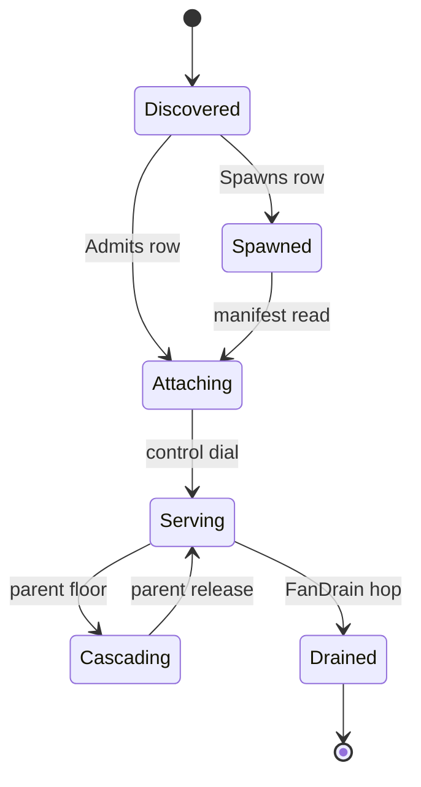

# [APPHOST_COMPANION_SIDECAR]

The inbound serving counterpart to the outbound boundary: one `ProcessModality` axis carries the companion, sidecar, and paired-peer spawn-attach-discovery-degradation rows, one `PeerRoster` folds every accepted connection into a lease-epoch attached-peer set on the serving side, one `ControlInbound` handler folds the three `ControlService` wire verbs onto the existing degradation, options, and support owners, one `ServiceHost` registration mounts the gRPC server over a Unix domain socket or a hardened Windows named pipe, one cross-process cascade writes a parent-observed level onto the child `DegradationCell.Cascade` floor, and one `PeerAdmission` reads the connecting peer's credentials at accept over the platform `getsockopt` route. The page owns the modality axis, the attached-peer roster, the verb-fold handler, the server-host registration, the cascade write, and the peer-credential read; it consumes `DegradationCell`, `OptionsAdmission`, `SupportTrigger`, `HostAttachPort`, and `ReceiptSinkPort` as settled vocabulary and mints no eighth port.

## [1]-[INDEX]

| [INDEX] | [CLUSTER]           | [OWNS]                                                              |
| :-----: | ------------------- | ------------------------------------------------------------------- |
|   [1]   | PROCESS_MODALITY    | Three modality rows + lease-epoch attached-peer roster on the serving side |
|   [2]   | CONTROL_SERVICE     | Three wire verbs folded onto degradation, options, support owners   |
|   [3]   | SERVICE_HOST        | gRPC server registration over UDS and hardened Windows named pipe   |
|   [4]   | DEGRADATION_CASCADE | Parent floor written to the child cell over the control hop         |
|   [5]   | PEER_ADMISSION      | Accept-side peer-credential read over the platform getsockopt route |

## [2]-[PROCESS_MODALITY]

- Owner: `ProcessModality` `[SmartEnum<string>]` three rows under one `ProcessModalityKeyPolicy` comparer accessor; `ModalityRow` per-case policy record; `ModalityRows` frozen row set with the total dispatch; `CompanionPeer` the attached-child capsule the modality row produces; `PeerRoster` the `Atom`-backed serving-side attached-connection set carrying a monotone lease epoch; `RosterEntry` the per-connection lease record; `RosterReceipt` the join/renew/drop transition projection the sink fans.
- Cases: companion, sidecar, paired-peer — companion is the host-spawned single-shot child, sidecar is the externally-supervised attach-only peer, paired-peer is the symmetric dual-attach where each side both spawns and admits; three roster transitions — join on accept, renew on heartbeat, drop on lease expiry or disconnect.
- Entry: `ModalityRow Row` is the extension property total state-free `Switch` from case to frozen row; `Attach(ModalityRow row, ProcessStartInfo spec, Func<int, Fin<DiscoveryManifest>> manifestOf, Func<DiscoveryManifest, CancellationToken, IO<Unit>> drainFan, GrpcChannelPolicy policy)` returns `IO<CompanionPeer>` and carries the spawn-and-dial effect; `PeerRoster.Admit(PeerCredential credential, DiscoveryManifest manifest, Instant now)`, `.Renew(int pid, Instant now)`, and `.Drop(int pid, Instant now)` each fold one transition over the `Atom` and return `IO<RosterReceipt>` carrying the lease epoch.
- Auto: `Attach` reads the discovery manifest through the bound `Discovery.Read` projection and dials the control channel through `Discovery.Connect`, running the single-shot `Discovery.Spawn` only on rows whose `Spawns` column is set, and the `DegradesChild` column gates the cascade write; `Admit` keys the entry by the kernel-reported `PeerCredential.Pid` from the accept seam — never the manifest's self-asserted pid — and stamps the lease deadline from `LeasePolicy.Maintenance.CrashStaleness` so a peer's lease lapses on the same crash-staleness window the maintenance lease uses, `Renew` extends it, and `Sweep(Instant now)` drops every entry whose lease lapsed so a vanished peer leaves the roster without an explicit disconnect; every transition mints one `RosterReceipt` fanned through `ReceiptSinkPort.Send`.
- Receipt: `ModalityReceipt` — modality key, peer pid, attach outcome, elapsed `Duration`, cascade-eligible flag; `RosterReceipt` — transition kind, peer pid+uid, lease epoch, attached-count after the fold, `Instant`.
- Packages: Thinktecture.Runtime.Extensions, LanguageExt.Core, NodaTime, Grpc.Net.Client, BCL inbox
- Growth: one case plus one `ModalityRow` absorbs a new process topology; the spawn, attach, and cascade legs are column flips on the row, never a parallel surface; a new roster transition is one `RosterTransition` case plus one fold arm; zero new surface.
- Boundary: the modality row consumes `OutboundHop.CompanionSpawn` and `OutboundHop.LocalIpc` from the dial-out owner and never re-declares the spawn or connect mechanics — `Discovery.Spawn`, `Discovery.Connect`, and `Discovery.Read` carry the bytes; `Spawns` is the single-shot guard so a sidecar row attaches without ever starting a process and a paired-peer row both spawns and admits; `DegradesChild` is the cascade-eligibility column the `DEGRADATION_CASCADE` write reads, never a second degradation owner; the attach deadline is the `DeadlineClass.HopAttempt` row read by projection and the lease deadline is the `LeasePolicy.Maintenance.CrashStaleness` value, never a literal here; `CompanionPeer` carries the `CompanionChild` produced by the outbound spawn and the `GrpcChannel` produced by the control dial so one capsule owns both legs of an attached child; `PeerRoster` is the single host-side attached-connection owner — the lease epoch is a monotone `ulong` bumped on every join and drop so a stale peer reconnecting under a prior epoch is detectable, and the roster never re-mints presence: its consequence is an op-log-borne presence value at Persistence/sync-collaboration#PRESENCE_AND_BLOB where each `RosterReceipt` join/drop projects one `PresenceRow` (`Actor` = peer pid+uid, `EntityKind` = the serving service key, `ExpiresAt` = the lease deadline) through `Presence.Beat` over the existing op-log changefeed, so the roster mechanics live here and the durable presence value lives there; `WireHealth` reads the attached-count for per-peer serving status, never a second roster; `FleetRoll` and `ForwardWrite` read `PeerRoster.Attached` as settled vocabulary; the page is host-local and crosses no browser or peer TS wire of its own — the `ControlService` verb messages are Compute/remote-lane#PROTO_VOCABULARY-owned protobuf consumed here, the verb replies project the existing typed receipts field-for-field at that Compute-owned proto, and `RosterReceipt`/`ModalityReceipt` reconstruct through the existing `ReceiptEnvelopeWire` at runtime-ports#TS_PROJECTION, so the page authors no `TS_PROJECTION` cluster and mints no second wire shape.

```csharp signature
public sealed class ProcessModalityKeyPolicy : IEqualityComparerAccessor<string>, IComparerAccessor<string> {
    private static readonly StringComparer Policy = StringComparer.OrdinalIgnoreCase;
    public static IEqualityComparer<string> EqualityComparer => Policy;
    public static IComparer<string> Comparer => Policy;
}

[SmartEnum<string>]
[KeyMemberEqualityComparer<ProcessModalityKeyPolicy, string>]
[KeyMemberComparer<ProcessModalityKeyPolicy, string>]
public sealed partial class ProcessModality {
    public static readonly ProcessModality Companion = new("companion");
    public static readonly ProcessModality Sidecar = new("sidecar");
    public static readonly ProcessModality PairedPeer = new("paired-peer");
}

public sealed record ModalityRow(
    ProcessModality Modality,
    bool Spawns,
    bool Admits,
    bool DegradesChild,
    HopIdempotency Idempotency,
    DeadlineClass Attach);

public sealed record CompanionPeer(
    ProcessModality Modality,
    Option<CompanionChild> Child,
    GrpcChannel Control,
    DiscoveryManifest Manifest);

public readonly record struct ModalityReceipt(
    ProcessModality Modality,
    int PeerPid,
    HopOutcome Attach,
    Duration Elapsed,
    bool CascadeEligible);

public static class ModalityRows {
    public static readonly ModalityRow Companion = new(ProcessModality.Companion, Spawns: true, Admits: false, DegradesChild: true, HopIdempotency.SingleShot, DeadlineClass.HopAttempt);
    public static readonly ModalityRow Sidecar = new(ProcessModality.Sidecar, Spawns: false, Admits: true, DegradesChild: false, HopIdempotency.Keyed, DeadlineClass.HopAttempt);
    public static readonly ModalityRow PairedPeer = new(ProcessModality.PairedPeer, Spawns: true, Admits: true, DegradesChild: true, HopIdempotency.Keyed, DeadlineClass.HopAttempt);

    extension(ProcessModality modality) {
        public ModalityRow Row => modality.Switch(
            companion: static () => Companion,
            sidecar: static () => Sidecar,
            pairedPeer: static () => PairedPeer);
    }

    public static IO<CompanionPeer> Attach(ModalityRow row, ProcessStartInfo spec, Func<int, Fin<DiscoveryManifest>> manifestOf, Func<DiscoveryManifest, CancellationToken, IO<Unit>> drainFan, GrpcChannelPolicy policy) =>
        row.Spawns
            ? IO.lift(() => Discovery.Spawn(spec, manifestOf, drainFan))
                .Bind(spawned => spawned.Match(
                    Succ: child => IO.pure(new CompanionPeer(row.Modality, child, Discovery.Connect(child.Manifest, policy), child.Manifest)),
                    Fail: fault => IO.fail<CompanionPeer>(fault)))
            : IO.lift(() => manifestOf(0))
                .Bind(read => read.Match(
                    Succ: manifest => IO.pure(new CompanionPeer(row.Modality, None, Discovery.Connect(manifest, policy), manifest)),
                    Fail: fault => IO.fail<CompanionPeer>(fault)));
}

[SmartEnum]
public sealed partial class RosterTransition {
    public static readonly RosterTransition Joined = new();
    public static readonly RosterTransition Renewed = new();
    public static readonly RosterTransition Dropped = new();
}

public sealed record RosterEntry(
    int Pid,
    uint Uid,
    DiscoveryManifest Manifest,
    ulong Epoch,
    Instant JoinedAt,
    Instant LeaseUntil);

public readonly record struct RosterReceipt(
    RosterTransition Transition,
    int Pid,
    uint Uid,
    ulong Epoch,
    int Attached,
    Instant At);

public sealed record PeerRoster(
    string Service,
    Atom<(HashMap<int, RosterEntry> Entries, ulong Epoch)> Cell,
    ReceiptSinkPort Sink,
    IClock Clock,
    TenantContext Tenant) {
    public static PeerRoster Boot(string service, ReceiptSinkPort sink, IClock clock, TenantContext tenant) =>
        new(service, Atom((HashMap<int, RosterEntry>.Empty, 0UL)), sink, clock, tenant);

    public Seq<RosterEntry> Attached => Cell.Value.Entries.Values.ToSeq();

    public IO<RosterReceipt> Admit(PeerCredential credential, DiscoveryManifest manifest, Instant now) =>
        Commit(RosterTransition.Joined, credential.Pid, credential.Uid, now, state => {
            var epoch = state.Epoch + 1UL;
            var entry = new RosterEntry(credential.Pid, credential.Uid, manifest, epoch, now, now + LeasePolicy.Maintenance.CrashStaleness);
            return (state.Entries.AddOrUpdate(credential.Pid, entry), epoch);
        });

    public IO<RosterReceipt> Renew(int pid, Instant now) =>
        Commit(RosterTransition.Renewed, pid, Uid(pid), now, state =>
            (state.Entries.Find(pid).Match(
                entry => state.Entries.SetItem(pid, entry with { LeaseUntil = now + LeasePolicy.Maintenance.CrashStaleness }),
                () => state.Entries),
             state.Epoch));

    public IO<RosterReceipt> Drop(int pid, Instant now) =>
        Commit(RosterTransition.Dropped, pid, Uid(pid), now, state => (state.Entries.Remove(pid), state.Epoch + 1UL));

    public IO<Seq<RosterReceipt>> Sweep(Instant now) =>
        Cell.Value.Entries.Values.Filter(entry => entry.LeaseUntil <= now).ToSeq()
            .TraverseM(entry => Drop(entry.Pid, now)).As();

    uint Uid(int pid) => Cell.Value.Entries.Find(pid).Match(entry => entry.Uid, () => 0U);

    IO<RosterReceipt> Commit(RosterTransition transition, int pid, uint uid, Instant now, Func<(HashMap<int, RosterEntry> Entries, ulong Epoch), (HashMap<int, RosterEntry> Entries, ulong Epoch)> fold) =>
        IO.lift(() => Cell.Swap(state => fold((state.Entries, state.Epoch))))
            .Map(state => new RosterReceipt(transition, pid, uid, state.Epoch, state.Entries.Count, now))
            .Bind(receipt => Sink.Send(Correlation.Mint(), Tenant, TelemetrySource.AppHost.Key, nameof(PeerRoster), JsonSerializer.SerializeToElement(receipt, AppHostWireContext.Default.RosterReceipt)).Map(_ => receipt));
}
```



## [3]-[CONTROL_SERVICE]

- Owner: `ControlInbound` static handler folding the three `ControlService` verbs onto the existing transition owners; `ControlRuntime` the dependency record carrying the degradation cell, the options invalidation seam, the active-config and reload anchors, the support runtime, the clock, and the receipt sink; `VerbReceipt` the per-verb projection the sink receives.
- Cases: set-degradation folds onto `DegradationCell.Force`, reload-options folds onto `OptionsAdmission.Invalidate` and lands one `ReloadReceipt` under `ReloadReceipt.ControlTrigger` wrapping the `ReloadOutcome.Applied` transition, capture-support folds onto `SupportTrigger.ExternalCommand` and `SupportCapture.Capture`.
- Entry: `SetDegradation(ControlRuntime runtime, string level, string reason)` returns `IO<DegradationState>`; `ReloadOptions(ControlRuntime runtime)` returns `IO<ReloadReceipt>`; `CaptureSupport(ControlRuntime runtime, CorrelationId correlation, string reason)` returns `IO<SupportReceipt>` — each rail is the existing owner's rail, never a new one.
- Auto: each verb emits its existing typed receipt fanned to the lake through `ReceiptSinkPort.Send`; the wire level key admits through `DegradationLevel.TryGet` so an unknown key resolves to `None` and `Force` re-derives rather than forcing a phantom level; reload-options invalidates the options-monitor cache through the bound `InvalidateOptions` seam and stamps the same `ReloadOutcome.Applied` transition the `SIGHUP` signal and the options monitor enqueue, distinguished only by the `ReloadReceipt.ControlTrigger` trigger string carried on the `ReloadReceipt`.
- Receipt: `DegradationState`, `ReloadReceipt` (wrapping `ReloadOutcome.Applied`), and `SupportReceipt` cross verbatim — `VerbReceipt` carries the verb kind and the serialized payload `JsonElement` the sink fans, never a generic control-receipt ledger.
- Packages: LanguageExt.Core, NodaTime, Thinktecture.Runtime.Extensions, Grpc.Core.Api, BCL inbox
- Growth: a new control verb is one method on `ControlInbound` folding onto its existing owner plus one `VerbReceipt` kind; zero new surface — no `ControlReceipt` abstraction and no new state machine.
- Boundary: the generated `ControlService.ControlServiceBase` override methods sit at the boundary edge and delegate to these folds, carrying `ServerCallContext` and the generated request and reply messages whose spellings route the G7 spec-compile gate; the set-degradation verb is the service-modality route into the one `OperatorOverride` forcing concern and lands `DegradationCell.Force`, the reload-options verb is the service-modality route into the one `ReloadOutcome.Applied` transition stamped on a `ReloadReceipt` under `ControlTrigger`, and the capture-support verb admits `SupportTrigger.ExternalCommand` into the one support concern — the wire verb is the route in, never a parallel owner; the `Empty` request on reload-options and capture-support carries no payload so the handler reads runtime state, and `SetDegradationRequest` carries the level key text the `TryGet` admission validates; the reply messages project the typed receipts field-for-field at the Compute-owned proto, this page owns only the fold from wire to owner.

```csharp signature
public sealed record ControlRuntime(
    DegradationCell Degradation,
    Func<Option<string>, Unit> InvalidateOptions,
    Func<IConfigurationRoot> ActiveConfig,
    string ReloadSection,
    ReloadClass ReloadClass,
    SupportRuntime Support,
    IClock Clock,
    ReceiptSinkPort Sink,
    JsonSerializerOptions Wire) {
    public static readonly string Package = TelemetrySource.AppHost.Key;
}

public readonly record struct VerbReceipt(string Verb, JsonElement Payload) {
    public const string SetDegradation = "set-degradation";
    public const string ReloadOptions = "reload-options";
    public const string CaptureSupport = "capture-support";
}

public static class ControlInbound {
    public static IO<DegradationState> SetDegradation(ControlRuntime runtime, string level, string reason) =>
        from forced in IO.pure(DegradationLevel.TryGet(level, out var resolved) ? Optional(resolved) : Option<DegradationLevel>.None)
        from state in IO.lift(() => runtime.Degradation.Force(forced))
        from _ in Fan(runtime, VerbReceipt.SetDegradation, state)
        select state;

    public static IO<ReloadReceipt> ReloadOptions(ControlRuntime runtime) =>
        from _invalidate in IO.lift(() => runtime.InvalidateOptions(None))
        from receipt in IO.lift(() => new ReloadReceipt(
            Section: runtime.ReloadSection,
            Class: runtime.ReloadClass,
            Trigger: ReloadReceipt.ControlTrigger,
            Outcome: new ReloadOutcome.Applied(runtime.ReloadSection),
            At: runtime.Clock.GetCurrentInstant(),
            CorrelationId: runtime.Support.Active.Value.IfNone(Correlation.Mint)))
        from _ in Fan(runtime, VerbReceipt.ReloadOptions, receipt)
        select receipt;

    public static IO<SupportReceipt> CaptureSupport(ControlRuntime runtime, CorrelationId correlation, string reason) =>
        from receipt in SupportCapture.Capture(runtime.Support, new SupportTrigger.ExternalCommand(correlation, reason))
        from _ in Fan(runtime, VerbReceipt.CaptureSupport, receipt)
        select receipt;

    static IO<Unit> Fan<T>(ControlRuntime runtime, string verb, T payload) where T : notnull =>
        runtime.Sink.Send(
            runtime.Support.Active.Value.IfNone(Correlation.Mint),
            TenantContext.Current,
            ControlRuntime.Package,
            verb,
            JsonSerializer.SerializeToElement(payload, runtime.Wire)).Map(static _ => unit);
}
```

## [4]-[SERVICE_HOST]

- Owner: `ServiceHost` static registration surface mounting the gRPC server and the control intake transport; `ControlTransport` `[Union]` carrying the Unix-domain-socket and Windows-named-pipe intake legs; `PipeHardening` the Windows access-control policy record.
- Cases: unix-domain-socket binds Kestrel over the `sun_path` endpoint, windows-named-pipe opens the hardened `NamedPipeServerStream` behind `OperatingSystem.IsWindows()`.
- Entry: `Register(IServiceCollection services)` folds `AddGrpc` and the health-service registration; `Map(IEndpointRouteBuilder endpoints)` folds `MapGrpcService<ControlServiceImpl>` and the wire-health mapping; `Bind(KestrelServerOptions kestrel, ControlTransport transport)` folds the Unix `sun_path` Kestrel endpoint; `Listen(ControlTransport transport)` opens the Windows named-pipe intake stream and yields `None` on the Kestrel-bound Unix leg.
- Auto: `AddGrpc` registers the server, `MapGrpcService<TService>` maps the `ControlService` implementation, `HealthServiceImpl.SetStatus` registers the wire-health serving status, `Bind` routes the Unix leg through `KestrelServerOptions.ListenUnixSocket` at the `sun_path` endpoint, and the Windows leg builds `NamedPipeServerStreamAcl.Create` with a `PipeSecurity` carrying one `PipeAccessRule` granting the current user `PipeAccessRights.ReadWrite` plus `PipeOptions.CurrentUserOnly` so the pipe restricts to the creating SID.
- Receipt: the served `ServingStatus` transition logs through one `SpineLog` delegate in the 1000-1999 band; no parallel host receipt.
- Packages: Grpc.AspNetCore, Grpc.AspNetCore.HealthChecks, System.IO.Pipes, System.IO.Pipes.AccessControl, LanguageExt.Core, BCL inbox
- Growth: a new served service is one `MapGrpcService<TService>` row; a new intake transport is one `ControlTransport` case; zero new surface — no second server-host owner.
- Boundary: the gRPC server-host packages enter only at service app roots behind the app-root pin and never below a plugin row; the Unix leg reuses the `Discovery` `sun_path` law at the 104-byte cap, the Windows leg is the named-pipe-hardened control intake guarded by `OperatingSystem.IsWindows()` and `PipeSecurity` is `[SupportedOSPlatform("windows")]` so a non-Windows call site never reaches it; `HealthServiceImpl()` is the parameterless wire-health owner whose `SetStatus(string, ServingStatus)` registration is the serving projection `WireHealth` only predicate-filters, with `ServingStatus.Serving=1` on healthy and degraded and `ServingStatus.NotServing=2` on unhealthy; the `Grpc.Core.Api` `ServerCallContext`, `IServerStreamWriter<T>`, and `ServerServiceDefinition` types route the G7 spec-compile gate; the `PipeAccessRights.ReadWrite=131483` and `PipeOptions.CurrentUserOnly=536870912` integers and the `ServingStatus` integers trace to the grounded enum tables, never invented here.

```csharp signature
[Union(ConversionFromValue = ConversionOperatorsGeneration.None)]
public abstract partial record ControlTransport {
    private ControlTransport() { }

    public sealed record UnixDomainSocket(string SocketPath) : ControlTransport;
    public sealed record WindowsNamedPipe(string PipeName, PipeHardening Hardening) : ControlTransport;
}

public sealed record PipeHardening(
    int MaxServerInstances,
    int InBufferSize,
    int OutBufferSize) {
    public const int SingleInstance = 1;
    public const int BufferBytes = 64 << 10;
    public const PipeAccessRights CurrentUserRights = PipeAccessRights.ReadWrite;
    public const PipeOptions Hardened = PipeOptions.Asynchronous | PipeOptions.CurrentUserOnly | PipeOptions.FirstPipeInstance;
    public static readonly PipeHardening Canonical = new(MaxServerInstances: SingleInstance, InBufferSize: BufferBytes, OutBufferSize: BufferBytes);
}

public static class ServiceHost {
    public static IServiceCollection Register(IServiceCollection services) =>
        (services.AddGrpc().Services).AddGrpcHealthChecks().Services
            .AddSingleton(static _ => new HealthServiceImpl());

    public static void Map(IEndpointRouteBuilder endpoints) {
        ignore(endpoints.MapGrpcService<ControlServiceImpl>());
        endpoints.MapGrpcHealthChecksService();
    }

    public static Unit Serving(HealthServiceImpl health, string service, ServingStatus status) =>
        (health.SetStatus(service, status), unit).Item2;

    public static Unit Bind(KestrelServerOptions kestrel, ControlTransport transport) => transport.Switch(
        unixDomainSocket: uds => (kestrel.ListenUnixSocket(uds.SocketPath), unit).Item2,
        windowsNamedPipe: static _ => unit);

    public static Option<NamedPipeServerStream> Listen(ControlTransport transport) => transport.Switch(
        unixDomainSocket: static _ => Option<NamedPipeServerStream>.None,
        windowsNamedPipe: static pipe => OperatingSystem.IsWindows()
            ? Optional(Hardened(pipe.PipeName, pipe.Hardening))
            : Option<NamedPipeServerStream>.None);

    [SupportedOSPlatform("windows")]
    static NamedPipeServerStream Hardened(string pipeName, PipeHardening hardening) {
        var security = new PipeSecurity();
        security.AddAccessRule(new PipeAccessRule(
            WindowsIdentity.GetCurrent().User!,
            PipeHardening.CurrentUserRights,
            AccessControlType.Allow));
        return NamedPipeServerStreamAcl.Create(
            pipeName,
            PipeDirection.InOut,
            hardening.MaxServerInstances,
            PipeTransmissionMode.Byte,
            PipeHardening.Hardened,
            hardening.InBufferSize,
            hardening.OutBufferSize,
            security,
            HandleInheritability.None,
            PipeAccessRights.FullControl);
    }
}
```

## [5]-[DEGRADATION_CASCADE]

- Owner: `DegradationCascade` static write surface threading a parent-observed level onto the child `DegradationCell.Cascade` floor over the control hop; `CascadeReceipt` the cascade-decision projection.
- Entry: `Cascade(CompanionPeer peer, DegradationLevel level, string reason, ModalityRow row)` returns `IO<CascadeReceipt>` — the parent forwards its own effective level to the child over the control hop on cascade-eligible rows; `Apply(DegradationCell cell, Option<DegradationLevel> parent)` is the child-side write that consumes `DegradationCell.Cascade` and never derives a second level.
- Auto: the cascade rides the existing `degraded` lifecycle trigger receipt — no new instrument; the child re-derives on parent release because `DegradationCell.Cascade(None)` withdraws the floor and the existing `Derive` fold reclaims control; the floor never escalates below local pressure because `DegradationState.Floor` keeps the worse of the cascaded and derived ranks.
- Receipt: `CascadeReceipt` carries the source level, the child pid, and the applied `DegradationState` — the cascade is a `DegradationState` transition the existing publisher already exports, never a parallel telemetry surface.
- Packages: LanguageExt.Core, NodaTime, Grpc.Core.Api, BCL inbox
- Growth: a new cascade trigger is one call site over the existing `Cascade` fold; zero new surface — the parent-to-child cascade is a WRITE consumer of `DegradationCell.Cascade`, never a second `DegradationLevel` or `DegradationCell` owner.
- Boundary: only a row whose `ModalityRow.DegradesChild` column is set cascades, so a sidecar never floors its externally-supervised peer; the parent forwards its own `DegradationCell.Level` value as data to the child over the control hop, so the level value READ stays the parent's degradation owner and the floor WRITE lands on the child cell through `Cascade`, never the operator `Force` the set-degradation verb owns — the seam-split owner on `health-and-degradation#DEGRADATION_RAIL` keeps the level vocabulary, the `Derive` fold, and the `Cascade` floor admit; the child admits the cascaded key through the same `DegradationLevel.TryGet` admission the wire verb uses so an unknown key never floors the cell; the floor enters `Derive` as data, the existing fold semantics carry the convergence with no added rule row; the cross-process wire delivery of the floor rides the `[CASCADE_CONVERGENCE]` live-host SPIKE.

```csharp signature
public readonly record struct CascadeReceipt(
    DegradationLevel Source,
    int ChildPid,
    DegradationState Applied);

public static class DegradationCascade {
    public static IO<CascadeReceipt> Cascade(CompanionPeer peer, DegradationLevel level, string reason, ModalityRow row) =>
        row.DegradesChild
            ? Forward(peer, level, reason).Map(applied => new CascadeReceipt(level, peer.Manifest.Pid, applied))
            : IO.pure(new CascadeReceipt(level, peer.Manifest.Pid, DegradationState.Boot));

    public static DegradationState Apply(DegradationCell cell, Option<DegradationLevel> parent) =>
        cell.Cascade(parent);

    static IO<DegradationState> Forward(CompanionPeer peer, DegradationLevel level, string reason) =>
        IO.liftAsync(async () => {
            var client = new ControlService.ControlServiceClient(peer.Control);
            var reply = await client.SetDegradationAsync(new SetDegradationRequest { Level = level.Key, Reason = reason });
            return DegradationLevel.TryGet(reply.Level, out var resolved)
                ? DegradationState.Boot with { Cascade = Optional(resolved) }
                : DegradationState.Boot;
        });
}
```

## [6]-[PEER_ADMISSION]

- Owner: `PeerAdmission` static accept-side credential read over the platform `getsockopt` route; `PeerCredential` the resolved uid-pid record; `Ucred` and `Xucred` the blittable native structs.
- Cases: linux reads `SO_PEERCRED` at `SOL_SOCKET`, macos reads `LOCAL_PEERCRED` at `SOL_LOCAL` — the platform branch selects the level, option name, and struct at the single accept seam.
- Entry: `Read(SafeSocketHandle handle)` returns `Fin<PeerCredential>` — the raw `getsockopt` fills the platform struct and the read folds to the connecting peer's uid and pid, aborting on a non-zero return.
- Auto: the struct layout is `[StructLayout(LayoutKind.Sequential)]` blittable with 32-bit `pid`, `uid`, and `gid` fields on both platforms; the option length is the struct size passed by reference so the kernel reports the filled length.
- Receipt: `PeerCredential` carries the uid and pid the admission row trusts — read once at accept, never trusted from the manifest.
- Packages: LanguageExt.Core, BCL inbox
- Growth: a new platform is one branch on `Read` plus one native struct; zero new surface.
- Boundary: the managed `Socket.GetSocketOption` path is rejected — the PAL carries no `SocketOptionLevel.Local` and no `SO_PEERCRED`/`LOCAL_PEERCRED` translation, and `SocketOptionName.BlockSource=17` shares the integer with Linux `SO_PEERCRED=17` only by coincidence and must never substitute; the P/Invoke binds `libc` on Linux and `libSystem.B.dylib` on macOS with `SetLastError`; Linux `SOL_SOCKET=1`/`SO_PEERCRED=17` fills `ucred{pid,uid,gid}` 12 bytes, macOS `SOL_LOCAL=0`/`LOCAL_PEERCRED=1` fills `xucred{cr_version,cr_uid,cr_ngroups,cr_groups[16]}` with `XUCRED_VERSION=0`; every integer traces to the grounded platform-constant table; the accepted-socket credential read is the admission row the `Discovery` manifest read defers to, so a connecting peer's identity is the kernel-reported value, never the manifest's self-asserted pid.

```csharp signature
[StructLayout(LayoutKind.Sequential)]
public readonly struct Ucred {
    public readonly int Pid;
    public readonly uint Uid;
    public readonly uint Gid;
}

[StructLayout(LayoutKind.Sequential)]
public readonly struct Xucred {
    public readonly uint Version;
    public readonly uint Uid;
    public readonly short Ngroups;
}

public readonly record struct PeerCredential(int Pid, uint Uid);

public static partial class PeerAdmission {
    public const int SolSocketLinux = 1;
    public const int SoPeerCred = 17;
    public const int SolLocalMacos = 0;
    public const int LocalPeerCred = 1;
    public const uint XucredVersion = 0;

    [LibraryImport("libc", SetLastError = true)]
    private static unsafe partial int getsockopt(int sockfd, int level, int optname, void* optval, int* optlen);

    [LibraryImport("libSystem.B.dylib", EntryPoint = "getsockopt", SetLastError = true)]
    private static unsafe partial int getpeercred_darwin(int socket, int level, int optionName, void* optionValue, int* optionLen);

    public static unsafe Fin<PeerCredential> Read(SafeSocketHandle handle) {
        var fd = (int)handle.DangerousGetHandle();
        if (OperatingSystem.IsLinux()) {
            var cred = default(Ucred);
            var len = sizeof(Ucred);
            return getsockopt(fd, SolSocketLinux, SoPeerCred, &cred, &len) == 0
                ? Fin.Succ(new PeerCredential(cred.Pid, cred.Uid))
                : Fin.Fail<PeerCredential>(new HopFault.Text($"SO_PEERCRED errno {Marshal.GetLastPInvokeError()}"));
        }
        if (OperatingSystem.IsMacOS()) {
            var cred = default(Xucred);
            var len = sizeof(Xucred);
            return getpeercred_darwin(fd, SolLocalMacos, LocalPeerCred, &cred, &len) == 0 && cred.Version == XucredVersion
                ? Fin.Succ(new PeerCredential(Pid: 0, cred.Uid))
                : Fin.Fail<PeerCredential>(new HopFault.Text($"LOCAL_PEERCRED errno {Marshal.GetLastPInvokeError()}"));
        }
        return Fin.Fail<PeerCredential>(new HopFault.Excluded("peer-credential unavailable on this platform"));
    }
}
```

## [7]-[RESEARCH]

- [SPEC_COMPILE]: the generated `ControlService.ControlServiceBase`, `ControlService.ControlServiceClient`, `SetDegradationRequest`, `DegradationReply`, `ReloadReply`, `CaptureSupportReply`, and `Empty` members compile through the G7 spec-compile gate until the `Grpc.Core.Api` assay source map registers the transitive package; the `ServerCallContext` and `IServerStreamWriter<T>` parameter shapes on the base-class overrides resolve through the same rail.
- [MAP_SERVICE]: the `GrpcHealthChecksOptions.Services` `Map(string, Func<HealthCheckMapContext, bool>)` versus `MapService(string, Func<HealthCheckMapContext, bool>)` behavioral distinction on `ServiceMappingCollection` for the by-service-name versus predicate-routing wire-health registration.
- [KESTREL_ENDPOINT]: the `KestrelServerOptions.ListenUnixSocket(string)` `sun_path` endpoint binding and the gRPC-over-UDS plus named-pipe control intake under the plugin ALC shared framework ride the app-root Kestrel/ASP.NET surface behind the app-root pin.
- [CASCADE_CONVERGENCE]: the live-host cross-process degradation-cascade convergence — a companion observes the parent level over the control hop, lands it as a `DegradationCell.Cascade` floor, and re-derives on release — confirmed against the paired and companion topologies inside the running integrated host; the inbound route that lands a parent-peer floor through `Cascade` rather than the operator `Force` the set-degradation verb owns is the open distinction the live host resolves.
