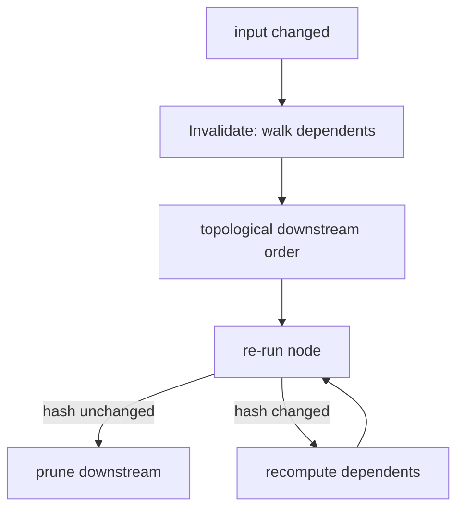

# [APPHOST_DETERMINISM_AND_REPLAY]

The reproducibility kernel for the runtime spine: one determinism context pins the RNG seed, the floating-point mode, and the environment fingerprint so a recorded run reproduces bit-for-bit, a hash-chained command log appends every executed command as a content-addressed entry whose hash links to its predecessor, a replay-verify rail re-executes a recorded log and proves each step's content hash matches, a macro engine records a command sequence and replays it as a reusable unit, and a partial-recompute graph re-runs only the downstream of a changed input by walking the content-address dependency edges. The page owns the determinism context, the content-addressed event log, the replay-verify rail, the macro record/replay engine, and the partial-recompute graph; it consumes `CommandReceipt`/`CommandAlgebra`, `HostFingerprint`, `ReceiptEnvelope`/`ReceiptSinkPort` (HLC stamp), `OpLog`/`OpLogEntry` (the durable changefeed), `CorrelationId`, and `TenantContext` as settled vocabulary and mints no eighth port.

## [1]-[INDEX]

| [INDEX] | [CLUSTER]          | [OWNS]                                                                |
| :-----: | :----------------- | :-------------------------------------------------------------------- |
|   [1]   | DETERMINISM_KERNEL | Pinned RNG, float mode, environment fingerprint for reproducible runs |
|   [2]   | EVENT_LOG          | Hash-chained content-addressed command log; append, verify-chain      |
|   [3]   | REPLAY_VERIFY      | Re-execute a recorded log; prove per-step content-hash identity       |
|   [4]   | MACRO_ENGINE       | Record a command sequence; replay it as a reusable parameterized unit |
|   [5]   | RECOMPUTE_GRAPH    | Content-address dependency edges; partial downstream recompute        |
|   [6]   | TS_PROJECTION      | Event-log entry and replay-result wire shapes the dashboard consumes  |

## [2]-[DETERMINISM_KERNEL]

- Owner: `FloatMode` `[SmartEnum<string>]` the floating-point determinism mode; `DeterminismContext` the pinned-run context record; `EnvFingerprint` the environment-identity record; `DeterminismKernel` the static context-establishment surface.
- Cases: 3 float modes — strict, fast, cross-platform — strict pins IEEE round-to-nearest with FMA disabled for bit-identity, fast admits vectorized reassociation, cross-platform pins the lowest-common-denominator mode every supported RID reproduces.
- Entry: `Establish(ulong seed, FloatMode mode, HostFingerprint host)` returns `DeterminismContext` — pins the RNG seed, sets the float mode, and captures the environment fingerprint so a run under the context is reproducible; `Rng(DeterminismContext context, string stream)` returns a stream-keyed deterministic `Random` so each named random stream derives independently from the root seed.
- Auto: the RNG is seeded from the root seed XOR the stream key's `XxHash3` so two named streams in one run are independent yet both reproduce from the same root seed; the environment fingerprint composes the `HostFingerprint` (the Compute benchmark-claim host identity) with the float mode and the runtime version so a replay on a divergent environment is detected before it produces a wrong result; the float mode binds the process's `System.Runtime` floating-point configuration at context establishment so a strict-mode run disables FMA contraction across the whole run, never per-call; the context stamps every command receipt's correlation so a recorded command carries its determinism context.
- Receipt: `DeterminismContext` carries the seed, float mode, and environment fingerprint; a determinism mismatch at replay surfaces as a typed replay fault, never a silent wrong result.
- Packages: Thinktecture.Runtime.Extensions, LanguageExt.Core, System.IO.Hashing, BCL inbox
- Growth: one float mode is one `FloatMode` row; one environment dimension is one field on `EnvFingerprint`; a new random stream is one stream key, never a second RNG owner; zero new surface.
- Boundary: the determinism kernel is the only reproducibility owner — an ambient `Random.Shared`, a `DateTime.Now`-seeded RNG, and a per-call float-mode flip are the deleted forms; the kernel consumes the Compute `HostFingerprint` as the environment identity so determinism and benchmark-claim gating share one host-identity truth, never two; the cross-platform float mode is the reproducibility-across-RID guarantee — a run pinned to cross-platform mode reproduces bit-identically on osx-arm64, linux-x64, and win-x64, so a recorded run replays anywhere; the seed is the run's single entropy source so a reproducible run draws all randomness from the seed and the kernel forbids ambient entropy; the time source under a determinism context is the recorded run's clock, so a replay reads the recorded instants rather than the wall clock, composing the existing `ClockPolicy` test-clock seam.

```csharp signature
[SmartEnum<string>]
[KeyMemberEqualityComparer<CapabilityKeyPolicy, string>]
[KeyMemberComparer<CapabilityKeyPolicy, string>]
public sealed partial class FloatMode {
    public static readonly FloatMode Strict = new("strict", fmaContraction: false, vectorReassociation: false);
    public static readonly FloatMode Fast = new("fast", fmaContraction: true, vectorReassociation: true);
    public static readonly FloatMode CrossPlatform = new("cross-platform", fmaContraction: false, vectorReassociation: false);

    public bool FmaContraction { get; }
    public bool VectorReassociation { get; }
}

public sealed record EnvFingerprint(
    HostFingerprint Host,
    string FloatMode,
    string RuntimeVersion,
    string Rid) {
    public string Digest =>
        Convert.ToHexStringLower(System.IO.Hashing.XxHash128.Hash(
            Encoding.UTF8.GetBytes($"{Host}:{FloatMode}:{RuntimeVersion}:{Rid}")));
}

public sealed record DeterminismContext(
    ulong Seed,
    FloatMode Mode,
    EnvFingerprint Fingerprint) {
    public Random Rng(string stream) =>
        new Random(unchecked((int)(Seed ^ System.IO.Hashing.XxHash3.HashToUInt64(Encoding.UTF8.GetBytes(stream)))));
}

public static class DeterminismKernel {
    public static DeterminismContext Establish(ulong seed, FloatMode mode, HostFingerprint host, string runtimeVersion, string rid) =>
        new(seed, mode, new EnvFingerprint(host, mode.Key, runtimeVersion, rid));

    public static bool Reproduces(DeterminismContext recorded, DeterminismContext live) =>
        recorded.Seed == live.Seed
        && recorded.Mode == live.Mode
        && recorded.Fingerprint.Digest == live.Fingerprint.Digest;
}
```

## [3]-[EVENT_LOG]

- Owner: `LogEntry` the content-addressed command-log entry; `ContentHash` the chain-hash value object; `EventLog` the static append-and-verify surface.
- Entry: `Append(EventLog.Chain chain, CommandReceipt receipt, DeterminismContext context)` returns `(EventLog.Chain Chain, LogEntry Entry)` — folds one command receipt into a new content-addressed entry whose hash chains to the predecessor; `VerifyChain(Seq<LogEntry> entries)` returns `Fin<Unit>` — proves every entry's predecessor-hash matches the actual predecessor content hash so a tampered or reordered entry fails the chain.
- Auto: each entry's content hash is `XxHash128` over the canonical-serialized command, its arguments digest, the determinism context digest, and the predecessor hash, so the chain is tamper-evident — altering any entry breaks every downstream hash; the entry is content-addressed so an identical command under an identical context produces an identical hash, the dedup and recompute-skip key; the chain root is the genesis hash so a chain proves its own origin; the log appends to the durable `OpLog` changefeed as one `OpLogEntry` per command so the event log rides the existing durable changefeed, never a second store.
- Receipt: `LogEntry` carries the sequence index, the content hash, the predecessor hash, the command descriptor id, the arguments digest, the determinism digest, and the HLC stamp; the entry is the log's evidence, never a separate receipt.
- Packages: LanguageExt.Core, NodaTime, Thinktecture.Runtime.Extensions, System.IO.Hashing, BCL inbox
- Growth: one entry field is one column on `LogEntry`; a new hash algorithm is one `ContentHash` policy value; zero new surface.
- Boundary: the event log is the only command-log owner — an ad hoc audit table, a per-command log line, and a non-chained event store are the deleted forms; the chain rides the durable `OpLog` so the command log and the durable changefeed are one stream — each `LogEntry` projects to one `OpLogEntry`, so the suite has one event-sourcing truth, not a separate determinism log; the content hash is the recompute-skip and replay-verify key so the same hash means the same command-under-context, deduplicating a re-executed identical command; the HLC stamp orders entries across processes so a multi-process command log merges by HLC, composing the existing `ReceiptEnvelope` causal primitive; the chain verify is the tamper-evidence guarantee, so a support bundle's command log proves its own integrity.

```csharp signature
[ValueObject<string>(
    KeyMemberName = "Value",
    ConversionToKeyMemberType = ConversionOperatorsGeneration.Implicit,
    ConversionFromKeyMemberType = ConversionOperatorsGeneration.None)]
public readonly partial struct ContentHash {
    public static readonly ContentHash Genesis = ContentHash.Create("0000000000000000");
}

public sealed record LogEntry(
    long Sequence,
    ContentHash Hash,
    ContentHash Predecessor,
    string Descriptor,
    string ArgumentsDigest,
    string DeterminismDigest,
    Instant Physical,
    ulong Logical);

public static class EventLog {
    public sealed record Chain(ContentHash Head, long Sequence) {
        public static readonly Chain Genesis = new(ContentHash.Genesis, 0L);
    }

    public static (Chain Chain, LogEntry Entry) Append(Chain chain, CommandReceipt receipt, DeterminismContext context, Instant physical, ulong logical) {
        var argumentsDigest = Convert.ToHexStringLower(System.IO.Hashing.XxHash128.Hash(Encoding.UTF8.GetBytes(receipt.Descriptor)));
        var hash = ContentHash.Create(Convert.ToHexStringLower(System.IO.Hashing.XxHash128.Hash(
            Encoding.UTF8.GetBytes($"{chain.Head.Value}:{receipt.Descriptor}:{argumentsDigest}:{context.Fingerprint.Digest}:{chain.Sequence}"))));
        var entry = new LogEntry(chain.Sequence + 1L, hash, chain.Head, receipt.Descriptor, argumentsDigest, context.Fingerprint.Digest, physical, logical);
        return (new Chain(hash, chain.Sequence + 1L), entry);
    }

    public static Fin<Unit> VerifyChain(Seq<LogEntry> entries) =>
        entries.Fold(Fin.Succ((Prev: ContentHash.Genesis, Seq: 0L)), (acc, entry) =>
            acc.Bind(state =>
                entry.Predecessor == state.Prev && entry.Sequence == state.Seq + 1L
                    ? Fin.Succ((entry.Hash, entry.Sequence))
                    : Fin.Fail<(ContentHash, long)>(new ReplayFault.ChainBroken($"chain-break:{entry.Sequence}"))))
            .Map(static _ => unit);

    public static OpLogEntry ToOpLog(LogEntry entry, TenantContext tenant) =>
        OpLog.Entry(SyncOpKind.Insert, entry.Descriptor, entry.Hash.Value, tenant, entry.Physical, entry.Logical);
}
```

## [4]-[REPLAY_VERIFY]

- Owner: `ReplayOutcome` `[Union]` the per-step replay disposition; `ReplayFault` `[Union]` fault family in the 4760 band; `ReplayVerify` the static re-execute-and-prove surface.
- Cases: replay dispositions Matched | Diverged | EnvironmentMismatch | Skipped; `ReplayFault` = Text | ChainBroken | HashDiverged | EnvIncompatible.
- Entry: `Replay(ReplayRuntime runtime, Seq<LogEntry> log, DeterminismContext live)` returns `IO<Seq<ReplayOutcome>>` — re-executes a recorded command log under a live determinism context, re-deriving each step's content hash and proving it matches the recorded hash, so a replay either reproduces the recorded run exactly or names the first divergent step.
- Auto: the replay first proves the live environment reproduces the recorded one through `DeterminismKernel.Reproduces` so a divergent environment fails the whole replay before re-executing a single step; each step re-runs the recorded command through the command algebra under the recorded determinism context, re-derives its content hash, and compares it to the recorded entry's hash so a divergence is detected at the exact step it occurred; a matched step confirms bit-identity, a diverged step names the recorded and re-derived hashes so the divergence is diagnosable; the replay chains the verification so the first divergence halts the replay because every downstream hash depends on the diverged step.
- Receipt: each step yields one `ReplayOutcome`; the replay summary rides the existing receipt stream — no parallel replay receipt.
- Packages: LanguageExt.Core, NodaTime, Thinktecture.Runtime.Extensions, BCL inbox
- Growth: one disposition is one `ReplayOutcome` case; one fault is one `ReplayFault` case; zero new surface.
- Boundary: the replay-verify is the only reproducibility-proof owner — a re-run without hash comparison, a best-effort replay, and an environment-blind replay are the deleted forms; the replay reuses the command algebra so a replayed command runs through the same dispatch, broker, and substrate selection a live command runs through, so the replay proves the real execution path reproduces, not a stubbed one; the environment-reproduces check is the precondition so a replay never claims a match on a divergent environment; the content-hash comparison is the bit-identity proof so a matched replay is a cryptographic guarantee the recorded run reproduces; a diverged step is the debugging surface — it names the descriptor and both hashes so a non-determinism source is traceable to one command.

```csharp signature
[Union(ConversionFromValue = ConversionOperatorsGeneration.None)]
public abstract partial record ReplayOutcome {
    private ReplayOutcome() { }
    public sealed record Matched(long Sequence, ContentHash Hash) : ReplayOutcome;
    public sealed record Diverged(long Sequence, ContentHash Recorded, ContentHash Rederived) : ReplayOutcome;
    public sealed record EnvironmentMismatch(string Recorded, string Live) : ReplayOutcome;
    public sealed record Skipped(long Sequence, string Reason) : ReplayOutcome;
}

[Union]
public abstract partial record ReplayFault : Expected, IValidationError<ReplayFault> {
    private ReplayFault(string detail, int code) : base(detail, code, None) { }
    public static ReplayFault Create(string message) => new Text(message);
    public sealed record Text : ReplayFault { public Text(string detail) : base(detail, 4760) { } }
    public sealed record ChainBroken : ReplayFault { public ChainBroken(string detail) : base(detail, 4761) { } }
    public sealed record HashDiverged : ReplayFault { public HashDiverged(string detail) : base(detail, 4762) { } }
    public sealed record EnvIncompatible : ReplayFault { public EnvIncompatible(string detail) : base(detail, 4763) { } }
}

public sealed record ReplayRuntime(
    CommandRuntime Command,
    Func<LogEntry, CommandArguments> ArgumentsOf,
    DeterminismContext Recorded,
    ClockPolicy Clocks,
    ReceiptSinkPort Sink);

public static class ReplayVerify {
    public static IO<Seq<ReplayOutcome>> Replay(ReplayRuntime runtime, Seq<LogEntry> log, DeterminismContext live) =>
        DeterminismKernel.Reproduces(runtime.Recorded, live)
            ? EventLog.VerifyChain(log).Match(
                Succ: _ => log.FoldM(Seq<ReplayOutcome>(), (acc, entry) =>
                    acc.LastOrNone().Map(static last => last is ReplayOutcome.Diverged).IfNone(false)
                        ? IO.pure(acc.Add(new ReplayOutcome.Skipped(entry.Sequence, "downstream-of-divergence")))
                        : Step(runtime, entry).Map(outcome => acc.Add(outcome))).As(),
                Fail: error => IO.pure(Seq<ReplayOutcome>(new ReplayOutcome.Skipped(0L, error.Message)))) 
            : IO.pure(Seq<ReplayOutcome>(new ReplayOutcome.EnvironmentMismatch(runtime.Recorded.Fingerprint.Digest, live.Fingerprint.Digest)));

    static IO<ReplayOutcome> Step(ReplayRuntime runtime, LogEntry entry) =>
        CommandAlgebra.Run(runtime.Command, entry.Descriptor, runtime.ArgumentsOf(entry))
            .Map(receipt => Rederive(entry, receipt));

    static ReplayOutcome Rederive(LogEntry entry, CommandReceipt receipt) {
        var rederived = ContentHash.Create(Convert.ToHexStringLower(System.IO.Hashing.XxHash128.Hash(
            Encoding.UTF8.GetBytes($"{entry.Predecessor.Value}:{receipt.Descriptor}:{entry.ArgumentsDigest}:{entry.DeterminismDigest}:{entry.Sequence - 1L}"))));
        return rederived == entry.Hash
            ? new ReplayOutcome.Matched(entry.Sequence, entry.Hash)
            : new ReplayOutcome.Diverged(entry.Sequence, entry.Hash, rederived);
    }
}
```

## [5]-[MACRO_ENGINE]

- Owner: `Macro` the recorded-command-sequence record; `MacroParameter` the parameterized-substitution row; `MacroEngine` the static record-and-replay surface.
- Entry: `Record(Seq<LogEntry> entries, Seq<MacroParameter> parameters)` returns `Macro` — captures a command subsequence as a reusable macro with parameter substitution points; `Play(MacroEngine.Runtime runtime, Macro macro, HashMap<string, JsonElement> bindings)` returns `IO<Seq<CommandReceipt>>` — replays the macro's commands as one batch with the parameter bindings substituted, so a recorded workflow becomes a reusable parameterized operation.
- Auto: a macro records the content hashes of its commands so a macro is content-addressed and a re-recorded identical sequence is the same macro; the parameters mark argument substitution points so a macro recorded with a concrete value replays with a different value bound, turning a one-off sequence into a reusable template; the macro replay rides the command algebra `Batch` so a macro is an all-or-nothing intent group — a failing command rolls back the whole macro, never a half-applied workflow; a macro's commands are the recorded log entries so a macro is a slice of the event log, never a separate recording format.
- Receipt: the macro play yields the batch's `CommandReceipt` sequence; the macro itself logs its own content hash on record — no parallel macro receipt.
- Packages: LanguageExt.Core, Thinktecture.Runtime.Extensions, System.IO.Hashing, BCL inbox
- Growth: one parameter is one `MacroParameter` row; a new substitution shape is one column on `MacroParameter`; zero new surface.
- Boundary: the macro engine is the only command-recording owner — a UI macro recorder, a script-based replay, and a separate macro store are the deleted forms; a macro is a slice of the event log so the macro and the command log share one recording, and a macro replay re-runs through the command algebra so a macro gains no privileged execution; the parameterization is argument substitution at the recorded points so a macro is a template, not a literal replay, distinguishing a reusable macro from a raw replay-verify; the macro replay is an atomic batch so a macro is transactional, and a failing macro rolls back through the command algebra's unwind; the macro's content hash is its identity so a shared macro is verifiable — two parties with the same macro hash replay the identical sequence.

```csharp signature
public sealed record MacroParameter(
    string Name,
    long AtSequence,
    string JsonPath,
    DataClassification Classification);

public sealed record Macro(
    string MacroId,
    ContentHash Hash,
    Seq<LogEntry> Commands,
    Seq<MacroParameter> Parameters) {
    public static Macro Record(string macroId, Seq<LogEntry> entries, Seq<MacroParameter> parameters) =>
        new(macroId,
            ContentHash.Create(Convert.ToHexStringLower(System.IO.Hashing.XxHash128.Hash(
                Encoding.UTF8.GetBytes(string.Join(':', entries.Map(static e => e.Hash.Value)))))),
            entries, parameters);
}

public static class MacroEngine {
    public sealed record Runtime(CommandRuntime Command, Func<LogEntry, HashMap<string, JsonElement>, CommandArguments> Substitute);

    public static IO<Seq<CommandReceipt>> Play(Runtime runtime, Macro macro, HashMap<string, JsonElement> bindings) =>
        CommandAlgebra.Batch(runtime.Command, macro.Commands.Map(entry => (entry.Descriptor, runtime.Substitute(entry, bindings))));
}
```

## [6]-[RECOMPUTE_GRAPH]

- Owner: `RecomputeNode` the content-addressed dependency node; `RecomputeGraph` the static dependency-walk-and-recompute surface.
- Entry: `Invalidate(RecomputeGraph.Graph graph, ContentHash changed)` returns `Seq<ContentHash>` — walks the dependency edges from a changed input and returns the downstream nodes whose content hash must recompute, so a single input change recomputes only its transitive downstream, never the whole graph; `Recompute(RecomputeRuntime runtime, RecomputeGraph.Graph graph, ContentHash changed)` returns `IO<Seq<CommandReceipt>>` — re-runs only the invalidated downstream commands in dependency order.
- Auto: each node's content hash is the hash of its command plus its input nodes' hashes so a node's identity changes exactly when its command or any upstream input changes — the memoization key; an unchanged upstream means an unchanged downstream hash means a recompute skip, so the graph recomputes the minimal downstream cone; the dependency order is a topological walk over the content-address edges so a recompute runs each node after its inputs; a node whose re-derived hash matches its prior hash short-circuits its own downstream because an unchanged output cannot change its dependents — the recompute prunes at the first unchanged node.
- Receipt: the recompute yields the `CommandReceipt` sequence of the re-run nodes; the skipped nodes log one `SpineLog` event with the skip count — no per-skip receipt.
- Packages: LanguageExt.Core, Thinktecture.Runtime.Extensions, BCL inbox
- Growth: one node field is one column on `RecomputeNode`; the dependency walk is one fold, never a second graph; zero new surface.
- Boundary: the recompute graph is the only incremental-recompute owner — a full re-run on any change, a manual dependency tracking, and a separate dependency store are the deleted forms; the content-address node identity is the memoization key so the graph recomputes exactly the changed cone, the incremental-compute guarantee; the graph reuses the command algebra so a recomputed node re-runs through the same dispatch a fresh command runs through; the short-circuit at an unchanged output is the key efficiency — a change that does not propagate (a value that recomputes to the same hash) prunes its downstream, so the recompute is minimal not just incremental; the graph edges are content-address dependencies so the graph is reconstructible from the event log — the dependency structure is recorded, not separately maintained.

```csharp signature
public sealed record RecomputeNode(
    ContentHash Hash,
    string Descriptor,
    Seq<ContentHash> Inputs);

public static class RecomputeGraph {
    public sealed record Graph(HashMap<ContentHash, RecomputeNode> Nodes, ILookup<ContentHash, ContentHash> Dependents) {
        public static Graph Of(Seq<RecomputeNode> nodes) =>
            new(nodes.Fold(HashMap<ContentHash, RecomputeNode>.Empty, static (map, node) => map.Add(node.Hash, node)),
                nodes.SelectMany(static node => node.Inputs.Map(input => (Input: input, Node: node.Hash)))
                    .ToLookup(static edge => edge.Input, static edge => edge.Node));
    }

    public static Seq<ContentHash> Invalidate(Graph graph, ContentHash changed) =>
        Walk(graph, changed, Seq<ContentHash>(), HashSet<ContentHash>.Empty).Item1;

    static (Seq<ContentHash>, HashSet<ContentHash>) Walk(Graph graph, ContentHash node, Seq<ContentHash> order, HashSet<ContentHash> seen) =>
        seen.Contains(node)
            ? (order, seen)
            : graph.Dependents[node].Fold(
                (order.Add(node), seen.Add(node)),
                (acc, dependent) => Walk(graph, dependent, acc.Item1, acc.Item2));

    public static IO<Seq<CommandReceipt>> Recompute(RecomputeRuntime runtime, Graph graph, ContentHash changed) =>
        Invalidate(graph, changed).Tail
            .Filter(hash => graph.Nodes.ContainsKey(hash))
            .TraverseM(hash => graph.Nodes.Find(hash).Match(
                Some: node => CommandAlgebra.Run(runtime.Command, node.Descriptor, runtime.ArgumentsOf(node)),
                None: () => IO.pure<CommandReceipt>(default!)))
            .As();
}

public sealed record RecomputeRuntime(CommandRuntime Command, Func<RecomputeNode, CommandArguments> ArgumentsOf);
```



## [7]-[TS_PROJECTION]

- Owner: `LogEntryWire`, `ReplayOutcomeWire`, `DeterminismContextWire` — the event-log entry and replay-result wire shapes the reproducibility dashboard consumes; the command receipts ride the existing `ReceiptEnvelopeWire`.
- Entry: the event-log entries cross as the chained sequence the dashboard renders as a verifiable timeline, the replay outcomes cross as the per-step match/diverge result, and the determinism context crosses so the dashboard shows the seed and environment a run pinned.
- Packages: BCL inbox
- Growth: one wire-member row per new entry or outcome field; the replay outcome crosses as a literal-discriminated union; zero new surface.
- Boundary: content hashes cross as their hex-string value-object keys; the float mode crosses as its smart-enum key; the replay outcome reconstructs in TS as a literal-discriminated union on the disposition kind; the HLC stamp crosses through the existing `HlcStampWire` so the event log's ordering reads the same causal primitive the receipt envelope carries, never a re-minted timeline.

```ts contract
type FloatModeKey = "strict" | "fast" | "cross-platform";

interface DeterminismContextWire {
  readonly seed: string;
  readonly mode: FloatModeKey;
  readonly fingerprint: { readonly digest: string; readonly rid: string; readonly runtimeVersion: string };
}

interface LogEntryWire {
  readonly sequence: number;
  readonly hash: string;
  readonly predecessor: string;
  readonly descriptor: string;
  readonly argumentsDigest: string;
  readonly determinismDigest: string;
  readonly physical: string;
  readonly logical: number;
}

type ReplayOutcomeWire =
  | { readonly kind: "matched"; readonly sequence: number; readonly hash: string }
  | { readonly kind: "diverged"; readonly sequence: number; readonly recorded: string; readonly rederived: string }
  | { readonly kind: "environment-mismatch"; readonly recorded: string; readonly live: string }
  | { readonly kind: "skipped"; readonly sequence: number; readonly reason: string };
```

## [8]-[RESEARCH]

- [FLOAT_DETERMINISM]: the cross-platform floating-point determinism guarantee — a `FloatMode.CrossPlatform` run reproducing bit-identically across osx-arm64, linux-x64, and win-x64 — confirms against the runtime's floating-point configuration surface (FMA-contraction and vector-reassociation control) at the integrated host on each RID; the strict-mode FMA-disable and the cross-platform lowest-common-denominator mode carry settled member shapes and stay a tier-2 cross-RID harness probe.
- [OPLOG_PROJECTION]: the `EventLog.ToOpLog` projection of a `LogEntry` to one `OpLogEntry` and the `OpLog.Entry` constructor arity resolve against the finalized Persistence sync-collaboration#OPLOG_CHANGEFEED surface, so the command log rides the durable changefeed and never a second store; the HLC-ordered cross-process log merge confirms against the existing `ReceiptEnvelope` causal primitive.
- [HOST_FINGERPRINT]: the `HostFingerprint` environment-identity record the determinism context composes resolves against the finalized Compute receipts-and-benchmarks#BENCHMARK_CLAIMS surface, so reproducibility and benchmark-claim gating share one host-identity truth.
