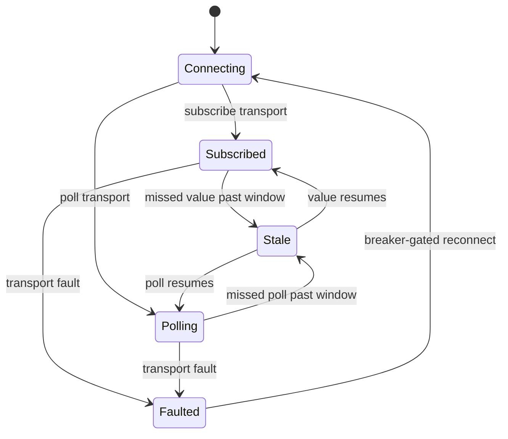

# [APPHOST_LIVE_WIRE]

The reactive bidirectional external-binding studio for the runtime spine: one industrial-transport axis carries every two-way edge — OPC-UA, Modbus, MQTT, serial, REST, GraphQL, spreadsheet, ERP/PLM — as rows whose adapter reads and writes through one binding contract, a binding spec pairs an external source with an internal target and a direction, every inbound value coerces its unit at the edge through the Compute unit algebra before it enters the suite, a write-back transaction commits an outbound value with an acknowledgement receipt and rolls back on rejection, and a binding-health lifecycle tracks connect, subscribe, stale, and fault states per binding. The page owns the transport axis, the binding spec and direction, the edge unit coercion, the write-back transaction, and the binding-health lifecycle; it consumes `QuantityFamily`/`UnitAlgebra`/`UnitPolicy`, `OutboundHop`/`OutboundSurface`, `SchedulePort`/`ScheduleEntry`, `CommandAlgebra`, `DeadlineClass`, `DegradationLevel`, and `ReceiptSinkPort` as settled vocabulary and mints no eighth port.

## [1]-[INDEX]

| [INDEX] | [CLUSTER]      | [OWNS]                                                                       |
| :-----: | :------------- | :--------------------------------------------------------------------------- |
|   [1]   | TRANSPORT_AXIS | Eight industrial-transport rows; one read/write adapter contract             |
|   [2]   | BINDING_SPEC   | Source-target binding, direction, edge unit coercion, poll/subscribe cadence |
|   [3]   | WRITE_BACK     | Outbound write-back transaction, acknowledgement, rollback                   |
|   [4]   | BINDING_HEALTH | Per-binding connect/subscribe/stale/fault lifecycle and health contribution  |
|   [5]   | TS_PROJECTION  | Binding-status and write-receipt wire shapes the studio dashboard consumes   |

## [2]-[TRANSPORT_AXIS]

- Owner: `ExternalTransport` `[SmartEnum<string>]` the eight-row industrial-transport axis under the `CapabilityKeyPolicy` accessor; `TransportRow` per-transport policy record; `TransportRows` the frozen row set with the total dispatch; `WireFault` `[Union]` fault family in the 4720 band; `ExternalValue` the at-edge value carrier.
- Cases: opc-ua, modbus, mqtt, serial, rest, graphql, spreadsheet, erp-plm — each carrying its read shape (poll versus subscribe), its write capability, and the outbound hop class its bytes ride; `WireFault` = Text | ConnectRejected | ReadFailed | WriteRejected | UnitRejected | StaleSource.
- Entry: `TransportRow Row` is the extension property total state-free `Switch` from transport to frozen row; `Read(TransportRow row, BindingSpec spec, CancellationToken token)` returns `IO<ExternalValue>` carrying the inbound read effect, `Write(TransportRow row, BindingSpec spec, ExternalValue value, CancellationToken token)` returns `IO<HopReceipt>` carrying the outbound write effect.
- Auto: a `Subscribe`-shaped transport (OPC-UA, MQTT) opens a streaming subscription whose values arrive as a reactive sequence, while a `Poll`-shaped transport (Modbus, REST, GraphQL, spreadsheet, ERP/PLM) reads on a `SchedulePort` cadence row, so the binding engine reads both shapes through one contract differing only by the row's `ReadShape` column; the transport bytes ride the existing `OutboundHop` cases — REST and GraphQL on `HttpApi`, MQTT and OPC-UA on a keyed `LocalIpc`/`ServerStream` pipeline, serial on a process-spawn adapter — so the resilience, retry, and breaker semantics are the existing hop policy, never a per-transport retry loop; the `Writable` column gates the write-back so a read-only source (a spreadsheet view) rejects a write at the row, never at the transaction.
- Receipt: `ExternalValue` carries the raw value, its declared unit, the source quality flag, and the source timestamp; the read and write transitions log through one `SpineLog` event.
- Packages: OPCFoundation.NetStandard.Opc.Ua, OPCFoundation.NetStandard.Opc.Ua.PubSub, MQTTnet, Thinktecture.Runtime.Extensions, LanguageExt.Core, NodaTime, BCL inbox
- Growth: one transport row absorbs a new industrial edge — a new fieldbus or ERP connector is one `ExternalTransport` row carrying its read shape, write capability, and hop class, never a parallel adapter; a new fault is one `WireFault` case; zero new surface.
- Boundary: the transport axis is the only external-binding owner — a per-protocol client, a protocol-specific binding service, and a parallel poller are the deleted forms, so all eight transports ride one adapter contract; the OPC-UA leg composes the OPC-Foundation-certified `OPCFoundation.NetStandard.Opc.Ua` session/subscription/monitored-item surface (with `.PubSub` for the PubSub-over-MQTT leg), the MQTT leg composes `MQTTnet`, and the REST/GraphQL legs compose the existing `OutboundHop.HttpApi` — a hand-rolled OPC-UA or MQTT client is the deleted form; the transport never owns its own resilience — it composes the `OutboundHop` row its bytes ride, so a flapping Modbus source breaks on the same circuit breaker an HTTP API breaks on; the at-edge value carries its declared unit so the coercion at `BINDING_SPEC` reads a known unit, never a guessed one; a subscribe transport's reactive sequence and a poll transport's scheduled read are one inbound contract, so the binding engine never branches on transport at the call site; serial and spreadsheet transports that have no native streaming poll on the schedule cadence, so the cadence is the row's read mechanism, not a transport quirk.

```csharp signature
[SmartEnum<string>]
[KeyMemberEqualityComparer<CapabilityKeyPolicy, string>]
[KeyMemberComparer<CapabilityKeyPolicy, string>]
public sealed partial class ReadShape {
    public static readonly ReadShape Poll = new("poll");
    public static readonly ReadShape Subscribe = new("subscribe");
}

[SmartEnum<string>]
[KeyMemberEqualityComparer<CapabilityKeyPolicy, string>]
[KeyMemberComparer<CapabilityKeyPolicy, string>]
public sealed partial class ExternalTransport {
    public static readonly ExternalTransport OpcUa = new("opc-ua");
    public static readonly ExternalTransport Modbus = new("modbus");
    public static readonly ExternalTransport Mqtt = new("mqtt");
    public static readonly ExternalTransport Serial = new("serial");
    public static readonly ExternalTransport Rest = new("rest");
    public static readonly ExternalTransport GraphQl = new("graphql");
    public static readonly ExternalTransport Spreadsheet = new("spreadsheet");
    public static readonly ExternalTransport ErpPlm = new("erp-plm");
}

[Union]
public abstract partial record WireFault : Expected, IValidationError<WireFault> {
    private WireFault(string detail, int code) : base(detail, code, None) { }
    public static WireFault Create(string message) => new Text(message);
    public sealed record Text : WireFault { public Text(string detail) : base(detail, 4720) { } }
    public sealed record ConnectRejected : WireFault { public ConnectRejected(string detail) : base(detail, 4721) { } }
    public sealed record ReadFailed : WireFault { public ReadFailed(string detail) : base(detail, 4722) { } }
    public sealed record WriteRejected : WireFault { public WriteRejected(string detail) : base(detail, 4723) { } }
    public sealed record UnitRejected : WireFault { public UnitRejected(string detail) : base(detail, 4724) { } }
    public sealed record StaleSource : WireFault { public StaleSource(string detail) : base(detail, 4725) { } }
}

public readonly record struct ExternalValue(
    double Raw,
    string Unit,
    bool Good,
    Instant SourceAt);

public sealed record TransportRow(
    ExternalTransport Transport,
    ReadShape ReadShape,
    bool Writable,
    OutboundHop Hop,
    DeadlineClass Attempt);

public static class TransportRows {
    public static readonly TransportRow OpcUa = new(ExternalTransport.OpcUa, ReadShape.Subscribe, Writable: true, new OutboundHop.ServerStream(new Uri("opc.tcp://localhost")), DeadlineClass.HopAttempt);
    public static readonly TransportRow Modbus = new(ExternalTransport.Modbus, ReadShape.Poll, Writable: true, new OutboundHop.HttpApi(new Uri("http://localhost")), DeadlineClass.HopAttempt);
    public static readonly TransportRow Mqtt = new(ExternalTransport.Mqtt, ReadShape.Subscribe, Writable: true, new OutboundHop.ServerStream(new Uri("mqtt://localhost")), DeadlineClass.HopAttempt);
    public static readonly TransportRow Serial = new(ExternalTransport.Serial, ReadShape.Poll, Writable: true, new OutboundHop.CompanionSpawn(new ProcessStartInfo("rasm-serial")), DeadlineClass.HopAttempt);
    public static readonly TransportRow Rest = new(ExternalTransport.Rest, ReadShape.Poll, Writable: true, new OutboundHop.HttpApi(new Uri("https://localhost")), DeadlineClass.HopAttempt);
    public static readonly TransportRow GraphQl = new(ExternalTransport.GraphQl, ReadShape.Poll, Writable: true, new OutboundHop.HttpApi(new Uri("https://localhost/graphql")), DeadlineClass.HopAttempt);
    public static readonly TransportRow Spreadsheet = new(ExternalTransport.Spreadsheet, ReadShape.Poll, Writable: false, new OutboundHop.HttpApi(new Uri("https://localhost")), DeadlineClass.HopAttempt);
    public static readonly TransportRow ErpPlm = new(ExternalTransport.ErpPlm, ReadShape.Poll, Writable: true, new OutboundHop.HttpApi(new Uri("https://localhost")), DeadlineClass.HopAttempt);

    extension(ExternalTransport transport) {
        public TransportRow Row => transport.Switch(
            opcUa: static () => OpcUa,
            modbus: static () => Modbus,
            mqtt: static () => Mqtt,
            serial: static () => Serial,
            rest: static () => Rest,
            graphQl: static () => GraphQl,
            spreadsheet: static () => Spreadsheet,
            erpPlm: static () => ErpPlm);
    }
}
```

## [3]-[BINDING_SPEC]

- Owner: `BindingDirection` `[Flags]` the read/write direction; `BindingSpec` the source-target binding record; `CoercedValue` the unit-coerced inbound value; `LiveWire` the static reactive binding-engine surface.
- Cases: direction flags Inbound, Outbound, Bidirectional — bidirectional binds both legs; the binding pairs one external address with one internal target through the transport row.
- Entry: `Bind(LiveWireRuntime runtime, BindingSpec spec)` returns `IO<BindingHandle>` — opens the transport, starts the inbound read (subscribe stream or scheduled poll), coerces each inbound value's unit at the edge, and pushes the coerced value to the internal target; `Coerce(QuantityFamily family, ExternalValue value, UnitPolicy policy, Guid correlation)` returns `Fin<CoercedValue>` — the at-edge unit coercion projecting the external unit into the suite's canonical unit.
- Auto: every inbound value coerces through `QuantityFamily.Admit(value.Raw, value.Unit, policy, correlation)` so an external sensor reporting in millimeters lands as canonical meters before it enters the suite, never a raw unit-ambiguous double; a poll-shaped binding registers one `ScheduleEntry` on the schedule port at its cadence so the binding engine owns no timer; a subscribe-shaped binding's reactive sequence pushes coerced values as they arrive; a `Bidirectional` binding opens both legs so an internal change writes back and an external change reads in, with the write-back transaction guarding against a feedback loop through the source-timestamp staleness check; the inbound push routes through the internal target's `CapabilityDescriptor` so a bound value lands as a real command, never a side-channel write.
- Receipt: `CoercedValue` carries the canonical value, the canonical unit, the unit evidence, and the source timestamp; each inbound push mints one binding receipt fanned through the sink.
- Packages: LanguageExt.Core, NodaTime, Thinktecture.Runtime.Extensions, BCL inbox
- Growth: one binding is one `BindingSpec` row; a new direction is impossible — the flags are closed; a new coercion rule rides the Compute unit algebra, never a binding-page coercion; zero new surface.
- Boundary: the binding engine is the only reactive-binding owner — a per-binding background loop, a protocol-specific subscription handler, and a hand-rolled poll timer are the deleted forms; unit coercion at the edge is mandatory — an inbound value that fails coercion is rejected with `WireFault.UnitRejected` and never enters the suite, so the suite's interior never sees an unconverted external unit, deleting every interior unit guess; the binding reads the Compute `QuantityFamily.Admit` overload that takes a value and a unit string, so the coercion is the suite's single unit-conversion truth and the binding never re-implements unit math; a bidirectional binding's feedback-loop guard is the source-timestamp staleness check — an outbound write the binding itself caused does not re-trigger an inbound read because the write-back records its own timestamp; the internal target is a `CapabilityDescriptor` so the inbound push is brokered, metered, and audited exactly as any command, and a binding gains no privileged write path.

```csharp signature
[Flags]
public enum BindingDirection {
    Inbound = 1,
    Outbound = 2,
    Bidirectional = Inbound | Outbound,
}

public sealed record BindingSpec(
    string BindingId,
    ExternalTransport Transport,
    string ExternalAddress,
    string InternalDescriptor,
    BindingDirection Direction,
    QuantityFamily Family,
    OccurrenceSpec Cadence,
    Duration Staleness);

public sealed record CoercedValue(
    double Canonical,
    string CanonicalUnit,
    UnitEvidence Evidence,
    Instant SourceAt);

public sealed record BindingHandle(
    BindingSpec Spec,
    CancelScope Spine,
    Atom<BindingState> State,
    Option<ScheduleEntry> Poll);

public sealed record LiveWireRuntime(
    UnitPolicy Units,
    Func<BindingSpec, CommandArguments, IO<ToolResult>> PushInbound,
    Func<DeadlineClass, Duration> Allotted,
    ClockPolicy Clocks,
    ReceiptSinkPort Sink,
    JsonSerializerOptions Wire,
    CancelScope Spine);

public static class LiveWire {
    public static Fin<CoercedValue> Coerce(QuantityFamily family, ExternalValue value, UnitPolicy policy, Guid correlation) =>
        value.Good
            ? family.Admit(value.Raw, value.Unit, policy, correlation).Match(
                Succ: evidence => Fin.Succ(new CoercedValue(evidence.Canonical, family.Canonical.ToString(), evidence, value.SourceAt)),
                Fail: error => Fin.Fail<CoercedValue>(new WireFault.UnitRejected($"{value.Unit}->{family.Canonical}:{error.Message}")))
            : Fin.Fail<CoercedValue>(new WireFault.StaleSource($"{value.Unit}@{value.SourceAt}"));

    public static IO<BindingHandle> Bind(LiveWireRuntime runtime, BindingSpec spec) =>
        from scope in IO.pure(runtime.Spine.Derive($"binding-{spec.BindingId}", runtime.Clocks.Time))
        let row = spec.Transport.Row
        from poll in spec.Direction.HasFlag(BindingDirection.Inbound) && row.ReadShape == ReadShape.Poll
            ? IO.pure(Some(PollEntry(runtime, spec, row, scope)))
            : IO.pure(Option<ScheduleEntry>.None)
        let handle = new BindingHandle(spec, scope, Atom(BindingState.Connecting), poll)
        select handle;

    public static IO<Unit> Inbound(LiveWireRuntime runtime, BindingSpec spec, ExternalValue value) =>
        Coerce(spec.Family, value, runtime.Units, Guid.NewGuid()).Match(
            Succ: coerced => runtime.PushInbound(spec, new CommandArguments(JsonSerializer.SerializeToElement(coerced, runtime.Wire), TenantContext.Current, Correlation.Mint())).Map(static _ => unit),
            Fail: fault => runtime.Sink.Send(Correlation.Mint(), TenantContext.Current, TelemetrySource.AppHost.Key, nameof(LiveWire), JsonSerializer.SerializeToElement(fault.Message, runtime.Wire)).Map(static _ => unit));

    static ScheduleEntry PollEntry(LiveWireRuntime runtime, BindingSpec spec, TransportRow row, CancelScope scope) =>
        new($"live-wire-{spec.BindingId}", spec.Cadence, row.Attempt, None,
            () => TransportRows.Read(row, spec, scope.Token).Bind(value => Inbound(runtime, spec, value)));
}
```

## [4]-[WRITE_BACK]

- Owner: `WriteBack` `[Union]` the write-back transaction disposition; `WriteReceipt` the per-write evidence record; `WriteBackSurface` the static commit-or-rollback surface.
- Cases: write-back dispositions Acknowledged | Rejected | RolledBack | Coalesced — Acknowledged carries the source ack, Rejected carries the source's write rejection, RolledBack restores the prior external value, Coalesced folds a write arriving before the prior write acknowledged.
- Entry: `Write(LiveWireRuntime runtime, BindingSpec spec, double canonicalValue)` returns `IO<WriteReceipt>` — the write-back renders the canonical value into the source's declared unit, writes it through the transport, awaits the acknowledgement, and commits or rolls back to the prior external value on rejection.
- Auto: the outbound value renders from canonical to the source's unit through `QuantityFamily.Render` so an internal meters value writes to a millimeter-expecting PLC tag in millimeters, the inverse of the inbound coercion; the write rides the transport row's `OutboundHop` so the write inherits the hop's retry, breaker, and deadline; the prior external value is read before the write so a rejected write rolls back to the last-good value rather than leaving the source in a half-written state; a write arriving while the prior write is unacknowledged coalesces so a rapid internal change does not flood the source with intermediate writes.
- Receipt: `WriteReceipt` — binding id, written canonical value, rendered external value and unit, disposition, source ack timestamp, elapsed `Duration`, correlation id.
- Packages: LanguageExt.Core, NodaTime, Thinktecture.Runtime.Extensions, BCL inbox
- Growth: one disposition is one `WriteBack` case breaking every consumer arm; zero new surface.
- Boundary: the write-back is the only outbound-edge owner — a fire-and-forget write, a per-binding write queue, and a write without acknowledgement are the deleted forms, so every write is transactional with an explicit disposition; the rendering from canonical to source unit is the inverse of the inbound coercion through the same `QuantityFamily`, so the binding's two legs share one unit truth; the rollback restores the prior external value, so a rejected write leaves the source as the binding found it, never a partial write; the coalescing prevents a write storm — a write-back in flight folds a newer write into `Coalesced` and writes the latest value once the prior acknowledges, so the source sees the settled value, not every intermediate; a non-writable transport row rejects the write at the transport with `WireFault.WriteRejected` before any byte moves, so a read-only source never receives a write attempt.

```csharp signature
[Union(ConversionFromValue = ConversionOperatorsGeneration.None)]
public abstract partial record WriteBack {
    private WriteBack() { }
    public sealed record Acknowledged(Instant SourceAck) : WriteBack;
    public sealed record Rejected(WireFault Fault) : WriteBack;
    public sealed record RolledBack(double PriorValue) : WriteBack;
    public sealed record Coalesced(double FoldedInto) : WriteBack;
}

public sealed record WriteReceipt(
    string BindingId,
    double Canonical,
    double Rendered,
    string RenderedUnit,
    WriteBack Disposition,
    Duration Elapsed,
    CorrelationId Correlation,
    Instant At);

public static class WriteBackSurface {
    public static IO<WriteReceipt> Write(LiveWireRuntime runtime, BindingSpec spec, double canonicalValue) =>
        spec.Transport.Row is var row && !row.Writable
            ? Mint(runtime, spec, canonicalValue, 0d, new WriteBack.Rejected(new WireFault.WriteRejected(spec.ExternalAddress)))
            : from rendered in IO.lift(() => spec.Family.Render(canonicalValue, runtime.Units))
              from prior in ReadPrior(runtime, spec, row)
              from value in IO.pure(new ExternalValue(double.Parse(rendered, runtime.Units.Culture), row.Transport.Key, Good: true, runtime.Clocks.Now))
              from receipt in TransportRows.Write(row, spec, value, runtime.Spine.Token)
                  .Map(hop => hop.Outcome is HopOutcome.Delivered
                      ? new WriteBack.Acknowledged(runtime.Clocks.Now) as WriteBack
                      : new WriteBack.RolledBack(prior))
                  | @catch<IO, WriteBack>(static _ => true, error => IO.pure<WriteBack>(new WriteBack.Rejected(new WireFault.WriteRejected(error.Message))))
              from minted in Mint(runtime, spec, canonicalValue, value.Raw, receipt)
              select minted;

    static IO<double> ReadPrior(LiveWireRuntime runtime, BindingSpec spec, TransportRow row) =>
        TransportRows.Read(row, spec, runtime.Spine.Token)
            .Map(value => value.Raw)
            | @catch<IO, double>(static _ => true, static _ => IO.pure(0d));

    static IO<WriteReceipt> Mint(LiveWireRuntime runtime, BindingSpec spec, double canonical, double rendered, WriteBack disposition) =>
        from at in IO.lift(() => runtime.Clocks.Now)
        let receipt = new WriteReceipt(spec.BindingId, canonical, rendered, spec.Family.Canonical.ToString(), disposition, Duration.Zero, Correlation.Mint(), at)
        from _ in runtime.Sink.Send(receipt.Correlation, TenantContext.Current, TelemetrySource.AppHost.Key, nameof(WriteBackSurface), JsonSerializer.SerializeToElement(receipt, runtime.Wire))
        select receipt;
}
```

## [5]-[BINDING_HEALTH]

- Owner: `BindingState` `[SmartEnum<string>]` the per-binding lifecycle vocabulary; `BindingHealth` the static health-contribution surface projecting binding state onto the health fold.
- Cases: 5 state rows — connecting, subscribed, polling, stale, faulted — in lifecycle order; a binding transitions connecting to subscribed/polling on connect, to stale on a missed read past its staleness window, to faulted on a transport fault.
- Entry: `Contribute(Seq<BindingHandle> bindings, Duration cadence)` returns `HealthContributorRow` — projects the aggregate binding state into one `remote`-tagged health-contributor row probing at the cadence so a faulted critical binding degrades the host through the existing degradation rail; `Transition(BindingHandle handle, BindingState next, Instant at)` folds one state transition over the binding's atom.
- Auto: a binding goes stale when its last good read is older than its staleness window, read against the injected clock so a fake-clock spec drives staleness deterministically; a faulted binding's health contribution carries `HealthStatus.Unhealthy` so a critical industrial binding's loss escalates the host to `ReducedRemote` through the existing `remote`-tagged degradation rule, never a parallel binding alarm; a binding's reconnect rides the transport's `OutboundHop` breaker so a flapping source's reconnect is rate-limited by the existing circuit breaker; the binding health row registers through the health contributor port so binding health is one row in the host health fold, never a second health surface.
- Receipt: each state transition logs through one `SpineLog` event carrying the binding id and the transition; the aggregate state is the health snapshot's contribution.
- Packages: Thinktecture.Runtime.Extensions, LanguageExt.Core, NodaTime, BCL inbox
- Growth: one state is one `BindingState` row; a new health tag rides the existing health contributor row family; zero new surface.
- Boundary: binding health is a read into the existing health fold — a parallel binding monitor, a per-binding alarm, and a binding-specific degradation level are the deleted forms; a faulted binding's consequence is the existing degradation rail, so a lost OPC-UA connection degrades the host exactly as a lost remote compute hop does, through one `remote`-tagged rule; the staleness window is the binding's own `Staleness` value read by projection, never a literal; the binding state lifecycle is the binding's own atom, distinct from the host lifecycle phase, so a binding faults and recovers without touching the host phase machine; the health contribution aggregates all bindings into one row so a host with a hundred bindings contributes one health entry, not a hundred, keeping the health fold bounded.

```csharp signature
[SmartEnum<string>]
[KeyMemberEqualityComparer<CapabilityKeyPolicy, string>]
[KeyMemberComparer<CapabilityKeyPolicy, string>]
public sealed partial class BindingState {
    public static readonly BindingState Connecting = new("connecting");
    public static readonly BindingState Subscribed = new("subscribed");
    public static readonly BindingState Polling = new("polling");
    public static readonly BindingState Stale = new("stale");
    public static readonly BindingState Faulted = new("faulted");
}

public static class BindingHealth {
    public static BindingHandle Transition(BindingHandle handle, BindingState next, Instant at) =>
        (ignore(handle.State.Swap(_ => next)), handle).Item2;

    public static HealthContributorRow Contribute(Seq<BindingHandle> bindings, Duration cadence) =>
        HealthContributorRow.Peer(
            name: nameof(BindingHealth),
            tag: HealthContributorRow.Remote,
            cadence: cadence,
            probe: _ => ValueTask.FromResult(Grade(bindings)));

    static HealthCheckResult Grade(Seq<BindingHandle> bindings) =>
        bindings.Exists(static b => b.State.Value == BindingState.Faulted)
            ? HealthCheckResult.Unhealthy($"faulted: {bindings.Count(static b => b.State.Value == BindingState.Faulted)}")
            : bindings.Exists(static b => b.State.Value == BindingState.Stale)
                ? HealthCheckResult.Degraded($"stale: {bindings.Count(static b => b.State.Value == BindingState.Stale)}")
                : HealthCheckResult.Healthy();
}
```



## [6]-[TS_PROJECTION]

- Owner: `BindingStatusWire`, `WriteReceiptWire`, `CoercedValueWire` — the binding-status and write-receipt wire shapes the live-wire studio dashboard consumes; the receipts ride the existing `ReceiptEnvelopeWire`.
- Entry: the binding status crosses as the per-binding state the studio renders, the write receipt reconstructs through the existing `ReceiptEnvelopeWire`, and the coerced value crosses with its canonical unit so the dashboard renders the suite-canonical value beside the source-declared one.
- Packages: BCL inbox
- Growth: one wire-member row per new binding field; the write disposition crosses as a literal-discriminated union; zero new surface.
- Boundary: binding state keys cross as the smart-enum string keys; the source and canonical units cross as their unit strings so the studio shows the coercion; the write disposition reconstructs in TS as a literal-discriminated union on the disposition kind; the source timestamp crosses as extended-ISO text so the studio renders source freshness against host time.

```ts contract
type ExternalTransportKey =
  | "opc-ua" | "modbus" | "mqtt" | "serial" | "rest" | "graphql" | "spreadsheet" | "erp-plm";

type BindingStateKey = "connecting" | "subscribed" | "polling" | "stale" | "faulted";

type BindingDirectionKey = "inbound" | "outbound" | "bidirectional";

interface BindingStatusWire {
  readonly bindingId: string;
  readonly transport: ExternalTransportKey;
  readonly state: BindingStateKey;
  readonly direction: BindingDirectionKey;
  readonly lastGoodAt: string | null;
}

interface CoercedValueWire {
  readonly canonical: number;
  readonly canonicalUnit: string;
  readonly sourceUnit: string;
  readonly sourceAt: string;
}

interface WriteReceiptWire {
  readonly bindingId: string;
  readonly canonical: number;
  readonly rendered: number;
  readonly renderedUnit: string;
  readonly disposition:
    | { readonly kind: "acknowledged"; readonly sourceAck: string }
    | { readonly kind: "rejected"; readonly fault: string }
    | { readonly kind: "rolled-back"; readonly priorValue: number }
    | { readonly kind: "coalesced"; readonly foldedInto: number };
  readonly elapsed: string;
  readonly correlation: string;
}
```

## [7]-[RESEARCH]

- [TRANSPORT_CLIENTS]: the OPC-UA leg composes `OPCFoundation.NetStandard.Opc.Ua` (`Session.Create`, `Subscription`/`MonitoredItem`, `WriteValue` write-back, complex-type decoding) with `OPCFoundation.NetStandard.Opc.Ua.PubSub` for the PubSub-over-MQTT path, and the MQTT leg composes `MQTTnet` (`MqttClientFactory`, subscribe/publish) — the read and write member shapes per transport confirm against these packages at integration; the Modbus and serial client surfaces ride admitted packages catalogued at app-root creation, and a missing protocol is one `ExternalTransport` row plus its admitted client, never a transport-page client reimplementation.
- [UNIT_COERCION]: the `QuantityFamily.Admit(double value, string unit, UnitPolicy policy, Guid correlation)` and `QuantityFamily.Render(double canonicalValue, UnitPolicy policy, Option<Enum> target)` overloads the edge coercion and write rendering read resolve against the finalized Compute/units#QUANTITY_TABLE surface, so the binding's coercion is the suite's single unit truth and carries no unit math of its own.
- [FEEDBACK_GUARD]: the bidirectional feedback-loop guard — a write-back the binding itself caused not re-triggering an inbound read — confirms against the source-timestamp staleness semantics at the live industrial source, the open distinction the integrated edge resolves.
