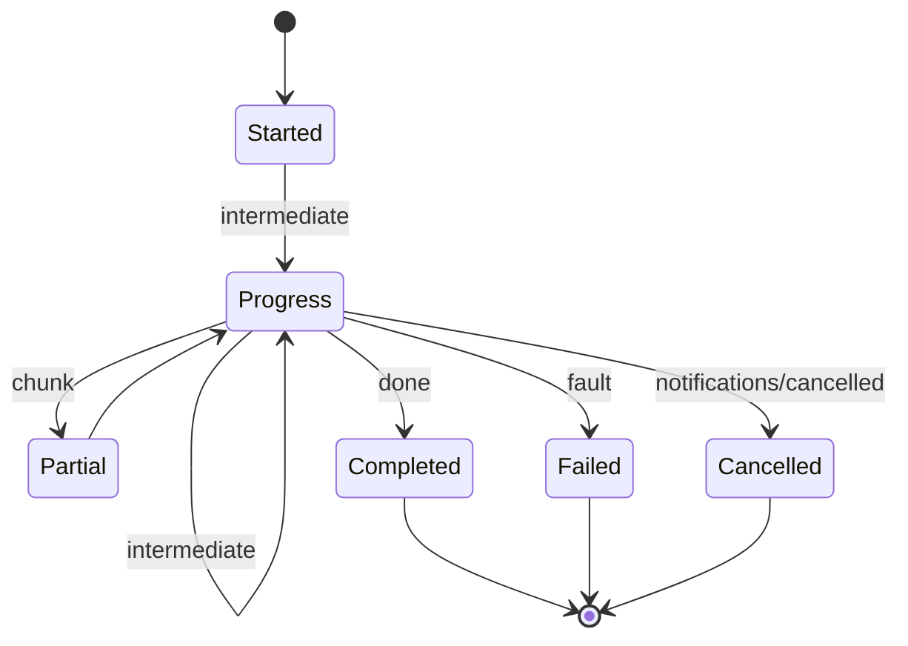

# [APPHOST_MCP_PROJECTION]

The Model Context Protocol serving surface for the runtime spine: the capability registry projects live onto an MCP tool catalog, structured discovery answers `tools/list`/`resources/list` from the descriptor fold, a dry-run cost preview prices any tool call before execution, streaming progress fans intermediate results over the gRPC server-stream substrate, cancellation rides the cancel spine, backpressure rides the keyed token-bucket admission, and a resumable handle survives a transport bounce so a long tool call reattaches its stream. The page owns the MCP method axis, the tool projection, the streaming-progress and resumable-handle legs, the dry-run preview, and the agent-session roster; it consumes `CapabilityRegistry`/`DiscoveryQuery`, `CommandAlgebra`/`GrantBroker`, `ControlInbound.DispatchTool`, `OutboundHop.ServerStream`, `CancelScope`, `TenantContext`, and `ReceiptSinkPort` as settled vocabulary and mints no eighth port.

## [1]-[INDEX]

| [INDEX] | [CLUSTER]       | [OWNS]                                                                       |
| :-----: | :-------------- | :--------------------------------------------------------------------------- |
|   [1]   | METHOD_AXIS     | MCP method vocabulary; tool/resource/prompt projection from the registry     |
|   [2]   | TOOL_DISPATCH   | Dry-run cost preview, brokered dispatch, structured tool result              |
|   [3]   | STREAM_PROGRESS | Server-stream progress fan, cancellation, backpressure, resumable handles    |
|   [4]   | TS_PROJECTION   | MCP tool-catalog and progress-frame wire shapes the agent transport consumes |

## [2]-[METHOD_AXIS]

- Owner: `McpMethod` `[SmartEnum<string>]` the MCP method vocabulary under the `CapabilityKeyPolicy` accessor; `ToolProjection` the descriptor-to-tool fold; `McpTool` the projected tool descriptor; `McpResource` the projected resource handle; `McpPrompt` the projected prompt template.
- Cases: 8 method rows — initialize, tools-list, tools-call, resources-list, resources-read, prompts-list, prompts-get, ping — the closed MCP request surface; tool/resource/prompt projections fold the registry's `DiscoveryResult` rows.
- Entry: `Project(CapabilityRegistry registry, DegradationLevel level)` returns `McpCatalog` — one fold projects the level-gated discovery result into the MCP tool catalog, so an agent sees exactly the tools the host can serve at its current degradation; `Tool(DiscoveryResult descriptor)` is the single descriptor-to-tool projection.
- Auto: the tool input schema is the `JsonSchemaExporter` schema the descriptor's `CommandArguments` resolves through `SuiteContracts.Schema`, so the MCP `inputSchema` derives from the same schema the SDK codegen and the command binder read, never a hand-authored JSON Schema; the tool annotations carry the descriptor's `EffectClass` as the MCP read-only/destructive hint (`pure`/`read` are read-only, `write`/`external`/`irreversible` are destructive) so an agent reads the side-effect class from the protocol; `Permitting` gating means a degraded host's `tools/list` shrinks to the still-servable set with zero parallel catalog.
- Receipt: the projection is a pure fold producing `McpCatalog`; the served-method transition logs through one `SpineLog` event in the 1000-1999 band — no parallel projection receipt.
- Packages: Thinktecture.Runtime.Extensions, LanguageExt.Core, BCL inbox
- Growth: one method row absorbs a new MCP request kind; a new projection target (tool, resource, prompt) is one fold arm; zero new surface — the agent transport is the registry projected, never a parallel command catalog.
- Boundary: the MCP projection is a read-only view of the capability registry — an MCP-specific tool definition divorced from a `CapabilityDescriptor` is the deleted form, so every advertised tool is a real registry descriptor and every tool call routes through the command algebra; the method axis is the closed MCP request surface and a host-specific verb rides the `ControlService` `DispatchTool` route instead, never a tenth MCP method; resource and prompt projections read the same descriptor rows filtered by effect class — a `read` descriptor projects as both a tool and a resource, a `pure` template-shaped descriptor projects as a prompt — so one descriptor source serves all three MCP surfaces; tool names are the descriptor ids verbatim so an agent's tool call resolves through `CapabilityRegistry.Resolve` with no name translation.

```csharp signature
[SmartEnum<string>]
[KeyMemberEqualityComparer<CapabilityKeyPolicy, string>]
[KeyMemberComparer<CapabilityKeyPolicy, string>]
public sealed partial class McpMethod {
    public static readonly McpMethod Initialize = new("initialize");
    public static readonly McpMethod ToolsList = new("tools/list");
    public static readonly McpMethod ToolsCall = new("tools/call");
    public static readonly McpMethod ResourcesList = new("resources/list");
    public static readonly McpMethod ResourcesRead = new("resources/read");
    public static readonly McpMethod PromptsList = new("prompts/list");
    public static readonly McpMethod PromptsGet = new("prompts/get");
    public static readonly McpMethod Ping = new("ping");
}

public sealed record McpTool(
    string Name,
    string Title,
    JsonNode InputSchema,
    bool ReadOnly,
    bool Destructive,
    bool Idempotent,
    CostVector EstimatedCost);

public sealed record McpResource(string Uri, string Name, string Surface);

public sealed record McpPrompt(string Name, JsonNode ArgumentsSchema);

public sealed record McpCatalog(
    Seq<McpTool> Tools,
    Seq<McpResource> Resources,
    Seq<McpPrompt> Prompts) {
    public static readonly McpCatalog Empty = new([], [], []);
}

public static class ToolProjection {
    public static McpTool Tool(DiscoveryResult descriptor, JsonNode inputSchema) =>
        new(
            Name: descriptor.Descriptor,
            Title: descriptor.Surface,
            InputSchema: inputSchema,
            ReadOnly: descriptor.Effect is "pure" or "read",
            Destructive: descriptor.Effect is "write" or "external" or "irreversible",
            Idempotent: descriptor.Idempotency is "idempotent" or "keyed",
            EstimatedCost: descriptor.Estimated);

    public static McpCatalog Project(CapabilityRegistry registry, DegradationLevel level, Func<DiscoveryResult, JsonNode> schemaOf) =>
        registry.Discover(new DiscoveryQuery.Permitting(level)) is var rows
            ? new McpCatalog(
                Tools: rows.Map(row => Tool(row, schemaOf(row))),
                Resources: rows.Filter(static row => row.Effect is "pure" or "read").Map(static row => new McpResource($"rasm://{row.Surface}/{row.Descriptor}", row.Descriptor, row.Surface)),
                Prompts: rows.Filter(static row => row.Effect is "pure").Map(static row => new McpPrompt(row.Descriptor, JsonValue.Create(row.ScopeHash))))
            : McpCatalog.Empty;
}
```

## [3]-[TOOL_DISPATCH]

- Owner: `McpFault` `[Union]` fault family in the 4640 band (the JSON-RPC error-code band the MCP transport maps); `CostPreview` the dry-run pricing record; `ToolResult` the structured tool-call result; `McpDispatch` the static brokered-dispatch surface.
- Cases: `McpFault` = Text | UnknownTool | InvalidArguments | CostRejected | Cancelled — each mapping to a JSON-RPC error code at the transport edge.
- Entry: `Preview(McpRuntime runtime, string tool, CommandArguments arguments)` returns `IO<CostPreview>` — the dry-run cost preview prices the tool call through `GrantBroker.Admit(dryRun: true)` and returns the estimated cost and whether the standing grant covers it, before any execution; `Call(McpRuntime runtime, string tool, CommandArguments arguments)` returns `IO<ToolResult>` — the brokered dispatch routes the tool call through `CommandAlgebra.Run` and projects the `CommandReceipt` onto the MCP structured result.
- Auto: the preview reuses the broker's admission fold so the previewed price is the exact price the live call charges, never an estimate that drifts from the charge; the dispatch routes through `ControlInbound.DispatchTool` over the control hop so an agent call on a companion lands through the same audit-and-redaction seam an operator tool call lands through; a `CommandTxn.Refused` projects to the matching `McpFault` with the JSON-RPC error code so a denied tool call returns a protocol error, never a thrown exception.
- Receipt: `ToolResult` carries the structured content blocks and the `isError` flag the MCP transport emits, plus the `CommandReceipt` correlation id so the agent result correlates with the host evidence stream.
- Packages: LanguageExt.Core, NodaTime, Thinktecture.Runtime.Extensions, BCL inbox
- Growth: one fault case is one `McpFault` row plus its JSON-RPC code; a new content-block kind is one column on `ToolResult`; zero new surface.
- Boundary: the tool dispatch is the only MCP execution owner — it never executes an op itself, it routes through the command algebra, so the transaction, grant, and cost semantics are the command algebra's and the MCP layer is the protocol projection; the dry-run preview is the MCP cost-preview affordance backed by the broker's simulate fold, so the preview and the charge share one pricing source; cancellation maps the MCP `notifications/cancelled` onto the `CancelScope` the call derived, so an agent cancel propagates through the same cancel spine a drain or deadline propagates through, never a parallel cancellation flag; the `isError` result and the JSON-RPC error are distinct — a tool that runs and reports a domain failure returns `isError: true` content while a tool that cannot run returns a JSON-RPC `McpFault`, so the agent distinguishes a failed execution from a refused dispatch.

```csharp signature
[Union]
public abstract partial record McpFault : Expected, IValidationError<McpFault> {
    private McpFault(string detail, int code) : base(detail, code, None) { }
    public static McpFault Create(string message) => new Text(message);
    public sealed record Text : McpFault { public Text(string detail) : base(detail, 4640) { } }
    public sealed record UnknownTool : McpFault { public UnknownTool(string detail) : base(detail, 4641) { } }
    public sealed record InvalidArguments : McpFault { public InvalidArguments(string detail) : base(detail, 4642) { } }
    public sealed record CostRejected : McpFault { public CostRejected(string detail) : base(detail, 4643) { } }
    public sealed record Cancelled : McpFault { public Cancelled(string detail) : base(detail, 4644) { } }
}

public sealed record CostPreview(
    string Tool,
    CostVector Estimated,
    bool Covered,
    Option<string> ShortfallUnit);

public sealed record ToolResult(
    string Tool,
    Seq<JsonNode> Content,
    bool IsError,
    CorrelationId Correlation);

public sealed record McpRuntime(
    CapabilityRegistry Registry,
    CommandRuntime Command,
    GrantBroker Broker,
    Func<DegradationLevel> Level,
    Func<DiscoveryResult, JsonNode> SchemaOf,
    ClockPolicy Clocks,
    ReceiptSinkPort Sink,
    JsonSerializerOptions Wire);

public static class McpDispatch {
    public static IO<CostPreview> Preview(McpRuntime runtime, string tool, CommandArguments arguments) =>
        runtime.Registry.Resolve(tool).Match(
            Some: descriptor => IO.pure(runtime.Broker.Admit(descriptor, arguments, dryRun: true).Match(
                Succ: cost => new CostPreview(tool, cost, Covered: true, None),
                Fail: fault => new CostPreview(tool, descriptor.Cost.Estimate(arguments), Covered: false, Optional((fault as GrantFault.CeilingExceeded)?.Unit)))),
            None: () => IO.pure(new CostPreview(tool, CostVector.Zero, Covered: false, Some("unknown-tool"))));

    public static IO<ToolResult> Call(McpRuntime runtime, string tool, CommandArguments arguments) =>
        runtime.Registry.Resolve(tool).IsSome
            ? CommandAlgebra.Run(runtime.Command, tool, arguments).Map(receipt => Project(tool, receipt))
            : IO.pure(new ToolResult(tool, [JsonValue.Create(new McpFault.UnknownTool(tool).Message)!], IsError: true, arguments.Correlation));

    static ToolResult Project(string tool, CommandReceipt receipt) =>
        receipt.Txn switch {
            CommandTxn.Committed => new ToolResult(tool, [JsonSerializer.SerializeToNode(receipt.Dispatch)!], IsError: false, receipt.Correlation),
            CommandTxn.Compensated c => new ToolResult(tool, [JsonValue.Create($"compensated:{c.Compensation}")!], IsError: true, receipt.Correlation),
            CommandTxn.RolledBack r => new ToolResult(tool, [JsonValue.Create(r.Reason)!], IsError: true, receipt.Correlation),
            CommandTxn.Refused f => new ToolResult(tool, [JsonValue.Create(f.Fault.Message)!], IsError: true, receipt.Correlation),
            _ => new ToolResult(tool, [], IsError: true, receipt.Correlation),
        };
}
```

## [4]-[STREAM_PROGRESS]

- Owner: `ProgressFrame` `[Union]` the streaming-frame vocabulary; `ResumeToken` the resumable-handle record; `AgentSession` the per-agent stream-and-backpressure cell; `StreamProgress` the static server-stream fan surface.
- Cases: `ProgressFrame` = Started | Progress | Partial | Completed | Failed | Cancelled — the frame sequence a long tool call emits over the server stream.
- Entry: `Stream(McpRuntime runtime, AgentSession session, string tool, CommandArguments arguments, IServerStreamWriter<ProgressFrame> writer)` returns `IO<ToolResult>` — the call runs through the command algebra while the `SubscriptionPolicy` on the compiled `ComputeIntent.Spec` fans intermediate progress frames onto the server stream, terminates with a completed or failed frame, and returns the structured result; `Resume(McpRuntime runtime, ResumeToken token, IServerStreamWriter<ProgressFrame> writer)` reattaches a stream after a transport bounce from the token's last-frame cursor.
- Auto: the server stream rides the `OutboundHop.ServerStream` substrate so progress fan, deadline, and backpressure are the existing hop policy, never a new transport; backpressure rides the `LocalIpc`/`ServerStream` token-bucket admission so a slow agent consumer applies pressure to the producer through the existing rate-limiter, not an unbounded buffer; cancellation derives a `CancelScope` from the session spine so the MCP `notifications/cancelled` cancels the in-flight intent and emits a `Cancelled` frame; the resume token carries the HLC stamp of the last delivered frame so a reattach replays only the frames after the cursor from the bounded session buffer, never the whole stream.
- Receipt: each completed stream mints one `CommandReceipt` through the command algebra; the per-frame fan is the progress stream itself, not a separate receipt; the session roster transition logs through one `SpineLog` event.
- Packages: LanguageExt.Core, NodaTime, Thinktecture.Runtime.Extensions, Grpc.Core.Api, BCL inbox
- Growth: one frame case is one `ProgressFrame` row breaking every consumer arm; a new session-policy column is one field on `AgentSession`; zero new surface.
- Boundary: the streaming substrate is the existing gRPC server-stream hop — a bespoke WebSocket or SSE stream is the deleted form, so the agent transport and the Compute server-stream share one substrate and one backpressure rail; the resumable handle is bounded — the session buffer caps at the `DrainSpec.ReceiptFanOut` capacity so a never-reattaching agent's buffer evicts oldest under the same `DropOldest` receipt the drain queues carry, never an unbounded retained stream; the session roster keys by the agent's `PeerCredential` from the accept seam, mirroring the `PeerRoster` lease-epoch law, so a vanished agent's session sweeps on the same crash-staleness window; cancellation and deadline never race silently — a deadline-expired stream emits a `Failed` frame carrying the `DeadlineReceipt` while a cancelled stream emits `Cancelled`, so the agent distinguishes timeout from cancel.

```csharp signature
[Union(ConversionFromValue = ConversionOperatorsGeneration.None)]
public abstract partial record ProgressFrame {
    private ProgressFrame() { }
    public sealed record Started(string Tool, ulong Logical) : ProgressFrame;
    public sealed record Progress(double Fraction, string Stage, ulong Logical) : ProgressFrame;
    public sealed record Partial(JsonNode Chunk, ulong Logical) : ProgressFrame;
    public sealed record Completed(ToolResult Result, ulong Logical) : ProgressFrame;
    public sealed record Failed(McpFault Fault, ulong Logical) : ProgressFrame;
    public sealed record Cancelled(string Reason, ulong Logical) : ProgressFrame;
}

public readonly record struct ResumeToken(string Session, string Tool, ulong LastLogical, Instant Physical);

public sealed record AgentSession(
    PeerCredential Agent,
    CancelScope Spine,
    Atom<Seq<ProgressFrame>> Buffer,
    ulong Capacity,
    Instant LeaseUntil) {
    public static AgentSession Open(PeerCredential agent, CancelScope parent, Instant now) =>
        new(agent, parent.Derive($"agent-{agent.Pid}", TimeProvider.System), Atom(Seq<ProgressFrame>()), DrainSpec.ReceiptFanOut.Capacity, now + LeasePolicy.Maintenance.CrashStaleness);

    public AgentSession Record(ProgressFrame frame) =>
        (ignore(Buffer.Swap(frames => (frames.Add(frame).Count > (int)Capacity ? frames.Tail : frames).Add(frame))), this).Item2;

    public Seq<ProgressFrame> After(ulong cursor) =>
        Buffer.Value.Filter(frame => Logical(frame) > cursor);

    static ulong Logical(ProgressFrame frame) => frame.Switch(
        started: static f => f.Logical, progress: static f => f.Logical, partial: static f => f.Logical,
        completed: static f => f.Logical, failed: static f => f.Logical, cancelled: static f => f.Logical);
}

public static class StreamProgress {
    public static IO<ToolResult> Stream(McpRuntime runtime, AgentSession session, string tool, CommandArguments arguments, IServerStreamWriter<ProgressFrame> writer) =>
        from start in Fan(session, writer, new ProgressFrame.Started(tool, 0UL))
        from result in McpDispatch.Call(runtime, tool, arguments)
            .Map(done => new ProgressFrame.Completed(done, 1UL) as ProgressFrame)
            | @catch<IO, ProgressFrame>(error => error.Is(Errors.Cancelled), _ => IO.pure<ProgressFrame>(new ProgressFrame.Cancelled("agent-cancel", 1UL)))
            | @catch<IO, ProgressFrame>(static _ => true, error => IO.pure<ProgressFrame>(new ProgressFrame.Failed(new McpFault.Text(error.Message), 1UL)))
        from terminal in Fan(session, writer, result)
        select result switch {
            ProgressFrame.Completed c => c.Result,
            ProgressFrame.Failed f => new ToolResult(tool, [JsonValue.Create(f.Fault.Message)!], IsError: true, arguments.Correlation),
            ProgressFrame.Cancelled x => new ToolResult(tool, [JsonValue.Create(x.Reason)!], IsError: true, arguments.Correlation),
            _ => new ToolResult(tool, [], IsError: true, arguments.Correlation),
        };

    public static IO<Unit> Resume(McpRuntime runtime, AgentSession session, ResumeToken token, IServerStreamWriter<ProgressFrame> writer) =>
        session.After(token.LastLogical).TraverseM(frame => IO.liftAsync(() => writer.WriteAsync(frame))).As().Map(static _ => unit);

    static IO<ProgressFrame> Fan(AgentSession session, IServerStreamWriter<ProgressFrame> writer, ProgressFrame frame) =>
        IO.liftAsync(() => writer.WriteAsync(frame)).Map(_ => { session.Record(frame); return frame; });
}
```



## [5]-[TS_PROJECTION]

- Owner: `McpToolWire`, `ProgressFrameWire`, `CostPreviewWire` — the MCP tool-catalog and progress-frame wire shapes the agent transport consumes; the structured tool result rides the existing `ReceiptEnvelopeWire`.
- Entry: the tool catalog crosses as the standard MCP `tools/list` JSON the agent transport reads, the progress frames cross as the server-stream frame sequence, and the cost preview crosses as the dry-run pricing the agent reads before a call.
- Packages: BCL inbox
- Growth: one wire-member row per new tool annotation or frame field; the frame sequence crosses as a literal-discriminated union; zero new surface.
- Boundary: the tool input schema crosses as the standard JSON Schema the descriptor resolves, so an MCP client's schema validation reads the same schema the host binder reads; effect annotations cross as the MCP `readOnlyHint`/`destructiveHint` booleans the projection sets from `EffectClass`; the progress frame reconstructs in TS as a literal-discriminated union on the frame kind, and the resume token crosses as the session/tool/logical/physical tuple so an agent reattaches by replaying the same cursor.

```ts contract
interface McpToolWire {
  readonly name: string;
  readonly title: string;
  readonly inputSchema: unknown;
  readonly annotations: {
    readonly readOnlyHint: boolean;
    readonly destructiveHint: boolean;
    readonly idempotentHint: boolean;
  };
  readonly estimatedCost: Readonly<Record<string, number>>;
}

interface CostPreviewWire {
  readonly tool: string;
  readonly estimated: Readonly<Record<string, number>>;
  readonly covered: boolean;
  readonly shortfallUnit: string | null;
}

type ProgressFrameWire =
  | { readonly kind: "started"; readonly tool: string; readonly logical: number }
  | { readonly kind: "progress"; readonly fraction: number; readonly stage: string; readonly logical: number }
  | { readonly kind: "partial"; readonly chunk: unknown; readonly logical: number }
  | { readonly kind: "completed"; readonly result: unknown; readonly logical: number }
  | { readonly kind: "failed"; readonly fault: string; readonly logical: number }
  | { readonly kind: "cancelled"; readonly reason: string; readonly logical: number };

interface ResumeTokenWire {
  readonly session: string;
  readonly tool: string;
  readonly lastLogical: number;
  readonly physical: string;
}
```

## [6]-[RESEARCH]

- [MCP_TRANSPORT]: the MCP JSON-RPC method-to-`McpMethod` binding and the `tools/call`-to-`ToolsCall` request mapping ride the agent transport at the service app root behind the gRPC server-stream pin; the JSON-RPC error-code mapping for the 4640-band `McpFault` cases (the MCP `-32xxx` reserved range versus the application-error range) confirms against the live MCP client at the integrated control plane.
- [STREAM_SUBSTRATE]: the `IServerStreamWriter<ProgressFrame>` server-stream fan over the `OutboundHop.ServerStream` substrate and the `notifications/cancelled`-to-`CancelScope` cancellation binding compile through the G7 spec-compile gate until the `Grpc.Core.Api` assay source map registers the transitive package; the resumable-handle reattach against a bounced transport is the open distinction the live agent transport resolves.
