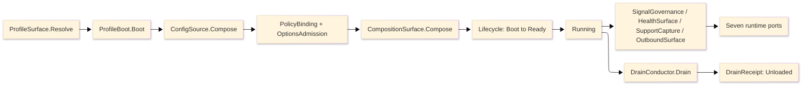

# [RASM_APPHOST_ARCHITECTURE]

The professional-domain folder-map of `Rasm.AppHost`, the APP-PLATFORM runtime spine: every concern is one sub-domain owner with closed cases, every entrypoint is a typed rail, and every cross-package fact crosses through one of the seven inward port records. The codemap names the full sub-domain structure — each one a real domain concept, never a rail/axis/lane file-naming scheme — so a planned-but-empty folder reads as a visible gap that fuels an idea or task. Mechanics live in the `.planning/` design pages; this map carries the structure, the boot-to-drain spine, and the boundary and prohibition law.

## [1]-[DOMAIN_MAP]

Each sub-domain mirrors one eventual source sub-tree. The charter is the concern the folder owns; the page list is the design pages that have landed under it.

```text codemap
Rasm.AppHost/
├── hosting/             Host-variance profile axis, lifetime adapters, resource identity, power/thermal fidelity, and the total lifecycle/phase/drain/cancellation spine.
│   ├── host-profiles.md
│   └── lifecycle-and-drain.md
├── time/                Injected clock pair (elapsed vs semantic), deadline taxonomy, and the one scheduler with cron/period rows, lease split, and missed-occurrence sweep.
│   └── time-and-deadlines.md
├── configuration/       Ranked config-source chain, fail-closed source-gen binding to frozen policy, reload-class-gated publish, operator kill-switch, and the one composition root that folds and freezes the service graph.
│   ├── configuration-and-options.md
│   └── composition-and-modules.md
│                         coordination: single-writer election with monotone fencing tokens is the `time/time-and-deadlines.md` `[FENCING_TOKEN]` row cluster over `SchedulePort`/`LeasePolicy.Maintenance`, never a sub-domain — identity/coordination concerns land as ROWS on the temporal owner.
├── resources/           Bounded runtime resource lanes: lane-keyed hybrid cache with stampede single-flight, delegate-row object pools, and bounded drainable queues with receipted loss.
│   └── resource-lanes.md
│                         secrets: the credential lifecycle (acquisition, deadline-class lease renewal, drain-time zeroization, rotation receipts) is the `configuration/configuration-and-options.md` `[SECRET_LEASE]` row cluster extending `ConfigSource.SecretsStore`, never a sub-domain — credential concerns land as ROWS on the configuration owner.
├── observability/       Unified four-signal telemetry (traces/metrics/logs/profiles) through minted identities, redaction at every egress, the resource-pressure health fold, the degradation/alert rails, and bounded redacted support capture.
│   ├── diagnostics-and-telemetry.md
│   ├── health-and-degradation.md
│   └── support-bundles.md
├── outbound/            The single outbound boundary: hop-case axis, one retry/cache owner per seam, standard/hedging HTTP and keyed non-HTTP Polly pipelines with Simmy chaos, companion discovery/UDS attach, and multi-channel delivery fan-out.
│   └── outbound-resilience.md
├── ports/               The seven inward port records — the only cross-package seam — the HLC-stamped receipt envelope, tenant/causal identity, and the Strict-JSON suite wire law with the TS dashboard projection.
│   └── runtime-ports.md
├── provisioning/        Post-fetch self-update state machine over the update manager, three-channel feed axis with downgrade policy, drain-before-swap rollover, and health-gated fleet-wide rolling-update waves.
│   └── provisioning-and-update.md
├── companion/           Multi-process modality axis (companion/sidecar/paired-peer), the inbound gRPC-over-UDS control-service host with peer-credential admission, cross-process degradation cascade, and the attached-peer presence roster.
│   └── companion-sidecar.md
├── capability/          The self-describing op catalog: typed CapabilityDescriptor rows projecting effect/idempotency/cost/permission, the shape-discriminated discovery fold, the commit-or-rollback command algebra, the grant/cost broker metering a typed permission × scope × ceiling × window predicate with a signed grant attestation, and polyglot C#/TS/Python SDK codegen off one descriptor source.
│   └── registry.md
├── agent/               The bidirectional agent surface over the capability registry: the MCP-server projection (descriptor-to-AIFunction tools/resources/prompts, brokered dry-run dispatch, sampling, elicitation, SSE-resumable streaming), the MCP-client federation that folds external servers' tools into the one registry as brokered descriptors, and the in-process reasoning runtime (IChatClient function-calling, embedding-ranked intent discovery, replayable transcript).
│   ├── mcp-projection.md
│   ├── tool-federation.md       (planned — consumes external MCP servers, folding peer tools/resources/prompts; T-AGENT-TOOL-FEDERATION)
│   └── reasoning-runtime.md     (planned — in-process agent loop + model governance: metered/cached/replayable IChatClient middleware; T-AGENT-REASONING-RUNTIME, T-GENAI-MODEL-GOVERNANCE)
├── sandbox/             Capability-brokered plugin isolation (wasmtime-dotnet WASM component-model + process), no-ambient-authority grant handles, per-plugin quota/kill/quarantine, fail-closed supply-chain attestation gate, and the seven-kind solver-plugin contract with canonical-representation negotiation.
│   ├── sandbox-host.md
│   └── solver-plugin.md
├── live-wire/           The reactive bidirectional external-binding studio: industrial-transport axis (OPC-UA/Modbus/MQTT/serial/REST/GraphQL/spreadsheet/ERP-PLM) over the certified OPC-UA + MQTTnet stack, the FluentModbus managed Modbus client, and the System.IO.Ports serial line, edge unit coercion through the Compute unit algebra, and transactional write-back with acknowledgement/rollback.
│   └── live-wire.md
└── determinism/         The reproducibility kernel: pinned RNG/float-mode/environment-fingerprint, the hash-chained content-addressed command log over the durable op-log, replay-verify with per-step content-hash proof, macro record/replay, and partial content-address recompute.
    └── determinism-and-replay.md
```

Implementation collapses to one owner per axis and one entrypoint family per rail: a new feature is a row or case on a budgeted owner, never a new surface, and a public type outside an owner region is the named defect. One rail per entrypoint, named in the return type — `Validation<E,T>` accumulates, `Fin<T>` aborts, `IO<T>` carries effects. Receipts stamp NodaTime `Instant`/`Duration`; `TimeProvider` owns elapsed measurement.

## [2]-[SPINE]



`ProfileSurface.Resolve` materializes the one `ResolvedProfile` record, `ProfileBoot.Boot` configures the Generic Host builder, `ConfigSource.Compose` mounts the ranked source chain, `PolicyBinding` and `OptionsAdmission` publish validated frozen policy, `CompositionSurface.Compose` folds the module table and freezes the graph, and the `Lifecycle` cell transitions to Ready then Running. Telemetry, health, support, and outbound rails run beside the cell and surface through the seven port records; `DrainConductor.Drain` folds ranked participants into one `DrainReceipt` ending at Unloaded.

## [3]-[BOUNDARIES]

- AppHost is not a domain service layer, job framework, DI wrapper, telemetry wrapper, UI package, persistence package, compute implementation, or host-boundary package.
- AppHost owns runtime state and policy; app roots own process attachment, host events, and app-root-only pins (OTLP exporter, the MCP HTTP transport, the WASM/industrial-protocol runtimes, Kestrel/gRPC surfaces, Serilog host bridge and sinks).
- Statement carve-outs are named per fence: `Lifecycle`, `FaultSpine`, `ConfigLayer`, `Applied`, `Bundle`, `Evict`, `Publish`, `Connect`, `Execute`, `EventLog.Append`, `SandboxRows.Load`, `SupplyChainGate.Admit`, and `PowerProbe.Read` are the boundary capsules; every other member stays expression-shaped on typed rails.
- AppHost owns the self-describing op catalog, command transaction, grant/cost broker, MCP projection, plugin sandbox, solver contract, reactive external binding, and reproducibility kernel as runtime-policy axes; op execution stays Compute, durability stays Persistence, the MCP protocol routes to the official SDK, and the WASM and industrial-protocol runtimes stay app-root-pinned host surfaces. The grant broker owns permission-shape evaluation as its own typed `PermissionShape` × `GrantScope` value-object predicate.
- Sentinels stop at the admission seam: `ClockPolicy.Admit` projects platform defaults to `Option<Instant>`; interiors never see nulls, sentinels, or provider shapes.
- AppHost owns support trigger and correlation; contributing packages own artifact classification and payload projection through `SupportContributorPort` rows.
- Lib level emits `ILogger` and minted `ActivitySource`/`Meter` pairs only; exporter projection belongs to composition roots.

## [4]-[PROHIBITIONS]

The closed NEVER list — the deleted patterns the owner regions foreclose.

- NEVER a public type outside a sub-domain owner region; an eighth port record is the named defect.
- NEVER wrappers, rename adapters, helper or utility files, or thin forwarding surfaces over admitted packages.
- NEVER a generic receipt, ledger, or reported-value abstraction; every receipt stays its typed record.
- NEVER a second state machine, shutdown flag, or sibling phase enum beside `Lifecycle`; never a free-floating `CancellationTokenSource` below the `CancelScope` spine.
- NEVER `DateTime.UtcNow`, `DateTime.Now`, or direct `Stopwatch` call sites; `ClockPolicy` owns both clocks, and sentinels project to `Option<T>` at the admission seam.
- NEVER a bare duration literal; every bound traces to a `DeadlineClass` row or a page policy table.
- NEVER a second scheduler, a second cache owner, or a second retry owner on one seam; database retry stays at the Persistence execution strategy.
- NEVER ambient `IConfiguration` reads past bootstrap or interior `IOptions` handles; interiors read frozen policy records published at ready.
- NEVER `AddSingleton`/`AddScoped`/`AddTransient`/`AddKeyed*` descriptor spellings or closure-walking scans; `Describe`/`DescribeKeyed` rows and `FromAssemblies` only.
- NEVER a process-static `Meter` or `ActivitySource` outliving its provider; never Serilog types below composition roots; never OTLP exporter pins below service app roots.
- NEVER a hand-written STJ converter beside the generated Thinktecture and NodaTime converters; never an unredacted classified value at an exporter or bundle seam.
- NEVER posix traps or single-instance enforcement on plugin rows; host-attach injection drives phases there.
- NEVER a hand-rolled MCP JSON-RPC transport beside the official SDK, or a hand-rolled OPC-UA/MQTT/Modbus/serial/WASM client beside the certified stack (OPC-UA + MQTTnet + FluentModbus + System.IO.Ports + wasmtime-dotnet); a federated external MCP server's tools, resources, and prompts enter only as brokered `CapabilityDescriptor` rows through the one registry, never as an unbrokered side channel or a second tool catalog, and the in-process reasoning loop reuses the one brokered `CommandAIFunction` tool-adoption seam, never a second tool projection.
- NEVER an opaque model call: every `IChatClient` invocation (the in-process reasoning loop and the MCP server-sampling leg) composes the one `Microsoft.Extensions.AI` middleware pipeline — a model call is metered in `CostUnit.ModelTokens` through the `GrantBroker`, content-cached over the resources-lane `HybridCache`, traced through the GenAI span, and content-addressed into the `EventLog`; a second model cache, a per-call OTel span beside the decorators, or an unmetered un-ledgered model draw is the deleted form.
- NEVER a second op-metadata owner beside `CapabilityDescriptor`, a second permission-and-cost owner beside `GrantBroker`, an in-process third-party plugin outside the WASM/process isolation boundary, or a plugin-private geometry representation; a plugin speaks the Compute canonical `EncodedTensor` and dispatches through the command algebra.
- NEVER a second RNG or non-chained event log: `DeterminismContext` owns the seed and float mode, `EventLog` is the single hash-chained content-addressed command log riding the durable `OpLog`.
- NEVER a second notification sender, external-binding poller, alerting owner, or power monitor: `DeliveryFanout`, `ExternalTransport`/`LiveWire`, `AlertEngine`, and `FidelityScale` are read consumers of the existing hop/health/power signals, never parallel state machines.
- CSP analyzer diagnostics are architecture pressure: fix the shape, refine the rule on a false positive, never suppress.
