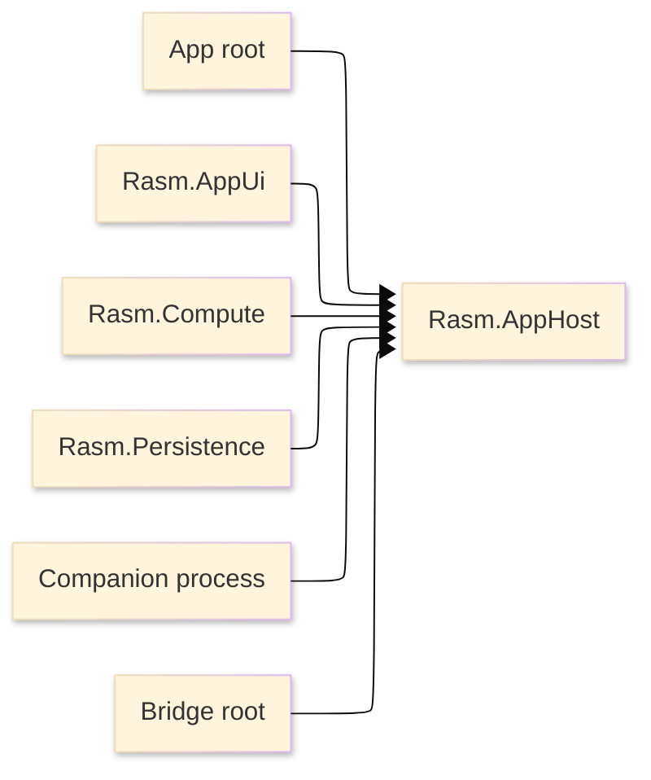

# [RASM_APPHOST_ARCHITECTURE]

`Rasm.AppHost` owns the runtime spine for app packages. The package is a
manifest-backed project node with no production source; this page defines the
architecture that source must enter.

## [1]-[SYSTEM_SCOPE]

Text equivalent: app roots, AppUi, Compute, Persistence, companion processes,
and bridge roots consume AppHost runtime policy. AppHost stays below implementation
packages and host-boundary assemblies.

## [2]-[PROJECT_IDENTITY]

| [INDEX] | [FACT]             | [VALUE]                               |
| :-----: | :----------------- | :------------------------------------ |
|   [1]   | Project file       | `Rasm.AppHost.csproj`                 |
|   [2]   | Target framework   | inherited from repository build props |
|   [3]   | Source state       | no production `.cs` files             |
|   [4]   | Direct packages    | runtime and companion bootstrap set   |
|   [5]   | Inherited packages | workspace functional substrate        |

## [3]-[DEPENDENCY_DIRECTION]

| [INDEX] | [PROJECT]          | [MAY_REFERENCE_APPHOST] | [APPHOST_MAY_REFERENCE] | [BOUNDARY]                         |
| :-----: | :----------------- | :---------------------: | :---------------------: | :--------------------------------- |
|   [1]   | `Rasm`             |           no            |           no            | kernel remains below app packages  |
|   [2]   | `Rasm.AppUi`       |           yes           |           no            | UI adapts runtime scheduling       |
|   [3]   | `Rasm.Compute`     |           yes           |           no            | execution consumes runtime policy  |
|   [4]   | `Rasm.Persistence` |           yes           |           no            | store drain and support adapt      |
|   [5]   | host packages      |        app root         |           no            | native APIs stay host-owned        |
|   [6]   | companion process  |           yes           |           no            | bootstrap uses the same state rail |

Architecture tests load AppHost when source enters the architecture-test surface. Manifest review enforces the documented dependency law before source exists.

## [4]-[RUNTIME_RAIL]

| [INDEX] | [CAPABILITY]   | [LOCAL_RAIL] | [CONTRACT]                            |
| :-----: | :------------- | :----------- | :------------------------------------ |
|   [1]   | Cancellation   | lifecycle    | one root token and child scopes       |
|   [2]   | Time           | lifecycle    | elapsed spans, delays, deadlines      |
|   [3]   | Semantic clock | receipts     | persisted and audited instants        |
|   [4]   | Observability  | telemetry    | activities, meters, counters          |
|   [5]   | Health         | projection   | typed capability health               |
|   [6]   | Degradation    | policy       | usable failure state and receipts     |
|   [7]   | Support export | support      | bounded correlated artifact capture   |
|   [8]   | Companion boot | composition  | host, DI, options, export, validation |
|   [9]   | Outbound hops  | resilience   | one retry owner per remote boundary   |

Capabilities are available only through typed state. AppHost never represents
missing runtime material as `null`, ambient singleton lookup, implementation import,
or provider-branded public vocabulary.

## [5]-[CATALOGUE_TRUTH]

Package API facts live in [.reports/api](.reports/api/README.md). Architecture
names package ownership and dependency direction; catalogue pages carry package
assemblies, namespaces, usings, type families, operation families, and package-local
admission cards.

Package catalogue pages capture external API facts. Architecture captures AppHost law and never repeats package member lists, package history, or generated lookup tables.

## [6]-[SOURCE_SHAPE_LAW]

- AppHost source enters as one runtime spine with lifecycle, policy, composition, observability, health, support, and outbound-hop owners.
- Folder architecture is planned before production source: owner folders, rail entrypoints, generated shapes, receipts, state transitions, and boundary adapters are named together.
- Runtime capability deepens the owning rail through policy values, typed ports, receipts, and folds before any new public surface is added.
- Flat feature files, provider-branded services, local wrapper classes, ambient singleton lookups, and parallel lifecycle systems are rejected.

## [7]-[BOUNDARIES]

- AppHost owns runtime state and policy; app roots own process attachment and host events.
- AppHost owns BCL diagnostic identities; companion bootstrap owns exporter projection.
- AppHost owns outbound-hop policy; lower packages emit conflict evidence instead of stacking retry loops.
- AppHost owns support trigger and correlation; contributing packages own artifact classification and payload projection.
