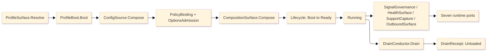

# [RASM_APPHOST_ARCHITECTURE]

`Rasm.AppHost` is one runtime spine: every concern is an axis owner with closed cases, every entrypoint is a typed rail, and every cross-package fact crosses through one of seven port records. Mechanics live in the finalized `.planning/` pages; this page is the atlas — the implementation source tree, the owner registry (the one owner-state surface), dependency direction, cross-package seams, the boot-to-drain spine, and the boundaries and prohibitions.

## [1]-[SOURCE_TREE]

The planned namespaced implementation layout IS the build order: each leaf is one transcription unit, vocabulary owners before consumers, shapes before rails, rails before dispatch, boundaries before composition. Each leaf is annotated with the owners it transcribes and the owning page#cluster; sub-folders group the flat file set by concern axis.

```text codemap
Rasm.AppHost/
├── Time/
│   └── Time.cs                      # ClockPolicy, DeadlineClass, ScheduleEntry — time-and-deadlines#CLOCK_SPLIT, #DEADLINE_TAXONOMY, #SCHEDULE_PORT
├── Hosting/
│   ├── Profiles.cs                  # HostProfile, ProfileBoot, ProfileIdentity — host-profiles#PROFILE_AXIS, #LIFETIME_ADAPTERS, #RESOURCE_IDENTITY
│   └── Lifecycle.cs                 # RuntimePhase, PhaseTrigger, Lifecycle, FaultSource, DrainBand, CancelScope — lifecycle-and-drain#PHASE_FAMILY, #FAULT_SPINE, #DRAIN_CONDUCTOR, #CANCEL_SPINE
├── Configuration/
│   ├── Configuration.cs             # ConfigSource, ConfigError, ReloadOutcome, OperatorOverride — configuration-and-options#SOURCE_AXIS, #TYPED_BINDING, #POLICY_VALUES, #KILL_SWITCH
│   └── Composition.cs               # ModuleContribution, CompositionSurface, BoundaryActivation — composition-and-modules#MODULE_TABLE, #SCAN_AND_DECORATE, #BOUNDARY_ACTIVATION
├── Resources/
│   └── ResourceLanes.cs             # CacheLane, PoolPolicy<T>, DrainQueue<T> — resource-lanes#CACHE_PORT, #OBJECT_POOLS, #DRAIN_QUEUES
├── Observability/
│   ├── Diagnostics.cs               # TelemetrySource, Correlation, TraceContext, LogPipeline, TelemetrySignal, DataClassification — diagnostics-and-telemetry#TELEMETRY_IDENTITY, #CORRELATION_SPINE, #LOG_PROJECTION, #SIGNAL_GOVERNANCE, #REDACTION_TAXONOMY
│   ├── Health.cs                    # HealthContributorRow, Capability, DegradationLevel, WireHealthRow — health-and-degradation#HEALTH_FOLD, #DEGRADATION_RAIL, #WIRE_HEALTH
│   └── Support.cs                   # SupportTrigger, SupportReceipt — support-bundles#TRIGGER_UNION, #CAPTURE_PIPELINE, #MANIFEST_RECEIPT
├── Outbound/
│   └── Outbound.cs                  # OutboundHop, HopFault, HopOutcome, OutboundSurface, DiscoveryManifest — outbound-resilience#HOP_AXIS, #HTTP_PIPELINES, #KEYED_PIPELINES, #OWNERSHIP_LAW, #DISCOVERY_ATTACH
├── Ports/
│   └── Ports.cs                     # ReceiptSinkPort + six siblings, TenantId, TenantContext, AppHostWireContext — runtime-ports#PORT_RECORDS, #WIRE_LAW
├── Provisioning/
│   └── Provisioning.cs              # UpdatePhase, UpdateChannel, UpdateRail, RolloverDrain, FleetRoll — provisioning-and-update#UPDATE_RAIL, #CHANNEL_AXIS, #ROLLOVER_DRAIN
├── Companion/
│   └── Companion.cs                 # ProcessModality, PeerRoster, ControlInbound, ServiceHost, DegradationCascade, PeerAdmission — companion-sidecar#PROCESS_MODALITY, #CONTROL_SERVICE, #SERVICE_HOST, #DEGRADATION_CASCADE, #PEER_ADMISSION
├── Capability/
│   └── CapabilityRegistry.cs        # CapabilityDescriptor, CapabilityRegistry, CommandAlgebra, GrantBroker, SdkCodegen — capability-registry#DESCRIPTOR_AXIS, #DISCOVERY_FOLD, #COMMAND_ALGEBRA, #GRANT_BROKER, #SDK_CODEGEN
├── Determinism/
│   └── Determinism.cs               # DeterminismContext, EventLog, ReplayVerify, MacroEngine, RecomputeGraph — determinism-and-replay#DETERMINISM_KERNEL, #EVENT_LOG, #REPLAY_VERIFY, #MACRO_ENGINE, #RECOMPUTE_GRAPH
├── Agent/
│   └── Mcp.cs                       # McpMethod, ToolProjection, McpDispatch, StreamProgress — mcp-projection#METHOD_AXIS, #TOOL_DISPATCH, #STREAM_PROGRESS
├── Sandbox/
│   ├── Sandbox.cs                   # SandboxIsolation, GrantHandle, QuotaControl, SupplyChainGate — sandbox-host#ISOLATION_AXIS, #GRANT_HANDLE, #QUOTA_CONTROL, #SUPPLY_CHAIN
│   └── SolverPlugin.cs              # SolverKind, SolverPluginContract, SolverHosting — solver-plugin#SOLVER_KIND, #PLUGIN_CONTRACT, #SOLVER_HOSTING
└── LiveWire/
    └── LiveWire.cs                  # ExternalTransport, BindingSpec, LiveWire, WriteBackSurface, BindingHealth — live-wire#TRANSPORT_AXIS, #BINDING_SPEC, #WRITE_BACK, #BINDING_HEALTH
```

`Ports.cs` lands before the two inbound files because `AppHostWireContext` rows reference receipts every earlier file declares. `Outbound.cs` transcribes `outbound-resilience.md` including its DISCOVERY_ATTACH cluster: the `LocalIpc` hop case carries the `DiscoveryManifest` payload and `Discovery.Connect` consumes `GrpcChannelPolicy`, so discovery is one symbol closure in one file. `Provisioning.cs` owns the post-fetch update state machine over `UpdateManager`; the `UpdateCheck` detect-leg stays at `Outbound.cs`. `Companion.cs` lands last among the runtime files: it is the inbound serving counterpart to `Outbound.cs`, composing `Discovery`/`CompanionChild`/`GrpcChannelPolicy` (Outbound), `DegradationCell` (Health), `OptionsAdmission` (Configuration), and `SupportCapture` (Support) without re-declaring them. `DrainQueue` is the AppHost lane name; `WorkLane` stays at Compute. The six capability-and-extension files land after `Companion.cs`: `CapabilityRegistry.cs` is the self-describing op catalog generated from the canonical Compute op surfaces; `Determinism.cs` is the reproducibility kernel and content-addressed event log riding the Persistence `OpLog`; `Mcp.cs`, `Sandbox.cs`, `SolverPlugin.cs`, and `LiveWire.cs` are each a projection of or a consumer of the registry. The WASM component-model runtime and the industrial-protocol clients enter only at service or plugin-host app roots behind the app-root pin. TS_PROJECTION clusters carry no C# build row; they transcribe into the TS workspace at web app-root creation.

## [2]-[OWNER_REGISTRY]

The single owner-state surface for the package. Implementation collapses to one owner per axis and one entrypoint family per rail; density means no parallel rails, no near-duplicate shapes, no re-derived logic — a file is as large as its owner's concern requires, never trimmed to a line count. A new feature is a row or case, never a new surface; a public type outside these owner regions is the named defect. `[STATE]` is `FINALIZED` where the owner is a transcription-complete fence with no open gate, `SPIKE` where the owner is fence-complete but its proof carries a residual native/bridge/live-server probe named in the page RESEARCH cluster; a SPIKE owner is fully shaped now, never a deferred surface. This is the ONLY place owner state lives.

| [INDEX] | [AXIS/RAIL]             | [OWNER]                          | [KIND]                  | [CASES]                                                     | [PAGE#CLUSTER]                               |  [STATE]  |
| :-----: | :---------------------- | :------------------------------- | :---------------------- | :--------------------------------------------------------- | :------------------------------------------- | :-------: |
|   [1]   | host variance           | `HostProfile`                    | `[SmartEnum<string>]`   | 8 rows                                                      | host-profiles#PROFILE_AXIS                   | FINALIZED |
|   [2]   | lifetime adapters       | `ProfileBoot`                    | static fold             | 6 delegate targets; `ServiceNotify`/`MirrorService`/`Emit` mirror sub-surface | host-profiles#LIFETIME_ADAPTERS | SPIKE     |
|   [3]   | resource identity       | `ProfileIdentity`                | static fold             | 5 attribute rows; `HostResourceDetector` sub-surface       | host-profiles#RESOURCE_IDENTITY              | FINALIZED |
|   [4]   | phase family            | `RuntimePhase`                   | `[SmartEnum<string>]`   | 8 rows                                                      | lifecycle-and-drain#PHASE_FAMILY             | FINALIZED |
|   [5]   | trigger vocabulary      | `PhaseTrigger`                   | `[Union]`               | 10 cases                                                    | lifecycle-and-drain#PHASE_FAMILY             | FINALIZED |
|   [6]   | transition cell         | `Lifecycle`                      | boundary capsule        | 1 CAS entry                                                 | lifecycle-and-drain#PHASE_FAMILY             | FINALIZED |
|   [7]   | fault spine             | `FaultSource`                    | `[Union]`               | 4 cases                                                     | lifecycle-and-drain#FAULT_SPINE              | FINALIZED |
|   [8]   | drain bands             | `DrainBand`                      | `[SmartEnum<int>]`      | 4 rows                                                      | lifecycle-and-drain#DRAIN_CONDUCTOR          | FINALIZED |
|   [9]   | cancellation spine      | `CancelScope`                    | record capsule          | 1 root                                                     | lifecycle-and-drain#CANCEL_SPINE             | FINALIZED |
|  [10]   | clock seam              | `ClockPolicy`                    | record                  | 2 admissions                                                | time-and-deadlines#CLOCK_SPLIT               | FINALIZED |
|  [11]   | deadline taxonomy       | `DeadlineClass`                  | `[SmartEnum<string>]`   | 9 rows                                                      | time-and-deadlines#DEADLINE_TAXONOMY         | FINALIZED |
|  [12]   | schedule port           | `ScheduleEntry`                  | record port             | 4 `OccurrenceSpec` cases; `CronCadence` jitter axis, `Spread` seed | time-and-deadlines#SCHEDULE_PORT      | FINALIZED |
|  [13]   | config sources          | `ConfigSource`                   | `[SmartEnum<string>]`   | 8 rows                                                      | configuration-and-options#SOURCE_AXIS        | FINALIZED |
|  [14]   | binding faults          | `ConfigError`                    | `[Union]` fault         | 7 cases                                                     | configuration-and-options#TYPED_BINDING      | FINALIZED |
|  [15]   | reload rail             | `ReloadOutcome`                  | `[Union]`               | 4 cases                                                     | configuration-and-options#POLICY_VALUES      | FINALIZED |
|  [16]   | kill switch             | `OperatorOverride`               | `[Union]`               | 2 cases                                                     | configuration-and-options#KILL_SWITCH        | FINALIZED |
|  [17]   | module table            | `ModuleContribution`             | record row              | 1 row per package; `DecorationRow` column                   | composition-and-modules#MODULE_TABLE         | FINALIZED |
|  [18]   | composition fold        | `CompositionSurface`             | static fold             | 1 receipted entry                                           | composition-and-modules#SCAN_AND_DECORATE    | FINALIZED |
|  [19]   | boundary activation     | `BoundaryActivation`             | static surface          | 1 entry family                                              | composition-and-modules#BOUNDARY_ACTIVATION  | FINALIZED |
|  [20]   | cache lanes             | `CacheLane`                      | `[SmartEnum<string>]`   | 3 rows                                                      | resource-lanes#CACHE_PORT                    | FINALIZED |
|  [21]   | object pools            | `PoolPolicy<T>`                  | policy row              | 1 row per type; `Pools` registration sub-surface           | resource-lanes#OBJECT_POOLS                  | FINALIZED |
|  [22]   | drain queues            | `DrainQueue<T>`                  | `[Union]`               | 2 cases; `DrainKind` 5-row topology, `DrainSurface` builders | resource-lanes#DRAIN_QUEUES                | FINALIZED |
|  [23]   | telemetry identity      | `TelemetrySource`                | `[SmartEnum<string>]`   | 6 rows                                                      | diagnostics-and-telemetry#TELEMETRY_IDENTITY | FINALIZED |
|  [24]   | correlation spine       | `Correlation`                    | static surface          | 1 boot mint; `RootEnricher`/`CausalEnricher` seats         | diagnostics-and-telemetry#CORRELATION_SPINE  | FINALIZED |
|  [25]   | log arbitration         | `LogPipeline`                    | `[SmartEnum<string>]`   | 2 rows; `SpineLossFold` listener, `HostTags` provider      | diagnostics-and-telemetry#LOG_PROJECTION     | FINALIZED |
|  [26]   | signal governance       | `TelemetrySignal`                | `[SmartEnum<string>]`   | 3 rows; `LatencyCheckpoint`/`LatencySpine` carrier         | diagnostics-and-telemetry#SIGNAL_GOVERNANCE  | FINALIZED |
|  [27]   | classification taxonomy | `DataClassification`             | `[SmartEnum<string>]`   | 7 rows; `RedactorKind` column, `RedactionRegistration` fold | diagnostics-and-telemetry#REDACTION_TAXONOMY | FINALIZED |
|  [28]   | health fold             | `HealthContributorRow`           | record row + probe      | 4 tag families; `PressurePolicy` `ResourceQuota` grade, `UtilizationCell` MeterListener seat | health-and-degradation#HEALTH_FOLD | FINALIZED |
|  [29]   | capability vocabulary   | `Capability`                     | `[SmartEnum<string>]`   | 6 rows                                                      | health-and-degradation#DEGRADATION_RAIL      | FINALIZED |
|  [30]   | degradation rail        | `DegradationLevel`               | `[SmartEnum<string>]`   | 5 rows                                                      | health-and-degradation#DEGRADATION_RAIL      | FINALIZED |
|  [31]   | wire health             | `WireHealthRow`                  | record row              | 1 row per service                                          | health-and-degradation#WIRE_HEALTH           | FINALIZED |
|  [32]   | support triggers        | `SupportTrigger`                 | `[Union]`               | 6 cases                                                     | support-bundles#TRIGGER_UNION                | FINALIZED |
|  [33]   | support receipts        | `SupportReceipt`                 | `[Union]`               | 3 cases                                                     | support-bundles#MANIFEST_RECEIPT             | FINALIZED |
|  [34]   | hop axis                | `OutboundHop`                    | `[Union]`               | 7 cases                                                     | outbound-resilience#HOP_AXIS                 | FINALIZED |
|  [35]   | hop faults              | `HopFault`                       | `[Union]` fault         | 7 cases                                                     | outbound-resilience#HOP_AXIS                 | FINALIZED |
|  [36]   | hop outcomes            | `HopOutcome`                     | `[Union]`               | 3 cases                                                     | outbound-resilience#OWNERSHIP_LAW            | FINALIZED |
|  [37]   | discovery attach        | `DiscoveryManifest`              | record + static surface | 1 manifest law                                             | outbound-resilience#DISCOVERY_ATTACH         | SPIKE     |
|  [38]   | runtime ports           | `ReceiptSinkPort` + six siblings | sealed records          | 7 ports                                                    | runtime-ports#PORT_RECORDS                   | FINALIZED |
|  [39]   | wire law                | `AppHostWireContext`             | JsonSerializerContext   | 9 contract rows; `NodaPatterns` sub-surface                | runtime-ports#WIRE_LAW                       | FINALIZED |
|  [40]   | update phases           | `UpdatePhase`                    | `[SmartEnum<string>]`   | 5 rows; `UpdateOutcome`/`UpdateFault` unions, `UpdateMetrics` partial | provisioning-and-update#UPDATE_RAIL | FINALIZED |
|  [41]   | update rail             | `UpdateRail`                     | boundary capsule        | 1 `UpdateManager` handle; `Stage`/`Rollover`/`Resume` rails | provisioning-and-update#UPDATE_RAIL          | FINALIZED |
|  [42]   | update channels         | `UpdateChannel`                  | `[SmartEnum<string>]`   | 3 rows; feed/explicit-channel/downgrade columns            | provisioning-and-update#CHANNEL_AXIS         | FINALIZED |
|  [43]   | rollover drain          | `RolloverDrain`                  | static surface          | 1 drain-before-swap fold over `DrainConductor`             | provisioning-and-update#ROLLOVER_DRAIN       | FINALIZED |
|  [44]   | process modality        | `ProcessModality`                | `[SmartEnum<string>]`   | 3 rows; `ModalityRow` columns, `CompanionPeer` capsule     | companion-sidecar#PROCESS_MODALITY           | FINALIZED |
|  [45]   | control service host    | `ControlInbound`                 | static handler          | 3 verbs folding onto degradation/options/support owners    | companion-sidecar#CONTROL_SERVICE            | FINALIZED |
|  [46]   | service host            | `ServiceHost`                    | static surface          | gRPC registration; `ControlTransport` 1-case union (UDS)   | companion-sidecar#SERVICE_HOST               | FINALIZED |
|  [47]   | degradation cascade     | `DegradationCascade`             | static write surface    | 1 parent-to-child `Cascade` write; `CascadeReceipt`        | companion-sidecar#DEGRADATION_CASCADE        | SPIKE     |
|  [48]   | peer admission          | `PeerAdmission`                  | static accept-side read | 2 platform branches; `Ucred`/`Xucred`/`PeerCredential`     | companion-sidecar#PEER_ADMISSION             | FINALIZED |
|  [49]   | tenant context          | `TenantContext`                  | record port             | 4th cross-package primitive; `TenantId` `UInt128`, `TenantSlot` GUC | runtime-ports#PORT_RECORDS           | FINALIZED |
|  [50]   | trace context           | `TraceContext`                   | static fold             | W3C `traceparent`/`tracestate` propagation over the control hop | diagnostics-and-telemetry#CORRELATION_SPINE | FINALIZED |
|  [51]   | peer roster             | `PeerRoster`                     | record fold             | attached-peer/lease-epoch/presence roster; `RosterReceipt` | companion-sidecar#PROCESS_MODALITY           | FINALIZED |
|  [52]   | fleet roll              | `FleetRoll`                      | static surface          | health-gated rolling-update wave; `FleetRollReceipt`       | provisioning-and-update#ROLLOVER_DRAIN       | FINALIZED |
|  [53]   | power and fidelity      | `FidelityScale`                  | record + static probe   | `PowerState` 3-row, `ThermalPressure` 4-row, `PowerCell` seat, `PowerProbe` native read | host-profiles#POWER_AND_FIDELITY | SPIKE |
|  [54]   | delivery fan-out        | `DeliveryChannel`                | `[SmartEnum<string>]`   | 4 rows; `DeliveryMessage`/`DeliveryReceipt`, `DeliveryFanout` | outbound-resilience#DELIVERY_FANOUT        | FINALIZED |
|  [55]   | alert engine            | `AlertRule`                      | record + static fold    | `AlertSeverity` 4-row, `AlertCondition` 3-case, `AlertEngine` evaluate/backtest | health-and-degradation#ALERT_ENGINE | FINALIZED |
|  [56]   | descriptor axis         | `CapabilityDescriptor`           | record + static surface | `EffectClass`/`Idempotency`/`CostUnit` rows, `CostModel`/`PermissionShape`, `DescriptorSurface` fan-in | capability-registry#DESCRIPTOR_AXIS | FINALIZED |
|  [57]   | discovery fold          | `CapabilityRegistry`             | frozen catalog          | `DiscoveryQuery` 5-case, `DiscoveryResult`, alternate-lookup probe | capability-registry#DISCOVERY_FOLD    | FINALIZED |
|  [58]   | command algebra         | `CommandAlgebra`                 | static surface          | `CommandTxn` 4-case, `CommandFault`, `CommandReceipt`; commit-or-rollback over the Compute dispatch rail | capability-registry#COMMAND_ALGEBRA | FINALIZED |
|  [59]   | grant broker            | `GrantBroker`                    | record + static surface | `GrantScope`, `Consent` 4-case, `GrantFault`, `Budget` cell | capability-registry#GRANT_BROKER            | FINALIZED |
|  [60]   | SDK codegen             | `SdkCodegen`                     | static fold             | `SdkTarget` 3-row, `SdkArtifact`; one source, three emitters | capability-registry#SDK_CODEGEN            | FINALIZED |
|  [61]   | MCP method axis         | `McpMethod`                      | `[SmartEnum<string>]`   | 8 rows; `ToolProjection`/`McpCatalog`/`McpTool`/`McpResource`/`McpPrompt` | mcp-projection#METHOD_AXIS         | FINALIZED |
|  [62]   | MCP dispatch            | `McpDispatch`                    | static surface          | `McpFault`, `CostPreview`, `ToolResult`, `McpRuntime`      | mcp-projection#TOOL_DISPATCH                 | FINALIZED |
|  [63]   | MCP stream progress     | `StreamProgress`                 | static surface          | `ProgressFrame` 6-case, `ResumeToken`, `AgentSession` lease cell | mcp-projection#STREAM_PROGRESS         | SPIKE     |
|  [64]   | sandbox isolation       | `SandboxIsolation`               | `[SmartEnum<string>]`   | 2 rows; `SandboxRow`/`SandboxRows`, `PluginInstance`, `SandboxFault` | sandbox-host#ISOLATION_AXIS          | SPIKE     |
|  [65]   | grant handle            | `GrantHandle`                    | record + static surface | `BrokeredCall`, `GrantHandleSurface`; no-ambient-authority authority | sandbox-host#GRANT_HANDLE             | FINALIZED |
|  [66]   | quota control           | `QuotaShape`                     | record + static surface | `QuotaCell`, `Quarantine` 4-case, `QuotaControl`; kill/quarantine rail | sandbox-host#QUOTA_CONTROL          | FINALIZED |
|  [67]   | supply chain            | `SupplyChainGate`                | record + static surface | `PluginArtifact`/`Attestation`, `SemverGate`, `SupplyChainFault` | sandbox-host#SUPPLY_CHAIN             | SPIKE     |
|  [68]   | solver kind             | `SolverKind`                     | `[SmartEnum<string>]`   | 7 rows; `KindContract`/`KindContracts`, `SolverFault`      | solver-plugin#SOLVER_KIND                    | FINALIZED |
|  [69]   | plugin contract         | `SolverPluginContract`           | static surface          | `SolverManifest`/`OpDeclaration`; declared-op-to-descriptor projection | solver-plugin#PLUGIN_CONTRACT       | FINALIZED |
|  [70]   | solver hosting          | `SolverHosting`                  | static surface          | `HostedSolver`/`Negotiation`/`SolverHostingRuntime`        | solver-plugin#SOLVER_HOSTING                 | SPIKE     |
|  [71]   | external transport      | `ExternalTransport`              | `[SmartEnum<string>]`   | 8 rows; `ReadShape`, `TransportRow`/`TransportRows`, `WireFault`, `ExternalValue` | live-wire#TRANSPORT_AXIS         | SPIKE     |
|  [72]   | binding spec            | `BindingSpec`                    | record + static engine  | `BindingDirection` flags, `CoercedValue`, `LiveWire` engine; edge coercion over `QuantityFamily.Admit` | live-wire#BINDING_SPEC | FINALIZED |
|  [73]   | write-back              | `WriteBack`                      | `[Union]` + static      | 4 cases, `WriteReceipt`, `WriteBackSurface`               | live-wire#WRITE_BACK                         | FINALIZED |
|  [74]   | binding health          | `BindingState`                   | `[SmartEnum<string>]`   | 5 rows; `BindingHealth` into one `remote`-tagged contributor | live-wire#BINDING_HEALTH                   | FINALIZED |
|  [75]   | determinism kernel      | `DeterminismContext`             | record + static surface | `FloatMode` 3-row, `EnvFingerprint`, `DeterminismKernel`   | determinism-and-replay#DETERMINISM_KERNEL    | SPIKE     |
|  [76]   | event log               | `EventLog`                       | static surface          | `LogEntry`, `ContentHash`, hash-chain append/verify; projects to `OpLogEntry` | determinism-and-replay#EVENT_LOG | FINALIZED |
|  [77]   | replay verify           | `ReplayVerify`                   | static surface          | `ReplayOutcome` 4-case, `ReplayFault`, `ReplayRuntime`     | determinism-and-replay#REPLAY_VERIFY         | FINALIZED |
|  [78]   | macro engine            | `MacroEngine`                    | record + static surface | `Macro`/`MacroParameter`; parameterized atomic replay over `CommandAlgebra.Batch` | determinism-and-replay#MACRO_ENGINE | FINALIZED |
|  [79]   | recompute graph         | `RecomputeGraph`                 | static surface          | `RecomputeNode`, content-address dependency walk; unchanged-output prune | determinism-and-replay#RECOMPUTE_GRAPH | FINALIZED |

One rail per entrypoint, named in the return type: `Validation<ConfigError,T>` accumulates, `Fin<T>` aborts, `IO<T>` carries effects. Receipts stamp NodaTime `Instant` and `Duration`; `TimeProvider` owns elapsed measurement. The `[OWNER]` cell folds every extension block and mapping descriptor under its axis owner; comparer accessors stay package-local, one per axis owner.

## [3]-[DEPENDENCY_DIRECTION]

| [INDEX] | [PROJECT]          | [MAY_REFERENCE_APPHOST] | [APPHOST_MAY_REFERENCE] | [BOUNDARY]                          |
| :-----: | :----------------- | :---------------------: | :---------------------: | :---------------------------------- |
|   [1]   | `Rasm`             |           no            |           no            | kernel stays below app packages     |
|   [2]   | `Rasm.AppUi`       |           yes           |           no            | UI adapts `UiSchedulerPort`         |
|   [3]   | `Rasm.Compute`     |           yes           |           no            | execution consumes runtime policy   |
|   [4]   | `Rasm.Persistence` |           yes           |           no            | store drain and L2 rows adapt       |
|   [5]   | host packages      |        app root         |           no            | native APIs stay host-owned         |
|   [6]   | companion process  |           yes           |           no            | bootstrap rides the same state rail |

No sibling assembly enters the AppHost graph. Sibling registrations enter as `TryAddEnumerable` ordered descriptor rows on the seven ports; subscriptions return disposable detachers composed LIFO.

## [4]-[SEAMS]

Every two-package fact splits by altitude: mechanics live at the named AppHost cluster, consequences land at the consumer. Intra-language seams ride `pkg/page#CLUSTER`; the cross-language consequences ride the Tier-0 `region-map/seam-splits.md`.

| [INDEX] | [SEAM]                 | [MECHANICS_AT]                               | [CONSEQUENCE_AT]                                                               |
| :-----: | :--------------------- | :------------------------------------------- | :----------------------------------------------------------------------------- |
|   [1]   | HybridCache            | resource-lanes#CACHE_PORT                    | Persistence/cache-indexes#L2_CONTRIBUTION                                       |
|   [2]   | outbound retry         | outbound-resilience#KEYED_PIPELINES          | Compute/receipts-and-benchmarks conflict receipts; store retry stays at Persistence execution strategy |
|   [3]   | correlation            | diagnostics-and-telemetry#CORRELATION_SPINE  | every sibling signal; gRPC metadata on the UDS hop                             |
|   [4]   | drain order            | lifecycle-and-drain#DRAIN_CONDUCTOR          | sibling `DrainParticipantPort` registrations                                   |
|   [5]   | data classification    | diagnostics-and-telemetry#REDACTION_TAXONOMY | Persistence/redaction-retention#CLASSIFICATION_ENFORCEMENT                     |
|   [6]   | config reload          | configuration-and-options#POLICY_VALUES      | Persistence user-settings write; op-log HLC cursor                             |
|   [7]   | operator kill-switch   | configuration-and-options#KILL_SWITCH        | health-and-degradation#DEGRADATION_RAIL input; ControlService set-degradation verb |
|   [8]   | profile variance       | host-profiles#PROFILE_AXIS                   | siblings consume `ResolvedProfile`; no profile-keyed sibling table             |
|   [9]   | store paths            | host-profiles#RESOURCE_IDENTITY              | Persistence/store-profiles#PROFILE_AXIS consumes roots, never derives paths    |
|  [10]   | receipt sinks          | runtime-ports#PORT_RECORDS                   | Compute, Persistence, AppUi receipt projections                                |
|  [11]   | telemetry contribution | runtime-ports#PORT_RECORDS                   | Persistence tracer/meter rows; Compute `ActivitySource` rows                   |
|  [12]   | clock seam             | time-and-deadlines#CLOCK_SPLIT               | Persistence TTL/retention/HLC/lease stamps; Compute elapsed                    |
|  [13]   | wire vocabulary        | Compute/remote-lane#PROTO_VOCABULARY         | runtime-ports#WIRE_LAW suite merge + Tier-0 cross-language wire seam            |
|  [14]   | lane naming            | resource-lanes#DRAIN_QUEUES                  | `DrainQueue` here; `WorkLane` stays the Compute solve-path name                |
|  [15]   | tenant context         | runtime-ports#PORT_RECORDS                   | Persistence/server-tier#TENANCY_RLS + cache-key partition; never re-minted     |
|  [16]   | trace context          | diagnostics-and-telemetry#CORRELATION_SPINE  | W3C `traceparent`/`tracestate` over companion-sidecar gRPC metadata on the control hop |
|  [17]   | peer presence          | companion-sidecar#PROCESS_MODALITY           | Persistence/sync-collaboration#PRESENCE_AND_BLOB per `RosterReceipt` over the op-log changefeed |
|  [18]   | op catalog generation  | capability-registry#DESCRIPTOR_AXIS          | Compute op surfaces (`TensorOpFamily`, `ModelIdentity`, `ComputeEndpoint`, `QuantityFamily`) project descriptors; never a hand-listed catalog |
|  [19]   | command dispatch       | capability-registry#COMMAND_ALGEBRA          | Compute/intent-and-selection#INTENT_FAMILY executes; AppHost owns the transaction boundary, Compute owns substrate selection |
|  [20]   | event log durability   | determinism-and-replay#EVENT_LOG             | Persistence/sync-collaboration#OPLOG_CHANGEFEED stores each `LogEntry` as one `OpLogEntry` |
|  [21]   | host fingerprint       | determinism-and-replay#DETERMINISM_KERNEL    | Compute/receipts-and-benchmarks#BENCHMARK_CLAIMS `HostFingerprint`; one host identity |
|  [22]   | edge unit coercion     | live-wire#BINDING_SPEC                        | Compute/units-boundary#DIMENSIONAL_LAW `QuantityFamily.Admit`/`Render`         |
|  [23]   | solver representation  | solver-plugin#SOLVER_HOSTING                 | Compute/tensor-lane#GEOMETRY_ENCODING canonical `EncodedTensor`                 |
|  [24]   | compute fidelity       | host-profiles#POWER_AND_FIDELITY             | Compute/scheduling-and-lanes#CPU_BUDGET reads the `FidelityScale` parallelism cap |

## [5]-[SPINE]



Text equivalent: `ProfileSurface.Resolve` materializes the one `ResolvedProfile` record, `ProfileBoot.Boot` configures the Generic Host builder, `ConfigSource.Compose` mounts the ranked source chain, `PolicyBinding` and `OptionsAdmission` publish validated frozen policy, `CompositionSurface.Compose` folds the module table and freezes the graph, and the `Lifecycle` cell transitions to Ready then Running. Telemetry, health, support, and outbound rails run beside the cell and surface through the seven port records; `DrainConductor.Drain` folds ranked participants into one `DrainReceipt` ending at Unloaded.

## [6]-[BOUNDARIES]

- AppHost is not a domain service layer, job framework, DI wrapper, telemetry wrapper, UI package, persistence package, compute implementation, or host-boundary package.
- AppHost owns runtime state and policy; app roots own process attachment, host events, and app-root-only pins (OTLP exporter, Kestrel/gRPC surfaces, Serilog host bridge and sinks).
- Statement carve-outs are named per fence: `Lifecycle`, `FaultSpine`, `ConfigLayer`, `Applied`, `Bundle`, `Evict`, `Publish`, `Connect`, `Execute`, `EventLog.Append`, `SandboxRows.Load`, `SupplyChainGate.Admit`, and `PowerProbe.Read` are the boundary capsules; every other member stays expression-shaped on typed rails.
- AppHost owns the self-describing op catalog, command transaction, grant/cost broker, MCP projection, plugin sandbox, solver contract, reactive external binding, and reproducibility kernel as runtime-policy axes; op execution stays Compute, durability stays Persistence, and the WASM runtime and industrial-protocol clients stay app-root-pinned host surfaces.
- Sentinels stop at the admission seam: `ClockPolicy.Admit` projects platform defaults to `Option<Instant>`; interiors never see nulls, sentinels, or provider shapes.
- AppHost owns support trigger and correlation; contributing packages own artifact classification and payload projection through `SupportContributorPort` rows.
- Lib level emits `ILogger` and minted `ActivitySource`/`Meter` pairs only; exporter projection belongs to composition roots.

## [7]-[PROHIBITIONS]

The closed NEVER list — the deleted patterns the owner registry forecloses.

- NEVER a public type outside the OWNER_REGISTRY owner regions; an eighth port record is the named defect.
- NEVER wrappers, rename adapters, helper or utility files, or thin forwarding surfaces over admitted packages.
- NEVER a generic receipt, ledger, or reported-value abstraction; every receipt stays its typed record.
- NEVER a second state machine, shutdown flag, or sibling phase enum beside `Lifecycle`; never a free-floating `CancellationTokenSource` below the `CancelScope` spine.
- NEVER `DateTime.UtcNow`, `DateTime.Now`, or direct `Stopwatch` call sites; `ClockPolicy` owns both clocks, and sentinels project to `Option<T>` at the admission seam.
- NEVER a bare duration literal; every bound traces to a `DeadlineClass` row or a page policy table.
- NEVER a second scheduler, a second cache owner, or a second retry owner on one seam; database retry stays at the Persistence execution strategy.
- NEVER ambient `IConfiguration` reads past bootstrap or interior `IOptions` handles; interiors read frozen policy records published at ready.
- NEVER `AddSingleton`/`AddScoped`/`AddTransient`/`AddKeyed*` descriptor spellings or closure-walking scans; `Describe`/`DescribeKeyed` rows and `FromAssemblies` only.
- NEVER a process-static `Meter` or `ActivitySource` outliving its provider; never Serilog types below composition roots; never OTLP exporter pins below service app roots.
- NEVER a hand-written STJ converter beside the generated Thinktecture and NodaTime converters; never an unredacted classified value at an exporter or bundle seam.
- NEVER posix traps or single-instance enforcement on plugin rows; host-attach injection drives phases there.
- NEVER a second op-metadata owner beside `CapabilityDescriptor`, a second permission-and-cost owner beside `GrantBroker`, an in-process third-party plugin outside the WASM/process isolation boundary, or a plugin-private geometry representation; a plugin speaks the Compute canonical `EncodedTensor` and dispatches through the command algebra.
- NEVER a second RNG or non-chained event log: `DeterminismContext` owns the seed and float mode, `EventLog` is the single hash-chained content-addressed command log riding the durable `OpLog`.
- NEVER a second notification sender, external-binding poller, alerting owner, or power monitor: `DeliveryFanout`, `ExternalTransport`/`LiveWire`, `AlertEngine`, and `FidelityScale` are read consumers of the existing hop/health/power signals, never parallel state machines.
- CSP analyzer diagnostics are architecture pressure: fix the shape, refine the rule on a false positive, never suppress.
