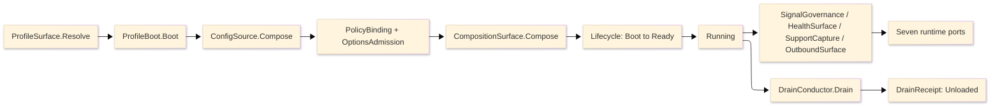

# [RASM_APPHOST_ARCHITECTURE]

The domain map of `Rasm.AppHost` — the APP-PLATFORM runtime spine. One domain-folder owner per concern with closed cases, every entrypoint a typed rail, and every cross-package fact crossing the inward port records across the Runtime, Agent, Wire, Sandbox, and Observability folders.

Each codemap node is the eventual source file its `.planning/` design page becomes, named in the language's own folder and file casing — PascalCase `.cs`, lowercase `.py`, lowercase `.ts`. Treat every node as realized code; the `.planning/` scaffold is the authoring substrate, never part of the map.

## [1]-[DOMAIN_MAP]

```text codemap
Rasm.AppHost/
├── Runtime/             # Runtime spine: profiles, lifecycle, clocks, resources, config, ports, determinism
│   ├── Profiles.cs      # Host-variance profile axis, lifetime adapters, power/thermal fidelity
│   ├── Lifecycle.cs     # Total lifecycle/phase/drain/cancellation spine
│   ├── Time.cs          # Injected clock pair, deadline taxonomy, and one scheduler
│   ├── Resources.cs     # Bounded resource lanes: hybrid cache, object pools, drainable queues
│   ├── Modules.cs       # One composition root folding and freezing service graph
│   ├── Config.cs        # Ranked config-source chain with fail-closed source-gen binding
│   ├── Ports.cs         # Seven inward port records — only cross-package seam
│   └── Determinism.cs   # Reproducibility kernel: pinned RNG/float-mode + hash-chained command log
├── Agent/               # Bidirectional agent surface over capability registry
│   ├── Mcp.cs           # MCP-server projection of descriptor-to-AIFunction tools/resources/prompts
│   ├── Reasoning.cs     # In-process agent loop over IChatClient function-calling
│   ├── Federation.cs    # Folds external MCP servers into one registry as brokered descriptors
│   └── Capability.cs    # Self-describing CapabilityDescriptor op catalog and command algebra
├── Wire/                # Outbound and external-binding seam
│   ├── Outbound.cs      # Single outbound boundary with per-seam retry/cache and delivery fan-out
│   ├── LiveWire.cs      # Reactive bidirectional external-binding studio over industrial-transport axis
│   └── Companion.cs     # Multi-process modality axis and gRPC-over-UDS control-service host
├── Sandbox/             # Capability-brokered plugin isolation and solver-plugin contract
│   ├── Isolation.cs     # Capability-brokered WASM/process plugin isolation with no-ambient-authority grants
│   ├── Solver.cs        # Seven-kind solver-plugin contract with canonical-representation negotiation
│   └── Provisioning.cs  # Post-fetch self-update state machine with health-gated rolling waves
└── Observability/       # Four-signal telemetry, health, and redacted support capture
    ├── Telemetry.cs     # Unified four-signal telemetry through minted identities and egress redaction
    ├── Health.cs        # Resource-pressure health fold and degradation/alert rails
    └── Bundles.cs       # Bounded redacted support capture
```

Implementation collapses to one owner per axis and one entrypoint family per rail: a new feature is a row or case on a budgeted owner, and a public type outside an owner region is the named defect. The rail is named in the return type — `Validation<E,T>` accumulates, `Fin<T>` aborts, `IO<T>` carries effects; receipts stamp NodaTime `Instant`/`Duration`, and `TimeProvider` owns elapsed measurement.

## [2]-[SEAMS]

```text seams
Agent/Capability.cs         →  typescript:interchange/codec         # [CONTENT_KEY]: CapabilityDescriptor command-shape
Runtime/Ports.cs            →  typescript:interchange/codec         # [CONTENT_KEY]: HLC two-half bigint round-trip parity
Runtime/Ports.cs            ⇄  python:runtime/execution             # [PORT]: CausalFrame Hlc two-half + Tenant
*                           →  typescript:services                  # [WIRE]: CredentialPemWire redacted carrier
*                           →  typescript:interchange               # [WIRE]: support-capture verb
Agent/Capability.cs         ⇄  python:runtime/transport             # [WIRE]: DiscoveryResult capability invoke + CommandReceipt
Observability/Health.cs     →  typescript:projection/evidence       # [WIRE]: DegradationLevel / CommandAvailabilityWire
Observability/Telemetry.cs  ←  python:runtime/observability         # [WIRE]: W3C trace-context inbound extraction
Observability/Telemetry.cs  →  typescript:ui/render                 # [WIRE]: BenchmarkClaimWire / HostFingerprintWire identity gate
Runtime/Config.cs           →  python:runtime/execution             # [WIRE]: CredentialPem
Runtime/Ports.cs            ⇄  python:runtime/transport             # [WIRE]: HLC two-half stamp + Tenant partition
Runtime/Ports.cs            →  typescript:projection/evidence       # [WIRE]: ReceiptEnvelopeWire / HlcStampWire / TenantContextWire
Wire/Livewire.cs            →  typescript:ui/render                 # [WIRE]: BindingStatusWire / CoercedValueWire / WriteReceiptWire
Observability/Telemetry.cs  →  typescript:platform/observability    # [TRANSPORT]: OtelExport OTLP egress
Runtime                     ←  csharp:Rasm/Geometry/Drawing         # [WIRE]: EncodedGeometry / PackOp.Apply channel discriminant
Runtime                     →  csharp:Rasm.AppUi/Editing/notebook   # [PORT]: DeterminismContext / CapabilityPin environment identity
Runtime                     →  csharp:Rasm.Persistence/Query/cache  # [PORT]: TenantId RLS + cache L2 partition
```

## [3]-[SPINE]



`ProfileSurface.Resolve` materializes the one `ResolvedProfile` record, `ProfileBoot.Boot` configures the Generic Host builder, `ConfigSource.Compose` mounts the ranked source chain, `PolicyBinding` and `OptionsAdmission` publish validated frozen policy, `CompositionSurface.Compose` folds the module table and freezes the graph, and the `Lifecycle` cell transitions to Ready then Running. Telemetry, health, support, and outbound rails run beside the cell and surface through the seven port records; `DrainConductor.Drain` folds ranked participants into one `DrainReceipt` ending at Unloaded.

## [4]-[BOUNDARIES]

- AppHost is not a domain service layer, job framework, DI wrapper, telemetry wrapper, UI package, persistence package, compute implementation, or host-boundary package.
- AppHost owns runtime state and policy; app roots own process attachment, host events, and app-root-only pins (OTLP exporter, the MCP HTTP transport, the WASM/industrial-protocol runtimes, Kestrel/gRPC surfaces, Serilog host bridge and sinks).
- Statement carve-outs are named per fence: `Lifecycle`, `FaultSpine`, `ConfigLayer`, `Applied`, `Bundle`, `Evict`, `Publish`, `Connect`, `Execute`, `EventLog.Append`, `SandboxRows.Load`, `SupplyChainGate.Admit`, and `PowerProbe.Read` are the boundary capsules; every other member stays expression-shaped on typed rails.
- AppHost owns the self-describing op catalog, command transaction, grant/cost broker, MCP projection, plugin sandbox, solver contract, reactive external binding, and reproducibility kernel as runtime-policy axes; op execution stays Compute, durability stays Persistence, the MCP protocol routes to the official SDK, and the WASM and industrial-protocol runtimes stay app-root-pinned host surfaces. The grant broker owns permission-shape evaluation as its own typed `PermissionShape` × `GrantScope` value-object predicate.
- Sentinels stop at the admission seam: `ClockPolicy.Admit` projects platform defaults to `Option<Instant>`; interiors never see nulls, sentinels, or provider shapes.
- AppHost owns support trigger and correlation; contributing packages own artifact classification and payload projection through `SupportContributorPort` rows.
- Lib level emits `ILogger` and minted `ActivitySource`/`Meter` pairs only; exporter projection belongs to composition roots.

## [5]-[PROHIBITIONS]

The closed NEVER list — the deleted patterns the owner regions foreclose.

- NEVER a public type outside a sub-domain owner region; an eighth port record is the named defect.
- NEVER wrappers, rename adapters, helper or utility files, or thin forwarding surfaces over admitted packages.
- NEVER a generic receipt, ledger, or reported-value abstraction; every receipt stays its typed record.
- NEVER a second state machine, shutdown flag, or sibling phase enum beside `Lifecycle`; never a free-floating `CancellationTokenSource` below the `CancelScope` spine.
- NEVER `DateTime.UtcNow`, `DateTime.Now`, or direct `Stopwatch` call sites; `ClockPolicy` owns both clocks, and sentinels project to `Option<T>` at the admission seam.
- NEVER a bare duration literal; every bound traces to a `DeadlineClass` row or a page policy table.
- NEVER a second scheduler, a second cache owner, or a second retry owner on one seam; database retry stays at the Persistence execution strategy.
- NEVER ambient `IConfiguration` reads past bootstrap or interior `IOptions` handles; interiors read frozen policy records published at ready.
- NEVER `AddSingleton`/`AddScoped`/`AddTransient`/`AddKeyed*` descriptor spellings or closure-walking scans; `Describe`/`DescribeKeyed` rows and `FromAssemblies` only.
- NEVER a process-static `Meter` or `ActivitySource` outliving its provider; never Serilog types below composition roots; never OTLP exporter pins below service app roots.
- NEVER a hand-written STJ converter beside the generated Thinktecture and NodaTime converters; never an unredacted classified value at an exporter or bundle seam.
- NEVER posix traps or single-instance enforcement on plugin rows; host-attach injection drives phases there.
- NEVER a hand-rolled MCP JSON-RPC transport beside the official SDK, or a hand-rolled OPC-UA/MQTT/Modbus/serial/WASM client beside the certified stack (OPC-UA + MQTTnet + FluentModbus + System.IO.Ports + wasmtime-dotnet); a federated external MCP server's tools, resources, and prompts enter only as brokered `CapabilityDescriptor` rows through the one registry, never as an unbrokered side channel or a second tool catalog, and the in-process reasoning loop reuses the one brokered `CommandAIFunction` tool-adoption seam, never a second tool projection.
- NEVER an opaque model call: every `IChatClient` invocation (the in-process reasoning loop and the MCP server-sampling leg) composes the one `Microsoft.Extensions.AI` middleware pipeline — a model call is metered in `CostUnit.ModelTokens` through the `GrantBroker`, content-cached over the resources-lane `HybridCache`, traced through the GenAI span, and content-addressed into the `EventLog`; a second model cache, a per-call OTel span beside the decorators, or an unmetered un-ledgered model draw is the deleted form.
- NEVER a second op-metadata owner beside `CapabilityDescriptor`, a second permission-and-cost owner beside `GrantBroker`, an in-process third-party plugin outside the WASM/process isolation boundary, or a plugin-private geometry representation; a plugin speaks the Compute canonical `EncodedTensor` and dispatches through the command algebra.
- NEVER a second RNG or non-chained event log: `DeterminismContext` owns the seed and float mode, `EventLog` is the single hash-chained content-addressed command log riding the durable `OpLog`.
- NEVER a second notification sender, external-binding poller, alerting owner, or power monitor: `DeliveryFanout`, `ExternalTransport`/`LiveWire`, `AlertEngine`, and `FidelityScale` are read consumers of the existing hop/health/power signals, never parallel state machines.
- CSP analyzer diagnostics are architecture pressure: fix the shape, refine the rule on a false positive, never suppress.
